<!-- ============================================================
     PROMPT SẢN XUẤT — COPY TOÀN BỘ NỘI DUNG FILE NÀY
     (từ dòng đầu tiên đến dòng cuối cùng) vào mô hình AI
     có khả năng đọc file và sinh văn bản dài.
     ============================================================ -->

# PROMPT SẢN XUẤT CẤP DOANH NGHIỆP
## Xây dựng bộ tài liệu hoàn chỉnh cho dự án:
## HỆ THỐNG HỖ TRỢ HỌC TẬP VÀ TRỰC QUAN HÓA CẤU TRÚC DỮ LIỆU VÀ GIẢI THUẬT (DSA)

---

# PHẦN 0 — VAI TRÒ, NHIỆM VỤ VÀ QUY TẮC LÀM VIỆC

## 0.1 Vai trò của bạn

Bạn là **Kiến trúc sư phần mềm cấp cao (Software Architect)** và **Chuyên gia phân tích nghiệp vụ (Business Analyst)** với hơn 15 năm kinh nghiệm, từng thiết kế nhiều hệ thống học tập trực tuyến (LMS), công cụ trực quan hóa giải thuật (như VisuAlgo, Algorithm Visualizer, Data Structure Visualizations của USFCA) và sản phẩm giáo dục được hàng chục nghìn sinh viên sử dụng.

Bạn được giao nhiệm vụ sản xuất **bộ tài liệu kỹ thuật hoàn chỉnh, cấp sản xuất (production-grade)** cho một dự án đồ án/ứng dụng thực tế. Bộ tài liệu này sẽ được dùng để:
- Làm hồ sơ bảo vệ đồ án / khóa luận.
- Làm tài liệu kỹ thuật cho đội ngũ phát triển triển khai thực tế.
- Làm tài liệu bàn giao, tài liệu vận hành và tài liệu người dùng cuối.

## 0.2 Quy trình làm việc bắt buộc

Bạn PHẢI thực hiện đúng quy trình sau, theo đúng thứ tự, không bỏ qua bước nào:

| Bước | Hành động | Kết quả |
|---|---|---|
| B1 | Đọc kỹ toàn bộ prompt này (18 phần). | Hiểu đầy đủ yêu cầu |
| B2 | Liệt kê lại các giả định quan trọng bạn đưa ra | Danh sách giả định (ghi ở đầu mỗi tài liệu) |
| B3 | Lập bảng ánh xạ yêu cầu → tài liệu (ma trận coverage) | Ma trận FR/NFR/UC ↔ file tài liệu |
| B4 | Viết SRS trước (nền tảng cho mọi tài liệu khác) | SRS.md |
| B5 | Viết SDD dựa trên SRS (mọi thiết kế phải truy ngược về FR/UC) | SDD.md |
| B6 | Viết API_REFERENCE dựa trên SDD | API_REFERENCE.md |
| B7 | Viết USER_GUIDE (chỉ dùng thuật ngữ người dùng, không thuật ngữ kỹ thuật) | USER_GUIDE.md |
| B8 | Viết TEST_PLAN (bám sát từng FR/NFR có tiêu chí chấp nhận) | TEST_PLAN.md |
| B9 | Viết DEPLOY.md và GLOSSARY.md | DEPLOY.md, GLOSSARY.md |
| B10 | Tự rà soát cuối: chạy checklist Phần 17.9, sửa mọi thiếu sót | Bản cuối cùng |

## 0.3 Quy tắc chất lượng tuyệt đối (KHÔNG ĐƯỢC VI PHẠM)

1. **KHÔNG có placeholder**: mọi chỗ trống `[...]`, `TODO`, `XXX`, `vd: ...` đều bị cấm. Nếu thiếu thông tin, tự quyết định hợp lý và ghi vào mục "Quyết định thiết kế" kèm lý do.
2. **KHÔNG viết chung chung**: mỗi yêu cầu, use case, endpoint, bảng dữ liệu, màn hình phải đủ chi tiết để lập trình viên triển khai mà KHÔNG cần hỏi lại.
3. **Toàn bộ văn bản bằng TIẾNG VIỆT** (trừ mã nguồn, tên định danh, từ tiếng Anh chuẩn ngành — giữ nguyên).
4. **Mọi ID phải nhất quán xuyên suốt**: FR-x.y, NFR-x, UC-xx, API-xx, TB-xx, TEST-xx. Tài liệu này là nguồn gốc duy nhất (single source of truth) của các ID.
5. **Mọi bảng số liệu phải có dữ liệu cụ thể**: không để ô trống.
6. **Sơ đồ phải dùng Mermaid** (mermaid v10): graph/flowchart, classDiagram, erDiagram, sequenceDiagram, stateDiagram-v2. Mỗi sơ đồ phải đi kèm 1 đoạn giải thích bằng lời.
7. **Tính nhất quán giữa các tài liệu**: tên bảng, tên trường, tên endpoint, ID yêu cầu phải trùng khớp 100% giữa SRS, SDD, API_REFERENCE, TEST_PLAN.
8. **Số liệu tham chiếu chéo**: mỗi mục trong SDD phải ghi chú nguồn FR/UC tương ứng; mỗi test case phải ghi FR tương ứng.
9. **Định dạng Markdown chuẩn**: dùng bảng, danh sách, code block; header theo cấp hợp lý; không dùng HTML tùy tiện.
10. **Độ dài thực tế**: mỗi tài liệu phải đạt độ dài tối thiểu quy định ở Phần 17.2. Nếu bạn kết thúc sớm nghĩa là bạn đã bỏ sót chi tiết — hãy bổ sung.

## 0.5 BÀI HỌC TỪ BUỔI BẢO VỆ BẢN CŨ (BẮT BUỘC TUÂN THỦ — đọc trước khi viết tài liệu)

Bản cũ (VisualizationDSA) bị hội đồng chặt chém vì 2 lỗi gốc. Bản mới PHẢI khắc phục triệt để:

| # | Phản hồi hội đồng | Cách khắc phục trong bộ tài liệu này |
|---|---|---|
| 1 | "Cho code đến đâu, chạy visual đến đó" — bản cũ hardcode hoạt ảnh từng giải thuật nên code vòng lặp cũng không chạy được | Kiến trúc EDV (Phần 8.0): MỌI giải thuật là mã thật chạy qua StepExecutor, hoạt ảnh = phát lại trace thật; Module I cho người học chạy code của mình (FR-9.1 → 9.5) |
| 2 | Thiết kế màn hình chắp vá — một màn gộp 4 thứ (học + visual + code + quiz), không rõ ràng | Nguyên tắc "1 màn = 1 việc" (Phần 7.0): danh sách -> chi tiết -> mở trang riêng cho mô phỏng / code / bài tập; cấm nhúng chức năng chéo màn |
| 3 | Scope trôi dạt, tính năng ngoài tầm đồ án (payment, realtime...) | Phần 2.2 loại trừ rõ + Roadmap 3 giai đoạn; module mới chỉ thêm khi đúng chủ đề học tập DSA |

Khi viết SRS/SDD: trình bày lại bảng này ở phần Mở đầu (mục "Bối cảnh và bài học kinh nghiệm") — hội đồng thấy rõ bạn đã hiểu vấn đề và thiết kế mới giải quyết chúng.

## 0.4 Đối tượng độc giả của từng tài liệu

| Tài liệu | Độc giả chính | Mức kỹ thuật |
|---|---|---|
| SRS.md | Giảng viên hướng dẫn, hội đồng chấm, PM, BA | Trung bình, tập trung nghiệp vụ |
| SDD.md | Kiến trúc sư, lập trình viên backend/frontend | Cao |
| API_REFERENCE.md | Lập trình viên frontend, tester, tích hợp | Cao |
| USER_GUIDE.md | Sinh viên, giảng viên sử dụng hệ thống | Thấp, ngôn ngữ đời thường |
| TEST_PLAN.md | Tester, QA, sinh viên đối chiếu tiêu chí chấm điểm | Trung bình |
| DEPLOY.md | DevOps, admin triển khai | Cao |
| GLOSSARY.md | Tất cả | Thấp |

---

# PHẦN 1 — BỐI CẢNH DỰ ÁN

## 1.1 Thông tin tổng quan

| Mục | Nội dung |
|---|---|
| Tên dự án | Hệ thống hỗ trợ học tập và trực quan hóa cấu trúc dữ liệu và giải thuật |
| Tên viết tắt | DSA-Visual (đề xuất) |
| Loại sản phẩm | Ứng dụng web (SPA + REST API) |
| Mô hình | Client – Server |
| Ngôn ngữ tài liệu | Tiếng Việt (toàn bộ) |
| Mã nguồn mở | Không (nội bộ dự án) |
| Năm | 2026 |

## 1.2 Vấn đề kinh doanh (Problem Statement)

Sinh viên ngành Công nghệ thông tin học môn "Cấu trúc dữ liệu và giải thuật" gặp 3 khó khăn điển hình:
1. **Trừu tượng**: khó hình dung cách dữ liệu được tổ chức trong bộ nhớ (liên kết, con trỏ, chỉ số) và cách giải thuật thao tác trên dữ liệu đó.
2. **Thiếu phản hồi trực quan**: đọc sách/giáo trình chỉ thấy hình tĩnh và mã; không thấy chuyển động từng bước, không thấy "tại sao".
3. **Thiếu luyện tập chủ động**: sinh viên không được thực hành dự đoán kết quả từng bước — kỹ năng quan trọng nhất để hiểu sâu giải thuật.

Hệ thống DSA-Visual giải quyết bằng: (a) mô phỏng hoạt ảnh từng bước mọi thao tác của CTDL/GT, (b) đồng bộ trực quan – mã giả – giải thích, (c) bài tập trắc nghiệm + bài tập dự đoán bước chấm điểm tự động, (d) theo dõi tiến độ cá nhân.

## 1.3 Mục tiêu dự án (đo lường được)

| # | Mục tiêu | Chỉ số đo (KPI) | Giá trị mục tiêu |
|---|---|---|---|
| G1 | Phủ nội dung học tập | Số CTDL có mô phỏng | ≥ 10 |
| G2 | Phủ giải thuật | Số GT có mô phỏng | ≥ 14 |
| G3 | Mức độ sử dụng | Tỷ lệ sinh viên trong lớp đăng ký và truy cập ≥ 1 lần/tuần | ≥ 80% |
| G4 | Hiệu quả học tập | Điểm trung bình kiểm tra chương của lớp sử dụng hệ thống | ≥ 7.0/10 |
| G5 | Sự hài lòng | Điểm khảo sát UX (thang 5) | ≥ 4.0/5 |
| G6 | Độ ổn định | Thời gian uptime trong giai đoạn thí điểm 4 tuần | ≥ 99.5% |
| G7 | Hiệu năng | Thời gian phản hồi API p95 | ≤ 800ms |
| G8 | Độ mượt mô phỏng | Số khung hình/giây khi mô phỏng (FPS) | ≥ 55 fps |

> Giải trình KPI (theo review 12/08/2026): G3/G5 đo trên người dùng có Tim/Premium đủ dùng theo thiết kế; cơ chế Tim là chủ đích retention/monetization, đã cân nhắc trade-off với KPI truy cập.

## 1.4 Người dùng mục tiêu (Persona)

### Persona 1: Sinh viên — "Nguyễn Minh" (20 tuổi)
- **Bối cảnh**: SV năm 2 khoa CNTT, mới học DSA học kỳ đầu, biết lập trình C/C++/Python cơ bản.
- **Nhu cầu**: muốn hiểu bubble sort khác gì quick sort bằng mắt thường; muốn luyện bài tập để qua môn; hay quên kiến thức, cần xem lại nhanh.
- **Kỹ năng công nghệ**: dùng web, app di động thành thạo; không thích đọc tài liệu dài.
- **Hành vi điển hình**: mở bài học → bấm Phát mô phỏng → thử đổi dữ liệu đầu vào → làm 2-3 bài tập → tắt.
- **Yêu cầu**: giao diện trực quan, thao tác ≤ 2 bước để chạy mô phỏng, không yêu cầu cài phần mềm.

### Persona 2: Giảng viên — "TS. Trần Hà" (38 tuổi)
- **Bối cảnh**: giảng dạy DSA 8 năm, muốn đưa minh họa động vào bài giảng.
- **Nhu cầu**: biên soạn bài học theo giáo trình riêng, thêm bài tập riêng cho lớp, xem sinh viên nào chưa học.
- **Kỹ năng công nghệ**: dùng word, email, slide; hạn chế lập trình.
- **Hành vi**: tạo bài học từ mẫu có sẵn, gắn mô phỏng có sẵn, xem báo cáo cuối kỳ.
- **Yêu cầu**: form nhập đơn giản, không code, xuất báo cáo.

### Persona 3: Quản trị viên — "Anh Kỳ" (25 tuổi)
- **Bối cảnh**: kỹ thuật viên phòng thí nghiệm, quản lý hệ thống.
- **Nhu cầu**: quản lý tài khoản, khắc phục sự cố, đảm bảo hệ thống chạy ổn định.
- **Kỹ năng công nghệ**: thành thạo Linux/Windows, SQL, mạng.
- **Yêu cầu**: quản lý tài khoản, khóa/mở khóa, phê duyệt giảng viên, đảm bảo hệ thống hoạt động ổn định.

## 1.5 Bối cảnh học thuật (đồ án)

- Loại hình: đồ án môn học / khóa luận cử nhân (4 thành viên). Lịch chi tiết mở rộng thành **20 tuần** (bảng sprint 20.1 ghi đè Phần 2.6 gốc 16 tuần — lý do: scope Phần 19 thêm Code Runner/Learning Path/Ladder/Gamification); thời gian thực tùy giảng viên duyệt.
- Phân chia công việc gợi ý (đưa vào SDD mục "Phân công"):
  - TV1: Backend ASP.NET Core + CSDL.
  - TV2: Frontend Vue 3 + giao diện trang quản trị.
  - TV3: Mô-đun Simulation Engine (generator + renderer).
  - TV4: Kiểm thử + tài liệu + triển khai.
- Các mốc bảo vệ: giữa kỳ (SRS + kiến trúc), cuối kỳ (demo + báo cáo tổng hợp).

## 1.6 Ràng buộc dự án

| Loại | Ràng buộc |
|---|---|
| Công nghệ | Frontend: Vue.js 3 (Composition API, `<script setup>`), Pinia, Vite, TypeScript (khuyến nghị); Backend: C# .NET 8+, ASP.NET Core Web API; DB: SQL Server 2019+ (hoặc SQLite ở môi trường dev nếu thiếu SQL Server, ghi rõ trong DEPLOY); EF Core 8; JWT |
| Nhân sự | 4 thành viên sinh viên; không có DevOps chuyên trách |
| Thời gian | 20 tuần (bảng sprint 20.1 — ghi đè bản 16 tuần gốc; ưu tiên chức năng mức Cao trước) |
| Hạ tầng | Máy chủ thử nghiệm cấu hình tối thiểu: 2 CPU, 4GB RAM, 50GB SSD |
| Ngân sách | Không chi phí phần mềm bản quyền (dùng thư viện mã nguồn mở) |
| Ngôn ngữ giao diện | Tiếng Việt (bắt buộc); chuẩn bị cơ chế i18n để mở rộng tiếng Anh |

## 1.7 Giả định

1. Dữ liệu đầu vào mô phỏng có kích thước giới hạn (mảng ≤ 100 phần tử, đồ thị ≤ 50 đỉnh/200 cạnh) — đủ cho mục đích sư phạm.
2. Người học truy cập qua trình duyệt hiện đại (Chrome/Edge/Firefox ≥ 2 phiên bản gần nhất), độ phân giải ≥ 1024px.
3. Không có yêu cầu offline; cần mạng để dùng hệ thống.
4. Tài khoản được quản trị viên tạo sẵn hoặc tự đăng ký bằng email nội bộ (kiểm tra domain trường — cấu hình được).
5. Số lượng người dùng đồng thời trong giai đoạn thí điểm ≤ 200.
6. Nội dung bài học do giảng viên nhập dạng văn bản + hình ảnh (URL hoặc upload, giới hạn 5MB/ảnh).
7. Mã giả minh họa có tính sư phạm, KHÔNG phải mã chạy được; không yêu cầu trình biên dịch phía trình duyệt.

## 1.8 Thuật ngữ sử dụng trong toàn bộ tài liệu

| Thuật ngữ | Định nghĩa chuẩn (dùng thống nhất) |
|---|---|
| Mô phỏng (Simulation) | Quá trình trình diễn từng bước thực thi của một giải thuật trên một cấu trúc dữ liệu với dữ liệu đầu vào cụ thể |
| Bước (Step) | Một trạng thái tĩnh (snapshot) của toàn bộ vùng trực quan + thông tin giải thích + dòng mã giả tương ứng |
| CTDL | Cấu trúc dữ liệu |
| GT | Giải thuật (thuật toán) |
| Generator | Hàm thuần túy sinh ra chuỗi `Step[]` từ dữ liệu đầu vào |
| Renderer | Mô-đun vẽ một `Structure` lên Canvas/DOM |
| Bài tập dự đoán bước | Dạng bài tập yêu cầu người học dự đoán trạng thái sau một số bước nhất định |
| Node (nút lộ trình) | Đơn vị học tập trong Learning Path (một bài học + Ladder 3 bậc đính kèm); KHÔNG nhầm với "nút" của danh sách liên kết hay cây |
| Bậc (Stage) | Một trong 3 bước của Practice Ladder: Bậc 1 Quiz → Bậc 2 Interactive Lab → Bậc 3 Code Challenge |
| Practice Ladder | Chuỗi luyện tập tuần tự 3 bậc của một node; pass bậc trước mới mở bậc sau |
| Session học 30 phút | Khoảng thời gian 30 phút kể từ lượt "vào node" đầu tiên có trừ tim; trong session, vào lại cùng node / retry bậc miễn phí (lưu ở bảng `NodeSessions` — §10.2.29) |
| Tim (Hearts) | Quỹ năng lượng giới hạn (Free 10 / Premium 30) trừ 1 tim mỗi lượt "vào node", hồi theo thời gian (FR-10.1) |
| Pass node | Hoàn thành tuần tự cả 3 bậc Ladder theo ngưỡng 19.10 (Quiz ≥ 60%, Lab đạt, Code ≥ 70% test) |
| Final test | Bài kiểm tra tổng hợp cuối Learning Path, trộn quiz + dự đoán bước từ các node của path (FR-4.12) |
| NodeSession | Bản ghi phiên học 30 phút của 1 người dùng tại 1 node (điểm dừng, bước đang dở) — §10.2.29 |
| Người học | Sinh viên (vai trò Student) |
| Người dạy | Giảng viên (vai trò Teacher) |

## 1.9 Khảo sát hệ thống tương tự (bắt buộc trong SRS mục 2 — bảng so sánh)

| Tiêu chí | VisuAlgo | USFCA DS Visualizations | Algorithm-Visualizer (algo-visualizer.jasonpark.me) | Hệ thống đề xuất |
|---|---|---|---|---|
| Ngôn ngữ | Tiếng Anh | Tiếng Anh | Tiếng Anh | **Tiếng Việt** |
| Mô phỏng từng bước | ✔ | ✔ | ✔ | ✔ |
| Giải thích bằng lời | ✔ (tùy chọn) | Hạn chế | Hạn chế | ✔ bắt buộc mỗi bước |
| Mã giả đồng bộ | ✔ | ✘ | ✔ | ✔ |
| Bài tập dự đoán bước | ✔ (quiz) | ✘ | ✘ | ✔ 3 loại (A/B/C) |
| Theo dõi tiến độ cá nhân | ✘ | ✘ | ✘ | ✔ |
| Giảng viên biên soạn nội dung | ✘ | ✘ | ✘ | ✔ |
| Tiếng Việt giao diện | ✘ | ✘ | ✘ | ✔ |
| Mã nguồn mở | một phần | ✔ | ✔ | nội bộ |

**Kết luận khảo sát** (đưa vào SRS): điểm khác biệt cốt lõi của hệ thống = (1) đồng bộ 3 vùng trực quan–mã giả–giải thích, (2) hệ thống bài tập dự đoán bước chấm tự động, (3) tiến độ + báo cáo cho giảng viên, (4) nội dung biên soạn được, (5) tiếng Việt. Các yếu tố này là cơ sở của yêu cầu FR-3.3, FR-4.3, FR-5.3.

## 1.10 Đặc điểm thành công (Success Criteria đã chuyển thành KPI ở 1.3)

| Khía cạnh | Mô tả |
|---|---|
| Người học hiểu | có thể giải thích lại giải thuật bằng lời sau khi xem mô phỏng |
| Người học chủ động | tự nhập dữ liệu thử nghiệm và đặt câu hỏi "nếu... thì..." |
| Giảng viên tin dùng | dùng hệ thống làm công cụ giảng dạy chính trong buổi thực hành |
| Vận hành | admin vận hành hệ thống trong < 30 phút/tuần |

## 1.11 Ước lượng khối lượng dữ liệu (capacity planning — bắt buộc trong SDD)

| Dữ liệu | Quy mô dự kiến (12 tháng) | Ghi chú |
|---|---|---|
| Người dùng | 2.000 (1.800 Student, 150 Teacher, 50 Admin) | tăng 200/tháng trong học kỳ |
| Bài học / bài tập | 200 bài học, 400 bài tập, 3.000 câu hỏi | giảng viên biên soạn |
| Bản ghi tiến độ | 200.000 | mỗi người × 100 bài |
| Bài nộp | 50.000 | trung bình 25 lần nộp/người |
| Sự kiện mô phỏng | 1.000.000 sự kiện/năm | ghi nhận có chọn lọc (không log từng bước) |
| File log máy chủ | ~2GB/năm | Serilog rolling file, giữ 90 ngày trực tuyến |
| Upload | 10.000 file ảnh (≤5MB mỗi file) | ~50GB max |

**Hệ quả thiết kế**: mọi bảng danh sách có phân trang + chỉ mục phù hợp (Phần 10.3); báo cáo giảng viên chạy < 2s ở quy mô trên; không log toàn bộ sự kiện mô phỏng từng bước (chỉ log phiên chạy).

## 1.12 Đề cương tài liệu phục vụ chấm điểm (bảo vệ đồ án)

| Hạng mục chấm điểm (tham khảo) | Tài liệu đáp ứng |
|---|---|
| Phân tích yêu cầu đầy đủ | SRS §3, §4, §5 + ma trận truy vết 17.15 |
| Thiết kế hệ thống rõ ràng | SDD §2-§8 + sơ đồ Mermaid |
| Cơ sở dữ liệu hợp lý | SDD §7 (ERD + bảng + index + seed) |
| Kiểm thử có hệ thống | TEST_PLAN toàn bộ + báo cáo 14.6 |
| Tài liệu người dùng | USER_GUIDE + GLOSSARY |
| Triển khai vận hành | DEPLOY (cài đặt + runbook + backup) |
| Sáng tạo / khác biệt | SRS §1.9 (khảo sát so sánh), ADR, phần mở rộng 16.2 |
| Trình bày | mọi tài liệu có metadata, lịch sử thay đổi, tham chiếu chéo |

# PHẦN 2 — PHẠM VI DỰ ÁN

## 2.1 Phạm vi bao gồm (In Scope)

1. Xác thực và quản lý tài khoản (đăng ký, đăng nhập, JWT + refresh token, đổi mật khẩu, khôi phục mật khẩu qua email).
2. Quản lý nội dung học tập: chủ đề (topic), bài học (lesson) với nội dung lý thuyết đa phương tiện, bài tập gắn với bài học.
3. Thư viện mô phỏng: ≥ 10 CTDL và ≥ 14 GT với đầy đủ tính năng điều khiển, tùy chỉnh dữ liệu đầu vào, giải thích từng bước.
4. Hệ thống bài tập: trắc nghiệm (chọn 1, chọn nhiều, đúng/sai) và bài tập dự đoán bước (nhập kết quả, chọn trạng thái, kéo thả), chấm điểm tự động, hiển thị đáp án + giải thích.
5. Theo dõi tiến độ cá nhân và báo cáo tổng hợp cho giảng viên.
6. Quản trị hệ thống: quản lý người dùng, khóa/mở khóa, phê duyệt giảng viên, cấu hình.
7. Các trang phụ trợ: trang chủ giới thiệu, trang giúp đỡ, chính sách bảo mật.

## 2.2 Phạm vi loại trừ (Out of Scope)

| # | Mục loại trừ | Lý do |
|---|---|---|
| 1 | Biên dịch/chạy mã nguồn do người học viết (online judge) | Phạm vi lớn, bảo mật phức tạp; để giai đoạn sau |
| 2 | Diễn đàn, bình luận công khai giữa người học | Ưu tiên lõi học tập |
| 3 | Thanh toán / khóa học trả phí | KHÔNG tích hợp cổng thanh toán thật. Ghi chú: Premium checkout là MÔ PHỎNG (không tích hợp cổng thanh toán thật) — phù hợp giới hạn đồ án, nhưng luồng nghiệp vụ/UI đầy đủ để demo mô hình kiếm tiền (tham chiếu FR-10.7, UC-32) |
| 4 | Ứng dụng di động native | Web responsive đủ nhu cầu |
| 5 | Hỗ trợ đa ngôn ngữ hoàn chỉnh (chỉ tiếng Việt) | Giai đoạn đầu |
| 6 | Trí tuệ nhân tạo sinh câu hỏi tự động | Công nghệ chưa ổn định |
| 7 | Hợp tác thời gian thực (nhiều người xem chung mô phỏng) | Không thuộc mục tiêu học cá nhân |
| 8 | Xuất file PDF bài học | Có thể bổ sung sau |

## 2.3 Phân đoạn triển khai (Roadmap)

### Giai đoạn 1 — MVP (tuần 1-8): nền tảng + lõi mô phỏng
- Xác thực JWT, phân quyền 3 vai trò.
- Quản lý topic/lesson (CRUD) + xem bài học.
- Simulation Engine + 5 CTDL (mảng, stack, queue, danh sách liên kết, BST) + 6 GT (bubble, selection, insertion, merge, quick, binary search).
- Trắc nghiệm cơ bản (chọn 1 đáp án) + chấm điểm.
- Tiến độ cá nhân đơn giản.
- Đạt tiêu chí chấp nhận SRS mục Tiêu chí (Phần 2.5).

### Giai đoạn 2 (tuần 9-12): mở rộng nội dung
- Thêm CTDL: cây AVL, heap, bảng băm, đồ thị, cây đỏ-đen (tùy chọn).
- Thêm GT: duyệt cây (4 cách), BFS/DFS đồ thị, Dijkstra, heap sort, Prim/Kruskal (tùy chọn).
- Bài tập dự đoán bước + dạng chọn nhiều/đúng-sai.
- Báo cáo tiến độ cho giảng viên.

### Giai đoạn 3 (tuần 13-16): hoàn thiện
- Dashboard thống kê, backup, tối ưu hiệu năng.
- Tối ưu hiệu năng theo NFR, kiểm thử toàn diện, tài liệu hoàn chỉnh, đóng gói triển khai.

## 2.4 Tiêu chí hoàn thành giai đoạn MVP (Definition of Done)

1. Người dùng có thể đăng ký, đăng nhập, xem bài học, chạy mô phỏng với đầy đủ điều khiển (play/pause/step/speed/reset), làm trắc nghiệm và xem tiến độ.
2. 100% yêu cầu mức "Cao" trong Phần 3 được triển khai và kiểm thử (TEST_PLAN đạt PASS).
3. Mô phỏng đúng kết quả chuẩn cho bộ dữ liệu kiểm thử (Phần 8.8).
4. Kiểm thử hiệu năng thỏa NFR-1, NFR-2.
5. SRS, SDD, API_REFERENCE, USER_GUIDE, TEST_PLAN đầy đủ theo Phần 17.

## 2.5 Tiêu chí chấp nhận tổng thể của hệ thống

| # | Tiêu chí | Cách kiểm tra |
|---|---|---|
| AC-1 | Đăng ký → đăng nhập → truy cập bài học → chạy mô phỏng → làm bài tập → xem tiến độ: toàn bộ luồng hoạt động không lỗi | Test thủ công end-to-end |
| AC-2 | Mọi GT trong phạm vi sinh đúng chuỗi bước cho ≥ 10 bộ dữ liệu kiểm thử mỗi GT (5 nhóm N1-N5 × ≥ 2 bộ theo §8.8; N6 = mảng 100 phần tử seed cố định) | Unit test (Vitest) |
| AC-3 | Có thể thêm 1 CTDL/GT mới mà không sửa mã lõi engine (chỉ thêm file generator + renderer + đăng ký registry) | Test mở rộng (Phần 8.10) |
| AC-4 | Mọi API trả lỗi đúng định dạng chuẩn (Phần 9.1.6) với status code chính xác | Integration test |
| AC-5 | Người dùng Student không thể gọi API quản trị (403) | Integration test bảo mật |
| AC-6 | Chạy đúng trên Chrome, Edge, Firefox bản mới nhất; hỗ trợ 1024px trở lên | Test đa trình duyệt |
| AC-7 | Mô phỏng mảng 100 phần tử: sinh bước ≤ 500ms; điều hướng bước mượt ≥ 55fps | Test hiệu năng |
| AC-8 | Toàn bộ tài liệu đạt checklist Phần 17.9 | Rà soát tài liệu |

---

## 2.6 Kế hoạch sprint chi tiết (bắt buộc trong SDD mục Phân công — ⚠ BẢNG CHÍNH THỨC LÀ 20.1: 20 tuần, 10 sprint; bảng 16 tuần dưới đây chỉ giữ làm lịch sử)

| Sprint | Tuần | Mục tiêu | Công việc chính | Kết quả bàn giao |
|---|---|---|---|---|
| S1 | 1-2 | Khởi động + chuẩn bị | Cài môi trường, tạo repo, scaffold frontend/backend, SRS v1.0, thiết kế DB v1 | Repo chạy được hello-world; SRS v1 |
| S2 | 3-4 | Lõi backend | Auth (register/login/refresh), Topics/Lessons CRUD, JWT + RBAC, migration đầu tiên | API auth + lessons hoạt động qua Swagger |
| S3 | 5-6 | Engine cơ bản | core types, registry, generator bubble/selection/insertion, renderer array, state machine | Chạy được mô phỏng 3 GT trên giao diện |
| S4 | 7-8 | Giao diện học tập | LearnView, LessonDetail, SimulatorView đầy đủ điều khiển, input config modal | MVP học tập khép kín (demo S1 giữa kỳ) |
| S5 | 9-10 | Mở rộng engine | merge, quick, binary search, stack/queue/list, BST, renderer cây | 10+ GT chạy được |
| S6 | 11-12 | Bài tập + tiến độ | Exercise CRUD, chấm điểm 4 loại, submit flow, UserProgress, dashboard | Làm bài tập + xem tiến độ hoàn chỉnh |
| S7 | 13-14 | Nâng cao + admin | AVL, heap, bảng băm, BFS/DFS/Dijkstra; admin users/settings; báo cáo giảng viên + CSV | Toàn bộ 15 GT + admin |
| S8 | 15-16 | Hoàn thiện | Test toàn diện, tối ưu hiệu năng, bảo mật checklist, tài liệu hoàn chỉnh, deploy staging | Bộ tài liệu 12 file + demo cuối kỳ |

> Lưu ý: sprint dài 2 tuần; demo ngắn cuối mỗi sprint với giảng viên hướng dẫn; mỗi sprint đều cập nhật tài liệu tương ứng (không dồn vào cuối).

## 2.7 Quy tắc làm việc nhóm (bắt buộc trong README dev + SDD)

1. Git: nhánh `main` (ổn định) + `develop` + feature branch `feat/<tên>`; merge qua Pull Request có ít nhất 1 review.
2. Commit message theo chuẩn Conventional Commits: `feat:`, `fix:`, `docs:`, `test:`, `refactor:`.
3. Cập nhật SRS/SDD ngay khi yêu cầu/thiết kế thay đổi (không để lệch với code).
4. Mỗi tuần: họp ngắn 2 lần (đứng), cập nhật bảng tiến độ dùng chung.

# PHẦN 3 — YÊU CẦU CHỨC NĂNG CHI TIẾT

## 3.0 Quy ước chung của Phần 3

- Mỗi yêu cầu có định dạng: **Mã | Tên | Ưu tiên (Cao/TB/Thấp) | Mô tả | Luồng hoạt động | Ngoại lệ | Tiêu chí chấp nhận**.
- Ưu tiên: **Cao** = bắt buộc MVP, **TB** = giai đoạn 2, **Thấp** = giai đoạn 3 hoặc backlog.
- Khi viết SRS, trình bày lại các yêu cầu này thành bảng/bảng con đầy đủ nhưng KHÔNG được bỏ sót bất kỳ yêu cầu nào dưới đây; được phép bổ sung thêm yêu cầu với mã tiếp nối (FR-3.6, FR-4.4...) nếu hợp lý, ghi chú rõ là bổ sung.

## 3.1 Module A — Xác thực và tài khoản

### FR-1.1 | Đăng ký tài khoản | Cao
- **Mô tả**: Người dùng đăng ký bằng email + mật khẩu. Vai trò mặc định `Student`. Tài khoản được kích hoạt ngay (hoặc theo chính sách duyệt — cấu hình, mặc định kích hoạt ngay). Đăng ký theo vai trò bằng nút chuyển (segmented) **Sinh viên/Giảng viên** (mặc định Sinh viên — task L).
- **Luồng**: (1) Nhập họ tên, email, mật khẩu, xác nhận mật khẩu, (2) chọn vai trò Sinh viên/Giảng viên — chọn **Giảng viên** → điền form con 3 trường: **Khoa/Bộ môn** (`department`, bắt buộc), **Mã giảng viên** (`staffCode`, bắt buộc), **Kinh nghiệm giảng dạy** (`teacherBio`, ≤ 500 ký tự, không bắt buộc) — đánh dấu yêu cầu Admin duyệt (FR-1.8), (3) hệ thống kiểm tra trùng email, (4) tạo tài khoản, mã hóa mật khẩu, lưu 3 trường giảng viên (chỉ khi chọn Giảng viên), (5) hiển thị thông báo thành công: Sinh viên → tự động đăng nhập; Giảng viên → màn hình chờ duyệt + link "Về đăng nhập".
- **Ngoại lệ**: Email trùng → lỗi "Email đã được sử dụng" (400, mã EMAIL_EXISTS). Mật khẩu không đạt chính sách → liệt kê lỗi cụ thể. Email sai định dạng → 400. Chọn Giảng viên thiếu `department`/`staffCode` hoặc `teacherBio` > 500 → 400 `VALIDATION_FAILED` "Vui lòng điền đầy đủ thông tin giảng viên" (details từng trường; dùng lại mã có sẵn, KHÔNG thêm ErrorCode mới — task L).
- **Tiêu chí chấp nhận**: Tạo được tài khoản mới; mật khẩu lưu là hash (không phải plaintext); tài khoản mới có thể đăng nhập ngay; đăng ký Giảng viên thiếu thông tin → 400 không tạo tài khoản.

### FR-1.2 | Đăng nhập | Cao
- **Mô tả**: Đăng nhập bằng email + mật khẩu, nhận JWT access token + refresh token.
- **Luồng**: (1) Nhập thông tin, (2) xác thực, (3) trả `accessToken` (thời hạn 60 phút), `refreshToken` (7 ngày, lưu cookie httpOnly), thông tin người dùng cơ bản, (4) chuyển hướng theo vai trò: Student → trang chủ bài học, Teacher/Admin → dashboard.
- **Ngoại lệ**: Sai mật khẩu → 401 "Email hoặc mật khẩu không đúng" (KHÔNG tiết lộ email có tồn tại không). Tài khoản bị khóa → 403 "Tài khoản đã bị khóa, liên hệ quản trị viên". Sau 5 lần sai liên tiếp trong 15 phút → tạm khóa đăng nhập 15 phút (ghi nhật ký).
- **Tiêu chí chấp nhận**: Đăng nhập đúng trả token hợp lệ; sai bị chặn đúng; tài khoản bị khóa không đăng nhập được.

### FR-1.3 | Gia hạn phiên (Refresh Token) | Cao
- **Mô tả**: Khi access token hết hạn, client dùng refresh token (cookie) gọi `POST /auth/refresh` để lấy access token mới.
- **Luồng**: (1) Client nhận 401 từ API, (2) gọi refresh, (3) nếu refresh token hợp lệ → trả token mới + quay lại gọi lại API ban đầu, (4) nếu hết hạn → đăng xuất, về trang đăng nhập.
- **Ngoại lệ**: Refresh token hết hạn/thu hồi → 401 + xóa phiên.
- **Tiêu chí chấp nhận**: Phiên làm việc kéo dài vô hạn với hoạt động liên tục; sau 7 ngày không hoạt động phải đăng nhập lại.

### FR-1.4 | Đăng xuất | Cao
- **Mô tả**: Hủy phiên hiện tại: thu hồi refresh token, xóa cookie, xóa token phía client.
- **Tiêu chí chấp nhận**: Sau đăng xuất, gọi API cần xác thực bị 401; refresh token cũ không dùng được nữa.

### FR-1.5 | Đổi mật khẩu | TB
- **Mô tả**: Người dùng đã đăng nhập đổi mật khẩu: nhập mật khẩu cũ, mật khẩu mới, xác nhận.
- **Ngoại lệ**: Sai mật khẩu cũ → 400; mật khẩu mới trùng mật khẩu cũ → 400.
- **Tiêu chí chấp nhận**: Đổi thành công, phiên khác bị vô hiệu (bắt buộc đăng nhập lại bằng mật khẩu mới — thu hồi refresh token trừ phiên hiện tại).

### FR-1.6 | Khôi phục mật khẩu | TB
- **Mô tả**: Quên mật khẩu → nhập email → nhận link đặt lại (token một lần, thời hạn 30 phút) → nhập mật khẩu mới.
- **Ngoại lệ**: Email không tồn tại vẫn hiện thông báo chung "Nếu email tồn tại, chúng tôi đã gửi link" (chống lộ danh sách email). Token hết hạn → yêu cầu gửi lại.
- **Tiêu chí chấp nhận**: Quy trình hoàn tất cho phép đăng nhập bằng mật khẩu mới; token chỉ dùng 1 lần.

### FR-1.7 | Cập nhật thông tin cá nhân | TB
- **Mô tả**: Đổi tên hiển thị, avatar (upload ≤ 2MB, định dạng jpg/png/webp), email (cần xác minh lại).
- **Tiêu chí chấp nhận**: Thông tin hiển thị mới phản ánh ngay sau khi lưu.

### FR-1.8 | Phê duyệt tài khoản giảng viên | TB
- **Mô tả**: Đăng ký với vai trò Teacher → chờ Admin duyệt (IsActive=false, role TeacherPending); khi được duyệt mới có quyền Teacher.
- **Ngoại lệ**: Admin từ chối → thông báo qua email (nếu có SMTP) hoặc lần đăng nhập kế tiếp. **Từ chối (v2.8)**: dùng chung endpoint `POST /users/{id}/approve-teacher` body `{approve:false, reason?}` → role = 0 (Student), IsActive = true (vẫn dùng hệ thống như sinh viên), ghi log Serilog kèm lý do từ chối.
- **Tiêu chí chấp nhận**: Tài khoản Teacher chưa duyệt không truy cập được chức năng Teacher.

### FR-1.9 | Quản lý người dùng (Admin) | TB
- **Mô tả**: Admin xem danh sách (phân trang, lọc theo vai trò/trạng thái/từ khóa), xem chi tiết, khóa/mở khóa, đặt lại mật khẩu, chuyển vai trò (Student ↔ Teacher, không chuyển Admin).
- **Ngoại lệ**: Không thể khóa chính mình. Chỉ **Admin chính** (cờ `IsPrimaryAdmin` — tài khoản Admin đầu tiên tạo bởi script seed) được khóa/đổi vai trò/xóa/đặt lại mật khẩu Admin khác; Admin thường làm vậy → 403. Không thể khóa/xóa/ẩn danh hóa **Admin cuối cùng còn active** (luôn giữ ≥ 1 Admin quản trị được hệ thống). Admin chính có thể **chuyển quyền Admin chính** cho Admin khác (cập nhật `IsPrimaryAdmin` + ghi log Serilog) trước khi chuyển giao.
- **Tiêu chí chấp nhận**: Mọi thao tác được ghi log phía máy chủ (Serilog); thao tác của Admin lên Admin khác đều bị chặn trừ Admin chính; hệ thống không bao giờ rơi vào trạng thái 0 Admin active.

### FR-1.11 | Xác thực hai lớp (2FA qua email) | Thấp
- **Mô tả**: Tùy chọn bật xác thực 2 bước: sau khi nhập đúng mật khẩu, hệ thống gửi mã 6 số qua email (hiệu lực 5 phút), nhập mã mới hoàn tất đăng nhập.
- **Luồng**: (1) Bật 2FA trong cài đặt bảo mật, (2) đăng nhập → bước 2 nhập mã, (3) tùy chọn "Ghi nhớ thiết bị này 30 ngày" (cookie riêng).
- **Ngoại lệ**: Sai mã 3 lần → khóa bước 2 trong 10 phút; quên thiết bị → đăng nhập lại từ đầu.
- **Tiêu chí chấp nhận**: Tài khoản bật 2FA không thể đăng nhập khi thiếu mã; mã dùng 1 lần.
- **Nguồn**: bổ sung — [BỔ SUNG].

## 3.2 Module B — Chủ đề và bài học

### FR-2.1 | Quản lý chủ đề (topic) | Cao
- **Mô tả**: Cây chủ đề 2 cấp (VD: "Sắp xếp" → "Sắp xếp cơ bản"/"Sắp xếp nâng cao"; "Cây" → "Cây nhị phân"/"Cây cân bằng"; "Đồ thị"; "Bảng băm"). CRUD bởi Teacher/Admin. Có cột `SortOrder` để sắp xếp hiển thị.
- **Ngoại lệ**: Xóa chủ đề có bài học → chặn, yêu cầu xóa/chuyển bài học trước; chủ đề tên trùng cấp cha-con → 400.
- **Tiêu chí chấp nhận**: CRUD đầy đủ; thứ tự hiển thị theo SortOrder; API trả cây chủ đề có cấu trúc lồng.

### FR-2.2 | Quản lý bài học (lesson) | Cao
- **Mô tả**: CRUD bài học: tiêu đề, mô tả ngắn, nội dung lý thuyết (editor rich-text, hỗ trợ công thức toán bằng KaTeX/MathJax — cấu hình), ảnh minh họa, danh sách mô phỏng đính kèm, danh sách bài tập đính kèm, trạng thái hiển thị (bản nháp/kích hoạt/ẩn), SortOrder.
- **Ràng buộc**: Nội dung HTML được khử mã độc (sanitize) phía server trước khi lưu; ảnh upload giới hạn 5MB; bài học phải thuộc 1 topic.
- **Ngoại lệ**: Xóa bài học có dữ liệu tiến độ/bài tập → xóa mềm (DeletedAt = now), bài học ẩn khỏi người học nhưng dữ liệu được giữ.
- **Tiêu chí chấp nhận**: CRUD đầy đủ; người học chỉ thấy bài học có trạng thái kích hoạt; bản nháp chỉ Teacher tạo ra xem được.

### FR-2.3 | Xem danh sách bài học | Cao
- **Mô tả**: Người học xem cây chủ đề + danh sách bài học kèm: mô tả ngắn, số mô phỏng, số bài tập, trạng thái hoàn thành (đã xem/đã làm xong bài tập), % hoàn thành của từng topic.
- **Tiêu chí chấp nhận**: Hiển thị đúng dữ liệu; đánh dấu đúng trạng thái tiến độ cá nhân.

### FR-2.4 | Xem chi tiết bài học | Cao
- **Mô tả**: Trang chi tiết gồm: tiêu đề, nội dung lý thuyết (rich text), danh sách mô phỏng (nút mở từng mô phỏng), danh sách bài tập (nút làm bài), nút "Đánh dấu đã học", tiến trình đọc.
- **Luồng đánh dấu đã học**: (1) Người học cuộn hết nội dung hoặc bấm nút, (2) hệ thống ghi nhận LessonViewed, (3) cập nhật % tiến độ topic.
- **Tiêu chí chấp nhận**: Xem bài học được ghi nhận vào UserProgress; không trùng lặp bản ghi (upsert).

### FR-2.5 | Tìm kiếm bài học | TB
- **Mô tả**: Ô tìm kiếm toàn cục theo tiêu đề/mô tả/từ khóa nội dung; trả về kết quả kèm topic. Gợi ý khi gõ (debounce 300ms).
- **Tiêu chí chấp nhận**: Kết quả chứa đúng nội dung khớp; tìm không phân biệt hoa thường; dấu tiếng Việt chuẩn hóa.

### FR-2.6 | Ghi chú cá nhân trên bài học | TB
- **Mô tả**: Người học thêm ghi chú cá nhân gắn với bài học (và tùy chọn gắn với mô phỏng/bài tập cụ thể), dạng rich-text ngắn, chỉ mình người học xem.
- **Luồng**: (1) Bấm biểu tượng ghi chú ở trang bài học, (2) nhập nội dung, (3) tự động lưu (debounce 1s), (4) hiển thị dấu chấm "có ghi chú" ở danh sách bài học.
- **Ngoại lệ**: Mất mạng khi đang soạn → lưu nháp cục bộ, đồng bộ lại khi có mạng.
- **Tiêu chí chấp nhận**: Ghi chú lưu trữ đúng người sở hữu; hiển thị lại sau khi tải lại trang; xóa được.
- **Nguồn**: bổ sung — [BỔ SUNG].

## 3.3 Module C — Mô phỏng và trực quan hóa (MODULE LÕI)

> Đây là module quan trọng nhất của dự án. Mọi yêu cầu dưới đây phải được đặc tả chi tiết đến mức có thể kiểm thử từng bước. Thiết kế kỹ thuật của module này nằm ở Phần 8 — khi viết SRS, mô tả ở mức nghiệp vụ; khi viết SDD, bám sát Phần 8.

### FR-3.1 | Danh mục mô phỏng | Cao
- **Mô tả**: Hệ thống cung cấp danh mục mô phỏng theo CTDL và theo GT, kèm: tên, mô tả ngắn, danh sách GT áp dụng (cho từng CTDL), độ phức tạp, mức độ (Cơ bản/Nâng cao), thẻ tag.
- **Danh sách CTDL tối thiểu (10)**:
  1. Mảng (Array)
  2. Danh sách liên kết đơn (Singly Linked List)
  3. Ngăn xếp (Stack)
  4. Hàng đợi (Queue)
  5. Cây nhị phân (Binary Tree)
  6. Cây nhị phân tìm kiếm (BST)
  7. Cây AVL
  8. Đống nhị phân (Binary Heap — max-heap)
  9. Bảng băm (Hash Table — địa chỉ mở: chuỗi nối kết)
  10. Đồ thị (Graph — có hướng/vô hướng, có/nhẹ trọng số)
- **Danh sách GT tối thiểu (15)**:
  1. Sắp xếp nổi bọt (Bubble Sort)
  2. Sắp xếp chọn (Selection Sort)
  3. Sắp xếp chèn (Insertion Sort)
  4. Sắp xếp trộn (Merge Sort)
  5. Sắp xếp nhanh (Quick Sort)
  6. Sắp xếp vun đống (Heap Sort)
  7. Tìm kiếm tuyến tính (Linear Search)
  8. Tìm kiếm nhị phân (Binary Search)
  9. Ngăn xếp: Push / Pop / Peek
  10. Hàng đợi: Enqueue / Dequeue
  11. Danh sách liên kết: Chèn / Xóa / Tìm kiếm / Duyệt
  12. BST: Chèn / Xóa / Tìm kiếm / Duyệt (preorder, inorder, postorder, level-order)
  13. AVL: Chèn kèm xoay (LL, RR, LR, RL)
  14. Heap: Chèn (bubble up) / Trích xuất max (bubble down) / Heapify
  15. Đồ thị: BFS / DFS / Dijkstra (đường đi ngắn nhất từ nguồn)
- **Tiêu chí chấp nhận**: Mỗi CTDL/GT trên có ít nhất 1 mô phỏng chạy được với dữ liệu đầu vào tùy chỉnh.

### FR-3.2 | Khởi tạo mô phỏng | Cao
- **Mô tả**: Người học chọn mô phỏng → hệ thống: (1) tạo dữ liệu đầu vào mặc định (theo cấu hình từng mô phỏng), (2) sinh toàn bộ chuỗi bước, (3) hiển thị trạng thái ban đầu ở bước 0.
- **Luồng**: Mở mô phỏng → hiện panel "Cấu hình đầu vào" (hoặc dùng mặc định) → nhấn "Chạy" → vùng trực quan hiển thị cấu trúc ban đầu, mã giả cuộn tới dòng đầu tiên, panel giải thích hiển thị "Bắt đầu".
- **Ngoại lệ**: Dữ liệu đầu vào không hợp lệ → thông báo lỗi cụ thể (FR-3.4); kích thước vượt giới hạn → cảnh báo.
- **Tiêu chí chấp nhận**: Thời gian khởi tạo (sinh bước) mảng 100 phần tử ≤ 500ms (NFR-2); không treo UI trong lúc sinh.
- **Ràng buộc QUY TẮC TRỪ TIM (20.4 — ghi đè 19.2, tham chiếu FR-10.1)**: MỌI lượt "vào node" (mở `/simulator/{key}` hoặc vào Ladder) trừ 1 tim atomic server-side, không phân biệt xem tự do hay làm Practice Ladder. Cơ chế chống double-spend (multi-tab, v2.5 — 1 transaction ngắn, theo thứ tự bắt buộc): (1) kiểm tra node ĐÃ PASS → miễn phí, không trừ; (2) `UPDATE NodeSessions SET StartedAt=@now, ExpiresAt=@now+30 phút, Stage=@stage, StepIndex=@step WHERE UserId=@u AND NodeId=@n AND ExpiresAt < @now` — nếu ROWCOUNT=1 → session cũ HẾT HẠN được gia hạn = session mới → sang (4) trừ tim; (3) ROWCOUNT=0 → thử `INSERT NodeSessions` (UserId, NodeId) — UNIQUE (UserId, NodeId); INSERT thành công → session mới → sang (4) trừ tim; INSERT bị unique violation → session còn hiệu lực đã tồn tại (kể cả vừa tạo bởi request song song) → KHÔNG trừ (resume, cập nhật Stage/StepIndex); (4) `UPDATE Users SET Hearts = Hearts - 1 WHERE Id = @id AND Hearts > 0`; ROWCOUNT=0 (Hearts = 0) → rollback cả transaction → 403 HEARTS_EMPTY. Điểm mấu chốt (v2.5): UPDATE có điều kiện `ExpiresAt < @now` + kiểm tra @@ROWCOUNT chính là khóa tuần tự hóa — 2 request song song cùng gia hạn 1 row hết hạn sẽ chặn lẫn nhau, predicate được đánh giá lại trên giá trị mới sau khi transaction kia commit, chỉ 1 request nhận ROWCOUNT=1 → CHỈ 1 lần trừ tim (UNIQUE chỉ tuần tự hóa đường INSERT mới, không đủ bảo vệ đường session hết hạn). Ngoại lệ MIỄN PHÍ (không trừ): mở lại trong session 30 phút đã trừ; node ĐÃ PASS; Benchmark Lab `/benchmark/*`; Bậc 2/3 cùng node sau khi đã trừ ở Bậc 1. Mở simulator từ CheatSheet VẪN trừ tim (không ngoại lệ).
- **AC bổ sung (test case biên — TEST-B-148..155)**: AC-3.2.4 mở simulator node chưa trừ trong ngày → trừ đúng 1 tim; AC-3.2.5 mở lại cùng node trong session 30p → không trừ; AC-3.2.6 mở simulator từ CheatSheet → trừ như mở từ Learning Path; AC-3.2.7 Hearts = 0 → chặn mở + hiện Màn 28 (modal Hết tim); AC-3.2.8 Benchmark Lab không trừ tim.

### FR-3.3 | Hiển thị đồng bộ 3 vùng | Cao
- **Mô tả**: Trang mô phỏng hiển thị đồng thời và đồng bộ 3 vùng: (1) **Vùng trực quan** (vẽ CTDL), (2) **Bảng mã giả** (code block từng dòng, dòng đang thực thi được highlight, cột số thứ tự), (3) **Panel giải thích** (văn bản mô tả thao tác bước hiện tại, mục tiêu bước, trạng thái biến).
- **Đồng bộ**: Khi chuyển bước, cả 3 vùng cập nhật trong cùng 1 frame; dòng mã giả highlight tương ứng; các phần tử liên quan (ô/nút/cạnh) được tô màu theo trạng thái (FR-3.6).
- **Tiêu chí chấp nhận**: Không có độ trễ nhận thấy giữa 3 vùng khi điều hướng bước; mỗi bước có ≥ 1 dòng giải thích tiếng Việt cụ thể (không phải "bước thực thi").

### FR-3.4 | Cấu hình dữ liệu đầu vào | Cao
- **Mô tả**: Người học tùy chỉnh dữ liệu đầu vào theo từng loại mô phỏng:
  - **Mảng**: nhập tay (danh sách số cách nhau dấu phẩy, cho phép số âm), tạo ngẫu nhiên (số lượng 2-100, phạm vi -999..999, tùy chọn trùng lặp/không trùng, tùy chọn sắp xếp sẵn tăng/giảm/ngẫu nhiên), hoặc dùng bộ dữ liệu mẫu (đã sắp xếp, ngược chiều, bằng nhau, trống).
  - **Danh sách liên kết**: danh sách giá trị ban đầu (0-20 nút), lựa chọn thao tác (chèn đầu/cuối/vị trí k, xóa đầu/cuối/vị trí k, tìm giá trị).
  - **Stack/Queue**: danh sách thao tác (VD: "Push 5, Push 3, Pop, Push 7") hoặc thao tác đơn lẻ theo từng bước do người dùng bấm.
  - **Cây (BST/AVL/cây nhị phân)**: danh sách khóa cần chèn (2-31 khóa, mỗi khóa -999..999), hoặc chèn từng khóa thủ công; xóa theo khóa.
  - **Heap**: danh sách khóa khởi tạo + heapify, hoặc chuỗi thao tác push/pop.
  - **Bảng băm**: số khóa (2-50), giá trị, kích thước bảng (tối đa 31), hàm băm (modulo / nhân — cấu hình), chuỗi nối kết.
  - **Đồ thị**: chọn mẫu có sẵn (3-5 mẫu: đường đi, chu trình, đồ thị đầy đủ, đồ thị 2 phần, lưới) hoặc vẽ tay (thêm đỉnh, thêm cạnh, chỉnh trọng số 1-99), tối đa 50 đỉnh/200 cạnh.
- **Validation**: giới hạn trên mỗi mô phỏng (cấu hình); lỗi hiển thị ngay dưới ô nhập với nội dung cụ thể tiếng Việt.
- **Tiêu chí chấp nhận**: Mọi kiểu cấu hình trên hoạt động; dữ liệu không hợp lệ bị chặn kèm thông báo; sau đổi cấu hình, chuỗi bước được sinh lại.

### FR-3.5 | Điều khiển mô phỏng | Cao
- **Mô tả**: Thanh điều khiển gồm: **Phát/Tạm dừng** (toggle), **Bước tiếp** (→), **Bước lùi** (←), **Về đầu**, **Về cuối**, **Tốc độ** (0.25x / 0.5x / 1x / 2x / 4x), **Số bước hiện tại/tổng số** (VD: 12/156), **Thanh tiến trình** (kéo thả nhảy tới bước bất kỳ).
- **Hành vi**: 
  - Phát: tự động chuyển bước theo tốc độ (0.25x = 1 bước/1.2s, 0.5x = 1 bước/0.6s, 1x = 1 bước/0.3s, 2x = 1 bước/0.15s, 4x = 1 bước/0.075s).
  - Bước lùi ở bước đầu → vô hiệu hóa nút; bước tiếp ở bước cuối → vô hiệu hóa.
  - Kéo thanh tiến trình → nhảy tức thì tới bước (mọi vùng đồng bộ).
  - Phím tắt: `Space` phát/tạm dừng, `→`/`←` bước tới/lùi, `Home`/`End` về đầu/cuối, `[`/`]` giảm/tăng tốc.
- **Tiêu chí chấp nhận**: Mọi nút hoạt động đúng; trạng thái nút đúng theo vị trí bước; phím tắt hoạt động khi focus trong trang mô phỏng.

### FR-3.6 | Trạng thái trực quan của phần tử | Cao
- **Mô tả**: Mỗi phần tử (ô mảng, nút, cạnh, ô bảng băm) có trạng thái hiển thị với bảng màu thống nhất:
  - `default` (xám nhạt) — chưa xử lý.
  - `active` (vàng) — đang được thao tác: đang so sánh, đang trỏ, phần tử hiện hành.
  - `highlight` (cam) — phần tử đặc biệt của bước: pivot, đỉnh nguồn, vị trí chèn.
  - `swap` (đỏ) — đang hoán đổi / thao tác thay đổi.
  - `done` (xanh lá) — đã hoàn thành: đã sắp xếp, đã duyệt, đã tìm thấy.
  - `error` (đỏ đậm, icon) — thao tác bất hợp lệ được minh họa (VD: Pop trên stack rỗng).
  - `muted` (trắng/xám mờ) — ngoài phạm vi: phần con trỏ bỏ qua, vùng chưa khởi tạo.
- **Chú thích**: Trang mô phỏng luôn hiển thị legend giải thích màu sắc (có thể thu gọn).
- **Ngoài màu**: con trỏ chủ động được vẽ bằng mũi tên/khung nổi + nhãn tên con trỏ (VD: "i=2", "low=3", "top"); giá trị so sánh được hiển thị bằng biểu thức thực tế (VD: `a[2]=7 < a[3]=4?`).
- **Tiêu chí chấp nhận**: Mọi trạng thái trên được hiển thị đúng thứ tự, đúng phần tử trong từng bước theo chuẩn Phần 8.6.

### FR-3.7 | Bảng mã giả đồng bộ | Cao
- **Mô tả**: Mỗi GT có mã giả (pseudocode) gồm 5-30 dòng tiếng Việt + ký hiệu thuật toán; mỗi dòng có số dòng. Bước hiện tại tương ứng với 1 dòng đang "thực thi" (highlight) và tối đa 2 dòng ngữ cảnh kế tiếp.
- **Đồng bộ**: khi bước thay đổi, dòng highlight chuyển đúng; biến trong mã giả (i, j, key...) được hiển thị giá trị thực tại bước đó (nếu có).
- **Tiêu chí chấp nhận**: Với mỗi bước của mỗi GT, dòng mã giả khớp với hành động được mô tả trong panel giải thích (kiểm tra bằng test case Phần 8.8).

### FR-3.8 | Tùy chọn hiển thị | TB
- **Mô tả**: Bật/tắt: hiện chỉ số phần tử (index), hiện giá trị tại nút, hiện số lần so sánh/hoán đổi tích lũy (bộ đếm), hiện độ phức tạp thời gian/không gian (best/average/worst), chế độ "chậm và chi tiết" (thêm bước giải thích phụ), phóng to/thu nhỏ vùng trực quan (zoom 50%-200%), chế độ giả lập so sánh 2 mô phỏng cạnh nhau (Thấp).
- **Tiêu chí chấp nhận**: Các tùy chọn lưu theo tài khoản (localStorage hoặc profile); áp dụng ngay khi bật/tắt.

### FR-3.9 | Bộ đếm thống kê | TB
- **Mô tả**: Mỗi mô phỏng theo dõi: số lần so sánh, số lần hoán đổi/ghi, số bước, thời gian thực thi ước lượng (tính theo số thao tác cơ bản). Hiển thị ở panel giải thích hoặc góc vùng trực quan.
- **Tiêu chí chấp nhận**: Bộ đếm tăng đúng theo từng bước; reset khi tạo mô phỏng mới.

### FR-3.10 | Lưu mô phỏng yêu thích | Thấp
- **Mô tả**: Người học lưu mô phỏng kèm cấu hình đầu vào vào danh sách cá nhân; xem lại và chạy lại với đúng cấu hình.
- **Tiêu chí chấp nhận**: Lưu/xóa được; danh sách yêu thích hiển thị trong hồ sơ cá nhân.

### FR-3.11 | Chia sẻ liên kết mô phỏng | Thấp
- **Mô tả**: Nút "Sao chép liên kết" tạo URL chứa cấu hình (VD: `?sim=sort.bubble&input=5,3,8,1`); người khác mở URL là mô phỏng tự nạp đúng cấu hình.
- **Tiêu chí chấp nhận**: URL hợp lệ tái tạo đúng cấu hình; URL sai/thiếu tham số → mặc định.

### FR-3.12 | Chế độ thực hành bước thủ công (Manual Step Practice) | Cao
- **Mô tả**: Chế độ học chủ động: mô phỏng dừng ở mỗi bước, người học PHẢI tự chọn thao tác đúng cho bước tiếp theo từ danh sách gợi ý (so sánh / hoán đổi / gán / di chuyển con trỏ / chèn / xóa / kết thúc). Sai → hệ thống giải thích vì sao và cho thử lại.
- **Luồng**: (1) Bật chế độ "Tự thực hành" từ trang mô phỏng, (2) mô phỏng chạy tới bước k rồi dừng, (3) hiện hộp chọn thao tác + các phần tử liên quan (ẩn kết quả), (4) chọn đúng → chuyển bước; sai → giải thích + đếm lỗi, (5) kết thúc → báo cáo ngắn: tổng lần đúng/sai, thời gian.
- **Ngoại lệ**: Người học chọn "Bỏ qua" → chuyển sang chế độ xem thường; hỗ trợ phím số 1-4 chọn thao tác.
- **Tiêu chí chấp nhận**: Mọi bước có ≤ 6 thao tác gợi ý; đáp án khớp 100% với step kế tiếp do generator sinh; báo cáo cuối đúng thống kê.
- **Nguồn**: bổ sung — [BỔ SUNG].

### FR-3.14 | Hiển thị ngăn xếp đệ quy (Call Stack) | TB
- **Mô tả**: Với GT đệ quy (merge sort, quick sort, DFS cây): hiển thị ngăn xếp lời gọi đang hoạt động (frame: tên hàm + tham số + đoạn dữ liệu đang xử lý) cạnh vùng trực quan.
- **Luồng**: (1) Mở mô phỏng GT đệ quy, (2) mỗi bước call/return cập nhật stack (push/pop có hoạt ảnh), (3) frame đang thực thi highlight; frame đã hoàn thành mờ dần.
- **Tiêu chí chấp nhận**: Stack khớp chính xác lời gọi thực tế của generator; hiển thị ≤ 15 frame (vượt → thu gọn với số đếm).
- **Nguồn**: bổ sung — [BỔ SUNG].

### FR-3.15 | Điểm dừng có điều kiện (Breakpoint) | TB
- **Mô tả**: Người học đặt điểm dừng trên bảng mã giả (theo dòng) hoặc theo điều kiện trạng thái (VD: "dừng khi a[j] > 50", "dừng khi so sánh lần thứ 20"); mô phỏng chạy tự động tới điểm dừng rồi dừng lại.
- **Luồng**: (1) Bấm cạnh trái dòng mã giả → đặt/chỉnh breakpoint, (2) nhấn Phát → chạy tới breakpoint, (3) nhấn Phát lần nữa → tiếp tục tới breakpoint kế.
- **Ngoại lệ**: Điều kiện không bao giờ đúng → sau khi hết bước, thông báo "Không gặp điều kiện dừng".
- **Tiêu chí chấp nhận**: Dừng đúng bước đầu tiên thỏa điều kiện; tối đa 10 breakpoint đồng thời.
- **Nguồn**: bổ sung — [BỔ SUNG].

### FR-3.16 | Kiểm tra nhanh sau mô phỏng (Mini Quiz) | TB
- **Mô tả**: Cuối mỗi mô phỏng (bước cuối), hệ thống gợi ý 1-2 câu hỏi kiểm tra nhanh liên quan đúng dữ liệu vừa chạy (VD: "Tổng số lần hoán đổi là bao nhiêu?", "Phần tử nào là pivot trong lần chia đầu tiên?").
- **Luồng**: (1) Bước cuối → banner "Kiểm tra nhanh", (2) trả lời 1-2 câu, (3) chấm ngay, ghi kết quả vào phiên làm bài "kiểm tra nhanh" (không gộp điểm chính thức), (4) giải thích kèm liên kết nhảy về bước liên quan.
- **Tiêu chí chấp nhận**: Câu hỏi sinh động từ chính bộ dữ liệu + thống kê của mô phỏng hiện tại; điểm không ảnh hưởng BestScore bài tập.
- **Nguồn**: bổ sung — [BỔ SUNG].

### FR-3.18 | Chế độ tối (Dark Mode) | TB
- **Mô tả**: Chuyển toàn bộ giao diện (kể cả màu trạng thái mô phỏng — dùng bộ palette tương phản cho nền tối) sang chế độ tối; tùy chọn theo hệ thống hoặc chỉnh tay; lưu theo tài khoản.
- **Tiêu chí chấp nhận**: Tương phản đạt WCAG AA trên cả 2 chế độ; màu trạng thái mô phỏng vẫn phân biệt rõ.
- **Nguồn**: bổ sung — [BỔ SUNG].

## 3.4 Module D — Bài tập và chấm điểm

> ⚠ **GHI CHÚ TÁI CẤU TRÚC MODULE D (theo 20.3 — ưu tiên CAO HƠN mô tả FR dưới đây; trình bày lại trong SRS ngay sau Master Matrix)**: Module D = **Practice Ladder** (FR-4.11, FR-4.12). Các FR-4.x cũ trở thành thành phần BÊN TRONG Ladder — KHÔNG phải tính năng độc lập ngang hàng: FR-4.2 = Bậc 1 (Quiz) · FR-4.3 = Bậc 2 (Interactive Lab, Màn 15) · FR-4.9 = kết quả quiz · FR-4.1/4.5/4.10 = công cụ soạn Quiz cho Teacher (ngân hàng câu hỏi + import CSV) · FR-4.6/4.7/4.8 áp dụng trong từng bậc (practice mode, hints, xáo trộn). Bảng mapping đầy đủ ở 20.3.

### FR-4.1 | Quản lý bài tập (CRUD — Teacher/Admin) | Cao
- **Mô tả**: CRUD bài tập gồm: tiêu đề, mô tả, loại (Trắc nghiệm / Dự đoán bước), gắn vào bài học (1 bài tập thuộc 1 bài học), thời lượng đề xuất (phút), điểm tối đa, trạng thái (bản nháp/hoạt động), thứ tự.
- **Câu hỏi**: bài tập trắc nghiệm có 3-20 câu hỏi, mỗi câu: nội dung (hỗ trợ Markdown + ảnh), loại (chọn 1 / chọn nhiều / đúng-sai), 2-6 phương án, đáp án đúng, giải thích, điểm số câu.
- **Ngoại lệ**: bài tập phải có ≥ 3 câu hỏi mới được kích hoạt; câu hỏi phải có ≥ 1 đáp án đúng và 1 đáp án sai. **Bài tập đã có ≥ 1 ExerciseSubmission (v2.8)**: KHÓA sửa câu hỏi/đáp án/ConfigJson/điểm tối đa — chỉ sửa được Tiêu đề/Mô tả/Trạng thái/Thứ tự (điểm lịch sử giữ nguyên, không tính lại); muốn đổi nội dung câu hỏi → NHÂN BẢN (clone) bài tập mới.
- **Tiêu chí chấp nhận**: CRUD đầy đủ; API chấm điểm trả kết quả khớp đáp án.

### FR-4.2 | Làm bài tập trắc nghiệm | Cao
- **Mô tả**: Người học mở bài tập → hệ thống tạo phiên làm bài (câu hỏi theo thứ tự cố định của giảng viên): trả lời từng câu, đánh dấu câu để xem lại, thấy tiến độ (đã trả lời/tổng), nộp bài.
- **Luồng**: (1) Đọc đề, (2) chọn đáp án (có thể sửa trước khi nộp), (3) nộp bài → (4) hệ thống chấm điểm, (5) hiển thị kết quả: điểm, từng câu đúng/sai, đáp án đúng, giải thích, (6) nút "Xem lại lý thuyết" liên kết bài học.
- **Ngoại lệ**: Nộp khi chưa trả lời hết → xác nhận "Còn N câu chưa trả lời, vẫn nộp?"; hết thời lượng (nếu cấu hình) → tự động nộp.
- **Chấm điểm**: tổng điểm = Σ điểm câu; câu đúng được điểm, sai 0 điểm (chọn nhiều: chỉ đúng khi chọn đúng và đủ toàn bộ phương án).
- **Tiêu chí chấp nhận**: Điểm tính đúng theo đáp án; có thể làm lại; điểm cao nhất được lưu (FR-5.2).

### FR-4.3 | Bài tập dự đoán bước (simulation exercise) | TB
- **Mô tả**: Bài tập gắn mô phỏng: hệ thống chọn sẵn (hoặc ngẫu nhiên trong cấu hình) dữ liệu đầu vào; người học xem mô phỏng bị ẩn 1 phần kết quả và phải dự đoán:
  - **Loại A — Dự đoán trạng thái sau k bước**: mô phỏng chạy tự động tới bước k, sau đó ẩn vùng trực quan (hoặc tô mờ), người học nhập/chọn trạng thái mong đợi (VD: mảng sau vòng lặp 1 của bubble sort).
  - **Loại B — Dự đoán bước kế tiếp**: dừng ở bước tùy ý, hỏi "Thao tác tiếp theo là gì?" (chọn 1 trong 4 đáp án: so sánh a[i] và a[j], hoán đổi, gán key, kết thúc...).
  - **Loại C — Sắp xếp lại các bước**: đưa các bước bị xáo trộn, yêu cầu kéo thả đúng thứ tự.
- **Chấm điểm**: tự động so khớp trạng thái/dự đoán; giải thích hiển thị sau nộp bài với hình ảnh so sánh "dự đoán của bạn vs thực tế".
- **Tiêu chí chấp nhận**: 3 loại trên hoạt động; chấm điểm đúng; dữ liệu đầu vào ngẫu nhiên có seed để tái tạo.
- **Ghi chú (20.3)**: FR này đã sáp nhập vào **Bậc 2 Interactive Lab (Màn 15)** — "dự đoán bước" là 1 dạng thao tác trong Lab, không tách engine riêng. Đặc tả chi tiết (3 kịch bản + cơ chế chấm TRẠNG THÁI CUỐI + giới hạn số bước ≤ chuẩn × 1.5) ở 20.2.2 Màn 15, mục 15.1-15.3.

### FR-4.4 | Đánh giá và lịch sử bài làm | TB
- **Mô tả**: Người học xem lịch sử các lần làm của mình: thời gian nộp, điểm, đã đạt tối đa chưa. Giảng viên xem danh sách bài nộp của từng người học cho bài tập của mình.
- **Tiêu chí chấp nhận**: Lịch sử chính xác; bảng thống kê điểm trung bình/cao nhất của bài tập hiển thị cho giảng viên.

### FR-4.5 | Ngân hàng câu hỏi dùng lại | Thấp
- **Mô tả**: Câu hỏi được lưu trong ngân hàng chung; giảng viên có thể tạo bài tập từ bộ câu hỏi đã lọc (theo chủ đề, tag) hoặc tạo mới.
- **Tiêu chí chấp nhận**: Chọn câu hỏi từ danh sách có tìm kiếm/lọc; bài tập tham chiếu câu hỏi (chỉnh sửa câu hỏi ảnh hưởng đến bài tập tham chiếu — cần xác nhận chính sách).

## 3.4A Đặc tả cấu trúc câu hỏi và bài tập dự đoán (định dạng JSON — bắt buộc trong SDD)

### 3.4A.1 Các loại câu hỏi trắc nghiệm

| Loại | `OptionsJson` | `AnswerJson` | Quy tắc chấm |
|---|---|---|---|
| SINGLE | `["A","B","C","D"]` | `[2]` (index đúng) | khớp chính xác 1 index |
| MULTI | `["A","B","C","D"]` | `[0,2]` | đúng khi và chỉ khi tập index chọn = tập đáp án |
| BOOLEAN | `["Đúng","Sai"]` | `[1]` | khớp index |

### 3.4A.2 Bài tập dự đoán bước — cấu trúc bài tập

`Exercises.ConfigJson` cho type `SIMULATION_PREDICT`:

```json
{
  "simulationKey": "sort.bubble",
  "inputMode": "fixed",
  "fixedInput": { "values": [5, 3, 8, 1] },
  "randomInput": { "size": 8, "seed": 42 },
  "questionTemplate": "Sau vòng lặp ngoài đầu tiên, dãy số sẽ như thế nào?",
  "stopAt": "after-outer-loop-1",
  "gradeType": "STATE_MATCH",
  "pointPerQuestion": 2
}
```

- `stopAt` hỗ trợ: `after-outer-loop-{k}` (mảng), `after-{k}-steps`, `before-final-step`, `after-extract-{k}` (heap), `after-visiting-{k}` (đồ thị).
- `gradeType`: `STATE_MATCH` (nhập/điền trạng thái), `NEXT_OPERATION` (chọn thao tác), `ORDER_STEPS` (kéo thả thứ tự).

### 3.4A.3 Đáp án chuẩn hóa khi chấm (server-side)

| Kiểu trả lời | Chuẩn hóa |
|---|---|
| Dãy số | trim, bỏ khoảng trắng thừa, so sánh từng phần tử số học |
| Trạng thái mảng | chuẩn hóa định dạng `[1, 2, 3]`; cho phép thiếu phần tử `done` cuối cùng khi đã `stopAt` |
| Thao tác kế tiếp | mã thao tác chuẩn: `COMPARE`, `SWAP`, `ASSIGN`, `MOVE_POINTER`, `INSERT`, `DELETE`, `FINISH` |
| Thứ tự bước | danh sách id bước theo thứ tự đúng; chấm đúng vị trí tương đối |

### FR-4.6 | Chế độ luyện tập (Practice Mode) | TB
- **Mô tả**: Người học làm bài tập KHÔNG chấm điểm: làm lại tự do, xem đáp án/giải thích ngay sau mỗi câu, không ghi nhận điểm (chỉ đếm số lần luyện).
- **Luồng**: (1) Bấm "Luyện tập" thay vì "Làm bài", (2) mỗi câu: trả lời → xem kết quả ngay → nút "Tiếp theo", (3) không có bộ đếm thời gian, (4) kết thúc → tổng kết số câu đúng + gợi ý làm bài chính thức.
- **Ngoại lệ**: Giảng viên vô hiệu hóa chế độ luyện tập cho bài tập cụ thể (cấu hình).
- **Tiêu chí chấp nhận**: Không tạo ExerciseSubmission; không ảnh hưởng tiến độ chính thức.
- **Nguồn**: bổ sung — [BỔ SUNG].

### FR-4.7 | Gợi ý trả lời (Hints) | TB
- **Mô tả**: Mỗi câu hỏi có 0-3 mức gợi ý (do giảng viên nhập); người học bấm "Gợi ý" để xem từng mức; điểm câu bị trừ dần theo số gợi ý đã xem (trừ 20%/gợi ý, tối thiểu 40% điểm câu).
- **Luồng**: (1) Bấm "Gợi ý" → hiện mức 1 + cảnh báo điểm trừ, (2) có thể xem tiếp mức 2, 3, (3) chấm điểm theo công thức trên.
- **Ngoại lệ**: Câu hỏi không có gợi ý → nút bị ẩn.
- **Tiêu chí chấp nhận**: Công thức điểm đúng; người học không xem gợi ý vẫn được điểm đầy đủ.
- **Nguồn**: bổ sung — [BỔ SUNG].

### FR-4.8 | Xáo trộn câu hỏi và phương án | TB
- **Mô tả**: Khi làm bài, thứ tự câu hỏi và thứ tự phương án được xáo trộn (ngẫu nhiên có seed theo người học + bài tập) để giảm trao đổi đáp án; giảng viên có thể tắt xáo trộn cho câu hỏi phụ thuộc thứ tự (VD: câu "bước đầu tiên...").
- **Luồng**: (1) Mở bài tập → sinh thứ tự ngẫu nhiên (seed lưu trong phiên), (2) hiển thị theo thứ tự đó, (3) chấm điểm dựa trên đáp án gốc.
- **Ngoại lệ**: Câu hỏi BOOLEAN không xáo trộn; câu có flag "giữ thứ tự" không xáo trộn phương án.
- **Tiêu chí chấp nhận**: 2 lần làm cùng bài tập có thứ tự khác nhau (xác suất cao); chấm điểm không sai dù xáo trộn.
- **Nguồn**: bổ sung — [BỔ SUNG].

### FR-4.9 | Giải thích theo từng phương án sai | TB
- **Mô tả**: Với câu SINGLE/BOOLEAN, giảng viên có thể nhập giải thích riêng cho TỪNG phương án sai; màn kết quả hiển thị "Vì sao đáp án bạn chọn sai" khi chọn sai.
- **Tiêu chí chấp nhận**: Giải thích đúng phương án người học chọn; thiếu giải thích → hiện giải thích chung của câu.
- **Nguồn**: bổ sung — [BỔ SUNG].

### FR-4.10 | Nhập câu hỏi hàng loạt từ CSV | Thấp
- **Mô tả**: Giảng viên tải file CSV mẫu (tiêu đề 10 cột), điền câu hỏi, tải lên → hệ thống xác thực từng dòng (báo lỗi theo số dòng) và tạo câu hỏi hàng loạt.
- **Ngoại lệ**: Dòng lỗi → báo cáo chi tiết "Dòng 5: thiếu đáp án đúng", không tạo các dòng lỗi.
- **Tiêu chí chấp nhận**: 100 dòng hợp lệ tạo < 5s; báo cáo lỗi chính xác.
- **Nguồn**: bổ sung — [BỔ SUNG].

## 3.5 Module E — Tiến độ học tập và báo cáo

### FR-5.1 | Ghi nhận tiến độ | Cao
- **Mô tả**: Hệ thống tự ghi nhận: (1) bài học đã xem (`LessonViewed`), (2) mô phỏng đã chạy (tùy chọn ghi nhận khi chạy ≥ 5 bước), (3) bài tập đã nộp và điểm, (4) điểm cao nhất mỗi bài tập.
- **Dữ liệu**: 1 bản ghi UserProgress/1 (User, Lesson) với `Viewed`, `SimulationCount`, `BestScore`, `CompletedAt`; upsert khi cập nhật.
- **Tiêu chí chấp nhận**: Sau mỗi hành động, tiến độ cập nhật đúng; truy vấn tiến độ < 100ms với dữ liệu 1000 người dùng.

### FR-5.2 | Bảng điều khiển tiến độ cá nhân | Cao
- **Mô tả**: Dashboard của người học: thẻ tổng quan (số bài học đã xem, bài tập đã hoàn thành, điểm trung bình), thanh tiến độ theo topic (% bài học đã xem + % bài tập đã làm), danh sách chi tiết theo bài học (trạng thái: chưa xem / đã xem / đã hoàn thành bài tập + điểm), biểu đồ điểm theo thời gian (tùy chọn).
- **Tiêu chí chấp nhận**: Số liệu khớp 100% dữ liệu UserProgress; tự động cập nhật khi trở lại trang.

### FR-5.3 | Báo cáo cho giảng viên | TB
- **Mô tả**: Giảng viên chọn 1 bài học (hoặc toàn bộ khóa) → xem: số người học đã xem bài, % hoàn thành, điểm trung bình từng bài tập, danh sách người học chưa truy cập, biểu đồ phân bố điểm. Xuất CSV.
- **Ngoại lệ**: Giảng viên chỉ xem dữ liệu người học có tương tác với bài học do mình quản lý (giới hạn theo nội dung giảng viên tạo — chính sách Phần 5).
- **Tiêu chí chấp nhận**: Số liệu đúng; CSV xuất được mở bằng Excel (UTF-8 BOM).

### FR-5.4 | Thống kê hệ thống (Admin) | TB
- **Mô tả**: Admin xem: tổng người dùng (theo vai trò), người dùng hoạt động trong 7/30 ngày, số bài học, số bài tập, số phiên mô phỏng (sự kiện ghi nhận), biểu đồ lượt truy cập 30 ngày.
- **Tiêu chí chấp nhận**: Số liệu khớp dữ liệu thực tế; trang tải < 2s.

### FR-5.5 | Huy hiệu thành tích (Achievements) | TB
- **Mô tả**: Hệ thống trao huy hiệu khi người học đạt mốc: "Người mới" (bài đầu tiên), "Nhà sắp xếp" (hoàn thành 3 GT sắp xếp), "Bậc thầy dự đoán" (8/10 bài dự đoán đúng ≥ 80%), "Chuỗi 7 ngày học liên tục", "100 mô phỏng", "Bảng băm bậc thầy" (hoàn thành chủ đề)... Hiển thị trong hồ sơ, có thông báo khi nhận.
- **Luồng**: (1) Sự kiện học tập (xem bài, nộp bài, chạy mô phỏng) → engine huy hiệu kiểm tra điều kiện, (2) đạt → tạo bản ghi + toast đặc biệt phía client, (3) trang "Thành tích" hiển thị huy hiệu đã mở/ẩn (ẩn để tạo động lực).
- **Tiêu chí chấp nhận**: Điều kiện đánh giá đúng (không trao 2 lần); dữ liệu tính từ UserProgress + ExerciseSubmissions + sự kiện; trang thành tích tải < 1s.
- **Nguồn**: bổ sung — [BỔ SUNG].

## 3.6 Module F — Quản trị hệ thống

> Phạm vi Module F tinh gọn theo chủ đề: Admin chỉ quản lý người dùng, phê duyệt giảng viên, cấu hình đơn giản và gửi thông báo. Các chức năng vận hành hạ tầng (nhật ký hệ thống, kiểm tra sức khỏe, xuất dữ liệu vận hành) nằm NGOÀI phạm vi — thay bằng ghi log phía máy chủ (serilog) và giám sát thủ công khi triển khai (xem DEPLOY).

### FR-6.2 | Cấu hình hệ thống | TB
- **Mô tả**: Trang cấu hình: danh sách đơn vị giáo dục (domain email được phép đăng ký), tên hệ thống, chính sách mật khẩu, giới hạn upload.
- **Tiêu chí chấp nhận**: Thay đổi áp dụng ngay không cần khởi động lại (lưu DB + cache).

## 3.7 Module G — Trang phụ trợ và thông báo

### FR-7.1 | Trang chủ công khai | TB
- **Mô tả**: Trang giới thiệu: banner, tính năng nổi bật (kèm demo mô phỏng công khai không cần đăng nhập — 1 mô phỏng mẫu "bubble sort"), số liệu hệ thống, CTA đăng ký.
- **Tiêu chí chấp nhận**: Khách truy cập chạy được demo mẫu mà không cần tài khoản.

### FR-7.2 | Trang trợ giúp (FAQ) | TB
- **Mô tả**: Các câu hỏi thường gặp (đăng ký, đổi mật khẩu, lỗi mô phỏng, báo cáo lỗi) + form liên hệ (email tới admin).
- **Tiêu chí chấp nhận**: Nội dung đầy đủ, form gửi được và lưu vào bảng contact (tùy chọn).

### FR-7.4 | Đánh giá nội dung | Thấp
- **Mô tả**: Người học chấm sao (1-5) + bình luận ngắn (≤ 200 ký tự) cho bài học/mô phỏng; hiển thị điểm trung bình; giảng viên xem phản hồi của bài học mình.
- **Ngoại lệ**: 1 người học đánh giá 1 lần (có thể thay đổi); nội dung bình luận được lọc từ ngữ thô (danh sách từ chặn). **Chống spam (v2.9)**: chỉ người học ĐÃ "Đánh dấu đã học" bài đó (có `UserProgress.Viewed = true` / `CompletedAt`) mới được đánh giá — chưa học → 403 FORBIDDEN.
- **Tiêu chí chấp nhận**: Điểm trung bình tính đúng; giảng viên không thấy tên người đánh giá (ẩn danh).
- **Nguồn**: bổ sung — [BỔ SUNG].

## 3.8 Module H — Lớp học phần (Class Management)

> Module mới, phục vụ giảng viên quản lý lớp thực hành. [BỔ SUNG]

### FR-8.1 | Tạo và quản lý lớp học phần | TB
- **Mô tả**: Giảng viên tạo lớp (tên, mã lớp tự sinh 6 ký tự — chữ hoa + số, học kỳ, mô tả), sửa, đóng/mở lớp; danh sách lớp của giảng viên ở trang riêng.
- **Luồng**: (1) Vào "Lớp học phần" → "Tạo lớp", (2) nhập thông tin → hệ thống sinh mã mời, (3) lớp ở trạng thái Mở (sinh viên tự tham gia bằng mã) hoặc Đóng (không nhận thêm).
- **Ngoại lệ**: Xóa lớp có dữ liệu → xóa mềm + giữ báo cáo lịch sử. **Lớp mồ côi (v2.8)**: Giảng viên sở hữu (OwnerId) bị khóa (IsActive=false) hoặc bị xóa (DeletedAt) → các lớp thuộc OwnerId tự động Status = 1 (Đóng); Admin chuyển quyền sở hữu qua `PUT /classes/{id}` body `{ownerId}` → lớp mở lại bình thường; nộp bài gán theo lớp bị chặn khi lớp Đóng (409 CONFLICT).
- **Tiêu chí chấp nhận**: CRUD lớp; mã mời duy nhất; sinh viên tham gia được bằng mã khi lớp Mở.
- **Nguồn**: bổ sung — [BỔ SUNG].

### FR-8.2 | Quản lý sinh viên trong lớp | TB
- **Mô tả**: Giảng viên xem danh sách sinh viên trong lớp (avatar, tên, email, tiến độ tóm tắt), thêm thủ công bằng email, xóa khỏi lớp; sinh viên rời lớp khi muốn (không mất dữ liệu học cá nhân).
- **Ngoại lệ**: Thêm email chưa có tài khoản → gửi email mời đăng ký (nếu có SMTP) hoặc chờ tài khoản tự tham gia bằng mã.
- **Tiêu chí chấp nhận**: Danh sách đúng; thêm/xóa phản ánh ngay; không thể xóa khi đang có bài nộp chưa chấm (nếu có) — cảnh báo trước.
- **Nguồn**: bổ sung — [BỔ SUNG].

### FR-8.3 | Gán nội dung và hạn nộp theo lớp | TB
- **Mô tả**: Giảng viên gán bài học/bài tập bắt buộc cho lớp kèm hạn nộp; sinh viên trong lớp thấy nhãn "Bắt buộc · hạn 20/08/2026" trên bài; quá hạn vẫn nộp được nhưng hiển thị "Nộp trễ".
- **Luồng**: (1) Mở lớp → "Gán nội dung", (2) chọn bài học/bài tập + hạn, (3) sinh viên thấy nhãn "Bắt buộc · hạn 20/08/2026" trên nội dung + dấu hiệu mới (toast phía client — không dùng hệ thống thông báo, 20.0 mục 5), (4) báo cáo lớp hiển thị trạng thái đúng hạn/trễ/chưa nộp.
- **Tiêu chí chấp nhận**: Gán/sửa hạn phản ánh ngay; báo cáo đếm đúng 3 trạng thái.
- **Ràng buộc (v2.8)**: nộp bài từ luồng lớp học gửi kèm `classAssignmentId` (lưu `ExerciseSubmissions.ClassAssignmentId`) → server validate: người nộp ĐANG là ClassMember (UNIQUE (ClassId, UserId)) + lớp Mở (Status = 0); quá hạn VẪN nộp được (tính "Nộp trễ"); cùng 1 bài tập gán ở 2 lớp khác nhau → trạng thái đúng hạn/trễ tính RIÊNG theo từng `ClassAssignments.DueAt`.
- **Nguồn**: bổ sung — [BỔ SUNG].

### FR-8.4 | Báo cáo theo lớp | TB
- **Mô tả**: Giảng viên xem báo cáo tổng hợp theo lớp: % hoàn thành nội dung bắt buộc, điểm trung bình từng bài tập, danh sách sinh viên chậm trễ (sắp xếp theo mức độ), xuất CSV/PDF.
- **Ngoại lệ**: Lớp chưa gán nội dung → bảng trống + hướng dẫn gán. **Phạm vi báo cáo (v2.8)**: chỉ tính theo `ClassMembers` HIỆN TẠI của lớp; bài nộp của SV đã rời/bị xóa khỏi lớp giữ nguyên điểm cá nhân nhưng KHÔNG tính vào % hoàn thành/điểm TB của lớp.
- **Tiêu chí chấp nhận**: Số liệu khớp dữ liệu; CSV xuất đúng định dạng; thời gian tải < 2s với lớp 100 sinh viên.
- **Nguồn**: bổ sung — [BỔ SUNG].


## 3.8A Module I — Thực thi mã nguồn & trực quan hóa code người học (CODE RUNNER) [BỔ SUNG]

> Trả lời trực tiếp yêu cầu bảo vệ "code đến đâu, chạy visual đến đó" + nâng tầm đồ án tốt nghiệp: hệ thống tự chạy code thật cho mọi giải thuật (Phần 8.0), đồng thời cho người học sửa tham số / hoàn thiện hàm theo signature cố định trong code mẫu và xem nó chạy trực quan (KHÔNG nhận code tự do tùy biến — G-6).

### FR-9.1 | Trình soạn mã nhúng | Cao
- **Mô tả**: Trang /code/:key hiển thị editor (Monaco), code mẫu của GT nạp sẵn, panel cấu hình dữ liệu, nút "Chạy".
- **Tiêu chí chấp nhận**: Highlight cú pháp; nút "Khôi phục code mẫu"; code mẫu khớp 100% code đăng ký trong StepExecutor.

### FR-9.2 | Chạy mã người học và trực quan hóa (Code-to-Visualization) | Cao
- **Mô tả**: Người học sửa tham số / hoàn thiện hàm theo signature cố định trong code mẫu, bấm "Chạy", StepExecutor chạy trong sandbox, phát hoạt ảnh; editor highlight dòng đang chạy đồng bộ với visual (2 chiều: nhấn dòng nhảy bước; chạy cuộn dòng).
- **Ngoại lệ**: Lỗi cú pháp / timeout / vòng lặp vô hạn / quá 50.000 event -> thông báo cụ thể kèm dòng lỗi; không treo trình duyệt. Code KHÔNG trace-được (dùng built-in thay thuật toán, VD `arr.sort()`) → VẪN chạy được nhưng KHÔNG phát visual từng bước: hiển thị trạng thái đầu/cuối + cảnh báo "Code này không hỗ trợ trực quan từng bước" (chấm điểm không ảnh hưởng — FR-9.3).
- **Tiêu chí chấp nhận**: Visual khớp 100% trace; lỗi runtime hiển thị đúng dòng; phản hồi ≤ 2s cho mảng 100 phần tử.
- **Mở rộng (v2.9)**: (1) **Custom Testcase** — trước khi nộp, người học nhập input tùy ý (mảng/cấu hình) trong panel dữ liệu → "Chạy thử" chạy code trên input đó (thuộc giới hạn FR-9.4/9.6); (2) **Visual Trace Diff** (Bậc 3) — nút "So sánh code chuẩn": chạy song song code người học + code chuẩn trong sandbox, 2 canvas chia đôi phát đồng bộ, đánh dấu bước khác biệt đầu tiên + giải thích; CHỈ áp dụng khi code người học trace-được, ngược lại thông báo như Ngoại lệ (không ảnh hưởng chấm điểm — chấm vẫn theo output FR-9.3).


### FR-9.3 | Bài tập lập trình + chấm điểm tự động | TB
- **Mô tả**: Giảng viên tạo bài tập code: đề bài, hàm cần hoàn thiện (signature cố định), bộ test ẩn (input -> expected), điểm = số test pass; người học hoàn thiện hàm theo signature, nộp, chấm tự động. **Chấm theo ĐẦU RA (so khớp output test ẩn), KHÔNG so khớp implementation** — sinh viên viết thuật toán khác (thậm chí dùng hàm built-in) vẫn ĐẠT nếu output đúng; bắt buộc đúng signature cố định + giới hạn FR-9.6.
- **Nơi chấm — QUYẾT ĐỊNH CHỐT (v2.4, ghi đè mọi mô tả cũ)**: chấm điểm chạy trong **sandbox Web Worker phía client** (G-6 — không Judge0/container server). Hệ quả được thừa nhận: bộ test ẩn được đóng gói kèm code trong bundle client nên **có thể bị trích xuất/giả mạo kết quả bởi người dùng có chủ đích**; mức bảo vệ đạt được chỉ là **chống "lười làm"** (test ẩn không hiển thị qua API/UI, code chấm minified). Điểm Bậc 3 mang tính luyện tập/demo — không dùng làm điểm chính thức thi cử. Mọi tài liệu sinh ra phải dùng đúng mức cam kết này, KHÔNG được viết lại claim "test ẩn bảo mật tuyệt đối".
- **Chống hardcode test ẩn (v2.8)**: ngoài 10-12 test ẩn tĩnh (golden data — 19.6B), MỖI LẦN NỘP hệ thống sinh thêm **8-10 testcase đầu vào NGẪU NHIÊN tại thời điểm nộp** (kích thước/kiểu theo ràng buộc từng bài; seed khác nhau mỗi lần nộp), expected output tính bằng hàm chuẩn của StepExecutor (EDV) chạy ngay lúc chấm trong cùng worker → input không tĩnh nên KHÔNG thể hardcode if-else; kết quả từng test vẫn trả sau nộp như cũ. Mức cam kết bảo mật KHÔNG đổi (vẫn client-side — chống "lười làm", FR-9.3 v2.4).
- **Ngoại lệ**: Code không chạy -> 0 điểm + hiển thị lỗi; test ẩn KHÔNG hiển thị qua API/UI (chống copy lười biếng — không cam kết chống trích xuất từ bundle client, xem "Nơi chấm").
- **Tiêu chí chấp nhận**: Chấm đúng từng test; API trả kết quả từng test (passed/failed + output).

### FR-9.4 | Sandbox an toàn | Cao
- **Mô tả**: Code người dùng chạy tách biệt trong sandbox **Web Worker/WASM phía client** (cả chạy thử lẫn chấm điểm — **KHÔNG có Judge0/container server**). Giới hạn: **10 giây, 64MB, 200 dòng**, cấm import ngoài, cấm I/O ngoài console (theo FR-9.6 — ghi đè).
- **Tiêu chí chấp nhận**: Test bảo mật: vòng lặp vô hạn, đệ quy sâu, truy cập file/network đều bị chặn sạch. Giới hạn chốt: **10 giây, 64MB, 200 dòng code** (theo FR-9.6 — ghi đè bản cũ "5 giây/128MB").

### FR-9.5 | Lịch sử nộp bài code | TB
- **Mô tả**: Mỗi lần nộp lưu: code, kết quả từng test, điểm, thời gian; người học xem lại và so sánh các lần nộp; giảng viên xem bài nộp của người học.
- **Tiêu chí chấp nhận**: Lịch sử đúng thứ tự; xem lại được code cũ và kết quả tương ứng.

## 3.8B Module J — Gamification & Premium (bổ sung — nguồn 19.2-19.4, 20.4; FR-10.2→10.7 theo ma trận 3.9 + UC-29→32)

### FR-10.1 | Tim (Hearts), hồi tim & session | Cao
- **1. Mô tả**: Mỗi tài khoản có quỹ tim giới hạn (Free 10❤ / Premium 30❤). MỌI lượt "vào node" (Learning Path hoặc mô phỏng) trừ 1 tim atomic server-side; tim hồi theo thời gian (Free 30p/❤, Premium 10p/❤, đầy sau ~5h). Session học 30 phút: resume MIỄN PHÍ đúng bước đang dở; retry bậc trong session miễn phí; xem lại node ĐÃ PASS miễn phí. Hết tim → chặn vào node, hiện màn "Hết tim" (Màn 28); Benchmark Lab không bị chặn.
- **2. Luồng hoạt động**:
  1. User bấm node đang mở trên Learning Path → FE gọi `POST /learning-path/nodes/{nodeId}/enter`.
  2. Server (1 transaction ngắn, theo thứ tự bắt buộc — v2.5): (a) kiểm tra node đã pass (miễn phí — không trừ); (b) `UPDATE NodeSessions SET StartedAt=@now, ExpiresAt=@now+30 phút, Stage=@stage, StepIndex=@step WHERE UserId=@u AND NodeId=@n AND ExpiresAt < @now`; ROWCOUNT=1 → session cũ HẾT HẠN được gia hạn = session mới → sang (d) trừ tim; (c) ROWCOUNT=0 → thử `INSERT NodeSessions` (UserId, NodeId) — UNIQUE (UserId, NodeId); INSERT thành công → session mới → sang (d); INSERT bị unique violation → session còn hiệu lực đã tồn tại (kể cả do request song song vừa tạo) → KHÔNG trừ, resume (cập nhật Stage/StepIndex); (d) `UPDATE Users SET Hearts = Hearts - 1 WHERE Id = @id AND Hearts > 0`; (e) trừ thất bại (Hearts = 0, ROWCOUNT=0) → rollback cả transaction → 403 HEARTS_EMPTY. Lưu ý (v2.5): UPDATE điều kiện `ExpiresAt < @now` + @@ROWCOUNT là khóa tuần tự hóa chống double-spend cho CẢ HAI trường hợp (session mới lẫn session hết hạn) — UNIQUE (UserId, NodeId) chỉ tuần tự hóa đường INSERT; xem Ràng buộc FR-3.2.
  3. Trừ thất bại (Hearts = 0) → 403 HEARTS_EMPTY; thành công → trả session mới (NodeSessions) + số tim còn lại; FE cập nhật HeartsGemsWidget.
  4. Hết tim → FE hiện Màn 28 (đếm ngược tới tim kế tiếp, nút "Xem lại node đã pass", nút "Nâng cấp Premium").
  5. Session hết hạn > 30p (hoặc tab mới ngoài session): vào lại bậc tiếp theo → trừ tim mới NHƯNG giữ tiến độ bậc đã pass.
  6. Gia hạn sliding (v2.9): nộp THÀNH CÔNG Bậc 1 (Quiz) hoặc Bậc 2 (Lab), hoặc mở bậc mới → gia hạn session: `UPDATE NodeSessions SET ExpiresAt = LEAST(ExpiresAt + 30 phút, StartedAt + 120 phút)` — `StartedAt` GIỮ NGUYÊN làm mốc cap; tối đa 120 phút/1 lần trừ tim (chống "1 tim dùng node vĩnh viễn"); KHÔNG gia hạn khi chỉ xem/đọc lý thuyết.
  7. Quest thưởng tim khi tim ĐẦY → tự chuyển +5 gems (19.2, không lãng phí).
- **3. Ngoại lệ**: multi-tab cùng lúc vào node → chỉ 1 lần trừ (UNIQUE (UserId, NodeId) trên NodeSessions tuần tự hóa — 2 transaction cùng INSERT chỉ 1 cái thành công, cái còn lại nhận conflict → không trừ; KHÔNG dùng kiểu check-then-update); chỉnh đồng hồ → dùng server timestamp (`LastHeartAt`, `NodeSessions.ExpiresAt` tính bằng server clock); Benchmark Lab `/benchmark/{k1}/{k2}` KHÔNG trừ (không gắn node); bấm "Xem mô phỏng" từ CheatSheet → TRỪ như bình thường (20.4); vào Bậc 2/3 Ladder sau khi đã trừ ở Bậc 1 cùng node → miễn phí.
- **4. Tiêu chí chấp nhận**:
  - AC-10.1.1: Trừ đúng 1 tim mỗi lượt vào node chưa thuộc session; HeartsMax đúng theo gói (Free 10/Premium 30).
  - AC-10.1.2: Resume trong session 30 phút không trừ tim, đúng bước đang dở.
  - AC-10.1.3: Xem lại node đã pass không trừ.
  - AC-10.1.4: Tim = 0 → API trả 403 HEARTS_EMPTY; FE hiện Màn 28; mở benchmark vẫn OK.
  - AC-10.1.5: Hết session > 30p → trừ tim mới nhưng giữ bậc đã pass.
  - AC-10.1.6: Multi-tab: 2 tab cùng enter → chỉ 1 lần trừ (không double-spend).
  - AC-10.1.7: Chỉnh đồng hồ thiết bị → hồi tim tính theo server timestamp, không gian lận được.
  - AC-10.1.8: Quest thưởng tim khi đầy → +5 gems, không mất thưởng.
  - AC-10.1.9 (v2.9): nộp thành công bậc trong session → `ExpiresAt` + 30 phút, KHÔNG trừ thêm tim; tổng session không vượt 120 phút từ `StartedAt`.
- **5. Ràng buộc**: trừ tim + tạo/resume session trong 1 transaction, tuần tự hóa bằng UNIQUE (UserId, NodeId) trên `NodeSessions` (§10.2.29); session lưu Stage/StepIndex (bước đang dở) phục vụ resume AC-10.1.2; hồi tim tính khi đọc theo `LastHeartAt` (không cần job từng phút); theo 20.4 ghi chú ngoại lệ Benchmark Lab; PHẢI có ≥ 3 test case biên trong TEST_PLAN cho logic này (Phần 21 mục 4): mở simulator từ CheatSheet vẫn trừ; 2 tab cùng lúc chỉ trừ 1 (test concurrency thực — 2 request song song); hết session resume trừ lại.
- **6. Nguồn yêu cầu**: FR-10.1 (19.2, 20.4), UC-25, TEST-B-148..155.
- **7. Ghi chú**: trừ tim là điểm dễ bị hỏi lúc bảo vệ — tiêu chí chấp nhận phải đi kèm test case cụ thể.

## 3.9 Bảng tổng hợp FR (Master Matrix — bắt buộc đưa vào SRS)

| Mã | Tên | Ưu tiên | Giai đoạn | Nguồn UC | Mô-đun |
|---|---|---|---|---|---|
| FR-1.1 | Đăng ký tài khoản | Cao | MVP | UC-02 | A |
| FR-1.2 | Đăng nhập | Cao | MVP | UC-03 | A |
| FR-1.3 | Gia hạn phiên (refresh) | Cao | MVP | UC-03 | A |
| FR-1.4 | Đăng xuất | Cao | MVP | UC-03 | A |
| FR-1.5 | Đổi mật khẩu | TB | GĐ2 | UC-03 | A |
| FR-1.6 | Khôi phục mật khẩu | TB | GĐ2 | UC-15 | A |
| FR-1.7 | Cập nhật thông tin cá nhân | TB | GĐ2 | UC-03 | A |
| FR-1.8 | Phê duyệt tài khoản giảng viên | TB | GĐ2 | UC-12 | A |
| FR-1.9 | Quản lý người dùng (Admin) | TB | GĐ2 | UC-12 | F |
| FR-2.1 | Quản lý chủ đề | Cao | MVP | UC-09 | B |
| FR-2.2 | Quản lý bài học | Cao | MVP | UC-09 | B |
| FR-2.3 | Xem danh sách bài học | Cao | MVP | UC-04 | B |
| FR-2.4 | Xem chi tiết bài học | Cao | MVP | UC-04 | B |
| FR-2.5 | Tìm kiếm bài học | TB | GĐ2 | UC-05 | B |
| FR-3.1 | Danh mục mô phỏng | Cao | MVP | UC-01 | C |
| FR-3.2 | Khởi tạo mô phỏng | Cao | MVP | UC-01 | C |
| FR-3.3 | Hiển thị đồng bộ 3 vùng | Cao | MVP | UC-01 | C |
| FR-3.4 | Cấu hình dữ liệu đầu vào | Cao | MVP | UC-01 | C |
| FR-3.5 | Điều khiển mô phỏng | Cao | MVP | UC-01 | C |
| FR-3.6 | Trạng thái trực quan của phần tử | Cao | MVP | UC-01 | C |
| FR-3.7 | Bảng mã giả đồng bộ | Cao | MVP | UC-01 | C |
| FR-3.8 | Tùy chọn hiển thị | TB | GĐ2 | UC-01 | C |
| FR-3.9 | Bộ đếm thống kê | TB | GĐ2 | UC-01 | C |
| FR-3.10 | Lưu mô phỏng yêu thích | Thấp | GĐ3 | UC-01 | C |
| FR-3.11 | Chia sẻ liên kết mô phỏng | Thấp | GĐ3 | UC-01 | C |
| FR-4.1 | Quản lý bài tập (CRUD) | Cao | MVP | UC-10 | D |
| FR-4.2 | Làm bài tập trắc nghiệm | Cao | MVP | UC-06 | D |
| FR-4.3 | Bài tập dự đoán bước | TB | GĐ2 | UC-07 | D |
| FR-4.4 | Đánh giá và lịch sử bài làm | TB | GĐ2 | UC-06 | D |
| FR-4.5 | Ngân hàng câu hỏi dùng lại | Thấp | GĐ3 | UC-10 | D |
| FR-5.1 | Ghi nhận tiến độ | Cao | MVP | UC-08 | E |
| FR-5.2 | Dashboard tiến độ cá nhân | Cao | MVP | UC-08 | E |
| FR-5.3 | Báo cáo giảng viên | TB | GĐ2 | UC-11 | E |
| FR-5.4 | Thống kê hệ thống (Admin) | TB | GĐ2 | — | F |
| FR-6.2 | Cấu hình hệ thống | TB | GĐ2 | UC-13 | F |
| FR-7.1 | Trang chủ công khai + demo | TB | GĐ2 | UC-14 | G |
| FR-7.2 | Trang trợ giúp (FAQ) | TB | GĐ2 | — | G |
| FR-7.4 | Đánh giá nội dung | Thấp | GĐ3 | — | G |
| FR-8.1 | Tạo và quản lý lớp học phần | TB | GĐ3 | — | H |
| FR-8.2 | Quản lý sinh viên trong lớp | TB | GĐ3 | — | H |
| FR-8.3 | Gán nội dung và hạn nộp theo lớp | TB | GĐ3 | — | H |
| FR-8.4 | Báo cáo theo lớp | TB | GĐ3 | — | H |
| FR-1.11 | Xác thực hai lớp (2FA email) | Thấp | GĐ3 | UC-03 | A |
| FR-2.6 | Ghi chú cá nhân trên bài học | TB | GĐ2 | UC-04 | B |
| FR-3.12 | Thực hành bước thủ công | Cao | GĐ2 | UC-01 | C |
| FR-3.14 | Hiển thị ngăn xếp đệ quy | TB | GĐ2 | UC-01 | C |
| FR-3.15 | Điểm dừng có điều kiện | TB | GĐ3 | UC-01 | C |
| FR-3.16 | Kiểm tra nhanh sau mô phỏng | TB | GĐ2 | UC-01 | C |
| FR-3.18 | Chế độ tối | TB | GĐ3 | — | C |
| FR-4.6 | Chế độ luyện tập | TB | GĐ2 | UC-06 | D |
| FR-4.7 | Gợi ý trả lời (Hints) | TB | GĐ2 | UC-06 | D |
| FR-4.8 | Xáo trộn câu hỏi và phương án | TB | GĐ2 | UC-06 | D |
| FR-4.9 | Giải thích theo từng phương án sai | TB | GĐ2 | UC-06 | D |
| FR-4.10 | Nhập câu hỏi hàng loạt từ CSV | Thấp | GĐ3 | UC-10 | D |
| FR-5.5 | Huy hiệu thành tích | TB | GĐ3 | UC-08 | E |
| FR-9.1 | Trình soạn mã nhúng | Cao | GĐ2 | UC-17 | I |
| FR-9.2 | Chạy mã + trực quan hóa | Cao | GĐ2 | UC-17 | I |
| FR-9.3 | Bài tập lập trình + chấm điểm | TB | GĐ3 | UC-18 | I |
| FR-9.4 | Sandbox an toàn | Cao | GĐ2 | UC-17 | I |
| FR-9.5 | Lịch sử nộp bài code | TB | GĐ3 | UC-19 | I |
| FR-2.10 | Learning Path (lộ trình node) | Cao | GĐ2 | UC-25 | B |
| FR-2.11 | Two-way sync bằng deep-link (FR mới) | Cao | GĐ2 | UC-01 | B |
| FR-3.20 | Benchmark Lab (1 kích thước) | TB | GĐ2 | UC-28 | C |
| FR-3.20b | Benchmark đa kích thước + overlay lý thuyết | TB | GĐ3 | UC-28 | C |
| FR-4.11 | Practice Ladder tuần tự | Cao | GĐ2 | UC-26 | D |
| FR-4.12 | Kiểm tra cuối lộ trình | Cao | GĐ2 | UC-27 | D |
| FR-7.6 | Demo công khai 3 visualizer | TB | GĐ2 | UC-14 | G |
| FR-9.6 | Sandbox giới hạn chi tiết | Cao | GĐ2 | UC-17 | I |
| FR-10.1 | Tim & hồi & session | Cao | GĐ2 | UC-25 | J |
| FR-10.2 | Gems + Gems Shop | TB | GĐ2 | UC-30 | J |
| FR-10.3 | Daily Quest | TB | GĐ2 | UC-29 | J |
| FR-10.4 | Streak + Streak Freeze | TB | GĐ2 | UC-29 | J |
| FR-10.5 | XP & Level | TB | GĐ2 | UC-25 | J |
| FR-10.6 | Leaderboard | TB | GĐ3 | UC-31 | J |
| FR-10.7 | Premium (P1) + hết hạn | TB | GĐ3 | UC-32 | J |

> ⚠ ĐÃ LOẠI 12 FR duyệt cắt (19.7) khỏi bảng trên: FR-1.10, FR-2.7, FR-2.8, FR-2.9, FR-3.13, FR-3.17, FR-3.19, FR-5.6, FR-5.7, FR-6.4, FR-7.3, FR-7.5 — KHÔNG sinh đặc tả SRS cho các FR này.
> Khi viết SRS: trình bày bảng này ở đầu Chương Yêu cầu chức năng, sau đó đặc tả từng FR theo khuôn mẫu 7 thuộc tính. Bảng này cũng là nguồn cho ma trận ánh xạ FR↔UC↔Module trong SRS mục 7. Lưu ý: các FR có ghi chú [BỔ SUNG] là mở rộng ngoài prompt gốc — đều đã hợp nhất vào ma trận; giai đoạn mặc định: FR mức Cao (gồm FR-3.12) thuộc MVP/GĐ2, phần còn lại theo cột Giai đoạn.

---

## 3.9A Đặc tả bổ sung 7 thuộc tính — các FR chưa có đặc tả chi tiết (v2.10 — vá lỗ hổng quy tắc 0.3.3)

> Các FR dưới đây vốn chỉ nằm trong master matrix (3.9) + UC + màn tương ứng; mục này chốt đặc tả 7 thuộc tính để đủ mức "triển khai không cần hỏi lại" (0.3.3). Nếu mâu thuẫn với Phần 19/20, ưu tiên Phần 20 > Phần 19.

### FR-2.10 | Learning Path (lộ trình node) | Cao [BỔ SUNG]
**1. Mô tả**: Lộ trình học = chuỗi node gắn path (`LearningPathNodes`, SortOrder tuần tự — §10.2.25); 5 path nối tiếp mở khóa theo thứ tự 1→5 (§19.6A); trạng thái node Locked/Unlocked/Passed + 1-3⭐ và NodeScore lưu `UserNodeProgress` (§10.2.30); điểm node = 20×%Quiz + 30×%Lab + 50×%Code, mỗi bậc giữ MAX (§19.10).
**2. Luồng hoạt động**: (1) chọn path trên Màn 13 → bản đồ node dạng "đường mòn" (🔒/▶/⭐⭐⭐) + thanh tiến độ tổng (%); (2) bấm node đang mở → popover (tên, mô tả, số tim cần 1, nút "Bắt đầu") → vào Node Hub (Màn 31 — guard theo path, trừ tim theo 20.4); (3) pass cả 3 bậc Ladder → Status=Passed, ghi `UserNodeProgress` trong transaction → mở khóa node kế (UnlockedAt); (4) pass toàn bộ node → mở final test (FR-4.12).
**3. Ngoại lệ**: node khóa → tooltip điều kiện mở ("Hoàn thành node trước"); hết tim → Màn 28 chặn tab Luyện tập (node đã pass vẫn xem miễn phí — 19.2).
**4. Tiêu chí chấp nhận**: AC-2.10.1: mở khóa đúng SortOrder, chỉ node Unlocked bấm được · AC-2.10.2: tiến độ/sao/điểm hiển thị từ `UserNodeProgress` đúng công thức §19.10 · AC-2.10.3: pass node → node kế Unlocked ngay · AC-2.10.4: đề luyện tập tổng hợp sinh runtime theo seed (PathId+UserId+ngày), không lưu bảng riêng.
**5. Ràng buộc**: UNIQUE (PathId, SortOrder) trên `LearningPathNodes`; `FinalTestId` trỏ exercise cuối path; `UserNodeProgress` cập nhật TRONG transaction khi nộp bậc (không trigger); node luyện tập tổng hợp có LessonId NULL.
**6. Nguồn yêu cầu**: UC-25; §19.1 Module B; §10.2.25, §10.2.30; Màn 13 (§20.2.2), Màn 31 (§20.5.5); §19.10.
**7. Ghi chú**: header Màn 13 dùng HeartsGemsWidget dùng chung (20.2.4).

### FR-2.11 | Two-way sync bằng deep-link (FR mới) | Cao [BỔ SUNG]
**1. Mô tả**: Đồng bộ 2 chiều lý thuyết ↔ visual bằng deep-link theo stepIndex, KHÔNG nhúng canvas vào trang lý thuyết (§19.5 mục 3): mỗi đoạn lý thuyết có nút "▶ Xem bước này" → mở `/simulator/{key}?step=N` ở đúng bước; màn mô phỏng có nút "Xem lý thuyết liên quan" → quay về bài học đúng đoạn.
**2. Luồng hoạt động**: (1) ở tab Lý thuyết (Màn 04/Node Hub Màn 31) bấm "▶ Xem bước này" của 1 đoạn; (2) FE mở route mới `/simulator/{key}?step=N` — mô phỏng nhảy thẳng tới bước N; (3) bấm "Xem lý thuyết liên quan" → điều hướng về bài học đúng đoạn (anchor); (4) trở lại mô phỏng trong session → resume đúng vị trí bước đang dở.
**3. Ngoại lệ**: mở mô phỏng từ bài học → trừ tim theo 20.4 (không ngoại lệ); key không tồn tại / step ngoài phạm vi → về bước 0 kèm thông báo.
**4. Tiêu chí chấp nhận**: AC-2.11.1: deep-link `?step=N` mở đúng bước N không cần thao tác phụ · AC-2.11.2: nút "Xem lý thuyết liên quan" trả về đúng bài học + đúng đoạn · AC-2.11.3: trang lý thuyết KHÔNG nhúng canvas (tôn trọng 7.0).
**5. Ràng buộc**: chỉ deep-link theo stepIndex, không truyền state phức tạp; 1 màn 1 việc (7.0); nút nằm trong header Màn 05 và từng đoạn lý thuyết.
**6. Nguồn yêu cầu**: UC-01; §19.5 mục 3; Màn 05 (§7.4); §20.5.6 (redirect `/learn`→`/path`).
**7. Ghi chú**: cơ chế đã CHỐT tại 19.5 mục 3 — không thay bằng nhúng canvas.

### FR-3.20 | Benchmark Lab (1 kích thước) | TB [BỔ SUNG]
**1. Mô tả**: Chạy THẬT 2+ giải thuật cùng cấu trúc dữ liệu qua StepExecutor chế độ đo `runMeasure` (KHÔNG trace → không áp dụng giới hạn 50.000 event — §8.0.3); bảng so sánh ms + số so sánh/hoán đổi; MIỄN PHÍ tim (20.4 — không tính "vào node").
**2. Luồng hoạt động**: (1) vào `/benchmark/{key1}/{key2}` → chọn 2+ GT cùng cấu trúc (modal cấu hình chung FR-3.4, tối đa 5 GT/lần chạy — UC-28); (2) chạy ở 1 kích thước n qua `runMeasure` (timeout 5 giây/độ đo → vượt trả "N/A"); (3) xem bảng số liệu mỗi GT: thời gian (ms), số so sánh, số hoán đổi/ghi; (4) đọc khối "Kết luận" tự sinh theo số liệu đo (19.9 tầng 4).
**3. Ngoại lệ**: GT không chạy được / vượt timeout → "N/A" cho độ đo đó; chọn chưa đủ 2 GT hợp lệ → báo thiếu GT đối chiếu.
**4. Tiêu chí chấp nhận**: AC-3.20.1: số liệu đo THẬT từ `runMeasure`, không hardcode · AC-3.20.2: không áp dụng giới hạn 50.000 event (chế độ đo không trace) · AC-3.20.3: mở benchmark KHÔNG trừ tim.
**5. Ràng buộc**: bộ đếm chặn vòng lặp vô hạn vẫn hoạt động; tối đa 5 GT/lần chạy; KHÔNG có 2 canvas hoạt ảnh song song (FR-3.13 đã cắt).
**6. Nguồn yêu cầu**: UC-28; §19.1 Module C; Màn 17 (§20.2.2); §8.0.3; §20.4.

### FR-3.20b | Benchmark đa kích thước + overlay lý thuyết | TB [BỔ SUNG]
**1. Mô tả**: Mở rộng FR-3.20: chạy ở nhiều kích thước n — O(n²) → 10/50/100/200/500 (tối đa 500); O(n log n) → 10/50/100/500/1000 (tối đa 1000); biểu đồ cột từng n + overlay đường cong lý thuyết tự fit đối chiếu thực tế vs lý thuyết.
**2. Luồng hoạt động**: (1) chọn GT (tối đa 5) → hệ thống xác định bộ n theo độ phức tạp; (2) chạy `runMeasure` lần lượt từng n (mỗi độ đo timeout 5 giây → vượt ghi "N/A"); (3) vẽ biểu đồ: cột theo từng n + đường cong lý thuyết tự fit (chart.js hoặc SVG — chọn 1); (4) khối "Kết luận" tự sinh: GT nào nhanh hơn, độ lệch so với lý thuyết.
**3. Ngoại lệ**: n vượt trần theo độ phức tạp → chặn chọn; 1 độ đo vượt timeout → "N/A" riêng, không làm hỏng cả chuỗi.
**4. Tiêu chí chấp nhận**: AC-3.20b.1: bộ n đúng theo độ phức tạp (O(n²) ≤ 500, O(n log n) ≤ 1000), chạy đủ các n · AC-3.20b.2: đường lý thuyết fit hiển thị rõ cùng biểu đồ số liệu thực tế · AC-3.20b.3: kết luận tự sinh có nội dung (không phải text mặc định).
**5. Ràng buộc**: `runMeasure` không trace; timeout 5s/độ đo; miễn phí tim (20.4); không chạy 2 hoạt ảnh song song.
**6. Nguồn yêu cầu**: UC-28; Màn 17 (§20.2.2); §8.0.3; §20.4.

### FR-4.11 | Practice Ladder tuần tự | Cao [BỔ SUNG]
**1. Mô tả**: Ladder 3 bậc trong mỗi node: Quiz (≥60%) → Interactive Lab (≥80%) → Code (≥70% test ẩn); pass bậc trước mới mở bậc sau; điểm node = Quiz 20% + Lab 30% + Code 50%, mỗi bậc giữ MAX; retry trong session 30 phút miễn phí (§19.10, UC-26).
**2. Luồng hoạt động**: (1) vào `/ladder/{nodeId}` (Màn 14) → stepper [①Quiz]→[②Lab]→[③Code], bậc chưa mở mờ + khóa; (2) pass Quiz ≥ 60% → tự chuyển Bậc 2 (modal "Chúc mừng qua bậc"); (3) Lab: chấm TRẠNG THÁI CUỐI khớp chuẩn StepExecutor + số bước ≤ chuẩn × 1.5 → %Lab = 100/0 (15.1); (4) Code: pass ≥ 70% test ẩn → pass node; (5) rớt bậc → "Làm lại trong phiên" miễn phí; thoát → về Learning Path, giữ bậc đã pass.
**3. Ngoại lệ**: fail bậc → retry không trừ tim trong session; hết session → vào lại trừ tim mới NHƯNG giữ bậc đã pass; node không có simulation cho Lab → nút Bậc 2 khóa kèm tooltip lý do.
**4. Tiêu chí chấp nhận**: AC-4.11.1: không thể vào bậc sau khi chưa pass bậc trước · AC-4.11.2: điểm node = 20×%Quiz + 30×%Lab + 50×%Code, giữ MAX mỗi lần làm lại · AC-4.11.3: Lab chấm trạng thái cuối + số bước ≤ chuẩn × 1.5, không ép trình tự thao tác · AC-4.11.4: nộp thành công Bậc 1/2 → gia hạn session +30 phút (cap 120 phút từ StartedAt — v2.9).
**5. Ràng buộc**: Exercises gắn NodeId + Stage (QUIZ/LAB/CODE — §10.2.25); mỗi bậc 1 component riêng (QuizStage/LabStage/CodeStage — 20.2.2); thao tác Lab bất hợp lệ bị chặn, KHÔNG tính bộ đếm lỗi.
**6. Nguồn yêu cầu**: UC-26; §19.1 Module D; Màn 14/15 (§20.2.2); §19.10.

### FR-4.12 | Kiểm tra cuối lộ trình | Cao [BỔ SUNG]
**1. Mô tả**: Bài kiểm tra tổng hợp cuối Learning Path: mở khi pass TOÀN BỘ node; đề = trộn quiz + dự đoán bước từ các node (seed ngẫu nhiên, tái tạo được — UC-27); ngưỡng pass ≥ 70%; điểm lộ trình = ĐTB điểm node (giữ max) × 80% + điểm final test × 20% (§19.10).
**2. Luồng hoạt động**: (1) pass toàn bộ node → mở `/path/{topicId}/final-test` (Màn 30 — ghép QuizStage sẵn có của Màn 14); (2) đề trộn theo seed: quiz + dự đoán bước; (3) nộp → chấm tự động; điểm ≥ 70% → pass; (4) pass → huy hiệu hoàn thành + mở khóa path kế tiếp (nếu có); điểm ảnh hưởng % hoàn thành lộ trình.
**3. Ngoại lệ**: chưa đủ node pass → chặn mở; rớt → retry trong session miễn phí, ngoài session trừ 1 tim (final test tính như "vào node" — 20.4).
**4. Tiêu chí chấp nhận**: AC-4.12.1: chỉ mở khi pass TOÀN BỘ node của path · AC-4.12.2: đề trộn tái tạo được theo seed (cùng UserId+ngày ra cùng đề) · AC-4.12.3: pass khi điểm ≥ 70%; điểm lộ trình = điểm node × 80% + final test × 20% · AC-4.12.4: pass → huy hiệu + mở khóa path kế tiếp.
**5. Ràng buộc**: `FinalTestId` trên `LearningPathNodes` (§10.2.25); đề sinh runtime theo seed, KHÔNG lưu bảng riêng; dùng lại engine quiz (FR-4.2) + dạng dự đoán bước.
**6. Nguồn yêu cầu**: UC-27; Màn 30 (§20.2.2); §19.10; §10.2.25.

### FR-7.6 | Demo công khai 3 visualizer | TB [BỔ SUNG]
**1. Mô tả**: 3 demo chạy được NGAY trên trang chủ công khai — Bubble Sort, Binary Search, BFS; KHÔNG cần đăng nhập/token; không lưu tiến độ; KHÔNG trừ tim (không phải "vào node" — ngoại lệ 20.4/v2.6).
**2. Luồng hoạt động**: (1) khách truy cập `/` (Màn 01) → section demo công khai: 3 thẻ (tên, mô tả ngắn, dữ liệu mẫu có sẵn); (2) bấm nút "Chạy thử" → mở mô phỏng public tương ứng (sort.bubble / search.binary / graph.bfs — §19.6A); (3) chạy với đầy đủ điều khiển, không cần xác thực; (4) bị giới hạn: không lưu tiến độ, không mở bài học khác, banner "Đăng ký để học tiếp" (UC-14).
**3. Ngoại lệ**: khách truy cập API yêu cầu phiên → guard chặn; mở demo không trừ tim, không tạo NodeSessions.
**4. Tiêu chí chấp nhận**: AC-7.6.1: cả 3 demo mở được khi KHÔNG đăng nhập · AC-7.6.2: demo chạy đúng dữ liệu mẫu, không trừ tim, không lưu tiến độ · AC-7.6.3: mọi nội dung ngoài 3 demo bị guard chặn với khách.
**5. Ràng buộc**: chỉ 3 GT cố định (sort.bubble, search.binary, graph.bfs); key engine khớp catalog §8.5/§8.7/§9.9; không dùng session/tim.
**6. Nguồn yêu cầu**: UC-14; Màn 01 (§7.4); §19.1 Module G; §19.6A; changelog v2.6 (trừ 3 demo công khai).

### FR-9.6 | Sandbox giới hạn chi tiết | Cao [BỔ SUNG]
**1. Mô tả**: Sandbox chạy/chấm code (Web Worker/WASM phía client — KHÔNG Judge0/container server) với giới hạn chi tiết: **10 giây, 64MB, 200 dòng**; cấm import ngoài, cấm I/O ngoài console (ghi đè bản cũ "5 giây/128MB" — FR-9.4); chấm theo ĐẦU RA (FR-9.3), bắt buộc đúng signature cố định.
**2. Luồng hoạt động**: (1) "Chạy"/nộp bài → code nạp vào sandbox Web Worker phía client; (2) worker enforce giới hạn: timeout 10s, bộ nhớ 64MB, ≤ 200 dòng, không import ngoài, không I/O ngoài console; (3) chấm: 3 test công khai (chạy thử, không tính điểm) + 10-12 test ẩn tĩnh (golden data §19.6B) + **8-10 test NGẪU NHIÊN sinh tại thời điểm nộp** (expected do hàm chuẩn StepExecutor tính — chống hardcode v2.8); (4) trả kết quả từng test + lưu `CodeRuns`.
**3. Ngoại lệ**: vòng lặp vô hạn/đệ quy sâu/truy cập file-network → chặn sạch; code không trace-được → vẫn chấm theo output, không phát visual (FR-9.2); vượt giới hạn → báo lỗi cụ thể, điểm 0.
**4. Tiêu chí chấp nhận**: AC-9.6.1: test bảo mật — vòng lặp vô hạn, đệ quy sâu, file/network đều bị chặn · AC-9.6.2: vượt 10s/64MB/200 dòng → lỗi rõ ràng, không treo trình duyệt · AC-9.6.3: mỗi lần nộp sinh 8-10 test ngẫu nhiên seed khác, expected từ StepExecutor (không hardcode được) · AC-9.6.4: rate limit code-runs 20 req/phút/người dùng (NFR-12).
**5. Ràng buộc**: giới hạn 50.000 event/5s là giới hạn GENERATOR `run()` (§8.0.3), KHÔNG phải giới hạn sandbox chấm; test ẩn không hiển thị qua API/UI (mức cam kết chống "lười làm" — FR-9.3 v2.4); pass bậc = ≥ 70% test ẩn (19.6B).
**6. Nguồn yêu cầu**: UC-17; §3.8A FR-9.4; §19.6B; §8.0.3; NFR-12.

### FR-10.2 | Gems + Gems Shop | TB [BỔ SUNG]
**1. Mô tả**: Kiếm gems: pass node +10, 3⭐ +5, nâng sao 1→2 +3 / 2→3 +5 (CHỈ khi NewStars > OldStars — v2.8), quest +2-5, bonus 5/5 quest +10, achievement +10-50 (§19.3); tiêu tại Shop: hint 30 (max 10), freeze 100 (max 2), avatar 200, khung neon/vàng/kim cương 300/500/1000, theme 150, XP boost 300 (24h); mọi giao dịch atomic chống double-spend.
**2. Luồng hoạt động**: (1) vào `/shop` (Màn 22) → lưới item (icon, giá, nút "Mua" — disabled nếu thiếu gems hoặc đã đạt MaxStack, nhãn "Đã đạt tối đa" — UI v2.8); (2) chọn item → server kiểm tra gems + giới hạn stack; (3) `UPDATE Users.Gems` + `INSERT GemTransactions` trong CÙNG 1 transaction (§10.2.27); (4) item vào `UserInventory` (UNIQUE UserId+ItemId; timed item có ExpiresAt); (5) equip khung/avatar/theme → IsEquipped = 1, cùng loại khác set 0 (v2.9).
**3. Ngoại lệ**: thiếu gems → chặn kèm thông báo; đã đạt max stack → chặn mua; double-spend multi-tab → đúng 1 giao dịch thành công.
**4. Tiêu chí chấp nhận**: AC-10.2.1: trừ gems + ghi GemTransactions cùng transaction, không double-spend · AC-10.2.2: mua vượt MaxStack bị chặn cả FE lẫn server · AC-10.2.3: gems chỉ đến từ các nguồn §19.3, không phát sinh ngoài quy định · AC-10.2.4: equip cùng loại → đúng 1 item IsEquipped = 1.
**5. Ràng buộc**: `ShopItems.ItemKey` UNIQUE, giá theo §19.3; `UserInventory` UNIQUE (UserId, ItemId); thưởng nâng sao chỉ khi NewStars > OldStars (19.10).
**6. Nguồn yêu cầu**: UC-30; §19.3; Màn 22 (§20.2.2); §10.2.27.

### FR-10.3 | Daily Quest | TB [BỔ SUNG]
**1. Mô tả**: 5 quest/ngày (2 Easy + 2 Medium + 1 Hard) chọn từ pool 8 template (§19.3A) theo seed UserId + ngày (tái tạo được, không đổi giữa chừng); reset 00:00 UTC+7; tiến độ TỰ cập nhật theo sự kiện học tập (không cần thao tác riêng); thưởng tim/gems/XP; bonus 5/5 +10 gems.
**2. Luồng hoạt động**: (1) vào `/quests` (Màn 23) → 5 thẻ quest (mô tả, thanh tiến độ, phần thưởng, trạng thái chưa/đang/hoàn thành); (2) hoạt động học thực tế (vào node, xem mô phỏng ≥ 10 bước, nộp quiz/lab/code, pass node...) → tiến độ tự tăng; (3) đủ điều kiện → nút "Nhận thưởng" (`POST /me/quests/{id}/claim` — atomic); (4) hoàn thành 5/5 → banner "Hoàn thành 5/5 nhận thêm +10 gem".
**3. Ngoại lệ**: quest bỏ dở khi reset 00:00 UTC+7 → mất tiến độ ngày đó (không phạt thêm); quest thưởng tim khi tim ĐẦY → tự chuyển +5 gems (19.2).
**4. Tiêu chí chấp nhận**: AC-10.3.1: đúng 5 quest/ngày theo 2E+2M+1H; cùng UserId+ngày ra cùng bộ quest · AC-10.3.2: claim atomic — 1 quest chỉ nhận thưởng 1 lần · AC-10.3.3: reset 00:00 UTC+7; tiến độ tự cập nhật không cần thao tác riêng · AC-10.3.4: bonus 5/5 +10 gems chỉ khi đủ 5 quest trong ngày.
**5. Ràng buộc**: `DailyQuests.QuestKey` UNIQUE; `UserQuests` UNIQUE (UserId, QuestDate, QuestId) (v2.3); thưởng theo bảng §19.3A; bộ quest seed theo UserId+ngày.
**6. Nguồn yêu cầu**: UC-29; §19.3A; Màn 23 (§20.2.2); §10.2.26.

### FR-10.4 | Streak + Streak Freeze | TB [BỔ SUNG]
**1. Mô tả**: Streak = ≥ 1 hoạt động học THỰC TẾ/ngày (login không tính); cập nhật EAGER mỗi lần hoạt động (v2.8): `LastActivityDate` = hôm qua → StreakDays +1; = hôm nay → giữ; < hôm qua → dùng 1 freeze (nếu còn) hoặc reset 0 rồi +1; job 00:30 chỉ ĐÓNG SỔ ngày đã qua theo cột `StreakLastProcessed` (chống xử lý lặp); freeze max 2 (mua Shop 100 gems — 19.3).
**2. Luồng hoạt động**: (1) hoạt động học thực tế → server cập nhật NGAY StreakDays theo quy tắc eager (so `LastActivityDate` với hôm qua/hôm nay); (2) job 00:30: user không hoạt động hôm qua → áp 1 freeze (nếu còn) hoặc reset 0; ghi `StreakLastProcessed` tránh lặp; (3) hoạt động 00:00-00:30 (sau reset quest) → KHÔNG bị trừ streak oan; (4) hết freeze → mua thêm ở Shop (max 2).
**3. Ngoại lệ**: ngày đầu tiên (chưa có `LastActivityDate`) → streak = 1; chỉ login/xem trang → không tính hoạt động.
**4. Tiêu chí chấp nhận**: AC-10.4.1: hoạt động liên tục → streak tăng đúng 1/ngày · AC-10.4.2: mất 1 ngày có freeze → streak giữ nguyên, freeze giảm 1 · AC-10.4.3: mất 1 ngày không freeze → streak reset 0 · AC-10.4.4: job 00:30 không xử lý lặp và không đụng hoạt động 00:00-00:30.
**5. Ràng buộc**: freeze max 2; dùng server timestamp; cột `Users` StreakDays/StreakFreeze/LastActivityDate/StreakLastProcessed (§10.2.1); index `Users.LastActivityDate` (10.3).
**6. Nguồn yêu cầu**: UC-29; §19.3; §10.2.1.
**7. Ghi chú**: hiển thị 🔥 streak trong header (20.5.6).

### FR-10.5 | XP & Level | TB [BỔ SUNG]
**1. Mô tả**: Level = 1 + floor(sqrt(TotalXP/100)); XP trao 1 lần cho pass ĐẦU mỗi node/bậc; nâng sao KHÔNG cấp lại XP (chỉ gems — anti-grinding v2.5); retry giữ nguyên sao KHÔNG nhận XP (§19.3).
**2. Luồng hoạt động**: (1) pass bậc/node lần đầu → cộng XP đúng 1 lần theo §19.3; (2) làm lại/retry cùng bậc, nâng sao → chỉ cập nhật điểm/sao, KHÔNG cộng XP; (3) hiển thị Level + XP tại `/profile` (Màn 32 — tab Tổng quan) và Leaderboard tab Level; (4) XP tăng → Level tự tính theo công thức, cập nhật BXH.
**3. Ngoại lệ**: retry cùng bậc → không XP; nâng sao → không XP (chỉ gems theo 19.10).
**4. Tiêu chí chấp nhận**: AC-10.5.1: Level đúng công thức 1 + floor(sqrt(XP/100)) · AC-10.5.2: pass đầu mỗi node/bậc nhận XP ĐÚNG 1 lần; retry/nâng sao không nhận · AC-10.5.3: XP/Level hiển thị khớp giữa `/profile` và Leaderboard.
**5. Ràng buộc**: nâng sao không XP (v2.5 — anti-grinding); XP 1 lần cho pass đầu (19.3); điểm sao tính theo điểm MAX (19.10).
**6. Nguồn yêu cầu**: UC-25, UC-26; §19.3; §19.10.

### FR-10.6 | Leaderboard | TB [BỔ SUNG]
**1. Mô tả**: 3 tab — Tuần (reset thứ Hai 00:00 UTC+7) / Level / Lớp (dữ liệu từ Module H); top 50 + vị trí người dùng hiện tại ghim cuối bảng nếu ngoài top 50; phân trang 20; tab Lớp chỉ hiện khi đã tham gia lớp (§19.3, Màn 24).
**2. Luồng hoạt động**: (1) vào `/leaderboard` (Màn 24) → chọn tab Tuần/Level/Lớp; (2) xem bảng xếp hạng theo XP (giảm dần), phân trang 20; (3) vị trí bản thân ghim cuối bảng nếu ngoài top 50; (4) tab Lớp → chỉ thành viên lớp; bấm 1 user → hồ sơ học tập (19.9 tầng 2).
**3. Ngoại lệ**: chưa tham gia lớp → tab Lớp trống/ẩn; sang tuần mới → bảng reset theo lịch.
**4. Tiêu chí chấp nhận**: AC-10.6.1: điểm số khớp XP thật của `Users`, không hardcode · AC-10.6.2: tab Tuần reset thứ Hai 00:00 UTC+7, điểm tính đúng cửa sổ · AC-10.6.3: top 50 + phân trang 20 + ghim vị trí bản thân đúng · AC-10.6.4: tab Lớp chỉ hiện thành viên lớp của user.
**5. Ràng buộc**: 3 tab theo §19.3; không bảng riêng — tính từ `Users.Xp` + `ClassMembers` (BXH cập nhật theo XP thật — 19.9 tầng 4); phân trang 20 (19.9).
**6. Nguồn yêu cầu**: UC-31; §19.3; Màn 24 (§20.2.2); §19.9.

### FR-10.7 | Premium (P1) + hết hạn | TB [BỔ SUNG]
**1. Mô tả**: Nâng cấp Premium qua checkout MÔ PHỎNG (KHÔNG cổng thanh toán thật — SePay/VietQR = backlog); gói 1/3/12 tháng; quyền lợi: 30 tim, hồi 10p, Hint 2+/debug/optimize (30 req/ngày), avatar upload + khung VIP, CheatSheet PDF (Premium), benchmark nâng cao (§19.4); hết hạn → job downgrade về Free: clamp Hearts về 10 (v2.4), ẩn khung VIP, GIỮ gems/avatar/vật phẩm Shop.
**2. Luồng hoạt động**: (1) bấm "Nâng cấp Premium" trên `/premium` (Màn 25) → chọn gói 1/3/12 tháng; (2) checkout 2 bước (Màn 26): xác nhận gói + giá → "Thanh toán mô phỏng" → loading 1-2s → kích hoạt NGAY + ghi log giao dịch (`PremiumSubscriptions` — OrderRef mock-paid); (3) quyền lợi áp dụng ngay (HeartsMax 30, hồi 10p, hint/debug/optimize, PDF, khung VIP); (4) `/account/subscription` (Màn 27): trạng thái gói, ngày hết hạn, nút "Hủy gia hạn" (modal nêu hậu quả 19.4); (5) hết hạn → job downgrade: HeartsMax về 10 (Hearts > 10 → clamp 10), ẩn khung VIP, giữ nguyên gems/avatar/items.
**3. Ngoại lệ**: checkout mô phỏng không cần gateway (không lỗi khi không có cổng); hết hạn tính theo server clock (`ExpiresAt`).
**4. Tiêu chí chấp nhận**: AC-10.7.1: checkout mô phỏng kích hoạt quyền lợi NGAY · AC-10.7.2: downgrade đúng ngày hết hạn; Hearts clamp về 10 nếu đang > 10 · AC-10.7.3: sau downgrade gems/avatar/vật phẩm Shop GIỮ NGUYÊN · AC-10.7.4: "Hủy gia hạn" không gia hạn tiếp, quyền lợi giữ tới ngày hết hạn.
**5. Ràng buộc**: không tích hợp cổng thanh toán thật; trạng thái gói trên `PremiumSubscriptions` (Status active/expired/mock-paid — §10.2.28); job downgrade chạy server-side.
**6. Nguồn yêu cầu**: UC-32; §19.4; Màn 25-27 (§20.2.2); §10.2.28.

---

# PHẦN 4 — YÊU CẦU PHI CHỨC NĂNG (NFR)

> Mỗi NFR phải có: mã, mô tả, **cách đo**, **giá trị mục tiêu**, **cách kiểm tra**. Viết thành bảng chi tiết trong SRS.

## 4.1 Hiệu năng (Performance)

| Mã | Yêu cầu | Giá trị mục tiêu | Cách đo/kiểm tra |
|---|---|---|---|
| NFR-1 | Thời gian phản hồi API | p95 ≤ 800ms; p99 ≤ 1.5s (trừ API sinh bước) | Kiểm thử bằng k6/LoadRunner mô phỏng 50 user đồng thời; đo p95 |
| NFR-2 | Sinh chuỗi bước mô phỏng | Mảng 100 phần tử: ≤ 500ms; đồ thị 50 đỉnh: ≤ 1s | Unit test đo thời gian (Vitest) + profiler |
| NFR-3 | Độ mượt điều hướng bước | ≥ 55 FPS khi chuyển bước liên tục trên máy chuẩn (i5, 8GB, Chrome) | Đo bằng DevTools FPS meter |
| NFR-4 | Thời gian tải trang lần đầu (SPA) | ≤ 3s trên kết nối 10Mbps; First Contentful Paint ≤ 1.5s | Lighthouse (mobile & desktop) |
| NFR-5 | Kích thước bundle JS | Tổng JS gốc (chưa gzip) ≤ 500KB; mã phần lõi mô phỏng tải trước | `vite build --report` |
| NFR-6 | Truy vấn danh sách | Danh sách 10.000 bản ghi + phân trang: ≤ 300ms | Benchmark API với dữ liệu giả |
| NFR-7 | Đồng thời | Hỗ trợ ≥ 200 người dùng đồng thời không suy giảm chức năng | Load test k6: 200 VU × 15 phút |

## 4.2 Bảo mật (Security)

| Mã | Yêu cầu | Chi tiết |
|---|---|---|
| NFR-8 | Mật khẩu | Hash bằng bcrypt (cost 12) hoặc PBKDF2 (100.000 vòng); tối thiểu 8 ký tự, có chữ hoa + số + ký tự đặc biệt (cấu hình được, mặc định theo chính sách trường) |
| NFR-9 | Xác thực | JWT access token 60 phút (HS256, secret ≥ 32 ký tự từ cấu hình môi trường); refresh token 7 ngày, lưu cookie `HttpOnly; SameSite=Strict; Secure`; refresh token xoay vòng rotate-invalidate (token cũ thu hồi ngay khi cấp token mới; phát hiện replay → thu hồi cả chuỗi phiên — v2.4) |
| NFR-10 | Phân quyền | Mọi endpoint phải có khai báo quyền tối thiểu; kiểm tra server-side 100%; frontend guard chỉ là lớp trải nghiệm |
| NFR-11 | Bảo vệ nhập liệu | Xác thực mọi input (kích thước, kiểu, phạm vi); khử XSS nội dung rich-text (sanitize); tham số hóa SQL (EF Core); chống IDOR (kiểm tra quyền sở hữu tài nguyên) |
| NFR-12 | Giới hạn tốc độ (rate limit) | Đăng nhập: 5 lần/15 phút/IP; API thường: 100 req/phút/người dùng; code-runs (sandbox chạy/chấm code): 20 req/phút/người dùng (ngăn DoS) |
| NFR-13 | Bảo mật vận chuyển | HTTPS bắt buộc production; HSTS; CORS chỉ cho origin frontend đã khai báo |
| NFR-14 | Bảo mật phiên | Token không lưu localStorage nếu có lựa chọn khác; access token trong memory; thu hồi refresh khi đổi mật khẩu |
| NFR-15 | Nhật ký bảo mật | Ghi log máy chủ (Serilog, file + rotation 90 ngày): đăng nhập thất bại, khóa tài khoản, thay đổi quyền; KHÔNG có UI xem nhật ký (ngoài phạm vi Module F) |

## 4.3 Khả năng mở rộng (Scalability & Extensibility)

| Mã | Yêu cầu | Chi tiết |
|---|---|---|
| NFR-16 | Thêm mô phỏng mới | Thêm CTDL/GT mới chỉ cần: thêm generator + renderer + đăng ký registry; KHÔNG sửa code lõi (kiểm chứng bằng test mở rộng — Phần 8.10) |
| NFR-17 | Phân lớp backend | Controller → Service (Service dùng DbContext trực tiếp qua DbSet, `AsNoTracking()` cho đọc — KHÔNG Repository pattern); không truyền DbContext lên Controller; đổi DB provider không đổi logic nghiệp vụ |
| NFR-18 | API versioning | Gốc `/api/v1/`; breaking change → `/api/v2/` giữ v1 tồn tại ít nhất 6 tháng |
| NFR-19 | Cấu hình hóa | Mọi hằng số nghiệp vụ (giới hạn dữ liệu, chính sách mật khẩu, tốc độ mô phỏng) nằm trong cấu hình, không hardcode |

## 4.4 Khả năng sử dụng (Usability)

| Mã | Yêu cầu | Chi tiết |
|---|---|---|
| NFR-20 | Dễ học | Người dùng mới chạy được mô phỏng đầu tiên ≤ 2 phút không cần đọc hướng dẫn (kiểm tra usability 5 người) |
| NFR-21 | Ngôn ngữ | Toàn bộ giao diện tiếng Việt, không có thuật ngữ tiếng Anh lộ thiên (trừ thuật ngữ chuyên ngành giữ nguyên bản chất) |
| NFR-22 | Phản hồi lỗi | Mọi lỗi hiển thị bằng thông báo tiếng Việt rõ ràng, có hướng xử lý; không hiển thị stacktrace cho người dùng |
| NFR-23 | Trợ năng (a11y) | Điều khiển mô phỏng dùng được bằng bàn phím; contrast ≥ 4.5:1; alt text cho ảnh minh họa; thẻ semantic HTML |
| NFR-24 | Phím tắt | Mô phỏng hỗ trợ phím tắt (FR-3.5); hiển thị gợi ý khi hover nút |

## 4.5 Tương thích (Compatibility)

| Mã | Yêu cầu | Chi tiết |
|---|---|---|
| NFR-25 | Trình duyệt | Chrome, Edge, Firefox 2 phiên bản mới nhất; Safari (macOS) mới nhất — ưu tiên, không chặn |
| NFR-26 | Độ phân giải | Thiết kế chuẩn 1366×768 trở lên; tối thiểu hỗ trợ 1024×768 không vỡ layout |
| NFR-27 | Thiết bị | Máy tính bàn/laptop chính; tablet (≥768px) hiển thị cơ bản; mobile KHÔNG trong phạm vi MVP |

## 4.6 Độ tin cậy (Reliability)

| Mã | Yêu cầu | Chi tiết |
|---|---|---|
| NFR-28 | Uptime | ≥ 99.5% trong giai đoạn thí điểm |
| NFR-29 | Khôi phục dữ liệu | Backup DB hàng ngày (giữ 14 bản); restore tập luyện ≥ 1 lần trong quá trình phát triển |
| NFR-30 | Xử lý lỗi | 100% exception có log đầy đủ (stacktrace, user, context); lỗi không làm hỏng dữ liệu (transaction) |

## 4.7 Khả năng bảo trì (Maintainability)

| Mã | Yêu cầu | Chi tiết |
|---|---|---|
| NFR-31 | Chuẩn code | Backend: naming theo .NET conventions, DI qua constructor, không static state; Frontend: Composition API `<script setup>`, ESLint + Prettier, TypeScript nghiêm ngặt |
| NFR-32 | Phạm vi hàm | Hàm/method ≤ 40 dòng; class ≤ 400 dòng (ngoại lệ có chú thích) |
| NFR-33 | Tài liệu code | Public API có XML doc (backend) / JSDoc (frontend); file đọc code: README dev |
| NFR-34 | Kiểm thử tự động | Độ bao phủ: backend ≥ 60% (các service lõi), generator ≥ 90% (xem Phần 8.8) |

## 4.8 Tuân thủ (Compliance)

| Mã | Yêu cầu | Chi tiết |
|---|---|---|
| NFR-35 | Dữ liệu cá nhân | Tuân thủ quy định bảo vệ dữ liệu cá nhân (Nghị định 13/2023/NĐ-CP): thu thập tối thiểu, có chính sách bảo mật công khai, cho phép xóa tài khoản |
| NFR-36 | Bản quyền phần mềm | Chỉ dùng thư viện mã nguồn mở (liệt kê license trong THIRD_PARTY.md) |

---

# PHẦN 5 — PHÂN QUYỀN (MA TRẬN RBAC)

## 5.1 Vai trò

| Mã vai trò | Tên | Quyền tổng quan |
|---|---|---|
| `STUDENT` | Người học | Xem nội dung, chạy mô phỏng, làm bài tập, xem tiến độ cá nhân |
| `TEACHER` | Giảng viên | Toàn quyền Student + biên soạn nội dung + xem báo cáo |
| `ADMIN` | Quản trị viên | Toàn quyền Teacher + quản lý người dùng + cấu hình hệ thống |

## 5.2 Ma trận quyền chi tiết (action × role)

| # | Hành động (Action) | API | STUDENT | TEACHER | ADMIN |
|---|---|---|---|---|---|
| 1 | Đăng ký / Đăng nhập | /auth/* | ✔ | ✔ | ✔ |
| 2 | Xem thông tin bản thân, đổi mật khẩu | /auth/me | ✔ | ✔ | ✔ |
| 3 | Xem chủ đề, bài học (đã kích hoạt) | GET /topics, /lessons | ✔ | ✔ | ✔ |
| 4 | Xem bản nháp / bài học chưa kích hoạt | GET /lessons/{id}?includeDraft | ✘ | ✔ (của mình) | ✔ |
| 5 | Tạo / sửa / xóa chủ đề | POST/PUT/DELETE /topics | ✘ | ✔ (xóa: chặn nếu có bài học) | ✔ |
| 6 | Tạo / sửa / xóa bài học | POST/PUT/DELETE /lessons | ✘ | ✔ | ✔ |
| 7 | Xem cấu hình mô phỏng (schema) | GET /simulations/{key}/schema | ✔ | ✔ | ✔ |
| 8 | Xem danh sách mô phỏng có sẵn | GET /simulations | ✔ | ✔ | ✔ |
| 9 | Tạo / sửa / xóa bài tập | /exercises | ✘ | ✔ | ✔ |
| 10 | Làm bài tập, nộp bài | GET /exercises/{id}, POST /submit | ✔ | ✔ | ✔ |
| 11 | Xem lịch sử bài làm của bản thân | GET /exercises/{id}/submissions/me | ✔ | ✔ | ✔ |
| 12 | Xem bài nộp của người khác (trong bài tập của mình) | GET /submissions?exerciseId | ✘ | ✔ | ✔ |
| 13 | Xem tiến độ bản thân | GET /progress/me | ✔ | ✔ | ✔ |
| 14 | Xem báo cáo người học (bài học của mình) | GET /progress/report | ✘ | ✔ | ✔ |
| 15 | Quản lý người dùng | /users | ✘ | ✘ | ✔ |
| 16 | Phê duyệt tài khoản Teacher | /users/{id}/approve | ✘ | ✘ | ✔ |
| 17 | Cấu hình hệ thống | /settings | ✘ | ✘ | ✔ |
| 18 | Thống kê hệ thống | /admin/stats | ✘ | ✘ | ✔ |
| 19 | Lưu yêu thích, xem yêu thích | /favorites | ✔ | ✔ | ✔ |
| 20 | Xem trang chủ công khai + demo | /public/* | ✔ | ✔ | ✔ |
| 21 | Ghi chú cá nhân, xem ghi chú của mình | /me/notes | ✔ | ✔ | ✔ |
| 22 | Quản lý lớp học phần (CRUD, sinh viên, gán nội dung, báo cáo) | /classes | ✘ | ✔ | ✔ |
| 23 | Tham gia lớp bằng mã mời | /classes/join | ✔ | ✔ | ✔ |
| 24 | Xem huy hiệu và thành tích | /achievements | ✔ | ✔ | ✔ |
| 25 | Đánh giá nội dung (sao + nhận xét) | /feedback | ✔ | ✔ | ✔ |
| 26 | Viết/chạy code trong sandbox | /code-runs | ✔ | ✔ | ✔ |
| 27 | Nộp bài tập lập trình | /exercises/{id}/code-submit | ✔ | ✔ | ✔ |
| 28 | Tạo bài tập lập trình (type=CODE) | /exercises | ✘ | ✔ | ✔ |
| 29 | Xem bài nộp code của lớp | /code-submissions | ✘ | ✔ | ✔ |
| 30 | Vào node (trừ tim), xem trạng thái tim/hồi tim | /me/hearts, /learning-path/*/enter | ✔ | ✔ | ✔ |
| 31 | Làm Daily Quest và nhận thưởng | /me/quests | ✔ | ✔ | ✔ |
| 32 | Mua vật phẩm Shop bằng Gems | /shop/buy | ✔ | ✔ | ✔ |
| 33 | Nâng cấp Premium (checkout mô phỏng) | /premium/upgrade, /premium/mock-pay | ✔ | ✔ | ✔ |
| 34 | Xem Leaderboard (tuần/level/lớp) | /leaderboard | ✔ | ✔ | ✔ |
| 35 | Chạy Benchmark Lab | /benchmarks/run | ✔ | ✔ | ✔ |
| 36 | Xem CheatSheet + deep-link mở mô phỏng | /cheatsheet | ✔ | ✔ | ✔ |

## 5.3 Chính sách quyền đặc biệt

1. **Giảng viên chỉnh sửa nội dung**: Teacher chỉ được sửa/xóa nội dung do chính mình tạo (`CreatedBy`), trừ khi Admin chuyển quyền sở hữu (record: `IsShared=true` cho nội dung dùng chung). Admin sửa được tất cả.
2. **Xóa mềm**: xóa bài học/topic/bài tập/lớp = xóa mềm bằng cột `DeletedAt datetime2 NULL` (mọi bảng thống nhất — D-5); truy vấn lọc `WHERE DeletedAt IS NULL`; riêng chủ đề: chặn xóa nếu có bài học con.
3. **Khóa tài khoản**: tài khoản `IsActive=false` → không đăng nhập được, token hiện có bị vô hiệu ngay (kiểm tra mỗi request — dùng cache 60s).
4. **Xóa tài khoản** (NFR-35): người dùng tự xóa → dữ liệu cá nhân bị ẩn danh hóa (email → hash), bài nộp giữ lại ẩn danh cho thống kê.

# PHẦN 6 — CATALOG USE CASE ĐẦY ĐỦ

> Yêu cầu: viết đầy đủ **32 use case (UC-01 → UC-32)** dưới đây trong SRS theo đúng khuôn mẫu: (1) Tóm tắt, (2) Tác nhân chính/phụ, (3) Tiền điều kiện, (4) Hậu điều kiện, (5) Luồng chính (đánh số từng bước), (6) Luồng thay thế (2a, 3a...), (7) Ngoại lệ, (8) Ràng buộc nghiệp vụ, (9) Tiêu chí chấp nhận, (10) Nguồn FR tương ứng. 2 use case chính (UC-01, UC-04) phải kèm sơ đồ sequence Mermaid.

## UC-01 | Chạy mô phỏng giải thuật (use case TRUNG TÂM) | Nguồn: FR-3.1 → FR-3.9
- **Tóm tắt**: Người học chọn bài học → chọn mô phỏng → cấu hình dữ liệu → điều khiển mô phỏng từng bước với đồng bộ trực quan – mã giả – giải thích.
- **Tác nhân**: Người học (chính); Hệ thống (phụ).
- **Tiền điều kiện**: Đã đăng nhập (hoặc truy cập demo công khai FR-7.1); mô phỏng tồn tại và đang hoạt động.
- **Hậu điều kiện**: Người học hiểu được tiến trình; hệ thống ghi nhận sự kiện đã chạy mô phỏng (nếu ≥ 5 bước).
- **Luồng chính**:
  1. Người học mở bài học (UC-04) và bấm nút mở mô phỏng.
  2. Hệ thống nạp cấu hình mặc định, sinh chuỗi bước, hiển thị bước 0.
  3. Người học nhấn **Phát**.
  4. Hệ thống chuyển bước tuần tự theo tốc độ đang chọn; cập nhật đồng bộ 3 vùng (trực quan/mã giả/giải thích); tăng bộ đếm so sánh/hoán đổi.
  5. Người học nhấn **Tạm dừng** → hệ thống dừng ở bước hiện tại.
  6. Người học nhấn **Bước tiếp/Bước lùi** → chuyển 1 bước.
  7. Người học nhấn **Về đầu/Về cuối** → nhảy tới bước 0 hoặc bước cuối.
  8. Hệ thống hiển thị bước cuối cùng kèm thông báo "Hoàn tất" + tóm tắt thống kê (số bước, số so sánh, số hoán đổi).
  9. Use case kết thúc khi người học rời trang.
- **Luồng thay thế**:
  - 3a. Người học đổi cấu hình dữ liệu trước khi phát → hệ thống sinh lại chuỗi bước, quay về bước 0.
  - 4a. Người học kéo thanh tiến trình → nhảy tới bước bất kỳ.
  - 4b. Người học tăng/giảm tốc độ → hệ thống đổi nhịp chuyển bước ngay.
- **Ngoại lệ**: Cấu hình không hợp lệ → hiển thị lỗi và không sinh bước (FR-3.4).
- **Ràng buộc**: Dữ liệu đầu vào trong giới hạn NFR; bước lùi không tái sinh bước (dùng mảng bước).
- **Tiêu chí chấp nhận**: AC của FR-3.2 → FR-3.9 đều PASS; phím tắt hoạt động.
- **Sơ đồ sequence bắt buộc** (viết đầy đủ trong SRS, dạng Mermaid `sequenceDiagram`):
  - Người học → SPA: bấm mở mô phỏng
  - SPA → Engine: `createSimulation(key, input)`
  - Engine → Engine: sinh Step[] (generator)
  - SPA → SPA: render bước 0 (Canvas + mã giả + giải thích)
  - Loop từng bước: SPA → SPA: chuyển bước theo tốc độ
  - Người học → SPA: nhấn nút điều khiển → SPA: xử lý state machine

## UC-02 | Tạo tài khoản | Nguồn: FR-1.1, FR-1.8
- **Luồng chính**: (1) vào trang đăng ký, (2) nhập thông tin + đồng ý chính sách, (3) chọn vai trò Sinh viên/Giảng viên (mặc định Sinh viên — task L); chọn Giảng viên → điền form con: Khoa/Bộ môn + Mã giảng viên (bắt buộc) + Kinh nghiệm giảng dạy (≤ 500 ký tự), (4) hệ thống kiểm tra và tạo tài khoản Student (hoặc Teacher chờ duyệt), (5) tự động đăng nhập → trang chủ (Giảng viên → màn hình chờ duyệt + link "Về đăng nhập").
- **Luồng thay thế**: 3a. chọn vai trò "Giảng viên" → tài khoản TeacherPending, hiện thông báo "Tài khoản giảng viên đang chờ duyệt — bạn sẽ nhận email khi được duyệt".
- **Ngoại lệ**: email trùng; mật khẩu yếu; email domain không được phép (nếu bật chính sách domain); chọn Giảng viên thiếu Khoa/Bộ môn/Mã giảng viên hoặc Kinh nghiệm > 500 ký tự → 400 `VALIDATION_FAILED`.
- **Tiêu chí chấp nhận**: FR-1.1, FR-1.8 PASS.

## UC-03 | Đăng nhập và duy trì phiên | Nguồn: FR-1.2, FR-1.3, FR-1.4
- **Luồng chính**: (1) nhập email/mật khẩu, (2) xác thực, (3) nhận token, (4) vào trang chủ theo vai trò; (5) khi token hết hạn, tự động refresh; (6) đăng xuất → hủy phiên.
- **Luồng thay thế**: 5a. refresh thất bại → về trang đăng nhập với thông báo "Phiên đã hết hạn".
- **Ngoại lệ**: khóa tạm sau 5 lần sai; tài khoản bị khóa.
- **Tiêu chí chấp nhận**: FR-1.2 → FR-1.4 PASS.

## UC-04 | Xem bài học | Nguồn: FR-2.3, FR-2.4, FR-2.5
- **Tóm tắt**: Người học duyệt cây chủ đề, mở bài học, đọc lý thuyết, đánh dấu đã học.
- **Luồng chính**: (1) xem danh sách chủ đề + bài học kèm trạng thái, (2) mở bài học, (3) đọc nội dung + mở mô phỏng đính kèm (UC-01) / bài tập (UC-06), (4) bấm "Đánh dấu đã học" (hoặc cuộn hết), (5) hệ thống cập nhật UserProgress, (6) quay lại danh sách thấy trạng thái mới.
- **Ngoại lệ**: bài học bị gỡ giữa chừng → 404 với thông báo thân thiện.
- **Tiêu chí chấp nhận**: FR-2.3, FR-2.4 PASS; tiến độ cập nhật sau khi đánh dấu.

## UC-05 | Tìm kiếm bài học | Nguồn: FR-2.5
- **Luồng chính**: (1) gõ từ khóa, (2) hệ thống gợi ý sau 300ms, (3) chọn kết quả → mở bài học.
- **Tiêu chí chấp nhận**: tìm theo tiêu đề/mô tả/nội dung; hỗ trợ tiếng Việt không dấu hóa.

## UC-06 | Làm bài tập trắc nghiệm | Nguồn: FR-4.1, FR-4.2, FR-4.4
- **Luồng chính**: (1) mở bài tập, (2) trả lời từng câu, (3) nộp bài (xác nhận nếu còn câu trống), (4) hệ thống chấm, (5) xem kết quả + giải thích + nút xem lại lý thuyết, (6) điểm cao nhất cập nhật vào tiến độ.
- **Luồng thay thế**: 2a. đánh dấu câu để xem lại; 3a. hết thời lượng → tự nộp; 4a. sự cố mạng → bài nộp lưu nháp cục bộ, gợi ý nộp lại (tùy chọn TB).
- **Tiêu chí chấp nhận**: FR-4.2 PASS; điểm đúng 100% với đáp án.

## UC-07 | Làm bài tập dự đoán bước | Nguồn: FR-4.3 — ⚠ GHI CHÚ (20.3): đã sáp nhập vào Bậc 2 Interactive Lab (Màn 15); UC này là tham chiếu engine chấm dự đoán
- **Luồng chính**: (1) mở bài tập dự đoán, (2) hệ thống sinh mô phỏng với dữ liệu (seed cố định/ngẫu nhiên), (3) mô phỏng chạy tới điểm dừng, (4) người học trả lời (nhập trạng thái/chọn thao tác/kéo thả thứ tự), (5) nộp, (6) chấm + so sánh "dự đoán vs thực tế" bằng ảnh ghép, (7) giải thích.
- **Ngoại lệ**: dữ liệu trả lời không hợp lệ → 400 với mô tả cụ thể.
- **Tiêu chí chấp nhận**: FR-4.3 PASS cả 3 loại A/B/C; seed tái tạo được kết quả.

## UC-08 | Xem tiến độ cá nhân | Nguồn: FR-5.1, FR-5.2
- **Luồng chính**: (1) vào dashboard, (2) xem thẻ tổng quan, (3) xem tiến độ theo topic/bài học, (4) bấm vào bài học → nhảy tới bài học đó.
- **Tiêu chí chấp nhận**: FR-5.2 PASS; số liệu khớp dữ liệu thực.

## UC-09 | Biên soạn bài học (Teacher) | Nguồn: FR-2.1, FR-2.2
- **Luồng chính**: (1) vào trang quản trị nội dung, (2) tạo/sửa topic, (3) tạo/sửa bài học: nhập nội dung rich-text, gắn mô phỏng có sẵn từ danh mục (chọn key + cấu hình mặc định), gắn bài tập, (4) lưu bản nháp, (5) kích hoạt → người học thấy.
- **Luồng thay thế**: 3a. upload ảnh; 5a. hủy kích hoạt khi cần chỉnh sửa.
- **Ngoại lệ**: xóa topic có bài học bị chặn; nội dung chứa HTML độc bị sanitize (cảnh báo).
- **Tiêu chí chấp nhận**: FR-2.1, FR-2.2 PASS; bản nháp chỉ tác giả xem được.

## UC-10 | Biên soạn bài tập (Teacher) | Nguồn: FR-4.1
- **Luồng chính**: (1) chọn bài học, (2) tạo bài tập (loại, câu hỏi, đáp án, giải thích, điểm), (3) xem trước dạng hiển thị với người học, (4) kích hoạt.
- **Tiêu chí chấp nhận**: FR-4.1 PASS; đáp án lưu đúng, không lộ qua API chi tiết bài tập (chỉ lộ qua kết quả chấm).

## UC-11 | Xem báo cáo giảng dạy (Teacher) | Nguồn: FR-5.3
- **Luồng chính**: (1) chọn bài học/bài tập, (2) xem thống kê (người xem, % hoàn thành, điểm TB, danh sách chưa học), (3) xuất CSV.
- **Ngoại lệ**: không có dữ liệu → bảng rỗng + thông báo.
- **Tiêu chí chấp nhận**: FR-5.3 PASS; CSV mở được bằng Excel.

## UC-12 | Quản lý người dùng (Admin) | Nguồn: FR-1.9
- **Luồng chính**: (1) xem danh sách người dùng (lọc/phân trang), (2) khóa/mở khóa, (3) phê duyệt Teacher, (4) đặt lại mật khẩu, (5) mọi thao tác ghi log phía máy chủ.
- **Ngoại lệ**: khóa chính mình bị chặn; đổi vai trò Admin bị chặn; Admin (trừ Admin chính `IsPrimaryAdmin`) không được khóa/đổi vai trò/xóa/đặt lại mật khẩu Admin khác → 403; không được khóa/xóa Admin cuối cùng còn active → 400.
- **Tiêu chí chấp nhận**: FR-1.9 PASS.

## UC-13 | Quản trị cấu hình hệ thống (Admin) | Nguồn: FR-6.2
- **Luồng chính**: (1) chỉnh cấu hình (domain email, chính sách mật khẩu, giới hạn upload, tên hệ thống), (2) lưu → áp dụng ngay.
- **Tiêu chí chấp nhận**: FR-6.2 PASS.

## UC-14 | Xem demo công khai | Nguồn: FR-7.1, FR-7.6
- **Luồng chính**: (1) khách truy cập trang chủ, (2) bấm "Xem demo", (3) chạy mô phỏng mẫu (bubble sort, dữ liệu cố định) với đầy đủ điều khiển, (4) bị giới hạn: không lưu tiến độ, không mở bài học khác, hiển thị banner "Đăng ký để học tiếp".
- **Tiêu chí chấp nhận**: FR-7.1 PASS; demo không cần token; chặn API phiên đăng nhập bằng guard.

## UC-15 | Khôi phục mật khẩu | Nguồn: FR-1.6
- **Luồng chính**: (1) bấm "Quên mật khẩu", (2) nhập email, (3) nhận email chứa link đặt lại (30 phút), (4) mở link → nhập mật khẩu mới, (5) đăng nhập lại.
- **Ngoại lệ**: link hết hạn/đã dùng → hiện trang báo lỗi + nút gửi lại.
- **Tiêu chí chấp nhận**: FR-1.6 PASS; token 1 lần.

## 6.16 Sơ đồ sequence bổ sung bắt buộc (đưa vào SRS mục Use case)

### 6.16.1 UC-06 — Nộp bài trắc nghiệm và chấm điểm

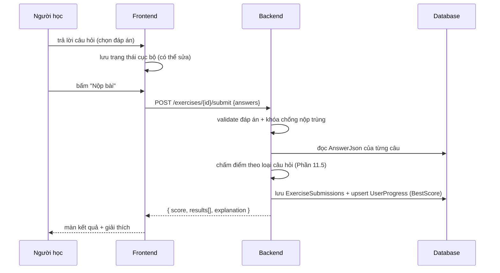

### 6.16.2 UC-09 — Biên soạn bài học và xem trước

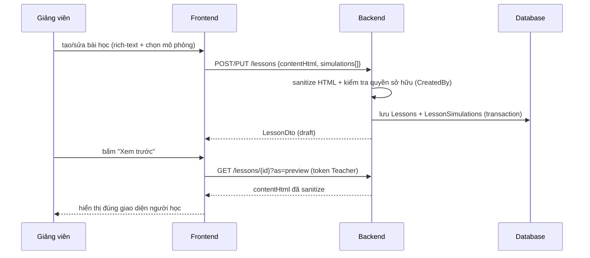

## UC-16 | Xem chi tiết bài học và mở module riêng | Nguồn: FR-2.3, FR-2.4
- **Luồng chính**: (1) chọn bài học, (2) xem nội dung lý thuyết, (3) bấm thẻ "Mô phỏng"/"Code"/"Bài tập" -> CHUYỂN sang màn riêng, (4) quay lại đúng vị trí đã cuộn.
- **Tiêu chí chấp nhận**: Điều hướng đúng luồng 7.0; không nhúng chức năng vào màn chi tiết.

## UC-17 | Viết và chạy code trong sandbox | Nguồn: FR-9.1, FR-9.2, FR-9.4
- **Luồng chính**: (1) mở /code/:key, (2) sửa tham số / hoàn thiện hàm theo signature cố định trong code mẫu, (3) chọn dữ liệu, (4) bấm "Chạy", (5) StepExecutor chạy an toàn và phát trace đồng bộ editor + visual, (6) điều khiển phát/dừng/bước như UC-01.
- **Ngoại lệ**: lỗi cú pháp/timeout/vòng lặp vô hạn -> thông báo kèm dòng lỗi; không treo trình duyệt.
- **Tiêu chí chấp nhận**: FR-9.2 PASS; sandbox chặn code độc hại (FR-9.4).

## UC-18 | Nộp bài tập lập trình | Nguồn: FR-9.3
- **Luồng chính**: (1) mở bài tập code, (2) hoàn thiện hàm theo signature, (3) chạy thử với test công khai, (4) nộp, (5) chấm bằng test ẩn, (6) xem kết quả từng test + điểm.
- **Tiêu chí chấp nhận**: Điểm đúng theo số test pass; test ẩn không hiển thị qua API/UI (theo mức cam kết FR-9.3 v2.4).

## UC-19 | Xem lịch sử nộp bài code | Nguồn: FR-9.5
- **Luồng chính**: (1) mở lịch sử bài tập code, (2) xem danh sách lần nộp (điểm, thời gian), (3) mở lại code cũ + kết quả.
- **Tiêu chí chấp nhận**: Lịch sử đúng; so sánh được 2 lần nộp.

## UC-20 | Quản lý lớp học phần (Teacher) | Nguồn: FR-8.1, FR-8.2, FR-8.3, FR-8.4
- **Luồng chính**: (1) tạo lớp + mã mời, (2) thêm/xóa sinh viên, (3) gán nội dung + hạn nộp, (4) xem báo cáo lớp + xuất CSV.
- **Tiêu chí chấp nhận**: FR-8.1 → FR-8.4 PASS.

## UC-21 | Tham gia lớp bằng mã mời | Nguồn: FR-8.2
- **Luồng chính**: (1) nhập mã mời 6 ký tự, (2) hệ thống kiểm tra lớp đang Mở, (3) vào lớp, (4) thấy nội dung bắt buộc + hạn nộp.
- **Ngoại lệ**: mã sai/lớp Đóng -> thông báo cụ thể.

## UC-22 | Ghi chú cá nhân trên bài học | Nguồn: FR-2.6
- **Luồng chính**: (1) mở ghi chú của bài học, (2) soạn (tự lưu 1s), (3) xem lại, xóa.
- **Tiêu chí chấp nhận**: Ghi chú riêng từng người; dấu chấm "có ghi chú" ở danh sách.

## UC-23 | Xem thành tích và huy hiệu | Nguồn: FR-5.5
- **Luồng chính**: (1) mở trang Thành tích, (2) xem huy hiệu đã mở + ẩn, (3) nhận toast khi đạt huy hiệu mới (không dùng hệ thống thông báo — 20.0 mục 5).
- **Tiêu chí chấp nhận**: Điều kiện huy hiệu đúng; không trao 2 lần.

## UC-24 | Gửi phản hồi và báo lỗi | Nguồn: FR-7.4
- **Luồng chính**: (1) đánh giá sao + nhận xét nội dung, (2) gửi báo lỗi kèm ngữ cảnh tự động (URL, bước mô phỏng), (3) admin xử lý và cập nhật trạng thái.
- **Tiêu chí chấp nhận**: Đánh giá 1 lần/người; báo lỗi đủ ngữ cảnh.

## UC-25 | Học theo Learning Path và mở khóa node | Nguồn: FR-2.10
- **Luồng chính**: (1) chọn lộ trình, (2) xem bản đồ node (khóa/đang học/hoàn thành 1-3 sao), (3) bấm node đang mở → kiểm tra tim → vào bài, (4) pass → mở khóa node kế, (5) hết lộ trình → mở bài kiểm tra tổng hợp.
- **Ngoại lệ**: node khóa → tooltip lý do; hết tim → màn "Hết tim" (chờ hồi/quest).
- **Tiêu chí chấp nhận**: Mở khóa đúng thứ tự; tiến độ lưu theo node; điểm sao đúng công thức 19.1.

## UC-26 | Làm Practice Ladder (Quiz → Lab → Code) | Nguồn: FR-4.11
- **Luồng chính**: (1) pass Quiz ≥60% → mở Lab, (2) pass Lab (server chấm trạng thái cuối + giới hạn bước) → mở Code, (3) pass Code ≥70% test → pass node, (4) retry bậc trong session miễn phí.
- **Ngoại lệ**: fail bậc → retry không trừ tim; thoát giữa chừng → resume đúng bậc (session 30p).
- **Tiêu chí chấp nhận**: Không thể vào bậc sau khi chưa pass bậc trước; điểm node = 20/30/50.

## UC-27 | Làm bài kiểm tra cuối lộ trình | Nguồn: FR-4.12
- **Luồng chính**: (1) hoàn thành toàn bộ node → mở kiểm tra, (2) trộn câu hỏi quiz + dự đoán bước từ các node, (3) nộp → chấm, (4) điểm lưu vào tiến độ lộ trình + huy hiệu hoàn thành.
- **Tiêu chí chấp nhận**: Đề trộn ngẫu nhiên có seed; chỉ mở khi đủ node; điểm ảnh hưởng % hoàn thành lộ trình.

## UC-28 | Chạy Benchmark Lab đối chiếu lý thuyết | Nguồn: FR-3.20, FR-3.20b
- **Luồng chính**: (1) chọn 2+ GT cùng cấu trúc, (2) chạy ở nhiều kích thước n (10/50/100/500/1000 — O(n²) tối đa 500; chế độ đo không trace `runMeasure` §8.0.3, không bị giới hạn 50.000 event), (3) xem biểu đồ đo thực tế chồng đường cong lý thuyết (hệ số tự fit), (4) đọc kết luận độ lệch.
- **Tiêu chí chấp nhận**: Số liệu đo thật từ EDV; đường lý thuyết fit hiển thị rõ; tối đa 5 GT/1 lần chạy.

## UC-29 | Làm Daily Quest và giữ Streak | Nguồn: FR-10.3, FR-10.4
- **Luồng chính**: (1) xem 5 quest (2E+2M+1H), (2) hoàn thành hoạt động thực tế → quest tự cập nhật, (3) nhận thưởng tim/gems/XP, (4) streak cập nhật NGAY khi có hoạt động (eager — v2.8); job 00:30 đóng sổ ngày đã qua (freeze/reset cho user không hoạt động hôm qua, cột StreakLastProcessed chống lặp).
- **Tiêu chí chấp nhận**: Quest reset 00:00; thưởng không trùng; freeze giữ streak đúng.

## UC-30 | Mua vật phẩm trong Gems Shop | Nguồn: FR-10.2
- **Luồng chính**: (1) xem shop + số gems, (2) chọn item → kiểm tra giới hạn stack, (3) giao dịch atomic trừ gems, (4) item vào kho, (5) equip khung/avatar/theme.
- **Ngoại lệ**: thiếu gems/đã max stack → chặn kèm thông báo; double-spend multi-tab → 1 giao dịch thành công.

## UC-31 | Xem Leaderboard | Nguồn: FR-10.6
- **Luồng chính**: (1) chọn tab Tuần/Level/Lớp, (2) xem top + vị trí của mình, (3) lớp học chỉ hiện khi đã tham gia lớp.
- **Tiêu chí chấp nhận**: Điểm số khớp XP; reset tuần đúng lịch; phân trang.

## UC-32 | Nâng cấp Premium (checkout mô phỏng) | Nguồn: FR-10.7
- **Luồng chính**: (1) bấm "Nâng cấp", (2) chọn gói 1/3/12 tháng, (3) màn thanh toán giả lập → "Thanh toán mô phỏng", (4) kích hoạt ngay + log giao dịch, (5) hết hạn → job downgrade về Free (giữ gems/avatar/items).
- **Tiêu chí chấp nhận**: Không cần cổng thanh toán thật; downgrade đúng ngày; quyền lợi áp dụng ngay.
# PHẦN 7 — THIẾT KẾ UI/UX CHI TIẾT

## 7.0 SƠ ĐỒ LUỒNG MÀN HÌNH — NGUYÊN TẮC "1 MÀN = 1 VIỆC" (BẮT BUỘC)

> Bài học từ buổi bảo vệ bản cũ: một màn hình gộp 4 thứ (học + visual + code + quiz) nên bị chê chắp vá, không rõ ràng. CẤM tái phạm.

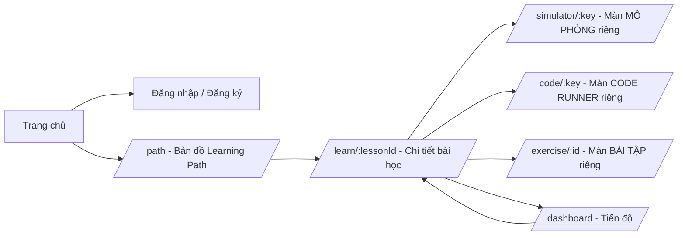

> Cập nhật theo 20.5.6: `/learn` → redirect `/path`; `/dashboard` → redirect `/profile`; sơ đồ navigation theo vùng (lồng nhau) đầy đủ ở 20.5.4.

### Quy tắc bắt buộc
1. Mỗi màn hình đúng 1 nhiệm vụ: danh sách | chi tiết nội dung | mô phỏng | code | bài tập | tiến độ.
2. Màn chi tiết bài học KHÔNG nhúng mô phỏng/code/quiz — chỉ hiển thị thẻ liên kết mở trang riêng.
3. Điều hướng rõ ràng: breadcrumb + nút quay lại + giữ trạng thái khi quay về (vị trí cuộn).
4. Mở mô phỏng/code/bài tập từ bài học: quay lại vẫn ở đúng vị trí đã xem.

## 7.1 Nguyên tắc thiết kế

1. **Trực quan trước, lý thuyết sau**: mỗi màn hình học tập ưu tiên vùng trực quan lớn nhất.
2. **Nhất quán**: một thành phần = một hành vi; dùng component library thống nhất.
3. **Ít thao tác**: chạy mô phỏng mặc định ≤ 2 cú click; mọi hành động phá hủy phải có xác nhận.
4. **Phản hồi tức thì**: mọi nút bấm có hiệu ứng/loading ≤ 200ms.
5. **Luôn có lối thoát**: mọi luồng có nút "Quay lại", "Hủy", "Đóng".
6. **Empty state**: mọi danh sách trống có minh họa + hướng dẫn hành động tiếp theo.
7. **Accessible**: theo WCAG 2.1 AA (contrast, focus visible, bàn phím).

## 7.2 Hệ thống thiết kế

| Mục | Đặc tả |
|---|---|
| Ngôn ngữ giao diện | Tiếng Việt, có dấu đầy đủ |
| Font | hệ thống: `Inter`/`Roboto` + fallback `Segoe UI, Arial`; mã giả dùng `JetBrains Mono`/`Consolas` |
| Cỡ chữ cơ bản | 14px (nội dung), 16px (form), tiêu đề 20/24/32px |
| Màu chủ đạo | Primary `#2563EB`, Secondary `#0F172A`, Success `#16A34A`, Warning `#D97706`, Danger `#DC2626`, Background `#F8FAFC`, Surface `#FFFFFF`, Text `#0F172A`, Muted `#64748B` |
| Màu trạng thái mô phỏng | theo FR-3.6 (default `#CBD5E1`, active `#FACC15`, highlight `#FB923C`, swap `#EF4444`, done `#22C55E`, error `#B91C1C`, muted `#E2E8F0`) |
| Bo góc | 8px (thẻ), 6px (nút/input) |
| Shadow | `0 1px 3px rgba(0,0,0,0.1)` (nhẹ), `0 10px 25px rgba(0,0,0,0.15)` (modal) |
| Component library | tự xây dựng tối thiểu: Button, Input, Select, Modal, Toast, Table, Card, Tabs, Tooltip, Skeleton, EmptyState, Badge, ProgressBar, Drawer |
| Icon | SVG inline (thư viện `lucide-vue-next` hoặc tự vẽ), kích thước 16/20/24px |

## 7.3 Bố cục chung (Layout)

- **App shell**: Header cố định 64px (logo, tìm kiếm, menu người dùng), nội dung trung tâm max-width 1200px, footer tối giản.
- **Sidebar học tập** (chỉ trang bài học): cây chủ đề có thể thu gọn, đánh dấu bài đã học (✔), bài có bài tập mới (badge).
- **Responsive**: ≥ 1024px: full layout; 768-1023px: sidebar ẩn, mở bằng drawer; < 768px: ưu tiên đọc, cảnh báo "nên dùng màn hình lớn cho mô phỏng".

## 7.4 Đặc tả từng màn hình

### Màn 01 — Trang chủ công khai (`/`)
- Hero: tiêu đề + mô tả + 2 CTA ("Đăng ký miễn phí", "Xem demo ngay").
- Section tính năng (6 thẻ), section "Cách hoạt động" (3 bước), section số liệu (tổng CTDL/GT/bài học — từ API public).
- Section demo công khai (FR-7.6 — 3 demo, KHÔNG cần đăng nhập): 3 thẻ demo chạy được ngay trên trang — Bubble Sort, Binary Search, BFS; mỗi thẻ: tên, mô tả ngắn, dữ liệu mẫu có sẵn, nút "Chạy thử" mở mô phỏng public tương ứng.
- Footer: liên kết FAQ, chính sách bảo mật.

### Màn 02 — Đăng nhập / Đăng ký (`/login`, `/register`)
- Form trung tâm (max-width 420px), validation inline khi blur, thông báo lỗi dưới từng trường.
- Đăng ký: tên, email, mật khẩu (có icon mắt), xác nhận mật khẩu, segmented chọn vai trò "Đăng ký với vai trò" (Sinh viên mặc định / Giảng viên) + form con giảng viên (Khoa/Bộ môn, Mã giảng viên — bắt buộc; Kinh nghiệm giảng dạy ≤ 500 ký tự + bộ đếm; ghi chú "Thông tin sẽ được Admin xét duyệt"), checkbox đồng ý chính sách (bắt buộc) — task L.
- Yêu cầu mật khẩu hiển thị dạng checklist sống (đủ dài, chữ hoa, số, ký tự đặc biệt).
- Liên kết quên mật khẩu.

### Màn 03 — Danh sách bài học (`/learn`)
- Trái: sidebar chủ đề (cây, mở rộng, badge số bài). Phải: lưới thẻ bài học (title, mô tả, badge loại nội dung, trạng thái tiến độ, nút "Học tiếp").
- Lọc theo: trạng thái (tất cả/đã học/chưa học), chủ đề; sắp xếp theo thứ tự.

### Màn 04 — Chi tiết bài học (`/learn/{lessonId}`)
- Breadcrumb: Chủ đề / Bài học.
- Vùng nội dung: rich-text (hình ảnh, công thức, bảng, code block không highlight) + mục lục tự động bên phải.
- Danh sách mô phỏng: thẻ ngang (tên, mô tả, CTDL áp dụng, độ phức tạp, nút "Mở mô phỏng").
- Danh sách bài tập: thẻ (tên, loại, số câu, điểm tối đa, trạng thái đã làm + điểm).
- Footer: nút "Đánh dấu đã học" (toggle), nút "Bài học trước/sau".

### Màn 05 — Màn hình mô phỏng (`/simulator/{key}`) — MÀN HÌNH QUAN TRỌNG NHẤT
- **Bố cục 3 vùng** (grid 12 cột):
  - Trái (3/12): panel mã giả — danh sách dòng, dòng active có nền vàng + mũi tên, biến hiển thị giá trị ngay dòng (chip nhỏ).
  - Giữa (6/12): vùng trực quan — Canvas chiếm toàn bộ, header nhỏ hiện tên mô phỏng + bộ đếm (so sánh/hoán đổi); legend màu (thu gọn được); zoom ở góc.
  - Phải (3/12): panel giải thích — tiêu đề bước, văn bản giải thích (1-4 dòng), "Mục tiêu bước", trạng thái biến (bảng nhỏ), nút "Tại sao?" (tooltip mở rộng — TB).
- **Thanh điều khiển** (dưới vùng trực quan, cố định): nút [⏮] [◀] [▶/⏸] [▶|] [⏭], thanh tiến trình (kéo thả), chỉ số "bước/tổng", tốc độ (dropdown 0.25x-4x), nút "Cấu hình lại".
- **Panel cấu hình đầu vào** (modal): theo loại CTDL (FR-3.4); có nút "Dùng mẫu ngẫu nhiên", "Đặt lại mặc định"; nút "Áp dụng" sinh lại bước.
- **Header trang**: tên mô phỏng, breadcrumb, nút "Yêu thích" (★), nút "Chia sẻ" (copies URL), nút "Xem lý thuyết liên quan" (FR-2.11 — deep-link về Node Hub đúng đoạn), nút "Bài tập liên quan" (nếu có).
- **Empty/Loading**: skeleton trong lúc sinh bước; nếu sinh > 300ms hiển thị spinner "Đang dựng mô phỏng...".
- **Phím tắt**: theo FR-3.5; hiển thị tooltip trên nút ("Phát (Space)").

### Màn 06 — Bài tập trắc nghiệm (`/exercise/{id}`)
- Header: tiêu đề, tiến độ "Câu 3/10", bộ đếm thời gian (nếu có), nút nộp bài.
- Thân: câu hỏi (đánh số, rich text, ảnh), danh sách phương án (radio/checkbox), nút "Câu tiếp theo/trước".
- Sidebar: mini-map 10 câu, đánh dấu: xanh (đã trả lời), vàng (đang xem), trắng (chưa), ký hiệu ⚑ (đánh dấu xem lại); bấm nhảy tới câu.
- Sau nộp: màn kết quả — điểm to (chấm tròn %, màu theo mức), thống kê đúng/sai/skip, từng câu hiển thị đáp án đúng/sai + giải thích, nút "Làm lại" + "Về bài học".

### Màn 07 — Bài tập dự đoán bước (`/exercise/{id}?type=simulation`) — ⚠ ĐÃ SÁP NHẬP vào Bậc 2 Interactive Lab (20.3), KHÔNG còn là màn độc lập; nội dung dưới đây là tham chiếu kỹ thuật engine (đặc tả UI đầy đủ ở 20.2.2 Màn 15.1-15.3)
- Vùng mô phỏng (giữa) với màn che bán trong suốt khi đến điểm dừng hỏi; hộp trả lời hiện thay cho thanh điều khiển (ẩn nút bước tiếp cho tới khi trả lời).
- Kết quả: hiển thị "Dự đoán của bạn" (trái) vs "Kết quả thực tế" (phải) với highlight khác biệt màu đỏ/xanh.

### Màn 08 — Dashboard tiến độ (`/dashboard`)
- Hàng thẻ KPI: bài học đã xem, bài tập hoàn thành, điểm trung bình, số mô phỏng đã chạy.
- Thanh tiến độ theo topic (progress bar + %), mở rộng ra danh sách bài học (3 trạng thái + điểm).
- Biểu đồ điểm theo tuần (chart.js hoặc tự vẽ SVG — chọn 1, ghi rõ trong SDD).

### Màn 09 — Quản trị nội dung (`/admin/lessons`, `/admin/topics`, `/admin/exercises`)
- Bảng dữ liệu: phân trang, tìm kiếm, lọc, nút hành động (sửa/xóa/ẩn-hiện).
- Form biên soạn: tabs (Thông tin / Nội dung / Mô phỏng / Bài tập); rich-text editor (tiêu chuẩn: quill hoặc tự xây contenteditable — chọn 1 và ghi rõ), khung chọn mô phỏng từ danh mục (search + chọn key + xem trước), xem trước bài học như người học.
- Xóa: modal xác nhận nêu rõ hậu quả ("Bài học sẽ ẩn khỏi người học, dữ liệu tiến độ được giữ").

### Màn 10 — Quản lý người dùng (`/admin/users`)
- Bảng: avatar, tên, email, vai trò, trạng thái, ngày tạo, thao tác.
- Modal chi tiết: thông tin, nút khóa/mở, đặt lại mật khẩu, phê duyệt Teacher.

### Màn 11 — Thống kê hệ thống (`/admin/stats`)
- Stats: 4 KPI + biểu đồ đường (30 ngày truy cập) + biểu đồ tròn (phân bố vai trò).

### Màn 12 — Các trang phụ: FAQ, chính sách, 404, lỗi 500
- 404: minh họa + nút về trang chủ. 500: thông báo + nút báo lỗi (mailto admin) + tự động ghi log.

## 7.5 Đặc tả tương tác chung

| Hành động | Hành vi |
|---|---|
| Nút bị vô hiệu | `disabled` + tooltip lý do |
| Xóa dữ liệu | Modal xác nhận luôn (nút xóa màu đỏ) |
| Lưu thành công | Toast thành công (2.5s, góc phải trên) |
| Lỗi API | Toast lỗi (đỏ) + log; không tải lại trang |
| Biểu mẫu dài | Nút lưu cố định dưới (sticky footer) |
| Mất mạng (offline) | Banner "Mất kết nối, đang thử lại..." (nếu có service worker — tùy chọn) |

## 7.6 Quy ước vẽ trực quan theo loại CTDL (cho Renderer)

| CTDL | Cách vẽ chuẩn |
|---|---|
| Mảng | Dãy ô vuông ngang (60×60px), index phía dưới ô, con trỏ = mũi tên + nhãn ở trên ô, vùng con trỏ bỏ qua làm mờ |
| Danh sách liên kết | Nút hình chữ nhật (80×40) nối mũi tên `→`, ô null cuối cùng (dấu ∅); con trỏ head/tail/p, insert node nổi với đường đứt nét |
| Stack | Dãy dọc, đỉnh trên cùng; phần tử pop rời khỏi với hoạt ảnh bay lên (≤ 200ms) |
| Queue | Dãy ngang, front trái, rear phải; enqueue thêm bên phải, dequeue bay ra trái |
| Cây | Nút tròn (40px) + cạnh cong; inorder/level highlight theo thứ tự; con trỏ đệ quy hiển thị ngăn xếp lời gọi bên cạnh (tùy chọn) |
| Heap | Cây nhị phân (vẽ kiểu cây) + mảng tương ứng phía dưới; bubble up = mũi tên lên; bubble down = mũi tên xuống |
| Bảng băm | Lưới các bucket (ô dọc), mỗi bucket là danh sách liên kết ngang; hash = ô tính giá trị hiển thị phép tính `h(k)=k mod m` |
| Đồ thị | Đỉnh tròn + cạnh (vô hướng: đoạn thẳng; có hướng: mũi tên; trọng số: nhãn giữa cạnh); BFS/DFS tô theo thứ tự duyệt + thứ tự hàng đợi/ngăn xếp; Dijkstra tô khoảng cách `d[]` dưới đỉnh |

## 7.7 Kiểm thử UX (đưa vào TEST_PLAN)

1. 5 người dùng mới làm nhiệm vụ "chạy mô phỏng bubble sort với mảng 8 số" — thời gian trung bình ≤ 2 phút.
2. Thực hiện đầy đủ luồng "đăng ký → học → làm bài → xem tiến độ" không cần hỗ trợ.
3. Đo SUS (System Usability Scale) ≥ 70/100.

## 7.8 Wireframe ASCII trang mô phỏng (bắt buộc đưa vào SDD — kèm giải thích từng vùng)

```
+-----------------------------------------------------------------------------------------------+
|  Header:  ← Bài học  |  Bubble Sort — Sắp xếp nổi bọt        |  ★ Yêu thích  🔗 Chia sẻ  |  ⚙ |
+-----------------------------------------------------------------------------------------------+
|  MÃ GIẢ (3/12)   |   VÙNG TRỰC QUAN (6/12)                              |  GIẢI THÍCH (3/12)   |
|  ----------------|-----------------------------------------------------|---------------------|
|  1 procedure      |   [3] [7] [1] [5]  ← các ô mảng                       |  BƯỚC 12/34          |
|  2  for i ...     |     ▲                                              |  So sánh a[0]=3 và    |
|  3    swapped←F   |     i=0       [7] [1] ← đang so sánh               |  a[1]=7: 3 > 7 ?     |
| ▶4    for j ...   |  Legend: ■ default ■ active ■ swap ■ done           |  → sai, không hoán    |
|  5      if a[j]   |  Bộ đếm: so sánh 14 | hoán đổi 3 |                |  đổi. j tăng lên 1.  |
|  6        swap    |  Tốc độ [0.25x|0.5x|1x|2x|4x]                     |  Biến: i=0, j=1       |
|  7        swapT   |-----------------------------------------------------|                     |
|  8  if swapped    |  ⏮ ◀ ▶/⏸ ⏭ | ████████████░░░░░░ 12/34 | 🔍 |  [Tại sao?] (tooltip) |
|  9  end           |-----------------------------------------------------|---------------------|
|  [Thu gọn]        |  [Cấu hình lại] [Tạo ngẫu nhiên] [Về đầu]        |                     |
+-----------------------------------------------------------------------------------------------+
|  Footer:  Phím tắt: Space=Phát/Dừng · →/←=Bước · Home/End=Về đầu/cuối · [=[]=Tốc độ          |
+-----------------------------------------------------------------------------------------------+
```

### Giải thích bắt buộc kèm wireframe trong SDD:
1. Vùng trực quan là vùng duy nhất có thể cuộn/phóng (zoom 50-200%).
2. Thanh điều khiển cố định khi cuộn panel mã giả/giải thích (sticky).
3. Khi mở panel "Cấu hình lại" → modal che vùng trực quan, thanh điều khiển bị vô hiệu tới khi "Áp dụng".
4. Legend màu thu gọn thành biểu tượng (🎨) khi vùng hẹp.

## 7.9 Wireframe các trang chính còn lại (ASCII — bắt buộc trong SDD)

### 7.9.1 Trang danh sách bài học (`/learn`)
```
+-----------------------------------------------------------------------------------+
| Header: Logo | 🔍 Tìm kiếm............ | Nguyễn Minh ▾                       |
+-----------------------------------------------------------------------------------+
| SIDEBAR (3/12)        | NỘI DUNG (9/12)                                            |
| ----------------------|-----------------------------------------------------------|
| ▾ Sắp xếp             |  [Thẻ: Bubble Sort]   [Thẻ: Quick Sort]    [Thẻ: Merge ]  |
|   ✔ Bubble Sort   80%  |  Sắp xếp nổi bọt      Sắp xếp nhanh        Sắp xếp trộn  |
|   ✔ Selection Sort 50% |  1 mô phỏng · 2 bài   1 mô phỏng · 1 bài    1 mô phỏng   |
|   ▸ Cây               |  [Học tiếp →]         [Bắt đầu →]            [Bắt đầu →]  |
| ▸ Đồ thị              |  ────────────────────────────────────────────────────────  |
| ▸ Bảng băm & Heap     |  Lọc: [Tất cả ▾]  Sắp xếp: [Thứ tự bài học ▾]             |
| ----------------------|-----------------------------------------------------------|
|  Tiến độ tổng: 45%    |                                                           |
+-----------------------------------------------------------------------------------+
```

### 7.9.2 Trang kết quả bài tập (`/exercise/{id}` sau nộp)
```
+-----------------------------------------------------------------------------------+
| KẾT QUẢ BÀI TẬP: Trắc nghiệm Bubble Sort            Điểm: 8/10  (80%)  ●          |
| ✅ Đạt yêu cầu (≥ 5/10)                                                          |
| +--------------------+----------------------------------------------------------+ |
| | Đúng: 4  Sai: 1    | Câu 3: (Bạn chọn sai)                                    | |
| | Chưa trả lời: 0    | Đề: Sau vòng đầu tiên, phần tử lớn nhất nằm ở đâu?       | |
| |                    | Bạn chọn: [x] Giữa mảng   Đáp án: [x] Cuối mảng        | |
| | [Làm lại]          | Giải thích: Bubble sort so sánh từng cặp liền kề và      | |
| | [Về bài học]       | hoán đổi để phần tử lớn nhất "nổi" về cuối mảng...        | |
| +--------------------+----------------------------------------------------------+ |
| [Xem lại lý thuyết]                                                                  |
+-----------------------------------------------------------------------------------+
```

### 7.9.3 Trang báo cáo giảng viên (`/report`)
```
+-----------------------------------------------------------------------------------+
| BÁO CÁO BÀI HỌC: Bubble Sort (ID 15)          [Xuất CSV] [In]                     |
| +---------+-----------+---------+----------+------------------------------------+ |
| | Người xem: 45/60    | 75%     | ĐTB: 7.2 | Bài tập: 3 · 128 bài nộp           | |
| +---------+-----------+---------+----------+------------------------------------+ |
| Biểu đồ phân bố điểm (bar chart 0-10)                                             |
| Bảng: Sinh viên | Đã xem | Mô phỏng | Bài tập | Điểm cao nhất | Trạng thái      |
| Minh N.        | ✔      | 5        | 3/3     | 9             | Hoàn thành      |
| ... (phân trang)                                                                  |
+-----------------------------------------------------------------------------------+
```

## 7.10 Component tree tổng thể (bắt buộc trong SDD — sơ đồ Mermaid)

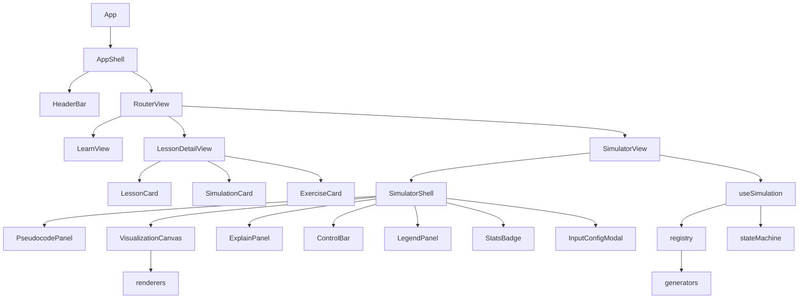

# PHẦN 8 — THIẾT KẾ MÔ-ĐUN TRỰC QUAN HÓA (CỐT LÕI KỸ THUẬT)

> Phần này là trái tim của SDD. Mọi chi tiết phải được viết đầy đủ trong SDD, bao gồm cả mã TypeScript mẫu cho các interface. Khi viết, tuân thủ tuyệt đối các hợp đồng dưới đây.


## 8.0 QUYẾT ĐỊNH KIẾN TRÚC: EXECUTION-DRIVEN VISUALIZATION (EDV) — BẮT BUỘC

> Bài học từ buổi bảo vệ bản cũ: "cho code đến đâu, chạy visual đến đó". Bản cũ sinh hoạt ảnh bằng generator viết tay cho từng giải thuật (hardcode) nên code vòng lặp cũng không chạy được. MỌI NỘI DUNG MỤC NÀY LÀ BẮT BUỘC, không được làm theo cách cũ.

### 8.0.1 Nguyên tắc cốt lõi
1. MỌI giải thuật lõi trong danh mục được VIẾT BẰNG MÃ THẬT (TypeScript thuần, 1 hàm/GT) và CHẠY THẬT qua StepExecutor (bộ thực thi có gắn thiết bị đo).
2. Hoạt ảnh = phát lại nhật ký thực thi (trace) do StepExecutor ghi trong lúc code chạy — visual LUÔN khớp code, không thể lệch.
3. CẤM hardcode chuỗi bước cho từng giải thuật (đây chính là anti-pattern bản cũ bị chặt).
4. Người học chỉ sửa tham số / hoàn thiện hàm theo signature cố định trong code MẪU (template) và xem nó chạy trực quan (Module I — FR-9.2) — KHÔNG nhận code tự do tùy biến (G-6).

### 8.0.2 Kiến trúc EDV (3 lớp)
1. LỚP MÃ (Code Layer): mỗi GT = 1 hàm TypeScript thuần (VD: bubbleSort(a: number[]): number[]) + khai báo ràng buộc trực quan (VD: a → array; stack → stack; node → tree).
2. LỚP THỰC THI (Execution Layer): StepExecutor chạy hàm MẪU (template code có sẵn, gắn trace hook) bằng interpreter có instrument; mỗi câu lệnh quan trọng (gán, so sánh, hoán đổi, gọi hàm, lặp, return) ghi 1 TraceEvent: dòng code, snapshot biến, phần tử cần highlight, giải thích tự sinh.
3. LỚP HIỂN THỊ (Display Layer): player đọc TraceEvent[] → vẽ Canvas; KHÔNG chứa logic thuật toán.

### 8.0.3 Hợp đồng StepExecutor (mã TypeScript mẫu bắt buộc trong SDD)
- interface TraceEvent { line: number; vars: Record<string, unknown>; highlight: string[]; kind: "declare"|"assign"|"compare"|"swap"|"loop"|"call"|"return"; explanation: string; }
- interface CodeSimulation { code: string; entry: string; bindings: VisualBinding[]; }
- run(code, input): TraceEvent[] — giới hạn: tối đa 50.000 event, timeout 5 giây, bộ đếm chặn vòng lặp vô hạn. (Đây là giới hạn GENERATOR chạy client/Web Worker — giới hạn sandbox chấm điểm ở FR-9.6: 10s/64MB/200 dòng.)
- runMeasure(code, input): { durationMs, comparisons, swaps, writes } — chế độ ĐO KHÔNG trace (v2.5): chạy code thật nhưng KHÔNG sinh TraceEvent[] nên KHÔNG áp dụng giới hạn 50.000 event; dành riêng cho Benchmark Lab (FR-3.20/3.20b, Màn 17). Giới hạn: timeout 5 giây/độ đo — vượt → trả null và UI hiển thị "N/A"; bộ đếm chặn vòng lặp vô hạn vẫn hoạt động.
- VisualBinding: ánh xạ biến → loại cấu trúc hiển thị + quy tắc tự sinh annotation từ AST (VD: so sánh a[i] < a[j] → highlight cell:i, cell:j + "a[2]=7 < a[3]=4?").
- Giải thích tự sinh theo kind: assign → "Gán key = a[i] = 7"; compare → "7 > 4 → đúng, hoán đổi"; loop → "Vòng lặp j = 0 → 3".

### 8.0.4 Lý do chọn interpreter (không chạy JS engine nguyên bản)
- Bắt được state TẠI TỪNG câu lệnh (kể cả giữa biểu thức) mà không phải sửa code người dùng.
- Chạy an toàn code người học (Module I — chỉ cho sửa tham số/hoàn thiện hàm theo signature cố định trong code mẫu): giới hạn tài nguyên, bước lùi miễn phí, không phụ thuộc engine ngoài.
- Một định dạng trace thống nhất cho mọi GT — test dễ, so sánh dễ.

### 8.0.5 Ảnh hưởng tới các mục khác
- 8.2: giữ interface SimulationGenerator cho CTDL tĩnh (layout cây, bảng băm...) nhưng bổ sung CodeSimulationRunner (code + executor) cho MỌI GT động — đây là đường chính.
- 8.7 mã giả: trở thành "code mẫu chạy được" — chính là code nạp vào editor (Module I), kèm chú thích dòng.
- 8.8 golden data: kiểm tra trace sinh ra khớp hành vi code thật (không phải kỳ vọng vẽ tay).
- FR-3.12 thực hành bước thủ công: đáp án lấy từ trace thật của StepExecutor.

## 8.1 Mô hình dữ liệu lõi

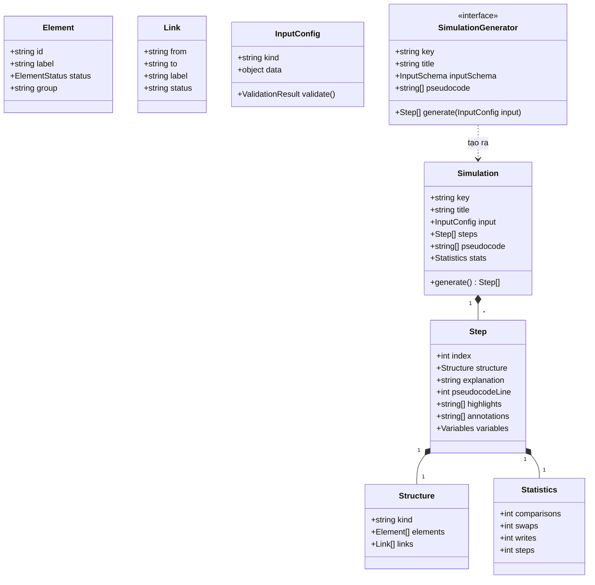

### Giải thích bắt buộc khi viết SDD:
- `Step.structure` là **snapshot bất biến** (immutable) — KHÔNG được thay đổi sau khi tạo; renderer chỉ đọc.
- `Step.highlights` là danh sách id phần tử được tô màu theo trạng thái; `annotations` là các chú thích động (VD: "i=2", "so sánh a[2]=7 < a[3]=4?") hiển thị gần phần tử.
- `Statistics` là **bộ đếm tích lũy** tính đến hết bước hiện tại (không phải delta).
- Tất cả bước được sinh ngay tại `generate()` — mô hình "tạo trước, chơi sau" (batch), không sinh tăng dần (quyết định thiết kế, lý do: bước lùi miễn phí, dễ kiểm thử, dễ lưu trữ).

## 8.2 Hợp đồng Generator (interface TypeScript)

```typescript
// engines/core/types.ts
export type ElementStatus = 'default' | 'active' | 'highlight' | 'swap' | 'done' | 'error' | 'muted';

export interface Element {
  id: string;            // duy nhất trong Structure, VD: 'cell:2', 'node:5', 'edge:2-3'
  label: string;         // giá trị hiển thị chính, VD: '7', 'null', 'd[2]=9'
  status: ElementStatus;
  group?: string;        // nhóm để renderer bố trí, VD: 'heap-array', 'tree', 'bucket:3'
  meta?: Record<string, unknown>; // dữ liệu phụ cho renderer (VD: vị trí fixed, cờ)
}

export interface Link {
  from: string;
  to: string;
  label?: string;        // VD: trọng số 'w=4'
  status?: ElementStatus;
}

export interface Structure {
  kind: string;          // 'array' | 'linkedlist' | 'stack' | 'queue' | 'tree' | 'heap' | 'hashtable' | 'graph'
  elements: Element[];
  links: Link[];
}

export interface Step {
  index: number;
  structure: Structure;
  explanation: string;         // tiếng Việt, 1-4 câu, mô tả hành động của bước
  pseudocodeLine: number;      // dòng mã giả (1-based) tương ứng
  highlights: string[];        // id phần tử nổi bật (được renderer đọc status từ structure)
  annotations: string[];       // VD: ['i=2, j=3', 'so sánh a[2]=7 > a[3]=4 → hoán đổi']
  variables: Record<string, string | number | boolean | null>;
  stats: { comparisons: number; swaps: number; writes: number };
}

export interface InputConfig {
  kind: string;
  data: unknown;               // VD: { values: number[] } | { operations: string[] } ...
}

export interface InputSchema {
  kind: string;
  fields: Array<{
    name: string;
    type: 'int' | 'int[]' | 'string[]' | 'select' | 'bool';
    label: string;
    min?: number; max?: number;
    options?: Array<{ label: string; value: unknown }>;
    default: unknown;
    description: string;
  }>;
}

export interface SimulationGenerator {
  key: string;                 // VD: 'sort.bubble'
  title: string;               // tiếng Việt
  category: 'structure' | 'algorithm';
  dataStructure: string;       // VD: 'mảng'
  level: 'basic' | 'advanced';
  complexity: { best: string; average: string; worst: string; space: string };
  inputSchema: InputSchema;
  pseudocode: string[];        // mỗi phần tử = 1 dòng mã giả
  generate(input: InputConfig): Step[];
  validate(input: InputConfig): { ok: boolean; errors: string[] };
}
```

## 8.3 Quy tắc bắt buộc khi viết generator

1. **Thuần túy**: generator không đụng DOM, không gọi API, không dùng biến toàn cục — chỉ nhận `InputConfig`, trả `Step[]`.
2. **Bước 0 luôn là trạng thái khởi tạo**: trước mọi thao tác, giải thích "Bắt đầu: dữ liệu đầu vào được khởi tạo", `pseudocodeLine = 1` (hoặc dòng khởi tạo), stats = 0.
3. **Bước cuối cùng**: trạng thái hoàn tất, giải thích "Kết thúc: giải thuật hoàn tất", tất cả phần tử `done` (nếu hợp lệ), `pseudocodeLine` = dòng cuối.
4. **Mỗi thao tác cơ bản = ≥ 1 bước**: so sánh, hoán đổi, gán, kiểm tra điều kiện, di chuyển con trỏ — mỗi thao tác có bước riêng với giải thích rõ ràng. Riêng so sánh: 1 bước cho trạng thái `active` trên cả 2 phần tử + 1 bước cho kết quả (VD: "7 > 4 → đúng").
5. **Giải thích phải cụ thể**: viết "So sánh a[2]=7 và a[3]=4" — KHÔNG viết "So sánh hai phần tử".
6. **Giới hạn bước**: không giới hạn cứng, nhưng mảng 100 phần tử bubble sort ≈ ≤ 20.000 bước (chấp nhận); nếu vượt 30.000 bước → cảnh báo "Dữ liệu lớn, mô phỏng có thể chậm".
7. **Số liệu thống kê**: `comparisons` tăng khi có so sánh; `swaps` khi hoán đổi/đổi chỗ; `writes` khi gán phần tử; giá trị tích lũy.
8. **`variables`**: gồm mọi biến quan trọng (i, j, key, low, high, top, front, rear, current, minIdx, target, found...) với giá trị tại bước đó; null nếu chưa khởi tạo.

## 8.4 Hợp đồng Renderer

```typescript
// engines/renderers/interface.ts
export interface Renderer {
  supportedKinds: string[];          // VD: ['array']
  mount(canvas: HTMLCanvasElement): void;
  render(structure: Structure, options: RenderOptions): void;
  resize(width: number, height: number): void;
  dispose(): void;
}
export interface RenderOptions {
  showIndex: boolean;
  showValues: boolean;
  zoom: number;                      // 0.5 - 2
  showLegend: boolean;
}
```

- Renderer KHÔNG chứa logic giải thuật; chỉ đọc `Structure` và vẽ.
- Renderer tạo một class vẽ riêng (`CanvasPainter`) chịu trách nhiệm: hình học, màu sắc, chữ, hoạt ảnh mượt (requestAnimationFrame, tối đa 1 render/frame).
- Quy ước bố trí cho từng loại CTDL: theo Phần 7.6.

## 8.5 Registry (đăng ký mô phỏng)

```typescript
// engines/registry.ts
type GeneratorFactory = () => SimulationGenerator;
const registry = new Map<string, GeneratorFactory>();

export function registerSimulation(key: string, factory: GeneratorFactory): void {
  registry.set(key, factory);
}
export function getSimulation(key: string): SimulationGenerator | undefined {
  const f = registry.get(key); return f ? f() : undefined;
}
export function listSimulations(): SimulationGenerator[] { /* trả tất cả đã sinh */ }
```

- **Bắt buộc**: mọi mô phỏng được khai báo trong 1 file duy nhất `engines/index.ts` (hoặc `engines/catalog.ts`) gọi `registerSimulation` cho từng loại; file này là danh mục duy nhất đồng bộ với backend (khóa `key`).
- `key` là định danh toàn cục: `{nhóm}.{tên}` — `sort.bubble`, `search.binary`, `tree.bst-insert`, `graph.dijkstra`, `stack.push`...

## 8.6 Bảng chuẩn trạng thái phần tử theo từng loại giải thuật (đặc tả từng bước)

> Mục này yêu cầu trong SDD một bảng quy ước cho TỪNG giải thuật: liệt kê bước loại nào tô màu gì. Ví dụ chuẩn cho 3 GT đầu:

| Giải thuật | Loại bước | Element status | Ghi chú |
|---|---|---|---|
| Bubble sort | So sánh a[j], a[j+1] | cả 2: `active` | annotation: `a[j]=x > a[j+1]=y?` |
| Bubble sort | Hoán đổi a[j] ↔ a[j+1] | cả 2: `swap` | sau bước này phần tử cuối đoạn xét → `done` |
| Bubble sort | Kết thúc 1 vòng | phần tử vị trí cuối đoạn: `done` | giải thích "a[n-i] đã nằm đúng vị trí" |
| Selection sort | Tìm min trong đoạn | phần tử đang xét: `active`; min hiện tại: `highlight` | |
| Selection sort | Hoán đổi a[i] ↔ a[minIdx] | 2 phần tử: `swap`; sau đó a[i]: `done` | |
| Insertion sort | Gán key = a[i] | a[i]: `highlight` | annotation: `key=5` |
| Insertion sort | Dịch a[j] sang phải | a[j]: `swap` (biểu thị dịch) | |
| Insertion sort | Chèn key vào vị trí | vị trí chèn: `done` | |
| Merge sort | Chia đôi | đoạn chia: `active` (group) | |
| Merge sort | So sánh 2 phần tử hai nửa | 2 phần tử: `active` | |
| Merge sort | Ghi phần tử vào mảng tạm | phần tử nguồn: `swap`; vị trí ghi: `done` | |
| Quick sort | Chọn pivot | pivot: `highlight` | annotation: `pivot=a[hi]=9` |
| Quick sort | So sánh a[i] ≤ pivot | a[i]: `active` | |
| Quick sort | Hoán đổi a[i] ↔ a[j] | 2 phần tử: `swap` | |
| Quick sort | Hoán đổi pivot về vị trí | pivot: `done` | vị trí chia đôi |
| Binary search | Tính mid | mid: `highlight` | annotation: `mid=(low+high)/2=4` |
| Binary search | So sánh a[mid] và target | a[mid]: `active` | |
| Binary search | Thu hẹp low/high | đoạn bỏ: `muted` | |
| Binary search | Tìm thấy | phần tử: `done` + banner "Tìm thấy tại vị trí 4" | |

> Khi viết SDD, hoàn thành bảng tương tự cho TẤT CẢ 15 GT trong phạm vi (bao gồm: insertion, merge, quick, heap sort, linear/binary search, stack push/pop/peek, queue enqueue/dequeue, linked list insert/delete/search/traverse, BST insert/delete/search + 4 kiểu duyệt, AVL insert + 4 trường hợp xoay, heap insert/extract/heapify, BFS/DFS, Dijkstra).

## 8.6A Bảng trạng thái phần tử — NHÓM SẮP XẾP CÒN LẠI

### 8.6A.1 Heap Sort (`sort.heap`)
| Loại bước | Element status | Ghi chú |
|---|---|---|
| Heapify từng nút root | nút đang heapify: `active` | |
| So sánh cha với 2 con | cha + con lớn hơn: `active` | annotation: `a[root]=x < a[child]=y?` |
| Hoán đổi cha ↔ con | 2 phần tử: `swap` | |
| Đưa a[0] về cuối | 2 phần tử: `swap`; sau đó a[i]: `done` | |
| SiftDown trong đoạn chưa sắp xếp | đoạn chưa sắp xếp: `default`; đoạn đã sắp xếp: `done` | |

### 8.6A.2 Linear Search (`search.linear`)
| Loại bước | Element status | Ghi chú |
|---|---|---|
| Xét a[i] | a[i]: `active` | annotation: `a[2]=7 so với target 7?` |
| So khớp | a[i] so với target | |
| Tìm thấy | phần tử: `done` + banner "Tìm thấy tại vị trí i" | |
| Kết thúc không tìm thấy | toàn mảng: `muted` + banner "Không tìm thấy target" | dùng `muted` để không nhầm là lỗi dữ liệu |

### 8.6A.3 Binary Search (`search.binary`)
| Loại bước | Element status | Ghi chú |
|---|---|---|
| Tính mid | mid: `highlight` | annotation: `mid=(low+high)/2=(0+7)/2=3` |
| So sánh a[mid] và target | a[mid]: `active` | |
| Thu hẹp low | đoạn bỏ bên trái: `muted` | |
| Thu hẹp high | đoạn bỏ bên phải: `muted` | |
| Tìm thấy | phần tử: `done` + banner | |
| Không tìm thấy | low > high: banner "Không tìm thấy" | |

## 8.6B Bảng trạng thái phần tử — NHÓM CTDL TUYẾN TÍNH

### 8.6B.1 Stack (`stack.push`, `stack.pop`, `stack.peek`)
| Loại bước | Element status | Ghi chú |
|---|---|---|
| Push: kiểm tra top = capacity-1 | phần tử đỉnh: `active`; nếu đầy → `error` + dừng | |
| Push: ghi x vào s[top+1] | ô mới: `swap` → `done` | annotation: `top: 2→3, s[3]=5` |
| Pop: kiểm tra top = -1 | nếu rỗng → `error` + dừng | |
| Pop: lấy x, giảm top | phần tử đỉnh: `swap` → `muted` (đã lấy ra) | hoạt ảnh bay lên ≤ 200ms |
| Peek: trả s[top] | phần tử đỉnh: `highlight` | |

### 8.6B.2 Queue (`queue.enqueue`, `queue.dequeue`)
| Loại bước | Element status | Ghi chú |
|---|---|---|
| Enqueue: ghi q[rear+1] | ô mới: `swap` → `done`; rear tăng | annotation: `front=0, rear: 2→3` |
| Dequeue: lấy q[front] | ô front: `swap` → `muted`; front tăng | hoạt ảnh bay ra trái |
| Đầy/rỗng | `error` + dừng | |

### 8.6B.3 Danh sách liên kết đơn (`list.insert`, `list.delete`, `list.search`, `list.traverse`)
| Loại bước | Element status | Ghi chú |
|---|---|---|
| Tạo nút mới | nút mới (chưa nối): `highlight`, link đứt nét | |
| Nối next | nút mới: `swap` → `done` | |
| Duyệt tới vị trí k | nút đang duyệt: `active`; con trỏ p = nhãn | |
| Xóa nút k | nút bị xóa: `error` → `muted`; nút k-1.next đổi hướng | |
| Tìm x | nút so sánh: `active`; tìm thấy: `done` | |
| Duyệt toàn bộ | nút đã duyệt: `done` tuần tự | |

## 8.6C Bảng trạng thái phần tử — NHÓM CÂY

### 8.6C.1 BST (`tree.bst-insert`, `tree.bst-delete`, `tree.bst-search`)
| Loại bước | Element status | Ghi chú |
|---|---|---|
| So sánh x với root hiện tại | nút đang xét: `active` | annotation: `x=7 so với root=5: 7>5 → rẽ phải` |
| Đi xuống trái/phải | cạnh đi: `active` | |
| Chèn nút mới | nút mới: `highlight` → `swap` → `done` | |
| Xóa: tìm nút x | nút đang xét: `active`; tìm thấy: `error` (đánh dấu nút bị xóa) | |
| Xóa: 0 con | nút: `error` → `muted`; cạnh cha đổi | |
| Xóa: 1 con | thay thế trực tiếp | |
| Xóa: 2 con | tìm min cây con phải: nút min: `highlight`; thay giá trị: `swap` | |
| Search | như duyệt; tìm thấy: `done` | |

### 8.6C.2 AVL (`tree.avl-insert`)
| Loại bước | Element status | Ghi chú |
|---|---|---|
| Chèn như BST | như BST | |
| Cập nhật chiều cao + balance factor | mỗi nút trên đường đi: nhãn `bf=±x` | |
| Phát hiện mất cân bằng | nút vi phạm: `error` | annotation: `bf=2 → mất cân bằng` |
| Xoay (LL/RR/LR/RL) | nhóm nút xoay: `swap`; cạnh: vẽ lại động | hoạt ảnh xoay ≤ 300ms |
| Cân bằng xong | toàn bộ: `done` | |

### 8.6C.3 Heap (`heap.insert`, `heap.extract`, `heap.heapify`)
| Loại bước | Element status | Ghi chú |
|---|---|---|
| Chèn vào cuối mảng | ô cuối: `highlight` | |
| Bubble up | cha-con: `swap`; mũi tên hướng lên | |
| Extract max | a[0]: `error` → `muted` (lấy ra); a[last] lên đầu: `swap` | |
| Sift down | cha-con: `swap`; mũi tên hướng xuống | |
| Heapify | từng root: `active` → sau khi xong: `done` | |

## 8.6D Bảng trạng thái phần tử — NHÓM ĐỒ THỊ VÀ BẢNG BĂM

### 8.6D.1 BFS (`graph.bfs`)
| Loại bước | Element status | Ghi chú |
|---|---|---|
| Đưa s vào hàng đợi | đỉnh s: `highlight`; hàng đợi hiển thị bên cạnh | order: 1 |
| Dequeue u | đỉnh u: `done` | |
| Xét đỉnh v kề chưa thăm | cạnh (u,v): `active`; v: `active` → `done` | order tăng dần |
| Hoàn tất | tất cả đỉnh liên thông: `done`; đỉnh không đến được: `muted` | |

### 8.6D.2 DFS (`graph.dfs`)
- Tương tự BFS nhưng dùng stack; thứ tự đánh dấu thăm khi pop; hiển thị stack hiện tại.

### 8.6D.3 Dijkstra (`graph.dijkstra`)
| Loại bước | Element status | Ghi chú |
|---|---|---|
| Khởi tạo d[s]=0, d[v]=∞ | d[] hiển thị dưới mỗi đỉnh | |
| Extract-min u | u: `done` | |
| Relax cạnh (u,v,w) | cạnh: `active` | annotation: `d[u]+w=4 < d[v]=∞ → cập nhật d[v]=4` |
| Cập nhật d[v] | v: `swap` (nhấp nháy); parent[v]=u | |
| Hoàn tất | cây đường đi ngắn nhất: cạnh `done`; banner liệt kê khoảng cách từng đỉnh | |

### 8.6D.4 Bảng băm (`hash.insert`, `hash.search`, `hash.delete`)
| Loại bước | Element status | Ghi chú |
|---|---|---|
| Tính hash | annotation: `h(27) = 27 mod 7 = 6` | |
| Chèn vào bucket | bucket: `active`; ô chèn: `swap` → `done` | |
| Xung đột (chuỗi nối kết) | bucket: `highlight`; duyệt từng nút: `active` | |
| Tìm thấy/không | nút: `done` / bucket: `muted` | |
| Xóa | nút: `error` → `muted` | |

## 8.7 Mã giả chuẩn (Pseudocode chuẩn hóa) cho từng giải thuật

> Mục này đưa ra **mã giả chính thức** mà mọi generator phải bám theo: số dòng, nội dung dòng, và quy tắc ánh xạ bước → dòng. SDD phải trình bày lại đầy đủ cho cả 15 GT với bảng "Dòng mã giả → Loại bước sinh ra". Các ví dụ dưới đây là chuẩn tối thiểu.

### 8.7.1 Bubble Sort (`sort.bubble`)

```text
1.  procedure bubbleSort(a[0..n-1])
2.    for i ← 0 to n-2 do
3.      swapped ← false
4.      for j ← 0 to n-2-i do
5.        if a[j] > a[j+1] then
6.          swap a[j], a[j+1]
7.          swapped ← true
8.      if swapped = false then
9.        return          // mảng đã sắp xếp
10.   end procedure
```

- Sinh bước: mỗi lần chạm dòng 4 → 1 bước (con trỏ j); dòng 5 → 2 bước (so sánh + kết quả); dòng 6 → 1 bước hoán đổi; dòng 8 → 1 bước kiểm tra; dòng 9 → 1 bước kết thúc sớm (toàn bộ `done`).
- Phần tử `a[n-1-i]` đánh `done` sau mỗi vòng lặp ngoài.

### 8.7.2 Selection Sort (`sort.selection`)

```text
1.  procedure selectionSort(a[0..n-1])
2.    for i ← 0 to n-2 do
3.      minIdx ← i
4.      for j ← i+1 to n-1 do
5.        if a[j] < a[minIdx] then
6.          minIdx ← j
7.      if minIdx ≠ i then
8.        swap a[i], a[minIdx]
9.      a[i] ← done
10.   end procedure
```

### 8.7.3 Insertion Sort (`sort.insertion`)

```text
1.  procedure insertionSort(a[0..n-1])
2.    for i ← 1 to n-1 do
3.      key ← a[i]
4.      j ← i-1
5.      while j ≥ 0 and a[j] > key do
6.        a[j+1] ← a[j]
7.        j ← j-1
8.      a[j+1] ← key
9.      i-part → done
10.   end procedure
```

### 8.7.4 Merge Sort (`sort.merge`)

```text
1.  procedure mergeSort(a, left, right)
2.    if left ≥ right then return
3.    mid ← (left + right) / 2
4.    mergeSort(a, left, mid)
5.    mergeSort(a, mid+1, right)
6.    merge(a, left, mid, right)
7.  procedure merge(a, left, mid, right)
8.    t ← mảng tạm, k ← left, i ← left, j ← mid+1
9.    while i ≤ mid and j ≤ right do
10.     if a[i] ≤ a[j] then t[k] ← a[i], i++
11.     else t[k] ← a[j], j++
12.     k++
13.   sao chép phần còn lại
14.   ghi t về a[left..right]
15.   end procedures
```

- Hiển thị: mỗi lệnh gọi đệ quy sinh 1 bước đánh dấu đoạn `[left..right]` (`group`), ngăn xếp đệ quy (tùy chọn hiển thị).

### 8.7.5 Quick Sort — Lomuto (`sort.quick`)

```text
1.  procedure quickSort(a, low, high)
2.    if low ≥ high then return
3.    p ← partition(a, low, high)
4.    quickSort(a, low, p-1)
5.    quickSort(a, p+1, high)
6.  procedure partition(a, low, high)
7.    pivot ← a[high]
8.    i ← low-1
9.    for j ← low to high-1 do
10.     if a[j] ≤ pivot then
11.       i ← i+1
12.       swap a[i], a[j]
13.   swap a[i+1], a[high]      // pivot về đúng vị trí
14.   return i+1
15.   end procedures
```

### 8.7.6 Heap Sort (`sort.heap`)

```text
1.  procedure heapSort(a[0..n-1])
2.    buildMaxHeap(a)            // heapify từ n/2-1 về 0
3.    for i ← n-1 downto 1 do
4.      swap a[0], a[i]          // đưa max về cuối
5.      a[i] ← done
6.      siftDown(a, 0, i-1)
7.  procedure siftDown(a, root, end)
8.    while 2*root+1 ≤ end do
9.      child ← max(a[2*root+1], a[2*root+2]) (nếu tồn tại)
10.     if a[root] < a[child] then swap, root ← child
11.     else break
12.   end procedures
```

### 8.7.7 Linear Search (`search.linear`)

```text
1.  procedure linearSearch(a[0..n-1], target)
2.    for i ← 0 to n-1 do
3.      if a[i] = target then
4.        return i             // tìm thấy
5.    return -1                // không thấy
6.   end procedure
```

### 8.7.8 Binary Search (`search.binary`)

```text
1.  procedure binarySearch(a[0..n-1], target)   // a đã sắp xếp
2.    low ← 0, high ← n-1
3.    while low ≤ high do
4.      mid ← (low + high) / 2
5.      if a[mid] = target then return mid
6.      if a[mid] < target then low ← mid+1
7.      else high ← mid-1
8.    return -1
9.   end procedure
```

### 8.7.9 Stack — Push/Pop/Peek (`stack.push`, `stack.pop`, `stack.peek`)

```text
push(x):  if top = capacity-1 then error "Tràn ngăn xếp"
          else top++, s[top] ← x
pop():    if top = -1 then error "Ngăn xếp rỗng"
          else x ← s[top], top--
peek():   if top = -1 then error "Ngăn xếp rỗng"
          else return s[top]
```

- Dữ liệu vào: danh sách thao tác (mỗi thao tác = vài bước); lỗi tràn/rỗng dùng trạng thái `error` + dừng.

### 8.7.10 Queue — Enqueue/Dequeue (`queue.enqueue`, `queue.dequeue`)

```text
enqueue(x): if rear = capacity-1 and front = 0 then error "Hàng đợi đầy"
            else rear++, q[rear] ← x
dequeue():  if front > rear then error "Hàng đợi rỗng"
            else x ← q[front], front++
```

### 8.7.11 Danh sách liên kết đơn (`list.insert`, `list.delete`, `list.search`, `list.traverse`)

```text
insertHead(x):  newNode ← tạo nút(x); newNode.next ← head; head ← newNode
insertTail(x):  duyệt tới nút cuối; nút cuối.next ← newNode
insertAt(k, x): duyệt tới vị trí k-1 (error nếu k ngoài phạm vi); chèn
deleteAt(k):    duyệt tới vị trí k-1; xóa nút k; nút k-1.next ← nút k+1 (error nếu rỗng/k ngoài phạm vi)
search(x):      duyệt, so sánh từng nút; trả vị trí/không tìm thấy
traverse():     từ head in từng giá trị tới null
```

### 8.7.12 BST (`tree.bst-insert`, `tree.bst-delete`, `tree.bst-search`, `tree.bst-preorder/inorder/postorder/levelorder`)

```text
insert(root, x):  nếu root rỗng → tạo nút; so sánh x với root.value:
                  x < root → đệ quy trái; x > root → đệ quy phải; x = root → bỏ qua (hoặc đếm trùng, cấu hình)
delete(root, x):  tìm nút x; 0 con → xóa; 1 con → thay bằng con;
                  2 con → thay bằng giá trị nhỏ nhất của cây con phải (hoặc lớn nhất cây con trái)
search(root, x):  như insert, so sánh từng bước; tìm thấy → done
traverse: preorder (N-L-R), inorder (L-N-R — kết quả tăng dần), postorder (L-R-N),
          levelorder (hàng đợi BFS)
```

### 8.7.13 AVL — Chèn kèm xoay (`tree.avl-insert`)

```text
insert(root, x):  như BST; sau chèn cập nhật chiều cao, tính balance = hL - hR
nếu |balance| > 1:  LL: xoay phải quanh root
                    RR: xoay trái quanh root
                    LR: xoay trái (con trái) rồi xoay phải (root)
                    RL: xoay phải (con phải) rồi xoay trái (root)
mỗi bước: hiển thị balance factor tại từng nút (nhãn bf), nút vi phạm: `error`
```

### 8.7.14 Heap — Chèn/Trích xuất max/Heapify (`heap.insert`, `heap.extract`, `heap.heapify`)

```text
insert(x):    a[size] ← x, size++; bubbleUp(vị trí size-1)
bubbleUp(i):  while i > 0 và a[parent(i)] < a[i]: swap, i ← parent(i)
extractMax(): max ← a[0]; a[0] ← a[size-1]; size--; siftDown(0); trả max
heapify(a):   for i ← (n/2 - 1) downto 0: siftDown(i)
```

### 8.7.15 Đồ thị — BFS/DFS/Dijkstra (`graph.bfs`, `graph.dfs`, `graph.dijkstra`)

```text
BFS(s):    queue ← [s]; visited[s] ← true
           while queue không rỗng: u ← dequeue; với mỗi v kề u:
             nếu chưa thăm: visited[v] ← true; parent[v] ← u; enqueue(v)
DFS(s):    stack ← [s] (hoặc đệ quy); đánh dấu thăm khi pop/duyệt
Dijkstra(s): d[s] ← 0; d[v] ← ∞; PQ chứa (d, v)
           while PQ không rỗng: u ← extract-min; với mỗi cạnh (u,v,w):
             nếu d[u] + w < d[v]: d[v] ← cập nhật; decrease-key; parent[v] ← u
```

- Hiển thị: dãy thứ tự thăm bên cạnh (`order: 1,2,3...`), queue/stack hiển thị trạng thái, `parent[]` cạnh được tô `done` khi cây khung hình thành, d[] hiển thị dưới mỗi đỉnh cho Dijkstra.

## 8.8 Bộ dữ liệu kiểm thử chuẩn (bắt buộc trong TEST_PLAN và unit test)

> Mỗi GT phải có bộ test với kết quả mong đợi được tính trước (độc lập với code). Tối thiểu 5 nhóm, mỗi nhóm ≥ 2 bộ dữ liệu:

| Nhóm | Đặc điểm dữ liệu | VD (bubble sort) |
|---|---|---|
| N1 | Mảng rỗng / 1 phần tử | `[]`, `[5]` |
| N2 | Đã sắp xếp tăng dần | `[1,2,3,4,5]` |
| N3 | Sắp xếp giảm dần | `[5,4,3,2,1]` |
| N4 | Giá trị trùng lặp | `[4,2,4,1,4]` |
| N5 | Số âm + trái dấu | `[-3,7,-1,0,2]` |
| N6 | Kích thước lớn (100) | ngẫu nhiên seed cố định |
| N7 | (đặc thù GT) | tìm kiếm: target có/không; đồ thị: chu trình/không chu trình; BST: xóa nút 0/1/2 con; AVL: 4 kiểu mất cân bằng |

- **Yêu cầu khi viết TEST_PLAN**: với mỗi bộ dữ liệu: (1) danh sách bước mong đợi ở dạng ngắn gọn (hoặc kiểm tra bất biến: mảng cuối cùng đã sắp xếp, số bước = đúng chuẩn, bộ đếm so sánh nằm trong khung lý thuyết), (2) kiểm tra trạng thái phần tử tại các bước mốc (bước đầu, bước giữa, bước cuối), (3) kiểm tra `pseudocodeLine` khớp hành động.
- Bộ dữ liệu N6 dùng seed cố định (VD: seed=42, xorshift) để tái tạo.

## 8.8A Bảng kỳ vọng kết quả cho nhóm dữ liệu N1-N7 (golden data — đặc tả từng GT)

> TEST_PLAN và unit test phải kiểm tra đúng các kỳ vọng này. "Khung lý thuyết" = cận trên của bộ đếm.

| GT | N1 (rỗng/1 p.tử) | N2 (đã sắp xếp) | N3 (giảm dần) | N4 (trùng lặp) | N5 (số âm) | N7 đặc thù |
|---|---|---|---|---|---|---|
| sort.bubble | mảng giữ nguyên; steps ≥ 1 | kết thúc sớm (swapped=false); swaps=0 | swaps = n(n-1)/2; so sánh = n(n-1)/2 | ổn định: thứ tự trùng không đổi | sắp xếp đúng theo giá trị số | — |
| sort.selection | giữ nguyên | swaps = 0 | swaps = n/2 (tối đa n-1) | ổn định KHÔNG bắt buộc (ghi chú) | đúng | — |
| sort.insertion | giữ nguyên | writes nhỏ (không dịch chuyển); so sánh = n-1 | worst: so sánh = n(n-1)/2 | ổn định: trùng không đổi | đúng | — |
| sort.merge | giữ nguyên | đệ quy chia hết; bước trộn vẫn chạy | đúng thứ tự; so sánh ≤ n·log₂n | ổn định | đúng | — |
| sort.quick | giữ nguyên | pivot luôn đúng vị trí; so sánh ~ n·log₂n | worst-ish: so sánh lớn; vẫn đúng | không ổn định (ghi chú) | đúng | trường hợp mọi giá trị bằng nhau: không lỗi |
| sort.heap | giữ nguyên | heapify vẫn chạy; kết quả đúng | kết quả đúng | đúng | đúng | — |
| search.linear | target vắng: -1; n=1 khớp: vị trí 0 | luôn tìm thấy ở vị trí k | — | tìm thấy bản ghi đầu tiên | tìm số âm đúng | target nằm đầu/cuối mảng |
| search.binary | n=1 khớp → 0; vắng → -1 | mid đầu tiên trúng ngay | (không hợp lệ nếu giảm dần — schema cấm) | trả về 1 vị trí khớp bất kỳ (chấp nhận) | — | target < a[0] hoặc > a[n-1] |
| stack.push/pop | push lên rỗng: top 0→1; pop rỗng → error | — | — | — | giá trị âm bình thường | đầy stack (capacity) → error |
| queue.enqueue/dequeue | rỗng → error; enqueue 1 p.tử | — | — | — | — | đầy hàng đợi |
| list.insert/delete/search | insert vào rỗng; delete vị trí ngoài → error | — | — | nhiều nút trùng giá trị: tìm thấy nút đầu | — | k=0, k=n-1, k=n (error) |
| tree.bst-* | insert vào cây rỗng → gốc; delete cây rỗng → error | chèn dãy tăng → cây lệch phải (hiển thị đúng) | — | giá trị trùng: bỏ qua (chính sách) | — | delete nút gốc; delete nút 0/1/2 con |
| tree.avl-insert | như BST | chèn dãy tăng 1..7 → cây vẫn cân bằng (không lệch) | — | — | — | 4 ca: LL, RR, LR, RL (mỗi ca 1 test) |
| heap.insert/extract/heapify | extract rỗng → error | heapify đúng tính chất heap max | — | phần tử trùng: heap vẫn hợp lệ | — | sau extract, heap vẫn đúng; thứ tự pop = giảm dần |
| graph.bfs/dfs | đồ thị 1 đỉnh; đồ thị rời (2 thành phần) | — | — | — | — | chu trình: không lặp; đỉnh cô lập: muted |
| graph.dijkstra | nguồn = đích; đồ thị có chu trình trọng số dương | — | — | — | — | đồ thị có cạnh trọng số lớn; cập nhật d[] nhiều lần; đỉnh không tới được: d=∞ |

> Khi viết SDD/TEST_PLAN: với mỗi ô "đúng" cần 1-2 bộ dữ liệu cụ thể kèm giá trị mong đợi (VD: insertion sort N2 `[1,2,3,4,5]` → so sánh = 4, writes = 0).

## 8.9 Định dạng Step (ví dụ chuẩn, trích đoạn cho bubble sort, a=[3,1,2])

```json
{
  "index": 0,
  "structure": {
    "kind": "array",
    "elements": [
      { "id": "cell:0", "label": "3", "status": "default" },
      { "id": "cell:1", "label": "1", "status": "default" },
      { "id": "cell:2", "label": "2", "status": "default" }
    ],
    "links": []
  },
  "explanation": "Bắt đầu: mảng [3, 1, 2] được khởi tạo.",
  "pseudocodeLine": 1,
  "highlights": [],
  "annotations": ["i=0, j=0"],
  "variables": { "i": 0, "j": 0, "swapped": false, "n": 3 },
  "stats": { "comparisons": 0, "swaps": 0, "writes": 0 }
}
```

## 8.9A Trace chuẩn bước đầy đủ (bắt buộc trong SDD — mẫu cho Bubble Sort `[3,1,2]`)

> SDD phải có ít nhất 2 trace đầy đủ kiểu này (bubble sort + 1 GT khác tự chọn), làm mốc vàng để viết generator.

| Bước | pseudocodeLine | Giải thích | annotations | variables | comparisons/swaps/writes | Trạng thái phần tử |
|---|---|---|---|---|---|---|
| 0 | 1 | Bắt đầu: mảng [3,1,2] được khởi tạo | i=0, j=0 | {i:0,j:0,swapped:false,n:3} | 0/0/0 | cả 3: default |
| 1 | 4 | Bắt đầu vòng lặp trong với j=0 | j=0 | {i:0,j:0,...} | 0/0/0 | cả 3: default |
| 2 | 5 | So sánh a[0]=3 và a[1]=1 | so sánh a[0]=3 > a[1]=1? | {j:0} | 1/0/0 | cell:0 active, cell:1 active |
| 3 | 6 | 3 > 1 → đúng, hoán đổi a[0] và a[1] | hoán đổi | {j:0} | 1/1/0 | cell:0 swap, cell:1 swap |
| 4 | 7 | Đánh dấu swapped=true | | {swapped:true} | 1/1/0 | cell:0 swap, cell:1 swap |
| 5 | 4 | j=1 (vòng trong lần 2) | j=1 | {j:1} | 1/1/0 | cell:0 default, cell:1 default |
| 6 | 5 | So sánh a[1]=3 và a[2]=2 | so sánh a[1]=3 > a[2]=2? | {j:1} | 2/1/0 | cell:1 active, cell:2 active |
| 7 | 6 | 3 > 2 → đúng, hoán đổi a[1] và a[2] | hoán đổi | {j:1} | 2/2/0 | cell:1 swap, cell:2 swap |
| 8 | 7 | swapped=true | | {swapped:true} | 2/2/0 | cell:1 swap, cell:2 swap |
| 9 | 8 | Kết thúc vòng trong; kiểm tra swapped=true → tiếp tục | | {i:0} | 2/2/0 | cell:2 done (a[n-1-i]=a[2] đúng vị trí) |
| 10 | 2 | i=1 (vòng ngoài lần 2) | i=1 | {i:1} | 2/2/0 | cell:2 done |
| 11 | 3 | swapped=false | | {swapped:false} | 2/2/0 | cell:2 done |
| 12 | 4 | j=0 | | {j:0} | 2/2/0 | cell:0..1 default |
| 13 | 5 | So sánh a[0]=1 và a[1]=3 | so sánh a[0]=1 > a[1]=3? | {j:0} | 3/2/0 | cell:0 active, cell:1 active |
| 14 | 5 | 1 > 3 → sai, không hoán đổi | | {j:0} | 3/2/0 | cell:0 active, cell:1 active |
| 15 | 4 | j=1 | | {j:1} | 3/2/0 | cell:0 default, cell:1 default |
| 16 | 5 | So sánh a[1]=3 và a[2]=2 | so sánh a[1]=3 > a[2]=2? | {j:1} | 4/2/0 | cell:1 active, cell:2 done |
| 17 | 6 | 3 > 2 → đúng, hoán đổi a[1] và a[2] | hoán đổi | {j:1} | 4/3/0 | cell:1 swap, cell:2 swap |
| 18 | 8 | swapped=true → tiếp tục vòng ngoài | | | 4/3/0 | cell:1 done |
| 19 | 2 | i=2 → vòng ngoài kết thúc (i ≤ n-2 sai) | | {i:2} | 4/3/0 | cell:0..1 done, cell:2 done |
| 20 | 10 | Kết thúc: mảng [1,2,3] đã sắp xếp | | | 4/3/0 | cả 3: done |

### Kiểm tra bất biến của trace trên:
- `comparisons` cuối = 4 = n(n-1)/2 với n=3 (3 lần vòng trong × ... đúng chuẩn bubble không tối ưu).
- `pseudocodeLine` chỉ nhận giá trị trong [1..10].
- Mỗi bước đều có giải thích ≠ rỗng và có annotation khi có thao tác.

## 8.9B Ví dụ Step JSON — Binary Search `a=[2,5,8,12,19,23]`, target=12` (trích 4 bước)

```json
[
  { "index": 0, "pseudocodeLine": 2, "explanation": "Bắt đầu: low=0, high=5.",
    "variables": { "low": 0, "high": 5, "mid": null, "found": false },
    "structure": { "kind": "array", "elements": [
      { "id": "cell:0", "label": "2", "status": "default" },
      { "id": "cell:1", "label": "5", "status": "default" },
      { "id": "cell:2", "label": "8", "status": "default" },
      { "id": "cell:3", "label": "12", "status": "default" },
      { "id": "cell:4", "label": "19", "status": "default" },
      { "id": "cell:5", "label": "23", "status": "default" }], "links": [] },
    "stats": { "comparisons": 0, "swaps": 0, "writes": 0 } },
  { "index": 1, "pseudocodeLine": 4, "explanation": "mid = (0+5)/2 = 2 (làm tròn xuống).",
    "variables": { "low": 0, "high": 5, "mid": 2 },
    "highlights": ["cell:2"],
    "annotations": ["mid=2, a[2]=8"] },
  { "index": 2, "pseudocodeLine": 6, "explanation": "a[2]=8 < target 12 → tìm trong nửa phải: low=3.",
    "variables": { "low": 3, "high": 5, "mid": 2 },
    "highlights": ["cell:2"],
    "structure": { "kind": "array", "elements": [
      { "id": "cell:0", "label": "2", "status": "muted" },
      { "id": "cell:1", "label": "5", "status": "muted" },
      { "id": "cell:2", "label": "8", "status": "active" },
      { "id": "cell:3", "label": "12", "status": "default" },
      { "id": "cell:4", "label": "19", "status": "default" },
      { "id": "cell:5", "label": "23", "status": "default" }], "links": [] } },
  { "index": 3, "pseudocodeLine": 4, "explanation": "mid = (3+5)/2 = 4.",
    "variables": { "low": 3, "high": 5, "mid": 4 },
    "highlights": ["cell:4"] }
]
```

## 8.10 Kiểm thử khả năng mở rộng (bắt buộc trong TEST_PLAN)

1. Tạo 1 GT mới giả lập (VD: `sort.gnome` — 20 dòng code, không sửa bất kỳ file nào trong `engines/core/`) → đăng ký vào catalog → mô phỏng chạy được, xuất hiện trong danh mục, giao diện không lỗi.
2. Tạo 1 CTDL mới giả lập với renderer tối thiểu (VD: `deque` dùng lại kind `array`) → hiển thị đúng.
3. Kiểm tra: không file nào ngoài `engines/` và `catalog` bị sửa đổi (kiểm tra bằng git diff).

## 8.11 Quyết định thiết kế và lý do (phải trình bày trong SDD)

| Quyết định | Lựa chọn | Lý do |
|---|---|---|
| Sinh bước | Batch (sinh trước toàn bộ) | Bước lùi miễn phí; unit test dễ; độ phức tạp hiển thị ổn định; mảng 100 phần tử ≤ 500ms |
| Nơi sinh bước | Frontend (generator TypeScript) | Giảm tải server; offline demo; test nhanh; đồng bộ 3 vùng không cần mạng |
| Vẽ | HTML5 Canvas (mảng/cây/đồ thị), DOM cho stack/queue/list | Canvas cho hiệu năng cao khi nhiều phần tử; DOM cho tương tác chính xác khi ít phần tử |
| Renderer phụ thuộc | Không | mỗi renderer độc lập, đăng ký theo kind |
| Bất biến Step | Có (immutable) | tránh bug khi điều hướng bước |

## 8.12 Hiệu năng và tối ưu vẽ (bắt buộc trong SDD)

| Vấn đề | Giải pháp bắt buộc |
|---|---|
| Tái vẽ toàn bộ mỗi bước | Renderer diff: chỉ vẽ lại phần tử có status/annotation thay đổi; cache layer nền tĩnh (grid, cạnh cố định) |
| Đồ thị lớn | Bỏ phần tử ngoài viewport (culling); giới hạn 50 đỉnh/200 cạnh (NFR); batch vẽ theo nhóm trạng thái |
| Hoạt ảnh chuyển bước | Dùng `requestAnimationFrame`; mỗi bước tối đa 2 frame animation; không dùng setTimeout cho vẽ |
| Hiển thị chữ tiếng Việt trên Canvas | Font: `Inter` tải trước qua `document.fonts.load`; fallback `sans-serif`; đo chữ trước khi vẽ (không cắt chữ) |
| Thiết bị DPR cao | Canvas scale theo `devicePixelRatio` (tối đa 2) để chữ sắc nét |
| Giảm thời gian khởi tạo | Lazy-load: chỉ tải generator/renderer của mô phỏng đang mở (`import()` động theo key); bundle engines core nhỏ riêng |
| Tránh GC khi điều hướng nhanh | Không tạo object mới mỗi bước trong render; tái sử dụng painter |

## 8.13 Bảo trì và mở rộng engine (hướng dẫn trong SDD)

1. Thêm GT mới: tạo `engines/generators/{nhóm}/{tên}.ts` → implement `SimulationGenerator` → đăng ký trong `catalog.ts` → thêm test theo Phần 8.8 → xong (không sửa core).
2. Thêm CTDL mới (cần renderer): tạo renderer implement `Renderer` với `supportedKinds` mới → đăng ký kind → bố trí trong `rendererRegistry`.
3. Thay đổi chuẩn màu: chỉ sửa `styles/tokens.css` + `engineDefaults` (một nơi).
4. Version hóa dữ liệu Step: field `version` trong Step (hiện tại `1`) — khi thay đổi định dạng bước, tăng version và viết migrator nếu cần (dành cho lưu trữ bước trong tương lai).

## 8.14 Đặc tả InputSchema cho từng loại mô phỏng (bắt buộc trong SDD)

| Loại | Field | Type | Giới hạn | Mặc định | Mô tả UI |
|---|---|---|---|---|---|
| Mảng (chung) | values | int[] | 2-100 phần tử, mỗi giá trị -999..999 | [5,3,8,1,9,2] | "Dãy số (phân cách bởi dấu phẩy)" hoặc nút "Ngẫu nhiên" |
| Mảng — ngẫu nhiên | size | int | 2-100 | 15 | "Số lượng phần tử" |
| | minValue / maxValue | int | -999..999, min ≤ max | 0 / 99 | "Phạm vi giá trị" |
| | allowDuplicates | bool | — | true | "Cho phép trùng lặp" |
| | preset | select | random / sorted-asc / sorted-desc / nearly-sorted / all-equal / custom | random | "Kiểu dữ liệu" |
| Tìm kiếm | target | int | -999..999 | 42 | "Giá trị cần tìm" |
| | inputSource | select | random / manual | random | "Nguồn dữ liệu" |
| Stack/Queue | operations | string[] | 1-30 thao tác; dạng `Push 5`, `Pop`, `Peek` | ["Push 5","Push 3","Pop"] | "Danh sách thao tác (mỗi dòng 1 thao tác)" |
| | capacity | int | 1-20 | 8 | "Dung lượng" |
| Danh sách liên kết | initialValues | int[] | 0-20 phần tử | [] | "Giá trị ban đầu" |
| | operation | select | insertHead / insertTail / insertAt / deleteAt / search / traverse | insertHead | "Thao tác minh họa" |
| | value | int | -999..999 | 7 | "Giá trị thao tác" |
| | position | int | 0-20 | 0 | "Vị trí (cho insertAt/deleteAt)" |
| BST/AVL | keys | int[] | 1-31 khóa, không trùng | [50,30,70,20,40,60,80] | "Dãy khóa (phân cách bởi dấu phẩy)" |
| | operation | select | insert / delete / search | insert | "Thao tác" |
| Heap | keys | int[] | 1-31 | [10,7,9,4,6,8] | "Dãy khóa" |
| | operation | select | insert / extract / heapify | heapify | "Thao tác" |
| Bảng băm | keys | int[] | 2-50 | [12,25,37,41,58] | "Dãy khóa" |
| | tableSize | int | 5-31 (số nguyên tố được khuyến nghị) | 11 | "Kích thước bảng" |
| | hashMode | select | modulo / multiplication | modulo | "Hàm băm" |
| | operation | select | insert / search / delete | insert | "Thao tác" |
| Đồ thị | preset | select | path / cycle / complete / bipartite / grid / custom | custom | "Mẫu đồ thị" |
| | directed | bool | — | true | "Có hướng" |
| | weighted | bool | — | true | "Có trọng số" |
| | vertices | int | 2-50 | 6 | "Số đỉnh (khi vẽ tay)" |
| | edges | int | 1-200 | 8 | "Số cạnh (khi vẽ tay)" |
| | source | int | 0-49 | 0 | "Đỉnh nguồn (BFS/DFS/Dijkstra)" |
| Dijkstra | target | int? | null = tới mọi đỉnh | null | "Đỉnh đích (tùy chọn)" |

> Validation: mỗi field theo bảng trên; lỗi hiển thị `INPUT_INVALID` với details chỉ rõ field + giới hạn. Lưu ý đặc thù: binary search yêu cầu dữ liệu đã sắp xếp (nếu dữ liệu không sắp xếp → tự sắp xếp với cảnh báo, hoặc chặn theo cấu hình — chọn: tự sắp xếp kèm banner thông báo).

## 8.15 Quy ước ánh xạ dòng mã giả → bước (bắt buộc trong SDD)

| Tình huống | Quy ước |
|---|---|
| Dòng khởi tạo thủ tục | bước đầu: `pseudocodeLine = 1` |
| Vòng lặp | mỗi lần vào thân vòng → 1 bước đánh dấu dòng vòng lặp (trước bước thân vòng) |
| Điều kiện if | 2 bước: (1) dòng if với phần tử `active`, (2) kết quả đúng/sai với annotation |
| Câu lệnh gán | 1 bước, annotation hiển thị giá trị mới |
| Gọi hàm con (VD: partition) | 1 bước chuyển ngữ cảnh (dòng gọi) + bước đầu hàm con |
| Return | 1 bước; nếu kết thúc sớm (VD: bubble swapped=false) → banner lý do |
| End procedure | bước cuối: `pseudocodeLine = dòng cuối` |

> Khi viết generator, mỗi lệnh trong mã giả chuẩn (8.7) phải có đúng 1 ánh xạ trong bảng này; không có ngoại lệ im lặng.

## 8.16 Danh mục file engine (bảng bắt buộc trong SDD — trách nhiệm từng file)

| File | Loại | Trách nhiệm |
|---|---|---|
| `engines/core/types.ts` | core | định nghĩa `Step`, `Structure`, `Element`, `Link`, `Statistics`, `SimulationGenerator` |
| `engines/core/registry.ts` | core | `registerSimulation`, `getSimulation`, `listSimulations` |
| `engines/core/stateMachine.ts` | core | máy trạng thái thuần (không phụ thuộc Vue), hàm `transition` |
| `engines/core/statistics.ts` | core | tiện ích bộ đếm tích lũy |
| `engines/generators/sort/bubble.ts` | generator | sinh bước bubble sort |
| `engines/generators/sort/selection.ts` | generator | sinh bước selection sort |
| `engines/generators/sort/insertion.ts` | generator | sinh bước insertion sort |
| `engines/generators/sort/merge.ts` | generator | sinh bước merge sort (đệ quy, hiển thị đoạn chia/trộn) |
| `engines/generators/sort/quick.ts` | generator | sinh bước quick sort (Lomuto) |
| `engines/generators/sort/heap.ts` | generator | sinh bước heap sort + heapify |
| `engines/generators/search/linear.ts` | generator | tìm kiếm tuyến tính |
| `engines/generators/search/binary.ts` | generator | tìm kiếm nhị phân |
| `engines/generators/linear/stack.ts` | generator | push/pop/peek theo chuỗi thao tác |
| `engines/generators/linear/queue.ts` | generator | enqueue/dequeue theo chuỗi thao tác |
| `engines/generators/linear/linkedList.ts` | generator | insert/delete/search/traverse |
| `engines/generators/tree/bst.ts` | generator | insert/delete/search + 4 kiểu duyệt |
| `engines/generators/tree/avl.ts` | generator | chèn + xoay LL/RR/LR/RL (dùng chung BST helpers) |
| `engines/generators/heap/heapOps.ts` | generator | insert/extract/heapify |
| `engines/generators/hash/hashTable.ts` | generator | insert/search/delete + chuỗi nối kết |
| `engines/generators/graph/bfs.ts` | generator | BFS kèm hàng đợi |
| `engines/generators/graph/dfs.ts` | generator | DFS kèm ngăn xếp |
| `engines/generators/graph/dijkstra.ts` | generator | Dijkstra kèm d[]/parent[]/PQ |
| `engines/renderers/painter/canvasPainter.ts` | renderer | vẽ cơ bản: rect, circle, text, arrow, nhãn |
| `engines/renderers/arrayRenderer.ts` | renderer | mảng + con trỏ + index |
| `engines/renderers/listRenderer.ts` | renderer | danh sách liên kết |
| `engines/renderers/stackQueueRenderer.ts` | renderer | stack/queue dạng dãy |
| `engines/renderers/treeRenderer.ts` | renderer | cây BST/AVL/heap (tọa độ đệ quy) |
| `engines/renderers/hashTableRenderer.ts` | renderer | bucket + chuỗi nối kết |
| `engines/renderers/graphRenderer.ts` | renderer | đồ thị (layout vòng tròn/lưới + trọng số) |
| `engines/catalog.ts` | catalog | đăng ký TOÀN BỘ mô phỏng (nguồn duy nhất khóa key) |
| `engines/index.ts` | entry | xuất public API của engine |

> Quy tắc phụ thuộc: `core` không phụ thuộc `generators`/`renderers`; `generators` chỉ phụ thuộc `core`; `renderers` chỉ phụ thuộc `core`; `catalog` phụ thuộc tất cả. Vi phạm → fail khi review.

# PHẦN 9 — THIẾT KẾ API (REST)

## 9.1 Quy ước chung

### 9.1.1 Naming
- Gốc: `/api/v1`. Resource dạng danh từ số nhiều (`/users`, `/lessons`).
- Sub-resource: `/lessons/{id}/simulations`, `/exercises/{id}/submissions`.
- Hành động không thuộc CRUD thuần: `POST /auth/login`, `POST /exercises/{id}/submit`, `POST /lessons/{id}/mark-viewed`.

### 9.1.2 Phân trang, lọc, sắp xếp
- Phân trang: `?page=1&pageSize=20` (pageSize ≤ 100); response header `X-Total-Count` + body `{ items, page, pageSize, total, totalPages }`.
- Lọc: `?status=active`, `?topicId=3`, `?q=từ khóa`; nhiều điều kiện dùng `&`.
- Sắp xếp: `?sort=createdAt:desc,title:asc` (cột: hướng).

### 9.1.3 Định dạng ngày giờ
- ISO 8601 UTC: `2026-08-09T12:34:56Z`. Frontend hiển thị giờ địa phương + định dạng tiếng Việt.

### 9.1.4 ID
- Số nguyên tự tăng (int) cho bảng nội bộ; `SimulationKey` chuỗi (`sort.bubble`).

### 9.1.5 Status code
| Mã | Ý nghĩa |
|---|---|
| 200 | Thành công (GET/PUT) |
| 201 | Tạo thành công (POST) — kèm `Location` |
| 204 | Thành công không nội dung (DELETE) |
| 400 | Dữ liệu không hợp lệ (validation) |
| 401 | Chưa xác thực / token hết hạn |
| 403 | Không đủ quyền / tài khoản bị khóa |
| 404 | Không tìm thấy tài nguyên |
| 409 | Xung đột (VD: email trùng, xóa chủ đề có con) |
| 422 | Trạng thái nghiệp vụ không cho phép (VD: nộp bài 2 lần cùng lúc) |
| 429 | Vượt giới hạn tần suất |
| 500 | Lỗi máy chủ (ẩn chi tiết với client) |

### 9.1.6 Định dạng lỗi chuẩn (BẮT BUỘC)

```json
{
  "error": {
    "code": "EMAIL_EXISTS",
    "message": "Email đã được sử dụng",
    "field": "email",
    "details": []
  }
}
```

- `code`: chuỗi UPPER_SNAKE duy nhất; `message`: tiếng Việt hiển thị được; `field`: tên trường lỗi (nếu có); `details`: mảng lỗi con (validation nhiều trường).

### 9.1.7 Xác thực
- `Authorization: Bearer <accessToken>` cho mọi endpoint trừ nhóm công khai.
- Refresh: cookie `refresh_token` (HttpOnly, SameSite=Strict, Secure, Path=/api/v1/auth).

## 9.2 Danh sách endpoint đầy đủ (bảng bắt buộc trong API_REFERENCE)

### 9.2.1 Auth
| Method | Endpoint | Mô tả | Quyền | Ghi chú |
|---|---|---|---|---|
| POST | `/auth/register` | Đăng ký | Công khai | body: `{displayName, email, password, isTeacher}` |
| POST | `/auth/login` | Đăng nhập | Công khai | trả `{accessToken, expiresIn, user}`; set cookie |
| POST | `/auth/refresh` | Làm mới token | Cookie | trả accessToken mới |
| POST | `/auth/logout` | Đăng xuất | Đã đăng nhập | thu hồi refresh |
| GET | `/auth/me` | Thông tin bản thân | Đã đăng nhập | |
| PUT | `/auth/me` | Cập nhật hồ sơ | Đã đăng nhập | tên, avatar |
| PUT | `/auth/me/password` | Đổi mật khẩu | Đã đăng nhập | `{currentPassword, newPassword}` |
| POST | `/auth/forgot-password` | Gửi link khôi phục | Công khai | `{email}` |
| POST | `/auth/reset-password` | Đặt lại mật khẩu | Token | `{token, newPassword}` |

### 9.2.2 Public
| Method | Endpoint | Mô tả |
|---|---|---|
| GET | `/public/site-info` | Số liệu trang chủ (số CTDL/GT/bài học) |
| GET | `/public/simulations/{key}/run` | Chạy demo mô phỏng (chỉ các key được khai báo demo) |
| GET | `/public/faqs` | Danh sách FAQ |

### 9.2.3 Topics
| Method | Endpoint | Mô tả | Quyền |
|---|---|---|---|
| GET | `/topics` | Cây chủ đề (lồng 2 cấp) | Đã đăng nhập |
| GET | `/topics/{id}` | Chi tiết chủ đề | Đã đăng nhập |
| POST | `/topics` | Tạo chủ đề | Teacher/Admin |
| PUT | `/topics/{id}` | Sửa chủ đề | Teacher/Admin |
| DELETE | `/topics/{id}` | Xóa chủ đề (409 nếu có bài học) | Teacher/Admin |
| PUT | `/topics/reorder` | Đổi thứ tự | Teacher/Admin |

### 9.2.4 Lessons
| Method | Endpoint | Mô tả | Quyền |
|---|---|---|---|
| GET | `/lessons` | Danh sách (`?topicId=&status=&q=&page=`) | Đã đăng nhập (Student: chỉ active) |
| GET | `/lessons/{id}` | Chi tiết + nội dung | Đã đăng nhập |
| GET | `/lessons/{id}/progress` | Trạng thái tiến độ của tôi với bài học | Student |
| POST | `/lessons` | Tạo | Teacher/Admin |
| PUT | `/lessons/{id}` | Sửa | Teacher (của mình)/Admin |
| DELETE | `/lessons/{id}` | Xóa mềm | Teacher (của mình)/Admin |
| POST | `/lessons/{id}/mark-viewed` | Đánh dấu đã học | Student |
| POST | `/lessons/{id}/simulations` | Gắn mô phỏng vào bài học | Teacher/Admin |
| DELETE | `/lessons/{id}/simulations/{simKey}` | Gỡ mô phỏng | Teacher/Admin |

### 9.2.5 Simulations
| Method | Endpoint | Mô tả | Quyền |
|---|---|---|---|
| GET | `/simulations` | Danh mục mô phỏng (kèm schema, complexity) | Đã đăng nhập |
| GET | `/simulations/{key}` | Chi tiết 1 mô phỏng | Đã đăng nhập |
| GET | `/simulations/{key}/schema` | Cấu hình đầu vào | Đã đăng nhập |

### 9.2.6 Exercises
| Method | Endpoint | Mô tả | Quyền |
|---|---|---|---|
| GET | `/exercises` | Danh sách (`?lessonId=`) | Đã đăng nhập |
| GET | `/exercises/{id}` | Chi tiết (câu hỏi + phương án, KHÔNG đáp án) | Đã đăng nhập |
| POST | `/exercises` | Tạo | Teacher/Admin |
| PUT | `/exercises/{id}` | Sửa | Teacher (của mình)/Admin |
| DELETE | `/exercises/{id}` | Xóa mềm | Teacher (của mình)/Admin |
| POST | `/exercises/{id}/submit` | Nộp bài → điểm + đáp án + giải thích | Student |
| GET | `/exercises/{id}/submissions/me` | Lịch sử bài làm của tôi | Student |
| GET | `/exercises/{id}/submissions` | Danh sách bài nộp (cho giảng viên) | Teacher (của mình)/Admin |

### 9.2.7 Progress
| Method | Endpoint | Mô tả | Quyền |
|---|---|---|---|
| GET | `/progress/me` | Tiến độ tổng hợp của tôi | Student |
| GET | `/progress/me/lessons/{lessonId}` | Tiến độ 1 bài học | Student |
| GET | `/progress/report?lessonId=` | Báo cáo giảng viên | Teacher/Admin |
| GET | `/progress/report/export?lessonId=` | Xuất CSV | Teacher/Admin |

### 9.2.8 Users (Admin)
| Method | Endpoint | Mô tả |
|---|---|---|
| GET | `/users` | Danh sách (lọc role/status/q, phân trang) |
| GET | `/users/{id}` | Chi tiết |
| PUT | `/users/{id}/status` | Khóa/mở (`{isActive}`) |
| PUT | `/users/{id}/role` | Đổi vai trò (không sang Admin) |
| POST | `/users/{id}/approve-teacher` | Phê duyệt Teacher |
| POST | `/users/{id}/reset-password` | Đặt lại mật khẩu |
| DELETE | `/users/{id}` | Xóa tài khoản (ẩn danh hóa — NFR-35) |

### 9.2.9 Favorites & Misc
| Method | Endpoint | Mô tả | Quyền |
|---|---|---|---|
| GET | `/favorites` | Danh sách yêu thích | Đã đăng nhập |
| POST | `/favorites` | Thêm `{simKey, input?}` | Đã đăng nhập |
| DELETE | `/favorites/{id}` | Xóa | Đã đăng nhập (của mình) |

### 9.2.10 Admin
| Method | Endpoint | Mô tả |
|---|---|---|
| GET | `/admin/stats` | Thống kê tổng |
| GET | `/settings` / PUT `/settings` | Đọc/cập nhật cấu hình |

### 9.2.11 Classes (Module H — [BỔ SUNG])
| Method | Endpoint | Mô tả | Quyền |
|---|---|---|---|
| GET | `/classes` | Danh sách lớp (của tôi: Teacher thấy lớp mình tạo; Student thấy lớp đã tham gia) | Đã đăng nhập |
| POST | `/classes` | Tạo lớp | Teacher/Admin |
| GET | `/classes/{id}` | Chi tiết lớp + thống kê tóm tắt | Teacher (của mình)/Admin/Student (đã tham gia) |
| PUT | `/classes/{id}` | Sửa lớp (tên, mô tả, trạng thái mở/đóng) | Teacher (của mình)/Admin |
| DELETE | `/classes/{id}` | Xóa mềm lớp | Teacher (của mình)/Admin |
| POST | `/classes/{id}/join` | Tham gia bằng mã mời `{inviteCode}` | Student |
| POST | `/classes/{id}/members` | Thêm sinh viên theo email | Teacher (của mình)/Admin |
| DELETE | `/classes/{id}/members/{userId}` | Xóa sinh viên khỏi lớp | Teacher (của mình)/Admin |
| POST | `/classes/{id}/assignments` | Gán nội dung + hạn nộp `{lessonId?, exerciseId?, dueAt}` | Teacher (của mình)/Admin |
| PUT | `/classes/{id}/assignments/{assignId}` | Sửa hạn/trạng thái gán | Teacher (của mình)/Admin |
| DELETE | `/classes/{id}/assignments/{assignId}` | Gỡ nội dung gán | Teacher (của mình)/Admin |
| GET | `/classes/{id}/report` | Báo cáo lớp (FR-8.4) | Teacher (của mình)/Admin |
| GET | `/classes/{id}/report/export` | Xuất CSV/PDF báo cáo lớp | Teacher (của mình)/Admin |

### 9.2.12 Cá nhân mở rộng ([BỔ SUNG])
| Method | Endpoint | Mô tả | Quyền |
|---|---|---|---|
| GET | `/me/notes?lessonId=` | Danh sách ghi chú (lọc theo bài học) | Đã đăng nhập |
| PUT | `/me/notes/{lessonId}` | Lưu/cập nhật ghi chú bài học | Đã đăng nhập |
| DELETE | `/me/notes/{lessonId}` | Xóa ghi chú | Đã đăng nhập |
| PUT | `/auth/2fa` | Bật/tắt 2FA + xác nhận mã | Đã đăng nhập |
| GET | `/achievements` | Huy hiệu của tôi (đã mở + ẩn) | Đã đăng nhập |

### 9.2.13 Code Runner (Module I — [BỔ SUNG])
| Method | Endpoint | Mô tả | Quyền |
|---|---|---|---|
| POST | `/code-runs` | Chạy code trong sandbox: `{code, entry, input, exerciseId?}` -> `{runId, trace, output, error?}` | Đã đăng nhập |
| GET | `/code-runs/{id}` | Trạng thái + tóm tắt lần chạy | Đã đăng nhập (của mình) |
| GET | `/code-runs/{id}/trace` | TraceEvent[] phân trang (mục 8.0.3) | Đã đăng nhập (của mình) |
| POST | `/exercises/{id}/code-submit` | Nộp bài code -> `{score, passed, total, results[]}` | Student |
| GET | `/exercises/{id}/code-submissions` | Danh sách bài nộp code (chấm/so sánh) | Teacher (của mình)/Admin |
| GET | `/exercises/{id}/code-submissions/me` | Lịch sử nộp code của tôi | Student |

### 9.2.14 Gamification, Premium, Learning Path & Benchmark (Module B/C/D/J — [BỔ SUNG])
| Method | Endpoint | Mô tả | Quyền |
|---|---|---|---|
| GET | `/me/hearts` | Trạng thái tim + thời điểm hồi tiếp theo | Đã đăng nhập |
| POST | `/learning-path/{id}/nodes/{nodeId}/enter` | Trừ 1 tim (atomic) + tạo/resume session; trả bước đang dở | Student |
| GET | `/learning-path/{id}` | Bản đồ node: trạng thái, điểm sao, % hoàn thành | Đã đăng nhập |
| GET | `/me/quests` | 5 quest hôm nay + tiến độ | Đã đăng nhập |
| POST | `/me/quests/{id}/claim` | Nhận thưởng quest (atomic) | Đã đăng nhập |
| GET | `/me/streak` | Streak hiện tại + freeze còn lại | Đã đăng nhập |
| GET | `/leaderboard?tab=week/level/class&classId=` | BXH phân trang | Đã đăng nhập |
| GET | `/shop/items` | Danh mục vật phẩm | Đã đăng nhập |
| POST | `/shop/buy` | `{itemId}` — trừ gems atomic, kiểm tra stack | Đã đăng nhập |
| GET | `/me/inventory` | Vật phẩm đã mua + trang bị | Đã đăng nhập |
| PUT | `/me/inventory/equip` | `{itemId, slot}` | Đã đăng nhập |
| GET | `/premium/status` | Gói hiện tại + ngày hết hạn | Đã đăng nhập |
| POST | `/premium/upgrade` | `{planId}` → tạo đơn checkout mô phỏng | Đã đăng nhập |
| POST | `/premium/mock-pay` | `{orderId}` → kích hoạt Premium + log giao dịch | Đã đăng nhập |
| GET | `/cheatsheet?structure=` | Bảng Big-O + snippet + deep-link mô phỏng | Đã đăng nhập |
| POST | `/benchmarks/run` | `{keys[], sizes[], language?}` → kết quả đo nhiều n + fit lý thuyết | Đã đăng nhập |

### 9.2.15 Feedback & Bug reports ([BỔ SUNG])
| Method | Endpoint | Mô tả | Quyền |
|---|---|---|---|
| GET | `/feedback?lessonId=` | Điểm TB + đếm đánh giá | Đã đăng nhập |
| POST | `/feedback` | Gửi/chỉnh sao + nhận xét `{lessonId, rating, comment?}` | Đã đăng nhập |
| POST | `/bug-reports` | Gửi báo cáo lỗi (tự đính kèm context) | Đã đăng nhập |
| GET | `/admin/bug-reports` | Danh sách báo cáo lỗi (trạng thái mới/xử lý/đóng) | Admin |
| PUT | `/admin/bug-reports/{id}` | Cập nhật trạng thái xử lý | Admin |

## 9.3 Ví dụ request/response (bắt buộc đầy đủ cho các endpoint chính trong API_REFERENCE)

### 9.3.1 POST /auth/login
```json
// Request
{ "email": "minh@university.edu.vn", "password": "MatKhau@123" }

// Response 200
{
  "accessToken": "eyJhbGciOiJIUzI1NiIs...",
  "expiresIn": 3600,
  "user": { "id": 12, "displayName": "Nguyễn Minh", "email": "minh@university.edu.vn", "role": "STUDENT", "avatarUrl": null }
}
// Response 401
{ "error": { "code": "INVALID_CREDENTIALS", "message": "Email hoặc mật khẩu không đúng", "field": null, "details": [] } }
// Response 403
{ "error": { "code": "ACCOUNT_LOCKED", "message": "Tài khoản đã bị khóa, liên hệ quản trị viên", "field": null, "details": [] } }
```

### 9.3.2 GET /lessons?topicId=2
```json
// Response 200
{
  "items": [
    {
      "id": 15, "title": "Bubble Sort", "description": "Sắp xếp nổi bọt từng bước",
      "topicId": 2, "sortOrder": 1, "status": "active",
      "simulationCount": 1, "exerciseCount": 2,
      "progress": { "viewed": true, "bestScore": 8, "completed": false }
    }
  ],
  "page": 1, "pageSize": 20, "total": 1, "totalPages": 1
}
```

### 9.3.3 GET /exercises/{id} (KHÔNG chứa đáp án)
```json
{
  "id": 31, "title": "Trắc nghiệm Bubble Sort", "type": "MCQ",
  "lessonId": 15, "durationMinutes": 10, "maxScore": 10, "status": "active",
  "questions": [
    {
      "id": 101, "content": "Sau vòng lặp ngoài đầu tiên của bubble sort, phần tử lớn nhất nằm ở đâu?",
      "type": "SINGLE", "options": ["Đầu mảng", "Cuối mảng", "Giữa mảng", "Không xác định"],
      "points": 2
    }
  ]
}
```

### 9.3.4 POST /exercises/{id}/submit
```json
// Request
{ "answers": [ { "questionId": 101, "selected": [1] } ] }
// Response 200
{
  "score": 2, "maxScore": 10,
  "results": [
    { "questionId": 101, "correct": true, "correctAnswer": [1], "explanation": "Bubble sort đưa phần tử lớn nhất về cuối trong vòng lặp đầu tiên." }
  ],
  "submissionId": 2048, "submittedAt": "2026-08-09T12:34:56Z"
}
```

### 9.3.5 POST /topics (tạo chủ đề)
```json
// Request
{ "parentId": null, "name": "Sắp xếp", "description": "Các giải thuật sắp xếp cơ bản và nâng cao", "sortOrder": 2 }
// Response 201
{ "id": 5, "parentId": null, "name": "Sắp xếp", "description": "Các giải thuật sắp xếp cơ bản và nâng cao", "sortOrder": 2, "children": [] }
// Response 409 (tên trùng cùng cấp)
{ "error": { "code": "VALIDATION_FAILED", "message": "Tên chủ đề đã tồn tại", "field": "name", "details": [] } }
```

### 9.3.6 POST /lessons (tạo bài học — Teacher)
```json
// Request
{
  "topicId": 5,
  "title": "Bubble Sort — Sắp xếp nổi bọt",
  "description": "Giải thuật sắp xếp đơn giản nhất, so sánh từng cặp liền kề",
  "contentHtml": "<h2>Ý tưởng</h2><p>So sánh từng cặp phần tử liền kề...</p>",
  "status": "draft",
  "sortOrder": 1,
  "simulations": [ { "simulationKey": "sort.bubble", "title": "Mô phỏng Bubble Sort", "defaultInput": { "values": [5,3,8,1,9,2] } } ]
}
// Response 201 → LessonDto (draft, chỉ Teacher/Admin nhận contentHtml)
```

### 9.3.7 GET /progress/me
```json
// Response 200
{
  "lessonsViewed": 4, "lessonsTotal": 12, "exercisesCompleted": 3, "exercisesTotal": 8,
  "avgScore": 7.7,
  "topics": [
    { "id": 5, "name": "Sắp xếp", "progressPct": 66,
      "lessons": [
        { "id": 15, "title": "Bubble Sort", "viewed": true, "bestScore": 9, "completed": true },
        { "id": 16, "title": "Quick Sort", "viewed": true, "bestScore": null, "completed": false }
      ] }
  ]
}
```

### 9.3.8 GET /users?role=TEACHER_PENDING (Admin)
```json
// Response 200
{ "items": [ { "id": 42, "displayName": "Trần Hà", "email": "t***@university.edu.vn", "role": "TEACHER_PENDING", "isActive": false, "createdAt": "2026-08-01T08:00:00Z" } ],
  "page": 1, "pageSize": 20, "total": 1, "totalPages": 1 }
```

### 9.3.9 GET /simulations (danh mục — đã đăng nhập)
```json
// Response 200
{ "items": [
  { "key": "sort.bubble", "title": "Sắp xếp nổi bọt (Bubble Sort)", "dataStructure": "mảng",
    "category": "algorithm", "level": "basic",
    "complexity": { "best": "O(n)", "average": "O(n²)", "worst": "O(n²)", "space": "O(1)" },
    "tags": ["sắp xếp", "so sánh"], "demoAllowed": true },
  { "key": "tree.avl-insert", "title": "Cây AVL — Chèn và xoay", "dataStructure": "cây",
    "category": "algorithm", "level": "advanced",
    "complexity": { "best": "O(log n)", "average": "O(log n)", "worst": "O(log n)", "space": "O(log n)" },
    "tags": ["cây", "cân bằng"], "demoAllowed": false }
] }
```

## 9.4 Đặc tả bổ sung bắt buộc trong API_REFERENCE

1. **Đăng ký**: xác thực email domain nếu bật (lỗi `DOMAIN_NOT_ALLOWED`), mật khẩu policy (`WEAK_PASSWORD` kèm details từng lỗi).
2. **Nộp bài**: endpoint phải chống nộp trùng (idempotency key `Idempotency-Key` header, tùy chọn) và khóa đồng thời (422 `SUBMISSION_IN_PROGRESS`).
3. **CSV báo cáo**: response `text/csv; charset=utf-8` kèm BOM; tên file `report_lessons_15_20260809.csv`.
4. **Throttling**: trả `Retry-After` khi 429; thông báo frontend "Quá nhiều yêu cầu, thử lại sau N giây".
5. **Log máy chủ**: các thao tác nhạy cảm (users, lessons write, settings) được ghi vào log phía máy chủ (Serilog) để phục vụ điều tra khi cần; KHÔNG có trang xem nhật ký trên giao diện (ngoài phạm vi — xem Module F).

## 9.5 Đặc tả DTO đầy đủ (bắt buộc trong API_REFERENCE — dạng bảng field/type/ràng buộc)

### 9.5.1 `RegisterRequest`
| Field | Type | Bắt buộc | Ràng buộc |
|---|---|---|---|
| displayName | string | ✔ | 2-100 ký tự |
| email | string | ✔ | email hợp lệ, ≤ 256 |
| password | string | ✔ | 8-64, chữ hoa + số + ký tự đặc biệt |
| isTeacher | bool | ✔ | mặc định false |
| department | string | ✘ (bắt buộc khi `isTeacher=true`) | Khoa/Bộ môn; ≤ 100; trim; không lưu khi Sinh viên |
| staffCode | string | ✘ (bắt buộc khi `isTeacher=true`) | Mã giảng viên; ≤ 50; trim; không lưu khi Sinh viên |
| teacherBio | string | ✘ | Kinh nghiệm giảng dạy; ≤ 500; trim; không lưu khi Sinh viên |

### 9.5.2 `LoginRequest` / `RefreshResponse`
`{ email, password }`; response `{ accessToken, expiresIn, user: UserSummary }`.

### 9.5.3 `UserSummary`
| Field | Type | Ghi chú |
|---|---|---|
| id | int | |
| displayName | string | |
| email | string | mask nửa đầu khi trả cho Teacher (chính sách 9.6) |
| role | string | STUDENT/TEACHER/ADMIN |
| avatarUrl | string? | |
| createdAt | datetime | |

### 9.5.4 `LessonDto`
| Field | Type | Ghi chú |
|---|---|---|
| id | int | |
| topicId | int | |
| title / description | string | |
| contentHtml | string | chỉ trả khi có quyền Teacher hoặc `?includeContent=true` |
| status | enum | draft/active/hidden (Student chỉ nhận active) |
| sortOrder | int | |
| simulations | SimulationRef[] | danh sách gắn kèm |
| exercises | ExerciseRef[] | danh sách bài tập |
| progress | LessonProgressDto? | trạng thái cá nhân (Student) |

### 9.5.5 `LessonUpsertRequest`
| Field | Type | Bắt buộc | Ràng buộc |
|---|---|---|---|
| topicId | int | ✔ | tồn tại |
| title | string | ✔ | 3-200 ký tự |
| description | string | ✘ | ≤ 500 |
| contentHtml | string | ✔ | ≤ 200.000 ký tự; sanitize server |
| status | enum | ✔ | draft/active/hidden |
| sortOrder | int | ✘ | ≥ 0 |

### 9.5.6 `SimulationMetaDto` (danh mục)
| Field | Type | Ghi chú |
|---|---|---|
| key | string | `sort.bubble` |
| title | string | tiếng Việt |
| dataStructure | string | mảng/cây/... |
| category | string | structure/algorithm |
| level | string | basic/advanced |
| complexity | object | `{ best, average, worst, space }` |
| tags | string[] | |
| demoAllowed | bool | có trong danh sách demo công khai |

### 9.5.7 `ExerciseDto` (chi tiết — KHÔNG đáp án)
| Field | Type | Ghi chú |
|---|---|---|
| id | int | |
| lessonId | int | |
| title / description | string | |
| type | enum | MCQ / SIMULATION_PREDICT |
| durationMinutes | int? | null = không giới hạn |
| maxScore | int | |
| questions | QuestionDto[] | ẩn `answerJson`, `explanation` |
| bestScore | int? | của người gọi (Student) |

### 9.5.8 `SubmitRequest` / `SubmitResultDto`
- Request: `{ answers: [{ questionId, selected: int[], simAnswer?: any }] }`
- Response: `{ score, maxScore, results: [{ questionId, correct, correctAnswer, explanation }], submissionId, submittedAt }`

### 9.5.9 `ProgressOverviewDto`
`{ lessonsViewed, lessonsTotal, exercisesCompleted, exercisesTotal, avgScore, topics: [{ id, name, progressPct, lessons: [{ id, title, viewed, bestScore, completed }] }] }`

### 9.5.10 `TeacherReportDto`
`{ lessonId, lessonTitle, totalLearners, learnersViewed, completionPct, avgScore, exercises: [{ id, title, avgScore, submissionCount }], inactiveLearners: [UserSummary] }`

### 9.5.11 `PagedResponse<T>`
`{ items: T[], page, pageSize, total, totalPages }` — mọi endpoint danh sách.

## 9.6 Quy tắc bảo vệ dữ liệu trong response (bắt buộc)

1. `AnswerJson`/`Explanation` chỉ trả về trong `POST /submit` (sau khi nộp) và cho Teacher/Admin ở endpoint quản lý; KHÔNG bao giờ trong `GET /exercises/{id}`.
2. Email: chỉ Admin và chính người dùng xem đầy đủ; Teacher thấy dạng `m***h@university.edu.vn`.
3. `contentHtml` bản nháp: chỉ Teacher sở hữu/Admin.
4. Mọi response không bao giờ chứa `PasswordHash`, `TokenHash`.

## 9.7 Danh mục mã lỗi đầy đủ (Error Code Catalog — bắt buộc trong API_REFERENCE)

| Mã | HTTP | Mô tả | field thường dùng |
|---|---|---|---|
| VALIDATION_FAILED | 400 | Dữ liệu không hợp lệ (nhiều trường) | từng trường trong details |
| INVALID_CREDENTIALS | 401 | Sai email/mật khẩu | null |
| UNAUTHORIZED | 401 | Thiếu/hết hạn token | null |
| TOKEN_EXPIRED | 401 | Access token hết hạn (frontend tự refresh) | null |
| REFRESH_INVALID | 401 | Refresh token không hợp lệ/hết hạn | null |
| ACCOUNT_LOCKED | 403 | Tài khoản bị khóa | null |
| ACCOUNT_DISABLED | 403 | Tài khoản chưa kích hoạt | null |
| FORBIDDEN | 403 | Không đủ quyền | null |
| NOT_FOUND | 404 | Không tìm thấy tài nguyên | null |
| EMAIL_EXISTS | 409 | Email đã được sử dụng | email |
| TOPIC_HAS_LESSONS | 409 | Không xóa được chủ đề có bài học | null |
| LESSON_HAS_EXERCISES | 409 | (nếu áp dụng) bài học còn bài tập đang hoạt động | null |
| DUPLICATE_SIMULATION | 409 | Gắn trùng mô phỏng vào bài học | simulationKey |
| WEAK_PASSWORD | 400 | Mật khẩu yếu (details liệt kê từng quy tắc) | password |
| DOMAIN_NOT_ALLOWED | 400 | Domain email không được phép đăng ký | email |
| INVALID_EMAIL | 400 | Định dạng email sai | email |
| OLD_PASSWORD_WRONG | 400 | Mật khẩu cũ sai khi đổi | currentPassword |
| PASSWORD_SAME | 400 | Mật khẩu mới trùng mật khẩu cũ | newPassword |
| RESET_TOKEN_INVALID | 400 | Link đặt lại mật khẩu hết hạn/đã dùng | token |
| SIMULATION_KEY_INVALID | 400 | Khóa mô phỏng không tồn tại trong danh mục | key |
| INPUT_INVALID | 400 | Dữ liệu đầu vào mô phỏng không hợp lệ | details chứa lỗi cụ thể |
| INPUT_TOO_LARGE | 422 | Vượt giới hạn kích thước dữ liệu (NFR-2) | details |
| SUBMISSION_IN_PROGRESS | 422 | Đang có bài nộp đồng thời | null |
| EXERCISE_CLOSED | 422 | Bài tập không còn nhận bài nộp (ẩn/xóa mềm) | null |
| QUESTION_ANSWER_MISMATCH | 400 | Đáp án gửi lên không khớp câu hỏi | questionId |
| RATE_LIMITED | 429 | Vượt giới hạn tần suất (kèm Retry-After) | null |
| UPLOAD_INVALID_TYPE | 400 | Sai định dạng file upload | file |
| UPLOAD_TOO_LARGE | 400 | File vượt giới hạn dung lượng | file |
| INTERNAL_ERROR | 500 | Lỗi máy chủ (ẩn chi tiết) | null |
| SERVICE_UNAVAILABLE | 503 | DB/máy chủ quá tải | null |

> Bảng này phải xuất hiện nguyên vẹn trong API_REFERENCE; mã lỗi phải khớp 100% với mã dùng trong code backend (không phát minh mã mới ngoài danh sách này, ngoại lệ phải được thêm vào bảng kèm phiên bản).

## 9.8 Kiểm thử hợp đồng API (contract test — bắt buộc trong TEST_PLAN)

1. **Schema test**: mọi response phải khớp JSON schema đã đặc tả (dùng `FluentAssertions` + schema file hoặc `Zod` phía test frontend).
2. **Status test**: mọi endpoint có bảng trạng thái kỳ vọng (200/201/400/401/403/404/409/422) — kiểm tra bằng integration test.
3. **Nguyên tắc thay đổi**: thêm field = an toàn (minor); đổi kiểu/đổi tên/bỏ field = breaking (major) → bắt buộc v2 hoặc thỏa thuận.
4. **Lịch sử thay đổi API**: mỗi thay đổi ghi vào bảng: ngày, endpoint, loại thay đổi, phiên bản tài liệu, người duyệt.

## 9.9 Đồng bộ danh mục mô phỏng (quy tắc bắt buộc)

- `GET /simulations` (backend) và `catalog.ts` (frontend) phải khớp danh sách `key`.
- Nguồn chuẩn: **frontend `catalog.ts`** là nơi định nghĩa; backend lưu bảng mô phỏng tĩnh (seed) được đồng bộ bằng script `sync-catalog` (đọc danh sách key từ file JSON chung `shared/simulation-catalog.json`).
- Thêm mô phỏng mới: (1) sửa file JSON chung → (2) chạy script cập nhật seed backend → (3) đăng ký frontend. Kiểm tra CI: so sánh 2 danh sách key, khác nhau → fail build.
- Cấu trúc file chung `shared/simulation-catalog.json`: `[{ "key", "title", "dataStructure", "category", "level", "complexity", "tags", "demoAllowed" }]`.

# PHẦN 10 — THIẾT KẾ CƠ SỞ DỮ LIỆU

## 10.1 Danh sách bảng và ERD

Bảng (32): `Users`, `RefreshTokens`, `PasswordResetTokens`, `Topics`, `Lessons`, `LessonSimulations`, `LessonNotes`, `Exercises`, `Questions`, `ExerciseSubmissions`, `UserProgress`, `UserNodeProgress`, `Favorites`, `Settings`, `Classes`, `ClassMembers`, `ClassAssignments`, `Achievements`, `UserAchievements`, `ContentFeedback`, `BugReports`, `CodeRuns`, `CodeSubmissions`, `LearningPaths`, `LearningPathNodes`, `NodeSessions`, `DailyQuests`, `UserQuests`, `ShopItems`, `UserInventory`, `GemTransactions`, `PremiumSubscriptions`.

> Bổ sung [BỔ SUNG]: `LearningPaths`/`LearningPathNodes` (FR-2.10), `NodeSessions` (FR-10.1 — phiên học 30 phút/điểm dừng của người dùng tại 1 node, chống double-spend trừ tim), `DailyQuests`/`UserQuests` (FR-10.3), `ShopItems`/`UserInventory`/`GemTransactions` (FR-10.2), `PremiumSubscriptions` (FR-10.7). Tim/Gems/XP/Streak lưu trực tiếp trên `Users` (cột Hearts, HeartsMax, LastHeartAt, Gems, Xp, StreakDays, StreakFreeze, PremiumUntil, LastActivityDate — đặc tả đầy đủ ở §10.2.1).

> Bảng mới so với bản gốc (đánh dấu [BỔ SUNG]): `LessonNotes` (FR-2.6), `Classes`/`ClassMembers`/`ClassAssignments` (Module H), `Achievements`/`UserAchievements` (FR-5.5), `ContentFeedback` (FR-7.4), `BugReports`, `CodeRuns`/`CodeSubmissions` (Module I — FR-9.1 → 9.5), `NodeSessions` (FR-10.1 — v2.4), `UserNodeProgress` (FR-2.10 — v2.9). Bảng `AuditLogs` đã bị LƯỢC BỎ (theo yêu cầu cắt giảm Module F — thay bằng log máy chủ Serilog). Bảng `AuthSessions` (FR-1.10) và `Notifications` (FR-6.4/7.3) ĐÃ BỊ XÓA (12/08/2026 — FR đã cắt, xem 19.7).

> **Quy ước đặt tên (D-10, bắt buộc)**: toàn bộ tên bảng/cột dùng **PascalCase** (chuẩn EF Core) — `Users.Id`, `Lessons.TopicId`, `ClassAssignments.DueAt`...; không dùng UPPER_SNAKE/snake_case. ERD dưới đây vẽ đủ 32 bảng, tách 2 sơ đồ: (1) lõi học tập, (2) gamification + code.

### 10.1A ERD — LÕI HỌC TẬP (24 bảng)

```mermaid
erDiagram
    Users ||--o{ RefreshTokens : has
    Users ||--o{ PasswordResetTokens : has
    Users ||--o{ UserProgress : has
    Users ||--o{ Favorites : has
    Users ||--o{ ExerciseSubmissions : submits
    Users ||--o{ LessonNotes : "owns"
    Users ||--o{ UserAchievements : earns
    Users ||--o{ ContentFeedback : gives
    Users ||--o{ BugReports : reports
    Users }o--o{ Classes : "manages (OwnerId)"
    Topics ||--o{ Topics : "parent"
    Topics ||--o{ Lessons : contains
    Lessons ||--o{ LessonSimulations : has
    Lessons ||--o{ Exercises : has
    Lessons ||--o{ UserProgress : tracked
    Lessons ||--o{ LessonNotes : "noted"
    Lessons ||--o{ ContentFeedback : receives
    Exercises ||--o{ Questions : has
    Exercises ||--o{ ExerciseSubmissions : receives
    Classes ||--o{ ClassMembers : has
    Classes ||--o{ ClassAssignments : assigns
    ClassMembers ||--o{ Users : includes
    Achievements ||--o{ UserAchievements : unlocked_by
    LearningPaths }o--o{ Topics : "thuộc (tùy chọn)"
    LearningPaths ||--o{ LearningPathNodes : has
    LearningPathNodes ||--o{ Lessons : "node bài học (tùy chọn)"
    LearningPathNodes ||--o{ Exercises : "stages (FinalTestId/NodeId)"
    Users ||--o{ NodeSessions : "mở phiên (vào node)"
    LearningPathNodes ||--o{ NodeSessions : "theo dõi"
    Users ||--o{ UserNodeProgress : "tiến độ node"
    LearningPathNodes ||--o{ UserNodeProgress : "chấm điểm"

    Users { int Id PK; string Email UK; string PasswordHash; string DisplayName; int Role; bool IsActive; bool IsPrimaryAdmin; bool TwoFactorEnabled; string? AvatarUrl; string? Department; string? StaffCode; string? TeacherBio; date? StreakLastProcessed; datetime CreatedAt; datetime? UpdatedAt; datetime? DeletedAt }
    RefreshTokens { int Id PK; int UserId FK; string TokenHash UK; datetime ExpiresAt; datetime? RevokedAt; string? CreatedByIp; datetime CreatedAt }
    PasswordResetTokens { int Id PK; int UserId FK; string TokenHash UK; datetime ExpiresAt; bool Used; datetime CreatedAt }
    Topics { int Id PK; int? ParentId FK; string Name; string Description; int SortOrder; int CreatedBy FK; datetime CreatedAt; datetime? UpdatedAt; datetime? DeletedAt }
    Lessons { int Id PK; int TopicId FK; string Title; string Description; string ContentHtml; int SortOrder; int Status; int CreatedBy FK; int? UpdatedBy; datetime CreatedAt; datetime? UpdatedAt; datetime? DeletedAt }
    LessonSimulations { int Id PK; int LessonId FK; string SimulationKey; string Title; string? DefaultInputJson; int SortOrder }
    LessonNotes { int Id PK; int UserId FK; int LessonId FK; string ContentHtml; datetime UpdatedAt }
    Exercises { int Id PK; int LessonId FK; int? NodeId FK; int? Stage; string? ConfigJson; string Title; string Description; int Type; int? DurationMinutes; int MaxScore; int Status; int CreatedBy FK; datetime CreatedAt; datetime? UpdatedAt; datetime? DeletedAt }
    Questions { int Id PK; int ExerciseId FK; string Content; string OptionsJson; string AnswerJson; string? Explanation; string? Hint1; string? Hint2; string? Hint3; string? WrongExplanationsJson; bool KeepOrder; int Points; int SortOrder }
    ExerciseSubmissions { int Id PK; int UserId FK; int ExerciseId FK; int? ClassAssignmentId FK NULL; int Score; string AnswersJson; string ResultJson; datetime SubmittedAt; int? DurationSeconds }
    UserProgress { int Id PK; int UserId FK; int LessonId FK; bool Viewed; int SimulationCount; int? BestScore; datetime? CompletedAt; datetime UpdatedAt }
    Favorites { int Id PK; int UserId FK; string SimulationKey; string? InputJson; datetime CreatedAt }
    Settings { int Id PK; string Key UK; string Value; string Description; datetime UpdatedAt; int UpdatedBy }
    Classes { int Id PK; string Name; string InviteCode UK; string? Semester; string? Description; int OwnerId FK; int Status; datetime CreatedAt; datetime? DeletedAt }
    ClassMembers { int Id PK; int ClassId FK; int UserId FK; datetime JoinedAt }
    ClassAssignments { int Id PK; int ClassId FK; int? LessonId FK; int? ExerciseId FK; datetime? DueAt; datetime CreatedAt }
    Achievements { int Id PK; string Code UK; string Name; string Description; string? IconUrl; string ConditionJson; int SortOrder }
    UserAchievements { int Id PK; int UserId FK; int AchievementId FK; datetime EarnedAt }
    ContentFeedback { int Id PK; int UserId FK; int LessonId FK; int Rating; string? Comment; datetime CreatedAt; datetime? UpdatedAt }
    BugReports { int Id PK; int? UserId FK; string Description; string? ContextJson; int Status; int? AssigneeId FK; datetime CreatedAt; datetime? ResolvedAt }
    LearningPaths { int Id PK; string Title; string? Description; int? TopicId FK; int SortOrder; bool IsActive; int CreatedBy FK }
    LearningPathNodes { int Id PK; int PathId FK; string Title; int? LessonId FK; int SortOrder; int? FinalTestId FK }
    NodeSessions { int Id PK; int UserId FK; int NodeId FK; datetime StartedAt; datetime ExpiresAt; int? Stage; int? StepIndex }
    UserNodeProgress { int Id PK; int UserId FK; int NodeId FK; int Status; int Stars; int NodeScore; datetime? UnlockedAt; datetime? PassedAt; datetime UpdatedAt }
```

### 10.1B ERD — GAMIFICATION + CODE (8 bảng + Users tham chiếu)

```mermaid
erDiagram
    Users ||--o{ UserQuests : completes
    Users ||--o{ UserInventory : owns
    Users ||--o{ GemTransactions : transacts
    Users ||--o{ PremiumSubscriptions : subscribes
    Users ||--o{ CodeRuns : runs
    Users ||--o{ CodeSubmissions : submits
    DailyQuests ||--o{ UserQuests : has
    ShopItems ||--o{ UserInventory : purchased
    Exercises ||--o{ CodeRuns : "chạy thử (tùy chọn)"
    Exercises ||--o{ CodeSubmissions : "chấm điểm"

    Users { int Id PK; string Email UK; string PasswordHash; string DisplayName; int Role; bool IsActive; bool IsPrimaryAdmin; bool TwoFactorEnabled; string? AvatarUrl; string? Department; string? StaffCode; string? TeacherBio; int Hearts; int HeartsMax; datetime LastHeartAt; int Gems; int Xp; int StreakDays; int StreakFreeze; date? StreakLastProcessed; datetime? PremiumUntil; date? LastActivityDate; datetime CreatedAt; datetime? UpdatedAt; datetime? DeletedAt }
    DailyQuests { int Id PK; string QuestKey UK; string Title; int Type; string ConditionJson; string RewardJson; bool PoolEnabled }
    UserQuests { int Id PK; int UserId FK; int QuestId FK; date QuestDate; int Progress; bool Claimed }
    ShopItems { int Id PK; string ItemKey UK; string Name; int PriceGems; int MaxStack; int Type; int? DurationHours }
    UserInventory { int Id PK; int UserId FK; int ItemId FK; int Quantity; datetime PurchasedAt; datetime? ExpiresAt }
    GemTransactions { int Id PK; int UserId FK; int Type; int Amount; string? RefType; string? RefId; datetime CreatedAt }
    PremiumSubscriptions { int Id PK; int UserId FK; string? PlanId; datetime StartedAt; datetime? ExpiresAt; int Status; string? OrderRef; datetime CreatedAt }
    CodeRuns { int Id PK; int UserId FK; int? ExerciseId FK; string Code; string InputJson; int Status; string? OutputJson; string? ErrorJson; string? TraceJson; int DurationMs; datetime CreatedAt }
    CodeSubmissions { int Id PK; int UserId FK; int ExerciseId FK; string Code; int Score; int PassedTests; int TotalTests; string ResultJson; datetime SubmittedAt }
```

> **Giải thích + danh sách 32 bảng đang vẽ trong ERD** (đối chiếu 1-1 với đặc tả §10.2 — dùng để kiểm tra không thiếu/thừa bảng):
>
> **Sơ đồ A — Lõi học tập (24 bảng)**: 1. `Users` (§10.2.1), 2. `RefreshTokens` (§10.2.5), 3. `PasswordResetTokens` (§10.2.6), 4. `Topics` (§10.2.7), 5. `Lessons` (§10.2.2), 6. `LessonSimulations` (§10.2.8), 7. `LessonNotes` (§10.2.15), 8. `Exercises` (§10.2.9), 9. `Questions` (§10.2.3), 10. `ExerciseSubmissions` (§10.2.10), 11. `UserProgress` (§10.2.4), 12. `Favorites` (§10.2.11), 13. `Settings` (§10.2.12), 14. `Classes` (§10.2.16), 15. `ClassMembers` (§10.2.17), 16. `ClassAssignments` (§10.2.18), 17. `Achievements` (§10.2.19), 18. `UserAchievements` (§10.2.20), 19. `ContentFeedback` (§10.2.21), 20. `BugReports` (§10.2.22), 21. `LearningPaths` (§10.2.25), 22. `LearningPathNodes` (§10.2.25), 23. `NodeSessions` (§10.2.29), 24. `UserNodeProgress` (§10.2.30).
>
> **Sơ đồ B — Gamification + Code (8 bảng + Users tham chiếu)**: 24. `DailyQuests` (§10.2.26), 25. `UserQuests` (§10.2.26), 26. `ShopItems` (§10.2.27), 27. `UserInventory` (§10.2.27), 28. `GemTransactions` (§10.2.27), 29. `PremiumSubscriptions` (§10.2.28), 30. `CodeRuns` (§10.2.23), 31. `CodeSubmissions` (§10.2.24). `Users` xuất hiện lại trong sơ đồ B chỉ để vẽ quan hệ (cột Tim/Gems/XP/Streak — §10.2.1) — không đếm thêm.
>
> **Tổng = 32 bảng**, không còn `AuthSessions` và `Notifications` (đã xóa — FR cắt, xem 19.7 + changelog v2.3). `Exercises.NodeId`/`Stage` đánh dấu bài tập thuộc node nào của Ladder (QUIZ/LAB/CODE — 10.2.25); `LearningPathNodes.FinalTestId` trỏ exercise kiểm tra cuối path. `NodeSessions` (v2.4 — FR-10.1) lưu phiên học 30 phút + điểm dừng để resume; UNIQUE (UserId, NodeId) tuần tự hóa trừ tim chống double-spend; gia hạn sliding +30p khi nộp bậc, cap 120p (v2.9). `UserNodeProgress` (v2.9 — FR-2.10) lưu Status/Stars/NodeScore từng node — nguồn hiển thị bản đồ path, tránh tính runtime từ ExerciseSubmissions. Đề luyện tập tổng hợp trộn runtime theo seed, KHÔNG lưu bảng riêng (xem 10.2.25).

## 10.2 Đặc tả từng bảng (đầy đủ cột — bắt buộc trong SDD)

> Khi viết SDD, với MỖI bảng phải có: bảng mô tả cột (tên, kiểu, ràng buộc, mặc định, ghi chú) + mục đích + quy tắc nghiệp vụ liên quan. Dưới đây là đặc tả tối thiểu của các bảng quan trọng nhất để làm mẫu; các bảng còn lại làm tương tự với mức chi tiết ngang bằng.

### 10.2.1 `Users`
| Cột | Kiểu | Ràng buộc | Mặc định | Ghi chú |
|---|---|---|---|---|
| Id | int | PK, identity | | |
| Email | nvarchar(256) | UNIQUE, NOT NULL | | chuẩn hóa lowercase; chỉ mục unique |
| PasswordHash | nvarchar(256) | NOT NULL | | bcrypt/PBKDF2 string |
| DisplayName | nvarchar(100) | NOT NULL | | |
| Role | int | NOT NULL | 0 | 0=Student, 1=Teacher, 2=TeacherPending, 3=Admin |
| IsActive | bit | NOT NULL | 1 | |
| IsPrimaryAdmin | bit | NOT NULL | 0 | Admin chính (FR-1.9, v2.7): Admin đầu tiên tạo bởi script seed; duy nhất được quản lý Admin khác; chuyển cờ = chuyển quyền |
| TwoFactorEnabled | bit | NOT NULL | 0 | bật/tắt xác thực 2 lớp qua email (FR-1.11); mặc định tắt |
| AvatarUrl | nvarchar(500) | NULL | | lưu URL tĩnh sau upload |
| Hearts | int | NOT NULL | 10 | tim hiện tại (FR-10.1); clamp về HeartsMax khi đọc |
| HeartsMax | int | NOT NULL | 10 | Free 10 / Premium 30 (19.2) |
| LastHeartAt | datetime2 | NOT NULL | GETUTCDATE() | mốc hồi tim; hồi tính khi đọc (không cần job) |
| Gems | int | NOT NULL | 0 | trừ/cộng atomic trong transaction (19.3) |
| Xp | int | NOT NULL | 0 | tích lũy; Level = 1 + floor(sqrt(XP/100)) |
| StreakDays | int | NOT NULL | 0 | chuỗi ngày học liên tục — cập nhật EAGER khi hoạt động (v2.8) |
| StreakFreeze | int | NOT NULL | 0 | vật phẩm giữ streak (max 2) |
| PremiumUntil | datetime2 | NULL | | hết hạn Premium → job downgrade (19.4) |
| LastActivityDate | date | NULL | | ngày hoạt động cuối (quest/streak theo ngày) |
| StreakLastProcessed | date | NULL | | (v2.8) ngày đã đóng sổ xử lý streak — chống chạy lặp khi job 00:30 lệch mốc reset quest 00:00 |
| CreatedAt | datetime2 | NOT NULL | GETUTCDATE() | |
| UpdatedAt | datetime2 | NULL | | |
| DeletedAt | datetime2 | NULL | | xóa mềm/ẩn danh hóa |
| Department | nvarchar(100) | NULL | | Khoa/Bộ môn (form đăng ký GV — task L); bắt buộc nhập khi `isTeacher=true`; trim; không lưu với Sinh viên |
| StaffCode | nvarchar(50) | NULL | | Mã giảng viên (form đăng ký GV — task L); bắt buộc nhập khi `isTeacher=true`; trim; không lưu với Sinh viên |
| TeacherBio | nvarchar(500) | NULL | | Kinh nghiệm/giới thiệu giảng dạy (form đăng ký GV — task L); ≤ 500 ký tự; không bắt buộc |

### 10.2.2 `Lessons`
| Cột | Kiểu | Ràng buộc | Mặc định | Ghi chú |
|---|---|---|---|---|
| Id | int | PK, identity | | |
| TopicId | int | FK→Topics.Id, NOT NULL | | |
| Title | nvarchar(200) | NOT NULL | | |
| Description | nvarchar(500) | NULL | | hiển thị thẻ bài học |
| ContentHtml | nvarchar(max) | NOT NULL | | đã sanitize |
| SortOrder | int | NOT NULL | 0 | |
| Status | int | NOT NULL | 0 | 0=draft, 1=active, 2=hidden |
| CreatedBy | int | FK→Users.Id | | quyền sở hữu Teacher |
| UpdatedBy | int | NULL | | |
| CreatedAt / UpdatedAt / DeletedAt | datetime2 | | | |

### 10.2.3 `Questions`
| Cột | Kiểu | Ràng buộc | Ghi chú |
|---|---|---|---|
| Id | int | PK | |
| ExerciseId | int | FK→Exercises.Id (cascade delete) | |
| Content | nvarchar(max) | NOT NULL | hỗ trợ Markdown |
| OptionsJson | nvarchar(max) | NOT NULL | `["A","B","C","D"]` |
| AnswerJson | nvarchar(max) | NOT NULL | SINGLE: `[1]`; MULTI: `[0,2]`; BOOLEAN: `[1]`; dự đoán bước: `{"type":"A","state":{...}}` |
| Explanation | nvarchar(max) | NULL | hiển thị sau nộp |
| Points | int | NOT NULL | 1-10, mặc định 1 |
| SortOrder | int | NOT NULL | |

### 10.2.4 `UserProgress`
| Cột | Kiểu | Ràng buộc | Ghi chú |
|---|---|---|---|
| Id | int | PK | |
| UserId | int | FK; UNIQUE (UserId, LessonId) | |
| LessonId | int | FK→Lessons.Id | xóa bài học = xóa mềm nên FK giữ nguyên |
| Viewed | bit | NOT NULL default 0 | đánh dấu đã học |
| SimulationCount | int | NOT NULL default 0 | số lần chạy mô phỏng |
| BestScore | int | NULL | điểm cao nhất bài tập của bài học |
| CompletedAt | datetime2 | NULL | thời điểm hoàn thành (Viewing + BestScore ≠ null) |
| UpdatedAt | datetime2 | NOT NULL | |

### 10.2.5 `RefreshTokens`
| Cột | Kiểu | Ràng buộc | Ghi chú |
|---|---|---|---|
| Id | int | PK | |
| UserId | int | FK→Users.Id (cascade delete), NOT NULL | |
| TokenHash | nvarchar(64) | UNIQUE, NOT NULL | SHA256 hex của token thô |
| PreviousTokenHash | nvarchar(64) | NULL | hash token bị thay bởi token này (rotate-invalidate — v2.4) |
| ExpiresAt | datetime2 | NOT NULL | 7 ngày |
| RevokedAt | datetime2 | NULL | thu hồi khi logout/đổi mật khẩu; **rotate-invalidate**: mỗi lần refresh thành công, token cũ bị set RevokedAt ngay (cùng 1 transaction) |
| CreatedByIp | nvarchar(45) | NULL | hỗ trợ chẩn đoán |
| CreatedAt | datetime2 | NOT NULL | |

> Quy tắc replay (v2.4): nếu phát hiện dùng 1 refresh token ĐÃ bị rotate-invalidate → thu hồi toàn bộ chuỗi phiên của user (mọi RefreshTokens còn hiệu lực của UserId đó), log cảnh báo bảo mật (Serilog).

### 10.2.6 `PasswordResetTokens`
| Cột | Kiểu | Ràng buộc | Ghi chú |
|---|---|---|---|
| Id | int | PK | |
| UserId | int | FK, NOT NULL | |
| TokenHash | nvarchar(64) | UNIQUE, NOT NULL | |
| ExpiresAt | datetime2 | NOT NULL | 30 phút |
| Used | bit | NOT NULL default 0 | 1 lần dùng |
| CreatedAt | datetime2 | NOT NULL | |

### 10.2.7 `Topics`
| Cột | Kiểu | Ràng buộc | Ghi chú |
|---|---|---|---|
| Id | int | PK | |
| ParentId | int? | FK→Topics.Id, NULL | cấp 1 nếu null; tối đa 2 cấp |
| Name | nvarchar(100) | NOT NULL | unique theo (ParentId, Name) |
| Description | nvarchar(500) | NULL | |
| SortOrder | int | NOT NULL default 0 | |
| CreatedBy | int | FK→Users.Id | |
| DeletedAt | datetime2 | NULL | xóa mềm (WHERE DeletedAt IS NULL) |
| CreatedAt / UpdatedAt | datetime2 | | |

### 10.2.8 `LessonSimulations`
| Cột | Kiểu | Ràng buộc | Ghi chú |
|---|---|---|---|
| Id | int | PK | |
| LessonId | int | FK→Lessons.Id (cascade), NOT NULL | |
| SimulationKey | nvarchar(100) | NOT NULL | khóa danh mục engine, unique theo (LessonId, SimulationKey) |
| Title | nvarchar(200) | NOT NULL | tiêu đề hiển thị (mặc định từ catalog) |
| DefaultInputJson | nvarchar(max) | NULL | cấu hình mặc định giảng viên đặt |
| SortOrder | int | NOT NULL default 0 | |

### 10.2.9 `Exercises`
| Cột | Kiểu | Ràng buộc | Ghi chú |
|---|---|---|---|
| Id | int | PK | |
| LessonId | int | FK→Lessons.Id, NOT NULL | |
| NodeId | int? | FK→LearningPathNodes.Id, NULL | bài tập thuộc node của Ladder (10.2.25) — v2.4 bổ sung vào đặc tả này cho khớp ERD |
| Stage | int? | NULL | 1=QUIZ, 2=LAB, 3=CODE; chỉ có khi NodeId ≠ null |
| ConfigJson | nvarchar(max) | NULL | cấu hình loại bài (SIMULATION_PREDICT/CODE: signature, test ẩn… — 3.4A.2, 19.6B) |
| Title | nvarchar(200) | NOT NULL | |
| Description | nvarchar(500) | NULL | |
| Type | int | NOT NULL | 0=MCQ, 1=SIMULATION_PREDICT, 2=SIMULATION_LAB, 3=CODE |
| DurationMinutes | int? | NULL | null = không giới hạn |
| MaxScore | int | NOT NULL | tổng điểm câu hỏi (tính động khi lưu) |
| Status | int | NOT NULL default 0 | 0=draft, 1=active |
| CreatedBy | int | FK | |
| DeletedAt | datetime2 | NULL | xóa mềm |
| Index | (NodeId, Stage) | chỉ mục | v2.4 — truy vấn Ladder theo node |

### 10.2.10 `ExerciseSubmissions`
| Cột | Kiểu | Ràng buộc | Ghi chú |
|---|---|---|---|
| Id | int | PK | |
| UserId | int | FK, NOT NULL | |
| ExerciseId | int | FK, NOT NULL | |
| ClassAssignmentId | int | FK→ClassAssignments.Id, NULL | (v2.8) nộp qua luồng lớp học kèm classAssignmentId (FR-8.3); NULL = làm tự do |
| Score | int | NOT NULL | điểm bài nộp này |
| AnswersJson | nvarchar(max) | NOT NULL | đáp án thô người dùng |
| ResultJson | nvarchar(max) | NOT NULL | kết quả chấm từng câu (tái hiện màn kết quả) |
| DurationSeconds | int? | NULL | thời gian làm bài |
| SubmittedAt | datetime2 | NOT NULL | |
| Index | (UserId, ExerciseId, SubmittedAt) | chỉ mục | |

### 10.2.11 `Favorites`
| Cột | Kiểu | Ràng buộc | Ghi chú |
|---|---|---|---|
| Id | int | PK | |
| UserId | int | FK, NOT NULL | |
| SimulationKey | nvarchar(100) | NOT NULL | |
| InputJson | nvarchar(max) | NULL | cấu hình đã lưu |
| CreatedAt | datetime2 | NOT NULL | |
| Index | (UserId, SimulationKey) | UNIQUE | tránh trùng lặp |

### 10.2.12 `Settings`
| Cột | Kiểu | Ràng buộc | Ghi chú |
|---|---|---|---|
| Id | int | PK | |
| Key | nvarchar(100) | UNIQUE, NOT NULL | `site.name`, `auth.maxLoginAttempts`... |
| Value | nvarchar(500) | NOT NULL | chuỗi; kiểu được đánh dấu qua key |
| Description | nvarchar(500) | NULL | mô tả dùng ở trang cấu hình |
| UpdatedAt | datetime2 | NOT NULL | |
| UpdatedBy | int | FK, NOT NULL | |

### 10.2.15 `LessonNotes` [BỔ SUNG — FR-2.6]
| Cột | Kiểu | Ràng buộc | Ghi chú |
|---|---|---|---|
| Id | int | PK | |
| UserId | int | FK, NOT NULL | |
| LessonId | int | FK, NOT NULL | UNIQUE (UserId, LessonId) — 1 bài 1 ghi chú |
| ContentHtml | nvarchar(max) | NOT NULL | rich-text ngắn, sanitize |
| UpdatedAt | datetime2 | NOT NULL | |

### 10.2.16 `Classes` [BỔ SUNG — FR-8.1]
| Cột | Kiểu | Ràng buộc | Ghi chú |
|---|---|---|---|
| Id | int | PK | |
| Name | nvarchar(200) | NOT NULL | |
| InviteCode | nvarchar(6) | UNIQUE, NOT NULL | mã mời tự sinh 6 ký tự, chỉ gồm chữ hoa + số |
| Semester | nvarchar(50) | NULL | VD: "HK1 2026-2027" |
| Description | nvarchar(500) | NULL | |
| OwnerId | int | FK→Users.Id, NOT NULL | giảng viên sở hữu |
| Status | int | NOT NULL default 0 | 0=Mở, 1=Đóng |
| CreatedAt / DeletedAt | datetime2 | | xóa mềm |

### 10.2.17 `ClassMembers` [BỔ SUNG — FR-8.2]
| Cột | Kiểu | Ràng buộc | Ghi chú |
|---|---|---|---|
| Id | int | PK | |
| ClassId | int | FK (cascade), NOT NULL | |
| UserId | int | FK, NOT NULL | UNIQUE (ClassId, UserId) |
| JoinedAt | datetime2 | NOT NULL | |

### 10.2.18 `ClassAssignments` [BỔ SUNG — FR-8.3]
| Cột | Kiểu | Ràng buộc | Ghi chú |
|---|---|---|---|
| Id | int | PK | |
| ClassId | int | FK (cascade), NOT NULL | |
| LessonId | int? | FK, NULL | gán bài học (không bắt buộc làm bài tập) |
| ExerciseId | int? | FK, NULL | gán bài tập |
| — | — | CHECK (LessonId IS NOT NULL OR ExerciseId IS NOT NULL) | ít nhất 1 trong 2 ≠ null |
| DueAt | datetime2 | NULL | null = không hạn |
| CreatedAt | datetime2 | NOT NULL | |

### 10.2.19 `Achievements` [BỔ SUNG — FR-5.5]
| Cột | Kiểu | Ràng buộc | Ghi chú |
|---|---|---|---|
| Id | int | PK | |
| Code | nvarchar(100) | UNIQUE, NOT NULL | `first-lesson`, `streak-7`, `sort-master`... |
| Name | nvarchar(200) | NOT NULL | tiếng Việt |
| Description | nvarchar(500) | NOT NULL | tiếng Việt |
| IconUrl | nvarchar(500) | NULL | |
| ConditionJson | nvarchar(max) | NOT NULL | điều kiện: `{type:"count", key:"simulations", min:100}` hoặc `{type:"streak", days:7}` hoặc `{type:"score", exercisePct:80, count:8}` |
| SortOrder | int | NOT NULL | |

### 10.2.20 `UserAchievements` [BỔ SUNG — FR-5.5]
| Cột | Kiểu | Ràng buộc | Ghi chú |
|---|---|---|---|
| Id | int | PK | |
| UserId | int | FK, NOT NULL | UNIQUE (UserId, AchievementId) — chống trao 2 lần |
| AchievementId | int | FK, NOT NULL | |
| EarnedAt | datetime2 | NOT NULL | |

### 10.2.21 `ContentFeedback` [BỔ SUNG — FR-7.4]
| Cột | Kiểu | Ràng buộc | Ghi chú |
|---|---|---|---|
| Id | int | PK | |
| UserId | int | FK, NOT NULL | |
| LessonId | int | FK, NOT NULL | UNIQUE (UserId, LessonId) — 1 người 1 đánh giá, cho phép UPDATE |
| Rating | int | NOT NULL | 1-5 |
| Comment | nvarchar(200) | NULL | ≤ 200 ký tự (FR-7.4); lọc từ ngữ thô |
| CreatedAt / UpdatedAt | datetime2 | | |

### 10.2.22 `BugReports` [BỔ SUNG]
| Cột | Kiểu | Ràng buộc | Ghi chú |
|---|---|---|---|
| Id | int | PK | |
| UserId | int? | FK, NULL | null = khách |
| Description | nvarchar(2000) | NOT NULL | |
| ContextJson | nvarchar(max) | NULL | URL, browser, bước mô phỏng, cấu hình |
| Status | int | NOT NULL default 0 | 0=mới, 1=đang xử lý, 2=đã xử lý, 3=đóng |
| AssigneeId | int? | FK | admin phụ trách |
| CreatedAt / ResolvedAt | datetime2 | | |

### 10.2.23 `CodeRuns` [BỔ SUNG — FR-9.2, FR-9.4]
| Cột | Kiểu | Ràng buộc | Ghi chú |
|---|---|---|---|
| Id | int | PK | |
| UserId | int | FK, NOT NULL | |
| ExerciseId | int? | FK, NULL | null = chạy tự do |
| Code | nvarchar(max) | NOT NULL | code người dùng gửi |
| InputJson | nvarchar(max) | NOT NULL | dữ liệu đầu vào |
| Status | int | NOT NULL | 0=chờ, 1=đang chạy, 2=thành công, 3=lỗi, 4=timeout |
| OutputJson | nvarchar(max) | NULL | output console |
| ErrorJson | nvarchar(max) | NULL | lỗi + dòng lỗi |
| TraceJson | nvarchar(max) | NULL | TraceEvent[] nén (GZIP); ngưỡng: nếu > 50MB → tách lưu blob/file riêng (cột TraceJson chỉ giữ tham chiếu) |
| DurationMs | int | NOT NULL | |
| CreatedAt | datetime2 | NOT NULL | dọn sau 30 ngày |

> **Trust boundary (v2.10)**: code chạy trong sandbox Web Worker PHÍA CLIENT (FR-9.4/9.6, ADR-012) — `CodeRuns.TraceJson`/`OutputJson`/`ErrorJson` do client sinh và UPLOAD lên server (`POST /code-runs`); server CHỈ lưu trữ nguyên trạng phục vụ lịch sử + `GET /code-runs/{id}/trace`, KHÔNG tái thực thi và KHÔNG xem trace là bằng chứng chống gian lận (mức cam kết = chống "lười làm", FR-9.3 v2.4).

### 10.2.24 `CodeSubmissions` [BỔ SUNG — FR-9.3, FR-9.5]
| Cột | Kiểu | Ràng buộc | Ghi chú |
|---|---|---|---|
| Id | int | PK | |
| UserId | int | FK, NOT NULL | |
| ExerciseId | int | FK, NOT NULL | |
| Code | nvarchar(max) | NOT NULL | |
| Score | int | NOT NULL | số test pass |
| PassedTests | int | NOT NULL | |
| TotalTests | int | NOT NULL | |
| ResultJson | nvarchar(max) | NOT NULL | kết quả từng test (tái hiện màn kết quả) |
| SubmittedAt | datetime2 | NOT NULL | |
### 10.2.25 `LearningPaths` / `LearningPathNodes` [BỔ SUNG — FR-2.10]

`LearningPaths`:
| Cột | Kiểu | Ràng buộc | Mặc định | Ghi chú |
|---|---|---|---|---|
| Id | int | PK, identity | | |
| Title | nvarchar(200) | NOT NULL | | tên lộ trình (VD: "Sắp xếp & Tìm kiếm") |
| Description | nvarchar(500) | NULL | | |
| TopicId | int? | FK→Topics.Id | NULL | gắn chủ đề gốc (tùy chọn) |
| SortOrder | int | NOT NULL | 0 | thứ tự path; mở khóa tuần tự 1→5 |
| IsActive | bit | NOT NULL | 1 | |
| CreatedBy | int | FK→Users.Id, NOT NULL | | quyền sở hữu Teacher |

`LearningPathNodes`:
| Cột | Kiểu | Ràng buộc | Mặc định | Ghi chú |
|---|---|---|---|---|
| Id | int | PK, identity | | |
| PathId | int | FK→LearningPaths.Id (cascade), NOT NULL | | |
| Title | nvarchar(200) | NOT NULL | | tên node hiển thị trên bản đồ path |
| LessonId | int? | FK→Lessons.Id | NULL | node bài học; NULL với node luyện tập tổng hợp |
| SortOrder | int | NOT NULL | | UNIQUE (PathId, SortOrder) |
| FinalTestId | int? | FK→Exercises.Id | NULL | bài kiểm tra cuối path (FR-4.12) |

> **Node luyện tập tổng hợp (D-3 — ghi rõ trong SDD)**: đề quiz trộn các bài học của path được sinh **runtime theo seed** (seed = PathId + UserId + ngày, tái tạo được), **KHÔNG lưu đề trộn vào bảng riêng** — chỉ lưu kết quả làm bài trong `ExerciseSubmissions` như bài tập thường.
> **Ladder 3 bậc (bổ sung theo 20.3)**: `Exercises` thêm cột `NodeId` (FK→LearningPathNodes.Id, nullable) + `Stage` (QUIZ/LAB/CODE) — quiz (Bậc 1), lab (Bậc 2 — ConfigJson kiểu SIMULATION_LAB), code (Bậc 3 — type CODE) của 1 node đều là Exercises gắn NodeId; `FinalTestId` trỏ exercise tổng hợp (trộn quiz + dự đoán bước).

### 10.2.26 `DailyQuests` / `UserQuests` [BỔ SUNG — FR-10.3]

`DailyQuests`:
| Cột | Kiểu | Ràng buộc | Mặc định | Ghi chú |
|---|---|---|---|---|
| Id | int | PK, identity | | |
| QuestKey | nvarchar(100) | UNIQUE, NOT NULL | | VD: "learn-1-node", "pass-1-lab" |
| Title | nvarchar(200) | NOT NULL | | tiếng Việt, hiển thị trên Màn 23 |
| Type | int | NOT NULL | | 0=Easy, 1=Medium, 2=Hard |
| ConditionJson | nvarchar(max) | NOT NULL | | VD: `{"activity":"pass_node","count":1}` |
| RewardJson | nvarchar(max) | NOT NULL | | thưởng tim/gems/xp |
| PoolEnabled | bit | NOT NULL | 1 | bật/tắt trong pool chọn 2E+2M+1H |

`UserQuests`:
| Cột | Kiểu | Ràng buộc | Mặc định | Ghi chú |
|---|---|---|---|---|
| Id | int | PK, identity | | |
| UserId | int | FK→Users.Id, NOT NULL | | UNIQUE (UserId, QuestDate, QuestId) |
| QuestId | int | FK→DailyQuests.Id, NOT NULL | | |
| QuestDate | date | NOT NULL | | ngày quest (UTC+7, reset 00:00) |
| Progress | int | NOT NULL | 0 | tiến độ đếm theo sự kiện học tập |
| Claimed | bit | NOT NULL | 0 | chống claim thưởng 2 lần |

### 10.2.27 `ShopItems` / `UserInventory` / `GemTransactions` [BỔ SUNG — FR-10.2]

`ShopItems`:
| Cột | Kiểu | Ràng buộc | Mặc định | Ghi chú |
|---|---|---|---|---|
| Id | int | PK, identity | | |
| ItemKey | nvarchar(100) | UNIQUE, NOT NULL | | hint-token/streak-freeze/avatar/frame-neon/frame-gold/frame-diamond/theme/xp-boost |
| Name | nvarchar(200) | NOT NULL | | |
| PriceGems | int | NOT NULL | | giá theo 19.3 |
| MaxStack | int | NOT NULL | 1 | giới hạn sở hữu (VD: hint max 10, freeze max 2) |
| Type | int | NOT NULL | | 0=consumable, 1=permanent, 2=timed |
| DurationHours | int? | NULL | | timed item (VD: xp-boost 24h) |

`UserInventory`:
| Cột | Kiểu | Ràng buộc | Mặc định | Ghi chú |
|---|---|---|---|---|
| Id | int | PK, identity | | |
| UserId | int | FK→Users.Id, NOT NULL | | UNIQUE (UserId, ItemId) |
| ItemId | int | FK→ShopItems.Id, NOT NULL | | |
| Quantity | int | NOT NULL | 1 | |
| IsEquipped | bit | NOT NULL | 0 | (v2.9) đang trang bị — equip cùng loại (frame/theme) → các dòng khác cùng loại set 0 |
| PurchasedAt | datetime2 | NOT NULL | GETUTCDATE() | |
| ExpiresAt | datetime2 | NULL | | timed item hết hạn |

`GemTransactions`:
| Cột | Kiểu | Ràng buộc | Mặc định | Ghi chú |
|---|---|---|---|---|
| Id | int | PK, identity | | |
| UserId | int | FK→Users.Id, NOT NULL | | |
| Type | int | NOT NULL | | 0=earn, 1=spend |
| Amount | int | NOT NULL | | luôn dương; ý nghĩa theo Type |
| RefType | nvarchar(50) | NULL | | pass-node / shop / quest / achievement |
| RefId | int | NULL | | tham chiếu nghiệp vụ |
| CreatedAt | datetime2 | NOT NULL | GETUTCDATE() | append-only; chống double-spend: UPDATE Gems + INSERT GemTransactions trong CÙNG 1 transaction (v2.4) |

### 10.2.28 `PremiumSubscriptions` [BỔ SUNG — FR-10.7]
| Cột | Kiểu | Ràng buộc | Mặc định | Ghi chú |
|---|---|---|---|---|
| Id | int | PK, identity | | |
| UserId | int | FK→Users.Id, NOT NULL | | |
| PlanId | nvarchar(50) | NOT NULL | | gói 1/3/12 tháng |
| StartedAt | datetime2 | NOT NULL | | |
| ExpiresAt | datetime2 | NOT NULL | | job downgrade khi hết hạn |
| Status | int | NOT NULL | 0 | 0=active, 1=expired, 2=mock-paid |
| OrderRef | nvarchar(100) | NULL | | mã đơn checkout mô phỏng |
| CreatedAt | datetime2 | NOT NULL | GETUTCDATE() | |

### 10.2.29 `NodeSessions` [BỔ SUNG — FR-10.1, v2.4]
> Phiên học 30 phút của 1 người dùng tại 1 node (Learning Path). Mục đích kép: (1) tuần tự hóa trừ tim chống double-spend multi-tab (UNIQUE (UserId, NodeId) — 2 request cùng lúc chỉ 1 INSERT thành công), (2) lưu điểm dừng (bậc + bước đang dở) để resume MIỄN PHÍ trong session (AC-10.1.2).

| Cột | Kiểu | Ràng buộc | Mặc định | Ghi chú |
|---|---|---|---|---|
| Id | int | PK, identity | | |
| UserId | int | FK→Users.Id, NOT NULL | | UNIQUE (UserId, NodeId) |
| NodeId | int | FK→LearningPathNodes.Id, NOT NULL | | node đang học; final test tính như "vào node" (20.4) |
| StartedAt | datetime2 | NOT NULL | GETUTCDATE() | mốc tính session (server clock — chống chỉnh đồng hồ) |
| ExpiresAt | datetime2 | NOT NULL | StartedAt + 30 phút | hết hạn → lần enter kế tạo session mới + trừ tim; gia hạn sliding +30p khi nộp bậc thành công, cap 120p từ StartedAt (v2.9) |
| Stage | int? | NULL | | bậc Ladder đang dở: 1=QUIZ, 2=LAB, 3=CODE |
| StepIndex | int? | NULL | | bước mô phỏng đang dở (resume đúng bước — AC-10.1.2) |

> Quy tắc (v2.5): thao tác enter = 1 transaction (kiểm tra pass node → UPDATE gia hạn session hết hạn [`WHERE ExpiresAt < @now`, kiểm tra @@ROWCOUNT] → nếu không có row bị gia hạn thì INSERT `NodeSessions` mới [UNIQUE (UserId, NodeId)] → UPDATE Hearts — FR-10.1/FR-3.2); UNIQUE (UserId, NodeId) tuần tự hóa đường INSERT, UPDATE điều kiện + @@ROWCOUNT tuần tự hóa đường gia hạn session hết hạn — 2 request song song (kể cả trên row đã hết hạn) CHỈ 1 lần trừ tim; session quá hạn bị coi như không tồn tại khi đọc (không cần job dọn; tùy chọn job đêm dọn bản cũ > 7 ngày). **Gia hạn sliding (v2.9)**: nộp thành công Bậc 1/2 hoặc mở bậc mới → `ExpiresAt = LEAST(ExpiresAt + 30p, StartedAt + 120p)` (StartedAt cố định làm mốc cap) — không thay đổi logic trừ tim, không đụng UNIQUE/@@ROWCOUNT.

### 10.2.30 `UserNodeProgress` [BỔ SUNG — FR-2.10, v2.9]

> Tiến độ NODE của người học trên Learning Path — chuẩn hóa thay vì tính runtime từ ExerciseSubmissions (query nặng khi scale). Cập nhật TRONG transaction khi nộp bài bậc (cùng chỗ chấm điểm) — KHÔNG dùng trigger.

| Cột | Kiểu | Ràng buộc | Mặc định | Ghi chú |
|---|---|---|---|---|
| Id | int | PK, identity | | |
| UserId | int | FK→Users.Id, NOT NULL | | UNIQUE (UserId, NodeId) |
| NodeId | int | FK→LearningPathNodes.Id, NOT NULL | | |
| Status | int | NOT NULL | 0 | 0=Locked, 1=Unlocked, 2=Passed |
| Stars | int | NOT NULL | 0 | 1-3⭐ theo 19.10; nguồn so sánh NewStars > OldStars (v2.8) |
| NodeScore | int | NOT NULL | 0 | điểm node = 20×%Quiz + 30×%Lab + 50×%Code (giữ MAX mỗi bậc) |
| UnlockedAt | datetime2 | NULL | | mở khóa khi pass node trước |
| PassedAt | datetime2 | NULL | | pass cả 3 bậc |
| UpdatedAt | datetime2 | NOT NULL | GETUTCDATE() | |

## 10.3 Chỉ mục (indexes)

| Bảng | Chỉ mục | Loại | Lý do |
|---|---|---|---|
| Users | Email | UNIQUE | đăng nhập, chống trùng |
| Users | Role, IsActive | THƯỜNG | lọc quản trị |
| Users | LastActivityDate | THƯỜNG | streak eager khi hoạt động; job 00:30 đóng sổ theo StreakLastProcessed (v2.8) |
| RefreshTokens | TokenHash | UNIQUE | tìm phiên nhanh |
| RefreshTokens | UserId, ExpiresAt | THƯỜNG | dọn phiên hết hạn |
| PasswordResetTokens | TokenHash | UNIQUE | xác thực token (v2.4) |
| PasswordResetTokens | UserId | THƯỜNG | dọn token cũ theo user (v2.4) |
| Lessons | TopicId, SortOrder | THƯỜNG | liệt kê theo chủ đề |
| Lessons | Status, DeletedAt | THƯỜNG | lọc hiển thị |
| Topics | ParentId, Name | UNIQUE | chống trùng tên cùng cấp cha-con (FR-2.1) |
| Lessons | CreatedBy | THƯỜNG | danh sách nội dung của giảng viên (quyền sở hữu 5.3) |
| Exercises | LessonId, SortOrder | THƯỜNG | |
| Exercises | NodeId, Stage | THƯỜNG | Ladder theo node (v2.4) |
| Questions | ExerciseId | THƯỜNG | load câu hỏi theo bài tập |
| ExerciseSubmissions | UserId, ExerciseId, SubmittedAt | THƯỜNG | lịch sử + báo cáo |
| ExerciseSubmissions | ExerciseId | THƯỜNG | báo cáo giảng viên |
| ExerciseSubmissions | ClassAssignmentId | THƯỜNG | báo cáo lớp theo gán (FR-8.3/8.4 — v2.8) |
| UserProgress | UserId, LessonId | UNIQUE | upsert |
| UserProgress | LessonId | THƯỜNG | báo cáo |
| LessonSimulations | LessonId, SimulationKey | UNIQUE | tránh gắn trùng mô phỏng vào bài học |
| LessonNotes | UserId, LessonId | UNIQUE | upsert |
| Classes | InviteCode | UNIQUE | tham gia bằng mã |
| Classes | OwnerId | THƯỜNG | danh sách lớp của giảng viên (FR-8.1) |
| ClassMembers | ClassId, UserId | UNIQUE | chống trùng |
| ClassMembers | UserId | THƯỜNG | danh sách lớp của sinh viên |
| ClassAssignments | ClassId | THƯỜNG | báo cáo lớp |
| ClassAssignments | ClassId, DueAt | THƯỜNG | lọc đúng hạn/trễ/chưa nộp (FR-8.3 — v2.4) |
| ClassAssignments | LessonId | THƯỜNG | báo cáo theo bài học |
| ClassAssignments | ExerciseId | THƯỜNG | báo cáo theo bài tập |
| Achievements | Code | UNIQUE | tra cứu theo mã (v2.4) |
| UserAchievements | UserId | THƯỜNG | trang thành tích |
| UserAchievements | UserId, AchievementId | UNIQUE | chống trao huy hiệu 2 lần (FR-5.5) |
| ContentFeedback | LessonId | THƯỜNG | điểm TB |
| ContentFeedback | UserId, LessonId | UNIQUE | 1 đánh giá/người/bài |
| BugReports | Status, CreatedAt | THƯỜNG | hàng đợi xử lý |
| CodeRuns | UserId, CreatedAt | THƯỜNG | lịch sử chạy |
| CodeRuns | ExerciseId, Status | THƯỜNG | hàng đợi xử lý |
| CodeSubmissions | UserId, ExerciseId, SubmittedAt | THƯỜNG | lịch sử nộp |
| CodeSubmissions | ExerciseId | THƯỜNG | chấm/báo cáo |
| LearningPathNodes | PathId, SortOrder | UNIQUE | thứ tự node |
| NodeSessions | UserId, NodeId | UNIQUE | chống double-spend trừ tim + 1 phiên/node (v2.4) |
| UserNodeProgress | UserId, NodeId | UNIQUE | tiến độ node 1 dòng/user/node (v2.9) |
| UserNodeProgress | NodeId | THƯỜNG | báo cáo theo node (v2.9) |
| NodeSessions | ExpiresAt | THƯỜNG | dọn session quá hạn (job đêm — v2.4) |
| UserQuests | UserId, QuestDate, QuestId | UNIQUE | quest theo ngày (chống trùng quest) |
| UserInventory | UserId, ItemId | UNIQUE | kho |
| GemTransactions | UserId, CreatedAt | THƯỜNG | lịch sử gems |
| PremiumSubscriptions | UserId, Status | THƯỜNG | kiểm tra hết hạn |
| PremiumSubscriptions | Status, ExpiresAt | THƯỜNG | job downgrade khi hết hạn (FR-10.7) |
| Users | PremiumUntil | THƯỜNG | job downgrade |

## 10.4 Dữ liệu khởi tạo (Seed)

| Bảng | Dữ liệu seed |
|---|---|
| Users | 1 Admin (`admin@system.local` — mật khẩu mặc định ép đổi lần đầu), 1 Teacher mẫu, 1 Student mẫu |
| Topics | 5 chủ đề gốc: "Sắp xếp & Tìm kiếm", "CTDL tuyến tính", "Cây", "Bảng băm", "Đồ thị" (SortOrder 1-5) |
| Lessons | 8 bài học mẫu theo danh sách 19.6A (status=active, nội dung đầy đủ tiếng Việt) |
| LessonSimulations | gắn mô phỏng phù hợp từng bài (VD: bài Bubble Sort gắn `sort.bubble`) |
| Exercises/Questions | 8 bài học × (quiz 5-10 câu đầy đủ đáp án + giải thích + 1 lab + 1 code challenge với test ẩn ~11/bài, tổng ~90) theo 19.6A/19.6B |
| LearningPaths / LearningPathNodes | 5 path × (node bài học + 1 node luyện tập tổng hợp + final test) theo 19.6A |
| Settings | keys: `site.name`, `allowed.email.domains`, `password.policy.minLength=8`, `upload.maxSizeMb=5`, `simulation.maxArraySize=100`, `simulation.maxGraphVertices=50`, `auth.maxLoginAttempts=5`, `auth.lockoutMinutes=15`, `simulation.defaultSpeed=1` |

## 10.5 Quy tắc dữ liệu (bắt buộc)

1. **Không xóa vật lý** nội dung học tập (trừ khi test/rollback): xóa mềm qua `DeletedAt`.
2. **JSON cột**: không truy vấn theo nội dung JSON ở production (tránh giảm hiệu năng); nếu cần lọc theo trường JSON → tách cột khi cần.
3. **EF Core Migrations** là cách duy nhất thay đổi schema; không sửa DB trực tiếp; migration có tên mô tả (`AddLessonStatusColumn`).
4. **Dữ liệu cá nhân**: bảng chứa dữ liệu cá nhân có chính sách backup riêng và bị ẩn danh hóa khi xóa tài khoản (NFR-35).
5. **Seed idempotent**: chạy lại seed không nhân đôi dữ liệu (kiểm tra tồn tại trước khi chèn).

## 10.6 Backup & khôi phục

| Mục | Chính sách |
|---|---|
| Backup full | Hàng ngày 02:00 (SQL Server backup), giữ 14 bản |
| Backup log | Mỗi 4 giờ |
| Test restore | 1 lần/tháng, ghi biên bản |
| Lưu trữ | Ổ khác máy chủ (network share / object storage) |

## 10.8 Truy vấn báo cáo quan trọng (đặc tả SQL mẫu trong SDD)

### 10.8.1 Báo cáo giảng viên theo bài học (FR-5.3)
```sql
SELECT l.Id AS LessonId, l.Title AS LessonTitle,
       COUNT(DISTINCT u.Id) AS TotalLearners,
       SUM(CASE WHEN up.Viewed = 1 THEN 1 ELSE 0 END) AS LearnersViewed,
       AVG(CASE WHEN up.BestScore IS NOT NULL THEN up.BestScore * 1.0 END) AS AvgScore
FROM Lessons l
LEFT JOIN UserProgress up ON up.LessonId = l.Id
LEFT JOIN Users u ON u.Id = up.UserId AND u.Role = 0 AND u.DeletedAt IS NULL
WHERE l.Id = @lessonId AND l.DeletedAt IS NULL
GROUP BY l.Id, l.Title;
```

### 10.8.2 Điểm cao nhất mỗi bài tập của người dùng (FR-5.1)
```sql
SELECT es.UserId, es.ExerciseId, MAX(es.Score) AS BestScore
FROM ExerciseSubmissions es
GROUP BY es.UserId, es.ExerciseId;
```

### 10.8.3 Upsert UserProgress (FR-5.1) — khuyến nghị triển khai trong 1 transaction
```sql
-- Nếu tồn tại (UserId, LessonId) → UPDATE Viewed=1, SimulationCount++, BestScore=MAX(cũ,mới), CompletedAt theo điều kiện
-- Nếu chưa tồn tại → INSERT
-- Thực hiện bằng EF Core: đọc bản ghi theo khóa unique (userId, lessonId) rồi tạo/cập nhật; dùng transaction ngắn
```

> Lưu ý: các truy vấn trên là chuẩn tham khảo; triển khai qua EF Core LINQ (không raw SQL ở production — Phần 13.1).

## 10.9 Seed nội dung chi tiết (bảng trong SDD — danh sách 8 bài học mẫu theo 19.6A)

| # | Topic (Learning Path) | Bài học | Mô phỏng gắn | Bài tập gắn | Trạng thái |
|---|---|---|---|---|---|
| 1 | Sắp xếp & Tìm kiếm | Bubble Sort | sort.bubble | Quiz (5 câu) + Lab sắp xếp + Code challenge | active |
| 2 | Sắp xếp & Tìm kiếm | Tìm kiếm nhị phân | search.binary | Quiz (5 câu) + Lab + Code challenge | active |
| 3 | CTDL tuyến tính | Ngăn xếp (Stack) | stack.push, stack.pop, stack.peek | Quiz (5 câu) + Lab + Code challenge | active |
| 4 | CTDL tuyến tính | Danh sách liên kết đơn | list.insert, list.delete, list.search | Quiz (5 câu) + Lab + Code challenge | active |
| 5 | Cây | Cây nhị phân tìm kiếm | tree.bst-insert/search | Quiz (5 câu) + Lab BST + Code challenge | active |
| 6 | Cây | Cây AVL | tree.avl-insert | Quiz (5 câu) + Lab + Code challenge | active |
| 7 | Bảng băm | Bảng băm | hash.insert, hash.search | Quiz (5 câu) + Lab + Code challenge | active |
| 8 | Đồ thị | Duyệt đồ thị BFS | graph.bfs | Quiz (5 câu) + Lab đồ thị + Code challenge | active |

> 10 bài seed còn lại (Selection, Insertion, Merge, Quick, Heap Sort, Linear Search, Queue, BST Xóa & Duyệt, DFS, Dijkstra) + test ẩn tương ứng → **backlog GĐ2** (xem 16.2, 19.6A).

## 10.10 Chính sách giữ liệu (retention)

| Dữ liệu | Thời gian giữ | Hành động khi hết hạn |
|---|---|---|
| File log máy chủ (Serilog) | 90 ngày | nén + lưu trữ, xóa bản cũ (cấu hình trong DEPLOY) |
| RefreshTokens (hết hạn/đã thu hồi) | 30 ngày | dọn qua job đêm |
| PasswordResetTokens (hết hạn/đã dùng) | 7 ngày | dọn qua job đêm |
| Upload ảnh tạm (chưa gắn bài học) | 7 ngày | xóa qua job đêm |
| Backup DB | 14 bản ngày | tự ghi đè bản cũ nhất |

# PHẦN 11 — THIẾT KẾ BACKEND (C# / ASP.NET CORE)

## 11.1 Cấu trúc solution

```
backend/
├── src/
│   ├── DsaVisual.Api/                  # Web API (presentation layer)
│   │   ├── Controllers/
│   │   │   ├── AuthController.cs
│   │   │   ├── TopicsController.cs
│   │   │   ├── LessonsController.cs
│   │   │   ├── ExercisesController.cs
│   │   │   ├── SimulationsController.cs
│   │   │   ├── ProgressController.cs
│   │   │   ├── UsersController.cs
│   │   │   ├── AdminController.cs
│   │   │   ├── FavoritesController.cs
│   │   │   └── PublicController.cs
│   │   ├── Dtos/                       # Request/Response DTO (một file 1 DTO)
│   │   ├── Middlewares/
│   │   │   ├── ErrorHandlingMiddleware.cs
│   │   │   └── RequestLoggingMiddleware.cs
│   │   ├── Program.cs
│   │   └── appsettings.json
│   └── DsaVisual.Application/          # Business logic + data access (DbContext)
│       ├── Services/                   # AuthService, TopicService, LessonService,
│       │                               # ExerciseService, ProgressService, UserService,
│       │                               # GamificationService, CodeRunnerService, ...
│       ├── Persistence/                # AppDbContext, Configurations (IEntityTypeConfiguration), Migrations
│       ├── Validators/                 # FluentValidation
│       └── Common/                     # Result<T>, Error codes, Pagination
└── tests/
    ├── DsaVisual.UnitTests/            # xUnit: services, validators, generators
    ├── DsaVisual.IntegrationTests/     # WebApplicationFactory + Testcontainers (SQL Server)
    └── DsaVisual.Api.Tests/            # kiểm thử controller/DTO
```

> Kiến trúc gọn 2 project (A-1, 12/08/2026): KHÔNG có tầng `Domain`/`Infrastructure` tách riêng, KHÔNG dùng Repository pattern — Service truy vấn `DbContext` trực tiếp qua `DbSet` (dùng `AsNoTracking()` cho truy vấn đọc). GIỮ `Result<T>` + FluentValidation + ErrorCodes.

## 11.2 Kiến trúc phân lớp và luồng xử lý

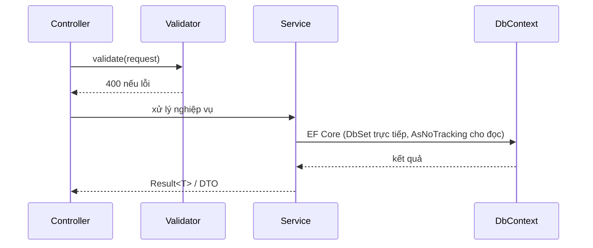

## 11.3 Quy ước code bắt buộc

1. **Controller** chỉ: nhận DTO → gọi Service → map ra DTO trả về. Không chứa logic > 5 dòng; không truy cập `DbContext`.
2. **Service** trả `Result<T>` (Success/Fail + ErrorCode + message); Controller map sang HTTP status qua helper `MapResult`.
3. **Error codes** khai báo tập trung trong `ErrorCodes` static class; message tiếng Việt.
4. **Validation**: FluentValidation, gọi ở Service (hoặc middleware `ValidationPipeline` với MediatR nếu dùng — chọn 1 cách, ghi rõ).
5. **Xác thực JWT**: `AddAuthentication().AddJwtBearer()` + options từ config; `[Authorize(Roles = "...")]` khai báo quyền tối thiểu; các endpoint công khai dùng `[AllowAnonymous]` có chú thích lý do.
6. **EF Core**: cấu hình trong `Configurations/` (Fluent API), không dùng attribute trên entity; `AsNoTracking()` cho truy vấn đọc; upsert `UserProgress` bằng thao tác atomic (kiểm tra + tạo/update trong 1 transaction ngắn).
7. **DI**: đăng ký theo scope trong `Program.cs` (hoặc `CompositionRoot`); interface đặt cạnh implementation.
8. **Logging**: `ILogger<T>` (Serilog gợi ý — cấu hình file + console + structured); không `Console.WriteLine`.
9. **Cấu hình**: `appsettings.json` + biến môi trường `DSA__Jwt__Secret`; không hardcode secret.
10. **Thời gian**: dùng UTC; `DateTimeProvider` wrapper để test.
11. **API versioning**: gói `Asp.Versioning.Http` — `[ApiVersion("1.0")]`, mặc định v1.

## 11.4 Danh sách Service (tối thiểu) và trách nhiệm

| Service | Trách nhiệm chính |
|---|---|
| AuthService | đăng ký, đăng nhập, refresh, logout, khôi phục mật khẩu, chính sách khóa |
| UserService | CRUD người dùng, khóa/mở, đổi vai trò, phê duyệt Teacher, ẩn danh hóa |
| TopicService | cây chủ đề, CRUD, reorder, chặn xóa khi có con |
| LessonService | CRUD bài học, sanitize HTML, gắn mô phỏng, đánh dấu đã học, quyền sở hữu |
| SimulationCatalogService | danh mục mô phỏng + schema (đồng bộ khóa với frontend catalog) |
| ExerciseService | CRUD bài tập/câu hỏi, chấm điểm (single/multi/boolean/dự đoán), chống nộp trùng |
| ProgressService | upsert tiến độ, tổng hợp dashboard, báo cáo giảng viên, xuất CSV |
| FavoriteService | CRUD yêu thích |
| SettingService | cấu hình hệ thống + cache |
| ClassService | CRUD lớp, mã mời 6 ký tự, thêm/xóa sinh viên, gán lộ trình + hạn nộp, báo cáo lớp (số liệu từ ProgressService) |
| CodeRunnerService | chạy code qua sandbox Web Worker client (KHÔNG Judge0 server — G-6), giới hạn FR-9.6, lưu CodeRuns; chấm bài code (test ẩn — gộp CodeSubmissionService, A-2), lịch sử nộp + so sánh 2 lần nộp |
| GamificationService | gộp 5 service cũ (A-2): Tim (vào node trừ atomic + NodeSessions chống double-spend, hồi theo LastHeartAt, session 30p, edge cases 20.4), Gems (kiếm theo sự kiện, giao dịch atomic chống double-spend, shop mua + kho + equip), Quest (sinh 5 quest/ngày theo seed, cập nhật tiến độ, claim thưởng atomic), Streak (eager khi hoạt động — v2.8 + job 00:30 đóng sổ StreakLastProcessed), Premium (gói 1/3/12 tháng, checkout mô phỏng, kích hoạt + log, job hết hạn downgrade + clamp Hearts), Achievement (engine huy hiệu, chống trao 2 lần). Nội bộ tách ≥ 2 module (hearts/session, quest/streak, shop/gems) để giữ testability — vẫn chỉ lộ 1 public seam duy nhất ra Controller (ADR-011) |

## 11.5 Chấm điểm bài tập (đặc tả bắt buộc trong SDD)

- **SINGLE**: `selected` đúng = `AnswerJson[0]` → đúng.
- **MULTI**: đúng khi và chỉ khi tập `selected` == tập đáp án (so sánh tập hợp, không quan tâm thứ tự).
- **BOOLEAN**: `selected[0]` == `AnswerJson[0]`.
- **SIMULATION (dự đoán bước)**: so khớp theo loại: (A) trạng thái người dùng nhập (chuẩn hóa: trim, lowercase cho chuỗi; số so sánh giá trị; mảng so sánh từng phần tử) — linh hoạt chấp nhận: thiếu cuối mảng, dư 0; (B) chọn thao tác — khớp chính xác mã thao tác; (C) thứ tự kéo thả — khớp hoán vị chính xác.
- Điểm câu đúng = `Points`, sai = 0; `Score = Σ Points` của câu đúng; `MaxScore = Σ Points` tất cả câu.
- **Toàn vẹn**: chấm điểm chạy trong 1 giao dịch; lưu `ResultJson` đầy đủ để tái hiện màn kết quả không cần tính lại.

## 11.6 Email (nếu có SMTP)

- Template: đặt lại mật khẩu (FR-1.6), phê duyệt Teacher (FR-1.8), mã 2FA (FR-1.11); gửi bất đồng bộ (hosted service + queue trong DB).
- **QUYẾT ĐỊNH DEV (chốt)**: môi trường dev/staging dùng **SMTP mock MailHog trong docker-compose** (bật mặc định, không cần tài khoản thật); production tùy chọn SMTP thật qua cấu hình. Nếu cấu hình thiếu: ghi log + hiển thị link/mã trong log dev (ghi rõ trong DEPLOY). KHÔNG block luồng đăng ký/đăng nhập khi email chưa gửi được.

---

## 11.7 Đăng ký ADR (Architecture Decision Records — bắt buộc trong SDD Phụ lục)

> Mỗi quyết định kiến trúc quan trọng ghi 1 ADR: Bối cảnh → Quyết định → Hệ quả. Danh sách tối thiểu:

| # | ADR | Quyết định | Lý do tóm tắt |
|---|---|---|---|
| ADR-001 | Sinh bước mô phỏng | Batch sinh trước ở frontend (TypeScript), không backend | bước lùi miễn phí, test dễ, giảm tải server, ≤500ms/100 phần tử |
| ADR-002 | Vẽ trực quan | Canvas cho mảng/cây/đồ thị; DOM cho stack/queue/list | hiệu năng cao cho phần tử nhiều; tương tác chính xác cho phần tử ít |
| ADR-003 | Plugin engine | Registry pattern + interface `SimulationGenerator`/`Renderer` | thêm CTDL/GT không sửa lõi (kiểm chứng TEST mở rộng) |
| ADR-004 | Xác thực | JWT access (memory) + refresh token opaque (cookie HttpOnly) | tránh XSS đánh cắp token; thu hồi được phiên |
| ADR-005 | Nội dung bài học | Rich-text HTML + sanitize server, không Markdown thuần | giảng viên quen Word; kiểm soát XSS |
| ADR-006 | Xóa dữ liệu | Xóa mềm nội dung; ẩn danh hóa tài khoản khi xóa | giữ dữ liệu thống kê; tuân thủ NFR-35 |
| ADR-007 | Báo cáo giảng viên | Tính real-time từ ExerciseSubmissions/UserProgress (không cache phức tạp) | dữ liệu nhỏ (≤200 người dùng), tránh phức tạp |
| ADR-008 | API versioning | `/api/v1/` + giữ v1 6 tháng khi có v2 | ổn định cho frontend đã phát hành |
| ADR-009 | Kiểu dữ liệu bài tập | JSON linh hoạt trong 2 cột (OptionsJson/AnswerJson) | hỗ trợ 4 loại câu hỏi + mở rộng không cần migration |
| ADR-010 | Chấm điểm | Tính toán server-side thuần túy, lưu ResultJson | tái hiện kết quả không cần tính lại; chống gian lận sửa client |
| ADR-011 | Seam Module J | GamificationService là 1 public seam duy nhất cho Module J; nội bộ tách ≥ 2 module (hearts/session, quest/streak, shop/gems) — không mở nhiều service ra Controller | quy mô đồ án nhỏ, 1 điểm vào dễ test; giữ testability qua internal module (v2.4) |
| ADR-012 | Nơi chấm bài code | Chấm trong sandbox Web Worker client (không Judge0 server); test ẩn đóng gói kèm bundle — cam kết "chống lười làm", KHÔNG cam kết chống trích xuất/giả mạo | đơn giản hạ tầng, demo được; chấp nhận giới hạn bảo mật cho đồ án (v2.4 — ghi đè FR-9.3) |

## 11.8 Cấu hình Program.cs và Middleware (trình bày trong SDD dạng danh sách đăng ký)

```csharp
// Thứ tự bắt buộc trong pipeline (Program.cs)
// 1. app.UseMiddleware<RequestLoggingMiddleware>();   // ghi log request (id, path, duration)
// 2. app.UseMiddleware<ErrorHandlingMiddleware>();     // bắt exception → định dạng lỗi chuẩn
// 3. app.UseCors("frontend");                          // CORS theo cấu hình
// 4. app.UseAuthentication();                          // JWT Bearer
// 5. app.UseAuthorization();                           // [Authorize] / [Authorize(Roles)]
// 6. app.MapControllers();
```

- DI scope: `Scoped` cho DbContext + Service; `Singleton` cho Settings cache, TokenService (không state), DateTimeProvider.
- Swagger: bật Development + Staging; tắt Production (trừ khi nội bộ).
- Serilog cấu hình: console (dev) + rolling file (prod, giữ 30 ngày), enrichment: `UserId`, `RequestId`, `CorrelationId`. Ghi log mọi exception + các thao tác nhạy cảm (đăng nhập, thay đổi quyền, CRUD nội dung) — đây là lớp "nhật ký hệ thống" duy nhất của dự án (không có UI xem nhật ký — Module F tinh gọn, xem 3.6).

## 11.9 Email templates (nội dung bắt buộc trong SDD nếu có SMTP)

| Template | Nội dung tối thiểu |
|---|---|
| Đặt lại mật khẩu | Lời chào, link (hết hạn 30 phút), hướng dẫn, lưu ý bảo mật, chữ ký hệ thống |
| Phê duyệt tài khoản giảng viên | Thông báo đã được duyệt, link đăng nhập, vai trò hiện có |
| Từ chối tài khoản giảng viên | Thông báo bị từ chối + lý do chung + cách liên hệ Admin |
| Xác minh email (nếu đổi email) | Mã/link xác minh, hết hạn 24h |

- Mọi email có: tiêu đề `[DSA-Visual] ...`, plain text + HTML, footer liên hệ, không chứa mật khẩu/token thô (token qua link 1 lần).

## 11.11 Ví dụ code backend chuẩn (bắt buộc đưa 2-3 mẫu tương tự vào SDD)

### 11.11.1 Controller mẫu (LessonsController — trích)

```csharp
[ApiController]
[Route("api/v1/lessons")]
[Authorize]
public class LessonsController : ControllerBase
{
    private readonly ILessonService _service;
    public LessonsController(ILessonService service) => _service = service;

    [HttpGet]
    public async Task<ActionResult<PagedResponse<LessonSummaryDto>>> GetLessons(
        [FromQuery] int? topicId, [FromQuery] string? status, [FromQuery] string? q,
        [FromQuery] int page = 1, [FromQuery] int pageSize = 20, CancellationToken ct = default)
    {
        var result = await _service.GetListAsync(CurrentUserId(), CurrentRole(), topicId, status, q, page, pageSize, ct);
        return MapResult(result); // Result<T> → 200/400/401/403/404
    }

    [HttpPost]
    [Authorize(Roles = "TEACHER,ADMIN")]
    public async Task<ActionResult<LessonDto>> Create([FromBody] LessonUpsertRequest request, CancellationToken ct)
    {
        var result = await _service.CreateAsync(CurrentUserId(), request, ct);
        return result.IsSuccess ? CreatedAtAction(nameof(GetLesson), new { id = result.Value!.Id }, result.Value) : MapResult(result);
    }

    private int CurrentUserId() => int.Parse(User.FindFirst(JwtRegisteredClaimNames.Sub)!.Value);
    private string CurrentRole() => User.FindFirst(ClaimTypes.Role)!.Value;
}
```

### 11.11.2 Service mẫu (LessonService — trích, minh họa Result<T> + sanitize + DbContext trực tiếp)

```csharp
public async Task<Result<LessonDto>> CreateAsync(int userId, LessonUpsertRequest req, CancellationToken ct)
{
    var topic = await _db.Topics.AsNoTracking().FirstOrDefaultAsync(t => t.Id == req.TopicId, ct);
    if (topic is null) return Result.Fail<LessonDto>(ErrorCodes.NOT_FOUND, "Chủ đề không tồn tại");

    var sanitized = _htmlSanitizer.Sanitize(req.ContentHtml);
    if (sanitized.Length < 10) return Result.Fail<LessonDto>(ErrorCodes.VALIDATION_FAILED, "Nội dung bài học quá ngắn");

    var lesson = new Lesson
    {
        TopicId = req.TopicId, Title = req.Title.Trim(), Description = req.Description?.Trim(),
        ContentHtml = sanitized, Status = req.Status, SortOrder = req.SortOrder, CreatedBy = userId, CreatedAt = _clock.UtcNow
    };
    _db.Lessons.Add(lesson);
    await _db.SaveChangesAsync(ct);
    _logger.LogInformation("Lesson {LessonId} created by user {UserId}", lesson.Id, userId);
    return Result.Ok(_mapper.Map<LessonDto>(lesson));
}
```

### 11.11.3 Quy ước Result<T>

```csharp
public record Result<T>
{
    public bool IsSuccess { get; init; }
    public T? Value { get; init; }
    public string? ErrorCode { get; init; }
    public string? ErrorMessage { get; init; }
    public Dictionary<string, string[]>? FieldErrors { get; init; }
    public static Result<T> Ok(T value) => new() { IsSuccess = true, Value = value };
    public static Result<T> Fail(string code, string message) => new() { ErrorCode = code, ErrorMessage = message };
    public static Result<T> Fail(string code, string message, Dictionary<string, string[]> fieldErrors) => new() { ... };
}
```

# PHẦN 12 — THIẾT KẾ FRONTEND (VUE.JS 3)

## 12.1 Cấu trúc thư mục

```
frontend/
├── index.html
├── vite.config.ts
├── package.json
├── .env.development / .env.production        # VITE_API_BASE_URL
├── src/
│   ├── main.ts
│   ├── App.vue
│   ├── router/index.ts                        # + guards
│   ├── api/
│   │   ├── client.ts                          # axios instance + interceptors
│   │   ├── auth.ts, lessons.ts, exercises.ts,
│   │   ├── progress.ts, simulations.ts, admin.ts, favorites.ts
│   ├── stores/                                # Pinia
│   │   ├── auth.ts, lesson.ts, simulation.ts, progress.ts, ui.ts
│   ├── views/
│   │   ├── HomeView.vue, LoginView.vue, RegisterView.vue,
│   │   ├── LearnView.vue, LessonDetailView.vue,
│   │   ├── SimulatorView.vue, ExerciseView.vue, SimulationExerciseView.vue,
│   │   ├── DashboardView.vue, FaqView.vue, PrivacyView.vue,
│   │   └── admin/ (AdminLessonsView.vue, AdminUsersView.vue, AdminStatsView.vue, AdminSettingsView.vue)
│   ├── components/
│   │   ├── ui/                                # BaseButton, BaseInput, BaseModal, BaseToast, ...
│   │   ├── simulator/
│   │   │   ├── SimulatorShell.vue
│   │   │   ├── ControlBar.vue
│   │   │   ├── PseudocodePanel.vue
│   │   │   ├── ExplainPanel.vue
│   │   │   ├── InputConfigModal.vue
│   │   │   ├── StatsBadge.vue
│   │   │   └── LegendPanel.vue
│   │   └── lesson/ (LessonCard.vue, TopicTree.vue, RichTextViewer.vue)
│   ├── engines/
│   │   ├── core/ (types.ts, registry.ts, stateMachine.ts, statistics.ts)
│   │   ├── generators/ (sort/bubble.ts, sort/selection.ts, ..., graph/dijkstra.ts)
│   │   ├── renderers/ (arrayRenderer.ts, treeRenderer.ts, graphRenderer.ts,
│   │   │               listRenderer.ts, stackQueueRenderer.ts, hashTableRenderer.ts,
│   │   │               painter/ (canvasPainter.ts, shapes.ts))
│   │   └── catalog.ts                          # ĐĂNG KÝ TOÀN BỘ MÔ PHỎNG — nguồn duy nhất
│   ├── composables/ (useSimulation.ts, useDebounce.ts, useToast.ts)
│   ├── styles/ (tokens.css, global.css)
│   └── utils/ (format.ts, validators.ts)
└── tests/ (unit: engines + stores; e2e: playwright)
```

## 12.2 Quản lý trạng thái (Pinia) — đặc tả từng store

| Store | State | Actions | Getters |
|---|---|---|---|
| auth | `user`, `accessToken`, `status` | `login()`, `register()`, `logout()`, `refresh()`, `fetchMe()` | `isAuthenticated`, `role` |
| lesson | `topics`, `lessonsByTopic`, `currentLesson`, `loading` | `fetchTopics()`, `fetchLessons()`, `fetchLesson(id)`, `markViewed(id)` | `progressByTopic` |
| simulation | `currentSim`, `steps`, `currentIndex`, `speed`, `status`, `stats`, `inputConfig` | `loadSim(key)`, `configureInput()`, `play()`, `pause()`, `stepForward()`, `stepBack()`, `jumpTo()`, `reset()`, `setSpeed()` | `currentStep`, `isFirst`, `isLast` |
| progress | `overview`, `lessonProgress`, `reportData` | `fetchOverview()`, `fetchLessonProgress()`, `fetchReport()` | — |
| gamification | `hearts`, `heartsMax`, `lastHeartAt`, `gems`, `streakDays`, `xp`, `level`, `quests`, `inventory` | `fetchHearts()`, `enterNode(nodeId)`, `fetchQuests()`, `claimQuest(id)`, `fetchInventory()`, `buyItem(id)`, `equipItem(id)` | `heartsPercent`, `level`, `questDone` |
| classStore | `classes`, `currentClass`, `members`, `assignments` | `fetchClasses()`, `joinClass(code)`, `fetchClass(id)`, `assignContent()` | — |
| codeRunner | `editorCode`, `runState`, `lastRun`, `submissions` | `loadTemplate(key)`, `run()`, `submit()`, `fetchHistory()` | `isRunning` |
| leaderboard | `tab`, `rows`, `myRank` | `fetchBoard(tab)` | — |
| ui | `toasts`, `modalState`, `sidebarOpen` | `showToast()`, `openModal()`, `closeModal()` | — |

## 12.3 Axios client & interceptors

- `baseURL = import.meta.env.VITE_API_BASE_URL` (mặc định `/api/v1` qua Vite proxy dev).
- Request interceptor: gắn `Authorization: Bearer`.
- Response interceptor: (1) 401 → thử refresh 1 lần (cờ `_retry`) → thất bại → logout + về `/login`; (2) 400/422 → parse `error.message` hiển thị toast + focus field; (3) 429 → toast + disable nút theo `Retry-After`; (4) 500 → toast "Đã có lỗi xảy ra, vui lòng thử lại".

## 12.4 Router & guards

| Route | Vai trò tối thiểu | Ghi chú |
|---|---|---|
| `/`, `/help`, `/privacy`, `/login`, `/register` | Công khai | đã đăng nhập thì chuyển khỏi login/register |
| `/learn`, `/learn/:lessonId` | Đã đăng nhập | **redirect** `/learn` → `/path` (20.5.6) |
| `/simulator/:key` | Đã đăng nhập hoặc key demo | trừ tim theo 20.4; key demo không trừ |
| `/exercise/:id` | Student+ | truy cập qua Ladder Bậc 1 / final test |
| `/dashboard` | Student+ | **redirect** → `/profile` (20.5.6) |
| `/path`, `/path/:topicId` | Đã đăng nhập | bản đồ node |
| `/path/:topicId/node/:nodeId` | Đã đăng nhập | Node Hub (Màn 31) — guard theo Learning Path; vào node trừ tim (20.4) |
| `/ladder/:nodeId`, `/ladder/:nodeId/lab` | Đã đăng nhập | trong session 30p đã trừ → miễn phí |
| `/code/:key` | Đã đăng nhập | dùng chung Bậc 3 + Module I độc lập |
| `/benchmark/:k1/:k2`, `/cheatsheet` | Đã đăng nhập | benchmark MIỄN PHÍ tim (20.4) |
| `/profile`, `/quests`, `/leaderboard`, `/shop`, `/premium`, `/account/subscription` | Đã đăng nhập | profile = Màn 32 (tabs) |
| `/classes`, `/classes/:id`, `/classes/:id/report` | Đã đăng nhập | report: theo vai trò (Teacher xem báo cáo, Student xem tiến độ lớp) |
| `/admin/**` | Teacher/Admin | meta `{ roles: ['TEACHER','ADMIN'] }` |

## 12.5 useSimulation composable (hợp đồng)

```typescript
export function useSimulation(key: string | Ref<string>) {
  const sim = ref<Simulation | null>(null);
  const status = ref<'idle' | 'running' | 'paused' | 'finished'>('idle');
  const currentIndex = ref(0);
  const speed = ref(1);                    // 0.25 | 0.5 | 1 | 2 | 4
  let timer: number | null = null;

  async function load(input?: InputConfig): Promise<void> { /* registry → generate → step 0 */ }
  function play(): void { /* interval theo speed */ }
  function pause(): void;
  function stepForward(): void;
  function stepBack(): void;
  function jumpTo(index: number): void;
  function setSpeed(v: number): void;
  function reset(): void;
  onUnmounted(() => { if (timer) clearInterval(timer); });
}
```

- Timing: `interval = 1200 / speed` ms (0.25x = 1200ms, 1x = 300ms, 4x = 75ms).

## 12.6 Chuẩn code frontend bắt buộc

1. TypeScript `strict: true`; không dùng `any` (ngoại lệ có chú thích).
2. Composition API `<script setup>`; không Options API.
3. ESLint (vue/recommended + TS) + Prettier; tự động format khi lưu.
4. Component UI không chứa logic nghiệp vụ; giao tiếp cha-con qua props/events; trạng thái dùng chung qua Pinia.
5. i18n sẵn sàng: tất cả chuỗi giao diện nằm trong `src/i18n/vi.ts` (bản MVP chỉ tiếng Việt nhưng không nhúng chuỗi cứng vào component).
6. Tên file: PascalCase cho component (`LessonCard.vue`), camelCase cho hook (`useSimulation.ts`).
7. Không CSS global tràn lan: dùng CSS modules hoặc scoped; biến thiết kế trong `tokens.css`.

## 12.7 Đặc tả component UI quan trọng (bảng props/events — bắt buộc trong SDD)

### 12.7.1 `ControlBar.vue`
| Props | Type | Mặc định | Mô tả |
|---|---|---|---|
| status | 'idle'\|'running'\|'paused'\|'finished' | 'idle' | trạng thái máy trạng thái |
| currentIndex | number | 0 | |
| totalSteps | number | 0 | |
| speed | number | 1 | |
| disabled | boolean | false | khi đang sinh bước |

| Events | Payload | Mô tả |
|---|---|---|
| play | — | yêu cầu phát |
| pause | — | yêu cầu tạm dừng |
| step-forward / step-back | — | |
| jump-to | number | nhảy tới bước |
| speed-change | number | đổi tốc độ |

### 12.7.2 `PseudocodePanel.vue`
| Props | Type | Mô tả |
|---|---|---|
| lines | string[] | mảng dòng mã giả |
| activeLine | number | dòng active (1-based, 0 = không có) |
| variables | Record<string, unknown> | biến kèm giá trị hiển thị chip |
| collapsed | boolean | thu gọn |

### 12.7.3 `VisualizationCanvas.vue`
| Props | Type | Mô tả |
|---|---|---|
| structure | Structure \| null | snapshot bước hiện tại |
| kind | string | chọn renderer |
| options | RenderOptions | showIndex, showValues, zoom |
| annotations | string[] | chú thích động |
| stats | Statistics | hiển thị góc |

| Events | Payload |
|---|---|
| ready | canvas ref sau khi mount |
| interaction | click vào phần tử (mở tooltip giải thích phần tử — TB) |

### 12.7.4 `InputConfigModal.vue`
- Nhận `inputSchema` (từ generator) → tự render form động (mọi loại field trong schema); emit `apply(config)`; validate bằng schema trước khi đóng.
- Trạng thái: `open`, `saving`, `error`.

### 12.7.5 `BaseModal.vue` (dùng chung)
| Props | Mô tả |
|---|---|
| open | boolean |
| title | string |
| size | 'sm'\|'md'\|'lg' (mặc định md) |
| closeOnBackdrop | boolean (true) |
| confirmText / cancelText | string (tiếng Việt) |
| danger | boolean (nút xác nhận đỏ) |

| Events | Mô tả |
|---|---|
| confirm / cancel | xác nhận / hủy |

## 12.8 Đặc tả state machine mô phỏng (bắt buộc trong SDD)

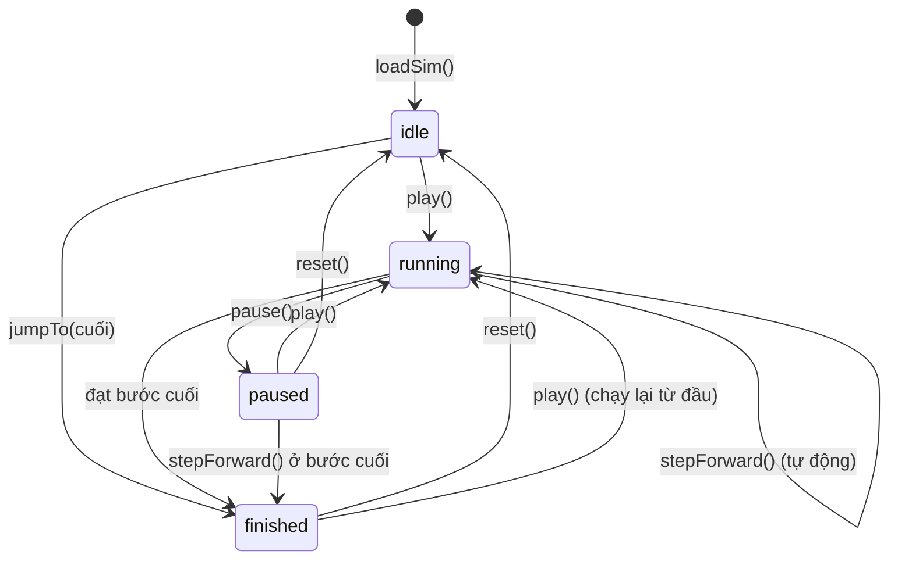

- Mọi chuyển trạng thái phát event qua store `simulation` để UI (nút, phím tắt) phản ứng thống nhất.
- Khi `inputConfig` thay đổi hợp lệ: `idle → loadSim(input)` (reset toàn bộ).

## 12.9 i18n và nội dung chuỗi giao diện

- File `src/i18n/vi.ts` chứa toàn bộ chuỗi: định dạng `{ key: 'Giá trị' }` theo namespace: `auth.*`, `lesson.*`, `simulator.*`, `exercise.*`, `progress.*`, `admin.*`, `common.*`, `errors.*`.
- Component dùng `useI18n()` (vue-i18n v9+); KHÔNG nhúng chuỗi tiếng Việt trực tiếp vào template (check bằng ESLint rule tùy chỉnh — tùy chọn).
- Lỗi API: interceptor ánh xạ `error.code` → `errors.{code}`; nếu thiếu key → hiển thị message từ backend (đã là tiếng Việt).
- Ngày giờ: dùng `Intl.DateTimeFormat('vi-VN')`; số: `Intl.NumberFormat('vi-VN')`.
- Các chuỗi động (VD: giải thích bước mô phỏng) sinh từ generator — lưu ở `engines/i18n.ts` nếu tách đa ngôn ngữ sau này; bản MVP: viết trực tiếp tiếng Việt trong generator (ghi chú tại đây).

## 12.10 Xử lý lỗi frontend (bảng chuẩn)

| Tình huống | Hành vi frontend |
|---|---|
| 400 + field | hiển thị lỗi dưới trường tương ứng; focus trường đầu tiên |
| 400 không field | toast đỏ + giữ nguyên trạng thái trang |
| 401 (sau khi refresh thất bại) | logout + chuyển `/login` kèm tham số `?redirect=...` để quay lại sau khi đăng nhập |
| 403 | toast "Bạn không có quyền thực hiện thao tác này" + chuyển về trang phù hợp |
| 404 | trang 404 thân thiện (nếu navigation) hoặc toast + nút quay lại |
| 422 | toast với message cụ thể |
| 429 | toast + khóa nút tới khi hết Retry-After (đếm ngược hiển thị) |
| 5xx | toast "Đã có lỗi xảy ra, vui lòng thử lại sau" + ghi log tự động (console + report) |
| Mất mạng | banner liên tục "Mất kết nối" + tự thử lại khi online (listener `online`) |

## 12.11 Phân trang và trạng thái tải (pattern bắt buộc)

1. Mọi danh sách dùng `usePagination` composable: state `{ items, page, pageSize, total, loading, error }`.
2. Khi tải: skeleton list (5 dòng) — không spinner trung tâm cho danh sách dài.
3. Khi lỗi tải: block lỗi + nút "Thử lại".
4. Khi trống: EmptyState (minh họa + văn bản + CTA).

## 12.12 Composables dùng chung (đặc tả hợp đồng trong SDD)

| Composable | Chức năng | Nơi dùng |
|---|---|---|
| `usePagination` | state phân trang + fetcher | mọi danh sách |
| `useDebounce` | trễ hành động 300ms | tìm kiếm (FR-2.5) |
| `useKeyboardShortcuts` | bản đồ phím tắt, bật theo focus | trang mô phỏng (FR-3.5) |
| `useInterval` | đồng hồ tự dọn khi unmount | đếm ngược bài tập |
| `useToast` | thông báo qua store ui | toàn app |
| `useConfirm` | modal xác nhận dạng promise | mọi thao tác xóa |

```typescript
// Mẫu hợp đồng usePagination
export function usePagination<T>(fetcher: (page: number, pageSize: number) => Promise<PagedResponse<T>>) {
  return {
    items: ref<T[]>([]), page: ref(1), pageSize: ref(20),
    total: ref(0), totalPages: ref(1), loading: ref(false), error: ref<Error | null>(null),
    load(): Promise<void>, goToPage(p: number): Promise<void>, refresh(): Promise<void>,
  };
}
```

## 12.13 Cấu hình Vite (bắt buộc trong SDD)

```ts
// vite.config.ts — điểm quan trọng
export default defineConfig({
  plugins: [vue()],
  build: {
    target: 'es2020',
    rollupOptions: { output: { manualChunks: { engine: ['@/engines/core'], vendor: ['vue', 'pinia', 'vue-router'] } } },
  },
  server: { port: 5173, proxy: { '/api': { target: 'http://localhost:5000', changeOrigin: true } } },
});
```

- Lazy-load router cho các trang lớn (`SimulatorView`, `ExerciseView`, `admin/*`).
- Mã phân tích bundle: `vite build --mode production && npx vite-bundle-visualizer`.
- Biến env: `VITE_API_BASE_URL` (mặc định `/api/v1` qua proxy dev); không đặt secret nào ở frontend.

## 12.14 Ví dụ code store auth (chuẩn mẫu cho các store — trong SDD)

```typescript
// stores/auth.ts
export const useAuthStore = defineStore('auth', () => {
  const user = ref<UserSummary | null>(null);
  const accessToken = ref<string | null>(null);
  const status = ref<'idle' | 'loading' | 'authenticated' | 'error'>('idle');
  let refreshPromise: Promise<string> | null = null;

  async function login(email: string, password: string) { /* POST /auth/login → set token + user */ }
  async function register(payload: RegisterPayload) { /* POST /auth/register → tự động login */ }
  async function refresh() {
    // singleton promise: nhiều request 401 cùng lúc chỉ gọi 1 lần refresh
    if (!refreshPromise) refreshPromise = api.post('/auth/refresh').then(r => { accessToken.value = r.accessToken; return r.accessToken; });
    try { return await refreshPromise; } finally { refreshPromise = null; }
  }
  async function logout() { /* POST /auth/logout + xóa state + về /login */ }
  const isAuthenticated = computed(() => !!accessToken.value);
  const role = computed(() => user.value?.role ?? null);
  return { user, accessToken, status, login, register, refresh, logout, isAuthenticated, role };
});
```

- Interceptor 401 dùng `authStore.refresh()` với cờ `_retry` (chỉ thử 1 lần/request).
- Token chỉ lưu trong memory của Pinia (mất khi F5 → refresh qua cookie khôi phục phiên) — ghi rõ quyết định này trong SDD.

## 12.15 Kiểm thử store (mẫu Vitest bắt buộc cho các store chính)

```typescript
// stores/auth.spec.ts (trích)
describe('auth store', () => {
  it('login thành công ghi token và user', async () => {
    vi.spyOn(api, 'post').mockResolvedValue({ accessToken: 'abc', user: mockUser });
    const store = useAuthStore();
    await store.login('a@b.c', 'Pass@123');
    expect(store.accessToken).toBe('abc');
    expect(store.status).toBe('authenticated');
  });
  it('login thất bại giữ nguyên trạng thái', async () => {
    vi.spyOn(api, 'post').mockRejectedValue({ status: 401 });
    const store = useAuthStore();
    await expect(store.login('a@b.c', 'sai')).rejects.toBeTruthy();
    expect(store.status).toBe('error');
  });
});
```

# PHẦN 13 — THIẾT KẾ BẢO MẬT (CHI TIẾT)

## 13.1 Đặc tả từng lớp bảo vệ (viết đầy đủ trong SDD mục Bảo mật)

| Lớp | Biện pháp | Chi tiết triển khai |
|---|---|---|
| Mật khẩu | Hash mạnh | bcrypt (cost 12) hoặc PBKDF2-SHA256 100.000 vòng + salt ngẫu nhiên 16 byte; so sánh thời gian hằng số |
| Token | JWT HS256 | Secret ≥ 32 ký tự từ env; claims: `sub` (userId), `role`, `iat`, `exp`, `jti`; access 60 phút; KHÔNG chứa dữ liệu nhạy cảm |
| Refresh token | Opaque, có hash | chuỗi 128-bit ngẫu nhiên, lưu `SHA256(token)` trong DB (không lưu token thô); cookie `HttpOnly; Secure; SameSite=Strict; Path=/api/v1/auth`; thu hồi khi logout/đổi mật khẩu; **rotate-invalidate**: token cũ bị thu hồi ngay sau mỗi lần refresh, phát hiện replay token đã thu hồi → thu hồi toàn bộ chuỗi phiên (v2.4) |
| Tấn công XSS | Sanitize nội dung | rich-text: whitelist tag/attr qua `Ganss.Xss` (C#) / `DOMPurify` (frontend) khi render; không dùng `v-html` với dữ liệu người dùng nếu chưa sanitize; CSP header: `default-src 'self'` + đúng nguồn (ảnh, font, api) |
| Tấn công SQLi | ORM + tham số hóa | EF Core tham số hóa 100%; chặn raw SQL trừ migration (review) |
| Tấn công CSRF | SameSite + origin check | cookie SameSite=Strict; backend kiểm tra header `Origin`/`Referer` cho mutation nếu cần; KHÔNG dùng cookie cho access token (token trong header) |
| IDOR | Kiểm tra sở hữu | mọi truy vấn theo id người dùng: so `userId` từ token với tài nguyên (Service query filter `Where(u => u.UserId == currentUserId)`) |
| Path traversal | Chặn tên file | upload ảnh: validate extension + magic bytes, tên file sinh ngẫu nhiên, lưu ngoài webroot, serve qua controller có authorization |
| DoS | Rate limit | `AspNetCoreRateLimit` hoặc middleware tự viết: buckets theo IP + userId; giá trị theo NFR-12 |
| Injection khác | Input validation | FluentValidation mọi DTO: độ dài, phạm vi, định dạng; JSON parse an toàn |
| Bảo mật vận chuyển | HTTPS/HSTS | production: TLS 1.2+, HSTS 1 năm, chuyển 301 HTTP→HTTPS; CORS: chỉ `VITE_APP_ORIGIN` khai báo |
| Lộ thông tin | Error handling | `ErrorHandlingMiddleware` trả định dạng chuẩn, ẩn chi tiết (log nội bộ full) |
| Dependency | Quét lỗ hổng | `dotnet list package --vulnerable` + `npm audit` trong CI; cập nhật patch hằng tháng |

## 13.2 Chuẩn JWT + Refresh (luồng chi tiết trong SDD dạng sequenceDiagram)

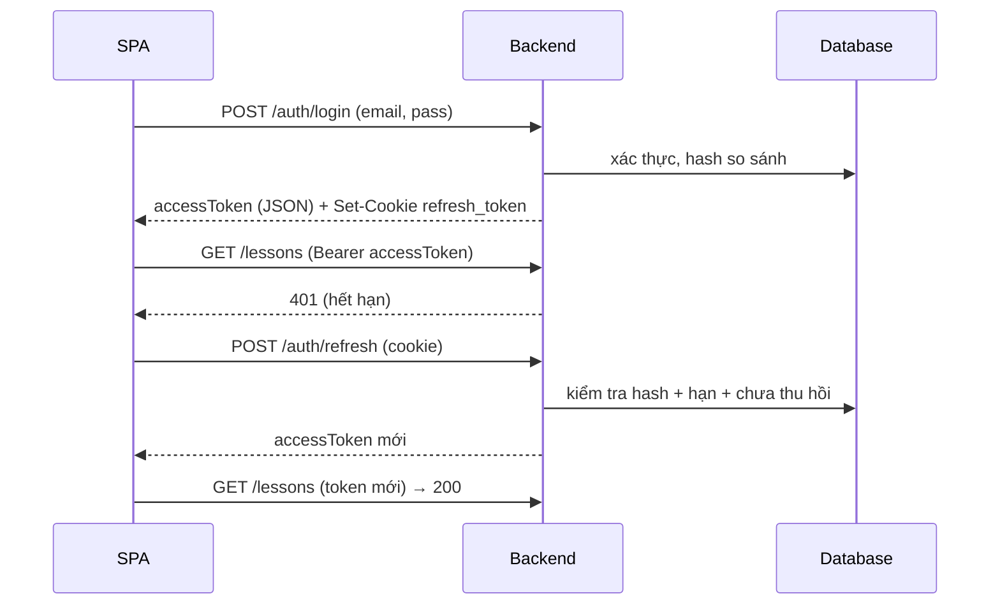

## 13.3 Kiểm thử bảo mật (bắt buộc trong TEST_PLAN)

1. Gửi token giả/sai chữ ký → 401.
2. Student gọi endpoint Teacher/Admin → 403.
3. Truy cập `UserProgress` của user khác bằng id khác → 404 (không 403 — không lộ sự tồn tại).
4. Nộp HTML `<script>` trong nội dung bài học → sanitize, render không thực thi.
5. Chèn `' OR 1=1 --` vào tham số → không lỗi SQL, trả kết quả an toàn.
6. 6 lần đăng nhập sai liên tiếp → khóa tạm (429/403) + log.
7. Upload file `.exe` giả `.png` → bị từ chối.
8. Xóa refresh token khi đổi mật khẩu → phiên cũ hết hiệu lực.

---

# PHẦN 14 — CHIẾN LƯỢC KIỂM THỬ

## 14.1 Kim tự tháp kiểm thử

| Tầng | Công cụ | Mục tiêu độ bao phủ |
|---|---|---|
| Unit — Generator | Vitest | ≥ 90% dòng code engines/ |
| Unit — Store/Composable | Vitest + Vue Test Utils | ≥ 70% |
| Unit — Backend Service | xUnit | ≥ 60% (ưu tiên Auth, Exercise, Progress) |
| Integration — API | xUnit + WebApplicationFactory + Testcontainers (SQL Server) | 100% endpoint chính (mọi HTTP status nhánh) |
| E2E — luồng người dùng | Playwright | 12 luồng chính (đăng ký, học, mô phỏng, bài tập, tiến độ, admin CRUD) |
| Hiệu năng | k6 + Lighthouse | theo NFR-1, NFR-4 |
| Bảo mật | Thủ công theo checklist 13.3 + OWASP ZAP (cơ bản) | 13.3 + quét cơ bản |

## 14.2 Danh sách test case bắt buộc (tối thiểu — TEST_PLAN phải mở rộng đầy đủ) — BỔ SUNG: các nhóm TEST-B-133..183 (FR-2.10, FR-3.20/3.20b, FR-4.11/4.12, FR-7.6, FR-9.6, FR-10.1→10.7) BẮT BUỘC có trong TEST_PLAN (nguồn: ma trận 17.15); riêng logic trừ tim (FR-10.1) tối thiểu 3 test case biên theo Phần 21 mục 4.

### Backend — mỗi mục ≥ 3 test case (hợp lệ, cận biên, không hợp lệ)
1. Register: thành công / email trùng (409) / mật khẩu yếu (400 kèm details) / domain không cho phép.
2. Login: đúng (200) / sai mật khẩu (401) / khóa tạm (429) / tài khoản bị khóa (403).
3. Refresh: hợp lệ (200) / hết hạn (401) / đã thu hồi (401) / cookie thiếu (401).
4. Lessons CRUD: Teacher tạo → Student không thấy draft; Teacher sửa bài không phải của mình → 403; xóa → mềm.
5. Submit exercise: đúng đáp án → đúng điểm; MULTI chọn thiếu/thừa → 0; dự đoán bước chuẩn hóa đầu vào; nộp trùng → 422.
6. Progress: xem bài → upsert; làm lại bài tập → BestScore giữ max; báo cáo giảng viên chỉ thấy người học của bài mình.
7. Phân quyền: toàn bộ ma trận Phần 5.2 với cả 3 vai trò (test theory qua xUnit `[Theory]`).

### 14.2A Ví dụ test case hoàn chỉnh (mẫu bắt buộc — TEST_PLAN phải viết đúng định dạng này)

#### TEST-B-001 | Đăng ký tài khoản thành công | FR-1.1
| Mục | Nội dung |
|---|---|
| Tiền điều kiện | Chưa tồn tại email trong hệ thống |
| Bước thực hiện | 1. Gửi `POST /auth/register` body `{displayName:"Nguyễn Minh", email:"minh@university.edu.vn", password:"MatKhau@123", isTeacher:false}` 2. Kiểm tra response 3. Đăng nhập lại với tài khoản vừa tạo |
| Kỳ vọng | 1. 201 + user id mới 2. Email lowercase được chuẩn hóa 3. Đăng nhập thành công (200) |
| Kết quả thực tế | [ ] PASS [ ] FAIL — ghi chú: |

#### TEST-B-002 | Đăng ký với email trùng | FR-1.1
| Mục | Nội dung |
|---|---|
| Tiền điều kiện | Email `minh@university.edu.vn` đã tồn tại |
| Bước thực hiện | Gửi lại request đăng ký với email trên |
| Kỳ vọng | 409 + `{code:"EMAIL_EXISTS", message:"Email đã được sử dụng", field:"email"}`; KHÔNG tạo tài khoản mới |
| Kết quả thực tế | [ ] PASS [ ] FAIL — ghi chú: |

#### TEST-E-001 | Bubble sort — mảng đã sắp xếp | FR-3.1, FR-3.7
| Mục | Nội dung |
|---|---|
| Dữ liệu | `[1,2,3,4,5]` |
| Bước thực hiện | Gọi `QuickSortGenerator.generate({values:[1,2,3,4,5]})` |
| Kỳ vọng | 1. Bước cuối: mảng = [1,2,3,4,5], mọi phần tử `done` 2. Số bước ≤ 40 3. Bộ đếm `swaps = 0` 4. Tồn tại bước kết thúc sớm (dòng 9 — swapped=false) 5. Mọi `explanation` khác rỗng, `pseudocodeLine` trong [1..10] |
| Kết quả thực tế | [ ] PASS [ ] FAIL — ghi chú: |

#### TEST-E-002 | Bubble sort — mảng giảm dần (worst case) | FR-3.1, FR-3.9
| Mục | Nội dung |
|---|---|
| Dữ liệu | `[5,4,3,2,1]` |
| Kỳ vọng | 1. Bước cuối: `[1,2,3,4,5]` 2. `comparisons = 10` (n(n-1)/2) 3. `swaps = 10` 4. Số bước = 1 + 10×2 + 10×1 + 4×2 (vòng ngoài) ≈ đúng chuẩn (tính chính xác khi viết TEST_PLAN) |
| Kết quả thực tế | [ ] PASS [ ] FAIL — ghi chú: |

#### TEST-API-001 | Student không được truy cập quản trị | NFR-10
| Mục | Nội dung |
|---|---|
| Tiền điều kiện | Token Student hợp lệ |
| Bước thực hiện | Gọi `GET /users` và `POST /lessons` với token Student |
| Kỳ vọng | 403 + `{code:"FORBIDDEN"}` cho cả 2 |
| Kết quả thực tế | [ ] PASS [ ] FAIL — ghi chú: |

#### TEST-UI-001 | E2E luồng học tập hoàn chỉnh | AC-1
| Mục | Nội dung |
|---|---|
| Tiền điều kiện | Backend + Frontend chạy; tài khoản mới tạo qua UI |
| Bước thực hiện | 1. `/register` tạo tài khoản 2. `/login` 3. `/learn` mở bài "Bubble Sort" 4. Mở mô phỏng, nhấn Phát, đợi 2s, Tạm dừng, Bước lùi 2 lần, kéo thanh tiến trình tới bước cuối 5. Về trang bài, làm bài tập (chọn đúng hết), nộp 6. `/dashboard` kiểm tra tiến độ |
| Kỳ vọng | Toàn bộ luồng không lỗi; điểm = maxScore; dashboard hiển thị bài đã xem + điểm |
| Kết quả thực tế | [ ] PASS [ ] FAIL — ghi chú: |

#### TEST-PERF-001 | Sinh bước mảng 100 phần tử | NFR-2
| Mục | Nội dung |
|---|---|
| Bước thực hiện | 1. Seed dữ liệu 100 phần tử ngẫu nhiên 2. Đo thời gian `generate()` bằng performance.now() 3. Lặp 50 lần lấy trung bình |
| Kỳ vọng | Trung bình ≤ 500ms; không lần nào > 800ms |
| Kết quả thực tế | [ ] PASS [ ] FAIL — ghi chú: |

### Frontend — engines
1. Với mỗi GT × mỗi nhóm dữ liệu N1-N7 (Phần 8.8): bước cuối đạt điều kiện kết thúc; bộ đếm nằm trong khung lý thuyết; mọi bước có `explanation` ≠ rỗng; `pseudocodeLine` hợp lệ.
2. State machine: play→pause→play→finish; bước lùi về 0 vô hiệu nút; jumpTo giữa chừng.
3. Bất biến Step: không mutate sau render (Object.freeze test).
4. Registry: `getSimulation` trả đúng instance; key trùng lặp → lỗi rõ ràng khi dev.

### E2E (Playwright)
1. Luồng: đăng ký → login → xem bài → chạy mô phỏng (điều khiển đầy đủ) → làm bài tập → nộp → xem kết quả → dashboard.
2. Demo công khai không cần login.
3. Guard: chưa đăng nhập vào `/dashboard` → chuyển `/login`.
4. Admin: khóa user → user đó đăng nhập bị chặn.

## 14.5 Kịch bản kiểm thử hiệu năng chi tiết (bắt buộc trong TEST_PLAN)

| ID | Kịch bản | Cấu hình | Ngưỡng | Điều kiện pass |
|---|---|---|---|---|
| TEST-PERF-001 | Sinh bước mảng 100 phần tử (cả 5 GT sắp xếp) | 50 lần chạy | ≤ 500ms TB | 100% lần chạy < 800ms |
| TEST-PERF-002 | Sinh bước đồ thị 50 đỉnh (Dijkstra/BFS/DFS) | 20 lần chạy | ≤ 1s TB | 100% < 1.5s |
| TEST-PERF-003 | Điều hướng 1000 bước liên tục (step forward) | Chrome desktop | ≥ 55 FPS | trung bình ≥ 55 |
| TEST-PERF-004 | API GET /lessons (1000 bài học, phân trang 20) | 50 VU × 5 phút | p95 ≤ 800ms | không lỗi 5xx |
| TEST-PERF-005 | POST /exercises/{id}/submit (bài 10 câu) | 20 VU song song | p95 ≤ 1.5s | chấm điểm đúng 100% |
| TEST-PERF-006 | Login đồng thời | 50 VU × 30s | p95 ≤ 1s | 0 lỗi |
| TEST-PERF-007 | Tải SPA lần đầu (cold cache) | Chrome + Lighthouse | FCP ≤ 1.5s | bundle ≤ 500KB |
| TEST-PERF-008 | Đồng thời tổng hợp (hỗn hợp 70% đọc, 30% ghi) | 200 VU × 15 phút | p95 ≤ 1.2s | 0 lỗi 5xx |

## 14.6 Báo cáo kết quả kiểm thử (định dạng bảng tổng kết bắt buộc)

| Nhóm test | Tổng số | PASS | FAIL | Không kiểm thử | Ghi chú |
|---|---|---|---|---|---|
| Backend (TEST-B) | 0 | 0 | 0 | 0 | điền sau khi chạy |
| Engine (TEST-E) | 0 | 0 | 0 | 0 | |
| API (TEST-API) | 0 | 0 | 0 | 0 | |
| E2E (TEST-UI) | 0 | 0 | 0 | 0 | |
| Bảo mật (TEST-SEC) | 0 | 0 | 0 | 0 | |
| Hiệu năng (TEST-PERF) | 0 | 0 | 0 | 0 | |
| UX (TEST-UX) | 0 | 0 | 0 | 0 | |
| **Tổng** | **0** | **0** | **0** | **0** | |

- Mọi FAIL phải có: nguyên nhân, mức độ (cao/TB/thấp), người sửa, ngày sửa, ngày pass lại.
- Đính kèm: ảnh chụp màn hình cho FAIL UI; log trích đoạn cho FAIL API.

## 14.7 Công cụ và cách chạy (chi tiết hóa cho tester)

1. **Vitest**: `npm run test:unit` — chạy mọi file `*.spec.ts` trong `src/` và `tests/unit/`.
2. **xUnit**: `dotnet test --filter "Category=Integration"` — cần Docker (Testcontainers) chạy SQL Server tạm.
3. **Playwright**: `npm run test:e2e` — cần backend dev + `npm run build && npx playwright install`.
4. **k6**: `k6 run tests/load/login.js` — scripts trong `tests/load/`.
5. **Lighthouse**: CI job chạy trên URL staging.

## 14.8 Quy ước viết test case trong TEST_PLAN

| Trường | Quy tắc |
|---|---|
| ID | TEST-B-001 (backend), TEST-E-001 (engine), TEST-API-001, TEST-UI-001, TEST-SEC-001, TEST-PERF-001, TEST-UX-001 |
| Tiêu đề | `<Hành động> + <điều kiện>` (VD: "Đăng ký với email trùng") |
| Tiền điều kiện | dữ liệu/tài khoản cần chuẩn bị |
| Bước thực hiện | đánh số, đủ chi tiết để tester khác chạy lại |
| Kỳ vọng | kết quả cụ thể (status code, nội dung response, hành vi UI) |
| Tham chiếu | mã FR/NFR/AC tương ứng |
| Kết quả | PASS/FAIL + ghi chú |

## 14.9 Ngưỡng chất lượng trước khi bàn giao (Definition of Done kiểm thử)

1. 100% test case nhóm B/E/API của FR mức Cao: PASS.
2. FAIL còn mở: 0 lỗi mức cao; ≤ 3 lỗi TB (có kế hoạch sửa); lỗi thấp được ghi backlog.
3. Độ bao phủ generator ≥ 90% (kiểm tra bằng c8/Istanbul).
4. Kiểm thử hiệu năng 8 kịch bản đạt ngưỡng.
5. Kiểm thử bảo mật 13.3: toàn bộ PASS.

## 14.11 Giao thức kiểm thử UX (bắt buộc trong TEST_PLAN)

| Mục | Chi tiết |
|---|---|
| Số người tham gia | 5 người (không phải thành viên nhóm; 3 người chưa từng dùng hệ thống tương tự) |
| Nhiệm vụ 1 | Tạo tài khoản và mở bài học đầu tiên (≤ 5 phút) |
| Nhiệm vụ 2 | Chạy mô phỏng bubble sort với dữ liệu tự nhập (≤ 2 phút) |
| Nhiệm vụ 3 | Làm 1 bài tập trắc nghiệm và xem kết quả (≤ 5 phút) |
| Nhiệm vụ 4 | Tìm bài học bằng ô tìm kiếm (≤ 1 phút) |
| Nhiệm vụ 5 | Xem báo cáo tiến độ cá nhân (≤ 2 phút) |
| Ghi nhận | quay màn hình + ghi chú: thời gian hoàn thành, chỗ lúng túng, phát biểu của người dùng |
| Đo lường | tỷ lệ hoàn thành (target 100% NV1-5), thời gian TB (theo 7.7), SUS sau khi test |
| Báo cáo | bảng kết quả + danh sách vấn đề UX kèm mức độ ưu tiên + đề xuất sửa |

## 14.12 Danh sách vấn đề UX mẫu (định dạng ghi nhận)

| # | Mô tả vấn đề | Màn hình | Tần suất gặp | Mức độ | Đề xuất sửa |
|---|---|---|---|---|---|
| UX-1 | Người dùng không tìm thấy nút "Cấu hình lại" | Màn 05 | 4/5 | Cao | Đổi nhãn thành "Đổi dữ liệu" + đưa lên thanh điều khiển |
| UX-2 | Không rõ ô màu xám mờ nghĩa là gì | Màn 05 | 3/5 | TB | Bổ sung vào legend + tooltip |
| UX-3 | Bấm nộp bài không thấy xác nhận | Màn 06 | 2/5 | TB | Thêm trạng thái loading + nút vô hiệu khi đang gửi |

## 14.13 Dữ liệu kiểm thử

- Seed riêng cho test (`TestSeed`): 20 user (3 vai trò), 5 topic, 12 bài học, 8 bài tập, 200 bản ghi tiến độ; không dùng seed production.
- Dữ liệu "vàng" (golden data) cho generator: file JSON tham chiếu kết quả chuẩn, sinh 1 lần và xem lại khi sửa thuật toán.

## 14.4 Quy trình chạy (ghi vào DEPLOY và README dev)

| Bước | Lệnh (tham khảo — điều chỉnh theo thực tế) |
|---|---|
| Unit test frontend | `npm run test:unit` |
| Lint frontend | `npm run lint` |
| Build frontend | `npm run build` |
| Test backend | `dotnet test` |
| E2E | `npm run test:e2e` (cần build + chạy backend) |
| CI | pipeline: lint → unit → build → integration → e2e → deploy (Phần 15.3) |

---

# PHẦN 15 — TRIỂN KHAI VÀ VẬN HÀNH

## 15.1 Kiến trúc triển khai (viết thành sơ đồ Mermaid trong DEPLOY.md)

```mermaid
graph LR
    User((Người dùng)) --> LB[Nginx/Reverse Proxy<br/>443 TLS + static files]
    LB --> FE[Frontend static<br/>dist/]
    LB --> API[ASP.NET Core API<br/>Kestrel :5000]
    API --> DB[(SQL Server)]
    API --> SMTP[SMTP server (tùy chọn)]
```

## 15.2 Môi trường

| Môi trường | URL (ví dụ) | Mục đích |
|---|---|---|
| Development | `localhost:5173` (Vite) + `localhost:5000` (API) | lập trình hằng ngày |
| Staging | `staging.dsa-visual.example.edu.vn` | kiểm thử trước khi lên prod |
| Production | `dsa-visual.example.edu.vn` | người dùng thật |

## 15.3 CI/CD (GitHub Actions — viết đầy đủ file mẫu trong DEPLOY.md)

| Stage | Job | Công cụ |
|---|---|---|
| 1 | Lint + typecheck | ESLint, `vue-tsc` |
| 2 | Unit test frontend | Vitest |
| 3 | Build frontend | `vite build` |
| 4 | Build backend + unit/integration test | `dotnet build`, `dotnet test` (Testcontainers) |
| 5 | Quét bảo mật | `npm audit`, `dotnet list package --vulnerable` |
| 6 | Build ảnh + deploy staging (tự động) | Docker / script deploy |
| 7 | Deploy production (thủ công qua tag `release/*`) | SSH + script |

## 15.4 Cấu hình môi trường (danh sách biến — bắt buộc trong DEPLOY.md)

```
# Backend (appsettings.Production.json / env)
DSA__Jwt__Secret=<32+ chars>
DSA__Jwt__AccessTokenMinutes=60
DSA__Jwt__RefreshTokenDays=7
ConnectionStrings__Default=Server=...;Database=DsaVisual;...
DSA__Cors__AllowedOrigins=https://dsa-visual.example.edu.vn
DSA__Email__SmtpHost / Port / From  (tùy chọn)
DSA__Storage__Path=/var/lib/dsavisual/uploads

# Frontend (.env.production)
VITE_API_BASE_URL=https://api.dsa-visual.example.edu.vn/api/v1
```

## 15.5 Vận hành

| Mục | Chính sách |
|---|---|
| Giám sát | Theo dõi log lỗi 5xx (Serilog file); kiểm tra định kỳ hằng ngày; cảnh báo email khi 5xx > 1% trong 5 phút |
| Backup | theo Phần 10.6 |
| Update | backup trước deploy; migrate DB trước khi deploy code; zero-downtime nếu có thể |
| Bảo trì | cửa sổ 01:00-03:00 CN nếu cần; thông báo trước 48h |
| Runbook | mục "Sự cố thường gặp": DB down, hết dung lượng, token lỗi, upload lỗi — kèm cách xử lý từng bước |

---

## 15.6 Runbook — Sự cố thường gặp (bắt buộc trong DEPLOY.md, định dạng bảng)

| # | Triệu chứng | Nguyên nhân có thể | Các bước xử lý | Thời gian mục tiêu |
|---|---|---|---|---|
| 1 | API trả 503 liên tục | SQL Server ngừng | 1. Kiểm tra service SQL (services.msc / systemctl) 2. Khởi động lại 3. Kiểm tra log lỗi SQL 4. Restore backup nếu lỗi dữ liệu | 30 phút |
| 2 | 500 liên tục ở API | Lỗi code / config sai | 1. Xem log file gần nhất 2. Kiểm tra biến môi trường 3. Rollback phiên bản trước | 1 giờ |
| 3 | Đăng nhập chậm | Quá nhiều request hash mật khẩu | 1. Kiểm tra rate limit có hoạt động 2. Tăng resources 3. Kiểm tra lockout DB | 1 giờ |
| 4 | Upload ảnh lỗi | Hết dung lượng ổ | 1. Kiểm tra `df -h` 2. Dọn upload tạm (job đêm) 3. Mở rộng ổ | 30 phút |
| 5 | Mô phỏng chậm phía client | Dữ liệu quá giới hạn / máy yếu | 1. Xác nhận giới hạn NFR-2 2. Gợi ý giảm kích thước dữ liệu 3. Kiểm tra phiên bản trình duyệt | 2 giờ |
| 6 | Token lỗi hàng loạt | Secret JWT bị thay đổi | 1. Kiểm tra `DSA__Jwt__Secret` 2. Khôi phục giá trị cũ 3. Người dùng đăng nhập lại | 30 phút |
| 7 | Email không gửi | SMTP lỗi | 1. Kiểm tra queue email trong DB 2. Kiểm tra kết nối SMTP 3. Bật lại service | 1 giờ |
| 8 | Backup thất bại | Hết dung lượng / quyền | 1. Xem log job backup 2. Giải phóng dung lượng 3. Chạy lại thủ công | 1 giờ |

## 15.7 Kế hoạch rollback

1. **Rollback code**: giữ 2 bản deploy gần nhất; `systemctl stop` + restore bản cũ + `start` (thời gian ≤ 15 phút).
2. **Rollback DB**: chỉ dùng khi migration gây lỗi — restore backup trước migration; KHÔNG chạy migration ngược tự động nếu chưa kiểm thử.
3. **Rollback dữ liệu**: bài học/bài tập bị xóa nhầm → khôi phục từ backup; dữ liệu mới sau mốc restore sẽ bị mất (cảnh báo rõ).
4. Mọi rollback phải có nhật ký: ai, khi nào, lý do, kết quả.

# PHẦN 16 — RỦI RO VÀ KẾ HOẠCH MỞ RỘNG

## 16.1 Đăng ký rủi ro (bảng trong SDD, cập nhật trong suốt dự án)

| # | Rủi ro | Xác suất | Tác động | Giảm thiểu |
|---|---|---|---|---|
| R1 | Generator cho GT phức tạp (Dijkstra, AVL) sai logic | Cao | Cao | Golden data + test từng bước; triển khai theo nhóm đơn giản trước |
| R2 | Hiệu năng Canvas giảm với đồ thị lớn | TB | TB | Giới hạn 50 đỉnh; culling; đo FPS sớm |
| R3 | Khối lượng tài liệu quá lớn so với thời gian | Cao | TB | Ưu tiên mức Cao; template dùng chung; cập nhật theo sprint |
| R4 | Thiếu SQL Server trong môi trường dev | TB | TB | Dùng SQLite/localdb cho dev (ghi rõ khác biệt migration) |
| R5 | Email service không có SMTP | TB | TB | Log + hiển thị link dev (Phần 11.6) |
| R6 | Thay đổi yêu cầu giữa chừng (giảng viên) | Cao | TB | SRS có phê duyệt của giảng viên; quản lý thay đổi bằng mục bổ sung |
| R7 | Bảo mật (đồ án sinh viên thường bỏ qua) | TB | Cao | Checklist 13.3 bắt buộc trước demo |

## 16.2 Backlog mở rộng (ghi rõ trong SDD mục "Mở rộng trong tương lai")

1. Chấm điểm mã nguồn (online judge) cho bài tập lập trình.
2. Mô phỏng thêm: cây đỏ-đen, cây B/B+, trie, Prim/Kruskal, Floyd-Warshall, Topological sort, Knuth-Morris-Pratt.
3. So sánh 2 giải thuật song song (chia đôi màn hình).
4. Chế độ "thực hành bước thủ công": người học tự chọn thao tác đúng cho bước kế tiếp (tự kiểm tra).
5. Di động responsive đầy đủ.
6. Đa ngôn ngữ (i18n EN).
7. Import/export bài học theo chuẩn (JSON), chia sẻ giữa giảng viên.
8. Phân tích học tập (learning analytics): thời gian học, độ khó câu hỏi (IRT đơn giản).
9. **[PoC GĐ3] AI Assistant** (theo SCREEN_MAP.md Mục 7 — ĐÃ CHỐT): 1 endpoint `/ai/ask` gọi LLM, 3 chế độ: (a) giải thích bước mở rộng trong Visualizer, (b) giải thích lỗi code người học (context = code + kết quả test ẩn, dùng chung sandbox Module I), (c) hỏi lý thuyết liên quan (RAG mini trên bài học hiện tại). Ràng buộc: tốn Hint token/Gems (19.3); fallback offline bắt buộc (không có mạng → trả giải thích template hiện tại); KHÔNG chấm điểm, KHÔNG sinh nội dung chính thức; prompt đóng, giới hạn tần suất, không cho tool call. KHÔNG đưa vào MVP.
> Ghi chú rà soát backlog: mục 3 (so sánh 2 GT song song) TRÙNG FR-3.13 ĐÃ CẮT; mục 4 (thực hành bước thủ công) ĐÃ LÀ FR-3.12 trong scope — xóa hoặc ghi chú khi sinh SDD.

# PHẦN 17 — YÊU CẦU ĐẦU RA (DELIVERABLES) CHI TIẾT

## 17.1 Danh sách file đầu ra

| # | File | Tên đầy đủ | Ngôn ngữ | Độc giả |
|---|---|---|---|---|
| 1 | `docs/SRS.md` | Đặc tả yêu cầu phần mềm | Tiếng Việt | giảng viên, hội đồng, PM |
| 2 | `docs/SDD.md` | Tài liệu thiết kế hệ thống | Tiếng Việt | kỹ thuật |
| 3 | `docs/API_REFERENCE.md` | Tài liệu tham chiếu API | Tiếng Việt + JSON | lập trình viên |
| 4 | `docs/USER_GUIDE.md` | Hướng dẫn sử dụng (sinh viên + giảng viên + admin) | Tiếng Việt | người dùng cuối |
| 5 | `docs/TEST_PLAN.md` | Kế hoạch và báo cáo kiểm thử | Tiếng Việt | tester, hội đồng |
| 6 | `docs/DEPLOY.md` | Hướng dẫn triển khai và vận hành | Tiếng Việt | DevOps, admin |
| 7 | `docs/GLOSSARY.md` | Thuật ngữ | Tiếng Việt | tất cả |
| 8 | `docs/README.md` | Mục lục tài liệu + sơ đồ ánh xạ | Tiếng Việt | tất cả |
| 9 | `docs/SCREEN_MAP.md` | Bản đồ màn hình (Màn 01-32 + N-1..N-16, ma trận FR→Màn) — NGUỒN BẮT BUỘC khi sinh SDD §UI (Phần 21 mục 7) | Tiếng Việt | lập trình viên, hội đồng |
| 10 | `shared/simulation-catalog.json` | Danh mục mô phỏng dùng chung FE/BE — nguồn duy nhất khóa `key` (9.9) | JSON | lập trình viên |
| 11 | `THIRD_PARTY.md` | Danh sách thư viện mã nguồn mở + license (NFR-36) | Tiếng Việt | tất cả |
| 12 | `README.md` (gốc repo) | Hướng dẫn dev: cài đặt, lệnh chạy, quy tắc nhóm Git/Conventional Commits (2.7, 14.4) | Tiếng Việt | lập trình viên |

> Ghi chú (v2.4): các file 9-12 được tham chiếu BẮT BUỘC ở 9.9, NFR-36, 2.7, Phần 21 mục 7 nhưng trước đây thiếu trong danh sách bàn giao — bổ sung để AI không bỏ sót khi sinh tài liệu.

## 17.2 Độ dài tối thiểu (tính bằng dòng Markdown, gần đúng)

| File | Tối thiểu | Trung bình kỳ vọng | Cảnh báo khi dưới mức |
|---|---|---|---|
| SRS.md | 900 dòng | 1200-1600 | bỏ sót FR/NFR/UC |
| SDD.md | 1400 dòng | 1800-2500 | thiếu đặc tả kỹ thuật |
| API_REFERENCE.md | 700 dòng | 900-1200 | thiếu endpoint/DTO |
| USER_GUIDE.md | 500 dòng | 600-900 | thiếu hướng dẫn màn hình |
| TEST_PLAN.md | 600 dòng | 800-1100 | thiếu test case |
| DEPLOY.md | 300 dòng | 400-600 | thiếu biến môi trường/runbook |
| GLOSSARY.md | 100 dòng | 150-250 | thiếu thuật ngữ |
| SCREEN_MAP.md | 300 dòng | 400-600 | thiếu màn hình so với 20.2.5 (~32 route / ~26 màn + N-1..N-16) |
| shared/simulation-catalog.json | 40 dòng | 60-100 | thiếu key so với `engines/catalog.ts` (9.9) |
| THIRD_PARTY.md | 40 dòng | 60-100 | thiếu license theo NFR-36 |
| README.md (root) | 200 dòng | 300-500 | thiếu setup/lệnh/quy tắc nhóm |

## 17.3 Cấu trúc bắt buộc từng file (mục lục chuẩn)

### 17.3.1 `SRS.md`
```
1. Giới thiệu (mục đích, phạm vi, định nghĩa, tài liệu tham chiếu)
2. Mô tả tổng quan (bối cảnh, đối tượng dùng — Persona, môi trường, ràng buộc, giả định, phụ thuộc)
3. Yêu cầu chức năng (module A→H theo Phần 3, MỖI FR đủ 7 thuộc tính)
4. Yêu cầu phi chức năng (Phần 4, đủ cách đo + giá trị mục tiêu)
5. Mô hình use case (sơ đồ tổng thể Mermaid + 32 UC đầy đủ khuôn mẫu Phần 6, kèm sequenceDiagram cho UC-01, UC-04)
6. Mô hình dữ liệu tổng quan (sơ đồ thực thể, không cần chi tiết cột — chi tiết ở SDD)
7. Ma trận ánh xạ FR ↔ UC ↔ Mô-đun
8. Tiêu chí chấp nhận (AC-1 → AC-8)
9. Phụ lục: giả định chi tiết, quyết định thiết kế, lịch sử thay đổi (bảng: phiên bản, ngày, người, thay đổi)
```

### 17.3.2 `SDD.md`
```
1. Giới thiệu + phạm vi + tài liệu tham chiếu
2. Kiến trúc tổng thể (sơ đồ Mermaid + giải thích + nguyên tắc)
3. Thiết kế Frontend (Phần 12 + sơ đồ component tree + cấu trúc thư mục + store chi tiết)
4. Mô-đun trực quan hóa (Phần 8 TOÀN BỘ: classDiagram, interface TypeScript đầy đủ, bảng trạng thái theo từng GT — 15 GT, mã giả đầy đủ — 15 GT, định dạng Step, ví dụ JSON 2-3 GT, kiểm thử mở rộng)
5. Thiết kế Backend (Phần 11: cấu trúc, lớp, service, chấm điểm, xác thực, sequence diagram)
6. Thiết kế API (tham chiếu API_REFERENCE + quy ước)
7. Thiết kế cơ sở dữ liệu (Phần 10 TOÀN BỘ: ERD 2 sơ đồ — lõi học tập + gamification/code + 32 bảng đầy đủ cột + index + seed + backup)
8. Thiết kế giao diện (Phần 7: hệ thống thiết kế + 12 màn hình + wireframe ASCII hoặc mô tả layout từng vùng)
9. Bảo mật (Phần 13 + sơ đồ luồng token)
10. Kiến trúc triển khai (Phần 15)
11. Rủi ro và mở rộng (Phần 16)
12. Phân công công việc (bảng thành viên × module × tuần)
13. Phụ lục: quyết định thiết kế kèm lý do (bảng), lịch sử thay đổi
```

### 17.3.3 `API_REFERENCE.md`
```
1. Quy ước chung (base URL, auth, pagination, lỗi, status code, rate limit)
2. Mô tả định dạng lỗi + danh mục error code (bảng đầy đủ: EMAIL_EXISTS, INVALID_CREDENTIALS, ACCOUNT_LOCKED, WEAK_PASSWORD, DOMAIN_NOT_ALLOWED, NOT_FOUND, FORBIDDEN, UNAUTHORIZED, VALIDATION_FAILED, TOPIC_HAS_LESSONS, SIMULATION_KEY_INVALID, SUBMISSION_IN_PROGRESS, RATE_LIMITED, INTERNAL...)
3. Nhóm Auth: 9 endpoint, mỗi endpoint: bảng tham số + ví dụ request/response JSON (2xx + 4xx)
4. Nhóm Public, Topics, Lessons, Simulations, Exercises, Progress, Users, Favorites, Classes (9.2.11), Cá nhân mở rộng (9.2.12), Feedback & Bug reports (9.2.13), Admin: tương tự
5. Ma trận quyền (tham chiếu Phần 5.2)
6. Thay đổi phiên bản (lịch sử)
```

### 17.3.4 `USER_GUIDE.md`
```
1. Giới thiệu hệ thống (bằng ngôn ngữ người dùng, không thuật ngữ kỹ thuật)
2. Bắt đầu nhanh (5 bước đầu tiên trong 10 phút)
3. Hướng dẫn Sinh viên: tạo tài khoản, đăng nhập, quên mật khẩu; tìm bài học; đọc bài học; CHẠY MÔ PHỎNG (đi từng nút: Phát, Dừng, Bước, Tốc độ, thanh tiến trình, đổi dữ liệu — kèm hình minh họa dạng ASCII/ảnh chèn placeholder được phép ở đây vì là hướng dẫn sử dụng — ghi chú "chèn ảnh chụp màn hình tại đây" cho phép); làm bài tập trắc nghiệm; làm bài tập dự đoán; xem tiến độ
4. Hướng dẫn Giảng viên: tạo chủ đề/bài học (từng bước form), gắn mô phỏng, tạo bài tập + câu hỏi (các dạng + lưu ý đáp án), kích hoạt/ẩn, xem báo cáo + xuất CSV
5. Hướng dẫn Quản trị viên: quản lý người dùng, phê duyệt giảng viên, cấu hình, thống kê
6. Câu hỏi thường gặp (FAQ)
7. Mẹo và phím tắt (Space, →, ←, Home, End)
```

#### 17.3.4A Mẫu nội dung "Bắt đầu nhanh" (USER_GUIDE — được phép dùng lại và mở rộng)

**Trong 10 phút đầu tiên, bạn có thể:**
1. **Tạo tài khoản**: Vào trang chủ → bấm "Đăng ký miễn phí" → nhập tên, email, mật khẩu → bấm "Đăng ký". Hệ thống tự đăng nhập.
2. **Chọn bài học**: Vào mục "Học tập" → chọn chủ đề "Sắp xếp" → bấm vào bài "Bubble Sort".
3. **Xem mô phỏng đầu tiên**: Bấm "Mở mô phỏng" → bấm nút **Phát** (▶) → quan sát các ô màu: ô vàng đang so sánh, ô đỏ đang hoán đổi, ô xanh đã xong. Bấm **Tạm dừng** để xem kỹ một bước.
4. **Thử với dữ liệu của bạn**: Bấm "Cấu hình lại" → nhập dãy số của riêng bạn → "Áp dụng" → bấm Phát.
5. **Làm bài tập**: Quay lại trang bài học → bấm "Làm bài tập" → trả lời các câu hỏi → "Nộp bài" → xem điểm và giải thích.
6. **Xem tiến độ**: Vào "Bảng điều khiển" để xem bạn đã học được bao nhiêu.

**Nếu gặp lỗi**: mọi thông báo lỗi đều có màu đỏ và hướng dẫn cách xử lý; cần trợ giúp thêm, vào mục "Trợ giúp" để gửi câu hỏi cho quản trị viên.

#### 17.3.4B Mẫu "Mẹo và phím tắt" (USER_GUIDE)

| Phím | Tác dụng |
|---|---|
| `Space` | Phát / Tạm dừng mô phỏng |
| `→` / `←` | Bước tiếp theo / bước trước đó |
| `Home` / `End` | Về bước đầu tiên / nhảy tới bước cuối |
| `[` / `]` | Giảm / tăng tốc độ chạy |
| `C` | Mở hộp thoại cấu hình dữ liệu |
| `F` | Lưu vào mục yêu thích |

**Mẹo**: bấm `Tạm dừng` rồi dùng `→` để xem từng bước một — cách tốt nhất để hiểu "vì sao" giải thuật làm như vậy. Bảng màu ở góc vùng trực quan giải thích ý nghĩa từng màu.

### 17.3.5 `TEST_PLAN.md`
```
1. Mục tiêu, phạm vi, môi trường kiểm thử
2. Chiến lược (kim tự tháp Phần 14.1)
3. Dữ liệu kiểm thử (TestSeed, golden data)
4. Test case Backend: bảng theo module (ID TEST-B-xx, tiêu đề, tiền điều kiện, bước, kỳ vọng, FR tham chiếu, kết quả PASS/FAIL)
5. Test case Engine (TEST-E-xx): theo nhóm dữ liệu Phần 8.8 cho từng GT
6. Test case API (TEST-A-xx): cho từng endpoint chính
7. Test case E2E (TEST-UI-xx): 12 luồng
8. Test case bảo mật (TEST-SEC-xx): 13.3
9. Kiểm thử hiệu năng (TEST-PERF-xx): kịch bản + ngưỡng NFR
10. Kiểm thử UX (5 người, SUS)
11. Báo cáo tổng hợp: bảng tổng kết PASS/FAIL/không kiểm thử + lỗi còn mở (bug triage)
```

### 17.3.6 `DEPLOY.md`
```
1. Yêu cầu hạ tầng (tối thiểu/khuyến nghị)
2. Chuẩn bị: cài đặt .NET SDK, Node, SQL Server; biến môi trường (bảng đầy đủ)
3. Build & chạy Development (từng bước lệnh)
4. Build & triển khai Production (frontend static + reverse proxy mẫu nginx.conf + backend service systemd/Kestrel)
5. Database: migration lệnh + backup/restore lệnh
6. CI/CD (GitHub Actions workflow đầy đủ)
7. Giám sát + log + runbook sự cố
8. Rollback plan
```

### 17.3.7 `GLOSSARY.md`
- Bảng thuật ngữ theo 3 nhóm: nghiệp vụ (bài học, mô phỏng, bước, dự đoán bước...), kỹ thuật (JWT, SPA, REST, EF Core, Canvas...), thuật ngữ DSA (pivot, heapify, balance factor, top, front/rear...). Mỗi mục: thuật ngữ + định nghĩa 1-2 câu tiếng Việt.

#### 17.3.8 Mẫu nội dung GLOSSARY (được phép dùng lại — bổ sung thêm thuật ngữ phát sinh)

| Thuật ngữ | Nhóm | Định nghĩa |
|---|---|---|
| Mô phỏng | Nghiệp vụ | Quá trình trình diễn từng bước thực thi của một giải thuật trên một cấu trúc dữ liệu |
| Bước (Step) | Nghiệp vụ | Một trạng thái tĩnh của toàn bộ vùng trực quan cùng giải thích và dòng mã giả tương ứng |
| Bài tập dự đoán bước | Nghiệp vụ | Bài tập yêu cầu dự đoán trạng thái sau một số bước của mô phỏng |
| Tiến độ | Nghiệp vụ | Tổng hợp trạng thái đã xem bài, đã làm bài tập và điểm của một người học |
| JWT | Kỹ thuật | Chuỗi mã hóa dùng để xác thực người dùng giữa frontend và backend |
| Refresh token | Kỹ thuật | Token dài hạn để xin lại access token khi hết hạn, lưu ở cookie an toàn |
| SPA | Kỹ thuật | Ứng dụng một trang web tải một lần và thay đổi nội dung không cần tải lại trang |
| REST API | Kỹ thuật | Giao thức giao tiếp giữa frontend và backend theo chuẩn HTTP |
| EF Core | Kỹ thuật | Thư viện C# để truy vấn và lưu dữ liệu vào cơ sở dữ liệu |
| Canvas | Kỹ thuật | Vùng vẽ đồ họa của trình duyệt, dùng để vẽ các mô phỏng |
| Pivot | DSA | Phần tử chốt được chọn trong quick sort để chia mảng thành hai phần |
| Heapify | DSA | Thao tác sắp xếp lại cây nhị phân để thỏa mãn tính chất heap |
| Balance factor | DSA | Độ chênh lệch chiều cao giữa cây con trái và phải của một nút trong cây AVL |
| Bubble up / Sift down | DSA | Di chuyển phần tử lên/xuống trong heap để giữ tính chất heap |
| BFS / DFS | DSA | Hai cách duyệt đồ thị: theo chiều rộng (hàng đợi) và theo chiều sâu (ngăn xếp) |
| Relax (cạnh) | DSA | Cập nhật khoảng cách ngắn hơn khi duyệt cạnh trong Dijkstra |
| Bucket | DSA | Vị trí trong bảng băm; các phần tử có cùng giá trị băm xếp trong cùng bucket |
| Sanitize | Kỹ thuật | Làm sạch nội dung HTML để loại bỏ mã độc trước khi hiển thị |
| Golden data | Kiểm thử | Bộ dữ liệu chuẩn có kết quả mong đợi tính trước, dùng để kiểm tra thuật toán |

## 17.4 Quy tắc viết chung

1. Mỗi tài liệu bắt đầu bằng khối metadata (bảng): tên tài liệu, phiên bản, ngày, trạng thái, tác giả (để trống tên SV), nguồn (FR/UC tham chiếu).
2. Mọi ID (FR/NFR/UC/API/TB/TEST) được định nghĩa tại prompt này — dùng nguyên văn; chỉ bổ sung mới với tiền tố ghi chú `[BỔ SUNG]`.
3. Số liệu tham chiếu chéo giữa các tài liệu dùng cú pháp: `(xem FR-3.5)`, `(SDD §4.3)`.
4. Khi viết lịch sử thay đổi: bản 1.0 = dự thảo ban đầu; mỗi lần sửa tăng bản phụ.
5. Các bảng phải phân tách rõ bằng header row; không dùng danh sách dài thay bảng khi có thể bảng hóa.

## 17.5 Yêu cầu sơ đồ Mermaid tối thiểu

| File | Sơ đồ bắt buộc |
|---|---|
| SRS.md | use case tổng thể; sequenceDiagram UC-01 và UC-04; sơ đồ thực thể tổng quan |
| SDD.md | kiến trúc tổng thể; classDiagram mô hình lõi; ERD; sequenceDiagram đăng nhập/refresh; sequenceDiagram nộp bài; sequenceDiagram chấm điểm |
| API_REFERENCE.md | (tùy chọn) |
| DEPLOY.md | kiến trúc triển khai; CI/CD pipeline |
| TEST_PLAN.md | (tùy chọn) |

## 17.6 Quy tắc ngôn ngữ

- Tiếng Việt đầy đủ dấu, chuẩn chính tả; thuật ngữ chuyên ngành giữ tiếng Anh kèm chú thích lần đầu xuất hiện (VD: "pivot (phần tử chốt)").
- Tên kỹ thuật (endpoint, tên hàm, tên bảng/cột, mã lỗi, id) giữ nguyên tiếng Anh — không dịch.
- Ngôn ngữ kỹ thuật: USER_GUIDE dùng ngôn ngữ đời thường ("bấm nút", "ô nhập"), SRS/SDD/API dùng ngôn ngữ kỹ thuật.

## 17.7 Giả định và quyết định mặc định (được phép chọn, phải ghi chú)

| Vấn đề | Lựa chọn mặc định | Ghi chú bắt buộc |
|---|---|---|
| Rich text editor | Quill | ghi rõ trong SDD |
| Chart library | Chart.js (hoặc tự vẽ SVG) | ghi rõ |
| Icon | lucide-vue-next | ghi rõ |
| Testcontainers | Có | cần Docker |
| TypeScript cho frontend | Có | nếu chọn JS thuần phải ghi lý do |
| Đơn vị tiền/khóa | không áp dụng | — |

## 17.8 Ma trận ánh xạ yêu cầu → tài liệu (đặt trong docs/README.md)

| Yêu cầu | SRS | SDD | API_REF | USER_GUIDE | TEST_PLAN |
|---|---|---|---|---|---|
| FR-1.1 → 1.9 | §3.1 | §5 (Auth) | §3 (Auth) | §3 | §4 |
| FR-2.1 → 2.5 | §3.2 | §5 | §3 | §3 | §4 |
| FR-3.1 → 3.11 | §3.3 | §4 (Engine) | §3 | §3 | §5 |
| FR-4.1 → 4.5 | §3.4 | §5 | §3 | §3 | §4 |
| FR-5.1 → 5.4 | §3.5 | §5 | §3 | §3 | §4 |
| FR-6.2, 6.4 | §3.6 | §5 | §3 | §5 | §4 |
| FR-7.1 → 7.3 | §3.7 | §5 | §3 | §6 | §4 |
| NFR-1 → 36 | §4 | §9 (Security) + §10 (Deploy) | §1 | — | §9-10 |
| UC-01 → 15 | §5 | §3 | — | §3 | §7 |
| RBAC (22 quyền) | §5 | §5 | §5 | §5 | §8 |

## 17.9 CHECKLIST RÀ SOÁT CUỐI CÙNG (chạy trước khi bàn giao — đánh dấu ✔ từng dòng)

- [ ] Không có placeholder `[...]`, `TODO`, `XXX`, `...` ở nội dung mô tả.
- [ ] Toàn bộ ID FR/NFR/UC/TEST khớp nhau giữa các tài liệu (grep chéo).
- [ ] SRS có đủ 10 nhóm yêu cầu chức năng (A-J), 36 NFR, 32 UC.
- [ ] SDD có đủ 15 mã giả GT + bảng trạng thái phần tử cho 15 GT.
- [ ] API_REFERENCE có mọi endpoint trong Phần 9.2 kèm ví dụ JSON (tối thiểu 6 nhóm endpoint chính có đầy đủ request/response).
- [ ] DB: 32 bảng đầy đủ cột/khóa/index/seed (gồm `NodeSessions` — §10.2.29, `UserNodeProgress` — §10.2.30 v2.9).
- [ ] Ma trận RBAC 36 dòng khớp với API (mọi endpoint có quyền tối thiểu).
- [ ] TEST_PLAN phủ 100% FR mức Cao (ít nhất 1 test case mỗi FR).
- [ ] Kiểm thử bảo mật 13.3 có đầy đủ trong TEST_PLAN.
- [ ] TEST_PLAN có ≥ 3 test case biên cho trừ tim (FR-10.1): mở simulator từ CheatSheet vẫn trừ; 2 tab cùng lúc chỉ trừ 1 (concurrency thực); hết session resume trừ lại (Phần 21 mục 4).
- [ ] USER_GUIDE không chứa thuật ngữ kỹ thuật ngoài bảng giải thích.
- [ ] Mermaid: mọi sơ đồ render được (cú pháp đúng chuẩn v10).
- [ ] Số liệu mọi bảng không trống; ngày tháng nhất quán (2026).
- [ ] docs/README.md có ma trận ánh xạ + danh sách file.
- [ ] 12 file bàn giao đủ (17.1): 8 tài liệu + SCREEN_MAP.md + shared/simulation-catalog.json + THIRD_PARTY.md + README.md root; SCREEN_MAP phủ Màn 01-32 + N-1..N-16.
- [ ] Lịch sử thay đổi từng file có ít nhất bản 1.0.

## 17.10 Quy trình bàn giao

1. Tạo cây thư mục `docs/` với đủ 12 file (17.1 — 8 tài liệu chính + SCREEN_MAP.md + shared/simulation-catalog.json + THIRD_PARTY.md + README.md root).
2. Sau khi sinh toàn bộ, chạy checklist 17.9; báo cáo kết quả từng dòng (✔/✘ kèm hành động khắc phục).
3. Nếu độ dài file dưới mức tối thiểu ở 17.2 → bổ sung ngay, không bàn giao thiếu.
4. Báo cáo cuối: tổng số dòng mỗi file + danh sách quyết định thiết kế đã chọn (17.7).

---

## 17.11 Khung mở đầu mỗi tài liệu (front matter bắt buộc)

Mỗi file bắt đầu bằng khối sau (điền đầy đủ):

```markdown
# [TÊN TÀI LIỆU]

**Hệ thống hỗ trợ học tập và trực quan hóa cấu trúc dữ liệu và giải thuật (DSA-Visual)**

| | |
|---|---|
| Loại tài liệu | [SRS / SDD / API Reference / Hướng dẫn sử dụng / Kế hoạch kiểm thử / Hướng dẫn triển khai / Thuật ngữ] |
| Phiên bản | 1.0 |
| Ngày cập nhật | 09/08/2026 |
| Trạng thái | Dự thảo / Đang xem xét / Đã phê duyệt |
| Người soạn | [Tên thành viên — ghi chú] |
| Người duyệt | [Tên giảng viên — ghi chú] |
| Tài liệu liên quan | [danh sách file khác + link] |
| Nguồn yêu cầu | [danh sách FR/NFR/UC chính] |
| Giả định chính | [3-5 giả định quan trọng nhất của tài liệu này] |

## Lịch sử thay đổi

| Phiên bản | Ngày | Người sửa | Mô tả thay đổi |
|---|---|---|---|
| 1.0 | 09/08/2026 | [Tên] | Tạo mới / bổ sung đầy đủ theo prompt sản xuất |
```

## 17.12 Quy tắc đánh số phiên bản

- `1.0` = bản dự thảo đầu tiên hoàn chỉnh theo prompt này.
- `1.1, 1.2` = chỉnh sửa nhỏ (sửa lỗi chính tả, bổ sung chi tiết).
- `2.0` = thay đổi lớn (thay đổi kiến trúc, thay đổi phạm vi) — phải phê duyệt lại.
- Mọi thay đổi phải có dòng trong "Lịch sử thay đổi" của file tương ứng; KHÔNG sửa nội dung mà không cập nhật lịch sử.

## 17.13 Mẫu đặc tả FR hoàn chỉnh (chuẩn định dạng bắt buộc trong SRS)

> Khi viết SRS, MỖI FR trong Phần 3 phải được trình bày đúng định dạng này (7 thuộc tính). Đây là mẫu cho FR-3.5:

### FR-3.5 | Điều khiển mô phỏng | Ưu tiên: Cao

**1. Mô tả**: Người học điều khiển mô phỏng qua thanh điều khiển: Phát/Tạm dừng, Bước tiếp, Bước lùi, Về đầu, Về cuối, Tốc độ (0.25x–4x), thanh tiến trình kéo thả, chỉ số bước hiện tại/tổng.

**2. Luồng hoạt động**:
1. Người học mở mô phỏng → thanh điều khiển hiển thị bước 0, nút "Về đầu" và "Bước lùi" bị vô hiệu.
2. Nhấn **Phát** → tự động chuyển bước theo tốc độ; nút đổi thành **Tạm dừng**.
3. Nhấn **Tạm dừng** → dừng ở bước hiện tại; nút đổi về **Phát**.
4. Nhấn **Bước tiếp** → chuyển 1 bước; ở bước cuối, nút bị vô hiệu và trạng thái `finished`.
5. Nhấn **Bước lùi** → quay lại bước trước.
6. Kéo thanh tiến trình → nhảy tới bước tương ứng.
7. Chọn tốc độ → đổi nhịp chuyển bước ngay (không reset mô phỏng).
8. Ở bước cuối, nhấn **Phát** → chạy lại từ đầu.

**3. Ngoại lệ**:
- Đang sinh bước (loading): toàn bộ điều khiển bị vô hiệu.
- Bước lùi ở bước 0 / bước tiếp ở bước cuối: nút vô hiệu (không lỗi).
- Đổi cấu hình dữ liệu: reset về bước 0, trạng thái `idle`.

**4. Tiêu chí chấp nhận**:
- AC-3.5.1: Phát/Tạm dừng chuyển trạng thái đúng, nút phản ánh trạng thái.
- AC-3.5.2: Bước tiếp/lùi di chuyển đúng 1 bước, 3 vùng đồng bộ.
- AC-3.5.3: Thanh tiến trình kéo thả nhảy đúng bước, không vượt phạm vi.
- AC-3.5.4: 5 mức tốc độ hoạt động đúng nhịp (FR-3.5: 0.25x=1200ms/bước ... 4x=75ms/bước).
- AC-3.5.5: Phím tắt Space/→/←/Home/End/[ / ] hoạt động khi focus trong trang.
- AC-3.5.6: Không reset mô phỏng khi đổi tốc độ.

**5. Ràng buộc**: theo state machine Phần 12.8; interval tính `1200/speed` ms.

**6. Nguồn yêu cầu**: FR-3.5 (prompt), UC-01, NFR-3 (FPS).

**7. Ghi chú**: tùy chọn hiển thị "số bước/tổng" + phần trăm tiến trình trên thanh (đặc tả UI 7.4 Màn 05).

## 17.14 Mẫu đặc tả màn hình SDD (chuẩn định dạng bắt buộc cho mỗi màn hình trong SDD §8)

> Mỗi màn hình trong Phần 7 phải được đặc tả theo khung sau:

```
### Màn 05 — Màn hình mô phỏng (/simulator/{key})
**Mục đích**: [1-2 câu]
**Nguồn yêu cầu**: FR-3.1 → FR-3.9, UC-01
**Bố cục**: [mô tả lưới, tỉ lệ vùng, phần tử cố định]
**Thành phần**: [bảng: vùng | thành phần | hành vi]
**Tương tác**: [bảng: thao tác | kết quả | trạng thái nút]
**Trạng thái**: [loading / empty / error / normal / finished — mô tả từng trạng thái]
**Phím tắt**: [danh sách]
**Responsive**: [hành vi từng ngưỡng 1024/768]
**Điều kiện truy cập**: [guard, quyền, tham số URL]
**Lỗi có thể gặp**: [bảng: tình huống | thông báo | hành động]
```

## 17.15 Ma trận truy vết đầy đủ (FR → UC → API → DB → TEST — bắt buộc trong SRS hoặc TEST_PLAN)

| FR | UC | Endpoint chính | Bảng DB | Nhóm test |
|---|---|---|---|---|
| FR-1.1 | UC-02 | POST /auth/register | Users | TEST-B-001..003 |
| FR-1.2 | UC-03 | POST /auth/login | Users, RefreshTokens | TEST-B-004..007 |
| FR-1.3 | UC-03 | POST /auth/refresh | RefreshTokens | TEST-B-008..010 |
| FR-1.4 | UC-03 | POST /auth/logout | RefreshTokens | TEST-B-011 |
| FR-1.5 | UC-03 | PUT /auth/me/password | Users | TEST-B-012..014 |
| FR-1.6 | UC-15 | POST /auth/forgot-password, /reset-password | PasswordResetTokens | TEST-B-015..017 |
| FR-1.7 | UC-03 | PUT /auth/me | Users | TEST-B-018 |
| FR-1.8 | UC-12 | POST /users/{id}/approve-teacher | Users | TEST-B-019 |
| FR-1.9 | UC-12 | GET/PUT /users | Users | TEST-B-020..022 |
| FR-2.1 | UC-09 | CRUD /topics | Topics | TEST-B-023..025 |
| FR-2.2 | UC-09 | CRUD /lessons | Lessons, LessonSimulations | TEST-B-026..030 |
| FR-2.3 | UC-04 | GET /lessons | Lessons | TEST-B-031 |
| FR-2.4 | UC-04 | GET /lessons/{id}, POST mark-viewed | UserProgress | TEST-B-032..034 |
| FR-2.5 | UC-05 | GET /lessons?q= | Lessons | TEST-B-035 |
| FR-3.1 | UC-01 | GET /simulations | (seed catalog) | TEST-E-000 |
| FR-3.2 | UC-01 | (frontend) | — | TEST-E-001..003 |
| FR-3.3 | UC-01 | (frontend) | — | TEST-UI-002..003 |
| FR-3.4 | UC-01 | GET /simulations/{key}/schema | (schema code) | TEST-E-010..012 |
| FR-3.5 | UC-01 | (frontend) | — | TEST-UI-004, TEST-E-020 |
| FR-3.6 | UC-01 | (frontend) | — | TEST-E-030..040 (bảng trạng thái) |
| FR-3.7 | UC-01 | (frontend) | — | TEST-E-041..045 |
| FR-3.8 | UC-01 | (frontend) | — | TEST-UI-005 |
| FR-3.9 | UC-01 | (frontend) | — | TEST-E-046 |
| FR-3.10 | UC-01 | CRUD /favorites | Favorites | TEST-B-036..038 |
| FR-3.11 | UC-01 | (URL param) | — | TEST-UI-006 |
| FR-4.1 | UC-10 | CRUD /exercises | Exercises, Questions | TEST-B-039..044 |
| FR-4.2 | UC-06 | GET /exercises/{id}, POST submit | ExerciseSubmissions | TEST-B-045..052 |
| FR-4.3 | UC-07 | POST /exercises/{id}/submit | ExerciseSubmissions | TEST-B-053..058 |
| FR-4.4 | UC-06 | GET /exercises/{id}/submissions/me | ExerciseSubmissions | TEST-B-059..061 |
| FR-5.1 | UC-08 | POST mark-viewed, POST submit | UserProgress | TEST-B-062..064 |
| FR-5.2 | UC-08 | GET /progress/me | UserProgress | TEST-UI-007 |
| FR-5.3 | UC-11 | GET /progress/report, /export | ExerciseSubmissions | TEST-B-065..068 |
| FR-5.4 | — | GET /admin/stats | nhiều bảng | TEST-B-069 |
| FR-6.2 | UC-13 | GET/PUT /settings | Settings | TEST-B-073 |
| FR-7.1 | UC-14 | GET /public/* | — | TEST-UI-008 |
| FR-7.2 | — | GET /public/faqs | (tĩnh) | TEST-UI-009 |
| FR-7.4 | — | POST /feedback | ContentFeedback | TEST-B-076..077 |
| FR-8.1 | — | CRUD /classes | Classes | TEST-B-079..081 |
| FR-8.2 | — | POST/DELETE /classes/{id}/members, /join | ClassMembers | TEST-B-082..084 |
| FR-8.3 | — | POST /classes/{id}/assignments | ClassAssignments | TEST-B-085..087 |
| FR-8.4 | — | GET /classes/{id}/report, /export | Classes* | TEST-B-088..090 |
| FR-1.11 | UC-03 | PUT /auth/2fa | Users | TEST-B-094..096 |
| FR-2.6 | UC-04 | PUT /me/notes/{lessonId} | LessonNotes | TEST-B-097..098 |
| FR-3.12 | UC-01 | (frontend engine) | — | TEST-E-050..055 |
| FR-3.14 | UC-01 | (frontend engine) | — | TEST-E-059..061 |
| FR-3.15 | UC-01 | (frontend engine) | — | TEST-E-062..064 |
| FR-3.16 | UC-01 | (frontend + backend mini-quiz) | ExerciseSubmissions (loại mini) | TEST-B-101..103 |
| FR-3.18 | — | (frontend) | Settings (theme) | TEST-UI-012 |
| FR-4.6 | UC-06 | POST /exercises/{id}/practice | (không ghi điểm) | TEST-B-105..107 |
| FR-4.7 | UC-06 | GET /exercises/{id}/hints | Questions | TEST-B-108..110 |
| FR-4.8 | UC-06 | (frontend + seed phiên) | — | TEST-B-111 |
| FR-4.9 | UC-06 | POST /submit (kết quả) | Questions | TEST-B-112 |
| FR-4.10 | UC-10 | POST /exercises/import-csv | Questions | TEST-B-113..115 |
| FR-5.5 | UC-08 | GET /achievements | Achievements, UserAchievements | TEST-B-116..119 |
| FR-9.1 | UC-17 | GET /code-runs, /code/:key (FE) | CodeRuns | TEST-B-124..125 |
| FR-9.2 | UC-17 | POST /code-runs | CodeRuns | TEST-E-070..075 |
| FR-9.3 | UC-18 | POST /exercises/{id}/code-submit | CodeSubmissions | TEST-B-126..130 |
| FR-9.4 | UC-17 | (sandbox) | — | TEST-SEC-009..011 |
| FR-9.5 | UC-19 | GET /exercises/{id}/code-submissions/me | CodeSubmissions | TEST-B-131..132 |
| FR-2.10 | UC-25 | GET /learning-path/{id}, POST nodes/{nodeId}/enter | LearningPaths, LearningPathNodes, UserProgress | TEST-B-133..136 |
| FR-2.11 | UC-01 | GET /simulator/{key}?step=N (deep-link) | — | TEST-UI-014..015 |
| FR-3.20 | UC-28 | POST /benchmarks/run | (tính toán, không lưu) | TEST-E-080..082 |
| FR-3.20b | UC-28 | POST /benchmarks/run (multi-n + fit) | BenchmarkResults (tùy chọn) | TEST-E-083..086 |
| FR-4.11 | UC-26 | POST /exercises/{id}/submit (ladder guard) | ExerciseSubmissions | TEST-B-137..141 |
| FR-4.12 | UC-27 | GET /learning-path/{id}/final-test | Questions (trộn) | TEST-B-142..144 |
| FR-7.6 | UC-14 | GET /public/simulations/{key}/run (3 demo) | — | TEST-UI-016 |
| FR-9.6 | UC-17 | POST /code-runs (limits) | CodeRuns | TEST-B-145..147 |
| FR-10.1 | UC-25 | GET /me/hearts, POST nodes/{nodeId}/enter | Users (Hearts) | TEST-B-148..155 |
| FR-10.2 | UC-30 | GET /shop/items, POST /shop/buy | ShopItems, UserInventory, GemTransactions | TEST-B-156..162 |
| FR-10.3 | UC-29 | GET /me/quests, POST claim | DailyQuests, UserQuests | TEST-B-163..167 |
| FR-10.4 | UC-29 | GET /me/streak + job 00:30 | Users (Streak) | TEST-B-168..171 |
| FR-10.5 | UC-25/26 | (tính điểm XP) | Users (Xp) | TEST-B-172..174 |
| FR-10.6 | UC-31 | GET /leaderboard | Users + XP | TEST-B-175..177 |
| FR-10.7 | UC-32 | POST /premium/upgrade, /mock-pay + job downgrade | PremiumSubscriptions | TEST-B-178..183 |

# PHẦN 18 — LỜI KẾT VÀ CHỈ DẪN THỰC THI

1. Bạn phải tuân thủ mọi phần trong tài liệu này theo đúng thứ tự 0 → 17.
2. Nếu phát hiện mâu thuẫn giữa các phần → ưu tiên: Phần 8 (engine) và Phần 3 (FR) là nguồn cao nhất; ghi chú mâu thuẫn vào lịch sử thay đổi.
3. Nếu yêu cầu vượt khả năng đặc tả của bạn (VD: chi tiết công thức toán) → viết đặc tả ở mức đủ triển khai và ghi chú "cần xác nhận với giảng viên".
4. Đây là tài liệu sống: mỗi thay đổi lớn ghi vào lịch sử thay đổi của từng file.
5. Khi đã hoàn thành, đưa ra bảng tổng kết: 12 file, tổng dòng, trạng thái checklist, danh sách giả định cần giảng viên xác nhận.


# PHẦN 19 — BẢN THIẾT KẾ CHỐT SAU BRAINSTORM (v2.0 — ĐÃ DUYỆT 09/08/2026)

> NGUỒN ƯU TIÊN CAO NHẤT khi sinh SRS/SDD. Nếu mâu thuẫn với phần trước, ưu tiên Phần 19 — trừ Phần 8.0 (EDV) và Phần 7.0 (1 màn 1 việc): ba phần cùng cấp.

## 19.1 Bản đồ 10 module (ranh giới rõ ràng)
| # | Module | Nội dung | Loại trừ / ranh giới |
|---|---|---|---|
| A | Auth & tài khoản | Đăng ký (email verify tùy chọn), đăng nhập, JWT, đổi/quên mật khẩu, hồ sơ, vai trò Student/Teacher/Admin (Teacher cần duyệt) | KHÔNG: 2FA, quản lý phiên đăng nhập |
| B | Học tập | Learning Path (lộ trình node, khóa/mở, gợi ý bài tiếp), chi tiết bài học (rich theory: text + ảnh + video embed + MathJax + Mermaid), CheatSheet (bảng Big-O tương tác, mỗi dòng mở được mô phỏng), Two-way sync (lý thuyết ↔ visual) | CheatSheet giữ trong B, không tách |
| C | Visualizer EDV | Lõi mô phỏng (Phần 8.0): phát trace, điều khiển, màu trạng thái, giải thích + BENCHMARK LAB (chạy THẬT 2+ GT cùng dữ liệu, bảng so sánh ms + số so sánh/hoán đổi + đồ thị) | KHÔNG: so sánh song song hoạt ảnh (đã cắt FR-3.13) |
| D | Practice Ladder | Trong mỗi node: Quiz (≥60%) → Interactive Lab (kéo thả thao tác, server chấm trạng thái cuối + giới hạn bước ≤ chuẩn × 1.5) → Code Challenge (≥70% test); pass bậc trước mới mở bậc sau; retry trong session miễn phí. CUỐI LỘ TRÌNH: bài kiểm tra tổng hợp (trộn quiz + dự đoán bước) | Bậc Code dùng engine Module I |
| E | Tiến độ & báo cáo | Dữ liệu học tập: bài đã học, điểm node (Quiz 20% + Lab 30% + Code 50%, giữ MAX), dashboard, báo cáo giảng viên (theo lớp, xuất CSV) | KHÔNG chứa động lực (streak/XP...) — thuộc J |
| F | Admin tối giản | Quản lý người dùng, phê duyệt Teacher, cấu hình hệ thống, thống kê tổng | KHÔNG: audit UI, health check |
| G | Trang phụ trợ | Landing + 3 demo công khai (bubble sort, binary search, BFS) không cần đăng nhập, FAQ | — |
| H | Lớp học phần | Teacher tạo lớp (mã mời 6 ký tự), sinh viên tham gia, gán lộ trình + hạn nộp, báo cáo lớp (số liệu từ E), BXH lớp (từ J) | — |
| I | Code Runner | Editor Monaco, chạy code MẪU/template người học sửa tham số + hoàn thiện hàm theo signature cố định qua StepExecutor (EDV), sandbox (Web Worker/WASM client — KHÔNG Judge0/container server; giới hạn 10s/64MB/200 dòng), bài tập code chấm tự động (test ẩn 10-12), lịch sử nộp | Là engine cho D và C |
| J | Gamification & Premium | Tim, Gems, Streak, Daily Quest, XP/Level, Leaderboard, Premium (P1 checkout mô phỏng) | Chi tiết 19.2-19.4 |

## 19.2 Hệ Tim (hearts) — SỐ LIỆU CHỐT
| Mục | Free | Premium |
|---|---|---|
| Max tim | 10 ❤ | 30 ❤ |
| Tốc độ hồi | 30 phút/tim (đầy sau 5h) | 10 phút/tim (đầy sau 5h, nhanh 3x) |
| Vào node mới | Trừ 1 tim, atomic server-side (UPDATE ... WHERE count > 0) | như Free |
| Crash / mất mạng | Session 30 phút → resume MIỄN PHÍ đúng bước đang dở | như Free |
| Retry bậc trong session | Miễn phí, không giới hạn | như Free |
| Xem lại node ĐÃ PASS | MIỄN PHÍ (không trừ tim) | như Free |
| Retry cải thiện điểm sau khi pass | Trừ tim mới (session cũ đã đóng) | như Free |
| Quest thưởng tim khi ĐẦY | Tự chuyển thành +5 gems (không lãng phí) | như Free |
| Tài khoản mới | Bắt đầu đủ tim | — |

Edge cases bắt buộc: multi-tab trừ tim (atomic), chỉnh đồng hồ (dùng server timestamp), session hết hạn >30p → trừ tim mới NHƯNG bậc đã pass giữ lại. **Gia hạn sliding (v2.9)**: nộp thành công bậc 1/2 hoặc mở bậc mới → +30 phút, cap 120 phút từ `StartedAt` (không trừ thêm tim; chống lạm dụng).

## 19.3 Gems & Daily Quest & XP & Leaderboard
- KIẾM GEMS: pass node +10, 3 sao +5, nâng sao 1→2 +3 / 2→3 +5 (1 lần, **CHỈ trao khi NewStars > OldStars — v2.8: retry cùng sao không nhận**), quest +2-5, bonus 5/5 quest +10, achievement +10-50.
- TIÊU GEMS (Shop): Hint token 30 (max 10), Streak freeze 100 (max 2), avatar mascot 200, khung neon/vàng/kim cương 300/500/1000 (equip 1), theme 150, XP boost 2x 300 (24h cộng dồn). Mọi giao dịch atomic chống double-spend. **UI (v2.8)**: nút "Mua" chuyển disabled + nhãn "Đã đạt tối đa (MaxStack)" khi SV đang giữ đủ max — FE dựa `/shop/items` (MaxStack) + `/me/inventory`.
- QUEST: 5 quest/ngày (2 Easy + 2 Medium + 1 Hard), reset 00:00 UTC+7; thưởng tim/gems/XP; streak = ≥1 hoạt động thực tế/ngày (login không tính); freeze max 2. **STREAK (v2.8 — eager, không chờ job)**: mỗi lần có hoạt động học → cập nhật NGAY: `LastActivityDate` = hôm qua → StreakDays + 1; = hôm nay → giữ; < hôm qua → có freeze (≥1) → dùng 1 freeze giữ streak, không → reset 0, rồi +1; job 00:30 chỉ ĐÓNG SỔ ngày đã qua (cột `StreakLastProcessed` — chống xử lý lặp): user không hoạt động hôm qua → áp freeze (nếu có) hoặc reset 0 → hoạt động 00:00-00:30 (sau reset quest) KHÔNG bị trừ streak oan.
- XP/LEVEL: Level = 1 + floor(sqrt(TotalXP/100)); XP trao 1 lần cho pass đầu mỗi node/bậc; nâng sao KHÔNG cấp lại XP (chỉ thưởng gems theo 19.10 — anti-grinding); retry giữ nguyên sao KHÔNG nhận XP (anti-grinding).
- LEADERBOARD: tab Tuần (reset thứ Hai 00:00 UTC+7) / tab Level / tab Lớp (dữ liệu từ H).

### 19.3A Mẫu Daily Quest (pool tối thiểu — dùng cho seeder + giao diện /quests)

| Độ khó | Quest | Điều kiện hoàn thành | Thưởng |
|---|---|---|---|
| Easy | Học 1 node mới | Vào node chưa pass (trừ tim) | +2 gems |
| Easy | Xem 1 mô phỏng | Mở simulator ≥ 10 bước | +2 gems |
| Easy | Làm 1 Quiz (Bậc 1) | Nộp quiz bất kỳ | +2 gems |
| Medium | Pass 1 bậc Lab | Hoàn thành Lab ≥ 80% | +3 gems |
| Medium | Pass 1 bậc Code | Code pass ≥ 70% test | +3 gems |
| Medium | Hoàn thành 2 node | Pass 2 node (bất kỳ path) | +3 gems |
| Hard | Pass 1 node đạt 2⭐ | Điểm node ≥ 75% | +5 gems |
| Hard | Hoàn thành 5 bậc bất kỳ | Pass 5 bậc (quiz/lab/code) trong ngày | +5 gems |

> Cơ chế: mỗi ngày chọn ngẫu nhiên 2E + 2M + 1H (seed theo UserId + ngày — tái tạo được, không đổi giữa chừng); tiến độ TỰ cập nhật theo sự kiện học tập (không cần thao tác riêng); nút "Nhận thưởng" (POST /me/quests/{id}/claim — atomic); bonus 5/5 +10 gems (banner Màn 23); reset 00:00 UTC+7 — quest bỏ dở khi reset sẽ mất tiến độ ngày đó (không phạt thêm).

## 19.4 Premium — P1 CHECKOUT MÔ PHỎNG
- Quyền lợi: 30 tim, hồi 10p, Hint 2+/debug/optimize (30 req/ngày), avatar upload + khung VIP, CheatSheet PDF (Premium), benchmark nâng cao.
- Mua: nút "Nâng cấp Premium" → màn checkout giả lập (gói 1/3/12 tháng, giá tham khảo) → "Thanh toán mô phỏng" → kích hoạt ngay + ghi log giao dịch.
- KHÔNG tích hợp cổng thanh toán thật (SePay/VietQR = mở rộng tương lai, ghi backlog).
- Hết hạn: background job downgrade về Free (giảm max tim, ẩn khung VIP; GIỮ gems, avatar, vật phẩm Shop đã mua). Nếu Hearts hiện tại > 10 khi downgrade → **clamp về 10** (v2.4 — quy định rõ để không mâu thuẫn giữa Free 10❤ và số tim đang có).

## 19.5 Killer features (bắt buộc trong demo)
1. Practice Ladder (D) — flow "chứng minh từng cấp" Quiz → Lab → Code.
2. Benchmark Lab (C) — số thật: O(n2) vs O(n log n) hiện ra bằng ms và bộ đếm.
3. Two-way sync (B/C) — CƠ CHẾ ĐÃ CHỐT (FR-2.11): deep-link theo stepIndex, KHÔNG nhúng canvas vào trang lý thuyết. Mỗi đoạn lý thuyết có nút "▶ Xem bước này" → mở /simulator/:key?step=N ở đúng bước; màn mô phỏng có nút "Xem lý thuyết liên quan" → quay về bài học đúng đoạn. Tôn trọng tuyệt đối quy tắc 7.0 (1 màn 1 việc).

## 19.6 Chất lượng nội dung Seed (BẮT BUỘC NGHIÊM TÚC)
- Tối thiểu (G-8 — 12/08/2026): **8 bài học seed chất lượng cao phủ 5 nhóm CTDL chính** (Mảng, CTDL tuyến tính, Cây, Bảng băm, Đồ thị) + ~90 test ẩn; mỗi bài: rich theory + 1 mô phỏng EDV (mã CHẠY ĐƯỢC) + 5-10 câu quiz (có giải thích tiếng Việt) + 1 lab + 1 code challenge; mỗi Learning Path 3-4 node + bài kiểm tra cuối. Số seed còn lại (10 bài + test ẩn tương ứng) → **backlog GĐ2** (16.2).
- Quy tắc: mọi code seed chạy qua StepExecutor và có golden data test; nội dung theo giáo trình chuẩn (CLRS/giáo trình VN); seeder idempotent, có script chuyên nghiệp + bảng kiểm chứng nội dung (content checklist) trong docs.
- Làm SONG SONG với code, không để cuối.

### 19.6A Danh sách 8 bài học seed (CHỐT — bảng bắt buộc cho seeder; mỗi bài = rich theory + 1 mô phỏng EDV CHẠY ĐƯỢC + 5-10 quiz (giải thích tiếng Việt) + 1 lab + 1 code challenge)

| # | Chủ đề (Learning Path) | Bài học | CTDL | Mô phỏng (key) | Điểm đặc biệt |
|---|---|---|---|---|---|
| 1 | Sắp xếp & Tìm kiếm | Bubble Sort | Mảng | sort.bubble | So sánh liền kề, vòng lặp ngoài/in |
| 2 | Sắp xếp & Tìm kiếm | Binary Search | Mảng | search.binary | low/high/mid, chia đôi |
| 3 | CTDL tuyến tính | Stack | Stack | stack.push, stack.pop, stack.peek | LIFO, tràn/cạn |
| 4 | CTDL tuyến tính | Linked List | List liên kết đơn | list.insert, list.delete, list.search | head/tail, node null |
| 5 | Cây | Binary Tree + BST: Chèn & Tìm | BST | tree.bst-insert, tree.bst-search | Quan hệ cha-con |
| 6 | Cây | AVL | AVL | tree.avl-insert | Xoay LL/RR/LR/RL + cân bằng |
| 7 | Bảng băm | Hash Table | Bảng băm | hash.insert / hash.search | h(k)=k mod m, collision nối kết |
| 8 | Đồ thị | BFS | Đồ thị | graph.bfs | Hàng đợi, thứ tự duyệt, tô màu |

> Phủ: 5 nhóm CTDL chính (Mảng, CTDL tuyến tính, Cây, Bảng băm, Đồ thị) ✓. Ánh xạ Path→node: mỗi chủ đề = 1 Learning Path gồm node bài học + 1 node luyện tập tổng hợp (quiz trộn các bài của path — sinh runtime theo seed, KHÔNG lưu bảng riêng, xem 10.2.25) + final test. 5 path nối tiếp, mở khóa theo thứ tự 1→5 — ghi rõ trong SDD mục Seed. 10 bài còn lại (Selection, Insertion, Merge, Quick, Heap Sort, Linear Search, Queue, BST Xóa & Duyệt, DFS, Dijkstra) + test ẩn tương ứng → **backlog GĐ2** (16.2).

### 19.6B Đặc tả Code Challenge + Testcase 8 bài (BẬC 3 — nguồn cho seeder và TEST_PLAN)

**Quy tắc chấm chung**:
- Cấu trúc bài (Exercises ConfigJson `type=CODE`, gắn `NodeId`+`Stage=CODE` — 10.2.25): `{signature, language, publicTests[{input,expected}], hiddenTests[{input,expected}], timeLimitMs, memoryMB}`.
- Chấm theo ĐẦU RA (FR-9.3): so khớp output chuẩn hóa (số/mảng/boolean/null/Infinity), không soi cách làm. Mỗi bài: **3 test công khai** (hiển thị cho sinh viên chạy thử) + **10-12 test ẩn** (đóng gói trong bundle client — KHÔNG hiển thị qua API/UI, theo mức cam kết FR-9.3 v2.4: chống "lười làm", không cam kết chống trích xuất; 8 bài × ~11 → **~90 test ẩn tổng**). Pass bậc = ≥70% test ẩn (19.10).
- Test ẩn sinh từ **golden data cố định seed** (mọi code seed chạy qua StepExecutor + đối chiếu — 19.6); seeder idempotent; biên bắt buộc theo bảng dưới.
- Output chuẩn hóa: mảng so từng phần tử; float dùng epsilon 1e-9 (Dijkstra — backlog); `Infinity` = không tới được; index tìm kiếm trùng → chấp nhận MỌI index thỏa `arr[i]==target` (không ép vị trí cụ thể).
- **Chống hardcode (v2.8)**: mỗi lần nộp sinh thêm **8-10 test NGẪU NHIÊN tại thời điểm nộp** (bound theo ràng buộc bài — kích thước mảng/kiểu dữ liệu; seed khác nhau mỗi lần), expected do hàm chuẩn StepExecutor tính ngay lúc chấm → input không tĩnh nên KHÔNG hardcode if-else được; tổng test mỗi lần nộp = 3 public (chạy thử, không tính điểm) + 10-12 tĩnh + 8-10 ngẫu nhiên; pass bậc vẫn ≥ 70% tổng test ẩn.

| # | Bài | Hàm cần hoàn thiện (signature cố định) | Test công khai (3) | Test ẩn (10-12) — nguyên tắc + biên bắt buộc |
|---|---|---|---|---|
| 1 | Bubble Sort | `bubbleSort(arr: number[]): number[]` (trả mảng MỚI tăng dần, không sửa arr gốc) | `[3,1,2]→[1,2,3]`; `[5]→[5]`; `[]→[]` | 11: ngược chiều, trùng lặp, số âm, 2 phần tử, 100 pt seed, 5 bộ trộn ngẫu nhiên seed khác nhau, đã sắp sẵn |
| 2 | Binary Search | `binarySearch(sortedArr, target): number` (mảng tăng dần — precondition ghi rõ trong đề) | `[2,5,8,12,19,23],12→3`; `[2,5,8,12,19,23],4→-1`; `[7],7→0` | 11: target < min, > max, nằm giữa 2 phần tử, 1 phần tử, rỗng, trùng (chấp nhận index bất kỳ thỏa arr[i]==target) |
| 3 | Stack | `stackOps(ops: string[]): number[]` (trả kết quả theo thứ tự của POP/PEEK; pop/peek rỗng → `null`) | `["push 5","push 3","pop"]→[3]`; `["peek","push 1","peek"]→[null,1]`; `["pop"]→[null]` | 11: chỉ push, pop tới cạn, peek giữa, chuỗi ops dài 50, pop rỗng nhiều lần liên tiếp |
| 4 | Linked List | `listOps(ops: string[]): number[]` (INSERT_FIRST/INSERT_LAST/INSERT_AT k/DELETE k/FIND v → trả giá trị của DELETE/FIND; không có → `null`) | `["insert_last 5","insert_last 3","find 3"]→[true]`; `["insert_first 1","delete 0"]→[1]`; `["find 9"]→[null]` | 11: xóa đầu/cuối/giữa, delete index ngoài phạm vi (null), find không có, list rỗng, thao tác xen kẽ 30 ops |
| 5 | BST: Chèn & Tìm | `bstInsert(root: Node|null, key): Node` + `bstSearch(root, key): boolean` (node = `{value,left,right}`) | insert [5,3,8] → search 8 = true; search 4 = false; insert [] → search 5 = false | 11: chèn trùng (giữ 1 node), tìm không có, cây rỗng, chuỗi chèn tạo cây đúng quan hệ (chấm qua search + inorder), 20 khóa seed |
| 6 | AVL | `avlInsert(root, value): Node` (chấm: BST đúng + |balance| ≤ 1 mọi node + inorder đúng) | insert [10,20,30] → root = 20; insert [30,20,10] → root = 20; insert [10,20,30,40] → inorder [10,20,30,40] | 11: 4 kiểu xoay LL/RR/LR/RL, dãy tăng dần 15 phần tử, dãy giảm dần, trùng, cân bằng kiểm tra mọi node |
| 7 | Hash Table | `hashSearch(table: number[][], key): boolean` (h(k)=k mod table.length, chuỗi nối kết) | `[[1],[],[3]],3→true`; `[[1],[],[3]],2→false`; `[[],[],[]],0→false` | 11: va chạm nhiều key cùng bucket, table rỗng, bucket rỗng, key âm (mod chuẩn hóa ≥0), key 0 |
| 8 | BFS | `bfs(graph: number[][], start): number[]` (adjacency list; thứ tự theo thứ tự cạnh cho trước) | `[[1,2],[0,3],[0],[1]],0→[0,1,2,3]`; `[[1],[0]],1→[1,0]`; `[[],[]],0→[0]` | 11: đồ thị 2 thành phần (chỉ duyệt từ start), đỉnh lập, 1 đỉnh, thứ tự hàng đợi đúng, đồ thị đầy đủ 5 đỉnh |

> Ghi chú: danh sách input→expected ĐẦY ĐỦ (3 public + 10-12 hidden mỗi bài, ~90 test ẩn tổng) sinh trong **seeder theo golden data** (docs/seed — seed cố định, idempotent); bảng trên là nguồn chuẩn cho seeder + TEST_PLAN (nhóm TEST-B-126..130, TEST-B-145..147). Đặc tả testcase 10 bài còn lại (Selection, Insertion, Merge, Quick, Heap Sort, Linear Search, Queue, BST Xóa & Duyệt, DFS, Dijkstra) → **backlog GĐ2** (16.2).

## 19.7 FR bổ sung (đánh số theo Module J + mở rộng module hiện có)
- FR-10.1 Tim & hồi & session · FR-10.2 Gems + Shop · FR-10.3 Daily Quest · FR-10.4 Streak + freeze · FR-10.5 XP/Level · FR-10.6 Leaderboard · FR-10.7 Premium (P1) + hết hạn.
- Mở rộng: FR-2.10 Learning Path (B) · FR-3.20 Benchmark Lab (C) · FR-4.11 Practice Ladder (D) · FR-4.12 Kiểm tra cuối lộ trình (D) · FR-9.6 Sandbox chi tiết giới hạn (I) · FR-7.6 Demo công khai 3 visualizer (G).
- CÁC FR ĐÃ DUYỆT CẮT (không triển khai): FR-1.10, FR-2.7, FR-2.8, FR-2.9, FR-3.13, FR-3.17, FR-3.19, FR-5.6, FR-5.7, FR-6.4, FR-7.3, FR-7.5.


## 19.9 NGUYÊN TẮC ĐỘ SÂU MỖI TÍNH NĂNG (BẮT BUỘC — chống "tính năng phẳng")

> Bài học: không chấp nhận tính năng chỉ là "1 bảng hiển thị 1 đống rồi chia màn" — mỗi tính năng phải có ≥ 3 tầng sâu và tương tác thật. Checklist duyệt tính năng khi viết SRS/SDD:

| Tầng | Yêu cầu tối thiểu | Ví dụ Leaderboard (không phải "1 bảng to") |
|---|---|---|
| 1. Danh sách | Phân trang + lọc + sắp xếp | Tab Tuần/Level/Lớp, phân trang 20, lọc theo lớp |
| 2. Chi tiết | Bấm vào 1 dòng → mở màn con có thông tin sâu | Bấm user → hồ sơ học tập (nodes pass, streak, quest hôm nay) |
| 3. Thao tác | Người dùng làm được việc, có phản hồi | Nút "Thách đấu" (tùy chọn) hoặc so sánh vị trí của tôi vs bạn |
| 4. Vòng lặp | Hành động ảnh hưởng dữ liệu (không chỉ đọc) | BXH cập nhật theo XP thật; nhận thông báo khi bị vượt (tùy chọn) |

Áp dụng cho MỌI module: Shop (danh sách → chi tiết item → mua → kho → equip), Quest (danh sách → tiến độ từng quest → nhận thưởng → streak), Benchmark (chọn GT → chạy multi-n → biểu đồ overlay → kết luận), CheatSheet (lọc → dòng Big-O → mở mô phỏng đúng bước), Code Runner (editor → chạy → lỗi chi tiết → lịch sử → so sánh lần nộp).

Kiểm tra cuối: mỗi FR phải trả lời được "người dùng làm gì tiếp theo sau màn này?" — nếu câu trả lời là "thoát", tính năng chưa đủ sâu.
## 19.8 Trạng thái đồng bộ kỹ thuật (ĐÃ VÁ SAU REVIEW CHUYÊN GIA 09/08/2026)
1. ĐÃ VÁ: RBAC (40 dòng), UC-25→32, API 9.2.14, DB 31 bảng (LearningPaths, DailyQuests, ShopItems, UserInventory, GemTransactions, PremiumSubscriptions + cột Users), ma trận truy vết 17.15 (FR-2.10→FR-10.7), master matrix, checklist 17.9, cơ chế two-way sync (FR-2.11), nguyên tắc độ sâu 19.9. Việc còn lại: sinh SRS/SDD/API_REFERENCE từ bản này. (CẬP NHẬT 12/08/2026 v2.4: bảng giờ là **31** — thêm `NodeSessions` cho FR-10.1, xem 10.1 + changelog v2.4.) (CẬP NHẬT 12/08/2026 v2.9: **32** — thêm `UserNodeProgress` cho FR-2.10, xem changelog v2.9.)
2. Đồng bộ: master matrix, RBAC, API (hearts/quest/shop/premium endpoints), DB (cột Tim/Gems trên Users; bảng DailyQuests, UserQuests, UserInventory, ShopItems, GemTransactions, PremiumSubscriptions), checklist 17.9.
3. Nội dung seed theo 19.6 làm song song với code.

## 19.10 ĐIỂM NODE, SAO ⭐ & HOÀN THÀNH LỘ TRÌNH (SỐ LIỆU CHỐT — bổ sung cho UC-25/UC-27)

| Mục | Quyết định |
|---|---|
| Điểm node | = Quiz 20% + Lab 30% + Code 50%; mỗi bậc giữ MAX sau mỗi lần làm lại; điểm tổng = 20×%Quiz + 30×%Lab + 50×%Code. **%Lab (v2.4)**: Lab là đạt/không đạt → %Lab = 100 nếu đạt, 0 nếu không (Lab đồng thời là cổng mở Bậc 3 nên giá trị thực tế luôn 100 khi tính điểm node) |
| Pass node | Pass tuần tự cả 3 bậc: Quiz ≥ 60% → mở Lab; Lab ≥ 80% → mở Code; Code ≥ 70% → pass node |
| Sao ⭐ | 1⭐ = pass node; 2⭐ = điểm tổng ≥ 75%; 3⭐ = điểm tổng ≥ 90%. Sao tính theo điểm MAX, hiển thị trên bản đồ path + Node Hub |
| Nâng sao | 1→2⭐ +3 gems, 2→3⭐ +5 gems, mỗi mốc 1 lần, **CHỈ trao khi NewStars > OldStars (v2.8 — retry cùng sao không nhận gems)**; nâng sao KHÔNG cấp lại XP (anti-grinding) |
| Lưu trữ tiến độ | `UserNodeProgress` (v2.9): Status/Stars/NodeScore cập nhật trong transaction khi nộp bậc — nguồn hiển thị bản đồ path + so sánh NewStars > OldStars; KHÔNG tính runtime từ ExerciseSubmissions |
| Final test (FR-4.12) | Mở khi pass TOÀN BỘ node của path; đề = trộn quiz + dự đoán bước từ các node (seed ngẫu nhiên, tái tạo được — UC-27); **ngưỡng pass ≥ 70%** |
| Điểm lộ trình | = ĐTB điểm node (giữ max) × 80% + điểm final test × 20% → hiển thị % hoàn thành trên bản đồ path |
| Hoàn thành lộ trình | Pass final test → huy hiệu hoàn thành + mở khóa path kế tiếp (nếu có); điểm final test ảnh hưởng % hoàn thành |
| Retry final test | Trong session 30 phút: miễn phí; ngoài session: trừ 1 tim (final test tính là "vào node" — 20.4) |
| Quy tắc chung | Retry bậc/final test trong session: không trừ tim, không cấp lại XP (19.3) |

<!-- HẾT PROMPT — nội dung từ dòng đầu tới dòng cuối được copy nguyên trạng -->

<!-- ============================================================
     PHỤ LỤC BỔ SUNG — DÁN VÀO CUỐI FILE PRODUCTION_PROMPT.md
     (sau Phần 19, trước dòng "HẾT PROMPT")
     File này là PATCH — ghi đè có chọn lọc lên các phần đã có.
     Không xóa nội dung gốc, chỉ chèn thêm và tham chiếu chéo.
     ============================================================ -->

# PHẦN 20 — PHỤ LỤC GHI ĐÈ SAU RÀ SOÁT (v2.1)

> NGUỒN ƯU TIÊN CAO NHẤT, cao hơn cả Phần 19, khi có mâu thuẫn trực tiếp về 4 điểm dưới đây. Các phần không được nhắc tới ở đây vẫn giữ nguyên theo Phần 19.

## 20.0 Bảng quyết định (đọc trước khi sinh bất kỳ tài liệu nào)

| # | Vấn đề | Quyết định cuối | Áp dụng vào |
|---|---|---|---|
| 1 | Premium + hệ Tim/Gem/Streak | **GIỮ NGUYÊN** như Phần 19.2-19.4, không cắt giảm scope | SRS/SDD sinh đầy đủ Module J |
| 2 | Sprint plan (2.6) chưa khớp Phần 19 | **CẬP NHẬT LẠI** — xem 20.1 | SRS mục Kế hoạch, SDD mục Phân công |
| 3 | Phần 7 thiếu UI cho module mới | **BỔ SUNG Phần 7B** — xem 20.2 | SDD mục Thiết kế UI/UX |
| 4 | FR-4.1→4.10 (bài tập cũ) chưa map rõ vào Practice Ladder | **LÀM RÕ MAPPING** — xem 20.3 | SRS/SDD Module D |
| 5 | Thiếu hạ tầng thông báo (FR-6.4, FR-7.3 đã cắt) nhưng 19.3 vẫn nhắc "notification" | **BỎ QUA, KHÔNG XỬ LÝ** — giữ nguyên như Phần 19.7 (đã cắt). Khi sinh tài liệu, xóa cụm "+ notification" khỏi mô tả background job ở 19.3, không tạo bảng NOTIFICATIONS, không tạo API nào cho việc này. Nếu cần báo hiệu (VD: tim đầy → gem), dùng toast phía client tự tính từ dữ liệu đã fetch, KHÔNG cần server đẩy tin |
| 6 | Tim có bị trừ khi chỉ xem mô phỏng tự do (Module C) không? | **CÓ — trừ tim** cho MỌI lượt "vào node" bất kể mục đích (xem tự do hay làm Practice Ladder), vì visualizer + toàn bộ nội dung học là giá trị lõi độc quyền của web (không có bản miễn phí không giới hạn). Xem chi tiết 20.4 | FR-3.2 (Khởi tạo mô phỏng), FR-10.1 (Tim), toàn bộ Module C và D |

---

## 20.1 Sprint plan cập nhật (ghi đè Phần 2.6 — 16 tuần KHÔNG đủ, mở rộng thành 20 tuần)

> Lý do: Phần 19 thêm 4 hệ thống lớn (Code Runner + sandbox, Learning Path, Practice Ladder 3 bậc, Gamification + Premium) mà bản 16 tuần gốc không hề tính đến. Giữ nguyên 16 tuần trong khi giữ nguyên toàn bộ scope Phần 19 là bất khả thi — PHẢI chọn 1 trong 2: kéo dài lịch hoặc cắt bớt. Quyết định: **kéo dài lịch lên 20 tuần**, giữ nguyên scope.

| Sprint | Tuần | Mục tiêu | Công việc chính | Kết quả bàn giao |
|---|---|---|---|---|
| S1 | 1-2 | Khởi động | Như Phần 2.6 gốc | Repo hello-world; SRS v1 |
| S2 | 3-4 | Lõi backend | Như Phần 2.6 gốc (Auth, Topics/Lessons CRUD, RBAC) | API auth + lessons |
| S3 | 5-6 | Engine EDV cơ bản | StepExecutor, registry, 3 GT đầu, renderer mảng | Mô phỏng chạy qua trace thật |
| S4 | 7-8 | Giao diện học tập cốt lõi | LearnView, LessonDetail, SimulatorView, Learning Path map (route `/path`) | MVP học tập + bản đồ node |
| S5 | 9-10 | Mở rộng engine | 10+ GT còn lại, renderer cây/đồ thị/heap/băm | Đủ 15 GT |
| S6 | 11-12 | Practice Ladder + Code Runner phần 1 | Quiz cũ nâng cấp thành bậc 1, Interactive Lab (bậc 2), Monaco editor + sandbox client (Web Worker) | Ladder chạy được bậc 1-2 |
| S7 | 13-14 | Code Runner phần 2 + chấm điểm | Bài tập code + test ẩn (bậc 3), chấm qua sandbox Web Worker client (bỏ Judge0 server — G-6), UserProgress tổng hợp | Ladder chạy đủ 3 bậc |
| S8 | 15-16 | Gamification lõi | Hearts (trừ/hồi/atomic), Streak, XP/Level, Daily Quest, Leaderboard | Toàn bộ Module J trừ Premium |
| S9 | 17-18 | Premium + Class + Benchmark Lab | Gem Shop, Premium checkout mô phỏng + downgrade job, Module H (lớp học phần), Benchmark Lab | Toàn bộ tính năng hoàn chỉnh |
| S10 | 19-20 | Hoàn thiện | Test toàn diện, tối ưu hiệu năng, bảo mật (đặc biệt sandbox), tài liệu, deploy staging | Bộ tài liệu 12 file + demo cuối kỳ |

> Lưu ý bắt buộc khi sinh SDD: nêu rõ trong mục "Rủi ro dự án" rằng S7 (chấm điểm bài tập code + test ẩn) và S9 (Premium+Class+Benchmark cùng lúc) là 2 sprint rủi ro cao nhất về khối lượng — đề xuất buffer 20% thời gian hoặc cắt Benchmark Lab sang backlog nếu trễ tiến độ tại thời điểm kiểm tra giữa S8.

---

## 20.2 PHẦN 7B — THIẾT KẾ UI/UX BỔ SUNG (ghi đè/mở rộng Phần 7 — BẮT BUỘC đưa đủ vào SDD)

### 20.2.0 Nguyên tắc áp dụng
Toàn bộ nguyên tắc 7.0/7.1 ("1 màn = 1 việc") áp dụng y hệt cho các màn dưới đây. Mọi màn mới đều dùng chung Hệ thống thiết kế ở 7.2 (màu, font, component library) — KHÔNG được định nghĩa bộ màu/token riêng.

> **Làm rõ (A-5 — ghi 1 câu này trong SDD khi đặc tả)**: Node Hub (Màn 31) và Hồ sơ (Màn 32) KHÔNG vi phạm "1 màn = 1 việc" — mỗi tab là 1 component TÁCH (Màn 31: LessonDetail / LadderShell / CheatSheet; Màn 32: Tổng quan / Tiến độ / Thành tích / Cài đặt), cấm viết logic chung 1 component; màn chỉ đóng vai trò vỏ chứa điều hướng (xem chi tiết 20.5.5).

### 20.2.1 Sơ đồ luồng mở rộng (thay thế sơ đồ 7.0, đầy đủ hơn)

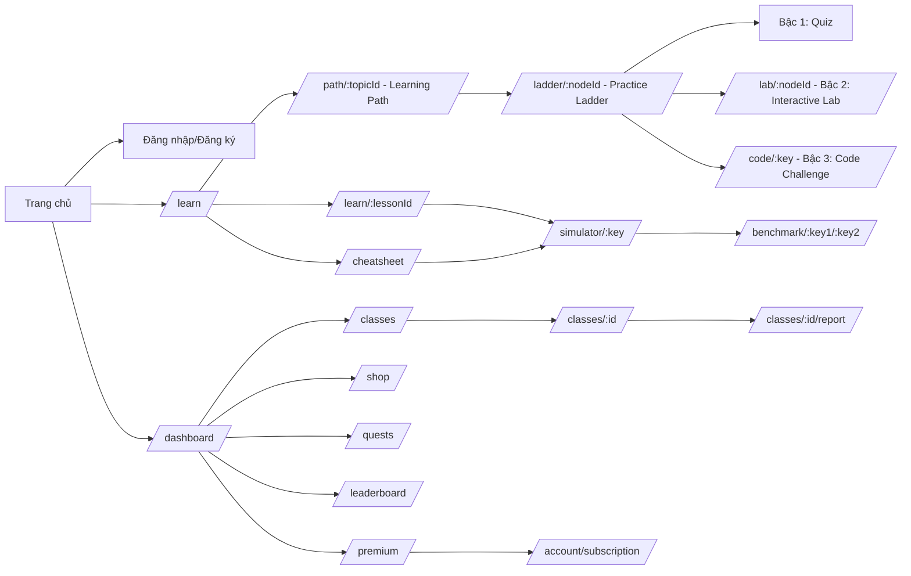

### 20.2.2 Đặc tả từng màn mới (theo đúng khuôn Phần 7.4)

#### Màn 13 — Learning Path (`/path/{topicId}`)
- Bản đồ node dạng "đường mòn" cuộn dọc (giống Duolingo): node tròn nối bằng đường cong, icon: 🔒 khóa / ▶ đang mở / ⭐⭐⭐ đã qua (số sao = kết quả tốt nhất).
- Click node mở popover nổi: tên node, mô tả ngắn, số tim cần (1), nút "Bắt đầu" → điều hướng `/path/{topicId}/node/{nodeId}` (**Node Hub — Màn 31**; trừ tim theo 20.4); trong Node Hub, tab "Luyện tập" mở `/ladder/{nodeId}` (cùng session miễn phí — 19.2).
- Node khóa: popover hiện điều kiện mở ("Hoàn thành node trước").
- Header: thanh tiến độ tổng lộ trình (%), icon Tim/Gem góc phải (component dùng chung — xem 20.2.4).

#### Màn 14 — Practice Ladder shell (`/ladder/{nodeId}`)
- Stepper ngang cố định trên cùng: [①Quiz] → [②Lab] → [③Code], bậc hiện tại tô đậm, bậc đã qua có ✔, bậc chưa mở mờ + khóa.
- Vùng thân thay đổi theo bậc đang active — mỗi bậc là 1 component riêng (QuizStage / LabStage / CodeStage), KHÔNG viết logic 3 bậc chung 1 component (tránh lặp lỗi "màn chắp vá" đã bị chê).
- Qua bậc → tự động chuyển bậc kế, có màn "Chúc mừng qua bậc X" (toast/modal ngắn, không chặn luồng).
- Rớt bậc → cho phép "Làm lại trong phiên" miễn phí (theo 19.2), có nút "Thoát" quay về Learning Path (không mất tiến độ bậc đã qua).

#### Màn 15 — Interactive Lab (bậc 2, hiển thị lồng trong Màn 14, route con `/ladder/{nodeId}/lab`)
- Tái sử dụng `VisualizationCanvas` (component gốc ở Phần 7.10) ở **chế độ editable**: cho phép kéo-thả phần tử/thao tác thay vì chỉ xem.
- Đề bài hiển thị trên cùng (VD: "Sắp xếp dãy này bằng thao tác hoán đổi, tối đa 5 bước").
- Server chấm bằng so khớp TRẠNG THÁI CUỐI với kết quả chuẩn (do StepExecutor sinh — Phần 8.0) + giới hạn số bước ≤ chuẩn × 1.5; KHÔNG chấm từng bước (G-5).
- Nút "Nộp", "Làm lại", hiển thị số thao tác đã dùng / tối đa.

##### 15.1 Nguyên tắc chung (BẮT BUỘC cho mọi Lab)
- Mỗi Lab có: đề bài (1-3 câu tiếng Việt), dữ liệu cố định theo node, **giới hạn thao tác tối đa** (hiển thị "Đã dùng x/Y"), nút **"Nộp" / "Làm lại" / "Hoàn tác"** / "Xem lại lý thuyết" (deep-link FR-2.11).
- **Hoàn tác** 1 thao tác: không giới hạn số lần, không tính vào bộ đếm thao tác.
- **CƠ CHẾ CHẤM (quyết định — 20.2.2 Màn 15, G-5)**: chấm **TRẠNG THÁI CUỐI + giới hạn số bước** (bỏ chấm trace từng bước). Chuẩn do `StepExecutor` sinh (Phần 8.0). Người học thao tác tự do tới khi đạt trạng thái đúng hoặc hết giới hạn; PASS khi thỏa CẢ 2: (1) trạng thái cuối khớp kết quả chuẩn (mảng đã sắp xếp / cây đúng quan hệ / thứ tự duyệt đúng / d[] đúng), (2) tổng số bước ≤ số bước chuẩn × 1.5 (làm tròn lên) — KHÔNG ép đúng trình tự thao tác, cách làm khác hợp lệ vẫn đạt. Điểm = đạt/không đạt → **%Lab = 100 nếu đạt, 0 nếu không** (xem 19.10 — v2.4); hiển thị "Đã dùng x/Y bước".
- Thao tác bất hợp lệ (swap 2 ô không liền kề, chèn vào vị trí đã có con trong BST...) → chặn + giải thích ngắn (toast), KHÔNG tính vào bộ đếm lỗi.
- Đạt → màn "Chúc mừng qua Bậc 2", điểm ghi vào node (Lab 30% — 19.1). Hết giới hạn thao tác chưa đạt → "Chưa đạt — làm lại trong phiên (miễn phí, 19.2)" + nút "Xem gợi ý" (tốn Hint token — 19.3; Premium: gợi ý miễn phí). Nút "Thoát" → về Learning Path, GIỮ bậc đã pass.

##### 15.2 Kịch bản bắt buộc (tối thiểu 3 — đặc tả theo loại CTDL)
1. **Lab Sắp xếp** (`?type=sort` — bubble/selection/insertion):
   - Bubble: chọn 2 ô liền kề → "Hoán đổi" (hoặc kéo thả ô này lên ô kia); Selection: chọn ô min trong đoạn chưa sắp → "Đưa về đúng vị trí"; Insertion: chọn key → kéo đến vị trí chèn.
   - Giới hạn thao tác = số bước chuẩn × 1.5 (làm tròn lên). Chấm: so khớp TRẠNG THÁI CUỐI (mảng đã sắp xếp đúng) + số bước ≤ giới hạn — không so khớp từng thao tác.
2. **Lab BST** (`?type=bst`):
   - Chèn: cho dãy khóa; người học bấm nút cha → chọn "Chèn trái/phải" (hoặc bấm vị trí trống trên cây) → hệ thống vẽ node mới.
   - Duyệt (pre/in/post/level): người học bấm từng node theo đúng thứ tự thăm → chấm: dãy thứ tự CUỐI CÙNG đúng chuẩn + số bước ≤ chuẩn × 1.5.
   - Xóa (nâng cao, GĐ3): chọn node → chọn thay thế (con trái/con phải/lớn nhất cây con trái).
   - Chặn: chèn khóa trùng, đặt sai quan hệ BST (nhỏ hơn cha đặt bên phải...).
3. **Lab Đồ thị** (`?type=graph` — BFS/DFS/Dijkstra):
   - BFS/DFS: đồ thị + đỉnh nguồn; bấm đỉnh kế tiếp theo đúng thứ tự duyệt; sai thứ tự → báo lỗi + làm lại (chấm trạng thái cuối, không chấm từng bước).
   - Dijkstra: bấm cạnh để relax theo thứ tự chuẩn; canvas hiển thị `d[]` dưới đỉnh, cập nhật sau mỗi relax.
   - Chấm: so khớp TRẠNG THÁI CUỐI (chuỗi thứ tự duyệt / d[] cuối) + số bước ≤ chuẩn × 1.5.
4. (Tùy chọn GĐ3) **Lab Heap** (bubble-up/bubble-down bằng kéo thả), **Lab Hash** (chọn bucket theo h(k)).

##### 15.3 Kết thúc & trạng thái
- Loading sinh đề < 300ms; dữ liệu không đủ điều kiện tạo Lab (node không có simulation liên kết) → nút Bậc 2 bị khóa kèm tooltip lý do.
- Mất mạng giữa chừng → lưu nháp trace cục bộ, đồng bộ khi có mạng; nộp lại không bị tính 2 lần (idempotent).

#### Màn 16 — Code Runner (`/code/{key}`, dùng chung cho cả bậc 3 và Module I độc lập)
- Layout 2 cột cố định (không responsive dưới 1024px — cảnh báo như 7.3): trái Monaco editor (code mẫu nạp sẵn), phải `VisualizationCanvas`.
- Đồng bộ 2 chiều theo FR-9.2: click dòng code → nhảy tới bước tương ứng; chạy → dòng code tự cuộn/highlight theo bước.
- Thanh dưới editor: nút "Chạy", "Khôi phục code mẫu", trạng thái (Đang chạy/Lỗi dòng X/Thành công), bộ đếm thời gian chạy.
- Nếu vào từ Ladder bậc 3: thêm panel bên phải dưới cùng hiển thị danh sách test ẩn (chỉ tên, không lộ nội dung) + kết quả pass/fail từng test sau khi nộp.
- Đề bài Bậc 3 ghi rõ: "Nộp bài KHÔNG giới hạn cách viết — output đúng là đạt; nếu dùng hàm có sẵn (VD sort()), bạn sẽ không xem được mô phỏng bước" (theo FR-9.2/9.3).

#### Màn 17 — Benchmark Lab (`/benchmark/{key1}/{key2}`)
- Chọn 2+ GT cùng cấu trúc dữ liệu (modal cấu hình dùng chung FR-3.4; tối đa 5 GT/lần chạy — UC-28).
- Chạy THẬT qua StepExecutor ở **chế độ đo KHÔNG trace** (`runMeasure` — §8.0.3, v2.5: không sinh TraceEvent[] nên không bị giới hạn 50.000 event) tại **nhiều kích thước n**: O(n²) → 10/50/100/200/500 (tối đa 500); O(n log n) → 10/50/100/500/1000 (tối đa 1000); mỗi độ đo timeout 5 giây → vượt ghi "N/A"; bảng số liệu mỗi GT theo từng n: thời gian (ms), số so sánh, số hoán đổi/ghi.
- Biểu đồ so sánh: cột (từng n) + **overlay đường cong lý thuyết tự fit** (O(n²), O(n log n)...) đối chiếu thực tế vs lý thuyết (chart.js hoặc SVG tự vẽ — chọn 1, nhất quán với Màn 08).
- Khối "Kết luận" tự sinh (template theo số liệu đo — 19.9 tầng 4): GT nào nhanh hơn, độ lệch so với lý thuyết.
- Nút "Đổi giải thuật", "Chạy lại với dữ liệu ngẫu nhiên khác", "Chạy với dữ liệu xấu nhất/tốt nhất" (nếu GT hỗ trợ).
- KHÔNG có 2 canvas phát hoạt ảnh song song (FR-3.13 đã cắt) — benchmark chỉ so sánh SỐ LIỆU + biểu đồ, không chạy 2 hoạt ảnh cùng lúc.
- Miễn phí tim (20.4 — không tính "vào node").

#### Màn 18 — CheatSheet (`/cheatsheet`)
- Bảng Big-O tương tác: cột GT/CTDL, độ phức tạp thời gian (best/avg/worst), độ phức tạp không gian; mỗi dòng có nút "▶ Xem mô phỏng" mở thẳng `/simulator/{key}`.
- Lọc theo nhóm (Sắp xếp / Tìm kiếm / Cây / Đồ thị...).
- Nút "Xuất PDF" chỉ hiện với tài khoản Premium — nhãn "CheatSheet PDF (Premium)" (theo 19.4); tài khoản Free thấy nút mờ + tooltip "Nâng cấp Premium để xuất PDF".

#### Màn 19-21 — Class flow (Module H)
- **19 — `/classes`**: danh sách lớp (Teacher: lớp đã tạo + nút "Tạo lớp mới"; Student: lớp đã tham gia + nút "Nhập mã lớp" mở modal nhập mã 6 ký tự).
- **20 — `/classes/{id}`**: tab "Thành viên" (danh sách + trạng thái tiến độ rút gọn), tab "Lộ trình đã gán" (Teacher gán + đặt hạn nộp), tab "Cài đặt lớp" (chỉ Teacher: đổi tên, xóa lớp — modal xác nhận).
- **21 — `/classes/{id}/report`**: dùng lại layout wireframe 7.9.3 (`/report` — báo cáo giảng viên) đã có sẵn — không tạo mới, chỉ thêm route theo lớp thay vì theo bài học đơn lẻ.

#### Màn 22-24 — Gamification (Module J, không tính Premium)
- **22 — `/shop`**: lưới item (Hint token, Streak freeze, avatar, khung, theme, XP boost) — mỗi item: icon, giá gem, nút "Mua" (disable nếu không đủ gem hoặc đã đạt max).
- **23 — `/quests`**: 5 thẻ quest trong ngày (2 Easy/2 Medium/1 Hard), mỗi thẻ: mô tả, thanh tiến độ, phần thưởng, trạng thái (chưa/đang/hoàn thành); banner "Hoàn thành 5/5 nhận thêm +10 gem" khi đủ điều kiện.
- **24 — `/leaderboard`**: 3 tab (Tuần / Level / Lớp), mỗi tab bảng xếp hạng top 50 + vị trí người dùng hiện tại ghim cuối bảng nếu ngoài top 50.

#### Màn 25-27 — Premium (Module J)
- **25 — `/premium`**: bảng giá 3 gói (1/3/12 tháng), so sánh quyền lợi Free vs Premium (bảng 2 cột), nút "Chọn gói".
- **26 — checkout mô phỏng** (modal 2 bước trên cùng route `/premium`, không tách trang riêng để tránh mất ngữ cảnh giá đã chọn): Bước 1 xác nhận gói + giá, Bước 2 nút "Thanh toán mô phỏng" → loading giả lập 1-2s → màn thành công + tự động điều hướng.
- **27 — `/account/subscription`**: trạng thái gói hiện tại, ngày hết hạn, nút "Hủy gia hạn" (modal xác nhận nêu rõ hậu quả theo 19.4 — giữ gems/item, mất quyền lợi tim/hint/khung VIP).

#### Màn 28 — Modal "Hết tim" (không phải route riêng — overlay toàn cục)
- Kích hoạt khi user cố "vào node" mà tim = 0 (áp dụng theo quyết định 20.4).
- Nội dung: đồng hồ đếm ngược tới tim tiếp theo, nút "Xem lại node đã pass" (miễn phí, không bị chặn — theo 19.2), nút "Nâng cấp Premium" (dẫn `/premium`), nút "Đóng".

#### Màn 29 — Duyệt tài khoản giảng viên (`/admin/users` — tab con, KHÔNG tạo route riêng)
- Thêm 1 tab "Chờ duyệt Teacher" trong Màn 10 sẵn có (7.4): danh sách tài khoản đăng ký với vai trò Giảng viên (kèm thông tin **Khoa/Bộ môn, Mã giảng viên, Kinh nghiệm giảng dạy** hiển thị trong modal duyệt — task L), nút Duyệt/Từ chối.

#### Màn 30 — Bài kiểm tra tổng hợp cuối lộ trình (FR-4.12)
- Route con `/path/{topicId}/final-test` — tái sử dụng layout Màn 06 (quiz) và bổ sung dạng "dự đoán bước" trộn lẫn (theo mô tả 19.1 Module D) — KHÔNG tạo component mới, ghép QuizStage đã build ở Màn 14.

### 20.2.3 Component tree bổ sung (mở rộng sơ đồ 7.10)

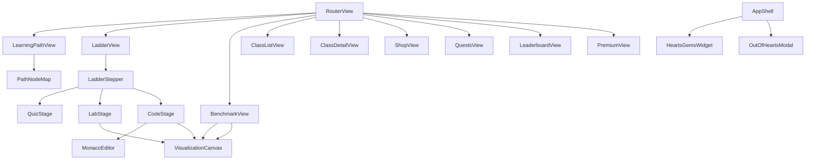

### 20.2.4 Component dùng chung bắt buộc: `HeartsGemsWidget`
- Vị trí: góc phải Header, hiển thị ở MỌI trang (thêm vào `AppShell`, không lặp lại trong từng view).
- Nội dung: icon ❤ + số tim / max, icon 💎 + số gem, tooltip hiện thời gian hồi tim tiếp theo.
- Click vào tim khi tim < max → mở popover mini "Hồi sau: 12:34" + link tới `/premium`.

### 20.2.5 Tổng số màn hình/route (để ước lượng effort)

| Nhóm | Số màn/route | Ghi chú |
|---|---|---|
| Gốc (Phần 7.4, Màn 01-12) | 12 | Không đổi |
| Bổ sung Phần 7B (Màn 13-30) | 18 | 3 màn dùng lại layout có sẵn (21, 26 gộp vào 25, 29 gộp vào 10, 30 ghép từ 14) → thực chất build mới ~14, còn lại là biến thể/tab của route đã có |
| Navigation 20.5.5 (Màn 31 Node Hub, Màn 32 Hồ sơ) | 2 | Mới — Node Hub = tabs ghép Màn 04/14/18; Hồ sơ = tabs ghép Màn 08 + Màn 23/24 + N-1/N-4 |
| **Tổng route thực tế cần định tuyến** | **~32** | Thêm `/path/{topicId}/node/{nodeId}` + `/profile` |
| **Tổng màn hình cần thiết kế UI mới (không tính biến thể/tab)** | **~26** | Con số nên dùng để ước lượng effort dev frontend (đối chiếu SCREEN_MAP Mục 4: 16 màn bổ sung N-1→N-16) |

---

## 20.3 Làm rõ mapping FR-4.1→4.10 (cũ) vào Practice Ladder (mới) — ghi đè Phần 3.9 dòng Module D

| FR cũ | Tên cũ | Vị trí mới trong Practice Ladder |
|---|---|---|
| FR-4.1 | Quản lý bài tập (CRUD) | Giữ nguyên — dùng để soạn câu hỏi cho **Bậc 1 (Quiz)** của mỗi node |
| FR-4.2 | Làm bài tập trắc nghiệm | Trở thành nội dung **Bậc 1 (Quiz)** trong Ladder — không còn là màn độc lập ngoài luồng, TRỪ trường hợp bài kiểm tra tổng hợp cuối lộ trình (FR-4.12, Màn 30) vẫn dùng lại engine này |
| FR-4.3 | Bài tập dự đoán bước | Sáp nhập vào **Bậc 2 (Interactive Lab, Màn 15)** — "dự đoán bước" chính là 1 dạng thao tác trong Lab (chọn trạng thái/kéo thả), không tách engine riêng |
| FR-4.4 | Đánh giá và lịch sử bài làm | Áp dụng chung cho cả 3 bậc — 1 bảng `SUBMISSIONS` chung (loại: quiz/lab/code), không tách 3 bảng |
| FR-4.5 | Ngân hàng câu hỏi dùng lại | Giữ nguyên, phục vụ Bậc 1 |
| FR-4.6 | Chế độ luyện tập | Áp dụng cho cả 3 bậc: luyện tập KHÔNG ghi vào tiến độ chính thức. Về tim (SỬA theo 20.4): luyện tập CHỈ miễn phí khi nằm trong session 30 phút đã trừ của node; mở lại ngoài session → VẪN trừ 1 tim như mọi lượt "vào node" |
| FR-4.7 | Gợi ý trả lời (Hints) | Áp dụng cho Bậc 1 và Bậc 3 (Code) — dùng Hint token mua ở Shop (Module J) cho Premium/user thường |
| FR-4.8, FR-4.9 | Xáo trộn câu hỏi, giải thích theo phương án sai | Giữ nguyên, chỉ áp dụng Bậc 1 |
| FR-4.10 | Nhập câu hỏi hàng loạt CSV | Giữ nguyên (công cụ cho Teacher/Admin, không liên quan trực tiếp UI học sinh) |

> Khi sinh SRS: trình bày lại bảng này dưới dạng "Ghi chú tái cấu trúc Module D" ngay sau bảng Master Matrix (3.9), để tránh SRS mô tả Quiz/Dự đoán bước như 2 tính năng độc lập ngang hàng Ladder — chúng là **thành phần bên trong** Ladder.

---

## 20.4 Quy tắc trừ tim — làm rõ và ghi đè 19.2 dòng "Vào node mới"

**Quyết định:** Tim bị trừ cho **MỌI lượt "vào node"**, không phân biệt mục đích xem tự do hay làm Practice Ladder — vì toàn bộ nội dung mô phỏng + bài học là giá trị lõi độc quyền của sản phẩm (không có phiên bản dùng thử không giới hạn ngoài số tim).

Quy tắc chi tiết (bổ sung vào bảng 19.2):

| Hành động | Có trừ tim? |
|---|---|
| Mở `/simulator/{key}` lần đầu cho 1 node chưa từng mở trong ngày | Trừ 1 tim (atomic server-side, như 19.2 gốc) |
| Mở lại `/simulator/{key}` của node **đã trừ tim trong cùng session 30 phút** | Miễn phí (đã tính trong "session 30 phút" của 19.2) |
| Mở `/benchmark/{key1}/{key2}` | **Miễn phí** — Benchmark Lab không tính là "vào node", vì đây là công cụ so sánh tổng hợp, không gắn với 1 node cụ thể trong Learning Path |
| Mở `/cheatsheet` rồi bấm "Xem mô phỏng" từ 1 dòng | Trừ tim như mở simulator bình thường (không có ngoại lệ) |
| Xem lại node **đã pass** (theo 19.2 gốc) | Miễn phí — giữ nguyên |
| Vào Bậc 2/3 của Ladder sau khi đã trừ tim ở Bậc 1 cùng node | Miễn phí — 1 lượt "vào node" tính chung cho cả 3 bậc, không trừ tim từng bậc |

> Khi sinh SRS/SDD: FR-3.2 (Khởi tạo mô phỏng) PHẢI ghi chú tham chiếu FR-10.1 (Tim) và liệt kê rõ ngoại lệ Benchmark Lab ở trên — đây là điểm dễ gây tranh cãi lúc bảo vệ đồ án nên cần tiêu chí chấp nhận rõ ràng kèm test case cụ thể (VD: TEST case "mở simulator từ cheatsheet vẫn bị trừ tim đúng như mở từ learning path").

---

## 20.5 THIẾT KẾ NAVIGATION THEO VAI TRÒ (bổ sung Phần 7.3 — BẮT BUỘC đưa vào SDD mục Thiết kế UI/UX)

> Lý do: Phần 7.3 tổ chức menu theo module kỹ thuật (A-J) → người dùng thấy 8-10 mục rời rạc, không biết bấm đâu trước. Trải nghiệm thực: 1 phiên học chạy xen kẽ 5 module (B+C+D+I+J) trong 1 luồng liên tục. Quyết định: **GIỮ NGUYÊN module kỹ thuật A-J** (phân chia code), **thêm 1 lớp ánh xạ "module → menu"** cho người dùng. (Nguồn: phân tích "10 module kỹ thuật ≠ cách người dùng nhìn thấy".)

### 20.5.1 Nguyên tắc
1. Module kỹ thuật A-J = tổ chức code (backend + frontend internal) — KHÔNG đổi, không gộp C với J.
2. Navigation = tổ chức theo **hoạt động người dùng**: 4 vùng — ① Học & Luyện (chính, ~80% thời gian) ② Hồ sơ ③ Lớp học ④ Khác.
3. Nguyên tắc 7.0 "1 màn = 1 việc" VẪN giữ nguyên: mỗi route 1 việc; navigation chỉ nối các route thành luồng tự nhiên, không trộn chức năng vào 1 màn.
4. Module J (tim/gems/XP/quest) KHÔNG có menu riêng — xảy ra TỰ ĐỘNG trong luồng học; widget header hiển thị ❤ 💎 🔥 (HeartsGemsWidget 20.2.4 + streak).
5. Mọi luồng có "Quay lại" giữ trạng thái (bước mô phỏng, vị trí cuộn, bậc Ladder) — theo 7.0 quy tắc 3.
6. Route cũ `/learn`, `/dashboard`, `/exercise/{id}` GIỮ chức năng nhưng KHÔNG xuất hiện trong menu; `/learn` → redirect `/path`, `/dashboard` → redirect `/profile` (ghi rõ trong SDD).

### 20.5.2 Sidebar theo vai trò (thay sidebar cũ 7.3 — ghi đè; CẬP NHẬT 12/08/2026 theo review navigation — xem changelog v2.6)

```
Student:                     Teacher:                     Admin:
├── 🎯 Lộ trình   /path      ├── 🎯 Lộ trình   /path      ├── 👥 Người dùng /admin/users
├── 🔬 Khám phá   /simulations├── 📝 Quản lý nội dung /admin/* ├── 📚 Nội dung  /admin/lessons
│    ├── Danh mục GT/CTDL    ├── 👥 Lớp học    /classes   ├── ⚙️ Cấu hình   /admin/settings
│    ├── So sánh (Benchmark) ├── 📊 Báo cáo   /reports    ├── 📊 Thống kê  /admin/stats
│    └── CheatSheet (Big-O)  └── ⋯ Thêm ▾                 └── ⋯ Thêm ▾
├── 👤 Hồ sơ     /profile        (như Student)                (như Teacher)
├── 🏆 Thử thách /quests
├── 👥 Lớp học  /classes
└── ⋯ Thêm ▾
     🛒 Cửa hàng /shop
     ⭐ Premium  /premium
     ❓ Trợ giúp /help
```

> "⋯ Thêm ▾" = dropdown (menu người dùng góc phải header hoặc footer). Phân biệt rõ 2 luồng xem mô phỏng: **"Lộ trình"** = học theo trình tự (trừ tim, ghi điểm); **"Khám phá"** (`/simulations`) = xem GT/CTDL tự do theo kiểu VisuAlgo (mở mô phỏng cụ thể VẪN trừ tim theo 20.4 — ngoại trừ 3 demo công khai). Benchmark và CheatSheet đặt làm tab/nút bên trong "Khám phá" để killer feature dễ tìm. Quest/Leaderboard lên sidebar chính (gamification là feature, không giấu). Admin thấy thêm `/admin/*`; Teacher KHÔNG thấy Quest/Shop trong menu chính nhưng vẫn truy cập được khi cần (không bắt buộc). Route `/simulations` (trước đây là màn N-3 chỉ có đặc tả, không có đường vào) NAY là màn chính thức trên sidebar. **Nhãn chuẩn (v2.9)**: "**Lộ trình học**" (học có trình tự — trừ tim/chấm điểm) vs "**Phòng thí nghiệm**" = "Khám phá `/simulations`" (xem tự do — **VẪN trừ tim theo 20.4**; Playground miễn phí đã bị từ chối 2 lần — v2.6, không thay đổi cơ chế tim).

### 20.5.3 Bảng ánh xạ Menu → Route → Module (đưa nguyên trạng vào SDD)

| Mục menu (người dùng thấy) | Route chính | Module kỹ thuật phía sau |
|---|---|---|
| **Học tập** | `/path`, `/path/{topicId}/node/{nodeId}`, `/simulator/{key}`, `/ladder/{nodeId}` (+`/lab`, `/code`), `/benchmark/{k1}/{k2}`, `/cheatsheet` | B + C + D + I + J (hearts/XP/gems tự động) |
| **Hồ sơ** | `/profile` (tabs) | E + J (quest/streak/BXH/achievement) + A (cài đặt) |
| **Lớp học** | `/classes`, `/classes/{id}`, `/classes/{id}/report` | H + E (báo cáo) |
| **Cửa hàng** | `/shop` | J |
| **Premium** | `/premium`, `/account/subscription` | J |
| **Trợ giúp** | `/help` (FAQ — Màn 12) | G |
| **Quản trị** (Admin/Teacher) | `/admin/*`, `/reports` | F + E |

### 20.5.4 Sơ đồ luồng LỒNG NHAU theo vùng (bổ sung 20.2.1 — bản chi tiết route giữ nguyên)

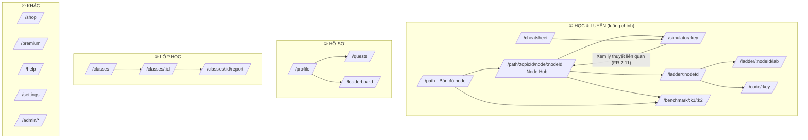

### 20.5.5 Màn bổ sung (thêm vào 20.2.2, đặc tả đầy đủ trong SDD theo khuôn 17.14)

#### Màn 31 — Node Hub (`/path/{topicId}/node/{nodeId}`) [THAY thẻ liên kết của Màn 04 trong luồng Học tập]
- **Mục đích**: 1 điểm vào duy nhất cho mọi nội dung của 1 node (lý thuyết + luyện tập + cheatsheet liên quan) — thay vì sinh viên phải tự tìm 5 mục menu.
- **Bố cục**: Header node (tên, sao ⭐, trạng thái tim) + **3 tab**: `Lý thuyết` (tái sử dụng LessonDetail — Màn 04) / `Luyện tập` (tái sử dụng LadderShell — Màn 14) / `Cheatsheet` (tái sử dụng Màn 18, lọc sẵn theo chủ đề node).
- **Ràng buộc 7.0**: MỖI TAB là 1 component TÁCH (LessonDetail / LadderShell / CheatSheet) — cấm viết logic 3 tab chung 1 component (bài học 7.0); tab Lý thuyết KHÔNG nhúng canvas — mở `/simulator/{key}` riêng; tab Luyện tập KHÔNG nhúng lý thuyết.
- **Trạng thái**: chưa mở (tab mặc định Lý thuyết) / đã pass node (hiện bảng điểm 3 bậc) / hết tim (chặn vào tab Luyện tập nếu chưa pass — Màn 28).
- **Điều kiện truy cập**: phải thuộc node đang mở (guard theo Learning Path); trừ tim theo 20.4.

#### Màn 32 — Hồ sơ (`/profile`) [GỘP Màn 08 + Màn 23/24 + N-1/N-4 thành 1 điểm đến "Tôi đang ở đâu?"]
- **Mục đích**: trả lời "Tôi đang ở đâu?" — tổng quan cá nhân + lối vào tất cả tính năng hồ sơ.
- **Bố cục**: 4 tab — `Tổng quan` (Level, XP, Streak 🔥, Tim ❤, Gems 💎, tiến độ lộ trình % — widget) / `Tiến độ` (nội dung Màn 08) / `Thành tích` (Màn N-4 huy hiệu) / `Cài đặt` (Màn N-1: đổi MK, avatar, dark mode, 2FA).
- **Liên kết ra**: thẻ tắt tới `/quests` (Màn 23), `/leaderboard` (Màn 24), `/shop` (Màn 22) — vẫn là route riêng (1 việc/màn).
- **Ràng buộc 7.0**: mỗi tab 1 component tách; `/profile` chỉ đọc tổng hợp — mọi hành động (đổi MK, mua, nhận quest) mở route/modal riêng.

### 20.5.6 Ghi chú phá vỡ khi áp dụng (đưa vào SDD)
- Sidebar cũ 7.3 ("sidebar học tập chỉ trang bài học") bị THAY bằng sidebar toàn cục 20.5.2.
- Header (7.3): widget HeartsGemsWidget (20.2.4) + 🔥 streak thay cho các mục menu rời.
- `/learn` → redirect `/path`; `/dashboard` → redirect `/profile`; `/exercise/{id}` giữ nguyên (truy cập qua Ladder Bậc 1).
- Sơ đồ 20.2.1 giữ nguyên làm bản chi tiết route; 20.5.4 là bản navigation theo vùng (bổ sung, không thay thế).

# PHẦN 21 — CẬP NHẬT CHỈ DẪN THỰC THI (bổ sung Phần 18)

Khi AI sinh SRS/SDD/API_REFERENCE, thứ tự ưu tiên nguồn khi có mâu thuẫn:

**Phần 20/21 (Phụ lục này) > Phần 8 (EDV) = Phần 7 (nguyên tắc 1 màn 1 việc) > Phần 19 > Phần 0-17 (gốc).**

Các việc bắt buộc AI phải làm khi sinh tài liệu, ngoài các bước ở Phần 0.2:
1. Đưa toàn bộ Màn 13-30 (20.2.2) vào SDD mục Thiết kế UI/UX, đúng khuôn dạng như Màn 01-12 (đặc tả + wireframe ASCII cho ít nhất các Màn 13, 14, 16, 17, 22-24 — 6 màn phức tạp nhất).
2. Dùng bảng 20.1 thay thế hoàn toàn bảng Sprint ở Phần 2.6 trong SDD.
3. Dùng bảng 20.3 để viết lại mô tả Module D trong SRS — không mô tả Quiz/Dự đoán bước như tính năng độc lập.
4. Áp dụng đúng quy tắc trừ tim ở 20.4 khi đặc tả FR-3.2 và FR-10.1, kèm ít nhất 3 test case biên trong TEST_PLAN cho riêng logic này.
5. KHÔNG tạo bảng NOTIFICATIONS, KHÔNG tạo API thông báo nào — theo quyết định 20.0 mục 5.
6. Đưa thiết kế Navigation theo vai trò (20.5) vào SDD mục Thiết kế UI/UX: sidebar theo vai trò (20.5.2), bảng ánh xạ Menu→Route→Module (20.5.3), sơ đồ lồng theo vùng (20.5.4), đặc tả Màn 31 (Node Hub) + Màn 32 (Hồ sơ) theo khuôn 17.14, và ghi rõ redirect `/learn`→`/path`, `/dashboard`→`/profile`.
7. `docs/SCREEN_MAP.md` là NGUỒN BẮT BUỘC khi sinh SDD mục Thiết kế UI/UX: 16 màn bổ sung N-1→N-16 phải được đặc tả theo khuôn 17.14 cùng với Màn 01-32; ma trận FR→Màn (SCREEN_MAP Mục 3) dùng làm checklist rà soát mọi FR có màn tương ứng.

<!-- HẾT PHỤ LỤC -->

# PHẦN 22 — NHẬT KÝ THAY ĐỔI (CHANGELOG — đọc khi gặp mâu thuẫn, bản mới nhất có ưu tiên cao nhất)

| Ngày | Phiên bản | Thay đổi |
|---|---|---|
| 12/08/2026 | v2.9 | VÁ REVIEW BỔ SUNG PART 2 (12/08/2026 — 4 lỗ hổng DB + 2 killer feature + chốt sidebar): (1) **Bảng `UserNodeProgress`** (§10.2.30, ERD A, index, 19.10) — Status/Stars/NodeScore mỗi node, cập nhật TRONG transaction khi nộp bậc (không trigger), nguồn hiển thị bản đồ path + chấm NewStars > OldStars; tổng bảng 31 → **32** (§10.1, 17.3.2, 17.9, 19.8); (2) **`UserInventory.IsEquipped`** (v2.9) — equip cùng loại (frame/theme) set 0 các dòng khác; (3) **Chống spam đánh giá** — FR-7.4: chỉ đánh giá khi ĐÃ "Đánh dấu đã học" bài đó (UserProgress.Viewed), chưa học → 403; (4) **Session gia hạn sliding** — FR-10.1 bước 6 + AC-10.1.9 + 19.2 + §10.2.29: nộp THÀNH CÔNG Bậc 1/2 hoặc mở bậc mới → `ExpiresAt = LEAST(ExpiresAt + 30p, StartedAt + 120p)` (StartedAt cố định làm mốc cap, chống "1 tim dùng node vĩnh viễn"); không đổi logic trừ tim/UNIQUE/@@ROWCOUNT; (5) **Visual Trace Diff** — FR-9.2: nút "So sánh code chuẩn" Bậc 3, 2 canvas chia đôi đồng bộ, chỉ khi code trace-được, chấm vẫn theo output; (6) **Custom Testcase** — FR-9.2 làm rõ: nhập input tùy ý chạy thử trước khi nộp; (7) **Chốt sidebar** — §20.5.2 nhãn chuẩn "Lộ trình học" vs "Phòng thí nghiệm/Khám phá `/simulations`" — GIỮ NGUYÊN cơ chế trừ tim 20.4 (Playground miễn phí đã bị từ chối v2.6) |
| 12/08/2026 | v2.8 | VÁ REVIEW CHUYÊN SÂU SRS/SDD (12/08/2026 — 9 lỗ hổng): (1) **Từ chối Teacher** — FR-1.8: dùng chung `POST /users/{id}/approve-teacher` body `{approve:false, reason?}` → role=0 (Student), IsActive=true, log lý do; (2) **Khóa sửa câu hỏi** — FR-4.1: bài tập đã có ≥1 ExerciseSubmission chỉ sửa Tiêu đề/Mô tả/Trạng thái/Thứ tự, muốn đổi nội dung → nhân bản (clone); (3) **Lớp mồ côi** — FR-8.1: Teacher sở hữu bị khóa/xóa → lớp tự Đóng, Admin chuyển OwnerId qua `PUT /classes/{id}`; (4) **Nộp theo lớp** — FR-8.3: `ExerciseSubmissions.ClassAssignmentId` (mới, NULL=tự do), validate người nộp ∈ ClassMembers + lớp Mở (Đóng → 409 CONFLICT), quá hạn vẫn nộp tính "Trễ", 2 lớp cùng bài tính riêng theo từng DueAt; (5) **Báo cáo lớp** — FR-8.4: chỉ tính ClassMembers HIỆN TẠI; (6) **Streak lệch giờ** — FR-10.4/19.3/UC-29: streak cập nhật EAGER khi hoạt động + cột `Users.StreakLastProcessed` (mới), job 00:30 chỉ đóng sổ ngày đã qua — hoạt động 00:00-00:30 sau reset quest không bị trừ oan (sửa §10.2.1, 2 ERD, GamificationService, index); (7) **MaxStack UI** — 19.3: nút Mua disabled + "Đã đạt tối đa" khi đủ MaxStack; (8) **Gems nâng sao** — 19.3/19.10: CHỈ trao khi NewStars > OldStars (retry cùng sao không nhận); (9) **Chống hardcode test ẩn** — FR-9.3/19.6B: mỗi lần nộp sinh thêm 8-10 test NGẪU NHIÊN tại thời điểm nộp, expected từ hàm chuẩn StepExecutor — input không tĩnh nên không if-else cứng được (mức cam kết bảo mật không đổi) |
| 12/08/2026 | v2.7 | VÁ REVIEW BUSINESS LOGIC — quản lý người dùng/Admin (12/08/2026): FR-1.9 + UC-12 làm rõ chính sách Admin — thêm cột `Users.IsPrimaryAdmin` (bit, mặc định 0, Admin đầu tiên tạo bởi script seed); chỉ Admin chính được khóa/đổi vai trò/xóa/đặt lại mật khẩu Admin khác (Admin thường → 403); cấm khóa/xóa/ẩn danh hóa Admin cuối cùng còn active (→ 400, luôn ≥ 1 Admin quản trị); Admin chính chuyển quyền primary cho Admin khác được phép + log Serilog. Cập nhật: §3.1 FR-1.9, §10.2.1 `Users`, ERD 2 sơ đồ (§10.1A/B), UC-12, API_REFERENCE §4.8 + RBAC dòng 15, TEST-B-020..022 mở rộng (admin-on-admin), SRS FR-1.9/UC-12, SDD §7.3.1 + UserService, USER_GUIDE §5.1 |
| 12/08/2026 | v2.6 | ÁP DỤNG REVIEW NAVIGATION (12/08/2026 — chỉ ảnh hưởng sidebar + 1 route, không đụng FR/kiến trúc): (1) §20.5.2 sidebar theo vai trò viết lại — Student: Lộ trình /path + **Khám phá /simulations** (danh mục GT/CTDL + tab So sánh Benchmark + CheatSheet) + Hồ sơ + **Thử thách /quests** + Lớp học + ⋯ Thêm (Shop/Premium/Trợ giúp); Teacher: "Quản lý nội dung" (thay "Soạn bài") + thêm Nội dung cho Admin; (2) `/simulations` (trước là màn N-3 chỉ có đặc tả) trở thành route chính thức trên sidebar — phân biệt rõ "học theo lộ trình" vs "xem mô phỏng tự do"; mở mô phỏng từ Khám phá VẪN trừ tim theo 20.4 (trừ 3 demo công khai); (3) Không thêm Playground không trừ tim (mâu thuẫn 20.4 — ghi backlog); không thêm Teacher Hub / widget Home vào scope (backlog 16.2) |
| 12/08/2026 | v2.5 | VÁ 4 LỖI CRITICAL (review 12/08/2026): (1) Cơ chế trừ tim chống double-spend mở rộng cho session HẾT HẠN: bổ sung đường gia hạn bằng `UPDATE NodeSessions ... WHERE ExpiresAt < @now` + @@ROWCOUNT làm khóa tuần tự hóa (mô tả cũ chỉ dựa vào UNIQUE INSERT — không bảo vệ đường session hết hạn, 2 tab có thể trừ 2 tim) — sửa FR-3.2 Ràng buộc, FR-10.1 Luồng bước 2, §10.2.29 Quy tắc; TEST-B-148..155 bắt buộc thêm 1 test concurrency cho case 2 request song song trên session hết hạn (chỉ 1 lần trừ); (2) Chốt mâu thuẫn XP nâng sao: §19.3 bỏ "nâng sao bonus +10/+15 XP" → nâng sao KHÔNG cấp XP (chỉ gems theo 19.10, anti-grinding); (3) Benchmark Lab không còn vỡ giới hạn event: thêm `runMeasure` chế độ đo KHÔNG trace (§8.0.3 — không sinh TraceEvent[] nên không áp dụng 50.000 event); O(n²) tối đa n=500, O(n log n) tối đa n=1000; timeout 5s/độ đo → "N/A" — sửa §8.0.3, Màn 17, UC-28; (4) Thống nhất khóa `key` engine giữa §19.6A và §8.5/§8.7/§10.9: `stack.push/pop/peek`, `list.insert/delete/search`, `tree.bst-insert/search`, `tree.avl-insert` (khớp 100% để không fail CI đồng bộ catalog §9.9) |
| 09/08/2026 | v2.2 | Loại 12 FR đã cắt (19.7) khỏi master matrix 3.9 + ma trận truy vết 17.15; đánh dấu ⚠ ĐÃ CẮT tại heading Phần 3; xóa dòng RBAC liên quan (phiên đăng nhập, broadcast, báo lỗi) |
| 09/08/2026 | v2.2 | Xóa toàn bộ NOTIFICATIONS (bảng DB, API 9.2.9, RBAC, controller/service, chuông UI, 19.3) — theo 20.0 mục 5; thay bằng toast phía client |
| 09/08/2026 | v2.2 | Quy tắc trừ tim 20.4 ghi vào FR-3.2; đặc tả mới FR-10.1 (§3.8B) đủ 7 thuộc tính kèm AC + test case biên |
| 09/08/2026 | v2.2 | Màn 01: 3 demo công khai (FR-7.6); Màn 17: Benchmark multi-n + overlay lý thuyết (bỏ 2 canvas song song); Màn 07: ghi chú sáp nhập Bậc 2 Lab |
| 09/08/2026 | v2.2 | Màn 15: đặc tả Bậc 2 Interactive Lab (15.1-15.3) — 3 kịch bản (Sắp xếp/BST/Đồ thị) + chấm trace TỪNG BƯỚC |
| 09/08/2026 | v2.2 | §20.5 Navigation theo vai trò: sidebar Student/Teacher/Admin, bảng Menu→Route→Module, sơ đồ lồng theo vùng, Màn 31 (Node Hub), Màn 32 (Hồ sơ), redirect /learn→/path, /dashboard→/profile |
| 09/08/2026 | v2.2 | Chốt 6 mâu thuẫn: mã mời 6 ký tự (FR-8.1/UC-21/DB InviteCode), sandbox 10s/64MB/200 dòng (FR-9.4), Benchmark multi-n, 3 demo, Màn 07 sáp nhập, tham chiếu wireframe 7.9.3 |
| 09/08/2026 | v2.2 | Bổ sung: §19.10 (điểm node/sao/final test — số liệu chốt), §19.6A (bảng 18 bài seed + 6 path × 5 node), §19.3A (8 quest templates + cơ chế), 11.4 (services Class/CodeRunner/Hearts/Gem/Quest/Premium/Achievement), 11.6 (MailHog dev), Phần 21 mục 7 (SCREEN_MAP là nguồn bắt buộc) |
| 09/08/2026 | v2.2 | Sửa 20.3 FR-4.6: luyện tập miễn phí CHỈ trong session 30p đã trừ (không mâu thuẫn 20.4); sơ đồ 7.0 cập nhật /learn→/path; Màn 13 → Node Hub; Màn 05 thêm nút "Xem lý thuyết liên quan" (FR-2.11); 20.2.5 cập nhật ~32 route / ~26 màn |
| 09/08/2026 | v2.2 | Audit toàn diện: 12.2 bổ sung store gamification/classStore/codeRunner/leaderboard; 12.4 router guards đầy đủ route mới (path/node/ladder/benchmark/profile/classes...); 10.2.25 bổ sung EXERCISES.NodeId + Stage (QUIZ/LAB/CODE) cho Ladder; UC-07 ghi chú sáp nhập Lab, UC-14 thêm FR-7.6; 14.2 bắt buộc TEST-B-133..183 |
| 09/08/2026 | v2.2 | Chốt logic chấm Code Bậc 3: chấm theo ĐẦU RA (output test ẩn), KHÔNG so implementation (FR-9.2/9.3) — sinh viên viết thuật toán khác vẫn pass nếu output đúng; code không trace-được → chạy/nộp bình thường nhưng không phát visual bước. Thêm §19.6B: đặc tả 18 Code Challenge (signature cố định) + bảng testcase (3 public + 12-15 hidden mỗi bài, ~270 test ẩn, golden data) |
| 12/08/2026 | v2.3 | Áp dụng REVIEW_PRODUCTION_PROMPT.md (12/08/2026). G-1/G-2 (QUYẾT ĐỊNH GHI ĐÈ): GIỮ NGUYÊN toàn bộ scope Module J (Tim/Gems/Quest/Streak/Shop/Premium/checkout mô phỏng); thêm 1 dòng giải trình ngay dưới bảng KPI §1.3 (G3/G5 đo trên người dùng có Tim/Premium đủ dùng; Tim là chủ đích retention/monetization — không đổi số KPI); sửa §2.2 mục 3: Premium checkout là MÔ PHỎNG (không tích hợp cổng thanh toán thật), luồng nghiệp vụ/UI đầy đủ để demo mô hình kiếm tiền |
| 12/08/2026 | v2.3 | G-3: xóa toàn bộ khối đặc tả 7 thuộc tính của 12 FR đã cắt khỏi Phần 3 (FR-1.10, FR-2.7/2.8/2.9, FR-3.13/3.17/3.19, FR-5.6/5.7, FR-6.4, FR-7.3/7.5) — chỉ giữ 1 ghi chú "ĐÃ CẮT" dưới master matrix 3.9; xóa AUTH_SESSIONS khỏi danh sách bảng/ERD/đặc tả §10.2.14/index 10.3/API 9.2.12; xóa endpoint còn sót của FR cắt (GET /me/recent-lessons, /me/goals, /me/progress/export) + bỏ bước "gửi thông báo" trong UC-13 |
| 12/08/2026 | v2.3 | G-4: xóa 4 chỗ còn sót của NOTIFICATIONS (ERD relation + block, đặc tả §10.2.13, index 10.3) — theo 20.0 mục 5 |
| 12/08/2026 | v2.3 | G-5: Interactive Lab Bậc 2 chấm TRẠNG THÁI CUỐI + giới hạn số bước ≤ chuẩn × 1.5 (bỏ chấm trace từng bước) — sửa §15.1 CƠ CHẾ CHẤM, 15.2 (3 kịch bản), ghi chú FR-4.3, UC-26, bảng 19.1 Module D |
| 12/08/2026 | v2.3 | G-6: EDV chỉ chạy code MẪU/template (gắn trace hook); Module I giới hạn "sửa tham số / hoàn thiện hàm theo signature cố định" qua sandbox Web Worker client; BỎ Judge0 server (8.0.1/8.0.2/8.0.3/8.0.4, FR-9.2/9.3/9.4, UC-17, 11.4, 19.1 Module I, 20.1 S7 + lưu ý rủi ro) |
| 12/08/2026 | v2.3 | G-8: seed giảm 18 → 8 bài (phủ 5 nhóm CTDL chính: Mảng, CTDL tuyến tính, Cây, Bảng băm, Đồ thị), test ẩn ~270 → ~90 (10-12/bài); 10 bài + test dư → backlog GĐ2 (19.6, 19.6A, 19.6B, 10.4, 10.9) |
| 12/08/2026 | v2.3 | G-9 (đính chính): CheatSheet PDF GIỮ NGUYÊN gắn vào Premium như thiết kế gốc — §19.4 giữ nhãn "CheatSheet PDF (Premium)" trong quyền lợi; Màn 18: nút "Xuất PDF" chỉ hiện với Premium (Free thấy nút mờ + tooltip nâng cấp); hoàn tác phần "tách tính năng Thấp độc lập" trước đó |
| 12/08/2026 | v2.3 | D-1..D-11 (DB): ERD tách 2 sơ đồ đủ 30 bảng (lõi học tập 22 + gamification/code 8); TEACHERS ảo → Users }o--o{ Classes : manages (OwnerId); bỏ AvatarFileId (chỉ AvatarUrl); TOPICS bỏ IsDeleted → DeletedAt datetime2 NULL thống nhất mọi bảng + sửa SQL 10.8.1; thêm NodeId/Stage vào ERD Exercises + ghi rõ đề luyện tập tổng hợp trộn runtime theo seed KHÔNG lưu bảng riêng; CHECK ClassAssignments + index unique LessonSimulations(LessonId,SimulationKey) + UserQuests(UserId,QuestDate,QuestId); đầy đủ cột 8 bảng LearningPaths/LearningPathNodes/DailyQuests/UserQuests/ShopItems/UserInventory/GemTransactions/PremiumSubscriptions; thêm index Questions.ExerciseId, ClassAssignments(LessonId/ExerciseId), Users.LastActivityDate; ngưỡng CodeRuns.TraceJson > 50MB → tách blob; PASCALCASE toàn bộ tên bảng/cột (EF Core) |
| 12/08/2026 | v2.3 | A-1: backend gọn còn 2 project (DsaVisual.Api + DsaVisual.Application), bỏ tầng Domain/Infrastructure + Repository pattern (Service dùng DbContext qua DbSet, AsNoTracking cho đọc), GIỮ Result<T> + FluentValidation + ErrorCodes (11.1, 11.2, 11.3, 11.8, 11.11.2, NFR-17, 13.1). A-2: gộp HeartsService/GemService/QuestService/PremiumService/AchievementService → GamificationService; gộp CodeRunnerService + CodeSubmissionService (11.4) |
| 12/08/2026 | v2.3 | A-4: cắt hẳn POST /simulations/run (endpoint list 9.2.5, RBAC 5.2, ví dụ 9.3.5, DTO 9.5.7, ví dụ hành động 9.1.1 — đánh số lại 9.3.x/9.5.x và RBAC 1→36). A-5: làm rõ Node Hub (Màn 31) + Hồ sơ (Màn 32) mỗi tab là 1 component tách, không vi phạm "1 màn 1 việc" (20.2.0) |
| 12/08/2026 | v2.3 | Cập nhật §10.1 (30 bảng — kèm danh sách 30 tên bảng để đối chiếu §10.2), §17.3.2 ("30 bảng đầy đủ cột"), §17.9 ("DB: 30 bảng"), ghi chú cập nhật §19.8; chạy lại checklist 17.9 — sửa dòng RBAC "40 dòng" → "36 dòng" cho khớp thực tế sau khi cắt endpoint dead code + POST /simulations/run |
| 12/08/2026 | v2.4 | R-1 (đóng 4 lỗi blocking của review): (a) chốt nơi chấm bài code = sandbox Web Worker client, nới claim "test ẩn không lộ qua API" → "không hiển thị qua API/UI, chống lười làm, KHÔNG cam kết chống trích xuất/giả mạo" (FR-9.3, UC-18, 19.6B, ADR-012); (b) thêm bảng `NodeSessions` (§10.2.29 — FR-10.1): lưu session 30 phút + Stage/StepIndex để resume đúng bước (AC-10.1.2), UNIQUE (UserId, NodeId) tuần tự hóa trừ tim chống double-spend multi-tab (AC-10.1.6) — sửa FR-3.2 ràng buộc, FR-10.1 luồng bước 2 + ràng buộc, ERD 10.1A, index 10.3, tổng bảng 30 → 31 (10.1, 17.3.2, 17.9, 19.8); (c) §10.2.9 `Exercises` bổ sung NodeId/Stage/ConfigJson + index (NodeId, Stage) cho khớp ERD/10.2.25/19.6B; (d) §10.2.1 `Users` gộp đủ cột gamification (Hearts/HeartsMax/LastHeartAt/Gems/Xp/StreakDays/StreakFreeze/PremiumUntil/LastActivityDate), xóa khối "Bổ sung cột Users" cũ |
| 12/08/2026 | v2.4 | R-2 (đóng các lỗi high): (a) RefreshTokens thêm PreviousTokenHash + rotate-invalidate (token cũ thu hồi ngay khi refresh; replay → thu hồi cả chuỗi phiên) — 10.2.5, NFR-9, 13.1; (b) glossary §1.8 bổ sung 8 thuật ngữ miền (Node/Bậc/Ladder/Session 30 phút/Tim/Pass node/Final test/NodeSession) — chống nhầm "node"; (c) "15 use case" → 32 (Phần 6, 17.3.1); (d) gỡ tham chiếu FR-6.1 ở 11.8; (e) §1.5 ghi chú 20 tuần thay 12-16; (f) %Lab chốt = 100/0 (15.1, 19.10); (g) clamp Hearts khi downgrade Premium 30→10 (19.4); (h) GemTransactions: UPDATE Gems + INSERT trong CÙNG 1 transaction (10.2.27) |
| 12/08/2026 | v2.4 | R-3 (deliverable + architecture): (a) 17.1/17.2 bổ sung 4 file bàn giao bắt buộc (SCREEN_MAP.md, shared/simulation-catalog.json, THIRD_PARTY.md, README.md root) + độ dài tối thiểu; 17.9/17.10/18/20.1 S8-S10 cập nhật 12 file; (b) 11.4 GamificationService tổ chức nội bộ ≥ 2 module, 1 public seam duy nhất (ADR-011); (c) index bổ sung: Achievements.Code UNIQUE, PasswordResetTokens (TokenHash/UserId), ClassAssignments (ClassId, DueAt), NodeSessions (UserId,NodeId UNIQUE + ExpiresAt); (d) checklist 17.9 thêm mục test concurrency trừ tim + đủ 12 file |
| 12/08/2026 | v2.10 | VÁ REVIEW RÀ SOÁT TÀI LIỆU (3 điểm, đồng bộ prompt ↔ docs): (1) §17.3.1 + §17.5: sửa "sequenceDiagram UC-01, UC-03" → **UC-01, UC-04** cho khớp §6 (SRS đã sinh đủ UC-01/03/04/06/09); (2) §10.3 bổ sung index **ExerciseSubmissions.ClassAssignmentId** (THƯỜNG — báo cáo lớp FR-8.3/8.4, cột thêm từ v2.8 mà thiếu index); (3) NFR-12: "sinh bước: 20 req/phút" là rate limit chết (bước sinh client-side ADR-001, `POST /simulations/run` đã cắt v2.3) → thay bằng "code-runs (sandbox): 20 req/phút/người dùng" |
| 12/08/2026 | v2.11 | RÀ SOÁT ĐỘ SÂU TÀI LIỆU (3 điểm, vá lỗ hổng quy tắc 0.3.3): (1) thêm **§3.9A** — đặc tả 7 thuộc tính cho 14 FR chỉ có trong master matrix (FR-2.10, 2.11, 3.20, 3.20b, 4.11, 4.12, 7.6, 9.6, 10.2→10.7) — nguồn: Phần 19/20 + UC + màn; (2) **AC-2** (mục Tiêu chí chấp nhận tổng thể) chuẩn hóa "≥ 20 bộ dữ liệu" → "≥ 10 bộ (5 nhóm N1-N5 × ≥ 2 bộ theo §8.8; N6 seed cố định)" cho khớp §8.8; (3) **§10.2.23 CodeRuns**: sửa lỗi dòng `DurationMs` dính vào `TraceJson`, thêm ghi chú **trust boundary** — trace/output do client upload, server chỉ lưu, không tái thực thi, không xem là bằng chứng chống gian lận (khớp FR-9.3 v2.4/ADR-012) |
| 12/08/2026 | v2.12 | RÀ SOÁT TỐI ƯU CSDL (32 bảng — database review): (1) **`Users` thêm cột `TwoFactorEnabled bit`** (mặc định 0) — FR-1.11 (2FA email) đang thiếu nơi lưu trạng thái; (2) **`Achievements` sửa lỗi thiếu length**: `Name/Description nvarchar` → `Name nvarchar(200)`, `Description nvarchar(500)` (nvarchar không khai length = nvarchar(1) mặc định — lỗi nghiêm trọng); (3) **`ContentFeedback.Comment nvarchar(500)→nvarchar(200)`** cho khớp FR-7.4 "bình luận ≤ 200 ký tự"; (4) **bổ sung 5 index §10.3**: Topics(ParentId, Name) UNIQUE (khai báo unique trong spec nhưng thiếu index), UserAchievements(UserId, AchievementId) UNIQUE (chống trao 2 lần — trước chỉ có UserId), Classes.OwnerId (danh sách lớp của GV), Lessons.CreatedBy (danh sách nội dung của GV — quyền sở hữu 5.3), PremiumSubscriptions(Status, ExpiresAt) (job downgrade); đồng bộ ERD 2 sơ đồ + SDD §7.3 |
| 13/08/2026 | v2.14 | FORM ĐĂNG KÝ GIẢNG VIÊN (task L — nhánh feature/teacher-register): (1) **Bỏ checkbox "Tôi là giảng viên"** → FR-1.1 + Màn 02: segmented chọn vai trò **Sinh viên/Giảng viên** (mặc định Sinh viên) + form con 3 trường **Khoa/Bộ môn** (`Department`), **Mã giảng viên** (`StaffCode`) — bắt buộc khi `isTeacher=true`, và **Kinh nghiệm giảng dạy** (`TeacherBio` ≤ 500 ký tự) — không bắt buộc; (2) **`Users` +3 cột nullable**: `Department nvarchar(100)`, `StaffCode nvarchar(50)`, `TeacherBio nvarchar(500)` (migration `20260813052933_AddTeacherProfileFields`) — cập nhật §10.2.1 + 2 ERD; (3) **§9.5.1 `RegisterRequest` +3 field**; thiếu `department`/`staffCode` khi chọn Giảng viên → 400 `VALIDATION_FAILED` "Vui lòng điền đầy đủ thông tin giảng viên" (dùng mã có sẵn, KHÔNG thêm ErrorCode mới); (4) **`AdminUserDto` +3 field nullable** (xem trong modal duyệt); (5) Màn 29 cập nhật — modal duyệt hiển thị "Thông tin giảng viên" (Khoa/Bộ môn, Mã GV, Kinh nghiệm); (6) đăng ký Giảng viên thành công → màn hình chờ duyệt + link "Về đăng nhập" (KHÔNG tự động đăng nhập); đồng bộ SRS FR-1.1/1.8, SDD §7.3.1/Màn 02/Màn 29/ERD, API_REFERENCE §2.2/§3.1/§4.1/§4.8, USER_GUIDE §2.1/§3.1/§4.1/§5.1/§5.5 |