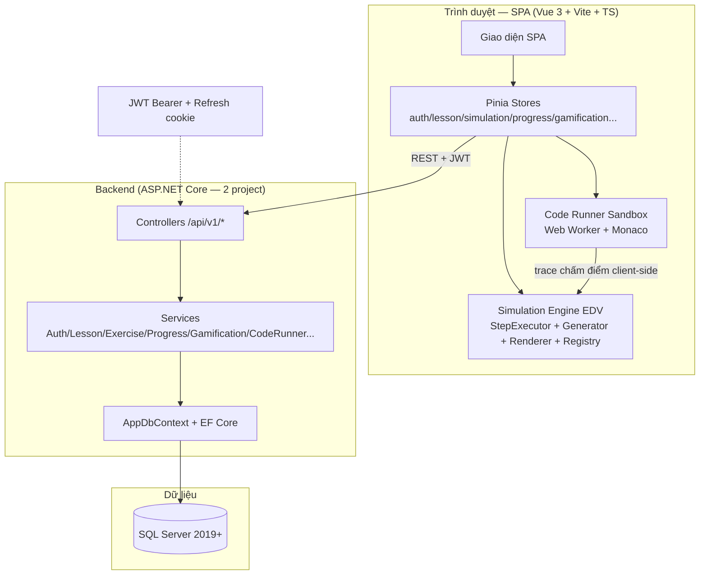
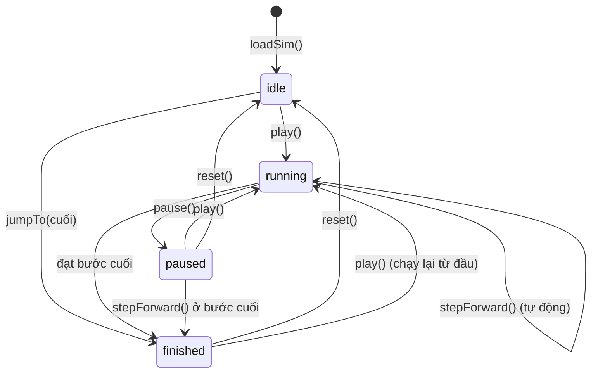
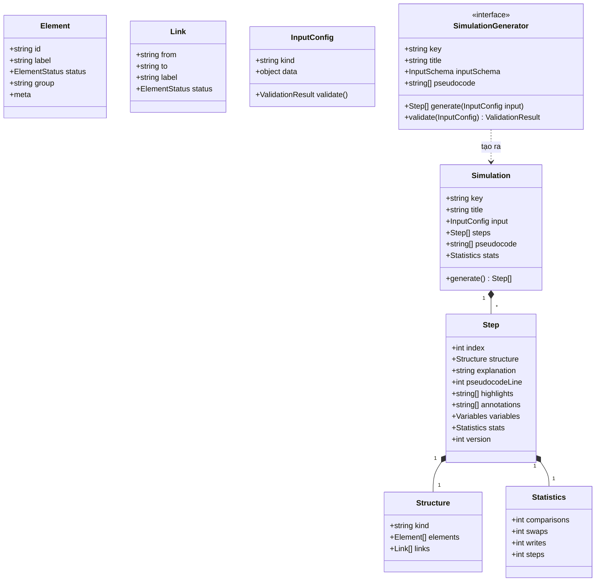
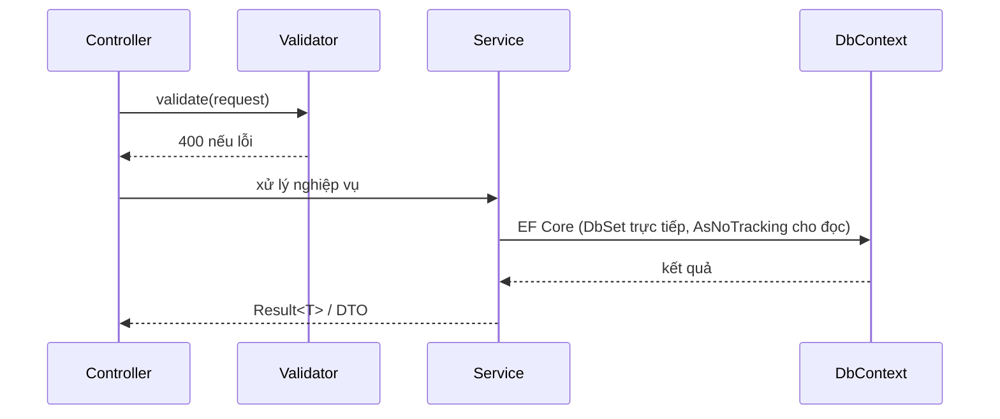
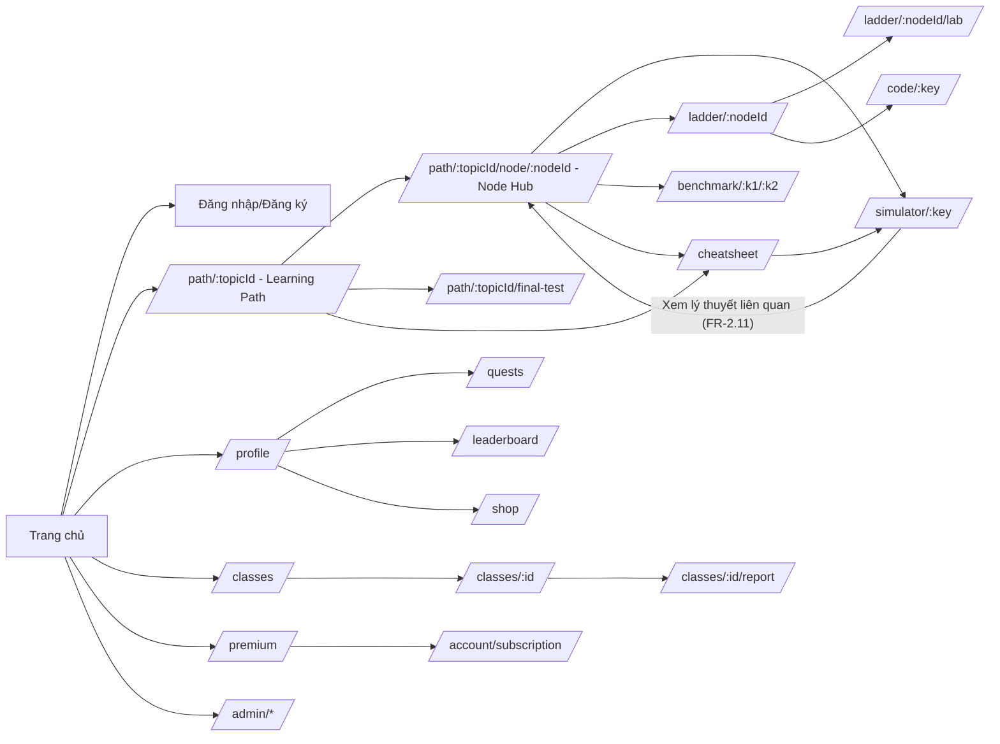
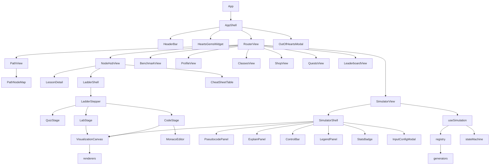
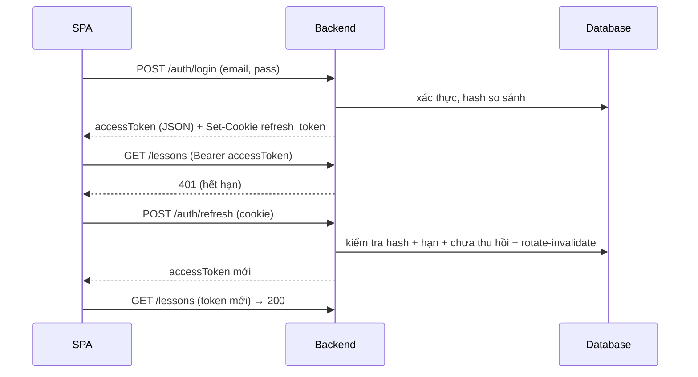

# TÀI LIỆU THIẾT KẾ HỆ THỐNG (SDD)

**Hệ thống hỗ trợ học tập và trực quan hóa cấu trúc dữ liệu và giải thuật (DSA-Visual)**

| | |
|---|---|
| Loại tài liệu | SDD (Software Design Document) |
| Phiên bản | 1.0 |
| Ngày cập nhật | 12/08/2026 |
| Trạng thái | Dự thảo — chờ giảng viên hướng dẫn phê duyệt |
| Người soạn | Mai Tiểu Bảo |
| Người duyệt | Phạm Ngọc Ái Liên |
| Tài liệu liên quan | SRS.md, API_REFERENCE.md, TEST_PLAN.md, SCREEN_MAP.md, DEPLOY.md |
| Nguồn yêu cầu | PRODUCTION_PROMPT.md (Phần 7, 8, 9, 10, 11, 12, 13, 15, 16, 19, 20, 21) |
| Giả định chính | 1) Generator chạy frontend (TypeScript) — ADR-001; 2) Chấm code chạy sandbox Web Worker client — ADR-012; 3) Backend 2 project không Repository — A-1; 4) 32 bảng DB; 5) 32 màn / ~32 route |

## Lịch sử thay đổi

| Phiên bản | Ngày | Người sửa | Mô tả thay đổi |
|---|---|---|---|
| 1.0 | 12/08/2026 | Mai Tiểu Bảo | Sinh mới hoàn chỉnh từ PRODUCTION_PROMPT.md v2.5 (thay bản nháp cũ 09/08 — 364 dòng, thiếu Phần 8 EDV/31 bảng/32 màn) |

---

# 1. GIỚI THIỆU

## 1.1 Mục đích và phạm vi

Tài liệu này mô tả thiết kế chi tiết của DSA-Visual: kiến trúc tổng thể, mô-đun trực quan hóa EDV (phần lõi), thiết kế frontend (Vue 3), backend (ASP.NET Core), API, cơ sở dữ liệu (32 bảng), giao diện (32 màn), bảo mật, triển khai, rủi ro và phân công.

> ⚠ **TRẠNG THÁI TÀI LIỆU**: đây là **đặc tả thiết kế dự kiến (design spec)** — mọi cấu trúc thư mục (`frontend/`, `backend/src/DsaVisual.Api`...), tên project, lệnh chạy mô tả HỆ THỐNG V2 SẼ XÂY, chưa phải mô tả code hiện có. Repo v2 chưa khởi tạo; code thực tế đang nằm ở `VisualizationDSA/` (bản v1 cũ — PostgreSQL + Clean Architecture, KHÔNG áp dụng cho v2). Khi code v2 được tạo, cập nhật lại tài liệu cho khớp (quy tắc 2.7 mục 3).

**Nguyên tắc truy vết**: mọi mục thiết kế ghi chú nguồn FR/UC tương ứng (SRS là tài liệu yêu cầu).

## 1.2 Nguồn yêu cầu chính

| Mục thiết kế | Nguồn |
|---|---|
| Kiến trúc tổng thể | SRS §1.2, §2; prompt §8.0, §19.1 |
| Mô-đun trực quan hóa | prompt §8 (TOÀN BỘ), SRS FR-3.1 → FR-3.20b |
| Frontend | prompt §12, §20.2, §20.5 |
| Backend | prompt §11, SRS NFR-17 |
| CSDL | prompt §10 (TOÀN BỘ), SRS §6 |
| Bảo mật | prompt §13, SRS NFR-8 → NFR-15 |

## 1.3 Bối cảnh và bài học kinh nghiệm (trình bày lại — bắt buộc)

| # | Phản hồi hội đồng bản cũ | Cách khắc phục trong thiết kế này |
|---|---|---|
| 1 | "Cho code đến đâu, chạy visual đến đó" — hardcode hoạt ảnh từng GT | **EDV** (§4.0): mọi GT là mã TypeScript thật chạy qua StepExecutor; hoạt ảnh = phát lại trace |
| 2 | 1 màn gộp 4 chức năng | **1 màn = 1 việc** (§8.0): mỗi route 1 nhiệm vụ; Node Hub/Hồ sơ = tab component tách |
| 3 | Scope trôi dạt | SRS §1.3.2 loại trừ rõ; 12 FR cắt; 20 tuần 10 sprint |

---

# 2. KIẾN TRÚC TỔNG THỂ

## 2.1 Sơ đồ kiến trúc



### Giải thích
- **Frontend** là SPA chứa toàn bộ Simulation Engine (EDV): generator/renderer/StepExecutor chạy trong trình duyệt (Web Worker khi cần) — sinh bước ≤ 500ms cho mảng 100 phần tử (NFR-2), bước lùi miễn phí.
- **Backend** gồm 2 project (DsaVisual.Api + DsaVisual.Application) — KHÔNG Repository pattern, Service dùng DbContext trực tiếp qua DbSet (A-1, NFR-17).
- **Code Runner (Module I)**: chạy + chấm trong sandbox Web Worker phía client (ADR-012); backend chỉ lưu CodeRuns/CodeSubmissions để lịch sử — không có Judge0/container server.

## 2.2 Nguyên tắc thiết kế

1. **EDV-first**: mọi GT = mã thật chạy qua StepExecutor; cấm hardcode chuỗi bước (SRS §1.2).
2. **1 màn = 1 việc**: mỗi route 1 nhiệm vụ; cấm nhúng chức năng chéo (prompt §7.0).
3. **Phân lớp**: Controller → Service → DbContext; Controller không chứa logic > 5 dòng.
4. **Plugin engine**: Registry + interface `SimulationGenerator`/`Renderer` — thêm CTDL/GT không sửa lõi (AC-3).
5. **API version hóa**: `/api/v1/`; breaking → v2 giữ v1 ≥ 6 tháng (NFR-18).
6. **Cấu hình hóa**: mọi hằng số nghiệp vụ trong cấu hình, không hardcode (NFR-19).

## 2.3 Quyết định kiến trúc lớn (ADR — đầy đủ tại §13.2)

| ADR | Quyết định | Lý do |
|---|---|---|
| ADR-001 | Sinh bước batch ở frontend (TypeScript) | bước lùi miễn phí, test dễ, ≤500ms |
| ADR-002 | Canvas (mảng/cây/đồ thị) + DOM (stack/queue/list) | hiệu năng + tương tác |
| ADR-003 | Registry plugin | thêm mô phỏng không sửa lõi |
| ADR-004 | JWT access (memory) + refresh cookie HttpOnly, rotate-invalidate | chống XSS, thu hồi được |
| ADR-009 | Câu hỏi dùng JSON linh hoạt (OptionsJson/AnswerJson) | 4 loại câu hỏi không cần migration |
| ADR-010 | Chấm điểm server-side thuần túy + lưu ResultJson | tái hiện kết quả, chống sửa client |
| ADR-011 | GamificationService = 1 seam duy nhất Module J (nội bộ ≥ 2 module) | 1 điểm vào dễ test |
| ADR-012 | Chấm code trong sandbox Web Worker client — không Judge0 | hạ tầng đơn giản; cam kết "chống lười làm" (FR-9.3) |

---

# 3. THIẾT KẾ FRONTEND (VUE.JS 3)

> Nguồn: prompt §12, §20.2, §20.5. Mỗi store/component đặc tả hợp đồng để dev triển khai không cần hỏi lại.

## 3.1 Cấu trúc thư mục

```
frontend/
├── index.html
├── vite.config.ts
├── package.json
├── .env.development / .env.production        # VITE_API_BASE_URL
├── src/
│   ├── main.ts
│   ├── App.vue
│   ├── router/index.ts                        # + guards (bảng §3.3)
│   ├── api/
│   │   ├── client.ts                          # axios + interceptors (401→refresh, 429, 5xx)
│   │   ├── auth.ts, lessons.ts, exercises.ts, progress.ts,
│   │   ├── simulations.ts, admin.ts, favorites.ts, classes.ts,
│   │   ├── gamification.ts, codeRunner.ts, benchmark.ts
│   ├── stores/                                # Pinia (đặc tả §3.4)
│   │   ├── auth.ts, lesson.ts, simulation.ts, progress.ts, ui.ts,
│   │   ├── gamification.ts, classStore.ts, codeRunner.ts, leaderboard.ts
│   ├── views/                                 # theo SCREEN_MAP (Màn 01-32 + N-1..N-16)
│   │   ├── HomeView.vue, LoginView.vue, RegisterView.vue,
│   │   ├── PathView.vue, NodeHubView.vue, LadderView.vue, LabView.vue,
│   │   ├── SimulatorView.vue, CodeRunnerView.vue, BenchmarkView.vue, CheatSheetView.vue,
│   │   ├── ExerciseView.vue, FinalTestView.vue, ProfileView.vue, QuestsView.vue,
│   │   ├── LeaderboardView.vue, ShopView.vue, PremiumView.vue, SubscriptionView.vue,
│   │   ├── ClassesView.vue, ClassDetailView.vue, ClassReportView.vue,
│   │   ├── FaqView.vue, PrivacyView.vue, HelpView.vue, SearchView.vue,
│   │   └── admin/ (AdminUsersView.vue, AdminStatsView.vue, AdminSettingsView.vue,
│   │               AdminContentView.vue, AdminLadderView.vue)
│   ├── components/
│   │   ├── ui/                                # BaseButton, BaseInput, BaseModal, BaseToast,
│   │   │                                      # BaseTable, BaseCard, BaseTabs, BaseTooltip, ...
│   │   ├── simulator/                         # SimulatorShell, ControlBar, PseudocodePanel,
│   │   │                                      # ExplainPanel, VisualizationCanvas, InputConfigModal,
│   │   │                                      # StatsBadge, LegendPanel, CallStackPanel, BreakpointBar,
│   │   │                                      # ManualPracticePanel, MiniQuizBanner
│   │   ├── ladder/                            # LadderStepper, QuizStage, LabStage, CodeStage
│   │   ├── gamification/                      # HeartsGemsWidget, QuestCard, StreakBadge,
│   │   │                                      # OutOfHeartsModal, ShopItemCard, InventoryPanel
│   │   └── lesson/                            # LessonCard, TopicTree, RichTextViewer, NoteDrawer,
│   │                                          # FeedbackStars, CheatSheetTable
│   ├── engines/                               # (xem §4 — TOÀN BỘ)
│   ├── composables/                           # useSimulation, usePagination, useDebounce,
│   │                                          # useKeyboardShortcuts, useInterval, useToast, useConfirm
│   ├── i18n/vi.ts                             # mọi chuỗi giao diện (bản MVP chỉ vi)
│   ├── styles/                                # tokens.css (màu 7.2), global.css
│   └── utils/                                 # format.ts (Intl vi-VN), validators.ts
└── tests/                                     # unit (engines + stores) + e2e (playwright)
```

## 3.2 Quản lý trạng thái (Pinia) — đặc tả từng store

| Store | State | Actions | Getters |
|---|---|---|---|
| `auth` | `user`, `accessToken` (memory), `status` | `login()`, `register()`, `logout()`, `refresh()` (singleton promise), `fetchMe()` | `isAuthenticated`, `role` |
| `lesson` | `topics`, `lessonsByTopic`, `currentLesson`, `loading` | `fetchTopics()`, `fetchLessons()`, `fetchLesson(id)`, `markViewed(id)` | `progressByTopic` |
| `simulation` | `currentSim`, `steps`, `currentIndex`, `speed`, `status`, `stats`, `inputConfig` | `loadSim(key, input?)`, `configureInput()`, `play()`, `pause()`, `stepForward()`, `stepBack()`, `jumpTo()`, `reset()`, `setSpeed()`, `setBreakpoint()` | `currentStep`, `isFirst`, `isLast` |
| `progress` | `overview`, `lessonProgress`, `reportData` | `fetchOverview()`, `fetchLessonProgress()`, `fetchReport()` | — |
| `gamification` | `hearts`, `heartsMax`, `lastHeartAt`, `gems`, `streakDays`, `xp`, `level`, `quests`, `inventory`, `premium` | `fetchHearts()`, `enterNode(nodeId)`, `fetchQuests()`, `claimQuest(id)`, `fetchInventory()`, `buyItem(id)`, `equipItem(id)`, `fetchPremium()` | `heartsPercent`, `level`, `questDone`, `isPremium` |
| `classStore` | `classes`, `currentClass`, `members`, `assignments` | `fetchClasses()`, `joinClass(code)`, `fetchClass(id)`, `assignContent()` | — |
| `codeRunner` | `editorCode`, `runState`, `lastRun`, `submissions` | `loadTemplate(key)`, `run()`, `submit()`, `fetchHistory()` | `isRunning` |
| `leaderboard` | `tab`, `rows`, `myRank` | `fetchBoard(tab)` | — |
| `ui` | `toasts`, `modalState`, `sidebarOpen`, `theme` | `showToast()`, `openModal()`, `closeModal()`, `toggleTheme()` | — |

> Quy tắc: token chỉ trong memory Pinia (mất khi F5 → refresh qua cookie khôi phục phiên — quyết định §13.2 ADR-004). Mọi store test bằng Vitest (mẫu §3.7).

## 3.3 Router & guards

| Route | Vai trò tối thiểu | Ghi chú |
|---|---|---|
| `/`, `/help`, `/privacy`, `/login`, `/register`, `/forgot-password`, `/reset-password` | Công khai | đã đăng nhập → chuyển khỏi login/register |
| `/learn` | — | **redirect → `/path`** (20.5.6) |
| `/path`, `/path/{topicId}` | Đã đăng nhập | bản đồ node (Màn 13) |
| `/simulations` | Đã đăng nhập | **Khám phá** (màn N-3 — v2.6): danh mục 44 mô phỏng + tab So sánh (Benchmark) + CheatSheet |
| `/path/{topicId}/node/{nodeId}` | Đã đăng nhập | Node Hub (Màn 31) — guard theo Learning Path; vào node trừ tim (20.4) |
| `/simulator/{key}` | Đã đăng nhập hoặc key demo | trừ tim theo 20.4; demo không trừ; hỗ trợ `?step=N` (FR-2.11) |
| `/ladder/{nodeId}`, `/ladder/{nodeId}/lab` | Đã đăng nhập | trong session 30p đã trừ → miễn phí |
| `/code/{key}`, `/code/{key}/history` | Đã đăng nhập | Module I độc lập + Bậc 3 |
| `/benchmark/{k1}/{k2}` | Đã đăng nhập | MIỄN PHÍ tim (20.4) |
| `/cheatsheet` | Đã đăng nhập | mở mô phỏng → trừ tim như bình thường |
| `/exercise/{id}` | Student+ | truy cập qua Ladder Bậc 1 / final test |
| `/path/{topicId}/final-test` | Student+ | Màn 30 |
| `/profile`, `/quests`, `/leaderboard`, `/shop`, `/premium`, `/account/subscription` | Đã đăng nhập | `/dashboard` → **redirect `/profile`** |
| `/classes`, `/classes/{id}`, `/classes/{id}/report` | Đã đăng nhập | report theo vai trò |
| `/admin/**` | Teacher/Admin | meta `{ roles: ['TEACHER','ADMIN'] }` |
| `/reports` | Teacher/Admin | báo cáo theo bài học |

## 3.4 Axios client & interceptors

- `baseURL = import.meta.env.VITE_API_BASE_URL` (mặc định `/api/v1` qua Vite proxy dev).
- Request: gắn `Authorization: Bearer <accessToken>`.
- Response: (1) 401 → refresh 1 lần (cờ `_retry`, dùng `authStore.refresh()` singleton) → thất bại → logout → `/login?redirect=...`; (2) 400/422 → parse `error.message` + focus field; (3) 429 → toast + disable theo `Retry-After`; (4) 5xx → toast "Đã có lỗi xảy ra, vui lòng thử lại".

## 3.5 State machine mô phỏng (bắt buộc)



- Mọi chuyển trạng thái phát event qua store `simulation` để UI (nút, phím tắt) phản ứng thống nhất.
- Timing: `interval = 1200 / speed` ms (0.25x=1200ms; 1x=300ms; 4x=75ms) — nguồn FR-3.5.

## 3.6 Composables dùng chung (hợp đồng)

| Composable | Chức năng | Nơi dùng |
|---|---|---|
| `useSimulation(key)` | nạp sim, play/pause/step/jump/setSpeed, dọn timer khi unmount | Màn 05/16 |
| `usePagination<T>(fetcher)` | state `{items,page,pageSize,total,loading,error}` + `load/goToPage/refresh` | mọi danh sách |
| `useDebounce(fn, 300)` | trễ hành động | tìm kiếm FR-2.5 |
| `useKeyboardShortcuts(map, enabled)` | phím tắt theo focus | Màn 05 (FR-3.5) |
| `useInterval(fn, ms)` | tự dọn khi unmount | đếm ngược bài tập, Màn 28 |
| `useToast()` | qua store ui | toàn app |
| `useConfirm()` | modal xác nhận dạng promise | mọi thao tác xóa |

## 3.7 Mẫu test store (Vitest — chuẩn cho mọi store)

```typescript
// stores/auth.spec.ts (trích)
describe('auth store', () => {
  it('login thành công ghi token và user', async () => {
    vi.spyOn(api, 'post').mockResolvedValue({ accessToken: 'abc', user: mockUser });
    const store = useAuthStore();
    await store.login('a@b.c', 'Pass@123');
    expect(store.accessToken).toBe('abc');
    expect(store.status).toBe('authenticated');
  });
  it('login thất bại giữ nguyên trạng thái', async () => {
    vi.spyOn(api, 'post').mockRejectedValue({ status: 401 });
    const store = useAuthStore();
    await expect(store.login('a@b.c', 'sai')).rejects.toBeTruthy();
    expect(store.status).toBe('error');
  });
});
```

## 3.8 Chuẩn code frontend bắt buộc

1. TypeScript `strict: true`; không `any` (ngoại lệ có chú thích).
2. Composition API `<script setup>` — không Options API.
3. ESLint (vue/recommended + TS) + Prettier.
4. Component UI không chứa logic nghiệp vụ; giao tiếp cha-con qua props/events; trạng thái dùng chung qua Pinia.
5. Mọi chuỗi giao diện trong `src/i18n/vi.ts` — không nhúng chuỗi cứng (i18n sẵn sàng).
6. Tên file: PascalCase component, camelCase hook.
7. Không CSS global tràn lan; biến thiết kế trong `tokens.css`.
8. NFR-31/32: hàm ≤ 40 dòng, class ≤ 400 dòng.

## 3.9 Vite config (điểm quan trọng)

```ts
export default defineConfig({
  plugins: [vue()],
  build: {
    target: 'es2020',
    rollupOptions: { output: { manualChunks: {
      engine: ['@/engines/core'], vendor: ['vue', 'pinia', 'vue-router'] } } },
  },
  server: { port: 5173, proxy: { '/api': { target: 'http://localhost:5000', changeOrigin: true } } },
});
```

- Lazy-load router các trang lớn (SimulatorView, ExerciseView, admin/*).
- Bundle JS gốc ≤ 500KB (NFR-5); `vite build --mode production && npx vite-bundle-visualizer`.

# 4. MÔ-ĐUN TRỰC QUAN HÓA (CỐT LÕI — EXECUTION-DRIVEN VISUALIZATION)

> Nguồn: prompt §8 (TOÀN BỘ). Module này là trái tim đồ án — trả lời phản hồi "cho code đến đâu, chạy visual đến đó".

## 4.0 QUYẾT ĐỊNH KIẾN TRÚC: EDV (BẮT BUỘC)

### 4.0.1 Nguyên tắc cốt lõi
1. MỌI giải thuật lõi trong danh mục được VIẾT BẰNG MÃ THẬT (TypeScript thuần, 1 hàm/GT) và CHẠY THẬT qua StepExecutor (bộ thực thi có gắn thiết bị đo).
2. Hoạt ảnh = phát lại nhật ký thực thi (trace) do StepExecutor ghi trong lúc code chạy — visual LUÔN khớp code, không thể lệch.
3. CẤM hardcode chuỗi bước cho từng giải thuật (anti-pattern bản cũ bị chặt).
4. Người học chỉ sửa tham số / hoàn thiện hàm theo signature cố định trong code MẪU (template) và xem nó chạy trực quan (Module I — FR-9.2) — KHÔNG nhận code tự do tùy biến (quyết định G-6).

### 4.0.2 Kiến trúc EDV (3 lớp)
1. **LỚP MÃ (Code Layer)**: mỗi GT = 1 hàm TypeScript thuần (VD: `bubbleSort(a: number[]): number[]`) + khai báo ràng buộc trực quan (VD: `a → array`; `stack → stack`; `node → tree`).
2. **LỚP THỰC THI (Execution Layer)**: StepExecutor chạy hàm MẪU (template code có sẵn, gắn trace hook) bằng interpreter có instrument; mỗi câu lệnh quan trọng (gán, so sánh, hoán đổi, gọi hàm, lặp, return) ghi 1 TraceEvent: dòng code, snapshot biến, phần tử cần highlight, giải thích tự sinh.
3. **LỚP HIỂN THỊ (Display Layer)**: player đọc TraceEvent[] → vẽ Canvas; KHÔNG chứa logic thuật toán.

### 4.0.3 Hợp đồng StepExecutor (mã TypeScript bắt buộc)

```typescript
// engines/core/stepExecutor.ts
export type TraceKind = 'declare' | 'assign' | 'compare' | 'swap' | 'loop' | 'call' | 'return';

export interface TraceEvent {
  line: number;                              // dòng code trong template (1-based)
  vars: Record<string, unknown>;             // snapshot biến
  highlight: string[];                       // id phần tử cần tô (VD: ['cell:2','cell:3'])
  kind: TraceKind;
  explanation: string;                       // tiếng Việt, tự sinh theo kind
}

export interface VisualBinding {
  variable: string;                          // VD: 'a'
  structure: 'array' | 'stack' | 'queue' | 'linkedlist' | 'tree' | 'heap' | 'hashtable' | 'graph';
}

export interface CodeSimulation {
  code: string;                              // template code (gắn trace hook)
  entry: string;                             // tên hàm chạy chính
  bindings: VisualBinding[];
}

export interface RunResult {
  trace: TraceEvent[];                       // GIỚI HẠN: tối đa 50.000 event, timeout 5 giây
  output: unknown;
  error?: { line: number; message: string };
  stats: { comparisons: number; swaps: number; writes: number; durationMs: number };
}

// Chế độ ĐO KHÔNG trace (v2.5 — dành riêng Benchmark Lab FR-3.20/3.20b):
// chạy code thật NHƯNG không sinh TraceEvent[] nên KHÔNG áp dụng giới hạn 50.000 event.
// Giới hạn: timeout 5 giây/độ đo — vượt → trả null, UI hiển thị "N/A".
// Bộ đếm chặn vòng lặp vô hạn vẫn hoạt động.
export function runMeasure(code: string, input: unknown): { durationMs: number; comparisons: number; swaps: number; writes: number } | null;
```

- **Giới hạn generator (chạy client/Web Worker)**: 50.000 event, timeout 5 giây, bộ đếm chặn vòng lặp vô hạn. **Giới hạn sandbox chấm điểm (FR-9.6)**: 10 giây, 64MB, 200 dòng.
- Giải thích tự sinh theo kind: `assign` → "Gán key = a[i] = 7"; `compare` → "7 > 4 → đúng, hoán đổi"; `loop` → "Vòng lặp j = 0 → 3".

### 4.0.4 Lý do chọn interpreter (không chạy JS engine nguyên bản)
- Bắt được state TẠI TỪNG câu lệnh (kể cả giữa biểu thức) mà không phải sửa code người dùng.
- Chạy an toàn code người học (chỉ sửa tham số/hoàn thiện hàm theo signature): giới hạn tài nguyên, bước lùi miễn phí, không phụ thuộc engine ngoài.
- Một định dạng trace thống nhất cho mọi GT — test dễ, so sánh dễ.

### 4.0.5 Ảnh hưởng tới các mục khác
- §4.2: giữ interface `SimulationGenerator` cho CTDL tĩnh (layout cây, bảng băm...) nhưng bổ sung `CodeSimulationRunner` (code + executor) cho MỌI GT động — đường chính.
- §4.7 mã giả: trở thành "code mẫu chạy được" — chính là code nạp vào editor (Module I), kèm chú thích dòng.
- §4.8 golden data: kiểm tra trace sinh ra khớp hành vi code thật (không phải kỳ vọng vẽ tay).
- FR-3.12 thực hành bước thủ công: đáp án lấy từ trace thật của StepExecutor.

## 4.1 Mô hình dữ liệu lõi



### Giải thích bắt buộc
- `Step.structure` là **snapshot bất biến** (immutable) — KHÔNG thay đổi sau khi tạo; renderer chỉ đọc (Object.freeze trong dev).
- `Step.highlights` = danh sách id phần tử được tô theo trạng thái; `annotations` = chú thích động (VD: "i=2", "so sánh a[2]=7 < a[3]=4?").
- `Statistics` là **bộ đếm tích lũy** đến hết bước hiện tại (không phải delta).
- Tất cả bước sinh ngay tại `generate()` — mô hình **batch "tạo trước, chơi sau"** (không sinh tăng dần): bước lùi miễn phí, dễ kiểm thử, dễ lưu trữ.
- `Step.version = 1` — khi đổi định dạng bước, tăng version + migrator nếu cần.

## 4.2 Hợp đồng Generator (interface TypeScript đầy đủ)

```typescript
// engines/core/types.ts
export type ElementStatus = 'default' | 'active' | 'highlight' | 'swap' | 'done' | 'error' | 'muted';

export interface Element {
  id: string;            // duy nhất trong Structure, VD: 'cell:2', 'node:5', 'edge:2-3'
  label: string;         // giá trị hiển thị chính, VD: '7', 'null', 'd[2]=9'
  status: ElementStatus;
  group?: string;        // nhóm renderer bố trí, VD: 'heap-array', 'tree', 'bucket:3'
  meta?: Record<string, unknown>;
}

export interface Link {
  from: string;
  to: string;
  label?: string;        // VD: trọng số 'w=4'
  status?: ElementStatus;
}

export interface Structure {
  kind: string;          // 'array' | 'linkedlist' | 'stack' | 'queue' | 'tree' | 'heap' | 'hashtable' | 'graph'
  elements: Element[];
  links: Link[];
}

export interface Step {
  index: number;
  structure: Structure;
  explanation: string;         // tiếng Việt, 1-4 câu
  pseudocodeLine: number;      // dòng mã giả 1-based
  highlights: string[];
  annotations: string[];       // VD: ['i=2, j=3', 'so sánh a[2]=7 > a[3]=4 → hoán đổi']
  variables: Record<string, string | number | boolean | null>;
  stats: { comparisons: number; swaps: number; writes: number };
  version: 1;
}

export interface InputConfig { kind: string; data: unknown; }

export interface InputSchema {
  kind: string;
  fields: Array<{
    name: string;
    type: 'int' | 'int[]' | 'string[]' | 'select' | 'bool';
    label: string;
    min?: number; max?: number;
    options?: Array<{ label: string; value: unknown }>;
    default: unknown;
    description: string;
  }>;
}

export interface SimulationGenerator {
  key: string;                 // VD: 'sort.bubble'
  title: string;               // tiếng Việt
  category: 'structure' | 'algorithm';
  dataStructure: string;
  level: 'basic' | 'advanced';
  complexity: { best: string; average: string; worst: string; space: string };
  inputSchema: InputSchema;
  pseudocode: string[];        // mỗi phần tử = 1 dòng mã giả
  generate(input: InputConfig): Step[];
  validate(input: InputConfig): { ok: boolean; errors: string[] };
}
```

## 4.3 Quy tắc bắt buộc khi viết generator

1. **Thuần túy**: không đụng DOM, không gọi API, không biến toàn cục — chỉ nhận `InputConfig`, trả `Step[]`.
2. **Bước 0 luôn là trạng thái khởi tạo**: giải thích "Bắt đầu: dữ liệu đầu vào được khởi tạo", `pseudocodeLine = 1`, stats = 0.
3. **Bước cuối**: trạng thái hoàn tất, giải thích "Kết thúc: giải thuật hoàn tất", tất cả phần tử `done` (nếu hợp lệ), `pseudocodeLine` = dòng cuối.
4. **Mỗi thao tác cơ bản = ≥ 1 bước**: so sánh, hoán đổi, gán, kiểm tra điều kiện, di chuyển con trỏ — mỗi thao tác có bước riêng. Riêng so sánh: 1 bước `active` trên cả 2 phần tử + 1 bước kết quả (VD: "7 > 4 → đúng").
5. **Giải thích cụ thể**: "So sánh a[2]=7 và a[3]=4" — CẤM "So sánh hai phần tử".
6. **Giới hạn bước**: không giới hạn cứng; mảng 100 phần tử bubble sort ≈ ≤ 20.000 bước (chấp nhận); > 30.000 bước → cảnh báo "Dữ liệu lớn, mô phỏng có thể chậm".
7. **Số liệu thống kê**: `comparisons` tăng khi so sánh; `swaps` khi hoán đổi/đổi chỗ; `writes` khi gán phần tử; giá trị tích lũy.
8. **`variables`**: gồm mọi biến quan trọng (i, j, key, low, high, top, front, rear, current, minIdx, target, found...) tại bước đó; null nếu chưa khởi tạo.

## 4.4 Hợp đồng Renderer

```typescript
// engines/renderers/interface.ts
export interface Renderer {
  supportedKinds: string[];          // VD: ['array']
  mount(canvas: HTMLCanvasElement): void;
  render(structure: Structure, options: RenderOptions): void;
  resize(width: number, height: number): void;
  dispose(): void;
}
export interface RenderOptions {
  showIndex: boolean;
  showValues: boolean;
  zoom: number;                      // 0.5 - 2
  showLegend: boolean;
}
```

- Renderer KHÔNG chứa logic giải thuật; chỉ đọc `Structure` và vẽ.
- Renderer tạo class vẽ riêng `CanvasPainter` chịu trách nhiệm: hình học, màu sắc, chữ, hoạt ảnh mượt (requestAnimationFrame, tối đa 1 render/frame).
- Quy ước bố trí từng loại CTDL: xem §8.3 (bảng 7.6 prompt).

## 4.5 Registry (đăng ký mô phỏng)

```typescript
// engines/registry.ts
type GeneratorFactory = () => SimulationGenerator;
const registry = new Map<string, GeneratorFactory>();
export function registerSimulation(key: string, factory: GeneratorFactory): void { registry.set(key, factory); }
export function getSimulation(key: string): SimulationGenerator | undefined { const f = registry.get(key); return f ? f() : undefined; }
export function listSimulations(): SimulationGenerator[] { /* tất cả đã sinh */ }
```

- **Bắt buộc**: mọi mô phỏng khai báo trong 1 file duy nhất `engines/catalog.ts` — danh mục duy nhất đồng bộ backend (`shared/simulation-catalog.json`, §9.9 prompt; CI so sánh 2 danh sách key → khác → fail build).
- `key` định danh toàn cục: `{nhóm}.{tên}` — `sort.bubble`, `search.binary`, `tree.bst-insert`, `graph.dijkstra`, `stack.push`...

## 4.6 Bảng chuẩn trạng thái phần tử theo từng loại giải thuật (15 GT)

### 4.6.1 Nhóm sắp xếp

| Giải thuật | Loại bước | Element status | Ghi chú |
|---|---|---|---|
| Bubble | So sánh a[j], a[j+1] | cả 2: `active` | annotation: `a[j]=x > a[j+1]=y?` |
| Bubble | Hoán đổi | cả 2: `swap` | sau bước này phần tử cuối đoạn → `done` |
| Bubble | Kết thúc 1 vòng | phần tử vị trí cuối đoạn: `done` | "a[n-i] đã nằm đúng vị trí" |
| Selection | Tìm min trong đoạn | đang xét: `active`; min hiện tại: `highlight` | |
| Selection | Hoán đổi a[i] ↔ a[minIdx] | 2 phần tử: `swap`; sau đó a[i]: `done` | |
| Insertion | Gán key = a[i] | a[i]: `highlight` | annotation: `key=5` |
| Insertion | Dịch a[j] sang phải | a[j]: `swap` (biểu thị dịch) | |
| Insertion | Chèn key | vị trí chèn: `done` | |
| Merge | Chia đôi | đoạn chia: `active` (group) | |
| Merge | So sánh 2 phần tử hai nửa | 2 phần tử: `active` | |
| Merge | Ghi vào mảng tạm | nguồn: `swap`; vị trí ghi: `done` | |
| Quick | Chọn pivot | pivot: `highlight` | annotation: `pivot=a[hi]=9` |
| Quick | So sánh a[i] ≤ pivot | a[i]: `active` | |
| Quick | Hoán đổi a[i] ↔ a[j] | 2 phần tử: `swap` | |
| Quick | Pivot về vị trí | pivot: `done` | vị trí chia đôi |
| Heap Sort | Heapify từng nút | nút đang heapify: `active` | |
| Heap Sort | So sánh cha với con | cha + con lớn hơn: `active` | |
| Heap Sort | Đưa a[0] về cuối | 2 phần tử: `swap`; sau đó a[i]: `done` | |

### 4.6.2 Nhóm tìm kiếm

| Giải thuật | Loại bước | Element status | Ghi chú |
|---|---|---|---|
| Linear | Xét a[i] | a[i]: `active` | annotation: `a[2]=7 so với target 7?` |
| Linear | Tìm thấy | phần tử: `done` + banner "Tìm thấy tại vị trí i" | |
| Linear | Không tìm thấy | toàn mảng: `muted` + banner | dùng `muted` để không nhầm là lỗi |
| Binary | Tính mid | mid: `highlight` | annotation: `mid=(low+high)/2=(0+7)/2=3` |
| Binary | So sánh a[mid] và target | a[mid]: `active` | |
| Binary | Thu hẹp low/high | đoạn bỏ: `muted` | |
| Binary | Tìm thấy / không thấy | `done` + banner / banner "Không tìm thấy" | |

### 4.6.3 Nhóm CTDL tuyến tính

| Giải thuật | Loại bước | Element status | Ghi chú |
|---|---|---|---|
| Stack push | Kiểm tra top = capacity-1 | đỉnh: `active`; đầy → `error` + dừng | |
| Stack push | Ghi s[top+1] | ô mới: `swap` → `done` | annotation: `top: 2→3, s[3]=5` |
| Stack pop | Kiểm tra rỗng | rỗng → `error` + dừng | |
| Stack pop | Lấy x, giảm top | đỉnh: `swap` → `muted` | hoạt ảnh bay lên ≤ 200ms |
| Stack peek | Trả s[top] | đỉnh: `highlight` | |
| Queue enqueue | Ghi q[rear+1] | ô mới: `swap` → `done` | annotation: `front=0, rear: 2→3` |
| Queue dequeue | Lấy q[front] | ô front: `swap` → `muted` | hoạt ảnh bay ra trái |
| List insert | Tạo nút mới | nút mới (chưa nối): `highlight`, link đứt nét | |
| List insert | Nối next | nút mới: `swap` → `done` | |
| List delete | Xóa nút k | nút bị xóa: `error` → `muted`; nút k-1.next đổi hướng | |
| List search | Duyệt so sánh | đang xét: `active`; tìm thấy: `done` | |

### 4.6.4 Nhóm cây

| Giải thuật | Loại bước | Element status | Ghi chú |
|---|---|---|---|
| BST insert | So sánh x với root | nút đang xét: `active` | annotation: `x=7 so với root=5: 7>5 → rẽ phải` |
| BST insert | Chèn nút mới | nút mới: `highlight` → `swap` → `done` | |
| BST delete | Tìm nút x | đang xét: `active`; tìm thấy: `error` | |
| BST delete 2 con | Tìm min cây con phải | nút min: `highlight`; thay giá trị: `swap` | |
| AVL | Cập nhật chiều cao + bf | mỗi nút đường đi: nhãn `bf=±x` | |
| AVL | Mất cân bằng | nút vi phạm: `error` | annotation: `bf=2 → mất cân bằng` |
| AVL | Xoay LL/RR/LR/RL | nhóm nút xoay: `swap`; cạnh vẽ lại động | hoạt ảnh xoay ≤ 300ms |
| Heap insert | Chèn vào cuối mảng | ô cuối: `highlight` | |
| Heap bubble up | Cha-con | cha-con: `swap`; mũi tên lên | |
| Heap extract max | a[0] ra, a[last] lên | a[0]: `error` → `muted`; a[last] lên đầu: `swap` | |
| Heap sift down | Cha-con | cha-con: `swap`; mũi tên xuống | |

### 4.6.5 Nhóm đồ thị và bảng băm

| Giải thuật | Loại bước | Element status | Ghi chú |
|---|---|---|---|
| BFS | Đưa s vào hàng đợi | s: `highlight`; hàng đợi hiển thị cạnh | order: 1 |
| BFS | Dequeue u | u: `done` | |
| BFS | Xét v kề chưa thăm | cạnh (u,v): `active`; v: `active` → `done` | order tăng dần |
| BFS | Hoàn tất | liên thông: `done`; không đến được: `muted` | |
| DFS | Tương tự BFS | dùng stack; thứ tự thăm khi pop | hiển thị stack hiện tại |
| Dijkstra | Khởi tạo d[s]=0, d[v]=∞ | d[] hiển thị dưới mỗi đỉnh | |
| Dijkstra | Extract-min u | u: `done` | |
| Dijkstra | Relax cạnh (u,v,w) | cạnh: `active` | annotation: `d[u]+w=4 < d[v]=∞ → cập nhật d[v]=4` |
| Dijkstra | Cập nhật d[v] | v: `swap` (nhấp nháy); parent[v]=u | |
| Dijkstra | Hoàn tất | cây đường đi ngắn nhất: cạnh `done`; banner liệt kê d[] | |
| Hash | Tính hash | annotation: `h(27) = 27 mod 7 = 6` | |
| Hash | Chèn vào bucket | bucket: `active`; ô chèn: `swap` → `done` | |
| Hash | Xung đột (chuỗi nối kết) | bucket: `highlight`; duyệt từng nút: `active` | |
| Hash | Tìm thấy / không | nút: `done` / bucket: `muted` | |
| Hash | Xóa | nút: `error` → `muted` | |

## 4.7 Mã giả chuẩn (code mẫu chạy được — 15 GT)

> Mã giả chính thức mà mọi generator phải bám theo. Mỗi GT: bảng "Dòng mã giả → Loại bước sinh ra". Đây đồng thời là code nạp vào editor (Module I).

### 4.7.1 Bubble Sort (`sort.bubble`)

```text
1.  procedure bubbleSort(a[0..n-1])
2.    for i ← 0 to n-2 do
3.      swapped ← false
4.      for j ← 0 to n-2-i do
5.        if a[j] > a[j+1] then
6.          swap a[j], a[j+1]
7.          swapped ← true
8.      if swapped = false then
9.        return          // mảng đã sắp xếp
10.   end procedure
```

- Sinh bước: chạm dòng 4 → 1 bước (con trỏ j); dòng 5 → 2 bước (so sánh + kết quả); dòng 6 → 1 bước hoán đổi; dòng 8 → 1 bước kiểm tra; dòng 9 → 1 bước kết thúc sớm (toàn bộ `done`).
- Phần tử `a[n-1-i]` đánh `done` sau mỗi vòng lặp ngoài.

### 4.7.2 Selection Sort (`sort.selection`)

```text
1.  procedure selectionSort(a[0..n-1])
2.    for i ← 0 to n-2 do
3.      minIdx ← i
4.      for j ← i+1 to n-1 do
5.        if a[j] < a[minIdx] then
6.          minIdx ← j
7.      if minIdx ≠ i then
8.        swap a[i], a[minIdx]
9.      a[i] ← done
10.   end procedure
```

### 4.7.3 Insertion Sort (`sort.insertion`)

```text
1.  procedure insertionSort(a[0..n-1])
2.    for i ← 1 to n-1 do
3.      key ← a[i]
4.      j ← i-1
5.      while j ≥ 0 and a[j] > key do
6.        a[j+1] ← a[j]
7.        j ← j-1
8.      a[j+1] ← key
9.      i-part → done
10.   end procedure
```

### 4.7.4 Merge Sort (`sort.merge`)

```text
1.  procedure mergeSort(a, left, right)
2.    if left ≥ right then return
3.    mid ← (left + right) / 2
4.    mergeSort(a, left, mid)
5.    mergeSort(a, mid+1, right)
6.    merge(a, left, mid, right)
7.  procedure merge(a, left, mid, right)
8.    t ← mảng tạm, k ← left, i ← left, j ← mid+1
9.    while i ≤ mid and j ≤ right do
10.     if a[i] ≤ a[j] then t[k] ← a[i], i++
11.     else t[k] ← a[j], j++
12.     k++
13.   sao chép phần còn lại
14.   ghi t về a[left..right]
15.   end procedures
```

- Mỗi lệnh gọi đệ quy sinh 1 bước đánh dấu đoạn `[left..right]` (group); ngăn xếp đệ quy tùy chọn (FR-3.14).

### 4.7.5 Quick Sort — Lomuto (`sort.quick`)

```text
1.  procedure quickSort(a, low, high)
2.    if low ≥ high then return
3.    p ← partition(a, low, high)
4.    quickSort(a, low, p-1)
5.    quickSort(a, p+1, high)
6.  procedure partition(a, low, high)
7.    pivot ← a[high]
8.    i ← low-1
9.    for j ← low to high-1 do
10.     if a[j] ≤ pivot then
11.       i ← i+1
12.       swap a[i], a[j]
13.   swap a[i+1], a[high]      // pivot về đúng vị trí
14.   return i+1
15.   end procedures
```

### 4.7.6 Heap Sort (`sort.heap`)

```text
1.  procedure heapSort(a[0..n-1])
2.    buildMaxHeap(a)            // heapify từ n/2-1 về 0
3.    for i ← n-1 downto 1 do
4.      swap a[0], a[i]
5.      a[i] ← done
6.      siftDown(a, 0, i-1)
7.  procedure siftDown(a, root, end)
8.    while 2*root+1 ≤ end do
9.      child ← max(a[2*root+1], a[2*root+2]) (nếu tồn tại)
10.     if a[root] < a[child] then swap, root ← child
11.     else break
12.   end procedures
```

### 4.7.7 Linear Search (`search.linear`)

```text
1.  procedure linearSearch(a[0..n-1], target)
2.    for i ← 0 to n-1 do
3.      if a[i] = target then
4.        return i             // tìm thấy
5.    return -1                // không thấy
6.   end procedure
```

### 4.7.8 Binary Search (`search.binary`)

```text
1.  procedure binarySearch(a[0..n-1], target)   // a đã sắp xếp
2.    low ← 0, high ← n-1
3.    while low ≤ high do
4.      mid ← (low + high) / 2
5.      if a[mid] = target then return mid
6.      if a[mid] < target then low ← mid+1
7.      else high ← mid-1
8.    return -1
9.   end procedure
```

### 4.7.9 Stack — Push/Pop/Peek (`stack.push`, `stack.pop`, `stack.peek`)

```text
push(x):  if top = capacity-1 then error "Tràn ngăn xếp"
          else top++, s[top] ← x
pop():    if top = -1 then error "Ngăn xếp rỗng"
          else x ← s[top], top--
peek():   if top = -1 then error "Ngăn xếp rỗng"
          else return s[top]
```

- Dữ liệu vào: danh sách thao tác (mỗi thao tác = vài bước); lỗi tràn/rỗng dùng `error` + dừng.

### 4.7.10 Queue — Enqueue/Dequeue (`queue.enqueue`, `queue.dequeue`)

```text
enqueue(x): if rear = capacity-1 and front = 0 then error "Hàng đợi đầy"
            else rear++, q[rear] ← x
dequeue():  if front > rear then error "Hàng đợi rỗng"
            else x ← q[front], front++
```

### 4.7.11 Danh sách liên kết đơn (`list.insert`, `list.delete`, `list.search`, `list.traverse`)

```text
insertHead(x):  newNode ← tạo nút(x); newNode.next ← head; head ← newNode
insertTail(x):  duyệt tới nút cuối; nút cuối.next ← newNode
insertAt(k, x): duyệt tới vị trí k-1 (error nếu k ngoài phạm vi); chèn
deleteAt(k):    duyệt tới k-1; xóa nút k; nút k-1.next ← nút k+1 (error nếu rỗng/k ngoài phạm vi)
search(x):      duyệt, so sánh từng nút; trả vị trí/không tìm thấy
traverse():     từ head in từng giá trị tới null
```

### 4.7.12 BST (`tree.bst-insert`, `tree.bst-delete`, `tree.bst-search`, `tree.bst-preorder/inorder/postorder/levelorder`)

```text
insert(root, x):  nếu root rỗng → tạo nút; x < root → đệ quy trái;
                  x > root → đệ quy phải; x = root → bỏ qua (hoặc đếm trùng, cấu hình)
delete(root, x):  tìm nút x; 0 con → xóa; 1 con → thay bằng con;
                  2 con → thay bằng min cây con phải (hoặc max cây con trái)
search(root, x):  như insert, so sánh từng bước; tìm thấy → done
traverse: preorder (N-L-R), inorder (L-N-R — kết quả tăng dần),
          postorder (L-R-N), levelorder (hàng đợi BFS)
```

### 4.7.13 AVL — Chèn kèm xoay (`tree.avl-insert`)

```text
insert(root, x):  như BST; sau chèn cập nhật chiều cao, balance = hL - hR
nếu |balance| > 1:  LL: xoay phải quanh root
                    RR: xoay trái quanh root
                    LR: xoay trái (con trái) rồi xoay phải (root)
                    RL: xoay phải (con phải) rồi xoay trái (root)
mỗi bước: hiển thị balance factor tại từng nút (nhãn bf), nút vi phạm: `error`
```

### 4.7.14 Heap — Chèn/Trích xuất max/Heapify (`heap.insert`, `heap.extract`, `heap.heapify`)

```text
insert(x):    a[size] ← x, size++; bubbleUp(vị trí size-1)
bubbleUp(i):  while i > 0 và a[parent(i)] < a[i]: swap, i ← parent(i)
extractMax(): max ← a[0]; a[0] ← a[size-1]; size--; siftDown(0); trả max
heapify(a):   for i ← (n/2 - 1) downto 0: siftDown(i)
```

### 4.7.15 Đồ thị — BFS/DFS/Dijkstra (`graph.bfs`, `graph.dfs`, `graph.dijkstra`)

```text
BFS(s):    queue ← [s]; visited[s] ← true
           while queue không rỗng: u ← dequeue; với mỗi v kề u:
             nếu chưa thăm: visited[v] ← true; parent[v] ← u; enqueue(v)
DFS(s):    stack ← [s] (hoặc đệ quy); đánh dấu thăm khi pop/duyệt
Dijkstra(s): d[s] ← 0; d[v] ← ∞; PQ chứa (d, v)
           while PQ không rỗng: u ← extract-min; với mỗi cạnh (u,v,w):
             nếu d[u] + w < d[v]: d[v] ← cập nhật; decrease-key; parent[v] ← u
```

- Hiển thị: dãy thứ tự thăm (`order: 1,2,3...`), queue/stack trạng thái, `parent[]` cạnh tô `done` khi cây khung hình thành, d[] dưới mỗi đỉnh cho Dijkstra.

## 4.8 Bộ dữ liệu kiểm thử chuẩn (golden data — N1..N7)

> Mỗi GT phải có bộ test kết quả mong đợi tính trước (độc lập code). Tối thiểu 5 nhóm, mỗi nhóm ≥ 2 bộ dữ liệu:

| Nhóm | Đặc điểm | VD (bubble sort) |
|---|---|---|
| N1 | Mảng rỗng / 1 phần tử | `[]`, `[5]` |
| N2 | Đã sắp xếp tăng dần | `[1,2,3,4,5]` |
| N3 | Sắp xếp giảm dần | `[5,4,3,2,1]` |
| N4 | Giá trị trùng lặp | `[4,2,4,1,4]` |
| N5 | Số âm + trái dấu | `[-3,7,-1,0,2]` |
| N6 | Kích thước lớn (100) | ngẫu nhiên seed cố định (seed=42, xorshift) |
| N7 | Đặc thù GT | tìm kiếm: target có/không; đồ thị: chu trình; BST: xóa 0/1/2 con; AVL: 4 kiểu xoay |

Với mỗi bộ dữ liệu: (1) danh sách bước mong đợi dạng ngắn gọn hoặc kiểm tra bất biến (mảng cuối đã sắp xếp, số bước đúng chuẩn, bộ đếm trong khung lý thuyết); (2) kiểm tra trạng thái phần tử tại bước mốc (đầu/giữa/cuối); (3) kiểm tra `pseudocodeLine` khớp hành động. Chi tiết kỳ vọng từng GT: TEST_PLAN §5 (bảng 8.8A prompt).

## 4.9 Định dạng Step (ví dụ chuẩn — bubble sort, a=[3,1,2])

```json
{
  "index": 0,
  "structure": {
    "kind": "array",
    "elements": [
      { "id": "cell:0", "label": "3", "status": "default" },
      { "id": "cell:1", "label": "1", "status": "default" },
      { "id": "cell:2", "label": "2", "status": "default" }
    ],
    "links": []
  },
  "explanation": "Bắt đầu: mảng [3, 1, 2] được khởi tạo.",
  "pseudocodeLine": 1,
  "highlights": [],
  "annotations": ["i=0, j=0"],
  "variables": { "i": 0, "j": 0, "swapped": false, "n": 3 },
  "stats": { "comparisons": 0, "swaps": 0, "writes": 0 },
  "version": 1
}
```

### 4.9A Trace chuẩn bước đầy đủ — Bubble Sort `[3,1,2]` (mốc vàng)

| Bước | line | Giải thích | annotations | variables | c/s/w | Trạng thái phần tử |
|---|---|---|---|---|---|---|
| 0 | 1 | Bắt đầu: mảng [3,1,2] được khởi tạo | i=0, j=0 | {i:0,j:0,swapped:false,n:3} | 0/0/0 | cả 3: default |
| 1 | 4 | Bắt đầu vòng lặp trong với j=0 | j=0 | {i:0,j:0} | 0/0/0 | cả 3: default |
| 2 | 5 | So sánh a[0]=3 và a[1]=1 | so sánh a[0]=3 > a[1]=1? | {j:0} | 1/0/0 | cell:0 active, cell:1 active |
| 3 | 6 | 3 > 1 → đúng, hoán đổi a[0] và a[1] | hoán đổi | {j:0} | 1/1/0 | cell:0 swap, cell:1 swap |
| 4 | 7 | Đánh dấu swapped=true | | {swapped:true} | 1/1/0 | cell:0 swap, cell:1 swap |
| 5 | 4 | j=1 (vòng trong lần 2) | j=1 | {j:1} | 1/1/0 | cell:0 default, cell:1 default |
| 6 | 5 | So sánh a[1]=3 và a[2]=2 | so sánh a[1]=3 > a[2]=2? | {j:1} | 2/1/0 | cell:1 active, cell:2 active |
| 7 | 6 | 3 > 2 → đúng, hoán đổi a[1] và a[2] | hoán đổi | {j:1} | 2/2/0 | cell:1 swap, cell:2 swap |
| 8 | 7 | swapped=true | | {swapped:true} | 2/2/0 | cell:1 swap, cell:2 swap |
| 9 | 8 | Kết thúc vòng trong; swapped=true → tiếp tục | | {i:0} | 2/2/0 | cell:2 done (đúng vị trí) |
| 10 | 2 | i=1 (vòng ngoài lần 2) | i=1 | {i:1} | 2/2/0 | cell:2 done |
| 11 | 3 | swapped=false | | {swapped:false} | 2/2/0 | cell:2 done |
| 12 | 4 | j=0 | | {j:0} | 2/2/0 | cell:0..1 default |
| 13 | 5 | So sánh a[0]=1 và a[1]=3 | 1 > 3? | {j:0} | 3/2/0 | cell:0 active, cell:1 active |
| 14 | 5 | 1 > 3 → sai, không hoán đổi | | {j:0} | 3/2/0 | cell:0 active, cell:1 active |
| 15 | 4 | j=1 | | {j:1} | 3/2/0 | cell:0 default, cell:1 default |
| 16 | 5 | So sánh a[1]=3 và a[2]=2 | 3 > 2? | {j:1} | 4/2/0 | cell:1 active, cell:2 done |
| 17 | 6 | 3 > 2 → đúng, hoán đổi a[1] và a[2] | hoán đổi | {j:1} | 4/3/0 | cell:1 swap, cell:2 swap |
| 18 | 8 | swapped=true → tiếp tục vòng ngoài | | | 4/3/0 | cell:1 done |
| 19 | 2 | i=2 → vòng ngoài kết thúc (i ≤ n-2 sai) | | {i:2} | 4/3/0 | cell:0..1 done |
| 20 | 10 | Kết thúc: mảng [1,2,3] đã sắp xếp | | | 4/3/0 | cả 3: done |

**Kiểm tra bất biến**: `comparisons` cuối = 4 = n(n-1)/2 (n=3); `pseudocodeLine` ∈ [1..10]; mỗi bước có giải thích ≠ rỗng; annotation khi có thao tác.

### 4.9B Ví dụ Step JSON — Binary Search `a=[2,5,8,12,19,23]`, target=12 (trích 4 bước)

```json
[
  { "index": 0, "pseudocodeLine": 2, "explanation": "Bắt đầu: low=0, high=5.",
    "variables": { "low": 0, "high": 5, "mid": null, "found": false },
    "structure": { "kind": "array", "elements": [
      { "id": "cell:0", "label": "2", "status": "default" },
      { "id": "cell:1", "label": "5", "status": "default" },
      { "id": "cell:2", "label": "8", "status": "default" },
      { "id": "cell:3", "label": "12", "status": "default" },
      { "id": "cell:4", "label": "19", "status": "default" },
      { "id": "cell:5", "label": "23", "status": "default" }], "links": [] },
    "stats": { "comparisons": 0, "swaps": 0, "writes": 0 }, "version": 1 },
  { "index": 1, "pseudocodeLine": 4, "explanation": "mid = (0+5)/2 = 2 (làm tròn xuống).",
    "variables": { "low": 0, "high": 5, "mid": 2 }, "highlights": ["cell:2"],
    "annotations": ["mid=2, a[2]=8"] },
  { "index": 2, "pseudocodeLine": 6, "explanation": "a[2]=8 < target 12 → tìm nửa phải: low=3.",
    "variables": { "low": 3, "high": 5, "mid": 2 }, "highlights": ["cell:2"],
    "structure": { "kind": "array", "elements": [
      { "id": "cell:0", "label": "2", "status": "muted" },
      { "id": "cell:1", "label": "5", "status": "muted" },
      { "id": "cell:2", "label": "8", "status": "active" },
      { "id": "cell:3", "label": "12", "status": "default" },
      { "id": "cell:4", "label": "19", "status": "default" },
      { "id": "cell:5", "label": "23", "status": "default" }], "links": [] } },
  { "index": 3, "pseudocodeLine": 4, "explanation": "mid = (3+5)/2 = 4.",
    "variables": { "low": 3, "high": 5, "mid": 4 }, "highlights": ["cell:4"] }
]
```

## 4.10 Kiểm thử khả năng mở rộng (bắt buộc trong TEST_PLAN)

1. Tạo 1 GT mới giả lập (`sort.gnome` — 20 dòng, không sửa file nào trong `engines/core/`) → đăng ký catalog → mô phỏng chạy được, xuất hiện danh mục, UI không lỗi.
2. Tạo 1 CTDL mới với renderer tối thiểu (`deque` dùng lại kind `array`) → hiển thị đúng.
3. Kiểm tra git diff: không file nào ngoài `engines/` + catalog bị sửa.

## 4.11 Quyết định thiết kế và lý do

| Quyết định | Lựa chọn | Lý do |
|---|---|---|
| Sinh bước | Batch (sinh trước toàn bộ) | bước lùi miễn phí; unit test dễ; mảng 100 phần tử ≤ 500ms |
| Nơi sinh bước | Frontend (TypeScript) | giảm tải server; offline demo; đồng bộ 3 vùng không cần mạng |
| Vẽ | Canvas (mảng/cây/đồ thị), DOM (stack/queue/list) | hiệu năng cao + tương tác chính xác |
| Renderer phụ thuộc | Không | mỗi renderer độc lập, đăng ký theo kind |
| Bất biến Step | Có (immutable) | tránh bug khi điều hướng bước |
| Chế độ đo Benchmark | `runMeasure` KHÔNG trace (v2.5) | không vỡ giới hạn 50.000 event |

## 4.12 Hiệu năng và tối ưu vẽ (bắt buộc)

| Vấn đề | Giải pháp |
|---|---|
| Tái vẽ toàn bộ mỗi bước | Renderer diff: chỉ vẽ phần tử có status/annotation thay đổi; cache layer nền tĩnh |
| Đồ thị lớn | Culling ngoài viewport; giới hạn 50 đỉnh/200 cạnh; batch vẽ theo nhóm trạng thái |
| Hoạt ảnh chuyển bước | `requestAnimationFrame`; mỗi bước tối đa 2 frame; không setTimeout cho vẽ |
| Chữ tiếng Việt trên Canvas | Font `Inter` tải trước qua `document.fonts.load`; fallback sans-serif; đo chữ trước khi vẽ |
| DPR cao | Canvas scale theo devicePixelRatio (tối đa 2) |
| Giảm khởi tạo | Lazy-load generator/renderer theo key (`import()` động); bundle engine core nhỏ riêng |
| Tránh GC khi điều hướng nhanh | Không tạo object mới mỗi bước trong render; tái sử dụng painter |

## 4.13 Bảo trì và mở rộng engine

1. Thêm GT mới: tạo `engines/generators/{nhóm}/{tên}.ts` → implement `SimulationGenerator` → đăng ký `catalog.ts` → thêm test §4.8 → xong (không sửa core).
2. Thêm CTDL mới (cần renderer): tạo renderer implement `Renderer` với `supportedKinds` mới → đăng ký kind.
3. Thay đổi chuẩn màu: chỉ sửa `styles/tokens.css` + `engineDefaults` (một nơi).
4. Version hóa Step: field `version` (hiện tại 1) — đổi định dạng → tăng version + migrator.

## 4.14 Đặc tả InputSchema cho từng loại mô phỏng

| Loại | Field | Type | Giới hạn | Mặc định | Mô tả UI |
|---|---|---|---|---|---|
| Mảng (chung) | values | int[] | 2-100, mỗi giá trị -999..999 | [5,3,8,1,9,2] | "Dãy số (phân cách dấu phẩy)" hoặc "Ngẫu nhiên" |
| Mảng — ngẫu nhiên | size | int | 2-100 | 15 | "Số lượng phần tử" |
| | minValue/maxValue | int | -999..999, min ≤ max | 0/99 | "Phạm vi giá trị" |
| | allowDuplicates | bool | — | true | "Cho phép trùng lặp" |
| | preset | select | random/sorted-asc/sorted-desc/nearly-sorted/all-equal/custom | random | "Kiểu dữ liệu" |
| Tìm kiếm | target | int | -999..999 | 42 | "Giá trị cần tìm" |
| | inputSource | select | random/manual | random | "Nguồn dữ liệu" |
| Stack/Queue | operations | string[] | 1-30; `Push 5`,`Pop`,`Peek` | ["Push 5","Push 3","Pop"] | "Danh sách thao tác" |
| | capacity | int | 1-20 | 8 | "Dung lượng" |
| Linked List | initialValues | int[] | 0-20 | [] | "Giá trị ban đầu" |
| | operation | select | insertHead/insertTail/insertAt/deleteAt/search/traverse | insertHead | "Thao tác" |
| | value/position | int | -999..999 / 0-20 | 7 / 0 | |
| BST/AVL | keys | int[] | 1-31, không trùng | [50,30,70,20,40,60,80] | "Dãy khóa" |
| | operation | select | insert/delete/search | insert | "Thao tác" |
| Heap | keys | int[] | 1-31 | [10,7,9,4,6,8] | "Dãy khóa" |
| | operation | select | insert/extract/heapify | heapify | "Thao tác" |
| Bảng băm | keys | int[] | 2-50 | [12,25,37,41,58] | "Dãy khóa" |
| | tableSize | int | 5-31 (nguyên tố khuyến nghị) | 11 | "Kích thước bảng" |
| | hashMode | select | modulo/multiplication | modulo | "Hàm băm" |
| | operation | select | insert/search/delete | insert | "Thao tác" |
| Đồ thị | preset | select | path/cycle/complete/bipartite/grid/custom | custom | "Mẫu đồ thị" |
| | directed/weighted | bool | — | true/true | |
| | vertices/edges | int | 2-50 / 1-200 | 6 / 8 | (vẽ tay) |
| | source | int | 0-49 | 0 | "Đỉnh nguồn" |
| Dijkstra | target | int? | null = mọi đỉnh | null | "Đỉnh đích (tùy chọn)" |

- Validation: mỗi field theo bảng; lỗi trả `INPUT_INVALID` kèm details chỉ rõ field + giới hạn.
- Binary search: dữ liệu không sắp xếp → TỰ SẮP XẾP kèm banner thông báo.

## 4.15 Quy ước ánh xạ dòng mã giả → bước

| Tình huống | Quy ước |
|---|---|
| Dòng khởi tạo thủ tục | bước đầu: `pseudocodeLine = 1` |
| Vòng lặp | mỗi lần vào thân vòng → 1 bước đánh dấu dòng vòng lặp |
| Điều kiện if | 2 bước: (1) dòng if phần tử `active`, (2) kết quả đúng/sai + annotation |
| Câu lệnh gán | 1 bước, annotation giá trị mới |
| Gọi hàm con (VD: partition) | 1 bước chuyển ngữ cảnh + bước đầu hàm con |
| Return | 1 bước; kết thúc sớm (VD: bubble swapped=false) → banner lý do |
| End procedure | bước cuối: `pseudocodeLine = dòng cuối` |

> Mỗi lệnh trong mã giả chuẩn §4.7 phải có đúng 1 ánh xạ trong bảng này — không có ngoại lệ im lặng.

## 4.16 Danh mục file engine (trách nhiệm từng file)

| File | Loại | Trách nhiệm |
|---|---|---|
| `engines/core/types.ts` | core | `Step`, `Structure`, `Element`, `Link`, `Statistics`, `SimulationGenerator` |
| `engines/core/registry.ts` | core | `registerSimulation`, `getSimulation`, `listSimulations` |
| `engines/core/stateMachine.ts` | core | máy trạng thái thuần (không phụ thuộc Vue), hàm `transition` |
| `engines/core/statistics.ts` | core | tiện ích bộ đếm tích lũy |
| `engines/core/stepExecutor.ts` | core | EDV: interpreter + trace hook + `runMeasure` (§4.0.3) |
| `engines/generators/sort/{bubble,selection,insertion,merge,quick,heap}.ts` | generator | sinh bước 6 GT sắp xếp |
| `engines/generators/search/{linear,binary}.ts` | generator | tìm kiếm |
| `engines/generators/linear/{stack,queue,linkedList}.ts` | generator | CTDL tuyến tính |
| `engines/generators/tree/{bst,avl}.ts` | generator | cây |
| `engines/generators/heap/heapOps.ts` | generator | heap |
| `engines/generators/hash/hashTable.ts` | generator | bảng băm |
| `engines/generators/graph/{bfs,dfs,dijkstra}.ts` | generator | đồ thị |
| `engines/renderers/painter/canvasPainter.ts` | renderer | vẽ cơ bản: rect, circle, text, arrow, nhãn |
| `engines/renderers/{array,list,stackQueue,tree,hashTable,graph}Renderer.ts` | renderer | 6 renderer |
| `engines/catalog.ts` | catalog | ĐĂNG KÝ TOÀN BỘ mô phỏng — nguồn duy nhất khóa key |
| `engines/index.ts` | entry | xuất public API engine |

> Quy tắc phụ thuộc: `core` không phụ thuộc `generators`/`renderers`; `generators` chỉ phụ thuộc `core`; `renderers` chỉ phụ thuộc `core`; `catalog` phụ thuộc tất cả. Vi phạm → fail review.

# 5. THIẾT KẾ BACKEND (C# / ASP.NET CORE)

## 5.1 Cấu trúc solution (2 project — quyết định A-1)

```
backend/
├── src/
│   ├── DsaVisual.Api/                  # Web API (presentation layer)
│   │   ├── Controllers/                # Auth, Topics, Lessons, Exercises, Simulations,
│   │   │                               # Progress, Users, Admin, Favorites, Classes,
│   │   │                               # Gamification, CodeRuns, Benchmark, Feedback, Public
│   │   ├── Dtos/                       # Request/Response DTO (1 file 1 DTO)
│   │   ├── Middlewares/
│   │   │   ├── ErrorHandlingMiddleware.cs
│   │   │   └── RequestLoggingMiddleware.cs
│   │   ├── Program.cs
│   │   └── appsettings.json
│   └── DsaVisual.Application/          # Business logic + data access (DbContext)
│       ├── Services/                   # AuthService, UserService, TopicService, LessonService,
│       │                               # SimulationCatalogService, ExerciseService, ProgressService,
│       │                               # FavoriteService, SettingService, ClassService,
│       │                               # CodeRunnerService, GamificationService
│       ├── Persistence/                # AppDbContext, Configurations (IEntityTypeConfiguration), Migrations
│       ├── Validators/                 # FluentValidation
│       └── Common/                     # Result<T>, ErrorCodes, Pagination, DateTimeProvider
└── tests/
    ├── DsaVisual.UnitTests/            # xUnit: services, validators
    ├── DsaVisual.IntegrationTests/     # WebApplicationFactory + Testcontainers (SQL Server)
    └── DsaVisual.Api.Tests/            # kiểm thử controller/DTO
```

> KHÔNG có tầng Domain/Infrastructure tách riêng, KHÔNG Repository pattern — Service truy vấn DbContext qua DbSet trực tiếp (AsNoTracking cho đọc). GIỮ Result<T> + FluentValidation + ErrorCodes.

## 5.2 Kiến trúc phân lớp và luồng xử lý



## 5.3 Quy ước code bắt buộc (nguồn prompt §11.3)

1. **Controller** chỉ: nhận DTO → gọi Service → map DTO trả về. Không logic > 5 dòng; không truy cập DbContext.
2. **Service** trả `Result<T>` (Success/Fail + ErrorCode + message tiếng Việt); Controller map qua `MapResult`.
3. **Error codes** khai báo tập trung trong `ErrorCodes` static class (khớp 100% API_REFERENCE §Error Code Catalog).
4. **Validation**: FluentValidation, gọi ở Service.
5. **JWT**: `AddAuthentication().AddJwtBearer()` + options từ config; `[Authorize(Roles = "...")]`; công khai → `[AllowAnonymous]` có chú thích lý do.
6. **EF Core**: cấu hình trong `Configurations/` (Fluent API), không attribute trên entity; `AsNoTracking()` cho đọc; upsert UserProgress trong 1 transaction ngắn.
7. **DI**: Scoped cho DbContext + Service; Singleton cho Settings cache, TokenService (không state), DateTimeProvider.
8. **Logging**: `ILogger<T>` (Serilog file + console + structured); không `Console.WriteLine`.
9. **Cấu hình**: `appsettings.json` + env `DSA__Jwt__Secret`; không hardcode secret.
10. **Thời gian**: UTC; `DateTimeProvider` wrapper để test.
11. **API versioning**: gói `Asp.Versioning.Http` — `[ApiVersion("1.0")]`.

## 5.4 Danh sách Service và trách nhiệm

| Service | Trách nhiệm chính |
|---|---|
| AuthService | đăng ký, đăng nhập, refresh (rotate-invalidate), logout, khôi phục mật khẩu, khóa tạm |
| UserService | CRUD người dùng, khóa/mở, đổi vai trò, phê duyệt Teacher, ẩn danh hóa — kiểm tra `IsPrimaryAdmin` (Admin thường không quản được Admin khác → 403) + cấm vô hiệu hóa Admin cuối cùng còn active → 400 |
| TopicService | cây chủ đề, CRUD, reorder, chặn xóa khi có con |
| LessonService | CRUD bài học, sanitize HTML, gắn mô phỏng, đánh dấu đã học, quyền sở hữu |
| SimulationCatalogService | danh mục mô phỏng + schema (đồng bộ khóa frontend catalog — §9.9) |
| ExerciseService | CRUD bài tập/câu hỏi, chấm điểm (SINGLE/MULTI/BOOLEAN/Lab), chống nộp trùng, import CSV |
| ProgressService | upsert tiến độ, dashboard, báo cáo giảng viên + CSV, báo cáo lớp (số liệu) |
| FavoriteService | CRUD yêu thích |
| SettingService | cấu hình hệ thống + cache |
| ClassService | CRUD lớp, mã mời 6 ký tự, thêm/xóa sinh viên, gán nội dung + hạn nộp, báo cáo lớp |
| CodeRunnerService | lưu CodeRuns, lịch sử nộp + so sánh (chấm điểm chạy client sandbox — ADR-012) |
| GamificationService | 1 public seam duy nhất Module J (ADR-011), nội bộ ≥ 2 module: hearts/session (trừ tim atomic + NodeSessions), quest/streak (streak EAGER khi hoạt động — v2.8; job 00:30 đóng sổ StreakLastProcessed), shop/gems (atomic), premium (job downgrade), achievement |

## 5.5 Chấm điểm bài tập (đặc tả bắt buộc — nguồn prompt §11.5)

- **SINGLE**: `selected` == `AnswerJson[0]` → đúng.
- **MULTI**: tập `selected` == tập đáp án (không quan tâm thứ tự).
- **BOOLEAN**: `selected[0]` == `AnswerJson[0]`.
- **LAB (Bậc 2)**: chấm TRẠNG THÁI CUỐI + số bước ≤ chuẩn × 1.5 (quyết định G-5) — chuẩn do StepExecutor sinh; không so từng bước.
- **CODE (Bậc 3)**: chấm output test ẩn (chạy client sandbox, server nhận kết quả + lưu CodeSubmissions).
- Điểm câu đúng = `Points`, sai = 0; `Score = Σ Points`; `MaxScore = Σ Points` tất cả câu.
- **Toàn vẹn**: chấm trong 1 giao dịch; lưu `ResultJson` đầy đủ để tái hiện màn kết quả (ADR-010).

## 5.6 Email (nếu có SMTP)

- Template: đặt lại mật khẩu, phê duyệt Teacher, mã 2FA; gửi bất đồng bộ (hosted service + queue DB).
- Dev/staging: SMTP mock **MailHog** trong docker-compose (bật mặc định); production tùy chọn SMTP thật. Cấu hình thiếu → ghi log + hiển thị link/mã trong log dev. KHÔNG block luồng đăng ký/đăng nhập khi email chưa gửi được (quyết định chốt 11.6).

## 5.7 Ví dụ code chuẩn (mẫu bắt buộc)

### 5.7.1 Controller mẫu (LessonsController — trích)

```csharp
[ApiController]
[Route("api/v1/lessons")]
[Authorize]
public class LessonsController : ControllerBase
{
    private readonly ILessonService _service;
    public LessonsController(ILessonService service) => _service = service;

    [HttpGet]
    public async Task<ActionResult<PagedResponse<LessonSummaryDto>>> GetLessons(
        [FromQuery] int? topicId, [FromQuery] string? status, [FromQuery] string? q,
        [FromQuery] int page = 1, [FromQuery] int pageSize = 20, CancellationToken ct = default)
    {
        var result = await _service.GetListAsync(CurrentUserId(), CurrentRole(), topicId, status, q, page, pageSize, ct);
        return MapResult(result);
    }

    [HttpPost]
    [Authorize(Roles = "TEACHER,ADMIN")]
    public async Task<ActionResult<LessonDto>> Create([FromBody] LessonUpsertRequest request, CancellationToken ct)
    {
        var result = await _service.CreateAsync(CurrentUserId(), request, ct);
        return result.IsSuccess ? CreatedAtAction(nameof(GetLesson), new { id = result.Value!.Id }, result.Value) : MapResult(result);
    }

    private int CurrentUserId() => int.Parse(User.FindFirst(JwtRegisteredClaimNames.Sub)!.Value);
    private string CurrentRole() => User.FindFirst(ClaimTypes.Role)!.Value;
}
```

### 5.7.2 Service mẫu (LessonService — trích, Result<T> + sanitize + DbContext trực tiếp)

```csharp
public async Task<Result<LessonDto>> CreateAsync(int userId, LessonUpsertRequest req, CancellationToken ct)
{
    var topic = await _db.Topics.AsNoTracking().FirstOrDefaultAsync(t => t.Id == req.TopicId, ct);
    if (topic is null) return Result.Fail<LessonDto>(ErrorCodes.NOT_FOUND, "Chủ đề không tồn tại");

    var sanitized = _htmlSanitizer.Sanitize(req.ContentHtml);
    if (sanitized.Length < 10) return Result.Fail<LessonDto>(ErrorCodes.VALIDATION_FAILED, "Nội dung bài học quá ngắn");

    var lesson = new Lesson
    {
        TopicId = req.TopicId, Title = req.Title.Trim(), Description = req.Description?.Trim(),
        ContentHtml = sanitized, Status = req.Status, SortOrder = req.SortOrder, CreatedBy = userId, CreatedAt = _clock.UtcNow
    };
    _db.Lessons.Add(lesson);
    await _db.SaveChangesAsync(ct);
    _logger.LogInformation("Lesson {LessonId} created by user {UserId}", lesson.Id, userId);
    return Result.Ok(_mapper.Map<LessonDto>(lesson));
}
```

### 5.7.3 Quy ước Result<T>

```csharp
public record Result<T>
{
    public bool IsSuccess { get; init; }
    public T? Value { get; init; }
    public string? ErrorCode { get; init; }
    public string? ErrorMessage { get; init; }
    public Dictionary<string, string[]>? FieldErrors { get; init; }
    public static Result<T> Ok(T value) => new() { IsSuccess = true, Value = value };
    public static Result<T> Fail(string code, string message) => new() { ErrorCode = code, ErrorMessage = message };
    public static Result<T> Fail(string code, string message, Dictionary<string, string[]> fieldErrors) => new() { ... };
}
```

## 5.8 Program.cs — thứ tự pipeline bắt buộc

```csharp
// 1. app.UseMiddleware<RequestLoggingMiddleware>();   // ghi log request (id, path, duration)
// 2. app.UseMiddleware<ErrorHandlingMiddleware>();     // bắt exception → định dạng lỗi chuẩn
// 3. app.UseCors("frontend");                          // CORS theo cấu hình
// 4. app.UseAuthentication();                          // JWT Bearer
// 5. app.UseAuthorization();                           // [Authorize]
// 6. app.MapControllers();
```

- Swagger: Development + Staging; tắt Production (trừ nội bộ).
- Serilog: console (dev) + rolling file (prod, 30 ngày); enrichment `UserId`, `RequestId`, `CorrelationId`; ghi mọi exception + thao tác nhạy cảm (đăng nhập, thay đổi quyền, CRUD nội dung) — lớp "nhật ký hệ thống" duy nhất (không UI xem nhật ký).

---

# 6. THIẾT KẾ API

> Chi tiết đầy đủ (mọi endpoint, DTO, error code catalog, ví dụ request/response) tại **API_REFERENCE.md**. Tóm tắt quy ước:

| Mục | Quy ước |
|---|---|
| Gốc | `/api/v1`; danh từ số nhiều (`/users`, `/lessons`) |
| Phân trang | `?page=1&pageSize=20` (pageSize ≤ 100); response `{ items, page, pageSize, total, totalPages }` + header `X-Total-Count` |
| Lọc/sắp xếp | `?status=&topicId=&q=`; `?sort=createdAt:desc,title:asc` |
| Ngày giờ | ISO 8601 UTC; frontend hiển thị vi-VN |
| ID | int tự tăng; `SimulationKey` chuỗi (`sort.bubble`) |
| Lỗi | `{ "error": { "code", "message", "field", "details[]" } }` — code UPPER_SNAKE (catalog đầy đủ tại API_REFERENCE §2) |
| Xác thực | `Authorization: Bearer`; refresh qua cookie `refresh_token` (HttpOnly, SameSite=Strict, Secure, Path=/api/v1/auth) |
| RBAC | Ma trận 36 hành động (SRS/API_REFERENCE) — mọi endpoint khai báo quyền tối thiểu |

### 6.1 Đồng bộ danh mục mô phỏng (quy tắc bắt buộc — nguồn prompt §9.9)

- `GET /simulations` (backend) và `catalog.ts` (frontend) phải khớp danh sách `key`.
- Nguồn chuẩn: **frontend `catalog.ts`** định nghĩa; backend lưu bảng seed đồng bộ bằng script `sync-catalog` (đọc `shared/simulation-catalog.json`).
- Thêm mô phỏng: (1) sửa file JSON chung → (2) chạy script cập nhật seed backend → (3) đăng ký frontend. CI so sánh 2 danh sách key → khác → fail build.

# 7. THIẾT KẾ CƠ SỞ DỮ LIỆU

> Nguồn: prompt §10 (TOÀN BỘ). **32 bảng** — lõi học tập (24) + gamification/code (8 + Users tham chiếu). Quy ước đặt tên: **PascalCase** toàn bộ tên bảng/cột (chuẩn EF Core — D-10); xóa mềm = `DeletedAt datetime2 NULL` mọi bảng (D-5).

## 7.1 ERD — Lõi học tập (24 bảng)

```mermaid
erDiagram
    Users ||--o{ RefreshTokens : has
    Users ||--o{ PasswordResetTokens : has
    Users ||--o{ UserProgress : has
    Users ||--o{ Favorites : has
    Users ||--o{ ExerciseSubmissions : submits
    Users ||--o{ LessonNotes : "owns"
    Users ||--o{ UserAchievements : earns
    Users ||--o{ ContentFeedback : gives
    Users ||--o{ BugReports : reports
    Users }o--o{ Classes : "manages (OwnerId)"
    Topics ||--o{ Topics : "parent"
    Topics ||--o{ Lessons : contains
    Lessons ||--o{ LessonSimulations : has
    Lessons ||--o{ Exercises : has
    Lessons ||--o{ UserProgress : tracked
    Lessons ||--o{ LessonNotes : "noted"
    Lessons ||--o{ ContentFeedback : receives
    Exercises ||--o{ Questions : has
    Exercises ||--o{ ExerciseSubmissions : receives
    Classes ||--o{ ClassMembers : has
    Classes ||--o{ ClassAssignments : assigns
    ClassMembers ||--o{ Users : includes
    Achievements ||--o{ UserAchievements : unlocked_by
    LearningPaths }o--o{ Topics : "thuộc (tùy chọn)"
    LearningPaths ||--o{ LearningPathNodes : has
    LearningPathNodes ||--o{ Lessons : "node bài học (tùy chọn)"
    LearningPathNodes ||--o{ Exercises : "stages (FinalTestId/NodeId)"
    Users ||--o{ NodeSessions : "mở phiên (vào node)"
    LearningPathNodes ||--o{ NodeSessions : "theo dõi"
    Users ||--o{ UserNodeProgress : "tiến độ node"
    LearningPathNodes ||--o{ UserNodeProgress : "chấm điểm"

    Users { int Id PK; string Email UK; string PasswordHash; string DisplayName; int Role; bool IsActive; bool IsPrimaryAdmin; bool TwoFactorEnabled; string? AvatarUrl; date? StreakLastProcessed; datetime CreatedAt; datetime? UpdatedAt; datetime? DeletedAt }
    RefreshTokens { int Id PK; int UserId FK; string TokenHash UK; datetime ExpiresAt; datetime? RevokedAt; string? CreatedByIp; datetime CreatedAt }
    PasswordResetTokens { int Id PK; int UserId FK; string TokenHash UK; datetime ExpiresAt; bool Used; datetime CreatedAt }
    Topics { int Id PK; int? ParentId FK; string Name; string Description; int SortOrder; int CreatedBy FK; datetime CreatedAt; datetime? UpdatedAt; datetime? DeletedAt }
    Lessons { int Id PK; int TopicId FK; string Title; string Description; string ContentHtml; int SortOrder; int Status; int CreatedBy FK; int? UpdatedBy; datetime CreatedAt; datetime? UpdatedAt; datetime? DeletedAt }
    LessonSimulations { int Id PK; int LessonId FK; string SimulationKey; string Title; string? DefaultInputJson; int SortOrder }
    LessonNotes { int Id PK; int UserId FK; int LessonId FK; string ContentHtml; datetime UpdatedAt }
    Exercises { int Id PK; int LessonId FK; int? NodeId FK; int? Stage; string? ConfigJson; string Title; string Description; int Type; int? DurationMinutes; int MaxScore; int Status; int CreatedBy FK; datetime CreatedAt; datetime? UpdatedAt; datetime? DeletedAt }
    Questions { int Id PK; int ExerciseId FK; string Content; string OptionsJson; string AnswerJson; string? Explanation; string? Hint1; string? Hint2; string? Hint3; string? WrongExplanationsJson; bool KeepOrder; int Points; int SortOrder }
    ExerciseSubmissions { int Id PK; int UserId FK; int ExerciseId FK; int? ClassAssignmentId FK NULL; int Score; string AnswersJson; string ResultJson; datetime SubmittedAt; int? DurationSeconds }
    UserProgress { int Id PK; int UserId FK; int LessonId FK; bool Viewed; int SimulationCount; int? BestScore; datetime? CompletedAt; datetime UpdatedAt }
    Favorites { int Id PK; int UserId FK; string SimulationKey; string? InputJson; datetime CreatedAt }
    Settings { int Id PK; string Key UK; string Value; string Description; datetime UpdatedAt; int UpdatedBy }
    Classes { int Id PK; string Name; string InviteCode UK; string? Semester; string? Description; int OwnerId FK; int Status; datetime CreatedAt; datetime? DeletedAt }
    ClassMembers { int Id PK; int ClassId FK; int UserId FK; datetime JoinedAt }
    ClassAssignments { int Id PK; int ClassId FK; int? LessonId FK; int? ExerciseId FK; datetime? DueAt; datetime CreatedAt }
    Achievements { int Id PK; string Code UK; string Name; string Description; string? IconUrl; string ConditionJson; int SortOrder }
    UserAchievements { int Id PK; int UserId FK; int AchievementId FK; datetime EarnedAt }
    ContentFeedback { int Id PK; int UserId FK; int LessonId FK; int Rating; string? Comment; datetime CreatedAt; datetime? UpdatedAt }
    BugReports { int Id PK; int? UserId FK; string Description; string? ContextJson; int Status; int? AssigneeId FK; datetime CreatedAt; datetime? ResolvedAt }
    LearningPaths { int Id PK; string Title; string? Description; int? TopicId FK; int SortOrder; bool IsActive; int CreatedBy FK }
    LearningPathNodes { int Id PK; int PathId FK; string Title; int? LessonId FK; int SortOrder; int? FinalTestId FK }
    NodeSessions { int Id PK; int UserId FK; int NodeId FK; datetime StartedAt; datetime ExpiresAt; int? Stage; int? StepIndex }
    UserNodeProgress { int Id PK; int UserId FK; int NodeId FK; int Status; int Stars; int NodeScore; datetime? UnlockedAt; datetime? PassedAt; datetime UpdatedAt }
```

## 7.2 ERD — Gamification + Code (8 bảng + Users tham chiếu)

```mermaid
erDiagram
    Users ||--o{ UserQuests : completes
    Users ||--o{ UserInventory : owns
    Users ||--o{ GemTransactions : transacts
    Users ||--o{ PremiumSubscriptions : subscribes
    Users ||--o{ CodeRuns : runs
    Users ||--o{ CodeSubmissions : submits
    DailyQuests ||--o{ UserQuests : has
    ShopItems ||--o{ UserInventory : purchased
    Exercises ||--o{ CodeRuns : "chạy thử (tùy chọn)"
    Exercises ||--o{ CodeSubmissions : "chấm điểm"

    Users { int Id PK; string Email UK; string PasswordHash; string DisplayName; int Role; bool IsActive; bool IsPrimaryAdmin; bool TwoFactorEnabled; string? AvatarUrl; int Hearts; int HeartsMax; datetime LastHeartAt; int Gems; int Xp; int StreakDays; int StreakFreeze; date? StreakLastProcessed; datetime? PremiumUntil; date? LastActivityDate; datetime CreatedAt; datetime? UpdatedAt; datetime? DeletedAt }
    DailyQuests { int Id PK; string QuestKey UK; string Title; int Type; string ConditionJson; string RewardJson; bool PoolEnabled }
    UserQuests { int Id PK; int UserId FK; int QuestId FK; date QuestDate; int Progress; bool Claimed }
    ShopItems { int Id PK; string ItemKey UK; string Name; int PriceGems; int MaxStack; int Type; int? DurationHours }
    UserInventory { int Id PK; int UserId FK; int ItemId FK; int Quantity; datetime PurchasedAt; datetime? ExpiresAt }
    GemTransactions { int Id PK; int UserId FK; int Type; int Amount; string? RefType; string? RefId; datetime CreatedAt }
    PremiumSubscriptions { int Id PK; int UserId FK; string? PlanId; datetime StartedAt; datetime? ExpiresAt; int Status; string? OrderRef; datetime CreatedAt }
    CodeRuns { int Id PK; int UserId FK; int? ExerciseId FK; string Code; string InputJson; int Status; string? OutputJson; string? ErrorJson; string? TraceJson; int DurationMs; datetime CreatedAt }
    CodeSubmissions { int Id PK; int UserId FK; int ExerciseId FK; string Code; int Score; int PassedTests; int TotalTests; string ResultJson; datetime SubmittedAt }
```

**Đối chiếu 32 bảng**: A (24): Users, RefreshTokens, PasswordResetTokens, Topics, Lessons, LessonSimulations, LessonNotes, Exercises, Questions, ExerciseSubmissions, UserProgress, UserNodeProgress, Favorites, Settings, Classes, ClassMembers, ClassAssignments, Achievements, UserAchievements, ContentFeedback, BugReports, LearningPaths, LearningPathNodes, NodeSessions. B (8): DailyQuests, UserQuests, ShopItems, UserInventory, GemTransactions, PremiumSubscriptions, CodeRuns, CodeSubmissions. `Users` xuất hiện lại ở sơ đồ B chỉ để vẽ quan hệ (cột gamification — §7.3.1) — không đếm thêm.

## 7.3 Đặc tả từng bảng (đầy đủ cột)

> Quy ước chung: `datetime2`, `nvarchar`; mọi bảng có `Id int PK identity`; các bảng nội dung có `CreatedAt`; xóa mềm qua `DeletedAt datetime2 NULL` (trừ bảng giao dịch append-only).

### 7.3.1 `Users` (+ cột gamification — FR-10.1..10.7)

| Cột | Kiểu | Ràng buộc | Mặc định | Ghi chú |
|---|---|---|---|---|
| Id | int | PK, identity | | |
| Email | nvarchar(256) | UNIQUE, NOT NULL | | chuẩn hóa lowercase |
| PasswordHash | nvarchar(256) | NOT NULL | | bcrypt cost 12 / PBKDF2 |
| DisplayName | nvarchar(100) | NOT NULL | | |
| Role | int | NOT NULL | 0 | 0=Student, 1=Teacher, 2=TeacherPending, 3=Admin |
| IsActive | bit | NOT NULL | 1 | |
| IsPrimaryAdmin | bit | NOT NULL | 0 | Admin chính (FR-1.9): Admin đầu tiên tạo bởi script seed; duy nhất được quản lý Admin khác; chuyển cờ = chuyển quyền (log Serilog) |
| TwoFactorEnabled | bit | NOT NULL | 0 | bật/tắt xác thực 2 lớp qua email (FR-1.11); mặc định tắt |
| AvatarUrl | nvarchar(500) | NULL | | URL tĩnh sau upload |
| Hearts | int | NOT NULL | 10 | clamp về HeartsMax khi đọc |
| HeartsMax | int | NOT NULL | 10 | Free 10 / Premium 30 |
| LastHeartAt | datetime2 | NOT NULL | GETUTCDATE() | hồi tim tính khi đọc |
| Gems | int | NOT NULL | 0 | atomic trong transaction |
| Xp | int | NOT NULL | 0 | Level = 1 + floor(sqrt(XP/100)) |
| StreakDays | int | NOT NULL | 0 | chuỗi ngày học liên tục — cập nhật EAGER khi hoạt động (v2.8) |
| StreakFreeze | int | NOT NULL | 0 | max 2 |
| PremiumUntil | datetime2 | NULL | | job downgrade |
| LastActivityDate | date | NULL | | quest/streak theo ngày |
| StreakLastProcessed | date | NULL | | (v2.8) ngày đã đóng sổ xử lý streak — chống chạy lặp khi job 00:30 lệch mốc reset quest 00:00 |
| CreatedAt / UpdatedAt / DeletedAt | datetime2 | | | |

### 7.3.2 `Lessons`

| Cột | Kiểu | Ràng buộc | Ghi chú |
|---|---|---|---|
| Id | int | PK | |
| TopicId | int | FK→Topics.Id, NOT NULL | |
| Title | nvarchar(200) | NOT NULL | |
| Description | nvarchar(500) | NULL | |
| ContentHtml | nvarchar(max) | NOT NULL | đã sanitize |
| SortOrder | int | NOT NULL default 0 | |
| Status | int | NOT NULL default 0 | 0=draft, 1=active, 2=hidden |
| CreatedBy | int | FK→Users.Id | quyền sở hữu Teacher |
| UpdatedBy | int | NULL | |
| CreatedAt/UpdatedAt/DeletedAt | datetime2 | | |

### 7.3.3 `Questions`

| Cột | Kiểu | Ràng buộc | Ghi chú |
|---|---|---|---|
| Id | int | PK | |
| ExerciseId | int | FK cascade, NOT NULL | |
| Content | nvarchar(max) | NOT NULL | Markdown |
| OptionsJson | nvarchar(max) | NOT NULL | `["A","B","C","D"]` |
| AnswerJson | nvarchar(max) | NOT NULL | SINGLE `[1]`; MULTI `[0,2]`; BOOLEAN `[1]`; Lab: `{"type":"STATE_MATCH",...}` |
| Explanation | nvarchar(max) | NULL | hiển thị sau nộp |
| Hint1..Hint3 | nvarchar(500) | NULL | 0-3 mức gợi ý (FR-4.7) |
| WrongExplanationsJson | nvarchar(max) | NULL | giải thích từng phương án sai (FR-4.9) |
| KeepOrder | bit | NOT NULL default 0 | không xáo trộn phương án (FR-4.8) |
| Points | int | NOT NULL default 1 | 1-10 |
| SortOrder | int | NOT NULL | |

### 7.3.4 `UserProgress`

| Cột | Kiểu | Ràng buộc | Ghi chú |
|---|---|---|---|
| Id | int | PK | |
| UserId | int | FK; UNIQUE (UserId, LessonId) | |
| LessonId | int | FK→Lessons.Id | xóa mềm nên FK giữ nguyên |
| Viewed | bit | NOT NULL default 0 | |
| SimulationCount | int | NOT NULL default 0 | |
| BestScore | int | NULL | điểm cao nhất |
| CompletedAt | datetime2 | NULL | Viewed + BestScore ≠ null |
| UpdatedAt | datetime2 | NOT NULL | |

### 7.3.5 `RefreshTokens` (NFR-9, v2.4)

| Cột | Kiểu | Ghi chú |
|---|---|---|
| Id | int PK | |
| UserId | int FK cascade | |
| TokenHash | nvarchar(64) UNIQUE | SHA256 của token thô |
| PreviousTokenHash | nvarchar(64) NULL | token bị thay bởi token này (rotate-invalidate) |
| ExpiresAt | datetime2 | 7 ngày |
| RevokedAt | datetime2 NULL | thu hồi khi logout/đổi mật khẩu/refresh |
| CreatedByIp | nvarchar(45) NULL | |
| CreatedAt | datetime2 | |

> Quy tắc replay (v2.4): dùng token ĐÃ rotate-invalidate → thu hồi toàn bộ chuỗi phiên của user + log bảo mật Serilog.

### 7.3.6 `PasswordResetTokens`

Id PK; UserId FK; TokenHash nvarchar(64) UNIQUE; ExpiresAt datetime2 (30 phút); Used bit default 0; CreatedAt datetime2.

### 7.3.7 `Topics`

Id PK; ParentId int? FK→Topics.Id (tối đa 2 cấp); Name nvarchar(100) NOT NULL — unique (ParentId, Name); Description nvarchar(500) NULL; SortOrder int default 0; CreatedBy int FK; CreatedAt/UpdatedAt/DeletedAt.

### 7.3.8 `LessonSimulations`

Id PK; LessonId int FK cascade; SimulationKey nvarchar(100) — UNIQUE (LessonId, SimulationKey); Title nvarchar(200); DefaultInputJson nvarchar(max) NULL; SortOrder int default 0.

### 7.3.9 `Exercises`

| Cột | Kiểu | Ghi chú |
|---|---|---|
| Id | int PK | |
| LessonId | int FK NOT NULL | |
| NodeId | int? FK→LearningPathNodes.Id | bài tập thuộc node Ladder (v2.4) |
| Stage | int? NULL | 1=QUIZ, 2=LAB, 3=CODE (chỉ khi NodeId ≠ null) |
| ConfigJson | nvarchar(max) NULL | cấu hình SIMULATION_LAB/CODE: signature, test ẩn... (§3.4A.2, 19.6B) |
| Title | nvarchar(200) NOT NULL | |
| Description | nvarchar(500) NULL | |
| Type | int NOT NULL | 0=MCQ, 1=SIMULATION_PREDICT, 2=SIMULATION_LAB, 3=CODE |
| DurationMinutes | int? NULL | null = không giới hạn |
| MaxScore | int NOT NULL | tính động khi lưu |
| Status | int NOT NULL default 0 | 0=draft, 1=active |
| CreatedBy | int FK | |
| DeletedAt | datetime2 NULL | |
| Index | (NodeId, Stage) | truy vấn Ladder theo node |

### 7.3.10 `ExerciseSubmissions`

Id PK; UserId FK; ExerciseId FK; ClassAssignmentId int? FK NULL (v2.8 — nộp qua luồng lớp, FR-8.3); Score int NOT NULL; AnswersJson nvarchar(max); ResultJson nvarchar(max) — tái hiện màn kết quả; DurationSeconds int? NULL; SubmittedAt datetime2. Index (UserId, ExerciseId, SubmittedAt).

### 7.3.11 `Favorites` / 7.3.12 `Settings` / 7.3.15 `LessonNotes`

- **Favorites**: Id; UserId FK; SimulationKey nvarchar(100); InputJson nvarchar(max) NULL; CreatedAt; UNIQUE (UserId, SimulationKey).
- **Settings**: Id; Key nvarchar(100) UNIQUE (`site.name`, `auth.maxLoginAttempts`...); Value nvarchar(500); Description; UpdatedAt; UpdatedBy int FK.
- **LessonNotes** [FR-2.6]: Id; UserId FK; LessonId FK — UNIQUE (UserId, LessonId); ContentHtml nvarchar(max) sanitize; UpdatedAt.

### 7.3.16-7.3.18 `Classes` / `ClassMembers` / `ClassAssignments` [Module H]

- **Classes**: Id; Name nvarchar(200); InviteCode nvarchar(6) UNIQUE (mã mời 6 ký tự chữ hoa + số); Semester nvarchar(50) NULL; Description nvarchar(500) NULL; OwnerId int FK; Status int default 0 (0=Mở, 1=Đóng); CreatedAt/DeletedAt.
- **ClassMembers**: Id; ClassId FK cascade; UserId FK — UNIQUE (ClassId, UserId); JoinedAt.
- **ClassAssignments**: Id; ClassId FK cascade; LessonId int? FK; ExerciseId int? FK; **CHECK (LessonId IS NOT NULL OR ExerciseId IS NOT NULL)**; DueAt datetime2 NULL; CreatedAt. Index (ClassId, DueAt), (LessonId), (ExerciseId).

> **Vòng đời lớp (v2.8)**: Teacher sở hữu (OwnerId) bị khóa/xóa → lớp tự động Status = 1 (Đóng); Admin chuyển quyền sở hữu qua `PUT /classes/{id}` body `{ownerId}`. Nộp bài kèm `classAssignmentId` (ExerciseSubmissions.ClassAssignmentId) → validate người nộp ∈ ClassMembers hiện tại + lớp Mở (Status=0), lớp Đóng → 409 CONFLICT. Báo cáo lớp chỉ tính ClassMembers HIỆN TẠI.

### 7.3.19-7.3.20 `Achievements` / `UserAchievements` [FR-5.5]

- **Achievements**: Id; Code nvarchar(100) UNIQUE (`first-lesson`, `streak-7`, `sort-master`...); Name nvarchar(200); Description nvarchar(500); IconUrl nvarchar(500) NULL; ConditionJson nvarchar(max) — `{type:"count", key:"simulations", min:100}` / `{type:"streak", days:7}` / `{type:"score", exercisePct:80, count:8}`; SortOrder.
- **UserAchievements**: Id; UserId FK; AchievementId FK — UNIQUE (UserId, AchievementId) chống trao 2 lần; EarnedAt.

### 7.3.21 `ContentFeedback` / 7.3.22 `BugReports`

- **ContentFeedback** [FR-7.4]: Id; UserId FK; LessonId FK — UNIQUE (UserId, LessonId); Rating int 1-5; Comment nvarchar(200) NULL (≤ 200 ký tự — FR-7.4, lọc từ thô); CreatedAt/UpdatedAt.
- **BugReports**: Id; UserId int? FK (null = khách); Description nvarchar(2000); ContextJson nvarchar(max) NULL (URL, browser, bước mô phỏng); Status int default 0 (0=mới, 1=đang xử lý, 2=đã xử lý, 3=đóng); AssigneeId int? FK; CreatedAt/ResolvedAt. Index (Status, CreatedAt).

### 7.3.23 `CodeRuns` [FR-9.2, FR-9.4] / 7.3.24 `CodeSubmissions` [FR-9.3, FR-9.5]

- **CodeRuns**: Id; UserId FK; ExerciseId int? FK; Code nvarchar(max); InputJson nvarchar(max); Status int (0 chờ, 1 chạy, 2 thành công, 3 lỗi, 4 timeout); OutputJson nvarchar(max) NULL; ErrorJson nvarchar(max) NULL; TraceJson nvarchar(max) NULL — TraceEvent[] nén GZIP; **> 50MB → tách blob/file riêng** (chỉ giữ tham chiếu); DurationMs int; CreatedAt (dọn sau 30 ngày). Index (UserId, CreatedAt), (ExerciseId, Status).
- **CodeSubmissions**: Id; UserId FK; ExerciseId FK; Code nvarchar(max); Score int; PassedTests int; TotalTests int; ResultJson nvarchar(max); SubmittedAt. Index (UserId, ExerciseId, SubmittedAt), (ExerciseId).

### 7.3.25 `LearningPaths` / `LearningPathNodes` [FR-2.10]

**LearningPaths**: Id; Title nvarchar(200); Description nvarchar(500) NULL; TopicId int? FK; SortOrder int default 0 (mở khóa tuần tự 1→5); IsActive bit default 1; CreatedBy int FK.

**LearningPathNodes**: Id; PathId FK cascade; Title nvarchar(200); LessonId int? FK (node bài học; NULL với node luyện tập tổng hợp); SortOrder int — UNIQUE (PathId, SortOrder); FinalTestId int? FK→Exercises.Id (final test — FR-4.12).

> **Node luyện tập tổng hợp (D-3)**: đề quiz trộn các bài học của path sinh **runtime theo seed** (PathId + UserId + ngày — tái tạo được), KHÔNG lưu đề trộn vào bảng riêng — chỉ lưu kết quả trong `ExerciseSubmissions`.

### 7.3.26 `DailyQuests` / `UserQuests` [FR-10.3]

- **DailyQuests**: Id; QuestKey nvarchar(100) UNIQUE (`learn-1-node`, `pass-1-lab`...); Title nvarchar(200); Type int (0=E, 1=M, 2=H); ConditionJson nvarchar(max) — `{"activity":"pass_node","count":1}`; RewardJson nvarchar(max); PoolEnabled bit default 1.
- **UserQuests**: Id; UserId FK; QuestId FK; QuestDate date (UTC+7, reset 00:00); Progress int default 0; Claimed bit default 0 — UNIQUE (UserId, QuestDate, QuestId).

### 7.3.27 `ShopItems` / `UserInventory` / `GemTransactions` [FR-10.2]

- **ShopItems**: Id; ItemKey nvarchar(100) UNIQUE (hint-token, streak-freeze, avatar, frame-neon, frame-gold, frame-diamond, theme, xp-boost); Name; PriceGems int; MaxStack int default 1 (hint max 10, freeze max 2); Type int (0=consumable, 1=permanent, 2=timed); DurationHours int? NULL.
- **UserInventory**: Id; UserId FK; ItemId FK — UNIQUE (UserId, ItemId); Quantity int default 1; **IsEquipped bit default 0 (v2.9 — equip cùng loại set 0 các dòng khác)**; PurchasedAt; ExpiresAt datetime2 NULL.
- **GemTransactions**: Id; UserId FK; Type int (0=earn, 1=spend); Amount int (luôn dương); RefType nvarchar(50) NULL (pass-node/shop/quest/achievement); RefId int NULL; CreatedAt. **append-only; UPDATE Gems + INSERT GemTransactions trong CÙNG 1 transaction (v2.4)**.

### 7.3.28 `PremiumSubscriptions` [FR-10.7]

Id; UserId FK; PlanId nvarchar(50) (1/3/12 tháng); StartedAt; ExpiresAt (job downgrade khi hết hạn); Status int default 0 (0=active, 1=expired, 2=mock-paid); OrderRef nvarchar(100) NULL; CreatedAt. Index (UserId, Status), Users.PremiumUntil (job).

### 7.3.29 `NodeSessions` [FR-10.1 — v2.4, v2.5]

> Phiên học 30 phút của 1 người dùng tại 1 node. Mục đích kép: (1) tuần tự hóa trừ tim chống double-spend (UNIQUE (UserId, NodeId)); (2) lưu điểm dừng (Stage/StepIndex) để resume miễn phí (AC-10.1.2).

| Cột | Kiểu | Ràng buộc | Mặc định | Ghi chú |
|---|---|---|---|---|
| Id | int | PK, identity | | |
| UserId | int | FK→Users.Id, NOT NULL | | UNIQUE (UserId, NodeId) |
| NodeId | int | FK→LearningPathNodes.Id, NOT NULL | | final test tính như "vào node" (20.4) |
| StartedAt | datetime2 | NOT NULL | GETUTCDATE() | server clock — chống chỉnh đồng hồ |
| ExpiresAt | datetime2 | NOT NULL | StartedAt + 30 phút | hết hạn → enter kế tạo session mới + trừ tim; gia hạn sliding +30p khi nộp bậc thành công, cap 120p từ StartedAt (v2.9) |
| Stage | int? | NULL | | bậc đang dở: 1=QUIZ, 2=LAB, 3=CODE |
| StepIndex | int? | NULL | | bước mô phỏng đang dở (resume) |

> Quy tắc (v2.5): thao tác enter = 1 transaction (kiểm tra pass node → UPDATE gia hạn session hết hạn [`WHERE ExpiresAt < @now`, @@ROWCOUNT] → nếu không có row bị gia hạn thì INSERT `NodeSessions` [UNIQUE] → UPDATE Hearts — FR-10.1/FR-3.2); UNIQUE tuần tự hóa đường INSERT, UPDATE điều kiện + @@ROWCOUNT tuần tự hóa đường gia hạn — 2 request song song (kể cả trên row hết hạn) CHỈ 1 lần trừ tim; session quá hạn coi như không tồn tại khi đọc (không cần job dọn; tùy chọn job đêm dọn > 7 ngày). **Gia hạn sliding (v2.9)**: nộp thành công Bậc 1/2 hoặc mở bậc mới → `ExpiresAt = LEAST(ExpiresAt + 30p, StartedAt + 120p)` (StartedAt cố định làm mốc cap) — không đổi logic trừ tim/UNIQUE/@@ROWCOUNT.

### 7.3.30 `UserNodeProgress` [FR-2.10 — v2.9]

> Tiến độ NODE của người học trên Learning Path — chuẩn hóa thay vì tính runtime từ ExerciseSubmissions (query nặng khi scale). Cập nhật TRONG transaction khi nộp bài bậc (cùng chỗ chấm điểm) — KHÔNG dùng trigger.

| Cột | Kiểu | Ràng buộc | Mặc định | Ghi chú |
|---|---|---|---|---|
| Id | int | PK, identity | | |
| UserId | int | FK→Users.Id, NOT NULL | | UNIQUE (UserId, NodeId) |
| NodeId | int | FK→LearningPathNodes.Id, NOT NULL | | |
| Status | int | NOT NULL | 0 | 0=Locked, 1=Unlocked, 2=Passed |
| Stars | int | NOT NULL | 0 | 1-3⭐ (19.10); nguồn so sánh NewStars > OldStars (v2.8) |
| NodeScore | int | NOT NULL | 0 | 20×%Quiz + 30×%Lab + 50×%Code (giữ MAX) |
| UnlockedAt | datetime2 | NULL | | pass node trước |
| PassedAt | datetime2 | NULL | | pass cả 3 bậc |
| UpdatedAt | datetime2 | NOT NULL | GETUTCDATE() | |

## 7.4 Chỉ mục (indexes — đầy đủ)

| Bảng | Chỉ mục | Loại | Lý do |
|---|---|---|---|
| Users | Email | UNIQUE | đăng nhập |
| Users | Role, IsActive | THƯỜNG | lọc quản trị |
| Users | LastActivityDate | THƯỜNG | streak eager khi hoạt động; job 00:30 đóng sổ theo StreakLastProcessed (v2.8) |
| Users | PremiumUntil | THƯỜNG | job downgrade |
| RefreshTokens | TokenHash | UNIQUE | tìm phiên |
| RefreshTokens | UserId, ExpiresAt | THƯỜNG | dọn phiên hết hạn |
| PasswordResetTokens | TokenHash / UserId | UNIQUE / THƯỜNG | xác thực + dọn token (v2.4) |
| Lessons | TopicId, SortOrder | THƯỜNG | liệt kê |
| Lessons | Status, DeletedAt | THƯỜNG | lọc hiển thị |
| Topics | ParentId, Name | UNIQUE | chống trùng tên cùng cấp cha-con (FR-2.1) |
| Lessons | CreatedBy | THƯỜNG | danh sách nội dung của giảng viên (quyền sở hữu 5.3) |
| Exercises | LessonId, SortOrder | THƯỜNG | |
| Exercises | NodeId, Stage | THƯỜNG | Ladder theo node (v2.4) |
| Questions | ExerciseId | THƯỜNG | load câu hỏi |
| ExerciseSubmissions | UserId, ExerciseId, SubmittedAt | THƯỜNG | lịch sử + báo cáo |
| ExerciseSubmissions | ExerciseId | THƯỜNG | báo cáo giảng viên |
| ExerciseSubmissions | ClassAssignmentId | THƯỜNG | báo cáo lớp theo gán (FR-8.3/8.4 — v2.8) |
| UserProgress | UserId, LessonId | UNIQUE | upsert |
| UserProgress | LessonId | THƯỜNG | báo cáo |
| LessonSimulations | LessonId, SimulationKey | UNIQUE | tránh gắn trùng |
| LessonNotes | UserId, LessonId | UNIQUE | upsert |
| Classes | InviteCode | UNIQUE | tham gia mã mời |
| Classes | OwnerId | THƯỜNG | danh sách lớp của giảng viên (FR-8.1) |
| ClassMembers | ClassId, UserId | UNIQUE | chống trùng |
| ClassMembers | UserId | THƯỜNG | lớp của sinh viên |
| ClassAssignments | ClassId / ClassId, DueAt / LessonId / ExerciseId | THƯỜNG | báo cáo + lọc hạn |
| Achievements | Code | UNIQUE | tra cứu (v2.4) |
| UserAchievements | UserId | THƯỜNG | trang thành tích |
| UserAchievements | UserId, AchievementId | UNIQUE | chống trao huy hiệu 2 lần (FR-5.5) |
| ContentFeedback | LessonId / UserId, LessonId | THƯỜNG / UNIQUE | điểm TB + 1 đánh giá/người |
| BugReports | Status, CreatedAt | THƯỜNG | hàng đợi |
| CodeRuns | UserId, CreatedAt / ExerciseId, Status | THƯỜNG | lịch sử + hàng đợi |
| CodeSubmissions | UserId, ExerciseId, SubmittedAt / ExerciseId | THƯỜNG | lịch sử + báo cáo |
| LearningPathNodes | PathId, SortOrder | UNIQUE | thứ tự node |
| NodeSessions | UserId, NodeId | UNIQUE | chống double-spend (v2.4) |
| NodeSessions | ExpiresAt | THƯỜNG | dọn session (job đêm) |
| UserNodeProgress | UserId, NodeId | UNIQUE | tiến độ node 1 dòng/user/node (v2.9) |
| UserNodeProgress | NodeId | THƯỜNG | báo cáo theo node (v2.9) |
| UserQuests | UserId, QuestDate, QuestId | UNIQUE | quest theo ngày |
| UserInventory | UserId, ItemId | UNIQUE | kho |
| GemTransactions | UserId, CreatedAt | THƯỜNG | lịch sử gems |
| PremiumSubscriptions | UserId, Status | THƯỜNG | hết hạn |
| PremiumSubscriptions | Status, ExpiresAt | THƯỜNG | job downgrade khi hết hạn (FR-10.7) |

## 7.5 Dữ liệu khởi tạo (Seed)

| Bảng | Dữ liệu seed |
|---|---|
| Users | 1 Admin (`admin@system.local` — ép đổi mật khẩu lần đầu), 1 Teacher mẫu, 1 Student mẫu |
| Topics | 5 chủ đề gốc: "Sắp xếp & Tìm kiếm", "CTDL tuyến tính", "Cây", "Bảng băm", "Đồ thị" |
| Lessons | **8 bài học mẫu chất lượng cao** (19.6A): Bubble Sort, Binary Search, Stack, Linked List, BST, AVL, Hash Table, BFS — mỗi bài rich theory + 1 mô phỏng EDV + 5-10 quiz (giải thích tiếng Việt) + 1 lab + 1 code challenge (test ẩn ~11/bài → ~90 tổng) |
| LessonSimulations | gắn mô phỏng phù hợp (VD: bài Bubble Sort → `sort.bubble`) |
| Exercises/Questions | 8 bài × (quiz 5-10 câu + lab + code challenge) theo 19.6A/19.6B |
| LearningPaths/Node | 5 path × (node bài học + node luyện tập tổng hợp + final test) |
| DailyQuests | 8 quest templates (19.3A) |
| ShopItems | 8 item (19.3) |
| Settings | `site.name`, `allowed.email.domains`, `password.policy.minLength=8`, `upload.maxSizeMb=5`, `simulation.maxArraySize=100`, `simulation.maxGraphVertices=50`, `auth.maxLoginAttempts=5`, `auth.lockoutMinutes=15`, `simulation.defaultSpeed=1` |

> Quy tắc: mọi code seed chạy qua StepExecutor + golden data; seeder **idempotent** (kiểm tra tồn tại trước khi chèn — 10.5); 10 bài còn lại + test ẩn → backlog GĐ2.

## 7.6 Truy vấn báo cáo quan trọng (mẫu SQL — chuẩn tham khảo, triển khai EF Core LINQ)

```sql
-- 7.6.1 Báo cáo giảng viên theo bài học (FR-5.3)
SELECT l.Id AS LessonId, l.Title AS LessonTitle,
       COUNT(DISTINCT u.Id) AS TotalLearners,
       SUM(CASE WHEN up.Viewed = 1 THEN 1 ELSE 0 END) AS LearnersViewed,
       AVG(CASE WHEN up.BestScore IS NOT NULL THEN up.BestScore * 1.0 END) AS AvgScore
FROM Lessons l
LEFT JOIN UserProgress up ON up.LessonId = l.Id
LEFT JOIN Users u ON u.Id = up.UserId AND u.Role = 0 AND u.DeletedAt IS NULL
WHERE l.Id = @lessonId AND l.DeletedAt IS NULL
GROUP BY l.Id, l.Title;

-- 7.6.2 Điểm cao nhất mỗi bài tập của người dùng (FR-5.1)
SELECT es.UserId, es.ExerciseId, MAX(es.Score) AS BestScore
FROM ExerciseSubmissions es
GROUP BY es.UserId, es.ExerciseId;
```

## 7.7 Backup & khôi phục

| Mục | Chính sách |
|---|---|
| Backup full | Hàng ngày 02:00, giữ 14 bản |
| Backup log | Mỗi 4 giờ |
| Test restore | 1 lần/tháng, ghi biên bản |
| Lưu trữ | Ổ khác máy chủ (network share / object storage) |

## 7.8 Chính sách giữ liệu (retention)

| Dữ liệu | Thời gian giữ | Hành động |
|---|---|---|
| File log Serilog | 90 ngày | nén + lưu trữ |
| RefreshTokens hết hạn/thu hồi | 30 ngày | job đêm |
| PasswordResetTokens | 7 ngày | job đêm |
| Upload ảnh tạm | 7 ngày | job đêm |
| Backup DB | 14 bản ngày | tự ghi đè |

# 8. THIẾT KẾ GIAO DIỆN (UI/UX)

> Nguồn: prompt §7, §20.2 (Màn 13-30), §20.5 (navigation + Màn 31/32). SCREEN_MAP.md là nguồn bắt buộc cho đặc tả chi tiết từng màn.

## 8.0 Nguyên tắc bắt buộc

1. **1 màn = 1 việc** (prompt §7.0): mỗi route 1 nhiệm vụ; màn chi tiết bài học KHÔNG nhúng mô phỏng/code/quiz — chỉ thẻ liên kết mở trang riêng.
2. Node Hub (Màn 31) và Hồ sơ (Màn 32) KHÔNG vi phạm 7.0: mỗi tab là 1 component TÁCH (LessonDetail/LadderShell/CheatSheet; Tổng quan/Tiến độ/Thành tích/Cài đặt) — cấm logic chung 1 component (A-5).
3. Mọi luồng có "Quay lại" giữ trạng thái (bước mô phỏng, vị trí cuộn, bậc Ladder).
4. Trực quan trước, lý thuyết sau; phản hồi tức thì ≤ 200ms; luôn có lối thoát; empty state đầy đủ.

## 8.1 Hệ thống thiết kế

| Mục | Đặc tả |
|---|---|
| Ngôn ngữ | Tiếng Việt có dấu |
| Font | `Inter`/`Roboto` + fallback `Segoe UI, Arial`; mã giả `JetBrains Mono`/`Consolas` |
| Cỡ chữ | 14px nội dung, 16px form, tiêu đề 20/24/32px |
| Màu chủ đạo | Primary `#2563EB`, Secondary `#0F172A`, Success `#16A34A`, Warning `#D97706`, Danger `#DC2626`, Background `#F8FAFC`, Surface `#FFFFFF`, Text `#0F172A`, Muted `#64748B` |
| Màu trạng thái mô phỏng | default `#CBD5E1`, active `#FACC15`, highlight `#FB923C`, swap `#EF4444`, done `#22C55E`, error `#B91C1C`, muted `#E2E8F0` (+ palette tối cho Dark Mode FR-3.18) |
| Bo góc / Shadow | 8px thẻ, 6px nút; shadow nhẹ / modal 0 10px 25px |
| Component library | tự xây: Button, Input, Select, Modal, Toast, Table, Card, Tabs, Tooltip, Skeleton, EmptyState, Badge, ProgressBar, Drawer |
| Icon | lucide-vue-next (16/20/24px) |
| Rich text editor | Quill (quyết định 17.7) |
| Chart | Chart.js (Màn 08, Màn 17, báo cáo) |

## 8.2 Sơ đồ luồng màn hình



## 8.3 Quy ước vẽ trực quan theo loại CTDL (cho Renderer)

| CTDL | Cách vẽ chuẩn |
|---|---|
| Mảng | Dãy ô vuông ngang (60×60px), index dưới ô, con trỏ = mũi tên + nhãn trên ô, vùng bỏ qua làm mờ |
| Linked List | Nút chữ nhật (80×40) nối mũi tên `→`, ô null cuối (∅); head/tail/p; insert node nổi đường đứt nét |
| Stack | Dãy dọc, đỉnh trên cùng; pop bay lên (≤ 200ms) |
| Queue | Dãy ngang, front trái, rear phải; dequeue bay ra trái |
| Cây | Nút tròn (40px) + cạnh cong; inorder/level highlight theo thứ tự; call stack tùy chọn (FR-3.14) |
| Heap | Cây nhị phân + mảng tương ứng phía dưới; bubble up/down = mũi tên |
| Bảng băm | Lưới bucket (ô dọc), mỗi bucket là danh sách liên kết ngang; hiển thị phép tính `h(k)=k mod m` |
| Đồ thị | Đỉnh tròn + cạnh (vô hướng: đoạn; có hướng: mũi tên; trọng số: nhãn); BFS/DFS tô thứ tự duyệt + queue/stack; Dijkstra d[] dưới đỉnh |

## 8.4 Đặc tả tóm tắt 32 màn (chi tiết theo khuôn 17.14 tại SCREEN_MAP.md)

| Màn | Route | Mục đích (1 câu) | Nguồn FR | Ghi chú |
|---|---|---|---|---|
| 01 | `/` | Trang chủ: hero + 6 thẻ tính năng + **3 demo công khai** (Bubble Sort, Binary Search, BFS) | FR-7.1, 7.6 | demo không token |
| 02 | `/login`, `/register` | Đăng nhập/đăng ký: validation inline, checklist mật khẩu sống, checkbox giảng viên | FR-1.1, 1.2 | |
| 03 | `/learn` (redirect `/path`) | Danh sách bài học (cũ) | FR-2.3 | redirect 20.5.6 |
| 04 | `/learn/{lessonId}` | Chi tiết bài học: rich-text + thẻ Mô phỏng/Code/Bài tập (trang riêng) + ghi chú + đánh giá + "▶ Xem bước này" | FR-2.4, 2.6, 7.4, 2.11 | KHÔNG nhúng canvas |
| 05 | `/simulator/{key}` | **Màn mô phỏng 3 vùng** (mã giả 3/12, canvas 6/12, giải thích 3/12) + control bar + input modal + legend + stats + phím tắt | FR-3.2→3.9, 3.12, 3.14-3.16, 2.11 | trừ tim theo 20.4; wireframe §8.5 |
| 06 | `/exercise/{id}` | Bài tập trắc nghiệm (Bậc 1): câu hỏi + mini-map + nộp → kết quả | FR-4.2, 4.6-4.9 | |
| 07 | (sáp nhập) | Bài tập dự đoán bước độc lập — **đã sáp nhập Bậc 2 Lab** (20.3) | FR-4.3 | ghi chú sáp nhập |
| 08 | `/dashboard` (redirect `/profile`) | Dashboard tiến độ (cũ) | FR-5.2 | redirect 20.5.6 |
| 09 | `/admin/lessons`, `/admin/topics` | Quản trị nội dung: CRUD + rich-text Quill + gắn mô phỏng + xem trước | FR-2.1, 2.2 | |
| 10 | `/admin/users` | Quản lý người dùng + tab "Chờ duyệt Teacher" (Màn 29) | FR-1.9, 1.8 | |
| 11 | `/admin/stats` | Thống kê hệ thống: 4 KPI + biểu đồ | FR-5.4 | |
| 12 | `/help`, `/privacy`, 404, 500 | Trang phụ trợ | FR-7.2 | |
| 13 | `/path/{topicId}` | Bản đồ Learning Path (Duolingo-style) + HeartsGemsWidget | FR-2.10 | |
| 14 | `/ladder/{nodeId}` | Practice Ladder shell: stepper 3 bậc + QuizStage/LabStage/CodeStage (component tách) | FR-4.11 | |
| 15 | `/ladder/{nodeId}/lab` | Interactive Lab (Bậc 2): canvas editable, chấm trạng thái cuối + giới hạn bước ×1.5, 3 kịch bản | FR-4.3 | 15.1-15.3 |
| 16 | `/code/{key}` | Code Runner: Monaco + canvas 2 chiều + panel test ẩn (Bậc 3) | FR-9.1→9.3 | |
| 17 | `/benchmark/{k1}/{k2}` | Benchmark Lab: multi-n + bảng số liệu + biểu đồ overlay lý thuyết + kết luận | FR-3.20, 3.20b | miễn phí tim |
| 18 | `/cheatsheet` | Bảng Big-O tương tác + deep-link mô phỏng + PDF (Premium) | FR-2.10, 10.7 | |
| 19 | `/classes` | Danh sách lớp + nhập mã mời 6 ký tự | FR-8.1 | |
| 20 | `/classes/{id}` | Chi tiết lớp: tabs Thành viên/Lộ trình đã gán/Cài đặt | FR-8.2, 8.3 | |
| 21 | `/classes/{id}/report` | Báo cáo lớp (dùng layout 7.9.3) | FR-8.4, 5.3 | |
| 22 | `/shop` | Gems Shop: lưới item + mua (atomic) | FR-10.2 | |
| 23 | `/quests` | Daily Quest: 5 thẻ + tiến độ + claim + banner 5/5 | FR-10.3 | |
| 24 | `/leaderboard` | Bảng xếp hạng 3 tab + vị trí của mình | FR-10.6 | |
| 25 | `/premium` | Bảng giá 3 gói + so sánh quyền lợi + checkout mô phỏng 2 bước (modal) | FR-10.7 | |
| 26 | (gộp 25) | Checkout mô phỏng | FR-10.7 | modal 2 bước |
| 27 | `/account/subscription` | Quản lý gói + hủy gia hạn | FR-10.7 | |
| 28 | (overlay) | Modal "Hết tim": đếm ngược + nút xem node đã pass + nâng cấp | FR-10.1 | overlay toàn cục |
| 29 | (tab 10) | Tab "Chờ duyệt Teacher" | FR-1.8 | gộp Màn 10 |
| 30 | `/path/{topicId}/final-test` | Kiểm tra cuối lộ trình (trộn quiz + dự đoán) | FR-4.12 | |
| 31 | `/path/{topicId}/node/{nodeId}` | **Node Hub**: 3 tab (Lý thuyết/Luyện tập/Cheatsheet) — mỗi tab 1 component tách | FR-2.10, 2.11, 4.11 | điểm vào duy nhất luồng học |
| 32 | `/profile` | **Hồ sơ**: 4 tab (Tổng quan/Tiến độ/Thành tích/Cài đặt) + liên kết quest/BXH/shop | FR-5.2, 5.5, 1.5, 1.7, 3.18, 10.4, 10.5 | |
| 33 | `/simulations` (màn N-3) | **Khám phá**: danh mục 44 mô phỏng (lọc CTDL/GT/tag/mức độ, phân trang) + tab "So sánh" (Benchmark) + tab "CheatSheet" | FR-3.1, 3.20, 3.20b, 2.10 | route chính thức trên sidebar (v2.6); mở mô phỏng cụ thể VẪN trừ tim (20.4) |

## 8.4A Đặc tả chi tiết từng màn theo khuôn 17.14 (Mục đích/Nguồn yêu cầu/Bố cục/Thành phần/Tương tác/Trạng thái/Phím tắt/Responsive/Điều kiện truy cập/Lỗi có thể gặp)

### Màn 01 — Trang chủ công khai (`/`)
**Mục đích**: Giới thiệu sản phẩm và dẫn dắt khách truy cập đến hành động chính (đăng ký miễn phí hoặc xem 3 demo công khai chạy được ngay, không cần đăng nhập — FR-7.6).
**Nguồn yêu cầu**: FR-7.1, FR-7.6, UC-14; NFR: tải trang < 3s.
**Bố cục**: Cuộn dọc một cột; header cố định (logo, menu FAQ/Đăng nhập, CTA "Đăng ký miễn phí"); 5 khối tuần tự: Hero → 6 thẻ tính năng (lưới 3 cột) → "Cách hoạt động" (3 bước, ngang) → số liệu hệ thống (từ API public: tổng CTDL/GT/bài học) → 3 thẻ demo công khai (lưới 3 cột) → Footer (FAQ, chính sách bảo mật, bản quyền).
**Thành phần**:

| Vùng | Thành phần | Hành vi |
|---|---|---|
| Header | Logo, menu, nút "Đăng nhập", CTA "Đăng ký miễn phí" | Đăng nhập → `/login`; đăng ký → `/register`; đã đăng nhập → đổi thành nút "Học tiếp" → `/path` |
| Hero | Tiêu đề, mô tả, 2 CTA | "Đăng ký miễn phí" → `/register`; "Xem demo ngay" → cuộn xuống vùng demo |
| Tính năng | 6 thẻ (ảnh/màu + tiêu đề + mô tả) | Tĩnh; hover nâng nhẹ |
| Cách hoạt động | 3 bước (số thứ tự + mô tả) | Tĩnh |
| Số liệu | 3-4 chỉ số (tổng CTDL/GT/bài học) | Nạp từ `GET /public/stats`; skeleton khi chưa có dữ liệu |
| Demo công khai | 3 thẻ: Bubble Sort, Binary Search, BFS — mỗi thẻ có tên, mô tả ngắn, dữ liệu mẫu cố định, nút "Chạy thử" | "Chạy thử" → mở `/simulator/{key}` chế độ demo (KHÔNG cần token, không trừ tim, không lưu tiến độ); banner "Đăng ký để học tiếp" ở cuối vùng demo |
| Footer | Liên kết FAQ, chính sách bảo mật | FAQ → `/help`; privacy → `/privacy` |

**Tương tác**:

| Thao tác | Kết quả | Trạng thái nút |
|---|---|---|
| Bấm "Chạy thử" (Bubble Sort) | Mở `/simulator/sort.bubble` chế độ demo | Chuyển trang; không đổi trạng thái nút |
| Bấm "Chạy thử" (Binary Search) | Mở `/simulator/search.binary` chế độ demo | Chuyển trang |
| Bấm "Chạy thử" (BFS) | Mở `/simulator/graph.bfs` chế độ demo | Chuyển trang |
| Bấm "Đăng ký miễn phí" | → `/register` | Chuyển trang |
| Bấm "Xem demo ngay" | Cuộn mượt (smooth scroll) tới vùng demo | Nút tạm ẩn khi đã tới vùng demo |

**Trạng thái**:
- **loading**: skeleton cho vùng số liệu và 3 thẻ demo (nạp danh mục demo từ API public).
- **empty**: API public trả 0 dữ liệu → vùng số liệu ẩn (không phá bố cục); demo vẫn hiển thị tĩnh.
- **error**: API public lỗi → toast "Không thể tải số liệu"; vùng demo vẫn hoạt động (cấu hình demo nhúng sẵn).
- **normal**: đầy đủ các vùng, 3 demo mở được ngay.
- **finished**: không áp dụng (trang giới thiệu).

**Phím tắt**: —
**Responsive**: ≥ 1024px: hero 1 cột trung tâm (max-width 768px), thẻ tính năng/demo lưới 3 cột, 3 bước ngang. 768-1023px: lưới 3 cột → 2 cột (thẻ demo xếp dọc nếu cần), 3 bước chuyển dọc.
**Điều kiện truy cập**: Công khai — mọi vai trò kể cả khách chưa đăng nhập; không yêu cầu token. Đã đăng nhập → vẫn truy cập được nhưng CTA header đổi thành "Học tiếp".
**Lỗi có thể gặp**:

| Tình huống | Thông báo | Hành động |
|---|---|---|
| API public stats lỗi/5xx | Toast "Không thể tải số liệu" | Ẩn vùng số liệu, thử lại khi tải lại trang |
| Mở demo khi đang offline | Trang demo hiển thị empty state "Không thể tải mô phỏng" | Nút "Thử lại" |
| Đường dẫn `/simulator/{key}` với key không phải demo | Redirect về `/login` (cần token) | Chuyển hướng đăng nhập |

### Màn 02 — Đăng nhập / Đăng ký (`/login`, `/register`)
**Mục đích**: Xác thực người dùng (đăng nhập/đăng ký) với validation inline, checklist mật khẩu sống, đăng ký giảng viên chờ duyệt và bước xác thực 2FA (FR-1.11) khi tài khoản đã bật.
**Nguồn yêu cầu**: FR-1.1, FR-1.2, FR-1.8, FR-1.11, UC-02, UC-03; NFR: phản hồi validation ≤ 200ms.
**Bố cục**: Form trung tâm (max-width 420px) trên nền phẳng; 2 route riêng `/login` và `/register` (đường link chuyển nhau); đăng nhập có bước 2 (2FA) thay thế form chính khi tài khoản bật 2FA.
**Thành phần**:

| Vùng | Thành phần | Hành vi |
|---|---|---|
| Login (bước 1) | Email, mật khẩu (icon mắt), checkbox "Ghi nhớ đăng nhập", link "Quên mật khẩu?", nút "Đăng nhập" | Validation khi blur; submit → gọi `POST /auth/login` |
| Login (bước 2 — 2FA) | 6 ô nhập mã số, nút "Xác nhận", link "Quay lại", checkbox "Ghi nhớ thiết bị này 30 ngày" | Gửi mã qua email (hiệu lực 5 phút, dùng 1 lần); nhập đủ 6 số → tự submit `POST /auth/2fa/verify`; sai 3 lần → khóa bước 2 trong 10 phút |
| Register | Tên, email, mật khẩu + xác nhận mật khẩu (icon mắt), checkbox "Tôi là giảng viên", checkbox "Đồng ý chính sách" (bắt buộc), nút "Đăng ký" | Validation inline khi blur; checklist mật khẩu sống; submit → `POST /auth/register`; chọn "Tôi là giảng viên" → tài khoản tạo ở trạng thái `TeacherPending`, chờ Admin duyệt (FR-1.8) |
| Liên kết | "Chưa có tài khoản? Đăng ký" / "Đã có tài khoản? Đăng nhập" | Chuyển qua lại giữa 2 route |

**Tương tác**:

| Thao tác | Kết quả | Trạng thái nút |
|---|---|---|
| Nhập email sai định dạng → blur | Lỗi đỏ dưới trường "Email không hợp lệ" | Nút "Đăng ký/Đăng nhập" vô hiệu tới khi hợp lệ |
| Gõ mật khẩu (register) | Checklist sống: "≥ 8 ký tự", "có chữ hoa", "có chữ số", "có ký tự đặc biệt" — tích xanh từng mục | — |
| Xác nhận mật khẩu khác mật khẩu | Lỗi "Mật khẩu xác nhận không khớp" | Vô hiệu nút đăng ký |
| Chưa tick "Đồng ý chính sách" mà submit | Lỗi dưới checkbox "Bạn phải đồng ý chính sách" | Nút giữ nguyên, không gửi request |
| Submit đúng → tài khoản bật 2FA | Chuyển sang bước 2 nhập mã OTP | Nút "Xác nhận" vô hiệu tới khi đủ 6 số |
| Nhập đúng mã 2FA | Đăng nhập thành công → redirect theo vai trò: Student → `/path`; Teacher/Admin → `/admin/*` (theo 20.5) | Chuyển trang |
| Sai mật khẩu 5 lần liên tiếp/15 phút | Khóa đăng nhập tạm 15 phút, hiện thông báo + đếm ngược | Vô hiệu toàn form |

**Trạng thái**:
- **loading**: spinner trong nút submit ("Đang xử lý...").
- **empty**: không áp dụng (form tĩnh).
- **error**: lỗi server hiển thị dưới trường tương ứng (email trùng → dưới email; sai mật khẩu → 1 dòng chung không tiết lộ email tồn tại).
- **normal**: form đầy đủ, sẵn sàng nhập.
- **finished**: đăng nhập thành công → chuyển trang; đăng ký thành công → toast "Đăng ký thành công" + tự động đăng nhập (tài khoản giảng viên → thông báo "Đang chờ duyệt, bạn sẽ nhận email khi được duyệt").

**Phím tắt**: —
**Responsive**: ≥ 1024px: form 420px ở giữa, có ảnh/khối branding bên cạnh (2 cột 5/7). 768-1023px: form chiếm toàn bộ chiều rộng (max 420px), bỏ khối branding.
**Điều kiện truy cập**: Công khai; **đã đăng nhập → tự chuyển hướng khỏi `/login`, `/register`** (guard route). Tham số URL: `/login?redirect=...` → sau đăng nhập quay lại đúng địa chỉ định sẵn.
**Lỗi có thể gặp**:

| Tình huống | Thông báo | Hành động |
|---|---|---|
| Email đã tồn tại (register) | "Email đã được sử dụng" (400 EMAIL_EXISTS) dưới trường email | Người dùng đổi email hoặc sang đăng nhập |
| Sai mật khẩu | "Email hoặc mật khẩu không đúng" (401) — không lộ email tồn tại | Nhập lại |
| Tài khoản bị khóa | "Tài khoản đã bị khóa, liên hệ quản trị viên" (403) | Không cho nhập lại tới khi hết hạn khóa |
| Sai mã 2FA 3 lần | "Quá số lần nhập sai, thử lại sau 10 phút" | Khóa bước 2, nút "Quay lại" để đăng nhập lại từ đầu |
| Mã 2FA hết hạn (5 phút) | "Mã đã hết hạn, gửi lại mã mới" | Nút "Gửi lại mã" (giới hạn 1 lần/60 giây) |
| Mất kết nối khi submit | Toast "Mất kết nối, vui lòng thử lại" | Giữ nguyên dữ liệu form, người dùng thử lại |

### Màn 03 — Danh sách bài học (redirect) (`/learn`)
**Mục đích**: Route cũ giữ chức năng tương thích nhưng **KHÔNG còn là màn độc lập** — tự động chuyển hướng sang Learning Path (Màn 13) theo quyết định 20.5.6.
**Nguồn yêu cầu**: FR-2.3 (nội dung gốc), 20.5.6 (redirect bắt buộc).
**Bố cục**: Không render UI — redirect 301/302 ngay khi route match.
**Thành phần**: —

| Vùng | Thành phần | Hành vi |
|---|---|---|
| Router guard | `redirect: '/path'` | Mọi truy cập `/learn` (không kèm tham số) → chuyển tới `/path` |
| URL cũ có tham số | `/learn?topicId=N` | Chuyển `/path?topicId=N` nếu hợp lệ, ngược lại `/path` mặc định |

**Tương tác**:

| Thao tác | Kết quả | Trạng thái nút |
|---|---|---|
| Nhập/gõ `/learn` | Điều hướng tức thì về `/path` (không flash trang trắng) | — |
| Bấm liên kết cũ `/learn` (từ ngoài hệ thống) | Redirect về `/path`, URL thanh địa chỉ cập nhật | — |

**Trạng thái**: Không có (redirect ngay; nếu chậm → vòng spinner tối đa 500ms).
**Phím tắt**: —
**Responsive**: Không áp dụng (không có UI).
**Điều kiện truy cập**: `/learn` → redirect **trước** guard đăng nhập (20.5.6); đích `/path` yêu cầu đã đăng nhập (chưa đăng nhập → `/login?redirect=/path`).
**Lỗi có thể gặp**:

| Tình huống | Thông báo | Hành động |
|---|---|---|
| `/learn` khi chưa đăng nhập | Redirect chuỗi: `/learn` → `/login` (với redirect về `/path`) | Đăng nhập xong tự quay về `/path` |
| Tham số lỗi (không tồn tại topicId) | Chuyển về `/path` mặc định | Không hiện lỗi |

### Màn 04 — Chi tiết bài học (`/learn/{lessonId}`)
**Mục đích**: Hiển thị nội dung lý thuyết bài học (rich-text) và điều phối các tài nguyên đính kèm (mô phỏng/bài tập/ghi chú/đánh giá) — **KHÔNG nhúng canvas mô phỏng** (nguyên tắc 7.0); mọi mô phỏng mở ở trang riêng, liên kết 2 chiều qua deep-link (FR-2.11).
**Nguồn yêu cầu**: FR-2.4, FR-2.6, FR-2.11, FR-7.4, UC-04, UC-22, UC-24.
**Bố cục**: Breadcrumb (Chủ đề / Bài học) → header bài học (tiêu đề, trạng thái) → thân 2 cột (nội dung rich-text ~7/12 + mục lục tự động bên phải ~3/12, sticky) → danh sách mô phỏng (thẻ ngang) → danh sách bài tập (thẻ) → footer (đánh dấu đã học + bài trước/sau); drawer ghi chú trượt phải; modal đánh giá.
**Thành phần**:

| Vùng | Thành phần | Hành vi |
|---|---|---|
| Breadcrumb | Chủ đề → Bài học | Click chủ đề → `/path` đúng topic |
| Nội dung | Rich-text (hình ảnh, công thức KaTeX/MathJax, bảng, code block không highlight) + mục lục tự động | Mục lục bấm nhảy đúng đoạn; cuộn hết nội dung → gợi ý "Đánh dấu đã học" |
| Mô phỏng liên quan | Thẻ ngang: tên, mô tả, CTDL áp dụng, độ phức tạp, nút "Mở mô phỏng" | Nút "Mở mô phỏng" → trang riêng `/simulator/{key}` (trừ tim theo 20.4) |
| "▶ Xem bước này" | Nút trên mỗi đoạn lý thuyết có liên kết mô phỏng | Mở `/simulator/{key}?step=N` đúng bước tương ứng (FR-2.11 — two-way sync) |
| Bài tập | Thẻ: tên, loại, số câu, điểm tối đa, trạng thái đã làm + điểm | Click → `/exercise/{id}` (Ladder Bậc 1 hoặc trang bài tập) |
| Ghi chú (FR-2.6) | Nút icon ghi chú trên header + drawer soạn thảo | Autosave 1s (debounce); dấu chấm "có ghi chú" ở danh sách; lưu nháp local khi mất mạng, đồng bộ lại sau |
| Đánh giá (FR-7.4) | Nút sao 1-5 + bình luận ≤ 200 ký tự (ẩn danh) | Chỉ cho đánh giá khi ĐÃ "Đánh dấu đã học" (chưa học → 403); 1 người 1 lần, có thể sửa; hiển thị điểm trung bình |
| Footer | "Đánh dấu đã học" (toggle), "Bài học trước/sau" | Toggle ghi nhận UserProgress.Viewed; nút trước/sau duyệt bài kế trong topic |

**Tương tác**:

| Thao tác | Kết quả | Trạng thái nút |
|---|---|---|
| Bấm "Mở mô phỏng" | Mở trang riêng `/simulator/{key}` (tab mới hoặc cùng tab) | Chuyển trang |
| Bấm "▶ Xem bước này" | Mở `/simulator/{key}?step=N` đúng bước; từ màn mô phỏng bấm "Xem lý thuyết liên quan" → quay lại đúng đoạn | Chuyển trang; quay lại giữ vị trí cuộn |
| Bấm icon ghi chú | Mở drawer; soạn thảo; autosave 1s | Nút lưu hiện "Đang lưu..." → ✓ |
| Bấm "Đánh dấu đã học" | Toggle: đã học ↔ chưa; cập nhật % tiến độ topic | Nút chuyển màu primary ↔ outline |
| Bấm sao đánh giá khi chưa đánh dấu đã học | Chặn: toast "Hãy đánh dấu bài đã học trước khi đánh giá" | Modal đánh giá không mở |

**Trạng thái**:
- **loading**: skeleton 2 cột (nội dung + mục lục), skeleton danh sách thẻ.
- **empty**: bài học chưa có nội dung → "Bài học đang được biên soạn"; chưa có mô phỏng/bài tập → EmptyState từng vùng.
- **error**: `lessonId` không tồn tại/bị ẩn → trang 404 + nút về `/path`.
- **normal**: hiển thị đầy đủ nội dung + danh sách tài nguyên.
- **finished**: đã đánh dấu đã học → badge "Đã học" xanh; đã đánh giá → hiện điểm trung bình + "Bạn đã đánh giá ★n".

**Phím tắt**: —
**Responsive**: ≥ 1024px: 2 cột (7/12 nội dung + 3/12 mục lục sticky). 768-1023px: 1 cột, mục lục chuyển thành dropdown cuộn đầu trang (collapse), thẻ mô phỏng xếp dọc.
**Điều kiện truy cập**: Đã đăng nhập (Student+); `lessonId` phải tồn tại và trạng thái "kích hoạt" (bản nháp → 404); nội dung thuộc topic được phép xem.
**Lỗi có thể gặp**:

| Tình huống | Thông báo | Hành động |
|---|---|---|
| lessonId không tồn tại/ẩn | Trang 404 "Bài học không tồn tại" | Nút "Về lộ trình" |
| Đánh giá khi chưa học | 403 FORBIDDEN (v2.9 chống spam) → toast | Hướng dẫn đánh dấu đã học trước |
| Ghi chú mất mạng khi soạn | "Mất kết nối, đã lưu nháp trên thiết bị" | Tự đồng bộ khi có mạng |
| Ảnh nội dung tải lỗi | Placeholder + alt text | Tải lại ảnh |
| Mở mô phỏng khi hết tim | Modal Màn 28 "Hết tim" | Xem node đã pass / nâng cấp (theo 20.4) |

### Màn 05 — Màn hình mô phỏng (`/simulator/{key}`) — MÀN HÌNH QUAN TRỌNG NHẤT
**Mục đích**: Mô phỏng trực quan từng bước thuật toán/CTDL với 3 vùng đồng bộ (mã giả – canvas – giải thích), đầy đủ điều khiển phát/dừng/bước/tốc độ, cấu hình đầu vào theo từng loại CTDL, các chế độ nâng cao (breakpoint, manual step, call stack, mini quiz) và liên kết 2 chiều với bài học (FR-2.11).
**Nguồn yêu cầu**: FR-3.2 → FR-3.9, FR-3.12, FR-3.14, FR-3.15, FR-3.16, FR-3.18, FR-2.11, FR-3.10, FR-3.11, FR-10.1 (trừ tim theo 20.4), UC-01, NFR-2 (sinh bước ≤ 500ms/100 phần tử), NFR-3 (FPS ≥ 30).
**Bố cục**: Grid 12 cột toàn màn hình: **Trái (3/12)** panel mã giả · **Giữa (6/12)** vùng trực quan (canvas + control bar) · **Phải (3/12)** panel giải thích. Header trang phía trên (tên mô phỏng + breadcrumb + ★ + 🔗 + "Xem lý thuyết liên quan" + "Bài tập liên quan"). Footer nhỏ nhắc phím tắt. Modal cấu hình đầu vào che vùng trực quan.
**Thành phần**:

| Vùng | Thành phần | Hành vi |
|---|---|---|
| Header | Breadcrumb, tên mô phỏng, ★ Yêu thích (FR-3.10), 🔗 Chia sẻ (FR-3.11), "Xem lý thuyết liên quan" (FR-2.11 deep-link về Node Hub đúng đoạn), "Bài tập liên quan" (nếu có) | ★ toggle lưu cá nhân; 🔗 copy URL chứa cấu hình (`?sim=key&input=...`); Xem lý thuyết → Node Hub đúng đoạn; Bài tập → `/exercise/{id}` |
| Mã giả (3/12) | Danh sách dòng có số thứ tự; dòng active nền vàng + mũi tên ▶; chip biến (i, j, key...) hiện giá trị ngay dòng; cạnh trái dòng dùng đặt breakpoint (FR-3.15); nút "Thu gọn" | Cuộn tự động theo dòng active; click breakpoint (tối đa 10); panel call stack cho GT đệ quy (FR-3.14, ≤ 15 frame) |
| Vùng trực quan (6/12) | Canvas vẽ CTDL theo quy ước 8.3 (mảng/linked list/stack/queue/cây/heap/bảng băm/đồ thị); zoom 50-200% (góc); legend màu thu gọn được (nút 🎨 khi hẹp); bộ đếm so sánh/hoán đổi góc trên; mini quiz banner cuối (FR-3.16) | Vùng DUY NHẤT cuộn/phóng; phần tử tô theo 7 trạng thái màu FR-3.6; hover phần tử → tooltip giá trị |
| Giải thích (3/12) | Tiêu đề bước, văn bản giải thích 1-4 dòng tiếng Việt, "Mục tiêu bước", bảng trạng thái biến, nút "Tại sao?" (tooltip mở rộng) | Cập nhật cùng frame với 2 vùng kia; tooltip giải thích lý do thao tác |
| Control bar (dưới canvas, sticky) | [⏮] [◀] [▶/⏸] [▶\|] [⏭], thanh tiến trình kéo thả, "bước/tổng", dropdown tốc độ 0.25x-4x, nút "Cấu hình lại", nút "Tự thực hành" (FR-3.12) | Điều khiển theo state machine §3.5; tooltip phím tắt trên từng nút ("Phát (Space)") |
| Modal cấu hình đầu vào (FR-3.4) | Theo loại CTDL: mảng (nhập tay/tạo ngẫu nhiên 2-100/bộ mẫu), linked list (0-20 nút + thao tác), stack/queue (chuỗi thao tác), cây (2-31 khóa), heap, bảng băm (2-50 khóa, size ≤ 31), đồ thị (mẫu có sẵn/vẽ tay ≤ 50 đỉnh/200 cạnh); nút "Dùng mẫu ngẫu nhiên", "Đặt lại mặc định", "Áp dụng" | Che vùng trực quan; control bar vô hiệu tới khi "Áp dụng"; "Áp dụng" → sinh lại bước, về bước 0; validation lỗi ngay dưới ô nhập |
| Trạng thái 3 vùng | Skeleton khi sinh bước; spinner "Đang dựng mô phỏng..." nếu > 300ms | 3 vùng đồng bộ trong cùng 1 frame khi đổi bước (FR-3.3) |

**Tương tác**:

| Thao tác | Kết quả | Trạng thái nút |
|---|---|---|
| Phát (▶ / Space) | Tự động chuyển bước theo tốc độ (0.25x=1200ms... 4x=75ms/bước); hết bước → tự dừng | ▶ ↔ ⏸ đồng bộ icon; nút ⏮/◀ vô hiệu ở bước 0, ▶\|/⏭/▶ vô hiệu ở bước cuối |
| Tạm dừng (⏸ / Space) | Dừng tại bước hiện tại, giữ trạng thái 3 vùng | Icon đổi về ▶; bộ đếm thời gian tạm dừng |
| Bước tiếp (◀ ▶) | Sang/lùi đúng 1 bước; 3 vùng đồng bộ | Ở biên (đầu/cuối) nút vô hiệu, không lỗi |
| Kéo thanh tiến trình | Nhảy tức thì tới bước bất kỳ trong phạm vi | Thanh cập nhật "x/tổng" + % |
| Đổi tốc độ | Nhịp chuyển bước đổi ngay, KHÔNG reset mô phỏng | Dropdown đóng lại, giữ bước hiện tại |
| Bấm ★ / 🔗 | ★: lưu/xóa yêu thích; 🔗: copy URL `?sim=key&input=...` + toast "Đã sao chép" | ★ đổi màu vàng khi đã yêu thích |
| Bấm "Cấu hình lại" | Mở modal cấu hình, che vùng trực quan, control bar vô hiệu | Nút đóng/Áp dụng điều khiển |
| Bấm "Áp dụng" cấu hình mới | Sinh lại toàn bộ bước, về bước 0, đếm reset về 0 | Modal đóng; control bar kích hoạt lại |
| Bật "Tự thực hành" (FR-3.12) | Chạy tới bước k rồi dừng; hiện hộp chọn thao tác (≤ 6 gợi ý: so sánh/hoán đổi/gán/di chuyển/chèn/xóa/kết thúc) | Sai → giải thích + đếm lỗi; "Bỏ qua" → chuyển xem thường; hết → báo cáo đúng/sai + thời gian |
| Đặt breakpoint (FR-3.15) | Chấm đỏ cạnh dòng mã giả; Phát chạy tới breakpoint rồi dừng | Tối đa 10; "Phát" lần 2 tiếp tục tới điểm kế |
| Mở deep-link `?step=N` (FR-2.11) | Nạp thẳng bước N, 3 vùng hiển thị đúng trạng thái bước N | — |
| Kết thúc mô phỏng | Banner "Kiểm tra nhanh" (FR-3.16) 1-2 câu hỏi sinh từ dữ liệu vừa chạy; trả lời → chấm ngay, không ảnh hưởng điểm chính thức | Nút "Làm lại" / "Xem lý thuyết" |
| Quay lại (breadcrumb/← trình duyệt) | Giữ trạng thái bước + cấu hình (mọi luồng quay lại giữ trạng thái — 7.0) | — |

**Trạng thái**:
- **loading**: skeleton 3 vùng trong lúc sinh bước; sinh > 300ms → spinner "Đang dựng mô phỏng..." (điều khiển vô hiệu).
- **empty**: `key` không tồn tại → thông báo + nút về danh mục; mô phỏng không có bước (dữ liệu rỗng bị chặn từ cấu hình).
- **error**: dữ liệu cấu hình không hợp lệ → lỗi ngay dưới ô nhập (tiếng Việt cụ thể); Hearts = 0 → 403 HEARTS_EMPTY → modal Màn 28; lỗi engine → toast + nút thử lại.
- **normal**: idle (bước 0) → running (tự động) → paused (dừng giữa chừng) theo state machine §3.5; cả 3 vùng đồng bộ.
- **finished**: đạt bước cuối; banner mini quiz; nút "Làm lại" (reset) hoặc "Phát" chạy lại từ đầu.

**Phím tắt**: `Space` Phát/Dừng · `→`/`←` Bước tới/lùi · `Home`/`End` Về đầu/cuối · `[`/`]` Giảm/tăng tốc (theo FR-3.5); phím số `1-4` chọn thao tác trong chế độ Tự thực hành (FR-3.12); tooltip phím tắt hiển thị khi hover nút (NFR-24).
**Responsive**: ≥ 1024px: grid đủ 3/12 – 6/12 – 3/12; control bar đầy đủ nút + tooltip. 768-1023px: grid chuyển 2 hàng — vùng trực quan + control bar chiếm toàn bộ chiều rộng; mã giả và giải thích thành 2 panel tab (📜 Mã giả | 💡 Giải thích) dưới canvas; legend thu gọn thành 🎨; zoom vẫn hoạt động (canvas co theo chiều ngang).
**Điều kiện truy cập**: Đã đăng nhập (Student+) HOẶC key thuộc 3 demo công khai (Bubble Sort, Binary Search, BFS — FR-7.6, không trừ tim, không token). **Trừ tim theo 20.4**: mở lần đầu (ngoài session 30 phút) → trừ 1 tim atomic server-side (FR-10.1); mở lại trong session 30p → miễn phí; node đã pass → miễn phí; mở từ CheatSheet → VẪN trừ tim; Benchmark không liên quan. Hỗ trợ tham số: `?step=N` (FR-2.11), `?sim=key&input=...` (chia sẻ FR-3.11), `?demo=1` (chế độ công khai).
**Lỗi có thể gặp**:

| Tình huống | Thông báo | Hành động |
|---|---|---|
| Key không tồn tại | "Mô phỏng không tồn tại" + nút về danh mục | Điều hướng về `/simulations` hoặc `/path` |
| Hết tim (mở ngoài session) | 403 HEARTS_EMPTY → modal Màn 28 "Hết tim" (đếm ngược hồi tim + nút xem node đã pass/nâng cấp) | Chờ hồi tim / xem nội dung miễn phí |
| Dữ liệu cấu hình không hợp lệ | Lỗi cụ thể dưới ô nhập ("Tối đa 100 phần tử", "Giá trị ngoài phạm vi -999..999") | Sửa lại và "Áp dụng" |
| Sinh bước > 500ms với 100 phần tử | Vi phạm NFR-2 → hiển thị spinner + cảnh báo hiệu năng, tối ưu generator | Giảm kích thước dữ liệu |
| Lỗi mạng khi gọi API nạp mô phỏng | Toast "Không thể tải mô phỏng, kiểm tra kết nối" | Nút "Thử lại" |
| Breakpoint điều kiện không bao giờ đúng | "Không gặp điều kiện dừng" sau khi chạy hết | Xóa breakpoint và chạy lại |
| Vòng lặp vô hạn trong bộ sinh (chế độ code) | Dừng tại 50.000 event + cảnh báo | Reset mô phỏng |

### Màn 06 — Bài tập trắc nghiệm Bậc 1 (`/exercise/{id}`)
**Mục đích**: Người học làm bài trắc nghiệm (Quiz — Bậc 1 của Practice Ladder hoặc kiểm tra cuối lộ trình FR-4.12) với mini-map định vị câu, nộp bài → kết quả chi tiết kèm giải thích từng câu.
**Nguồn yêu cầu**: FR-4.2, FR-4.6, FR-4.7, FR-4.8, FR-4.9, FR-2.4 (liên kết lý thuyết), UC-06; theo 20.3 — Quiz là Bậc 1 trong Ladder (không còn màn độc lập ngoài luồng, trừ final test).
**Bố cục**: Header (tiêu đề, "Câu 3/10", bộ đếm thời gian nếu có, nút "Nộp bài") → thân 2 cột: trái (~8/12) câu hỏi + phương án + nút điều hướng; phải (~4/12) mini-map 10 câu. Sau nộp: chuyển sang màn kết quả (điểm tròn %, thống kê, danh sách từng câu).
**Thành phần**:

| Vùng | Thành phần | Hành vi |
|---|---|---|
| Header | Tiêu đề bài tập, "Câu x/tổng", timer (nếu cấu hình), nút "Nộp bài" | Timer đếm ngược; hết giờ → tự động nộp (xác nhận nếu chưa trả lời hết) |
| Câu hỏi | Nội dung (rich text + ảnh), phương án radio (SINGLE/BOOLEAN) hoặc checkbox (MULTIPLE), nút "Gợi ý" (FR-4.7 nếu có hint), "Câu trước/Câu tiếp" | Thứ tự câu/đáp án xáo trộn có seed (FR-4.8; câu "giữ thứ tự"/BOOLEAN không xáo trộn) |
| Mini-map | 10 ô đánh dấu: xanh = đã trả lời, vàng = đang xem, trắng = chưa, ⚑ = đánh dấu xem lại; badge "x/10 đã trả lời" | Bấm ô → nhảy tới câu đó |
| Màn kết quả | Điểm lớn (chấm tròn %, màu theo mức: đỏ < 40, vàng 40-79, xanh ≥ 80), thống kê đúng/sai/skip, từng câu: đáp án đúng/sai + giải thích (FR-4.9 — "Vì sao đáp án bạn chọn sai"), nút "Làm lại", "Về bài học" | Ghi điểm BestScore (FR-5.1); giải thích chung nếu không có giải thích riêng |
| Chế độ luyện tập (FR-4.6) | Nút "Luyện tập" song song "Làm bài" | Luyện tập: không chấm, không tạo ExerciseSubmission, xem kết quả ngay sau mỗi câu, không timer; kết thúc → tổng kết + gợi ý làm bài chính thức |

**Tương tác**:

| Thao tác | Kết quả | Trạng thái nút |
|---|---|---|
| Chọn phương án | Đánh dấu đã trả lời; ô mini-map chuyển xanh; có thể sửa trước khi nộp | "Câu tiếp" kích hoạt; "Nộp bài" luôn sẵn sàng |
| Bấm ⚑ | Đánh dấu xem lại câu hiện tại | Ô mini-map thêm ký hiệu ⚑ |
| Bấm "Nộp bài" khi còn câu trống | Modal xác nhận "Còn N câu chưa trả lời, vẫn nộp?" | Nút "Vẫn nộp" / "Xem lại" |
| Hết thời lượng | Tự nộp bài, lưu đáp án đã chọn | Chuyển màn kết quả |
| Bấm "Gợi ý" (FR-4.7) | Hiện mức 1 + cảnh báo "Trừ 20% điểm câu"; xem tiếp mức 2, 3 (tối thiểu giữ 40% điểm câu); câu không có hint → nút ẩn | Nút hiện mức gợi ý kế |
| Bấm "Làm lại" | Mở phiên mới (thứ tự xáo trộn mới) | Reset toàn bộ trạng thái |
| Bấm "Về bài học" | Về Node Hub / bài học nguồn (giữ trạng thái) | Chuyển trang |

**Trạng thái**:
- **loading**: skeleton câu hỏi + mini-map; chờ nạp đáp án.
- **empty**: bài tập không có câu hỏi khả dụng → EmptyState "Bài tập chưa có câu hỏi"; không nộp được.
- **error**: `id` không tồn tại/bị ẩn → 404; bài tập đã bị khóa (có submission → chỉ sửa metadata, người học vẫn làm được) — lỗi nộp → toast, giữ đáp án.
- **normal**: đang làm — mini-map cập nhật theo trạng thái từng câu.
- **finished**: màn kết quả hiển thị điểm + giải thích; nút làm lại về trạng thái normal.

**Phím tắt**: `1-4` chọn phương án (tùy chọn cấu hình), `Tab` + `Enter` di chuyển và chọn.
**Responsive**: ≥ 1024px: 2 cột (8/12 câu hỏi + 4/12 mini-map). 768-1023px: 1 cột — mini-map chuyển thành dải ô cuộn ngang dưới header; bảng kết quả xếp dọc.
**Điều kiện truy cập**: Đã đăng nhập (Student+); truy cập qua Ladder Bậc 1 hoặc final test (20.5.6 — `/exercise/{id}` giữ nguyên); trừ tim tính chung 1 lượt "vào node" cho cả 3 bậc (20.4); practice mode miễn phí CHỈ trong session 30 phút đã trừ.
**Lỗi có thể gặp**:

| Tình huống | Thông báo | Hành động |
|---|---|---|
| Bài tập không tồn tại/ẩn | 404 "Bài tập không tồn tại" | Về Ladder/Node Hub |
| Hết giờ giữa chừng | Toast "Hết thời gian, bài đã tự nộp" | Xem kết quả |
| Nộp thất bại (mạng) | Toast "Không thể nộp bài, vui lòng thử lại" | Nút "Nộp lại" — giữ nguyên đáp án |
| Hết tim khi vào Bậc 1 ngoài session | Modal Màn 28 | Chờ hồi tim / xem nội dung miễn phí |
| Câu chưa trả lời khi nộp | Modal xác nhận (không chặn cứng) | Chọn "Xem lại" hoặc "Vẫn nộp" |

### Màn 07 — Bài tập dự đoán bước (ĐÃ SÁP NHẬP — không còn là màn độc lập)
**Mục đích**: Ghi chú cấu trúc: bài tập dự đoán bước (FR-4.3) **đã sáp nhập vào Bậc 2 Interactive Lab (Màn 15)** theo quyết định 20.3 — "dự đoán bước" là một dạng thao tác trong Lab, KHÔNG có engine/màn riêng.
**Nguồn yêu cầu**: FR-4.3, 20.3.
**Bố cục**: Không có route/UI riêng — mọi đặc tả giao diện thuộc **Màn 15 `/ladder/{nodeId}/lab`** (20.2.2, mục 15.1-15.3: 3 kịch bản — dự đoán trạng thái sau k bước / thao tác kế tiếp / sắp xếp lại thứ tự; chấm theo TRẠNG THÁI CUỐI + giới hạn bước ≤ chuẩn × 1.5).
**Thành phần**: —

| Vùng | Thành phần | Hành vi |
|---|---|---|
| (tham chiếu) | Canvas editable + màn che bán trong suốt tại điểm dừng + hộp trả lời thay thanh điều khiển | Chi tiết tại Màn 15 |

**Tương tác**: — (xem Màn 15).
**Trạng thái**: — (xem Màn 15).
**Phím tắt**: —
**Responsive**: —
**Điều kiện truy cập**: Không tồn tại route độc lập; đường dẫn cũ `/exercise/{id}?type=simulation` → không được tạo mới, người dùng đi qua Ladder Bậc 2.
**Lỗi có thể gặp**: — (tham chiếu Màn 15).

### Màn 08 — Dashboard tiến độ (redirect) (`/dashboard`)
**Mục đích**: Route cũ của bảng điều khiển tiến độ cá nhân (FR-5.2) — **KHÔNG còn là màn độc lập**; tự động chuyển hướng sang Hồ sơ (Màn 32, tab "Tiến độ") theo 20.5.6.
**Nguồn yêu cầu**: FR-5.2, 20.5.6.
**Bố cục**: Không render UI — redirect ngay khi route match.
**Thành phần**: —

| Vùng | Thành phần | Hành vi |
|---|---|---|
| Router guard | `redirect: '/profile'` | Mọi truy cập `/dashboard` → `/profile` |
| Tham số | `/dashboard?tab=progress` (nếu có) | Chuyển `/profile` (tab mặc định Tiến độ) |

**Tương tác**:

| Thao tác | Kết quả | Trạng thái nút |
|---|---|---|
| Nhập `/dashboard` | Redirect tức thì về `/profile` (nội dung cũ: KPI bài học đã xem/bài tập hoàn thành/điểm TB/mô phỏng đã chạy + thanh tiến độ theo topic + biểu đồ điểm tuần — nay nằm ở tab "Tiến độ" Màn 32) | — |

**Trạng thái**: Không có (redirect ngay).
**Phím tắt**: —
**Responsive**: Không áp dụng.
**Điều kiện truy cập**: Redirect trước guard; đích `/profile` yêu cầu đã đăng nhập (chưa đăng nhập → `/login?redirect=/profile`).
**Lỗi có thể gặp**:

| Tình huống | Thông báo | Hành động |
|---|---|---|
| `/dashboard` khi chưa đăng nhập | Chuỗi redirect về `/login` | Đăng nhập → tự về `/profile` |

### Màn 09 — Quản trị nội dung (`/admin/lessons`, `/admin/topics`, `/admin/exercises`)
**Mục đích**: Giảng viên/Admin biên soạn và quản lý toàn bộ nội dung học tập: cây chủ đề, bài học (rich-text Quill), bài tập (quiz/lab/code) và gắn mô phỏng từ danh mục, kèm xem trước như người học.
**Nguồn yêu cầu**: FR-2.1, FR-2.2, FR-4.1, FR-4.5, FR-4.10, FR-3.1 (danh mục mô phỏng), UC-09; quyết định 17.7: rich-text = **Quill**.
**Bố cục**: Sidebar admin (theo 20.5.2) + vùng nội dung; 3 route con đổi tab: Lessons / Topics / Exercises. Mỗi route: bảng dữ liệu (phân trang, tìm kiếm, lọc) + nút "Thêm mới" → form biên soạn (tabs: Thông tin / Nội dung / Mô phỏng / Bài tập) → modal xem trước.
**Thành phần**:

| Vùng | Thành phần | Hành vi |
|---|---|---|
| Bảng danh sách | Cột: tiêu đề, chủ đề (lessons), loại (exercises), trạng thái (bản nháp/kích hoạt/ẩn), SortOrder, thời gian; phân trang + tìm kiếm + lọc | Tìm kiếm debounce 300ms; sắp xếp theo cột; hành động từng dòng: Sửa / Xóa / Ẩn-hiện |
| Form — Tab Thông tin | Tên, mô tả ngắn, chủ đề (chọn từ cây), SortOrder, trạng thái, ảnh minh họa (≤ 5MB) | Validation khi submit; ảnh upload có preview |
| Form — Tab Nội dung | Editor **Quill** rich-text (heading, bảng, code block không highlight, công thức KaTeX/MathJax), khung "▶ Xem bước này" cho phép gắn deep-link | HTML sanitize phía server trước khi lưu; xem trước |
| Form — Tab Mô phỏng | Khung chọn mô phỏng từ danh mục (search theo tên/CTDL/tag + chọn key + xem trước nhỏ) | Chọn → lưu `SimulationKey`; preview mở modal xem trước |
| Form — Tab Bài tập | Danh sách bài tập gắn vào bài học / ngân hàng câu hỏi (FR-4.5), import CSV (FR-4.10, báo lỗi theo dòng) | Chọn/tạo bài tập; CSV: tải mẫu 10 cột, báo "Dòng 5: thiếu đáp án đúng" |
| Xem trước | Modal render bài học như người học (rich-text + thẻ mô phỏng/bài tập) | Bấm "Xem trước" từ bảng/form |
| Modal xóa | Xác nhận nêu rõ hậu quả: "Bài học sẽ ẩn khỏi người học, dữ liệu tiến độ được giữ" | Xác nhận → xóa mềm (DeletedAt); hủy → đóng |

**Tương tác**:

| Thao tác | Kết quả | Trạng thái nút |
|---|---|---|
| Xóa topic đang có bài học | Chặn: "Hãy chuyển hoặc xóa bài học trước" | Nút xóa vô hiệu trên topic có con |
| Xóa bài học có dữ liệu tiến độ | Modal cảnh báo → xóa mềm, bài ẩn khỏi người học | Nút "Xóa" → "Đang xóa..." → toast thành công |
| Sửa bài tập đã có ≥ 1 submission | **Khóa sửa câu hỏi/đáp án** (v2.8) — chỉ sửa tiêu đề/mô tả/trạng thái/thứ tự; nút "Nhân bản" để đổi nội dung | Tab câu hỏi vô hiệu + tooltip giải thích |
| Gắn mô phỏng | Search danh mục → chọn key → preview → lưu | Nút "Lưu" kích hoạt khi đủ thông tin |
| Import CSV | Xác thực từng dòng; tạo bài tập mới (dòng lỗi bỏ qua) | Báo cáo lỗi chi tiết theo số dòng |
| Ẩn/hiện bài học | Đổi trạng thái hiển thị, người học không thấy bài ẩn | Badge trạng thái cập nhật ngay |

**Trạng thái**:
- **loading**: skeleton bảng; skeleton form khi tải dữ liệu sửa.
- **empty**: chưa có dữ liệu → EmptyState + nút "Tạo mới" ngay trên vùng trống.
- **error**: lỗi API → toast + giữ dữ liệu đã nhập; ảnh vượt 5MB → lỗi ngay dưới ô upload.
- **normal**: bảng/form hoạt động đầy đủ.
- **finished**: lưu/xóa thành công → toast + reload bảng.

**Phím tắt**: —
**Responsive**: ≥ 1024px: bảng đầy đủ cột; form 2 cột. 768-1023px: bảng cuộn ngang (giữ cột tiêu đề), form 1 cột, tabs cuộn được.
**Điều kiện truy cập**: Vai trò **Teacher/Admin** (`meta { roles: ['TEACHER','ADMIN'] }` — §3.3); bài tập chưa duyệt theo FR-4.1; bản nháp chỉ Teacher tạo xem được (FR-2.2).
**Lỗi có thể gặp**:

| Tình huống | Thông báo | Hành động |
|---|---|---|
| Không có quyền (Student) | Redirect về `/path` + toast "Không có quyền truy cập" | Guard chặn ở router |
| Tên topic trùng cấp cha-con | 400 "Tên chủ đề đã tồn tại" | Đổi tên |
| Xóa topic có bài học | Chặn phía server 400 | Chuyển/xóa bài học trước |
| Upload ảnh > 5MB | "Ảnh vượt quá 5MB" | Nén ảnh / chọn ảnh khác |
| HTML nội dung chứa mã độc | Sanitize server, phần nguy hiểm bị loại bỏ | Lưu lại, kiểm tra nội dung |
| Bài tập < 3 câu hỏi khi kích hoạt | "Cần ít nhất 3 câu hỏi để kích hoạt" | Bổ sung câu hỏi |

### Màn 10 — Quản lý người dùng (`/admin/users`)
**Mục đích**: Admin quản lý toàn bộ tài khoản (danh sách, khóa/mở, đặt lại mật khẩu, chuyển vai trò) và phê duyệt tài khoản giảng viên qua tab "Chờ duyệt Teacher" (Màn 29 — tab con, KHÔNG tạo route riêng).
**Nguồn yêu cầu**: FR-1.9, FR-1.8, UC-12; chính sách Admin v2.7 (IsPrimaryAdmin), từ chối Teacher v2.8.
**Bố cục**: Bảng người dùng toàn trang + 2 tab đầu bảng: "Tất cả người dùng" / "Chờ duyệt Teacher (badge số)" (Màn 29); bộ lọc (vai trò/trạng thái) + tìm kiếm + phân trang; modal chi tiết người dùng khi bấm vào dòng.
**Thành phần**:

| Vùng | Thành phần | Hành vi |
|---|---|---|
| Tabs | "Tất cả" / "Chờ duyệt Teacher" | Tab 2 hiển thị danh sách tài khoản `role = TeacherPending` với badge số lượng; mỗi dòng có nút "Duyệt" / "Từ chối" |
| Bảng | Avatar, tên, email, vai trò, trạng thái (hoạt động/khóa/chờ duyệt), ngày tạo, thao tác (Sửa / Khóa-Mở / Đặt lại MK / Duyệt nếu TeacherPending) | Phân trang 20/trang; tìm kiếm theo tên/email; lọc theo vai trò/trạng thái; icon hành động hiện khi hover |
| Modal chi tiết | Thông tin đầy đủ + các nút: Khóa/Mở khóa, Đặt lại mật khẩu, Chuyển vai trò (Student ↔ Teacher), Phê duyệt Teacher (nếu TeacherPending) | Thao tác → xác nhận modal/đổi trạng thái ngay; ghi log Serilog mọi thao tác (FR-1.9) |
| Modal duyệt Teacher (Màn 29) | Duyệt: xác nhận → email thông báo (FR-1.8); Từ chối: nhập lý do (bắt buộc) → gọi `POST /users/{id}/approve-teacher {approve:false, reason}` → role = Student, IsActive = true | Duyệt/Từ chối xong → xóa khỏi tab chờ duyệt + toast |

**Tương tác**:

| Thao tác | Kết quả | Trạng thái nút |
|---|---|---|
| Bấm "Khóa" người dùng | Tài khoản bị khóa, không đăng nhập được | Badge trạng thái đổi "Đã khóa"; nút đổi "Mở khóa" |
| Bấm "Khóa" chính mình | Chặn: "Không thể khóa tài khoản của chính bạn" | Nút vô hiệu |
| Admin thường thao tác lên Admin khác (khóa/đổi vai/xóa/reset MK) | 403 — chỉ **Admin chính** (IsPrimaryAdmin) được phép (v2.7) | Nút vô hiệu + tooltip "Chỉ Admin chính" |
| Khóa/xóa Admin cuối cùng còn active | 400 "Hệ thống phải luôn có ít nhất 1 Admin hoạt động" | Chặn phía server, toast lỗi |
| Bấm "Đặt lại mật khẩu" | Gửi email link đặt lại (token 1 lần 30 phút) | Toast "Đã gửi email đặt lại mật khẩu" |
| Duyệt Teacher | Tài khoản thành Teacher, nhận email thông báo (nếu có SMTP) | Rời khỏi tab chờ duyệt, badge giảm |
| Từ chối Teacher | Nhập lý do → role về Student, vẫn hoạt động bình thường | Rời khỏi tab chờ duyệt |

**Trạng thái**:
- **loading**: skeleton bảng + badge tab.
- **empty**: không có người dùng khớp bộ lọc → EmptyState; tab chờ duyệt trống → "Không có tài khoản giảng viên chờ duyệt".
- **error**: lỗi API → toast + giữ bộ lọc; 403 admin-on-admin → toast giải thích.
- **normal**: bảng + lọc hoạt động.
- **finished**: thao tác thành công → toast + cập nhật dòng ngay.

**Phím tắt**: —
**Responsive**: ≥ 1024px: bảng đầy đủ. 768-1023px: bảng cuộn ngang; thao tác nhóm thành menu "⋯" mỗi dòng.
**Điều kiện truy cập**: Vai trò **Teacher/Admin** theo guard `/admin/**` (§3.3) — nhưng thao tác nhạy cảm (khóa/đổi vai/đặt lại MK) theo chính sách Admin v2.7: chỉ Admin chính tác động lên Admin khác; Admin thường chỉ quản Student/Teacher. Xem danh sách: Teacher xem được nhưng thao tác duyệt Teacher chỉ Admin (FR-1.8).
**Lỗi có thể gặp**:

| Tình huống | Thông báo | Hành động |
|---|---|---|
| Admin thường thao tác lên Admin khác | 403 "Chỉ Admin chính mới được thao tác lên Admin" | Nút vô hiệu sẵn |
| Khóa chính mình | 400/403 "Không thể khóa tài khoản của chính bạn" | Bỏ thao tác |
| Khóa Admin cuối cùng active | 400 "Không thể khóa Admin cuối cùng" | Bỏ thao tác |
| Email gửi đặt lại mật khẩu thất bại (không SMTP) | Toast "Không gửi được email (chưa cấu hình SMTP), ghi log để xử lý" | Thử lại sau |
| Từ chối Teacher thiếu lý do | "Vui lòng nhập lý do từ chối" | Nhập lý do rồi xác nhận |

### Màn 11 — Thống kê hệ thống (`/admin/stats`)
**Mục đích**: Admin theo dõi sức khỏe hệ thống qua 4 chỉ số KPI tức thời và 2 biểu đồ xu hướng (truy cập 30 ngày, phân bố vai trò).
**Nguồn yêu cầu**: FR-5.4, FR-1.9 (dữ liệu người dùng); NFR: tải trang < 2s.
**Bố cục**: Hàng 4 thẻ KPI trên cùng → biểu đồ đường lượt truy cập 30 ngày (7/12 trái) + biểu đồ tròn phân bố vai trò (5/12 phải) → (tùy chọn) hàng bảng tóm tắt; khoảng thời gian lọc ở góc trên phải.
**Thành phần**:

| Vùng | Thành phần | Hành vi |
|---|---|---|
| 4 KPI | Tổng người dùng · Người dùng hoạt động (7/30 ngày) · Số bài học/bài tập · Số phiên mô phỏng | Mỗi thẻ: số lớn + nhãn + icon + xu hướng so với kỳ trước (mũi tên ▲▼) |
| Biểu đồ đường | Lượt truy cập 30 ngày (Chart.js) | Hover → tooltip ngày + giá trị; trục ngang 30 ngày |
| Biểu đồ tròn | Phân bố vai trò: Student / Teacher / Admin (+ TeacherPending) | Legend + tooltip phần trăm |
| Bộ lọc | Dropdown khoảng thời gian (7/30/90 ngày) | Đổi → gọi lại API, cập nhật KPI + biểu đồ |

**Tương tác**:

| Thao tác | Kết quả | Trạng thái nút |
|---|---|---|
| Hover điểm trên biểu đồ đường | Tooltip hiện số liệu ngày đó | — |
| Đổi khoảng thời gian | KPI + biểu đồ nạp lại (skeleton) | Dropdown đóng; spinner nhẹ trên chart |
| Bấm nút "Làm mới" | Gọi lại toàn bộ dữ liệu | Nút xoay trong lúc tải |
| Bấm segment biểu đồ tròn | Tooltip + làm nổi segment | — |

**Trạng thái**:
- **loading**: skeleton 4 thẻ KPI + placeholder chart.
- **empty**: 0 dữ liệu → chart hiện EmptyState "Chưa có dữ liệu trong khoảng thời gian này", KPI hiện 0.
- **error**: API lỗi → toast + nút "Thử lại" trên từng khối.
- **normal**: 4 KPI + 2 chart đầy đủ.
- **finished**: không áp dụng (trang chỉ đọc).

**Phím tắt**: —
**Responsive**: ≥ 1024px: 4 KPI ngang (lưới 4 cột), chart 7/12 + 5/12. 768-1023px: KPI lưới 2×2, 2 chart xếp dọc full width.
**Điều kiện truy cập**: Vai trò **Admin** (F — theo FR-5.4; guard `/admin/**`).
**Lỗi có thể gặp**:

| Tình huống | Thông báo | Hành động |
|---|---|---|
| API thống kê 5xx | Toast "Không thể tải thống kê" | Nút "Thử lại" |
| Khoảng thời gian không có dữ liệu | Chart trống + EmptyState | Đổi khoảng thời gian |

### Màn 12 — Trang phụ trợ (`/help`, `/privacy`, 404, 500)
**Mục đích**: Cung cấp trợ giúp (FAQ + liên hệ), chính sách bảo mật và 2 trang lỗi chuẩn (404 — không tìm thấy, 500 — lỗi máy chủ) với lối thoát rõ ràng.
**Nguồn yêu cầu**: FR-7.2, FR-7.1 (footer liên kết), NFR: lỗi 500 phải ghi log tự động.
**Bố cục**: `/help`: accordion FAQ + form liên hệ 2 cột; `/privacy`: văn bản chính sách 1 cột (max 760px); 404/500: khối trung tâm (minh họa + thông báo + nút).
**Thành phần**:

| Vùng | Thành phần | Hành vi |
|---|---|---|
| FAQ (FR-7.2) | Accordion các nhóm: Đăng ký, Đổi mật khẩu, Lỗi mô phỏng, Báo cáo lỗi, Tim/Gems, Premium | Click tiêu đề → mở/đóng; mở 1 mục đóng mục khác |
| Form liên hệ | Tên, email, chủ đề, nội dung (≤ 1000 ký tự), nút "Gửi" | Gửi → email tới admin + lưu bảng contact (tùy chọn); captcha đơn giản chống spam |
| Privacy | Văn bản chính sách: dữ liệu thu thập, cookie, quyền người dùng, liên hệ | Cuộn đọc; mục lục nhảy đoạn (nếu dài) |
| 404 | Minh họa, "Trang bạn tìm không tồn tại", nút "Về trang chủ" + "Báo cáo lỗi" | Về trang chủ → `/`; báo lỗi → form/mailto |
| 500 | "Đã có lỗi xảy ra", nút "Báo lỗi" (mailto admin kèm mã lỗi), "Về trang chủ" | **Tự động ghi log phía server**; nút báo lỗi mở mailto với thông tin lỗi tự điền |

**Tương tác**:

| Thao tác | Kết quả | Trạng thái nút |
|---|---|---|
| Bấm câu hỏi FAQ | Mở nội dung trả lời (chevron xoay) | Mục khác tự đóng |
| Gửi form liên hệ thiếu trường | Lỗi validation dưới từng trường | Nút "Gửi" vô hiệu tới khi hợp lệ |
| Gửi thành công | Toast "Đã gửi, chúng tôi sẽ phản hồi sớm" | Form reset, nút "Gửi" → "Đã gửi ✓" |
| Vào route không tồn tại | Router fallback → trang 404 | Nút về trang chủ |
| Server trả 5xx | Trang 500 tùy chỉnh (không phải trang trắng) | Nút báo lỗi / về trang chủ |

**Trạng thái**:
- **loading**: skeleton nội dung tĩnh (nhanh, ít dùng).
- **empty**: FAQ chưa có nội dung → EmptyState (quản trị nội dung tĩnh qua seed).
- **error**: form liên hệ lỗi → toast; 500 → trang lỗi chuẩn + log.
- **normal**: nội dung hiển thị đầy đủ.
- **finished**: gửi liên hệ thành công.

**Phím tắt**: —
**Responsive**: ≥ 1024px: FAQ 2 cột (danh sách + nội dung), form liên hệ 2 cột. 768-1023px: 1 cột toàn bộ, accordion full width.
**Điều kiện truy cập**: Công khai (không cần đăng nhập); footer toàn hệ thống dẫn tới `/help`, `/privacy`.
**Lỗi có thể gặp**:

| Tình huống | Thông báo | Hành động |
|---|---|---|
| Form liên hệ gửi thất bại (mạng) | Toast "Không thể gửi, vui lòng thử lại" | Giữ nội dung form, gửi lại |
| Route không tồn tại | Trang 404 (không để lộ lỗi kỹ thuật) | Nút về trang chủ |
| Lỗi runtime không lường trước | Trang 500 + tự ghi log Serilog | Nút "Báo lỗi" mailto admin |

### Màn 13 — Learning Path — bản đồ node (`/path/{topicId}`)

**Mục đích**: Cung cấp bản đồ lộ trình node dạng "đường mòn" cuộn dọc (Duolingo-style) — người học thấy thứ tự học, trạng thái từng node (khóa/đang mở/đã qua kèm sao) và là điểm vào duy nhất cho Node Hub (Màn 31). Pass node → mở khóa node kế (FR-2.10).

**Nguồn yêu cầu**: FR-2.10, FR-10.1 (trừ tim theo 20.4), FR-4.12 (final test); UC-25

**Bố cục**: Header cố định (tên lộ trình + thanh tiến độ tổng % + HeartsGemsWidget góc phải — 20.2.4); thân là vùng bản đồ node cuộn dọc: node tròn nối bằng đường cong theo `SortOrder`, icon trạng thái 🔒 khóa / ▶ đang mở / ⭐1-3 đã qua (sao = kết quả tốt nhất); node cuối lộ trình là Final Test 🏁 (chỉ mở khi pass TOÀN BỘ node — FR-4.12, Màn 30); bấm node đang mở → popover nổi (anchor tới node, che nhẹ bản đồ).

**Thành phần**:

| Vùng | Thành phần | Hành vi |
|---|---|---|
| Header | Thanh tiến độ lộ trình | % = số node đã pass / tổng node; cập nhật realtime sau khi pass node |
| Header | HeartsGemsWidget (20.2.4) | ❤ x/max + 💎; tooltip thời gian hồi tim; click tim < max → popover mini "Hồi sau: 12:34" + link `/premium` |
| Bản đồ | PathNodeMap | Vẽ node theo `LearningPathNodes.SortOrder`; cuộn dọc; node đã qua hiện số sao theo kết quả tốt nhất |
| Bản đồ | Node khóa 🔒 | Mờ; bấm → popover "Hoàn thành node trước để mở khóa", KHÔNG có nút Bắt đầu |
| Popover | Thông tin node | Tên, mô tả ngắn, giá truy cập "❤ 1 (trừ 1 tim khi vào node)" theo 20.4; node đã pass ghi "Miễn phí (đã pass)" |
| Popover | Nút "Bắt đầu" | Gọi `POST /learning-path/{id}/nodes/{nodeId}/enter` (trừ tim atomic, tạo/resume session 30 phút) → điều hướng `/path/{topicId}/node/{nodeId}` (Node Hub — Màn 31); 403 `HEARTS_EMPTY` → Màn 28 |

**Tương tác**:

| Thao tác | Kết quả | Trạng thái nút |
|---|---|---|
| Cuộn bản đồ dọc | Bản đồ di chuyển; header cố định | — |
| Bấm node đang mở | Mở popover nổi (tên, mô tả, tim cần, "Bắt đầu") | "Bắt đầu" active nếu tim ≥ 1; mờ nếu tim = 0 |
| Bấm "Bắt đầu" | Vào Node Hub (Màn 31); trừ 1 tim atomic; tạo/resume session 30 phút | Spinner khi đang gọi enter; disabled sau khi bấm |
| Bấm node khóa | Popover hiện điều kiện mở, không có nút Bắt đầu | — |
| Bấm ngoài popover / Esc | Đóng popover | — |
| Pass node (từ Node Hub/Ladder) | Trở về bản đồ: node đổi icon ⭐, mở khóa node kế, tiến độ % tăng, sao theo điểm (AC-2.10.3) | — |

**Trạng thái**: loading (skeleton bản đồ khi tải lộ trình) / empty (path không có node → thông báo + nút về `/simulations`) / error (mất mạng → banner + "Thử lại", giữ bản đồ cache) / normal / finished (100% → nút Final Test sáng).

**Phím tắt**: Esc (đóng popover). Không có phím tắt điều hướng bản đồ.

**Responsive**: desktop popover đè lên bản đồ; mobile (<768px) khoảng cách dọc giữa node co lại ~40%, popover toàn chiều rộng (max 320px), HeartsGemsWidget thu gọn thành icon.

**Điều kiện truy cập**: (1) Đã đăng nhập (Student/Teacher; Admin xem được); (2) `topicId` hợp lệ — không tồn tại → redirect về `/path` (danh sách lộ trình) kèm thông báo; (3) node mở theo đúng thứ tự FR-2.10 (server guard, không chỉ dựa UI); (4) vào Node Hub trừ tim theo 20.4 — tim = 0 → hiện Màn 28 overlay, KHÔNG điều hướng.

**Lỗi có thể gặp**:

| Tình huống | Thông báo | Hành động |
|---|---|---|
| Tim = 0 khi bấm "Bắt đầu" | 403 `HEARTS_EMPTY` → modal Màn 28 (đếm ngược + "Xem lại node đã pass" + "Nâng cấp Premium") | Không trừ tim, không điều hướng; đóng modal → về bản đồ |
| `topicId` không tồn tại | "Lộ trình không tồn tại hoặc đã bị xóa" | Redirect về `/path` |
| Mất mạng khi tải lộ trình | Banner "Không thể tải lộ trình" + nút "Thử lại" | Giữ cache; thử lại khi có mạng |
| Bấm Final Test khi chưa pass đủ node | Server guard chặn (4xx) | Nút giữ khóa + tooltip "Hoàn thành toàn bộ node" |
| Enter 2 tab cùng lúc | Chỉ 1 lần trừ tim (UNIQUE `NodeSessions` + UPDATE điều kiện, v2.5) | Tab thứ hai resume session hiện có, không trừ thêm |

**Wireframe ASCII**:

```
+-----------------------------------------------------------------------------------------------+
| Header: 🎯 Lộ trình: Cây & Đồ thị        [██████████████░░░░ 60%]        ❤ 7/10   💎 120       |
+-----------------------------------------------------------------------------------------------+
|  Bản đồ node (cuộn dọc, Duolingo-style)                                     [Legend ▾]        |
|                                                                                               |
|      (①)  🔒  Cây — Khái niệm cơ bản        ← node khóa: bấm → popover điều kiện mở          |
|      /        \                                                                               |
| (②) 🔒   (③)  ▶  Cây nhị phân              ← node ĐANG MỞ: bấm → popover có "Bắt đầu"       |
|  /    \        /     \                                                                        |
| (④) 🔒 (⑤) 🔒 (⑥) ▶  (⑦) ⭐⭐⭐            ← node đã qua: sao = kết quả tốt nhất             |
|                 /     \                                                                       |
|          (⑧) ▶   (⑨) ⭐⭐      (⑩) 🏁 Final Test 🔒                                             |
|                                                                                               |
|  Popover nổi (khi bấm node ③):                                                                |
|  +------------------------------------------------+                                           |
|  |  ▶ Cây nhị phân                                |                                           |
|  |  "Xây dựng cây nhị phân từ dãy khóa"           |                                           |
|  |  ❤ 1 (trừ 1 tim khi vào node)                  |                                           |
|  |  [Bắt đầu]                      [Hủy]          |                                           |
|  +------------------------------------------------+                                           |
+-----------------------------------------------------------------------------------------------+
| Footer: Tooltip node khóa: "Hoàn thành node trước để mở khóa" · 🏁 Final Test mở khi 100%      |
+-----------------------------------------------------------------------------------------------+
```

### Màn 14 — Practice Ladder shell (`/ladder/{nodeId}`)

**Mục đích**: Bộ khung luyện tập 3 bậc của 1 node (FR-4.11): Quiz (Bậc 1) → Interactive Lab (Bậc 2) → Code Challenge (Bậc 3). Là shell điều phối — mỗi bậc là 1 component TÁCH (`QuizStage`/`LabStage`/`CodeStage`), CẤM logic 3 bậc chung 1 component (20.2.2 — tránh lặp lỗi "màn chắp vá"); điểm node = Quiz 20% + Lab 30% + Code 50%, giữ MAX mỗi bậc (AC-4.11.2).

**Nguồn yêu cầu**: FR-4.11, FR-4.2 (Bậc 1), FR-4.3 (Bậc 2), FR-9.1→9.3 (Bậc 3), FR-10.1 (session/tim); UC-26

**Bố cục**: Stepper ngang cố định trên cùng `[① Quiz] → [② Lab] → [③ Code]` (bậc active tô đậm, bậc đã qua ✔, bậc chưa mở mờ + khóa); vùng thân thay đổi theo bậc active — mỗi bậc mount component riêng (lazy-load, không nạp logic bậc khác); toast/modal "Chúc mừng qua bậc X" ngắn (không chặn luồng, tự đóng 2-3s) rồi tự chuyển bậc kế; footer nút "Thoát" → về Learning Path (Màn 13), GIỮ bậc đã pass; trạng thái bậc resume theo `NodeSession` (30 phút, gia hạn sliding v2.9).

**Thành phần**:

| Vùng | Thành phần | Hành vi |
|---|---|---|
| Stepper | LadderStepper | 3 bậc + trạng thái ✔/▶/🔒; bấm bậc đã mở → chuyển stage (resume đúng bước); bậc khóa → tooltip |
| Thân (Bậc 1) | QuizStage (component tách) | Nội dung kiểu Màn 06: câu hỏi trắc nghiệm + mini-map + nộp; pass ≥ 60% → `onPassed` |
| Thân (Bậc 2) | LabStage (component tách) | Nội dung Màn 15 (route con `/ladder/{nodeId}/lab`); đạt → `onPassed` |
| Thân (Bậc 3) | CodeStage (component tách) | Nội dung Màn 16 (route `/code/{key}`); pass ≥ 70% test ẩn → `onPassed` |
| Thân | LadderProgress | Điểm từng bậc đã pass (MAX) + điểm node tạm tính |
| Overlay | StagePassToast / StageFailPanel | "🎉 Chúc mừng qua Bậc X" (2-3s, không chặn luồng); rớt bậc → panel "Làm lại trong phiên" (miễn phí — 19.2) |
| Footer | BtnExit | Về `/path/{topicId}` — không mất bậc đã pass |

**Tương tác**:

| Thao tác | Kết quả | Trạng thái nút |
|---|---|---|
| Bấm bậc đã qua (✔) | Chuyển về stage bậc đó (resume trong session) | Stepper cập nhật vị trí active |
| Bấm bậc khóa 🔒 | Không chuyển; tooltip "Hoàn thành bậc trước" | Nút giữ mờ |
| Pass Bậc 1 (Quiz ≥ 60%) | Toast "Chúc mừng qua Bậc 1" + tự mở Bậc 2; ghi điểm MAX Quiz | ① ✔; ② mở |
| Pass Bậc 2 (Lab đạt) | Toast + tự mở Bậc 3; %Lab = 100 (19.10) | ② ✔; ③ mở |
| Fail Bậc 2 (hết bước) | Panel "Chưa đạt — Làm lại trong phiên (miễn phí, 19.2)" + "Xem gợi ý" (Hint token — 19.3) | "Làm lại" active; "Thoát" luôn active |
| Pass Bậc 3 (≥ 70% test) | "🎉 Hoàn thành node!" → điểm node 3 bậc → mở khóa node kế (FR-2.10) | Toàn stepper ✔ |
| "Thoát" giữa chừng | Về Learning Path; quay lại resume đúng bậc (NodeSession) | — |

**Trạng thái**: loading (sinh stage — Lab < 300ms, 15.3) / empty (node không có nội dung bậc — node không có simulation liên kết → nút Bậc 2 khóa + tooltip lý do, 15.3) / error (mất mạng → banner + lưu nháp cục bộ) / normal / finished (3 bậc ✔ + điểm node).

**Phím tắt**: Theo từng stage (Quiz: 1-5 chọn phương án, Enter nộp; Lab: Ctrl+Z hoàn tác; Code: Ctrl+Enter chạy — chi tiết ở Màn 15/16).

**Responsive**: Stepper co thành dots `[① ② ③]` trên mobile (bậc active phóng to); thân stage xếp 1 cột (canvas xuống dưới bảng điều khiển) dưới 1024px; Màn 16 giữ 2 cột cố định kèm cảnh báo (xem Màn 16).

**Điều kiện truy cập**: (1) Đã đăng nhập; (2) `nodeId` thuộc lộ trình đang mở (guard theo Learning Path — 20.5.5); (3) bậc sau chỉ mở khi pass bậc trước — server guard `LADDER_LOCKED` (422), không chỉ dựa UI; (4) "vào node" trừ 1 tim lần đầu theo 20.4 — vào Bậc 2/3 sau khi đã trừ ở Bậc 1 cùng node MIỄN PHÍ; tim = 0 → Màn 28; (5) node đã pass → xem lại miễn phí (19.2).

**Lỗi có thể gặp**:

| Tình huống | Thông báo | Hành động |
|---|---|---|
| Cố mở bậc chưa pass | 422 `LADDER_LOCKED` — "Hoàn thành bậc trước" | Chuyển về bậc đang mở; stepper giữ khóa |
| Tim = 0 khi vào node | 403 `HEARTS_EMPTY` → Màn 28 | Không mở Ladder; overlay đếm ngược |
| Node không có simulation liên kết | Tooltip "Bậc 2 không khả dụng (thiếu nội dung mô phỏng)" | Bậc 2 khóa; vẫn học Bậc 1/3 |
| Session hết hạn (> 30 phút) | Tự gọi enter lại → trừ 1 tim mới, GIỮ bậc đã pass (AC-10.1.5) | Tiếp tục từ bậc đang dở |
| Mất mạng khi nộp | Lưu nháp cục bộ; nộp lại idempotent (không tính 2 lần) | Tự đồng bộ khi có mạng |

**Wireframe ASCII (đầy đủ 3 bậc)**:

```
+-----------------------------------------------------------------------------------------------+
| Stepper (cố định):  [① Quiz ✔] → [② Lab ▶] → [③ Code 🔒]      Node: BST Chèn & Tìm — Cây    |
+-----------------------------------------------------------------------------------------------+
| THÂN = QuizStage — component TÁCH (bậc ① đang active):                                        |
|  +---------------------------------------------+  +-------------------------------------+      |
|  |  Câu 2/5 · "Bước kế tiếp của thuật toán?"   |  |  Mini-map: ①✔ ②● ③ ④ ⑤              |      |
|  |  ○ A. So sánh a[0] > a[1]                   |  |  Điểm: 3/4 đúng                      |      |
|  |  ○ B. Hoán đổi a[0], a[1]        [Nộp]      |  |  [Bỏ qua] [Xem gợi ý*]               |      |
|  +---------------------------------------------+  +-------------------------------------+      |
|  → Pass ≥ 60%: toast "🎉 Chúc mừng qua Bậc 1" → TỰ chuyển Bậc 2 (session miễn phí)            |
+-----------------------------------------------------------------------------------------------+
| THÂN = LabStage — component TÁCH (bậc ② active khi bấm):                                      |
|  +----------------------------------------------+  +-------------------------------------+      |
|  |  ĐỀ: Chèn [50, 30, 70, 20, 40] vào BST.     |  |  BẢNG ĐIỀU KHIỂN                    |      |
|  |  Canvas editable (VisualizationCanvas):      |  |  Đã dùng: 3/8 bước (chuẩn 5 × 1.5)  |      |
|  |         (50)                                 |  |  [Hoàn tác] [Làm lại]               |      |
|  |        /    \                                |  |  [Nộp] (khi đủ thao tác)            |      |
|  |      (30)   (70)                             |  |  [Xem gợi ý*] [Xem lại lý thuyết]   |      |
|  |       \                                      |  |  [Thoát → Learning Path]            |      |
|  |       (20)                                   |  |                                       |      |
|  +----------------------------------------------+  +-------------------------------------+      |
|  → Đạt (trạng thái cuối đúng + bước ≤ 8): toast "🎉 Chúc mừng qua Bậc 2" → Bậc 3; hết bước:    |
|    "Chưa đạt — làm lại trong phiên (miễn phí)"                                                  |
+-----------------------------------------------------------------------------------------------+
| THÂN = CodeStage — component TÁCH (bậc ③ active khi mở):                                      |
|  +----------------------------------------------+  +-------------------------------------+      |
|  |  Monaco editor (code mẫu nạp sẵn)            |  |  Canvas trực quan (đồng bộ 2 chiều) |      |
|  |  [▶ Chạy] [↺ Khôi phục] [Nộp]               |  |  Test ẩn (sau nộp): T1 ✔ T2 ✔ T3 ✘  |      |
|  |  Trạng thái: Thành công · 1.2s               |  |  Điểm 2/3 — pass ≥ 70%              |      |
|  +----------------------------------------------+  +-------------------------------------+      |
|  → Pass ≥ 70% test: "🎉 Hoàn thành node!" → điểm node = Quiz 20% + Lab 30% + Code 50% (MAX)    |
+-----------------------------------------------------------------------------------------------+
| Footer: Thoát giữa chừng → về Learning Path, GIỮ bậc đã pass (NodeSession 30 phút)             |
+-----------------------------------------------------------------------------------------------+
```

### Màn 15 — Interactive Lab — Bậc 2 (`/ladder/{nodeId}/lab`)

**Mục đích**: Bậc 2 của Practice Ladder — người học thao tác trực tiếp trên canvas editable (kéo-thả/chọn) để giải bài theo kịch bản CTDL; server chấm TRẠNG THÁI CUỐI + giới hạn số bước ≤ chuẩn × 1.5 (làm tròn lên) theo quyết định G-5 (20.2.2 Màn 15.1-15.3), KHÔNG chấm trace từng bước; điểm đạt/không đạt → %Lab = 100/0 (19.10).

**Nguồn yêu cầu**: FR-4.3 (sáp nhập từ Màn 07 — "dự đoán bước" là 1 dạng thao tác trong Lab), FR-4.11 (bậc 2), FR-2.11 (deep-link lý thuyết); UC-07, UC-26

**Bố cục**: Đề bài (1-3 câu tiếng Việt) + dữ liệu cố định theo node (15.1); trung tâm `VisualizationCanvas` chế độ editable (tái sử dụng 7.10); bảng điều khiển: "Đã dùng x/Y bước" (Y = bước chuẩn × 1.5, làm tròn lên), nút Hoàn tác / Làm lại / Nộp / Xem gợi ý / Xem lại lý thuyết / Thoát; 3 kịch bản bắt buộc (15.2): Sắp xếp (`?type=sort` — bubble/selection/insertion), BST (`?type=bst` — chèn/duyệt/xóa), Đồ thị (`?type=graph` — BFS/DFS/Dijkstra).

**Thành phần**:

| Vùng | Thành phần | Hành vi |
|---|---|---|
| Đề bài | DeBaiPanel | Đề 1-3 câu + dữ liệu cố định theo node (VD: "Chèn dãy [50,30,70,20,40] vào BST") |
| Canvas | VisualizationCanvas (editable) | Kéo-thả ô / chọn nút cha theo kịch bản; vẽ lại sau mỗi thao tác; Dijkstra hiển thị `d[]` dưới đỉnh, cập nhật sau mỗi relax |
| Điều khiển | StepCounter | "Đã dùng x/Y bước" — tăng khi thao tác hợp lệ |
| Điều khiển | BtnUndo | Hoàn tác 1 thao tác — KHÔNG giới hạn số lần, KHÔNG tính vào bộ đếm (15.1) |
| Điều khiển | BtnReset | "Làm lại" — reset trạng thái về ban đầu (không tính phí) |
| Điều khiển | BtnSubmit | "Nộp" → gửi trạng thái cuối + số bước lên server chấm (idempotent — nộp lại không tính 2 lần) |
| Điều khiển | BtnHint | "Xem gợi ý" — tốn 1 Hint token (19.3); Premium miễn phí (19.4) |
| Điều khiển | BtnTheory | "Xem lại lý thuyết" — deep-link về Node Hub tab Lý thuyết (FR-2.11), mở tab mới |
| Feedback | ToastInvalid | Chặn thao tác bất hợp lệ + giải thích ngắn (swap ô không liền kề, chèn khóa trùng, sai quan hệ BST, chèn vào vị trí có con) — KHÔNG tính vào bộ đếm lỗi (15.1) |
| Kết quả | StageResultPanel | Đạt: "🎉 Chúc mừng qua Bậc 2" (%Lab = 100, điểm ghi vào node — 19.1); Chưa đạt: "Làm lại trong phiên (miễn phí, 19.2)" + nút Xem gợi ý |

**Tương tác**:

| Thao tác | Kết quả | Trạng thái nút |
|---|---|---|
| Swap 2 ô liền kề (bubble) / chọn min → đúng vị trí (selection) / kéo key đến vị trí chèn (insertion) | Mảng cập nhật; bước +1 | "Nộp" sáng khi trạng thái khác khởi tạo |
| Bấm nút cha → "Chèn trái/phải" (BST) hoặc bấm vị trí trống | Vẽ node mới nếu hợp lệ | Chèn trùng/sai quan hệ → chặn + toast, không tính bước |
| Bấm node theo thứ tự duyệt (BST traverse / BFS/DFS) | Đánh dấu thăm; ghi nhận dãy thứ tự | Sai thứ tự → báo lỗi + chọn lại từ đầu bước đó |
| Bấm cạnh relax (Dijkstra) | Cập nhật `d[]` trên canvas | — |
| Hoàn tác | Lùi 1 thao tác, không tăng bộ đếm | Luôn active khi có lịch sử |
| Nộp | Server so khớp trạng thái cuối + bước ≤ Y (không ép đúng trình tự — cách làm khác hợp lệ vẫn đạt, 15.1) | Đạt → mở Bậc 3; chưa đạt → panel làm lại + gợi ý |
| Xem gợi ý | Hiện gợi ý bước kế; trừ 1 Hint token | Premium: miễn phí |

**Trạng thái**: loading (sinh đề < 300ms — 15.3; lâu hơn → spinner "Đang dựng đề...") / empty (node không có simulation liên kết → bậc 2 khóa + tooltip lý do) / error (mất mạng → lưu nháp trace cục bộ, đồng bộ khi có mạng; nộp lại idempotent) / normal / finished (đạt → toast qua bậc, %Lab = 100; hết giới hạn chưa đạt → %Lab = 0, retry trong session miễn phí).

**Phím tắt**: Ctrl+Z (Hoàn tác), Ctrl+Y (Làm lại), Ctrl+Enter (Nộp), H (Gợi ý — nếu còn token).

**Responsive**: desktop: canvas trái (~2/3) + bảng điều khiển phải; < 768px: xếp 1 cột, bảng điều khiển thành thanh ngang cuộn; canvas co theo chiều rộng giữ tỉ lệ.

**Điều kiện truy cập**: (1) Đã pass Bậc 1 Quiz (server guard `LADDER_LOCKED`); (2) trong session 30 phút của node — vào từ Bậc 1 MIỄN PHÍ (20.4); ngoài session → enter lại trừ 1 tim; (3) node phải có simulation liên kết (15.3); (4) `?type=` xác định kịch bản (sort/bst/graph) — mặc định theo node nếu thiếu.

**Lỗi có thể gặp**:

| Tình huống | Thông báo | Hành động |
|---|---|---|
| Thao tác bất hợp lệ | Toast giải thích (swap không liền kề, chèn khóa trùng, sai quan hệ BST, chèn vào vị trí có con) | Chặn; không tính bộ đếm |
| Hết giới hạn bước chưa đạt | "Chưa đạt — làm lại trong phiên (miễn phí, 19.2)" | Nút "Làm lại" + "Xem gợi ý" (Hint token) |
| Hết Hint token | "Không đủ Hint token — mua tại Shop" + link `/shop` | Mở Shop (Màn 22) |
| Mất mạng khi nộp | "Mất kết nối — đã lưu nháp" | Tự nộp lại khi có mạng; không tính 2 lần (idempotent) |
| Session hết hạn giữa chừng | Tự gọi enter lại (trừ 1 tim mới, giữ tiến độ bậc) | Tiếp tục lab |

### Màn 16 — Code Runner — Bậc 3 / Module I (`/code/{key}`)

**Mục đích**: Trình soạn mã Monaco + chạy code trong sandbox + trực quan hóa đồng bộ 2 chiều (FR-9.1/9.2); khi vào từ Ladder Bậc 3: nộp bài với bộ test ẩn chấm theo ĐẦU RA (FR-9.3). Dùng chung cho cả Bậc 3 và Module I độc lập.

**Nguồn yêu cầu**: FR-9.1, FR-9.2, FR-9.3, FR-9.4/9.6 (sandbox 10s/64MB/200 dòng/50.000 event), FR-2.11 (deep-link); UC-17, UC-18

**Bố cục**: 2 cột cố định (KHÔNG responsive dưới 1024px — cảnh báo như 7.3): trái Monaco editor (code mẫu nạp sẵn, khớp 100% code đăng ký trong StepExecutor — AC-9.1.3), phải `VisualizationCanvas`; thanh dưới editor: "Chạy", "Khôi phục code mẫu", trạng thái (Đang chạy / Lỗi dòng X / Thành công), bộ đếm thời gian chạy; vào từ Ladder Bậc 3: thêm panel test ẩn dưới cùng phải.

**Thành phần**:

| Vùng | Thành phần | Hành vi |
|---|---|---|
| Trái | MonacoEditor | Highlight cú pháp; người học chỉ sửa tham số/hoàn thiện hàm theo signature cố định (G-6); nạp code mẫu khi mở |
| Phải | VisualizationCanvas | Phát trace đồng bộ 2 chiều với editor: click dòng code → nhảy bước tương ứng; chạy → cuộn/highlight dòng theo bước (FR-9.2) |
| Dưới editor | BtnRun | "Chạy" → sandbox Web Worker client (10 giây/64MB/200 dòng/50.000 event — FR-9.4/9.6); hiển thị bộ đếm thời gian |
| Dưới editor | BtnRestore | "Khôi phục code mẫu" — trả về code gốc (AC-9.1.2); xác nhận nếu đã sửa |
| Dưới editor | RunStatus | "Đang chạy... / Lỗi dòng X: msg / Thành công · 1.2s" |
| Phải dưới | TestPanel (ẩn tới khi nộp) | CHỈ tên test (T1..Tn) + ✔/✘ + điểm — KHÔNG lộ nội dung test (FR-9.3, mức cam kết v2.4: chống "lười làm", không cam kết chống trích xuất) |
| Phải dưới | CustomTestcase (v2.9) | Nhập input tùy ý (mảng/cấu hình) chạy thử trước khi nộp |
| Phải dưới | TraceDiff (v2.9) | "So sánh code chuẩn" — 2 canvas chia đôi chạy song song (code SV vs chuẩn), đánh dấu bước khác biệt đầu tiên; chỉ khi code SV trace-được |
| Header | DeBaiStage3 | Ghi rõ: "Nộp bài KHÔNG giới hạn cách viết — output đúng là đạt; nếu dùng hàm có sẵn (VD sort()) bạn sẽ không xem được mô phỏng bước" (FR-9.2/9.3) |

**Tương tác**:

| Thao tác | Kết quả | Trạng thái nút |
|---|---|---|
| Sửa code | Editor cập nhật; "Chạy" sáng | — |
| Bấm "Chạy" | Sandbox chạy; trace đồng bộ editor + canvas; bộ đếm thời gian chạy | "Chạy" disabled khi đang chạy; "Khôi phục" luôn active |
| Click dòng code | Canvas nhảy tới bước tương ứng (2 chiều — FR-9.2) | Highlight dòng active |
| Bấm "Khôi phục code mẫu" | Code về bản gốc (xác nhận nếu đã sửa) | — |
| Bấm "Nộp" (Bậc 3) | Chấm test ẩn trong sandbox Web Worker client; hiện TestPanel (tên + kết quả); chống hardcode: thêm 8-10 test ngẫu nhiên tại thời điểm nộp (v2.8) | Pass ≥ 70% → mở bậc kế/báo hoàn thành |
| Bấm "So sánh code chuẩn" | 2 canvas song song + đánh dấu bước khác biệt đầu tiên | Chỉ hiện khi code trace-được |
| Dùng hàm có sẵn (VD `sort()`) | Vẫn chạy/đạt nhưng cảnh báo "Code này không hỗ trợ trực quan từng bước" | Chấm điểm không ảnh hưởng (FR-9.3) |

**Trạng thái**: loading (compile/sinh trace — AC-9.2.3 phản hồi ≤ 2s cho mảng 100 phần tử) / empty (key không tồn tại hoặc bài chưa đăng ký code mẫu → thông báo, KHÔNG hiện editor — FR-9.1) / error (lỗi cú pháp/timeout/vòng lặp vô hạn/quá 50.000 event → thông báo cụ thể kèm dòng lỗi, không treo trình duyệt) / normal / finished (chạy thành công / nộp xong hiện kết quả test).

**Phím tắt**: Ctrl+Enter hoặc F9 (Chạy), Ctrl+Z/Y (undo/redo), Space (phát/dừng trace), ←/→ (bước), Home/End (về đầu/cuối).

**Responsive**: 2 cột cố định; dưới 1024px hiện banner cảnh báo "Màn này tối ưu cho màn hình ≥ 1024px" (như 7.3); dưới 768px cho phép xếp dọc nhưng vẫn hiện cảnh báo.

**Điều kiện truy cập**: (1) Đã đăng nhập (hoặc key demo công khai); (2) `key` tồn tại trong `shared/simulation-catalog.json` (khớp 100% catalog — AC-3.1.2); (3) Bậc 3 chỉ mở khi pass Bậc 2 (server guard); (4) mở từ Ladder → miễn phí trong session 30 phút (20.4); mở độc lập (Module I) → trừ 1 tim như vào node.

**Lỗi có thể gặp**:

| Tình huống | Thông báo | Hành động |
|---|---|---|
| Vượt giới hạn sandbox (10s/64MB/200 dòng) | "Vượt giới hạn sandbox: ..." + dòng lỗi | Chặn sạch, không treo trình duyệt (AC-9.4.1/9.6.2) |
| Lỗi cú pháp/runtime | "Lỗi dòng X: ..." | Trỏ con trỏ tới dòng lỗi |
| Vòng lặp vô hạn / đệ quy sâu | Bộ đếm chặn → thông báo + dòng lỗi | — |
| Quá 50.000 event trace | "Quá số bước tối đa" | Dừng trace, hiện trạng thái đầu/cuối |
| `key` không tồn tại | "Mô phỏng không tồn tại" | Chuyển về danh mục `/simulations` |
| Test ẩn fail (Bậc 3) | "Đạt 2/3 test (cần ≥ 70%)" | Nút làm lại; gợi ý bằng Hint token |

**Wireframe ASCII**:

```
+-----------------------------------------------------------------------------------------------+
| Header: 🔗 Bubble Sort — Code Challenge (Bậc 3)                   ❤ 7/10   💎 120             |
+-----------------------------------------------------------------------------------------------+
|  EDITOR (Monaco — 1/2)                    |  VÙNG TRỰC QUAN (1/2)                            |
|  -------------------------------          |  ---------------------------------------------   |
|  ▾ javascript                              |  [3] [7] [1] [5]  ← đồng bộ theo từng bước trace |
|  function bubbleSort(a){                   |    ▲                                             |
|    for (i=0; i<n; i++){        ▶           |    i=0    [7] [1] ← dòng code đang chạy ↔ bước  |
|      for (j=0; j<n-i-1; j++){              |  Legend: ■ default ■ active ■ swap ■ done        |
|        if (a[j] > a[j+1]){                 |  Bộ đếm: so sánh 14 | hoán đổi 3                |
|          swap(a[j], a[j+1]);               |  Tốc độ [0.25x|0.5x|1x|2x|4x]                    |
|        }                                   |  ⏮ ◀ ▶/⏸ ⏭ ██████░░░░ 12/34                   |
|      }                                     |                                                 |
|  }                                         |  [Custom Testcase] [So sánh code chuẩn*] (v2.9) |
|  -------------------------------          |  ---------------------------------------------   |
|  [▶ Chạy] [↺ Khôi phục code mẫu]          |  PANEL TEST ẨN (chỉ khi vào từ Ladder Bậc 3):    |
|  Trạng thái: Thành công · 1.2s             |  Sau khi nộp: T1 ✔ T2 ✔ T3 ✘ · Điểm 2/3         |
+-----------------------------------------------------------------------------------------------+
| Footer: Đề bài: "Hoàn thiện hàm theo signature cố định. Output đúng là đạt (FR-9.2/9.3).      |
|          Dùng hàm có sẵn (VD sort()) → vẫn chạy nhưng KHÔNG xem được mô phỏng bước."          |
+-----------------------------------------------------------------------------------------------+
```

### Màn 17 — Benchmark Lab (`/benchmark/{k1}/{k2}`)

**Mục đích**: So sánh số liệu THẬT (thời gian, số so sánh, số hoán đổi/ghi) của 2+ giải thuật cùng cấu trúc dữ liệu tại nhiều kích thước n, đối chiếu với đường cong lý thuyết tự fit và tự sinh kết luận (FR-3.20, FR-3.20b; UC-28). MIỄN PHÍ tim (20.4 — không tính "vào node").

**Nguồn yêu cầu**: FR-3.20, FR-3.20b, FR-3.4 (modal cấu hình dùng chung); UC-28

**Bố cục**: Thanh công cụ (nút "Cấu hình" modal FR-3.4, "Chạy", "Chạy lại với dữ liệu ngẫu nhiên khác", "Chạy với dữ liệu xấu nhất/tốt nhất" nếu GT hỗ trợ, "Đổi giải thuật"); bảng số liệu (mỗi GT 1 cột × các n); biểu đồ cột theo từng n + overlay đường cong lý thuyết tự fit (chart.js hoặc SVG tự vẽ — chọn 1, nhất quán Màn 08); khối "Kết luận" tự sinh (template 19.9 tầng 4). KHÔNG có 2 canvas phát hoạt ảnh song song (FR-3.13 đã cắt) — chỉ so sánh SỐ LIỆU + biểu đồ.

**Thành phần**:

| Vùng | Thành phần | Hành vi |
|---|---|---|
| Toolbar | ConfigModal (FR-3.4) | Chọn 2+ GT cùng cấu trúc dữ liệu; tối đa 5 GT/lần chạy (UC-28); chọn kích thước n theo lưới |
| Toolbar | BtnRun | Chạy THẬT qua StepExecutor chế độ `runMeasure` — KHÔNG sinh TraceEvent[] nên không bị giới hạn 50.000 event (v2.5); mỗi độ đo timeout 5 giây → ghi "N/A" |
| Bảng | MeasureTable | Hàng = n — O(n²): 10/50/100/200/500 (tối đa 500); O(n log n): 10/50/100/500/1000 (tối đa 1000); cột = GT: thời gian (ms) · số so sánh · số hoán đổi/ghi |
| Biểu đồ | ChartOverlay | Cột từng n + đường cong lý thuyết tự fit (O(n²), O(n log n)...) đối chiếu thực tế vs lý thuyết; hover hiện số liệu |
| Kết luận | ConclusionPanel | Tự sinh theo số liệu đo (19.9 tầng 4): GT nào nhanh hơn, tỉ lệ chênh, độ lệch so với lý thuyết |
| Toolbar | BtnSwapData / BtnWorst / BtnBest | Chạy lại toàn bộ lưới với seed ngẫu nhiên khác / dữ liệu xấu nhất / dữ liệu tốt nhất (nếu GT hỗ trợ) |

**Tương tác**:

| Thao tác | Kết quả | Trạng thái nút |
|---|---|---|
| Chọn GT + n trong modal | Lưới đo cập nhật | "Áp dụng" → "Chạy" sáng |
| Bấm "Chạy" | Đo tuần tự từng n; hàng xong hiện số liệu, hàng đang chạy hiện spinner; > 5s → "N/A" | "Chạy" disabled khi đang đo; có nút hủy |
| Hover cột biểu đồ | Tooltip: thời gian, so sánh, hoán đổi, độ lệch lý thuyết | — |
| "Đổi giải thuật" | Mở lại modal cấu hình | — |
| "Dữ liệu xấu nhất/tốt nhất" | Đo lại toàn bộ lưới với seed đặc biệt | Chỉ hiện khi GT hỗ trợ |

**Trạng thái**: loading (đo từng n — progress ngay trên bảng) / empty (chưa có lần chạy → placeholder hướng dẫn) / error (1 độ đo timeout → ô đó "N/A", các ô khác vẫn đo; mất mạng → banner) / normal / finished (đủ số liệu + kết luận).

**Phím tắt**: Không có.

**Responsive**: bảng cuộn ngang (min-width 640px); biểu đồ SVG co theo chiều rộng; mobile: bảng + biểu đồ xếp dọc, kết luận cuối trang.

**Điều kiện truy cập**: (1) Đã đăng nhập (Student/Teacher/Admin); (2) `k1`, `k2` là key hợp lệ trong catalog — không tồn tại → redirect `/simulations` + thông báo; (3) MIỄN PHÍ tim (20.4 — ngoại lệ Benchmark, không tính "vào node"); (4) chỉ so sánh cùng cấu trúc dữ liệu; (5) không chạy 2 hoạt ảnh song song.

**Lỗi có thể gặp**:

| Tình huống | Thông báo | Hành động |
|---|---|---|
| Một độ đo vượt 5 giây | Ô tương ứng ghi "N/A" | Tiếp tục các n khác |
| Chọn > 5 GT | Modal chặn: "Tối đa 5 giải thuật/lần chạy" | Giảm số GT |
| Chọn 2 GT khác CTDL | Modal cảnh báo: "Chỉ so sánh cùng cấu trúc dữ liệu" | Chặn tới khi hợp lệ |
| `key` không tồn tại | "Giải thuật không tồn tại" | Redirect `/simulations` |
| Mất mạng giữa chừng | Banner + giữ kết quả đã đo | Thử lại phần còn lại |

**Wireframe ASCII**:

```
+-----------------------------------------------------------------------------------------------+
| Header: ⚖ Benchmark: Bubble Sort vs Merge Sort (mảng)      💎 (Miễn phí tim — 20.4)           |
+-----------------------------------------------------------------------------------------------+
| [⚙ Cấu hình]  n: 10/50/100/200/500 (O(n²)) · 10/50/100/500/1000 (O(n log n)) · timeout 5s     |
| [▶ Chạy] [🔀 Ngẫu nhiên khác] [☠ Xấu nhất] [😊 Tốt nhất]                  [Đổi giải thuật]    |
+-----------------------------------------------------------------------------------------------+
|  BẢNG SỐ LIỆU (ms · so sánh · hoán đổi)      |  BIỂU ĐỒ OVERLAY LÝ THUYẾT                     |
|  +------------+----------+----------+        |  thời gian ▲                                   |
|  | n          | Bubble   | Merge    |        |      │   ┌─┐         ╱ O(n²) thực tế          |
|  | 10         | 0.8 ms   | 1.1 ms   |        |      │ ┌─┘ │      ╱  ── O(n log n) lý thuyết  |
|  | 50         | 12 ms    | 9 ms     |        |      │ │   └───╱── tự fit                     |
|  | 100        | 45 ms    | 21 ms    |        |      └─┴────────┴─────────► n                  |
|  | 200        | 178 ms   | 47 ms    |        |   ── thực tế  ── lý thuyết (fit)             |
|  | 500        | 1102 ms  | 118 ms   |        |                                               |
|  | (so sánh/hoán đổi theo từng ô)           |        |                                               |
|  +------------+----------+----------+        |                                               |
+-----------------------------------------------------------------------------------------------+
| KẾT LUẬN (tự sinh — template 19.9 tầng 4): "Merge Sort nhanh hơn Bubble Sort 9.3× tại n=500;  |
| độ lệch so với lý thuyết O(n²) ≈ 4%..." · [Xuất bảng CSV]                                      |
+-----------------------------------------------------------------------------------------------+
```

### Màn 18 — CheatSheet (`/cheatsheet`)

**Mục đích**: Bảng tra cứu nhanh độ phức tạp Big-O cho GT/CTDL với lọc theo nhóm và nút deep-link "▶ Xem mô phỏng" từ mỗi dòng (FR-2.10); xuất PDF là quyền lợi Premium (FR-10.7, 19.4).

**Nguồn yêu cầu**: FR-2.10, FR-10.7 (Premium — quản lý gói xem Màn 25/27); UC-25 (tham chiếu)

**Bố cục**: Header (tiêu đề + bộ lọc nhóm Sắp xếp / Tìm kiếm / Cây / Đồ thị / ... + nút "Xuất PDF"); bảng tương tác: cột GT/CTDL · Thời gian (best/avg/worst) · Không gian · nút "▶ Xem mô phỏng"; footer ghi chú nguồn dữ liệu (`shared/simulation-catalog.json`).

**Thành phần**:

| Vùng | Thành phần | Hành vi |
|---|---|---|
| Header | FilterChips | Lọc dòng theo nhóm (multi-select); xóa lọc về "Tất cả" |
| Header | BtnExportPdf | Premium: nhãn "CheatSheet PDF (Premium)" → sinh PDF; Free: nút MỜ + tooltip "Nâng cấp Premium để xuất PDF" (19.4) |
| Bảng | BigOTable | Cột thời gian best/avg/worst + không gian; sort theo cột; sticky header khi cuộn |
| Bảng | BtnSim (mỗi dòng) | Mở `/simulator/{key}` — TRỪ TIM như mở từ Learning Path (20.4, KHÔNG ngoại lệ) |

**Tương tác**:

| Thao tác | Kết quả | Trạng thái nút |
|---|---|---|
| Bấm nhóm lọc | Bảng lọc dòng theo nhóm | Chip active tô màu |
| Bấm "▶ Xem mô phỏng" | Mở `/simulator/{key}`; tim = 0 → Màn 28 (vẫn trừ như mở từ Learning Path — 20.4) | — |
| Free bấm "Xuất PDF" | Không mở; tooltip "Nâng cấp Premium để xuất PDF" | Nút mờ |
| Premium bấm "Xuất PDF" | Tải file PDF cheatsheet | Spinner sinh file |

**Trạng thái**: loading (skeleton bảng) / empty (không có dòng khớp bộ lọc → thông báo + nút xóa lọc) / error (mất mạng → banner) / normal.

**Phím tắt**: Không có.

**Responsive**: bảng cuộn ngang; cột "Không gian" ẩn dưới 768px kèm icon ⓘ tooltip; chip lọc cuộn ngang.

**Điều kiện truy cập**: (1) Đã đăng nhập (Student/Teacher/Admin) — chưa đăng nhập: chỉ xem bảng, nút PDF ẩn; (2) dữ liệu từ `shared/simulation-catalog.json` (khớp 100% catalog — AC-3.1.2); (3) nút PDF theo gói (Free mờ / Premium sáng — 19.4).

**Lỗi có thể gặp**:

| Tình huống | Thông báo | Hành động |
|---|---|---|
| Tim = 0 khi "Xem mô phỏng" | 403 `HEARTS_EMPTY` → Màn 28 | Không điều hướng; đóng modal |
| Key dòng đã bị xóa | "Mô phỏng không còn tồn tại" | Về danh mục `/simulations` |
| Free bấm Xuất PDF | Tooltip nâng cấp | Không sinh file |
| Mất mạng khi sinh PDF | Banner lỗi | Thử lại |

### Màn 19 — Danh sách lớp (`/classes`)

**Mục đích**: Điểm đến quản lý lớp học theo vai trò — Teacher quản lý lớp đã tạo, Student xem lớp đã tham gia và nhập mã mời 6 ký tự để tham gia lớp (FR-8.1).

**Nguồn yêu cầu**: FR-8.1 (mã mời 6 ký tự — đã chốt 09/08/2026, DB `InviteCode nvarchar(6)`); UC-20

**Bố cục**: Header tiêu đề + nút hành động theo vai trò (Teacher: "Tạo lớp mới"; Student: "Nhập mã lớp"); thân: danh sách thẻ lớp (tên, mô tả, số thành viên, tiến độ trung bình, mã mời — Teacher); modal nhập mã (Student).

**Thành phần**:

| Vùng | Thành phần | Hành vi |
|---|---|---|
| Header | BtnCreateClass (Teacher) | Mở modal tạo lớp (tên, mô tả; gán lộ trình ở Màn 20) |
| Header | BtnJoinClass (Student) | Mở modal nhập mã mời 6 ký tự |
| Thân | ClassCardList | Thẻ lớp: tên, mô tả, số thành viên, tiến độ trung bình, mã mời (Teacher), trạng thái "chưa gán lộ trình" |
| Modal | JoinModal | Ô nhập mã 6 ký tự (auto-uppercase, chặn ký tự lạ); nút "Tham gia" |

**Tương tác**:

| Thao tác | Kết quả | Trạng thái nút |
|---|---|---|
| "Tạo lớp mới" | Tạo xong → vào `/classes/{id}` tab Cài đặt | Spinner khi tạo |
| Nhập đủ 6 ký tự + "Tham gia" | Xác thực mã → vào `/classes/{id}` | "Tham gia" disabled tới khi đủ 6 ký tự |
| Bấm thẻ lớp | Vào `/classes/{id}` | — |

**Trạng thái**: loading (skeleton danh sách) / empty (chưa có lớp → minh họa + CTA tạo/nhập mã) / error (mất mạng → banner + Thử lại) / normal.

**Phím tắt**: Không có.

**Responsive**: lưới thẻ 2-3 cột desktop → 1 cột mobile.

**Điều kiện truy cập**: (1) Đã đăng nhập; (2) nút hành động theo vai trò: Teacher/Admin tạo lớp; Student nhập mã (Admin xem tất cả lớp nhưng không tạo).

**Lỗi có thể gặp**:

| Tình huống | Thông báo | Hành động |
|---|---|---|
| Mã mời sai/hết hạn | "Mã mời không hợp lệ hoặc đã hết hạn" | Giữ modal, cho nhập lại |
| Đã tham gia lớp này | "Bạn đã tham gia lớp này" | Chuyển thẳng vào `/classes/{id}` |
| Mất mạng khi tạo/tham gia | Banner lỗi | Thử lại |

### Màn 20 — Chi tiết lớp (`/classes/{id}`)

**Mục đích**: Quản lý 1 lớp với 3 tab tách (mỗi tab 1 component riêng — 7.0): Thành viên, Lộ trình đã gán, Cài đặt lớp (FR-8.2/8.3).

**Nguồn yêu cầu**: FR-8.2, FR-8.3; UC-20, UC-21

**Bố cục**: Header lớp (tên, mã mời — Teacher kèm nút copy, số thành viên, deadline sắp tới) + tab bar; thân theo tab active (lazy-load từng tab).

**Thành phần**:

| Vùng | Thành phần | Hành vi |
|---|---|---|
| Header | ClassHeader | Tên lớp, mã mời (copy), số thành viên, trạng thái lộ trình |
| Tab 1 | MembersTab | Danh sách thành viên: avatar, tên, vai trò, tiến độ rút gọn (%, badge Đúng hạn/Chậm trễ); Teacher: gỡ thành viên (modal xác nhận) |
| Tab 2 | AssignmentsTab | Teacher: gán nội dung/lộ trình + đặt hạn nộp (deadline); Student: xem gán, deadline, điểm, trạng thái nộp |
| Tab 3 | SettingsTab (chỉ Teacher) | Đổi tên lớp, đổi mã mời, xóa lớp (modal xác nhận gõ tên lớp) |

**Tương tác**:

| Thao tác | Kết quả | Trạng thái nút |
|---|---|---|
| Chuyển tab | Nội dung tab thay đổi (component tách, giữ trạng thái từng tab) | Tab active tô màu |
| Gán lộ trình + hạn nộp | Lưu ClassAssignment; Student thấy deadline + bài gán (FR-8.3) | "Lưu" disabled khi thiếu thông tin |
| Gỡ thành viên | Modal xác nhận → gỡ khỏi lớp | — |
| Xóa lớp (Teacher) | Modal xác nhận gõ tên → xóa + về `/classes` | Nút "Xóa" sáng khi gõ đúng tên |

**Trạng thái**: loading (skeleton header + tab) / empty (chưa có thành viên / chưa có gán → CTA tương ứng) / error (mất mạng → banner) / normal.

**Phím tắt**: Không có.

**Responsive**: bảng thành viên cuộn ngang; tab bar cuộn ngang trên mobile.

**Điều kiện truy cập**: (1) Đã đăng nhập; (2) là Teacher của lớp hoặc thành viên — không thuộc lớp → 403 (RBAC); (3) tab Cài đặt chỉ Teacher của lớp; (4) `id` không tồn tại → 404.

**Lỗi có thể gặp**:

| Tình huống | Thông báo | Hành động |
|---|---|---|
| Không phải thành viên lớp | 403 "Bạn không thuộc lớp này" | Về `/classes` |
| Deadline đặt trong quá khứ | "Hạn nộp phải ở tương lai" | Chặn lưu, chỉnh lại |
| Mất mạng khi lưu gán | Banner "Không lưu được — thử lại" | Thử lại; dữ liệu chưa ghi |

### Màn 21 — Báo cáo lớp (`/classes/{id}/report`)

**Mục đích**: Báo cáo tiến độ/điểm của cả lớp theo lộ trình đã gán — TÁI SỬ DỤNG layout wireframe 7.9.3 (báo cáo giảng viên), không tạo mới; chỉ thêm route theo lớp thay vì theo bài học đơn lẻ (FR-8.4, 5.3).

**Nguồn yêu cầu**: FR-8.4, FR-5.3; UC-20

**Bố cục** (theo 7.9.3): tiêu đề "BÁO CÁO LỚP: <tên lớp> (ID)" + [Xuất CSV] [In]; hàng KPI (thành viên, % hoàn thành nội dung bắt buộc, điểm TB, số bài nộp); biểu đồ phân bố điểm (bar 0-10); bảng sinh viên (Đã xem · Mô phỏng · Bài tập · Điểm cao nhất · Trạng thái) + phân trang; bộ lọc theo gán/hạn nộp.

**Thành phần**:

| Vùng | Thành phần | Hành vi |
|---|---|---|
| Header | BtnExportCsv | Xuất CSV UTF-8 BOM (mở được bằng Excel — FR-8.4) |
| KPI | KpiRow | Số thành viên, % hoàn thành, ĐTB, bài nộp (tính realtime từ ExerciseSubmissions/UserProgress — ADR-007) |
| Biểu đồ | ScoreDistChart | Phân bố điểm 0-10 (bar chart) |
| Bảng | StudentTable | Cột: Sinh viên · Đã xem · Mô phỏng · Bài tập · Điểm cao nhất · Trạng thái (Hoàn thành/Chậm trễ/Chưa bắt đầu); sắp xếp theo cột; phân trang 20/trang |

**Tương tác**:

| Thao tác | Kết quả | Trạng thái nút |
|---|---|---|
| "Xuất CSV" | Tải file CSV (UTF-8 BOM) | Spinner sinh file |
| Sắp xếp cột / lọc theo gán | Bảng cập nhật | — |
| Bấm tên sinh viên | Xem chi tiết tiến độ cá nhân (nếu có quyền) | — |

**Trạng thái**: loading (tổng hợp realtime) / empty (lớp chưa có dữ liệu học tập → thông báo + CTA gán lộ trình) / error (mất mạng → banner) / normal.

**Phím tắt**: Không có.

**Responsive**: bảng cuộn ngang; biểu đồ co theo chiều rộng; mobile: KPI xếp 2×2.

**Điều kiện truy cập**: (1) Teacher của lớp hoặc Admin (chính sách §5.3 — chỉ xem dữ liệu lớp mình quản lý); (2) `id` không tồn tại → 404.

**Lỗi có thể gặp**:

| Tình huống | Thông báo | Hành động |
|---|---|---|
| Không phải Teacher lớp | 403 — từ chối truy cập | Về `/classes` |
| CSV lỗi font tiếng Việt | — | Kiểm tra BOM UTF-8 khi sinh file |
| Mất mạng khi tải báo cáo | Banner lỗi | Thử lại |

### Màn 22 — Gems Shop (`/shop`)

**Mục đích**: Mua vật phẩm gamification bằng gems (Hint token, Streak freeze, avatar, khung, theme, XP boost) với giao dịch atomic chống double-spend (FR-10.2; Module J không tính Premium).

**Nguồn yêu cầu**: FR-10.2 (MaxStack v2.8, equip v2.9); UC-30

**Bố cục**: Header (gems hiện có + HeartsGemsWidget); lưới thẻ item (icon, tên, giá gems, "Kho x/max", nút Mua); footer ghi chú giao dịch atomic + link Hồ sơ (equip).

**Thành phần**:

| Vùng | Thành phần | Hành vi |
|---|---|---|
| Header | GemBalance | 💎 số gems hiện có — cập nhật realtime sau khi mua |
| Lưới | ItemCard (7-8 item) | Icon, tên, giá gems, Kho x/max, nút "Mua" |
| Lưới | BtnBuy | `POST /shop/buy` — 1 transaction: UPDATE Gems + INSERT GemTransactions + UserInventory (atomic, 19.3) |
| Footer | NoteAtomic | Ghi chú chống double-spend + link Hồ sơ (Màn 32 — equip khung/avatar/theme) |

Danh sách item (19.3): Hint token 30 (MaxStack 10) · Streak freeze 100 (2) · Avatar 200 (1) · Khung Neon/Vàng/Kim cương 300/500/1000 (equip 1) · Theme 150 (1) · XP Boost 2x 300 (24h, 1).

**Tương tác**:

| Thao tác | Kết quả | Trạng thái nút |
|---|---|---|
| Đủ gems + chưa max | "Mua" → giao dịch atomic thành công; gems trừ; item vào kho | Nút active; spinner khi đang gọi |
| Thiếu gems | Không thể mua; tooltip "Cần X gems" | Nút "Mua" disabled (mờ) |
| Đã đạt MaxStack | Nhãn "Đã đạt tối đa" trên thẻ (v2.8) | Nút disabled |
| Mua 2 tab cùng lúc | Chỉ 1 giao dịch thành công (chống double-spend — AC-10.2.1) | Tab thua nhận 422 + toast |
| Bấm item equip-được (đã sở hữu) | Mở popover/liên kết Hồ sơ để equip (`UserInventory.IsEquipped` — v2.9) | — |

**Trạng thái**: loading (skeleton lưới + gems) / empty (shop không có item → thông báo) / error (mất mạng; mua fail) / normal / finished (toast "Mua thành công" + gems cập nhật).

**Phím tắt**: Không có.

**Responsive**: lưới 4 cột desktop → 2 cột mobile; thẻ thu gọn (ẩn mô tả dài).

**Điều kiện truy cập**: (1) Đã đăng nhập (Student/Teacher — gamification không phụ thuộc gói Premium); (2) trạng thái nút dựa trên `/shop/items` + `/me/inventory` (MaxStack kiểm tra client VÀ server); (3) giao dịch atomic 1 transaction (19.3); (4) gems kiếm qua pass node/nâng sao/quest/achievement (FR-10.2).

**Lỗi có thể gặp**:

| Tình huống | Thông báo | Hành động |
|---|---|---|
| Thiếu gems (server) | 422 `INSUFFICIENT_GEMS` — "Không đủ gems" | Nút disabled + toast; không trừ gì |
| Đã max stack (server) | 422 — "Đã đạt tối đa x" | Thẻ hiện nhãn "Đã đạt tối đa" |
| 2 tab mua cùng lúc | Chỉ 1 thành công; tab kia 422 (chống double-spend) | Làm mới gems từ server |
| Mất mạng khi mua | "Giao dịch chưa hoàn tất — thử lại" | Nhấn lại; server xử lý idempotent |
| Item không tồn tại | 404 — item đã ngừng bán | Làm mới danh sách item |

**Wireframe ASCII**:

```
+-----------------------------------------------------------------------------------------------+
| Header: 🛒 Cửa hàng                                     ❤ 7/10   💎 120 (gems hiện có)         |
+-----------------------------------------------------------------------------------------------+
|  Lưới item (4 cột desktop / 2 cột mobile):                                                     |
|  +--------------+ +--------------+ +--------------+ +--------------+                          |
|  | 💡 Hint Token | | ❄ Streak Freeze| | 🎨 Theme     | | 🖼 Avatar     |                      |
|  | 30 gems       | | 100 gems      | | 150 gems     | | 200 gems     |                      |
|  | Kho: 3/10     | | Kho: 0/2      | | Kho: 0/1      | | Kho: 1/1     |                      |
|  | [Mua]         | | [Mua]         | | [Mua]        | | Đã đạt tối đa |                      |
|  +--------------+ +--------------+ +--------------+ +--------------+                          |
|  | 🖼 Khung Neon | | 🖼 Khung Vàng | | 💎 Khung KC   | | ⚡ XP Boost   |                      |
|  | 300 gems      | | 500 gems      | | 1000 gems    | | 300 gems · 24h|                      |
|  | Kho: 0/1      | | Kho: 0/1      | | Kho: 0/1      | | Kho: 0/1     |                      |
|  | [Mua]         | | [Mua]         | | [Mua]        | | [Mua]        |                      |
|  +--------------+ +--------------+ +--------------+ +--------------+                          |
|  Nút "Mua" disabled + nhãn "Đã đạt tối đa" khi đủ MaxStack (v2.8); thiếu gems → nút mờ +        |
|  tooltip "Cần X gems"                                                                          |
+-----------------------------------------------------------------------------------------------+
| Footer: Giao dịch atomic (UPDATE Gems + INSERT GemTransactions — 19.3): 2 tab mua cùng lúc     |
|         chỉ 1 thành công. Equip khung/avatar/theme tại Hồ sơ (Màn 32) / popover trên thẻ.      |
+-----------------------------------------------------------------------------------------------+
```


### Màn 23 — Thử thách hằng ngày (Daily Quest) (`/quests`)

**Mục đích**: Hiển thị 5 nhiệm vụ hằng ngày (2 Dễ + 2 Trung bình + 1 Khó) kèm tiến độ và nút nhận thưởng, kèm streak 🔥 — khuyến khích hoạt động học tập mỗi ngày.

**Nguồn yêu cầu**: FR-10.3 (Daily Quest), FR-10.4 (Streak + freeze), UC-29; mẫu quest 19.3A; cơ chế 19.3 (reset 00:00 UTC+7, seed theo UserId + ngày, bonus 5/5 +10 gems, thưởng tim khi tim ĐẦY tự chuyển +5 gems).

**Bố cục**: Header (← quay lại + tiêu đề + HeartsGemsWidget) → dòng streak 🔥 + đếm "Đã hoàn thành x/5" → banner bonus 5/5 (ẩn đến khi quest thứ 5 hoàn thành) → danh sách 5 thẻ quest xếp dọc → footer quy tắc.

**Thành phần**:

| Vùng | Thành phần | Hành vi |
|---|---|---|
| Header | Nút "←", tiêu đề, HeartsGemsWidget (❤ 💎 🔥) | Quay lại giữ trạng thái; tooltip hồi tim khi hover |
| Banner streak | 🔥 + số ngày liên tục + icon freeze (nếu có) | Cập nhật eager mỗi khi có hoạt động học (19.3) |
| Banner bonus | "⭐ Hoàn thành 5/5 nhận thêm +10 gems" | Hiện khi quest thứ 5 hoàn thành (chưa claim cũng hiện) |
| Thẻ quest | Badge độ khó [DỄ]/[TB]/[KHÓ] + mô tả + thanh tiến độ x/y + phần thưởng + nút "Nhận thưởng" | Mỗi thẻ 1 quest ngày; tiến độ TỰ cập nhật theo sự kiện học tập, không cần thao tác riêng |
| Footer | Quy tắc ngắn | Reset 00:00 UTC+7; quest bỏ dở mất tiến độ ngày đó (không phạt thêm) |

**Tương tác**:

| Thao tác | Kết quả | Trạng thái nút |
|---|---|---|
| Mở `/quests` | Gọi `GET /me/quests` → render 5 thẻ + streak | — |
| Hoạt động học tập (mở node, xem mô phỏng, nộp quiz/lab/code) | Tiến độ thẻ tăng tự động, toast xác nhận khi hoàn thành | "Nhận thưởng" chuyển active ▶ |
| Nhấn "Nhận thưởng" | `POST /me/quests/{id}/claim` (atomic, chống double-spend) → toast "+2 💎" | Đổi "✅ Đã nhận" (disabled) |
| Hoàn thành quest thứ 5 | Banner bonus +10 gems hiện; claim → cộng thêm 10 gems | — |
| Thưởng quest là tim nhưng tim đang ĐẦY | Tự chuyển thành +5 gems (19.2 — không lãng phí) | — |

**Trạng thái**: `loading` (skeleton 5 thẻ) / `empty` (danh sách quest rỗng — hiếm) / `error` (toast đỏ + retry) / `normal` / `finished` (claim đủ 5/5 + banner bonus).

**Phím tắt**: Không có.

**Responsive**: ≥ 768px danh sách 1 cột rộng tối đa 720px căn giữa; < 768px thẻ quest thu lại, banner bonus gộp vào đầu danh sách, phần thưởng hiển thị dạng icon + số.

**Điều kiện truy cập**: Đã đăng nhập (guard route); không có tham số URL; mọi vai trò đều truy cập được (Teacher/Admin không bắt buộc trên menu).

**Lỗi có thể gặp**:

| Tình huống | Thông báo | Hành động |
|---|---|---|
| Claim quest chưa hoàn thành | "Nhiệm vụ chưa hoàn thành" | Nút disabled |
| Claim 2 lần (double-spend) | "Phần thưởng đã được nhận" (atomic chặn) | Không cộng lần 2 |
| Mất mạng khi claim | Toast đỏ "Mất kết nối, thử lại" | Retry khi online (idempotent) |
| Quest hết hạn giữa chừng (00:00 UTC+7) | Tự tải danh sách quest ngày mới | Refresh tự động khi sang ngày |

**Wireframe ASCII**:

```
+-----------------------------------------------------------------------------------------------+
|  ← Lộ trình  |  🏆 Thử thách hằng ngày — 12/08/2026       |  🔥 4 |  ❤ 8/10 |  💎 125      |
+-----------------------------------------------------------------------------------------------+
|  Đã hoàn thành 2/5  ·  Reset 00:00 (UTC+7)                                                    |
|  [⭐ BANNER: HOÀN THÀNH 5/5 NHẬN THÊM +10 GEMS — ẩn tới khi quest thứ 5 hoàn thành]           |
|  +-------------------------------------------------------------------------------------------+ |
|  | [DỄ] Học 1 node mới           ████████░░  4/5    +2 💎  |  ▶ Nhận thưởng     (đang chạy) | |
|  | [DỄ] Xem 1 mô phỏng           ██████████  5/5    +2 💎  |  ✅ Đã nhận         (hoàn thành)| |
|  | [TB] Pass 1 bậc Lab           ██████░░░░  3/5    +3 💎  |  ▶ Nhận thưởng     (đang chạy) | |
|  | [TB] Hoàn thành 2 node        ███░░░░░░░  1/2    +3 💎  |  ▶ Nhận thưởng     (đang chạy) | |
|  | [KHÓ] Pass 1 node đạt 2⭐      ██████████  1/1    +5 💎  |  ▶ Nhận thưởng     (đã hoàn tất)| |
|  +-------------------------------------------------------------------------------------------+ |
|  Footer: 5 quest/ngày (2E+2M+1H) · seed theo UserId+ngày · claim atomic · thưởng tim khi đầy  |
|          tự đổi +5 gems · quest bỏ dở mất tiến độ khi reset                                    |
+-----------------------------------------------------------------------------------------------+
```

**Chú thích vùng**: (1) banner bonus chỉ hiện khi quest thứ 5 đạt x=y, kèm hiệu ứng nổi; (2) mỗi thẻ quest = badge độ khó + mô tả + thanh tiến độ (tự cập nhật theo sự kiện học tập) + phần thưởng + nút claim 3 trạng thái (disabled/active/đã nhận); (3) widget 🔥❤💎 ở header là HeartsGemsWidget dùng chung toàn app.

---

### Màn 24 — Bảng xếp hạng (Leaderboard) (`/leaderboard`)

**Mục đích**: Xếp hạng người học theo Tuần / Level / Lớp, ghim vị trí của mình và phân trang 20 dòng — tạo động lực thi đua và cho phép so sánh với bạn bè.

**Nguồn yêu cầu**: FR-10.6 (Leaderboard), UC-31; số liệu 19.3 (tab Tuần reset thứ Hai 00:00 UTC+7, Level = 1 + floor(sqrt(TotalXP/100)), tab Lớp dữ liệu từ Module H); nguyên tắc độ sâu 19.9 (tầng 2: bấm user → hồ sơ học tập).

**Bố cục**: Header (← quay lại + tiêu đề + HeartsGemsWidget) → 3 tab (Tuần / Level / Lớp) → bảng xếp hạng top 50 (phân trang 20) + dòng ghim vị trí của tôi (nếu ngoài top 50) → thanh phân trang.

**Thành phần**:

| Vùng | Thành phần | Hành vi |
|---|---|---|
| Header | Tiêu đề + HeartsGemsWidget | — |
| Tabs | [Tuần ▾] [Level] [Lớp] | Đổi nguồn dữ liệu; tab Tuần có chọn tuần (mặc định tuần hiện tại); tab Lớp có bộ chọn lớp của tôi |
| Bảng BXH | Cột: # / avatar + tên / XP (Level: level + XP; Lớp: tiến độ trong lớp) / streak 🔥 / hành động | Top 50; hàng của tôi tô sáng nền Primary 10% + nhãn "Bạn" |
| Dòng ghim | Thông tin vị trí + tên + XP của tôi | Cố định cuối bảng khi tôi ngoài top 50 |
| Hành động dòng | Nút "Xem hồ sơ" | Mở hồ sơ học tập của người đó (nodes pass, streak, quest hôm nay — 19.9 tầng 2) |
| Phân trang | [◀ Trang trước] 1 2 3 [Trang sau] | 20 dòng/trang |

**Tương tác**:

| Thao tác | Kết quả | Trạng thái nút |
|---|---|---|
| Chọn tab | Gọi `GET /leaderboard?type=week\|level\|class` → render bảng tương ứng | Tab active tô đậm Primary |
| Chuyển trang | Tải 20 dòng tiếp theo | Nút trang 2 đầu disabled khi hết biên |
| Bấm dòng người chơi | Mở hồ sơ học tập (drawer hoặc route `/profile/{id}` — chỉ đọc) | — |
| Tab Lớp khi chưa vào lớp | Empty state "Tham gia lớp học để so tài cùng bạn bè" + nút đến `/classes` | — |
| Tuần mới bắt đầu (thứ Hai 00:00 UTC+7) | Bảng Tuần reset về 0, xếp theo hoạt động tuần mới | — |

**Trạng thái**: `loading` (skeleton 10 dòng) / `empty` (chưa có dữ liệu hoặc tab Lớp chưa vào lớp) / `error` / `normal` / `finished` (tuần khép lại → bảng reset tuần mới).

**Phím tắt**: Không có.

**Responsive**: ≥ 768px bảng đủ cột; < 768px ẩn cột Streak, avatar thu nhỏ, phân trang rút gọn thành "Trang 1/3" + mũi tên.

**Điều kiện truy cập**: Đã đăng nhập; query `?tab=week|level|class` (mặc định `week`); tab Lớp chỉ hiển thị nếu user là thành viên ≥ 1 lớp.

**Lỗi có thể gặp**:

| Tình huống | Thông báo | Hành động |
|---|---|---|
| API lỗi/5xx | Toast đỏ "Không tải được bảng xếp hạng" | Nút "Thử lại" |
| Tuần vừa reset chưa có dữ liệu | Empty state "Tuần mới bắt đầu — hãy là người đầu tiên!" | — |
| Lớp của tôi bị Đóng | "Lớp đã đóng" ở tab Lớp | Tự chuyển về tab Tuần |
| Bấm "Xem hồ sơ" người dùng đã ẩn danh hóa | Hồ sơ trống + "Người dùng không tồn tại" | Quay lại bảng |

**Wireframe ASCII**:

```
+-----------------------------------------------------------------------------------------------+
|  ← Hồ sơ   |  🏆 Bảng xếp hạng                                 |  🔥 4 |  ❤ 8/10 |  💎 125 |
+-----------------------------------------------------------------------------------------------+
|  [ Tuần ▾ ]  [ Level ]  [ Lớp ▾ ]     · Tuần: reset thứ Hai 00:00 (UTC+7)                     |
|  +-------------------------------------------------------------------------------------------+ |
|  |  #  |  Người chơi             |  XP tuần |  Level |  Streak |  Hành động                 | |
|  |  1  |  👑 Nguyễn Văn A        |  1.240   |  12    |  9 🔥    |  [Xem hồ sơ]              | |
|  |  2  |  Mai Tiểu Bảo           |  1.180   |  11    |  7 🔥    |  [Xem hồ sơ]              | |
|  |  3  |  ...                    |  ...     |  ...   |  ...     |  [Xem hồ sơ]              | |
|  |  …  |  (top 50 — 20 dòng/trang, 3 trang)                                                   | |
|  +-------------------------------------------------------------------------------------------+ |
|  ── Vị trí của bạn (ngoài top 50, ghim cuối bảng) ─────────────────────────────────────────── |
|  | 142 |  👤 Bạn                  |  320    |  5     |  3 🔥    |  [Xem hồ sơ]              | |
|  +-------------------------------------------------------------------------------------------+ |
|  [◀ Trang trước]     1   2   3     [Trang sau]                                                |
|  Bấm 1 dòng → mở hồ sơ học tập của người đó (nodes pass, streak, quest hôm nay)              |
+-----------------------------------------------------------------------------------------------+
```

**Chú thích vùng**: (1) 3 tab đổi nguồn dữ liệu, tab Lớp chỉ hiện danh sách thành viên lớp của tôi; (2) dòng ghim vị trí cá nhân luôn cố định cuối bảng khi ngoài top 50, tô nền phân biệt; (3) mỗi dòng có thể bấm để mở hồ sơ học tập (tầng 2 theo 19.9); (4) phân trang 20 dòng, top 50 = 3 trang.

---

### Màn 25 — Premium & bảng giá (`/premium`)

**Mục đích**: Giới thiệu quyền lợi Premium, bảng giá 3 gói (1/3/12 tháng — giá tham khảo) và so sánh Free vs Premium; nút "Chọn gói" mở checkout mô phỏng (Màn 26).

**Nguồn yêu cầu**: FR-10.7 (Premium P1), UC-32; quyền lợi 19.4 (30 tim, hồi 10 phút, Hint 2+/debug/optimize 30 req/ngày, avatar upload + khung VIP, CheatSheet PDF, benchmark nâng cao); KHÔNG tích hợp cổng thanh toán thật (SePay/VietQR = backlog).

**Bố cục**: Header → hero quyền lợi nổi bật → bảng giá 3 thẻ gói (gói 12 tháng đánh dấu "Tiết kiệm nhất") → bảng so sánh Free vs Premium (2 cột) → FAQ ngắn (3-4 mục).

**Thành phần**:

| Vùng | Thành phần | Hành vi |
|---|---|---|
| Bảng giá | 3 thẻ gói: tên gói + giá tham khảo + badge + nút "Chọn gói" | Gói 12 tháng nổi bật (viền Primary + badge); nút chọn đặt gói vào checkout |
| Bảng so sánh | Hàng quyền lợi: Max tim 10❤/30❤, hồi tim 30p/10p, Hint token (Free giới hạn / Premium 30 req/ngày + debug/optimize), avatar upload + khung VIP, CheatSheet PDF, benchmark nâng cao | Tick ✔/✘ hoặc số liệu cụ thể từng cột |
| CTA | Nút "Nâng cấp Premium" | Đã Premium → đổi "Gia hạn / Quản lý gói" dẫn `/account/subscription` |
| FAQ | Accordion 3-4 câu hỏi | Hết hạn thì sao? Hủy thế nào? Mô phỏng thanh toán nghĩa là gì? |

**Tương tác**:

| Thao tác | Kết quả | Trạng thái nút |
|---|---|---|
| Nhấn "Chọn gói" (1/3/12 tháng) | Mở modal checkout 2 bước (Màn 26) với gói đã chọn | Nút active; đã chọn xong gói → nút "Đang dùng" (nếu gói trùng) |
| Nhấn FAQ | Accordion mở/đóng từng mục | Icon ▾ xoay |
| Nhấn "Quản lý gói" (đã Premium) | Điều hướng `/account/subscription` | — |

**Trạng thái**: `loading` (skeleton thẻ giá) / `error` (toast + retry) / `normal` / `finished` (sau checkout thành công → confetti + tự quay lại trang trước).

**Phím tắt**: Không có.

**Responsive**: ≥ 768px 3 thẻ gói ngang; < 768px xếp dọc, bảng so sánh chuyển dạng hàng/cột gọn (2 cột Free/Premium giữ nguyên, cuộn ngang nếu cần).

**Điều kiện truy cập**: Đã đăng nhập; query `?plan=1|3|12` (tự chọn sẵn gói khi đến từ Màn 28 hoặc HeartsGemsWidget).

**Lỗi có thể gặp**:

| Tình huống | Thông báo | Hành động |
|---|---|---|
| Đang có gói Premium còn hạn, chọn gói mới | Modal xác nhận "Gói hiện tại sẽ được thay thế" | Xác nhận → mở checkout |
| API lỗi khi tải giá | Toast đỏ | Nút "Thử lại" |

---

### Màn 26 — Checkout mô phỏng (modal 2 bước — gộp Màn 25)

**Mục đích**: Modal thanh toán giả lập 2 bước trên cùng route `/premium` (không tách trang để giữ ngữ cảnh giá đã chọn): Bước 1 xác nhận gói + giá, Bước 2 "Thanh toán mô phỏng" → loading 1-2s → màn thành công + tự động điều hướng.

**Nguồn yêu cầu**: FR-10.7, UC-32; 19.4 (kích hoạt ngay sau mock-pay + ghi log giao dịch; KHÔNG trừ tiền thật — cảnh báo rõ trên UI).

**Bố cục**: Modal trung tâm: header "Xác nhận đăng ký" → **Bước 1** (tóm tắt gói, giá, danh sách quyền lợi, nút "Tiếp tục" + "Quay lại") → **Bước 2** (nút "Thanh toán mô phỏng" + dòng chú thích "Mô phỏng — không trừ tiền thật", nút "Quay lại") → **Màn kết quả** (icon ✔, "Nâng cấp thành công!", nút "Vào học tiếp").

**Thành phần**:

| Vùng | Thành phần | Hành vi |
|---|---|---|
| Bước 1 | Tóm tắt gói đã chọn (tên, giá/tháng, tổng) + quyền lợi | Giữ ngữ cảnh giá; nút "Tiếp tục" validate |
| Bước 2 | Nút "Thanh toán mô phỏng" + cảnh báo mô phỏng | Loading spinner 1-2s → `POST /premium/mock-pay` → kích hoạt ngay + ghi log |
| Kết quả | ✔ + confetti + nút "Vào học tiếp" | Tự động điều hướng sau 2-3s (về node đang chờ nếu đến từ Màn 28) |
| Nút phụ | "Quay lại" ở mỗi bước | Về bước trước / đóng modal |

**Tương tác**:

| Thao tác | Kết quả | Trạng thái nút |
|---|---|---|
| "Tiếp tục" (Bước 1) | Chuyển Bước 2 | — |
| "Thanh toán mô phỏng" | Loading 1-2s → thành công | Nút disabled + spinner khi loading |
| "Quay lại" | Về Bước 1 / đóng modal (giữ gói đã chọn) | — |
| Thành công | Điều hướng tự động; HeartsGemsWidget cập nhật 30❤ | Nút "Vào học tiếp" |

**Trạng thái**: `bước 1` → `bước 2` → `loading (1-2s)` → `success` / `error` (mock-pay 409 → quay Bước 1 kèm thông báo).

**Phím tắt**: Esc đóng modal (có xác nhận nếu đang ở Bước 2).

**Responsive**: Modal 90% chiều rộng < 480px; cuộn nội dung trong modal khi màn ngắn.

**Điều kiện truy cập**: Đã đăng nhập; mở từ: `/premium` (nút "Chọn gói"), Màn 28 (nút "Nâng cấp Premium"), HeartsGemsWidget (link `/premium`); query `?plan=` truyền gói.

**Lỗi có thể gặp**:

| Tình huống | Thông báo | Hành động |
|---|---|---|
| mock-pay thất bại (phiên hết hạn) | Toast đỏ + quay Bước 1 | Chọn lại gói |
| Đóng modal giữa chừng Bước 2 | Modal xác nhận "Bỏ thanh toán?" | Đóng hoặc tiếp tục |
| Double-click "Thanh toán" | Nút disabled trong loading — không gửi 2 lần | Idempotent |

---

### Màn 27 — Quản lý gói Premium (`/account/subscription`)

**Mục đích**: Xem trạng thái gói Premium hiện tại (loại gói, ngày hết hạn, gia hạn tự động) và thực hiện hủy gia hạn kèm cảnh báo hậu quả rõ ràng.

**Nguồn yêu cầu**: FR-10.7, UC-32; 19.4 (hết hạn → job downgrade về Free: giảm max tim, ẩn khung VIP; GIỮ gems, avatar, vật phẩm Shop đã mua; Hearts > 10 → clamp về 10).

**Bố cục**: Header (← + tiêu đề) → thẻ trạng thái gói (tên gói, giá, ngày hết hạn, trạng thái gia hạn) → danh sách quyền lợi đang hưởng → khu vực hành động (Hủy gia hạn / Gia hạn) → lịch sử giao dịch gọn (tùy chọn).

**Thành phần**:

| Vùng | Thành phần | Hành vi |
|---|---|---|
| Thẻ trạng thái | Tên gói + badge Premium + ngày hết hạn + "Gia hạn tự động: BẬT/TẮT" | Dữ liệu từ `GET /me/subscription` |
| Quyền lợi | Danh sách 6 quyền lợi đang kích hoạt | Chỉ đọc |
| Hành động | Nút "Hủy gia hạn" / "Gia hạn" | Hủy → modal xác nhận; gia hạn → `/premium` |
| Modal xác nhận | Nêu rõ hậu quả: "Giữ gems, avatar, vật phẩm Shop đã mua — MẤT quyền lợi tim 30❤/hồi 10p, Hint 30 req/ngày, khung VIP, CheatSheet PDF" | Nút đỏ "Xác nhận hủy" + nút "Giữ Premium" |

**Tương tác**:

| Thao tác | Kết quả | Trạng thái nút |
|---|---|---|
| Nhấn "Hủy gia hạn" | Mở modal xác nhận hậu quả (19.4) | Nút xác nhận đỏ Danger |
| Xác nhận hủy | `POST /me/subscription/cancel` → gói còn dùng tới hết hạn, không gia hạn tiếp | Nút đổi "Đã hủy — hết hạn dd/mm/yyyy" (disabled) |
| Nhấn "Gia hạn" | Điều hướng `/premium` (chọn lại gói) | — |
| Hết hạn (job downgrade) | Max tim 30→10 (clamp), khung VIP ẩn, quyền lợi giảm; gems/avatar/item GIỮ NGUYÊN | Màn tự refresh trạng thái Free |

**Trạng thái**: `loading` / `empty` (chưa từng mua → CTA "Nâng cấp Premium" dẫn `/premium`) / `normal` (đang Premium) / `finished` (đã hủy gia hạn).

**Phím tắt**: Không có.

**Responsive**: Thẻ trạng thái + quyền lợi xếp dọc 1 cột < 768px; modal xác nhận 90% chiều rộng.

**Điều kiện truy cập**: Đã đăng nhập; truy cập tự do (chưa từng mua → empty state); nút vào từ Màn 25.

**Lỗi có thể gặp**:

| Tình huống | Thông báo | Hành động |
|---|---|---|
| Hủy thất bại (API lỗi) | Toast đỏ | Thử lại |
| Gói đã hết hạn trong lúc xem | Tự refresh trạng thái Free + toast "Gói đã hết hạn" | Hiển thị CTA nâng cấp |

---

### Màn 28 — Modal "Hết tim" (overlay toàn cục — không phải route riêng)

**Mục đích**: Chặn mọi lượt "vào node"/mở mô phỏng khi tim = 0; hiển thị đồng hồ đếm ngược tới tim kế tiếp và các lối thoát (xem lại node đã pass miễn phí, nâng cấp Premium).

**Nguồn yêu cầu**: FR-10.1 (Tim & hồi & session), UC-25; 19.2 (Free 30 phút/tim, Premium 10 phút/tim, xem node đã PASS miễn phí); 20.4 (trừ tim MỌI lượt vào node, kể cả từ Khám phá/CheatSheet — trừ 3 demo công khai).

**Bố cục**: Overlay toàn màn (từ `AppShell/OutOfHeartsModal`, không lặp trong view): icon ❤ 0/max → dòng "Bạn đã hết tim!" → đồng hồ đếm ngược "Tim tiếp theo sau 12:34" → 3 nút: "Xem lại node đã pass" / "Nâng cấp Premium" / "Đóng".

**Thành phần**:

| Vùng | Thành phần | Hành vi |
|---|---|---|
| Đếm ngược | Đồng hồ mm:ss tính từ server timestamp | Chống chỉnh đồng hồ máy (19.2); đủ 1 tim → tự đóng + cho phép vào node |
| Nút "Xem lại node đã pass" | Mở node đã pass gần nhất | Miễn phí, không trừ tim (19.2) |
| Nút "Nâng cấp Premium" | Điều hướng `/premium` | Kèm mini so sánh: hồi 10 phút thay vì 30 |
| Nút "Đóng" | Đóng overlay, về trang trước | — |

**Tương tác**:

| Thao tác | Kết quả | Trạng thái nút |
|---|---|---|
| Cố mở node khi tim = 0 | Hiện overlay thay vì vào node; request `POST enter` bị chặn phía client (có kiểm tra server) | — |
| Đếm ngược chạm 0 | Tự động đóng + toast "Đã có 1 ❤ — tiếp tục học!" | — |
| "Xem lại node đã pass" | Mở node pass (không trừ tim) | — |
| "Nâng cấp Premium" | `/premium?plan=1` (checkout 2 bước) | Sau khi thành công → về node đang chờ |
| "Đóng" | Về trang trước (giữ trạng thái) | — |

**Trạng thái**: Chỉ `hiện` khi tim = 0 và user cố vào node/simulator; `ẩn` mọi lúc khác (tim > 0 hoặc xem nội dung đã pass).

**Phím tắt**: Esc = Đóng.

**Responsive**: Modal 90% × < 480px; đồng hồ đếm ngược cỡ lớn (32px) giữa màn.

**Điều kiện truy cập**: Kích hoạt tự động qua overlay toàn cục khi `POST nodes/{nodeId}/enter` (hoặc mở `/simulator/{key}` không thuộc demo) trả về tim = 0; không có route riêng.

**Lỗi có thể gặp**:

| Tình huống | Thông báo | Hành động |
|---|---|---|
| Mất mạng khi đếm ngược | Đếm tạm theo giờ máy | Đồng bộ lại khi có mạng |
| 2 tab cùng trừ tim | Atomic server-side — chỉ 1 lần trừ (v2.5 @@ROWCOUNT) | Overlay hiện đúng khi tim thực = 0 |

---

### Màn 29 — Tab "Chờ duyệt Teacher" (trong `/admin/users` — tab con, không route riêng)

**Mục đích**: Admin duyệt hoặc từ chối tài khoản đăng ký giảng viên (những user tích checkbox "Tôi là giảng viên"), từ chối kèm lý do bắt buộc (v2.8).

**Nguồn yêu cầu**: FR-1.8 (duyệt Teacher), UC-12; v2.8 (`POST /users/{id}/approve-teacher` body `{approve:false, reason?}` → role=0 Student, IsActive=true, log lý do).

**Bố cục**: Tab "Chờ duyệt Teacher" nằm trong Màn 10 `/admin/users`: bộ lọc trạng thái (Chờ duyệt / Đã duyệt / Đã từ chối) + danh sách tài khoản (avatar, tên, email, ngày đăng ký, checkbox "Tôi là giảng viên") + 2 nút hành động mỗi dòng: "Duyệt" / "Từ chối" (modal nhập lý do).

**Thành phần**:

| Vùng | Thành phần | Hành vi |
|---|---|---|
| Bộ lọc | 3 tab trạng thái + ô tìm kiếm email/tên | Lọc danh sách theo trạng thái |
| Danh sách | Bảng: avatar, tên, email, ngày đăng ký, dấu "GV ✔", nút hành động | TeacherPending mặc định trạng thái "Chờ duyệt" |
| Nút "Duyệt" | `POST /users/{id}/approve-teacher {approve:true}` | role = 1 (Teacher); dòng chuyển "Đã duyệt" |
| Nút "Từ chối" | Modal nhập lý do (bắt buộc) → `{approve:false, reason}` | role = 0 (Student), IsActive = true, log lý do (v2.8) |

**Tương tác**:

| Thao tác | Kết quả | Trạng thái nút |
|---|---|---|
| Nhấn "Duyệt" | Duyệt ngay (xác nhận nhẹ) → toast "Đã duyệt giảng viên X" | Nút disabled "Đã duyệt" |
| Nhấn "Từ chối" | Mở modal nhập lý do | Nút xác nhận disabled khi ô lý do rỗng |
| Xác nhận từ chối | Gửi kèm lý do → toast; user còn hoạt động với vai Student | Dòng chuyển trạng thái "Đã từ chối" + tooltip lý do |
| Lọc trạng thái | Hiện danh sách tương ứng | Tab active tô đậm |

**Trạng thái**: `loading` (skeleton bảng) / `empty` ("Không có tài khoản chờ duyệt") / `error` / `normal` / `finished`.

**Phím tắt**: Không có.

**Responsive**: Bảng → danh sách dạng thẻ dọc < 768px, nút hành động full-width.

**Điều kiện truy cập**: Vai trò Admin (RBAC); tab ẩn với Teacher/Student; tham số URL `/admin/users?tab=pending-teacher`.

**Lỗi có thể gặp**:

| Tình huống | Thông báo | Hành động |
|---|---|---|
| Từ chối không có lý do | "Vui lòng nhập lý do từ chối" | Nút xác nhận disabled |
| API lỗi (user đã đổi trạng thái) | Toast đỏ "Trạng thái đã thay đổi" | Tải lại danh sách |
| Duyệt trùng | Idempotent — trạng thái giữ nguyên | — |

---

### Màn 30 — Bài kiểm tra cuối lộ trình (`/path/{topicId}/final-test`)

**Mục đích**: Kiểm tra tổng hợp cuối lộ trình: trộn câu hỏi quiz + dạng "dự đoán bước" từ các node của path (seed ngẫu nhiên, tái tạo được), ngưỡng pass ≥ 70% — kết thúc bằng huy hiệu hoàn thành và mở khóa path kế tiếp.

**Nguồn yêu cầu**: FR-4.12 (Kiểm tra cuối lộ trình), UC-27; 19.10 (trộn đề theo seed, ngưỡng ≥ 70%, retry trong session miễn phí / ngoài session trừ 1 tim, điểm lộ trình = ĐTB node × 80% + final × 20%); 20.3 (ghép QuizStage đã build ở Màn 14 — KHÔNG tạo component mới).

**Bố cục**: Header (tên path + tiến độ câu hỏi x/y + HeartsGemsWidget) → vùng câu hỏi (tái sử dụng QuizStage: trắc nghiệm + dự đoán bước trộn lẫn) → mini-map → nút "Nộp bài" → màn kết quả (điểm %, PASS/FAIL, huy hiệu, mở khóa path kế).

**Thành phần**:

| Vùng | Thành phần | Hành vi |
|---|---|---|
| QuizStage | Câu hỏi trắc nghiệm + dự đoán bước (chọn bước/trạng thái tiếp theo) | Trộn ngẫu nhiên theo seed tái tạo được (UC-27); tái sử dụng component Màn 14 |
| Thanh tiến độ | x/tổng câu | Cập nhật sau mỗi câu |
| Nút "Nộp bài" | Gửi toàn bộ đáp án | Disabled khi còn câu chưa trả lời? (cảnh báo trước khi nộp thiếu) |
| Màn kết quả | Điểm % + PASS/FAIL + huy hiệu hoàn thành (pass) | PASS ≥ 70% → mở khóa path kế tiếp (toast); FAIL → gợi ý ôn lại node yếu |

**Tương tác**:

| Thao tác | Kết quả | Trạng thái nút |
|---|---|---|
| Trả lời câu hỏi | Lưu đáp án tạm, nhảy câu kế | Mini-map đánh dấu đã trả lời |
| Nộp bài | Chấm server-side → hiện kết quả | "Nộp bài" disabled khi đang chấm |
| Đạt ≥ 70% | Huy hiệu hoàn thành + mở khóa path kế tiếp (nếu có) | — |
| Không đạt | "Làm lại trong phiên" miễn phí (session 30 phút) | Ngoài session → trừ 1 tim như "vào node" (20.4) |
| Mở lại sau khi pass | Xem lại đề cũ miễn phí (không trừ tim — node đã pass) | — |

**Trạng thái**: `loading` (sinh đề < 300ms) / `error` / `in-progress` (x/y câu) / `finished` (kết quả).

**Phím tắt**: `1-4` chọn đáp án; `Enter` nộp bài (nếu focus trong màn quiz).

**Responsive**: 1 cột toàn màn < 768px; mini-map ẩn < 480px.

**Điều kiện truy cập**: Pass TOÀN BỘ node của path (guard); guard theo Learning Path; trừ tim theo 20.4 khi mở ngoài session 30 phút; tham số URL `topicId`.

**Lỗi có thể gặp**:

| Tình huống | Thông báo | Hành động |
|---|---|---|
| Chưa pass đủ node | "Hoàn thành toàn bộ node để mở bài kiểm tra cuối" | Chặn truy cập, nút về Lộ trình |
| Mất mạng khi nộp | Lưu nháp cục bộ + toast | Đồng bộ khi có mạng; nộp lại idempotent |
| Nộp trùng lần 2 | Không tính điểm 2 lần | Chỉ cập nhật lần nộp hợp lệ |
| Tim = 0 ngoài session | Hiện Màn 28 | Sau khi có tim → mở lại |

---

### Màn 31 — Node Hub (`/path/{topicId}/node/{nodeId}`)

**Mục đích**: Một điểm vào duy nhất cho mọi nội dung của 1 node (lý thuyết + luyện tập + cheatsheet liên quan) — thay vì sinh viên tự tìm nhiều mục menu; thay thế thẻ liên kết của Màn 04 trong luồng Học tập.

**Nguồn yêu cầu**: FR-2.10 (Learning Path), FR-2.11 (two-way sync), FR-4.11 (Practice Ladder), UC-25/26; 20.5.5 (3 tab mỗi tab 1 component TÁCH — A-5, cấm logic chung); 20.4 (trừ tim khi vào node); 19.10 (điểm node 20/30/50, sao ⭐).

**Bố cục**: Header node (tên, ⭐ sao, điểm node, trạng thái tim) + 3 tab — MỖI TAB 1 COMPONENT TÁCH: `Lý thuyết` (LessonDetail — Màn 04) / `Luyện tập` (LadderShell — Màn 14) / `Cheatsheet` (CheatSheetTable — Màn 18, lọc sẵn theo chủ đề node).

**Thành phần**:

| Vùng | Thành phần | Hành vi |
|---|---|---|
| Header node | Tên node, ⭐ sao tốt nhất, điểm %, nút "←" | Hiển thị dữ liệu từ `UserNodeProgress` (19.10) |
| Tab Lý thuyết | `LessonDetail` (component tách): rich-text + ghi chú + nút "▶ Xem bước này" | KHÔNG nhúng canvas — nút mở `/simulator/{key}?step=N` riêng (FR-2.11) |
| Tab Luyện tập | `LadderShell` (component tách): stepper 3 bậc Quiz→Lab→Code | Mở `/ladder/{nodeId}` — cùng session miễn phí (19.2); tab bị chặn khi hết tim và chưa pass (Màn 28) |
| Tab Cheatsheet | `CheatSheetTable` (component tách): Big-O lọc sẵn theo chủ đề node | Dòng "▶ Xem mô phỏng" mở `/simulator/{key}` (trừ tim) |

**Tương tác**:

| Thao tác | Kết quả | Trạng thái nút |
|---|---|---|
| Vào node lần đầu | Trừ 1 tim (atomic, session 30 phút — 20.4); tab mặc định Lý thuyết | — |
| Đã pass node | Hiện bảng điểm 3 bậc: Quiz 20% + Lab 30% + Code 50% + tổng + sao | — |
| Chuyển tab | Đổi component tách riêng — không giữ trạng thái chung | Tab active tô đậm |
| "▶ Xem bước này" | Mở `/simulator/{key}?step=N` đúng bước | Deep-link stepIndex (FR-2.11) |
| Tim = 0, chưa pass, bấm tab Luyện tập | Hiện Màn 28 (Hết tim) | — |
| Session hết hạn > 30 phút | Trừ tim mới NHƯNG bậc đã pass giữ lại (19.2); gia hạn sliding +30p cap 120p (v2.9) | — |

**Trạng thái**: `loading` / `error` / `chưa mở` (tab mặc định Lý thuyết) / `đã pass` (bảng điểm 3 bậc) / `hết tim` (chặn tab Luyện tập nếu chưa pass).

**Phím tắt**: Không có (tab Luyện tập kế thừa phím tắt của LadderShell).

**Responsive**: Tabs cuộn ngang < 768px; header node thu gọn bỏ mô tả dài.

**Điều kiện truy cập**: Guard theo Learning Path đang mở (node phải thuộc path); trừ tim theo 20.4; tham số URL `topicId` + `nodeId`; node không thuộc path → 404 (không lộ tồn tại).

**Lỗi có thể gặp**:

| Tình huống | Thông báo | Hành động |
|---|---|---|
| Node không thuộc path đang mở | 404 | Về bản đồ path |
| Tim = 0 khi vào | Màn 28 overlay | Chờ hồi tim hoặc nâng cấp |
| API lỗi tải nội dung | Toast đỏ + skeleton | Nút "Thử lại" |

---

### Màn 32 — Hồ sơ (`/profile`)

**Mục đích**: Trả lời "Tôi đang ở đâu?" — tổng quan cá nhân (Level, XP, Streak, Tim, Gems, tiến độ lộ trình) + lối vào tất cả tính năng hồ sơ; gộp Màn 08 + Màn 23/24 + N-1/N-4.

**Nguồn yêu cầu**: FR-5.2 (Dashboard tiến độ), FR-5.5 (Thành tích), FR-1.5 (quản lý tài khoản), FR-1.7 (đổi mật khẩu), FR-3.18 (dark mode), FR-10.4 (streak), FR-10.5 (XP/Level); 20.5.5 (4 tab, mỗi tab 1 component tách — A-5); redirect `/dashboard` → `/profile` (20.5.6).

**Bố cục**: Header hồ sơ (avatar, tên, level, XP) + 4 tab — MỖI TAB 1 COMPONENT TÁCH: `Tổng quan` / `Tiến độ` / `Thành tích` / `Cài đặt` + thẻ tắt nhanh (Quest/BXH/Shop).

**Thành phần**:

| Vùng | Thành phần | Hành vi |
|---|---|---|
| Tab Tổng quan | Widget: Level, XP, Streak 🔥, Tim ❤, Gems 💎, tiến độ lộ trình % | Dữ liệu tổng hợp chỉ đọc; thẻ tắt: 🏆 Quest (`/quests`), BXH (`/leaderboard`), 🛒 Shop (`/shop`) |
| Tab Tiến độ | Component tách (nội dung Màn 08): lịch sử bài làm, % hoàn thành theo path | Chỉ đọc |
| Tab Thành tích | Component tách (Màn N-4): lưới huy hiệu đã mở / ẩn (condition theo `Achievements`) | Huy hiệu ẩn hiện dấu ? |
| Tab Cài đặt | Component tách (Màn N-1): đổi mật khẩu, avatar, dark mode, 2FA | Mọi hành động mở modal/route RIÊNG — `/profile` chỉ đọc tổng hợp |

**Tương tác**:

| Thao tác | Kết quả | Trạng thái nút |
|---|---|---|
| Chuyển tab | Load dữ liệu riêng từng component | Tab active tô đậm |
| Bấm thẻ tắt Quest/BXH/Shop | Điều hướng route riêng (1 việc 1 màn) | — |
| Đổi mật khẩu (tab Cài đặt) | Mở modal/route riêng, KHÔNG xử lý trong `/profile` | — |
| Truy cập `/dashboard` | Redirect tự động về `/profile` | — |

**Trạng thái**: `loading` (skeleton 4 tab) / `error` / `normal` / `empty` (chưa có thành tích → "Chưa có huy hiệu — bắt đầu học nhé!").

**Phím tắt**: Không có.

**Responsive**: Tabs cuộn ngang < 768px; lưới widget 2 cột < 768px → 1 cột.

**Điều kiện truy cập**: Đã đăng nhập; `/dashboard` redirect sang đây; không tham số URL.

**Lỗi có thể gặp**:

| Tình huống | Thông báo | Hành động |
|---|---|---|
| Chưa tham gia lớp nào | Tab Tiến độ vẫn hiển thị học cá nhân (không lỗi) | — |
| API lỗi | Toast đỏ | Nút "Thử lại" |
| Đổi mật khẩu sai MK cũ | Toast "Mật khẩu cũ không đúng" | Nhập lại (trong modal riêng) |

---

### Màn 33 — Khám phá (`/simulations`)

**Mục đích**: Danh mục toàn bộ 44 mô phỏng (xem tự do kiểu VisuAlgo) với lọc CTDL/GT/tag/mức độ và phân trang; kèm tab "So sánh" (Benchmark Lab) + tab "CheatSheet" để killer feature dễ tìm. Route chính thức trên sidebar (v2.6).

**Nguồn yêu cầu**: FR-3.1 (Danh mục mô phỏng), FR-3.20/3.20b (Benchmark Lab), FR-2.10 (CheatSheet), FR-7.6 (3 demo công khai), UC-01/28/25; 20.5.2 (sidebar "Khám phá" v2.6); SCREEN_MAP N-3; 20.4 (mở mô phỏng cụ thể VẪN trừ tim — ngoại trừ 3 demo công khai); 19.9 (tầng 1: danh sách + lọc + phân trang).

**Bố cục**: Header (tiêu đề + HeartsGemsWidget) + 3 tab — mỗi tab 1 component tách: `Danh mục` (thanh tìm kiếm + bộ lọc CTDL/tag/mức độ + lưới thẻ 44 mô phỏng + phân trang) / `So sánh` (BenchmarkView: chọn 2+ GT, multi-n, bảng số liệu + biểu đồ overlay lý thuyết + kết luận) / `CheatSheet` (CheatSheetTable Màn 18: lọc nhóm + "▶ Xem mô phỏng").

**Thành phần**:

| Vùng | Thành phần | Hành vi |
|---|---|---|
| Bộ lọc danh mục | Select nhóm CTDL (Mảng/Linked List/Stack/Queue/Cây/Bảng băm/Đồ thị), Select tag, Select mức độ (Cơ bản/Nâng cao), ô tìm kiếm tên/key | Lọc phía client trên catalog `GET /simulations`; query URL đồng bộ |
| Lưới danh mục | Thẻ mô phỏng: key, tên, mô tả ngắn, độ phức tạp, mức độ, badge "Demo" | 44 mô phỏng; phân trang 12 thẻ/trang |
| Tab So sánh | `BenchmarkView` (component tách): chọn 2+ GT cùng CTDL (modal cấu hình FR-3.4, tối đa 5 GT), nút "Chạy", bảng ms/so sánh/hoán đổi theo n, biểu đồ overlay lý thuyết, khối Kết luận | Miễn phí tim (20.4); nhảy sang `/benchmark/{k1}/{k2}` hoặc nhúng inline |
| Tab CheatSheet | `CheatSheetTable` (component tách): bảng Big-O + nút "▶ Xem mô phỏng" | Mở `/simulator/{key}` → trừ tim như mở simulator bình thường (20.4) |
| Badge demo | 3 demo công khai: `sort.bubble`, `search.binary`, `graph.bfs` | Mở `/public/simulations/{key}/run` — KHÔNG trừ tim, không cần token (FR-7.6) |

**Tương tác**:

| Thao tác | Kết quả | Trạng thái nút |
|---|---|---|
| Lọc/ tìm kiếm | Cập nhật lưới + phân trang (đồng bộ query URL) | Nút "Xóa bộ lọc" hiện khi có lọc |
| Bấm thẻ mô phỏng (không phải demo) | `POST nodes/… enter` tương đương → trừ 1 tim theo 20.4 → `/simulator/{key}` | Tim = 0 → Màn 28 |
| Bấm thẻ demo | Mở ngay, không trừ tim | — |
| Chuyển tab So sánh | Chọn GT → chạy benchmark multi-n → biểu đồ + kết luận | Nút "Chạy lại" / "Đổi GT" |
| CheatSheet "▶ Xem mô phỏng" | Trừ tim theo 20.4 (không ngoại lệ) → `/simulator/{key}` | — |

**Trạng thái**: `loading` (skeleton lưới 12 thẻ) / `empty` (lọc không khớp → "Không có mô phỏng phù hợp" + nút "Xóa bộ lọc") / `error` / `normal` / `finished`.

**Phím tắt**: Không có.

**Responsive**: Lưới 4 cột ≥ 1200px / 2 cột ≥ 768px / 1 cột < 768px (bộ lọc thành drawer); tabs cuộn ngang.

**Điều kiện truy cập**: Đã đăng nhập; query `?ctdl=&tag=&level=&page=` (phân trang mặc định 1); guard route chung của sidebar.

**Lỗi có thể gặp**:

| Tình huống | Thông báo | Hành động |
|---|---|---|
| Mở mô phỏng khi tim = 0 | Màn 28 overlay (20.4 áp dụng cả từ Khám phá) | Chờ hồi tim / nâng cấp Premium |
| Key mô phỏng không tồn tại | 404 | Quay lại danh mục |
| Benchmark chọn GT khác CTDL | Modal cảnh báo "Hãy chọn GT cùng cấu trúc dữ liệu" | Chặn chạy, cho chọn lại |
| Phân trang vượt biên | Tự về trang 1 + đồng bộ query | — |


## 8.5 Wireframe ASCII — Màn 05 (bắt buộc, kèm giải thích từng vùng)

```
+-----------------------------------------------------------------------------------------------+
|  Header:  ← Bài học  |  Bubble Sort — Sắp xếp nổi bọt        |  ★ Yêu thích  🔗 Chia sẻ  |  ⚙ |
+-----------------------------------------------------------------------------------------------+
|  MÃ GIẢ (3/12)   |   VÙNG TRỰC QUAN (6/12)                              |  GIẢI THÍCH (3/12)   |
|  ----------------|-----------------------------------------------------|---------------------|
|  1 procedure      |   [3] [7] [1] [5]  ← các ô mảng                       |  BƯỚC 12/34          |
|  2  for i ...     |     ▲                                              |  So sánh a[0]=3 và    |
|  3    swapped←F   |     i=0       [7] [1] ← đang so sánh               |  a[1]=7: 3 > 7 ?     |
| ▶4    for j ...   |  Legend: ■ default ■ active ■ swap ■ done           |  → sai, không hoán    |
|  5      if a[j]   |  Bộ đếm: so sánh 14 | hoán đổi 3 |                |  đổi. j tăng lên 1.  |
|  6        swap    |  Tốc độ [0.25x|0.5x|1x|2x|4x]                     |  Biến: i=0, j=1       |
|  7        swapT   |-----------------------------------------------------|                     |
|  8  if swapped    |  ⏮ ◀ ▶/⏸ ⏭ | ████████████░░░░░░ 12/34 | 🔍 |  [Tại sao?] (tooltip) |
|  9  end           |-----------------------------------------------------|---------------------|
|  [Thu gọn]        |  [Cấu hình lại] [Tạo ngẫu nhiên] [Về đầu]        |                     |
+-----------------------------------------------------------------------------------------------+
|  Footer:  Phím tắt: Space=Phát/Dừng · →/←=Bước · Home/End=Về đầu/cuối · [=[]=Tốc độ          |
+-----------------------------------------------------------------------------------------------+
```

**Giải thích bắt buộc**: (1) vùng trực quan là vùng duy nhất cuộn/phóng (zoom 50-200%); (2) thanh điều khiển sticky khi cuộn panel mã giả/giải thích; (3) mở panel "Cấu hình lại" → modal che vùng trực quan, control bar vô hiệu tới khi "Áp dụng"; (4) legend thu gọn thành 🎨 khi vùng hẹp.

## 8.6 Wireframe ASCII — Màn 14 Practice Ladder (bậc 2 Lab — trích)

```
+-----------------------------------------------------------------------------------------------+
|  Stepper: [① Quiz ✔] → [② Lab ▶] → [③ Code 🔒]        Node: BST Chèn & Tìm — Lộ trình Cây |
+-----------------------------------------------------------------------------------------------+
|  ĐỀ BÀI: Chèn dãy khóa [50, 30, 70, 20, 40] vào cây BST. Tối đa 8 thao tác (chuẩn 5 × 1.5). |
|  +----------------------------------------------+  +-------------------------------------+   |
|  |  VÙNG TRỰC QUAN (editable)                  |  |  BẢNG ĐIỀU KHIỂN                    |   |
|  |         (50)                                |  |  Đã dùng: 3/8 thao tác               |   |
|  |        /    \                               |  |  [Hoàn tác] [Làm lại] [Xem gợi ý*]  |   |
|  |     (30)    (70)                            |  |  [Nộp bài]  [Xem lại lý thuyết]      |   |
|  |     /                                        |  |  * Gợi ý tốn Hint token (Premium free) |   |
|  |  (20)  ← nút mới đang kéo                  |  |                                       |   |
|  +----------------------------------------------+  +-------------------------------------+   |
|  Thao tác bất hợp lệ bị chặn + toast giải thích (không tính bộ đếm). Chấm: trạng thái cuối  |
|  khớp chuẩn StepExecutor VÀ số bước ≤ 8 → PASS.                                               |
+-----------------------------------------------------------------------------------------------+
```

## 8.7 Navigation theo vai trò (nguồn 20.5 — cập nhật 12/08/2026 theo review navigation)

```
Student:                     Teacher:                     Admin:
├── 🎯 Lộ trình   /path      ├── 🎯 Lộ trình   /path      ├── 👥 Người dùng /admin/users
├── 🔬 Khám phá   /simulations├── 📝 Quản lý nội dung /admin/* ├── 📚 Nội dung  /admin/lessons
│    ├── Danh mục GT/CTDL    ├── 👥 Lớp học    /classes   ├── ⚙️ Cấu hình   /admin/settings
│    ├── So sánh (Benchmark) ├── 📊 Báo cáo   /reports    ├── 📊 Thống kê  /admin/stats
│    └── CheatSheet (Big-O)  └── ⋯ Thêm ▾                 └── ⋯ Thêm ▾
├── 👤 Hồ sơ     /profile        (như Student)                (như Teacher)
├── 🏆 Thử thách /quests
├── 👥 Lớp học  /classes
└── ⋯ Thêm ▾
     🛒 Cửa hàng /shop
     ⭐ Premium  /premium
     ❓ Trợ giúp /help
```

- Header: **HeartsGemsWidget** (❤ tim/max + 💎 gems + tooltip hồi tim) + 🔥 streak — mọi trang (component chung, không lặp trong view).
- Bảng ánh xạ Menu → Route → Module: Lộ trình/Khám phá → B+C+D+I+J (Khám phá `/simulations`: B+C+I, mở mô phỏng cụ thể VẪN trừ tim theo 20.4); Hồ sơ → E+J+A; Thử thách → J; Lớp học → H+E; Cửa hàng/Premium → J; Trợ giúp → G; Quản trị → F+E.
- **Phân biệt 2 luồng xem mô phỏng**: "Lộ trình" = học theo trình tự (trừ tim + ghi điểm); "Khám phá" = xem GT/CTDL tự do kiểu VisuAlgo (trừ tim khi mở mô phỏng không thuộc demo công khai — 20.4).
- Redirect bắt buộc: `/learn` → `/path`; `/dashboard` → `/profile`.
- `/simulations` = màn N-3 (SCREEN_MAP) — trước chỉ có đặc tả, nay là route chính thức trên sidebar (changelog v2.6).

## 8.8 Component tree tổng thể



## 8.9 Đặc tả tương tác chung

| Hành động | Hành vi |
|---|---|
| Nút bị vô hiệu | `disabled` + tooltip lý do |
| Xóa dữ liệu | Modal xác nhận (nút đỏ) |
| Lưu thành công | Toast 2.5s góc phải trên |
| Lỗi API | Toast đỏ + log; không tải lại trang |
| Biểu mẫu dài | Sticky footer lưu |
| Mất mạng | Banner "Mất kết nối..." + retry khi online |

# 9. THIẾT KẾ BẢO MẬT (CHI TIẾT)

## 9.1 Các lớp bảo vệ

| Lớp | Biện pháp | Chi tiết triển khai |
|---|---|---|
| Mật khẩu | Hash mạnh | bcrypt cost 12 hoặc PBKDF2-SHA256 100.000 vòng + salt 16 byte; so sánh thời gian hằng số |
| Token | JWT HS256 | secret ≥ 32 ký tự env; claims `sub`, `role`, `iat`, `exp`, `jti`; access 60 phút |
| Refresh token | Opaque + hash + rotate-invalidate | 128-bit ngẫu nhiên, lưu SHA256; cookie `HttpOnly; Secure; SameSite=Strict; Path=/api/v1/auth`; token cũ thu hồi ngay khi refresh; replay → thu hồi cả chuỗi phiên (v2.4) |
| XSS | Sanitize + CSP | `Ganss.Xss` (C#) / `DOMPurify` (FE); CSP header; không `v-html` dữ liệu chưa sanitize |
| SQLi | ORM tham số hóa | EF Core 100%; chặn raw SQL trừ migration |
| CSRF | SameSite + origin check | cookie SameSite=Strict; không cookie cho access token |
| IDOR | Kiểm tra sở hữu | mọi truy vấn theo id: `Where(u => u.UserId == currentUserId)`; truy cập người khác → 404 (không lộ tồn tại) |
| Path traversal | Upload an toàn | validate extension + magic bytes, tên file ngẫu nhiên, ngoài webroot, serve qua controller có auth |
| DoS | Rate limit | `AspNetCoreRateLimit`: login 5/15 phút/IP; API 100 req/phút/user; sinh bước 20 req/phút |
| Vận chuyển | HTTPS/HSTS | TLS 1.2+; HSTS 1 năm; CORS chỉ origin khai báo |
| Lộ thông tin | Error middleware | `ErrorHandlingMiddleware` trả định dạng chuẩn, ẩn chi tiết (log nội bộ đầy đủ) |
| Dependency | Quét lỗ hổng | `dotnet list package --vulnerable` + `npm audit` trong CI |

## 9.2 Luồng token (sequenceDiagram bắt buộc)



## 9.3 Kiểm thử bảo mật (bắt buộc trong TEST_PLAN §7)

1. Token giả/sai chữ ký → 401. 2. Student gọi endpoint Teacher/Admin → 403. 3. Truy cập UserProgress người khác → 404. 4. HTML `<script>` → sanitize, không thực thi. 5. `' OR 1=1 --` → an toàn. 6. 6 lần sai liên tiếp → khóa tạm + log. 7. Upload `.exe` giả `.png` → từ chối. 8. Xóa refresh token khi đổi mật khẩu → phiên cũ vô hiệu. 9-11. Sandbox: vòng lặp vô hạn/đệ quy sâu/truy cập file-network bị chặn (FR-9.4).

---

# 10. KIẾN TRÚC TRIỂN KHAI

## 10.1 Sơ đồ triển khai

```mermaid
graph LR
    User((Người dùng)) --> LB[Nginx/Reverse Proxy<br/>443 TLS + static files]
    LB --> FE[Frontend static<br/>dist/]
    LB --> API[ASP.NET Core API<br/>Kestrel :5000]
    API --> DB[(SQL Server)]
    API --> SMTP[SMTP server (tùy chọn)]
```

## 10.2 Môi trường

| Môi trường | URL (ví dụ) | Mục đích |
|---|---|---|
| Development | `localhost:5173` (Vite) + `localhost:5000` (API) | lập trình hằng ngày |
| Staging | `staging.dsa-visual.example.edu.vn` | kiểm thử |
| Production | `dsa-visual.example.edu.vn` | người dùng thật |

## 10.3 CI/CD (GitHub Actions)

1. Lint + typecheck (ESLint, vue-tsc) → 2. Unit test frontend (Vitest) → 3. Build frontend → 4. Build backend + test (Testcontainers) → 5. Quét bảo mật (`npm audit`, `dotnet list package --vulnerable`) → 6. Deploy staging tự động → 7. Deploy production qua tag `release/*`. File mẫu đầy đủ: DEPLOY.md §5.

## 10.4 Biến môi trường (đầy đủ tại DEPLOY.md §2)

`DSA__Jwt__Secret`, `DSA__Jwt__AccessTokenMinutes=60`, `DSA__Jwt__RefreshTokenDays=7`, `ConnectionStrings__Default`, `DSA__Cors__AllowedOrigins`, `DSA__Email__*`, `DSA__Storage__Path`, `VITE_API_BASE_URL`.

---

# 11. RỦI RO VÀ KẾ HOẠCH MỞ RỘNG

## 11.1 Đăng ký rủi ro (cập nhật trong suốt dự án)

| # | Rủi ro | Xác suất | Tác động | Giảm thiểu |
|---|---|---|---|---|
| R1 | Generator GT phức tạp (Dijkstra, AVL) sai logic | Cao | Cao | Golden data + test từng bước; triển khai nhóm đơn giản trước |
| R2 | Hiệu năng Canvas với đồ thị lớn | TB | TB | Giới hạn 50 đỉnh; culling; đo FPS sớm |
| R3 | Khối lượng tài liệu quá lớn so với thời gian | Cao | TB | Ưu tiên mức Cao; template chung; cập nhật theo sprint |
| R4 | Thiếu SQL Server môi trường dev | TB | TB | SQLite/LocalDB cho dev (ghi rõ khác biệt migration) |
| R5 | Email service không có SMTP | TB | TB | MailHog dev + log (11.6) |
| R6 | Thay đổi yêu cầu giữa chừng (giảng viên) | Cao | TB | SRS có phê duyệt; quản lý thay đổi |
| R7 | Bảo mật bị bỏ qua | TB | Cao | Checklist 13.3 bắt buộc trước demo |
| R8 | **S7 (chấm điểm code) + S9 (Premium+Class+Benchmark) quá tải** | Cao | Cao | Buffer 20% hoặc cắt Benchmark sang backlog khi kiểm tra giữa S8 (20.1) |
| R9 | Module D rủi ro dây chuyền (mượn C + I) | TB | Cao | Nếu C/I delay → D chết theo; buffer trong kế hoạch (SCREEN_MAP §9) |

## 11.2 Backlog mở rộng

1. Online judge chấm mã (nâng cấp từ FR-9.3).
2. Mô phỏng thêm: cây đỏ-đen, B/B+, trie, Prim/Kruskal, Floyd-Warshall, Topological sort, KMP.
3. **PoC GĐ3 — AI Assistant** (chốt 09/08/2026): 1 endpoint `/ai/ask`, 3 chế độ (giải thích bước mở rộng, giải thích lỗi code, hỏi lý thuyết RAG mini); tốn Hint token/Gems; fallback offline bắt buộc; KHÔNG chấm điểm, KHÔNG sinh nội dung chính thức; prompt đóng, giới hạn tần suất.
4. Di động responsive đầy đủ; đa ngôn ngữ (i18n EN); import/export bài học JSON.
5. 10 bài seed còn lại (Selection, Insertion, Merge, Quick, Heap Sort, Linear Search, Queue, BST Xóa & Duyệt, DFS, Dijkstra) + test ẩn → GĐ2.

---

# 12. PHÂN CÔNG CÔNG VIỆC

## 12.1 Thành viên × module × tuần (nguồn prompt §1.5 + BAO_CAO_SPEC §4.1)

| Thành viên | Mã SV | Vai trò | Module chính |
|---|---|---|---|
| Mai Tiểu Bảo | TD01287 | Trưởng nhóm | Backend ASP.NET Core + CSDL (task khó ưu tiên): Auth, Lesson, Exercise, Progress, GamificationService backend |
| Thái Quang Sơn | TD01282 | Thành viên | Frontend Vue 3 + giao diện (task khó ưu tiên): views, stores, admin UI |
| Huỳnh Lê Minh Thư | TD01131 | Thành viên | Simulation Engine (code) + Kiểm thử: StepExecutor, generators, renderers, golden data |
| Trần Viết Tâm Phúc | TD01261 | Thành viên | Code hỗ trợ (đơn giản) + Tài liệu + triển khai: seed, DEPLOY, TEST_PLAN, báo cáo |

## 12.2 Bảng sprint chi tiết (20 tuần / 10 sprint — nguồn prompt §20.1)

| Sprint | Tuần | Mục tiêu | Kết quả bàn giao |
|---|---|---|---|
| S1 | 1-2 | Khởi động | Repo hello-world; SRS v1 |
| S2 | 3-4 | Lõi backend | API auth + lessons (Swagger) |
| S3 | 5-6 | Engine EDV cơ bản | Mô phỏng 3 GT qua trace thật |
| S4 | 7-8 | Giao diện học tập cốt lõi | MVP học tập + bản đồ node (demo giữa kỳ) |
| S5 | 9-10 | Mở rộng engine | Đủ 15 GT |
| S6 | 11-12 | Practice Ladder + Code Runner phần 1 | Ladder bậc 1-2 |
| S7 | 13-14 | Code Runner phần 2 + chấm điểm | Ladder đủ 3 bậc ⚠ rủi ro cao |
| S8 | 15-16 | Gamification lõi | Module J trừ Premium |
| S9 | 17-18 | Premium + Class + Benchmark Lab | Toàn bộ tính năng ⚠ rủi ro cao |
| S10 | 19-20 | Hoàn thiện | 12 file tài liệu + demo cuối kỳ |

> Quy tắc nhóm (2.7): Git `main` + `develop` + `feat/*`, PR ≥ 1 review; Conventional Commits; cập nhật SRS/SDD ngay khi yêu cầu đổi; họp đứng 2 lần/tuần.

---

# 13. PHỤ LỤC

## 13.1 Quyết định thiết kế kèm lý do (bảng đầy đủ)

| Quyết định | Lựa chọn | Lý do |
|---|---|---|
| Sinh bước | Batch frontend (EDV) | bước lùi miễn phí, test dễ, ≤500ms |
| Vẽ | Canvas + DOM hỗn hợp | hiệu năng + tương tác |
| Plugin | Registry + interface | thêm GT không sửa lõi |
| Xác thực | JWT + refresh rotate-invalidate | chống XSS, thu hồi được |
| Nội dung bài học | Rich-text HTML + sanitize | giảng viên quen Word; chống XSS |
| Xóa dữ liệu | Xóa mềm + ẩn danh hóa | giữ thống kê; NFR-35 |
| Báo cáo | Tính real-time (không cache phức tạp) | dữ liệu nhỏ ≤ 200 người dùng |
| API versioning | `/api/v1/` + giữ v1 6 tháng | ổn định frontend |
| Kiểu bài tập | JSON OptionsJson/AnswerJson | 4 loại câu hỏi, không migration |
| Chấm điểm | Server-side + ResultJson | tái hiện kết quả, chống gian lận client |
| Backend | 2 project, không Repository | gọn, đủ testability |
| Chấm code | Sandbox Web Worker client | không Judge0; cam kết "chống lười làm" |
| Gamification | 1 seam GamificationService | dễ test (ADR-011) |
| Lab Bậc 2 | Chấm trạng thái cuối + giới hạn bước ×1.5 | công bằng, đơn giản (G-5) |
| Tim | UNIQUE (UserId, NodeId) + UPDATE điều kiện + @@ROWCOUNT | chống double-spend multi-tab (v2.5) |
| Seed | 8 bài chất lượng cao + ~90 test ẩn | phủ 5 nhóm CTDL; phần thịt bảo vệ |

## 13.2 ADR đầy đủ (nguồn prompt §11.7)

| # | ADR | Quyết định | Lý do tóm tắt |
|---|---|---|---|
| ADR-001 | Sinh bước mô phỏng | Batch sinh trước ở frontend (TypeScript), không backend | bước lùi miễn phí, test dễ, giảm tải server, ≤500ms/100 phần tử |
| ADR-002 | Vẽ trực quan | Canvas cho mảng/cây/đồ thị; DOM cho stack/queue/list | hiệu năng cao; tương tác chính xác |
| ADR-003 | Plugin engine | Registry pattern + interface `SimulationGenerator`/`Renderer` | thêm CTDL/GT không sửa lõi (kiểm chứng TEST mở rộng) |
| ADR-004 | Xác thực | JWT access (memory) + refresh token opaque (cookie HttpOnly) | tránh XSS đánh cắp token; thu hồi được phiên |
| ADR-005 | Nội dung bài học | Rich-text HTML + sanitize server, không Markdown thuần | giảng viên quen Word; kiểm soát XSS |
| ADR-006 | Xóa dữ liệu | Xóa mềm nội dung; ẩn danh hóa tài khoản khi xóa | giữ thống kê; tuân thủ NFR-35 |
| ADR-007 | Báo cáo giảng viên | Tính real-time từ ExerciseSubmissions/UserProgress | dữ liệu nhỏ (≤200 người), tránh phức tạp |
| ADR-008 | API versioning | `/api/v1/` + giữ v1 6 tháng khi có v2 | ổn định frontend đã phát hành |
| ADR-009 | Kiểu dữ liệu bài tập | JSON linh hoạt 2 cột (OptionsJson/AnswerJson) | hỗ trợ 4 loại câu hỏi + mở rộng không migration |
| ADR-010 | Chấm điểm | Tính toán server-side thuần túy, lưu ResultJson | tái hiện kết quả không tính lại; chống gian lận client |
| ADR-011 | Seam Module J | GamificationService 1 public seam duy nhất; nội bộ ≥ 2 module | 1 điểm vào dễ test; giữ testability |
| ADR-012 | Nơi chấm bài code | Sandbox Web Worker client (không Judge0); test ẩn đóng gói bundle — cam kết "chống lười làm", KHÔNG cam kết chống trích xuất/giả mạo | đơn giản hạ tầng, demo được; chấp nhận giới hạn bảo mật cho đồ án (v2.4) |

## 13.3 Lịch sử thay đổi

| Phiên bản | Ngày | Người sửa | Mô tả thay đổi |
|---|---|---|---|
| 1.0 | 12/08/2026 | Mai Tiểu Bảo | Sinh mới từ PRODUCTION_PROMPT.md v2.5 — thay bản nháp 09/08 (364 dòng, thiếu EDV/31 bảng/32 màn) |
| 1.1 | 12/08/2026 | Mai Tiểu Bảo | Vá review (đồng bộ prompt v2.10): bổ sung index `ExerciseSubmissions.ClassAssignmentId` (báo cáo lớp FR-8.3/8.4) |
| 1.2 | 12/08/2026 | Mai Tiểu Bảo | Rà soát độ sâu Phần 8 (Thiết kế giao diện): bổ sung §8.4A — đặc tả chi tiết 33 màn theo khuôn 17.14 (Mục đích/Nguồn yêu cầu/Bố cục/Thành phần/Tương tác/Trạng thái/Phím tắt/Responsive/Điều kiện truy cập/Lỗi có thể gặp) + wireframe ASCII Màn 13, 14 (đầy đủ 3 bậc), 16, 17, 22, 23, 24 |
| 1.3 | 12/08/2026 | Mai Tiểu Bảo | Rà soát tối ưu CSDL (đồng bộ prompt v2.12): thêm `Users.TwoFactorEnabled` (FR-1.11); `Achievements.Name nvarchar(200)` + `Description nvarchar(500)` (sửa thiếu length — nvarchar mặc định nvarchar(1)); `ContentFeedback.Comment nvarchar(500)→200` (khớp FR-7.4 ≤ 200 ký tự); bổ sung 5 index: Topics(ParentId,Name) UNIQUE, UserAchievements(UserId,AchievementId) UNIQUE, Classes.OwnerId, Lessons.CreatedBy, PremiumSubscriptions(Status,ExpiresAt) |


