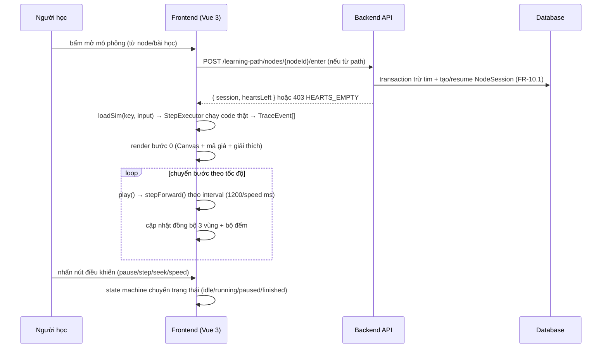
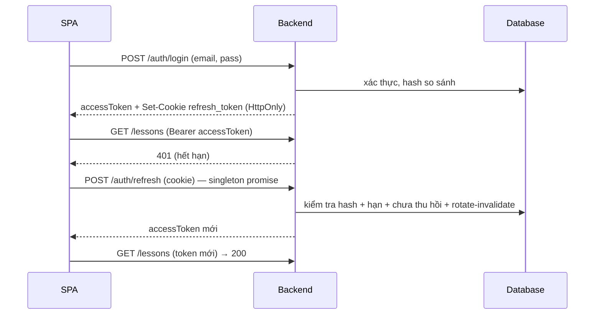
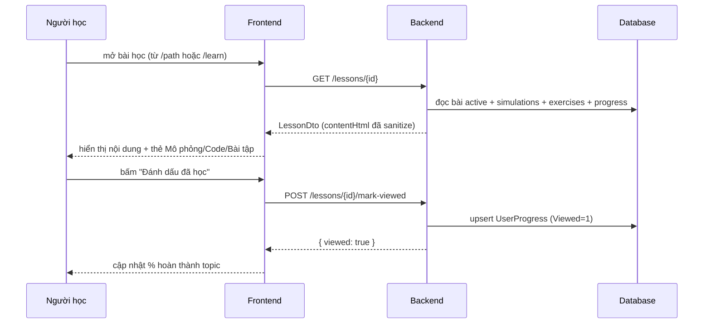
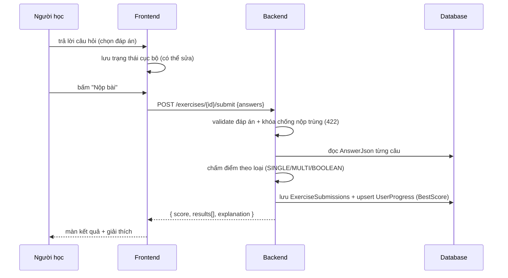
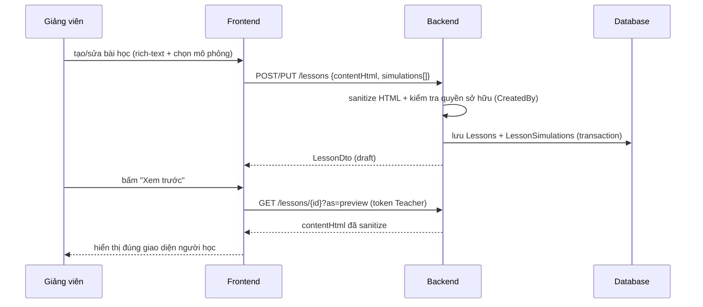
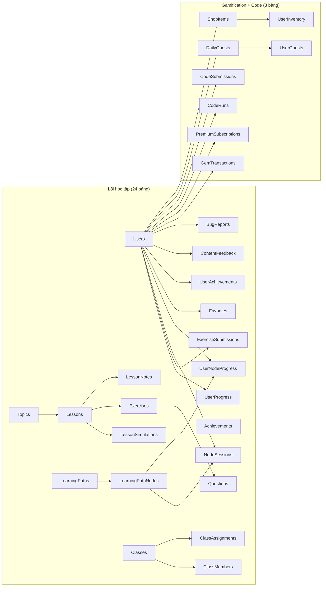

# ĐẶC TẢ YÊU CẦU PHẦN MỀM (SRS)

**Hệ thống hỗ trợ học tập và trực quan hóa cấu trúc dữ liệu và giải thuật (DSA-Visual)**

| | |
|---|---|
| Loại tài liệu | SRS (Software Requirements Specification) |
| Phiên bản | 1.0 |
| Ngày cập nhật | 12/08/2026 |
| Trạng thái | Dự thảo — chờ giảng viên hướng dẫn phê duyệt |
| Người soạn | Mai Tiểu Bảo |
| Người duyệt | Phạm Ngọc Ái Liên |
| Tài liệu liên quan | SDD.md, API_REFERENCE.md, USER_GUIDE.md, TEST_PLAN.md, DEPLOY.md, GLOSSARY.md, SCREEN_MAP.md, README.md |
| Nguồn yêu cầu | PRODUCTION_PROMPT.md (Phần 0-22) — single source of truth |
| Giả định chính | 1) Dữ liệu mô phỏng có giới hạn (mảng ≤ 100, đồ thị ≤ 50 đỉnh/200 cạnh); 2) Trình duyệt hiện đại ≥ 1024px; 3) Không offline; 4) Đồng thời ≤ 200 người dùng thí điểm; 5) Tim (hearts) là cơ chế chủ đích retention/monetization đã cân nhắc với KPI (xem §2.3) |

> ⚠ **TRẠNG THÁI TÀI LIỆU**: SRS mô tả hệ thống **DSA-Visual v2 (dự kiến triển khai)** — đây là đặc tả yêu cầu cho bản phát triển mới, KHÔNG phải mô tả code cũ trong `VisualizationDSA/` (v1: PostgreSQL + Clean Architecture). Mọi quyết định ở đây (10 module A-J, 32 UC, 32 bảng, EDV) áp dụng cho code v2 chưa khởi tạo.

## Lịch sử thay đổi

| Phiên bản | Ngày | Người sửa | Mô tả thay đổi |
|---|---|---|---|
| 1.0 | 12/08/2026 | Mai Tiểu Bảo | Sinh mới hoàn chỉnh từ PRODUCTION_PROMPT.md v2.5 (thay bản nháp cũ 09/08 — 247 dòng, không đủ khuôn 17.3.1) |
| 1.1 | 12/08/2026 | Mai Tiểu Bảo | Vá review (đồng bộ prompt v2.10): NFR-12 thay "sinh bước 20 req/phút" (endpoint đã cắt — bước sinh client-side ADR-001) bằng "code-runs (sandbox) 20 req/phút/user" |
| 1.2 | 12/08/2026 | Mai Tiểu Bảo | Rà soát độ sâu theo khuôn 17.13/6: mở rộng TOÀN BỘ 75 FR lên đủ 7 thuộc tính (Mô tả/Luồng hoạt động/Ngoại lệ/AC/Ràng buộc/Nguồn/Ghi chú — FR-9.3 dùng mục "3. Nơi chấm — QUYẾT ĐỊNH CHỐT" thay cho Ngoại lệ, số hiệu đẩy xuống); mở rộng TOÀN BỘ 32 UC lên đủ 10 mục (Tóm tắt → Nguồn FR); bảng NFR-8..36 bổ sung cột "Giá trị mục tiêu" + "Cách đo/kiểm tra" |

---

# 1. GIỚI THIỆU

## 1.1 Mục đích

Tài liệu này đặc tả đầy đủ yêu cầu chức năng (FR), yêu cầu phi chức năng (NFR), mô hình use case (UC) và tiêu chí chấp nhận của **Hệ thống hỗ trợ học tập và trực quan hóa cấu trúc dữ liệu và giải thuật (DSA-Visual)** — ứng dụng web giúp sinh viên hiểu sâu CTDL/GT bằng mô phỏng hoạt ảnh từng bước, bài tập tự chấm và theo dõi tiến độ cá nhân.

Tài liệu phục vụ: (1) hồ sơ bảo vệ đồ án, (2) tài liệu cho đội phát triển, (3) cơ sở truy vết cho SDD/API_REFERENCE/TEST_PLAN.

## 1.2 Bối cảnh và bài học kinh nghiệm (bắt buộc — phản hồi hội đồng bản cũ)

Bản cũ (VisualizationDSA) bị hội đồng chấm phản hồi 3 lỗi gốc. Thiết kế mới khắc phục triệt để:

| # | Phản hồi hội đồng bản cũ | Cách khắc phục trong thiết kế mới |
|---|---|---|
| 1 | "Cho code đến đâu, chạy visual đến đó" — bản cũ hardcode hoạt ảnh từng giải thuật nên code vòng lặp cũng không chạy được | Kiến trúc **EDV (Execution-Driven Visualization)**: mọi giải thuật là mã TypeScript thật chạy qua `StepExecutor`, hoạt ảnh = phát lại trace thật; Module I (Code Runner) cho người học sửa tham số/hoàn thiện hàm theo signature cố định và xem nó chạy trực quan (FR-9.1 → FR-9.5) |
| 2 | Thiết kế màn hình chắp vá — một màn gộp 4 thứ (học + visual + code + quiz) | Nguyên tắc **"1 màn = 1 việc"** (§7.0 prompt): danh sách → chi tiết → mở trang riêng cho mô phỏng/code/bài tập; cấm nhúng chức năng chéo màn; mỗi tab của Node Hub/Hồ sơ là 1 component tách |
| 3 | Scope trôi dạt, tính năng ngoài tầm đồ án (payment thật, realtime) | §2.4 loại trừ rõ (không cổng thanh toán thật — Premium checkout chỉ MÔ PHỎNG theo FR-10.7; không realtime); Roadmap 20 tuần 10 sprint (20.1); 12 FR đã duyệt cắt không sinh đặc tả |

## 1.3 Phạm vi

### 1.3.1 Trong phạm vi (In Scope)

1. Xác thực và quản lý tài khoản (đăng ký, đăng nhập, JWT + refresh token, đổi/khôi phục mật khẩu, hồ sơ, phê duyệt giảng viên).
2. Quản lý nội dung học tập: chủ đề (topic), bài học (lesson) rich-text, Learning Path (lộ trình node) + CheatSheet.
3. Thư viện mô phỏng EDV: ≥ 10 CTDL và ≥ 15 GT với đầy đủ tính năng điều khiển, tùy chỉnh dữ liệu, giải thích từng bước; Benchmark Lab.
4. Hệ thống Practice Ladder 3 bậc (Quiz → Interactive Lab → Code Challenge) + bài kiểm tra cuối lộ trình.
5. Theo dõi tiến độ cá nhân và báo cáo tổng hợp cho giảng viên (theo bài học và theo lớp).
6. Quản trị hệ thống: người dùng, phê duyệt giảng viên, cấu hình, thống kê.
7. Gamification & Premium: Tim (hearts), Gems + Shop, Daily Quest, Streak, XP/Level, Leaderboard, Premium (checkout MÔ PHỎNG).
8. Các trang phụ trợ: trang chủ + 3 demo công khai, FAQ, chính sách bảo mật, phản hồi/báo lỗi.

### 1.3.2 Ngoài phạm vi (Out of Scope)

| # | Mục loại trừ | Lý do |
|---|---|---|
| 1 | Biên dịch/chạy mã nguồn tự do tùy biến (online judge) | Module I chỉ nhận "sửa tham số/hoàn thiện hàm theo signature cố định" trong code mẫu (quyết định G-6) |
| 2 | Diễn đàn, bình luận công khai giữa người học | Ưu tiên lõi học tập |
| 3 | Thanh toán thật / cổng thanh toán (SePay/VietQR) | Premium checkout là MÔ PHỎNG (FR-10.7) — luồng nghiệp vụ/UI đầy đủ để demo mô hình kiếm tiền, không có giao dịch tiền thật |
| 4 | Ứng dụng di động native | Web responsive đủ nhu cầu; mobile < 768px ngoài MVP |
| 5 | Đa ngôn ngữ hoàn chỉnh (chỉ tiếng Việt) | Giai đoạn đầu; sẵn sàng i18n |
| 6 | AI sinh câu hỏi tự động / AI chấm điểm | Chỉ PoC GĐ3 (backlog §9.5) — AI không chấm điểm, không sinh nội dung chính thức |
| 7 | Hợp tác thời gian thực (xem chung mô phỏng, realtime quiz) | Không thuộc mục tiêu học cá nhân |
| 8 | Xuất file PDF bài học | Đã cắt (FR-2.9); giữ CheatSheet PDF cho Premium (FR-10.7) |
| 9 | Hệ thống thông báo (NOTIFICATIONS), quản lý phiên đăng nhập (AUTH_SESSIONS) | FR-6.4/7.3/1.10 đã cắt (12 FR cắt — xem §3.0) |
| 10 | So sánh 2 GT chạy song song (hoạt ảnh) | FR-3.13 đã cắt; Benchmark Lab chỉ so sánh số liệu đo + biểu đồ |

## 1.4 Định nghĩa và thuật ngữ (trích — bản đầy đủ tại GLOSSARY.md)

| Thuật ngữ | Định nghĩa chuẩn |
|---|---|
| Mô phỏng (Simulation) | Trình diễn từng bước thực thi của giải thuật trên CTDL với dữ liệu đầu vào cụ thể |
| Bước (Step) | Trạng thái tĩnh (snapshot) của vùng trực quan + giải thích + dòng mã giả tương ứng |
| CTDL / GT | Cấu trúc dữ liệu / Giải thuật |
| Generator | Hàm thuần túy sinh chuỗi `Step[]` từ dữ liệu đầu vào |
| Renderer | Mô-đun vẽ một `Structure` lên Canvas/DOM |
| Node (nút lộ trình) | Đơn vị học tập trong Learning Path (1 bài học + Ladder 3 bậc) — KHÔNG nhầm với "nút" của danh sách liên kết/cây |
| Bậc (Stage) | 1 trong 3 bước của Practice Ladder: 1 Quiz → 2 Interactive Lab → 3 Code Challenge |
| Practice Ladder | Chuỗi luyện tập tuần tự 3 bậc của 1 node; pass bậc trước mới mở bậc sau |
| Session học 30 phút | 30 phút kể từ lượt "vào node" đầu tiên có trừ tim; trong session, vào lại cùng node/retry bậc miễn phí (`NodeSessions` — SDD §7) |
| Tim (Hearts) | Quỹ năng lượng (Free 10 / Premium 30), trừ 1 tim mỗi lượt vào node, hồi theo thời gian (FR-10.1) |
| Pass node | Hoàn thành tuần tự cả 3 bậc Ladder theo ngưỡng §3.11 (Quiz ≥ 60%, Lab đạt, Code ≥ 70% test) |
| Final test | Bài kiểm tra tổng hợp cuối Learning Path (FR-4.12) |
| NodeSession | Bản ghi phiên học 30 phút của 1 người dùng tại 1 node (điểm dừng, bước đang dở) |
| Người học / Người dạy | Sinh viên (Student) / Giảng viên (Teacher) |

## 1.5 Tài liệu tham chiếu

| # | Tài liệu | Vai trò |
|---|---|---|
| 1 | PRODUCTION_PROMPT.md | Nguồn yêu cầu gốc (single source of truth) — mọi ID FR/NFR/UC lấy nguyên văn |
| 2 | SDD.md | Thiết kế hệ thống (mọi thiết kế truy ngược về FR/UC trong SRS) |
| 3 | API_REFERENCE.md | Tham chiếu endpoint/DTO/error code |
| 4 | TEST_PLAN.md | Kế hoạch kiểm thử — mỗi test case tham chiếu FR |
| 5 | SCREEN_MAP.md | Ánh xạ FR → màn hình |
| 6 | GLOSSARY.md | Bảng thuật ngữ đầy đủ |

---

# 2. MÔ TẢ TỔNG QUAN

## 2.1 Vấn đề kinh doanh (Problem Statement)

Sinh viên ngành CNTT học môn "Cấu trúc dữ liệu và giải thuật" gặp 3 khó khăn điển hình:

1. **Trừu tượng**: khó hình dung cách dữ liệu tổ chức trong bộ nhớ (liên kết, con trỏ, chỉ số) và cách giải thuật thao tác trên dữ liệu.
2. **Thiếu phản hồi trực quan**: sách/giáo trình chỉ có hình tĩnh và mã; không thấy chuyển động từng bước, không thấy "tại sao".
3. **Thiếu luyện tập chủ động**: sinh viên không được thực hành dự đoán kết quả từng bước — kỹ năng quan trọng nhất để hiểu sâu giải thuật.

Hệ thống giải quyết bằng: (a) mô phỏng từng bước mọi thao tác CTDL/GT (EDV — mã thật chạy, trace phát lại); (b) đồng bộ trực quan – mã giả – giải thích; (c) Practice Ladder + bài tập dự đoán chấm tự động; (d) theo dõi tiến độ cá nhân + báo cáo giảng viên.

## 2.2 Mục tiêu dự án (KPI đo lường được)

| # | Mục tiêu | Chỉ số đo (KPI) | Giá trị mục tiêu |
|---|---|---|---|
| G1 | Phủ nội dung học tập | Số CTDL có mô phỏng | ≥ 10 |
| G2 | Phủ giải thuật | Số GT có mô phỏng | ≥ 14 (thiết kế: 15) |
| G3 | Mức độ sử dụng | Tỷ lệ sinh viên trong lớp đăng ký và truy cập ≥ 1 lần/tuần | ≥ 80% |
| G4 | Hiệu quả học tập | Điểm trung bình kiểm tra chương của lớp sử dụng hệ thống | ≥ 7.0/10 |
| G5 | Sự hài lòng | Điểm khảo sát UX (thang 5) | ≥ 4.0/5 |
| G6 | Độ ổn định | Uptime giai đoạn thí điểm 4 tuần | ≥ 99.5% |
| G7 | Hiệu năng | Thời gian phản hồi API p95 | ≤ 800ms |
| G8 | Độ mượt mô phỏng | FPS khi mô phỏng | ≥ 55 fps |

> **Giải trình KPI (theo review 12/08/2026 — quyết định G-1/G-2)**: G3/G5 đo trên người dùng có Tim/Premium đủ dùng theo thiết kế; cơ chế Tim là chủ đích retention/monetization, đã cân nhận trade-off với KPI truy cập. G4 đo ngoài hệ thống (điểm kiểm tra chương của giảng viên).

## 2.3 Người dùng mục tiêu (Persona)

### Persona 1: Sinh viên — "Nguyễn Minh" (20 tuổi)
- **Bối cảnh**: SV năm 2 khoa CNTT, mới học DSA học kỳ đầu, biết lập trình C/C++/Python cơ bản.
- **Nhu cầu**: muốn hiểu bubble sort khác quick sort bằng mắt thường; luyện bài tập để qua môn; hay quên kiến thức, cần xem lại nhanh.
- **Hành vi điển hình**: mở node trên Learning Path → xem lý thuyết → bấm Phát mô phỏng → thử đổi dữ liệu đầu vào → làm 2-3 bài tập → xem tiến độ.
- **Yêu cầu**: giao diện trực quan, thao tác ≤ 2 bước để chạy mô phỏng, không yêu cầu cài phần mềm.

### Persona 2: Giảng viên — "TS. Trần Hà" (38 tuổi)
- **Bối cảnh**: giảng dạy DSA 8 năm, muốn đưa minh họa động vào bài giảng.
- **Nhu cầu**: biên soạn bài học theo giáo trình riêng, tạo lớp học phần, gán nội dung + hạn nộp, xem sinh viên nào chưa học.
- **Hành vi**: tạo bài học từ mẫu có sẵn, gắn mô phỏng có sẵn (không code), xem báo cáo cuối kỳ.
- **Yêu cầu**: form nhập đơn giản, không code, xuất báo cáo CSV.

### Persona 3: Quản trị viên — "Anh Kỳ" (25 tuổi)
- **Bối cảnh**: kỹ thuật viên phòng thí nghiệm, quản lý hệ thống.
- **Nhu cầu**: quản lý tài khoản, khắc phục sự cố, đảm bảo hệ thống chạy ổn định.
- **Yêu cầu**: quản lý tài khoản, khóa/mở khóa, phê duyệt giảng viên, cấu hình hệ thống.

## 2.4 Môi trường hoạt động và ràng buộc

| Loại | Ràng buộc |
|---|---|
| Công nghệ | Frontend: Vue.js 3 (Composition API `<script setup>`), Pinia, Vite, TypeScript strict; Backend: C# .NET 8+, ASP.NET Core Web API (2 project: Api + Application); DB: SQL Server 2019+ (SQLite/LocalDB cho dev nếu thiếu — DEPLOY); EF Core 8; JWT |
| Nhân sự | 4 thành viên sinh viên (SD21361); phân công: TV1 backend+CSDL, TV2 frontend+admin UI, TV3 Simulation Engine, TV4 kiểm thử+tài liệu+triển khai |
| Thời gian | 20 tuần / 10 sprint (bảng sprint §9.1) |
| Hạ tầng | Máy chủ thử nghiệm tối thiểu: 2 CPU, 4GB RAM, 50GB SSD |
| Ngân sách | Không chi phí bản quyền (chỉ thư viện mã nguồn mở — NFR-36) |
| Ngôn ngữ giao diện | Tiếng Việt (bắt buộc); cơ chế i18n sẵn sàng |

## 2.5 Giả định và phụ thuộc

1. Dữ liệu đầu vào mô phỏng giới hạn: mảng ≤ 100 phần tử, đồ thị ≤ 50 đỉnh/200 cạnh, cây ≤ 31 khóa, bảng băm ≤ 31 kích thước — đủ mục đích sư phạm.
2. Người học truy cập trình duyệt hiện đại (Chrome/Edge/Firefox 2 phiên bản gần nhất; Safari ưu tiên không chặn), độ phân giải ≥ 1024px.
3. Không có yêu cầu offline; cần mạng để dùng hệ thống (trừ nháp cục bộ ghi chú/bài nộp — đồng bộ lại khi có mạng).
4. Tài khoản tạo sẵn bởi admin hoặc tự đăng ký bằng email nội bộ (kiểm tra domain trường — cấu hình được).
5. Số người dùng đồng thời giai đoạn thí điểm ≤ 200.
6. Nội dung bài học do giảng viên nhập dạng văn bản + hình ảnh (URL hoặc upload ≤ 5MB/ảnh).
7. Code mẫu trong StepExecutor là mã thật chạy được (TypeScript thuần); code người học chỉ sửa tham số/hoàn thiện hàm theo signature cố định — KHÔNG nhận code tự do.
8. Nơi chấm bài code là sandbox Web Worker phía client — test ẩn đóng gói kèm bundle, mức cam kết "chống lười làm", KHÔNG cam kết chống trích xuất (FR-9.3, quyết định v2.4).

## 2.6 Khảo sát hệ thống tương tự

| Tiêu chí | VisuAlgo | USFCA DS Visualizations | Algorithm-Visualizer | **Hệ thống đề xuất** |
|---|---|---|---|---|
| Ngôn ngữ | Tiếng Anh | Tiếng Anh | Tiếng Anh | **Tiếng Việt** |
| Mô phỏng từng bước | ✔ | ✔ | ✔ | ✔ |
| Giải thích bằng lời | ✔ (tùy chọn) | Hạn chế | Hạn chế | ✔ bắt buộc mỗi bước |
| Mã giả đồng bộ | ✔ | ✘ | ✔ | ✔ (mã thật EDV) |
| Bài tập dự đoán bước | ✔ (quiz) | ✘ | ✘ | ✔ (Bậc 2 Interactive Lab) |
| Theo dõi tiến độ cá nhân | ✘ | ✘ | ✘ | ✔ |
| Giảng viên biên soạn nội dung | ✘ | ✘ | ✘ | ✔ |
| Benchmark đo thật vs lý thuyết | ✘ | ✘ | ✘ | ✔ (FR-3.20/3.20b) |
| Mã nguồn mở | một phần | ✔ | ✔ | nội bộ |

**Kết luận khảo sát**: điểm khác biệt cốt lõi = (1) đồng bộ 3 vùng trực quan–mã giả–giải thích từ trace thật (EDV), (2) hệ thống bài tập tự chấm (Ladder 3 bậc), (3) tiến độ + báo cáo giảng viên, (4) nội dung biên soạn được, (5) Benchmark so sánh thực tế vs lý thuyết, (6) tiếng Việt. Đây là cơ sở của FR-3.3, FR-4.3, FR-5.3, FR-3.20.

## 2.7 Đặc điểm thành công

| Khía cạnh | Mô tả |
|---|---|
| Người học hiểu | có thể giải thích lại giải thuật bằng lời sau khi xem mô phỏng |
| Người học chủ động | tự nhập dữ liệu thử nghiệm và đặt câu hỏi "nếu... thì..." |
| Giảng viên tin dùng | dùng hệ thống làm công cụ giảng dạy chính trong buổi thực hành |
| Vận hành | admin vận hành hệ thống trong < 30 phút/tuần |

# 3. YÊU CẦU CHỨC NĂNG

## 3.0 Quy ước chung

- Mỗi yêu cầu có 7 thuộc tính (khuôn 17.13): **1. Mô tả · 2. Luồng hoạt động · 3. Ngoại lệ · 4. Tiêu chí chấp nhận (AC) · 5. Ràng buộc · 6. Nguồn yêu cầu · 7. Ghi chú**.
- Ưu tiên: **Cao** = bắt buộc MVP/GĐ2 · **TB** = GĐ2/GĐ3 · **Thấp** = GĐ3/backlog.
- **12 FR ĐÃ DUYỆT CẮT (19.7) — KHÔNG sinh đặc tả**: FR-1.10, FR-2.7, FR-2.8, FR-2.9, FR-3.13, FR-3.17, FR-3.19, FR-5.6, FR-5.7, FR-6.4, FR-7.3, FR-7.5.
- Mọi ID (FR/NFR/UC/TB/AC) lấy nguyên văn từ PRODUCTION_PROMPT.md — nguồn gốc duy nhất.

## 3.1 Master Matrix — bảng tổng hợp FR (nguồn: prompt §3.9)

| Mã | Tên | Ưu tiên | Giai đoạn | Nguồn UC | Mô-đun |
|---|---|---|---|---|---|
| FR-1.1 | Đăng ký tài khoản | Cao | MVP | UC-02 | A |
| FR-1.2 | Đăng nhập | Cao | MVP | UC-03 | A |
| FR-1.3 | Gia hạn phiên (refresh) | Cao | MVP | UC-03 | A |
| FR-1.4 | Đăng xuất | Cao | MVP | UC-03 | A |
| FR-1.5 | Đổi mật khẩu | TB | GĐ2 | UC-03 | A |
| FR-1.6 | Khôi phục mật khẩu | TB | GĐ2 | UC-15 | A |
| FR-1.7 | Cập nhật thông tin cá nhân | TB | GĐ2 | UC-03 | A |
| FR-1.8 | Phê duyệt tài khoản giảng viên | TB | GĐ2 | UC-12 | A |
| FR-1.9 | Quản lý người dùng (Admin) | TB | GĐ2 | UC-12 | F |
| FR-1.11 | Xác thực hai lớp (2FA email) | Thấp | GĐ3 | UC-03 | A |
| FR-2.1 | Quản lý chủ đề | Cao | MVP | UC-09 | B |
| FR-2.2 | Quản lý bài học | Cao | MVP | UC-09 | B |
| FR-2.3 | Xem danh sách bài học | Cao | MVP | UC-04 | B |
| FR-2.4 | Xem chi tiết bài học | Cao | MVP | UC-04 | B |
| FR-2.5 | Tìm kiếm bài học | TB | GĐ2 | UC-05 | B |
| FR-2.6 | Ghi chú cá nhân trên bài học | TB | GĐ2 | UC-04 | B |
| FR-2.10 | Learning Path (lộ trình node) | Cao | GĐ2 | UC-25 | B |
| FR-2.11 | Two-way sync bằng deep-link | Cao | GĐ2 | UC-01 | B |
| FR-3.1 | Danh mục mô phỏng | Cao | MVP | UC-01 | C |
| FR-3.2 | Khởi tạo mô phỏng (kèm quy tắc trừ tim) | Cao | MVP | UC-01 | C |
| FR-3.3 | Hiển thị đồng bộ 3 vùng | Cao | MVP | UC-01 | C |
| FR-3.4 | Cấu hình dữ liệu đầu vào | Cao | MVP | UC-01 | C |
| FR-3.5 | Điều khiển mô phỏng | Cao | MVP | UC-01 | C |
| FR-3.6 | Trạng thái trực quan của phần tử | Cao | MVP | UC-01 | C |
| FR-3.7 | Bảng mã giả đồng bộ | Cao | MVP | UC-01 | C |
| FR-3.8 | Tùy chọn hiển thị | TB | GĐ2 | UC-01 | C |
| FR-3.9 | Bộ đếm thống kê | TB | GĐ2 | UC-01 | C |
| FR-3.10 | Lưu mô phỏng yêu thích | Thấp | GĐ3 | UC-01 | C |
| FR-3.11 | Chia sẻ liên kết mô phỏng | Thấp | GĐ3 | UC-01 | C |
| FR-3.12 | Thực hành bước thủ công | Cao | GĐ2 | UC-01 | C |
| FR-3.14 | Hiển thị ngăn xếp đệ quy | TB | GĐ2 | UC-01 | C |
| FR-3.15 | Điểm dừng có điều kiện | TB | GĐ3 | UC-01 | C |
| FR-3.16 | Kiểm tra nhanh sau mô phỏng | TB | GĐ2 | UC-01 | C |
| FR-3.18 | Chế độ tối | TB | GĐ3 | — | C |
| FR-3.20 | Benchmark Lab (1 kích thước) | TB | GĐ2 | UC-28 | C |
| FR-3.20b | Benchmark đa kích thước + overlay lý thuyết | TB | GĐ3 | UC-28 | C |
| FR-4.1 | Quản lý bài tập (CRUD) | Cao | MVP | UC-10 | D |
| FR-4.2 | Làm bài tập trắc nghiệm (Bậc 1) | Cao | MVP | UC-06 | D |
| FR-4.3 | Bài tập dự đoán bước (sáp nhập Bậc 2 Lab) | TB | GĐ2 | UC-07 | D |
| FR-4.4 | Đánh giá và lịch sử bài làm | TB | GĐ2 | UC-06 | D |
| FR-4.5 | Ngân hàng câu hỏi dùng lại | Thấp | GĐ3 | UC-10 | D |
| FR-4.6 | Chế độ luyện tập | TB | GĐ2 | UC-06 | D |
| FR-4.7 | Gợi ý trả lời (Hints) | TB | GĐ2 | UC-06 | D |
| FR-4.8 | Xáo trộn câu hỏi và phương án | TB | GĐ2 | UC-06 | D |
| FR-4.9 | Giải thích theo từng phương án sai | TB | GĐ2 | UC-06 | D |
| FR-4.10 | Nhập câu hỏi hàng loạt từ CSV | Thấp | GĐ3 | UC-10 | D |
| FR-4.11 | Practice Ladder tuần tự | Cao | GĐ2 | UC-26 | D |
| FR-4.12 | Kiểm tra cuối lộ trình | Cao | GĐ2 | UC-27 | D |
| FR-5.1 | Ghi nhận tiến độ | Cao | MVP | UC-08 | E |
| FR-5.2 | Dashboard tiến độ cá nhân | Cao | MVP | UC-08 | E |
| FR-5.3 | Báo cáo giảng viên | TB | GĐ2 | UC-11 | E |
| FR-5.4 | Thống kê hệ thống (Admin) | TB | GĐ2 | — | F |
| FR-5.5 | Huy hiệu thành tích | TB | GĐ3 | UC-08 | E |
| FR-6.2 | Cấu hình hệ thống | TB | GĐ2 | UC-13 | F |
| FR-7.1 | Trang chủ công khai + demo | TB | GĐ2 | UC-14 | G |
| FR-7.2 | Trang trợ giúp (FAQ) | TB | GĐ2 | — | G |
| FR-7.4 | Đánh giá nội dung | Thấp | GĐ3 | — | G |
| FR-7.6 | Demo công khai 3 visualizer | TB | GĐ2 | UC-14 | G |
| FR-8.1 | Tạo và quản lý lớp học phần | TB | GĐ3 | — | H |
| FR-8.2 | Quản lý sinh viên trong lớp | TB | GĐ3 | — | H |
| FR-8.3 | Gán nội dung và hạn nộp theo lớp | TB | GĐ3 | — | H |
| FR-8.4 | Báo cáo theo lớp | TB | GĐ3 | — | H |
| FR-9.1 | Trình soạn mã nhúng | Cao | GĐ2 | UC-17 | I |
| FR-9.2 | Chạy mã + trực quan hóa (Code-to-Visualization) | Cao | GĐ2 | UC-17 | I |
| FR-9.3 | Bài tập lập trình + chấm điểm tự động | TB | GĐ3 | UC-18 | I |
| FR-9.4 | Sandbox an toàn | Cao | GĐ2 | UC-17 | I |
| FR-9.5 | Lịch sử nộp bài code | TB | GĐ3 | UC-19 | I |
| FR-9.6 | Sandbox giới hạn chi tiết | Cao | GĐ2 | UC-17 | I |
| FR-10.1 | Tim & hồi & session | Cao | GĐ2 | UC-25 | J |
| FR-10.2 | Gems + Gems Shop | TB | GĐ2 | UC-30 | J |
| FR-10.3 | Daily Quest | TB | GĐ2 | UC-29 | J |
| FR-10.4 | Streak + Streak Freeze | TB | GĐ2 | UC-29 | J |
| FR-10.5 | XP & Level | TB | GĐ2 | UC-25 | J |
| FR-10.6 | Leaderboard | TB | GĐ3 | UC-31 | J |
| FR-10.7 | Premium (P1) + hết hạn | TB | GĐ3 | UC-32 | J |

> ⚠ 12 FR đã duyệt cắt (FR-1.10, FR-2.7, FR-2.8, FR-2.9, FR-3.13, FR-3.17, FR-3.19, FR-5.6, FR-5.7, FR-6.4, FR-7.3, FR-7.5) — KHÔNG nằm trong bảng trên, KHÔNG sinh đặc tả.

## 3.2 Ghi chú tái cấu trúc Module D (bắt buộc — nguồn prompt §20.3)

> **Module D = Practice Ladder (FR-4.11, FR-4.12).** Các FR-4.x cũ trở thành thành phần BÊN TRONG Ladder — KHÔNG phải tính năng độc lập ngang hàng:

| FR cũ | Tên cũ | Vị trí mới trong Practice Ladder |
|---|---|---|
| FR-4.1 | Quản lý bài tập (CRUD) | Giữ nguyên — dùng để soạn câu hỏi cho **Bậc 1 (Quiz)** của mỗi node |
| FR-4.2 | Làm bài tập trắc nghiệm | Nội dung **Bậc 1 (Quiz)** trong Ladder; TRỪ final test (FR-4.12, Màn 30) vẫn dùng engine này |
| FR-4.3 | Bài tập dự đoán bước | Sáp nhập **Bậc 2 (Interactive Lab, Màn 15)** — "dự đoán bước" là 1 dạng thao tác trong Lab; chấm TRẠNG THÁI CUỐI + giới hạn bước ≤ chuẩn × 1.5 (quyết định G-5) |
| FR-4.4 | Đánh giá và lịch sử bài làm | Áp dụng chung 3 bậc — 1 bảng `ExerciseSubmissions` chung (loại quiz/lab/code) |
| FR-4.5 | Ngân hàng câu hỏi dùng lại | Giữ nguyên, phục vụ Bậc 1 |
| FR-4.6 | Chế độ luyện tập | Áp dụng 3 bậc; luyện tập miễn phí CHỈ trong session 30 phút đã trừ của node (20.4) |
| FR-4.7 | Gợi ý trả lời (Hints) | Áp dụng Bậc 1 + Bậc 3 — dùng Hint token (Shop, Module J) |
| FR-4.8, FR-4.9 | Xáo trộn câu hỏi, giải thích phương án sai | Giữ nguyên, chỉ áp dụng Bậc 1 |
| FR-4.10 | Nhập câu hỏi hàng loạt CSV | Giữ nguyên (công cụ Teacher/Admin) |

## 3.3 Module A — Xác thực và tài khoản

### FR-1.1 | Đăng ký tài khoản | Cao
**1. Mô tả**: Đăng ký bằng email + mật khẩu. Vai trò mặc định `Student`; kích hoạt ngay (mặc định) hoặc theo chính sách duyệt (cấu hình). Chọn "Tôi là giảng viên" → vai trò `TeacherPending`, chờ Admin duyệt (FR-1.8).
**2. Luồng hoạt động**: (1) nhập họ tên, email, mật khẩu, xác nhận mật khẩu; (2) tích/không tích "Tôi là giảng viên"; (3) kiểm tra trùng email + domain (nếu bật); (4) tạo tài khoản, hash mật khẩu; (5) thông báo thành công, tự động đăng nhập.
**3. Ngoại lệ**: Email trùng → 400 `EMAIL_EXISTS`; mật khẩu yếu → 400 `WEAK_PASSWORD` kèm details từng quy tắc; email sai định dạng → 400 `INVALID_EMAIL`; domain không cho phép → 400 `DOMAIN_NOT_ALLOWED`.
**4. AC**: AC-1.1.1 tạo được tài khoản mới; AC-1.1.2 mật khẩu lưu là hash (bcrypt cost 12 / PBKDF2 100.000 vòng) — không plaintext; AC-1.1.3 tài khoản mới đăng nhập ngay; AC-1.1.4 email được chuẩn hóa lowercase; AC-1.1.5 đăng ký giảng viên → role `TeacherPending`, không có quyền Teacher.
**5. Ràng buộc**: chính sách mật khẩu (8-64 ký tự, chữ hoa + số + ký tự đặc biệt — cấu hình `password.policy.*`); NFR-12 rate limit.
**6. Nguồn**: FR-1.1 (prompt), UC-02.
**7. Ghi chú**: nếu SMTP chưa cấu hình — không block luồng, log + hiển thị link dev (11.6).

### FR-1.2 | Đăng nhập | Cao
**1. Mô tả**: Đăng nhập bằng email + mật khẩu, nhận JWT access token (60 phút) + refresh token (7 ngày, cookie httpOnly).
**2. Luồng hoạt động**: (1) nhập thông tin; (2) xác thực; (3) trả `accessToken`, `expiresIn`, `user`; set cookie `refresh_token`; (4) chuyển hướng theo vai trò: Student → `/path`, Teacher/Admin → dashboard.
**3. Ngoại lệ**: Sai mật khẩu → 401 `INVALID_CREDENTIALS` (KHÔNG tiết lộ email tồn tại); tài khoản bị khóa → 403 `ACCOUNT_LOCKED`; 5 lần sai liên tiếp/15 phút → khóa đăng nhập 15 phút (log Serilog).
**4. AC**: AC-1.2.1 đăng nhập đúng trả token hợp lệ; AC-1.2.2 sai bị chặn đúng 401; AC-1.2.3 tài khoản khóa không đăng nhập được; AC-1.2.4 vượt ngưỡng sai → 429 + `Retry-After`.
**5. Ràng buộc**: NFR-9 (JWT HS256, secret ≥ 32 ký tự env); NFR-12 rate limit 5/15 phút/IP.
**6. Nguồn**: FR-1.2 (prompt), UC-03.
**7. Ghi chú**: access token lưu memory phía client (không localStorage).

### FR-1.3 | Gia hạn phiên (Refresh Token) | Cao
**1. Mô tả**: Khi access token hết hạn, client gọi `POST /auth/refresh` (cookie) lấy access token mới.
**2. Luồng hoạt động**: (1) client nhận 401; (2) gọi refresh (singleton promise — nhiều request 401 chỉ gọi 1 lần); (3) thành công → retry request gốc; (4) thất bại → logout, về `/login?redirect=...`.
**3. Ngoại lệ**: Refresh token hết hạn/thu hồi → 401 `REFRESH_INVALID` + xóa phiên; phát hiện replay token đã rotate-invalidate → thu hồi toàn bộ chuỗi phiên của user + log bảo mật (v2.4).
**4. AC**: AC-1.3.1 phiên kéo dài với hoạt động liên tục; AC-1.3.2 sau 7 ngày không hoạt động phải đăng nhập lại; AC-1.3.3 rotate-invalidate: token cũ vô hiệu ngay sau khi cấp token mới.
**5. Ràng buộc**: cookie `HttpOnly; SameSite=Strict; Secure; Path=/api/v1/auth`; lưu `SHA256(token)` trong DB — không lưu token thô.
**6. Nguồn**: FR-1.3 (prompt), UC-03.
**7. Ghi chú**: bảng `RefreshTokens` có cột `PreviousTokenHash` phục vụ phát hiện replay.

### FR-1.4 | Đăng xuất | Cao
**1. Mô tả**: Hủy phiên hiện tại: thu hồi refresh token, xóa cookie, xóa token client.
**2. Luồng hoạt động**: (1) người dùng bấm "Đăng xuất"; (2) client gọi `POST /auth/logout`; (3) server thu hồi refresh token trong DB; (4) server xóa cookie `refresh_token`; (5) client xóa token khỏi memory; (6) chuyển về trang đăng nhập.
**3. Ngoại lệ**: token đã hết hạn/thu hồi khi logout → vẫn xóa phiên phía client, phản hồi không lỗi (idempotent); mất mạng khi logout → xóa token cục bộ, phía server token tự hết hạn theo TTL.
**4. AC**: AC-1.4.1 sau đăng xuất, API cần xác thực trả 401; AC-1.4.2 refresh token cũ không dùng được (thu hồi trong DB).
**5. Ràng buộc**: cookie phải được xóa với cùng `Path=/api/v1/auth` + domain đã set khi cấp; chỉ thu hồi refresh token của phiên hiện tại — không ảnh hưởng phiên khác.
**6. Nguồn**: FR-1.4 (prompt), UC-03.

### FR-1.5 | Đổi mật khẩu | TB
**1. Mô tả**: Người dùng đã đăng nhập đổi mật khẩu: mật khẩu cũ + mới + xác nhận.
**2. Luồng hoạt động**: (1) nhập mật khẩu cũ, mật khẩu mới, xác nhận; (2) kiểm tra mật khẩu cũ khớp; (3) kiểm tra mật khẩu mới đạt chính sách; (4) cập nhật hash mới; (5) thu hồi mọi refresh token khác (trừ phiên hiện tại); (6) thông báo thành công.
**3. Ngoại lệ**: Sai mật khẩu cũ → 400 `OLD_PASSWORD_WRONG`; mật khẩu mới trùng cũ → 400 `PASSWORD_SAME`.
**4. AC**: AC-1.5.1 đổi thành công; AC-1.5.2 mọi refresh token khác (trừ phiên hiện tại) bị thu hồi — bắt buộc đăng nhập lại.
**5. Ràng buộc**: mật khẩu mới phải đạt chính sách `password.policy.*` (8-64 ký tự, chữ hoa + số + ký tự đặc biệt) như đăng ký (FR-1.1); phiên hiện tại giữ nguyên, không bị đăng xuất.
**6. Nguồn**: FR-1.5 (prompt), UC-03.

### FR-1.6 | Khôi phục mật khẩu | TB
**1. Mô tả**: Quên mật khẩu → nhập email → nhận link đặt lại (token 1 lần, 30 phút) → nhập mật khẩu mới.
**2. Luồng hoạt động**: (1) nhập email → gửi yêu cầu; (2) server tạo token reset (1 lần, TTL 30 phút) và gửi link qua email (chỉ khi email tồn tại); (3) mở link → form nhập mật khẩu mới + xác nhận; (4) server validate token (tồn tại, chưa dùng, chưa hết hạn); (5) cập nhật hash, vô hiệu hóa token; (6) chuyển về trang đăng nhập.
**3. Ngoại lệ**: Email không tồn tại vẫn hiện thông báo chung "Nếu email tồn tại, chúng tôi đã gửi link" (chống lộ danh sách email); token hết hạn/đã dùng → 400 `RESET_TOKEN_INVALID`.
**4. AC**: AC-1.6.1 hoàn tất → đăng nhập bằng mật khẩu mới; AC-1.6.2 token chỉ dùng 1 lần.
**5. Ràng buộc**: token reset dùng 1 lần, TTL 30 phút; phản hồi chung cho mọi email (không lộ email tồn tại); nếu SMTP chưa cấu hình → không block luồng, log + hiển thị link dev (11.6).
**6. Nguồn**: FR-1.6 (prompt), UC-15.

### FR-1.7 | Cập nhật thông tin cá nhân | TB
**1. Mô tả**: Đổi tên hiển thị, avatar (upload ≤ 2MB, jpg/png/webp), email (cần xác minh lại).
**2. Luồng hoạt động**: (1) mở trang hồ sơ cá nhân; (2) sửa tên hiển thị / tải avatar (≤ 2MB, jpg/png/webp); (3) đổi email → gửi email xác minh lại; (4) lưu → cập nhật hồ sơ; (5) thông tin mới hiển thị ngay.
**3. Ngoại lệ**: avatar sai định dạng → 400 `UPLOAD_INVALID_TYPE`; avatar quá 2MB → 400 `UPLOAD_TOO_LARGE`; email mới trùng người khác → 400 `EMAIL_EXISTS`; email mới chưa xác minh → quyền đăng nhập cũ giữ nguyên tới khi xác minh xong.
**4. AC**: AC-1.7.1 thông tin mới phản ánh ngay sau khi lưu; AC-1.7.2 avatar sai định dạng → 400 `UPLOAD_INVALID_TYPE`.
**5. Ràng buộc**: avatar ≤ 2MB, định dạng jpg/png/webp; đổi email bắt buộc xác minh lại trước khi áp dụng.
**6. Nguồn**: FR-1.7 (prompt), UC-03.

### FR-1.8 | Phê duyệt tài khoản giảng viên | TB
**1. Mô tả**: Tài khoản `TeacherPending` chờ Admin duyệt (IsActive=false); khi duyệt mới có quyền Teacher.
**2. Luồng hoạt động**: (1) Admin mở danh sách "Chờ duyệt giảng viên"; (2) xem thông tin đăng ký; (3) duyệt → role=Teacher, IsActive=true, email thông báo (nếu SMTP); (4) từ chối → `POST /users/{id}/approve-teacher` body `{approve:false, reason?}` → role=0 (Student), IsActive=true; (5) ghi log Serilog mọi thao tác kèm lý do; (6) người dùng đăng nhập lại nhận quyền mới.
**3. Ngoại lệ**: Admin từ chối → thông báo qua email (nếu SMTP) hoặc lần đăng nhập kế tiếp. **Từ chối (v2.8)**: dùng chung `POST /users/{id}/approve-teacher` body `{approve:false, reason?}` → role=0 (Student), IsActive=true, ghi log Serilog kèm lý do.
**4. AC**: AC-1.8.1 tài khoản Teacher chưa duyệt không truy cập chức năng Teacher (403).
**5. Ràng buộc**: chỉ Admin được duyệt/từ chối; tài khoản `TeacherPending` không có quyền Teacher (IsActive=false); mọi quyết định duyệt/từ chối ghi log Serilog kèm lý do; thông báo email phụ thuộc SMTP — không block luồng khi thiếu.
**6. Nguồn**: FR-1.8 (prompt), UC-12.

### FR-1.9 | Quản lý người dùng (Admin) | TB
**1. Mô tả**: Danh sách (phân trang, lọc role/status/từ khóa), chi tiết, khóa/mở khóa, đặt lại mật khẩu, chuyển vai trò Student↔Teacher (không chuyển Admin).
**2. Luồng hoạt động**: (1) Admin mở danh sách người dùng (phân trang, lọc role/status/từ khóa); (2) xem chi tiết người dùng; (3) thao tác: khóa/mở khóa, đặt lại mật khẩu, chuyển vai trò Student↔Teacher; (4) server kiểm tra quyền (không khóa chính mình; chỉ Admin chính thao tác trên Admin khác; giữ ≥ 1 Admin active); (5) ghi log Serilog mọi thao tác; (6) user bị khóa mất hiệu lực token ngay (cache 60s).
**3. Ngoại lệ**: Không thể khóa chính mình; không chuyển vai trò Admin. Chỉ Admin chính (`IsPrimaryAdmin`) được khóa/đổi vai trò/xóa/đặt lại mật khẩu Admin khác — Admin thường → 403. Không thể khóa/xóa/ẩn danh hóa Admin cuối cùng còn active (luôn giữ ≥ 1 Admin quản trị).
**4. AC**: AC-1.9.1 mọi thao tác được ghi log phía máy chủ (Serilog); AC-1.9.2 khóa → user không đăng nhập được, token hiện có vô hiệu (cache 60s); AC-1.9.3 Admin thao tác lên Admin khác (trừ Admin chính) → 403; AC-1.9.4 Admin cuối cùng còn active không thể bị khóa/xóa/ẩn danh hóa.
**5. Ràng buộc**: phân trang + lọc role/status/từ khóa phía server; quyền thao tác theo vai trò — không tự khóa chính mình, không chuyển vai trò Admin; hệ thống không bao giờ ở trạng thái 0 Admin active.
**6. Nguồn**: FR-1.9 (prompt), UC-12.

### FR-1.11 | Xác thực hai lớp (2FA qua email) | Thấp [BỔ SUNG]
**1. Mô tả**: Tùy chọn bật 2FA: sau khi nhập đúng mật khẩu, hệ thống gửi mã 6 số qua email (hiệu lực 5 phút).
**2. Luồng**: (1) bật 2FA trong cài đặt bảo mật; (2) đăng nhập → bước 2 nhập mã; (3) tùy chọn "Ghi nhớ thiết bị 30 ngày" (cookie riêng).
**3. Ngoại lệ**: Sai mã 3 lần → khóa bước 2 trong 10 phút; quên thiết bị đã ghi nhớ → đăng nhập lại từ đầu.
**4. AC**: AC-1.11.1 tài khoản bật 2FA không thể đăng nhập khi thiếu mã; AC-1.11.2 mã dùng 1 lần.
**5. Ràng buộc**: mã 6 số, hiệu lực 5 phút, dùng 1 lần; sai 3 lần → khóa bước 2 trong 10 phút; cookie "Ghi nhớ thiết bị" là cookie riêng 30 ngày — KHÔNG phải refresh token, không cấp quyền truy cập API.
**6. Nguồn**: FR-1.11 (prompt, [BỔ SUNG]), UC-03.
**7. Ghi chú**: phụ thuộc SMTP (11.6) — khi SMTP chưa cấu hình, tùy chọn bật 2FA bị ẩn/cảnh báo.

## 3.4 Module B — Chủ đề, bài học, Learning Path

### FR-2.1 | Quản lý chủ đề (topic) | Cao
**1. Mô tả**: Cây chủ đề 2 cấp (VD: "Sắp xếp" → "Sắp xếp cơ bản"/"Sắp xếp nâng cao"). CRUD bởi Teacher/Admin; cột `SortOrder`.
**2. Luồng hoạt động**: (1) Teacher/Admin mở trang quản lý chủ đề; (2) thêm/sửa chủ đề: tên, chủ đề cha (tối đa cấp 2), `SortOrder`; (3) lưu → server validate tên trùng cấp cha-con; (4) xóa → kiểm tra bài học con → 409 nếu còn; (5) danh sách hiển thị theo `SortOrder`, dạng cây lồng 2 cấp.
**3. Ngoại lệ**: Xóa chủ đề có bài học → 409 `TOPIC_HAS_LESSONS`; tên trùng cấp cha-con → 400.
**4. AC**: AC-2.1.1 CRUD đầy đủ; AC-2.1.2 thứ tự theo SortOrder; AC-2.1.3 API trả cây lồng 2 cấp; AC-2.1.4 xóa mềm bằng `DeletedAt` (chặn xóa khi có con).
**5. Ràng buộc**: cây tối đa 2 cấp (chặn tạo cấp 3); CRUD chỉ Teacher/Admin — Student chỉ đọc; xóa mềm `DeletedAt`, không xóa vật lý.
**6. Nguồn**: FR-2.1 (prompt), UC-09.

### FR-2.2 | Quản lý bài học (lesson) | Cao
**1. Mô tả**: CRUD bài học: tiêu đề, mô tả ngắn, nội dung rich-text (KaTeX tùy chọn), ảnh minh họa, danh sách mô phỏng đính kèm, bài tập đính kèm, trạng thái (draft/active/hidden), SortOrder.
**2. Luồng hoạt động**: (1) Teacher mở form tạo/sửa bài học; (2) nhập tiêu đề, mô tả, nội dung rich-text (KaTeX tùy chọn), tải ảnh minh họa, chọn topic, đính kèm mô phỏng/bài tập, chọn trạng thái, `SortOrder`; (3) lưu → server sanitize HTML trước khi lưu; (4) bài học hiển thị theo trạng thái (draft chỉ tác giả/Admin, active cho người học, hidden); (5) xóa → xóa mềm nếu có dữ liệu tiến độ/bài tập.
**3. Ngoại lệ**: nội dung chứa `<script>`/mã độc → bị sanitize bỏ khi lưu; xóa bài học có dữ liệu tiến độ/bài tập → xóa mềm `DeletedAt` (ẩn khỏi người học, giữ dữ liệu); ảnh > 5MB → 400.
**4. AC**: AC-2.2.1 CRUD đầy đủ; AC-2.2.2 người học chỉ thấy bài `active`; AC-2.2.3 bản nháp chỉ tác giả/Admin xem được; AC-2.2.4 nội dung chứa `<script>` bị sanitize.
**5. Ràng buộc**: HTML sanitize phía server trước khi lưu; ảnh ≤ 5MB; bài học thuộc 1 topic; xóa mềm `DeletedAt`.
**6. Nguồn**: FR-2.2 (prompt), UC-09.

### FR-2.3 | Xem danh sách bài học | Cao
**1. Mô tả**: Cây chủ đề + danh sách bài học kèm mô tả, số mô phỏng, số bài tập, trạng thái tiến độ cá nhân, % hoàn thành topic.
**2. Luồng hoạt động**: (1) người học vào trang danh sách bài học; (2) hiển thị cây chủ đề + danh sách bài học theo topic; (3) mỗi bài hiển thị: mô tả ngắn, số mô phỏng, số bài tập, trạng thái tiến độ cá nhân (đã xem / đã làm xong bài tập); (4) hiển thị % hoàn thành từng topic; (5) bấm bài học → mở chi tiết (FR-2.4).
**3. Ngoại lệ**: bài học `draft`/`hidden` không hiển thị với người học (chỉ tác giả/Admin); topic không có bài học → hiển thị trạng thái rỗng.
**4. AC**: AC-2.3.1 hiển thị đúng dữ liệu; AC-2.3.2 đánh dấu đúng trạng thái tiến độ.
**5. Ràng buộc**: người học chỉ thấy bài `active`; % hoàn thành topic tính từ `UserProgress` (Viewed) + bài tập đã nộp — không tính bài `draft`/`hidden`.
**6. Nguồn**: FR-2.3 (prompt), UC-04.

### FR-2.4 | Xem chi tiết bài học | Cao
**1. Mô tả**: Trang chi tiết: nội dung lý thuyết, danh sách mô phỏng (thẻ mở trang riêng), bài tập (thẻ), nút "Đánh dấu đã học", tiến trình đọc; nút ghi chú (FR-2.6), đánh giá (FR-7.4), "▶ Xem bước này" (FR-2.11).
**2. Luồng đánh dấu đã học**: cuộn hết hoặc bấm nút → ghi `UserProgress.Viewed=true` (upsert) → cập nhật % topic.
**3. Ngoại lệ**: người chưa đăng nhập bấm "Đánh dấu đã học" → nhắc đăng nhập, không ghi nhận; mất mạng khi ghi nhận → không chặn đọc bài, thử lại khi có mạng.
**4. AC**: AC-2.4.1 xem bài được ghi nhận, không trùng bản ghi (upsert).
**5. Ràng buộc**: 1 bản ghi `UserProgress` / 1 cặp (User, Lesson) — upsert khi cập nhật; chỉ ghi nhận khi đã xác thực.
**6. Nguồn**: FR-2.4 (prompt), UC-04.

### FR-2.5 | Tìm kiếm bài học | TB
**1. Mô tả**: Tìm kiếm toàn cục theo tiêu đề/mô tả/nội dung; gợi ý khi gõ (debounce 300ms).
**2. Luồng hoạt động**: (1) gõ từ khóa vào ô tìm kiếm; (2) gợi ý hiển thị sau debounce 300ms; (3) gửi `GET /lessons?q=`; (4) hiển thị kết quả khớp kèm topic; (5) bấm kết quả → mở chi tiết bài học (FR-2.4).
**3. Ngoại lệ**: không có kết quả khớp → hiển thị trạng thái rỗng "Không tìm thấy bài học"; từ khóa rỗng → không gọi API, hiển thị danh sách mặc định.
**4. AC**: AC-2.5.1 kết quả khớp nội dung; AC-2.5.2 không phân biệt hoa thường; AC-2.5.3 chuẩn hóa dấu tiếng Việt.
**5. Ràng buộc**: tìm kiếm phía server, không phân biệt hoa thường + chuẩn hóa dấu tiếng Việt; kết quả chỉ gồm bài `active` (trừ tác giả/Admin xem bài draft); debounce 300ms phía client.
**6. Nguồn**: FR-2.5 (prompt), UC-05.

### FR-2.6 | Ghi chú cá nhân trên bài học | TB [BỔ SUNG]
**1. Mô tả**: Ghi chú cá nhân gắn bài học, rich-text ngắn, chỉ mình người học xem; tự động lưu (debounce 1s); dấu chấm "có ghi chú" ở danh sách.
**2. Luồng hoạt động**: (1) bấm biểu tượng ghi chú ở trang bài học; (2) nhập nội dung; (3) tự động lưu (debounce 1s); (4) hiển thị dấu chấm "có ghi chú" ở danh sách bài học.
**3. Ngoại lệ**: Mất mạng → lưu nháp cục bộ, đồng bộ khi có mạng.
**4. AC**: AC-2.6.1 lưu đúng chủ sở hữu; AC-2.6.2 hiển thị lại sau khi tải trang; AC-2.6.3 xóa được.
**5. Ràng buộc**: ghi chú chỉ chủ sở hữu xem/sửa/xóa (Authorization theo UserId); rich-text ngắn — giới hạn độ dài theo cấu hình; chỉ hiển thị trên bài học mà người học có quyền truy cập.
**6. Nguồn**: FR-2.6 (prompt, [BỔ SUNG]), UC-22.

### FR-2.10 | Learning Path (lộ trình node) | Cao [BỔ SUNG]
**1. Mô tả**: Bản đồ lộ trình dạng đường mòn (Duolingo-style): node tròn nối đường cong, icon 🔒 khóa / ▶ đang mở / ⭐1-3 đã qua; mở khóa tuần tự 1→5; mỗi path = node bài học + node luyện tập tổng hợp + final test (FR-4.12).
**2. Luồng hoạt động**: (1) chọn path; (2) xem bản đồ node; (3) bấm node đang mở → kiểm tra tim (FR-10.1) → vào Node Hub (Màn 31); (4) pass node → mở khóa node kế; (5) hết lộ trình → mở final test.
**3. Ngoại lệ**: Node khóa → tooltip lý do; hết tim → 403 `HEARTS_EMPTY` + Màn 28.
**4. AC**: AC-2.10.1 mở khóa đúng thứ tự; AC-2.10.2 tiến độ lưu theo node; AC-2.10.3 sao đúng công thức §3.11; AC-2.10.4 điểm lộ trình = ĐTB điểm node × 80% + final test × 20%.
**5. Ràng buộc**: `LearningPaths`/`LearningPathNodes` (SDD §7); đề luyện tập tổng hợp trộn runtime theo seed (PathId+UserId+ngày) — KHÔNG lưu đề trộn.
**6. Nguồn**: FR-2.10 (prompt, [BỔ SUNG]), UC-25.
**7. Ghi chú**: route `/path/{topicId}`; `/learn` redirect → `/path` (quyết định 20.5.6).

### FR-2.11 | Two-way sync bằng deep-link | Cao [BỔ SUNG]
**1. Mô tả**: Deep-link theo stepIndex — KHÔNG nhúng canvas vào trang lý thuyết (tôn trọng "1 màn 1 việc").
**2. Luồng hoạt động**: (1) mỗi đoạn lý thuyết có nút "▶ Xem bước này" → mở `/simulator/{key}?step=N` đúng bước; (2) màn mô phỏng có nút "Xem lý thuyết liên quan" → về bài học đúng đoạn; (3) 2 chiều: nhấn dòng code ↔ nhảy bước.
**3. Ngoại lệ**: `?step=N` vượt quá số bước của mô phỏng → nạp bước cuối cùng (hoặc báo `STEP_OUT_OF_RANGE`); `key` mô phỏng không tồn tại → chuyển về trang danh mục mô phỏng; bước/thuật toán trong URL không còn tồn tại sau khi sửa nội dung bài học → về bước 0 kèm thông báo.
**4. AC**: AC-2.11.1 URL `?step=N` tái tạo đúng bước; AC-2.11.2 quay lại giữ vị trí cuộn.
**5. Ràng buộc**: deep-link theo stepIndex — KHÔNG nhúng canvas vào trang lý thuyết (tôn trọng "1 màn 1 việc", quy tắc 7.0); mở `/simulator/{key}` qua deep-link vẫn trừ tim như luồng thường (20.4, FR-10.1).
**6. Nguồn**: FR-2.11 (prompt, [BỔ SUNG]), UC-01.
**7. Ghi chú**: quyết định chốt 19.5 — deep-link, KHÔNG nhúng canvas.

## 3.5 Module C — Mô phỏng và trực quan hóa (MODULE LÕI — EDV)

> Thiết kế kỹ thuật đầy đủ tại SDD §4 (bám prompt §8.0). SRS mô tả ở mức nghiệp vụ.

### FR-3.1 | Danh mục mô phỏng | Cao
**1. Mô tả**: Danh mục theo CTDL và GT: tên, mô tả, độ phức tạp, mức độ (Cơ bản/Nâng cao), tag. Tối thiểu **10 CTDL** (Array, Singly Linked List, Stack, Queue, Binary Tree, BST, AVL, Binary Heap, Hash Table, Graph) và **15 GT** (bubble, selection, insertion, merge, quick, heap sort, linear search, binary search, stack push/pop/peek, queue enqueue/dequeue, list insert/delete/search, BST insert/delete/traverse, AVL insert+xoay, heap insert/extract/heapify, BFS/DFS/Dijkstra).
**2. Luồng hoạt động**: (1) mở danh mục mô phỏng ("Khám phá" `/simulations` — 20.5.2); (2) duyệt/lọc theo CTDL hoặc GT (tên, mô tả, độ phức tạp, mức độ, tag); (3) chọn mô phỏng → mở `/simulator/{key}` (trừ tim theo 20.4 / FR-10.1); (4) Benchmark và CheatSheet đặt làm tab bên trong màn danh mục để killer feature dễ tìm.
**3. Ngoại lệ**: Không có mô phỏng khớp bộ lọc → empty state kèm minh họa + hướng dẫn (7.1 quy tắc 6); `key` mô phỏng không tồn tại → chuyển về danh mục kèm thông báo.
**4. AC**: AC-3.1.1 mỗi CTDL/GT có ≥ 1 mô phỏng chạy được với dữ liệu tùy chỉnh; AC-3.1.2 catalog frontend (`engines/catalog.ts`) khớp 100% danh sách `key` backend (`shared/simulation-catalog.json`) — kiểm tra CI.
**5. Ràng buộc**: danh sách `key` thống nhất từ `shared/simulation-catalog.json` (khớp 100% catalog frontend — AC-3.1.2, CI §9.9); seed GĐ1 phủ 8 bài mô phỏng EDV (19.6A), 10 bài còn lại → backlog GĐ2 (16.2); chạy mô phỏng mặc định ≤ 2 cú click (7.1 quy tắc 3).
**6. Nguồn**: FR-3.1 (prompt), UC-01.

### FR-3.2 | Khởi tạo mô phỏng | Cao
**1. Mô tả**: Chọn mô phỏng → tạo dữ liệu mặc định → sinh toàn bộ chuỗi bước (batch) → hiển thị bước 0.
**2. Luồng hoạt động**: (1) chọn mô phỏng → mở `/simulator/{key}` (trừ tim atomic server-side — xem Ràng buộc dưới); (2) hiện panel "Cấu hình đầu vào" (dùng mặc định nếu không chỉnh — FR-3.4); (3) nhấn "Chạy" → sinh TOÀN BỘ chuỗi bước phía frontend (batch — 8.11); (4) hiển thị bước 0: vùng trực quan vẽ cấu trúc ban đầu, mã giả cuộn tới dòng đầu, panel giải thích hiện "Bắt đầu"; (5) người học điều khiển (FR-3.5).
**3. Ngoại lệ**: Dữ liệu không hợp lệ → lỗi cụ thể (FR-3.4); vượt giới hạn → cảnh báo.
**4. AC**: AC-3.2.1 sinh bước mảng 100 phần tử ≤ 500ms (NFR-2); AC-3.2.2 không treo UI khi sinh; AC-3.2.3 bước 0 = trạng thái khởi tạo (SDD §4.3).
**5. Ràng buộc — QUY TẮC TRỪ TIM (20.4 — ghi đè 19.2, tham chiếu FR-10.1)**: MỌI lượt "vào node" (mở `/simulator/{key}` hoặc vào Ladder) trừ 1 tim atomic server-side. Cơ chế chống double-spend (v2.5 — 1 transaction ngắn, theo thứ tự bắt buộc): (1) kiểm tra node ĐÃ PASS → miễn phí; (2) `UPDATE NodeSessions SET StartedAt=@now, ExpiresAt=@now+30 phút, Stage=@stage, StepIndex=@step WHERE UserId=@u AND NodeId=@n AND ExpiresAt < @now` — ROWCOUNT=1 → session hết hạn được gia hạn = session mới → sang (4) trừ tim; (3) ROWCOUNT=0 → thử `INSERT NodeSessions` (UNIQUE (UserId, NodeId)); INSERT thành công → session mới → trừ tim; INSERT bị unique violation → session còn hiệu lực tồn tại (kể cả do request song song) → KHÔNG trừ (resume, cập nhật Stage/StepIndex); (4) `UPDATE Users SET Hearts = Hearts - 1 WHERE Id = @id AND Hearts > 0`; ROWCOUNT=0 (Hearts=0) → rollback → 403 `HEARTS_EMPTY`. Điểm mấu chốt (v2.5): UPDATE điều kiện `ExpiresAt < @now` + @@ROWCOUNT là khóa tuần tự hóa — 2 request song song gia hạn 1 row hết hạn chặn lẫn nhau, chỉ 1 request ROWCOUNT=1 → CHỈ 1 lần trừ tim. Ngoại lệ MIỄN PHÍ: mở lại trong session 30 phút; node ĐÃ PASS; Benchmark Lab `/benchmark/*`; Bậc 2/3 cùng node sau khi đã trừ ở Bậc 1. Mở simulator từ CheatSheet VẪN trừ tim.
**AC bổ sung (biên — TEST-B-148..155)**: AC-3.2.4 mở node chưa trừ → trừ đúng 1 tim; AC-3.2.5 mở lại cùng node trong session 30p → không trừ; AC-3.2.6 mở từ CheatSheet → trừ như mở từ Learning Path; AC-3.2.7 Hearts=0 → chặn + Màn 28; AC-3.2.8 Benchmark Lab không trừ tim.
**6. Nguồn**: FR-3.2 (prompt), FR-10.1, UC-01, UC-25.
**7. Ghi chú**: cơ chế trừ tim chi tiết + bảng ngoại lệ miễn phí xem FR-10.1 / §20.4 (Màn 28 khi hết tim); sinh bước batch tại frontend để bước lùi miễn phí và unit test dễ (8.11).

### FR-3.3 | Hiển thị đồng bộ 3 vùng | Cao
**1. Mô tả**: 3 vùng đồng bộ trong cùng 1 frame: (1) vùng trực quan (Canvas), (2) bảng mã giả (highlight dòng thực thi), (3) panel giải thích (mô tả thao tác, mục tiêu bước, trạng thái biến).
**2. Luồng hoạt động**: (1) mở mô phỏng → 3 vùng nạp chung bước 0; (2) điều hướng bước (FR-3.5) → lấy step bất biến (immutable — 8.11); (3) trong cùng 1 frame: renderer vẽ lại phần tử thay đổi, dòng mã giả highlight tương ứng, panel giải thích cập nhật nội dung + trạng thái biến.
**3. Ngoại lệ**: bước chưa sinh xong → skeleton/spinner "Đang dựng mô phỏng..." (Màn 05); mất mạng giữa chừng → 3 vùng vẫn hoạt động (generator chạy phía frontend — offline demo, 8.11).
**4. AC**: AC-3.3.1 không độ trễ nhận thấy giữa 3 vùng khi điều hướng bước; AC-3.3.2 mỗi bước có ≥ 1 dòng giải thích tiếng Việt cụ thể (không phải "bước thực thi").
**5. Ràng buộc**: renderer diff chỉ vẽ lại phần tử có status/annotation thay đổi + cache layer nền tĩnh (8.12); hoạt ảnh chuyển bước dùng `requestAnimationFrame`, mỗi bước tối đa 2 frame (8.12).
**6. Nguồn**: FR-3.3 (prompt), UC-01.

### FR-3.4 | Cấu hình dữ liệu đầu vào | Cao
**1. Mô tả**: Tùy chỉnh đầu vào theo loại: Mảng (nhập tay/ngẫu nhiên/mẫu), Linked List, Stack/Queue (chuỗi thao tác), Cây (danh sách khóa), Heap, Bảng băm, Đồ thị (mẫu/vẽ tay). Giới hạn theo InputSchema (SDD §4.14).
**2. Luồng hoạt động**: (1) mở panel "Cấu hình đầu vào" (modal, theo loại CTDL — Màn 05); (2) nhập tay / sinh ngẫu nhiên / chọn mẫu theo loại; (3) bấm "Áp dụng" → validate theo InputSchema → sinh lại toàn bộ chuỗi bước (bước 0 mới); (4) có nút "Dùng mẫu ngẫu nhiên", "Đặt lại mặc định".
**3. Ngoại lệ**: (1) dữ liệu không hợp lệ → lỗi hiển thị NGAY DƯỚI ô nhập, nội dung tiếng Việt cụ thể, focus trường đầu tiên (8.14, 12.10); (2) vượt giới hạn → chặn 400 `INPUT_INVALID` kèm details chỉ rõ field + giới hạn; (3) binary search với dữ liệu chưa sắp xếp → TỰ sắp xếp kèm banner thông báo (8.14); (4) đồ thị vẽ tay chưa đủ cạnh/đỉnh nguồn → dùng mặc định.
**4. AC**: AC-3.4.1 mọi kiểu cấu hình hoạt động; AC-3.4.2 dữ liệu không hợp lệ bị chặn kèm thông báo tiếng Việt (400 `INPUT_INVALID`); AC-3.4.3 đổi cấu hình → sinh lại chuỗi bước.
**5. Ràng buộc**: giới hạn theo InputSchema (SDD §4.14 — prompt §8.14): mảng 2-100 phần tử, giá trị -999..999; stack/queue 1-30 thao tác, dung lượng 1-20; list 0-20 nút; BST/AVL 1-31 khóa không trùng; heap 1-31 khóa; bảng băm 2-50 khóa, kích thước bảng 5-31, hàm băm modulo/nhân; đồ thị 2-50 đỉnh / 1-200 cạnh, trọng số 1-99, mẫu 3-5 loại.
**6. Nguồn**: FR-3.4 (prompt), UC-01.

### FR-3.5 | Điều khiển mô phỏng | Cao
**1. Mô tả**: Phát/Tạm dừng, Bước tiếp/lùi, Về đầu/cuối, Tốc độ (0.25x/0.5x/1x/2x/4x), số bước hiện tại/tổng, thanh tiến trình kéo thả. Phím tắt: `Space`, `→`/`←`, `Home`/`End`, `[`/`]`.
**2. Luồng hoạt động**: (1) bấm ▶ → tự chuyển bước theo tốc độ (0.25x=1200ms, 0.5x=600ms, 1x=300ms, 2x=150ms, 4x=75ms/bước); (2) ◀ / ▶| bước lùi/tiếp đúng 1 bước, 3 vùng đồng bộ; (3) ⏮ / ⏭ về đầu/cuối; (4) kéo thanh tiến trình → nhảy tức thì tới bước; (5) phím tắt: `Space` phát/tạm dừng, `→`/`←` tới/lùi, `Home`/`End` về đầu/cuối, `[`/`]` giảm/tăng tốc.
**3. Ngoại lệ**: (1) bước lùi ở bước đầu → nút VÔ HIỆU HÓA (disabled + tooltip lý do — 7.5); (2) bước tiếp ở bước cuối → nút vô hiệu hóa; (3) đổi tốc độ giữa chừng → KHÔNG reset tiến trình; (4) phím tắt chỉ hoạt động khi focus trong trang mô phỏng.
**4. AC**: AC-3.5.1 play/pause đúng trạng thái; AC-3.5.2 bước tiếp/lùi đúng 1 bước, 3 vùng đồng bộ; AC-3.5.3 thanh tiến trình nhảy đúng bước; AC-3.5.4 5 mức tốc độ đúng nhịp (0.25x=1200ms... 4x=75ms/bước); AC-3.5.5 phím tắt hoạt động khi focus trong trang; AC-3.5.6 đổi tốc độ không reset.
**5. Ràng buộc**: state machine §SDD 3.8; interval = `1200/speed` ms; mọi chuyển trạng thái phát event qua store `simulation` để UI (nút, phím tắt) phản ứng thống nhất (12.8); khi `inputConfig` đổi hợp lệ → `idle → loadSim(input)` reset toàn bộ (12.8).
**6. Nguồn**: FR-3.5 (prompt), UC-01, NFR-3.

### FR-3.6 | Trạng thái trực quan của phần tử | Cao
**1. Mô tả**: 7 trạng thái chuẩn: `default` (xám), `active` (vàng), `highlight` (cam), `swap` (đỏ), `done` (xanh lá), `error` (đỏ đậm + icon), `muted` (mờ). Legend luôn hiển thị (thu gọn được). Con trỏ vẽ mũi tên/khung nổi + nhãn (`i=2`, `low=3`); so sánh hiển thị biểu thức thực tế (`a[2]=7 > a[3]=4?`).
**2. Luồng hoạt động**: (1) bước thay đổi → các phần tử liên quan (ô/nút/cạnh) được tô theo 1 trong 7 trạng thái chuẩn; (2) con trỏ chủ động vẽ mũi tên/khung nổi + nhãn tên con trỏ; (3) giá trị so sánh hiển thị bằng biểu thức thực tế; (4) legend màu luôn hiển thị trên trang mô phỏng (thu gọn được).
**3. Ngoại lệ**: thao tác bất hợp lệ được minh họa (VD: Pop trên stack rỗng) → trạng thái `error` (đỏ đậm + icon), mô phỏng vẫn tiếp tục bước kế.
**4. AC**: AC-3.6.1 mọi trạng thái đúng thứ tự/đúng phần tử theo chuẩn SDD §4.6 (bảng 15 GT); AC-3.6.2 legend đầy đủ.
**5. Ràng buộc**: bảng màu 7 trạng thái chuẩn theo SDD §4.6 (prompt §8.6); `muted` dùng cho phần con trỏ bỏ qua / vùng chưa khởi tạo; legend hiển thị mặc định trên Màn 05.
**6. Nguồn**: FR-3.6 (prompt), UC-01.

### FR-3.7 | Bảng mã giả đồng bộ | Cao
**1. Mô tả**: Mã giả 5-30 dòng tiếng Việt, mỗi bước highlight đúng dòng (tối đa 2 dòng ngữ cảnh kế tiếp); biến hiển thị giá trị thực tại bước.
**2. Luồng hoạt động**: (1) nạp mã giả 5-30 dòng tiếng Việt + ký hiệu thuật toán, mỗi dòng có số dòng; (2) bước thay đổi → dòng "thực thi" được highlight + tối đa 2 dòng ngữ cảnh kế tiếp; (3) biến trong mã giả (i, j, key...) hiển thị giá trị thực tại bước đó.
**3. Ngoại lệ**: bước cuối thủ tục → highlight dòng cuối (`end procedure` — 8.15); gọi hàm con (VD: partition) → bước chuyển ngữ cảnh: dòng gọi → dòng đầu hàm con (8.15).
**4. AC**: AC-3.7.1 với mỗi bước, dòng mã giả khớp hành động trong panel giải thích (kiểm tra bằng golden data TEST_PLAN §5).
**5. Ràng buộc**: mỗi lệnh trong mã giả chuẩn có đúng 1 ánh xạ dòng→bước theo §8.15 — không có ngoại lệ im lặng; mã giả 5-30 dòng, dòng active nền vàng + mũi tên, biến hiển thị chip nhỏ ngay dòng (Màn 05).
**6. Nguồn**: FR-3.7 (prompt), UC-01.

### FR-3.8 | Tùy chọn hiển thị | TB
**1. Mô tả**: Bật/tắt: chỉ số phần tử, giá trị nút, bộ đếm so sánh/hoán đổi, độ phức tạp (best/avg/worst), chế độ "chậm và chi tiết", zoom 50%-200%.
**2. Luồng hoạt động**: (1) bật/tắt tùy chọn trên trang mô phỏng; (2) áp dụng NGAY khi bật/tắt; (3) tự động lưu theo tài khoản (localStorage hoặc profile).
**3. Ngoại lệ**: zoom vượt ngoài biên 50%-200% → chặn ở mức biên; người dùng chưa đăng nhập → lưu localStorage, đồng bộ lại sau khi đăng nhập.
**4. AC**: AC-3.8.1 tùy chọn lưu theo tài khoản (localStorage/profile); AC-3.8.2 áp dụng ngay.
**5. Ràng buộc**: zoom 50%-200%; chế độ giả lập so sánh 2 mô phỏng cạnh nhau (mức Thấp) tôn trọng "1 màn 1 việc" (7.0) — chỉ so sánh dữ liệu, không nhúng nội dung học.
**6. Nguồn**: FR-3.8 (prompt), UC-01.

### FR-3.9 | Bộ đếm thống kê | TB
**1. Mô tả**: Số lần so sánh, hoán đổi/ghi, số bước, thời gian ước lượng (theo số thao tác cơ bản) — bộ đếm TÍCH LŨY đến hết bước hiện tại.
**2. Luồng hoạt động**: (1) chạy mô phỏng → theo dõi số so sánh, hoán đổi/ghi, số bước, thời gian ước lượng; (2) mỗi bước tiến → bộ đếm cập nhật (tích lũy đến hết bước hiện tại); (3) hiển thị ở panel giải thích hoặc góc vùng trực quan; (4) tạo mô phỏng mới → reset toàn bộ bộ đếm.
**3. Ngoại lệ**: điều hướng lùi/về đầu → bộ đếm khớp đúng bước đang xem (giá trị tương ứng từng bước, không nhảy loạn).
**4. AC**: AC-3.9.1 bộ đếm tăng đúng từng bước; AC-3.9.2 reset khi tạo mô phỏng mới.
**5. Ràng buộc**: thời gian ước lượng tính theo số thao tác cơ bản (không phải đồng hồ thực — đo thực tế dùng `runMeasure` FR-3.20); số liệu bộ đếm lấy từ trace thật EDV (8.0).
**6. Nguồn**: FR-3.9 (prompt), UC-01.

### FR-3.10 | Lưu mô phỏng yêu thích | Thấp
**1. Mô tả**: Lưu mô phỏng kèm cấu hình đầu vào vào danh sách cá nhân; xem lại/chạy lại đúng cấu hình.
**2. Luồng hoạt động**: (1) bấm nút "Yêu thích" (★) trên header trang mô phỏng (Màn 05); (2) hệ thống lưu mô phỏng kèm cấu hình đầu vào hiện tại; (3) xem danh sách trong hồ sơ cá nhân; (4) chọn mục yêu thích → chạy lại đúng cấu hình đã lưu.
**3. Ngoại lệ**: lưu trùng mô phỏng + cấu hình → thông báo đã lưu (không tạo bản trùng); cấu hình lưu trước đó vượt giới hạn hiện tại → nạp về mặc định kèm cảnh báo.
**4. AC**: AC-3.10.1 lưu/xóa được; AC-3.10.2 danh sách hiển thị trong hồ sơ (Màn 32).
**5. Ràng buộc**: cấu hình lưu theo đúng InputSchema (SDD §4.14); danh sách yêu thích hiển thị trong hồ sơ cá nhân (Màn 32).
**6. Nguồn**: FR-3.10 (prompt), UC-01.

### FR-3.11 | Chia sẻ liên kết mô phỏng | Thấp
**1. Mô tả**: Nút "Sao chép liên kết" tạo URL chứa cấu hình (`?sim=sort.bubble&input=5,3,8,1`).
**2. Luồng hoạt động**: (1) bấm "Sao chép liên kết" trên trang mô phỏng → tạo URL chứa cấu hình hiện tại; (2) người khác mở URL → mô phỏng tự nạp đúng cấu hình (không nhập lại); (3) mở qua liên kết chia sẻ vẫn trừ tim như luồng thường (20.4).
**3. Ngoại lệ**: (1) URL sai/thiếu tham số → nạp mặc định (AC-3.11.2); (2) `key` mô phỏng trong URL không tồn tại → chuyển về trang danh mục; (3) cấu hình trong URL vượt giới hạn InputSchema → chặn kèm thông báo.
**4. AC**: AC-3.11.1 URL hợp lệ tái tạo đúng cấu hình; AC-3.11.2 URL sai/thiếu → mặc định.
**5. Ràng buộc**: cấu hình encode trong URL theo chuẩn InputSchema (SDD §4.14); mở link chia sẻ không thuộc ngoại lệ miễn phí tim (20.4).
**6. Nguồn**: FR-3.11 (prompt), UC-01.

### FR-3.12 | Chế độ thực hành bước thủ công (Manual Step Practice) | Cao [BỔ SUNG]
**1. Mô tả**: Mô phỏng dừng ở mỗi bước, người học TỰ chọn thao tác đúng cho bước kế tiếp (so sánh/hoán đổi/gán/di chuyển con trỏ/chèn/xóa/kết thúc); sai → giải thích + thử lại.
**2. Luồng**: (1) bật "Tự thực hành"; (2) chạy tới bước k rồi dừng; (3) hộp chọn thao tác (ẩn kết quả); (4) đúng → chuyển bước, sai → đếm lỗi; (5) kết thúc → báo cáo ngắn.
**3. Ngoại lệ**: "Bỏ qua" → chuyển chế độ xem thường; phím số 1-4 chọn thao tác.
**4. AC**: AC-3.12.1 mọi bước có ≤ 6 thao tác gợi ý; AC-3.12.2 đáp án khớp 100% step kế tiếp do generator sinh (trace thật EDV); AC-3.12.3 báo cáo cuối đúng thống kê.
**5. Ràng buộc**: đáp án khớp 100% với step kế tiếp do generator sinh (trace thật EDV); mỗi bước ≤ 6 thao tác gợi ý; phím số 1-4 chọn thao tác; chọn "Bỏ qua" → chuyển chế độ xem thường, không tính điểm.
**6. Nguồn**: FR-3.12 (prompt, [BỔ SUNG]), UC-01.

### FR-3.14 | Hiển thị ngăn xếp đệ quy (Call Stack) | TB [BỔ SUNG]
**1. Mô tả**: Với GT đệ quy (merge sort, quick sort, DFS cây): ngăn xếp lời gọi cạnh vùng trực quan (frame: tên hàm + tham số + đoạn dữ liệu).
**2. Luồng hoạt động**: (1) mở mô phỏng GT đệ quy; (2) mỗi bước call/return cập nhật ngăn xếp (push/pop có hoạt ảnh ≤ 200ms); (3) frame đang thực thi được highlight, frame đã hoàn thành mờ dần.
**3. Ngoại lệ**: số frame vượt quá 15 → thu gọn kèm số đếm (không treo UI); đệ quy sâu (VD: quick sort gặp pivot xấu) → vẫn thu gọn theo giới hạn.
**4. AC**: AC-3.14.1 stack khớp chính xác lời gọi thực tế của generator; AC-3.14.2 hiển thị ≤ 15 frame (vượt → thu gọn + số đếm).
**5. Ràng buộc**: hiển thị tối đa 15 frame; chỉ áp dụng cho GT đệ quy (merge sort, quick sort, DFS cây); frame gồm tên hàm + tham số + đoạn dữ liệu đang xử lý.
**6. Nguồn**: FR-3.14 (prompt, [BỔ SUNG]), UC-01.

### FR-3.15 | Điểm dừng có điều kiện (Breakpoint) | TB [BỔ SUNG]
**1. Mô tả**: Đặt breakpoint theo dòng mã giả hoặc điều kiện trạng thái ("dừng khi a[j] > 50"); chạy tự động tới breakpoint.
**2. Luồng hoạt động**: (1) bấm cạnh trái dòng mã giả → đặt/chỉnh breakpoint theo dòng, hoặc tạo điều kiện trạng thái ("dừng khi a[j] > 50", "dừng khi so sánh lần thứ 20"); (2) nhấn ▶ → chạy tự động tới breakpoint rồi dừng; (3) nhấn ▶ lần nữa → tiếp tục chạy tới breakpoint kế.
**3. Ngoại lệ**: Điều kiện không bao giờ đúng → "Không gặp điều kiện dừng".
**4. AC**: AC-3.15.1 dừng đúng bước đầu tiên thỏa điều kiện; AC-3.15.2 tối đa 10 breakpoint.
**5. Ràng buộc**: tối đa 10 breakpoint đồng thời; breakpoint theo dòng mã giả hoặc điều kiện trạng thái (đánh giá trên trace thật EDV).
**6. Nguồn**: FR-3.15 (prompt, [BỔ SUNG]), UC-01.

### FR-3.16 | Kiểm tra nhanh sau mô phỏng (Mini Quiz) | TB [BỔ SUNG]
**1. Mô tả**: Cuối mô phỏng, gợi ý 1-2 câu hỏi liên quan đúng dữ liệu vừa chạy; chấm ngay; điểm không ảnh hưởng BestScore.
**2. Luồng hoạt động**: (1) đến bước cuối → hiện banner "Kiểm tra nhanh"; (2) trả lời 1-2 câu hỏi liên quan dữ liệu vừa chạy (VD: "Tổng số lần hoán đổi là bao nhiêu?"); (3) chấm ngay → ghi kết quả vào phiên "kiểm tra nhanh" (KHÔNG gộp điểm chính thức); (4) giải thích + liên kết nhảy về bước liên quan.
**3. Ngoại lệ**: người học bỏ qua/bấm đóng banner → không ghi điểm, không chặn luồng; dữ liệu mô phỏng không đủ để sinh câu hỏi → ẩn banner.
**4. AC**: AC-3.16.1 câu hỏi sinh động từ bộ dữ liệu + thống kê hiện tại; AC-3.16.2 điểm không ảnh hưởng điểm chính thức.
**5. Ràng buộc**: câu hỏi sinh động từ chính bộ dữ liệu + thống kê của mô phỏng hiện tại; điểm KHÔNG ảnh hưởng BestScore (FR-5.1) và không tính vào điểm node (§3.11).
**6. Nguồn**: FR-3.16 (prompt, [BỔ SUNG]), UC-01.

### FR-3.18 | Chế độ tối (Dark Mode) | TB [BỔ SUNG]
**1. Mô tả**: Chuyển toàn bộ giao diện (kể cả palette mô phỏng tương phản nền tối); theo hệ thống hoặc chỉnh tay; lưu theo tài khoản.
**2. Luồng hoạt động**: (1) chọn chế độ tối (theo hệ thống hoặc chỉnh tay); (2) toàn bộ giao diện chuyển sang palette tối — kể cả màu trạng thái mô phỏng (dùng bộ palette tương phản nền tối); (3) tự động lưu theo tài khoản.
**3. Ngoại lệ**: hệ thống đổi theme giữa phiên → giao diện cập nhật theo; chưa có cấu hình người dùng → mặc định theo hệ thống.
**4. AC**: AC-3.18.1 tương phản WCAG AA cả 2 chế độ; AC-3.18.2 màu trạng thái mô phỏng phân biệt rõ.
**5. Ràng buộc**: tương phản đạt WCAG AA trên cả 2 chế độ; 7 trạng thái màu mô phỏng (FR-3.6) vẫn phân biệt rõ trên nền tối.
**6. Nguồn**: FR-3.18 (prompt, [BỔ SUNG]).

### FR-3.20 | Benchmark Lab (1 kích thước) | TB [BỔ SUNG]
**1. Mô tả**: Chạy THẬT 2+ GT cùng cấu trúc qua StepExecutor chế độ đo KHÔNG trace (`runMeasure` — SDD §4.0.3): bảng so sánh thời gian ms + số so sánh/hoán đổi.
**2. Luồng hoạt động**: (1) mở `/benchmark/{k1}/{k2}` (Màn 17 — miễn phí tim); (2) chọn 2+ GT cùng cấu trúc dữ liệu (modal cấu hình dùng chung FR-3.4, tối đa 5 GT); (3) chọn kích thước n; (4) chạy THẬT qua `runMeasure` (đo KHÔNG trace) → bảng số liệu thời gian ms + số so sánh/hoán đổi; (5) hiển thị khối "Kết luận" tự sinh theo template.
**3. Ngoại lệ**: Timeout 5s/độ đo → ghi "N/A".
**4. AC**: AC-3.20.1 số liệu đo thật từ EDV; AC-3.20.2 tối đa 5 GT/lần chạy; AC-3.20.3 không trừ tim (20.4).
**5. Ràng buộc**: `runMeasure` KHÔNG sinh TraceEvent[] nên không bị giới hạn 50.000 event (SDD §4.0.3 — v2.5); timeout 5 giây/độ đo → ghi "N/A"; tối đa 5 GT/lần chạy; KHÔNG trừ tim (20.4 — Benchmark không tính "vào node"); không chạy 2 hoạt ảnh song song (FR-3.13 đã cắt).
**6. Nguồn**: FR-3.20 (prompt, [BỔ SUNG]), UC-28.

### FR-3.20b | Benchmark đa kích thước + overlay lý thuyết | TB [BỔ SUNG]
**1. Mô tả**: Nhiều n (O(n²): 10/50/100/200/500; O(n log n): 10/50/100/500/1000) + biểu đồ cột + overlay đường cong lý thuyết tự fit (O(n²), O(n log n)...) + khối "Kết luận" tự sinh.
**2. Luồng hoạt động**: (1) chọn 2+ GT cùng cấu trúc (tối đa 5 GT/lần chạy); (2) hệ thống chạy `runMeasure` tại nhiều kích thước n: O(n²) → 10/50/100/200/500; O(n log n) → 10/50/100/500/1000; (3) hiển thị bảng số liệu theo từng n (thời gian ms, so sánh, hoán đổi/ghi); (4) vẽ biểu đồ cột + overlay đường cong lý thuyết tự fit đối chiếu thực tế vs lý thuyết; (5) khối "Kết luận" tự sinh: GT nào nhanh hơn, độ lệch so với lý thuyết.
**3. Ngoại lệ**: (1) một độ đo vượt timeout 5 giây → ghi "N/A" ở ô đó, các n khác vẫn chạy; (2) GT không hỗ trợ dữ liệu xấu nhất/tốt nhất → ẩn nút tương ứng (Màn 17); (3) chỉ so sánh SỐ LIỆU + biểu đồ — KHÔNG chạy 2 hoạt ảnh song song (FR-3.13 đã cắt).
**4. AC**: AC-3.20b.1 số liệu đo thật; AC-3.20b.2 đường lý thuyết fit hiển thị rõ; AC-3.20b.3 không chạy 2 hoạt ảnh song song (FR-3.13 đã cắt).
**5. Ràng buộc**: O(n²) tối đa n = 500; O(n log n) tối đa n = 1000; `runMeasure` KHÔNG trace nên không bị giới hạn 50.000 event (SDD §4.0.3); tối đa 5 GT/lần chạy; Benchmark KHÔNG trừ tim (20.4); đường lý thuyết tự fit dùng chart.js hoặc SVG — nhất quán với Màn 08.
**6. Nguồn**: FR-3.20b (prompt, [BỔ SUNG]), UC-28.
**7. Ghi chú**: số liệu đo THẬT từ EDV — `runMeasure` không trace (SDD §4.0.3 — v2.5) nên không vỡ giới hạn 50.000 event; Benchmark Lab là killer feature bắt buộc demo (19.5).

## 3.6 Module D — Practice Ladder (Bài tập & chấm điểm)

### FR-4.1 | Quản lý bài tập (CRUD — Teacher/Admin) | Cao
**1. Mô tả**: CRUD bài tập: tiêu đề, mô tả, loại (MCQ / SIMULATION_LAB / CODE), gắn node + bậc Ladder (NodeId, Stage), thời lượng, điểm tối đa, trạng thái, thứ tự. Câu hỏi (3-20 câu): nội dung Markdown + ảnh, loại SINGLE/MULTI/BOOLEAN, 2-6 phương án, đáp án, giải thích, gợi ý (0-3 mức), điểm số.
**2. Luồng hoạt động**: (1) Tạo mới/chọn bài tập cần soạn → (2) nhập tiêu đề, mô tả, loại (MCQ / SIMULATION_LAB / CODE), gắn NodeId + Stage (bậc Ladder), thời lượng, điểm tối đa, trạng thái, thứ tự → (3) soạn 3-20 câu hỏi (nội dung Markdown + ảnh, loại SINGLE/MULTI/BOOLEAN, 2-6 phương án, đáp án, giải thích, gợi ý 0-3 mức, điểm số) → (4) lưu bản nháp → (5) kích hoạt khi đủ ≥ 3 câu hỏi hợp lệ → (6) bài tập xuất hiện ở bậc tương ứng trong Practice Ladder của node.
**3. Ngoại lệ**: (1) Bài tập phải ≥ 3 câu hỏi mới kích hoạt; (2) câu hỏi phải có ≥ 1 đáp án đúng và 1 đáp án sai mới hợp lệ. (3) **Bài tập đã có ≥ 1 ExerciseSubmission (v2.8)**: KHÓA sửa câu hỏi/đáp án/ConfigJson/điểm tối đa — chỉ sửa được Tiêu đề/Mô tả/Trạng thái/Thứ tự (điểm lịch sử giữ nguyên, không tính lại); muốn đổi nội dung câu hỏi → nhân bản (clone) bài tập mới.
**4. AC**: AC-4.1.1 CRUD đầy đủ; AC-4.1.2 API chấm trả kết quả khớp đáp án; AC-4.1.3 đáp án không lộ qua `GET /exercises/{id}` (chỉ lộ qua kết quả chấm).
**5. Ràng buộc**: `Exercises.NodeId`/`Stage` (SDD §7); đáp án lưu `AnswerJson` (chuẩn 3.4A.1); quy tắc chấm theo loại câu (SINGLE/MULTI/BOOLEAN) chuẩn hóa theo 3.4A.1 (`OptionsJson`/`AnswerJson`).
**6. Nguồn**: FR-4.1 (prompt), UC-10.
**7. Ghi chú**: Theo 20.3: FR-4.1 là công cụ soạn nội dung cho **Bậc 1 (Quiz)** của mỗi node — không phải tính năng độc lập ngang hàng Ladder.

### FR-4.2 | Làm bài tập trắc nghiệm (Bậc 1 Quiz) | Cao
**1. Mô tả**: Phiên làm bài: câu hỏi theo thứ tự (có xáo trộn FR-4.8), đánh dấu xem lại, tiến độ, nộp bài → chấm → kết quả (điểm, từng câu đúng/sai, đáp án, giải thích) + nút "Xem lại lý thuyết".
**2. Luồng hoạt động**: (1) Đọc đề → (2) chọn đáp án từng câu (có thể sửa trước khi nộp), đánh dấu câu xem lại, theo dõi tiến độ (đã trả lời/tổng) → (3) nộp bài → (4) hệ thống chấm điểm server-side → (5) hiển thị kết quả: điểm, từng câu đúng/sai, đáp án đúng, giải thích (kèm FR-4.9) → (6) nút "Xem lại lý thuyết" liên kết bài học.
**3. Ngoại lệ**: (1) Nộp khi còn câu trống → xác nhận "Còn N câu chưa trả lời, vẫn nộp?"; (2) hết thời lượng (nếu cấu hình) → tự nộp; (3) nộp trùng đồng thời → 422 `SUBMISSION_IN_PROGRESS`.
**4. AC**: AC-4.2.1 điểm tính đúng theo đáp án (SINGLE: khớp index; MULTI: đúng khi tập index chọn == tập đáp án; BOOLEAN: khớp index); AC-4.2.2 làm lại được; AC-4.2.3 điểm cao nhất lưu (FR-5.1); AC-4.2.4 điểm Bậc 1 chiếm 20% điểm node (§3.11).
**5. Ràng buộc**: chấm server-side thuần túy, lưu `ResultJson` để tái hiện màn kết quả (ADR-010); tổng điểm = Σ điểm câu (câu đúng được điểm, sai 0); MULTI đúng khi và chỉ khi tập index chọn == tập đáp án (3.4A.1).
**6. Nguồn**: FR-4.2 (prompt), UC-06.
**7. Ghi chú**: Theo 20.3: FR-4.2 = **Bậc 1 (Quiz)** bên trong Practice Ladder (Màn 14); engine này được dùng lại cho Final Test (FR-4.12, Màn 30).

### FR-4.3 | Bài tập dự đoán bước (sáp nhập Bậc 2 Interactive Lab) | TB
**1. Mô tả**: (Theo 20.3 — đã sáp nhập vào Bậc 2, Màn 15, không tách engine riêng). Lab: người học thao tác kéo-thả trên canvas editable, server chấm TRẠNG THÁI CUỐI + giới hạn số bước ≤ chuẩn × 1.5 (quyết định G-5). 3 kịch bản bắt buộc: Lab Sắp xếp / Lab BST / Lab Đồ thị (BFS-DFS-Dijkstra) (SDD §8 Màn 15.2).
**2. Luồng hoạt động** (Bậc 2 Interactive Lab — Màn 15): (1) Vào Bậc 2 → hệ thống sinh đề (dữ liệu cố định theo node, loading < 300ms) → (2) thao tác trên canvas editable: kéo-thả/chọn thao tác hợp lệ, theo dõi "Đã dùng x/Y bước" → (3) "Hoàn tác" tùy ý (không giới hạn, không tính vào bộ đếm) → (4) "Nộp" → server chấm TRẠNG THÁI CUỐI so khớp kết quả chuẩn (do StepExecutor sinh) + tổng số bước ≤ chuẩn × 1.5 (làm tròn lên) — KHÔNG chấm từng bước (G-5) → (5) đạt → "Chúc mừng qua Bậc 2", %Lab = 100 (điểm ghi vào node — Lab 30%, §3.11); chưa đạt → "Chưa đạt — làm lại trong phiên (miễn phí)" + nút "Xem gợi ý" (tốn Hint token — 19.3) → (6) "Thoát" → về Learning Path, GIỮ bậc đã pass.
**3. Ngoại lệ**: (1) Thao tác bất hợp lệ (swap 2 ô không liền kề, chèn khóa trùng/đặt sai quan hệ BST...) → chặn + giải thích ngắn, KHÔNG tính vào bộ đếm; (2) dữ liệu không đủ điều kiện tạo Lab (node không có simulation liên kết) → khóa nút Bậc 2 kèm tooltip lý do; (3) mất mạng giữa chừng → lưu nháp trace cục bộ, đồng bộ khi có mạng; nộp lại không bị tính 2 lần (idempotent); (4) hết giới hạn thao tác chưa đạt → làm lại trong phiên miễn phí.
**4. AC**: AC-4.3.1 chấm đúng: PASS khi trạng thái cuối khớp kết quả chuẩn (do StepExecutor sinh) VÀ số bước ≤ giới hạn; AC-4.3.2 thao tác bất hợp lệ (swap 2 ô không liền kề...) bị chặn + giải thích, không tính vào bộ đếm; AC-4.3.3 %Lab = 100 nếu đạt, 0 nếu không; AC-4.3.4 hoàn tác không giới hạn, không tính vào bộ đếm; AC-4.3.5 seed tái tạo được.
**5. Ràng buộc**: chuẩn do StepExecutor sinh (EDV); dữ liệu cố định theo node; nộp idempotent (mất mạng → nháp cục bộ); số bước ≤ số bước chuẩn × 1.5 (làm tròn lên); 3 kịch bản bắt buộc theo Màn 15.2; điểm = đạt/không đạt → %Lab = 100 nếu đạt, 0 nếu không (§19.10).
**6. Nguồn**: FR-4.3 (prompt), UC-07, quyết định G-5/v2.3.
**7. Ghi chú**: Theo 20.3: FR-4.3 sáp nhập vào **Bậc 2 Interactive Lab (Màn 15)** — "dự đoán bước" là 1 dạng thao tác trong Lab, không tách engine riêng; UC-07 chỉ là tham chiếu engine chấm dự đoán.

### FR-4.4 | Đánh giá và lịch sử bài làm | TB
**1. Mô tả**: Người học xem lịch sử các lần làm (thời gian, điểm, đạt tối đa chưa); giảng viên xem bài nộp của người học trong bài tập của mình.
**2. Luồng hoạt động**: (Người học) (1) mở lịch sử bài làm của bài tập → (2) xem từng lần nộp: thời gian, điểm, đã đạt tối đa chưa. (Giảng viên) (1) mở danh sách bài nộp của bài tập mình quản lý → (2) xem bài nộp theo từng người học → (3) bảng thống kê điểm trung bình/cao nhất của bài tập.
**3. Ngoại lệ**: (1) Người học chưa có bài nộp nào → danh sách trống kèm hướng dẫn làm bài.
**4. AC**: AC-4.4.1 lịch sử chính xác; AC-4.4.2 bảng thống kê điểm TB/cao nhất hiển thị cho giảng viên.
**5. Ràng buộc**: 1 bảng `SUBMISSIONS` chung cho cả 3 bậc (loại: quiz/lab/code) — không tách bảng (20.3); màn kết quả tái hiện từ `ResultJson` (ADR-010).
**6. Nguồn**: FR-4.4 (prompt), UC-06.
**7. Ghi chú**: Theo 20.3: FR-4.4 áp dụng chung cho cả 3 bậc của Practice Ladder.

### FR-4.5 | Ngân hàng câu hỏi dùng lại | Thấp
**1. Mô tả**: Câu hỏi lưu ngân hàng chung; giảng viên tạo bài tập từ bộ câu hỏi đã lọc (chủ đề, tag) hoặc tạo mới.
**2. Luồng hoạt động**: (1) Mở ngân hàng câu hỏi chung → (2) tìm/lọc theo chủ đề, tag → (3) chọn câu hỏi đưa vào bài tập hoặc tạo câu hỏi mới → (4) lưu → bài tập tham chiếu bộ câu hỏi đã chọn.
**3. Ngoại lệ**: (1) Sửa câu hỏi đang được ≥ 1 bài tập tham chiếu → xác nhận chính sách ảnh hưởng khi lưu (thay đổi áp dụng cho mọi bài tập tham chiếu).
**4. AC**: AC-4.5.1 chọn câu hỏi từ danh sách có tìm kiếm/lọc; AC-4.5.2 chính sách tham chiếu: sửa câu hỏi ảnh hưởng bài tập tham chiếu (xác nhận khi lưu).
**5. Ràng buộc**: Câu hỏi lưu trong ngân hàng chung (`Questions`); cấu trúc câu/đáp án theo chuẩn JSON 3.4A.1.
**6. Nguồn**: FR-4.5 (prompt), UC-10.
**7. Ghi chú**: Theo 20.3: FR-4.5 phục vụ Bậc 1 (Quiz).

### FR-4.6 | Chế độ luyện tập (Practice Mode) | TB [BỔ SUNG]
**1. Mô tả**: Làm KHÔNG chấm điểm: xem đáp án/giải thích ngay sau mỗi câu; không ghi ExerciseSubmission; chỉ đếm số lần luyện.
**2. Luồng hoạt động**: (1) Bấm "Luyện tập" thay vì "Làm bài" → (2) mỗi câu: trả lời → xem kết quả ngay → nút "Tiếp theo" → (3) không có bộ đếm thời gian → (4) kết thúc → tổng kết số câu đúng + gợi ý làm bài chính thức.
**3. Ngoại lệ**: (1) Giảng viên vô hiệu hóa luyện tập cho bài tập (cấu hình).
**4. AC**: AC-4.6.1 không tạo ExerciseSubmission; AC-4.6.2 không ảnh hưởng tiến độ chính thức; AC-4.6.3 về tim: luyện tập CHỈ miễn phí trong session 30 phút đã trừ của node (20.4).
**5. Ràng buộc**: không ghi điểm — chỉ đếm số lần luyện; về tim: luyện tập CHỈ miễn phí trong session 30 phút đã trừ của node — mở lại ngoài session VẪN trừ 1 tim như mọi lượt "vào node" (20.3/20.4).
**6. Nguồn**: FR-4.6 (prompt, [BỔ SUNG]), UC-06.
**7. Ghi chú**: Theo 20.3: Practice Mode áp dụng cho cả 3 bậc của Ladder.

### FR-4.7 | Gợi ý trả lời (Hints) | TB [BỔ SUNG]
**1. Mô tả**: 0-3 mức gợi ý/câu; xem gợi ý trừ dần điểm (20%/gợi ý, tối thiểu 40% điểm câu); Bậc 1 và Bậc 3 dùng Hint token (Shop).
**2. Luồng hoạt động**: (1) Bấm "Gợi ý" → hiện mức 1 + cảnh báo điểm trừ → (2) có thể xem tiếp mức 2, 3 → (3) chấm điểm theo công thức: trừ 20%/gợi ý đã xem, tối thiểu 40% điểm câu.
**3. Ngoại lệ**: (1) Câu hỏi không có gợi ý → nút "Gợi ý" bị ẩn.
**4. AC**: AC-4.7.1 công thức điểm đúng; AC-4.7.2 không xem gợi ý vẫn được điểm đầy đủ; AC-4.7.3 câu không gợi ý → nút ẩn.
**5. Ràng buộc**: 0-3 mức gợi ý/câu (giảng viên nhập khi soạn); công thức điểm = điểm câu − 20%/gợi ý, tối thiểu 40%; Bậc 1 và Bậc 3 dùng Hint token mua ở Shop (Module J) — 20.3.
**6. Nguồn**: FR-4.7 (prompt, [BỔ SUNG]), UC-06.
**7. Ghi chú**: Theo 20.3: Hints áp dụng cho Bậc 1 (Quiz) và Bậc 3 (Code).

### FR-4.8 | Xáo trộn câu hỏi và phương án | TB [BỔ SUNG]
**1. Mô tả**: Xáo trộn câu + phương án (seed theo người học + bài tập); giảng viên tắt xáo trộn cho câu phụ thuộc thứ tự.
**2. Luồng hoạt động**: (1) Mở bài tập → sinh thứ tự ngẫu nhiên (seed theo người học + bài tập, lưu trong phiên) → (2) hiển thị câu hỏi/phương án theo thứ tự đã xáo trộn → (3) chấm điểm dựa trên đáp án gốc (không đổi).
**3. Ngoại lệ**: (1) BOOLEAN không xáo trộn; (2) câu flag "giữ thứ tự" không xáo trộn phương án.
**4. AC**: AC-4.8.1 2 lần làm cùng bài có thứ tự khác (xác suất cao); AC-4.8.2 chấm điểm không sai dù xáo trộn.
**5. Ràng buộc**: seed sinh theo người học + bài tập, lưu trong phiên làm bài để tái tạo; chấm theo đáp án gốc chuẩn 3.4A.1; theo 20.3: chỉ áp dụng Bậc 1 (Quiz).
**6. Nguồn**: FR-4.8 (prompt, [BỔ SUNG]), UC-06.

### FR-4.9 | Giải thích theo từng phương án sai | TB [BỔ SUNG]
**1. Mô tả**: Giải thích riêng TỪNG phương án sai (SINGLE/BOOLEAN); màn kết quả hiển thị "Vì sao đáp án bạn chọn sai".
**2. Luồng hoạt động**: (1) Giảng viên nhập giải thích riêng cho TỪNG phương án sai khi soạn câu hỏi (SINGLE/BOOLEAN) → (2) người học nộp bài với đáp án sai → (3) màn kết quả hiển thị "Vì sao đáp án bạn chọn sai" kèm giải thích tương ứng.
**3. Ngoại lệ**: (1) Thiếu giải thích cho phương án người học chọn → hiện giải thích chung của câu.
**4. AC**: AC-4.9.1 giải thích đúng phương án người học chọn; AC-4.9.2 thiếu giải thích → hiện giải thích chung.
**5. Ràng buộc**: Chỉ áp dụng cho câu SINGLE/BOOLEAN; giải thích lưu `WrongExplanationsJson` (SDD §7.3.18); theo 20.3: chỉ áp dụng Bậc 1.
**6. Nguồn**: FR-4.9 (prompt, [BỔ SUNG]), UC-06.

### FR-4.10 | Nhập câu hỏi hàng loạt từ CSV | Thấp [BỔ SUNG]
**1. Mô tả**: Tải file CSV mẫu (10 cột), điền câu hỏi, tải lên → xác thực từng dòng (báo lỗi theo số dòng), tạo hàng loạt.
**2. Luồng hoạt động**: (1) Tải file CSV mẫu (10 cột) → (2) điền câu hỏi → (3) tải lên → (4) hệ thống xác thực từng dòng → (5) tạo câu hỏi hàng loạt (không tạo các dòng lỗi).
**3. Ngoại lệ**: (1) Dòng lỗi → báo cáo chi tiết "Dòng 5: thiếu đáp án đúng", không tạo dòng lỗi.
**4. AC**: AC-4.10.1 100 dòng hợp lệ tạo < 5s; AC-4.10.2 báo cáo lỗi chính xác.
**5. Ràng buộc**: CSV mẫu 10 cột khớp cấu trúc câu hỏi chuẩn 3.4A.1 (`OptionsJson`/`AnswerJson`); 100 dòng hợp lệ tạo < 5s.
**6. Nguồn**: FR-4.10 (prompt, [BỔ SUNG]), UC-10.
**7. Ghi chú**: Theo 20.3: công cụ cho Teacher/Admin — không liên quan trực tiếp UI học sinh.

### FR-4.11 | Practice Ladder tuần tự | Cao [BỔ SUNG]
**1. Mô tả**: Chuỗi luyện tập 3 bậc của mỗi node: Quiz (≥60%) → Interactive Lab (đạt) → Code Challenge (≥70% test); pass bậc trước mới mở bậc sau; retry trong session 30 phút miễn phí.
**2. Luồng hoạt động**: (1) Vào node (trừ tim lần đầu theo 20.4) → (2) Bậc 1 Quiz: pass ≥ 60% → mở Bậc 2 → (3) Bậc 2 Lab: server chấm trạng thái cuối + giới hạn bước (FR-4.3) → đạt → mở Bậc 3 → (4) Bậc 3 Code: pass ≥ 70% test → pass node → (5) qua bậc → tự chuyển bậc kế + màn "Chúc mừng qua bậc X" (Màn 14); rớt bậc → "Làm lại trong phiên" miễn phí; thoát giữa chừng → resume đúng bậc (NodeSession).
**3. Ngoại lệ**: (1) Fail bậc → retry không trừ tim (session 30 phút); (2) thoát giữa chừng → resume đúng bậc trong session; (3) hết tim → màn "Hết tim" (chờ hồi/quest).
**4. AC**: AC-4.11.1 không thể vào bậc sau khi chưa pass bậc trước (server guard); AC-4.11.2 điểm node = Quiz 20% + Lab 30% + Code 50% (giữ MAX mỗi bậc); AC-4.11.3 retry bậc không trừ tim trong session; AC-4.11.4 thoát giữa chừng → resume đúng bậc (NodeSession).
**5. Ràng buộc**: Exercises gắn NodeId+Stage; pass node → mở khóa node kế (FR-2.10); mở Bậc 2/3 sau khi trừ tim ở Bậc 1 → miễn phí (20.4); điểm node = Quiz 20% + Lab 30% + Code 50% — mỗi bậc giữ MAX, %Lab = 100/0 (19.10); XP/gems chỉ trao 1 lần cho pass đầu, retry cùng kết quả không nhận lại (anti-grinding — 19.3).
**6. Nguồn**: FR-4.11 (prompt, [BỔ SUNG]), UC-26.
**7. Ghi chú**: Ladder là bộ khung chính của Module D (20.3) — các FR-4.x khác (Quiz/Lab/soạn đề/hints...) là thành phần bên trong Ladder.

### FR-4.12 | Kiểm tra cuối lộ trình (Final Test) | Cao [BỔ SUNG]
**1. Mô tả**: Bài kiểm tra tổng hợp cuối path: trộn quiz + dự đoán bước từ các node; chỉ mở khi pass TOÀN BỘ node; ngưỡng pass ≥ 70%; đề trộn runtime theo seed (PathId+UserId+ngày).
**2. Luồng hoạt động**: (1) Pass TOÀN BỘ node của path → mở Final Test (Màn 30) → (2) hệ thống trộn câu hỏi quiz + dự đoán bước từ các node (seed theo PathId + UserId + ngày, tái tạo được) → (3) làm bài (tái sử dụng QuizStage — 20.2.2) → (4) nộp → chấm (ngưỡng pass ≥ 70%) → (5) điểm lưu vào tiến độ lộ trình + huy hiệu hoàn thành + mở khóa path kế (nếu có).
**3. Ngoại lệ**: (1) Chưa pass đủ node → không mở được (server guard); (2) retry trong session 30 phút: miễn phí; ngoài session: trừ 1 tim (final test tính như "vào node" — 20.4).
**4. AC**: AC-4.12.1 chỉ mở khi đủ node; AC-4.12.2 đề trộn ngẫu nhiên có seed tái tạo được; AC-4.12.3 điểm final test chiếm 20% điểm lộ trình (§3.11); AC-4.12.4 pass → huy hiệu hoàn thành + mở khóa path kế; AC-4.12.5 retry ngoài session trừ 1 tim (final test tính như "vào node" — 20.4).
**5. Ràng buộc**: ngưỡng pass ≥ 70% (19.10); đề trộn runtime theo seed (PathId + UserId + ngày); điểm lộ trình = ĐTB điểm node (giữ max) × 80% + điểm final test × 20% (19.10); pass → huy hiệu + mở khóa path kế.
**6. Nguồn**: FR-4.12 (prompt, [BỔ SUNG]), UC-27.

## 3.7 Module E — Tiến độ học tập và báo cáo

### FR-5.1 | Ghi nhận tiến độ | Cao
**1. Mô tả**: Tự ghi nhận: bài học đã xem (`LessonViewed`), mô phỏng đã chạy (≥ 5 bước), bài tập nộp + điểm, điểm cao nhất. 1 bản ghi `UserProgress`/1 (User, Lesson) — upsert.
**2. Luồng hoạt động**: (1) Người học thực hiện hành động học tập (xem bài học, chạy mô phỏng ≥ 5 bước, nộp bài tập) → (2) hệ thống ghi nhận sự kiện → (3) upsert `UserProgress` (`Viewed`, `SimulationCount`, `BestScore`, `CompletedAt`) → (4) điểm cao nhất mỗi bài tập được cập nhật (giữ max).
**3. Ngoại lệ**: (1) Mô phỏng chạy < 5 bước → không ghi nhận; (2) nộp bài lặp → upsert, không tạo bản ghi trùng.
**4. AC**: AC-5.1.1 sau mỗi hành động tiến độ cập nhật đúng; AC-5.1.2 truy vấn tiến độ < 100ms với 1000 người dùng; AC-5.1.3 upsert không tạo bản ghi trùng.
**5. Ràng buộc**: 1 bản ghi `UserProgress`/1 (User, Lesson) — upsert khi cập nhật; `BestScore` luôn giữ giá trị cao nhất; truy vấn tiến độ < 100ms ở quy mô 1000 người dùng.
**6. Nguồn**: FR-5.1 (prompt), UC-08.

### FR-5.2 | Bảng điều khiển tiến độ cá nhân | Cao
**1. Mô tả**: Dashboard (Hồ sơ — Màn 32 tab Tiến độ): thẻ tổng quan, thanh tiến độ theo topic, danh sách theo bài học (chưa xem/đã xem/đã hoàn thành + điểm), biểu đồ điểm theo thời gian (tùy chọn).
**2. Luồng hoạt động**: (1) Mở Hồ sơ → tab Tiến độ (Màn 32) → (2) hệ thống đọc `UserProgress` → (3) hiển thị thẻ tổng quan (số bài học đã xem, bài tập đã hoàn thành, điểm TB), thanh tiến độ theo topic (% bài học đã xem + % bài tập đã làm), danh sách chi tiết theo bài học (chưa xem/đã xem/đã hoàn thành + điểm), biểu đồ điểm theo thời gian (tùy chọn) → (4) tự cập nhật khi trở lại trang.
**3. Ngoại lệ**: (1) Chưa có dữ liệu học tập → thẻ tổng quan = 0, danh sách hiển thị trạng thái "chưa xem" toàn bộ.
**4. AC**: AC-5.2.1 số liệu khớp 100% UserProgress; AC-5.2.2 tự cập nhật khi trở lại trang.
**5. Ràng buộc**: Số liệu hiển thị khớp 100% dữ liệu `UserProgress`; biểu đồ điểm theo thời gian là tùy chọn (không bắt buộc).
**6. Nguồn**: FR-5.2 (prompt), UC-08.
**7. Ghi chú**: Route `/dashboard` cũ redirect sang `/profile` (20.5.1).

### FR-5.3 | Báo cáo cho giảng viên | TB
**1. Mô tả**: Chọn bài học (hoặc toàn khóa): số người xem, % hoàn thành, điểm TB từng bài tập, danh sách chưa truy cập, biểu đồ phân bố điểm. Xuất CSV.
**2. Luồng hoạt động**: (1) Chọn bài học (hoặc toàn bộ khóa) → (2) hệ thống tổng hợp số liệu → (3) hiển thị: số người học đã xem bài, % hoàn thành, điểm TB từng bài tập, danh sách người học chưa truy cập, biểu đồ phân bố điểm → (4) bấm "Xuất CSV" → tải file CSV mở được bằng Excel.
**3. Ngoại lệ**: (1) Giảng viên chỉ xem dữ liệu người học có tương tác với bài học mình quản lý (CreatedBy — chính sách §5.3).
**4. AC**: AC-5.3.1 số liệu đúng; AC-5.3.2 CSV mở được bằng Excel (UTF-8 BOM); AC-5.3.3 báo cáo chạy < 2s ở quy mô 2.000 người dùng.
**5. Ràng buộc**: Báo cáo giới hạn nội dung do giảng viên tạo (CreatedBy — §5.3); file CSV xuất UTF-8 BOM để Excel đọc đúng tiếng Việt; số liệu tổng hợp từ `UserProgress` + `ExerciseSubmissions`.
**6. Nguồn**: FR-5.3 (prompt), UC-11.

### FR-5.4 | Thống kê hệ thống (Admin) | TB
**1. Mô tả**: Tổng người dùng (theo vai trò), hoạt động 7/30 ngày, số bài học/bài tập, số phiên mô phỏng, biểu đồ truy cập 30 ngày.
**2. Luồng hoạt động**: (1) Mở `/admin/stats` → (2) hệ thống đọc dữ liệu tổng hợp → (3) hiển thị: tổng người dùng (theo vai trò), người dùng hoạt động 7/30 ngày, số bài học, số bài tập, số phiên mô phỏng (sự kiện ghi nhận), biểu đồ lượt truy cập 30 ngày → (4) trang tải < 2s.
**3. Ngoại lệ**: (1) Chưa có dữ liệu → KPI hiển thị 0, biểu đồ trống.
**4. AC**: AC-5.4.1 số liệu khớp dữ liệu thực; AC-5.4.2 trang tải < 2s.
**5. Ràng buộc**: Số liệu khớp dữ liệu thực (không phải số giả lập); nguồn từ nhiều bảng (Users, Lessons, Exercises, sự kiện mô phỏng).
**6. Nguồn**: FR-5.4 (prompt).

### FR-5.5 | Huy hiệu thành tích (Achievements) | TB [BỔ SUNG]
**1. Mô tả**: Trao huy hiệu khi đạt mốc ("Người mới", "Nhà sắp xếp", "Bậc thầy dự đoán", "Chuỗi 7 ngày", "100 mô phỏng"...); engine huy hiệu kiểm tra điều kiện từ sự kiện học tập; hiển thị trong Hồ sơ (tab Thành tích).
**2. Luồng hoạt động**: (1) Sự kiện học tập (xem bài, nộp bài, chạy mô phỏng) → engine huy hiệu kiểm tra điều kiện → (2) đạt → tạo bản ghi `UserAchievements` + toast đặc biệt phía client → (3) trang "Thành tích" (Hồ sơ — tab Thành tích) hiển thị huy hiệu đã mở/ẩn (ẩn để tạo động lực).
**3. Ngoại lệ**: (1) Điều kiện chưa đạt → huy hiệu hiển thị trạng thái ẩn, không trao.
**4. AC**: AC-5.5.1 điều kiện đánh giá đúng, không trao 2 lần (UNIQUE UserAchievements); AC-5.5.2 dữ liệu từ UserProgress + ExerciseSubmissions + sự kiện; AC-5.5.3 trang thành tích tải < 1s.
**5. Ràng buộc**: Chống trao 2 lần: `UNIQUE (UserId, AchievementId)` trên `UserAchievements`; dữ liệu tính từ `UserProgress` + `ExerciseSubmissions` + sự kiện học tập; trang thành tích tải < 1s.
**6. Nguồn**: FR-5.5 (prompt, [BỔ SUNG]), UC-23.
**7. Ghi chú**: Hiển thị trong Hồ sơ — tab Thành tích (Màn 32).

## 3.8 Module F — Quản trị hệ thống

> Phạm vi tinh gọn: Admin quản lý người dùng, phê duyệt giảng viên, cấu hình đơn giản, thống kê. Vận hành hạ tầng = log Serilog + giám sát thủ công (DEPLOY) — KHÔNG có UI xem nhật ký.

### FR-6.2 | Cấu hình hệ thống | TB
**1. Mô tả**: Danh sách đơn vị giáo dục (domain email được phép đăng ký), tên hệ thống, chính sách mật khẩu, giới hạn upload.
**2. Luồng hoạt động**: (1) Admin mở trang cấu hình hệ thống; (2) chỉnh danh sách đơn vị giáo dục (domain email hợp lệ), tên hệ thống, chính sách mật khẩu, giới hạn upload; (3) lưu → ghi DB + cập nhật cache (không cần khởi động lại); (4) thay đổi áp dụng ngay cho request kế tiếp.
**3. Ngoại lệ**: Đầu vào không hợp lệ (domain sai định dạng, giới hạn upload ngoài khoảng cho phép, chính sách mật khẩu trống) → từ chối kèm thông báo, giữ nguyên giá trị cũ.
**4. AC**: AC-6.2.1 thay đổi áp dụng ngay không cần khởi động lại (DB + cache).
**5. Ràng buộc**: Chỉ Admin được truy cập (RBAC); lưu DB + cache — cache vô hiệu hóa khi có thay đổi; danh sách domain là nguồn kiểm tra đăng ký email (FR-1.1).
**6. Nguồn**: FR-6.2 (prompt), UC-13.

## 3.9 Module G — Trang phụ trợ và thông báo

### FR-7.1 | Trang chủ công khai | TB
**1. Mô tả**: Banner, tính năng nổi bật, số liệu hệ thống, CTA đăng ký.
**2. Luồng hoạt động**: (1) khách truy cập trang chủ (không cần đăng nhập); (2) xem banner, tính năng nổi bật, số liệu hệ thống; (3) bấm "Chạy thử" demo mẫu (Bubble Sort) → chạy trong sandbox không cần token; (4) bấm CTA "Đăng ký" → chuyển đến trang đăng ký.
**3. Ngoại lệ**: Chưa có tài khoản vẫn xem được toàn bộ trang + chạy demo mẫu; demo không lưu tiến độ (không tạo UserProgress).
**4. AC**: AC-7.1.1 khách chạy demo mẫu không cần tài khoản.
**5. Ràng buộc**: Nội dung công khai không lộ dữ liệu cá nhân; demo mẫu giới hạn theo FR-7.6 (không lưu tiến độ, không mở bài học khác, banner "Đăng ký để học tiếp").
**6. Nguồn**: FR-7.1 (prompt), UC-14.

### FR-7.2 | Trang trợ giúp (FAQ) | TB
**1. Mô tả**: Câu hỏi thường gặp (đăng ký, đổi mật khẩu, lỗi mô phỏng, báo lỗi) + form liên hệ.
**2. Luồng hoạt động**: (1) mở trang trợ giúp; (2) duyệt FAQ theo nhóm (đăng ký, đổi mật khẩu, lỗi mô phỏng, báo lỗi); (3) điền form liên hệ (tên, email, nội dung); (4) gửi → lưu BugReports (tùy chọn) + thông báo thành công.
**3. Ngoại lệ**: Form thiếu trường bắt buộc/email sai định dạng → chặn gửi + hiển thị lỗi từng trường.
**4. AC**: AC-7.2.1 nội dung đầy đủ; AC-7.2.2 form gửi được (lưu BugReports tùy chọn).
**5. Ràng buộc**: Form gửi không yêu cầu đăng nhập; giới hạn độ dài nội dung hợp lý để chống spam.
**6. Nguồn**: FR-7.2 (prompt).

### FR-7.4 | Đánh giá nội dung | Thấp [BỔ SUNG]
**1. Mô tả**: Chấm sao (1-5) + bình luận ≤ 200 ký tự cho bài học; hiển thị điểm TB; giảng viên xem phản hồi (ẩn danh).
**2. Luồng hoạt động**: (1) mở bài học đã đánh dấu "Đã học"; (2) chấm sao (1-5) + nhập bình luận ≤ 200 ký tự; (3) gửi → lưu đánh giá (1 người 1 đánh giá, có thể sửa); (4) điểm TB cập nhật trên bài học; (5) giảng viên xem phản hồi ẩn danh.
**3. Ngoại lệ**: 1 người 1 đánh giá (có thể sửa); lọc từ ngữ thô. **Chống spam (v2.9)**: chỉ người ĐÃ "Đánh dấu đã học" bài đó (UserProgress.Viewed/CompletedAt) mới được đánh giá — chưa học → 403 FORBIDDEN.
**4. AC**: AC-7.4.1 điểm TB tính đúng; AC-7.4.2 giảng viên không thấy tên người đánh giá.
**5. Ràng buộc**: 1 người 1 đánh giá/bài (sửa = cập nhật bản ghi cũ, không tạo bản ghi trùng); bình luận lọc từ ngữ thô (danh sách từ chặn); giảng viên chỉ xem đánh giá của bài học mình quản lý (CreatedBy).
**6. Nguồn**: FR-7.4 (prompt, [BỔ SUNG]).

### FR-7.6 | Demo công khai 3 visualizer | TB [BỔ SUNG]
**1. Mô tả**: Trang chủ có 3 thẻ demo chạy được ngay không cần đăng nhập: Bubble Sort, Binary Search, BFS — mỗi thẻ: tên, mô tả, dữ liệu mẫu, nút "Chạy thử".
**2. Luồng hoạt động**: (1) trang chủ hiển thị 3 thẻ demo (Bubble Sort, Binary Search, BFS); (2) bấm "Chạy thử" trên thẻ → mở visualizer trong sandbox không cần token; (3) chạy với dữ liệu mẫu của thẻ; (4) bấm "Đăng ký để học tiếp" → chuyển trang đăng ký.
**3. Ngoại lệ**: Khách chưa đăng nhập vẫn chạy được demo nhưng không lưu tiến độ; không mở được bài học khác ngoài 3 demo.
**4. AC**: AC-7.6.1 3 demo không cần token; AC-7.6.2 giới hạn: không lưu tiến độ, không mở bài học khác, banner "Đăng ký để học tiếp".
**5. Ràng buộc**: Demo chỉ gồm 3 GT cố định (Bubble Sort, Binary Search, BFS); chạy qua sandbox FR-9.4/9.6; không gắn NodeSessions (không trừ tim — không tính "vào node").
**6. Nguồn**: FR-7.6 (prompt, [BỔ SUNG]), UC-14.

## 3.10 Module H — Lớp học phần

### FR-8.1 | Tạo và quản lý lớp học phần | TB [BỔ SUNG]
**1. Mô tả**: Giảng viên tạo lớp (tên, mã mời tự sinh **6 ký tự** chữ hoa + số, học kỳ, mô tả), sửa, đóng/mở lớp.
**2. Luồng hoạt động**: (1) vào "Lớp học phần" → "Tạo lớp"; (2) nhập thông tin (tên, học kỳ, mô tả) → hệ thống tự sinh mã mời 6 ký tự chữ hoa + số; (3) lớp ở trạng thái Mở (sinh viên tự tham gia bằng mã) hoặc Đóng (không nhận thêm); (4) giảng viên sửa thông tin, đóng/mở lớp, xem danh sách lớp ở trang riêng.
**3. Ngoại lệ**: Xóa lớp có dữ liệu → xóa mềm + giữ báo cáo lịch sử. **Lớp mồ côi (v2.8)**: Teacher sở hữu (OwnerId) bị khóa/xóa → lớp tự động Đóng (Status=1); Admin chuyển quyền sở hữu qua `PUT /classes/{id}` body `{ownerId}` → lớp mở lại; nộp bài gán theo lớp bị chặn khi lớp Đóng (409 CONFLICT).
**4. AC**: AC-8.1.1 CRUD lớp; AC-8.1.2 mã mời duy nhất; AC-8.1.3 sinh viên tham gia được khi lớp Mở.
**5. Ràng buộc**: Mã mời 6 ký tự chữ hoa + số, duy nhất không trùng; lớp Đóng (Status=1) chặn tham gia mới + chặn nộp bài gán theo lớp (409 CONFLICT); xóa có dữ liệu chỉ xóa mềm (giữ báo cáo lịch sử).
**6. Nguồn**: FR-8.1 (prompt, [BỔ SUNG]), UC-20.

### FR-8.2 | Quản lý sinh viên trong lớp | TB [BỔ SUNG]
**1. Mô tả**: Danh sách sinh viên (avatar, tên, email, tiến độ tóm tắt), thêm thủ công bằng email, xóa khỏi lớp; sinh viên rời lớp khi muốn (không mất dữ liệu cá nhân).
**2. Luồng hoạt động**: (1) mở lớp → tab "Thành viên"; (2) xem danh sách sinh viên (avatar, tên, email, tiến độ tóm tắt); (3) thêm thủ công bằng email hoặc xóa khỏi lớp; (4) sinh viên tự tham gia bằng mã mời (UC-21) hoặc rời lớp — dữ liệu học cá nhân không mất.
**3. Ngoại lệ**: Thêm email chưa có tài khoản → gửi email mời đăng ký (nếu SMTP) hoặc chờ tự tham gia bằng mã.
**4. AC**: AC-8.2.1 danh sách đúng; AC-8.2.2 thêm/xóa phản ánh ngay.
**5. Ràng buộc**: 1 sinh viên/lớp 1 lần (UNIQUE (ClassId, UserId)); không thể xóa khi đang có bài nộp chưa chấm (nếu có) — cảnh báo trước; xóa khỏi lớp không xóa UserProgress cá nhân.
**6. Nguồn**: FR-8.2 (prompt, [BỔ SUNG]), UC-20, UC-21.

### FR-8.3 | Gán nội dung và hạn nộp theo lớp | TB [BỔ SUNG]
**1. Mô tả**: Gán bài học/bài tập bắt buộc kèm hạn nộp; sinh viên thấy nhãn "Bắt buộc · hạn 20/08/2026"; quá hạn vẫn nộp nhưng hiển thị "Nộp trễ"; báo cáo lớp đếm 3 trạng thái (đúng hạn/trễ/chưa nộp).
**2. Luồng hoạt động**: (1) mở lớp → "Gán nội dung"; (2) chọn bài học/bài tập + hạn nộp; (3) sinh viên thấy nhãn "Bắt buộc · hạn 20/08/2026" trên nội dung + dấu hiệu mới (toast phía client — không dùng hệ thống thông báo, 20.0 mục 5); (4) nộp bài từ luồng lớp kèm `classAssignmentId` → server validate ClassMember + lớp Mở; quá hạn → tính "Nộp trễ"; (5) báo cáo lớp hiển thị 3 trạng thái đúng hạn/trễ/chưa nộp.
**3. Ngoại lệ**: Quá hạn VẪN nộp được (tính "Nộp trễ"); người nộp không còn là ClassMember hoặc lớp Đóng → từ chối (theo Ràng buộc v2.8).
**4. AC**: AC-8.3.1 gán/sửa hạn phản ánh ngay; AC-8.3.2 báo cáo đếm đúng 3 trạng thái.
**5. Ràng buộc (v2.8)**: nộp bài từ luồng lớp gửi kèm `classAssignmentId` (lưu `ExerciseSubmissions.ClassAssignmentId`) → server validate người nộp ĐANG là ClassMember + lớp Mở (Status=0); quá hạn VẪN nộp được (tính "Nộp trễ"); cùng 1 bài gán ở 2 lớp → trạng thái đúng hạn/trễ tính RIÊNG theo từng `ClassAssignments.DueAt`.
**6. Nguồn**: FR-8.3 (prompt, [BỔ SUNG]), UC-20.

### FR-8.4 | Báo cáo theo lớp | TB [BỔ SUNG]
**1. Mô tả**: % hoàn thành nội dung bắt buộc, điểm TB từng bài tập, danh sách sinh viên chậm trễ, xuất CSV.
**2. Luồng hoạt động**: (1) mở `/classes/{id}/report` (tái sử dụng layout báo cáo giảng viên 7.9.3); (2) xem % hoàn thành nội dung bắt buộc, điểm TB từng bài tập, danh sách sinh viên chậm trễ (sắp xếp theo mức độ); (3) xuất CSV (UTF-8 BOM — mở được bằng Excel).
**3. Ngoại lệ**: Lớp chưa gán nội dung → bảng trống + hướng dẫn gán. **Phạm vi báo cáo (v2.8)**: chỉ tính theo `ClassMembers` HIỆN TẠI; bài nộp của SV đã rời/bị xóa khỏi lớp giữ nguyên điểm cá nhân nhưng KHÔNG tính vào % hoàn thành/điểm TB lớp.
**4. AC**: AC-8.4.1 số liệu khớp; AC-8.4.2 CSV đúng định dạng; AC-8.4.3 tải < 2s với lớp 100 sinh viên.
**5. Ràng buộc**: CSV xuất đúng định dạng (UTF-8 BOM); phạm vi tính theo ClassMembers hiện tại (v2.8); hiệu năng tải < 2s ở lớp 100 sinh viên (AC-8.4.3).
**6. Nguồn**: FR-8.4 (prompt, [BỔ SUNG]), UC-20.

## 3.10A Module I — Code Runner (thực thi mã & trực quan hóa code người học)

> Trả lời trực tiếp phản hồi "code đến đâu, chạy visual đến đó". Quyết định G-6 (v2.3): EDV chạy code MẪU/template (gắn trace hook); Module I giới hạn "sửa tham số / hoàn thiện hàm theo signature cố định"; KHÔNG nhận code tự do tùy biến; KHÔNG có Judge0/container server — sandbox Web Worker phía client.

### FR-9.1 | Trình soạn mã nhúng | Cao [BỔ SUNG]
**1. Mô tả**: Trang `/code/:key`: editor Monaco, code mẫu nạp sẵn, panel cấu hình dữ liệu, nút "Chạy".
**2. Luồng hoạt động**: (1) mở `/code/:key`; (2) editor Monaco nạp sẵn code mẫu của GT (khớp 100% code đăng ký trong StepExecutor); (3) cấu hình dữ liệu trong panel (chọn input); (4) bấm "Chạy" → chuyển sang FR-9.2.
**3. Ngoại lệ**: Key không tồn tại / bài chưa đăng ký code mẫu → thông báo, không hiện editor.
**4. AC**: AC-9.1.1 highlight cú pháp; AC-9.1.2 nút "Khôi phục code mẫu"; AC-9.1.3 code mẫu khớp 100% code đăng ký trong StepExecutor.
**5. Ràng buộc**: Người học chỉ sửa tham số / hoàn thiện hàm theo signature cố định (G-6) — KHÔNG nhận code tự do tùy biến; chạy thử tuân theo giới hạn FR-9.4/9.6.
**6. Nguồn**: FR-9.1 (prompt, [BỔ SUNG]), UC-17.

### FR-9.2 | Chạy mã người học và trực quan hóa (Code-to-Visualization) | Cao [BỔ SUNG]
**1. Mô tả**: Người học sửa tham số/hoàn thiện hàm theo signature cố định, bấm "Chạy" → StepExecutor chạy trong sandbox, phát hoạt ảnh; editor highlight dòng đang chạy đồng bộ 2 chiều với visual. **Mở rộng (v2.9)**: (1) **Custom Testcase** — nhập input tùy ý (mảng/cấu hình) chạy thử trước khi nộp; (2) **Visual Trace Diff** — Bậc 3 nút "So sánh code chuẩn": 2 canvas chia đôi chạy song song (code SV vs code chuẩn), đánh dấu bước khác biệt đầu tiên + giải thích; chỉ khi code SV trace-được; chấm điểm vẫn theo output (FR-9.3).
**2. Luồng hoạt động**: (1) mở `/code/:key` (UC-17); (2) sửa tham số / hoàn thiện hàm theo signature cố định; (3) chọn dữ liệu (hoặc nhập Custom Testcase v2.9) → bấm "Chạy"; (4) StepExecutor chạy trong sandbox → phát trace đồng bộ 2 chiều editor + visual (nhấn dòng code → nhảy bước; chạy → cuộn/highlight dòng); (5) điều khiển phát/dừng/bước như UC-01; (6) Bậc 3: nút "So sánh code chuẩn" → 2 canvas chia đôi chạy song song, đánh dấu bước khác biệt đầu tiên.
**3. Ngoại lệ**: Lỗi cú pháp/timeout/vòng lặp vô hạn/quá 50.000 event → thông báo cụ thể kèm dòng lỗi; code KHÔNG trace-được (VD `arr.sort()`) → VẪN chạy được nhưng không phát visual từng bước: hiển thị trạng thái đầu/cuối + cảnh báo "Code này không hỗ trợ trực quan từng bước" (chấm điểm không ảnh hưởng — FR-9.3).
**4. AC**: AC-9.2.1 visual khớp 100% trace; AC-9.2.2 lỗi runtime hiển thị đúng dòng; AC-9.2.3 phản hồi ≤ 2s cho mảng 100 phần tử.
**5. Ràng buộc**: Mọi lần chạy đều trong sandbox FR-9.4 với giới hạn FR-9.6 (10 giây/64MB/200 dòng/50.000 event); Visual Trace Diff chỉ áp dụng khi code SV trace-được; chấm điểm vẫn theo output (FR-9.3).
**6. Nguồn**: FR-9.2 (prompt, [BỔ SUNG]), UC-17.

### FR-9.3 | Bài tập lập trình + chấm điểm tự động | TB [BỔ SUNG]
**1. Mô tả**: Giảng viên tạo bài tập code: đề bài, hàm cần hoàn thiện (signature cố định), bộ test ẩn (input → expected), điểm = số test pass. **Chấm theo ĐẦU RA**, không so implementation — sinh viên viết thuật toán khác (kể cả dùng hàm built-in) vẫn ĐẠT nếu output đúng.
**2. Luồng hoạt động**: (1) giảng viên tạo bài tập code (signature + test công khai + test ẩn — §3.13); (2) người học mở `/code/:key`, hoàn thiện hàm theo signature cố định trong code mẫu; (3) chạy thử với test công khai và dữ liệu tùy chọn (Custom Testcase, v2.9); (4) nộp bài; (5) chấm điểm bằng test ẩn trong sandbox Web Worker client; (6) hiển thị kết quả từng test (passed/failed + output) + điểm.
**3. Nơi chấm — QUYẾT ĐỊNH CHỐT (v2.4)**: chấm trong **sandbox Web Worker phía client** (G-6 — không Judge0/container server). Hệ quả được thừa nhận: bộ test ẩn đóng gói kèm bundle client nên CÓ THỂ bị trích xuất/giả mạo bởi người dùng có chủ đích; mức bảo vệ = **chống "lười làm"** (test ẩn không hiển thị qua API/UI, code chấm minified). Điểm Bậc 3 mang tính luyện tập/demo — không dùng làm điểm chính thức thi cử. Mọi tài liệu dùng đúng mức cam kết này, KHÔNG viết lại claim "test ẩn bảo mật tuyệt đối".
**4. Ngoại lệ**: Code không chạy → 0 điểm + hiển thị lỗi; test ẩn KHÔNG hiển thị qua API/UI.
**5. AC**: AC-9.3.1 chấm đúng từng test; AC-9.3.2 API trả kết quả từng test (passed/failed + output); AC-9.3.3 pass bậc = ≥ 70% test ẩn.
**6. Ràng buộc**: bắt buộc đúng signature cố định + giới hạn FR-9.6; test ẩn 10-12/bài (8 bài seed ~90 test — §3.13). **Chống hardcode (v2.8)**: mỗi lần nộp sinh thêm **8-10 test ngẫu nhiên tại thời điểm nộp** (bound theo ràng buộc bài, seed khác mỗi lần), expected tính bằng hàm chuẩn StepExecutor ngay lúc chấm → input không tĩnh nên không hardcode if-else được; pass bậc vẫn ≥ 70% tổng test ẩn.
**7. Nguồn**: FR-9.3 (prompt, [BỔ SUNG]), UC-18, ADR-012.

### FR-9.4 | Sandbox an toàn | Cao [BỔ SUNG]
**1. Mô tả**: Code chạy tách biệt trong sandbox Web Worker/WASM phía client (cả chạy thử lẫn chấm điểm — KHÔNG Judge0/container server). Giới hạn: **10 giây, 64MB, 200 dòng**, cấm import ngoài, cấm I/O ngoài console (theo FR-9.6).
**2. Luồng hoạt động**: (1) người học bấm "Chạy" (chạy thử) hoặc "Nộp" (chấm điểm); (2) code nạp vào sandbox Web Worker/WASM phía client; (3) áp giới hạn 10 giây/64MB/200 dòng + cấm import ngoài + cấm I/O ngoài console; (4) StepExecutor thực thi → vi phạm bị chặn sạch + thông báo cụ thể, không treo trình duyệt.
**3. Ngoại lệ**: Vòng lặp vô hạn / đệ quy sâu / truy cập file / network → chặn + thông báo kèm dòng lỗi (TEST-SEC-009..011).
**4. AC**: AC-9.4.1 vòng lặp vô hạn/đệ quy sâu/truy cập file/network đều bị chặn sạch (TEST-SEC-009..011); AC-9.4.2 không treo trình duyệt.
**5. Ràng buộc**: Cả chạy thử lẫn chấm điểm đều trong sandbox client (KHÔNG Judge0/container server — G-6); giới hạn chốt 10 giây/64MB/200 dòng (theo FR-9.6 — ghi đè bản cũ "5 giây/128MB").
**6. Nguồn**: FR-9.4 (prompt, [BỔ SUNG]), UC-17.

### FR-9.5 | Lịch sử nộp bài code | TB [BỔ SUNG]
**1. Mô tả**: Mỗi lần nộp lưu: code, kết quả từng test, điểm, thời gian; xem lại + so sánh 2 lần nộp; giảng viên xem bài nộp của người học.
**2. Luồng hoạt động**: (1) mở lịch sử nộp bài code (UC-19); (2) xem danh sách lần nộp (điểm, thời gian); (3) mở lại code cũ + kết quả từng test tương ứng; (4) so sánh 2 lần nộp (chế độ xem cạnh nhau); (5) giảng viên mở bài nộp của người học (xem code + kết quả).
**3. Ngoại lệ**: Lần nộp không còn tồn tại / người học không có quyền xem (không thuộc lớp gán) → từ chối + thông báo.
**4. AC**: AC-9.5.1 lịch sử đúng thứ tự; AC-9.5.2 xem lại được code cũ và kết quả tương ứng.
**5. Ràng buộc**: Lưu đủ code + kết quả từng test + điểm + thời gian mỗi lần nộp; danh sách sắp xếp mới nhất trước; quyền truy cập theo RBAC (người nộp / giảng viên lớp).
**6. Nguồn**: FR-9.5 (prompt, [BỔ SUNG]), UC-19.

### FR-9.6 | Sandbox giới hạn chi tiết | Cao [BỔ SUNG]
**1. Mô tả**: Giới hạn chốt: **10 giây, 64MB, 200 dòng code** (ghi đè bản cũ "5 giây/128MB"); bộ đếm chặn vòng lặp vô hạn; generator StepExecutor riêng: tối đa 50.000 event, timeout 5 giây (SDD §4.0.3).
**2. Luồng hoạt động**: (1) code nạp vào sandbox khi "Chạy" hoặc "Nộp"; (2) áp giới hạn 10 giây / 64MB / 200 dòng + bộ đếm chặn vòng lặp vô hạn; (3) generator StepExecutor giới hạn 50.000 event, timeout 5 giây; (4) vượt giới hạn → chặn sạch + UI thông báo rõ ràng.
**3. Ngoại lệ**: Vượt giới hạn (quá 10 giây/quá 200 dòng/quá 50.000 event) → thông báo cụ thể kèm dòng lỗi, không treo trình duyệt.
**4. AC**: AC-9.6.1 test bảo mật theo bảng TEST_PLAN TEST-B-145..147; AC-9.6.2 UI thông báo giới hạn rõ ràng.
**5. Ràng buộc**: Giới hạn chốt 10 giây/64MB/200 dòng code (ghi đè bản cũ "5 giây/128MB"); generator StepExecutor tối đa 50.000 event + timeout 5 giây (SDD §4.0.3); cấm import ngoài + cấm I/O ngoài console.
**6. Nguồn**: FR-9.6 (prompt, [BỔ SUNG]), UC-17.

## 3.10B Module J — Gamification & Premium

### FR-10.1 | Tim (Hearts), hồi tim & session | Cao [BỔ SUNG]
**1. Mô tả**: Mỗi tài khoản có quỹ tim (Free 10❤ / Premium 30❤). MỌI lượt "vào node" trừ 1 tim atomic server-side; hồi theo thời gian (Free 30p/❤, Premium 10p/❤, đầy sau ~5h). Session 30 phút: resume miễn phí đúng bước đang dở; retry bậc trong session miễn phí; xem lại node ĐÃ PASS miễn phí. Hết tim → chặn vào node + Màn 28; Benchmark Lab không bị chặn.
**2. Luồng hoạt động**: (1) user bấm node đang mở → FE gọi `POST /learning-path/nodes/{nodeId}/enter`; (2) server 1 transaction ngắn theo thứ tự bắt buộc (v2.5): (a) kiểm tra node đã pass → miễn phí; (b) `UPDATE NodeSessions SET StartedAt=@now, ExpiresAt=@now+30 phút, Stage=@stage, StepIndex=@step WHERE UserId=@u AND NodeId=@n AND ExpiresAt < @now`; ROWCOUNT=1 → session hết hạn được gia hạn = session mới → sang (d); (c) ROWCOUNT=0 → thử `INSERT NodeSessions` (UNIQUE (UserId, NodeId)); thành công → session mới → sang (d); unique violation → session còn hiệu lực đã tồn tại → KHÔNG trừ, resume; (d) `UPDATE Users SET Hearts = Hearts - 1 WHERE Id = @id AND Hearts > 0`; (e) trừ thất bại (Hearts=0) → rollback → 403 `HEARTS_EMPTY`. (v2.5: UPDATE điều kiện + @@ROWCOUNT là khóa tuần tự hóa chống double-spend cho CẢ session mới lẫn session hết hạn); (3) thành công → trả session mới + số tim còn lại; FE cập nhật HeartsGemsWidget; (4) hết tim → Màn 28 (đếm ngược, nút "Xem lại node đã pass", "Nâng cấp Premium"); (5) session hết hạn > 30p → trừ tim mới NHƯNG giữ tiến độ bậc đã pass; (6) Gia hạn sliding (v2.9): nộp THÀNH CÔNG Bậc 1/2 hoặc mở bậc mới → `ExpiresAt = LEAST(ExpiresAt + 30p, StartedAt + 120p)` (StartedAt cố định làm mốc cap, chống lạm dụng); (7) quest thưởng tim khi đầy → tự chuyển +5 gems.
**3. Ngoại lệ**: multi-tab cùng lúc → chỉ 1 lần trừ; chỉnh đồng hồ → dùng server timestamp (`LastHeartAt`, `NodeSessions.ExpiresAt`); Benchmark Lab không trừ; mở simulator từ CheatSheet → TRỪ như bình thường (20.4); vào Bậc 2/3 sau khi trừ ở Bậc 1 → miễn phí.
**4. AC**: AC-10.1.1 trừ đúng 1 tim mỗi lượt vào node chưa thuộc session; HeartsMax đúng gói (Free 10/Premium 30); AC-10.1.2 resume trong session 30 phút không trừ, đúng bước đang dở; AC-10.1.3 xem lại node đã pass không trừ; AC-10.1.4 Tim=0 → 403 `HEARTS_EMPTY` + Màn 28; mở benchmark vẫn OK; AC-10.1.5 hết session > 30p → trừ tim mới nhưng giữ bậc đã pass; AC-10.1.6 multi-tab 2 tab cùng enter → chỉ 1 lần trừ (không double-spend — test concurrency thực, TEST-B-148..155); AC-10.1.7 chỉnh đồng hồ → hồi tim theo server timestamp; AC-10.1.8 quest thưởng tim khi đầy → +5 gems; AC-10.1.9 (v2.9) nộp thành công bậc trong session → ExpiresAt +30 phút, không trừ thêm tim, cap 120 phút từ StartedAt.
**5. Ràng buộc**: trừ tim + tạo/resume session trong 1 transaction; UNIQUE (UserId, NodeId) trên `NodeSessions`; hồi tim tính khi đọc theo `LastHeartAt` (không cần job từng phút); PHẢI có ≥ 3 test case biên trong TEST_PLAN (Phần 21 mục 4).
**6. Nguồn**: FR-10.1 (19.2, 20.4), UC-25, TEST-B-148..155.
**7. Ghi chú**: trừ tim là điểm dễ bị hỏi lúc bảo vệ — AC phải đi kèm test case cụ thể.

### FR-10.2 | Gems + Gems Shop | TB [BỔ SUNG]
**1. Mô tả**: Kiếm gems: pass node +10, 3⭐ +5, nâng sao 1→2 +3 / 2→3 +5 (1 lần), quest +2-5, bonus 5/5 quest +10, achievement +10-50. Shop: Hint token 30 (max 10), Streak freeze 100 (max 2), avatar 200, khung neon/vàng/kim cương 300/500/1000 (equip 1), theme 150, XP boost 2x 300 (24h). Giao dịch atomic chống double-spend (UPDATE Gems + INSERT GemTransactions cùng transaction).
**2. Luồng hoạt động**: (1) xem shop (Màn 22) + số gems hiện có; (2) chọn item → FE kiểm tra gems + MaxStack (dựa `/shop/items` + `/me/inventory`); (3) bấm "Mua" → giao dịch atomic: UPDATE Gems + INSERT GemTransactions + UserInventory trong 1 transaction; (4) item vào kho; (5) equip khung/avatar/theme (Màn 32/Shop — `UserInventory.IsEquipped`); (6) gems kiếm được tự động cộng khi đạt mốc (pass node/nâng sao/quest/achievement).
**3. Ngoại lệ**: Thiếu gems hoặc đã max stack → chặn kèm thông báo (UI: nút "Mua" disabled + nhãn "Đã đạt tối đa" khi đủ MaxStack — v2.8); 2 tab mua cùng lúc → chỉ 1 giao dịch thành công (chống double-spend).
**4. AC**: AC-10.2.1 giao dịch atomic — 2 tab mua cùng lúc chỉ 1 thành công; AC-10.2.2 thiếu gems/đã max stack → chặn kèm thông báo (UI: nút "Mua" disabled + nhãn "Đã đạt tối đa" khi đủ MaxStack — v2.8); AC-10.2.3 kho + equip (Màn 32/Shop) — `UserInventory.IsEquipped` (v2.9): equip cùng loại set 0 các dòng khác; AC-10.2.4 gems nâng sao CHỈ trao khi NewStars > OldStars (retry cùng sao không nhận — v2.8).
**5. Ràng buộc**: Mọi giao dịch atomic chống double-spend (UPDATE Gems + INSERT GemTransactions cùng transaction — 19.3); gems nâng sao CHỈ trao khi NewStars > OldStars (v2.8); equip cùng loại set 0 các dòng khác (`UserInventory.IsEquipped` — v2.9); MaxStack theo item (Hint 10, Streak freeze 2, equip 1).
**6. Nguồn**: FR-10.2 (19.3), UC-30.

### FR-10.3 | Daily Quest | TB [BỔ SUNG]
**1. Mô tả**: 5 quest/ngày (2 Easy + 2 Medium + 1 Hard) chọn theo seed (UserId + ngày — tái tạo được); reset 00:00 UTC+7; tiến độ TỰ cập nhật theo sự kiện học tập; claim thưởng atomic (`POST /me/quests/{id}/claim`); bonus 5/5 +10 gems.
**2. Luồng hoạt động**: (1) mở `/quests` (Màn 23) → xem 5 quest/ngày (2E + 2M + 1H) chọn theo seed (UserId + ngày); (2) hoàn thành hoạt động học tập thực tế → tiến độ quest TỰ cập nhật (không cần thao tác riêng); (3) đủ điều kiện → bấm "Nhận thưởng" → `POST /me/quests/{id}/claim` (atomic); (4) hoàn thành 5/5 → banner Màn 23 + bonus +10 gems; (5) 00:00 UTC+7 → bộ 5 quest mới theo seed ngày mới.
**3. Ngoại lệ**: Quest bỏ dở khi reset → mất tiến độ ngày đó (không phạt thêm).
**4. AC**: AC-10.3.1 quest reset 00:00; AC-10.3.2 thưởng không trùng (UNIQUE (UserId, QuestDate, QuestId)); AC-10.3.3 8 quest templates (19.3A) trong pool.
**5. Ràng buộc**: Reset 00:00 UTC+7; seed (UserId + ngày) tái tạo được, không đổi giữa chừng trong ngày; UNIQUE (UserId, QuestDate, QuestId) chống claim trùng; quest thưởng tim khi tim ĐẦY → tự chuyển +5 gems (19.2); pool 8 template (19.3A) — chọn 2E + 2M + 1H mỗi ngày.
**6. Nguồn**: FR-10.3 (19.3, 19.3A), UC-29.

### FR-10.4 | Streak + Streak Freeze | TB [BỔ SUNG]
**1. Mô tả**: Streak = ≥ 1 hoạt động học tập thực tế/ngày (login KHÔNG tính); freeze max 2 (giữ streak khi nghỉ). **Cơ chế (v2.8 — eager, không chờ job)**: mỗi lần có hoạt động học → cập nhật NGAY: `LastActivityDate` = hôm qua → StreakDays + 1; = hôm nay → giữ; < hôm qua → có freeze → dùng 1 freeze giữ streak, không → reset 0, rồi +1. Job 00:30 chỉ ĐÓNG SỔ ngày đã qua qua cột `StreakLastProcessed` (chống chạy lặp): user không hoạt động hôm qua → áp freeze hoặc reset — hoạt động 00:00-00:30 (sau reset quest 00:00) không bị trừ streak oan.
**2. Luồng hoạt động**: (1) người học có hoạt động học tập thực tế (vào node, nộp bài, chạy mô phỏng...) → cập nhật NGAY StreakDays theo quy tắc eager (hôm qua → +1; hôm nay → giữ; trước đó → dùng freeze hoặc reset 0 rồi +1); (2) hiển thị streak (🔥) trong widget header (HeartsGemsWidget); (3) job 00:30 đóng sổ ngày đã qua qua `StreakLastProcessed` — user không hoạt động hôm qua → áp freeze (nếu còn) hoặc reset 0; (4) mua Streak freeze (Shop — 100 gems, max 2) để dự phòng ngày nghỉ.
**3. Ngoại lệ**: Login KHÔNG tính là hoạt động học tập; freeze tối đa 2 (mỗi freeze giữ streak đúng 1 ngày); hoạt động 00:00-00:30 (sau reset quest 00:00) không bị trừ streak oan (v2.8).
**4. AC**: AC-10.4.1 streak tính đúng theo ngày hoạt động (Users.LastActivityDate); AC-10.4.2 freeze giữ streak đúng 1 ngày; AC-10.4.3 hoạt động 00:15 (sau reset quest) không làm mất streak ngày hôm qua (v2.8).
**5. Ràng buộc**: Dữ liệu trên Users (`LastActivityDate`, `StreakDays`, `StreakLastProcessed`); cập nhật eager khi có hoạt động — job 00:30 chỉ đóng sổ ngày đã qua (chống xử lý lặp); mỗi freeze dùng 1 lần/ngày; login không tính (19.3).
**6. Nguồn**: FR-10.4 (19.3), UC-29.

### FR-10.5 | XP & Level | TB [BỔ SUNG]
**1. Mô tả**: Level = 1 + floor(sqrt(TotalXP/100)); XP trao 1 lần cho pass đầu mỗi node/bậc; nâng sao KHÔNG cấp lại XP (anti-grinding — v2.5); retry không nhận XP.
**2. Luồng hoạt động**: (1) pass node/bậc lần ĐẦU → trao XP (TotalXP cập nhật 1 lần); (2) Level tính theo công thức 1 + floor(sqrt(TotalXP/100)) khi đọc (không lưu riêng); (3) level hiển thị trong hồ sơ + Leaderboard tab Level.
**3. Ngoại lệ**: Retry bậc không nhận XP; nâng sao không cấp lại XP (anti-grinding — v2.5); retry cùng sao không nhận gì thêm.
**4. AC**: AC-10.5.1 công thức đúng; AC-10.5.2 không grind (không XP cho retry/nâng sao).
**5. Ràng buộc**: XP chỉ trao 1 lần cho pass đầu mỗi node/bậc (19.3); nâng sao KHÔNG cấp lại XP (anti-grinding — v2.5); gói XP boost 2x (Shop — 300 gems, 24h cộng dồn) nhân hệ số XP tích lũy trong thời gian hiệu lực.
**6. Nguồn**: FR-10.5 (19.3), UC-25/26.

### FR-10.6 | Leaderboard | TB [BỔ SUNG]
**1. Mô tả**: 3 tab Tuần (reset thứ Hai 00:00 UTC+7) / Level / Lớp; top 50 + vị trí của mình ghim cuối bảng; bấm user → hồ sơ học tập (tầng 2 — 19.9).
**2. Luồng hoạt động**: (1) mở `/leaderboard` (Màn 24) → chọn tab Tuần / Level / Lớp; (2) xem top 50 + vị trí của mình (ghim cuối bảng nếu ngoài top 50); (3) tab Lớp chỉ hiển thị khi đã tham gia lớp (dữ liệu từ Module H); (4) bấm user → mở hồ sơ học tập (nodes pass, streak, quest hôm nay).
**3. Ngoại lệ**: Chưa tham gia lớp nào → tab Lớp ẩn/trống; không nằm trong top 50 → vị trí hiện tại ghim cuối bảng.
**4. AC**: AC-10.6.1 điểm khớp XP; AC-10.6.2 reset tuần đúng lịch; AC-10.6.3 phân trang.
**5. Ràng buộc**: Reset tuần thứ Hai 00:00 UTC+7; điểm khớp XP thực (Users.TotalXP); phân trang 20 dòng/trang; top 50 + ghim vị trí người dùng cuối bảng.
**6. Nguồn**: FR-10.6 (19.3), UC-31.

### FR-10.7 | Premium (P1) + hết hạn | TB [BỔ SUNG]
**1. Mô tả**: Gói 1/3/12 tháng, checkout MÔ PHỎNG (không cổng thanh toán thật — ngoài phạm vi §1.3.2); quyền lợi: 30❤, hồi 10p, Hint 2+/debug/optimize (30 req/ngày), avatar upload + khung VIP, CheatSheet PDF, benchmark nâng cao. Hết hạn → job downgrade về Free: clamp Hearts về 10 (v2.4), ẩn khung VIP; GIỮ gems/avatar/items đã mua.
**2. Luồng hoạt động**: (1) bấm "Nâng cấp Premium" → Màn 25 bảng giá 3 gói (1/3/12 tháng, giá tham khảo); (2) chọn gói → checkout mô phỏng 2 bước (Màn 26: xác nhận gói + giá → nút "Thanh toán mô phỏng", loading 1-2s); (3) kích hoạt NGAY + ghi log giao dịch (PremiumSubscriptions); (4) quyền lợi áp dụng ngay (30❤, hồi 10p, Hint 2+/debug/optimize 30 req/ngày, avatar upload + khung VIP, CheatSheet PDF, benchmark nâng cao); (5) hết hạn → job downgrade về Free: clamp Hearts về 10, ẩn khung VIP, GIỮ gems/avatar/items; (6) Màn 27 `/account/subscription`: xem trạng thái gói + ngày hết hạn + "Hủy gia hạn" (modal xác nhận).
**3. Ngoại lệ**: KHÔNG tích hợp cổng thanh toán thật (SePay/VietQR = mở rộng tương lai — backlog); hủy gia hạn → mất quyền lợi khi hết hạn nhưng GIỮ gems/avatar/items đã mua.
**4. AC**: AC-10.7.1 kích hoạt ngay sau "Thanh toán mô phỏng" + log giao dịch; AC-10.7.2 downgrade đúng ngày hết hạn; AC-10.7.3 Hearts > 10 khi downgrade → clamp về 10; AC-10.7.4 quyền lợi áp dụng ngay.
**5. Ràng buộc**: HeartsMax theo gói (Free 10 / Premium 30); downgrade → clamp Hearts về 10 nếu Hearts > 10 (v2.4); job downgrade chạy đúng ngày hết hạn; GIỮ gems/avatar/items khi hết hạn (19.4); quyền lợi áp dụng ngay sau "Thanh toán mô phỏng".
**6. Nguồn**: FR-10.7 (19.4), UC-32.

## 3.11 Điểm node, sao ⭐ & hoàn thành lộ trình (số liệu chốt — nguồn 19.10)

| Mục | Quyết định |
|---|---|
| Điểm node | = Quiz 20% + Lab 30% + Code 50%; mỗi bậc giữ MAX; %Lab = 100 nếu đạt, 0 nếu không (v2.4) |
| Pass node | Quiz ≥ 60% → mở Lab; Lab đạt → mở Code; Code ≥ 70% test → pass node |
| Sao ⭐ | 1⭐ = pass node; 2⭐ = điểm tổng ≥ 75%; 3⭐ = điểm tổng ≥ 90% (tính theo MAX) |
| Nâng sao | 1→2⭐ +3 gems, 2→3⭐ +5 gems, mỗi mốc 1 lần; KHÔNG cấp XP (anti-grinding) |
| Final test | Mở khi pass toàn bộ node; ngưỡng ≥ 70%; đề trộn seed (FR-4.12) |
| Điểm lộ trình | = ĐTB điểm node (max) × 80% + final test × 20% |
| Hoàn thành | Pass final test → huy hiệu + mở khóa path kế |
| Retry | Trong session 30p: miễn phí; ngoài session: trừ 1 tim (final test tính như "vào node") |

---

# 4. YÊU CẦU PHI CHỨC NĂNG (NFR)

## 4.1 Hiệu năng

| Mã | Yêu cầu | Giá trị mục tiêu | Cách đo/kiểm tra |
|---|---|---|---|
| NFR-1 | Thời gian phản hồi API | p95 ≤ 800ms; p99 ≤ 1.5s (trừ API sinh bước) | k6 mô phỏng 50 user đồng thời |
| NFR-2 | Sinh chuỗi bước mô phỏng | Mảng 100 phần tử ≤ 500ms; đồ thị 50 đỉnh ≤ 1s | Unit test đo thời gian (Vitest) + profiler |
| NFR-3 | Độ mượt điều hướng bước | ≥ 55 FPS chuyển bước liên tục (i5, 8GB, Chrome) | DevTools FPS meter |
| NFR-4 | Tải trang lần đầu (SPA) | ≤ 3s trên 10Mbps; FCP ≤ 1.5s | Lighthouse (mobile & desktop) |
| NFR-5 | Kích thước bundle JS | Tổng JS gốc ≤ 500KB; lõi mô phỏng tải trước | `vite build --report` |
| NFR-6 | Truy vấn danh sách | 10.000 bản ghi + phân trang ≤ 300ms | Benchmark API dữ liệu giả |
| NFR-7 | Đồng thời | ≥ 200 người dùng đồng thời không suy giảm | k6: 200 VU × 15 phút |

## 4.2 Bảo mật

| Mã | Yêu cầu | Giá trị mục tiêu | Cách đo/kiểm tra |
|---|---|---|---|
| NFR-8 | Mật khẩu: bcrypt cost 12 hoặc PBKDF2 100.000 vòng; ≥ 8 ký tự chữ hoa + số + ký tự đặc biệt (cấu hình) | bcrypt cost 12 hoặc PBKDF2 100.000 vòng; chính sách ≥ 8 ký tự có chữ hoa + số + ký tự đặc biệt (cấu hình được) | Code review hàm băm + test đảm bảo DB chỉ lưu hash, không lưu mật khẩu plaintext |
| NFR-9 | Xác thực: JWT access 60 phút (HS256, secret ≥ 32 ký tự env); refresh 7 ngày cookie `HttpOnly; SameSite=Strict; Secure`; **rotate-invalidate** (token cũ thu hồi ngay khi cấp token mới; replay → thu hồi cả chuỗi phiên — v2.4) | Access 60 phút; refresh 7 ngày, cookie `HttpOnly; SameSite=Strict; Secure`; rotate-invalidate: replay → thu hồi cả chuỗi phiên | Test tích hợp luồng refresh + replay: token cũ hết hiệu lực ngay; replay token cũ bị thu hồi chuỗi phiên (TEST-SEC) |
| NFR-10 | Phân quyền: mọi endpoint khai báo quyền tối thiểu; kiểm tra server-side 100%; guard frontend chỉ là lớp trải nghiệm | 100% endpoint có khai báo quyền tối thiểu và kiểm tra server-side | Review mã + test RBAC (TEST-SEC): từng vai trò gọi endpoint ngoài quyền → 403 |
| NFR-11 | Bảo vệ nhập liệu: xác thực mọi input; sanitize XSS; tham số hóa SQL (EF Core); chống IDOR (kiểm tra sở hữu) | Mọi input được xác thực + sanitize; SQL tham số hóa; 100% tài nguyên kiểm tra quyền sở hữu | Test bảo mật §13.3 (XSS/SQLi/IDOR) + test dữ liệu hợp lệ/không hợp lệ |
| NFR-12 | Rate limit: login 5 lần/15 phút/IP; API 100 req/phút/user; code-runs (sandbox chạy/chấm code) 20 req/phút/user | Login 5/15 phút/IP; API 100 req/phút/user; code-runs 20 req/phút/user | Load test + test vượt ngưỡng: server trả HTTP 429, khóa tạm theo IP/user |
| NFR-13 | Bảo mật vận chuyển: HTTPS bắt buộc production; HSTS; CORS chỉ origin khai báo | HTTPS + HSTS bắt buộc production; CORS chỉ chấp nhận origin đã khai báo | Review cấu hình + test: truy cập HTTP bị chặn/chuyển hướng HTTPS; origin lạ bị CORS chặn |
| NFR-14 | Bảo mật phiên: access token trong memory (không localStorage); thu hồi refresh khi đổi mật khẩu | Access token chỉ nằm trong memory; refresh cũ vô hiệu ngay khi đổi mật khẩu | Review mã nơi lưu token + test đổi mật khẩu → refresh token cũ bị thu hồi |
| NFR-15 | Nhật ký bảo mật: Serilog file + rotation 90 ngày: đăng nhập thất bại, khóa tài khoản, thay đổi quyền; KHÔNG UI xem nhật ký | Serilog file + rotation 90 ngày; ghi đủ 3 loại sự kiện; không có UI xem nhật ký | Review cấu hình Serilog + test kích hoạt sự kiện → kiểm tra log đầy đủ nội dung |

## 4.3 Khả năng mở rộng

| Mã | Yêu cầu | Giá trị mục tiêu | Cách đo/kiểm tra |
|---|---|---|---|
| NFR-16 | Thêm mô phỏng mới: chỉ thêm generator + renderer + đăng ký registry; không sửa lõi (test mở rộng SDD §4.10) | Thêm CTDL/GT mới chỉ thêm generator + renderer + registry, 0 dòng sửa code lõi | Test mở rộng §8.10 (TEST-E-034): thêm 1 mô phỏng mẫu mới mà không đụng core |
| NFR-17 | Phân lớp backend: Controller → Service (DbSet trực tiếp, `AsNoTracking()` cho đọc — KHÔNG Repository); đổi DB provider không đổi logic | Controller → Service; Service dùng DbContext qua DbSet + `AsNoTracking()` cho đọc; đổi DB provider không đổi logic nghiệp vụ | Review kiến trúc (không Repository, không DbContext trong Controller) + test đổi DB provider |
| NFR-18 | API versioning: gốc `/api/v1/`; breaking → `/api/v2/` giữ v1 ≥ 6 tháng | Gốc `/api/v1/`; breaking → `/api/v2/`; v1 tồn tại ≥ 6 tháng | Review route + kiểm tra hợp đồng API v1 vẫn hoạt động đủ 6 tháng sau khi ra v2 |
| NFR-19 | Cấu hình hóa: mọi hằng số nghiệp vụ (giới hạn dữ liệu, chính sách mật khẩu, tốc độ) trong cấu hình | 100% hằng số nghiệp vụ nằm trong cấu hình, không hardcode | Code review + grep tìm hằng số cứng trong mã nguồn |

## 4.4 Khả năng sử dụng

| Mã | Yêu cầu | Giá trị mục tiêu | Cách đo/kiểm tra |
|---|---|---|---|
| NFR-20 | Dễ học: chạy mô phỏng đầu tiên ≤ 2 phút không cần hướng dẫn (usability 5 người) | Mô phỏng đầu tiên hoàn tất ≤ 2 phút với 5/5 người dùng mới, không đọc hướng dẫn | Kiểm thử UX với 5 người dùng mới (TEST-UX): bấm giờ từ lúc mở trang đến khi chạy xong |
| NFR-21 | Ngôn ngữ: giao diện tiếng Việt, không thuật ngữ tiếng Anh lộ thiên (trừ thuật ngữ chuyên ngành) | 100% chuỗi hiển thị tiếng Việt; thuật ngữ tiếng Anh chỉ khi là thuật ngữ chuyên ngành | Review UI + đối chiếu checklist chuỗi hiển thị toàn bộ màn hình |
| NFR-22 | Phản hồi lỗi: thông báo tiếng Việt rõ ràng, có hướng xử lý; không hiển thị stacktrace | Mọi lỗi hiển thị tiếng Việt, có hướng xử lý; 0 trường hợp lộ stacktrace | Review + test tình huống lỗi (network, validation, server 5xx) kiểm tra nội dung thông báo |
| NFR-23 | Trợ năng (a11y): điều khiển mô phỏng dùng được bằng bàn phím; contrast ≥ 4.5:1; alt text; thẻ semantic | Đạt WCAG 2.1 AA: điều khiển bàn phím, contrast ≥ 4.5:1, đủ alt text, thẻ semantic | Kiểm tra tự động (axe/Lighthouse a11y) + thử thủ công toàn bộ mô phỏng bằng bàn phím |
| NFR-24 | Phím tắt: mô phỏng hỗ trợ phím tắt (FR-3.5); gợi ý khi hover | 100% phím tắt khai báo ở FR-3.5 hoạt động; có gợi ý khi hover | Test thủ công từng phím tắt (FR-3.5) + kiểm tra hiển thị gợi ý hover |

## 4.5 Tương thích

| Mã | Yêu cầu | Giá trị mục tiêu | Cách đo/kiểm tra |
|---|---|---|---|
| NFR-25 | Trình duyệt: Chrome, Edge, Firefox 2 phiên bản mới nhất; Safari mới nhất (ưu tiên, không chặn) | Hoạt động đúng trên Chrome, Edge, Firefox (2 phiên bản mới nhất) + Safari mới nhất (ưu tiên) | Test đa trình duyệt AC-6 (Playwright/BrowserStack) theo ma trận phiên bản |
| NFR-26 | Độ phân giải: chuẩn 1366×768 trở lên; tối thiểu 1024×768 không vỡ layout | Layout chuẩn ≥ 1366×768; không vỡ layout ở 1024×768 | Test responsive tại 1366×768 và 1024×768 (DevTools resize + kiểm tra tràn nội dung) |
| NFR-27 | Thiết bị: desktop/laptop chính; tablet ≥ 768px cơ bản; mobile ngoài MVP | Hoạt động chính trên desktop/laptop; tablet ≥ 768px hiển thị cơ bản; mobile không trong MVP | Test trên desktop/laptop + tablet thực tế hoặc giả lập (≥ 768px) |

## 4.6 Độ tin cậy

| Mã | Yêu cầu | Giá trị mục tiêu | Cách đo/kiểm tra |
|---|---|---|---|
| NFR-28 | Uptime: ≥ 99.5% giai đoạn thí điểm | Uptime ≥ 99.5% trong giai đoạn thí điểm (≤ 7,2 giờ downtime/tháng) | Giám sát uptime (monitor ngoài + log server) liên tục 4 tuần thí điểm, tính % uptime cuối kỳ |
| NFR-29 | Khôi phục dữ liệu: backup DB hàng ngày (giữ 14 bản); test restore ≥ 1 lần | Backup hàng ngày, giữ ≥ 14 bản; test restore đạt ≥ 1 lần (định kỳ 1 lần/tháng khi vận hành) | Runbook backup/restore + biên bản kiểm tra restore dữ liệu phục hồi đầy đủ |
| NFR-30 | Xử lý lỗi: 100% exception có log đầy đủ; lỗi không làm hỏng dữ liệu (transaction) | 100% exception được log (stacktrace, user, context); nghiệp vụ ghi dữ liệu nằm trong transaction | Review + test tình huống lỗi: kiểm tra log đủ thông tin và dữ liệu nguyên vẹn sau rollback |

## 4.7 Khả năng bảo trì

| Mã | Yêu cầu | Giá trị mục tiêu | Cách đo/kiểm tra |
|---|---|---|---|
| NFR-31 | Chuẩn code: backend .NET conventions, DI constructor, không static state; frontend `<script setup>`, ESLint + Prettier, TypeScript strict | 0 vi phạm chuẩn khai báo; TypeScript strict bật; build không có cảnh báo linter | Chạy ESLint + Prettier (frontend) và `dotnet build` với warning nghiêm túc (backend) trong CI |
| NFR-32 | Phạm vi hàm: hàm ≤ 40 dòng; class ≤ 400 dòng (ngoại lệ có chú thích) | 100% hàm ≤ 40 dòng, class ≤ 400 dòng; ngoại lệ phải có chú thích | Quét tự động (ESLint max-lines / công cụ đo code metrics) trong CI |
| NFR-33 | Tài liệu code: public API có XML doc (backend) / JSDoc (frontend); README dev | 100% public API có XML doc (backend) / JSDoc (frontend); README dev đầy đủ | Build backend với cảnh báo thiếu XML doc (CS1591) + review README dev |
| NFR-34 | Kiểm thử tự động: backend ≥ 60% (service lõi); generator ≥ 90% | Coverage backend ≥ 60% (service lõi); generator ≥ 90% | Đo coverage trong CI: c8/Istanbul (frontend), công cụ coverage .NET (backend); dưới ngưỡng → chặn build |

## 4.8 Tuân thủ

| Mã | Yêu cầu | Giá trị mục tiêu | Cách đo/kiểm tra |
|---|---|---|---|
| NFR-35 | Dữ liệu cá nhân: Nghị định 13/2023/NĐ-CP: thu thập tối thiểu, chính sách bảo mật công khai, cho phép xóa tài khoản (ẩn danh hóa) | Thu thập tối thiểu; chính sách bảo mật công khai; xóa tài khoản → dữ liệu cá nhân ẩn danh hóa (email → hash) | Test luồng xóa tài khoản: dữ liệu cá nhân bị ẩn danh hóa, bài nộp giữ ẩn danh + review chính sách bảo mật |
| NFR-36 | Bản quyền phần mềm: chỉ dùng thư viện mã nguồn mở (liệt kê license trong THIRD_PARTY.md) | 100% thư viện là mã nguồn mở; license của từng thư viện liệt kê đầy đủ trong THIRD_PARTY.md | `npm audit` + `dotnet list package --vulnerable` + đối chiếu danh sách license với THIRD_PARTY.md |

# 5. MÔ HÌNH USE CASE

> Yêu cầu: đủ 32 UC (UC-01 → UC-32) theo khuôn: (1) Tóm tắt, (2) Tác nhân, (3) Tiền điều kiện, (4) Hậu điều kiện, (5) Luồng chính, (6) Luồng thay thế, (7) Ngoại lệ, (8) Ràng buộc nghiệp vụ, (9) Tiêu chí chấp nhận, (10) Nguồn FR. UC-01 và UC-04 kèm sequenceDiagram (ngoài ra UC-03, UC-06, UC-09 — theo 6.16).

## 5.1 Sơ đồ use case tổng thể

```mermaid
graph TD
    subgraph "Hệ thống DSA-Visual"
        A[UC-01 Chạy mô phỏng giải thuật]
        B[UC-02 Tạo tài khoản]
        C[UC-03 Đăng nhập và duy trì phiên]
        D[UC-04 Xem bài học]
        E[UC-05 Tìm kiếm bài học]
        F[UC-06 Làm bài tập trắc nghiệm]
        G[UC-07 Làm bài tập dự đoán bước<br/>(Bậc 2 Lab)]
        H[UC-08 Xem tiến độ cá nhân]
        I[UC-09 Biên soạn bài học]
        J[UC-10 Biên soạn bài tập]
        K[UC-11 Xem báo cáo giảng dạy]
        L[UC-12 Quản lý người dùng]
        M[UC-13 Quản trị cấu hình]
        N[UC-14 Xem demo công khai]
        O[UC-15 Khôi phục mật khẩu]
        P[UC-16 Xem chi tiết bài học và mở module riêng]
        Q[UC-17 Viết và chạy code trong sandbox]
        R[UC-18 Nộp bài tập lập trình]
        S[UC-19 Xem lịch sử nộp bài code]
        T[UC-20 Quản lý lớp học phần]
        U[UC-21 Tham gia lớp bằng mã mời]
        V[UC-22 Ghi chú cá nhân]
        W[UC-23 Xem thành tích và huy hiệu]
        X[UC-24 Gửi phản hồi và báo lỗi]
        Y[UC-25 Học theo Learning Path]
        Z[UC-26 Làm Practice Ladder]
        AA[UC-27 Làm bài kiểm tra cuối lộ trình]
        AB[UC-28 Chạy Benchmark Lab]
        AC[UC-29 Làm Daily Quest và giữ Streak]
        AD[UC-30 Mua vật phẩm Gems Shop]
        AE[UC-31 Xem Leaderboard]
        AF[UC-32 Nâng cấp Premium]
    end
    Khach["Khách (chưa đăng nhập)"] --> B
    Khach --> C
    Khach --> N
    Khach --> O
    NguoiHoc["Người học (Student)"] --> A
    NguoiHoc --> D
    NguoiHoc --> E
    NguoiHoc --> F
    NguoiHoc --> G
    NguoiHoc --> H
    NguoiHoc --> P
    NguoiHoc --> Q
    NguoiHoc --> R
    NguoiHoc --> S
    NguoiHoc --> U
    NguoiHoc --> V
    NguoiHoc --> W
    NguoiHoc --> X
    NguoiHoc --> Y
    NguoiHoc --> Z
    NguoiHoc --> AA
    NguoiHoc --> AB
    NguoiHoc --> AC
    NguoiHoc --> AD
    NguoiHoc --> AE
    NguoiHoc --> AF
    NguoiDay["Giảng viên (Teacher)"] --> D
    NguoiDay --> E
    NguoiDay --> I
    NguoiDay --> J
    NguoiDay --> K
    NguoiDay --> T
    NguoiDay --> X
    Admin["Quản trị viên (Admin)"] --> L
    Admin --> M
    Admin --> X
```

## 5.2 UC-01 | Chạy mô phỏng giải thuật (use case TRUNG TÂM) | Nguồn: FR-3.1 → FR-3.9

**(1) Tóm tắt**: Người học chọn node/bài học → chọn mô phỏng → cấu hình dữ liệu → điều khiển mô phỏng từng bước với đồng bộ trực quan – mã giả – giải thích (EDV).
**(2) Tác nhân**: Người học (chính); Hệ thống (phụ).
**(3) Tiền điều kiện**: Đã đăng nhập (hoặc demo công khai FR-7.1/7.6); mô phỏng tồn tại và hoạt động; có đủ Tim (FR-10.1) trừ khi thuộc ngoại lệ miễn phí.
**(4) Hậu điều kiện**: Người học hiểu tiến trình; hệ thống ghi nhận sự kiện chạy mô phỏng (≥ 5 bước); NodeSession cập nhật (Stage/StepIndex) khi vào từ Learning Path.
**(5) Luồng chính**:
1. Người học mở mô phỏng (từ Node Hub hoặc bài học).
2. Hệ thống kiểm tra tim (FR-10.1: trừ 1 tim atomic nếu chưa thuộc session) → nạp cấu hình mặc định, sinh chuỗi bước, hiển thị bước 0.
3. Người học nhấn **Phát**.
4. Hệ thống chuyển bước tuần tự theo tốc độ; cập nhật đồng bộ 3 vùng; tăng bộ đếm.
5. Người học nhấn **Tạm dừng** → dừng ở bước hiện tại.
6. Người học nhấn **Bước tiếp/Bước lùi** → chuyển 1 bước.
7. Người học nhấn **Về đầu/Về cuối** → nhảy bước 0/cuối.
8. Bước cuối: thông báo "Hoàn tất" + tóm tắt thống kê.
9. Use case kết thúc khi rời trang (trạng thái resume lưu nếu trong session).
**(6) Luồng thay thế**:
- 3a. Đổi cấu hình dữ liệu → sinh lại chuỗi bước, về bước 0.
- 4a. Kéo thanh tiến trình → nhảy tới bước bất kỳ.
- 4b. Đổi tốc độ → đổi nhịp ngay, không reset.
- 2a. Mở deep-link `?step=N` (FR-2.11) → nạp thẳng bước N.
**(7) Ngoại lệ**: Cấu hình không hợp lệ → lỗi cụ thể, không sinh bước (FR-3.4); hết tim → 403 `HEARTS_EMPTY` + Màn 28.
**(8) Ràng buộc nghiệp vụ**: Dữ liệu trong giới hạn NFR-2; bước lùi không tái sinh (mảng bước); trừ tim theo quy tắc 20.4 (mở từ CheatSheet vẫn trừ; Benchmark không trừ).
**(9) Tiêu chí chấp nhận**: AC của FR-3.2 → FR-3.9 đều PASS; phím tắt hoạt động.
**(10) Nguồn FR**: FR-3.1 → FR-3.9, FR-3.12, FR-10.1.



## 5.3 UC-02 | Tạo tài khoản | Nguồn: FR-1.1, FR-1.8
**(1) Tóm tắt**: Khách đăng ký tài khoản bằng email + mật khẩu; vai trò mặc định Student; nếu chọn "Tôi là giảng viên" → TeacherPending chờ Admin duyệt (FR-1.8).
**(2) Tác nhân**: Khách (chính); Hệ thống (phụ); Admin (phụ — duyệt Teacher).
**(3) Tiền điều kiện**: Chưa có tài khoản với email đăng ký; domain email thuộc danh sách cho phép (nếu bật chính sách — FR-6.2).
**(4) Hậu điều kiện**: Tài khoản Student active (hoặc TeacherPending) với mật khẩu đã hash (không plaintext); tự động đăng nhập thành công.
**(5) Luồng chính**: (1) vào trang đăng ký; (2) nhập họ tên, email, mật khẩu, xác nhận mật khẩu, đồng ý chính sách; (3) chọn/không chọn "Tôi là giảng viên"; (4) hệ thống kiểm tra trùng email + domain + chính sách mật khẩu; (5) tạo tài khoản, mã hóa mật khẩu; (6) tự động đăng nhập → trang chủ theo vai trò.
**(6) Luồng thay thế**: 3a. chọn "Tôi là giảng viên" → tạo tài khoản TeacherPending (IsActive=false), hiện thông báo "Chờ quản trị viên duyệt"; được duyệt (FR-1.8) mới có quyền Teacher; bị từ chối → role=0 (Student), vẫn dùng hệ thống như sinh viên (v2.8).
**(7) Ngoại lệ**: email trùng → 409 `EMAIL_EXISTS`; mật khẩu yếu → 400 `WEAK_PASSWORD` (details từng quy tắc); email sai định dạng/domain → 400 `INVALID_EMAIL` / `DOMAIN_NOT_ALLOWED`.
**(8) Ràng buộc nghiệp vụ**: chính sách mật khẩu theo cấu hình (NFR-8); giới hạn tần suất (NFR-12); email chuẩn hóa lowercase trước khi lưu.
**(9) Tiêu chí chấp nhận**: FR-1.1, FR-1.8 PASS — tạo được tài khoản mới; hash không plaintext; đăng nhập ngay được; tài khoản Teacher chưa duyệt không truy cập chức năng Teacher.
**(10) Nguồn FR**: FR-1.1, FR-1.8.

## 5.4 UC-03 | Đăng nhập và duy trì phiên | Nguồn: FR-1.2, FR-1.3, FR-1.4
**(1) Tóm tắt**: Người dùng đăng nhập bằng email + mật khẩu nhận JWT access token + refresh token; phiên duy trì bằng cơ chế refresh tự động; đăng xuất hủy phiên.
**(2) Tác nhân**: Người dùng đã có tài khoản (Student/Teacher/Admin); Hệ thống (phụ).
**(3) Tiền điều kiện**: Tài khoản tồn tại, active (hoặc Teacher đã được duyệt).
**(4) Hậu điều kiện**: Phiên hợp lệ (access token trong memory + refresh cookie HttpOnly); chuyển hướng theo vai trò: Student → trang chủ học tập (`/path`), Teacher/Admin → dashboard.
**(5) Luồng chính**: (1) nhập email + mật khẩu; (2) hệ thống xác thực (hash so sánh thời gian hằng số); (3) trả `accessToken` (60 phút) + set cookie refresh token (HttpOnly, 7 ngày); (4) điều hướng theo vai trò; (5) access token hết hạn → client nhận 401 → gọi `POST /auth/refresh` (singleton promise) → retry request ban đầu; (6) đăng xuất → thu hồi refresh token + xóa cookie + về trang đăng nhập.
**(6) Luồng thay thế**: 5a. refresh thất bại (hết hạn/thu hồi) → xóa phiên, về `/login` kèm thông báo "Phiên đã hết hạn".
**(7) Ngoại lệ**: sai mật khẩu → 401 `INVALID_CREDENTIALS` (không tiết lộ email tồn tại); sai 5 lần liên tiếp trong 15 phút → khóa đăng nhập tạm 15 phút (ghi log); tài khoản bị khóa → 403 `ACCOUNT_LOCKED`; tài khoản bật 2FA → yêu cầu mã 6 số (FR-1.11).
**(8) Ràng buộc nghiệp vụ**: NFR-9 — refresh token rotate-invalidate (token cũ thu hồi ngay khi cấp mới, cùng 1 transaction); phát hiện replay token đã thu hồi → thu hồi toàn bộ chuỗi phiên + log cảnh báo bảo mật; access token không lưu localStorage (NFR-14).
**(9) Tiêu chí chấp nhận**: FR-1.2 → FR-1.4 PASS — đăng nhập đúng trả token hợp lệ; sai bị chặn đúng; tài khoản khóa không đăng nhập được; phiên kéo dài với hoạt động liên tục; sau 7 ngày không hoạt động phải đăng nhập lại.
**(10) Nguồn FR**: FR-1.2, FR-1.3, FR-1.4, FR-1.11.



## 5.5 UC-04 | Xem bài học | Nguồn: FR-2.3, FR-2.4, FR-2.5
**(1) Tóm tắt**: Người học duyệt cây chủ đề, mở bài học, đọc lý thuyết, đánh dấu đã học, mở module riêng (mô phỏng / code / bài tập).
**(2) Tác nhân**: Người học (chính); Hệ thống (phụ).
**(3) Tiền điều kiện**: Đã đăng nhập; bài học active tồn tại.
**(4) Hậu điều kiện**: UserProgress upsert (Viewed=true, không trùng bản ghi); % tiến độ topic cập nhật.
**(5) Luồng chính**: (1) xem danh sách chủ đề + bài học kèm trạng thái tiến độ; (2) mở bài học; (3) đọc nội dung lý thuyết; (4) bấm "Đánh dấu đã học" (hoặc cuộn hết nội dung); (5) hệ thống upsert `UserProgress`; (6) quay lại danh sách thấy trạng thái mới.
**(6) Luồng thay thế**: 3a. mở mô phỏng đính kèm → chuyển màn riêng `/simulator/{key}` (UC-01); 3b. mở bài tập → chuyển màn riêng (UC-06); 3c. bấm "▶ Xem bước này" → deep-link mở `/simulator/{key}?step=N` (FR-2.11).
**(7) Ngoại lệ**: bài học bị gỡ giữa chừng → 404 với thông báo thân thiện + nút quay lại.
**(8) Ràng buộc nghiệp vụ**: nguyên tắc "1 màn 1 việc" (7.0) — màn chi tiết KHÔNG nhúng canvas/code/quiz; chỉ hiển thị thẻ liên kết mở trang riêng; quay lại giữ vị trí cuộn.
**(9) Tiêu chí chấp nhận**: FR-2.3, FR-2.4 PASS — tiến độ cập nhật sau khi đánh dấu; không trùng lặp bản ghi (upsert); hiển thị đúng trạng thái cá nhân.
**(10) Nguồn FR**: FR-2.3, FR-2.4, FR-2.5, FR-2.6.



## 5.6 UC-05 | Tìm kiếm bài học | Nguồn: FR-2.5
**(1) Tóm tắt**: Người học gõ từ khóa → hệ thống gợi ý bài học sau 300ms → chọn kết quả mở bài học tương ứng.
**(2) Tác nhân**: Người học (chính); Hệ thống (phụ).
**(3) Tiền điều kiện**: Đã đăng nhập; có dữ liệu bài học đang hoạt động.
**(4) Hậu điều kiện**: Không thay đổi dữ liệu; kết quả tìm kiếm hiển thị đúng theo từ khóa.
**(5) Luồng chính**: (1) gõ từ khóa vào ô tìm kiếm (header); (2) hệ thống debounce 300ms → gọi API tìm kiếm toàn cục (tiêu đề/mô tả/nội dung); (3) hiển thị dropdown gợi ý kết quả kèm chủ đề (topic); (4) chọn kết quả → mở bài học (UC-04).
**(6) Luồng thay thế**: 3a. gõ tiếp → cập nhật lại gợi ý, không reset trang; 4a. không có kết quả → hiển thị "Không tìm thấy bài học" + gợi ý đổi từ khóa.
**(7) Ngoại lệ**: API lỗi/mất mạng → toast lỗi, giữ từ khóa đã gõ; vượt rate limit (NFR-12) → chặn tạm kèm thông báo.
**(8) Ràng buộc nghiệp vụ**: Chỉ tìm bài học active; không phân biệt hoa/thường; hỗ trợ tiếng Việt chuẩn hóa (không dấu hóa).
**(9) Tiêu chí chấp nhận**: AC của FR-2.5 PASS: tìm đúng theo tiêu đề/mô tả/từ khóa nội dung; gợi ý sau đúng 300ms; kết quả kèm topic.
**(10) Nguồn FR**: FR-2.5.

## 5.7 UC-06 | Làm bài tập trắc nghiệm (Bậc 1 Quiz) | Nguồn: FR-4.1, FR-4.2, FR-4.4
**(1) Tóm tắt**: Người học mở quiz của node (Bậc 1 Practice Ladder) hoặc bài kiểm tra tổng hợp, trả lời từng câu, nộp bài, hệ thống chấm điểm tự động và hiển thị kết quả + giải thích.
**(2) Tác nhân**: Người học (chính); Hệ thống (phụ).
**(3) Tiền điều kiện**: Đã đăng nhập; đã vào node (tim đã trừ hoặc trong session 30 phút — FR-10.1); bài tập active.
**(4) Hậu điều kiện**: `ExerciseSubmissions` lưu (Score + ResultJson); `UserProgress.BestScore` upsert giữ MAX; pass Quiz ≥ 60% → mở Bậc 2 Lab.
**(5) Luồng chính**: (1) mở bài tập (từ Ladder Bậc 1 hoặc final test); (2) trả lời từng câu (có thể sửa trước khi nộp, đánh dấu câu để xem lại); (3) nộp bài (xác nhận nếu còn câu trống); (4) hệ thống chấm điểm; (5) hiển thị kết quả: điểm, từng câu đúng/sai, đáp án đúng, giải thích, nút "Xem lại lý thuyết"; (6) điểm cao nhất cập nhật vào tiến độ.
**(6) Luồng thay thế**: 2a. đánh dấu câu để xem lại (⚑); 3a. hết thời lượng (nếu cấu hình) → tự động nộp; 4a. sự cố mạng → bài nộp lưu nháp cục bộ, gợi ý nộp lại (TB).
**(7) Ngoại lệ**: nộp trùng đồng thời → 422 `SUBMISSION_IN_PROGRESS`; bài tập đóng/ẩn → 422 `EXERCISE_CLOSED`.
**(8) Ràng buộc nghiệp vụ**: chấm điểm server-side (11.5); MULTI chỉ đúng khi tập index chọn == tập đáp án; xáo trộn câu hỏi/phương án có seed (FR-4.8); hints trừ 20%/gợi ý, tối thiểu 40% điểm câu (FR-4.7).
**(9) Tiêu chí chấp nhận**: FR-4.2 PASS — điểm tính đúng 100% theo đáp án; làm lại được; điểm cao nhất được lưu (FR-5.2); không lộ đáp án trước khi nộp.
**(10) Nguồn FR**: FR-4.1, FR-4.2, FR-4.4, FR-4.7, FR-4.8.



## 5.8 UC-07 | Làm bài tập dự đoán bước (Bậc 2 Lab) | Nguồn: FR-4.3
> ⚠ Đã sáp nhập vào Bậc 2 Interactive Lab (Màn 15) — UC này là tham chiếu engine chấm dự đoán.
**(1) Tóm tắt**: Người học mở Lab → thao tác trên canvas editable → nộp → hệ thống chấm TRẠNG THÁI CUỐI + giới hạn bước.
**(2) Tác nhân**: Người học (chính); Hệ thống (phụ).
**(3) Tiền điều kiện**: Đã pass Bậc 1 Quiz và đang trong session node (tim đã trừ ở Bậc 1); Lab tồn tại theo node với dữ liệu seed cố định.
**(4) Hậu điều kiện**: ExerciseSubmissions lưu kết quả Lab (đạt/không đạt); đạt → mở khóa Bậc 3 Code theo Ladder (UC-26); không đạt → còn lượt retry trong session.
**(5) Luồng chính**: (1) mở Lab (dữ liệu cố định theo node); (2) thao tác (hoán đổi/chèn/bấm thứ tự duyệt); (3) nộp; (4) chấm so trạng thái cuối với kết quả chuẩn (StepExecutor) + số bước ≤ chuẩn × 1.5; (5) kết quả đạt/không đạt + "Dự đoán của bạn vs thực tế".
**(6) Luồng thay thế**: 2a. reset dữ liệu về seed gốc → thao tác lại từ đầu; 3a. hết thời lượng (nếu cấu hình) → tự nộp trạng thái hiện tại.
**(7) Ngoại lệ**: dữ liệu trả lời không hợp lệ → 400; thao tác bất hợp lệ → chặn + giải thích (không tính bộ đếm).
**(8) Ràng buộc nghiệp vụ**: Chấm server-side so trạng thái cuối với kết quả chuẩn (StepExecutor); giới hạn số bước ≤ chuẩn × 1.5 (G-5/20.3); retry trong session không trừ tim; seed tái tạo được.
**(9) Tiêu chí chấp nhận**: AC của FR-4.3 PASS (3 kịch bản Sắp xếp/BST/Đồ thị): chấm đúng, số bước bị giới hạn, seed tái tạo được kết quả.
**(10) Nguồn FR**: FR-4.3, UC-26.

## 5.9 UC-08 | Xem tiến độ cá nhân | Nguồn: FR-5.1, FR-5.2
**(1) Tóm tắt**: Người học vào Hồ sơ → tab Tiến độ → xem thẻ tổng quan → tiến độ theo topic → nhảy tới bài học.
**(2) Tác nhân**: Người học (chính); Hệ thống (phụ).
**(3) Tiền điều kiện**: Đã đăng nhập; dữ liệu UserProgress đã được ghi nhận (nếu chưa → hiển thị 0).
**(4) Hậu điều kiện**: Không thay đổi dữ liệu; màn phản ánh đúng tiến độ hiện tại; có thể nhảy sang bài học (UC-04).
**(5) Luồng chính**: (1) vào Hồ sơ → tab Tiến độ (Màn 08 `/dashboard`); (2) xem thẻ KPI tổng quan (bài đã xem, bài tập hoàn thành, điểm TB, mô phỏng đã chạy); (3) xem thanh tiến độ theo topic + danh sách bài học chi tiết (chưa xem/đã xem/hoàn thành + điểm); (4) bấm bài học → nhảy tới bài học (UC-04).
**(6) Luồng thay thế**: 3a. không có dữ liệu → trạng thái trống + nút khám phá bài học; 4a. lọc theo trạng thái (tất cả/đã học/chưa học) trước khi nhảy.
**(7) Ngoại lệ**: API lỗi/mất mạng → toast lỗi + giữ dữ liệu đã tải (skeleton).
**(8) Ràng buộc nghiệp vụ**: Số liệu khớp 100% dữ liệu UserProgress (FR-5.1); truy vấn tiến độ < 100ms với 1000 người dùng; tự cập nhật khi quay lại trang.
**(9) Tiêu chí chấp nhận**: AC của FR-5.1, FR-5.2 PASS: sau mỗi hành động học tiến độ cập nhật đúng; dashboard hiển thị đúng 3 trạng thái bài học + điểm, số liệu khớp dữ liệu thực.
**(10) Nguồn FR**: FR-5.1, FR-5.2, FR-5.5.

## 5.10 UC-09 | Biên soạn bài học (Teacher) | Nguồn: FR-2.1, FR-2.2
**(1) Tóm tắt**: Giảng viên quản trị nội dung: tạo/sửa chủ đề (topic), tạo/sửa bài học (rich-text + gắn mô phỏng có sẵn kèm cấu hình mặc định + gắn bài tập), lưu bản nháp, kích hoạt cho người học.
**(2) Tác nhân**: Giảng viên (chính — đã được Admin duyệt); Admin (phụ — sửa được tất cả).
**(3) Tiền điều kiện**: Đã đăng nhập vai trò Teacher (đã duyệt) hoặc Admin; topic đích tồn tại.
**(4) Hậu điều kiện**: Topic/Lesson được tạo mới hoặc cập nhật (nháp hoặc active); tiến độ người học với bài cũ được giữ nguyên (xóa mềm).
**(5) Luồng chính**: (1) vào trang quản trị nội dung (Màn 09); (2) tạo/sửa topic; (3) tạo/sửa bài học: nội dung rich-text + gắn mô phỏng từ danh mục (chọn key + cấu hình mặc định) + gắn bài tập; (4) lưu bản nháp; (5) kích hoạt → người học thấy.
**(6) Luồng thay thế**: 3a. upload ảnh minh họa (≤ 5MB); 5a. hủy kích hoạt khi cần chỉnh sửa.
**(7) Ngoại lệ**: xóa topic có bài học → 409 `TOPIC_HAS_LESSONS`; nội dung chứa HTML độc → bị sanitize phía server (NFR-11) + cảnh báo.
**(8) Ràng buộc nghiệp vụ**: quyền sở hữu `CreatedBy` — Teacher chỉ sửa/xóa nội dung mình tạo, Admin sửa được tất cả (5.3); nội dung HTML được khử mã độc trước khi lưu; bài học phải thuộc 1 topic.
**(9) Tiêu chí chấp nhận**: FR-2.1, FR-2.2 PASS — CRUD đầy đủ; bản nháp chỉ tác giả/Admin xem được; người học chỉ thấy bài active.
**(10) Nguồn FR**: FR-2.1, FR-2.2.



## 5.11 UC-10 | Biên soạn bài tập (Teacher) | Nguồn: FR-4.1
**(1) Tóm tắt**: Teacher chọn bài học/node → tạo bài tập (loại, câu hỏi, đáp án, giải thích, điểm, bậc Ladder) → xem trước → kích hoạt.
**(2) Tác nhân**: Giảng viên (chính); Admin (phụ); Hệ thống (phụ).
**(3) Tiền điều kiện**: Đã đăng nhập với vai trò Teacher/Admin; bài học/node đích tồn tại và thuộc quyền quản lý.
**(4) Hậu điều kiện**: Bài tập (nháp hoặc active) lưu vào DB kèm đáp án an toàn; kích hoạt → người học thấy tại node (Bậc 1 Quiz).
**(5) Luồng chính**: (1) vào quản trị nội dung → tab Bài tập (Màn 09); (2) chọn bài học/node → tạo bài tập (loại, thời lượng, điểm tối đa); (3) soạn câu hỏi (3-20 câu: nội dung, loại chọn 1/nhiều/đúng-sai, 2-6 phương án, đáp án đúng, giải thích); (4) xem trước dạng hiển thị với người học; (5) lưu nháp hoặc kích hoạt.
**(6) Luồng thay thế**: 3a. import câu hỏi từ ngân hàng (FR-4.5) theo topic/tag; 4a. sửa sau khi đã có bài nộp → chỉ sửa tiêu đề/mô tả/trạng thái, chặn sửa câu hỏi/đáp án (v2.8); muốn đổi nội dung → nhân bản bài tập.
**(7) Ngoại lệ**: Bài tập < 3 câu hoặc câu không đủ 1 đáp án đúng + 1 sai → chặn kích hoạt; đáp án lộ qua API chi tiết → bị chặn bởi bảo vệ response (3.14).
**(8) Ràng buộc nghiệp vụ**: Bài tập thuộc 1 node/bài học; đáp án chỉ trả về qua kết quả chấm; điểm tối đa theo bậc Ladder (20.3); chấm server-side.
**(9) Tiêu chí chấp nhận**: AC của FR-4.1 PASS: CRUD đầy đủ; API chấm điểm khớp đáp án; đáp án không lộ qua API chi tiết.
**(10) Nguồn FR**: FR-4.1, FR-4.5, FR-4.10.

## 5.12 UC-11 | Xem báo cáo giảng dạy (Teacher) | Nguồn: FR-5.3
**(1) Tóm tắt**: Teacher chọn bài học → xem thống kê (người xem, % hoàn thành, điểm TB, danh sách chưa học) → xuất CSV.
**(2) Tác nhân**: Giảng viên (chính); Hệ thống (phụ).
**(3) Tiền điều kiện**: Đã đăng nhập với vai trò Teacher/Admin; có bài học thuộc quyền quản lý (hoặc toàn khóa theo RBAC).
**(4) Hậu điều kiện**: Không thay đổi dữ liệu; file CSV tải về mở được bằng Excel nếu người dùng chọn xuất.
**(5) Luồng chính**: (1) vào trang báo cáo giảng viên (`/report`); (2) chọn bài học (hoặc toàn khóa); (3) xem thống kê: số người xem, % hoàn thành, điểm TB từng bài tập, danh sách chưa truy cập, biểu đồ phân bố điểm; (4) bấm "Xuất CSV" → tải file (UTF-8 BOM).
**(6) Luồng thay thế**: 2a. lọc theo lớp học phần (nếu có); 4a. bấm "In" → in báo cáo hiện tại.
**(7) Ngoại lệ**: không dữ liệu → bảng rỗng + thông báo; bài học ngoài quyền quản lý → 403.
**(8) Ràng buộc nghiệp vụ**: Teacher chỉ xem dữ liệu người học tương tác với nội dung mình tạo (Phần 5 RBAC); CSV đúng UTF-8 BOM.
**(9) Tiêu chí chấp nhận**: AC của FR-5.3 PASS: số liệu đúng; CSV mở bằng Excel; phạm vi dữ liệu theo quyền.
**(10) Nguồn FR**: FR-5.3.

## 5.13 UC-12 | Quản lý người dùng (Admin) | Nguồn: FR-1.9
**(1) Tóm tắt**: Admin xem danh sách người dùng (lọc/phân trang) → khóa/mở khóa → phê duyệt Teacher → đặt lại mật khẩu → mọi thao tác ghi log máy chủ.
**(2) Tác nhân**: Admin (chính); Hệ thống (phụ); người dùng bị tác động (phụ).
**(3) Tiền điều kiện**: Đã đăng nhập vai trò Admin (Màn 10 `/admin/users`).
**(4) Hậu điều kiện**: Thay đổi trạng thái/vai trò/mật khẩu được lưu và ghi log Serilog; TeacherPending được duyệt → có quyền Teacher, bị từ chối → role Student (vẫn active).
**(5) Luồng chính**: (1) vào Màn 10, xem danh sách (lọc theo vai trò/trạng thái, tìm kiếm, phân trang); (2) mở chi tiết người dùng; (3) khóa/mở khóa hoặc đặt lại mật khẩu; (4) phê duyệt/từ chối tài khoản TeacherPending; (5) hệ thống ghi log mọi thao tác phía máy chủ.
**(6) Luồng thay thế**: 3a. chuyển vai trò Student → Teacher; 4a. từ chối kèm lý do → thông báo khi người dùng đăng nhập lần kế (hoặc email nếu có SMTP).
**(7) Ngoại lệ**: khóa chính mình bị chặn; đổi vai trò Admin bị chặn; Admin thường tác động lên Admin khác → 403; khóa/xóa Admin cuối cùng còn active → 400.
**(8) Ràng buộc nghiệp vụ**: Chỉ Admin chính (`IsPrimaryAdmin`) khóa/đổi vai trò/xóa/đặt lại mật khẩu Admin khác; hệ thống luôn giữ ≥ 1 Admin active; mọi thao tác bắt buộc ghi log.
**(9) Tiêu chí chấp nhận**: AC của FR-1.9 PASS: mọi thao tác ghi log phía máy chủ; thao tác của Admin thường lên Admin khác đều bị chặn; không bao giờ rơi vào trạng thái 0 Admin active.
**(10) Nguồn FR**: FR-1.9, FR-1.8.

## 5.14 UC-13 | Quản trị cấu hình hệ thống (Admin) | Nguồn: FR-6.2
**(1) Tóm tắt**: Admin chỉnh cấu hình hệ thống (domain email, policy mật khẩu, giới hạn upload, tên hệ thống) → lưu → áp dụng ngay.
**(2) Tác nhân**: Admin (chính); Hệ thống (phụ).
**(3) Tiền điều kiện**: Đã đăng nhập vai trò Admin; có quyền đọc/ghi cấu hình.
**(4) Hậu điều kiện**: Cấu hình mới lưu vào DB + cập nhật cache; áp dụng ngay cho các request sau, không cần khởi động lại.
**(5) Luồng chính**: (1) vào trang cấu hình (`/admin/settings`); (2) chỉnh các giá trị (domain email được phép, chính sách mật khẩu, giới hạn upload, tên hệ thống); (3) bấm "Lưu"; (4) hệ thống lưu DB + cache → áp dụng ngay.
**(6) Luồng thay thế**: 2a. đặt lại giá trị mặc định cho từng mục.
**(7) Ngoại lệ**: Giá trị không hợp lệ (giới hạn upload ≤ 0, domain sai định dạng) → lỗi cụ thể từng trường, không lưu; lưu thất bại → toast lỗi, giữ nguyên form.
**(8) Ràng buộc nghiệp vụ**: Thay đổi có hiệu lực ngay (DB + cache); chỉ Admin truy cập; không cho phép cấu hình chặn toàn bộ đăng ký hợp lệ.
**(9) Tiêu chí chấp nhận**: AC của FR-6.2 PASS: thay đổi áp dụng ngay không cần khởi động lại; chính sách domain/mật khẩu/upload phát huy tác dụng.
**(10) Nguồn FR**: FR-6.2.

## 5.15 UC-14 | Xem demo công khai | Nguồn: FR-7.1, FR-7.6
**(1) Tóm tắt**: Khách vào trang chủ → bấm "Chạy thử" 1 trong 3 demo (Bubble Sort, Binary Search, BFS) → mô phỏng public với đầy đủ điều khiển → giới hạn: không lưu tiến độ, không mở bài học khác, banner "Đăng ký để học tiếp".
**(2) Tác nhân**: Khách (chưa đăng nhập) (chính); Hệ thống (phụ).
**(3) Tiền điều kiện**: Không cần tài khoản/token; demo công khai được bật.
**(4) Hậu điều kiện**: Không ghi dữ liệu tiến độ/phiên học; không trừ tim; không tạo tài khoản.
**(5) Luồng chính**: (1) khách vào trang chủ (Màn 01 `/`); (2) bấm "Xem demo ngay" hoặc thẻ demo (Bubble Sort/Binary Search/BFS); (3) mở mô phỏng public với dữ liệu mẫu có sẵn + đầy đủ điều khiển (phát/dừng/bước/tốc độ); (4) hệ thống hiển thị banner "Đăng ký để học tiếp" và chặn chức năng cần đăng nhập.
**(6) Luồng thay thế**: 3a. đổi dữ liệu mẫu trong giới hạn demo; 2a. bấm "Đăng ký miễn phí" → chuyển sang UC-02.
**(7) Ngoại lệ**: Demo không khả dụng (lỗi engine) → thông báo + nút thử lại; khách cố gọi API phiên đăng nhập → guard chặn (401/403).
**(8) Ràng buộc nghiệp vụ**: Demo không cần token; chặn API phiên đăng nhập bằng guard; không lưu tiến độ; không mở bài học khác (FR-7.1/7.6).
**(9) Tiêu chí chấp nhận**: AC của FR-7.1, FR-7.6 PASS: khách chạy được cả 3 demo không cần tài khoản; demo không cần token; mọi API phiên đăng nhập bị guard chặn.
**(10) Nguồn FR**: FR-7.1, FR-7.6.

## 5.16 UC-15 | Khôi phục mật khẩu | Nguồn: FR-1.6
**(1) Tóm tắt**: Người dùng bấm "Quên mật khẩu" → nhập email → nhận link đặt lại (30 phút) → nhập mật khẩu mới → đăng nhập lại.
**(2) Tác nhân**: Khách/Người dùng có tài khoản (chính); Hệ thống (phụ).
**(3) Tiền điều kiện**: Không bắt buộc đăng nhập; email nhập hợp lệ về định dạng.
**(4) Hậu điều kiện**: Mật khẩu mới có hiệu lực; token đặt lại đã dùng bị vô hiệu (chỉ dùng 1 lần).
**(5) Luồng chính**: (1) bấm "Quên mật khẩu" tại màn đăng nhập; (2) nhập email → hệ thống tạo token đặt lại (hiệu lực 30 phút) và gửi link; (3) mở link → nhập mật khẩu mới (đạt chính sách mật khẩu); (4) hệ thống cập nhật mật khẩu + vô hiệu token; (5) đăng nhập lại bằng mật khẩu mới.
**(6) Luồng thay thế**: 3a. token hết hạn/đã dùng → trang báo lỗi + nút gửi lại link mới.
**(7) Ngoại lệ**: link hết hạn/đã dùng → trang báo lỗi + nút gửi lại; email không tồn tại → vẫn hiện thông báo chung "Nếu email tồn tại, chúng tôi đã gửi link" (chống liệt kê email); gửi mail lỗi (không SMTP) → hướng dẫn liên hệ admin.
**(8) Ràng buộc nghiệp vụ**: Token chỉ dùng 1 lần, hiệu lực 30 phút; mật khẩu mới phải đạt chính sách (NFR); không lộ thông tin email có tồn tại hay không.
**(9) Tiêu chí chấp nhận**: AC của FR-1.6 PASS: quy trình hoàn tất cho phép đăng nhập bằng mật khẩu mới; token chỉ dùng được 1 lần.
**(10) Nguồn FR**: FR-1.6.

## 5.17 UC-16 | Xem chi tiết bài học và mở module riêng | Nguồn: FR-2.3, FR-2.4
**(1) Tóm tắt**: Người học chọn bài → xem lý thuyết → bấm thẻ "Mô phỏng"/"Code"/"Bài tập" → CHUYỂN sang màn riêng → quay lại đúng vị trí cuộn.
**(2) Tác nhân**: Người học (chính); Hệ thống (phụ).
**(3) Tiền điều kiện**: Đã đăng nhập; bài học active tồn tại.
**(4) Hậu điều kiện**: Vị trí cuộn được khôi phục khi quay lại; ghi nhận xem bài (FR-2.4) nếu người học cuộn hết/bấm đánh dấu.
**(5) Luồng chính**: (1) mở bài học (Màn 04 `/learn/{id}`); (2) đọc nội dung lý thuyết (rich-text + mục lục); (3) bấm thẻ "Mô phỏng"/"Code"/"Bài tập" → hệ thống CHUYỂN sang màn riêng tương ứng (Màn 05/06/15); (4) hoàn tất → quay lại → hệ thống khôi phục đúng vị trí cuộn.
**(6) Luồng thay thế**: 3a. bấm "▶ Xem bước này" (deep-link FR-2.11) → mở thẳng mô phỏng tại bước N, quay lại vị trí tương ứng; 3b. quay lại sau khi làm bài tập → thấy trạng thái + điểm mới.
**(7) Ngoại lệ**: Bài bị gỡ giữa chừng → 404 thân thiện + nút về danh sách; module đích không tồn tại → ẩn thẻ hoặc thông báo.
**(8) Ràng buộc nghiệp vụ**: 1 màn 1 việc — không nhúng canvas/quiz/code editor vào màn chi tiết (7.0); trạng thái cuộn lưu phía frontend.
**(9) Tiêu chí chấp nhận**: AC của FR-2.3, FR-2.4 PASS: điều hướng đúng luồng 7.0; không nhúng chức năng vào màn chi tiết; nội dung hiển thị đúng dữ liệu.
**(10) Nguồn FR**: FR-2.3, FR-2.4, FR-2.11.

## 5.18 UC-17 | Viết và chạy code trong sandbox | Nguồn: FR-9.1, FR-9.2, FR-9.4
**(1) Tóm tắt**: Người học mở `/code/:key` — editor Monaco nạp sẵn code mẫu, sửa tham số / hoàn thiện hàm theo signature cố định, chọn dữ liệu rồi bấm "Chạy"; StepExecutor chạy an toàn trong sandbox Web Worker phía client và phát trace đồng bộ 2 chiều giữa editor và vùng visual (điều khiển như UC-01).
**(2) Tác nhân**: Người học (chính); Hệ thống — StepExecutor + sandbox (phụ).
**(3) Tiền điều kiện**: Đã đăng nhập; node/bài code đang mở hợp lệ; đủ tim nếu vào qua luồng node (20.4 — mở từ CheatSheet vẫn trừ 1 tim); trình duyệt hỗ trợ Web Worker/WASM.
**(4) Hậu điều kiện**: Trace thực thi hiển thị đồng bộ editor + visual; lần chạy được lưu vào `CodeRuns`; lỗi (nếu có) hiển thị kèm dòng lỗi; mã nguồn người dùng không rò rỉ ra ngoài sandbox.
**(5) Luồng chính**: (1) mở `/code/:key`; (2) sửa tham số / hoàn thiện hàm theo signature cố định trong code mẫu; (3) chọn dữ liệu (hoặc nhập Custom Testcase tùy ý — v2.9); (4) bấm "Chạy"; (5) StepExecutor chạy an toàn và phát trace đồng bộ editor + visual; (6) điều khiển phát/dừng/bước như UC-01; (7) bấm "Khôi phục code mẫu" khi cần trả code về trạng thái gốc.
**(6) Luồng thay thế**: 2a. code KHÔNG trace-được (VD dùng hàm built-in `arr.sort()`) → vẫn chạy nhưng không phát visual từng bước: hiển thị trạng thái đầu/cuối + cảnh báo "Code này không hỗ trợ trực quan từng bước" (chấm điểm không ảnh hưởng); 5a. Bậc 3: bấm "So sánh code chuẩn" (Visual Trace Diff — v2.9) → 2 canvas chia đôi chạy song song code người học vs code chuẩn, đánh dấu bước khác biệt đầu tiên + giải thích (chỉ khi code trace-được).
**(7) Ngoại lệ**: Lỗi cú pháp / timeout / vòng lặp vô hạn / quá 50.000 event → thông báo cụ thể kèm dòng lỗi, không treo trình duyệt; vượt giới hạn sandbox (10 giây / 64MB / 200 dòng) → chặn + thông báo rõ (FR-9.6); vượt rate limit code-runs 20 req/phút → 429.
**(8) Ràng buộc nghiệp vụ**: KHÔNG nhận code tự do tùy biến — chỉ sửa tham số / hoàn thiện hàm theo signature cố định (G-6); sandbox phía client (KHÔNG có Judge0/container server); giới hạn 10s/64MB/200 dòng; cấm import ngoài, cấm I/O ngoài console.
**(9) Tiêu chí chấp nhận**: AC-9.1.1-9.1.3 (highlight cú pháp, nút "Khôi phục code mẫu", code mẫu khớp 100% code đăng ký trong StepExecutor); AC-9.2.1-9.2.3 (visual khớp 100% trace, lỗi runtime hiển thị đúng dòng, phản hồi ≤ 2s với mảng 100 phần tử); AC-9.4.1-9.4.2 (vòng lặp vô hạn/đệ quy sâu/truy cập file/network bị chặn sạch, không treo trình duyệt).
**(10) Nguồn FR**: FR-9.1, FR-9.2, FR-9.4, FR-9.6, FR-10.1 (trừ tim khi vào node).

## 5.19 UC-18 | Nộp bài tập lập trình | Nguồn: FR-9.3
**(1) Tóm tắt**: Người học mở bài code (Bậc 3), hoàn thiện hàm theo signature cố định, chạy thử với 3 test công khai rồi nộp; hệ thống chấm bằng test ẩn (10-12 tĩnh + 8-10 ngẫu nhiên sinh tại thời điểm nộp — v2.8) trong sandbox Web Worker phía client, trả kết quả từng test + điểm.
**(2) Tác nhân**: Người học (chính); Giảng viên (soạn bài code — phụ).
**(3) Tiền điều kiện**: Đã đăng nhập; đang ở Bậc 3 của node (đã pass Bậc 2 theo guard Ladder) hoặc mở bài code độc lập; code hoàn thiện đúng signature cố định; trong giới hạn sandbox FR-9.6.
**(4) Hậu điều kiện**: `CodeSubmissions` mới lưu (code, kết quả từng test, điểm, thời gian); điểm node cập nhật trong transaction (Code 50% — giữ MAX); pass ≥ 70% test ẩn → pass bậc/node; test ẩn không hiển thị qua API/UI.
**(5) Luồng chính**: (1) mở bài tập code; (2) hoàn thiện hàm theo signature; (3) chạy thử với test công khai (3 test, không tính điểm); (4) nộp; (5) chấm trong sandbox Web Worker client: 10-12 test ẩn tĩnh (golden data) + 8-10 test ngẫu nhiên sinh lúc nộp (expected do hàm chuẩn StepExecutor tính ngay khi chấm — chống hardcode); (6) xem kết quả từng test + điểm; (7) pass ≥ 70% → mở bậc sau / pass node.
**(6) Luồng thay thế**: 3a. nhập Custom Testcase (input tùy ý) chạy thử trước khi nộp (v2.9); 6a. nộp từ luồng lớp học → gửi kèm `classAssignmentId` để tính trạng thái đúng hạn/trễ theo lớp (FR-8.3).
**(7) Ngoại lệ**: Code không chạy → 0 điểm + hiển thị lỗi; nộp trùng đồng thời → idempotent, không tính 2 lần; mất mạng giữa chừng → nháp cục bộ, đồng bộ khi có mạng; test ẩn không lộ qua API/UI.
**(8) Ràng buộc nghiệp vụ**: Chấm theo ĐẦU RA (so khớp output chuẩn hóa), không soi cách làm; bắt buộc đúng signature cố định; mức cam kết bảo mật test ẩn = chống "lười làm" (client-side, không cam kết chống trích xuất/giả mạo — v2.4); điểm Bậc 3 mang tính luyện tập/demo, không phải điểm chính thức thi cử.
**(9) Tiêu chí chấp nhận**: AC-9.3.1 chấm đúng từng test; AC-9.3.2 API trả kết quả từng test (passed/failed + output); AC-9.3.3 pass bậc = ≥ 70% test ẩn; test ẩn không hiển thị qua API/UI.
**(10) Nguồn FR**: FR-9.3, FR-9.5, FR-4.11.

## 5.20 UC-19 | Xem lịch sử nộp bài code | Nguồn: FR-9.5
**(1) Tóm tắt**: Người học mở lịch sử của một bài code, xem danh sách các lần nộp (điểm, thời gian), mở lại code cũ kèm kết quả từng test và so sánh 2 lần nộp bất kỳ.
**(2) Tác nhân**: Người học (chính); Giảng viên (xem bài nộp của sinh viên — phụ).
**(3) Tiền điều kiện**: Đã đăng nhập; bài code có ≥ 1 lần nộp; là chủ sở hữu bài nộp (hoặc Giảng viên của bài học).
**(4) Hậu điều kiện**: Không thay đổi dữ liệu (read-only); người học xác định được tiến trình cải thiện điểm.
**(5) Luồng chính**: (1) mở lịch sử bài code; (2) xem danh sách lần nộp (điểm, thời gian); (3) mở lại code cũ + kết quả từng test tương ứng; (4) chọn 2 lần nộp → xem so sánh cạnh nhau.
**(6) Luồng thay thế**: 2a. Giảng viên mở bài nộp của sinh viên trong lớp mình quản lý (không cần là chủ sở hữu).
**(7) Ngoại lệ**: Chưa có lần nộp nào → danh sách rỗng + hướng dẫn nộp bài; truy cập lịch sử của người khác (IDOR) → 403.
**(8) Ràng buộc nghiệp vụ**: Lịch sử chỉ đọc, giữ nguyên từng lần nộp (không tính lại điểm); nội dung test ẩn không hiển thị qua UI.
**(9) Tiêu chí chấp nhận**: AC-9.5.1 lịch sử đúng thứ tự thời gian; AC-9.5.2 xem lại được code cũ và kết quả tương ứng; so sánh được 2 lần nộp.
**(10) Nguồn FR**: FR-9.5.

## 5.21 UC-20 | Quản lý lớp học phần (Teacher) | Nguồn: FR-8.1 → FR-8.4
**(1) Tóm tắt**: Giảng viên tạo lớp (mã mời tự sinh 6 ký tự chữ hoa + số), thêm/xóa sinh viên, gán nội dung bắt buộc kèm hạn nộp, xem báo cáo lớp (3 trạng thái) và xuất CSV.
**(2) Tác nhân**: Giảng viên (chính); Sinh viên (tham gia/rời lớp — phụ); Admin (chuyển quyền sở hữu lớp mồ côi — phụ).
**(3) Tiền điều kiện**: Vai trò Teacher; lớp tồn tại + thuộc quyền sở hữu (khi sửa/xóa/đóng).
**(4) Hậu điều kiện**: Lớp + mã mời duy nhất lưu DB; thành viên/assignment phản ánh ngay; xóa lớp = xóa mềm, giữ báo cáo lịch sử; sinh viên thấy nhãn "Bắt buộc · hạn ..." trên nội dung được gán.
**(5) Luồng chính**: (1) vào "Lớp học phần" → "Tạo lớp" (tên, học kỳ, mô tả) → hệ thống sinh mã mời 6 ký tự; (2) thêm/xóa sinh viên (thêm thủ công bằng email hoặc sinh viên tự tham gia bằng mã); (3) gán nội dung + hạn nộp cho lớp; (4) xem báo cáo lớp (% hoàn thành, điểm TB, danh sách chậm trễ theo 3 trạng thái); (5) xuất CSV.
**(6) Luồng thay thế**: 1a. đóng/mở lớp (Status) — lớp Đóng không nhận thêm sinh viên, nộp bài gán theo lớp bị chặn (409); 2a. thêm email chưa có tài khoản → gửi email mời đăng ký (nếu có SMTP) hoặc chờ tài khoản tự tham gia bằng mã; 3a. sửa hạn nộp → phản ánh ngay.
**(7) Ngoại lệ**: Lớp mồ côi — Teacher sở hữu (OwnerId) bị khóa/xóa → lớp tự động Đóng; Admin chuyển quyền sở hữu để mở lại; không thể xóa khi đang có bài nộp chưa chấm (cảnh báo trước); lớp chưa gán nội dung → báo cáo bảng trống + hướng dẫn gán.
**(8) Ràng buộc nghiệp vụ**: Mã mời duy nhất 6 ký tự (chữ hoa + số); nộp bài từ luồng lớp yêu cầu người nộp ĐANG là ClassMember (UNIQUE ClassId+UserId) + lớp Mở; quá hạn vẫn nộp được (hiển thị "Nộp trễ"); cùng 1 bài gán ở 2 lớp → trạng thái đúng hạn/trễ tính RIÊNG theo từng `ClassAssignments.DueAt`; báo cáo chỉ tính theo ClassMembers HIỆN TẠI (v2.8).
**(9) Tiêu chí chấp nhận**: AC-8.1.1-8.1.3 (CRUD lớp, mã mời duy nhất, sinh viên tham gia được khi lớp Mở); AC-8.2.1-8.2.2 (danh sách đúng, thêm/xóa phản ánh ngay); AC-8.3.1-8.3.2 (gán/sửa hạn phản ánh ngay, báo cáo đếm đúng 3 trạng thái); AC-8.4.1-8.4.3 (số liệu khớp dữ liệu, CSV mở bằng Excel, tải < 2s với lớp 100 sinh viên).
**(10) Nguồn FR**: FR-8.1, FR-8.2, FR-8.3, FR-8.4.

## 5.22 UC-21 | Tham gia lớp bằng mã mời | Nguồn: FR-8.2
**(1) Tóm tắt**: Sinh viên nhập mã mời 6 ký tự → hệ thống kiểm tra lớp đang Mở → thêm vào lớp → thấy nội dung bắt buộc kèm hạn nộp.
**(2) Tác nhân**: Sinh viên (chính); Giảng viên (quản lý thành viên — phụ).
**(3) Tiền điều kiện**: Đã đăng nhập; có mã mời 6 ký tự của lớp; chưa phải thành viên lớp.
**(4) Hậu điều kiện**: Bản ghi `ClassMembers` mới (UNIQUE ClassId+UserId); sinh viên thấy nhãn "Bắt buộc · hạn ..." trên nội dung được gán; lớp hiển thị trong danh sách lớp của sinh viên.
**(5) Luồng chính**: (1) vào trang danh sách lớp → bấm "Nhập mã lớp"; (2) nhập mã mời 6 ký tự; (3) hệ thống kiểm tra lớp đang Mở; (4) vào lớp; (5) thấy nội dung bắt buộc + hạn nộp.
**(6) Luồng thay thế**: 4a. rời lớp khi muốn (không mất dữ liệu học cá nhân).
**(7) Ngoại lệ**: Mã sai / lớp Đóng → thông báo cụ thể (không tiết lộ thông tin lớp); đã là thành viên → thông báo "đã tham gia" (idempotent).
**(8) Ràng buộc nghiệp vụ**: Mã mời 6 ký tự chữ hoa + số, duy nhất; chỉ vào được lớp ở trạng thái Mở; nộp bài theo lớp yêu cầu vẫn là ClassMember tại thời điểm nộp (v2.8).
**(9) Tiêu chí chấp nhận**: AC-8.1.3 sinh viên tham gia được bằng mã khi lớp Mở; AC-8.2.1 danh sách thành viên đúng sau khi tham gia.
**(10) Nguồn FR**: FR-8.2, FR-8.1.

## 5.23 UC-22 | Ghi chú cá nhân trên bài học | Nguồn: FR-2.6
**(1) Tóm tắt**: Người học soạn ghi chú rich-text ngắn gắn với bài học, tự động lưu sau 1 giây, xem lại và xóa; ghi chú riêng từng người, danh sách bài học hiển thị dấu chấm "có ghi chú".
**(2) Tác nhân**: Người học (chính).
**(3) Tiền điều kiện**: Đã đăng nhập; đang xem chi tiết một bài học.
**(4) Hậu điều kiện**: `LessonNotes` upsert (1 bản ghi/user/bài); ghi chú hiển thị lại sau khi tải trang; dấu chấm "có ghi chú" xuất hiện ở danh sách bài học.
**(5) Luồng chính**: (1) mở ghi chú của bài học; (2) soạn nội dung (tự lưu sau 1s debounce); (3) xem lại; (4) xóa ghi chú khi không cần.
**(6) Luồng thay thế**: 2a. mất mạng → lưu nháp cục bộ, đồng bộ lên server khi có mạng.
**(7) Ngoại lệ**: Lưu thất bại (server lỗi) → thông báo + giữ nháp cục bộ; truy cập ghi chú của người khác (IDOR) → 403.
**(8) Ràng buộc nghiệp vụ**: Ghi chú riêng từng người (kiểm tra quyền sở hữu server-side); nội dung rich-text được sanitize chống XSS.
**(9) Tiêu chí chấp nhận**: AC-2.6.1 lưu đúng chủ sở hữu; AC-2.6.2 hiển thị lại sau khi tải trang; AC-2.6.3 xóa được; dấu chấm "có ghi chú" ở danh sách.
**(10) Nguồn FR**: FR-2.6.

## 5.24 UC-23 | Xem thành tích và huy hiệu | Nguồn: FR-5.5
**(1) Tóm tắt**: Người học mở Hồ sơ → tab Thành tích, xem huy hiệu đã mở và huy hiệu ẩn; khi đạt điều kiện, huy hiệu được trao và hiển thị toast phía client (không dùng hệ thống thông báo).
**(2) Tác nhân**: Người học (chính); Hệ thống (engine huy hiệu — phụ).
**(3) Tiền điều kiện**: Đã đăng nhập; đã có sự kiện học tập để engine đánh giá điều kiện huy hiệu.
**(4) Hậu điều kiện**: Huy hiệu đạt được trao đúng 1 lần (UNIQUE `UserAchievements` — không trao 2 lần); trang Thành tích phản ánh trạng thái mới.
**(5) Luồng chính**: (1) mở Hồ sơ → tab Thành tích; (2) xem huy hiệu đã mở + huy hiệu ẩn; (3) nhận toast khi đạt huy hiệu mới (toast phía client tự tính từ dữ liệu đã fetch).
**(6) Luồng thay thế**: 2a. bấm huy hiệu ẩn → xem điều kiện mở ("Người mới", "Chuỗi 7 ngày", "100 mô phỏng"...).
**(7) Ngoại lệ**: Chưa có huy hiệu nào → danh sách rỗng + gợi ý hoạt động; engine đánh giá lỗi → không trao nhầm (giao dịch atomic).
**(8) Ràng buộc nghiệp vụ**: Không trao 2 lần (UNIQUE UserAchievements); điều kiện đánh giá từ sự kiện học tập (UserProgress + ExerciseSubmissions); không có hệ thống thông báo — toast phía client (20.0 mục 5).
**(9) Tiêu chí chấp nhận**: AC-5.5.1 điều kiện đánh giá đúng, không trao 2 lần; AC-5.5.2 dữ liệu từ UserProgress + ExerciseSubmissions + sự kiện; AC-5.5.3 trang thành tích tải < 1s.
**(10) Nguồn FR**: FR-5.5.

## 5.25 UC-24 | Gửi phản hồi và báo lỗi | Nguồn: FR-7.4
**(1) Tóm tắt**: Người học đánh giá sao (1-5) + nhận xét ≤ 200 ký tự cho bài học và gửi báo lỗi kèm ngữ cảnh tự động (URL, bước mô phỏng); Giảng viên/Admin xử lý và cập nhật trạng thái.
**(2) Tác nhân**: Người học (chính); Giảng viên/Admin (xử lý báo lỗi — phụ).
**(3) Tiền điều kiện**: Đã đăng nhập; ĐÃ "Đánh dấu đã học" bài đó (UserProgress.Viewed/CompletedAt — chống spam, v2.9).
**(4) Hậu điều kiện**: `ContentFeedback` 1 bản ghi/người (có thể sửa lại); `BugReports` lưu kèm ngữ cảnh; admin cập nhật trạng thái xử lý.
**(5) Luồng chính**: (1) đánh giá sao + nhận xét nội dung; (2) gửi báo lỗi kèm ngữ cảnh tự động (URL, bước mô phỏng); (3) admin xử lý + cập nhật trạng thái.
**(6) Luồng thay thế**: 1a. sửa lại đánh giá của mình (1 người 1 đánh giá, có thể sửa).
**(7) Ngoại lệ**: Chưa học bài → 403 FORBIDDEN (chống spam đánh giá); lọc từ ngữ thô khi lưu nhận xét.
**(8) Ràng buộc nghiệp vụ**: 1 người 1 đánh giá (có thể sửa); giảng viên xem phản hồi ẩn danh (không thấy tên người đánh giá); điểm TB tính từ tất cả đánh giá.
**(9) Tiêu chí chấp nhận**: AC-7.4.1 điểm TB tính đúng; AC-7.4.2 giảng viên không thấy tên người đánh giá; báo lỗi đủ ngữ cảnh (URL + bước mô phỏng).
**(10) Nguồn FR**: FR-7.4.

## 5.26 UC-25 | Học theo Learning Path và mở khóa node | Nguồn: FR-2.10
**(1) Tóm tắt**: Người học chọn lộ trình, xem bản đồ node (khóa/đang học/hoàn thành 1-3 sao), bấm node đang mở → kiểm tra và trừ tim (FR-10.1, 20.4) → vào Node Hub (Màn 31) → pass node → mở khóa node kế; hết lộ trình → mở final test.
**(2) Tác nhân**: Người học (chính); Hệ thống (trừ tim atomic server-side — phụ).
**(3) Tiền điều kiện**: Đã đăng nhập; path đã mở khóa (5 path nối tiếp 1→5); node đang ở trạng thái mở theo thứ tự mở khóa.
**(4) Hậu điều kiện**: `NodeSessions` tạo mới hoặc gia hạn (30 phút, cap 120 phút từ StartedAt — v2.9); trừ đúng 1 tim atomic nếu chưa thuộc session; `UserNodeProgress` cập nhật (Status/Stars/NodeScore) trong transaction khi pass; node kế mở khóa; XP cấp 1 lần cho pass đầu.
**(5) Luồng chính**: (1) chọn lộ trình; (2) xem bản đồ node (khóa/đang học/hoàn thành 1-3 sao); (3) bấm node đang mở → kiểm tra tim (FR-10.1) → vào Node Hub (Màn 31); (4) pass node → mở khóa node kế; (5) hết lộ trình → mở bài kiểm tra cuối (final test).
**(6) Luồng thay thế**: 3a. node khóa → tooltip/popover hiện lý do ("Hoàn thành node trước"); 4a. trong Node Hub, tab "Luyện tập" mở `/ladder/{nodeId}` (cùng session miễn phí — 19.2); 4b. xem lại node ĐÃ PASS → miễn phí, không trừ tim; 4c. nộp thành công Bậc 1/2 hoặc mở bậc mới → gia hạn session thêm 30 phút (không trừ thêm tim, cap 120 phút).
**(7) Ngoại lệ**: Hết tim → 403 `HEARTS_EMPTY` + Màn 28 (đếm ngược tới tim kế tiếp, nút "Xem lại node đã pass", nút "Nâng cấp Premium"); multi-tab cùng vào node → chỉ 1 lần trừ (UNIQUE + UPDATE @@ROWCOUNT — không double-spend); chỉnh đồng hồ thiết bị → hồi tim theo server timestamp; mở simulator từ CheatSheet → VẪN trừ tim (20.4).
**(8) Ràng buộc nghiệp vụ**: Mở khóa tuần tự (path 1→5); MỌI lượt "vào node" trừ 1 tim atomic (20.4 — kể cả xem tự do, trừ Benchmark Lab); session 30 phút resume miễn phí đúng bước đang dở; retry bậc trong session miễn phí; luyện tập ngoài session vẫn trừ 1 tim; XP trao 1 lần cho pass đầu, retry/nâng sao không cấp lại XP (anti-grinding — 19.3).
**(9) Tiêu chí chấp nhận**: AC-2.10.1 mở khóa đúng thứ tự; AC-2.10.2 tiến độ lưu theo node (UserNodeProgress); AC-2.10.3 sao đúng công thức §3.11 (1⭐ pass node, 2⭐ điểm tổng ≥ 75%, 3⭐ ≥ 90% — theo điểm MAX); AC-2.10.4 điểm lộ trình = ĐTB điểm node × 80% + final test × 20%; AC-10.1.1-10.1.9 (trừ đúng 1 tim, resume miễn phí, xem lại node pass miễn phí, 403 khi hết tim, chống double-spend multi-tab, server timestamp, gia hạn sliding ≤ 120 phút).
**(10) Nguồn FR**: FR-2.10, FR-10.1, FR-10.5, FR-4.12.

## 5.27 UC-26 | Làm Practice Ladder (Quiz → Lab → Code) | Nguồn: FR-4.11
**(1) Tóm tắt**: Chuỗi luyện tập 3 bậc của mỗi node: pass Quiz ≥ 60% → mở Lab; pass Lab (chấm trạng thái cuối + giới hạn bước) → mở Code; pass Code ≥ 70% test → pass node; retry bậc trong session 30 phút miễn phí.
**(2) Tác nhân**: Người học (chính); Hệ thống (chấm server + sandbox chấm code — phụ).
**(3) Tiền điều kiện**: Node đang mở (đã trừ 1 tim khi vào node theo 20.4); bậc trước đã pass (server guard); node có bài tập gắn đủ NodeId + Stage.
**(4) Hậu điều kiện**: Điểm node = Quiz 20% + Lab 30% + Code 50% (mỗi bậc giữ MAX sau mỗi lần làm lại); pass node → `UserNodeProgress` cập nhật + mở khóa node kế (FR-2.10); session gia hạn sliding khi nộp thành công Bậc 1/2 (v2.9).
**(5) Luồng chính**: (1) pass Quiz ≥ 60% → mở Lab; (2) pass Lab (server chấm trạng thái cuối khớp kết quả chuẩn do StepExecutor sinh + số bước ≤ chuẩn × 1.5) → mở Code; (3) pass Code ≥ 70% test → pass node; (4) retry bậc trong session miễn phí (không giới hạn).
**(6) Luồng thay thế**: 2a. Lab: dùng "Hoàn tác" không giới hạn (không tính vào bộ đếm); dùng "Xem gợi ý" (tốn Hint token; Premium gợi ý miễn phí); 2b. thoát giữa chừng → resume đúng bậc (NodeSessions lưu Stage/StepIndex, session 30 phút).
**(7) Ngoại lệ**: Fail bậc → retry không trừ tim (trong session); hết giới hạn thao tác chưa đạt → "Chưa đạt — làm lại trong phiên miễn phí"; dữ liệu không đủ tạo Lab (node không có simulation liên kết) → nút Bậc 2 khóa + tooltip lý do; mất mạng → lưu nháp cục bộ, nộp lại idempotent (không tính 2 lần); thao tác bất hợp lệ trong Lab (swap 2 ô không liền kề...) → chặn + giải thích ngắn, không tính bộ đếm.
**(8) Ràng buộc nghiệp vụ**: Server guard — không vào bậc sau khi chưa pass bậc trước; Bậc 2/3 cùng node sau khi đã trừ tim ở Bậc 1 → miễn phí (20.4); retry/nâng sao không cấp lại XP (anti-grinding); điểm bậc giữ MAX; %Lab = 100 nếu đạt, 0 nếu không (v2.4).
**(9) Tiêu chí chấp nhận**: AC-4.11.1 không thể vào bậc sau khi chưa pass bậc trước; AC-4.11.2 điểm node = Quiz 20% + Lab 30% + Code 50% (giữ MAX mỗi bậc); AC-4.11.3 retry bậc không trừ tim trong session; AC-4.11.4 thoát giữa chừng → resume đúng bậc.
**(10) Nguồn FR**: FR-4.11, FR-4.2, FR-4.3, FR-9.3, FR-10.1.

## 5.28 UC-27 | Làm bài kiểm tra cuối lộ trình | Nguồn: FR-4.12
**(1) Tóm tắt**: Khi đã pass TOÀN BỘ node của path, người học mở final test (Màn 30): đề trộn câu hỏi quiz + dự đoán bước từ các node theo seed (PathId + UserId + ngày — tái tạo được), nộp → chấm với ngưỡng pass ≥ 70%, điểm lưu vào tiến độ lộ trình + huy hiệu hoàn thành.
**(2) Tác nhân**: Người học (chính); Hệ thống (trộn đề theo seed + chấm — phụ).
**(3) Tiền điều kiện**: Đã pass TOÀN BỘ node của path (mở khóa theo FR-2.10); đã đăng nhập.
**(4) Hậu điều kiện**: Điểm final test lưu vào tiến độ lộ trình (chiếm 20% điểm lộ trình); pass ≥ 70% → huy hiệu hoàn thành + mở khóa path kế tiếp (nếu có).
**(5) Luồng chính**: (1) hoàn thành toàn bộ node → mở bài kiểm tra (Màn 30, `/path/{topicId}/final-test`); (2) trộn câu hỏi quiz + dự đoán bước từ các node (seed ngẫu nhiên, tái tạo được); (3) nộp → chấm (ngưỡng pass ≥ 70%); (4) điểm lưu vào tiến độ lộ trình + huy hiệu hoàn thành.
**(6) Luồng thay thế**: 3a. retry trong session 30 phút → miễn phí; 3b. retry ngoài session → trừ 1 tim (final test tính là "vào node" — 20.4), bậc đã pass giữ lại.
**(7) Ngoại lệ**: Chưa đủ node → nút kiểm tra khóa + thông báo; hết tim khi retry ngoài session → 403 `HEARTS_EMPTY` + Màn 28; nộp trùng đồng thời → 422 `SUBMISSION_IN_PROGRESS`/idempotent.
**(8) Ràng buộc nghiệp vụ**: Chỉ mở khi đủ node; đề trộn runtime theo seed (PathId + UserId + ngày) — KHÔNG lưu đề trộn, không đổi giữa chừng; ngưỡng pass ≥ 70%; điểm lộ trình = ĐTB điểm node (giữ max) × 80% + điểm final test × 20%; retry trong session không trừ tim, không cấp lại XP.
**(9) Tiêu chí chấp nhận**: AC-4.12.1 chỉ mở khi đủ node; AC-4.12.2 đề trộn ngẫu nhiên có seed tái tạo được; AC-4.12.3 điểm final test chiếm 20% điểm lộ trình; AC-4.12.4 pass → huy hiệu hoàn thành + mở khóa path kế; AC-4.12.5 retry ngoài session trừ 1 tim.
**(10) Nguồn FR**: FR-4.12, FR-2.10, FR-10.1.

## 5.29 UC-28 | Chạy Benchmark Lab đối chiếu lý thuyết | Nguồn: FR-3.20, FR-3.20b
**(1) Tóm tắt**: Người học chọn 2+ giải thuật cùng cấu trúc dữ liệu (tối đa 5 GT/lần chạy), chạy THẬT qua StepExecutor ở chế độ đo KHÔNG trace (`runMeasure`) tại nhiều kích thước n (O(n²) tối đa 500, O(n log n) tối đa 1000), xem bảng số liệu + biểu đồ cột chồng đường cong lý thuyết tự fit và khối kết luận độ lệch; KHÔNG trừ tim.
**(2) Tác nhân**: Người học (chính); Hệ thống — StepExecutor `runMeasure` (phụ).
**(3) Tiền điều kiện**: Đã đăng nhập; mở `/benchmark/{key1}/{key2}`; có ≥ 2 GT cùng cấu trúc dữ liệu; tim không cần thiết (Benchmark miễn phí tim).
**(4) Hậu điều kiện**: Bảng số liệu đo thật theo từng n (thời gian ms, số so sánh, số hoán đổi/ghi); biểu đồ overlay lý thuyết tự fit; khối "Kết luận" tự sinh; không tạo trace/lưu dữ liệu bắt buộc.
**(5) Luồng chính**: (1) chọn 2+ GT cùng cấu trúc (modal cấu hình dùng chung FR-3.4, tối đa 5 GT); (2) chạy ở nhiều kích thước n — O(n²): 10/50/100/200/500; O(n log n): 10/50/100/500/1000; mỗi độ đo timeout 5 giây; (3) xem biểu đồ cột (từng n) + overlay đường cong lý thuyết tự fit (O(n²), O(n log n)...) đối chiếu thực tế vs lý thuyết; (4) đọc kết luận độ lệch (template tự sinh theo số liệu đo).
**(6) Luồng thay thế**: 2a. "Chạy lại với dữ liệu ngẫu nhiên khác"; 2b. "Chạy với dữ liệu xấu nhất/tốt nhất" (nếu GT hỗ trợ); 2c. "Đổi giải thuật" (quay lại bước 1).
**(7) Ngoại lệ**: Độ đo vượt timeout 5 giây → ghi "N/A"; không đủ GT cùng cấu trúc → chặn chọn; KHÔNG chạy 2 hoạt ảnh song song (FR-3.13 đã cắt — chỉ so sánh số liệu + biểu đồ).
**(8) Ràng buộc nghiệp vụ**: Tối đa 5 GT/lần chạy; O(n²) tối đa n = 500; O(n log n) tối đa n = 1000; `runMeasure` KHÔNG sinh TraceEvent[] nên không bị giới hạn 50.000 event (v2.5); Benchmark Lab không tính là "vào node" → MIỄN PHÍ tim (20.4).
**(9) Tiêu chí chấp nhận**: AC-3.20.1/3.20b.1 số liệu đo thật từ EDV; AC-3.20.2 tối đa 5 GT/lần chạy; AC-3.20.3 không trừ tim; AC-3.20b.2 đường lý thuyết fit hiển thị rõ; AC-3.20b.3 không chạy 2 hoạt ảnh song song.
**(10) Nguồn FR**: FR-3.20, FR-3.20b.

## 5.30 UC-29 | Làm Daily Quest và giữ Streak | Nguồn: FR-10.3, FR-10.4
**(1) Tóm tắt**: Mỗi ngày hệ thống chọn 5 quest (2 Easy + 2 Medium + 1 Hard) theo seed (UserId + ngày); tiến độ quest TỰ cập nhật theo hoạt động học thực tế; người học nhận thưởng (tim/gems/XP) atomic; streak cập nhật NGAY khi có hoạt động (eager — v2.8) và job 00:30 đóng sổ ngày đã qua (cột `StreakLastProcessed` chống xử lý lặp).
**(2) Tác nhân**: Người học (chính); Hệ thống — seed quest + job 00:30 (phụ).
**(3) Tiền điều kiện**: Đã đăng nhập; pool quest tối thiểu 8 template (19.3A) sẵn sàng cho seeder.
**(4) Hậu điều kiện**: Tiến độ quest cập nhật theo sự kiện học tập; thưởng claim đúng 1 lần (UNIQUE UserId + QuestDate + QuestId); `StreakDays`/`LastActivityDate`/`StreakFreeze` cập nhật đúng; bonus 5/5 +10 gems trao.
**(5) Luồng chính**: (1) xem 5 quest trong ngày (2 Easy + 2 Medium + 1 Hard); (2) hoàn thành hoạt động thực tế (học node mới, xem mô phỏng ≥ 10 bước, nộp quiz/lab/code...) → quest tự cập nhật tiến độ; (3) nhận thưởng (POST /me/quests/{id}/claim — atomic); bonus 5/5 +10 gems; (4) streak cập nhật NGAY khi có hoạt động (eager — v2.8); (5) job 00:30 đóng sổ ngày đã qua (freeze/reset cho user không hoạt động hôm qua, `StreakLastProcessed` chống lặp).
**(6) Luồng thay thế**: 3a. quest thưởng tim khi tim ĐẦY → tự chuyển thành +5 gems (không lãng phí); 4a. hoạt động trong khoảng 00:00-00:30 (sau reset quest) → KHÔNG bị trừ streak oan (v2.8).
**(7) Ngoại lệ**: Quest bỏ dở khi reset 00:00 → mất tiến độ ngày đó (không phạt thêm); claim trùng đồng thời → chỉ 1 lần thành công (atomic); login KHÔNG tính là hoạt động streak.
**(8) Ràng buộc nghiệp vụ**: 5 quest/ngày reset 00:00 UTC+7; chọn ngẫu nhiên 2E+2M+1H theo seed (UserId + ngày) — tái tạo được, không đổi giữa chừng; streak = ≥ 1 hoạt động học tập thực tế/ngày (login không tính); freeze tối đa 2; eager: LastActivityDate = hôm qua → +1; = hôm nay → giữ; < hôm qua → dùng freeze (nếu có) hoặc reset 0, rồi +1; job 00:30 chỉ ĐÓNG SỔ ngày đã qua.
**(9) Tiêu chí chấp nhận**: AC-10.3.1 quest reset 00:00; AC-10.3.2 thưởng không trùng (UNIQUE); AC-10.3.3 pool đủ 8 quest templates (19.3A); AC-10.4.1 streak tính đúng theo `LastActivityDate`; AC-10.4.2 freeze giữ streak đúng 1 ngày; AC-10.4.3 hoạt động 00:15 (sau reset quest) không làm mất streak ngày hôm qua.
**(10) Nguồn FR**: FR-10.3, FR-10.4.

## 5.31 UC-30 | Mua vật phẩm trong Gems Shop | Nguồn: FR-10.2
**(1) Tóm tắt**: Người học xem shop + số gems, chọn vật phẩm (Hint token, Streak freeze, avatar, khung, theme, XP boost), hệ thống kiểm tra giới hạn MaxStack rồi thực hiện giao dịch atomic trừ gems (1 transaction: UPDATE Gems + INSERT GemTransactions), vật phẩm vào kho, sau đó equip.
**(2) Tác nhân**: Người học (chính); Hệ thống (giao dịch atomic chống double-spend — phụ).
**(3) Tiền điều kiện**: Đã đăng nhập; có gems đủ giá; item tồn tại và số lượng đang giữ chưa đạt MaxStack.
**(4) Hậu điều kiện**: `UserInventory` tăng đúng 1 item; gems trừ đúng giá trong CÙNG transaction với ghi log `GemTransactions` (append-only); equip cùng loại set 0 các dòng khác (`IsEquipped` — v2.9).
**(5) Luồng chính**: (1) xem shop + số gems; (2) chọn item → kiểm tra giới hạn stack; (3) giao dịch atomic trừ gems; (4) item vào kho; (5) equip khung/avatar/theme.
**(6) Luồng thay thế**: 4a. vật phẩm có thời hạn (XP boost 2x 24h) → hết hiệu lực tự động sau 24h (cộng dồn); 5a. equip item khác loại → giữ nguyên item đang equip loại cũ.
**(7) Ngoại lệ**: Thiếu gems / đã đạt MaxStack → chặn + thông báo (UI: nút "Mua" chuyển disabled + nhãn "Đã đạt tối đa (MaxStack)" khi đang giữ đủ max — v2.8); double-spend multi-tab → chỉ 1 giao dịch thành công.
**(8) Ràng buộc nghiệp vụ**: Mọi giao dịch atomic chống double-spend (UPDATE Gems + INSERT GemTransactions cùng transaction); MaxStack: Hint token 30 (max 10), Streak freeze 100 (max 2), avatar 200 (equip 1), khung neon/vàng/kim cương 300/500/1000 (equip 1), theme 150, XP boost 2x 300; gems nâng sao chỉ trao khi NewStars > OldStars (retry cùng sao không nhận — v2.8).
**(9) Tiêu chí chấp nhận**: AC-10.2.1 giao dịch atomic — 2 tab mua cùng lúc chỉ 1 thành công; AC-10.2.2 thiếu gems/đã max stack → chặn kèm thông báo; AC-10.2.3 kho + equip đúng (equip cùng loại set 0 các dòng khác); AC-10.2.4 gems nâng sao CHỈ trao khi NewStars > OldStars.
**(10) Nguồn FR**: FR-10.2.

## 5.32 UC-31 | Xem Leaderboard | Nguồn: FR-10.6
**(1) Tóm tắt**: Người học xem bảng xếp hạng với 3 tab: Tuần (reset thứ Hai 00:00 UTC+7) / Level / Lớp; hiển thị top 50 + vị trí của mình ghim cuối bảng; tab Lớp chỉ hiện khi đã tham gia lớp.
**(2) Tác nhân**: Người học (chính); Hệ thống (dữ liệu XP/Level — phụ).
**(3) Tiền điều kiện**: Đã đăng nhập; (tab Lớp: đã tham gia ≥ 1 lớp học phần).
**(4) Hậu điều kiện**: Không thay đổi dữ liệu (read-only); số liệu phản ánh XP/Level thực của người dùng.
**(5) Luồng chính**: (1) chọn tab Tuần/Level/Lớp; (2) xem top + vị trí của mình (ghim cuối bảng nếu ngoài top 50); (3) tab Lớp chỉ hiện khi đã tham gia lớp.
**(6) Luồng thay thế**: 2a. bấm 1 user trong bảng → mở hồ sơ học tập của user đó (nodes pass, streak, quest hôm nay — tầng chi tiết theo 19.9); 2b. lọc theo lớp (tab Tuần/Level).
**(7) Ngoại lệ**: Chưa tham gia lớp nào → tab Lớp ẩn/khóa kèm gợi ý tham gia; tuần chưa có dữ liệu → bảng rỗng + thông báo.
**(8) Ràng buộc nghiệp vụ**: Tab Tuần reset thứ Hai 00:00 UTC+7; điểm bảng khớp XP (`Users.Xp`); Level = 1 + floor(sqrt(TotalXP/100)); phân trang (top 50 + vị trí người dùng ghim cuối); tab Lớp lấy dữ liệu từ Module H (ClassMembers).
**(9) Tiêu chí chấp nhận**: AC-10.6.1 điểm khớp XP; AC-10.6.2 reset tuần đúng lịch (thứ Hai 00:00 UTC+7); AC-10.6.3 phân trang.
**(10) Nguồn FR**: FR-10.6.

## 5.33 UC-32 | Nâng cấp Premium (checkout mô phỏng) | Nguồn: FR-10.7
**(1) Tóm tắt**: Người học bấm "Nâng cấp Premium" → chọn gói 1/3/12 tháng → màn thanh toán giả lập (2 bước) → bấm "Thanh toán mô phỏng" → kích hoạt quyền lợi NGAY + log giao dịch; khi hết hạn, job downgrade về Free (giữ gems/avatar/items, clamp Hearts về 10 — v2.4).
**(2) Tác nhân**: Người học (chính); Hệ thống — job downgrade (phụ).
**(3) Tiền điều kiện**: Đã đăng nhập; đang ở gói Free (hoặc gói đã hết hạn); chưa có gói Premium active.
**(4) Hậu điều kiện**: `PremiumSubscriptions` active (gói + ngày hết hạn); quyền lợi áp dụng ngay: HeartsMax 30, hồi 10 phút/tim, Hint 2+/debug/optimize (30 req/ngày), avatar upload + khung VIP, CheatSheet PDF, benchmark nâng cao; log giao dịch ghi lại; hết hạn → HeartsMax về 10, clamp Hearts hiện tại về 10, ẩn khung VIP, GIỮ gems/avatar/items.
**(5) Luồng chính**: (1) bấm "Nâng cấp Premium"; (2) chọn gói 1/3/12 tháng (bảng giá so sánh quyền lợi Free vs Premium); (3) màn thanh toán giả lập → bấm "Thanh toán mô phỏng" (loading giả lập 1-2s); (4) kích hoạt ngay + log giao dịch; (5) hết hạn → job downgrade về Free.
**(6) Luồng thay thế**: 3a. hủy tại màn xác nhận → quay lại bảng giá, không kích hoạt; 4a. "Hủy gia hạn" tại `/account/subscription` (modal xác nhận nêu rõ hậu quả: giữ gems/item, mất quyền lợi tim/hint/khung VIP).
**(7) Ngoại lệ**: Đã là Premium active → chuyển tới trang trạng thái gói (không mua chồng); lỗi mô phỏng thanh toán → thông báo + không ghi log giao dịch.
**(8) Ràng buộc nghiệp vụ**: KHÔNG tích hợp cổng thanh toán thật (SePay/VietQR = mở rộng tương lai, backlog); downgrade đúng ngày hết hạn (server clock); Hearts > 10 khi downgrade → clamp về 10 (v2.4 — không mâu thuẫn với Free 10❤); giữ gems, avatar, vật phẩm Shop đã mua; báo hiệu bằng toast phía client (không hệ thống thông báo).
**(9) Tiêu chí chấp nhận**: AC-10.7.1 kích hoạt ngay sau "Thanh toán mô phỏng" + log giao dịch; AC-10.7.2 downgrade đúng ngày hết hạn; AC-10.7.3 Hearts > 10 khi downgrade → clamp về 10; AC-10.7.4 quyền lợi áp dụng ngay.
**(10) Nguồn FR**: FR-10.7.

---

# 6. MÔ HÌNH DỮ LIỆU TỔNG QUAN

> Chi tiết cột/khóa/index/seed tại SDD §7. Tổng **32 bảng** chia 2 nhóm: lõi học tập (24) và gamification + code (8 + Users tham chiếu).



- Mọi bảng dùng cột `DeletedAt datetime2 NULL` cho xóa mềm (chuẩn D-5), ngoại trừ bảng giao dịch (GemTransactions append-only).
- Xác thực: `RefreshTokens`, `PasswordResetTokens` (lưu hash token, không lưu token thô).
- Settings: bảng `Settings` key-value cấu hình hệ thống (FR-6.2).

---

# 7. MA TRẬN ÁNH XẠ FR ↔ UC ↔ MÔ-ĐUN

| FR | UC | Mô-đun | FR | UC | Mô-đun |
|---|---|---|---|---|---|
| FR-1.1 | UC-02 | A | FR-4.1 | UC-10 | D |
| FR-1.2 | UC-03 | A | FR-4.2 | UC-06 | D |
| FR-1.3 | UC-03 | A | FR-4.3 | UC-07 | D |
| FR-1.4 | UC-03 | A | FR-4.4 | UC-06 | D |
| FR-1.5 | UC-03 | A | FR-4.5 | UC-10 | D |
| FR-1.6 | UC-15 | A | FR-4.6 | UC-06 | D |
| FR-1.7 | UC-03 | A | FR-4.7 | UC-06 | D |
| FR-1.8 | UC-12 | A | FR-4.8 | UC-06 | D |
| FR-1.9 | UC-12 | F | FR-4.9 | UC-06 | D |
| FR-1.11 | UC-03 | A | FR-4.10 | UC-10 | D |
| FR-2.1 | UC-09 | B | FR-4.11 | UC-26 | D |
| FR-2.2 | UC-09 | B | FR-4.12 | UC-27 | D |
| FR-2.3 | UC-04 | B | FR-5.1 | UC-08 | E |
| FR-2.4 | UC-04 | B | FR-5.2 | UC-08 | E |
| FR-2.5 | UC-05 | B | FR-5.3 | UC-11 | E |
| FR-2.6 | UC-22 | B | FR-5.4 | — | F |
| FR-2.10 | UC-25 | B | FR-5.5 | UC-23 | E |
| FR-2.11 | UC-01 | B | FR-6.2 | UC-13 | F |
| FR-3.1 | UC-01 | C | FR-7.1 | UC-14 | G |
| FR-3.2 | UC-01 | C | FR-7.2 | — | G |
| FR-3.3 | UC-01 | C | FR-7.4 | UC-24 | G |
| FR-3.4 | UC-01 | C | FR-7.6 | UC-14 | G |
| FR-3.5 | UC-01 | C | FR-8.1 | UC-20 | H |
| FR-3.6 | UC-01 | C | FR-8.2 | UC-20/21 | H |
| FR-3.7 | UC-01 | C | FR-8.3 | UC-20 | H |
| FR-3.8 | UC-01 | C | FR-8.4 | UC-20 | H |
| FR-3.9 | UC-01 | C | FR-9.1 | UC-17 | I |
| FR-3.10 | UC-01 | C | FR-9.2 | UC-17 | I |
| FR-3.11 | UC-01 | C | FR-9.3 | UC-18 | I |
| FR-3.12 | UC-01 | C | FR-9.4 | UC-17 | I |
| FR-3.14 | UC-01 | C | FR-9.5 | UC-19 | I |
| FR-3.15 | UC-01 | C | FR-9.6 | UC-17 | I |
| FR-3.16 | UC-01 | C | FR-10.1 | UC-25 | J |
| FR-3.18 | — | C | FR-10.2 | UC-30 | J |
| FR-3.20 | UC-28 | C | FR-10.3 | UC-29 | J |
| FR-3.20b | UC-28 | C | FR-10.4 | UC-29 | J |
| — | — | — | FR-10.5 | UC-25/26 | J |
| — | — | — | FR-10.6 | UC-31 | J |
| — | — | — | FR-10.7 | UC-32 | J |

> Ma trận truy vết đầy đủ FR → UC → Endpoint → Bảng DB → Nhóm test: xem TEST_PLAN.md §8 (bảng 17.15 của prompt).

---

# 8. TIÊU CHÍ CHẤP NHẬN TỔNG THỂ

| # | Tiêu chí | Cách kiểm tra |
|---|---|---|
| AC-1 | Đăng ký → đăng nhập → truy cập bài học → chạy mô phỏng → làm bài tập → xem tiến độ: toàn bộ luồng không lỗi | Test thủ công end-to-end |
| AC-2 | Mọi GT trong phạm vi sinh đúng chuỗi bước cho ≥ 10 bộ dữ liệu kiểm thử mỗi GT (5 nhóm N1-N5 × ≥ 2 bộ theo §8.8; N6 = mảng 100 phần tử seed cố định) | Unit test (Vitest) |
| AC-3 | Thêm 1 CTDL/GT mới không sửa mã lõi engine (chỉ thêm generator + renderer + đăng ký registry) | Test mở rộng (SDD §4.10) |
| AC-4 | Mọi API trả lỗi đúng định dạng chuẩn với status code chính xác | Integration test |
| AC-5 | Student không thể gọi API quản trị (403) | Integration test bảo mật |
| AC-6 | Chạy đúng trên Chrome, Edge, Firefox bản mới nhất; hỗ trợ 1024px trở lên | Test đa trình duyệt |
| AC-7 | Mô phỏng mảng 100 phần tử: sinh bước ≤ 500ms; điều hướng ≥ 55fps | Test hiệu năng |
| AC-8 | Toàn bộ tài liệu đạt checklist §17.9 prompt | Rà soát tài liệu |

---

# 9. PHỤ LỤC

## 9.1 Kế hoạch sprint (20 tuần / 10 sprint — nguồn prompt §20.1, ghi đè §2.6 cũ)

| Sprint | Tuần | Mục tiêu | Kết quả bàn giao |
|---|---|---|---|
| S1 | 1-2 | Khởi động | Repo hello-world; SRS v1 |
| S2 | 3-4 | Lõi backend | API auth + lessons |
| S3 | 5-6 | Engine EDV cơ bản | Mô phỏng chạy qua trace thật (3 GT đầu) |
| S4 | 7-8 | Giao diện học tập cốt lõi | MVP học tập + bản đồ node |
| S5 | 9-10 | Mở rộng engine | Đủ 15 GT |
| S6 | 11-12 | Practice Ladder + Code Runner phần 1 | Ladder chạy bậc 1-2 |
| S7 | 13-14 | Code Runner phần 2 + chấm điểm | Ladder chạy đủ 3 bậc |
| S8 | 15-16 | Gamification lõi | Module J trừ Premium |
| S9 | 17-18 | Premium + Class + Benchmark Lab | Toàn bộ tính năng |
| S10 | 19-20 | Hoàn thiện | 12 file tài liệu + demo cuối kỳ |

> ⚠ Rủi ro khối lượng: S7 (chấm điểm code) và S9 (Premium+Class+Benchmark) là 2 sprint rủi ro cao nhất — buffer 20% hoặc cắt Benchmark sang backlog nếu trễ (ghi rõ trong SDD mục Rủi ro).

## 9.2 Giả định chi tiết và quyết định thiết kế chính

| # | Quyết định | Lựa chọn | Lý do |
|---|---|---|---|
| 1 | Sinh bước mô phỏng | Frontend, batch, EDV qua StepExecutor (ADR-001) | bước lùi miễn phí, test dễ, ≤500ms |
| 2 | Vẽ trực quan | Canvas (mảng/cây/đồ thị) + DOM (stack/queue/list) (ADR-002) | hiệu năng + tương tác |
| 3 | Plugin engine | Registry + interface (ADR-003) | thêm CTDL/GT không sửa lõi |
| 4 | Xác thực | JWT access memory + refresh cookie HttpOnly, rotate-invalidate (ADR-004) | chống XSS, thu hồi được |
| 5 | Nơi chấm code | Sandbox Web Worker client, không Judge0 (ADR-012) | hạ tầng đơn giản, cam kết "chống lười làm" |
| 6 | Module J | GamificationService 1 seam duy nhất, nội bộ ≥ 2 module (ADR-011) | dễ test, 1 điểm vào |
| 7 | Backend | 2 project, không Repository (ADR qua NFR-17, A-1) | gọn, đủ testability |
| 8 | Kiểu bài tập | JSON linh hoạt OptionsJson/AnswerJson (ADR-009) | 4 loại câu hỏi không cần migration |
| 9 | Chấm điểm | Server-side thuần túy + lưu ResultJson (ADR-010) | tái hiện kết quả, chống sửa client |
| 10 | Tim | Trừ atomic + NodeSessions UNIQUE (v2.5) | chống double-spend multi-tab |

## 9.3 Lịch sử thay đổi tài liệu

| Phiên bản | Ngày | Người sửa | Mô tả thay đổi |
|---|---|---|---|
| 1.0 | 12/08/2026 | Mai Tiểu Bảo | Sinh mới từ PRODUCTION_PROMPT.md v2.5 — thay bản nháp 09/08 (247 dòng, thiếu khuôn 17.3.1, 32 UC, 36 NFR, master matrix) |
| 1.1 | 12/08/2026 | Mai Tiểu Bảo | Vá review (đồng bộ prompt v2.10): NFR-12 thay "sinh bước 20 req/phút" (endpoint đã cắt — bước sinh client-side ADR-001) bằng "code-runs (sandbox) 20 req/phút/user" |
| 1.2 | 12/08/2026 | Mai Tiểu Bảo | Rà soát độ sâu: 75 FR đủ 7 thuộc tính; 32 UC đủ 10 mục; NFR-8..36 có cột đo lường (xem Lịch sử thay đổi đầu tài liệu) |


