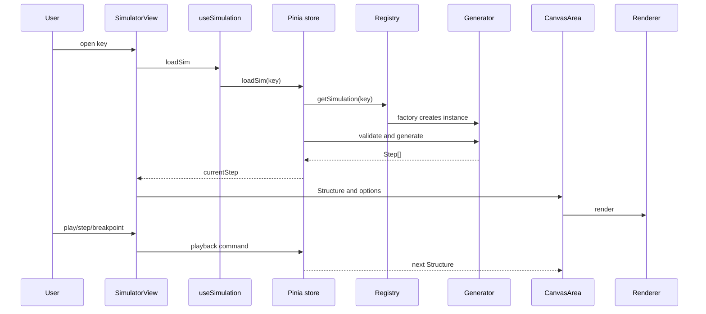
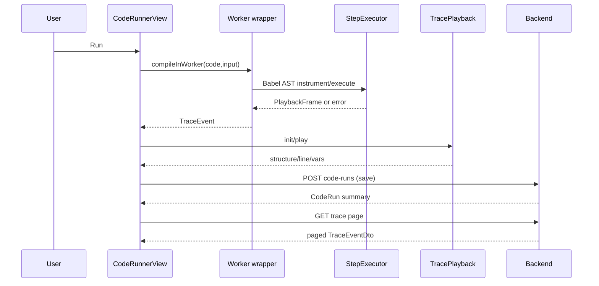

# Trái tim engine mô phỏng thuật toán

> Phạm vi: đọc trực tiếp frontend/src/engines, composables playback, simulator components/views và backend endpoints liên quan. Số dòng là số dòng tại thời điểm khảo sát; tài liệu không suy diễn phần chưa có trong mã.


## 1. Khái niệm & Mục đích nghiệp vụ

> **Tại sao có module này?** Engine mô phỏng là trái tim của VisualizationDSA — biến thuật toán trừu tượng thành **Step[] snapshots** có thể Play/Pause/Step/Time-travel trên Canvas. Không có engine này, người học chỉ đọc pseudocode tĩnh, không thấy cấu trúc dữ liệu biến đổi theo từng dòng lệnh.
>
> **Bài toán giải quyết:**
> - **Generator path** (`SimulationGenerator → Step[] → VCR → Canvas`): 44 thuật toán (sort/search/stack/queue/list/tree/heap/hash/graph) được mã hóa thành cấu trúc chuẩn `Step{structure, explanation, pseudocodeLine, highlights}` để renderer vẽ.
> - **Code Runner path** (`Code → Babel AST instrumentation → Web Worker → PlaybackFrame`): cho phép người học code JS trực tiếp, instrumentation sinh trace có `line/vars/highlight` để time-travel.
> - Backend **không chạy simulation/code** — chỉ cung cấp catalog/schema và lưu trace. Đây là quyết định kiến trúc then chốt (hiệu năng client, bảo mật server).

---
## 1b. Kết luận nhanh (audit gốc giữ nguyên)

Có hai đường chạy:

1. SimulationGenerator → Step[] → Pinia VCR → Canvas renderer: đường chính của SimulatorView.
2. Code → Web Worker/Babel instrumentation → PlaybackFrame/TraceEvent → VCR: đường Code Runner/Code-to-Visual.

Backend không chạy simulation/code. Backend cung cấp catalog/schema và lưu kết quả/trace. PublicController ghi rõ POST simulation run đã bị cắt; FAQ cũng nói simulation chạy phía browser.

Canvas registry có sáu renderer class, bao phủ array, stack, queue, linkedlist, tree, heap, hashtable, graph. PixiJS/WebGL có painter subsystem riêng; WebGPU là pipeline lực đồ thị tùy chọn, ngoài luồng EDV chính. Code highlight hiện là textarea/gutter và active pseudocode/source line; chưa thấy Monaco, Prism, Shiki hay highlight.js.

## 2. Hợp đồng dữ liệu

Nguồn: frontend/src/engines/core/types.ts:3-64.

- Element: id, label, status, group/meta.
- Link: from/to, label/status.
- Structure: kind, elements, links.
- Step: index, Structure snapshot, explanation tiếng Việt, pseudocodeLine 1-based, highlights, annotations, variables, comparisons/swaps/writes và version=1.
- SimulationGenerator: metadata, inputSchema, pseudocode, generate và validate.

Snippet (types.ts:26-36):

```ts
export interface Step {
  index: number;
  structure: Structure;
  explanation: string;
  pseudocodeLine: number;
  highlights: string[];
  annotations: string[];
  variables: Record<string, string | number | boolean | null>;
  stats: { comparisons: number; swaps: number; writes: number };
  version: 1;
}
```
helpers.ts:69-90, Trace.push chụp snapshot stats và tạo Step. helpers.ts:28-49, buildGenerator lấy metadata từ catalog bằng key; generator không lặp lại title/complexity.

## 3. Catalog, registry, generators

catalog.ts:1-8 nói danh sách phải khớp shared/simulation-catalog.json và comment nêu 44 simulation. Metadata nằm ở 56-101; factory map 104-149; vòng đăng ký 151-158 kiểm tra factory thiếu rồi ném lỗi. registry.ts:6-19 dùng Map<string, GeneratorFactory>; getSimulation và listSimulations tạo instance mới mỗi lần.

### Inventory file-by-file

| Nhóm | File | Nội dung/key |
|---|---|---|
| Sort | generators/sort/bubble.ts | sort.bubble |
| Sort | selection.ts, insertion.ts, merge.ts, quick.ts, heap.ts | năm generator sort còn lại |
| Search | generators/search/linear.ts, binary.ts | linear/binary |
| Linear | generators/linear/stack.ts | stack.push/pop/peek |
| Linear | generators/linear/queue.ts | queue.enqueue/dequeue |
| Linear | generators/linear/linkedList.ts | list.insert/delete/search/traverse |
| Tree | generators/tree/bst.ts, avl.ts | BST operations/traversals, AVL insert |
| Heap/hash | generators/heap/heapOps.ts, hash/hashTable.ts | heap operations và chained hash |
| Graph | generators/graph/bfs.ts, dfs.ts, dijkstra.ts | traversal/shortest path |
| Structure | generators/structure/structures.ts | ten structure keys |
| Shared | generators/helpers.ts | Trace, RNG, validators, Structure builders |

helpers.ts:109-121 dùng xorshift seed 42. helpers.ts:197-245 parse/validate array: custom 2–100 phần tử, integer -999..999; random size 2–100, min/max, duplicate capacity và preset. helpers.ts:313-359 validate graph vertices 2–50, edges 1–200 và preset path/cycle/complete/bipartite/grid/custom.

## 4. Generator execution và VCR

stores/simulation.ts:24-45 giữ currentSim, steps, currentIndex, speed, status, stats, inputConfig, loading/error và breakpoints. loadSim ở 89-126: lấy factory từ registry, dựng default input từ inputSchema, validate, generate; empty steps thành loadError; stats lấy step cuối; từ 90 steps phát warning.

Playback interval stores/simulation.ts:47-70 có nhịp max(75, 1200/speed). Breakpoint ở 73-85 so pseudocodeLine, pause và lưu breakpointHit. play/pause/step/jump/reset/setSpeed ở 186-247. useSimulation.ts:11-44 là lifecycle adapter: mounted load, unmounted stop timer.

SimulatorView.vue:423-533 nối PseudocodePanel, CanvasArea, StatsBar, ControlBar, ExplainPanel, annotations và CallStackPanel. View truyền active-line, variables, breakpoints cho pseudocode; structure hiện tại và render options cho canvas. Phím tắt được khai báo ở 213-245. Anonymous chỉ được vào key demoAllowed ở 44-50.

## 5. StepExecutor, workers và DSL

stepExecutor.ts:23-49 định nghĩa TraceEvent gồm line, vars, highlight, kind (declare/assign/compare/swap/loop/call/return), explanation; RunResult gồm trace/output/error/stats. Babel parser import ở 16-17. CompileOptions và measure contract quanh 189-217; compile ở 234-246 có fallbackToRegex.

Guard thực tế: MAX_STEPS=10000 và MAX_LOOP_ITERATIONS=1000000 ở stepExecutor.ts:824-825; kiểm tra step tại 382 và vòng lặp tại 421-422. Adapter statsFromTrace ở 1256, runCode ở 1285, runMeasure ở 1318; comment 1310 nói runMeasure deprecated, thay bằng worker measure.

compileWorker.ts:38-89 tạo module Worker, compile timeout mặc định 15000ms; timeout terminate worker, reset singleton và reject ở 68-72. compiler.worker.ts:69-110 xử lý measure/compile; measure không trace, đếm comparisons/swaps/writes và trả measure=null khi MeasureTimeoutError ở 87-90.

Code-to-Visual DSL là nhánh an toàn độc lập: features/code-to-visual/dsl/types.ts:1-53 tuyên bố không chạy arbitrary code. Operations giới hạn create/push/pop/peek/set/swap/enqueue/dequeue/front; mỗi event giữ line, structure, operation, snapshot state, highlightedIndices, explanation. CodeToVisualView.vue:189-234 nối CanvasArea, ControlBar, PseudocodePanel và explanation.

## 6. Trace playback và edge cases

useCodeTracePlayback.ts:63-76 sampling đều khi trace vượt maxFrames và luôn giữ event cuối. init ở 151-182 ưu tiên vars.array; nếu thiếu chỉ tự biến đổi fallback khi event kind=swap (165-173). Vì vậy trace không có array snapshot và không phải swap có thể không dựng đúng state; đây là limitation thật.

play ở 184-191 quay về đầu nếu đang ở frame cuối. stepForward/stepBack/jumpTo clamp bounds; setSpeed clamp tối thiểu 1ms và restart interval; dispose clear timer ở 228-232. currentLine/currentVars map frame index ngược về trace index gốc ở 130-138, nên sampling không làm mất line/vars của frame được chọn.

useStructureTransition.ts:111-147 vẽ thẳng nếu thiếu prev, đổi kind, reduced-motion, duration <=0 hoặc không có delta ID. Added queue bay từ phải vào; added stack từ trên xuống (170-176). Removed được đưa vào copy tạm, queue bay trái, stack bay lên và fade alpha (179-203, 224-230). Animation dùng easeOutCubic và CoreAnimationEngine; update mới cancel animation cũ (111-113). ID không có hậu tố số bị xếp cuối (72-83).

## 7. Canvas render pipeline

Renderer contract ở renderers/interface.ts:7-20: supportedKinds, mount, render(Structure, RenderOptions), resize, dispose; renderer không chứa logic giải thuật. rendererRegistry.ts:14-40 đăng ký ArrayRenderer, StackQueueRenderer, ListRenderer, TreeRenderer, HashTableRenderer, GraphRenderer; kind lạ trả null để CanvasArea dùng fallback (dòng 1-4, 23-25).

CanvasArea.vue:41-55 giữ canvas, ResizeObserver, active renderer và transition. ensureRenderer bắt đầu ở 175; đổi kind phải dispose/mount renderer mới. Fallback inline vẫn tồn tại, nên registry miss không làm trắng UI nhưng tạo nguy cơ lệch layout giữa hai implementation.

CanvasPainter (painter/canvasPainter.ts:1-6,19-39) là primitive helper; màu lấy CANVAS_COLORS. logical viewport được chia theo zoom ở 49-55; beginFrame reset DPR×zoom, clear và tô nền ở 88-97. Primitive gồm roundRect, gradientBar, circle, text, line, dashedLine, arrow, curve (99-315).

### Renderer inventory

- arrayRenderer.ts:1-25: ô ngang, bar mode cho numeric labels, wrap mảng dài, muted alpha.
- stackQueueRenderer.ts:1-25: stack dọc, queue front trái/rear phải, fly metadata tĩnh.
- listRenderer.ts:1-25: node 80×40, next arrows, null dashed, head/tail, detached node.
- treeRenderer.ts:1-25: tree và heap, in-order columns, curved links, heap-array reserve.
- hashTableRenderer.ts:1-25: bucket columns, chained nodes và h(k) label.
- graphRenderer.ts:1-25: meta.x/y normalize hoặc circle fallback, directed arrows, weights, traversal statuses và d[].

## 8. PixiJS/WebGL và WebGPU

Pixi không được đăng ký vào Canvas rendererRegistry. renderers/pixi/index.ts:1-6 export ParticleManager, PixiArrayPainter, PixiTreePainter, PixiGraphPainter, PixiLinearPainter. usePixiStage.ts:19-77 probe context và init Pixi Application với DPR tối đa 2/high-performance; GSAP/app ticker ở 94-111; ResizeObserver 114-125; dispose/guard destroy ở 156-191.

PixiArrayPainter.ts:1-8,21-25 có parabolic swap, pivot aura, sparks, sorted bloom, adaptive bar/square. PixiGraphPainter.ts:1-8 có beam/ripple/path glow/arrows/weights. PixiTreePainter.ts:112-129 và 252-336 có spring relocation, ghost afterimage, pulse, particles, pooled text. PixiLinearPainter.ts:1-8,102-147 có spring push, dissolve dust, top/front pulse và linked-list null.

WebGpuPipeline.ts:1-5 tự đánh dấu OPTIONAL, ngoài EDV chính. WGSL 7-48 chạy Coulomb repulsion; workgroup size 64; mỗi invocation duyệt các node khác. probeWebGpu ở 58-109 trả capabilities/error thay vì throw khi unsupported hoặc adapter fail. Context setup quanh 112-124 có thể throw. Không thấy consumer nối pipeline này vào graphRenderer.

## 9. Code highlight và views

CodeRunnerView.vue:1-8 ghi editor là textarea; Monaco chỉ là kế hoạch khi cài package. Gutter line ở 77-87; useCodeTracePlayback và current line ở 34-43; run thành công có trace thì init/play ở 106-115, trace rỗng/error/timeout quay về generator preview. Grep trực tiếp không thấy Monaco, Prism, Shiki hoặc highlight.js. Vì vậy hiện có active pseudocode/source line, không có token-level syntax highlight.

CodeToVisualView.vue:189-234 cho thấy canvas + VCR + pseudocode + explanation. SimulatorView.vue:423-533 là bố cục 3 vùng. Các simulator component đã đọc: CanvasArea.vue, ControlBar.vue, PseudocodePanel.vue, InputModal.vue, StatsBar.vue, ExplainPanel.vue, LegendPanel.vue, CallStackPanel.vue, ManualPracticePanel.vue, DemoBanner.vue, MiniQuizBanner.vue. Chúng là lớp UI/điều khiển, không tự chạy thuật toán.

## 10. Backend contracts

| Endpoint | Source | Thực tế |
|---|---|---|
| GET /api/v1/simulations | SimulationsController.cs:17-35 | Authorize, catalog list, pagination envelope, X-Total-Count |
| GET /api/v1/simulations/{key} | SimulationsController.cs:38-43 | metadata/detail service |
| GET /api/v1/simulations/{key}/schema | SimulationsController.cs:45-50 | SimulationSchemaDto |
| POST /api/v1/code-runs | CodeRunsController.cs:17-24 | lưu client result |
| GET /api/v1/code-runs/{id} | CodeRunsController.cs:26-31 | ownership check |
| GET /api/v1/code-runs/{id}/trace | CodeRunsController.cs:33-43 | paged trace |

PublicController.cs:11-13 ghi rõ không có endpoint sinh bước server; FAQ lines 51-53 nói simulation chạy client. CodeRunnerService.cs:11-14 nói server không chạy code, chỉ lưu status/stats/duration/trace. SaveRun serialize trace ở 21-53. GetTrace normalize page ở 73-95; ParseTracePage ở 105-137 duyệt JsonDocument, chỉ materialize trang nhưng vẫn đếm toàn bộ. DTO CodeRunDtos.cs:28-35 chỉ có Index/Type/Message/Data, không typed trực tiếp như frontend TraceEvent (line/vars/highlight/kind/explanation).

Frontend mapping: api/simulations.ts:5-10,40-53; api/codeRunner.ts:4-10,31-69. Gap rõ: frontend vẫn khai báo GET /public/simulations/{key}/run ở simulations.ts:9,52-53, trong khi PublicController không có action run và comment nói endpoint đã cắt.

## 11. Mermaid architecture

```mermaid
flowchart LR
  View[SimulatorView / CodeRunnerView] --> Store[Pinia simulation store]
  View --> TraceVCR[useCodeTracePlayback]
  Store --> Registry[engine registry]
  Registry --> Catalog[engines/catalog]
  Catalog --> Generators[44 generator factories]
  Generators --> Steps[Step[] / Structure snapshots]
  TraceVCR --> Frames[Sampled Structure frames]
  Steps --> CanvasArea[CanvasArea]
  Frames --> CanvasArea
  CanvasArea --> RRegistry[rendererRegistry]
  RRegistry --> Canvas[Canvas renderers]
  CodeRunner[CodeRunnerView] --> Worker[compiler.worker]
  Worker --> Executor[Babel AST StepExecutor]
  CodeRunner --> API[code-runs API]
  API --> DB[(TraceJson / CodeRun)]
  SimAPI[simulations API] --> CatalogData[(server catalog/schema)]
```
## 12. Mermaid sequence



## 13. Edge-case matrix

| Case | Behavior | Gap/risk |
|---|---|---|
| key lạ | registry undefined, loadError | detail API chưa phải runtime path của view |
| validate fail | giữ lỗi, không generate | UI phụ thuộc InputModal/validator |
| generate [] | loadError | generator cần ít nhất một Step |
| random | seed 42 | chưa có user seed chung |
| trace > maxFrames | sampling + giữ frame cuối | frame không còn 1:1 event |
| thiếu vars.array | initial fallback, chỉ swap tự cập nhật | cấu trúc khác array có thể sai |
| infinite loop | AST guards + worker timeout | nhiều guard khác mức |
| renderer kind lạ | fallback CanvasArea | fallback/class có thể lệch layout |
| reduced motion | vẽ thẳng transition | Pixi lifecycle riêng |
| WebGL/jsdom | usePixiStage trả null | caller phải fallback |
| WebGPU unsupported | probe trả error | chưa thấy consumer/fallback |
| backend JSON hỏng | total=0, page rỗng | lỗi trace bị coi như rỗng |
| trace pagination | chỉ materialize page nhưng scan O(n) | vẫn tốn scan mỗi request |
| anonymous key | chỉ demoAllowed | public run frontend/backend lệch |

## 14. Q&A

**Thuật toán chạy đâu?** Client: generator trong store, code trong worker/browser; backend chỉ lưu.

**Registry có singleton generator?** Không; mỗi get/list gọi factory mới.

**Step có phải TraceEvent?** Không. Generator tạo Step/Structure; executor tạo PlaybackFrame rồi adapter TraceEvent. Contract tương tự nhưng khác type.

**VCR giữ mọi event?** Pinia generator giữ mọi Step; trace playback sampling khi vượt maxFrames.

**Canvas hay Pixi là đường chính?** CanvasArea dùng rendererRegistry Canvas. Pixi painter/lifecycle là subsystem riêng, được export và dùng ở DataStructureStage; không thấy bridge vào Canvas registry.

**WebGPU đã thay Canvas chưa?** Chưa; file tự ghi OPTIONAL và ngoài EDV chính.

**Có syntax highlight không?** Chưa. Có textarea, gutter và active line/pseudocode; chưa có token highlighter.

**Backend có schema không?** Có GET schema và DTO, nhưng SimulatorView dùng generator/schema local; chưa thấy fetch schema trong composable đã đọc.

**Trace lưu có line/vars/highlight không?** Frontend executor có; DTO backend generic Index/Type/Message/Data nên cần mapper/versioned contract nếu replay typed.


## 14. Bộ câu hỏi tự kiểm tra (Q&A Self-Test — bổ sung chuẩn §4.5)

1. **Generator và StepExecutor khác nhau thế nào?** Generator sinh `Step[]` offline từ inputSchema; StepExecutor instrument code người dùng qua Babel AST trong Worker để sinh `TraceEvent[]`. Generator là deterministic, Executor là dynamic.
2. **Vì sao backend không chạy simulation?** Để tránh tải CPU/memory server, giảm độ trễ, và vì 44 generator chạy O(n log n) trên client đã đủ mượt. Backend chỉ lưu/catalog.
3. **MAX_STEPS=10000 và 1.000.000 loop ticks để làm gì?** Guard chống infinite loop do người dùng code. Vượt ngưỡng → error state, không treo UI.
4. **Canvas renderer vs PixiJS khác gì?** Canvas registry (6 renderer) là đường chính của SimulatorView; Pixi là subsystem WebGL riêng (ParticleManager/Painters), chưa bridge vào CanvasArea — không suy diễn Pixi thay Canvas.
5. **Sampling trong useCodeTracePlayback hoạt động ra sao?** Khi `trace.length > maxFrames`, sampling đều và luôn giữ event cuối; `currentLine/currentVars` map ngược frame→trace gốc nên không mất line/vars.
6. **Breakpoint so sánh gì?** So `pseudocodeLine` (1-based) tại `stores/simulation.ts:73-85`, pause và lưu `breakpointHit`.
7. **Fallback khi catalog key lạ?** Registry miss → `loadError`; UI không trắng nhờ fallback inline trong CanvasArea nhưng có nguy cơ divergence layout.
8. **Syntax highlight hiện có gì?** Chỉ `active pseudocode/source line` + textarea/gutter; chưa có Monaco/Prism/Shiki — gap đã ghi nhận.

## 15. Gap thực tế (không bịa)

1. Frontend khai báo public demo run nhưng backend PublicController xác nhận route đã cắt.
2. Runtime SimulatorView dùng local catalog/registry, không dùng backend catalog/schema trong đường load đã khảo sát.
3. DTO trace backend không khớp TraceEvent typed ở frontend.
4. Có hai playback model với speed semantics khác nhau: store multiplier 0.25–4; trace composable milliseconds.
5. Canvas fallback inline tồn tại song song renderer registry, có nguy cơ divergence.
6. Pixi chưa được nối vào CanvasArea registry; không thể kết luận Pixi dùng cho SimulatorView.
7. WebGPU pipeline/probe tồn tại nhưng chưa có consumer rõ trong graph renderer/EDV.
8. Syntax highlighting token-level chưa triển khai.
9. Trace pagination giảm allocation nhưng vẫn scan toàn bộ JSON để tính total.
10. Guard/limit khác nhau: array generator 100; MAX_STEPS 10000; compile timeout 15s; measure 5s; comment RunResult nói timeout 5s. Đây là gap thống nhất UX/API, không khẳng định bug.

## 16. Bảng nguồn chính

- frontend/src/engines/catalog.ts: catalog, factory map, registration.
- frontend/src/engines/registry.ts: Map registry.
- frontend/src/engines/core/types.ts: Structure/Step/Generator contracts.
- frontend/src/engines/generators/helpers.ts: Trace, RNG, validation/builders.
- frontend/src/engines/core/stepExecutor.ts: AST instrumentation, guards, adapters.
- frontend/src/engines/worker/compileWorker.ts và compiler.worker.ts: worker/timeout/measure.
- frontend/src/composables/useCodeTracePlayback.ts: sampling/VCR trace.
- frontend/src/composables/useStructureTransition.ts: stack/queue transitions.
- frontend/src/engines/renderers/interface.ts, rendererRegistry.ts, painter/canvasPainter.ts: Canvas contract.
- frontend/src/engines/renderers/arrayRenderer.ts, stackQueueRenderer.ts, listRenderer.ts, treeRenderer.ts, hashTableRenderer.ts, graphRenderer.ts: renderer implementations.
- frontend/src/engines/renderers/pixi/* và frontend/src/composables/usePixiStage.ts: Pixi subsystem.
- frontend/src/engines/core/webGpuPipeline.ts: optional WebGPU compute.
- frontend/src/views/SimulatorView.vue, CodeRunnerView.vue, CodeToVisualView.vue; frontend/src/components/simulator/*: UI wiring.
- backend/src/DsaVisual.Api/Controllers/SimulationsController.cs, PublicController.cs, CodeRunsController.cs; backend/src/DsaVisual.Application/Services/CodeRunnerService.cs; backend/src/DsaVisual.Application/Dtos/CodeRunDtos.cs, SimulationSchemaDto.cs: API boundary.

**Độ chắc chắn:** mọi kết luận trên dựa trên file/line nêu ở trên; các câu “chưa thấy” chỉ có nghĩa không tìm thấy trong phạm vi đã đọc, không khẳng định toàn repo không có implementation khác.