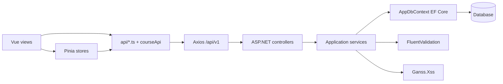

# Study 03 — Khoa học, bài học và Teacher Studio

> Phạm vi: D:/FPT/neww/frontend/src (lesson/course/quiz/exercise/stores/classes/views) và backend/src/DsaVisual.Api, backend/src/DsaVisual.Application (controllers/services/entities/validators/DTO/configuration). Đây là audit code thực tế, không suy diễn UI mock.


## 1. Khái niệm & Mục đích nghiệp vụ

> **Tại sao có module này?** Khóa học/Bài học là **nội dung học tập có cấu trúc**, còn Teacher Studio/Lớp học là **không gian sư phạm** (giao bài, chấm, báo cáo, CSV). Không có chặng này, hệ thống chỉ có engine rời rạc mà không có lộ trình học và không có công cụ cho giảng viên.
>
> **Bài toán giải quyết:**
> - **Course/Lesson lifecycle:** `Draft → PendingReview → Active/Hidden`, `isClassOnly`, `LessonSimulation` attach, curriculum `draft/published` gating — đảm bảo nội dung được duyệt trước khi tới sinh viên.
> - **Quiz/Exercise/Codelab:** 3 chế độ học trong `LessonStudyView` (`sandboxType: dsa/quiz/codelab`) với judge, submit idempotency và XSS sanitizer (`Ganss.Xss`).
> - **Teacher Studio:** quản lý lớp (`Class/InviteCode/ClassMember/ClassAssignment`), báo cáo tiến độ, export CSV — với các gap thực tế về concurrency/rollback đã ghi nhận.

---
## 1b. Tóm tắt (audit gốc giữ nguyên)

Hai đường nghiệp vụ nối nhau: course/learning-path công khai → lesson → LessonStudyView; và class do teacher sở hữu → members, assignments, curriculum theo lớp, report và CSV. Controller mỏng; service truy cập AppDbContext trực tiếp, trả Result<T>, gọi FluentValidation và sanitize HTML bằng Ganss.Xss. Lesson có Draft/PendingReview/Active/Hidden; curriculum class có draft/published gating.

## 2. Kiến trúc và data flow



```mermaid
sequenceDiagram
 actor S as Student
 participant V as LessonStudyView
 participant L as useLessonStore
 participant C as Controllers
 participant X as LessonService
 participant D as DB
 S->>V: open lesson route
 V->>L: load lesson and metadata
 L->>C: GET /lessons/id?includeContent=true
 C->>X: GetByIdAsync(user, role, id, includeContent)
 X->>D: lesson/progress/simulation/exercise query
 D-->>X: records
 X-->>V: DTO and progress
 V->>V: theory, quiz or codelab
 S->>C: mark-viewed or submit
 C->>X: authorization, validation, persistence
 X-->>V: Result/error

## 3. Course and lesson

### Course

frontend/src/services/courseApi.ts exposes GET /concepts/courses, GET /concepts/courses/{id}, course CRUD, node add/delete/reorder and course feedback. CourseListDto has totalLessons, completedLessons, progressPercent. Detail adds lessons, objectives, outcomes, highlights, testimonials and author. Teacher Studio loads this list before import into a class.

Exact source shape:

    getCourses: () => getData<CourseListDto[]>({ method: 'GET', url: '/concepts/courses' }),
    getCourseById: (id: string | number) => getData<CourseDetailDto>({ method: 'GET', url: '/concepts/courses/' + encodeURIComponent(String(id)) }),
    createCourse: (payload) => getData({ method: 'POST', url: '/concepts/courses', data: payload }),
    reorderCourseNodes: (courseId, nodeIds) => client.put('/concepts/courses/' + encodeURIComponent(String(courseId)) + '/reorder', { nodeIds }),

### LessonStudyView

frontend/src/views/lesson/LessonStudyView.vue renders course mini-map/sidebar, search by title/module, locked lessons, XP, loading/error/offline fallback and completion modal. goToLesson refuses locked targets; this is UX only, backend 403 is security boundary. It selects:

    <LessonStepTheory v-if="!lessonStore.lessonMeta?.sandboxType || lessonStore.lessonMeta?.sandboxType === 'dsa'"
      :content="lessonStore.currentLesson.theoryContent" :simulation-key="lessonStore.simulationKey" />
    <LessonStepQuiz v-else-if="lessonStore.lessonMeta?.sandboxType === 'quiz'"
      :questions="lessonStore.currentLesson.quizQuestions ?? []" />
    <LessonStepCodeLab v-else-if="lessonStore.lessonMeta?.sandboxType === 'codelab' && lessonStore.currentLesson.codelabTask"
      :codelab-task="lessonStore.currentLesson.codelabTask" :exercise-id="lessonStore.lessonMeta?.exerciseId ?? null" />

frontend/src/features/lesson/store/useLessonStore.ts owns current lesson, loading/error, meta, simulation keys, fallback and completedLessonIds. View combines local completed IDs with backend status Completed: immediate UX but possible stale tick after failed request.

### API and lifecycle

frontend/src/api/lessons.ts provides topics CRUD; paged lessons by topic/status/q; detail with includeContent; progress; mark-viewed; feedback; teacher/admin CRUD; simulation attach/detach; student report; admin pending/review.

    export type LessonStatusValue = 'draft' | 'pendingreview' | 'active' | 'hidden';
    export interface LessonUpsertRequest {
      topicId: number; title: string; description?: string; contentHtml: string;
      status: LessonStatusValue; isClassOnly?: boolean; sortOrder?: number;
      simulationKeys?: string[];
      simulations?: Array<{ simulationKey: string; title?: string; defaultInput?: unknown }>;
    }
    export async function fetchLesson(id: number): Promise<LessonDto> {
      return getData<LessonDto>({ method: 'GET', url: LESSON_ENDPOINTS.lesson(id), params: { includeContent: true } });
    }

backend/src/DsaVisual.Api/Controllers/LessonsController.cs uses [Authorize], route api/v1/lessons, and delegates to LessonService. Create/update/delete require TEACHER,ADMIN; pending/review requires ADMIN; rejecting a review requires reason. LessonService documentation states direct DbContext, Result<T>, sanitizer, service validation, teacher public → PendingReview, admin approval → Active plus PublishedAt, and IsClassOnly direct-active exception.

Entity exact fields include:

    public int TopicId { get; set; }
    public string Title { get; set; } = string.Empty;
    public string ContentHtml { get; set; } = string.Empty;
    public LessonStatus Status { get; set; } = LessonStatus.Draft;
    public bool IsClassOnly { get; set; }
    public string? RejectionReason { get; set; }
    public DateTime? PublishedAt { get; set; }
    public int CreatedBy { get; set; }
    public DateTime? DeletedAt { get; set; }
    public ICollection<LessonSimulation> LessonSimulations { get; set; } = [];
    public ICollection<Exercise> Exercises { get; set; } = [];

### Validation

LessonValidator.cs: TopicId > 0; title required 3–200; description ≤500; content required ≤200,000; enum status; sort order ≥0. ClassUpsertRequestValidator.cs: name 2–200; semester ≤50; description ≤500; status open/closed. Client types do not replace server validation.

### Quiz/exercise/codelab

Quiz questions enter LessonStepQuiz; submit/complete events drive persistence. ExercisesController exposes submit/practice, student/teacher submissions, code/codelab submit, and POST /exercises/import-csv. CodelabJudgeService judges config tasks. CSV import currently reads whole stream:

    using var reader = new StreamReader(file.OpenReadStream());
    var csvText = await reader.ReadToEndAsync(ct);
    var result = await _service.ImportCsvAsync(CurrentUserId(), lessonId, csvText, ct);

## 4. Class and Teacher Studio

### Model

    public sealed class Class
    {
        public int Id { get; set; }
        public string Name { get; set; } = string.Empty;
        public string InviteCode { get; set; } = string.Empty; // UNIQUE
        public int OwnerId { get; set; }
        public ClassStatus Status { get; set; } = ClassStatus.Open;
        public string? CurriculumTitle { get; set; }
        public string? CurriculumDescription { get; set; }
        public bool CurriculumPublished { get; set; } = true;
        public DateTime CreatedAt { get; set; }
        public DateTime? DeletedAt { get; set; }
    }

ClassMember is unique (ClassId, UserId). ClassAssignment stores optional LessonId/ExerciseId, DueAt, AllowLateSubmission and SortOrder; entity comment documents CHECK requiring at least one reference.

### Views/stores

TeacherStudioView.vue imports class/auth/ui stores, classes/lessons/exercises/course APIs and orchestrates teacher dashboard. ClassesView.vue lists/creates/joins. ClassDetailView.vue has members, assignments, curriculum and manager-only settings. It loads real report, maps assignment onTime/late/notSubmitted and laggingLearners; report failure intentionally does not block detail.

### Assignment

ClassService.AddAssignmentAsync checks manager, rejects both IDs null, checks referenced rows not soft-deleted, calculates max SortOrder + 1, inserts and SaveChanges:

    if (request.LessonId is null && request.ExerciseId is null)
    {
        return Result<ClassDetailDto>.Fail(ErrorCodes.VALIDATION_FAILED,
            "Phải gán ít nhất bài học hoặc bài tập", new() { ["lessonId"] = ["Phải gán ít nhất bài học hoặc bài tập"] });
    }
    var maxSortOrder = await db.ClassAssignments.AsNoTracking()
        .Where(a => a.ClassId == id).MaxAsync(a => (int?)a.SortOrder, ct) ?? -1;

Update changes dueAt/late policy; delete hard-deletes assignment. Reorder uses DistinctBy, rejects empty list, verifies every ID belongs to class, updates in one SaveChanges. Current validation allows both lesson and exercise non-null; only null/null is rejected (OR, not XOR).

### Curriculum

Update trims and validates title max 200 and description max 500, and toggles Published. Student draft gate is:

    if (!canManage && !classRoom.CurriculumPublished)
    {
        return Result<ClassCurriculumDto>.Ok(new ClassCurriculumDto
        {
            ClassId = id, Title = classRoom.CurriculumTitle,
            Description = classRoom.CurriculumDescription, Published = false,
            ProgressPct = 0, Items = []
        });
    }

Import is POST /classes/{id}/import-course/{courseId}; UI sets importing flag, calls API, toast, then refetches class and curriculum.

## 5. CSV thực tế

1. Class report: GET /api/v1/classes/{id}/report/export, TEACHER/ADMIN, ClassService returns CsvFileDto, controller returns File(content, contentType, fileName).
2. Lesson progress report: GET /api/v1/progress/report/export?lessonId=..., TEACHER/ADMIN, same server File pattern.
3. Exercise import: POST /api/v1/exercises/import-csv, multipart file + lessonId; null/empty rejected, text delegated to service parser.

Frontend exact export adapter:

    export async function exportClassReportCsv(id: number): Promise<string> {
      const response = await getData<unknown>({ method: 'GET', url: CLASS_ENDPOINTS.reportExport(id) });
      return typeof response === 'string' ? response : '';
    }

Comment says UTF-8 BOM for Excel. This is server export, not browser-generated CSV. However Blob/ArrayBuffer response would become empty unless Axios client transforms to text.


## 5b. Code Snippets cốt lõi & Chú giải (bổ sung chuẩn §4.4)

```ts
// frontend/src/api/lessons.ts — fetchLesson + LessonStatusValue
export type LessonStatusValue = 'draft' | 'pendingreview' | 'active' | 'hidden';
export async function fetchLesson(id: number): Promise<LessonDto> {
  return getData<LessonDto>({ method: 'GET', url: LESSON_ENDPOINTS.lesson(id), params: { includeContent: true } });
}
// Chú giải: includeContent=true để lấy ContentHtml/simulationKeys; status là union 4 giá trị
// tương ứng entity LessonStatus enum. Backend LessonService sanitize HTML bằng Ganss.Xss trước lưu.
```

```csharp
// backend/src/DsaVisual.Application/Services/ClassService.cs — AddAssignmentAsync (rút gọn)
if (request.LessonId is null && request.ExerciseId is null)
  return Result.Fail(ErrorCodes.VALIDATION_FAILED, "Phải gán ít nhất bài học hoặc bài tập");
var maxSortOrder = await db.ClassAssignments.AsNoTracking()
  .Where(a => a.ClassId == id).MaxAsync(a => (int?)a.SortOrder, ct) ?? -1;
db.ClassAssignments.Add(new ClassAssignment { ClassId = id, LessonId = request.LessonId, SortOrder = maxSortOrder + 1 });
await db.SaveChangesAsync(ct);
// Chú giải: chỉ reject null/null (OR, không phải XOR) nên cho phép cả 2 non-null.
// max+1 race nếu 2 teacher cùng add; thiếu RowVersion → last-write-wins. Thiếu transaction/idempotency import.
```

```ts
// frontend/src/api/classes.ts — export CSV (server-generated, BOM)
export async function exportClassReportCsv(id: number): Promise<string> {
  const response = await getData<unknown>({ method: 'GET', url: CLASS_ENDPOINTS.reportExport(id) });
  return typeof response === 'string' ? response : '';
}
// Chú giải: server File(content, contentType, fileName) với BOM UTF-8 cho Excel VN.
// Nếu Axios không transform Blob→text, response sẽ rỗng → cần test integration responseType.
```


## 8b. Bộ câu hỏi tự kiểm tra (Q&A Self-Test — bổ sung chuẩn §4.5)

1. **LessonStatus gồm những giá trị nào và ai được chuyển PendingReview→Active?** `draft|pendingreview|active|hidden`; chỉ ADMIN duyệt. Teacher tạo → PendingReview; `isClassOnly` là ngoại lệ active trực tiếp.
2. **ContentHtml có nguy cơ XSS không?** Có nếu không sanitize. LessonService inject `IHtmlSanitizer` (Ganss.Xss) whitelist trước lưu — cần test allowlist khi đổi editor.
3. **Vì sao goToLesson chặn lesson locked chỉ là UX?** FE check `locked` để chặn click, nhưng security boundary là backend trả 403 cho Draft/Hidden/ClassOnly cross-class.
4. **Assignment cần LessonId hay ExerciseId?** Ít nhất một (OR). Cả hai null → VALIDATION_FAILED; cả hai non-null hiện được cho phép (không phải XOR) — cần quyết định product.
5. **maxSortOrder+1 có race không?** Có — concurrent AddAssignment cùng Max sẽ duplicate SortOrder; thiếu RowVersion/transaction → last-write-wins.
6. **CSV export có gì cần test?** BOM UTF-8 cho Excel VN, content-type, filename, quoting/newlines, dataset lớn, 403 khi không phải teacher.
7. **ImportCourse có idempotency?** Chưa chứng minh — UI flag chỉ bảo vệ tab hiện tại; cần unique constraint/transaction backend.


## 6. Rollback and concurrency

Authorization is controller roles plus service ownership (EnsureCanManageAsync). Domain checks cover soft-delete, references, membership and publish. Unique/check constraints cover invite code, member composite and assignment content requirement. One SaveChanges is database-atomic; Result.Fail is not a transaction. AuthService has explicit multi-write transactions and catches DbUpdateConcurrencyException → 409.

Class, ClassAssignment and ClassMember entities read here have no RowVersion. maxSortOrder + 1 races under concurrent teacher requests; reorder is last-write-wins. ImportCourse atomicity/idempotency is not demonstrated by UI/controller excerpts and must be verified in the full service. Deadline badges use browser Date.now; server must remain authoritative.

## 7. Bảng phân tích File-by-File (chuẩn §4.3)

| File | Mô tả |
|---|---|

Frontend: LessonStudyView.vue (shell/modes/navigation); useLessonStore.ts (state/progress/fallback); LessonStepTheory.vue, LessonStepQuiz.vue, LessonStepCodeLab.vue (step engines); CourseDetailView.vue (detail/progress); courseApi.ts (course/nodes/feedback); api/lessons.ts (lesson lifecycle); TeacherStudioView.vue (teacher orchestration); ClassesView.vue (class list/create/join); ClassDetailView.vue (members/assignments/curriculum/report/import/export); api/classes.ts (class APIs + CSV); api/exercises.ts (exercise APIs); api/progress.ts (progress/report export); api/types.ts (DTOs); router/index.ts (route guards).

Backend: LessonsController.cs (lesson endpoints); ClassesController.cs (class/member/assignment/curriculum/report/export/import); ExercisesController.cs (exercise submit/import); ProgressController.cs (progress/report export); LessonService.cs (lifecycle/sanitize/progress); ClassService.cs (aggregate/assignments/curriculum/report/CSV); ExerciseService.cs (CRUD/import/submissions); ProgressService.cs (report/CSV); CodelabJudgeService.cs (judge); Lesson.cs, Class.cs, ClassMember.cs, ClassAssignment.cs (entities); LessonValidator.cs and ClassUpsertRequestValidator.cs (rules); AppDbContext.cs (sets/relationships/indexes); Persistence/Migrations (schema/concurrency evidence); Dtos/* (wire contracts).

## 8. Q&A

Q: Student mở Draft/Hidden URL? A: UI lock chưa đủ; backend status/class membership phải trả 403/404.

Q: Teacher public lesson ngay? A: Service docs say PendingReview; Admin approve → Active/PublishedAt; IsClassOnly là ngoại lệ active trực tiếp.

Q: Viewed có phải completed? A: Không. mark-viewed và quiz/codelab completion là trạng thái khác nhau.

Q: Assignment có cả lesson và exercise? A: Có thể theo code hiện tại; chỉ null/null bị reject. Nếu cần XOR, validation thiếu.

Q: Draft curriculum lộ items? A: Không; student nhận metadata và Items=[] đến khi publish.

Q: CSV tự dựng browser? A: Không; report CSV tạo server-side, exercise CSV là import.

Q: Retry import an toàn? A: Chưa chứng minh; UI flag chỉ bảo vệ tab hiện tại. Cần idempotency/unique/transaction backend.

Q: XSS? A: LessonService inject IHtmlSanitizer và entity docs nói ContentHtml sanitize trước lưu; vẫn cần test allowlist khi đổi editor.

## 9. Gaps thực tế

1. Course DTO IDs dùng string trong khi import class dùng number; cần chuẩn hóa contract.
2. Local completion tick có thể stale nếu backend complete fail; cần rollback/reconciliation.
3. ClassDetailView catch report rỗng, không phân biệt 403 và 500.
4. exportClassReportCsv ép string; cần integration test Blob/text, BOM, content-type và filename.
5. Không thấy RowVersion ở class/assignment/member; max+1 race và reorder last-write-wins.
6. Chưa có bằng chứng transaction/idempotency/duplicate policy cho ImportCourse.
7. CSV upload ReadToEndAsync; chưa thấy limit kích thước, MIME/extension hoặc streaming.
8. Deadline badge dùng client clock; late acceptance phải server-side.
9. Assignment hard delete có thể mất identity lịch sử nếu FK/history không giữ.
10. DTO thiếu role thành viên; UI suy teacher từ OwnerId, không biểu đạt co-teacher.
11. Client feedback nói comment ≤1000; cần xác nhận validator/service parity.
12. Offline fallback có banner nhưng chưa thấy durable progress outbox/sync queue.
13. CSV columns/escaping/encoding chính thức chưa được mô tả trong source đã đọc.
14. Quiz scoring/idempotency và transaction boundary import/export cần integration verification.

## 10. Release checklist

- [ ] Draft/Hidden/ClassOnly/cross-class IDOR đúng 403/404.
- [ ] Ownership/admin enforced server-side.
- [ ] HTML sanitizer blocks script/event URL.
- [ ] Double-click/retry quiz, codelab, assignment/import conflict-safe.
- [ ] Duplicate join/member/invite collision safe.
- [ ] Assignment null/null, both IDs, deadline timezone tests.
- [ ] Curriculum draft visibility and concurrent reorder tests.
- [ ] Duplicate submissions count once.
- [ ] CSV BOM, Vietnamese UTF-8, quoting/newlines, large dataset, unauthorized export.

## 11. Kết luận

Đường Vue → adapter/store → controller → service → EF entity là có thật. Nền tảng tốt: controller mỏng, validation server, sanitizer, lifecycle review, distinct report count và CSV server-side. Rủi ro release lớn nhất: import atomicity/idempotency, concurrency class, CSV response/upload limits, local completion rollback, clock skew và status/role contracts.

---

*Tài liệu đã được hoàn tất và ghi vật lý từ source snapshot của repo.*
