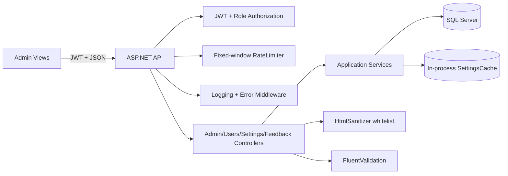

# Study 06 — Quản trị, Admin và bảo mật

> Phạm vi: admin views/API; backend Admin, Users, Settings, Feedback controllers/services; Program middleware, rate limit, XSS, validation, JWT và lỗi. Line refs là snapshot hiện tại.


## 1. Khái niệm & Mục đích nghiệp vụ

> **Tại sao có module này?** Admin quản trị **người dùng/phản hồi/nội dung/cài đặt-thống kê**, đồng thời là **tuyến phòng thủ cuối** (rate limit, XSS sanitizer, validation, error envelope, JWT role). Không có nó, hệ thống không vận hành được và không chống được abuse.
>
> **Bài toán giải quyết:**
> - Phân quyền tối thiểu: FE guard + API `[Authorize(Roles="ADMIN")]` + primary-admin check trong service.
> - Bảo vệ surface: fixed-window rate limiter per-IP, Ganss.Xss HtmlSanitizer whitelist, FluentValidation, error middleware.
> - Residue risk: ADMIN role quá rộng (capability thiếu), cache/rate-limit in-process (multi-instance stale), IP partition phụ thuộc proxy.

---
## 1b. Kết luận điều hành (audit gốc giữ nguyên)

Code có defence-in-depth tốt: FE role guard, API `[Authorize(Roles = "ADMIN")]`, primary-admin checks trong service, validation trước ghi, cache sau commit, sanitizer whitelist và error envelope. Đây không phải zero-trust hoàn chỉnh. Gap thực tế: role ADMIN quá rộng; rate-limit/lockout/cache in-process; IP partition phụ thuộc proxy; thiếu audit append-only; DTO admin có nhiều PII; feedback/report chưa thấy pagination/quota; model-binding 400 có thể lệch envelope; có dấu hiệu contract drift feedback.

Ưu tiên: P0 shared rate-limit/lockout + trusted proxy; P1 capability policies, audit, concurrency và data minimization; P2 payload limits, CSP, contract tests.

## 2. Architecture và trust boundaries



| Boundary | Control | Residual risk |
|---|---|---|
| Browser → API | JWT, validation, authz | client bypass; payload hostile |
| JWT → policy | issuer/audience/lifetime/signing key, role claim | HS256 secret rotation; stale role token |
| Feedback → HTML | server sanitizer + escaped Vue interpolation | length/quota/CSP still needed |
| API → DB/cache | EF, DB-first cache update, async load lock | multi-instance stale state |
| Request → logs | request/error middleware | verify no token/password/PII logging |


## 3b. Bảng phân tích File-by-File (bổ sung chuẩn §4.3)

| # | Đường dẫn thật | Hàm / Class trọng tâm | Ghi chú bảo mật |
|---|---|---|---|
| 1 | `frontend/src/views/AdminUsersView.vue:55-64` | Admin users table + actions | Gọi `api/admin.ts`, hiển thị PII (email/role) — cần data minimization |
| 2 | `frontend/src/api/admin.ts:4-174` | `getUsers/updateUser/deleteUser/getFeedback` | JWT Bearer + 401 refresh singleton |
| 3 | `backend/src/DsaVisual.Api/Controllers/UsersController.cs:12-18` | `[Authorize(Roles="ADMIN")] GetUsers` | Controller mỏng, delegate UserService |
| 4 | `backend/src/DsaVisual.Application/Services/UserService.cs:129-131,227` | `EnsurePrimaryAdminAsync`, role change guard | Primary-admin không tự hạ/quên quyền |
| 5 | `backend/src/DsaVisual.Api/Controllers/FeedbackController.cs:23-143` | `Create/List/Resolve feedback` | Sanitizer whitelist + escaped Vue interpolation |
| 6 | `backend/src/DsaVisual.Api/Program.cs` | RateLimiter, ErrorMiddleware, ForwardedHeaders | Fixed-window IP partition; secret ≥32 chars |
| 7 | `backend/src/DsaVisual.Application/Validators/*.cs` | FluentValidation validators | Validate trước ghi; model-binding 400 có thể lệch envelope |

> Giữ nguyên audit defence-in-depth ở §2–§4.

## 3. Least privilege

| Actor | Boundary | Finding |
|---|---|---|
| Student | feedback personal endpoints | `[Authorize]`; must verify ownership in service |
| Teacher | studio/content | FE roles TEACHER/ADMIN; API remains authority |
| Admin | users/stats/settings/feedback | one broad role can read PII, reset passwords and alter policy |
| Primary admin | admin lifecycle | DB `IsPrimaryAdmin` gate; needs MFA/re-auth and audit |

Backend users controller locks all operations to ADMIN: `backend/src/DsaVisual.Api/Controllers/UsersController.cs:12-18`; actor id and primary flag are passed to every mutation: lines 52, 60, 68, 75, 83, 91, 98. Service policy is stronger than UI:

```csharp
// backend/src/DsaVisual.Application/Services/UserService.cs:129-131
if (role == UserRole.Admin && !actorIsPrimaryAdmin)
    return Result<AdminUserDto>.Fail(ErrorCodes.FORBIDDEN,
        "Chỉ Admin chính mới có quyền tạo tài khoản Admin khác");
```

```csharp
// UserService.cs:227-234
if (user.Role == UserRole.Admin && !actorIsPrimaryAdmin)
    return Result.Fail(ErrorCodes.FORBIDDEN, "Chỉ Admin chính được khóa/mở tài khoản Admin khác");
if (!isActive && user.Role == UserRole.Admin && !await HasOtherActiveAdminAsync(id, ct))
    return Result.Fail(ErrorCodes.VALIDATION_FAILED, "Không thể khóa Admin cuối cùng còn hoạt động");
```

Delete soft-delete/anonymizes at `UserService.cs:373-422`, preserving references. Race giữa hai request vẫn có thể phá invariant admin cuối cùng nếu không có transaction/DB lock. Đề xuất policies `Admin.Users.Read`, `Admin.Users.Write`, `Admin.Users.ResetPassword`, `Admin.Settings.Write`, `Admin.Feedback.Moderate`, `Admin.Stats.Read`; primary-admin là elevation riêng.

## 4. Views/API

### Users
FE API client maps CRUD/status/role/approve/reset/delete at `frontend/src/api/admin.ts:4-16,91-174`. View guard chỉ là UX (`frontend/src/views/AdminUsersView.vue:55-64`), client password minimum at 104 và toast errors 122-123, 184-185, 219-220, 244-245. Không được coi FE là security boundary.

### Settings
`SettingsController.cs:16-21` ADMIN-only; validator chạy trước service ở 33-40 và đọc lại canonical DTO ở 46-47. `SettingService.cs:52-112` upsert DB, `SaveChangesAsync` trước cache update (95-110), nên DB fail không ghi giá trị chưa commit vào cache. `SettingsCache.cs:16-53` async lock chống stampede, nhưng chính file ghi limitation per-instance ở 8-10. Security settings (password/upload/sandbox) cần capability, audit, version/concurrency và rollback.

### Feedback
User feedback được auth và sanitize ở `backend/src/DsaVisual.Api/Controllers/FeedbackController.cs:23-87,119-143`; admin bug reports ADMIN-only và update enum/404/assignee/sanitize/save ở 168-235. Whitelist sanitizer tại `Program.cs:165-187` clears tags/attributes và chỉ cho http/https/mailto. Vue render interpolation, không `v-html`, tại `frontend/src/views/AdminSettingsView.vue:553-558`. Gap: list bug reports chưa thấy pagination/max size/quota; sanitizer không thay thế CSP, length limits hay abuse controls.

## 5. Authentication, throttling, XSS, validation, errors

JWT config `backend/src/DsaVisual.Api/Program.cs:115-153`: MapInboundClaims=false; validate issuer/audience/lifetime/signing key; RoleClaimType explicit; 401/403 envelope qua events 139-150. Cần secret rotation/key id, revoke/version khi role/reset đổi.

Rate limit config and pipeline `Program.cs:231-290`: defaults general 300, sensitive 60 per 60s; 429 + Retry-After 242-252; health exempt 259-263; sensitive path uses substring 265-276; partition `sub|IP` 278-290. `UseRateLimiter` is in pipeline at 343. Đây là per-process, proxy misconfiguration có thể bypass/lock nhầm. Use trusted forwarded headers, route metadata and Redis/gateway.

Login lockout `LoginAttemptTracker.cs:7-18,30-65`: 5 failures/15 minutes, ConcurrentDictionary, keys login user/OTP; file explicitly says single-instance. User-only key enables attacker-induced account DoS; combine account+IP/device risk without account enumeration.

Validation registrations `Program.cs:202-229`; users service validates email/password/role (`UserService.cs:99-151`). Error middleware catches/logs/redacts at `ErrorHandlingMiddleware.cs:26-60,71-89`; unique email maps 409 at 64-79. Regression test documents model-binding bad type may return ProblemDetails rather than `{ error }`: `backend/tests/DsaVisual.IntegrationTests/AuthRegressionTests.cs:348-364`.

## 6. Threats và failure handling

| Threat | Current control | Failure/gap |
|---|---|---|
| Spoofing/stale role | JWT validation + role | key rotation/revocation absent in scope |
| Privilege escalation | controller ADMIN + primary checks | coarse capability; audit missing |
| Tampering/concurrency | Result conflicts, last-admin check | race without DB transaction/rowversion |
| Repudiation | UpdatedBy/Assignee in some entities | no comprehensive append-only audit |
| Information disclosure | DTO projection, prod error redaction | admin PII/stats/log review needed |
| DoS/brute force | rate limit + lockout | in-process; feedback flood/page size |
| XSS | whitelist sanitizer + Vue escaping | CSP/context tests/size limits |
| Cache/DB failure | cache after DB commit | multi-instance invalidation absent |

## 7. Sequence: update settings

```mermaid
sequenceDiagram
  actor A as Admin browser
  participant V as AdminSettingsView
  participant API as SettingsController
  participant Z as JWT/AuthZ
  participant S as SettingService
  participant DB as SQL Server
  participant C as SettingsCache
  A->>V: Edit and Save
  V->>API: PUT /api/v1/settings + JWT
  API->>Z: Authenticate + ADMIN authorize
  alt denied
    Z-->>V: 401/403 envelope
  else allowed
    API->>S: Validate DTO then UpdateAsync(actorId)
    S->>DB: Upsert + SaveChanges
    alt DB failure
      DB-->>V: error envelope; cache unchanged
    else committed
      S->>C: Upsert after commit
      API-->>V: 200 canonical DTO
    end
  end
```


## 7b. Bộ câu hỏi tự kiểm tra (bổ sung chuẩn §4.5)

1. **FE role guard có đủ bảo vệ admin?** Không — chỉ UX. Security boundary duy nhất là `[Authorize(Roles="ADMIN")]` ở backend.
2. **Primary-admin là gì?** Tài khoản ADMIN gốc không thể tự hạ quyền/xóa, check trong UserService — chống lockout.
3. **Rate limit theo gì?** Fixed-window per IP (anonymous) / per user (auth). Sai `ForwardedHeaders` → partition sai IP.
4. **XSS được chặn thế nào?** Ganss.Xss HtmlSanitizer whitelist server-side + Vue escaped interpolation client-side.
5. **Tại sao CACHE in-process là rủi ro?** Multi-instance không share — stale settings/rate state. Cần distributed cache.
6. **DTO admin chứa gì nhạy cảm?** PII (email, role, timestamps) — cần minimization, chỉ trả field cần thiết.

## 8. File table

| File | Scope | Line refs |
|---|---|---|
| `backend/src/DsaVisual.Api/Controllers/AdminController.cs` | stats ADMIN + aggregate query | 13-50 |
| `backend/src/DsaVisual.Api/Controllers/UsersController.cs` | user mutations | 12-99 |
| `backend/src/DsaVisual.Application/Services/UserService.cs` | least privilege/invariants | 99-151,155-216,219-422 |
| `backend/src/DsaVisual.Api/Controllers/SettingsController.cs` | auth/validation/readback | 16-47 |
| `backend/src/DsaVisual.Application/Services/SettingService.cs` | DB-first cache | 52-112 |
| `backend/src/DsaVisual.Application/Services/SettingsCache.cs` | load lock/per-instance cache | 8-64 |
| `backend/src/DsaVisual.Api/Controllers/FeedbackController.cs` | feedback/moderation/XSS | 23-87,119-143,168-235 |
| `backend/src/DsaVisual.Api/Program.cs` | JWT/sanitizer/validators/limiter/pipeline | 115-153,165-187,202-290,296-345 |
| `backend/src/DsaVisual.Api/Middlewares/ErrorHandlingMiddleware.cs` | errors/redaction | 26-89 |
| `backend/src/DsaVisual.Application/Services/LoginAttemptTracker.cs` | lockout | 7-18,30-65 |
| `frontend/src/api/admin.ts` | admin API calls | 4-16,91-174 |
| `frontend/src/views/AdminUsersView.vue` | forms/UX guards | 55-64,104-124,161-245 |
| `frontend/src/views/AdminSettingsView.vue` | settings/feedback/error UI | 59-104,159-184,553-569 |
| `frontend/src/views/AdminFeedbackView.vue` | list/reply failure state | 80-125 |
| `frontend/src/router/index.ts` | route guard | 350-379,401-422 |

## 9. Gaps thực tế/backlog

1. P0: shared Redis/API gateway rate-limit và lockout; test multi-instance and failure mode.
2. P0: TrustedProxies/ForwardedHeaders trước RemoteIpAddress; reject untrusted forwarded IP.
3. P1: capability policies, MFA/re-auth cho reset/role/settings, append-only audit.
4. P1: transaction/rowversion/serializable cho last-admin và settings conflicts.
5. P1: page-size/body/description/note/context limits, feedback quota, retention.
6. P1: minimize/mask `AdminUserDto` PII; separate list/detail and exports.
7. P1: normalize malformed JSON/model-binding to one error envelope.
8. P2: CSP/HSTS/frame-ancestors; sanitizer payload tests including SVG, event handlers and encoded URLs.
9. P2: contract-test course feedback route versus view/API; generated OpenAPI client.
10. P2: metrics for 401/403/409/429/5xx, lockouts and admin mutations; correlation IDs without secrets.

## 10. Q&A

**FE guard đủ không?** Không; chỉ redirect. API/controller/service mới là authority.

**Admin thường tạo Admin?** Không theo `UserService.cs:129-131`; vẫn cần audit/elevation.

**Xóa admin cuối?** Service từ chối ở `UserService.cs:386-388`, nhưng concurrent race cần DB invariant.

**DB settings fail?** Cache chỉ upsert sau commit (`SettingService.cs:95-110`); multi-instance vẫn stale.

**Sanitizer chống mọi XSS?** Không; cần contextual encoding, CSP, payload tests và limits.

**Rate limit?** Mặc định 300 general, 60 sensitive/60s, `sub|IP`, queue 0; per-process.

**401/403/429 cùng format?** JWT/rate limiter chủ động envelope; model-binding 400 còn gap theo regression test.

**Audit đầy đủ?** Chưa thấy append-only audit cho user role/reset/delete/settings/feedback; không giả định đã có.

## 11. Checklist nghiệm thu

- [ ] Student/Teacher gọi thẳng API admin nhận 401/403.
- [ ] Admin thường bị deny lifecycle admin khác; primary flow có MFA/re-auth/audit.
- [ ] Concurrent requests không vô hiệu hóa admin cuối.
- [ ] Hai instances chia sẻ quota và không tin IP header giả.
- [ ] Logs/errors không chứa password/token/secret.
- [ ] XSS payloads bị loại và UI render text.
- [ ] Settings failure/cache propagation được test.
- [ ] Admin list/detail pagination, minimization, no hash/token.
- [ ] Contract tests 400/401/403/404/409/429/500 và feedback/settings routes.