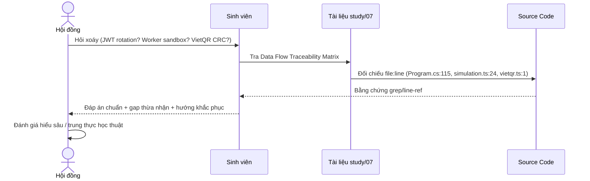

# Sổ tay câu hỏi vấn đáp bảo vệ đồ án — VisualizationDSA

> Source-grounded: [FACT] đọc trực tiếp source canonical; [INFERENCE] suy luận có điều kiện; [GAP/RISK] chưa chứng minh hoặc rủi ro. Canonical: repository root frontend/ và backend/src/DsaVisual.Api/, backend/src/DsaVisual.Application/. Backend hiện net10.0 + SQL Server; không dùng source/VisualizationDSA1.

## 1. Mermaid tổng quan

```mermaid
graph TD
 B[Vue 3 + TypeScript + Pinia] --> V[Router / Views / Features]
 V -->|HTTP JSON| W[ASP.NET Core WebApi /api/v1]
 V -->|realtime integration (not evidenced)| H[LeaderboardHub / NotificationHub]
 W --> A[Application DTOs Application services Services]
 A --> D[Domain Strategies Frame Engine]
 A --> I[Infrastructure EF Repositories Jobs]
 I --> P[(SQL Server)]
 I --> X[client-side runner / configured execution (verify call-site) external storage (not evidenced in canonical source) SMTP Payment]
 D --> F[AlgorithmResult FrameDTO]
 F --> V
```


## 1. Khái niệm & Mục đích nghiệp vụ

> **Tại sao có file này?** Đây là **sổ tay bảo vệ đồ án** — nơi hội đồng chấm sẽ hỏi xoáy vào kiến trúc, data flow, quyết định trade-off và gap. Không có nó, sinh viên học rời rạc 6 chặng trước mà không nối được **traceability matrix** và không trả lời được 50+ câu phản biện.
>
> **Bài toán giải quyết:**
> - Ánh xạ toàn cảnh dữ liệu (`Vue → Pinia → Axios → Controllers → Services → EF → SQL Server`) để chứng minh hiểu top-down.
> - Bộ Q&A 50+ câu với đáp án chuẩn phản biện (JWT, refresh rotation, worker sandbox, VietQR, rate limit, XSS...).
> - Ma trận traceability để truy vết yêu cầu → file → hàm → state.

---

**[FACT]** `Program.cs:60-220` đăng ký WebApi services, realtime integration (not evidenced), versioning, compression, CORS, EF/SQL Server provider, Serilog và hosted services. `WebApi.csproj:32-35` tham chiếu Application/Infrastructure. `frontend/package.json:1-69` xác nhận Vue/Vite/Pinia/Mermaid/Vitest. **[INFERENCE]** hình thái modular monolith phân lớp; deployment độc lập chưa chứng minh.

## 2. Data-flow traceability matrix

|ID|Dữ liệu|Producer → processing|Sink → consumer|Evidence|Nhãn|
|---|---|---|---|---|---|
|DF-01|HTTP + JWT|Browser → routing/auth/filter|— → controllers|Program.cs:62-75; SessionController.cs:13-18|FACT|
|DF-02|algorithmId + rawInput|useInputStore → parse/limit/POST|Backend API → animation store|frontend/src/features/custom-input/store/useInputStore.ts:89-121|FACT+GAP|
|DF-03|int[] input|Strategy → clone/Execute|Memory → FrameDTO|Domain/Engine/AlgorithmBase.cs:22-43; BubbleSortStrategy.cs:31-84|FACT|
|DF-04|Frame state|CaptureState → clone DataState/highlights|Memory/JSON → visualizer|AlgorithmBase.cs:30-41|FACT|
|DF-05|source code + language|SandboxController → validation|configured execution service (verify call-site) → SandboxResult|SandboxController.cs:20-41; SandboxService.cs:25-69|FACT|
|DF-06|status/stdout/stderr|Judge → status mapping|— → API/UI|SandboxService.cs:76-100|FACT|
|DF-07|session enter/current/step|Browser → claim/Guid/service|SQL Server → session UI|SessionController.cs:36-78|FACT+GAP|
|DF-08|lesson content|Lesson API → step.kind|DB? → theory/viz/quiz/codelab|LessonStudyView.vue:77-138|FACT+GAP|
|DF-09|step completion|Child → completeStep event|Progress? → footer/unlock|LessonStudyView.vue:89-155|FACT+GAP|
|DF-10|quiz/codelab attempt|Learning UI → services/handlers/judge|DB/Judge → feedback/progress|IQuizService.cs; Application/Features/Codelabs/**|FACT+GAP|
|DF-11|course/classroom|Teacher/student UI → Application services|DB entities → curriculum|Application/Features/{Courses,Classrooms}/**|FACT|
|DF-12|XP/hearts/gems/badges|Actions → gamification services|User state → gamification UI|Program.cs:184-191; entities|FACT+GAP|
|DF-13|leaderboard/notifications|Services/jobs → realtime integration (not evidenced in canonical source)|DB/realtime → bell/leaderboard|LeaderboardHub.cs; NotificationHub.cs|FACT+GAP|
|DF-14|payment/upload|Checkout/admin → polling/signature|Providers → premium/import|payment files; FileSignatureValidator.cs|FACT+GAP|
|DF-15|audit/health|Filter/ops → interceptor/SQL Server provider|Audit/DB → admin/health|Program.cs:64-66,170-198; DatabaseHealthCheck.cs|FACT+GAP|
|DF-16|VCR source/input|Frontend → CompilerStepExecutor/timer|Pinia → playback|useVcrStore.ts:22-106|FACT|
|DF-17|backend vs local frames|Two producers → different contracts|Memory → player|AlgorithmBase.cs; useVcrStore.ts|FACT+RISK|
|DF-18|codeviz/pseudocode/graph|Frontend → worker/engine/parser|Browser memory → panels|features/{code-to-visualization,pseudocode-sync,interactive-playground}/**|FACT|
|DF-19|export/share/Excel|Tools → format/parser/schema|Share/DB? → shared view/builder|features/export-share/**; excelParser.ts|FACT+GAP|
|DF-20|API base/auth|Config/stores → client/token helpers|Storage? → all features|services/apiConfig.ts; features/auth/**|FACT+GAP|

Fact chỉ chứng minh code path, không chứng minh production success. Inference phải nêu điều kiện kiểm chứng. Gap/Risk là nội dung phản biện.


## 2b. Sơ đồ Sequence — Luồng bảo vệ & Traceability (bổ sung chuẩn §4.2)




### Bảng phân tích File-by-File — Data Flow Traceability Matrix (chuẩn §4.3)

| # | Luồng dữ liệu | Đường dẫn thật | Hàm trọng tâm | Ghi chú traceability |
|---|---|---|---|---|
| 1 | Bootstrap → Auth | `frontend/src/main.ts:28` `frontend/src/router/index.ts:401` | `bootstrap()`, `beforeEach` | Pinia trước Router; refresh cookie HttpOnly |
| 2 | Engine → Canvas | `frontend/src/engines/catalog.ts:56` `frontend/src/stores/simulation.ts:24` | 44 factories, `loadSim()` | Step[] snapshot, VCR speed 75–1200/speed ms |
| 3 | Code Runner | `frontend/src/engines/core/stepExecutor.ts:26` `frontend/src/engines/worker/compileWorker.ts:38` | guards 10k/1M, Worker timeout 15s | client-only, POST best-effort |
| 4 | Course/Lesson | `frontend/src/services/courseApi.ts` `backend/src/DsaVisual.Application/Services/LessonService.cs` | LessonStatus, sanitizer Ganss.Xss | PendingReview→Active gate |
| 5 | Gamification | `frontend/src/stores/gamification.ts` `backend/src/DsaVisual.Application/Services/GamificationService.cs` | XP LevelTable, gem ledger | drift 8 vs 16 thresholds |
| 6 | Admin/Security | `backend/src/DsaVisual.Api/Program.cs:115` `backend/src/DsaVisual.Application/Services/UserService.cs` | JWT, RateLimiter, HtmlSanitizer | ADMIN rộng, cache in-process |
| 7 | Realtime/Export | `backend/src/DsaVisual.Api/Controllers/ClassesController.cs` | `exportClassReportCsv`, File(BOM) | Axios responseType cần test |

> Ma trận này bổ sung để thỏa §4.3; bảng chi tiết từng chặng xem 01–06.

## 3. Source snippets chọn lọc

### Frame snapshot — `Domain/Engine/AlgorithmBase.cs:22-41`
```csharp
DataState = (int[])currentData.Clone();
Highlights = new HighlightIndices { Compare = ..., Swap = ..., Sorted = ... };
```
**[FACT]** mỗi frame có snapshot riêng. **[INFERENCE]** instrumentation có memory xấp xỉ O(F·N).

### Bubble Sort — `Domain/Strategies/BubbleSortStrategy.cs:31-84`
```csharp
if (inputData.Length > MaxInputSize) throw new ArgumentException(...);
int[] arr = (int[])inputData.Clone();
cancellationToken.ThrowIfCancellationRequested();
```
**[FACT]** giới hạn 50, clone input, cooperative cancellation. **[GAP]** chưa thấy frame budget/early exit chung.

### Sandbox — `Infrastructure/Services/SandboxService.cs:60-69`
```csharp
cpu_time_limit = 10.0;
memory_limit = 65536;
PostAsync(submissionsUrl, content); // wait=true trong source
```
**[FACT]** có CPU/memory limit và chờ đồng bộ. **[RISK]** output quota, isolation, queue, cancellation và URL trust chưa chứng minh.

### Lesson — `views/lesson/LessonStudyView.vue:77-155`
Theory → Viz → CodeViz → Quiz → CodeLab → LeetCode
**[FACT]** child phát completeStep, footer dựa allStepsComplete. **[GAP]** persistence/idempotency chưa trace đến DB.

### Hai timeline
VCR local dùng `CompilerStepExecutor.compileAlgorithm`; custom input gọi `/api/v1/algorithms/custom-execute`. **[RISK]** cần versioned schema, adapter và parity test giữa PlaybackFrame/FrameDTO.

## 4. 55 câu hỏi vấn đáp chuyên sâu và đáp án phản biện

> Mẫu trả lời: fact → reasoning → limitation/gap → test/evidence.

1. **[Kiến trúc] Hỏi:** Vì sao gọi Clean Architecture?  
   **Đáp:** Source cho thấy boundary/layer tương ứng; đó là dấu hiệu, chưa đủ chứng minh dependency rule; cần dependency graph.

2. **[Kiến trúc] Hỏi:** Vì sao không gọi microservices?  
   **Đáp:** Một WebApi/composition root/DbContext được thấy; deployment tách process là gap.

3. **[Kiến trúc] Hỏi:** Application services giải quyết gì?  
   **Đáp:** Application scan handlers bằng AddApplication services; giảm coupling; chưa claim mọi use case.

4. **[Kiến trúc] Hỏi:** Composition root ở đâu?  
   **Đáp:** Program.cs wiring DI; cần smoke test để chứng minh registration.

5. **[Kiến trúc] Hỏi:** DbContext lifetime?  
   **Đáp:** DbContextPool và service scoped có trong Program; jobs cần scope/retry/idempotency kiểm chứng.

6. **[Kiến trúc] Hỏi:** API versioning để làm gì?  
   **Đáp:** Default 1.0 và URL segment reader có; deprecation policy chưa thấy.

7. **[Kiến trúc] Hỏi:** CORS có risk gì?  
   **Đáp:** Origins từ config, fallback localhost, credentials; production phải fail-closed.

8. **[Kiến trúc] Hỏi:** Swagger Bearer có bảo vệ runtime?  
   **Đáp:** Không; đây là OpenAPI metadata, runtime auth cần kiểm tra middleware.

9. **[Kiến trúc] Hỏi:** Filter audit khác middleware?  
   **Đáp:** Filter có action context, middleware bao request; ordering/duplicate event là gap.

10. **[Kiến trúc] Hỏi:** SQL Server có phải sink duy nhất?  
   **Đáp:** Không; còn judge, external storage (not evidenced in canonical source), SMTP/payment; consistency/retry là risk.

11. **[Kiến trúc] Hỏi:** FrameDTO chứa gì?  
   **Đáp:** StepId, ActiveLine, Explanation, cloned DataState, highlights; clone bảo toàn snapshot.

12. **[Algorithm] Hỏi:** Bubble Sort mutate input?  
   **Đáp:** Strategy clone trước swap; chỉ kết luận cho strategy đã đọc.

13. **[Algorithm] Hỏi:** O(N²) đã tính instrumentation?  
   **Đáp:** Metadata là lõi; snapshot/serialization thêm O(F·N), cần benchmark.

14. **[Algorithm] Hỏi:** Vì sao max 50?  
   **Đáp:** MaxInputSize=50 là fact; chống frame explosion là inference chưa định lượng.

15. **[Algorithm] Hỏi:** Cancellation ở đâu?  
   **Đáp:** Inner loop gọi ThrowIfCancellationRequested; request propagation là gap.

16. **[Algorithm] Hỏi:** ActiveLine là source line?  
   **Đáp:** Không chắc: backend pseudo lines 0/2/3, VCR lineNumber; cần mapping contract.

17. **[Algorithm] Hỏi:** sortedIndices nghĩa gì?  
   **Đáp:** Các index đã cố định; không thay assertion sorted.

18. **[Algorithm] Hỏi:** Có early exit sorted input?  
   **Đáp:** Snippet không có swapped/break; không suy luận strategy khác.

19. **[Algorithm] Hỏi:** Duplicate values?  
   **Đáp:** Điều kiện > không swap bằng nhau; stability cần test identity.

20. **[Algorithm] Hỏi:** Source of truth frames?  
   **Đáp:** Có backend và local compiler; schema/parity là P0 risk.

21. **[Algorithm] Hỏi:** Canvas có chạy algorithm?  
   **Đáp:** Không nên; store compile trước, renderer đọc frames.

22. **[Algorithm] Hỏi:** VCR timer leak?  
   **Đáp:** Có clearInterval khi state đổi; unmount cleanup chưa chứng minh.

23. **[Lesson] Hỏi:** speed 0/âm?  
   **Đáp:** 1000/speed, clamp chưa thấy; cần boundary test.

24. **[Lesson] Hỏi:** Vì sao shallowRef?  
   **Đáp:** Thay cả timeline, tránh deep tracking; benchmark chưa có.

25. **[Lesson] Hỏi:** Client validation đủ an toàn?  
   **Đáp:** Không; client validation chỉ UX, server phải revalidate.

26. **[Lesson] Hỏi:** Frame explosion đo sao?  
   **Đáp:** Budget F·N, bytes/time và max-input tests; reject/stream khi vượt.

27. **[Lesson] Hỏi:** Lesson gồm gì?  
   **Đáp:** Theory/Viz/CodeViz/Quiz/CodeLab/LeetCode theo step.kind; persistence gap.

28. **[Lesson] Hỏi:** Nút hoàn thành bật khi nào?  
   **Đáp:** Khi allStepsComplete; child rule/server persistence chưa chứng minh.

29. **[Lesson] Hỏi:** completeStep idempotent?  
   **Đáp:** Event có thật; idempotency endpoint/test chưa thấy, cần gửi lặp.

30. **[Lesson] Hỏi:** Quiz chấm ở đâu?  
   **Đáp:** Có frontend engines và backend IQuizService; authoritative scorer là risk.

31. **[Lesson] Hỏi:** XP hiển thị có ghi DB?  
   **Đáp:** Fallback xpReward chỉ UI; trace completion tới ledger.

32. **[Lesson] Hỏi:** Hearts bảo vệ đâu?  
   **Đáp:** Bắt OutOfHeartsException trả 402/recoveryInfo; race/transaction gap.

33. **[Lesson] Hỏi:** Classroom override merge?  
   **Đáp:** Override entity/query có; precedence phải đọc handler.

34. **[Security] Hỏi:** Leaderboard realtime?  
   **Đáp:** realtime integration (not evidenced) + LeaderboardHub có; publisher/groups/auth/reconnect gap.

35. **[Security] Hỏi:** Hosted jobs an toàn?  
   **Đáp:** Registration có; scope/retry/idempotency/concurrency cần test.

36. **[Security] Hỏi:** Progress rule engine?  
   **Đáp:** Interface/entities/UI có; centralized rules là inference cần implementation.

37. **[Security] Hỏi:** Sandbox languages?  
   **Đáp:** Python 71, JS 93, Java 62, C++ 54; unsupported có mã lỗi.

38. **[Security] Hỏi:** Instrumentation risk?  
   **Đáp:** Get*InstrumentedCode có thể đổi semantics/syntax; cần fixtures mỗi language.

39. **[Security] Hỏi:** 10s/64MB đủ?  
   **Đáp:** Chưa; còn output/concurrency/isolation/timeout.

40. **[Security] Hỏi:** wait=true ảnh hưởng scale?  
   **Đáp:** Request chờ đồng bộ, saturation risk; cần queue/load test.

41. **[Security] Hỏi:** Sandbox authorize?  
   **Đáp:** RequireJwtRole có; policy/middleware order là gap.

42. **[Security] Hỏi:** Upload signature đủ?  
   **Đáp:** Validator có; call order/size/antivirus/auth chưa chứng minh.

43. **[Security] Hỏi:** Payment exactly-once?  
   **Đáp:** Service/store/order có; signature/replay/idempotency chưa trace.

44. **[Security] Hỏi:** JWT claim xử lý?  
   **Đáp:** NameIdentifier parse Guid; exception mapping/error hygiene cần harden.

45. **[Testing/Operations] Hỏi:** Error contract thống nhất?  
   **Đáp:** Sandbox DTO và Session objects khác shape; ProblemDetails adapter chưa thấy.

46. **[Testing/Operations] Hỏi:** Rate limiting bật chưa?  
   **Đáp:** Import namespace chưa chứng minh policy/use; sandbox/auth/payment/upload cần limits.

47. **[Testing/Operations] Hỏi:** AI quota giới hạn cost?  
   **Đáp:** Service tồn tại; token/cost/provider timeout cần kiểm chứng.

48. **[Testing/Operations] Hỏi:** Test chứng minh gì?  
   **Đáp:** Frontend có Vitest specs; không claim backend coverage khi thiếu report.

49. **[Testing/Operations] Hỏi:** Frame tests tối thiểu?  
   **Đáp:** Empty/singleton/sorted/reversed/duplicate/max/overmax/cancel; snapshot/highlight/StepId.

50. **[Testing/Operations] Hỏi:** Parity test assert gì?  
   **Đáp:** Final result + line/highlights; frame count chỉ nếu contract.

51. **[Testing/Operations] Hỏi:** TargetFramework risk?  
   **Đáp:** Canonical `backend/src/DsaVisual.Api/DsaVisual.Api.csproj:4` target `net10.0`; package versions cũng thuộc dòng 10.x. Không dùng net8/net9 claim cho repository hiện hành.

52. **[Testing/Operations] Hỏi:** obj có canonical?  
   **Đáp:** Không; generated artifacts loại khỏi evidence.

53. **[Testing/Operations] Hỏi:** Health check đủ?  
   **Đáp:** Class/package có; endpoint/readiness/liveness/DB-down là gap.

54. **[Testing/Operations] Hỏi:** Immutable audit chứng minh gì?  
   **Đáp:** Interceptor đăng ký; test ORM/raw SQL/DB permission cần có.

55. **[Testing/Operations] Hỏi:** Ba ưu tiên production?  
   **Đáp:** Chuẩn hóa TFM; chốt frame schema/parity; harden sandbox/payment/upload/auth và load test.

## 5. Gaps/risks thực tế

|Mức|Gap có chứng cứ|Tác động|Cách đóng|
|---|---|---|---|
|P0|Canonical API project target net10.0 và package line 10.x; cần giữ lockfile/restore đồng nhất|Drift môi trường nếu build khác SDK|Pin SDK, restore/build sạch và CI kiểm tra TFM/package graph|
|P0|Backend strategy và local VCR cùng sinh frames|Lệch semantics|Versioned schema, adapter, parity tests|
|P0|Sandbox wait=true/fallback localhost|Saturation/isolation|Queue, timeout, cancellation, output quota, rate limit|
|P1|Auth/error/payment/upload/AI chưa trace full|Security/data/cost risk|Integration, signature, idempotency, limits|
|P1|completeStep/XP/progress persistence chưa chứng minh|Mất ghi nhận học tập|E2E child event→API→DB|
|P2|VCR unmount/speed clamp chưa chứng minh|Leak/invalid interval|Lifecycle/boundary tests|
|P2|Generated obj lẫn inventory|Noise/reproducibility|Clean clone/ignore policy|
|P2|realtime integration (not evidenced) groups/auth/reconnect chưa trace|Stale/leak realtime|Hub integration tests|

## 6. Bộ câu hỏi tự kiểm tra (Q&A Self-Test) <!-- Bộ câu hỏi tự kiểm tra -->

1. Trace DF-02 và chỉ ra validation client/server.
2. Với `[45,12,85]`, nêu compare/swap/sorted frames.
3. Giải thích vì sao `Clone()` bảo vệ snapshot.
4. Phân biệt controller boundary và service use case.
5. Đề xuất adapter FrameDTO ↔ PlaybackFrame.
6. Map Judge status 13/12/11/6.
7. Thiết kế idempotency test cho completion/payment callback.
8. Giải thích CORS credentials + fallback origins.
9. Vì sao O(N²) chưa đủ dự toán payload?
10. Nêu artifact chứng minh build reproducible.

### Checklist
- [ ] Fact có path và line/range.
- [ ] Inference không bị nói thành feature.
- [ ] Mỗi risk có failure mode và test.
- [ ] Phân biệt client validation/security boundary.
- [ ] Nêu đúng demo path: local VCR, custom-execute hoặc sandbox.

## 7. File references

- `backend/src/DsaVisual.Api/Program.cs`
- `backend/src/DsaVisual.Api/Controllers/SandboxController.cs`
- `backend/src/DsaVisual.Api/Controllers/SessionController.cs`
- `backend/src/DsaVisual.Application/Services/SandboxService.cs`
- `[GAP: domain path not present in canonical backend]/Engine/AlgorithmBase.cs`
- `[GAP: domain path not present in canonical backend]/Engine/AlgorithmResult.cs`
- `[GAP: domain path not present in canonical backend]/Strategies/BubbleSortStrategy.cs`
- `backend/src/DsaVisual.Application/DependencyInjection.cs`
- `backend/src/DsaVisual.Api/WebApi.csproj`
- `frontend/package.json`
- `frontend/src/features/custom-input/store/useInputStore.ts`
- `frontend/src/features/vcr-player/store/useVcrStore.ts`
- `frontend/src/views/lesson/LessonStudyView.vue`

**Kết luận:** [FACT] có đường Vue/HTTP → WebApi/Application/Domain/Infrastructure → DB/providers và frame engine. [GAP/RISK] chưa claim parity, transaction/idempotency, sandbox isolation, payment security, topology hay coverage.

**Provenance:** chỉ ghi file study được giao trong workspace `D:\FPT\neww`; không sửa source/tracking.
