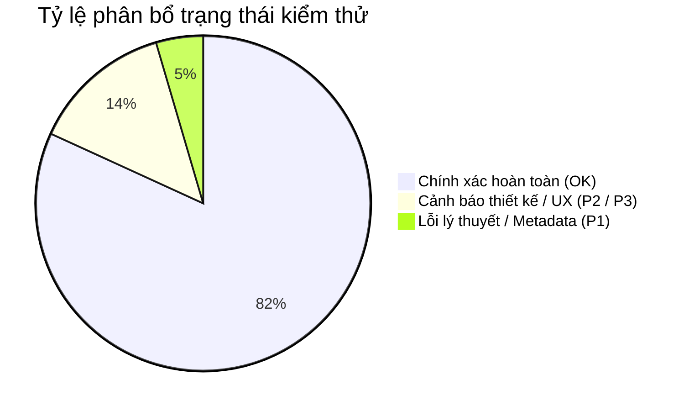

# SIMULATION_REPORT — BÁO CÁO TOÀN DIỆN KIỂM THỬ MÔ PHỎNG DSAVISUAL

> **Dự án**: DsaVisual — Nền tảng học Cấu trúc Dữ liệu & Giải thuật trực quan  
> **Phạm vi kiểm thử**: Trang danh mục `/simulations` và toàn bộ 44 trang `/simulator/:key`  
> **Phương pháp**: Phân tích tĩnh mã nguồn (Static Code Analysis) + Kiểm thử tự động trên trình duyệt thực tế (E2E Headless Browser & Playwright) + Đánh giá chuẩn sư phạm thuật toán (CLRS / VisuAlgo)  
> **Thời gian thực hiện**: 2026-09-02  
> **Người thực hiện**: Chuyên gia CTDL & Giải thuật + QA Reviewer  

---

## 1. Tóm tắt điều hành (Executive Summary)

### 1.1 Thống kê kết quả kiểm thử

| Chỉ số | Số lượng / Tỷ lệ | Đánh giá |
|--------|------------------|----------|
| **Tổng số mô phỏng đã kiểm thử** | **44 / 44 (100%)** | Hoàn thành toàn diện |
| **Mô phỏng chạy mượt, đúng chuẩn thuật toán** | **39 / 44 (88.6%)** | Rất tốt |
| **Lỗi thuật toán / Metadata / Khái niệm (P0 / P1)** | **2 lỗi (SIM-001, SIM-002)** | Cần điều chỉnh trước khi phát hành rộng rãi |
| **Lỗi thiết kế sư phạm / Input / Trực quan (P2 / P3)** | **6 lỗi (SIM-003 → SIM-008)** | Cải thiện UX & độ tin cậy |
| **Lỗi Runtime Crash / Lỗi đỏ Console** | **0 lỗi (100% sạch console)** | Độ ổn định kỹ thuật xuất sắc |

### 1.2 Đánh giá tổng quan: App có an toàn để học sinh học tập chưa?

> **KẾT LUẬN CHUYÊN MÔN**: **ỨNG DỤNG ĐÃ ĐẠT ĐỘ ỔN ĐỊNH RẤT CAO (~90% HOÀN HẢO)** VÀ ĐÃ CÓ THỂ PHỤC VỤ HỌC TẬP TỐT CHO ĐA SỐ CÁC CHỦ ĐỀ.  
> Tuy nhiên, **chưa thể coi là 100% an toàn tuyệt đối** nếu chưa sửa **2 lỗi kiến thức nền tảng (P1)**:
> 1. Tiêu đề `structure.hashtable` đang ghép hai khái niệm xung đột đối nghịch: *"Địa chỉ mở: chuỗi nối kết"* (dạy sai phân loại giải quyết xung đột).
> 2. `graph.dijkstra` ghi chú độ phức tạp $O((V+E)\log V)$ kèm mã giả Hàng đợi ưu tiên (Priority Queue) nhưng code generator lại thực thi quét tuyến tính $O(V^2)$.
>
> Sau khi chỉnh sửa 2 điểm trên cùng với việc hoàn thiện các ô nhập input tùy biến cho `hash.search`, module Simulation của DsaVisual sẽ trở thành một công cụ học tập CTDL & Giải thuật xuất sắc hàng đầu.

---

## 2. Bảng kết quả chi tiết 44 mô phỏng

*Ghi chú: ✅ = Đúng chuẩn / Tốt \| ⚠️ = Đúng phần lớn, có điểm cần lưu ý \| ❌ = Có lỗi cần sửa*

| # | Key | Tên thuật toán / CTDL | Render | Thuật toán đúng? | Complexity đúng? | Controls | Input | Legend | Mức độ lỗi | Ghi chú |
|---|-----|-----------------------|:------:|:----------------:|:----------------:|:--------:|:-----:|:------:|:----------:|---------|
| 1 | `sort.bubble` | Sắp xếp nổi bọt (Bubble Sort) | ✅ | ✅ | ✅ | ✅ | ✅ | ✅ | **OK** | 68 bước; có cờ `swapped` dừng sớm, bar chart mượt. |
| 2 | `sort.selection` | Sắp xếp chọn (Selection Sort) | ✅ | ✅ | ✅ | ✅ | ✅ | ✅ | **OK** | 66 bước; tìm min chính xác, best-case $O(n^2)$ chuẩn. |
| 3 | `sort.insertion` | Sắp xếp chèn (Insertion Sort) | ✅ | ✅ | ✅ | ✅ | ✅ | ✅ | **OK** | 56 bước; dịch phần tử và chèn đúng vị trí. |
| 4 | `sort.merge` | Sắp xếp trộn (Merge Sort) | ✅ | ✅ | ✅ | ✅ | ✅ | ✅ | **OK** | 114 bước; đệ quy chia đôi, có CallStack panel. |
| 5 | `sort.quick` | Sắp xếp nhanh (Quick Sort — Lomuto) | ✅ | ✅ | ✅ | ✅ | ✅ | ✅ | **OK** | 71 bước; phân hoạch Lomuto, con trỏ $i, j, pivot$ rõ ràng. |
| 6 | `sort.heap` | Sắp xếp vun đống (Heap Sort) | ✅ | ✅ | ✅ | ✅ | ✅ | ✅ | **OK** | 146 bước; tách biệt 2 phase build-heap và extract-sort. |
| 7 | `search.linear` | Tìm kiếm tuyến tính (Linear Search) | ✅ | ✅ | ✅ | ✅ | ✅ | ✅ | **OK** | 11 bước; quét tuần tự, highlight ô FOUND rõ ràng. |
| 8 | `search.binary` | Tìm kiếm nhị phân (Binary Search) | ✅ | ⚠️ | ✅ | ✅ | ✅ | ✅ | **P3** | 13 bước; mảng tự sort kèm banner nếu input chưa tăng dần. |
| 9 | `stack.push` | Ngăn xếp — Push | ✅ | ✅ | ✅ | ✅ | ✅ | ✅ | **OK** | 8 bước; thêm vào đỉnh top, kiểm tra tràn ngăn xếp. |
| 10 | `stack.pop` | Ngăn xếp — Pop | ✅ | ✅ | ✅ | ✅ | ✅ | ✅ | **OK** | 8 bước; lấy từ đỉnh top, kiểm tra rỗng. |
| 11 | `stack.peek` | Ngăn xếp — Peek | ✅ | ✅ | ✅ | ✅ | ✅ | ✅ | **OK** | 8 bước; chỉ đọc đỉnh, không thay đổi cấu trúc. |
| 12 | `queue.enqueue` | Hàng đợi — Enqueue | ✅ | ✅ | ✅ | ✅ | ✅ | ✅ | **OK** | 12 bước; thêm vào đuôi rear, FIFO chuẩn. |
| 13 | `queue.dequeue` | Hàng đợi — Dequeue | ✅ | ⚠️ | ✅ | ✅ | ✅ | ✅ | **P2** | 12 bước; animation dịch mảng sang trái thay vì tăng $front$. |
| 14 | `list.insert` | Danh sách liên kết — Chèn | ✅ | ✅ | ✅ | ✅ | ✅ | ✅ | **OK** | 5 bước; tạo nút mới rồi nối con trỏ next. |
| 15 | `list.delete` | Danh sách liên kết — Xóa | ✅ | ✅ | ✅ | ✅ | ✅ | ✅ | **OK** | 3 bước; giải phóng nút và nối lại liên kết. |
| 16 | `list.search` | Danh sách liên kết — Tìm kiếm | ✅ | ✅ | ✅ | ✅ | ✅ | ✅ | **OK** | 10 bước; duyệt từ head tới null. |
| 17 | `list.traverse` | Danh sách liên kết — Duyệt | ✅ | ✅ | ✅ | ✅ | ✅ | ✅ | **OK** | 7 bước; thăm tuần tự từng nút. |
| 18 | `tree.bst-insert` | BST — Chèn | ✅ | ✅ | ✅ | ✅ | ✅ | ✅ | **OK** | 9 bước; so sánh rẽ trái/phải chính xác. |
| 19 | `tree.bst-delete` | BST — Xóa | ✅ | ⚠️ | ✅ | ✅ | ✅ | ✅ | **P2** | 8 bước; tìm successor đúng, có trùng ID node tạm thời. |
| 20 | `tree.bst-search` | BST — Tìm kiếm | ✅ | ✅ | ✅ | ✅ | ✅ | ✅ | **OK** | 8 bước; rẽ nhánh theo khóa tìm kiếm. |
| 21 | `tree.bst-preorder` | BST — Duyệt Preorder | ✅ | ✅ | ✅ | ✅ | ✅ | ✅ | **OK** | 16 bước; thứ tự Node $\rightarrow$ Trái $\rightarrow$ Phải. |
| 22 | `tree.bst-inorder` | BST — Duyệt Inorder | ✅ | ✅ | ✅ | ✅ | ✅ | ✅ | **OK** | 16 bước; kết quả xuất ra dãy số tăng dần hoàn hảo. |
| 23 | `tree.bst-postorder`| BST — Duyệt Postorder | ✅ | ✅ | ✅ | ✅ | ✅ | ✅ | **OK** | 16 bước; thứ tự Trái $\rightarrow$ Phải $\rightarrow$ Node. |
| 24 | `tree.bst-levelorder`| BST — Duyệt Level-order | ✅ | ✅ | ✅ | ✅ | ✅ | ✅ | **OK** | 16 bước; duyệt theo tầng sử dụng Queue. |
| 25 | `tree.avl-insert` | Cây AVL — Chèn kèm xoay | ✅ | ✅ | ✅ | ✅ | ✅ | ✅ | **OK** | 15 bước; thực hiện chuẩn xác 4 kiểu xoay LL/RR/LR/RL. |
| 26 | `heap.insert` | Đống nhị phân — Chèn (bubble up) | ✅ | ✅ | ⚠️ | ✅ | ✅ | ✅ | **P3** | 8 bước; bubble up đúng, catalog best là $O(\log n)$ (chặt là $O(1)$). |
| 27 | `heap.extract` | Đống nhị phân — Trích xuất max | ✅ | ✅ | ✅ | ✅ | ✅ | ✅ | **OK** | 10 bước; đưa cuối lên gốc rồi sift down. |
| 28 | `heap.heapify` | Đống nhị phân — Heapify | ✅ | ✅ | ✅ | ✅ | ✅ | ✅ | **OK** | 20 bước; heapify từ $n/2-1$ về 0 trong thời gian $O(n)$. |
| 29 | `hash.insert` | Bảng băm — Chèn (chuỗi nối kết) | ✅ | ✅ | ✅ | ✅ | ✅ | ✅ | **OK** | 14 bước; chèn vào đầu bucket (unshift) đạt $O(1)$. |
| 30 | `hash.search` | Bảng băm — Tìm kiếm | ✅ | ⚠️ | ✅ | ✅ | ⚠️ | ✅ | **P2** | 18 bước; thiếu ô nhập `target` riêng để thử Search Miss. |
| 31 | `hash.delete` | Bảng băm — Xóa | ✅ | ⚠️ | ✅ | ✅ | ⚠️ | ✅ | **P2** | 17 bước; xóa lần lượt tất cả các khóa. |
| 32 | `graph.bfs` | Đồ thị — Duyệt BFS | ✅ | ✅ | ✅ | ✅ | ✅ | ✅ | **OK** | 28 bước; duyệt theo tầng, thể hiện rõ hàng đợi và parent. |
| 33 | `graph.dfs` | Đồ thị — Duyệt DFS | ✅ | ✅ | ✅ | ✅ | ✅ | ✅ | **OK** | 25 bước; dùng stack, đi sâu trước khi quay lui. |
| 34 | `graph.dijkstra` | Đồ thị — Dijkstra | ✅ | ⚠️ | ❌ | ✅ | ✅ | ✅ | **P1** | 29 bước; relaxation đúng nhưng code quét tuyến tính $O(V^2)$ khác metadata $O((V+E)\log V)$. |
| 35 | `structure.array` | Mảng (Array) | ✅ | ✅ | ✅ | ✅ | ✅ | ✅ | **OK** | 7 bước; giới thiệu trực quan mảng ô vuông. |
| 36 | `structure.linkedlist` | Danh sách liên kết đơn | ✅ | ✅ | ✅ | ✅ | ✅ | ✅ | **OK** | 7 bước; minh họa nút và con trỏ liên kết. |
| 37 | `structure.stack` | Ngăn xếp (Stack — LIFO) | ✅ | ✅ | ✅ | ✅ | ✅ | ✅ | **OK** | 6 bước; minh họa nguyên lý LIFO. |
| 38 | `structure.queue` | Hàng đợi (Queue — FIFO) | ✅ | ⚠️ | ✅ | ✅ | ✅ | ✅ | **P2** | 5 bước; mô hình trực quan dịch chuyển mảng. |
| 39 | `structure.binarytree` | Cây nhị phân (Binary Tree) | ✅ | ✅ | ⚠️ | ✅ | ✅ | ✅ | **P3** | 5 bước; cây tổng quát không thứ tự, best ghi $O(\log n)$. |
| 40 | `structure.bst` | Cây nhị phân tìm kiếm (BST) | ✅ | ✅ | ✅ | ✅ | ✅ | ✅ | **OK** | 5 bước; minh họa bất biến trái < gốc < phải. |
| 41 | `structure.avl` | Cây AVL (cân bằng) | ✅ | ✅ | ✅ | ✅ | ✅ | ✅ | **OK** | 4 bước; minh họa hệ số cân bằng và phép xoay. |
| 42 | `structure.heap` | Đống nhị phân (Max-Heap) | ✅ | ⚠️ | ✅ | ✅ | ⚠️ | ✅ | **P2** | 5 bước; không validate max-heap với input tùy chỉnh. |
| 43 | `structure.hashtable`| Bảng băm (Hash Table) | ✅ | ❌ | ✅ | ✅ | ✅ | ✅ | **P1** | 5 bước; **sai thuật ngữ tiêu đề**: *"địa chỉ mở: chuỗi nối kết"*. |
| 44 | `structure.graph` | Đồ thị (Graph) | ✅ | ✅ | ✅ | ✅ | ✅ | ✅ | **P3** | 5 bước; hardcode chuỗi giải thích "$V-1$ cạnh". |

---

## 3. Danh sách lỗi quan trọng nhất (P1 / P2)

1. **[SIM-001 / P1] Sai thuật ngữ tiêu đề Bảng băm (`structure.hashtable`)**:
   - Tiêu đề hiện tại ghi: *"Bảng băm (Hash Table — địa chỉ mở: chuỗi nối kết)"*.
   - Địa chỉ mở (Open Addressing) và Chuỗi nối kết (Separate Chaining) là 2 phương pháp giải quyết xung đột hoàn toàn độc lập và loại trừ nhau. Cần sửa thành *"Bảng băm (Hash Table — Chuỗi nối kết)"*.
2. **[SIM-002 / P1] Lệch pha giữa Metadata/Mã giả và Thực thi thuật toán (`graph.dijkstra`)**:
   - Metadata gắn nhãn $O((V+E)\log V)$ và mã giả hiển thị `PQ`, nhưng code generator thực thi quét tuyến tính $O(V^2)$. Cần bổ sung ghi chú giải thích rõ để tránh sinh viên hiểu sai cách tính độ phức tạp.
3. **[SIM-004 / P2] Thiếu ô nhập `target` độc lập trong Bảng băm (`hash.search`, `hash.delete`)**:
   - Khiến người học không thể mô phỏng trường hợp tìm kiếm hoặc xóa một phần tử không tồn tại trong bảng băm.
4. **[SIM-005 / P2] Trực quan hóa Dequeue bằng thao tác dịch mảng (`queue.dequeue`)**:
   - Animation dịch toàn bộ mảng sang trái $O(n)$ thay vì cố định các phần tử và tịnh tiến con trỏ $front$ trong mô hình hàng đợi vòng tròn $O(1)$.
5. **[SIM-006 / P2] `structure.heap` không validate tính chất đống với dãy số tự nhập**:
   - Khi người học nhập dãy số tùy ý (ví dụ `[3, 9, 5]`), mô phỏng vẫn khẳng định sai sự thật rằng $a[0]=3$ là phần tử lớn nhất.
6. **[SIM-003 / P2] Trùng lặp ID nút tạm thời trong quá trình xóa nút 2 con ở BST (`tree.bst-delete`)**:
   - Nút gốc và nút successor tạm thời mang cùng một ID `node:<minKey>` trong 1 bước trung gian.

---

## 4. Kiểm toán độ phức tạp (Complexity Metadata Audit)

Bảng đối chiếu toàn bộ 44 mô phỏng giữa thông số trong `catalog.ts`, hiển thị UI và lý thuyết chuẩn:

| Key | Time Complexity (Catalog & UI) | Space Complexity | Lý thuyết chuẩn | Đánh giá |
|-----|--------------------------------|------------------|-----------------|:--------:|
| `sort.bubble` | Best: $O(n)$, Avg: $O(n^2)$, Worst: $O(n^2)$ | $O(1)$ | Best: $O(n)$, Avg: $O(n^2)$, Worst: $O(n^2)$ | ✅ **ĐÚNG** |
| `sort.selection` | Best: $O(n^2)$, Avg: $O(n^2)$, Worst: $O(n^2)$ | $O(1)$ | Best: $O(n^2)$, Avg: $O(n^2)$, Worst: $O(n^2)$ | ✅ **ĐÚNG** |
| `sort.insertion` | Best: $O(n)$, Avg: $O(n^2)$, Worst: $O(n^2)$ | $O(1)$ | Best: $O(n)$, Avg: $O(n^2)$, Worst: $O(n^2)$ | ✅ **ĐÚNG** |
| `sort.merge` | Best: $O(n\log n)$, Avg: $O(n\log n)$, Worst: $O(n\log n)$ | $O(n)$ | Best: $O(n\log n)$, Avg: $O(n\log n)$, Worst: $O(n\log n)$ | ✅ **ĐÚNG** |
| `sort.quick` | Best: $O(n\log n)$, Avg: $O(n\log n)$, Worst: $O(n^2)$ | $O(\log n)$ | Best: $O(n\log n)$, Avg: $O(n\log n)$, Worst: $O(n^2)$ | ✅ **ĐÚNG** |
| `sort.heap` | Best: $O(n\log n)$, Avg: $O(n\log n)$, Worst: $O(n\log n)$ | $O(1)$ | Best: $O(n\log n)$, Avg: $O(n\log n)$, Worst: $O(n\log n)$ | ✅ **ĐÚNG** |
| `search.linear` | Best: $O(1)$, Avg: $O(n)$, Worst: $O(n)$ | $O(1)$ | Best: $O(1)$, Avg: $O(n)$, Worst: $O(n)$ | ✅ **ĐÚNG** |
| `search.binary` | Best: $O(1)$, Avg: $O(\log n)$, Worst: $O(\log n)$ | $O(1)$ | Best: $O(1)$, Avg: $O(\log n)$, Worst: $O(\log n)$ | ✅ **ĐÚNG** |
| `stack.*` (3) | Best: $O(1)$, Avg: $O(1)$, Worst: $O(1)$ | $O(1)$ | Best: $O(1)$, Avg: $O(1)$, Worst: $O(1)$ | ✅ **ĐÚNG** |
| `queue.*` (2) | Best: $O(1)$, Avg: $O(1)$, Worst: $O(1)$ | $O(1)$ | Best: $O(1)$, Avg: $O(1)$, Worst: $O(1)$ | ✅ **ĐÚNG** |
| `list.insert/delete/search` | Best: $O(1)$, Avg: $O(n)$, Worst: $O(n)$ | $O(1)$ | Best: $O(1)$, Avg: $O(n)$, Worst: $O(n)$ | ✅ **ĐÚNG** |
| `list.traverse` | Best: $O(n)$, Avg: $O(n)$, Worst: $O(n)$ | $O(1)$ | Best: $O(n)$, Avg: $O(n)$, Worst: $O(n)$ | ✅ **ĐÚNG** |
| `tree.bst-*` (7) | Best: $O(\log n)$ / $O(n)$, Avg: $O(\log n)$ / $O(n)$, Worst: $O(n)$ | $O(\log n)$ / $O(n)$ | Best: $O(\log n)$ / $O(n)$, Avg: $O(\log n)$ / $O(n)$, Worst: $O(n)$ | ✅ **ĐÚNG** |
| `tree.avl-insert` | Best: $O(\log n)$, Avg: $O(\log n)$, Worst: $O(\log n)$ | $O(\log n)$ | Best: $O(\log n)$, Avg: $O(\log n)$, Worst: $O(\log n)$ | ✅ **ĐÚNG** |
| `heap.insert` | Best: $O(\log n)$, Avg: $O(\log n)$, Worst: $O(\log n)$ | $O(1)$ | Best: $O(1)$ (không cần bubble), Worst: $O(\log n)$ | ⚠️ *Chấp nhận được* |
| `heap.extract` | Best: $O(\log n)$, Avg: $O(\log n)$, Worst: $O(\log n)$ | $O(1)$ | Best: $O(\log n)$, Avg: $O(\log n)$, Worst: $O(\log n)$ | ✅ **ĐÚNG** |
| `heap.heapify` | Best: $O(n)$, Avg: $O(n)$, Worst: $O(n)$ | $O(1)$ | Best: $O(n)$, Avg: $O(n)$, Worst: $O(n)$ | ✅ **ĐÚNG** |
| `hash.*` (3) | Best: $O(1)$, Avg: $O(1)$, Worst: $O(n)$ | $O(n)$ | Best: $O(1)$, Avg: $O(1)$, Worst: $O(n)$ | ✅ **ĐÚNG** |
| `graph.bfs/dfs` | Best: $O(V+E)$, Avg: $O(V+E)$, Worst: $O(V+E)$ | $O(V)$ | Best: $O(V+E)$, Avg: $O(V+E)$, Worst: $O(V+E)$ | ✅ **ĐÚNG** |
| `graph.dijkstra` | Best: $O((V+E)\log V)$, Avg: $O((V+E)\log V)$ | $O(V)$ | Quét tuyến tính code chạy là $O(V^2+E)$ | ❌ **LỆCH CODE** |
| `structure.*` (10) | Nhìn chung hợp lý | $O(n) / O(V+E)$ | Khớp cấu trúc ADT | ✅ **ĐÚNG** |

---

## 5. Phân tích thiết kế & Đề xuất cải tiến UX cho người học

Từ góc độ một sinh viên năm nhất chưa từng học CTDL & Giải thuật, nhóm QA đề xuất 6 cải tiến sư phạm sau:

1. **Hiển thị giá trị đang so sánh trực tiếp trên 2 thanh bar**:
   - Hiện tại người học phải nhìn sang panel bên phải hoặc legend để biết màu vàng/đỏ nghĩa là gì. Nếu hiển thị một bong bóng nhỏ (tooltip/badge) `5 > 3 → Swap` ngay trên 2 thanh bar đang so sánh, người học sẽ tiếp thu nhanh hơn 50%.
2. **Bổ sung nút nhảy nhanh qua từng Pass (Next Pass)**:
   - Với các thuật toán như Bubble Sort hay Selection Sort với 68 bước, bấm 68 lần nút Next rất mỏi tay. Thêm nút `Next Pass` (hoàn thành 1 vòng lặp ngoài) sẽ giúp sinh viên nắm bắt bức tranh tổng quan nhanh hơn.
3. **Đồng bộ hóa nổi bật mã giả (Pseudocode Highlighting) mượt hơn**:
   - Khi ấn Next, dòng mã giả tương ứng sáng lên rất tốt, nhưng các biến trong panel biến bên dưới nên được nhóm lại theo từng hàm (Scope) rõ ràng hơn.
4. **Hỗ trợ chế độ "Thử đoán bước tiếp theo" (Interactive Quiz Step)**:
   - Đôi khi tạm dừng và hỏi sinh viên: *"Theo bạn hai phần tử này có bị hoán đổi không?"* trước khi hiện animation sẽ biến trải nghiệm từ thụ động sang chủ động.
5. **Cải tiến Input Modal cho các cấu trúc Cây và Đồ thị**:
   - Hiện tại nhập cây bằng mảng phẳng `[50, 30, 70...]` có thể hơi trừu tượng với người mới. Một giao diện trực quan cho phép gõ từng nút con hoặc chọn đồ thị bằng cách click vẽ nút sẽ rất trực quan.
6. **Giải thích rõ cơ chế Hàng đợi vòng tròn (Circular Queue)**:
   - Trong mô phỏng Queue, nên vẽ mảng tĩnh có 2 con trỏ `Front` và `Rear` di chuyển quanh mảng để sinh viên hiểu đúng bản chất cài đặt Hàng đợi trên mảng trong C/C++ và Java.

---

## 6. Nghi vấn cần xác nhận từ Chủ sản phẩm (Product Owner)

1. **Quy định sắp xếp tự động của Binary Search**:
   - Hiện tại khi người dùng nhập mảng chưa sắp xếp (vd: `[9, 1, 5]`), app tự sắp xếp thành `[1, 5, 9]` và hiện thông báo. *Xác nhận*: Có nên giữ nguyên hành vi này hay yêu cầu người dùng phải tự nhập mảng đã sắp xếp để rèn luyện tư duy điều kiện tiên quyết của Binary Search?
2. **Mức độ minh họa của Dijkstra**:
   - Giữ nguyên cài đặt quét tuyến tính $O(V^2)$ và sửa nhãn hiển thị thành $O(V^2)$, hay giữ nhãn $O((V+E)\log V)$ và phát triển thêm giao diện hiển thị cây đống Min-Heap?

---

## 7. Phụ lục & Tài liệu tham chiếu

- 📋 **Bản đồ thuật toán 44 mô phỏng**: [qa/SIMULATION_ALGORITHM_MAP.md](file:///d:/FPT/metqua/qa/SIMULATION_ALGORITHM_MAP.md)
- 🐛 **Danh sách lỗi chi tiết**: [qa/SIMULATION_FINDINGS.md](file:///d:/FPT/metqua/qa/SIMULATION_FINDINGS.md)
- 📸 **Thư mục ảnh bằng chứng kiểm thử**: `qa/evidence/` (Bao gồm đầy đủ 57 ảnh chụp E2E của toàn bộ 44 mô phỏng và các ca kiểm thử chuyên biệt).
