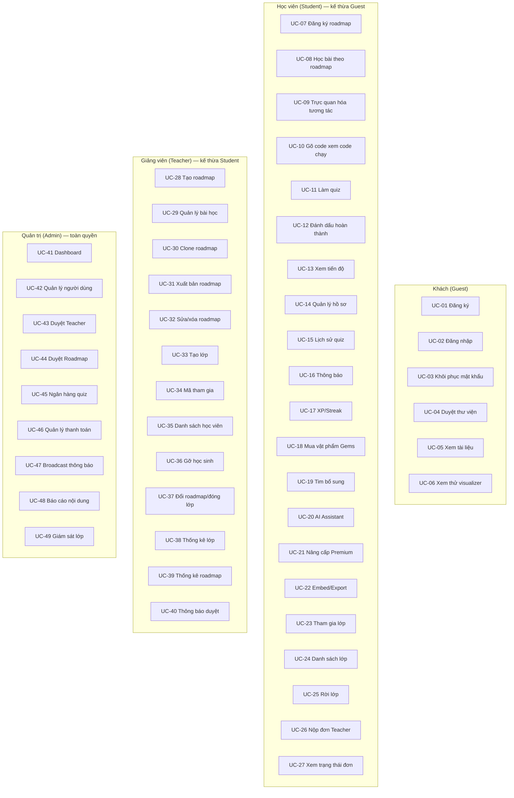
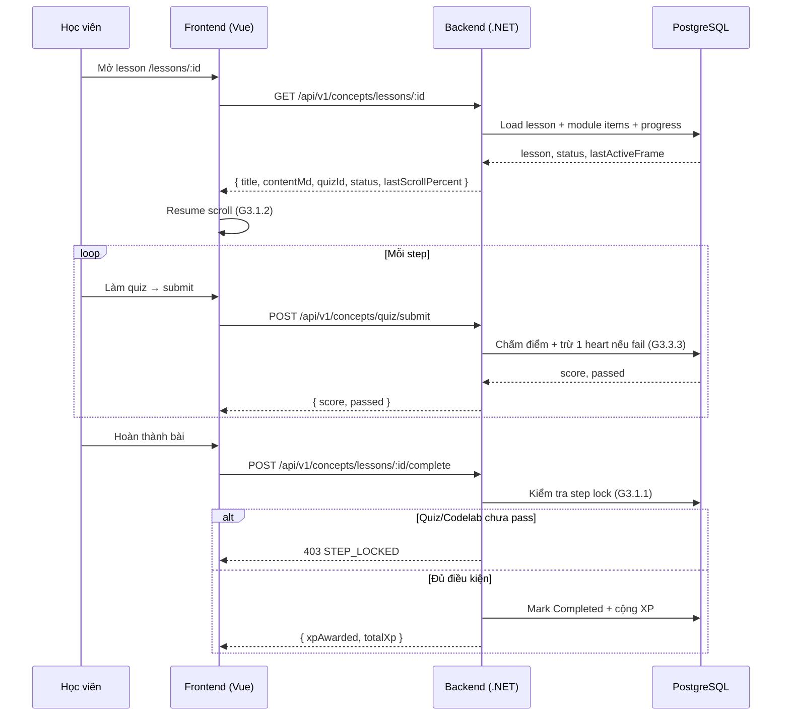
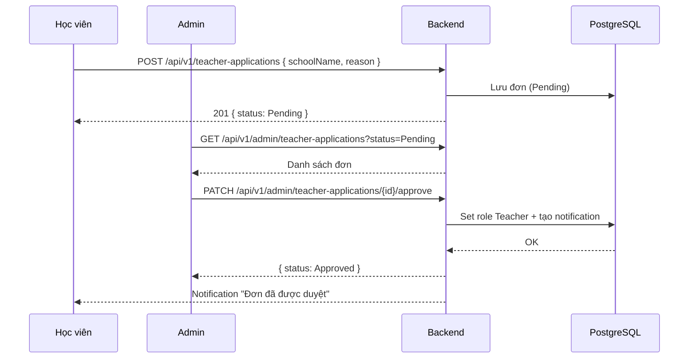
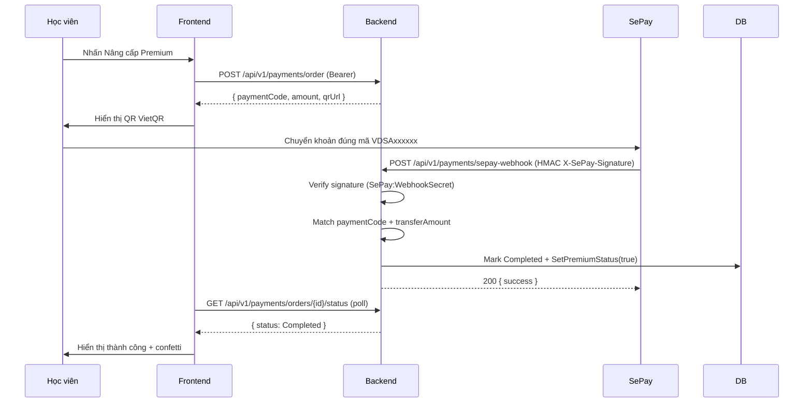
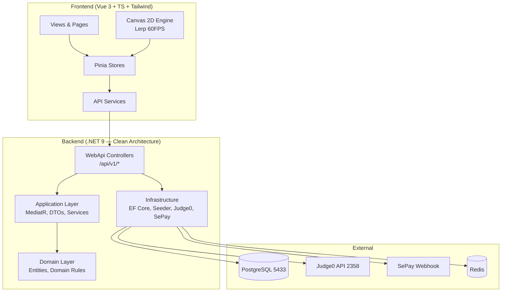

# 📊 SƠ ĐỒ ĐỒ ÁN — VisualizationDSA (G4.4.1/4.4.2/4.4.3)

> **Ngày:** 2026-08-06 · **Mermaid syntax** — dán vào https://mermaid.live để xem render.

---

## 1. Use Case Diagram (49 UC — theo use-cases.md)

---

## 2. Sequence Diagram — Học bài theo roadmap (UC-08/UC-11/UC-12)

---

## 3. Sequence Diagram — Duyệt Teacher (UC-43)

---

## 4. Sequence Diagram — Thanh toán SePay (UC-21)

---

## 5. Architecture Diagram (Clean Architecture)

---

## 6. Công nghệ & Cổng

| Thành phần | Công nghệ | Cổng |
|---|---|---|
| Frontend | Vue 3, Vite, Pinia, Tailwind | 5173 |
| Backend | .NET 9, Clean Architecture, MediatR, EF Core | 5055 |
| Database | PostgreSQL 15 | 5433 |
| Judge0 | Judge0 CE 1.13 | 2358 |
| Redis | Redis 6 | 6379 |
