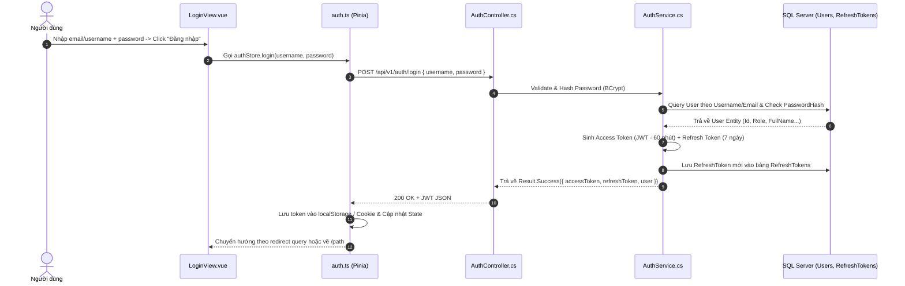

# 🔐 PHÂN HỆ 1: KHÁCH & XÁC THỰC (PUBLIC & AUTH FLOW)

Phân hệ này quản lý toàn bộ quá trình tiếp cận của người dùng từ khi vào trang chủ, đăng ký, nhận OTP qua email, đăng nhập lấy JWT Token, khôi phục mật khẩu và luồng chờ duyệt cho Giảng viên.

---

## 1. MÀN HÌNH 01: TRANG CHỦ CÔNG KHAI (HOME VIEW)

* **URL**: `/`
* **File Vue**: [`HomeView.vue`](file:///d:/FPT/metqua/frontend/src/views/HomeView.vue)
* **Quyền truy cập**: Mọi người (Public)

### Mắt thấy gì trên giao diện?
1. **Hero Section**: Tiêu đề "Nền tảng trực quan hóa CTDL & Giải thuật", nút CTA "Bắt đầu học ngay" (dẫn tới `/path`), nút "Khám phá thuật toán" (dẫn tới `/simulations`).
2. **Mini Algorithm Showcase**: Một Canvas chạy mô phỏng mini tự động (Bubble Sort / Binary Search / BFS) lấy trực tiếp từ `src/engines/catalog.ts`.
3. **Thống kê nền tảng**: Số lượng thuật toán (44+), số bài học, số sinh viên tham gia.
4. **Các tính năng nổi bật**: Interactive Simulator, Code Runner, Codelab, Gamification.

### Luồng tương tác (User Actions):
* Bấm **"Bắt đầu học ngay"** → Nếu chưa đăng nhập: Điều hướng tới `/path` (xem danh sách lộ trình).
* Bấm **"Chạy thử mô phỏng"** → Kích hoạt Canvas mini đổi bước trực tiếp trên trang chủ.

---

## 2. MÀN HÌNH 02: ĐĂNG NHẬP (LOGIN VIEW)

* **URL**: `/login`
* **File Vue**: [`LoginView.vue`](file:///d:/FPT/metqua/frontend/src/views/LoginView.vue)
* **Quyền truy cập**: Chỉ khách chưa đăng nhập (`guestOnly: true`). Đã đăng nhập tự chuyển về `/home`.

### Mắt thấy gì trên giao diện?
* Form gồm 2 ô nhập: `Tên đăng nhập hoặc Email` và `Mật khẩu`.
* Nút "Ghi nhớ đăng nhập" (Remember me).
* Link "Quên mật khẩu?" dẫn sang `/forgot-password`.
* Nút "Đăng nhập" (Sign In) và link chuyển sang `/register`.

### Luồng xử lý từ UI đến Database:

---

## 3. MÀN HÌNH 02b: ĐĂNG KÝ & XÁC THỰC OTP (REGISTER VIEW)

* **URL**: `/register`
* **File Vue**: [`RegisterView.vue`](file:///d:/FPT/metqua/frontend/src/views/RegisterView.vue)
* **Quyền truy cập**: Chỉ khách (`guestOnly: true`).

### Quy trình 2 bước (Two-step Registration):
1. **Bước 1 (Điền thông tin)**:
   * Họ và tên, Tên đăng nhập, Email, Mật khẩu, Chọn vai trò mong muốn (`STUDENT` hoặc `TEACHER`).
   * Bấm "Tiếp tục" → Hệ thống gọi `POST /api/v1/auth/register-request-otp`.
   * Backend sinh mã OTP 6 số ngẫu nhiên, lưu vào bảng `RegisterOtpCodes` (hết hạn trong 10 phút) và gửi email qua **MailHog** (port 1025).
2. **Bước 2 (Xác thực OTP)**:
   * Giao diện hiện ô nhập 6 ô số OTP và đồng hồ đếm ngược.
   * Người dùng nhập OTP → Gọi `POST /api/v1/auth/register-verify-otp`.
   * Backend kiểm tra mã:
     * Nếu chọn vai trò `STUDENT`: Tạo tài khoản với Role = `STUDENT`, tự động đăng nhập.
     * Nếu chọn vai trò `TEACHER`: Tạo tài khoản với Role = `TEACHER_PENDING`, điều hướng sang màn `/pending-teacher`.

---

## 4. MÀN HÌNH N-2 & N-2b: QUÊN VÀ ĐẶT LẠI MẬT KHẨU (FORGOT & RESET PASSWORD)

* **URL**: `/forgot-password` và `/reset-password`
* **File Vue**: [`ForgotPasswordView.vue`](file:///d:/FPT/metqua/frontend/src/views/ForgotPasswordView.vue) & [`ResetPasswordView.vue`](file:///d:/FPT/metqua/frontend/src/views/ResetPasswordView.vue)

### Luồng xử lý:
1. Người dùng nhập Email tại `/forgot-password` → Gọi `POST /api/v1/auth/forgot-password`.
2. Backend kiểm tra Email tồn tại $\rightarrow$ Lưu `OtpCode` $\rightarrow$ Gửi mã xác nhận qua email.
3. Người dùng chuyển sang `/reset-password` nhập `Email + OTP + Mật khẩu mới` $\rightarrow$ Gọi `POST /api/v1/auth/reset-password`.
4. Backend xác thực OTP hợp lệ $\rightarrow$ Mã hóa BCrypt mật khẩu mới $\rightarrow$ Vô hiệu hóa toàn bộ Refresh Token cũ $\rightarrow$ Yêu cầu đăng nhập lại.

---

## 5. MÀN HÌNH CHỜ DUYỆT GIẢNG VIÊN (PENDING TEACHER VIEW)

* **URL**: `/pending-teacher`
* **File Vue**: [`PendingTeacherView.vue`](file:///d:/FPT/metqua/frontend/src/views/PendingTeacherView.vue)
* **Quyền truy cập**: Tài khoản có Role = `TEACHER_PENDING`.

### Mắt thấy gì trên giao diện?
* Thông báo thân thiện: "Hồ sơ đăng ký Giảng viên của bạn đang được Ban Quản Trị xét duyệt".
* Trạng thái hồ sơ (Đang xử lý).
* Nút "Trải nghiệm với tư cách Học viên" (cho phép học các lộ trình thông thường trong khi chờ duyệt).
* Nút "Đăng xuất".

### Cơ chế chặn quyền (Route Guard trong `router/index.ts`):
* Nếu tài khoản có Role `TEACHER_PENDING` cố tình truy cập vào `/studio`, `/teacher` hoặc `/admin/*` $\rightarrow$ Router Guard tự động bắt lại và chuyển hướng về `/pending-teacher`.
