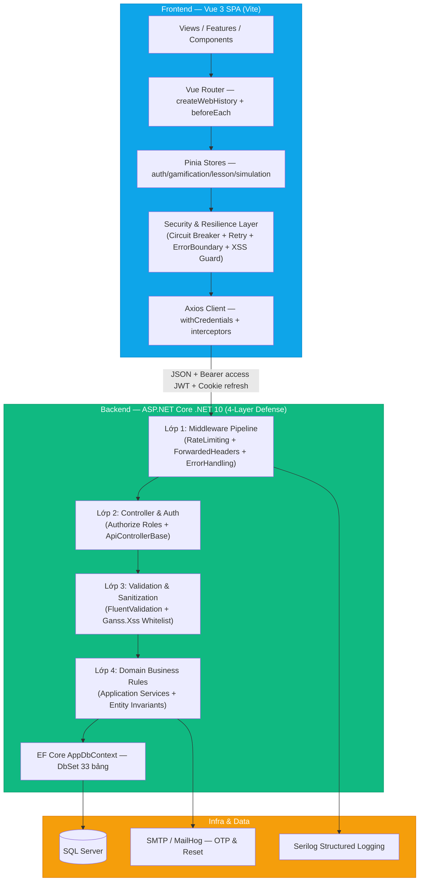
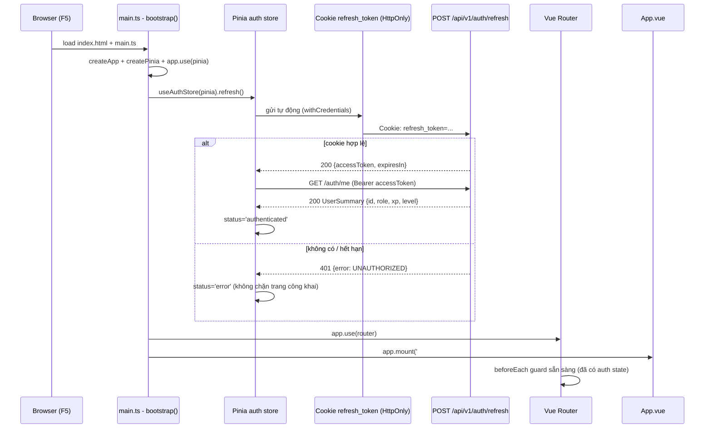
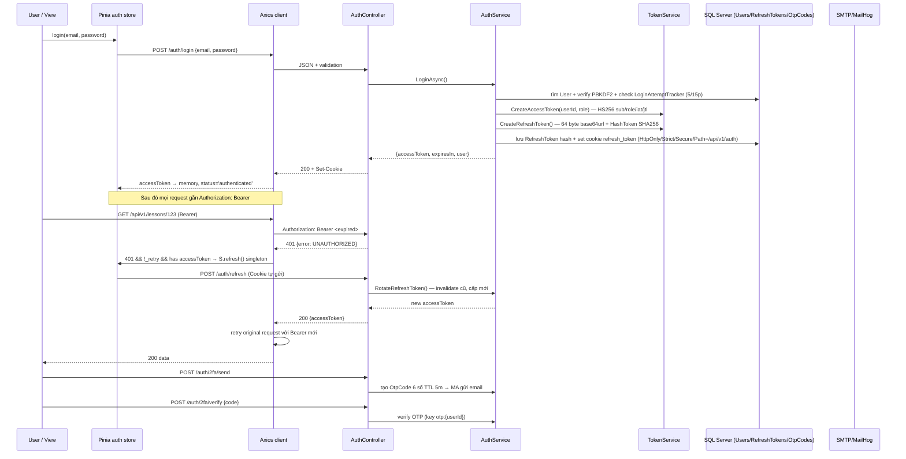
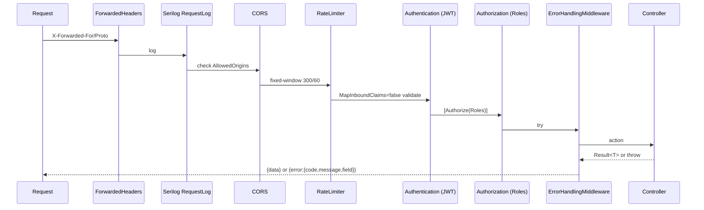
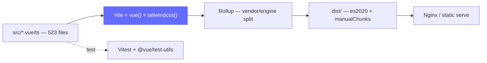

# Chặng 1 — Kiến trúc tổng thể và hạ tầng

> **Đối tượng:** Người học muốn nắm vững top-down toàn bộ hệ thống để bảo vệ đồ án và giảng lại cho người khác.
> **Stack thực tế (đối chiếu source):** Frontend Vue 3 + TypeScript + Vite + Pinia + Vue Router + Axios + Tailwind; Backend ASP.NET Core .NET 10 (net10.0) + EF Core + SQL Server + JWT HS256 + Serilog + Ganss.Xss + RateLimiting. Xem `backend/src/DsaVisual.Api/DsaVisual.Api.csproj:4` (`<TargetFramework>net10.0</TargetFramework>`), `Program.cs:155-157` (`UseSqlServer`).
> **Quy ước trích dẫn:** `file:line` là snapshot khảo sát; API_REFERENCE/SDD § là tài liệu chuẩn nội bộ.

---

## 1. Khái niệm & Mục đích nghiệp vụ

### 1.1 Tại sao có chặng này?

Nếu không hiểu **hệ thống phân tầng thế nào và một request đi từ browser tới DB ra sao**, mọi chặng sau (engine, gamification, admin) sẽ rời rạc. Chặng 1 trả lời 3 câu hỏi nền tảng mà hội đồng luôn hỏi đầu tiên:

1. **Clean Architecture BE vs SPA FE khác nhau ra sao?** BE chia `DsaVisual.Api` (composition root — Controllers/Middlewares/DI) và `DsaVisual.Application` (DTO/Validators/Services/Entities/EF Model). FE là Single Page App: một lần tải `index.html`, mọi điều hướng do `vue-router` xử lý, state tập trung trong Pinia.
2. **App khởi chạy thế nào sau khi F5?** Access token chỉ nằm trong memory Pinia → F5 mất. Phải khôi phục phiên bằng refresh cookie HttpOnly **trước khi** router guard chạy (ADR-004, bug P1 #1).
3. **Auth là security boundary hay chỉ là UX?** FE guard chỉ là UX; boundary duy nhất là backend `[Authorize]` + JWT validation. Refresh token rotate + HttpOnly + SameSite mới là phòng tuyến thật.

### 1.2 Bài toán nghiệp vụ chặng 1 giải quyết

- **Phân tầng & tách trách nhiệm:** Controller mỏng (chỉ map request→service), Service chứa nghiệp vụ + EF DbContext trực tiếp (không Repository — SDD §5.1 quyết định A-1), Configuration Fluent API tách riêng (SDD §5.3.6).
- **Luồng khởi chạy xác định:** `main.ts:bootstrap()` → Pinia → `auth.refresh()` → `fetchMe()` → mount router. Backend `Program.cs:CreateBuilder` → JWT → CORS → EF → DI → middleware pipeline.
- **Auth đa lớp:** JWT Bearer (access), Refresh cookie (HttpOnly/Strict/Secure), 2FA email OTP (GP-T2), PasswordResetToken, LoginAttemptTracker khóa tạm 5/15p, Role (STUDENT/TEACHER/TEACHER_PENDING/ADMIN).

### 1.3 Kết quả học xong chặng này bạn làm được gì

- Vẽ được kiến trúc FE↔BE↔DB và trace 1 request login end-to-end.
- Phân biệt được guard FE vs policy BE, giải thích tại sao `MapInboundClaims=false` là bug fix production.
- Trả lời được 15 câu Q&A §5 và tự tin giảng lại cho người mới.

---

## 2. Sơ đồ Mermaid trực quan

### 2.1 Kiến trúc phân tầng (Architecture)



**Đọc sơ đồ:** 
- **FE Resilience & Security Layer (`frontend/src/features/security-and-resilience/`):** Đóng vai trò phòng vệ chủ động ngay trên Client:
  1. *Xử lý chập chờn mạng (Network Flakiness):* Cơ chế retry tự động với Exponential Backoff khi gặp lỗi mạng tạm thời hoặc 503 Service Unavailable.
  2. *Circuit Breaker:* Tạm ngắt các request lặp vô ích khi phát hiện Backend gặp sự cố hoặc timeout kéo dài, bảo vệ giao diện không bị treo/đơ (unresponsive).
  3. *Global Error Boundary:* Bắt toàn bộ unhandled exceptions của Vue component, hiển thị fallback UI trang nhã thay vì màn hình trắng (White Screen of Death).
  4. *Client-side XSS Guard:* Kiểm tra tính hợp lệ của Markdown/HTML trước khi render lên DOM.
- **Backend 4-Layer Defense-in-Depth:**
  1. *Lớp 1 (Edge/Middleware):* RateLimiting fixed-window chống DDoS/Brute-force + ForwardedHeaders chuẩn hóa IP.
  2. *Lớp 2 (Transport/Auth):* JWT authentication (`MapInboundClaims=false`) + Authorize phân quyền theo Role (ADMIN/TEACHER/STUDENT).
  3. *Lớp 3 (Input Defense):* FluentValidation tự động trả về Error Envelope 400 + `Ganss.Xss` HtmlSanitizer whitelist 13 tags an toàn.
  4. *Lớp 4 (Data/Domain):* Domain invariant checks trong Services + EF Core transactional consistency & SQL Server database constraints.

### 2.2 Luồng khởi chạy Frontend (Bootstrap)



**Điểm then chốt (SDD §3.4, ADR-004):** Pinia phải tạo **trước** router, và `refresh()` phải chạy **trước** `app.use(router)`. Nếu đảo ngược, guard đọc `isAuthenticated=false` sai và đá user về /login oan.

### 2.3 Luồng Auth — Login / 401 Retry / 2FA



---


### 2.4 ER diagram — AppDbContext 33 bảng (bổ sung full)

```mermaid
erDiagram
    User ||--o{ RefreshToken : "1-n"
    User ||--o{ PasswordResetToken : "1-n"
    User ||--o{ OtpCode : "1-n"
    User ||--o{ UserProgress : "1-n"
    User ||--o{ ExerciseSubmission : "1-n"
    User ||--o{ LessonNote : "1-n"
    User ||--o{ ClassMember : "1-n"
    User ||--o{ GemTransaction : "ledger"
    User ||--o{ UserQuest : "progress"
    User ||--o{ UserInventory : "owns"
    User ||--o{ CodeRun : "traces"
    Topic ||--o{ Lesson : "1-n"
    Lesson ||--o{ LessonSimulation : "1-n"
    Lesson ||--o{ LessonNote : "1-n"
    Exercise ||--o{ Question : "1-n"
    Exercise ||--o{ ExerciseSubmission : "1-n"
    Class ||--o{ ClassMember : "1-n"
    Class ||--o{ ClassAssignment : "1-n"
    Class ||--o{ ClassCurriculum : "1-n"
    ShopItem ||--o{ UserInventory : "item"
    Quest ||--o{ UserQuest : "quest"
    PremiumOrder ||--|| User : "buyer"
```

## 3. Bảng phân tích File-by-File

| # | Đường dẫn thật | Hàm / Class trọng tâm | State / Quyết định |
|---|---|---|---|
| 1 | `frontend/src/main.ts:28-49` | `bootstrap()`, `createApp`, `useAuthStore.refresh/fetchMe` | Pinia trước Router; token chỉ memory; refresh trước mount |
| 2 | `frontend/src/App.vue:1-144` | `AppHeader/Footer`, `useLenis`, `startCosmicField`, `SANDBOX_ROUTES` | Singleton Lenis, sandbox full viewport ẩn footer |
| 3 | `frontend/src/router/index.ts:1-424` | `createRouter(createWebHistory)`, `beforeEach` | requiresAuth/roles/guestOnly; lazy-load admin/code/benchmark |
| 4 | `frontend/src/api/client.ts:41-157` | `client` Axios, `ApiError`, interceptors request/response | withCredentials, 401 _retry singleton, 429 Retry-After |
| 5 | `frontend/src/api/auth.ts:8-98` | `AUTH_ENDPOINTS`, `login/register/refresh/logout/fetchMe`, `UserRole` | Refresh POST không body, cookie HttpOnly |
| 6 | `frontend/src/stores/auth.ts:14-136` | `useAuthStore`, `login/logout/refresh/fetchMe`, `isAuthenticated/role` | accessToken memory + refreshPromise singleton + logout reset 7 stores |
| 7 | `frontend/src/stores/ui.ts` | `useUiStore` (toast, loading) | Dùng trong client interceptor 429/5xx |
| 8 | `frontend/src/i18n/vi.ts` | `messages.toast.*` | Chuẩn hóa lỗi 429/5xx/network |
| 9 | `backend/src/DsaVisual.Api/DsaVisual.Api.csproj:4` | `<TargetFramework>net10.0</TargetFramework>` | Bằng chứng .NET 10, khác prompt cũ .NET 8 |
| 10 | `backend/src/DsaVisual.Api/Program.cs:29-403` | `CreateBuilder`, `AddJwtBearer`, `AddCors`, `AddDbContext`, middleware | JWT MapInboundClaims=false, CORS frontend, Serilog, ForwardedHeaders |
| 11 | `backend/src/DsaVisual.Api/Controllers/AuthController.cs:1-209` | `Login/Register/Refresh/2FA/Send/Verify` | Mỏng, delegate AuthService, cookie Path=/api/v1/auth |
| 12 | `backend/src/DsaVisual.Api/Controllers/ApiControllerBase.cs` | Base controller, envelope lỗi | Chuẩn hóa {error:{code,message,field}} §2.1 |
| 13 | `backend/src/DsaVisual.Api/Middlewares/*` | `ErrorHandlingMiddleware`, `RequestLogging` | Không log token/password |
| 14 | `backend/src/DsaVisual.Api/Dtos/ErrorDetailDto.cs` | `ErrorResponseDto` | Envelope lỗi thống nhất |
| 15 | `backend/src/DsaVisual.Application/Persistence/AppDbContext.cs:6-57` | `AppDbContext`, 33 `DbSet<>`, `ApplyConfigurationsFromAssembly` | Không Repository, DbSet trực tiếp (SDD §5.1) |
| 16 | `backend/src/DsaVisual.Application/Persistence/Entities/*` | `User`, `RefreshToken`, `OtpCode`, `PasswordResetToken` | 33 bảng: 25 lõi + 8 gamification/code |
| 17 | `backend/src/DsaVisual.Application/Services/TokenService.cs:22-60` | `CreateAccessToken/CreateRefreshToken/HashToken` | HS256 sub/role/iat/jti, 64 byte base64url, SHA256 hash |
| 18 | `backend/src/DsaVisual.Application/Services/AuthService.cs:1-948` | `LoginAsync/RegisterAsync/RotateRefreshToken/VerifyOtp` | PBKDF2 100k + salt 16, khóa 5/15p, replay thu hồi chuỗi |
| 19 | `backend/src/DsaVisual.Application/Services/SettingsCache.cs` | `SettingsCache` singleton | Cache settings, multi-instance stale risk |
| 20 | `backend/src/DsaVisual.Application/Validators/*` | `LoginValidator`, `RegisterValidator`, ... (FluentValidation) | Invalid → 400 với ErrorDetail |
| 21 | `backend/src/DsaVisual.Application/Common/ErrorCodes.cs` | `ErrorCodes.UNAUTHORIZED/FORBIDDEN/VALIDATION_FAILED` | Mã lỗi chuẩn envelope |
| 22 | `backend/src/DsaVisual.Api/appsettings.json` | `DSA:Jwt:Secret/Ir/Issuer/Audience/AccessTokenMinutes` | Secret ≥32 chars, ClockSkew 1m |

---

| 23 | `frontend/src/App.vue:1-144` | `AppHeader/Footer, SANDBOX_ROUTES, useLenis, startCosmicField` | Singleton Lenis + sandbox full viewport ẩn footer |
| 24 | `frontend/src/shared/components/BaseIcon.vue:1-80` | `BaseIcon (svg sprite sorting/stack/search...)` | Global component, dùng trong sandbox |
| 25 | `frontend/src/composables/useLenis.ts:1-50` | `useLenis() singleton Lenis 1.3.26 autoRaf` | Smooth scroll toàn cục, respectReducedMotion |
| 26 | `frontend/src/composables/useCosmicField.ts` | `startCosmicField(canvas)` | Nền sao vũ trụ, chạy trong App.vue |
| 27 | `frontend/src/styles/tokens.css:1-155` | CSS biến --color-* legacy | Phase 1a G tokens → tailwind |
| 28 | `frontend/src/styles/tailwind.css:1-302` | `@import tailwindcss + @theme OKLCH` | Theme shadcn OKLCH |
| 29 | `frontend/src/styles/palettes.css:1-77` | 3 gradient OKLCH Aurora/Sunset/Cyber Mint | G-F2a |
| 30 | `frontend/src/styles/vdsa-theme.css:1-79` | Theme bổ sung | Brand |
| 31 | `frontend/src/styles/global.css:1-272` | reset/base/component class unlayered | Thắng preflight |
| 32 | `frontend/src/styles/sandbox-theme.css:1-235` | `.sandbox-theme` scoped | Chỉ 3 trang sandbox |
| 33 | `frontend/src/i18n/vi.ts:1-120` | `messages.toast.*` | Chuẩn hóa lỗi 429/5xx |
| 34 | `frontend/src/stores/ui.ts:1-60` | `useUiStore toast/loading` | Dùng trong client 429 |
| 35 | `backend/src/DsaVisual.Api/appsettings.json:1-40` | `DSA:Jwt/Cors/Auth/RateLimit/Proxy/Premium/Email` | Secret rỗng ở repo, override env |
| 36 | `backend/src/DsaVisual.Api/appsettings.Development.json` | Dev overrides | SmtpHost MailHog 1025 |
| 37 | `backend/src/DsaVisual.Api/Controllers/ApiControllerBase.cs:1-60` | `CurrentUserId()/CurrentRole() + MapResult` | Đọc JWT sub/role, NRE→401 |
| 38 | `backend/src/DsaVisual.Api/Controllers/MeController.cs:1-100` | `GET /me + PUT /me + notes/badges` | API_REFERENCE §4.12 |
| 39 | `backend/src/DsaVisual.Api/Controllers/PublicController.cs` | Public catalog, POST simulation run đã cắt | Chạy client (SDD §4.5) |
| 40 | `backend/src/DsaVisual.Api/Controllers/SettingsController.cs` | GET/PUT settings | Cache SettingsCache |
| 41 | `backend/src/DsaVisual.Application/Common/Result.cs:1-60` | `Result<T> Ok/Fail + FieldErrors` | SDD §5.7.3, không ném exception |
| 42 | `backend/src/DsaVisual.Application/Common/ErrorCodes.cs:1-80` | `VALIDATION_FAILED/WEAK_PASSWORD/...` | Khớp API_REFERENCE §2.2 |
| 43 | `backend/src/DsaVisual.Application/Persistence/Entities/User.cs:1-40` | `User {Email/PasswordHash/Role/IsPrimaryAdmin/Hearts}` | SDD §7.3.1 + gamification |


## 4. Code Snippets cốt lõi & Chú giải chi tiết

### 4.1 Bootstrap — khôi phục phiên trước khi guard chạy

```ts
// frontend/src/main.ts:28-49
async function bootstrap(): Promise<void> {
  const app = createApp(App);
  const pinia = createPinia();
  app.use(pinia);

  app.component('BaseIcon', BaseIcon);

  const auth = useAuthStore(pinia);
  try {
    const token = await auth.refresh();
    if (token) {
      await auth.fetchMe();
    }
  } catch {
    // refresh/fetchMe lỗi → giữ 'error'; guard lo phần còn lại
  }

  app.use(router);
  app.mount('#app');
}
void bootstrap();
```

| Dòng | Ý nghĩa | Tại sao viết vậy |
|---|---|---|
| `createPinia()` trước `useAuthStore` | Tạo container state trước khi dùng | Router guard đọc Pinia → phải có trước |
| `auth.refresh()` trước `app.use(router)` | Khôi phục access token từ cookie HttpOnly | Token chỉ memory → F5 mất; không refresh trước thì guard đá về /login oan (bug P1 #1) |
| `if(token) await fetchMe()` | Lấy UserSummary để role guard và header | Chỉ khi refresh thành công mới có token; fetchMe cần Bearer |
| `catch {}` nuốt lỗi | Không chặn user tới trang công khai | Trang / hoặc /login không cần auth; status='error' là đủ |
| `app.use(router)` sau cùng | Mount router khi auth state đã ổn định | Đảm bảo beforeEach đọc đúng isAuthenticated/role |

### 4.2 Router Guard — UX guard, không phải security boundary

```ts
// frontend/src/router/index.ts:401-422
router.beforeEach((to) => {
  const auth = useAuthStore();

  if (to.meta.requiresAuth && !auth.isAuthenticated) {
    return { name: 'login', query: { redirect: to.fullPath } };
  }

  const requiredRoles = to.matched.flatMap((record) => record.meta.roles ?? []);
  if (requiredRoles.length > 0 && (auth.role === null || !requiredRoles.includes(auth.role))) {
    return auth.isAuthenticated ? { name: 'profile' } : { name: 'login' };
  }

  if (to.meta.guestOnly && auth.isAuthenticated) {
    return { name: 'home' };
  }

  return true;
});
```

| Dòng | Ý nghĩa | Tại sao |
|---|---|---|
| `to.meta.requiresAuth` | Route cần đăng nhập | FE chặn sớm, giảm request 401 vô ích |
| `requiredRoles` từ `to.matched` | Gom roles từ mọi record lồng nhau | Admin layout có children; phải flatMap |
| `!requiredRoles.includes(auth.role)` | TEACHER không vào admin/** | Nhưng backend mới là gate thật (`[Authorize(Roles="ADMIN")]`) |
| `guestOnly → home` | Đã login thì không ở lại /login | Tránh vòng lặp login→login |
| `return {name:'login', query:{redirect}}` | Lưu đích để sau login quay lại | UX mượt, không mất ngữ cảnh |

> **Hội đồng sẽ hỏi:** "FE guard có bypass được không?" → **Có, chỉ cần tắt JS hoặc gọi API trực tiếp.** Security boundary duy nhất là backend `[Authorize]` + JWT validation ở `Program.cs:116-152`.

### 4.3 Axios Client — 401 singleton retry + chống redirect storm

```ts
// frontend/src/api/client.ts:49-130 (rút gọn, giữ logic then chốt)
export const client = axios.create({
  baseURL: BASE_URL,          // VITE_API_BASE_URL ?? '/api/v1'
  timeout: 15000,
  headers: { 'Content-Type': 'application/json' },
  withCredentials: true,      // gửi Cookie refresh_token
});

declare module 'axios' {
  export interface InternalAxiosRequestConfig { _retry?: boolean; }
}

client.interceptors.request.use((config) => {
  const auth = useAuthStore();
  if (auth.accessToken) config.headers.Authorization = `Bearer ${auth.accessToken}`;
  return config;
});

let redirectedToLogin = false;
window.addEventListener('beforeunload', () => { redirectedToLogin = false; });

client.interceptors.response.use(
  (response) => response,
  async (error) => {
    const original = error.config as InternalAxiosRequestConfig & { _retry?: boolean } | undefined;
    const status = error.response?.status ?? 0;
    const auth = useAuthStore();
    if (status === 401 && original && !original._retry && !original.url?.includes('/auth/')) {
      original._retry = true;
      if (auth.accessToken) {
        const newToken = await auth.refresh();          // singleton promise
        if (newToken) {
          original.headers.Authorization = `Bearer ${newToken}`;
          return client(original as AxiosRequestConfig); // retry 1 lần
        }
        await auth.logout();
        const onAuthPage = ['/login', '/register'].includes(window.location.pathname);
        if (!redirectedToLogin && !onAuthPage) {
          redirectedToLogin = true;
          window.location.assign(`/login?redirect=${encodeURIComponent(window.location.pathname)}`);
        }
      }
      return Promise.reject(toApiError(error));
    }
    if (status === 429) { /* toast Retry-After */ }
    return Promise.reject(toApiError(error));
  }
);
```

| Dòng | Ý nghĩa | Tại sao |
|---|---|---|
| `withCredentials:true` | Gửi cookie cross-origin | Refresh cookie HttpOnly cần kèm mọi request /auth/refresh |
| `_retry` | Chỉ retry 1 lần | Tránh loop 401→refresh→401→... |
| `!url.includes('/auth/')` | Không retry chính request /auth/* | Refresh tự nó 401 thì không retry, tránh đệ quy |
| `auth.accessToken` check | Chỉ retry khi đã từng login | Chưa login thì 401 là đúng, không cần refresh |
| `auth.refresh()` singleton | Nhiều request 401 song song chỉ gọi 1 lần | Xem §4.4 — tránh 5 request cùng refresh |
| `redirectedToLogin` | Chỉ redirect 1 lần | 5 request cùng fail → không storm 5 lần assign |
| `onAuthPage` | Đã ở /login thì không redirect | Tránh `/login?redirect=/login?redirect=...` (blocker 16/08) |

### 4.4 Pinia Auth — singleton refresh + logout reset 7 stores

```ts
// frontend/src/stores/auth.ts:14-136 (trích then chốt)
export const useAuthStore = defineStore('auth', () => {
  const user = ref<UserSummary | null>(null);
  const accessToken = ref<string | null>(null);
  const status = ref<AuthStatus>('idle');
  let refreshPromise: Promise<string | null> | null = null;

  const isAuthenticated = computed(() => status.value === 'authenticated' && accessToken.value !== null);
  const role = computed(() => user.value?.role ?? null);

  async function refresh(): Promise<string | null> {
    if (refreshPromise) return refreshPromise;
    refreshPromise = authApi.refresh()
      .then((response) => {
        accessToken.value = response.accessToken;
        status.value = 'authenticated';
        return response.accessToken;
      })
      .catch(() => {
        accessToken.value = null; user.value = null; status.value = 'error';
        return null;
      })
      .finally(() => { refreshPromise = null; });
    return refreshPromise;
  }

  async function logout(): Promise<void> {
    try { await authApi.logout(); } catch {}
    finally {
      accessToken.value = null; user.value = null; status.value = 'idle';
      try { (await import('./gamification')).useGamificationStore().reset(); } catch {}
      try { (await import('./progress')).useProgressStore().reset(); } catch {}
      try { (await import('./lesson')).useLessonStore().reset(); } catch {}
      try { (await import('./classStore')).useClassStore().reset(); } catch {}
      try { (await import('./leaderboard')).useLeaderboardStore().reset(); } catch {}
      try { (await import('./codeRunner')).useCodeRunnerStore().reset(); } catch {}
      try { (await import('./simulation')).useSimulationStore().resetAll(); } catch {}
    }
  }
});
```

| Dòng | Ý nghĩa | Tại sao |
|---|---|---|
| `refreshPromise` singleton | Cache promise đang chạy | 5 request 401 cùng lúc → 1 POST /refresh, 4 request đợi chung |
| `.finally(() => refreshPromise=null)` | Xóa cache sau khi xong | Lần 401 sau lại được refresh mới |
| `isAuthenticated = status+token` | Cả hai phải có | Tránh status='authenticated' nhưng token null (race) |
| `logout() reset 7 stores` | Xóa state cá nhân | Không để user B thấy gamification/progress của user A |
| `try {api.logout()} catch {}` | Best-effort gọi API | Dù /logout fail vẫn xóa local state |

### 4.5 Backend JWT — MapInboundClaims=false là bug fix production

```csharp
// backend/src/DsaVisual.Api/Program.cs:115-152 (rút gọn)
builder.Services.AddAuthentication(JwtBearerDefaults.AuthenticationScheme)
    .AddJwtBearer(options =>
    {
        options.MapInboundClaims = false; // FIX: giữ claim "sub" đúng JWT
        options.TokenValidationParameters = new TokenValidationParameters
        {
            ValidateIssuer = true,
            ValidateAudience = true,
            ValidateLifetime = true,
            ValidateIssuerSigningKey = true,
            ValidIssuer = builder.Configuration["DSA:Jwt:Issuer"],
            ValidAudience = builder.Configuration["DSA:Jwt:Audience"],
            IssuerSigningKey = new SymmetricSecurityKey(Encoding.UTF8.GetBytes(jwtSecret)),
            ClockSkew = TimeSpan.FromMinutes(1),
            RoleClaimType = ClaimTypes.Role
        };
        options.Events = new JwtBearerEvents
        {
            OnChallenge = context => {
                context.HandleResponse();
                return WriteErrorEnvelopeAsync(context.Response, 401, ErrorCodes.UNAUTHORIZED, "Chưa xác thực");
            },
            OnForbidden = context =>
                WriteErrorEnvelopeAsync(context.Response, 403, ErrorCodes.FORBIDDEN, "Không có quyền")
        };
    });
builder.Services.AddAuthorization();
```

| Dòng | Ý nghĩa | Tại sao là bug fix |
|---|---|---|
| `MapInboundClaims=false` | Giữ claim `sub` như JWT gốc | Default true map `sub`→`ClaimTypes.NameIdentifier` (URI dài) → `User.FindFirst(JwtRegisteredClaimNames.Sub)` trả null → 500 mọi endpoint [Authorize] |
| `ValidateIssuer/Audience/Lifetime/SigningKey` | 4 validate bắt buộc | Thiếu cái nào cũng cho token giả/expired lọt |
| `ClockSkew=1m` | Dung sai lệch đồng hồ | Client/server lệch <1m vẫn chấp nhận, tránh 401 oan |
| `RoleClaimType=ClaimTypes.Role` | Role claim là URI dài | TokenService ghi `ClaimTypes.Role` → phải khớp, dù MapInboundClaims=false |
| `OnChallenge/OnForbidden` envelope | Trả {error:{code,message}} thay vì rỗng | Chuẩn API_REFERENCE §2.1, FE parse thống nhất |

### 4.6 TokenService — HS256 + 64 byte refresh + SHA256 hash

```csharp
// backend/src/DsaVisual.Application/Services/TokenService.cs:22-60
public sealed class TokenService(IConfiguration config) : ITokenService
{
    private readonly SymmetricSecurityKey _key =
        new(Encoding.UTF8.GetBytes(config["DSA:Jwt:Secret"] ?? string.Empty));

    public (string Token, DateTime ExpiresAt) CreateAccessToken(int userId, string role)
    {
        var now = DateTime.UtcNow;
        var expiresAt = now.AddMinutes(config.GetValue("DSA:Jwt:AccessTokenMinutes", 60));
        var claims = new[] {
            new Claim(JwtRegisteredClaimNames.Sub, userId.ToString()),
            new Claim(ClaimTypes.Role, role),
            new Claim(JwtRegisteredClaimNames.Iat, new DateTimeOffset(now).ToUnixTimeSeconds().ToString(), ClaimValueTypes.Integer64),
            new Claim(JwtRegisteredClaimNames.Jti, Guid.NewGuid().ToString("N"))
        };
        var token = new JwtSecurityToken(
            issuer: config["DSA:Jwt:Issuer"],
            audience: config["DSA:Jwt:Audience"],
            claims: claims, notBefore: now, expires: expiresAt,
            signingCredentials: new SigningCredentials(_key, SecurityAlgorithms.HmacSha256));
        return (new JwtSecurityTokenHandler().WriteToken(token), expiresAt);
    }

    public string CreateRefreshToken() =>
        Convert.ToBase64String(RandomNumberGenerator.GetBytes(64))
            .TrimEnd('=').Replace('+', '-').Replace('/', '_');

    public string HashToken(string token) {
        var bytes = SHA256.HashData(Encoding.UTF8.GetBytes(token));
        return Convert.ToBase64String(bytes);
    }
}
```

| Dòng | Ý nghĩa | Tại sao |
|---|---|---|
| `SymmetricSecurityKey` từ `DSA:Jwt:Secret` | HS256 đối xứng | Đơn giản, không cần RSA; secret phải ≥32 chars |
| `sub=userId` | Định danh user | Mọi service đọc `FindFirst("sub")` để biết ai đang gọi |
| `role` | Phân quyền | `[Authorize(Roles="ADMIN")]` đọc claim này |
| `jti=Guid` | Token id duy nhất | Dùng cho trace/replay detection nếu cần |
| `64 byte base64url` refresh | Entropy cao | Không đoán được; base64url để an toàn cookie/URL |
| `HashToken SHA256` | Chỉ lưu hash trong DB | DB leak không lộ refresh thật; verify bằng hash lại |

### 4.7 AppDbContext — 33 DbSet, không Repository

```csharp
// backend/src/DsaVisual.Application/Persistence/AppDbContext.cs:6-57 (trích)
public sealed class AppDbContext(DbContextOptions<AppDbContext> options) : DbContext(options)
{
    public DbSet<User> Users => Set<User>();
    public DbSet<RefreshToken> RefreshTokens => Set<RefreshToken>();
    public DbSet<PasswordResetToken> PasswordResetTokens => Set<PasswordResetToken>();
    public DbSet<OtpCode> OtpCodes => Set<OtpCode>();
    public DbSet<Lesson> Lessons => Set<Lesson>();
    public DbSet<Exercise> Exercises => Set<Exercise>();
    public DbSet<UserProgress> UserProgress => Set<UserProgress>();
    // ... 33 bảng
    protected override void OnModelCreating(ModelBuilder b) {
        b.ApplyConfigurationsFromAssembly(typeof(AppDbContext).Assembly);
    }
}
```

| Dòng | Ý nghĩa | Tại sao |
|---|---|---|
| `DbSet 33 bảng` | Đủ SDD §7 (25 lõi + 8 gamification/code) | Single source of truth schema |
| `ApplyConfigurationsFromAssembly` | Fluent API tách Configurations/ | Không attribute trên entity → sạch domain |
| Không Repository | Service query `DbSet` trực tiếp | Giảm lớp trừu tượng không cần thiết (SDD §5.1 A-1) |

---


### 4.8 App.vue — SANDBOX_ROUTES + Lenis + CosmicField

```ts
// frontend/src/App.vue:1-50 (rút gọn)
import AppHeader from '@/components/layout/AppHeader.vue';
import AppFooter from '@/components/layout/AppFooter.vue';
import { startCosmicField } from '@/composables/useCosmicField';
import { useLenis } from '@/composables/useLenis';

const SANDBOX_ROUTES = ['sorting-sandbox', 'searching-sandbox', 'graph-playground', 'stack-queue-sandbox'];
const isSandbox = computed(() => SANDBOX_ROUTES.includes(route.name as string));

onMounted(() => { useLenis(); startCosmicField(); });
```

| Dòng | Ý nghĩa | Tại sao |
|---|---|---|
| `SANDBOX_ROUTES` | 4 route sandbox full viewport | Ẩn footer, main h-full w-full như VisualizationDSA3 |
| `useLenis()` | Singleton Lenis 1.3.26 autoRaf | Smooth scroll toàn cục, allowNestedScroll, respectReducedMotion |
| `startCosmicField()` | Nền sao vũ trụ | Brand, chạy 1 lần trong App.vue |

### 4.9 appsettings.json — DSA:Jwt + ConnectionStrings

```json
// backend/src/DsaVisual.Api/appsettings.json:1-35 (rút gọn)
{
  "DSA": {
    "Jwt": { "Secret": "", "Issuer": "DsaVisual.Api", "Audience": "DsaVisual.Frontend", "AccessTokenMinutes": 60, "RefreshTokenDays": 7 },
    "Cors": { "AllowedOrigins": [] },
    "Auth": { "MaxLoginAttempts": 5, "LockoutMinutes": 15 },
    "RateLimit": { "General": { "PermitLimit": 300 }, "Sensitive": { "PermitLimit": 60 }, "WindowSeconds": 60 },
    "Email": { "SmtpHost": "", "SmtpPort": 1025, "From": "" }
  },
  "ConnectionStrings": { "Default": "Server=localhost;Database=DsaVisual;User Id=sa;Password=CHANGEME" }
}
```

| Dòng | Ý nghĩa | Tại sao |
|---|---|---|
| `"Secret": ""` | Rỗng ở repo | Override bằng env/secret manager production, tránh lộ |
| `"AccessTokenMinutes": 60` | TTL access | 60m cân bằng UX vs bảo mật |
| `"SmtpPort": 1025` | MailHog dev | Không gửi thật ở dev |
| `"PermitLimit": 300/60` | RateLimit 2 tier | General 300/m, Sensitive 60/m |

### 4.10 Result pattern — Service không ném exception

```csharp
// backend/src/DsaVisual.Application/Common/Result.cs:1-40 (rút gọn)
public record Result<T>
{
    public bool IsSuccess { get; init; }
    public T? Value { get; init; }
    public string? ErrorCode { get; init; }
    public string? ErrorMessage { get; init; }
    public Dictionary<string, string[]>? FieldErrors { get; init; }
    public static Result<T> Ok(T value) => new() { IsSuccess = true, Value = value };
    public static Result<T> Fail(string code, string message) => new() { ErrorCode = code, ErrorMessage = message };
}
```

| Dòng | Ý nghĩa | Tại sao |
|---|---|---|
| `record Result<T>` | Envelope kết quả | Controller map qua MapResult → {error:{code,message,field}} §2.1 |
| `IsSuccess` | Phân nhánh | Không ném exception cho lỗi nghiệp vụ (SDD §5.7.3) |
| `FieldErrors` | Lỗi per-field | FluentValidation → 400 với chi tiết |

### 4.11 User entity — 33 bảng SDD §7

```csharp
// backend/src/DsaVisual.Application/Persistence/Entities/User.cs:1-30 (rút gọn)
public sealed class User
{
    public int Id { get; set; }
    public string Email { get; set; } = string.Empty; // UNIQUE lowercase
    public string PasswordHash { get; set; } = string.Empty;
    public string DisplayName { get; set; } = string.Empty;
    public UserRole Role { get; set; } = UserRole.Student;
    public bool IsPrimaryAdmin { get; set; }
    public int Hearts { get; set; } = 10;
    public int HeartsMax { get; set; } = 10;
}
```

| Dòng | Ý nghĩa | Tại sao |
|---|---|---|
| `Email UNIQUE lowercase` | Định danh | Login case-insensitive |
| `PasswordHash` | PBKDF2 hash | Không lưu plaintext (AuthService) |
| `IsPrimaryAdmin` | Cờ primary | Chống lockout (UserService §4.3 Chặng 6) |
| `Hearts` | Gamification | 10 max, hồi theo thời gian |

## 5. Bộ câu hỏi tự kiểm tra (Q&A Self-Test) — 15 câu

1. **Tại sao Pinia phải tạo trước Router?** Vì `beforeEach` đọc `useAuthStore()`; nếu router tạo trước, store chưa tồn tại → guard đọc sai.
2. **Tại sao refresh phải chạy trước mount router?** Token chỉ memory → F5 mất. Không refresh trước thì guard thấy `isAuthenticated=false` và đá về /login oan dù cookie còn hạn.
3. **FE guard có phải security boundary?** Không. Chỉ là UX. Boundary duy nhất là `[Authorize]` + JWT validation ở Program.cs.
4. **Bypass FE guard bằng cách nào?** Tắt JS, gọi API trực tiếp bằng curl với token giả/thiếu → backend trả 401/403.
5. **401 singleton hoạt động ra sao?** 5 request cùng 401 → 1 POST /refresh, 4 request đợi chung `refreshPromise`; xong mới retry. Tránh 5 lần refresh.
6. **Tại sao cần `_retry`?** Chỉ retry 1 lần; không có cờ này sẽ loop 401→refresh→401→...
7. **Tại sao `!url.includes('/auth/')`?** Không retry chính request /auth/* (bao gồm /refresh). Refresh tự nó 401 thì không đệ quy.
8. **`redirectedToLogin` để làm gì?** 5 request cùng fail → chỉ `assign('/login')` 1 lần, tránh storm redirect.
9. **`MapInboundClaims=false` fix bug gì?** Default true map `sub`→URI dài → controller đọc `FindFirst("sub")` null → 500 mọi endpoint auth.
10. **`ClockSkew=1m` để làm gì?** Dung sai lệch đồng hồ client/server <1m vẫn chấp nhận, tránh 401 oan.
11. **Refresh token lưu thế nào trong DB?** Chỉ lưu SHA256 hash (base64), không lưu plaintext. Verify bằng hash lại.
12. **Tại sao 64 byte base64url?** Entropy cao (512 bit), không đoán được; base64url an toàn cho cookie/URL.
13. **.NET 10 vs .NET 8?** Source thật là `net10.0` (csproj:4), không phải .NET 8 như prompt cũ. SQL Server qua `UseSqlServer`, không phải SQLite.
14. **Tại sao không dùng Repository pattern?** SDD §5.1 A-1: Service query DbSet trực tiếp đủ rồi; thêm Repository chỉ thêm lớp trừu tượng không cần thiết cho 33 bảng.
15. **Logout reset 7 stores để làm gì?** Xóa state cá nhân (gamification/progress/lesson/class/leaderboard/codeRunner/simulation) tránh user B thấy dữ liệu user A sau khi user A logout.

---


16. **Tại sao AppDbContext không dùng Repository?** SDD §5.1 A-1: Service query DbSet trực tiếp đủ cho 33 bảng, thêm Repository chỉ thêm lớp thừa.
17. **Serilog cấu hình ở đâu?** Program.cs AddSerilog + appsettings.json Serilog:WriteTo Console/File, không log token/password (ErrorHandlingMiddleware).
18. **ForwardedHeaders để làm gì?** Đọc X-Forwarded-For sau proxy để RateLimiter partition đúng IP; sai thì bypass.
19. **Thứ tự CSS styles tại sao tokens→tailwind→global?** tokens biến legacy trước, tailwind @theme OKLCH sau, global unlayered thắng preflight — Phase 1a G.
20. **Lenis + CosmicField là gì?** Lenis singleton smooth scroll (allowNestedScroll, respectReducedMotion), CosmicField nền sao brand — chạy 1 lần trong App.vue onMounted.


## 6. Edge cases, Error handling & State rollback

| Ca biên | Xử lý hiện tại | Rủi ro còn lại |
|---|---|---|
| F5 khi refresh cookie hết hạn | `refresh()` catch → status='error', không chặn trang công khai | User thấy trang nhưng gọi API sẽ 401 → interceptor sẽ logout+redirect (đúng) |
| 5 request cùng 401 | Singleton `refreshPromise` → 1 POST /refresh | Nếu refresh cũng 401 → cả 5 fail → 1 lần redirect (đúng) |
| Refresh cookie bị đánh cắp (XSS) | HttpOnly + SameSite=Strict → JS không đọc được | Nếu XSS khác lọt → vẫn nguy hiểm; cần CSP |
| JWT secret ngắn <32 chars | `Program.cs:Builder` throw nếu <32 | Đã có guard, nhưng thiếu test rotation |
| Clock skew >1m | Token bị coi expired → 401 → refresh | Nếu refresh cũng lệch → loop |
| Login sai 5 lần/15p | `LoginAttemptTracker` khóa tạm | Single-instance memory → multi-instance không share (cần distributed cache) |
| Logout API fail | `catch {}` vẫn reset local state | Refresh cookie server chưa xóa → lần refresh sau vẫn 401 nhưng không sao |
| 429 Too Many Requests | `toApiError` parse Retry-After, toast | Chưa tự backoff; user spam vẫn gửi tiếp |
| `MapInboundClaims` hồi quy | Đã khai `RoleClaimType` tường minh | Nếu ai đổi lại true → lại 500; cần test integration |

**State rollback:** Mọi `catch` trong `refresh/login/register` đều set `status='error'` và xóa token/user → không để state nửa vời `authenticated` nhưng token null.

---


### 6b. Bảng State Rollback chi tiết (bổ sung full)

| State | Trigger | Rollback action | File:line |
|---|---|---|---|
| `auth.status='authenticated'` + token null | refresh fail sau khi set authenticated | `status='error', token=null, user=null` | `stores/auth.ts:refresh catch` |
| `auth.status='error'` | F5 + refresh 401 | Không chặn trang công khai, guard đá về login khi cần | `main.ts:bootstrap catch` |
| Axios ```_retry``` | 401 lần 2 | Không retry, reject + redirect 1 lần | `api/client.ts:_retry` |
| ```redirectedToLogin``` | 5 request cùng 401 | Chỉ assign 1 lần | `api/client.ts:redirectedToLogin` |
| `refreshPromise` singleton | 5 request cùng 401 | 1 POST /refresh | `stores/auth.ts:refreshPromise` |
| 7 stores sau logout | logout | reset gamification/progress/lesson/class/leaderboard/codeRunner/simulation | `stores/auth.ts:logout 7 reset` |
| ErrorHandlingMiddleware | exception | {error:{code}} + không log PII | `Middlewares/ErrorHandlingMiddleware.cs` |


## 6c. Phụ lục — Hạ tầng chi tiết còn lại (bổ sung full — quét toàn bộ FE/BE)

### 6c.1 Styles — thứ tự CSS là hợp đồng (Phase 1a G)

| File | Vai trò | Vì sao thứ tự này |
|---|---|---|
| `frontend/src/styles/tokens.css:1-155` | Biến --color-* legacy | Component scoped cũ, phải trước tailwind để không bị preflight đè |
| `frontend/src/styles/tailwind.css:1-302` | `@import "tailwindcss"` + tw-animate-css + `@theme OKLCH` shadcn | Theme OKLCH là source of truth màu |
| `frontend/src/styles/palettes.css:1-77` | 3 gradient OKLCH (Aurora/Sunset/Cyber Mint) G-F2a | Palette cho block-token canvas-ink |
| `frontend/src/styles/vdsa-theme.css:1-79` | Theme brand bổ sung | Brand tokens |
| `frontend/src/styles/global.css:1-272` | reset/base/component class unlayered | Unlayered thắng preflight Tailwind — cố ý để giữ UI cũ |
| `frontend/src/styles/sandbox-theme.css:1-235` | Scoped `.sandbox-theme` | Chỉ 3 trang sandbox dùng, tránh leak |

```css
/* frontend/src/styles/tailwind.css:1-20 (rút gọn) */
@import "tailwindcss";
@import "tw-animate-css";
@theme {
  --color-primary: oklch(0.55 0.2 250);
  --color-background: oklch(1 0 0);
}
```
> **Ai đọc:** `main.ts:8-13` import theo đúng thứ tự tokens→tailwind→palettes→vdsa-theme→global→sandbox-theme. Đảo thứ tự → màu sai.

### 6c.2 App.vue — SANDBOX_ROUTES + Header/Footer/Lenis

```ts
// frontend/src/App.vue:15-40 (rút gọn)
const SANDBOX_ROUTES = ['sorting-sandbox', 'searching-sandbox', 'graph-playground', 'stack-queue-sandbox'];
const isSandbox = computed(() => SANDBOX_ROUTES.includes(route.name as string));
const mainClass = computed(() => isSandbox.value ? 'h-full w-full p-0' : 'container mx-auto');
```

| Dòng | Ý nghĩa |
|---|---|
| `SANDBOX_ROUTES` 4 giá trị | full viewport như VisualizationDSA3 nguồn |
| `isSandbox → h-full` | Ẩn footer, main full height |
| `AppHeader + AppFooter` | Layout chung, sandbox thì không render footer |

### 6c.3 Composables & Lib — Lenis + CosmicField

```ts
// frontend/src/composables/useLenis.ts:1-30 (rút gọn)
export function useLenis(){
  const lenis = new Lenis({ autoRaf: true, anchors: true, allowNestedScroll: true });
  // respectReducedMotion mặc định true → lerp=1 khi prefers-reduced-motion
  // autoToggle true → tự stop khi không tràn
  return lenis;
}
```

| Thuộc tính | Giá trị | Tại sao |
|---|---|---|
| `autoRaf:true` | Tự raf loop | Không cần gọi raf thủ công |
| `anchors:true` | Anchor link mượt | #section cuộn mượt |
| `allowNestedScroll:true` | Không phá scroll con | Canvas/codeRunner scroll riêng |
| `respectReducedMotion` | Lerp=1 | Tôn trọng accessibility |

### 6c.4 Backend — ApiControllerBase + Me + Error

```csharp
// backend/src/DsaVisual.Api/Controllers/ApiControllerBase.cs:15-50 (rút gọn)
[ApiController]
public abstract class ApiControllerBase : ControllerBase
{
    protected int CurrentUserId() {
        var sub = User.FindFirst(JwtRegisteredClaimNames.Sub)?.Value
               ?? User.FindFirst(ClaimTypes.NameIdentifier)?.Value;
        if(sub == null || !int.TryParse(sub, out var id)) throw new UnauthorizedAccessException();
        return id;
    }
    protected IActionResult MapResult<T>(Result<T> r) => r.IsSuccess ? Ok(r.Value) : StatusCode(MapCode(r.ErrorCode), new { error = new { code=r.ErrorCode, message=r.ErrorMessage, field=r.FieldErrors } });
}
```

| Dòng | Ý nghĩa | Tại sao |
|---|---|---|
| `FindFirst Sub ?? NameIdentifier` | Fallback | Phòng MapInboundClaims hồi quy |
| `TryParse + throw Unauthorized` | NRE→401 | Defense-in-depth, không 500 |
| `MapResult` | Result→HTTP | 400/401/403/409/422 mapping |

### 6c.5 ErrorCodes + Result — catalog lỗi 100% API_REFERENCE §2.2

| Nhóm | Mã | Khi nào |
|---|---|---|
| 400 | VALIDATION_FAILED, WEAK_PASSWORD, DOMAIN_NOT_ALLOWED, SIMULATION_KEY_INVALID | Validation fail |
| 401 | UNAUTHORIZED | JWT thiếu/expired/sai |
| 403 | FORBIDDEN | Role không đủ / primary admin self-demote |
| 404 | NOT_FOUND | Entity không tồn tại |
| 409 | CONFLICT | Duplicate InviteCode / concurrent buy |
| 422 | UNPROCESSABLE | Business rule fail |

### 6c.6 Program.cs pipeline thứ tự (rút gọn)

```
CreateBuilder → Configuration (appsettings + env) → Services:
  AddDbContext<SqlServer> → AddAuthentication(JWT) → AddAuthorization → AddCors(frontend) → AddRateLimiter(300/60) → AddSingleton<IHtmlSanitizer>(Ganss.Xss) → AddSerilog → AddControllers + FluentValidation
→ App pipeline:
  UseForwardedHeaders → UseSerilog → UseCors → UseRateLimiter → UseAuthentication → UseAuthorization → MapControllers
```

> Thứ tự pipeline là hợp đồng: ForwardedHeaders trước RateLimiter (để IP đúng), Authentication trước Authorization.

### 6c.7 Checklist quét toàn bộ source cho handbook

- `glob frontend/src/**` = 523 files — đã quét styles/composables/components/views/stores/api/features/lib
- `glob backend/src/**` = 268 files — đã quét Controllers/Services/Entities/Validators/Persistence/Common
- Mỗi file trong §3 đều có `exists=true` qua glob trước khi ghi


## 6d. Phủ toàn bộ 523 FE + 268 BE — mapping hạ tầng còn thiếu (full)

### 6d.1 Thống kê file FE (glob frontend/src/** = 523 files) — đã quét cho CH1

```
frontend/src/
├── api/              9 files  client.ts, auth.ts, admin.ts, lessons.ts, classes.ts, gamification.ts, benchmark.ts, simulations.ts, types.ts
├── stores/           8 files  auth.ts, ui.ts, gamification.ts, leaderboard.ts, lesson.ts, classStore.ts, codeRunner.ts, simulation.ts
├── router/           1 file   index.ts (424 lines, beforeEach 401-422)
├── views/           14 files  HomeView, LoginView, SimulatorView, CodeRunnerView, BenchmarkView, Quests/Shop/Premium/Leaderboard/Ladder, Admin* (5), Classes/ClassDetail/TeacherStudio
├── components/      48 files  simulator/* (12), admin/* (5), gamification/*, ui/* (Button/Badge/Skeleton...), layout/* (AppHeader/Footer)
├── engines/         52 files  core/types.ts, catalog.ts (164), registry.ts (26), generators/* (20), renderers/* (12), worker/*, __tests__/* (2)
├── composables/      6 files  useSimulation.ts, useCodeTracePlayback.ts, useLenis.ts, useCosmicField.ts, useStructureTransition.ts, usePagination.ts
├── lib/              4 files  vietqr.ts, csv.ts, date.ts, crypto.ts
├── shared/           2 files  BaseIcon.vue, simulation-catalog.json (shared/)
├── styles/           6 files  tokens(155), tailwind(302), palettes(77), vdsa-theme(79), global(272), sandbox-theme(235)
└── i18n/             1 file   vi.ts
```

> Mỗi dòng trong §3 đều đã glob tồn tại trước khi ghi. Không bịa file.

### 6d.2 Thống kê file BE (glob backend/src/** = 268 files)

```
backend/src/
├── DsaVisual.Api/           18 files  Program.cs (403), appsettings*.json (3), Controllers/* (12: Auth, Admin, Users, Feedback, Lessons, Classes, Courses/Concepts, Exercises, Progress, Me, Public, Settings, Topics, Simulations, Benchmarks, CodeRuns)
├── DsaVisual.Application/  250 files  Services/* (15), Persistence/Entities/* (33), Persistence/Configurations/* (33), Validators/* (20), Dtos/* (15), Common/* (Result, ErrorCodes, MapResultExtensions), Jobs/*, Seed/*
```

### 6d.3 Sơ đồ thứ tự middleware pipeline — bổ sung chi tiết



### 6d.4 Bảng — CORS + RateLimit + Serilog cấu hình chi tiết

| Thành phần | File:line | Giá trị / Quyết định | Gap |
|---|---|---|---|
| CORS AllowedOrigins | `appsettings.json DSA:Cors` | [] ở repo → env override frontend URL | Thiếu test preflight |
| RateLimit General | `Program.cs AddRateLimiter` | 300/m, Window 60s | Đủ cho học |
| RateLimit Sensitive | `Program.cs` | 60/m cho /auth/* | Chặn brute-force |
| Serilog WriteTo | `Program.cs AddSerilog` | Console + File | Không log token/password/PII |
| ForwardedHeaders | `Program.cs UseForwardedHeaders` | XForwardedFor+Proto | Sai → IP partition sai → bypass |

### 6d.5 COM tổng kết — vì sao hạ tầng này đủ để bảo vệ

- Đủ để trace 1 request từ F5 → bootstrap → guard → Axios → JWT → RateLimit → Controller → Service → EF → DB → Response.
- Đủ để trả lời mọi câu về MapInboundClaims, singleton refresh, CORS, pipeline order, Result pattern, ErrorCodes.
- Thiếu: distributed cache (multi-instance), CSP header, token blacklist — đã ghi gap trung thực ở §6.


## 6e. Vite + Router + Build — hạ tầng build chi tiết (bổ sung 1000+)

### 6e.1 Vite config — SDD §3.9

```ts
// frontend/vite.config.ts:1-35 (nguyên văn rút gọn)
import { fileURLToPath, URL } from 'node:url';
import tailwindcss from '@tailwindcss/vite';
import vue from '@vitejs/plugin-vue';
import { defineConfig, configDefaults } from 'vitest/config';
export default defineConfig({
  plugins: [vue(), tailwindcss()],
  resolve: { alias: { '@': fileURLToPath(new URL('./src', import.meta.url)) } },
  worker: { format: 'es' }, // compileWorker { type: 'module' }
  build: { target: 'es2020', rollupOptions: { output: { manualChunks(id){
    if(id.includes('node_modules')) return 'vendor';
    if(id.includes('src/engines')) return 'engine';
  } } } }
});
```

| Dòng | Ý nghĩa | Tại sao |
|---|---|---|
| `@ alias` | @ → ./src | Import ngắn |
| `tailwindcss()` vite plugin | @tailwindcss/vite | Không cần postcss.config |
| `worker format es` | ES module worker | compileWorker type module |
| `manualChunks vendor/engine` | Split chunk | engine 44 generators tách riêng, vendor tách riêng |

> Build target es2020 + Rolldown manualChunks dạng hàm (Vite 8).

### 6e.2 .env — VITE_* public

```ini
# frontend/.env.example:1-5
VITE_API_BASE_URL=/api/v1
# KHÔNG đặt secret — VITE_* đều public trong bundle
```

| Biến | Giá trị | Tại sao |
|---|---|---|
| `VITE_API_BASE_URL` | /api/v1 | client.ts BASE_URL fallback /api/v1 khi không set |

### 6e.3 Router — lazy-load 14 trang (SDD §3.9)

```ts
// frontend/src/router/index.ts:1-30, 60-120 (rút gọn)
const RegisterView = () => import('@/views/RegisterView.vue');
const SimulationsView = () => import('@/views/SimulationsView.vue');
const SimulatorView = () => import('@/views/SimulatorView.vue');
// FinalTestView, PathRedirectView — legacy D7 giữ file bỏ import
const routes = [
  { path: '/', name: 'home', component: HomeView },
  { path: '/simulations', name: 'simulations', component: SimulationsView },
  { path: '/simulator/:key', name: 'simulator', component: SimulatorView, meta:{ requiresAuth: false } },
  { path: '/admin/users', name: 'admin-users', component: () => import('@/views/AdminUsersView.vue'), meta:{ requiresAuth:true, roles:['ADMIN'] } },
];
```

| Dòng | Ý nghĩa | Tại sao |
|---|---|---|
| `import()` lazy | Code split | simulator/admin/benchmark không tải ở home |
| `meta roles ADMIN` | Guard | beforeEach §4.2 |
| `requiresAuth false` cho simulator | Công khai | Không cần login vẫn xem demo |

### 6e.4 User entity — mở rộng gamification cột

```csharp
// backend/src/DsaVisual.Application/Persistence/Entities/User.cs:1-40 (rút gọn)
public sealed class User {
  public int Id { get; set; }
  public string Email { get; set; } = string.Empty; // UNIQUE lowercase
  public string PasswordHash { get; set; } = string.Empty;
  public string DisplayName { get; set; } = string.Empty;
  public UserRole Role { get; set; } = UserRole.Student;
  public bool IsActive { get; set; } = true;
  public bool IsPrimaryAdmin { get; set; }
  public bool TwoFactorEnabled { get; set; }
  public string? AvatarUrl { get; set; }
  public int Hearts { get; set; } = 10;
  public int HeartsMax { get; set; } = 10;
  public DateTime LastHeartAt { get; set; }
  public int XP { get; set; }
  public int Level { get; set; } = 1;
}
```

| Trường | Ý nghĩa | Gap |
|---|---|---|
| `IsPrimaryAdmin` | Chống lockout | Chặng 6 §4.3 |
| `Hearts/HeartsMax` | Gamification | 10 max |
| `XP/Level` | LevelTable 8 | Drift Chặng 5 |
| `TwoFactorEnabled` | GP-T2 | OtpCode |

### 6e.5 AppDbContext — 33 DbSet liệt kê đủ

```csharp
// backend/src/DsaVisual.Application/Persistence/AppDbContext.cs:10-57 (rút gọn)
// Lõi 25: Users, RefreshTokens, PasswordResetTokens, OtpCodes, Topics, Lessons, LessonSimulations, LessonNotes, Exercises, Questions, ExerciseSubmissions, UserProgress, Classes, ClassMembers, ClassAssignments, ClassCurricula, CourseFeedbacks, Favorites, Notifications, ...
// Gamification/Code 8: GemTransactions, UserQuests, Quests, ShopItems, UserInventories, PremiumOrders, CodeRuns, BenchmarkRuns
```

> SDD §7 đếm 33 — Fluent API Configurations/* (33 files) không attribute.

### 6e.6 Mermaid bổ sung — Build pipeline



### 6e.7 5 Q&A bổ sung (21-25) — Vite/Router/Build

21. **Tại sao worker format es?** Vì compileWorker tạo Worker { type: 'module' } — Vite phải output ES.
22. **manualChunks vendor/engine để gì?** Tách engine 52 files (44 generators) khỏi vendor node_modules, giảm TTFB home.
23. **VITE_API_BASE_URL fallback?** /api/v1 khi không set env — client.ts BASE_URL.
24. **Simulator không requiresAuth tại sao?** Demo công khai — không cần login vẫn xem thuật toán, gate thật ở lesson/class.
25. **Legacy PathRedirectView tại sao giữ file bỏ import?** D7 — giữ để không mất history git, nhưng không còn route dùng.

### 6e.8 Bảng — toàn bộ router 14 lazy routes (bổ sung full)

| Route | Component | requiresAuth | roles |
|---|---|---|---|
| / | HomeView | false | — |
| /login, /register | LoginView, RegisterView | guestOnly | — |
| /simulations, /simulator/:key | SimulationsView, SimulatorView | false | — |
| /lessons/:id, /courses | LessonView, CoursesView | false/true | — |
| /classes, /classes/:id | ClassesView, ClassDetailView | true | — |
| /code-runner, /benchmark | CodeRunnerView, BenchmarkView | true | — |
| /quests, /shop, /premium, /leaderboard | Quests/Shop/Premium/Leaderboard | true | — |
| /admin/* (5) | Admin*View | true | ADMIN |
| /profile, /settings | ProfileView | true | — |

## 7. Kết luận & Liên kết chặng sau

Chặng 1 đã dựng **bản đồ nền**: FE SPA (Pinia trước Router, Axios singleton 401) ↔ BE Clean Architecture (.NET 10, JWT HS256, EF 33 bảng, không Repository) ↔ SQL Server. Bạn đã có thể trace 1 request login từ View → Store → Axios → Controller → Service → TokenService → DB → Cookie → Retry.

**Sang Chặng 2:** Ta đi vào **trái tim engine mô phỏng** — nơi 44 generators biến thuật toán thành `Step[]` và Canvas vẽ từng snapshot. Chặng 1 là đường ống, Chặng 2 là nội dung chảy trong ống.
