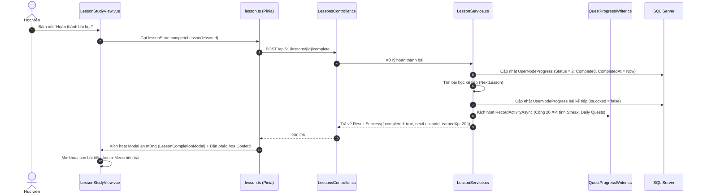

# 📚 PHÂN HỆ 2: LỘ TRÌNH HỌC TẬP & BÀI HỌC (CURRICULUM FLOW)

Phân hệ Lộ trình & Bài học là trung tâm đào tạo của DSA Visual, tổ chức nội dung theo cấu trúc 4 cấp độ: **Nhóm chủ đề (Topic) $\rightarrow$ Lộ trình (Learning Path) $\rightarrow$ Nút bài học (Node) $\rightarrow$ Nội dung chi tiết (Lesson)**.

---

## 1. MÀN HÌNH 03: DANH SÁCH LỘ TRÌNH (COURSES LIST VIEW)

* **URL**: `/path` (alias: `/learn`, `/courses`)
* **File Vue**: [`CoursesListView.vue`](file:///d:/FPT/metqua/frontend/src/views/courses/CoursesListView.vue)
* **Quyền truy cập**: Công khai (Xem trước) / Học viên (Để theo dõi tiến độ).

```
┌────────────────────────────────────────────────────────────────────────┐
│ 🔍 Tìm kiếm lộ trình...     [ Tất cả (15) ] [ Sắp xếp ] [ Cây ] [ Đồ thị ]... │
├────────────────────────────────────────────────────────────────────────┤
│ [ Bộ lọc cấp độ: Cơ bản ▾ | Trung cấp ▾ | Nâng cao ▾ ]               │
│                                                                        │
│ ┌──────────────────────┐  ┌──────────────────────┐  ┌────────────────┐ │
│ │ 🔀 SẮP XẾP & TÌM KIẾM│  │ 🌲 CÂY NHỊ PHÂN & BST│  │ 🕸️ ĐỒ THỊ BFS/DFS │
│ │ Cấp độ: Cơ bản       │  │ Cấp độ: Trung cấp    │  │ Cấp độ: Nâng cao│
│ │ Tiến độ: ████░░ 65%  │  │ Tiến độ: ░░░░░░ 0%   │  │ Đã khóa 🔒      │
│ │ [ Tiếp tục học → ]   │  │ [ Bắt đầu học → ]    │  │ [ Mở khóa (-1❤️)│
│ └──────────────────────┘  └──────────────────────┘  └────────────────┘ │
└────────────────────────────────────────────────────────────────────────┘
```

### Luồng tương tác & Dữ liệu:
1. Khi vào trang, Vue gọi `GET /api/v1/path-items` (lấy danh sách lộ trình) và `GET /api/v1/topics` (lấy 10 nhóm chủ đề).
2. **Cơ chế Smart Resume**: Nút *"Tiếp tục học"* tự động quét tiến độ từ bảng `UserNodeProgress` và điều hướng học viên thẳng vào bài học chưa hoàn thành đầu tiên thay vì luôn bắt đầu lại từ bài 1.

---

## 2. MÀN HÌNH 04: CHI TIẾT LỘ TRÌNH (COURSE DETAIL VIEW)

* **URL**: `/path/:id`
* **File Vue**: [`CourseDetailView.vue`](file:///d:/FPT/metqua/frontend/src/views/courses/CourseDetailView.vue)
* **Quyền truy cập**: Đã đăng nhập (`requiresAuth: true`).

### Mắt thấy gì trên giao diện?
1. **Banner thông tin**: Tên lộ trình, mô tả mục tiêu đầu ra, độ khó, tổng số bài học, thanh tiến độ tổng quát (ví dụ: `4/12 bài (33%)`).
2. **Cây bài học (Curriculum Tree)**: Phân theo từng Module/Chương (ví dụ: Chương 1: Tìm kiếm tuyến tính & Nhị phân $\rightarrow$ Chương 2: Sắp xếp đơn giản $\rightarrow$ Chương 3: Sắp xếp nâng cao).
3. **Trạng thái từng bài học**:
   * ✅ **Đã hoàn thành (Completed)**: Hiển thị icon xanh lá, có thể bấm vào ôn tập lại bất kỳ lúc nào.
   * 🔓 **Đang mở (Unlocked / In Progress)**: Nổi bật viền sáng tím, có nút "Vào học ngay".
   * 🔒 **Bị khóa (Locked)**: Bài học tiếp theo bị mờ, hiện icon ổ khóa. Chỉ mở khi bài học tiên quyết (prerequisite) đã đạt điểm qua bài.
4. **Nút "Mở khóa lộ trình"**: Nếu lộ trình chưa mở, học viên bấm "Mở khóa" $\rightarrow$ Trừ 1 Tim (`-1 Heart`). Hệ thống đảm bảo mở khóa xong vào học bài 1 không bị trừ tim lần 2.

---

## 3. MÀN HÌNH 04b: KHÔNG GIAN HỌC TẬP TÍCH HỢP (LESSON STUDY VIEW)

* **URL**: `/lessons/:id`
* **File Vue**: [`LessonStudyView.vue`](file:///d:/FPT/metqua/frontend/src/views/lesson/LessonStudyView.vue)
* **Quyền truy cập**: Đã đăng nhập (`requiresAuth: true`).

Đây là **màn hình học tập trọng tâm** của học sinh, được thiết kế theo layout 2 cột không gian tối:

```
┌────────────────────────────────────────────────────────────────────────┐
│ [≡ Mục lục bài]   BÀI 6: TÌM KIẾM NHỊ PHÂN (BINARY SEARCH)  [❤️ 5/5] [⭐ 120]│
├───────────────────────────────┬────────────────────────────────────────┤
│ CỘT TRÁI: NỘI DUNG LÝ THUYẾT  │ CỘT PHẢI: TRÌNH MÔ PHỎNG NHÚNG         │
│ (Markdown + LaTeX + Code)     │ (InlineSimulationPlayer)               │
│                               │                                        │
│ 1. Khái niệm:                 │ ┌────────────────────────────────────┐ │
│ Điều kiện mảng đã sắp xếp.    │ │ [1] [3] [7] [9] [12] [15] [20]     │ │
│                               │ │  L           M             R       │ │
│ 2. Độ phức tạp:               │ └────────────────────────────────────┘ │
│ $$T(n) = O(\log n)$$          │ [⏮] [◀] [▶ Chạy từng bước] [Mở rộng ⛶] │
│                               ├────────────────────────────────────────┤
│ 3. Ghi chú cá nhân (Notes):   │ TAB DƯỚI: THỰC HÀNH & KIỂM TRA         │
│ [ Nhập ghi chú riêng... ]     │ [ Luyện tập Quiz ] [ CodeLab Monaco ]  │
├───────────────────────────────┴────────────────────────────────────────┤
│ [← Bài trước]                [ TIẾP TỤC / HOÀN THÀNH BÀI HỌC → ]        │
└────────────────────────────────────────────────────────────────────────┘
```

### Luồng hoàn thành bài học (Lesson Completion Flow):



---

## 4. MÀN HÌNH 30: KIỂM TRA CUỐI LỘ TRÌNH (FINAL TEST VIEW)

* **URL**: `/path/:topicId/final-test`
* **File Vue**: [`FinalTestView.vue`](file:///d:/FPT/metqua/frontend/src/views/FinalTestView.vue)
* **Quyền truy cập**: Đã đăng nhập & Đã hoàn thành 100% các bài học trong lộ trình.

### Mắt thấy gì trên giao diện?
* Bài thi trắc nghiệm tổng hợp 10 - 20 câu hỏi thời gian thực (Countdown Timer).
* Thanh tiến trình số câu làm được (ví dụ: `Câu 7/15`).
* Bấm **Nộp bài** $\rightarrow$ Hệ thống chấm điểm:
  * Điểm $\ge 80\%$: Nhận Chứng chỉ/Huy hiệu hoàn thành lộ trình (Badge Awarded), mở khóa Lộ trình nâng cao tiếp theo.
  * Điểm $< 80\%$: Nhắc nhở các phần lý thuyết cần ôn tập lại.
