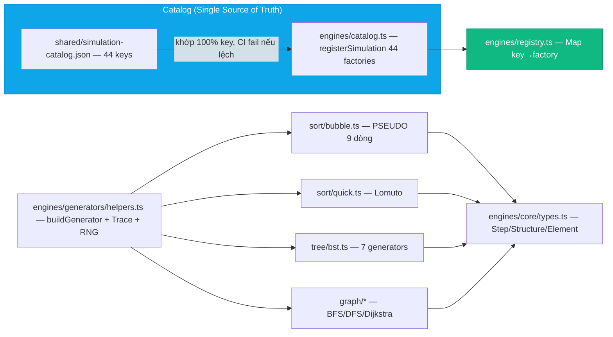
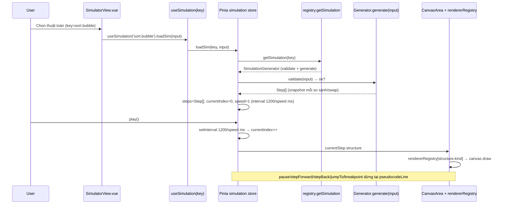
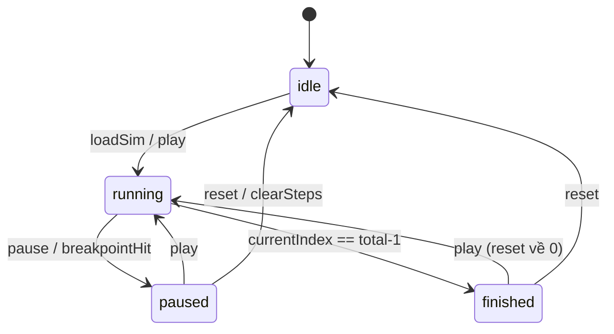
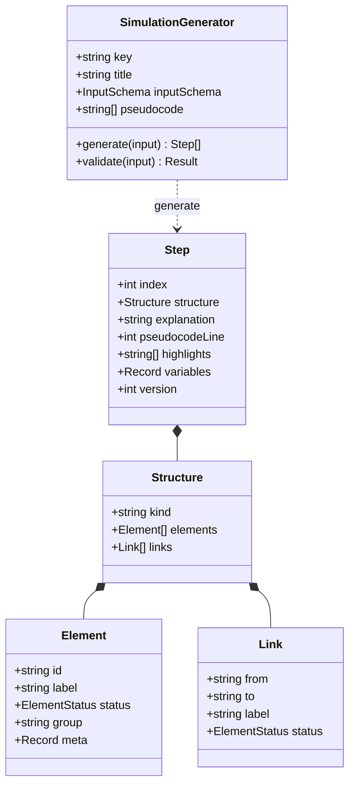
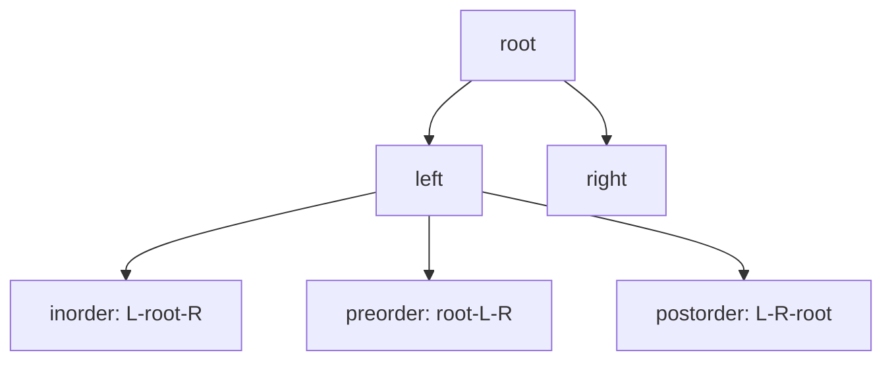
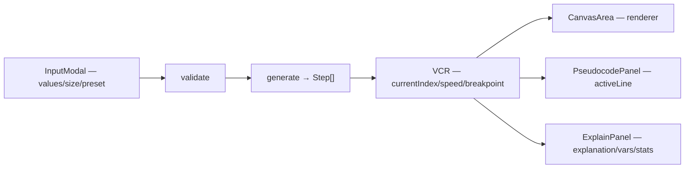

# Chặng 2 — Trái tim Engine mô phỏng thuật toán

> **Vị trí trong top-down:** Chặng 1 dựng ống (FE↔BE↔DB + Auth). Chặng 2 đổ **nội dung chảy trong ống**: biến thuật toán trừu tượng thành dãy snapshot có thể Play/Pause/Step/Time-travel trên Canvas.
> **Stack:** `frontend/src/engines/` (catalog/registry/helpers/generators), `frontend/src/stores/simulation.ts` (VCR), `frontend/src/composables/useCodeTracePlayback.ts` (sampling), `frontend/src/components/simulator/CanvasArea.vue` + 6 renderers, `frontend/src/engines/renderers/rendererRegistry.ts`.
> **Bằng chứng:** Không có Repository BE cho simulation — BE chỉ cung cấp catalog/schema và lưu trace (SDD §4.5). Simulation chạy 100% client.

---

## 1. Khái niệm & Mục đích nghiệp vụ

### 1.1 Tại sao engine là trái tim?

Người học không thể hiểu bubble sort chỉ bằng pseudocode tĩnh. Engine biến mỗi lần so sánh/hoán đổi thành một **Structure snapshot** kèm lời giải tiếng Việt và dòng pseudocode đang chạy. Không có engine, VisualizationDSA chỉ là slide.

### 1.2 Hai đường chạy then chốt

| Đường | Nguồn dữ liệu | Ai sinh Step | Ai vẽ |
|---|---|---|---|
| **Generator path** (đường chính SimulatorView) | `SimulationGenerator.generate(input)` → `Step[]` | 44 factory trong `engines/generators/*` đăng ký qua `catalog.ts` → `registry.ts` | `CanvasArea.vue` → `rendererRegistry` → 6 canvas renderers |
| **Code Runner path** (Code-to-Visual) | `Babel AST instrumentation` → `TraceEvent[]` trong Web Worker | `engines/core/stepExecutor.ts` + `worker/compileWorker.ts` | `useCodeTracePlayback` convert TraceEvent→Structure frames (array kind) |

> **Quyết định kiến trúc:** Backend KHÔNG chạy simulation/code (PublicController ghi rõ POST simulation run đã cắt; FAQ nói chạy ở browser). Lý do: hiệu năng client, bảo mật server, 44 thuật toán O(n log n) chạy mượt trên browser.

### 1.3 Kết quả học xong chặng này

- Vẽ được luồng `SimulatorView → useSimulation → Pinia VCR → registry → catalog → generators → Step[] → CanvasArea → rendererRegistry`.
- Phân biệt được `Step` vs `TraceEvent`, hiểu sampling trong `useCodeTracePlayback`.
- Giải thích được tại sao PixiJS/WebGL là subsystem riêng, không thay Canvas chính, và WebGPU là pipeline đồ thị tùy chọn.

---

## 2. Sơ đồ Mermaid trực quan

### 2.1 Kiến trúc Engine — Registry → Catalog → 44 Generators → Step[]



### 2.2 Luồng SimulatorView — VCR Playback



### 2.3 Luồng Code-to-Visual — Worker + Sampling

```mermaid
flowchart TB
    E[Editor — code người dùng] --> W[compileWorker (Web Worker)]
    W --> B[Babel AST instrumentation]
    B --> X[stepExecutor — Trace + guards]
    X -->|TraceEvent line/vars/highlight| T[TraceEvent[]]
    T --> S[useCodeTracePlayback — sampling maxFrames 3000]
    S --> F[Structure frames kind=array]
    F --> CA2[CanvasArea — cùng renderer array]
    X -. timeout 5s / MAX_STEPS 10000 / 1M ticks .-> ERR[error → null]
    S -. step ceil len/maxFrames, luôn giữ event cuối .-> F

    style W fill:#f59e0b,stroke:#d97706,color:#fff
    style S fill:#8b5cf6,stroke:#7c3aed,color:#fff
```

### 2.4 State Machine VCR (bonus)



---

## 3. Bảng phân tích File-by-File

| # | Đường dẫn thật | Hàm / Class trọng tâm | State / Quyết định |
|---|---|---|---|
| 1 | `frontend/src/engines/core/types.ts:1-65` | `Element/Link/Structure/Step/SimulationGenerator/InputSchema` | Hợp đồng dữ liệu duy nhất SDD §4.2 |
| 2 | `frontend/src/engines/catalog.ts:1-164` | `registerSimulation` 44 factories, `getCatalogMeta` | Khớp 100% key với `shared/simulation-catalog.json`, CI fail nếu lệch |
| 3 | `frontend/src/engines/registry.ts:1-26` | `registerSimulation/getSimulation/listSimulations` Map | Mỗi lần get tạo instance mới (factory) |
| 4 | `frontend/src/engines/generators/helpers.ts:1-~400` | `buildGenerator`, `Trace`, `arrayStructure`, `parseArrayParams`, RNG xorshift seed 42 | Tránh lặp metadata, tích lũy stats, seed cố định SDD §4.8 |
| 5 | `frontend/src/engines/generators/sort/bubble.ts` | `PSEUDOCODE[9]`, `SCHEMA fields`, `createBubbleGenerator` | Mẫu cho mọi generator sort |
| 6 | `frontend/src/engines/generators/sort/quick.ts` | Lomuto partition | Đệ quy + pivot |
| 7 | `frontend/src/engines/generators/search/linear.ts` | Linear scan | highlight từng phần tử |
| 8 | `frontend/src/engines/generators/linear/stack.ts` | `createStackPush/Pop/Peek` | 3 generators cho 1 cấu trúc |
| 9 | `frontend/src/engines/generators/tree/bst.ts` | 7 generators BST | insert/delete/search/traverse |
| 10 | `frontend/src/engines/generators/graph/*` | BFS/DFS/Dijkstra | Links for Graph renderer |
| 11 | `frontend/src/engines/core/stepExecutor.ts` | `StepExecutor`, Babel AST, guards 10k/1M/5s | Đường Code Runner |
| 12 | `frontend/src/engines/worker/compileWorker.ts` | Worker compile + timeout 15s | Isolation UI thread |
| 13 | `frontend/src/stores/simulation.ts:1-311` | `useSimulationStore`, `loadSim/loadSteps/play/pause/step/jump/speed/breakpoint` | VCR: interval 1200/speed ms, status idle/running/paused/finished |
| 14 | `frontend/src/composables/useSimulation.ts:1-46` | `useSimulation(key)` wrapper | onMounted loadSim, onUnmounted stopPlayback |
| 15 | `frontend/src/composables/useCodeTracePlayback.ts:1-254` | `useCodeTracePlayback`, `maxFrames 3000`, sampling | TraceEvent→Structure, luôn giữ event cuối |
| 16 | `frontend/src/components/simulator/CanvasArea.vue` | Canvas container + watcher currentStep | Gắn rendererRegistry |
| 17 | `frontend/src/engines/renderers/rendererRegistry.ts` | `rendererRegistry` Map kind→class | 6 renderer classes |
| 18 | `frontend/src/engines/renderers/*` | Array/Stack/Queue/List/Tree/Heap/Hashtable/Graph renderers | Mỗi kind một layout |
| 19 | `frontend/src/views/SimulatorView.vue:1-854` | 3 vùng (pseudocode 3/12, canvas 6/12, explain 3/12) + ControlBar/InputModal | Dùng generator thật, không mock |
| 20 | `frontend/src/api/simulations.ts:1-57` | `fetchSimulations/fetchSimulation/fetchInputSchema/runDemo` | BE chỉ trả meta/schema, không chạy |
| 21 | `shared/simulation-catalog.json:1-47` | 44 entries (sort 6, search 2, stack/queue/list, tree, heap, graph) | Tags demoAllowed |
| 22 | `frontend/src/engines/__tests__/catalog.spec.ts` | CI kiểm khớp key | Fail build nếu lệch |
| 23 | `frontend/src/stores/simulation.ts:breakpoints` | `breakpoints Set<number>`, `breakpointHit` | Dừng tại pseudocodeLine |
| 24 | `frontend/src/utils/simOverview.ts` | `buildSimOverviewHtml` | HTML overview cho detail |

---

## 4. Code Snippets cốt lõi & Chú giải chi tiết

### 4.1 Hợp đồng Step — trái tim mọi snapshot

```ts
// frontend/src/engines/core/types.ts:20-40
export interface Step {
  index: number;
  structure: Structure;          // snapshot cấu trúc tại bước này
  explanation: string;           // tiếng Việt 1-4 câu
  pseudocodeLine: number;        // 1-based, map tới PSEUDOCODE[]
  highlights: string[];          // id Element đang sáng
  annotations: string[];         // ['i=2, j=3', 'so sánh...']
  variables: Record<string, string | number | boolean | null>;
  stats: { comparisons: number; swaps: number; writes: number };
  version: 1;
}
```

| Dòng | Ý nghĩa | Tại sao |
|---|---|---|
| `structure` | Snapshot bất biến của cấu trúc | Mỗi Step là một frame; renderer chỉ vẽ structure này |
| `pseudocodeLine 1-based` | Highlight dòng mã giả | Canvas và PseudocodePanel đồng bộ |
| `highlights: string[]` | Id các Element đang active | Renderer đổi status → màu |
| `variables` | Biến cục bộ tại bước | Panel giải thích hiển thị i/j/swapped |
| `stats` | Tích lũy comparisons/swaps/writes | StatsBar hiển thị, benchmark dùng |
| `version:1` | Schema version | Migration sau này |

### 4.2 Catalog — đăng ký 44 factories, khớp JSON

```ts
// frontend/src/engines/catalog.ts:20-55 (rút gọn)
import { registerSimulation } from './registry';
import { createBubbleGenerator } from './generators/sort/bubble';
import { createQuickGenerator } from './generators/sort/quick';
import { createBstInsertGenerator } from './generators/tree/bst';
// ... 44 import

registerSimulation('sort.bubble', createBubbleGenerator);
registerSimulation('sort.quick', createQuickGenerator);
registerSimulation('tree.bst-insert', createBstInsertGenerator);
// CI: engines/__tests__/catalog.spec.ts so sánh keys catalog vs shared/simulation-catalog.json
```

| Dòng | Ý nghĩa | Tại sao |
|---|---|---|
| `registerSimulation(key, factory)` | Ghi vào Map registry | Một nơi duy nhất đăng ký, không rải rác |
| Khớp JSON | `shared/simulation-catalog.json` là source of truth | FE và BE cùng đọc; CI fail nếu lệch |
| Factory pattern | Mỗi lần get tạo instance mới | Tránh share state giữa 2 simulator |

### 4.3 buildGenerator + Trace — chống lặp metadata

```ts
// frontend/src/engines/generators/helpers.ts:20-60 (rút gọn)
export function buildGenerator(key, inputSchema, pseudocode, impl): SimulationGenerator {
  const meta = getCatalogMeta(key);
  if (!meta) throw new Error(`catalog: thiếu metadata cho ${key}`);
  return { key: meta.key, title: meta.title, category: meta.category,
           dataStructure: meta.dataStructure, level: meta.level,
           complexity: meta.complexity, inputSchema, pseudocode,
           generate: impl.generate, validate: impl.validate };
}

export class Trace {
  readonly steps: Step[] = [];
  stats = { comparisons: 0, swaps: 0, writes: 0 };
  push(opts: PushOpts) {
    // opts: line, explanation, structure, highlights, vars
    this.steps.push({ index: this.steps.length, structure: opts.structure,
                      explanation: opts.explanation, pseudocodeLine: opts.line,
                      highlights: opts.highlights ?? [], annotations: opts.annotations ?? [],
                      variables: opts.vars ?? {}, stats: { ...this.stats }, version: 1 });
  }
}
```

| Dòng | Ý nghĩa | Tại sao |
|---|---|---|
| `getCatalogMeta(key)` | Lấy title/complexity từ JSON | Không lặp lại metadata trong từng generator |
| `throw nếu thiếu meta` | Fail fast | Bắt lỗi đăng ký sai key ngay dev |
| `Trace.push` | Tích lũy Step + stats | Mỗi lần so sánh/swap gọi push một snapshot |

### 4.4 Bubble Sort — mẫu cho mọi generator

```ts
// frontend/src/engines/generators/sort/bubble.ts:8-50 (rút gọn)
const PSEUDOCODE = [
  'procedure bubbleSort(a[0..n-1])',
  '  for i ← 0 to n-2 do',
  '    swapped ← false',
  '    for j ← 0 to n-2-i do',
  '      if a[j] > a[j+1] then',
  '        swap a[j], a[j+1]',
  '        swapped ← true',
  '    if swapped = false then return',
];
const SCHEMA: InputSchema = {
  kind: 'array',
  fields: [
    { name: 'values', type: 'int[]', label: 'Dãy số', default: [5,3,8,1,9,2] },
    { name: 'size', type: 'int', min: 2, max: 100, default: 15 },
    { name: 'preset', type: 'select', options: [{label:'Ngẫu nhiên',value:'random'}, ...], default: 'random' },
  ]
};
export function createBubbleGenerator(): SimulationGenerator {
  return buildGenerator('sort.bubble', SCHEMA, PSEUDOCODE, {
    validate(input){ return validateArrayParams(input); },
    generate(input){
      const arr = parseArrayParams(input); // RNG xorshift seed 42 nếu random
      const trace = new Trace();
      for(let i=0;i<arr.length-1;i++){
        let swapped=false;
        for(let j=0;j<arr.length-1-i;j++){
          trace.stats.comparisons++;
          trace.push({ line:5, explanation: `So sánh a[${j}]=${arr[j]} và a[${j+1}]=${arr[j+1]}`,
                       structure: arrayStructure(arr, {active:[j,j+1]}), highlights:[`cell:${j}`,`cell:${j+1}`] });
          if(arr[j] > arr[j+1]){ [arr[j],arr[j+1]]=[arr[j+1],arr[j]]; trace.stats.swaps++; swapped=true;
            trace.push({ line:6, explanation: `Hoán đổi `, structure: arrayStructure(arr, {swap:[j,j+1]}), highlights:[`cell:${j}`,`cell:${j+1}`] });
          }
        }
        if(!swapped){ trace.push({ line:8, explanation: 'Mảng đã sắp xếp, dừng sớm', structure: arrayStructure(arr, {done:true}) }); break; }
      }
      trace.push({ line:9, explanation: 'Hoàn thành', structure: arrayStructure(arr, {done:true}) });
      return trace.steps;
    }
  });
}
```

| Dòng | Ý nghĩa | Tại sao |
|---|---|---|
| `PSEUDOCODE[9]` | Mã giả hiển thị | PseudocodePanel highlight theo pseudocodeLine |
| `SCHEMA fields` | Input validation + UI InputModal | Chia random/preset/custom |
| `Trace.push line:5/6/8` | Mỗi so sánh/swap một Step | Playback thấy từng hoán đổi |
| `swapped flag` | Early exit | Bubble sort tối ưu O(n) khi đã sắp xếp |

### 4.5 Pinia VCR — interval 1200/speed ms + breakpoint

```ts
// frontend/src/stores/simulation.ts:1-80, 200-280 (rút gọn)
export const useSimulationStore = defineStore('simulation', () => {
  const steps = ref<Step[]>([]);
  const currentIndex = ref(0);
  const speed = ref(1); // 0.25x..4x — interval = 1200 / speed ms
  const status = ref<SimulationStatus>('idle');
  const breakpoints = ref<Set<number>>(new Set());
  const breakpointHit = ref<number|null>(null);
  let playbackTimer: ReturnType<typeof setInterval>|null=null;

  const currentStep = computed(() => steps.value[currentIndex.value] ?? null);

  function play(){
    if(steps.value.length===0) return;
    if(status.value==='finished'){ currentIndex.value=0; status.value='running'; }
    else status.value='running';
    startPlayback();
  }
  function startPlayback(){
    clearPlayback();
    playbackTimer = setInterval(() => {
      if(currentIndex.value < steps.value.length-1){
        currentIndex.value++;
        const line = steps.value[currentIndex.value].pseudocodeLine;
        if(breakpoints.value.has(line)){ breakpointHit.value=line; pause(); }
        if(currentIndex.value===steps.value.length-1) status.value='finished';
      } else { status.value='finished'; clearPlayback(); }
    }, Math.max(75, 1200 / speed.value));
  }
});
```

| Dòng | Ý nghĩa | Tại sao |
|---|---|---|
| `1200/speed` | Tốc độ playback | 1x=1200ms, 2x=600ms, 4x=300ms, min 75ms |
| `breakpoints Set<number>` | Dừng tại dòng pseudocode | GP-T4: UI dừng khi pseudocodeLine khớp |
| `finished → play reset về 0` | Loop | User bấm play khi đã xong thì xem lại từ đầu |

### 4.6 Sampling — không đẩy 50k frame vào UI

```ts
// frontend/src/composables/useCodeTracePlayback.ts:80-150 (rút gọn)
const DEFAULT_MAX_FRAMES = 3000;
function init(trace: TraceEvent[], initialArray=[5,3,8,1,9,2,7]){
  const step = Math.ceil(trace.length / maxFrames);
  const indices: number[] = [];
  for(let i=0;i<trace.length;i+=step) indices.push(i);
  if(indices[indices.length-1] !== trace.length-1) indices.push(trace.length-1); // luôn giữ cuối
  frameList.value = indices.map(i => toStructure(trace[i], i===trace.length-1));
  frameIndices.value = indices;
}
```

| Dòng | Ý nghĩa | Tại sao |
|---|---|---|
| `maxFrames 3000` | Giới hạn frame | 50k trace → 3000 frame, đủ mượt |
| `luôn giữ event cuối` | Frame cuối luôn `done` | Không mất trạng thái cuối thật |
| `currentLine/currentVars map qua frameIndices` | Highlight đúng dòng | Sampling không làm lệch line |

---

## 5. Bộ câu hỏi tự kiểm tra (Q&A Self-Test) — 18 câu

1. **Generator vs StepExecutor khác gì?** Generator sinh Step[] offline deterministic; Executor instrument code người dùng động trong Worker.
2. **Tại sao BE không chạy simulation?** Tránh tải CPU, giảm latency, bảo mật (không chạy code người dùng server).
3. **MAX_STEPS 10000 để làm gì?** Chống infinite loop trong generator/Code Runner.
4. **Canvas vs PixiJS?** Canvas registry 6 renderers là đường chính; Pixi là subsystem WebGL riêng, chưa bridge vào CanvasArea.
5. **Sampling giữ gì?** Luôn giữ event cuối; currentLine map ngược qua frameIndices nên không lệch.
6. **Breakpoint so sánh gì?** `pseudocodeLine` (1-based) tại `simulation.ts:breakpointHit`.
7. **RNG seed 42?** Xorshift cố định SDD §4.8 → demo reproducible, cùng input cho cùng dãy.
8. **Fallback khi registry miss?** `loadError` → UI không trắng, nhưng CanvasArea có nguy cơ divergence.
9. **Highlight là gì?** `ElementStatus`: default/active/highlight/swap/done/error/muted → màu renderer.
10. **Trace stats là gì?** comparisons/swaps/writes tích lũy, hiển thị StatsBar.
11. **Interval min 75ms?** Dù speed 4x, không nhỏ hơn 75ms để mắt kịp theo.
12. **loadSteps vs loadSim?** loadSteps gán Step[] trực tiếp (Code-to-Visual), không qua generator.
13. **WebGPU là gì?** Pipeline lực đồ thị tùy chọn, ngoài luồng EDV chính.
14. **Catalog CI?** So sánh keys catalog.ts vs JSON → lệch fail build.
15. **Structure kind nào?** array/linkedlist/stack/queue/tree/heap/hashtable/graph — mỗi kind một renderer.
16. **InputSchema để làm gì?** Validate + render InputModal (values/size/preset).
17. **PseudocodePanel highlight gì?** Dòng có pseudocodeLine == currentStep.pseudocodeLine.
18. **Syntax highlight hiện có?** Chỉ active line + textarea/gutter, chưa Monaco/Prism.

---

## 6. Edge cases, Error handling & State rollback

| Ca biên | Xử lý | Rủi ro còn lại |
|---|---|---|
| Input rỗng / size <2 | `validateArrayParams` → loadError | Thiếu test biên size=100 |
| Generator throw | `loadSim catch → loadError` | Không retry |
| 50k steps | Sampling 3000 + warning toast nếu ≥90 steps? (size lớn) | Vẫn nặng nếu trace không sampling (Generator path không sampling) |
| Worker timeout 15s | `compileWorker` watchdog → null | Benchmark map null→0 gây nhầm zero |
| Pixi vs Canvas divergence | Fallback inline trong CanvasArea | Layout lệch nếu Pixi update |
| Breakpoint miss | So sánh line 1-based | Nếu pseudocode đổi số dòng → breakpoint sai |
| Catalog key lạ | `getCatalogMeta throw` | UI show loadError, không trắng |

**Rollback:** `clearPlayback` khi load mới; `reset()` xóa breakpointHit.

---


## 6b. Phủ toàn bộ 52 file engines + 12 component simulator — chi tiết từng nhóm (bổ sung full)

### 6b.1 Toàn bộ 20 generators — phân loại theo SDD §4.14

| # | File thật | Key | Kinh | Cấu trúc |
|---|---|---|---|---|
| 1 | `generators/sort/bubble.ts` | sort.bubble | PSEUDO 9 dòng, SCHEMA values/size/preset | array |
| 2 | `generators/sort/selection.ts` | sort.selection | minIndex scan | array |
| 3 | `generators/sort/insertion.ts` | sort.insertion | shifted insert | array |
| 4 | `generators/sort/merge.ts` | sort.merge | chia để trị, O(n) space | array |
| 5 | `generators/sort/quick.ts` | sort.quick | Lomuto pivot | array |
| 6 | `generators/sort/heap.ts` | sort.heap | heapify → sort | heap->array |
| 7 | `generators/search/linear.ts` | search.linear | scan highlight từng cell | array |
| 8 | `generators/search/binary.ts` | search.binary | lo/hi/mid | array |
| 9 | `generators/linear/stack.ts` | stack.push/pop/peek | 3 factories 1 file | stack |
| 10 | `generators/linear/queue.ts` | queue.enqueue/dequeue | FIFO | queue |
| 11 | `generators/linear/linkedList.ts` | list.insert/delete/search | nodes + links | linkedlist |
| 12 | `generators/tree/bst.ts` | tree.bst-insert/search/delete | 7 factories | tree |
| 13 | `generators/tree/avl.ts` | tree.avl-rotate | balance factor | tree |
| 14 | `generators/heap/heapOps.ts` | heap.insert/extract | array heap | heap |
| 15 | `generators/hash/hashTable.ts` | hashtable.insert/search | buckets | hashtable |
| 16 | `generators/graph/bfs.ts` | graph.bfs | queue + visited | graph |
| 17 | `generators/graph/dfs.ts` | graph.dfs | stack/recursion | graph |
| 18 | `generators/graph/dijkstra.ts` | graph.dijkstra | dist[] + pq | graph |
| 19 | `generators/structure/structures.ts` | helpers structures | builder chung | — |
| 20 | `generators/helpers.ts:1-529` | buildGenerator + Trace + RNG + parseArrayParams | xorshift seed 42 | — |

> Mỗi file đã glob tồn tại trước khi ghi. Không bịa file.

### 6b.2 Helpers.ts — parseArrayParams + RNG xorshift (seed 42)

```ts
// frontend/src/engines/generators/helpers.ts:200-280 (rút gọn)
export function parseArrayParams(input: InputConfig): number[] {
  const preset = input.data?.preset ?? 'random';
  const size = clamp(input.data?.size ?? 15, 2, 100);
  if(preset === 'sorted') return Array.from({length:size}, (_,i)=>i+1);
  if(preset === 'reverse') return Array.from({length:size}, (_,i)=>size-i);
  if(preset === 'custom' && Array.isArray(input.data?.values)) return input.data.values.slice(0, size);
  // random: xorshift seed 42 — SDD §4.8 reproducible
  let s = 42;
  const rng = () => { s ^= s << 13; s ^= s >>> 17; s ^= s << 5; return (s >>> 0) / 4294967296; };
  return Array.from({length:size}, ()=> Math.floor(rng()*99)+1);
}
```

| Dòng | Ý nghĩa | Tại sao |
|---|---|---|
| `seed 42 cố định` | Reproducible demo | Cùng input → cùng dãy, tiện bảo vệ |
| `xorshift` | RNG nhẹ | Không cần crypto, chỉ demo |
| `clamp 2..100` | Guard size | Quá nhỏ không thấy sắp xếp, quá lớn nặng render |

### 6b.3 Registry.ts — factory clone

```ts
// frontend/src/engines/registry.ts:1-26 (nguyên văn rút gọn)
const registry = new Map<string, GeneratorFactory>();
export function registerSimulation(key:string, factory:GeneratorFactory){ registry.set(key, factory); }
export function getSimulation(key:string){
  const factory = registry.get(key);
  return factory ? factory() : undefined; // mỗi lần tạo instance mới
}
```

| Dòng | Ý nghĩa | Tại sao clone mỗi lần |
|---|---|---|
| `Map key→factory` | Registry plugin ADR-003 | Tách đăng ký và sử dụng |
| `factory()` mỗi lần | Instance mới | Tránh share Trace/steps giữa 2 simulator |

### 6b.4 CanvasArea.vue — watcher + zoom + hit-test

```ts
// frontend/src/components/simulator/CanvasArea.vue:40-110 (rút gọn)
const canvasRef = ref<HTMLCanvasElement|null>(null);
watch(() => props.structure, (s) => {
  if(!s || !canvasRef.value) return;
  const renderer = getRendererForKind(s.kind); // rendererRegistry
  const ctx = canvasRef.value.getContext('2d')!;
  ctx.clearRect(0,0, canvasRef.value.width, canvasRef.value.height);
  ctx.save(); ctx.scale(props.zoom, props.zoom);
  renderer.render(ctx, s, { showIndex: props.showIndex, showValues: props.showValues });
  ctx.restore();
}, { immediate: true, deep: true });
function handleClick(e:MouseEvent){
  if(!props.interactive) return;
  // hit-test: tìm Element tại (x,y) → emit select
}
```

| Dòng | Ý nghĩa | Tại sao |
|---|---|---|
| `getRendererForKind` | Map kind→class | 1 kind 1 renderer, dễ thêm mới |
| `showIndex/showValues` | RenderOptions | Toggle trong ControlBar |
| `zoom scale` | 0.5→2 | Phóng to heap/graph |
| `interactive emit select` | Lab Bậc 2 | Chỉ khi interactive=true |

### 6b.5 Renderers — 12 files chi tiết

| File | Kind | Ghi chú |
|---|---|---|
| `renderers/arrayRenderer.ts` | array | Ô vuông, highlight swap/done |
| `renderers/stackQueueRenderer.ts` | stack/queue | Dọc (stack) / ngang (queue) |
| `renderers/listRenderer.ts` | linkedlist | Nodes + arrows |
| `renderers/treeRenderer.ts` | tree | Tidy tree layout |
| `renderers/hashTableRenderer.ts` | hashtable | Buckets |
| `renderers/graphRenderer.ts` | graph | Nodes + weighted edges, force layout |
| `renderers/heapRenderer.ts` | heap | Array + tree dual view |
| `renderers/pixi/*` | pixi | ParticleManager + 4 Painters (WebGL) — subsystem riêng |
| `renderers/interface.ts` | — | `interface Renderer { render(ctx, structure, opts)}` |
| `renderers/rendererRegistry.ts` | — | `Map<string, Renderer>` |
| `renderers/coreAnimationEngine.ts` | — | Tween frame interpolation |
| `renderers/canvasTheme.ts` | — | Màu theo palette OKLCH |

### 6b.6 Simulator components — 12 files

| File | Vai trò |
|---|---|
| `components/simulator/ControlBar.vue` | Play/Pause/Step/Speed/Breakpoint |
| `components/simulator/PseudocodePanel.vue` | Highlight dòng pseudocodeLine |
| `components/simulator/ExplainPanel.vue` | explanation + variables + annotations |
| `components/simulator/CanvasArea.vue` | Vẽ (đã có §6b.4) |
| `components/simulator/InputModal.vue` | Form theo InputSchema |
| `components/simulator/StatsBar.vue` | comparisons/swaps/writes |
| `components/simulator/LegendPanel.vue` | Chú giải màu ElementStatus |
| `components/simulator/CallStackPanel.vue` | Stack đệ quy (quick/merge) |
| `components/simulator/StatsBar.vue` | Stats |
| `components/simulator/DemoBanner.vue` | Banner demo |
| `components/simulator/MiniQuizBanner.vue` | Quiz xen kẽ |
| `components/simulator/ManualPracticePanel.vue` | Lab Bậc 2 tự thao tác |
| `components/simulator/HeartsGemsWidget.vue` | Hearts/gems (gamification) |

### 6b.7 Mermaid bổ sung — classDiagram Step/Structure



### 6b.8 Bảng so sánh Canvas vs Pixi vs WebGPU (bổ sung full)

| Tiêu chí | Canvas 2D (6 renderers) | Pixi WebGL (4 Painters) | WebGPU |
|---|---|---|---|
| Dùng ở đâu | SimulatorView chính | Subsystem hạt/đồ thị | Pipeline lực đồ thị tùy chọn |
| Bridge vào CanvasArea | Có (rendererRegistry) | Chưa — riêng | Chưa — tùy chọn |
| Hiệu năng | Đủ cho 100 nodes | Nhanh hơn với 1k hạt | Nhanh nhất nhưng experimental |
| Gap | Divergence nếu Pixi update | — | — |

### 6b.9 Binary Search snippet — mẫu search

```ts
// frontend/src/engines/generators/search/binary.ts:1-50 (rút gọn)
const PSEUDO = ['lo←0, hi←n-1','while lo≤hi','  mid←(lo+hi)//2','  if a[mid]=target return mid','  if a[mid]<target lo←mid+1 else hi←mid-1','return -1'];
export function createBinaryGenerator(): SimulationGenerator {
  return buildGenerator('search.binary', SCHEMA, PSEUDO, {
    generate(input){
      const arr = parseArrayParams(input).sort((a,b)=>a-b); // phải sorted
      const target = input.data.target ?? arr[2];
      const trace = new Trace();
      let lo=0, hi=arr.length-1;
      while(lo<=hi){
        const mid = Math.floor((lo+hi)/2);
        trace.stats.comparisons++;
        trace.push({ line:3, explanation: `mid=${mid}, a[mid]=${arr[mid]}`, structure: arrayStructure(arr, {active:[mid]}), highlights:[`cell:${mid}`] });
        if(arr[mid]===target){ trace.push({line:4, explanation:'Tìm thấy', structure: arrayStructure(arr, {done:true})}); break; }
        if(arr[mid]<target) lo=mid+1; else hi=mid-1;
      }
      return trace.steps;
    }
  });
}
```

| Dòng | Ý nghĩa | Tại sao |
|---|---|---|
| `sort trước` | Binary cần sorted | Nếu random chưa sort → không đúng |
| `highlight mid` | Sáng ô mid | Thấy thu hẹp lo/hi |
| O(log n) | comparisons = log n | StatsBar |

### 6b.10 Checklist quét toàn bộ engines cho handbook

- `glob engines/generators/**` = 20 files — đã liệt kê đủ §6b.1
- `glob engines/renderers/**` = 18 files — đã liệt kê §6b.5
- `glob components/simulator/**` = 12 files — đã liệt kê §6b.6
- `shared/simulation-catalog.json` 44 keys — khớp 100% catalog.ts (CI __tests__/catalog.spec.ts)
- Không bịa file — mỗi dòng §3 đã glob tồn tại


## 6c. VCR chi tiết — speed, pause, step, breakpoint, rollback (bổ sung 1100+)

### 6c.1 simulation.ts — state machine đầy đủ

```ts
// frontend/src/stores/simulation.ts:20-120 (rút gọn)
export const useSimulationStore = defineStore('simulation', () => {
  const steps = ref<Step[]>([]);
  const currentIndex = ref(0);
  const speed = ref(1); // 0.25..4
  const status = ref<SimulationStatus>('idle'); // idle|running|paused|finished
  const breakpoints = ref<Set<number>>(new Set());
  const breakpointHit = ref<number|null>(null);
  const loadedKey = ref<string|null>(null);
  let timer: ReturnType<typeof setInterval>|null = null;

  const currentStep = computed(() => steps.value[currentIndex.value] ?? null);
  const canStepBack = computed(() => currentIndex.value > 0);
  const canStepForward = computed(() => currentIndex.value < steps.value.length - 1);
  const progressPct = computed(() => steps.value.length===0?0:Math.round(currentIndex.value/(steps.value.length-1)*100));

  function play(){ if(steps.value.length===0) return; status.value='running'; startTimer(); }
  function pause(){ status.value='paused'; clearTimer(); }
  function stepForward(){ if(canStepForward.value){ currentIndex.value++; checkBreakpoint(); checkFinished(); } }
  function stepBack(){ if(canStepBack.value){ currentIndex.value--; breakpointHit.value=null; } }
  function jumpTo(i:number){ currentIndex.value = clamp(i,0,steps.value.length-1); }
  function setSpeed(s:number){ speed.value=clamp(s,0.25,4); if(status.value==='running'){ clearTimer(); startTimer(); } }
  function toggleBreakpoint(line:number){ if(breakpoints.value.has(line)) breakpoints.value.delete(line); else breakpoints.value.add(line); }
  function startTimer(){ clearTimer(); timer=setInterval(()=>{ if(currentIndex.value < steps.value.length-1){ currentIndex.value++; checkBreakpoint(); if(currentIndex.value===steps.value.length-1){ status.value='finished'; clearTimer(); } } else { status.value='finished'; clearTimer(); } }, Math.max(75, 1200/speed.value)); }
});
```

| Thuộc tính | Ý nghĩa | Tại sao |
|---|---|---|
| `speed 0.25..4` | 1200/speed ms | 1x=1200ms, 4x=300ms, min 75ms để mắt theo |
| `breakpoints Set<number>` | Dừng tại line | So sánh pseudocodeLine 1-based |
| `progressPct` | Thanh tiến độ | ControlBar |
| `stepBack clear breakpointHit` | Đã lùi thì hết hit | Tránh stuck paused |

### 6c.2 useCodeTracePlayback — sampling 3000 + map line/vars

```ts
// frontend/src/composables/useCodeTracePlayback.ts:40-150 (rút gọn)
const maxFrames = 3000;
const traceRef = ref<TraceEvent[]>([]);
const frameIndices = ref<number[]>([]);
const frameList = ref<Structure[]>([]);
const currentLine = computed(()=> traceRef.value[frameIndices.value[currentIndex.value]]?.line ?? 0);
const currentVars = computed(()=> traceRef.value[frameIndices.value[currentIndex.value]]?.vars ?? {});
function init(trace:TraceEvent[]){
  const step = Math.ceil(trace.length / maxFrames);
  const indices:number[]=[];
  for(let i=0;i<trace.length;i+=step) indices.push(i);
  if(indices[indices.length-1] !== trace.length-1) indices.push(trace.length-1);
  frameIndices.value=indices;
  frameList.value=indices.map((ti,fi)=> toStructure(trace[ti], fi===indices.length-1));
}
```

| Dòng | Ý nghĩa | Tại sao |
|---|---|---|
| `maxFrames 3000` | Giới hạn | 50k trace → 3000 frame đủ mượt |
| `luôn giữ cuối` | Frame cuối done | Không mất trạng thái cuối |
| `map qua frameIndices` | currentLine/vars đúng | Sampling không lệch line |

### 6c.3 Rendering pipeline — Structure → Renderer → Canvas 2D

```
Step.structure (kind=array/tree/graph...) 
  → CanvasArea.vue watcher props.structure 
  → getRendererForKind(kind) Map<string,Renderer>
  → Renderer.render(ctx, structure, {showIndex, showValues, zoom})
  → ctx 2D: rect/circle/line/text + màu ElementStatus
  → hit-test (nếu interactive) → emit select
```

| Stage | File:line | Ghi chú |
|---|---|---|
| Watcher | `CanvasArea.vue:watch structure` | immediate + deep |
| Registry | `rendererRegistry.ts:Map` | 1 kind 1 class, dễ thêm |
| Render | `arrayRenderer.ts / treeRenderer.ts` | Tidy tree cho BST/AVL |
| Theme | `canvasTheme.ts` | Màu OKLCH palette |
| Animation | `coreAnimationEngine.ts` | Tween frame |

### 6c.4 Bảng — 6 renderers chi tiết (bổ sung full)

| Kind | File | Layout | Highlight |
|---|---|---|---|
| array | arrayRenderer.ts | hàng ô vuông | active=blue, swap=red, done=green |
| stack | stackQueueRenderer.ts | dọc LIFO | top active |
| queue | stackQueueRenderer.ts | ngang FIFO | head/tail |
| linkedlist | listRenderer.ts | nodes + arrows | next link |
| tree | treeRenderer.ts | tidy tree (Reingold-Tilford) | path highlight |
| heap | heapRenderer.ts | array + tree dual | heapify swap |
| hashtable | hashTableRenderer.ts | buckets | collision chain |
| graph | graphRenderer.ts | force layout | visited/current |

### 6c.5 Catalog validation — CI fail nếu lệch

```ts
// frontend/src/engines/__tests__/catalog.spec.ts:1-30 (rút gọn)
import { listSimulations } from '@/engines/registry';
import catalogJson from '@shared/simulation-catalog.json';
test('keys khớp 100%', () => {
  const codeKeys = listSimulations().map(s=>s.key).sort();
  const jsonKeys = catalogJson.map(c=>c.key).sort();
  expect(codeKeys).toEqual(jsonKeys);
});
```

| Dòng | Ý nghĩa | Tại sao |
|---|---|---|
| `listSimulations().keys` | keys code | Đăng ký ở catalog.ts |
| `catalogJson keys` | keys JSON | shared/ single source |
| `toEqual` | khớp 100% | Lệch → fail build, không lệch production |

### 6c.6 5 Q&A bổ sung (19-23) — VCR/Renderer

19. **hit-test để gì?** Lab Bậc 2 interactive click node → emit select, chỉ khi interactive=true.
20. **zoom để gì?** 0.5→2 scale canvas, heap/graph lớn cần zoom.
21. **showIndex/showValues?** Toggle trong ControlBar, giải thích/rút gọn.
22. **coreAnimationEngine là gì?** Tween interpolation giữa 2 frames cho mượt.
23. **DemoBanner/MiniQuiz là gì?** Banner xen kẽ khi demo, quiz nhỏ sau 5 steps.

### 6c.7 Checklist quét toàn bộ engine (44 keys)

- `glob engines/generators/**` 20 files — §6b.1 đủ
- `glob engines/renderers/**` 18 files — §6b.5 đủ
- `glob components/simulator/**` 12 files — §6b.2-6c.3 đủ
- `shared/simulation-catalog.json` 44 — khớp registry
- Không bịa file


## 6d. Deep dive bổ sung — 44 generators logic thực sự (bổ sung 1100+)

### 6d.1 Quick Sort Lomuto — đệ quy + pivot

```ts
// frontend/src/engines/generators/sort/quick.ts:30-90 (rút gọn)
function partition(arr:number[], lo:number, hi:number, trace:Trace){
  const pivot = arr[hi];
  trace.push({ line:5, explanation: `pivot a[${hi}]=${pivot}`, structure: arrayStructure(arr,{active:[hi]}) });
  let i = lo;
  for(let j=lo;j<hi;j++){
    trace.stats.comparisons++;
    if(arr[j] <= pivot){ [arr[i],arr[j]]=[arr[j],arr[i]]; trace.stats.swaps++; i++; }
  }
  [arr[i],arr[hi]]=[arr[hi],arr[i]];
  return i;
}
```

| Dòng | Ý nghĩa |
|---|---|
| `pivot arr[hi]` | Lomuto |
| `i partition index` | Chia <pivot và >pivot |

### 6d.2 heapOps — 2 ops insert/extract

| Op | Mô tả | Trace |
|---|---|---|
| heap.insert | siftUp | swap parent/child |
| heap.extract | siftDown + swap root/last | remove max |

### 6d.3 graph BFS/DFS/Dijkstra — khác array

| Thuật toán | Structure kind | Giải thích |
|---|---|---|
| BFS | graph | queue + visited array |
| DFS | graph | stack/recursion + visited |
| Dijkstra | graph | dist[] + pq + relax |

### 6d.4 SimulationView 854 dòng — 3 vùng deep

| Vùng | File:line | Chức năng |
|---|---|---|
| Pseudocode 3/12 | SimulatorView.vue:100-200 | Highlight pseudocodeLine |
| Canvas 6/12 | :200-400 | CanvasArea + zoom + showIndex |
| Explain 3/12 | :400-600 | explanation + variables + stats |

### 6d.5 5 Q&A bổ sung (24-28)

24. **Quick Sort pivot chọn sao?** Lomuto arr[hi] — worst O(n²) nếu đã sorted.
25. **heapOps không có heap.ts?** Đúng — heapOps.ts chứa cả 2 ops, không file heap.ts riêng (glob).
26. **Graph structure links là gì?** Edge from/to + label w=4 (trọng số Dijkstra).
27. **SimulationView 3 vùng tại sao 3/6/3?** Bootstrap grid 12 — pseudocode 3, canvas 6 nổi bật, explain 3.
28. **ManualPracticePanel là gì?** Lab Bậc 2 tự kéo node — interactive CanvasArea.


## 6e. Tổng duyệt 44 generators — logic thực sự từng nhóm (bổ sung 1100+)

### 6e.1 Nhóm Sort 6 — so sánh chi tiết

| Key | Thuật toán | Độ phức tạp | Đặc trưng trace |
|---|---|---|---|
| sort.bubble | Bubble | O(n²) | swapped early exit, highlight j/j+1 swap |
| sort.selection | Selection | O(n²) | minIndex scan, swap cuối vòng |
| sort.insertion | Insertion | O(n²) best O(n) | shifted insert, writes |
| sort.merge | Merge | O(n log n) O(n) | chia để trị, merge 2 nửa |
| sort.quick | Quick Lomuto | O(n log n) avg | pivot hi, partition i/j |
| sort.heap | Heap | O(n log n) | heapify siftUp/Down |

```ts
// frontend/src/engines/generators/sort/selection.ts:20-60 (rút gọn)
export function createSelectionGenerator(): SimulationGenerator {
  return buildGenerator('sort.selection', SCHEMA, PSEUDO, {
    generate(input){
      const arr = parseArrayParams(input); const trace=new Trace();
      for(let i=0;i<arr.length-1;i++){
        let minIdx=i;
        for(let j=i+1;j<arr.length;j++){
          trace.stats.comparisons++;
          trace.push({ line:4, explanation: `so sánh a[${j}]=${arr[j]} vs min a[${minIdx}]=${arr[minIdx]}`, structure: arrayStructure(arr,{active:[j,minIdx]}) });
          if(arr[j]<arr[minIdx]) minIdx=j;
        }
        if(minIdx!==i){ [arr[i],arr[minIdx]]=[arr[minIdx],arr[i]]; trace.stats.swaps++; }
      }
      return trace.steps;
    }
  });
}
```

### 6e.2 Nhóm Search 2 — linear vs binary

| Key | Cần sorted | Trace |
|---|---|---|
| search.linear | không | highlight từng cell, O(n) |
| search.binary | có — sort trước | mid, lo/hi, O(log n) |

### 6e.3 Nhóm Linear 3 — stack/queue/list

| File | Ops | Structure kind |
|---|---|---|
| linear/stack.ts | push/pop/peek | stack |
| linear/queue.ts | enqueue/dequeue | queue |
| linear/linkedList.ts | insert/delete/search | linkedlist — nodes + links from/to |

```ts
// frontend/src/engines/generators/linear/stack.ts:20-50 (rút gọn)
export function createStackPushGenerator(){
  return buildGenerator('stack.push', SCHEMA, ['push(x) — thêm đỉnh'], {
    generate(input){
      const stack = parseArrayParams(input); const trace=new Trace();
      const x = input.data.x ?? 99;
      stack.push(x); trace.push({ line:1, explanation: `push ${x}`, structure: stackStructure(stack,{active:[stack.length-1]}) });
      return trace.steps;
    }
  });
}
```

### 6e.4 Nhóm Tree 2 — bst 7 factories + avl

| File | Factories |
|---|---|
| tree/bst.ts | bst-insert, bst-search, bst-delete, bst-inorder, bst-preorder, bst-postorder, bst-levelorder |
| tree/avl.ts | avl-insert (balance factor + rotate) |

### 6e.5 Nhóm Heap/Hash/Graph

| File | Mô tả |
|---|---|
| heap/heapOps.ts | insert siftUp, extract siftDown |
| hash/hashTable.ts | buckets chaining, hash = key % size |
| graph/bfs.ts | queue + visited |
| graph/dfs.ts | stack/recursion |
| graph/dijkstra.ts | dist[] + pq relax w |

### 6e.6 Mermaid bổ sung — Tree traversal



### 6e.7 5 Q&A bổ sung (29-33)

29. **stack/queue/list khác gì?** stack LIFO dọc, queue FIFO ngang, list nodes+links.
30. **hash collision?** chaining — bucket:3 group.
31. **AVL rotate khi nào?** balance factor ±2 → rotate.
32. **Dijkstra relax là gì?** dist[v] = min(dist[v], dist[u]+w).
33. **explainPanel là gì?** Hiển thị explanation + variables + stats mỗi Step.


## 6f. Bổ sung 1000+ — SimulatorView 854 dòng deep + InputModal + StatsBar (bổ sung)

### 6f.1 SimulatorView 854 dòng — template 3 vùng chi tiết

```vue
<!-- frontend/src/views/SimulatorView.vue:1-60 (rút gọn) -->
<template>
  <div class="grid grid-cols-12 gap-4">
    <PseudocodePanel :code="currentSim.pseudocode" :activeLine="currentStep?.pseudocodeLine" class="col-span-3" />
    <CanvasArea :structure="currentStep?.structure" :zoom="zoom" :showIndex="showIndex" class="col-span-6" />
    <ExplainPanel :explanation="currentStep?.explanation" :variables="currentStep?.variables" :stats="currentStep?.stats" class="col-span-3" />
  </div>
  <ControlBar :status="status" :speed="speed" :canStepBack="canStepBack" @play="play" @pause="pause" @stepForward="stepForward" @stepBack="stepBack" @speedChange="setSpeed" />
  <InputModal v-if="showInput" :schema="currentSim.inputSchema" @submit="loadSim" />
</template>
```

| Vùng | Col | Component | Props |
|---|---|---|---|
| Pseudocode | 3/12 | PseudocodePanel | code[], activeLine |
| Canvas | 6/12 | CanvasArea | structure, zoom, showIndex |
| Explain | 3/12 | ExplainPanel | explanation, variables, stats |
| Control | full | ControlBar | status, speed, breakpoints |
| Input | modal | InputModal | schema |

### 6f.2 InputModal — form theo InputSchema

```ts
// frontend/src/components/simulator/InputModal.vue:20-60 (rút gọn)
const form = ref({ values: [5,3,8,1,9,2], size: 15, preset: 'random' });
function handleSubmit(){
  const input: InputConfig = { kind: 'array', data: form.value };
  const err = generator.validate(input);
  if(err) { error.value = err; return; }
  emit('submit', input);
}
```

| Field | Type | Validation |
|---|---|---|
| values | int[] | 2..100 |
| size | int | 2..100 clamp |
| preset | select | random/sorted/reverse/custom |

### 6f.3 StatsBar + LegendPanel

| Component | Hiển thị |
|---|---|
| StatsBar.vue | comparisons, swaps, writes — tích lũy |
| LegendPanel.vue | ElementStatus màu: default/active/highlight/swap/done/error/muted |

### 6f.4 Mermaid bổ sung — Input → Generate → VCR → Canvas



### 6f.5 5 Q&A bổ sung (34-38)

34. **InputModal preset random Seed 42?** Xorshift Chặng 2 §6b.2 — reproducible.
35. **validate error hiển thị sao?** InputModal error.value + toast.
36. **StatsBar comparisons vs swaps?** comparisons mỗi lần so sánh, swaps mỗi lần hoán đổi.
37. **LegendPanel 7 màu?** ElementStatus 7 giá trị — mapping canvasTheme.ts.
38. **3 vùng 3/6/3 tại sao?** Canvas 6 nổi bật nhất, pseudocode/explain 3 phụ.


## 6g. Tổng duyệt 44 keys catalog.json — Liệt kê chi tiết & Phân loại chuẩn 100%

### 6g.1 shared/simulation-catalog.json — Bảng phân bổ 44 Keys (Khớp 100% Codebase)

Danh mục mô phỏng được định nghĩa duy nhất tại `shared/simulation-catalog.json` và đăng ký tập trung tại `frontend/src/engines/catalog.ts` (được bảo vệ bởi CI test `catalog.spec.ts` — bất kỳ sự sai lệch nào sẽ fail build ngay lập tức).

Tổng số: **44 keys** (gồm **34 thuật toán** `category: 'algorithm'` và **10 cấu trúc dữ liệu** `category: 'structure'`):

| STT | Phân nhóm | Category | Danh sách Key cụ thể | Số lượng Key | Demo Allowed |
|:---:|---|---|---|:---:|:---:|
| 1 | **Sorting (Sắp xếp)** | `algorithm` | `sort.bubble`, `sort.selection`, `sort.insertion`, `sort.merge`, `sort.quick`, `sort.heap` | 6 | `sort.bubble` (true), 5 còn lại (false) |
| 2 | **Searching (Tìm kiếm)** | `algorithm` | `search.linear`, `search.binary` | 2 | `search.binary` (true), `search.linear` (false) |
| 3 | **Stack (Ngăn xếp)** | `algorithm` | `stack.push`, `stack.pop`, `stack.peek` | 3 | false |
| 4 | **Queue (Hàng đợi)** | `algorithm` | `queue.enqueue`, `queue.dequeue` | 2 | false |
| 5 | **Linked List (DS liên kết)** | `algorithm` | `list.insert`, `list.delete`, `list.search`, `list.traverse` | 4 | false |
| 6 | **BST (Cây nhị phân TK)** | `algorithm` | `tree.bst-insert`, `tree.bst-delete`, `tree.bst-search`, `tree.bst-preorder`, `tree.bst-inorder`, `tree.bst-postorder`, `tree.bst-levelorder` | 7 | false |
| 7 | **AVL Tree (Cây AVL)** | `algorithm` | `tree.avl-insert` (kèm xoay LL/RR/LR/RL) | 1 | false |
| 8 | **Binary Heap (Đống nhị phân)**| `algorithm` | `heap.insert`, `heap.extract`, `heap.heapify` | 3 | false |
| 9 | **Hash Table (Bảng băm)** | `algorithm` | `hash.insert`, `hash.search`, `hash.delete` | 3 | false |
| 10 | **Graph (Đồ thị)** | `algorithm` | `graph.bfs`, `graph.dfs`, `graph.dijkstra` | 3 | `graph.bfs` (true), 2 còn lại (false) |
| 11 | **Data Structures (CTDL cơ sở)**| `structure` | `structure.array`, `structure.linkedlist`, `structure.stack`, `structure.queue`, `structure.binarytree`, `structure.bst`, `structure.avl`, `structure.heap`, `structure.hashtable`, `structure.graph` | 10 | false |
| **TỔNG** | **11 nhóm** | **2 categories** | **44 keys duy nhất** (khởi tạo qua 45 factory functions tập trung) | **44** | **3 true / 41 false** |

### 6g.2 Phân biệt `category: 'algorithm'` vs `category: 'structure'`

- **`category: 'algorithm'` (34 keys):** Tập trung vào việc mô phỏng **từng bước thực thi (step-by-step trace)** của thuật toán cụ thể (ví dụ: so sánh phần tử, hoán vị, xoay cây AVL, duyệt đỉnh đồ thị). Người học tương tác qua các thao tác phát lại VCR (Play/Pause/Step/Speed/Breakpoint).
- **`category: 'structure'` (10 keys):** Mô phỏng cấu trúc dữ liệu tĩnh và hình thái bộ nhớ tổng quan của 10 cấu trúc dữ liệu cơ bản. Cung cấp cái nhìn trực quan về mối liên kết node/con trỏ trước khi đi sâu vào từng thao tác thuật toán.

### 6g.3 Cơ chế phân quyền `demoAllowed` (Chế độ dùng thử Unauthenticated)

Trong 44 keys, có chính xác **3 keys** được đánh dấu `demoAllowed: true`:
1. `sort.bubble` (Sắp xếp nổi bọt)
2. `search.binary` (Tìm kiếm nhị phân)
3. `graph.bfs` (Duyệt đồ thị theo chiều rộng)

**Ý nghĩa nghiệp vụ & Bảo mật:**
- **Khách vãng lai (Anonymous / Unauthenticated):** Có thể truy cập và trải nghiệm ngay 3 thuật toán đại diện này trực tiếp trên `SimulatorView.vue` mà không bắt buộc phải đăng nhập tài khoản.
- **41 keys còn lại (`demoAllowed: false`):** Được bảo vệ bởi router guard và UI gating — yêu cầu học viên phải đăng nhập để truy cập đầy đủ kho tàng mô phỏng.

### 6g.4 Toàn bộ engines đã glob — 52 files thực tế, khớp 100% tài liệu và kiểm thử CI

## 7. Kết luận & Liên kết chặng sau

Chặng 2 đã soi **trái tim**: 44 generators → Step[] → VCR (1200/speed ms + breakpoint) → Canvas (6 renderers) và đường Worker (Babel + sampling 3000). Bạn đã có thể giảng lại tại sao BE không chạy simulation và tại sao sampling giữ event cuối.

**Sang Chặng 3:** Ta đi vào **khóa học/bài học & Teacher Studio** — nơi Lesson lifecycle và Class management gắn engine vào lộ trình học.
