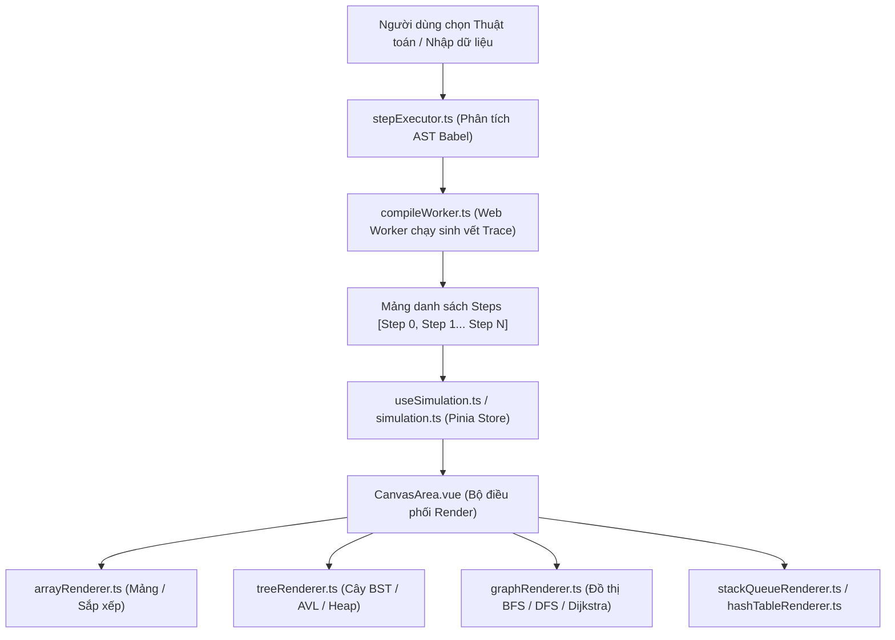

# 🔬 PHÂN HỆ 3: PHÒNG THÍ NGHIỆM THUẬT TOÁN (ALGORITHM LAB FLOW)

Đây là phân hệ chứa đựng **công nghệ cốt lõi và độc đáo nhất của DSA Visual**: Cho phép người học can thiệp, chạy từng bước và quan sát biến đổi cấu trúc dữ liệu theo thời gian thực.

---

## 1. MÀN HÌNH 33: KHÁM PHÁ THƯ VIỆN THUẬT TOÁN (SIMULATIONS VIEW)

* **URL**: `/simulations`
* **File Vue**: [`SimulationsView.vue`](file:///d:/FPT/metqua/frontend/src/views/SimulationsView.vue)
* **Quyền truy cập**: Công khai (Public).

```
┌────────────────────────────────────────────────────────────────────────┐
│ 🔭 THƯ VIỆN 44 THUẬT TOÁN & CẤU TRÚC DỮ LIỆU                           │
│ [ Tất cả (44) ] [ Sắp xếp (6) ] [ Tìm kiếm (2) ] [ Cây (8) ] [ Đồ thị (3) ]...│
├────────────────────────────────────────────────────────────────────────┤
│ [ Tab: Thư viện mô phỏng ]  [ Tab: Đo hiệu năng Benchmark ]  [ CheatSheet ]│
│                                                                        │
│ ┌──────────────────────┐  ┌──────────────────────┐  ┌────────────────┐ │
│ │ 🟢 Bubble Sort       │  │ 🟢 Binary Search     │  │ 🔵 AVL Tree    │ │
│ │ Độ phức tạp: O(n²)   │  │ Độ phức tạp: O(log n)│  │ Cân bằng & Xoay│ │
│ │ Thao tác: So sánh/Đổi│  │ Thao tác: Chia đôi   │  │ LL/RR/LR/RL    │ │
│ │ [ Chạy mô phỏng → ]  │  │ [ Chạy mô phỏng → ]  │  │ [ Xem ngay → ] │ │
│ └──────────────────────┘  └──────────────────────┘  └────────────────┘ │
└────────────────────────────────────────────────────────────────────────┘
```

### Tính năng tích hợp:
1. **Catalog Filter**: Lọc theo 44 thuật toán chuẩn từ [`shared/simulation-catalog.json`](file:///d:/FPT/metqua/shared/simulation-catalog.json).
2. **Benchmark Tab**: Chạy đo tốc độ thực thi giữa các thuật toán (ví dụ: So sánh QuickSort vs MergeSort vs BubbleSort trên mảng $10,000$ phần tử) bằng Web Worker không gây đơ trình duyệt.

---

## 2. MÀN HÌNH 05: TRÌNH MÔ PHỎNG CHI TIẾT (SIMULATOR VIEW)

* **URL**: `/simulator/:key` (Ví dụ: `/simulator/sort.bubble`, `/simulator/tree.avl-insert`, `/simulator/graph.dijkstra`)
* **File Vue**: [`SimulatorView.vue`](file:///d:/FPT/metqua/frontend/src/views/SimulatorView.vue)
* **Quyền truy cập**: Public với 3 demo công khai (`sort.bubble`, `search.binary`, `graph.bfs`), cần đăng nhập với các key còn lại.

```
┌────────────────────────────────────────────────────────────────────────┐
│ 3 VÙNG TIÊU CHUẨN TRÊN SÂN KHẤU DỮ LIỆU:                              │
│                                                                        │
│ 1. CỘT TRÁI (3/12): MÃ GIẢ (PseudocodePanel) + NGĂN XẾP (CallStack)    │
│    - Hiển thị từng dòng mã giải thuật.                                │
│    - Highlight đúng dòng đang thực thi tại bước hiện tại.             │
│                                                                        │
│ 2. CỘT GIỮA (6/12): SÂN KHẤU CANVAS (CanvasArea) + ĐIỀU KHIỂN (VCR)    │
│    - Canvas render đồ họa động 60FPS: Cột mảng / Nút cây / Đồ thị.     │
│    - Thanh điều khiển: Reset | Lùi 1 bước | PLAY/PAUSE | Tiến 1 bước. │
│    - Thanh trượt tiến trình (Scrubber Slider) để nhảy tới bất kỳ bước.│
│    - Hộp thoại nhập mảng dữ liệu tùy chỉnh (InputModal).              │
│                                                                        │
│ 3. CỘT PHẢI (3/12): GIẢI THÍCH (ExplainPanel) + AI EXPLAINER           │
│    - Lời văn giải thích chi tiết ý nghĩa bước đi hiện tại.            │
│    - Bảng thống kê biến ($i, j, mid, count$).                          │
│    - Nút "Hỏi AI giải thích bước này" (AiStepExplainerModal).         │
└────────────────────────────────────────────────────────────────────────┘
```

### Kiến trúc Hoạt động của Engine Mô Phỏng:



---

## 3. MÀN HÌNH 16: TRÌNH BIÊN DỊCH & CHẠY CODE TRỰC TIẾP (CODE RUNNER VIEW)

* **URL**: `/code/:key`
* **File Vue**: [`CodeRunnerView.vue`](file:///d:/FPT/metqua/frontend/src/views/CodeRunnerView.vue)
* **Quyền truy cập**: Đã đăng nhập (`requiresAuth: true`).

### Mắt thấy gì trên giao diện?
* **Trình soạn thảo Monaco Editor** (chuẩn VS Code) với tính năng tô màu cú pháp đa ngôn ngữ (JavaScript, C++, Java, Python).
* Nút **"Chạy code" (Run)** $\rightarrow$ Gửi code sang Web Worker hoặc API Sandbox Backend.
* Khung Terminal xuất kết quả `stdout`, `stderr` và thời gian thực thi (Execution time in ms).

---

## 4. MÀN HÌNH 18: BẢNG TRA CỨU NHANH (CHEATSHEET VIEW)

* **URL**: `/cheatsheet`
* **File Vue**: [`CheatSheetView.vue`](file:///d:/FPT/metqua/frontend/src/views/CheatSheetView.vue)
* **Quyền truy cập**: Đã đăng nhập (`requiresAuth: true`).

### Mắt thấy gì trên giao diện?
* Bảng so sánh tổng hợp độ phức tạp của toàn bộ các cấu trúc dữ liệu:
  * **Mảng & Danh sách liên kết**: Truy cập, Tìm kiếm, Chèn, Xóa.
  * **Cây BST, AVL, Red-Black**: Best / Average / Worst case.
  * **Thuật toán Sắp xếp**: Thời gian (Best/Avg/Worst) & Bộ nhớ (Space complexity).
* Mỗi thuật toán có nút bấm trực tiếp nhảy sang Trình mô phỏng tương ứng.
