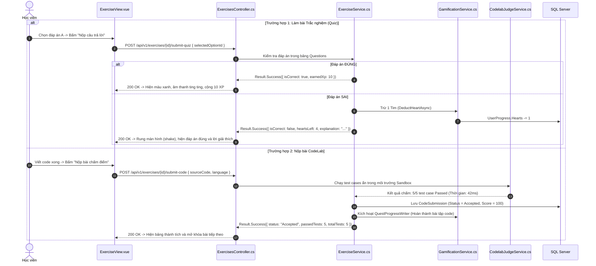

# 📝 PHÂN HỆ 4: LUYỆN TẬP & ĐÁNH GIÁ (PRACTICE & EXERCISE FLOW)

Phân hệ Luyện tập giúp học viên kiểm tra và củng cố kiến thức đã học qua 2 hình thức: **Trắc nghiệm thuật toán (Quiz)** và **Lập trình thực chiến (Codelab)**.

---

## 1. MÀN HÌNH 06: BÀI TẬP & ĐÁNH GIÁ (EXERCISE VIEW)

* **URL**: `/exercise/:id`
* **File Vue**: [`ExerciseView.vue`](file:///d:/FPT/metqua/frontend/src/views/ExerciseView.vue)
* **Quyền truy cập**: Đã đăng nhập (`requiresAuth: true`).

```
┌────────────────────────────────────────────────────────────────────────┐
│ [← Thoát]  BÀI TẬP: CÂN BẰNG CÂY AVL       [❤️❤️❤️❤️🤍 4/5] [Thời gian: 04:30]│
├────────────────────────────────────────────────────────────────────────┤
│ THỂ LOẠI 1: TRẮC NGHIỆM THUẬT TOÁN (QUIZ)                              │
│                                                                        │
│ Câu 2/5: Khi chèn giá trị 15 vào cây AVL bên dưới, phép xoay nào      │
│          cần được thực hiện để tái cân bằng?                          │
│                                                                        │
│  [A] Xoay đơn trái (Left Rotation - LL)                                │
│  [B] Xoay đơn phải (Right Rotation - RR)                               │
│  [C] Xoay kép Trái - Phải (Left-Right Rotation - LR)                    │
│  [D] Xoay kép Phải - Trái (Right-Left Rotation - RL)                    │
│                                                                        │
│  [ NỘP CÂU TRẢ LỜI ]    (Lưu ý: Trả lời sai sẽ bị trừ 1 Tim ❤️)        │
├────────────────────────────────────────────────────────────────────────┤
│ THỂ LOẠI 2: LẬP TRÌNH THỰC HÀNH (CODELAB MONACO)                       │
│                                                                        │
│ Yêu cầu: Viết hàm `binarySearch(arr, target)` trả về index tìm thấy.   │
│ [ Monaco Editor ]                   [ Test Cases ]                     │
│ function binarySearch(arr, target) {│ Test 1: [1,2,3,4,5], t=3 => ✅ PASS│
│   // Code tại đây...                │ Test 2: [1,3,7,9], t=8 => ✅ PASS │
│ }                                   │ Test 3: [], t=1 => ❌ FAIL       │
│                                                                        │
│ [ CHẠY THỬ TEST CASE ]             [ NỘP BÀI CHẤM ĐIỂM ]               │
└────────────────────────────────────────────────────────────────────────┘
```

---

## 2. LUỒNG XỬ LÝ CHẤM ĐIỂM & TRỪ TIM (EXERCISE SUBMISSION FLOW)



---

## 3. CÁC FILE MÃ NGUỒN LIÊN QUAN

* **Frontend**:
  * [`ExerciseView.vue`](file:///d:/FPT/metqua/frontend/src/views/ExerciseView.vue): Giao diện làm bài.
  * `frontend/src/features/quiz-system/`: Component câu hỏi và xử lý trạng thái.
* **Backend**:
  * [`ExercisesController.cs`](file:///d:/FPT/metqua/backend/src/DsaVisual.Api/Controllers/ExercisesController.cs): API tiếp nhận bài nộp.
  * [`ExerciseService.cs`](file:///d:/FPT/metqua/backend/src/DsaVisual.Application/Services/ExerciseService.cs): Xử lý chấm điểm trắc nghiệm.
  * [`CodelabJudgeService.cs`](file:///d:/FPT/metqua/backend/src/DsaVisual.Application/Services/CodelabJudgeService.cs): Chấm mã nguồn với Test Case.
  * [`ExerciseSubmission.cs`](file:///d:/FPT/metqua/backend/src/DsaVisual.Application/Persistence/Entities/ExerciseSubmission.cs) & [`CodeSubmission.cs`](file:///d:/FPT/metqua/backend/src/DsaVisual.Application/Persistence/Entities/CodeSubmission.cs): Entity lưu trữ lịch sử nộp bài.
