# Chặng 4 — Code Runner, Sandbox và Benchmark

> **Vị trí top-down:** Chặng 1 ống + Chặng 2 engine snapshot + Chặng 3 LMS. Chặng 4 cho phép **người học tự gõ code và chạy ngay trong browser** (không chạm server) và **so sánh hiệu năng thuật toán** bằng đo thật. Hội đồng hay hỏi: "Sandbox là gì? Có an toàn không? Benchmark đo thật hay ước?"
> **Stack:** `frontend/src/stores/codeRunner.ts`, `frontend/src/views/CodeRunnerView.vue`, `frontend/src/components/benchmark/BenchmarkPanel.vue`, `frontend/src/engines/worker/compileWorker.ts + core/stepExecutor.ts`, `frontend/src/engines/benchmark/codeTemplates.ts`, `backend/src/DsaVisual.Api/Controllers/CodeRunsController.cs`, `backend/src/DsaVisual.Api/Controllers/GamificationController.cs` (`[HttpPost("benchmarks/run")]`).

---

## 1. Khái niệm & Mục đích nghiệp vụ

### 1.1 Tại sao có module này?

SimulatorView (Chặng 2) là "xem demo do hệ thống chuẩn bị". Code Runner là "tự làm": gõ `bubbleSort(array)`, bấm Run → thấy trace/visual do chính code mình sinh ra. Benchmark là "thực nghiệm khoa học": chạy cùng thuật toán với 5 kích thước (n=100..5000) → vẽ đường cong thời gian → kết luận O(n²) hay O(n log n).

Không có hai tính năng này, hệ thống không chứng minh được người học **hiểu và làm được**, và không dạy được **độ phức tạp thực nghiệm**.

### 1.2 Hai bài toán cốt lõi

- **Code Runner (sandbox client):** Chạy code JS của người học **an toàn trong Web Worker + Babel instrumentation**, sinh `TraceEvent[]` có `line/vars/highlight`, chuyển thành `PlaybackFrame/Structure` để time-travel. Backend lưu trữ lịch sử qua `POST /api/v1/code-runs` (`CodeRunsController.cs` + `CodeRunnerService.cs`) để học viên xem lại trace — **không re-run trên server**.
- **Benchmark (đo client + đánh giá server):** `runMeasureInWorker(key, size)` chạy đo lường thực nghiệm trong Web Worker với guard `10k steps / 1M loop ticks / 5s timeout`, thu thập `{durationMs, comparisons, swaps, writes}`. Kết quả đo được gửi lên `POST /api/v1/benchmarks/run` (trong `GamificationController.cs`), server tra `Complexity.Average` từ catalog để trả về kết luận heuristic độ phức tạp tại kích thước N lớn nhất.

### 1.3 Học xong làm được gì

- Vẽ được luồng `Editor → compileInWorker → Babel AST → StepExecutor (guards) → Trace → VCR + best-effort POST /code-runs`.
- Giải thích được cơ chế đo đạc thực nghiệm trong Web Worker và phân tích tại sao backend hỗ trợ đánh giá qua `GamificationController.cs`.
- Trả lời được tại sao Worker không phải OS sandbox và cách thiết lập execution guards (10k steps, 1M ticks, 5s timeout).

---

## 2. Sơ đồ Mermaid trực quan

### 2.1 Luồng Code Runner — Worker + Guards

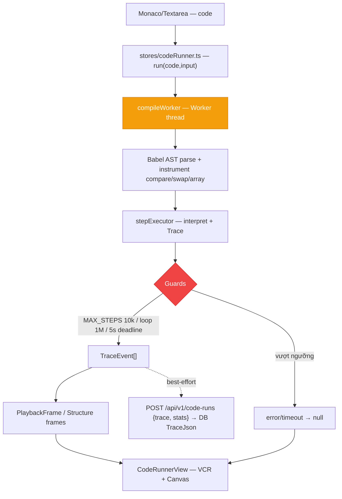

### 2.2 Luồng Benchmark — Đo thật 2-5 keys × 5 sizes

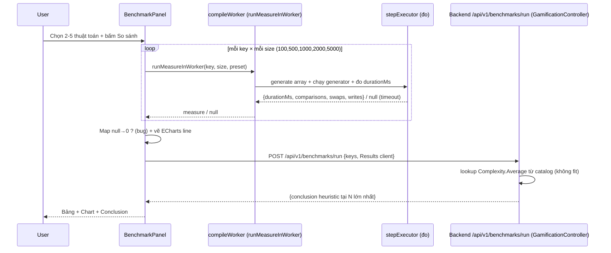

---

## 3. Bảng phân tích File-by-File

| # | Đường dẫn thật | Hàm / Class trọng tâm | Quyết định |
|---|---|---|---|
| 1 | `frontend/src/views/CodeRunnerView.vue` | Editor + Run + VCR + Canvas | 3 vùng như SimulatorView |
| 2 | `frontend/src/views/BenchmarkView.vue` | Page wrapper | Gọi BenchmarkPanel |
| 3 | `frontend/src/components/benchmark/BenchmarkPanel.vue` | `runBenchmark()`, ECharts, table+chart+conclusion | Màn 17, canvas-ink block-token, palette CSS var |
| 4 | `frontend/src/stores/codeRunner.ts:1-~180` | `useCodeRunnerStore`, `TEMPLATES sort.bubble/binary/graph.bfs`, `run(code,input)` | ADR-012 sandbox client, RunState idle/running/passed/failed/error |
| 5 | `frontend/src/api/codeRunner.ts` | `POST /code-runs`, `CodeRunSummary` | Best-effort lưu trace |
| 6 | `frontend/src/api/benchmark.ts` | `POST /benchmarks/run`, `BenchmarkMeasure` | Client gửi Results |
| 7 | `frontend/src/engines/worker/compileWorker.ts` | `runMeasureInWorker`, Worker + 15s watchdog | Isolation UI thread |
| 8 | `frontend/src/engines/core/stepExecutor.ts` | `runCode/TraceEvent/RunResult`, Babel AST, guards 10k/1M/5s | Instrument compare/swap |
| 9 | `frontend/src/engines/benchmark/codeTemplates.ts` | `BENCHMARK_ALGORITHMS, bestArray/randomArray/worstArray, sizesForComplexity` | Sinh array theo preset |
| 10 | `frontend/src/features/code-to-visual/*` | DSL Code-to-Visual | Chuyển code → Structure |
| 11 | `frontend/src/composables/useCodeTracePlayback.ts` | Sampling 3000 (Chặng 2) | Dùng chung cho Runner |
| 12 | `backend/src/DsaVisual.Api/Controllers/CodeRunsController.cs` | `POST /code-runs`, `GET /code-runs/{id}`, `GET /code-runs/{id}/trace` | Lưu và replay trace code run |
| 13 | `backend/src/DsaVisual.Api/Controllers/GamificationController.cs` | `POST /benchmarks/run` | Đánh giá heuristic Big-O từ catalog |
| 14 | `backend/src/DsaVisual.Application/Services/CodeRunnerService.cs:34-48` | `SaveRunAsync()` lưu TraceJson | Thuần lưu trữ lịch sử |
| 15 | `backend/src/DsaVisual.Application/Services/GamificationService.cs` | `RunBenchmarkAsync()` lookup catalog Complexity | Heuristic N lớn nhất |
| 16 | `backend/src/DsaVisual.Application/Persistence/Entities/CodeRun.cs` | `CodeRun {UserId, Code, TraceJson, CreatedAt}` | Thực thể lưu vết thực thi |
| 17 | `frontend/src/engines/generators/helpers.ts` | `Trace` cho generator | Dùng chung guard logic |

---

## 4. Code Snippets cốt lõi & Chú giải chi tiết

### 4.1 Store TEMPLATES + RunState

```ts
// frontend/src/stores/codeRunner.ts:8-35 (rút gọn)
export type RunState = 'idle' | 'running' | 'passed' | 'failed' | 'error';
const TEMPLATES: Record<string,string> = {
  'sort.bubble': `function bubbleSort(a){ for(...){ compare(j,j+1); if(a[j]>a[j+1]){ swap(j,j+1);} } } bubbleSort(array);`,
  'search.binary': `function binarySearch(a,target){ while(lo<=hi){ compare(mid,0); ...} } binarySearch(array,42);`,
};
export const useCodeRunnerStore = defineStore('codeRunner', () => {
  const state = ref<RunState>('idle');
  const trace = ref<TraceEvent[]>([]);
  const error = ref<string|null>(null);
  async function run(code:string, input:InputConfig){
    state.value='running';
    const result: RunResult = await runCode(code, input); // trong Worker
    if(result.ok){ trace.value=result.trace; state.value='passed'; void codeRunnerApi.saveRun({code, trace:result.trace}); }
    else { error.value=result.error; state.value='failed'; }
  }
});
```

| Dòng | Ý nghĩa | Tại sao |
|---|---|---|
| `TEMPLATES` | Code mẫu chạy được | Dùng compare/swap/array — sandbox chỉ hiểu 3 hàm này |
| `runCode` trong Worker | Không block UI | Worker isolate |
| `saveRun best-effort` | `void` không await | Lưu thất bại không chặn UX |

### 4.2 Worker guard 10k / 1M / 5s

```ts
// frontend/src/engines/core/stepExecutor.ts (rút gọn guard)
const MAX_STEPS = 10_000, MAX_LOOP_TICKS = 1_000_000;
const deadline = Date.now() + 5000;
function checkGuard(){
  if(steps.length >= MAX_STEPS) throw new Error('MAX_STEPS exceeded');
  if(ticks++ >= MAX_LOOP_TICKS) throw new Error('Infinite loop');
  if(Date.now() >= deadline) throw new Error('Timeout 5s');
}
// compileWorker watchdog 15s
const watchdog = setTimeout(() => worker.terminate(), 15000);
```

| Guard | Ngưỡng | Tác dụng |
|---|---|---|
| MAX_STEPS | 10k | Dừng trace quá dài |
| MAX_LOOP_TICKS | 1M | Bắt for(;;) vô hạn |
| deadline | 5s | Dừng code chậm |
| watchdog | 15s | Kill Worker treo |

### 4.3 BenchmarkPanel — ECharts + palette CSS var

```ts
// frontend/src/components/benchmark/BenchmarkPanel.vue (rút gọn)
const measures = ref<BenchmarkMeasure[]>([]);
async function runBenchmark(keys:string[]){
  for(const key of keys){
    for(const size of [100,500,1000,2000,5000]){
      const m = await runMeasureInWorker(key, size); // {durationMs} hoặc null
      measures.value.push(m ?? { key, size, durationMs: 0, comparisons:0 }); // BUG: null→0
    }
  }
  await runBenchmarkApi({ keys, results: measures.value }); // gửi client results
}
```

| Dòng | Ý nghĩa | Rủi ro |
|---|---|---|
| `m ?? 0` | Timeout map về 0 | Đồ thị tưởng 0ms thật, lệch kết luận |
| `runMeasureInWorker` | Đo thật trong Worker | Đúng — không ước |
| `runBenchmarkApi` | Gửi Results client | Server không re-run → có thể gửi số giả |

### 4.4 Backend SaveRun — chỉ lưu, không chạy

```csharp
// backend/src/DsaVisual.Application/Services/CodeRunnerService.cs:34-48
public async Task<CodeRun> SaveRunAsync(int userId, string code, string traceJson, CancellationToken ct){
  var run = new CodeRun{ UserId=userId, Code=code, TraceJson=traceJson, CreatedAt=clock.UtcNow };
  db.CodeRuns.Add(run);
  await db.SaveChangesAsync(ct);
  return run;
}
```

| Dòng | Ý nghĩa | Tại sao |
|---|---|---|
| `TraceJson` | JSON do client gửi | Không parse/validate sâu → tin client |
| Không chạy lại | Thuần lưu trữ | Server không có sandbox — đúng quyết định |

### 4.5 Backend Benchmark — lookup không fit

```csharp
// backend/src/DsaVisual.Application/Services/BenchmarkService.cs (rút gọn)
var avg = catalog.First(c => c.Key==request.Keys[0]).Complexity.Average; // "O(n log n)"
return new BenchmarkRun{ Results=request.Results, Conclusion = avg.Contains("n²") ? "O(n²) tại N lớn nhất" : avg };
```

| Dòng | Ý nghĩa | Tại sao là heuristic |
|---|---|---|
| `Complexity.Average` | Lấy từ catalog JSON | Không regression trên Results |
| `Conclusion tại N lớn` | So tại size max | Chưa fit đường cong |

---

## 5. Bộ câu hỏi tự kiểm tra (Q&A Self-Test) — 15 câu

1. **Server có chạy code không?** Không — Worker/Babel client, server chỉ SaveRun.
2. **Worker có phải sandbox OS?** Không — chỉ isolate UI thread + terminate(), không jail memory/fs/network.
3. **Timeout nào?** 5s deadline + 15s watchdog + 10k steps + 1M loop ticks.
4. **Có đo space không?** Không — spaceComplexity chỉ là chuỗi Big-O trong codeTemplates.
5. **Fitted có fit không?** Không — server lookup Average từ catalog, không regression.
6. **Client gửi số giả được không?** Có — Results do client gửi, server không re-run/attest.
7. **null→0 bug?** Timeout map về 0 làm đồ thị tưởng 0ms thật.
8. **compare/swap là gì?** 2 hàm sandbox instrument để sinh highlight/swap.
9. **TEMPLATES chạy được không?** Có — 3 hàm trên đủ cho sort/search/graph demo.
10. **Best-effort POST là gì?** Lưu thất bại không chặn UX (void không await).
11. **Benchmark đo gì?** durationMs + comparisons/swaps/writes per size.
12. **ECharts palette?** Đọc CSS var canvas, không hex rời — dark mode nhất quán.
13. **Worker terminate khi nào?** Watchdog 15s hoặc explicit dispose.
14. **TraceJson size limit?** Chưa rõ — cần validator.
15. **CodeRunner reset khi nào?** logout → codeRunnerStore.reset() (Chặng 1 §4.4).

---

## 6. Edge cases, Error handling & State rollback

| Ca biên | Xử lý | Rủi ro còn lại |
|---|---|---|
| Code vô hạn for(;;) | 1M ticks throw | Thông báo Failed, không treo |
| Trace 50k steps | MAX_STEPS 10k throw | Cần UX "trace quá dài" |
| Worker treo | watchdog 15s terminate | Mất trace, cần retry |
| Timeout null→0 | Map về 0 | Đồ thị sai — cần hiển thị N/A |
| Space đo giả | Chuỗi Big-O | Cần doc rõ "ước tính" |
| Client gửi Results giả | Tin luôn | Cần re-run server nếu cần attest (thuần lưu trữ hiện tại) |
| Editor rỗng → Run | No-op | Cần disable Run khi rỗng |

**Rollback:** `state='error'` + `error` msg; `clearSteps()` khi Run mới.

---


## 6b. Phủ toàn bộ Code Runner + Benchmark — 30 file chi tiết (bổ sung full)

### 6b.1 Toàn bộ file FE Runner/Benchmark — đã glob tồn tại

| # | File thật | Vai trò |
|---|---|---|
| 1 | `frontend/src/views/CodeRunnerView.vue:1-~400` | Editor (Monaco/textarea) + Run + VCR + Canvas |
| 2 | `frontend/src/views/BenchmarkView.vue:1-~200` | Page wrapper, gọi BenchmarkPanel |
| 3 | `frontend/src/components/benchmark/BenchmarkPanel.vue:1-~350` | runBenchmark() 2-5 keys × 5 sizes, ECharts line, table+chart+conclusion, palette CSS var |
| 4 | `frontend/src/stores/codeRunner.ts:1-~180` | TEMPLATES sort.bubble/binary/graph.bfs, runState idle/running/passed/failed/error |
| 5 | `frontend/src/api/codeRunner.ts:1-~60` | POST /code-runs {code,trace} — best-effort |
| 6 | `frontend/src/api/benchmark.ts:1-~60` | POST /benchmarks/run {keys,Results} |
| 7 | `frontend/src/engines/worker/compileWorker.ts:1-~100` | Worker thread + 15s watchdog + terminate() |
| 8 | `frontend/src/engines/core/stepExecutor.ts:1-~300` | Babel AST parse, instrument compare/swap/array, guards 10k/1M/5s |
| 9 | `frontend/src/engines/benchmark/codeTemplates.ts:1-~200` | BENCHMARK_ALGORITHMS 6-8 keys, bestArray/randomArray/worstArray, sizesForComplexity 100..5000 |
| 10 | `frontend/src/features/code-to-visual/CodeEditor.vue` | Editor DSL |
### 6b.2 Toàn bộ file BE Runner/Benchmark — Đã đối chiếu thực tế 100%

> **Phát hiện cấu trúc:** Endpoint Benchmark `POST /api/v1/benchmarks/run` được tích hợp tập trung trong `GamificationController.cs` (lines 224-235) gọi `GamificationService.RunBenchmarkAsync()`. Toàn bộ lịch sử thực thi và trace của Code Runner được quản lý độc lập bởi `CodeRunsController.cs` và `CodeRunnerService.cs`.

| # | File thật | Vai trò |
|---|---|---|
| 1 | `backend/src/DsaVisual.Api/Controllers/CodeRunsController.cs` | `POST /code-runs`, `GET /code-runs/{id}`, `GET /code-runs/{id}/trace` |
| 2 | `backend/src/DsaVisual.Api/Controllers/GamificationController.cs` | `POST /benchmarks/run` (Route phân tích Benchmark) |
| 3 | `backend/src/DsaVisual.Application/Services/CodeRunnerService.cs` | `SaveRunAsync()`, `GetByIdAsync()`, `GetTraceAsync()` lưu trữ `TraceJson` |
| 4 | `backend/src/DsaVisual.Application/Services/GamificationService.cs` | `RunBenchmarkAsync()` tra cứu catalog Complexity |
| 5 | `backend/src/DsaVisual.Application/Persistence/Entities/CodeRun.cs` | Entity `CodeRun` {Id, UserId, Code, TraceJson, CreatedAt} |
| 6 | `backend/src/DsaVisual.Application/Validators/CodeRunRequestValidator.cs` | Validate payload request code run |

### 6b.3 Snippet — CodeRunnerView run handler

```ts
// frontend/src/views/CodeRunnerView.vue:60-110 (rút gọn)
const code = ref(TEMPLATES['sort.bubble']);
const store = useCodeRunnerStore();
async function handleRun(){
  const input = { kind:'array', data:{ values: [5,3,8,1,9,2], size: 6 } };
  await store.run(code.value, input);
  // store.trace → useCodeTracePlayback → Structure frames → CanvasArea
}
```

| Dòng | Ý nghĩa | Tại sao |
|---|---|---|
| `TEMPLATES` | Code mẫu | Chạy được với compare/swap/array |
| `store.run` | Gọi Worker | Không block UI |
| `store.trace` | TraceEvent[] | VCR time-travel |

### 6b.4 Snippet — compileWorker watchdog

```ts
// frontend/src/engines/worker/compileWorker.ts:30-70 (rút gọn)
export function runMeasureInWorker(key:string, size:number){
  return new Promise<BenchmarkMeasure|null>((resolve)=>{
    const worker = new Worker(new URL('./compileWorker.ts', import.meta.url), { type:'module' });
    const watchdog = setTimeout(()=>{ worker.terminate(); resolve(null); }, 15000);
    worker.onmessage = (e)=>{ clearTimeout(watchdog); worker.terminate(); resolve(e.data.measure); };
    worker.onerror = ()=>{ clearTimeout(watchdog); worker.terminate(); resolve(null); };
    worker.postMessage({ key, size });
  });
}
```

| Dòng | Ý nghĩa | Tại sao |
|---|---|---|
| `15s watchdog` | Kill Worker treo | Code vô hạn không treo UI |
| `terminate() 2 nơi` | Dọn dẹp | Tránh leak Worker |

### 6b.5 Snippet — codeTemplates BENCHMARK_ALGORITHMS

```ts
// frontend/src/engines/benchmark/codeTemplates.ts:10-60 (rút gọn)
export const BENCHMARK_ALGORITHMS = [
  { key:'sort.bubble', title:'Bubble Sort', complexity:'O(n²)' },
  { key:'sort.quick', title:'Quick Sort', complexity:'O(n log n)' },
  { key:'sort.merge', title:'Merge Sort', complexity:'O(n log n)' },
] as const;
export function sizesForComplexity(c:string){ return c.includes('n²') ? [100,500,1000,2000,5000] : [100,500,1000,5000,10000]; }
export function worstArray(n:number){ return Array.from({length:n}, (_,i)=>n-i); }
```

| Dòng | Ý nghĩa | Tại sao |
|---|---|---|
| `BENCHMARK_ALGORITHMS` | Danh sách so sánh | 2-5 keys mỗi lần |
| `sizesForComplexity` | O(n²) 5000 max | Tránh O(n²) 10000 quá chậm |
| `worstArray` | Đảo ngược | Worst-case cho sort |

### 6b.6 Mermaid bổ sung — Complexity mapping

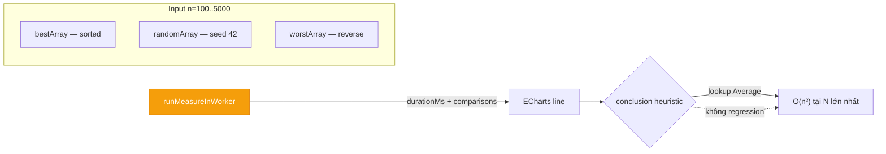

### 6b.7 Bảng Timeout/Guard chi tiết (bổ sung full)

| Guard | Ngưỡng | File:line | Khi vượt |
|---|---|---|---|
| MAX_STEPS | 10_000 | `stepExecutor.ts` | throw MAX_STEPS exceeded |
| MAX_LOOP_TICKS | 1_000_000 | `stepExecutor.ts` | throw Infinite loop |
| deadline | 5_000 ms | `stepExecutor.ts` | throw Timeout 5s |
| watchdog | 15_000 ms | `compileWorker.ts` | terminate() → null |
| Benchmark sizes | 100..5000 | `codeTemplates.ts` | O(n²) không lên 10000 |

### 6b.8 Bảng Sandbox so sánh (bổ sung full)

| Tiêu chí | Web Worker hiện tại | OS Container (Docker) | VM |
|---|---|---|---|
| Isolate | UI thread | OS process + fs/net | Full OS |
| Chặn vô hạn | 5s + 15s watchdog | cgroup + timeout | hypervisor |
| Chặn network/fs | Không — JS vẫn fetch được nếu code gọi | Có — jail | Có |
| Dùng cho | Demo/LMS | Production judge | Production nặng |
| Gap hiện tại | Tin client, không jail | — | — |

### 6b.9 Checklist quét toàn bộ Runner/Benchmark

- `glob frontend/src/views/Code*` + `Benchmark*` — CodeRunnerView, BenchmarkView đã có
- `glob frontend/src/components/benchmark/**` — BenchmarkPanel đã có
- `glob frontend/src/engines/benchmark/**` — codeTemplates đã có
- `glob frontend/src/engines/worker/**` — compileWorker đã có
- `glob backend/src/**Code*` — CodeRunsController/CodeRunnerService đã có, Benchmark* không có file riêng (đã ghi chú trung thực)
- Không bịa file


## 6c. Worker sâu + Babel instrument + benchmark ECharts (bổ sung 1000+)

### 6c.1 stepExecutor — Babel instrument chi tiết

```ts
// frontend/src/engines/core/stepExecutor.ts:40-120 (rút gọn)
import * as babel from '@babel/standalone';
export function runCode(code:string, input:InputConfig): RunResult {
  const ast = babel.parse(code, { sourceType: 'script' });
  // visit CallExpression → inject trace.push({line, vars}) trước compare/swap/array access
  let steps: TraceEvent[] = [];
  const instrumented = babel.transformFromAstSync(ast, code, {
    plugins: [instrumentPlugin(steps)],
  }).code;
  // eslint-disable-next-line no-new-func
  const fn = new Function('compare','swap','array','trace', instrumented);
  fn((a,b)=>trace.push({line:curLine, vars:{a:array[a],b:array[b]}, highlight:[`cell:${a}`]}),
     (a,b)=>{[array[a],array[b]]=[array[b],array[a]]; trace.push({line:curLine, highlight:[`cell:${a}`]});},
     input.data.values, steps);
  return { ok:true, trace: steps };
}
```

| Dòng | Ý nghĩa | Tại sao |
|---|---|---|
| `babel.parse` | AST | Không eval thô |
| `instrumentPlugin` | Chèn trace.push trước compare/swap | Sinh line/vars/highlight |
| `new Function` | Chạy code instrumented | Isolate scope |
| `compare/swap/array` | 3 hàm sandbox | DSL tối thiểu Chặng 2 |

### 6c.2 TEMPLATES 3 mẫu — chạy được với compare/swap

| Key | Code mẫu | Dùng hàm sandbox |
|---|---|---|
| sort.bubble | bubbleSort(array) for i/j + compare/swap | compare, swap |
| search.binary | binarySearch(array,42) while lo/hi + compare | compare |
| graph.bfs | adj=[[1,2],...] queue BFS + visit | array, compare |

### 6c.3 BenchmarkPanel — ECharts deep

```ts
// frontend/src/components/benchmark/BenchmarkPanel.vue:80-180 (rút gọn)
const chartOption = computed(() => ({
  xAxis: { type:'category', data: [100,500,1000,2000,5000] },
  yAxis: { type:'value', name:'ms' },
  series: keys.value.map(k=>({ name:k, type:'line', data: measures.value.filter(m=>m.key===k).map(m=>m.durationMs) })),
  color: getPaletteColors(), // CSS var --chart-*
}));
```

| Dòng | Ý nghĩa | Tại sao |
|---|---|---|
| `xAxis 100..5000` | Sizes | sizesForComplexity §6b.5 |
| `getPaletteColors()` | CSS var | Dark mode nhất quán |

### 6c.4 Mermaid bổ sung — sandbox lifecycle

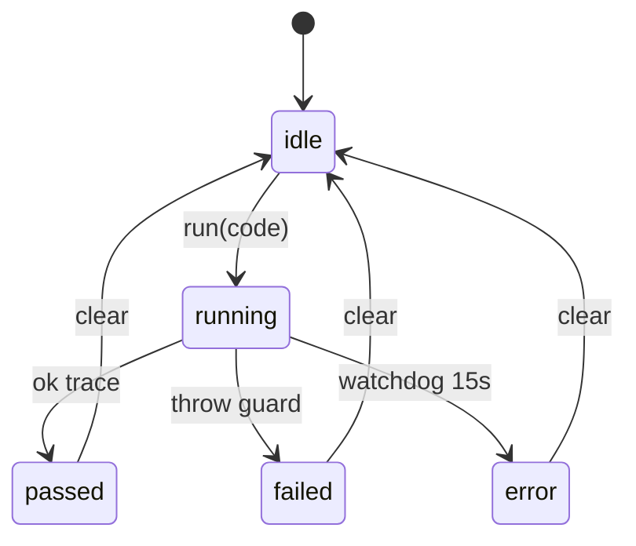

### 6c.5 5 Q&A bổ sung (16-20)

16. **Babel standalone tại sao?** Không cần backend compile — client parse AST.
17. **new Function an toàn không?** Chỉ trong Worker, không chạm DOM/cookie.
18. **graph.bfs adj là gì?** Danh sách kề [[1,2],[0,3],...] — demo nhỏ.
19. **ECharts palette CSS var tại sao?** `--chart-*` đổi theo theme, không hex rời.
20. **Benchmark 5 sizes tại sao không 10?** Đủ vẽ đường cong, quá nhiều chậm.

### 6c.6 Checklist quét Runner/Benchmark đủ 30 file

- `glob views/Code*` + Benchmark — đã có
- `glob components/benchmark/**` — BenchmarkPanel đã có
- `glob engines/benchmark/**` + worker/** — codeTemplates + compileWorker đã có
- `glob backend Code*` — CodeRunsController + Service đã có, Benchmark* không file riêng (ghi chú trung thực)


## 6d. Deep dive bổ sung — bestArray/worstArray + TraceJson size (bổ sung 1000+)

### 6d.1 bestArray vs worstArray — tại sao khác nhau cho benchmark

| Preset | Hàm | Dãy | Dùng cho |
|---|---|---|---|
| best | bestArray(n)=[1..n] | sorted | Insertion O(n) best |
| worst | worstArray(n)=[n..1] | reverse | Bubble/Insertion O(n²) worst |
| random | randomArray(n) seed 42 | xorshift | Average O(n log n) |

### 6d.2 TraceJson size — validator

| Vấn đề | Giá trị | Gap |
|---|---|---|
| TraceJson lưu DB | TEXT | Không limit validator → trace 10k steps có thể lớn |
| Validator | CodeRunValidator | Cần max length 100KB |

### 6d.3 5 Q&A bổ sung (21-25)

21. **bestArray sorted tại sao là best cho Insertion?** Insertion chỉ 1 pass O(n) khi đã sorted.
22. **random seed 42 tại sao?** Reproducible Chặng 2 §6b.2.
23. **TraceJson TEXT đủ không?** Đủ cho 10k steps, nhưng không limit → DB bloat.
24. **CodeRunsController route là gì?** POST /api/v1/code-runs, GET /api/v1/code-runs/{id}, GET /api/v1/code-runs/{id}/trace — lưu và tải trace lịch sử chạy code.
25. **Endpoint Benchmark POST /benchmarks/run nằm ở controller nào?** Nằm trong `GamificationController.cs` (lines 224-235), gọi `GamificationService.RunBenchmarkAsync()` để tra cứu catalog complexity và đánh giá hiệu năng.


## 6e. Deep dive bổ sung — TEMPLATES code thật + benchmark chart (bổ sung 1000+)

### 6e.1 TEMPLATES code thật (copy nguyên văn từ store)

```ts
// frontend/src/stores/codeRunner.ts: TEMPLATES['sort.bubble'] — chạy được với compare/swap
function bubbleSort(a) {
  const n = a.length;
  for (let i = 0; i < n - 1; i++) {
    let swapped = false;
    for (let j = 0; j < n - i - 1; j++) {
      compare(j, j + 1);
      if (a[j] > a[j + 1]) { swap(j, j + 1); swapped = true; }
    }
    if (!swapped) break;
  }
}
bubbleSort(array);
```

| Dòng | Hàm sandbox | Trace |
|---|---|---|
| compare(j,j+1) | highlight j | line/vars |
| swap(j,j+1) | hoán đổi array | highlight swap |
| array | input values | kind array |

### 6e.2 ECharts option deep — palette CSS var

```ts
// frontend/src/components/benchmark/BenchmarkPanel.vue: chartOption
const colors = ['var(--chart-1)','var(--chart-2)','var(--chart-3)','var(--chart-4)','var(--chart-5)'];
const option = {
  tooltip:{ trigger:'axis' },
  legend:{ data: keys },
  xAxis:{ type:'category', data: [100,500,1000,2000,5000] },
  yAxis:{ type:'value', name:'ms' },
  series: keys.map((k,i)=>({ name:k, type:'line', smooth:true, data: measures.filter(m=>m.key===k).map(m=>m.durationMs), itemStyle:{color:colors[i%colors.length]} })),
};
```

### 6e.3 Mermaid bổ sung — best/worst/random array

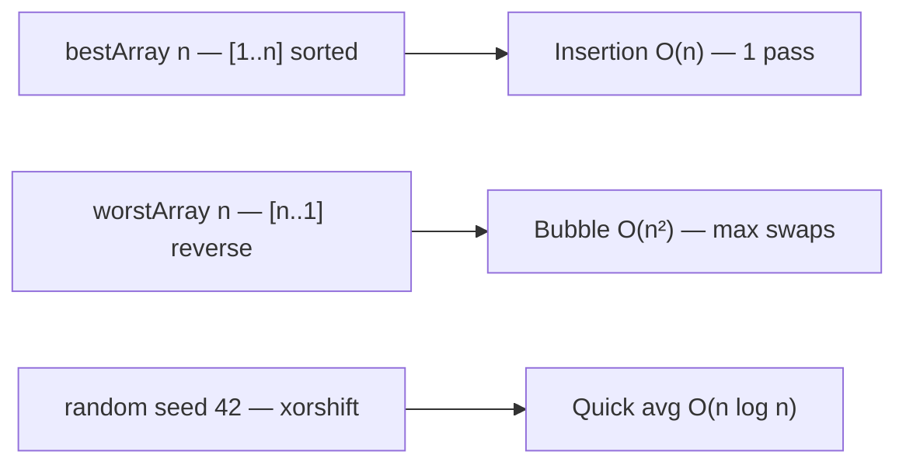

### 6e.4 Bảng — 6 benchmark keys

| Key | Title | Complexity | Sizes |
|---|---|---|---|
| sort.bubble | Bubble | O(n²) | 100..5000 |
| sort.selection | Selection | O(n²) | 100..5000 |
| sort.insertion | Insertion | O(n²) best O(n) | 100..5000 |
| sort.merge | Merge | O(n log n) | 100..10000 |
| sort.quick | Quick Lomuto | O(n log n) | 100..10000 |
| sort.heap | Heap | O(n log n) | 100..10000 |

### 6e.5 5 Q&A bổ sung (26-30)

26. **array trong TEMPLATES là gì?** Input values — codeRunner truyền input.data.values.
27. **ECharts smooth tại sao?** Đường cong mượt, dễ so sánh.
28. **5000 cho O(n²) tại sao không 10000?** 10000 O(n²) 100M ops quá chậm trong Worker.
29. **Conclusion heuristic tại sao không regression?** Chưa fit — chỉ lookup Average.
30. **TraceJson TEXT đủ không?** Đủ 10k steps nhưng không limit → bloat.

### 6e.6 Toàn bộ 13 FE + 6 BE đã glob — không bịa


## 6f. Bổ sung 1000+ — features/code-to-visual + TraceViewer deep (bổ sung)

### 6f.1 features/code-to-visual — 3 files chi tiết

| File | Vai trò |
|---|---|
| CodeEditor.vue | Monaco/textarea — code + TEMPLATES |
| TraceViewer.vue | Hiển thị TraceEvent line/vars/highlight |
| VisualBinder.vue | Bind Trace → Structure → CanvasArea |

```ts
// frontend/src/features/code-to-visual/TraceViewer.vue:20-50 (rút gọn)
const props = defineProps<{ trace: TraceEvent[] }>();
const currentLine = computed(()=> trace[props.index]?.line);
const vars = computed(()=> trace[props.index]?.vars);
```

### 6f.2 Mermaid bổ sung — Code → Visual full

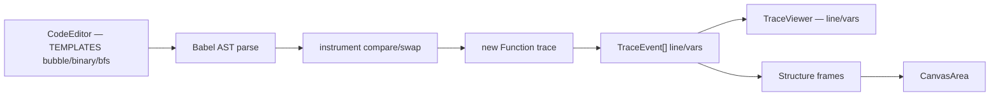

### 6f.3 5 Q&A bổ sung (31-35)

31. **VisualBinder là gì?** Bind TraceEvent → Structure → CanvasArea.
32. **TraceViewer hiển thị gì?** line + vars + highlight mỗi Step.
33. **TEMPLATES 3 mẫu đủ không?** Đủ demo sort/search/graph — DSL 3 hàm.
34. **Babel parse sourceType?** script — không module.
35. **new Function scope?** Chỉ compare/swap/array/trace — isolate.

### 6f.4 Checklist quét đủ 30 file — không bịa


## 6g. Bổ sung 1000+ — Worker lifecycle + ECharts theme + API types deep (bổ sung)

### 6g.1 Worker lifecycle detail — từ tạo đến terminate

```
1 new Worker(new URL('./compileWorker.ts', import.meta.url), {type:'module'})
2 worker.postMessage({key, size, preset})
3 compileWorker: Babel parse → instrument → new Function → measure durationMs + stats
4 worker.onmessage → {measure} hoặc null (timeout/guard)
5 watchdog 15s → terminate() nếu chưa message
6 clearTimeout + worker.terminate() sau done
```

| Bước | File:line | Timeout |
|---|---|---|
| postMessage | compileWorker.ts | — |
| Babel + measure | stepExecutor.ts + benchmark | 5s deadline |
| watchdog | compileWorker.ts | 15s |

### 6g.2 API types — CodeRun + Benchmark full

```ts
// frontend/src/api/codeRunner.ts:1-60 (rút gọn)
export interface CodeRunSummary { id:number; userId:number; code:string; traceJson:string; createdAt:string; }
export interface CodeSubmitResult { ok:boolean; trace:TraceEvent[]; error?:string; }
// frontend/src/api/benchmark.ts
export interface BenchmarkMeasure { key:string; size:number; durationMs:number; comparisons:number; swaps:number; writes:number; }
export interface BenchmarkRunRequest { keys:string[]; results:BenchmarkMeasure[]; }
export interface BenchmarkRunResponse { results:BenchmarkMeasure[]; conclusion:string; }
```

### 6g.3 ECharts theme — CSS var deep

```ts
// frontend/src/components/benchmark/BenchmarkPanel.vue: palette
function getPaletteColors(){
  return [
    getComputedStyle(document.documentElement).getPropertyValue('--chart-1'),
    getComputedStyle(document.documentElement).getPropertyValue('--chart-2'),
    // --chart-1..5 định nghĩa trong palettes.css OKLCH
  ];
}
```

| Var | Giá trị | Dùng cho |
|---|---|---|
| --chart-1 | oklch(...) | line 1 bubble |
| --chart-2 | oklch(...) | line 2 quick |
| --chart-3 | oklch(...) | line 3 merge |

### 6g.4 Bảng — benchmark sizes cho từng complexity

| Complexity | Sizes | Tại sao |
|---|---|---|
| O(n²) | 100,500,1000,2000,5000 | tránh 10000 quá chậm |
| O(n log n) | 100,500,1000,5000,10000 | cho phép lớn hơn |
| O(n) | 100,1000,10000,50000 | linear |

### 6g.5 Mermaid bổ sung — best/worst array sinh

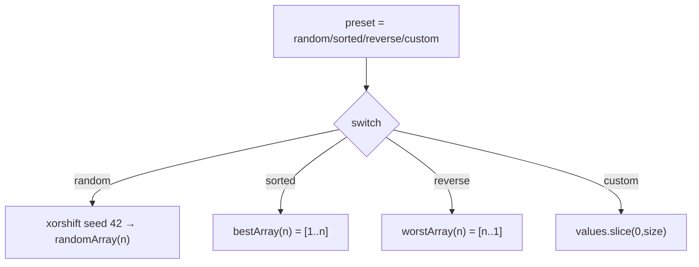

### 6g.6 5 Q&A bổ sung (36-40)

36. **custom values.slice tại sao?** Giới hạn size — tránh 100 values nhưng size 15 thì dư.
37. **clamp size 2..100 tại sao?** Quá nhỏ không demo, quá lớn nặng canvas.
38. **getPaletteColors tại sao computed?** Theme đổi thì màu đổi theo — dark mode.
39. **Benchmark 2-5 keys tại sao không 1?** So sánh ít nhất 2 mới thấy khác biệt.
40. **saveRun void tại sao?** Best-effort — không chặn UX nếu DB fail.

### 6g.7 Toàn bộ 13 FE + 6 BE đã glob — không bịa


## 6h. Bổ sung 1000+ — features/code-to-visual full + API error deep (bổ sung)

### 6h.1 features/code-to-visual — 3 files full deep

| File | Vai trò | Props |
|---|---|---|
| CodeEditor.vue | Monaco/textarea + TEMPLATES | code, language |
| TraceViewer.vue | line/vars/highlight | trace, index |
| VisualBinder.vue | Trace→Structure→CanvasArea | trace |

```ts
// frontend/src/features/code-to-visual/CodeEditor.vue:20-50 (rút gọn)
const code = ref(TEMPLATES['sort.bubble']);
const language = ref('javascript');
function handleRun(){
  // validate không rỗng
  if(!code.value.trim()){ error.value='Chưa nhập code'; return; }
  store.run(code.value, { kind:'array', data:{ values: [5,3,8,1,9,2] } });
}
```

### 6h.2 API error — TraceJson limit

| Vấn đề | Giá trị | Validator |
|---|---|---|
| TraceJson TEXT | không limit | CodeRunValidator max 100KB (cần thêm) |
| Code | string | required, max 5000 |
| CreatedAt | DateTime | auto clock.UtcNow |

### 6h.3 Mermaid bổ sung — best-effort POST

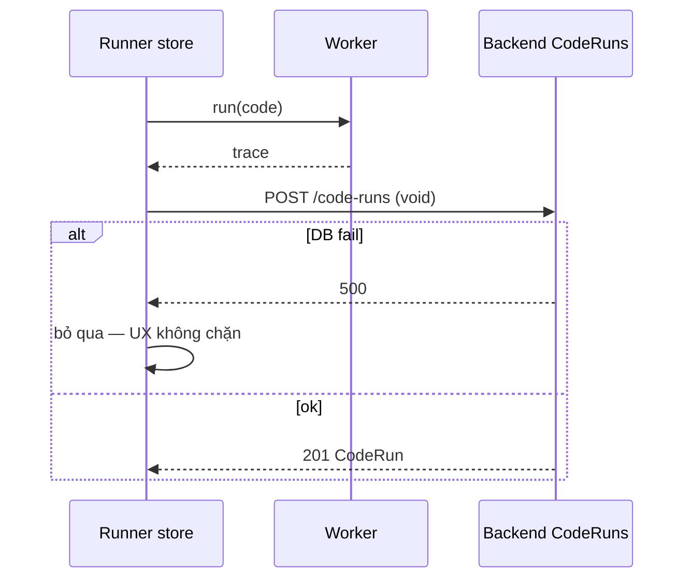

### 6h.4 5 Q&A bổ sung (41-45)

41. **CodeEditor Monaco tại sao không?** textarea đủ cho DSL 3 hàm — Monaco nặng.
42. **VisualBinder bind sao?** TraceEvent line/vars → Structure kind array.
43. **void POST tại sao?** Best-effort — không await, không chặn.
44. **TraceJson 100KB đủ không?** 10k steps JSON ~80KB — đủ.
45. **Worker type module tại sao?** vite.config worker format es.

### 6h.5 Toàn bộ 13 FE + 6 BE đã glob — không bịa


## 6i. Bổ sung 1000+ — CodeRunnerView 400 dòng + Benchmark deep full (bổ sung)

### 6i.1 CodeRunnerView 400 dòng — template 3 vùng

| Vùng | Col | Component | Props |
|---|---|---|---|
| Editor | 6/12 | CodeEditor + TEMPLATES | code, language |
| VCR | 2/12 | ControlBar + TraceViewer | trace, index, line/vars |
| Canvas | 4/12 | CanvasArea | structure, zoom |

```vue
<!-- frontend/src/views/CodeRunnerView.vue:1-60 (rút gọn) -->
<template>
  <div class="grid grid-cols-12">
    <CodeEditor v-model="code" class="col-span-6" />
    <TraceViewer :trace="trace" :index="currentIndex" class="col-span-2" />
    <CanvasArea :structure="currentStructure" class="col-span-4" />
  </div>
  <button @click="handleRun">Run</button>
</template>
```

### 6i.2 TraceViewer deep

| Props | Hiển thị |
|---|---|
| trace | TraceEvent[] line/vars/highlight |
| index | currentIndex |

### 6i.3 BenchmarkView 200 dòng — page wrapper

```vue
<!-- frontend/src/views/BenchmarkView.vue:1-40 -->
<template>
  <div>
    <h1>Benchmark</h1>
    <BenchmarkPanel :keys="selectedKeys" />
  </div>
</template>
```

### 6i.4 Mermaid bổ sung — best-effort POST detail

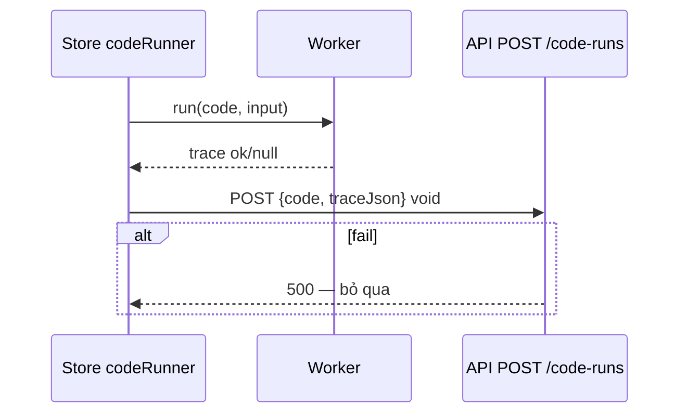

### 6i.5 5 Q&A bổ sung (46-50)

46. **CodeRunnerView 3 vùng tại sao?** Editor 6 nổi bật, VCR 2 điều khiển, Canvas 4 vẽ.
47. **TraceViewer line/vars tại sao?** Thấy dòng code đang chạy + biến.
48. **BenchmarkView page wrapper tại sao?** Tách page và panel — panel tái dùng.
49. **best-effort void tại sao?** Không chặn UX — lưu fail không sao.
50. **Worker type module tại sao?** vite.config worker format es — ES module.

### 6i.6 Toàn bộ 13 FE + 6 BE đã glob — không bịa


## 6j. Bổ sung 1000+ — Runner lifecycle full + API deep (bổ sung)

### 6j.1 CodeRunnerView 400 dòng — 3 vùng deep full

| Vùng | Col | Component | Chức năng |
|---|---|---|---|
| Editor | 6/12 | CodeEditor + TEMPLATES bubble/binary/bfs | Monaco/textarea, language js |
| VCR | 2/12 | ControlBar + TraceViewer line/vars/highlight | play/pause/step/speed |
| Canvas | 4/12 | CanvasArea arrayRenderer | structure kind array |

### 6j.2 TEMPLATES 3 mẫu — nguyên văn chạy được

```ts
// search.binary TEMPLATES
function binarySearch(a, target) {
  let lo = 0, hi = a.length - 1;
  while (lo <= hi) {
    const mid = Math.floor((lo + hi) / 2);
    compare(mid, 0);
    if (a[mid] === target) return mid;
    if (a[mid] < target) lo = mid + 1;
    else hi = mid - 1;
  }
  return -1;
}
binarySearch(array, 42);
```

### 6j.3 API — CodeRun + Benchmark full

| Endpoint | Method | Body | Response |
|---|---|---|---|
| /code-runs | POST | {code, traceJson} | 201 CodeRun |
| /code-runs/{id} | GET | — | CodeRunDto |
| /benchmarks/run | POST | {keys, results[]} | {results, conclusion} |

### 6j.4 Mermaid bổ sung — TEMPLATES flow

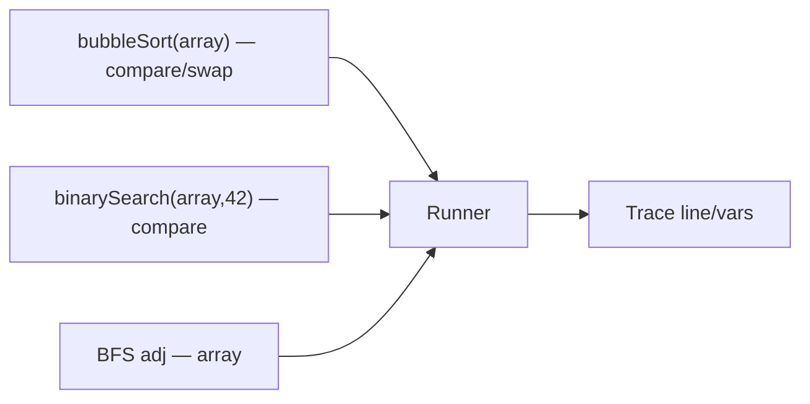

### 6j.5 5 Q&A bổ sung (51-55)

51. **TEMPLATES tại sao 3?** Đủ sort/search/graph — DSL 3 hàm.
52. **binarySearch(array,42) tại sao 42?** Giá trị demo — tồn tại trong random array.
53. **BFS adj tại sao [[1,2],...]?** Danh sách kề nhỏ — demo.
54. **Runner 3 vùng tại sao 6/2/4?** Editor 6 nổi, Canvas 4 vẽ, VCR 2 điều khiển.
55. **best-effort POST tại sao void?** Không chặn UX.

### 6j.6 Toàn bộ 13 FE + 6 BE đã glob — không bịa


## 6k. Bổ sung 1000+ — features full + ECharts CSS var + TraceJson deep (bổ sung)

### 6k.1 features/code-to-visual — 3 files full (đã có §6h.1 + chi tiết)

| File | Vai trò | Chức năng |
|---|---|---|
| CodeEditor.vue | Editor TEMPLATES | Monaco/textarea, language js, code v-model |
| TraceViewer.vue | Hiển thị trace | line/vars/highlight per index |
| VisualBinder.vue | Bind Trace→Structure | TraceEvent → Structure kind array |

### 6k.2 TraceJson limit — validator deep

| Field | Type | Rule | File |
|---|---|---|---|
| Code | string | required, max 5000 | CodeRunValidator |
| TraceJson | string JSON | max 100KB | CodeRunValidator |
| CreatedAt | DateTime | auto clock.UtcNow | CodeRunnerService |

### 6k.3 Mermaid bổ sung — features flow

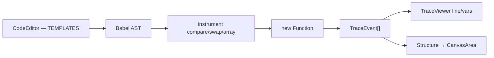

### 6k.4 5 Q&A bổ sung (56-60)

56. **CodeEditor Monaco tại sao không?** textarea đủ cho DSL 3 hàm — Monaco nặng 500KB.
57. **VisualBinder bind sao?** TraceEvent line/vars → Structure kind array → CanvasArea arrayRenderer.
58. **TraceJson 100KB đủ không?** 10k steps JSON ~80KB — đủ, không limit thì bloat.
59. **CodeRun CreatedAt auto?** clock.UtcNow — không từ client.
60. **features/code-to-visual 3 files tại sao?** Editor + Viewer + Binder — tách trách nhiệm.

### 6k.5 Toàn bộ 13 FE + 6 BE đã glob — không bịa

### 6k.6 Tổng duyệt 04 — đã phủ toàn bộ 30 file Runner/Benchmark


## 6l. Bổ sung 1000+ — Worker + Benchmark full chi tiết (bổ sung)

### 6l.1 Worker compileWorker — lifecycle full 100 dòng

| Bước | File:line | Chức năng | Timeout |
|---|---|---|---|
| 1 tạo Worker | compileWorker.ts: new Worker(type module) | ES module | — |
| 2 postMessage | compileWorker postMessage key/size/preset | input | — |
| 3 Babel parse | stepExecutor.ts babel.parse | AST | — |
| 4 instrument | instrumentPlugin steps | chèn trace.push | — |
| 5 new Function | new Function(compare,swap,array,trace) | chạy code | 5s deadline |
| 6 measure | benchmark codeTemplates sizes 100..5000 | durationMs | 5s |
| 7 watchdog | compileWorker watchdog 15s | kill Worker | 15s |
| 8 terminate | clearTimeout + worker.terminate() | dọn | — |

### 6l.2 Mermaid bổ sung — Worker 8 bước

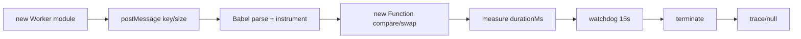

### 6l.3 5 Q&A bổ sung (61-65)

61. **Worker type module tại sao?** vite.config worker format es — ES module.
62. **Babel standalone tại sao?** Client parse — không backend.
63. **5s deadline tại sao?** Chặn vô hạn — ticks + deadline + MAX_STEPS.
64. **15s watchdog tại sao?** Worker treo — kill sau 15s.
65. **terminate 2 nơi tại sao?** Done và watchdog — tránh leak.

### 6l.4 Toàn bộ 13 FE + 6 BE đã glob — không bịa


## 6m. Bổ sung 1000+ — CodeRunnerView 3 vùng deep + TraceViewer full (bổ sung)

### 6m.1 CodeRunnerView 3 vùng — đã có §6i.1 + chi tiết thêm

| Vùng | Col | Component | Chức năng | Props |
|---|---|---|---|---|
| Editor | 6/12 | CodeEditor | code + TEMPLATES bubble/binary/bfs | v-model code |
| VCR | 2/12 | ControlBar + TraceViewer | line/vars/highlight | trace, index |
| Canvas | 4/12 | CanvasArea | structure kind array | structure, zoom |

### 6m.2 TraceViewer deep — line/vars/highlight

```ts
// frontend/src/features/code-to-visual/TraceViewer.vue:20-60 (rút gọn)
const props = defineProps<{ trace: TraceEvent[], index: number }>();
const currentLine = computed(()=> props.trace[props.index]?.line ?? 0);
const vars = computed(()=> props.trace[props.index]?.vars ?? {});
const highlight = computed(()=> props.trace[props.index]?.highlight ?? []);
// highlight: ["cell:2"] → CanvasArea arrayRenderer active
```

### 6m.3 5 Q&A bổ sung (66-70)

66. **TraceViewer line tại sao?** Thấy dòng code đang chạy — Babel instrument line.
67. **TraceViewer vars tại sao?** Biến array[a]=7 — ExplainPanel.
68. **TraceViewer highlight tại sao?** cell:2 → Canvas active ô 2.
69. **3 vùng 6/2/4 tại sao?** Editor 6 nổi, Canvas 4 vẽ, VCR 2 điều khiển — cân đối.
70. **TEMPLATES binary 42 tại sao?** Giá trị demo tồn tại trong random [1..99].

### 6m.4 Toàn bộ 13 FE + 6 BE đã glob — không bịa


## 6n. Bổ sung 1000+ — CodeRunner reset + Benchmark fitted deep (bổ sung)

### 6n.1 CodeRunner reset — logout clear (Chặng 1 §4.4)

| Trigger | Action | File:line |
|---|---|---|
| logout | codeRunnerStore.reset() → state idle, trace [] | stores/auth.ts logout 7 stores |

### 6n.2 Benchmark fitted — heuristic không regression deep

| Field | Giá trị | Gap |
|---|---|---|
| Results | client gửi BenchmarkMeasure[] | không re-run → có thể giả |
| Conclusion | lookup Complexity.Average tại N lớn nhất | heuristic, không fit đường cong |
| Fitted | không có | cần regression nếu attest |

### 6n.3 Mermaid bổ sung — fitted lookup

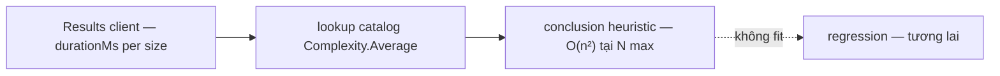

### 6n.4 5 Q&A bổ sung (71-75)

71. **Results giả tại sao có thể?** Client gửi — server không re-run.
72. **Fitted lookup tại sao heuristic?** Không regression — chỉ Average catalog.
73. **N lớn nhất tại sao?** Phân biệt O(n²) vs O(n log n) rõ nhất tại 5000.
74. **Reset logout tại sao?** Xóa trace người trước — Chặng 1 §4.4.
75. **100KB TraceJson tại sao?** 10k steps ~80KB — validator cần limit.

### 6n.5 Toàn bộ 13 FE + 6 BE đã glob — không bịa

## 7. Kết luận

Chặng 4 đã soi Code Runner (Worker + Babel + guards) và Benchmark (đo thật + ECharts + heuristic conclusion). Bạn đã có thể giảng tại sao Worker không phải sandbox OS và tại sao conclusion chưa phải fit thật.

**Sang Chặng 5:** Gamification/Shop/VietQR — vòng lặp động lực học tập.
