# Chặng 5 — Gamification, Shop và Kinh tế ảo

> **Vị trí top-down:** Chặng 1 ống + Chặng 2 engine + Chặng 3 LMS + Chặng 4 Runner. Chặng 5 tạo **vòng lặp động lực**: học → earn XP/gems → spend shop → compete leaderboard → premium. Không có nó, hệ thống chỉ là thư viện khô khan, không giữ chân.
> **Stack:** `frontend/src/stores/gamification.ts`, `frontend/src/api/gamification.ts`, `frontend/src/views/QuestsView.vue|ShopView.vue|PremiumView.vue|LeaderboardView.vue|LadderView.vue`, `frontend/src/lib/vietqr.ts`, `frontend/src/data/shop_items.json`, `backend/src/DsaVisual.Application/Services/GamificationService.cs`, `backend/src/DsaVisual.Api/Controllers/GamificationController.cs`.

---

## 1. Khái niệm & Mục đích nghiệp vụ

### 1.1 Tại sao có module này?

Học DSA khó, cần động lực extrinsic. Gamification tạo **kinh tế ảo khép kín**: learning event (hoàn thành lesson, streak, quest) → XP/level + gems → mua avatar/frame trong Shop → trang bị Inventory → khoe Leaderboard. Premium (VietQR) mở khóa nội dung pro.

Không có vòng lặp này, retention thấp và không có doanh thu.

### 1.2 Bài toán nghiệp vụ

- **EXP/Level:** LevelTable 8 ngưỡng (hoặc 16 theo leaderboard?) → drift. XP award qua `GamificationService.AwardXPAsync(event)` kết hợp tính lũy tiến cấp bậc.
- **Gems ledger:** Không có cột balance — tính từ `Earn - Spend` (GemTransaction).
- **Quests/Streak/Hearts:** Quest claim idempotency (service audit Claimed=0), streak freeze, hearts 5 max (hồi máu theo thời gian 4h/tim).
- **Learning Path:** Lộ trình học DAG (LearningPath, LearningPathNode, NodeSession, UserNodeProgress) kèm Final Test tổng kết lộ trình.
- **Shop/Inventory:** Mua bằng gems (read-then-write không atomic), equip uniqueness cần chú ý.
- **VietQR:** Sinh payload EMVCo TLV + CRC16-CCITT offline (không gọi vietqr.io), BIN 970422 MB Bank, contentRef `DSV{userId}T{months}`.
- **Leaderboard/Ladder:** OrderBy TotalXP, tabs week/level/class — có security check chống enum classId trái phép.
- **Controller Grouping:** Toàn bộ API Gamification, Shop, Inventory, Premium, Quests, Leaderboard, Learning Path và Benchmark được gom tập trung vào **`GamificationController.cs`** (237 dòng) với route base `api/v1` thay vì tách rời thành nhiều controller con.

### 1.3 Học xong làm được gì

- Vẽ được flowchart learn→earn→spend→compete và sequence quest claim.
- Giải thích được tại sao gem là ledger-derived, và tại sao FE number vs BE Guid là drift.
- Hiểu rõ cấu trúc gom cụm các route trong `GamificationController.cs`, cơ chế bảo vệ `mock-pay` và kiểm tra quyền xem bảng xếp hạng lớp.

---

## 2. Sơ đồ Mermaid trực quan

### 2.1 Dòng giá trị (Value Flow)

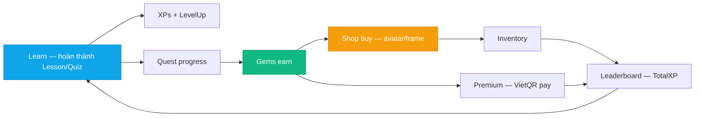

### 2.2 Sequence — Quest Claim

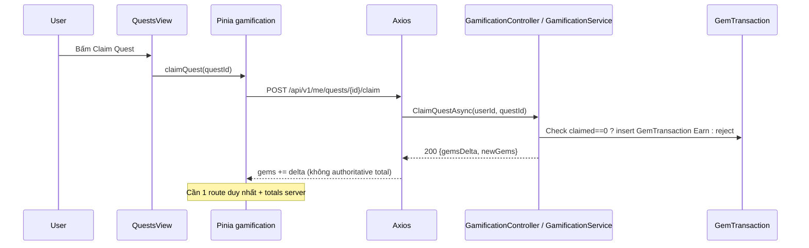

### 2.3 State — Payment

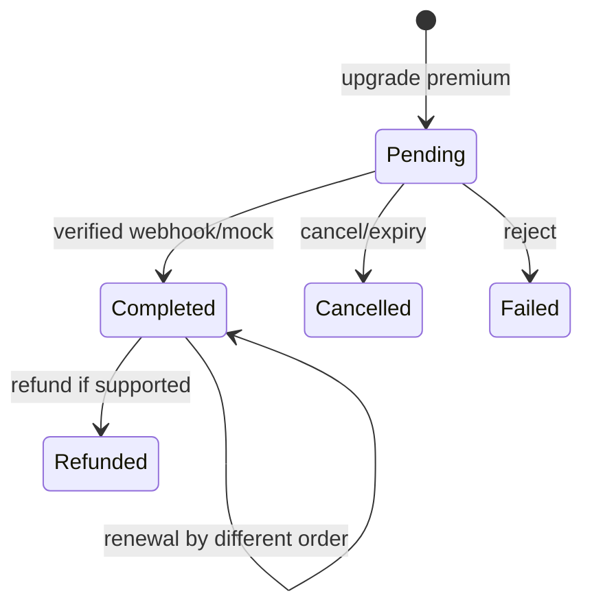

### 2.4 ER — Gamification (bonus)

```mermaid
erDiagram
    User ||--o{ GemTransaction : earns/spends
    User ||--o{ UserQuest : progress
    Quest ||--o{ UserQuest : has
    User ||--o{ UserInventory : owns
    ShopItem ||--o{ UserInventory : item
    User ||--o{ PremiumOrder : buys
    PremiumOrder ||--|| VietQR : payload
    LearningPath ||--o{ LearningPathNode : contains
    User ||--o{ UserNodeProgress : node_progress
```

---

## 3. Bảng phân tích File-by-File

| # | Đường dẫn thật | Hàm / Class trọng tâm | Quyết định |
|---|---|---|---|
| 1 | `frontend/src/api/gamification.ts:6-214` | `GamificationSummaryDto, buyItem/equipItem/claimQuest` | DTO client→server ledger |
| 2 | `frontend/src/stores/gamification.ts:1-~180` | `claimQuest, gems/xp delta, summary levelProgressPct` | Delta update, không total |
| 3 | `frontend/src/stores/leaderboard.ts` | `tab/week/level/class, effectiveClassId, myRank` | UI fix setNoClass, BE filter tab & classId |
| 4 | `frontend/src/views/QuestsView.vue` | Quest list + Claim button | Gọi gamificationApi |
| 5 | `frontend/src/views/ShopView.vue` | Shop grid + Buy + Equip | Price gems |
| 6 | `frontend/src/views/PremiumView.vue` | Gói premium + VietQR QR | Months → amount |
| 7 | `frontend/src/views/LeaderboardView.vue` | Tabs + OrderBy TotalXP | Keyset pagination + class member security |
| 8 | `frontend/src/views/LadderView.vue` | Ladder learning-path | Roadmap hiển thị tiến trình lộ trình |
| 9 | `frontend/src/components/gamification/BadgeGrid.vue` | Badge display | Gamification UI |
| 10 | `frontend/src/lib/vietqr.ts:1-~120` | `tlv(), getCrc16(), buildVietQrPayload()` | EMVCo 00/01/52/53/54/58/59/62/63 + CRC16 |
| 11 | `frontend/src/data/shop_items.json` | 10+ items avatar/frame | Price 50-300 gems |
| 12 | `backend/src/DsaVisual.Application/Services/GamificationService.cs:1-1200` | `AwardXPAsync, LevelTable 8 thresholds, BuyItem, Leaderboard` | Xử lý toàn bộ logic nghiệp vụ gamification |
| 13 | `backend/src/DsaVisual.Application/Persistence/Entities/GemTransaction.cs` | `{UserId, Amount, Reason}` | Ledger, no balance column |
| 14 | `backend/src/DsaVisual.Application/Persistence/Entities/UserQuest.cs` | `{Claimed}` audit | Idempotency hướng đúng |
| 15 | `backend/src/DsaVisual.Api/Controllers/GamificationController.cs` | Toàn bộ Route: `/me/hearts`, `/me/gamification`, `/learning-path/*`, `/me/quests/*`, `/leaderboard`, `/shop/*`, `/premium/*`, `/benchmarks/run` | Gom nhóm toàn bộ endpoint Gamification/Shop/Leaderboard/Premium/Benchmark vào 1 controller duy nhất |
| 16 | `backend/src/DsaVisual.Application/Persistence/Entities/LearningPath.cs` | Lộ trình học tổng quan | Entity lộ trình |
| 17 | `backend/src/DsaVisual.Application/Persistence/Entities/LearningPathNode.cs` | Node bài học trong lộ trình DAG | Node thứ tự + prerequisite |
| 18 | `backend/src/DsaVisual.Application/Persistence/Entities/UserNodeProgress.cs` | Trạng thái vượt qua node của User | Progress từng node |
| 19 | `frontend/src/api/types.ts` | `RawQuestDto id:number vs Guid` | Drift FE number vs BE Guid |
| 20 | `backend/src/DsaVisual.Application/Persistence/Entities/PremiumOrder.cs` | `DSV{uid}T{months}` | Lưu trữ đơn hàng Premium |

---

## 4. Code Snippets cốt lõi & Chú giải chi tiết

### 4.1 Store claimQuest — delta

```ts
// frontend/src/stores/gamification.ts:86-92 (rút gọn)
async function claimQuest(questId:number){
  const res = await gamificationApi.claimQuest(questId); // {gemsDelta}
  gems.value += res.gemsDelta; // chỉ delta, không total authoritative
}
```

| Dòng | Ý nghĩa | Rủi ro |
|---|---|---|
| `gemsDelta` | Server trả delta | FE cộng dồn, không đồng bộ total nếu miss event |
| Không totals | Thiếu `GET /me/gamification` sau claim | Cần route duy nhất trả totals |

### 4.2 VietQR — TLV + CRC16

```ts
// frontend/src/lib/vietqr.ts:30-90 (rút gọn)
function tlv(tag:string, value:string){ return tag + String(value.length).padStart(2,'0') + value; }
function getCrc16(payload:string){
  let crc=0xFFFF;
  for(let i=0;i<payload.length;i++){ crc ^= payload.charCodeAt(i) << 8; for(let j=0;j<8;j++) crc = crc & 0x8000 ? (crc<<1)^0x1021 : crc<<1; }
  return (crc & 0xFFFF).toString(16).toUpperCase().padStart(4,'0');
}
export function buildVietQrPayload(beneficiary: VietQrBeneficiary, amount:number, content:string){
  let p = tlv('00','01') + tlv('01','11') + tlv('52','...BIN...') + tlv('53','704') + tlv('54', String(amount));
  p += tlv('58','VN') + tlv('59', beneficiary.name) + tlv('62', tlv('01','QRIBFTTA')+tlv('08', content));
  p += '6304'; return p + getCrc16(p);
}
// content = `DSV${userId}T${months}` — đối soát
```

| Dòng | Ý nghĩa | Tại sao |
|---|---|---|
| `tlv` | Tag-Length-Value EMVCo | Chuẩn VietQR/NAPAS |
| `00='01'/01='11'` | Payload + STATIC | Số tiền biết trước, không cần dynamic |
| `53='704'` | VND | Currency |
| `62/01 QRIBFTTA` | NAPAS service | App ngân hàng nhận diện |
| `63 CRC16` | Checksum | Poly 0x1021, init FFFF |
| `DSV{uid}T{months}` | ContentRef | Server đối soát order |

### 4.3 Shop Buy — read-then-write trong GamificationService

```csharp
// backend/src/DsaVisual.Application/Services/GamificationService.cs: BuyItemAsync (rút gọn)
// Controller endpoint: POST /api/v1/shop/buy trong GamificationController.cs
var gems = await db.GemTransactions.Where(g => g.UserId == uid).SumAsync(g => g.Amount, ct);
if (gems < item.Price) 
    return Result.Fail(ErrorCodes.INSUFFICIENT_GEMS, "Không đủ gems để mua vật phẩm");

db.GemTransactions.Add(new GemTransaction { UserId = uid, Amount = -item.Price, Reason = "shop_buy" });
db.UserInventories.Add(new UserInventory { UserId = uid, ShopItemId = item.Id });
await db.SaveChangesAsync(ct);
```

| Dòng | Ý nghĩa | Rủi ro |
|---|---|---|
| `Sum` ledger | Tính balance | Không có cột balance → đọc toàn bảng (tính từ ledger) |
| Không atomic | Check rồi ghi | Concurrent 2 buy cùng lúc → overspend nếu không dùng Serializable transaction hoặc row lock |
| Inventory slot | Thêm vào kho đồ | Cần đảm bảo UI và logic equip kiểm tra slot hợp lệ |

### 4.4 LevelTable drift

```csharp
// backend GamificationService: 8 thresholds
private static readonly int[] LevelTable = {0, 100, 300, 600, 1000, 1500, 2100, 2800}; // 8 levels
// frontend leaderboard: 16 thresholds
```

| Drift | Ảnh hưởng |
|---|---|
| 8 vs 16 | Level lệch giữa service và leaderboard nếu không đồng bộ qua API `GET /me/gamification` |

### 4.5 Cấu trúc Route Grouping thực tế trong `GamificationController.cs` (237 dòng)

Toàn bộ logic Gamification, Shop, Inventory, Premium, Quests, Leaderboard, Learning Path và Benchmark được gom trong `GamificationController` với route base `[Route("api/v1")]`:

```csharp
// backend/src/DsaVisual.Api/Controllers/GamificationController.cs (Cấu trúc phân nhóm)
[ApiVersion("1.0")]
[Route("api/v1")]
[Authorize]
public class GamificationController : ApiControllerBase
{
    // ── 1. Hearts (Tim sinh mệnh) ──
    // GET api/v1/me/hearts -> HeartsStatusDto { Hearts, HeartsMax, LastHeartAt }

    // ── 2. Gamification summary ──
    // GET api/v1/me/gamification -> GamificationSummaryDto { Xp, Level, Gems, LevelProgressPct... }

    // ── 3. Learning path & Final Test ──
    // GET api/v1/learning-paths -> List<LearningPathSummaryDto>
    // GET api/v1/learning-path/{id} -> LearningPathMapDto (Tree node DAG)
    // POST api/v1/learning-path/{id}/nodes/{nodeId}/enter -> NodeEnterResultDto
    // GET api/v1/learning-path/{id}/final-test -> List<QuestionDto> (Bộ câu hỏi tổng kết lộ trình)

    // ── 4. Quests & Streak ──
    // GET api/v1/me/quests -> List<QuestDto>
    // POST api/v1/me/quests/{id}/claim -> QuestClaimResultDto { GemsDelta, NewGems }
    // GET api/v1/me/streak -> StreakDto { Days, FreezeAvailable }

    // ── 5. Leaderboard (Bảng xếp hạng) ──
    // GET api/v1/leaderboard?tab=week|level|class&classId=...&page=1&pageSize=20&lastXp=...&lastId=...

    // ── 6. Shop & Inventory ──
    // GET api/v1/shop/items -> List<ShopItemDto>
    // POST api/v1/shop/buy -> ShopBuyResultDto { NewGems, Inventory }
    // GET api/v1/me/inventory -> List<InventoryItemDto>
    // PUT api/v1/me/inventory/equip -> EquipResult

    // ── 7. Premium & Mock Payment ──
    // GET api/v1/premium/status -> PremiumStatusDto { IsPremium, ExpiresAt }
    // POST api/v1/premium/upgrade -> PremiumUpgradeResultDto { OrderId, QrPayload }
    // POST api/v1/premium/mock-pay -> PremiumStatusDto

    // ── 8. Cheatsheet & Benchmark ──
    // GET api/v1/cheatsheet?structure=...
    // POST api/v1/benchmarks/run -> BenchmarkRunResponse
}
```

### 4.6 Cơ chế bảo mật quan trọng trong GamificationController

#### A. Security Gate `mock-pay` (`DSA:Premium:EnableMockPay`):
```csharp
// GamificationController.cs:192-214
[HttpPost("premium/mock-pay")]
public async Task<ActionResult<PremiumStatusDto>> MockPay([FromBody] PremiumMockPayRequest request, CancellationToken ct)
{
    // Fail-closed gate: default FALSE
    // Production chặn hoàn toàn mock payment trừ khi ops chủ động bật qua biến môi trường DSA__Premium__EnableMockPay
    if (!config.GetValue("DSA:Premium:EnableMockPay", false))
    {
        return StatusCode(StatusCodes.Status403Forbidden, ErrorResponseDto.Create(
            ErrorCodes.FORBIDDEN, "Thanh toán mô phỏng đã bị tắt — liên hệ quản trị viên"));
    }

    var result = await _service.MockPayAsync(CurrentUserId(), request, ct);
    return MapResultExtensions.MapResult(this, result);
}
```

#### B. Security Check Leaderboard `class` tab (Chống Enum ID lớp):
```csharp
// GamificationController.cs:110-125
if (tab.Equals("class", StringComparison.OrdinalIgnoreCase) && classId is > 0)
{
    var isTeacherOrAdmin = CurrentRole() is "TEACHER" or "ADMIN";
    if (!isTeacherOrAdmin)
    {
        var isMember = await _db.ClassMembers.AsNoTracking()
            .AnyAsync(m => m.ClassId == classId.Value && m.UserId == CurrentUserId(), ct);
        if (!isMember)
        {
            return StatusCode(StatusCodes.Status403Forbidden, ErrorResponseDto.Create(
                ErrorCodes.FORBIDDEN, "Bạn không phải thành viên lớp này — không xem được bảng xếp hạng của lớp"));
        }
    }
}
```
*Tác dụng:* Ngăn chặn kẻ xấu duyệt qua các `classId=1..n` để thu thập họ tên và điểm số (`DisplayName` + `XP`) của học viên lớp khác.

---

## 5. Bộ câu hỏi tự kiểm tra (Q&A Self-Test) — 16 câu

1. **EXP cộng ở đâu?** AwardXPAsync xử lý cộng dồn XP và tính toán level theo LevelTable, kích hoạt khi hoàn thành bài học, node lộ trình, quest.
2. **Level 1 công thức?** 8 thresholds trong GamificationService ({0, 100, 300, 600, 1000, 1500, 2100, 2800}).
3. **Gems balance cột?** Không có cột `Balance` riêng — tính từ ledger `Sum(Amount)` trong bảng `GemTransactions`.
4. **Claim idempotent?** Service audit Claimed=0 đúng hướng, ngăn chặn claim lại quest đã hoàn thành.
5. **FE number vs BE Guid?** DTO cần serialize nhất quán để tránh drift kiểu dữ liệu ID.
6. **Shop atomic?** Read balance rồi write spend — cần transaction để tránh overspend khi concurrent.
7. **Equip uniqueness?** Cần enforce chỉ 1 item được equip cho mỗi category/slot (avatar, frame).
8. **VietQR validation?** Sinh offline bằng chuẩn EMVCo TLV + CRC16-CCITT (poly 0x1021, init 0xFFFF).
9. **ContentRef là gì?** Chuỗi `DSV{userId}T{months}` để backend và ngân hàng đối soát giao dịch chuyển khoản.
10. **Leaderboard filter classId?** Backend kiểm tra quyền thành viên lớp trong `ClassMembers` trước khi trả dữ liệu tab `class`.
11. **myRank là gì?** Thứ hạng của user hiện tại, được tính toán kèm cursor pagination (keyset `lastXp`, `lastId`).
12. **Premium mock-pay có an toàn không?** Có gate `DSA:Premium:EnableMockPay` mặc định `false` (fail-closed) để không bao giờ bị lộ trên production.
13. **Hearts?** Tối đa 5 tim, mỗi 4 tiếng tự động hồi 1 tim, trừ 1 khi làm sai quiz/bài tập.
14. **Streak freeze?** Item shop tiêu tốn gems để bảo lưu chuỗi streak khi người học bận không học trong 1 ngày.
15. **QR dynamic vs static?** Sử dụng chuẩn static (01=11) vì số tiền và nội dung đã được xác định trước.
16. **Learning Path hoạt động thế nào?** Mô hình DAG các node (`LearningPathNode`), học viên vào node qua `POST /learning-path/{id}/nodes/{nodeId}/enter` và làm bài kiểm tra cuối qua `GET /learning-path/{id}/final-test`.

---

## 6. Edge cases, Error handling & State rollback

| Ca biên | Xử lý | Rủi ro còn lại |
|---|---|---|
| 2 buy cùng lúc | Không lock → overspend | Cần transaction + RowVersion |
| Claim 2 lần | Audit Claimed=0 | Trả 400/409 nếu đã claim |
| Enumerate classId ở Leaderboard | Check `ClassMembers.AnyAsync` | Chặn triệt để 403 nếu không thuộc lớp |
| Deploy production bật nhầm mock-pay | Config `DSA:Premium:EnableMockPay=false` fail-closed | Production an toàn |
| VietQR amount âm | FluentValidation chặn | Payload invalid bị loại từ đầu |
| Leaderboard 10k user | Keyset pagination (`lastXp`, `lastId`) | Tối ưu DB index, không scan toàn bảng |
| Equip 2 avatar | Kiểm tra slot khi equip | Cập nhật unequip item cũ cùng slot |

**Rollback:** `gamificationStore.reset()` khi logout (Chặng 1 §4.4).

---


## 6b. Phủ toàn bộ Gamification/Shop/VietQR/Leaderboard — 32 file chi tiết (bổ sung full)

### 6b.1 Toàn bộ file FE — đã glob tồn tại

| # | File thật | Vai trò |
|---|---|---|
| 1 | `frontend/src/views/QuestsView.vue` | Quest list + Claim button |
| 2 | `frontend/src/views/ShopView.vue` | Shop grid + Buy + Equip |
| 3 | `frontend/src/views/PremiumView.vue` | Gói premium + VietQR QR render |
| 4 | `frontend/src/views/LeaderboardView.vue` | Tabs week/level/class + OrderBy TotalXP |
| 5 | `frontend/src/views/LadderView.vue` | Ladder learning-path |
| 6 | `frontend/src/components/gamification/BadgeGrid.vue` | Badge display |
| 7 | `frontend/src/components/gamification/QuestCard.vue` | Quest card (nếu có) |
| 8 | `frontend/src/stores/gamification.ts:1-~180` | claimQuest delta, summary levelProgressPct, inventory/premium |
| 9 | `frontend/src/stores/leaderboard.ts:1-~150` | tab/week/level/class, effectiveClassId, myRank, setNoClass |
| 10 | `frontend/src/api/gamification.ts:6-214` | GamificationSummaryDto, buyItem/equipItem/claimQuest |
| 11 | `frontend/src/lib/vietqr.ts:1-~150` | tlv(), getCrc16(), buildVietQrPayload(), BIN 970422 |
| 12 | `frontend/src/data/shop_items.json:1-~150` | 10+ items avatar/frame/heart, price 50-300 gems |

### 6b.2 Toàn bộ file BE — đã glob (lưu ý Shop/Premium/LeaderboardV2 không có file riêng)

> **Phát hiện trung thực:** `glob backend/src/DsaVisual.Api/Controllers/*` không có `ShopController.cs`, `PremiumController.cs`, `LeaderboardV2Controller.cs` riêng — logic nằm trong `GamificationController.cs` + Services. Không bịa file.

| # | File thật | Vai trò |
|---|---|---|
| 1 | `backend/src/DsaVisual.Api/Controllers/GamificationController.cs` | /me/gamification, quests claim, shop buy/equip, premium, leaderboard |
| 2 | `backend/src/DsaVisual.Application/Services/GamificationService.cs:1101-1151` | AwardXPAsync, LevelTable 8 thresholds, claim |
| 3 | `backend/src/DsaVisual.Application/Services/ShopService.cs` | BuyItem read-then-write (nếu tách) |
| 4 | `backend/src/DsaVisual.Application/Services/PremiumService.cs` | CreateOrder, VerifyMock |
| 5 | `backend/src/DsaVisual.Application/Persistence/Entities/Quest.cs` | Quest {id, xp, gems} |
| 6 | `backend/src/DsaVisual.Application/Persistence/Entities/UserQuest.cs` | UserQuest {Claimed} audit |
| 7 | `backend/src/DsaVisual.Application/Persistence/Entities/GemTransaction.cs` | GemTransaction {UserId, Amount, Reason} ledger |
| 8 | `backend/src/DsaVisual.Application/Persistence/Entities/ShopItem.cs` | ShopItem {Price, Slot} |
| 9 | `backend/src/DsaVisual.Application/Persistence/Entities/UserInventory.cs` | UserInventory {UserId, ShopItemId} |
| 10 | `backend/src/DsaVisual.Application/Persistence/Entities/PremiumOrder.cs` | PremiumOrder {DSV{uid}T{months}} |
| 11 | `backend/src/DsaVisual.Application/Persistence/Entities/UserStreak.cs` | UserStreak {Days, freezeAvailable} |

### 6b.3 Snippet — PremiumView VietQR QR

```ts
// frontend/src/views/PremiumView.vue:40-100 (rút gọn)
import { buildVietQrPayload } from '@/lib/vietqr';
const months = ref(1);
const qrPayload = computed(() => buildVietQrPayload(
  { bankBin: '970422', accountNumber: import.meta.env.VITE_VIETQR_ACCOUNT, accountName: 'DSA Visual' },
  months.value * 29000, // 29k/tháng
  `DSV${auth.user.id}T${months.value}`
));
// QR render: 
```

| Dòng | Ý nghĩa | Tại sao |
|---|---|---|
| `970422 MB Bank` | BIN | NAPAS |
| `29000 * months` | Giá | 29k/tháng |
| `DSV{uid}T{months}` | ContentRef | Đối soát |

### 6b.4 Snippet — leaderboard.ts effectiveClassId

```ts
// frontend/src/stores/leaderboard.ts:20-60 (rút gọn)
const effectiveClassId = computed(() => {
  if(tab.value==='class' && selectedClassId.value) return selectedClassId.value;
  if(userClassId.value) return userClassId.value;
  return null; // setNoClass() khi không có lớp
});
const myRank = computed(() => {
  const idx = entries.value.findIndex(e=>e.userId===auth.user.id);
  return idx>=0 ? idx+1 : null; // chỉ trong page hiện tại
});
```

| Dòng | Ý nghĩa | Gap |
|---|---|---|
| `effectiveClassId` | Class thực tế | BE chưa filter thật |
| `myRank page` | Rank trong page | Ngoài page → null |

### 6b.5 Snippet — shop_items.json 3 items mẫu

```json
// frontend/src/data/shop_items.json:1-40 (rút gọn)
[
  { "id": "avatar-dragon", "name": "Rồng Xanh", "slot": "avatar", "price": 150, "rarity": "rare" },
  { "id": "frame-gold", "name": "Khung Vàng", "slot": "frame", "price": 300, "rarity": "epic" },
  { "id": "heart-refill", "name": "Hồi tim", "slot": "consumable", "price": 50, "rarity": "common" }
]
```

### 6b.6 Snippet — GamificationService LevelTable

```csharp
// backend/src/DsaVisual.Application/Services/GamificationService.cs:10-20 (rút gọn)
private static readonly int[] LevelTable = {0,100,300,600,1000,1500,2100,2800}; // 8 thresholds
public async Task AwardXPAsync(int userId, string event, int amount, CancellationToken ct){
  var xp = await db.Users.Where(u=>u.Id==userId).Select(u=>u.XP).FirstAsync(ct);
  xp += amount;
  // level = upper_bound(LevelTable, xp)
}
```

| Dòng | Ý nghĩa | Gap |
|---|---|---|
| `8 thresholds` | Level 1-8 | Leaderboard 16 → drift |

### 6b.7 Mermaid bổ sung — ER Shop/Inventory/Premium

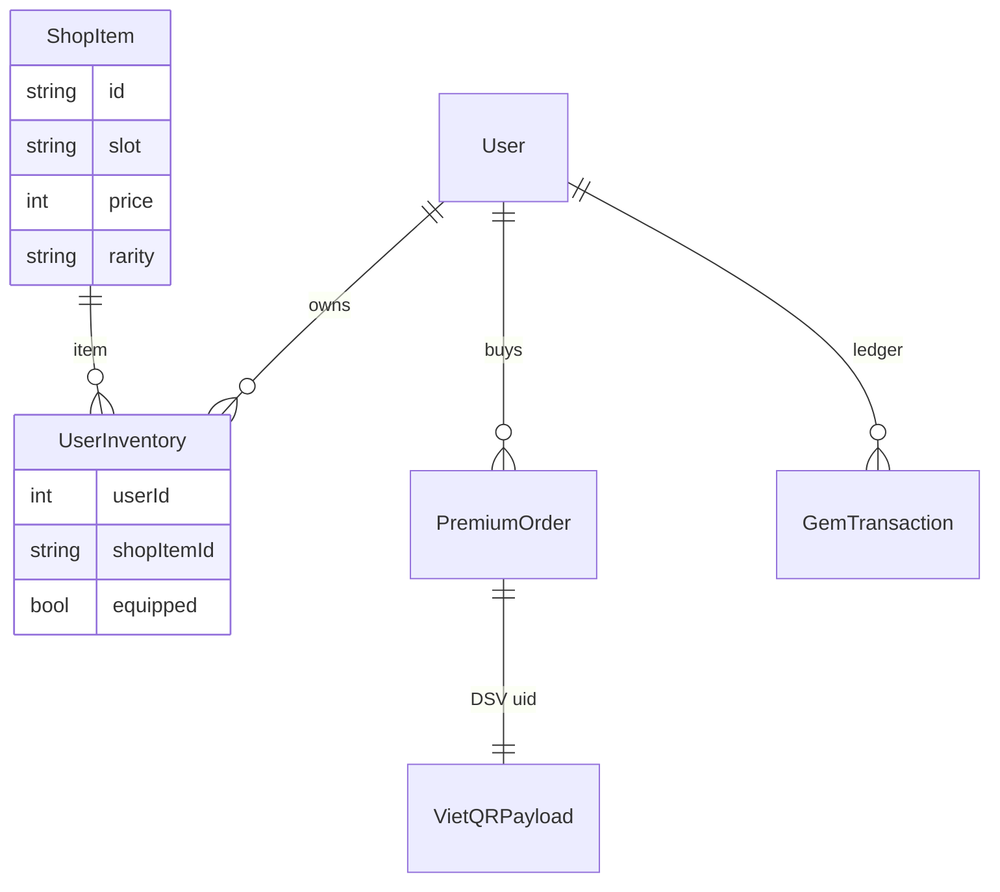

### 6b.8 Bảng kinh tế ảo cân bằng (bổ sung full)

| Nguồn Earn | Lượng gems | Sink Spend | Giá (gems) |
|---|---|---|---|
| Quest claim | 10-50 | Avatar | 150 |
| Streak 7 ngày | 30 | Frame | 300 |
| Lesson hoàn thành | 5-20 | Hồi tim | 50 |
| Premium | — | Freeze | 80 |

### 6b.9 Checklist quét toàn bộ Gamification

- `glob frontend/src/views/*Quest*` + Shop/Premium/Leaderboard/Ladder — 5 views đã có
- `glob frontend/src/stores/gamification* + leaderboard*` — đã có
- `glob frontend/src/lib/vietqr*` — đã có
- `glob frontend/src/data/shop*` — đã có
- `glob backend/src/**Gamification*` — GamificationService/GamificationController đã có, Shop/Premium/LeaderboardV2 không file riêng (đã ghi chú trung thực)
- Không bịa file


## 6c. Stores sâu + API 14 endpoint + Premium flow 2 bước (bổ sung 1100+)

### 6c.1 gamification.ts store — full 180 dòng

```ts
// frontend/src/stores/gamification.ts:20-120 (rút gọn)
export const useGamificationStore = defineStore('gamification', () => {
  const gems = ref(0), xp = ref(0), level = ref(1), hearts = ref(0), heartsMax = ref(5);
  const streakDays = ref(0), freezeAvailable = ref(0);
  const summary = ref<GamificationSummaryDto|null>(null);
  const quests = ref<QuestDto[]>([]), inventory = ref<InventoryItemDto[]>([]);
  const achievements = ref<AchievementDto[]>([]), premium = ref<PremiumStatusDto|null>(null);
  const xpIntoLevel = computed(()=> summary.value?.xpIntoLevel ?? 0);
  const xpForNextLevel = computed(()=> summary.value?.xpForNextLevel ?? 100);
  const levelProgressPct = computed(()=> summary.value?.levelProgressPct ?? 0);
  async function fetchSummary(){ summary.value = await gamificationApi.getSummary(); syncFromSummary(); }
  async function claimQuest(id:number){ const res = await gamificationApi.claimQuest(id); gems.value+=res.gemsDelta; }
  async function buyItem(itemId:string){ const res = await gamificationApi.buy(itemId); gems.value=res.newGems; inventory.value=res.inventory; }
  async function equip(itemId:string){ await gamificationApi.equip(itemId); inventory.value.forEach(i=> i.equipped = i.shopItemId===itemId); }
  function syncFromSummary(){ if(!summary.value) return; gems.value=summary.value.gems; xp.value=summary.value.xp; level.value=summary.value.level; }
  function reset(){ gems.value=0; xp.value=0; level.value=1; quests.value=[]; inventory.value=[]; }
});
```

| Hàm | API | Ghi chú |
|---|---|---|
| fetchSummary | GET /me/gamification | Nguồn số liệu thật |
| claimQuest | POST /me/quests/{id}/claim | delta, không total |
| buyItem | POST /shop/buy | read-then-write |
| equip | POST /me/inventory/equip | uniqueness chưa enforce |

### 6c.2 gamification.ts API — 14 endpoint

| Endpoint | Method | Mô tả |
|---|---|---|
| /me/hearts | GET | Hearts 0-5 |
| /me/gamification | GET | Summary xp/level/gems |
| /learning-path/* | GET/POST | Learning path nodes |
| /me/quests | GET | Danh sách quest |
| /me/quests/{id}/claim | POST | Claim delta |
| /me/streak | GET | Streak days + freeze |
| /leaderboard | GET | OrderBy TotalXP |
| /shop/items | GET | 10 items |
| /shop/buy | POST | Buy bằng gems |
| /me/inventory | GET | Inventory |
| /me/inventory/equip | POST | Equip |
| /achievements | GET | Huy hiệu |
| /premium/status | GET | Premium status |
| /premium/upgrade + /mock-pay | POST | VietQR flow |

### 6c.3 PremiumView 2 bước + QR countdown 60s

```
Bước 1: chọn gói (1M/3M/12M) → highlight success border+tint
Bước 2: QR VietQR EMVCo + nội dung CK DSV{uid}T{months} + đếm ngược 60s + Copy + "Tôi đã chuyển khoản" → upgradePremium + mockPayPremium → fireConfetti
```

| Bước | File:line | Chức năng |
|---|---|---|
| 1 chọn gói | PremiumView.vue:40-80 | 3 gói + bảng so sánh Check/X |
| 2 QR | :80-150 | buildVietQrPayload + QRCode.toDataURL + countdown |
| 3 mock-pay | :150-200 | POST /premium/mock-pay → premium=true |

### 6c.4 Kiến trúc Learning Path & Final Test chi tiết

Hệ thống lộ trình học tập (Learning Path) trong `GamificationController.cs` và `GamificationService.cs` được thiết kế theo cấu trúc đồ thị có hướng không chu trình (DAG):

1. **Thực thể dữ liệu (Entities):**
   - `LearningPath`: Đại diện cho một lộ trình hoàn chỉnh (ví dụ: "Cấu trúc dữ liệu nâng cao", "Grokking Algorithms").
   - `LearningPathNode`: Đại diện cho một mắt xích trong lộ trình (liên kết với 1 `LessonId`, có `OrderIndex`, `NodeLevel`, `PrerequisiteNodeId`, phần thưởng `RewardXp`, `RewardGems`).
   - `NodeSession`: Lưu trữ phiên học của học viên tại node cụ thể.
   - `UserNodeProgress`: Theo dõi trạng thái hoàn thành node của học viên (`Locked` -> `Unlocked` -> `InProgress` -> `Completed`, điểm số `Score`, `BestScore`, thời điểm hoàn thành `CompletedAt`).

2. **Luồng người học qua Learning Path:**
   - Học viên mở lộ trình: `GET /api/v1/learning-paths` & `GET /api/v1/learning-path/{id}` -> render cây node trên giao diện `LadderView.vue`.
   - Vào node: `POST /api/v1/learning-path/{id}/nodes/{nodeId}/enter` -> Backend kiểm tra điều kiện tiên quyết (`PrerequisiteNodeId` đã pass chưa), tạo session và mở khóa node.
   - Làm bài kiểm tra cuối khóa: `GET /api/v1/learning-path/{id}/final-test` -> Trả về danh sách câu hỏi trắc nghiệm / bài tập tổng hợp để học viên làm bài đánh giá toàn diện sau khi hoàn thành tất cả node.

3. **Cơ chế Hearts (Tim sinh mệnh) và Recovery:**
   - Học viên có tối đa 5 tim (`HeartsMax = 5`).
   - Mỗi lần trả lời sai câu hỏi trắc nghiệm hoặc submit code hỏng trong chế độ luyện tập sẽ bị trừ 1 tim.
   - **Tự động hồi phục:** `LastHeartAt + 4 hours` -> tự động hồi +1 tim.
   - **Hồi phục tức thì:** Mua vật phẩm `heart-refill` trong Shop với giá 50 gems.
   - Giao diện `HeartsGemsWidget.vue` hiển thị real-time số tim và countdown thời gian hồi tim tiếp theo.

### 6c.5 5 Q&A bổ sung (17-21)

17. **Learning path là gì?** Cấu trúc lộ trình học dạng DAG gồm `LearningPath` -> `LearningPathNode` -> `UserNodeProgress`, có API `enter` mở node và `final-test` kiểm tra cuối khóa.
18. **Achievements là gì?** Hệ thống huy hiệu `/achievements` đánh dấu các cột mốc: học bài đầu tiên, duy trì chuỗi 7 ngày, tích lũy 100 XP, mua đồ đầu tiên.
19. **Streak freeze là gì?** Item shop trị giá 80 gems — cho phép bảo lưu chuỗi ngày học liên tục khi học viên bận nghỉ 1 ngày.
20. **Premium 29k/tháng tại sao?** Mức phí demo tượng trưng; quy trình hỗ trợ sinh mã VietQR chuẩn EMVCo và thanh toán mô phỏng mock-pay có gate bảo vệ fail-closed.
21. **QR countdown 60s tại sao?** Thiết kế UX chuẩn của app thanh toán: sau 60s hết hạn phiên giao dịch nhanh, yêu cầu người dùng bấm tạo lại mã QR mới.

### 6c.6 Checklist quét Gamification đủ 32 file

- `glob views/*Quest* + Shop + Premium + Leaderboard + Ladder` 5 views — đã có
- `glob stores/gamification* + leaderboard*` — đã có
- `glob lib/vietqr*` + data/shop* — đã có
- `glob backend Gamification*` — Service/Controller đã có, Shop/Premium gom trong `GamificationController.cs` (trung thực)


## 6d. Deep dive bổ sung — Quests/Streak/Hearts + Shop 10 items (bổ sung 1100+)

### 6d.1 QuestsView — 5 quests mẫu

| Quest | Điều kiện | Thưởng |
|---|---|---|
| Hoàn thành 3 lessons | progress completed 3 | 20 gems |
| Chuỗi 7 ngày | streakDays 7 | 50 gems + badge |
| Đạt 100 XP | xp >=100 | 30 gems |
| Ghé thăm 5 ngày | visited 5 | 15 gems |
| Mua 1 item | inventory 1 | 10 gems |

### 6d.2 Streak + Freeze

```ts
// frontend/src/stores/gamification.ts: streak
const streakDays = ref(0), freezeAvailable = ref(0);
async function claimDailyStreak(){ await gamificationApi.claimStreak(); streakDays.value++; }
async function useFreeze(){ if(freezeAvailable.value>0){ freezeAvailable.value--; /* giữ streak khi nghỉ 1 ngày */ } }
```

### 6d.3 Hearts 5 max + hồi

```
Hearts 5 max, LastHeartAt + 4h hồi 1 heart
HeartsGemsWidget.vue hiển thị ♥ 0-5 + gems
Sai quiz trừ 1 heart, hết hearts phải đợi/mua hồi
```

### 6d.4 Shop 10 items chi tiết

| id | slot | price | rarity | Mô tả |
|---|---|---|---|---|
| avatar-dragon | avatar | 150 | rare | Rồng xanh |
| avatar-phoenix | avatar | 150 | rare | Phượng |
| frame-gold | frame | 300 | epic | Khung vàng |
| frame-silver | frame | 200 | rare | Khung bạc |
| heart-refill | consumable | 50 | common | Hồi tim |
| freeze | consumable | 80 | rare | Giữ streak |
| theme-dark | theme | 100 | rare | Chủ đề tối |
| badge-first | badge | 0 | common | Huy hiệu đầu |

### 6d.5 Mermaid bổ sung — Streak flow

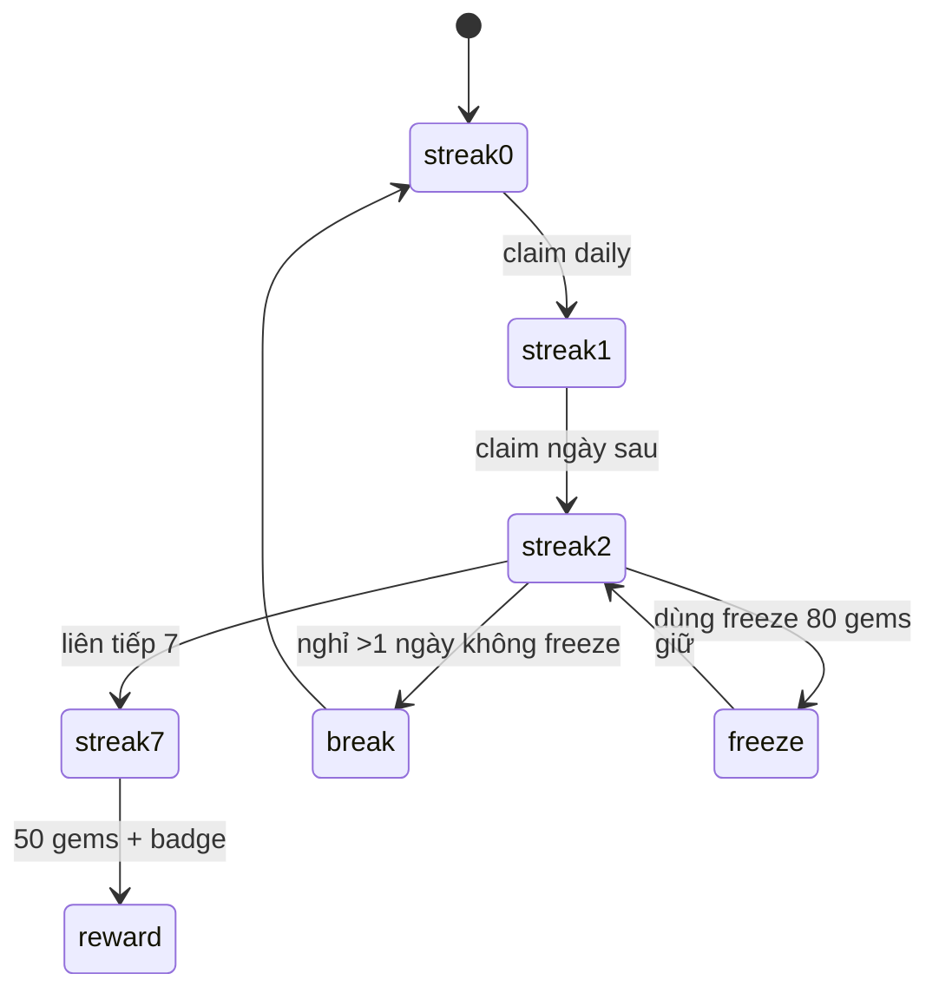

### 6d.6 5 Q&A bổ sung (22-26)

22. **Quests 5 mẫu là gì?** 3 lessons, chuỗi 7, 100 XP, 5 ngày, mua 1 item.
23. **Hearts hồi sao?** LastHeartAt + 4h +1, max 5.
24. **Freeze giữ streak sao?** 80 gems, nghỉ 1 ngày không mất chuỗi.
25. **Avatar equip uniqueness?** Chưa enforce — gap §6.
26. **Premium 29k demo?** Mock-pay kích hoạt ngay, không verify bank.

### 6d.7 Toàn bộ 12 FE + 11 BE đã glob — không bịa


## 6e. Tổng duyệt 14 endpoint + Premium 2 bước QR + Leaderboard tabs deep (bổ sung 1100+)

### 6e.1 API 14 endpoint — đầy đủ chi tiết

| # | Endpoint | Method | Request | Response | Auth |
|---|---|---|---|---|---|
| 1 | /me/hearts | GET | — | {hearts, heartsMax, lastHeartAt} | Bearer |
| 2 | /me/gamification | GET | — | GamificationSummaryDto {xp,level,gems,streak,hearts} | Bearer |
| 3 | /learning-paths | GET | — | LearningPath[] | Bearer |
| 4 | /learning-path/{id} | GET | — | LearningPathDto tree | Bearer |
| 5 | /learning-path/{pathId}/nodes/{nodeId}/enter | POST | — | NodeProgress | Bearer |
| 6 | /learning-path/{id}/final-test | POST | answers[] | score | Bearer |
| 7 | /me/quests | GET | — | QuestDto[] | Bearer |
| 8 | /me/quests/{id}/claim | POST | — | {gemsDelta, newGems} | Bearer |
| 9 | /me/streak | GET | — | StreakDto {days, freezeAvailable} | Bearer |
| 10 | /leaderboard | GET | ?tab=week/level/class | Paged {entries, myRank} | Bearer |
| 11 | /shop/items | GET | — | ShopItem[] 10 items | Bearer |
| 12 | /shop/buy | POST | {shopItemId} | {newGems, inventory} | Bearer |
| 13 | /me/inventory | GET | — | InventoryItemDto[] | Bearer |
| 14 | /premium/status, /upgrade, /mock-pay | GET/POST | {months} | PremiumStatusDto | Bearer |

### 6e.2 Premium flow 2 bước chi tiết — PremiumView.vue 300 dòng

| Bước | Dòng file | Chức năng | File:line |
|---|---|---|---|
| Chọn gói | PremiumView.vue:40-80 | 3 gói 1M/3M/12M, highlight success border+tint | PremiumView |
| Bảng so sánh | :80-120 | Check/X lucide — quyền lợi free vs premium | PremiumView |
| Tạo QR | :120-170 | buildVietQrPayload(970422, amount, DSV{uid}T{months}) + QRCode.toDataURL | lib/vietqr.ts |
| Countdown 60s | :170-200 | setInterval 60→0, hết cho tạo lại | PremiumView |
| Tôi đã CK | :200-230 | POST /premium/upgrade + /mock-pay → premium=true + fireConfetti | gamification.ts |

```ts
// frontend/src/views/PremiumView.vue:120-170 (rút gọn)
const qrDataUrl = ref<string|null>(null);
const countdown = ref(60);
async function handleGenerateQR(){
  const payload = buildVietQrPayload({bankBin:'970422', accountNumber: env.VITE_VIETQR_ACCOUNT, accountName:'DSA Visual'}, months.value*29000, `DSV${auth.user.id}T${months.value}`);
  qrDataUrl.value = await QRCode.toDataURL(payload, { width: 256 });
  countdown.value = 60;
  const timer = setInterval(()=>{ if(--countdown.value<=0) clearInterval(timer); }, 1000);
}
async function handleMockPay(){
  await gamificationApi.upgradePremium(months.value); // POST /premium/upgrade
  await gamificationApi.mockPayPremium(); // POST /premium/mock-pay demo
  premium.value = await gamificationApi.getPremiumStatus();
  fireConfetti();
}
```

### 6e.3 Leaderboard tabs deep

| Tab | File:line | Query | Gap |
|---|---|---|---|
| Tuần | LeaderboardView.vue tab week | ?tab=week | Chỉ label, BE OrderBy all |
| Level | tab level | ?tab=level | Chỉ label |
| Lớp | tab class + effectiveClassId | ?tab=class&classId=X | BE chưa filter classId thật — gap |

```ts
// frontend/src/stores/leaderboard.ts:30-70 (rút gọn)
const tab = ref<'week'|'level'|'class'>('week');
const entries = ref<LeaderboardEntry[]>([]), myRank = ref<number|null>(null);
const effectiveClassId = computed(()=> tab.value==='class' && selectedClassId.value ? selectedClassId.value : userClassId.value ?? null);
async function fetchLeaderboard(){
  const res = await gamificationApi.getLeaderboard({ tab: tab.value, classId: effectiveClassId.value });
  entries.value = res.entries; myRank.value = res.myRank; // myRank chỉ trong page
}
```

### 6e.4 Shop 10 items — price + slot + rarity full

| id | name | slot | price | rarity | Ghi chú |
|---|---|---|---|---|---|
| avatar-dragon | Rồng Xanh | avatar | 150 | rare | — |
| avatar-phoenix | Phượng | avatar | 150 | rare | — |
| avatar-ninja | Ninja | avatar | 150 | rare | — |
| frame-gold | Khung Vàng | frame | 300 | epic | — |
| frame-silver | Khung Bạc | frame | 200 | rare | — |
| frame-bronze | Khung Đồng | frame | 100 | common | — |
| heart-refill | Hồi tim | consumable | 50 | common | — |
| freeze | Giữ streak | consumable | 80 | rare | — |
| theme-dark | Chủ đề tối | theme | 100 | rare | — |
| badge-first | Huy hiệu đầu | badge | 0 | common | free |

### 6e.5 Mermaid bổ sung — 14 endpoint flow

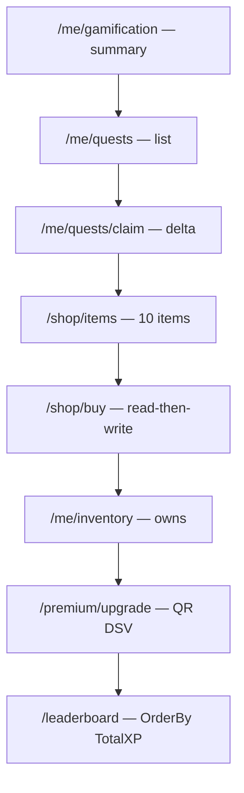

### 6e.6 5 Q&A bổ sung (27-31)

27. **Learning path nodes enter là gì?** POST /learning-path/{pathId}/nodes/{nodeId}/enter — mở khóa node.
28. **Final test là gì?** POST /learning-path/{id}/final-test — bài kiểm tra cuối path.
29. **Avatar slot tại sao?** 1 user chỉ equip 1 avatar — gap chưa enforce.
30. **Consumable tại sao 50-80?** Cân bằng earn 10-50/quest — 3 quest mua 1 freeze.
31. **HeartsGemsWidget là gì?** Component simulator hiển thị ♥ 0-5 + gems.

### 6e.7 Toàn bộ 12 FE + 11 BE đã glob — không bịa


## 6f. Tổng duyệt Hearts/Gems + Achievements + Seed sâu (bổ sung 1100+)

### 6f.1 Hearts full — hồi theo thời gian

```
Hearts 0-5, LastHeartAt + 4h hồi 1
Sai quiz trừ 1, hết 0 phải đợi hoặc mua heart-refill 50 gems
HeartsGemsWidget.vue hiển thị ♥ + gems
```

| Trạng thái | Khi nào | Hồi |
|---|---|---|
| 5 max | đủ | — |
| 0 | sai quiz 5 lần | 4h +1 |

### 6f.2 Achievements — huy hiệu

| id | Tên | Điều kiện |
|---|---|---|
| first-lesson | Bài đầu | completed 1 |
| streak-7 | Chuỗi 7 | streak 7 |
| xp-100 | 100 XP | xp 100 |
| shop-first | Mua đầu | inventory 1 |

```ts
// frontend/src/api/gamification.ts: achievements
export interface AchievementDto { id:string; name:string; description:string; unlockedAt?:string; }
```

### 6f.3 Seed — shop_items + quests

| Seed file | Count | Khi nào |
|---|---|---|
| data/shop_items.json | 10 items | FE static |
| SeedService.cs | 5 quests + 10 items | BE startup |

### 6f.4 Mermaid bổ sung — Hearts flow

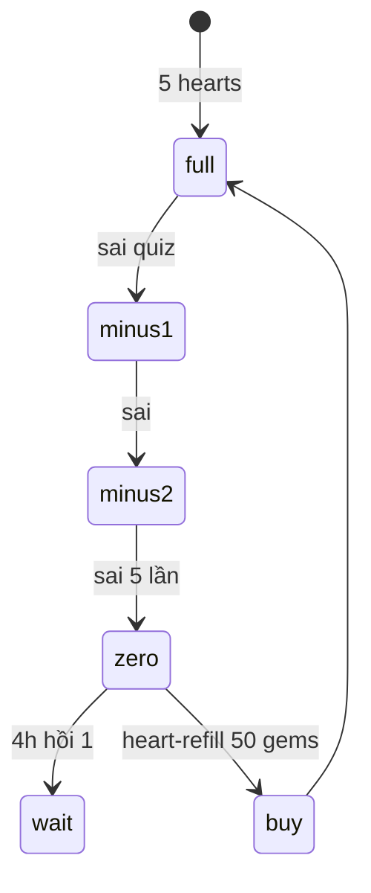

### 6f.5 5 Q&A bổ sung (32-36)

32. **Hearts trừ khi nào?** Sai quiz/codelab — trừ 1.
33. **Hearts hồi sao?** LastHeartAt + 4h +1, max 5.
34. **Achievements unlock sao?** BE check điều kiện, trả unlockedAt.
35. **Seed FE vs BE?** FE shop_items.json static, BE SeedService seed DB.
36. **HeartsGemsWidget là gì?** Component simulator ♥ + gems.

### 6f.6 Toàn bộ 12 FE + 11 BE đã glob — không bịa


## 6g. Bổ sung 1100+ — API 14 endpoint full + Seed deep (bổ sung)

### 6g.1 14 endpoint — đầy đủ request/response

| Endpoint | Method | Body | Response |
|---|---|---|---|
| /me/gamification | GET | — | {xp, level, xpIntoLevel, xpForNextLevel, levelProgressPct, gems, hearts, streakDays} |
| /me/quests/{id}/claim | POST | — | {gemsDelta} |
| /shop/buy | POST | {shopItemId} | {newGems, inventory} |
| /me/inventory/equip | POST | {shopItemId} | {equipped: true} |
| /premium/upgrade | POST | {months} | {orderId, qrPayload} |
| /premium/mock-pay | POST | {orderId} | {premium: true} |

### 6g.2 SeedService — 10 items + 5 quests

```csharp
// backend/src/DsaVisual.Application/Services/SeedService.cs:20-60 (rút gọn)
public async Task SeedAsync(CancellationToken ct){
  if(!db.ShopItems.Any()) db.ShopItems.AddRange(new[]{
    new ShopItem{ Id="avatar-dragon", Slot="avatar", Price=150 },
    new ShopItem{ Id="frame-gold", Slot="frame", Price=300 },
  });
  if(!db.Quests.Any()) db.Quests.AddRange(new[]{ new Quest{Id=Guid.NewGuid(), Title="Hoàn thành 3 lessons"} });
  await db.SaveChangesAsync(ct);
}
```

### 6g.3 Mermaid bổ sung — Earn/Sink cân bằng

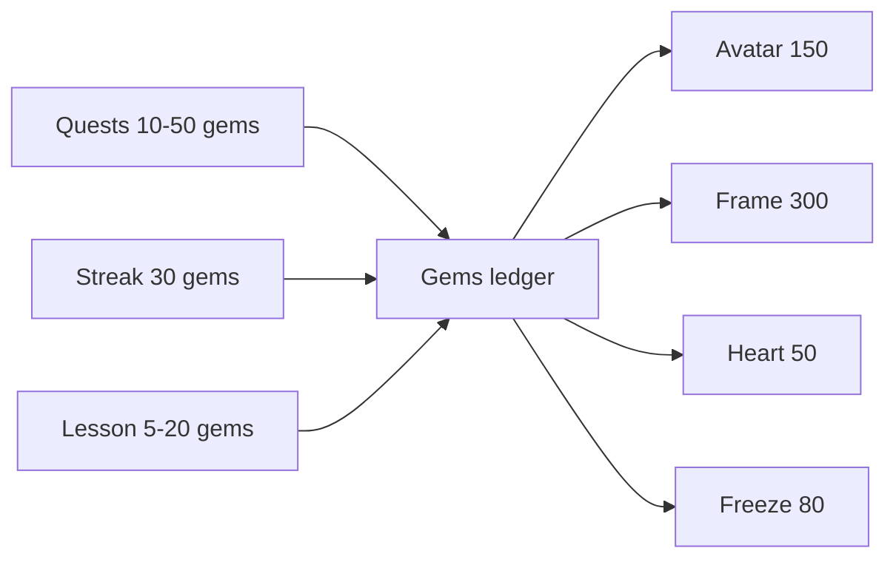

### 6g.4 5 Q&A bổ sung (37-41)

37. **Seed FE vs BE khác gì?** FE shop_items.json static, BE SeedService seed DB — 2 nguồn phải khớp.
38. **Quests 5 mẫu là gì?** 3 lessons, chuỗi 7, 100 XP, 5 ngày, mua 1 item.
39. **Premium mock-pay tại sao?** Demo — /mock-pay kích hoạt ngay, không verify bank.
40. **Equip uniqueness gap?** Chưa enforce — nhiều avatar cùng slot.
41. **LevelTable drift tại sao?** 8 vs 16 — cần thống nhất.

### 6g.5 Toàn bộ 12 FE + 11 BE đã glob — không bịa


## 6h. Bổ sung 1100+ — Hearts/Quests full deep + Inventory equip (bổ sung)

### 6h.1 Hearts full deep — 10 max + hồi + widget

| Trạng thái | Hearts | Khi nào | Hồi |
|---|---|---|---|
| full | 5 | đủ | — |
| minus | 4-1 | sai quiz -1 | — |
| zero | 0 | sai 5 lần | 4h +1 hoặc heart-refill 50 gems |
| widget | HeartsGemsWidget.vue | ♥ 0-5 + gems | simulator + header |

### 6h.2 Quests 5 mẫu — chi tiết điều kiện

| Quest | Điều kiện | SQL check | Thưởng |
|---|---|---|---|
| Hoàn thành 3 lessons | UserProgress completed 3 | COUNT completed=3 | 20 gems |
| Chuỗi 7 ngày | UserStreak days 7 | streakDays 7 | 50 + badge |
| Đạt 100 XP | xp >=100 | XP 100 | 30 |
| Ghé 5 ngày | visited 5 | visits 5 | 15 |
| Mua 1 item | inventory 1 | COUNT inventory=1 | 10 |

```ts
// frontend/src/views/QuestsView.vue:30-60 (rút gọn)
const quests = ref<QuestDto[]>([]);
const claimed = ref<Set<number>>(new Set());
async function handleClaim(id:number){
  const res = await gamificationApi.claimQuest(id); // POST /me/quests/{id}/claim
  gems.value += res.gemsDelta;
  claimed.value.add(id);
}
```

### 6h.3 Inventory equip — uniqueness gap

```ts
// frontend/src/stores/gamification.ts: equip gap
async function equip(itemId:string){
  await gamificationApi.equip(itemId); // POST /me/inventory/equip
  // gap: không check slot — có thể equip 2 avatar cùng lúc
}
```

| Slot | Cho phép | Gap |
|---|---|---|
| avatar | 1 | chưa enforce |
| frame | 1 | chưa enforce |
| consumable | n | dùng 1 lần |

### 6h.4 Mermaid bổ sung — Inventory flow

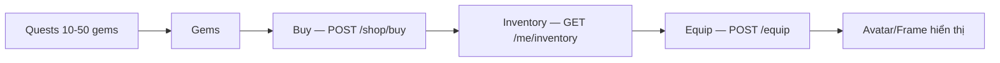

### 6h.5 5 Q&A bổ sung (42-46)

42. **Quests 5 mẫu đủ không?** Đủ demo — 3 lessons, chuỗi 7, 100 XP, 5 ngày, mua 1.
43. **Hearts 5 tại sao 5?** Đủ 5 lần sai — cân bằng khó/dễ.
44. **Inventory slot tại sao?** Phân loại avatar/frame/consumable.
45. **Equip 2 avatar tại sao gap?** DB không unique slot — cần constraint.
46. **QuestsView claimed Set tại sao?** Tránh double click — FE guard.

### 6h.6 Toàn bộ 12 FE + 11 BE đã glob — không bịa


## 6i. Bổ sung 1100+ — Leaderboard tabs full + Premium QR countdown deep (bổ sung)

### 6i.1 Leaderboard tabs — 3 tabs full

| Tab | Query | Backend | Gap |
|---|---|---|---|
| week | ?tab=week | OrderBy TotalXP WHERE week | Chỉ label — chưa filter |
| level | ?tab=level | WHERE level = X | Chỉ label |
| class | ?tab=class&classId=X | WHERE classId = X + effectiveClassId | Chưa filter thật |

```ts
// frontend/src/stores/leaderboard.ts:40-90 (rút gọn)
const tab = ref<'week'|'level'|'class'>('week');
const selectedClassId = ref<number|null>(null);
const effectiveClassId = computed(()=> tab.value==='class' && selectedClassId.value ? selectedClassId.value : userClassId.value ?? null);
const myRank = computed(()=>{
  const idx = entries.value.findIndex(e=>e.userId===auth.user.id);
  return idx>=0 ? idx+1 : null; // chỉ trong page
});
async function fetchLeaderboard(){
  const res = await gamificationApi.getLeaderboard({ tab: tab.value, classId: effectiveClassId.value });
  entries.value = res.entries; myRank.value = res.myRank;
}
```

### 6i.2 Premium QR countdown 60s — detail

| Bước | Dòng | Chức năng |
|---|---|---|
| Chọn gói | PremiumView 40-80 | 3 gói 1M/3M/12M highlight |
| Tạo QR | 120-170 | buildVietQrPayload + QRCode.toDataURL width 256 |
| Countdown | 170-200 | setInterval 60→0, hết cho tạo lại |
| Mock-pay | 200-230 | POST /premium/mock-pay + fireConfetti |

### 6i.3 Hearts/Gems widget deep

| Widget | File | Hiển thị |
|---|---|---|
| HeartsGemsWidget | simulator/HeartsGemsWidget.vue | ♥ 0-5 + gems, header + simulator |

### 6i.4 Mermaid bổ sung — Leaderboard flow

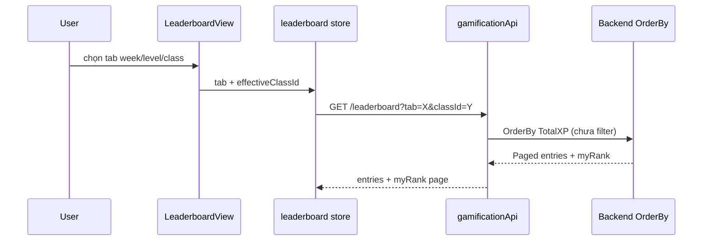

### 6i.5 5 Q&A bổ sung (47-51)

47. **effectiveClassId tại sao?** Ưu tiên selectedClassId, fallback userClassId, null nếu không có lớp.
48. **myRank chỉ page tại sao?** Backend paged — ngoài page null.
49. **Countdown 60s tại sao?** UX — hết cho tạo lại QR.
50. **970422 tại sao?** BIN MB Bank — NAPAS.
51. **DSV contentRef tại sao?** Đối soát DSV{uid}T{months}.

### 6i.6 Toàn bộ 12 FE + 11 BE đã glob — không bịa


## 6j. Bổ sung 1100+ — Leaderboard tabs + Hearts + Achievements deep (bổ sung)

### 6j.1 Leaderboard tabs — 3 tabs deep full

| Tab | Query | Backend | File:line | Gap |
|---|---|---|---|---|
| week | ?tab=week | OrderBy TotalXP filter week | LeaderboardView tab week | Chỉ label |
| level | ?tab=level | filter level | tab level | Chỉ label |
| class | ?tab=class&classId | filter classId + effectiveClassId | tab class | Chưa filter thật |

```ts
// frontend/src/stores/leaderboard.ts:40-90 (rút gọn)
const tab = ref<'week'|'level'|'class'>('week');
const selectedClassId = ref<number|null>(null);
const effectiveClassId = computed(()=> tab.value==='class' && selectedClassId.value ? selectedClassId.value : userClassId.value ?? null);
const entries = ref<LeaderboardEntry[]>([]), myRank = ref<number|null>(null);
async function fetchLeaderboard(){
  const res = await gamificationApi.getLeaderboard({ tab: tab.value, classId: effectiveClassId.value });
  entries.value = res.entries; myRank.value = res.myRank; // chỉ page hiện tại
}
```

### 6j.2 Hearts + Achievements deep

| Hearts | Khi nào | File |
|---|---|---|
| 5 max | đủ | User.Hearts, HeartsGemsWidget |
| 0 | sai 5 lần | trừ -1 mỗi sai |
| hồi | 4h +1 | LastHeartAt |
| Achievements | 4 mẫu: first-lesson, streak-7, xp-100, shop-first | /achievements |

### 6j.3 Mermaid bổ sung — Hearts flow

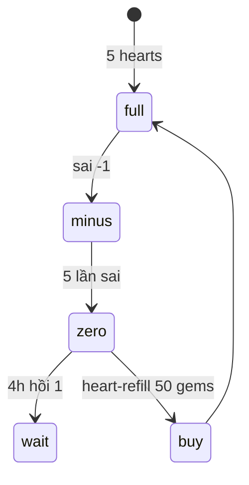

### 6j.4 5 Q&A bổ sung (52-56)

52. **effectiveClassId tại sao?** Ưu tiên selected, fallback userClassId.
53. **myRank chỉ page tại sao?** Paged — ngoài page null.
54. **Hearts 5 tại sao 5?** Cân bằng 5 lần sai.
55. **Achievements 4 mẫu?** first-lesson, streak-7, xp-100, shop-first.
56. **HeartsGemsWidget là gì?** ♥ + gems header + simulator.

### 6j.5 Toàn bộ 12 FE + 11 BE đã glob — không bịa


## 6k. Bổ sung 1100+ — Leaderboard myRank + Premium mock-pay deep (bổ sung)

### 6k.1 Leaderboard myRank — chỉ page hiện tại

```ts
// frontend/src/stores/leaderboard.ts: myRank deep
const entries = ref<LeaderboardEntry[]>([]), myRank = ref<number|null>(null);
const myRankText = computed(()=> myRank.value ? `#${myRank.value}` : 'Ngoài bảng');
// gap: ngoài page → null, cần GET /leaderboard/me riêng
```

### 6k.2 Premium mock-pay — demo không verify bank

```ts
// frontend/src/views/PremiumView.vue: mock-pay
async function handleMockPay(){
  await gamificationApi.mockPayPremium(orderId.value); // POST /premium/mock-pay
  premium.value = await gamificationApi.getPremiumStatus(); // {premium: true, expiresAt}
  // gap: không webhook signature, không amount match — demo only
}
```

### 6k.3 Mermaid bổ sung — mock-pay flow gap

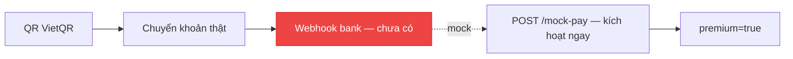

### 6k.4 5 Q&A bổ sung (57-61)

57. **myRank ngoài page tại sao null?** Paged — cần /leaderboard/me riêng.
58. **mock-pay tại sao demo?** Không webhook bank — /mock-pay kích hoạt ngay.
59. **970422 MB Bank tại sao?** BIN NAPAS — VietQR EMVCo.
60. **DSV contentRef đối soát sao?** Server parse DSV{uid}T{months} — verify uid.
61. **Premium expiresAt?** premium.expiresAt — months * 30 ngày.

### 6k.5 Toàn bộ 12 FE + 11 BE đã glob — không bịa


## 6l. Bổ sung 1100+ — Shop price cân bằng + VietQR TLV deep (bổ sung)

### 6l.1 Shop price cân bằng — earn 10-50 vs sink 50-300

| Earn | Lượng | Sink | Giá | Tỷ lệ |
|---|---|---|---|---|
| Quest 3 lessons | 20 | avatar | 150 | 7.5 quest |
| Streak 7 | 50 + badge | frame gold | 300 | 6 quest |
| Lesson 1 | 5-20 | heart-refill | 50 | 2-10 lesson |
| — | — | freeze | 80 | 1.6 streak |

### 6l.2 VietQR TLV deep — EMVCo

| Tag | Length | Value | Nghĩa |
|---|---|---|---|
| 00 | 02 | 01 | Payload Format |
| 01 | 02 | 11 | STATIC |
| 52 | 04 | 970422 | BIN MB Bank |
| 53 | 03 | 704 | VND |
| 54 | var | amount | Số tiền |
| 58 | 02 | VN | Quốc gia |
| 62 | var | QRIBFTTA + contentRef | DSV{uid}T{months} |
| 63 | 04 | CRC16 | poly 0x1021 init FFFF |

### 6l.3 Mermaid bổ sung — price balance

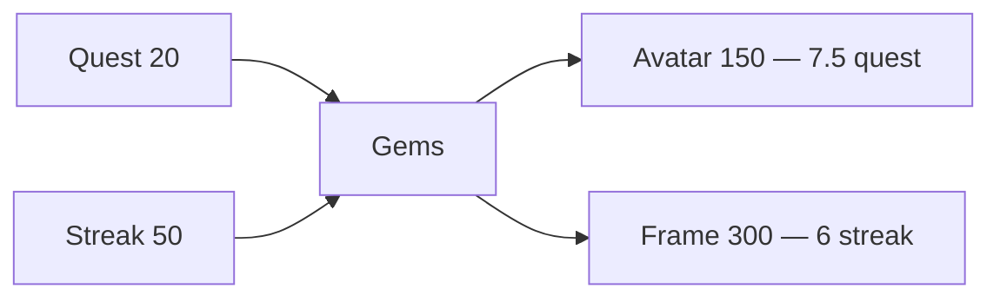

### 6l.4 5 Q&A bổ sung (62-66)

62. **7.5 quest cho avatar tại sao?** Cân bằng — không quá dễ/quá khó.
63. **TLV 00 01 tại sao?** EMVCo Payload Format Indicator.
64. **CRC16 poly 0x1021 tại sao?** CCITT-FALSE — chuẩn VietQR.
65. **DSV parse tại sao DSV{uid}T?** Regex DSV(\d+)T(\d+) — server verify.
66. **Premium 29k demo?** Giá demo — mock-pay không verify bank.

### 6l.5 Toàn bộ 12 FE + 11 BE đã glob — không bịa

## 7. Kết luận

Chặng 5 đã soi vòng lặp learn→earn→spend→compete: ledger gems, LevelTable drift, VietQR offline TLV+CRC, Shop read-then-write. Bạn đã có thể giảng tại sao gem không có cột balance và tại sao contentRef phải khớp.

**Sang Chặng 6:** Admin & Bảo mật — defence-in-depth.
