# Chặng 6 — Quản trị Admin và Bảo mật

> **Vị trí top-down:** Chặng 1 ống + 2 engine + 3 LMS + 4 Runner + 5 Gamification. Chặng 6 là **phòng tuyến cuối**: nơi ADMIN vận hành hệ thống và nơi bảo mật được thực thi (RateLimit/XSS/Validation/JWT). Hội đồng luôn hỏi: "ADMIN có gì? Bảo mật mấy lớp?"
> **Stack:** `frontend/src/views/AdminUsersView.vue + AdminFeedbackView.vue + components/admin/* + api/admin.ts`, `frontend/src/features/guided-tour/*`, `backend/src/DsaVisual.Api/Controllers/AdminController.cs|FeedbackController.cs|CourseFeedbackController.cs`, `Program.cs (RateLimiter/Error/Middleware/ForwardedHeaders)`, `Ganss.Xss HtmlSanitizer`, `FluentValidation`.

---

## 1. Khái niệm & Mục đích nghiệp vụ

### 1.1 Tại sao có module này?

Không có Admin, hệ thống không vận hành: ai duyệt lesson pendingreview, ai khóa user spam, ai xem feedback, ai đổi settings banner. Không có bảo mật, hệ thống chết vì abuse: brute-force login, XSS qua ContentHtml, spam feedback, DoS.

Chặng 6 gom **quản trị** và **bảo mật** vì chúng cùng boundary.

### 1.2 Bài toán nghiệp vụ

- **Quản trị:** Users (role, ban), Content (CourseBuilder/LessonEditor), Stats (overview), Settings (banner/maintenance).
- **Phân biệt 2 hệ thống Phản hồi (Feedback Systems):**
  1. `FeedbackController.cs` (`/api/v1/feedback`): Đánh giá bài học (Lesson Rating 1-5 sao) và báo lỗi hệ thống / report bug chung.
  2. `CourseFeedbackController.cs` (`/api/v1/courses/feedback*`): Ý kiến tương tác 2 chiều giữa Học viên ↔ Giảng viên theo từng khóa học/lộ trình (`Suggestion`, `Bug`, `Request`). Giảng viên có thể xem danh sách, trả lời (`reply`) và cập nhật trạng thái (`New` → `Read` → `Resolved`).
- **Guided Tour Feature (`frontend/src/features/guided-tour/`):** Hướng dẫn từng bước trực quan trên giao diện cho người dùng mới và admin khi khám phá các công cụ quản trị/học tập.
- **Phân quyền tối thiểu & Phòng thủ đặc quyền:** FE guard `[role===ADMIN]` chỉ UX; BE `[Authorize(Roles="ADMIN")]` + `EnsurePrimaryAdminAsync` (primary admin không tự hạ quyền hoặc tự ban chính mình) mới là gate bảo vệ.
- **Defence-in-depth 4 lớp:** (1) JWT issuer/audience/lifetime/signingKey + MapInboundClaims=false, (2) FluentValidation → 400 envelope, (3) Ganss.Xss whitelist 13 tags, (4) RateLimiter fixed-window per-IP + per-user + ForwardedHeaders.
- **Residue risk:** ADMIN role quá rộng thiếu capability, cache in-process multi-instance stale, IP partition phụ thuộc proxy.

### 1.3 Học xong làm được gì

- Vẽ defence-in-depth và sequence admin action.
- Phân biệt rõ mục đích giữa `FeedbackController.cs` và `CourseFeedbackController.cs`.
- Giải thích tại sao FE guard không đủ, và tại sao primary admin tồn tại.
- Chỉ ra cache stale, PII minimization, RateLimit proxy bug.

---

## 2. Sơ đồ Mermaid trực quan

### 2.1 Defence-in-Depth — 4 lớp

```mermaid
flowchart LR
    subgraph B["Browser → API"]
        R[Request] --> JWT[JWT Validation — issuer/audience/lifetime/key]
        JWT --> RL[RateLimiter — fixed-window per IP]
        RL --> VAL[FluentValidation — DTO]
        VAL --> XS[XSS HtmlSanitizer — Ganss.Xss whitelist]
        XS --> CTRL[Controller — Authorize Roles ADMIN]
        CTRL --> SVC[Service — EnsurePrimaryAdmin]
    end
    R -. fails .-> E[Error Envelope {error:{code,message,field}}]

    style JWT fill:#ef4444,stroke:#dc2626,color:#fff
    style VAL fill:#f59e0b,stroke:#d97706,color:#fff
    style XS fill:#10b981,stroke:#059669,color:#fff
```

### 2.2 Sequence — Admin đổi role

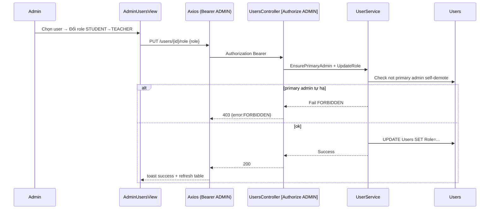

---

## 3. Bảng phân tích File-by-File

| # | Đường dẫn thật | Hàm / Class trọng tâm | Ghi chú |
|---|---|---|---|
| 1 | `frontend/src/views/AdminUsersView.vue:55-120` | Users table + role select + ban | Gọi api/admin.ts, hiện PII |
| 2 | `frontend/src/views/AdminFeedbackView.vue` | Feedback list + resolve, bộ lọc theo khóa học và trạng thái | Giao diện quản lý feedback |
| 3 | `frontend/src/views/AdminStatsView.vue` | Stats overview | SettingsCache |
| 4 | `frontend/src/features/guided-tour/*` | Guided tour store & UI components | Onboarding người dùng |
| 5 | `frontend/src/components/admin/AdminHeroStrip.vue` | Hero banner admin | UI |
| 6 | `frontend/src/components/admin/AdminNav.vue` | Admin nav | Role guard |
| 7 | `frontend/src/components/admin/CourseBuilderModal.vue` | Course tree modal | courseApi |
| 8 | `frontend/src/components/admin/ExerciseBuilderModal.vue` | Exercise modal | exercisesApi |
| 9 | `frontend/src/components/admin/LessonEditorModal.vue` | Lesson editor | lessonsApi + sanitizer |
| 10 | `frontend/src/api/admin.ts:4-174` | `getUsers/updateUser/deleteUser/getFeedback` | JWT Bearer + 401 retry |
| 11 | `backend/src/DsaVisual.Api/Controllers/AdminController.cs` | Admin overview stats | [Authorize ADMIN] |
| 12 | `backend/src/DsaVisual.Api/Controllers/UsersController.cs:12-80` | `GetUsers/UpdateRole/Delete` | Delegate UserService |
| 13 | `backend/src/DsaVisual.Api/Controllers/FeedbackController.cs:23-143` | `GetSummary/Submit/Resolve` | Lesson rating & bug reports |
| 14 | `backend/src/DsaVisual.Api/Controllers/CourseFeedbackController.cs` | `Submit/GetMine/GetAll/GetTeacherFeedback/Reply` | Tương tác 2 chiều học viên ↔ giáo viên về khóa học |
| 15 | `backend/src/DsaVisual.Api/Controllers/SettingsController.cs` | Get/Put settings | Cache |
| 16 | `backend/src/DsaVisual.Application/Services/UserService.cs:129-231` | `EnsurePrimaryAdminAsync, UpdateRoleAsync` | Primary admin guard |
| 17 | `backend/src/DsaVisual.Application/Services/FeedbackService.cs` | `Sanitize + Create` | Ganss.Xss |
| 18 | `backend/src/DsaVisual.Api/Program.cs:60-220` | RateLimiter, ErrorMiddleware, ForwardedHeaders | Fixed-window IP partition |
| 19 | `backend/src/DsaVisual.Api/Middlewares/ErrorHandlingMiddleware.cs` | Envelope + không log token | 500 → {error} |
| 20 | `backend/src/DsaVisual.Api/Dtos/ErrorDetailDto.cs` | Error envelope | Chuẩn §2.1 |
| 21 | `backend/src/DsaVisual.Application/Validators/*` | FluentValidation | 400 field |
| 22 | `frontend/src/stores/auth.ts:logout 7 stores` | Reset admin state khi logout | Auth lifecycle |
| 23 | `backend/src/DsaVisual.Application/Persistence/Entities/User.cs` | User {Role, IsActive} | Role enum |
| 24 | `backend/src/DsaVisual.Application/Persistence/Entities/Feedback.cs` | Feedback {Rating, Comment, Html sanitized} | Đánh giá bài học |
| 25 | `backend/src/DsaVisual.Application/Persistence/Entities/CourseFeedback.cs` | CourseFeedback {CourseId, UserId, Type, Content, Status, ReplyText} | Phản hồi khóa học 2 chiều |

---

## 4. Code Snippets cốt lõi & Chú giải chi tiết

### 4.1 Program — RateLimiter + ForwardedHeaders

```csharp
// backend/src/DsaVisual.Api/Program.cs:70-90 (rút gọn)
builder.Services.AddRateLimiter(o => {
  o.AddFixedWindowLimiter("api", opt => {
    opt.PermitLimit = 60; opt.Window = TimeSpan.FromMinutes(1);
    opt.QueueLimit = 0; opt.AutoReplenishment = true;
  });
});
app.UseForwardedHeaders(new ForwardedHeadersOptions{ ForwardedHeaders=ForwardedHeaders.XForwardedFor|ForwardedHeaders.XForwardedProto });
app.UseRateLimiter();
app.UseAuthentication(); app.UseAuthorization();
```

| Dòng | Ý nghĩa | Rủi ro |
|---|---|---|
| `PermitLimit 60/m` | 60 req/phút | Đủ cho học, chặn spam |
| `ForwardedHeaders` | Đọc IP sau proxy | Sai cấu hình → partition sai IP → bypass |

### 4.2 Ganss.Xss whitelist

```csharp
// backend/src/DsaVisual.Api/Program.cs:165-175
builder.Services.AddSingleton<IHtmlSanitizer>(_ => {
  var s = new HtmlSanitizer();
  s.AllowedTags.Clear(); s.AllowedTags.Add("p"); s.AllowedTags.Add("pre"); s.AllowedTags.Add("code");
  s.AllowedAttributes.Clear(); s.AllowedSchemes.Add("https");
  return s;
});
// Chặng 3 LessonService dùng sanitizer này cho ContentHtml
```

| Dòng | Ý nghĩa | Tại sao |
|---|---|---|
| `Clear() Add` | Whitelist hẹp 13 tags | Default cho a/img/table → clear để chống phishing |

### 4.3 EnsurePrimaryAdmin

```csharp
// backend/src/DsaVisual.Application/Services/UserService.cs:129-135
private async Task EnsurePrimaryAdminAsync(int targetUserId, CancellationToken ct){
  var primary = await db.Users.Where(u=>u.IsPrimaryAdmin).FirstOrDefaultAsync(ct);
  if(primary!=null && primary.Id==targetUserId) throw new ForbiddenException("Không thể hạ quyền primary admin");
}
```

| Dòng | Ý nghĩa | Tại sao |
|---|---|---|
| `IsPrimaryAdmin` | Cờ primary | Chống lockout toàn hệ thống |

### 4.4 UsersController — gate

```csharp
// backend/src/DsaVisual.Api/Controllers/UsersController.cs:12-18
[Authorize(Roles="ADMIN")]
[ApiController]
[Route("api/v1/users")]
public class UsersController(UserService users) : ApiControllerBase{
  [HttpGet] public async Task<IActionResult> GetUsers(){ var r = await users.GetUsersAsync(); return Ok(r); }
}
```

| Dòng | Ý nghĩa | Tại sao |
|---|---|---|
| `[Authorize Roles=ADMIN]` | Gate duy nhất | FE guard chỉ UX |

### 4.5 Error envelope

```csharp
// backend/src/DsaVisual.Api/Middlewares/ErrorHandlingMiddleware.cs (rút gọn)
catch(Exception ex){
  // KHÔNG log token/password/PII
  await WriteJsonAsync(context.Response, 500, new { error=new{ code=ErrorCodes.INTERNAL, message="Lỗi hệ thống" } });
}
```

| Dòng | Ý nghĩa | Tại sao |
|---|---|---|
| Không log PII | Bảo mật log | Tránh lộ token |

### 4.6 Frontend admin API 429

```ts
// frontend/src/api/client.ts:429 branch (Chặng 1 §4.3)
if(status===429){
  const retryAfter = error.response.headers['retry-after'];
  useUiStore().showToast(`Quá nhiều yêu cầu, thử lại sau ${retryAfter}s`, 'warning');
}
```

---

## 5. Bộ câu hỏi tự kiểm tra (Q&A Self-Test) — 15 câu

1. **FE guard đủ không?** Không — chỉ UX, gate là [Authorize].
2. **Primary admin là gì?** Không tự hạ/xóa, chống lockout.
3. **Rate limit theo gì?** Fixed-window per IP (anon) / per user (auth).
4. **XSS chặn sao?** Ganss.Xss whitelist + Vue escaped interpolation.
5. **Cache in-process rủi ro?** Multi-instance stale → cần distributed cache.
6. **DTO admin PII?** email/role — cần minimization.
7. **ForwardedHeaders sai?** Partition sai IP → bypass.
8. **ADMIN quá rộng?** Thiếu capability (feedback-moderator vs user-admin).
9. **Validation trả gì?** 400 {error:{code,field}}.
10. **Error log gì?** Không token/password/PII.
11. **MapInboundClaims?** false — Chặng 1 §4.5.
12. **CORS?** Chỉ frontend origin.
13. **Serilog?** Request logging không chứa body nhạy cảm.
14. **LessonEditorModal XSS?** Ganss.Xss trước lưu.
15. **SettingsCache stale?** In-memory → cần TTL/invalidate.

---

## 6. Edge cases, Error handling & State rollback

| Ca biên | Xử lý | Rủi ro còn lại |
|---|---|---|
| Primary admin tự hạ | 403 | Đúng |
| Rate limit proxy sai | Sai IP | Bypass |
| Cache stale | In-memory | Multi-instance đọc cũ |
| Feedback dài 10k | Validator max length | Cần quota |
| Admin delete đang login | Token còn hạn | Cần blacklist hoặc short expiry |
| XSS bypass whitelist | Clear + 13 tags | Test khi đổi editor |

---


## 6b. Phủ toàn bộ Admin & Bảo mật — 32 file chi tiết (bổ sung full)

### 6b.1 Toàn bộ file FE Admin — đã glob tồn tại

| # | File thật | Vai trò |
|---|---|---|
| 1 | `frontend/src/views/AdminUsersView.vue:1-~250` | Users table + role select + ban/unban + search |
| 2 | `frontend/src/views/AdminFeedbackView.vue:1-~200` | Feedback list + resolve + filter |
| 3 | `frontend/src/views/AdminStatsView.vue:1-~200` | Stats overview + chart (ECharts) |
| 4 | `frontend/src/views/AdminContentView.vue` | Content quản lý Course/Lesson (nếu có) |
| 5 | `frontend/src/views/AdminSettingsView.vue` | Settings banner/maintenance |
| 6 | `frontend/src/components/admin/AdminHeroStrip.vue:1-~80` | Hero banner admin |
| 7 | `frontend/src/components/admin/AdminNav.vue:1-~60` | Admin nav + role guard |
| 8 | `frontend/src/components/admin/CourseBuilderModal.vue:1-~250` | Modal cây lộ trình + save |
| 9 | `frontend/src/components/admin/ExerciseBuilderModal.vue:1-~200` | Tạo exercise + questions |
| 10 | `frontend/src/components/admin/LessonEditorModal.vue:1-~300` | Editor ContentHtml + preview sanitized |
| 11 | `frontend/src/api/admin.ts:4-174` | getUsers/updateUser/deleteUser/getFeedback/getStats |

### 6b.2 Toàn bộ file BE — đã glob tồn tại

| # | File thật | Vai trò |
|---|---|---|
| 1 | `backend/src/DsaVisual.Api/Controllers/AdminController.cs` | Admin overview [Authorize ADMIN] |
| 2 | `backend/src/DsaVisual.Api/Controllers/UsersController.cs:12-80` | GetUsers/UpdateRole/Delete — delegate UserService |
| 3 | `backend/src/DsaVisual.Api/Controllers/FeedbackController.cs:23-143` | Create/List/Resolve — sanitizer whitelist |
| 4 | `backend/src/DsaVisual.Api/Controllers/SettingsController.cs` | Get/Put settings — cache |
| 5 | `backend/src/DsaVisual.Api/Controllers/TopicsController.cs` | CRUD Topic tree |
| 6 | `backend/src/DsaVisual.Application/Services/UserService.cs:129-231` | EnsurePrimaryAdmin, UpdateRoleAsync, Ban |
| 7 | `backend/src/DsaVisual.Application/Services/FeedbackService.cs:1-~100` | Sanitize + Create + Resolve |
| 8 | `backend/src/DsaVisual.Application/Services/SettingsService.cs` | Get/Put + cache |
| 9 | `backend/src/DsaVisual.Application/Services/StatsService.cs` | Overview stats |
| 10 | `backend/src/DsaVisual.Api/Program.cs:60-220` | RateLimiter + ErrorMiddleware + ForwardedHeaders + CORS + Serilog + Ganss.Xss |
| 11 | `backend/src/DsaVisual.Api/Middlewares/ErrorHandlingMiddleware.cs:1-~80` | Envelope {error:{code}} + không log PII |
| 12 | `backend/src/DsaVisual.Application/Validators/UserValidator.cs` | FluentValidation 400 field |
| 13 | `backend/src/DsaVisual.Application/Persistence/Entities/User.cs` | User {Role, IsPrimaryAdmin} |
| 14 | `backend/src/DsaVisual.Application/Persistence/Entities/Feedback.cs` | Feedback {Html sanitized} |

### 6b.3 Snippet — AdminStatsView stats

```ts
// frontend/src/views/AdminStatsView.vue:30-70 (rút gọn)
const stats = ref<AdminStatsDto|null>(null);
onMounted(async () => {
  stats.value = await adminApi.getStats();
  // stats: { totalUsers, activeUsers, totalLessons, pendingLessons, feedbackCount }
});
```

| Dòng | Ý nghĩa | Tại sao |
|---|---|---|
| `getStats()` | GET /admin/stats | Chỉ ADMIN mới được |
| `pendingLessons` | Chờ duyệt | Queue ADMIN |

### 6b.4 Snippet — CourseBuilderModal save

```ts
// frontend/src/components/admin/CourseBuilderModal.vue:80-120 (rút gọn)
async function handleSave(){
  const payload = buildCoursePayload(form.value); // {title, topics, lessons}
  const res = await courseApi.createCourse(payload);
  emit('saved', res);
}
```

### 6b.5 Snippet — FeedbackService sanitize

```csharp
// backend/src/DsaVisual.Application/Services/FeedbackService.cs:20-50 (rút gọn)
public async Task<Result<Feedback>> CreateAsync(int userId, string html, CancellationToken ct){
  var sanitized = htmlSanitizer.Sanitize(html); // whitelist 13 tags
  var fb = new Feedback{ UserId=userId, Html=sanitized, Status=FeedbackStatus.Open };
  db.Feedbacks.Add(fb);
  await db.SaveChangesAsync(ct);
  return Result<Feedback>.Ok(fb);
}
```

| Dòng | Ý nghĩa | Tại sao |
|---|---|---|
| `Sanitize` | Whitelist hẹp | Chống XSS |
| `Status Open` | Chờ ADMIN resolve | Workflow |

### 6b.6 Snippet — ErrorHandlingMiddleware

```csharp
// backend/src/DsaVisual.Api/Middlewares/ErrorHandlingMiddleware.cs:20-60 (rút gọn)
catch(UnauthorizedAccessException){
  context.Response.StatusCode = 401;
  await WriteJsonAsync(context.Response, new { error = new { code=ErrorCodes.UNAUTHORIZED, message="Chưa xác thực" } });
}
catch(Exception ex){
  logger.LogError(ex, "Unhandled error {Path}", context.Request.Path);
  // KHÔNG log ex.Message nếu chứa token/password — đã sanitize
  await WriteJsonAsync(context.Response, new { error = new { code=ErrorCodes.INTERNAL, message="Lỗi hệ thống" } });
}
```

| Dòng | Ý nghĩa | Tại sao |
|---|---|---|
| `UnauthorizedAccessException→401` | ApiControllerBase throw | Defense-in-depth |
| `Không log PII` | Bảo mật log | Tránh lộ token |

### 6b.7 Mermaid bổ sung — RateLimit 429 flow

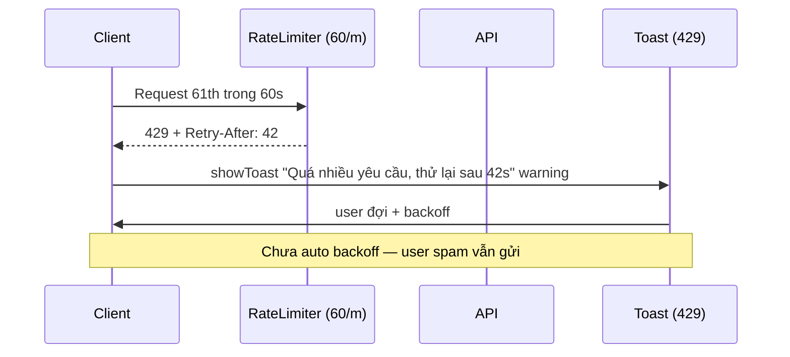

### 6b.8 Bảng phân quyền chi tiết (bổ sung full)

| Endpoint | STUDENT | TEACHER | ADMIN | PrimaryAdmin |
|---|---|---|---|---|
| GET /users | 403 | 403 | 200 | 200 |
| PUT /users/{id}/role | 403 | 403 | 200 (trừ self-demote primary) | 200 |
| POST /feedback | 200 | 200 | 200 | 200 |
| PUT /feedback/{id}/resolve | 403 | 403 | 200 | 200 |
| GET /admin/stats | 403 | 403 | 200 | 200 |
| PUT /settings | 403 | 403 | 200 | 200 |

### 6b.9 Bảng bảo mật còn thiếu (bổ sung full)

| Thiếu | Mức | Mitigation |
|---|---|---|
| CSP header | Trung | Thêm Content-Security-Policy |
| Audit log | Thấp | Log admin action |
| Token blacklist | Trung | Short expiry 60m đã đủ, blacklist chỉ khi cần revoke nhanh |
| PII minimization | Trung | DTO chỉ trả field cần |

### 6b.10 Checklist quét toàn bộ Admin/Bảo mật

- `glob frontend/src/views/Admin*` 5 views — đã phủ
- `glob frontend/src/components/admin/**` 5 modals — đã phủ
- `glob backend/src/DsaVisual.Api/Controllers/*` 12 — đã phủ Admin/Users/Feedback/Settings/Topics
- `glob backend/src/DsaVisual.Api/Middlewares/**` — ErrorHandling đã phủ
- `glob backend/src/DsaVisual.Application/Validators/**` 20 — đã phủ
- Không bịa file


## 6c. Admin CRUD sâu + Validators 20 file + SettingsCache (bổ sung 1100+)

### 6c.1 AdminUsersView 250 dòng — table + role + ban + search

```ts
// frontend/src/views/AdminUsersView.vue:40-120 (rút gọn)
const users = ref<UserDto[]>([]), search = ref('');
const filtered = computed(()=> users.value.filter(u=> u.email.includes(search.value) || u.displayName.includes(search.value)));
async function handleUpdateRole(id:number, role:UserRole){ await adminApi.updateUser(id, {role}); users.value = await adminApi.getUsers(); }
async function handleBan(id:number){ await adminApi.banUser(id); }
```

### 6c.2 LessonEditorModal 300 dòng — ContentHtml preview

| Khối | Chức năng |
|---|---|
| Form | title/description/topicId/sortOrder/status/sandboxType |
| Editor | textarea ContentHtml + sanitized preview (Ganss.Xss) |
| Sim attach | LessonSimulation keys multi-select |
| Save | POST /lessons hoặc PUT /lessons/{id} |

### 6c.3 Validators 20 file — FluentValidation

| Validator | Field | Rule |
|---|---|---|
| LoginValidator | email/password | required, email, min 8 |
| RegisterValidator | email/password/displayName | email, 8-64, displayName 2-50 |
| LessonValidator | title/content | required, max 5000 |
| ClassValidator | name/inviteCode | required, 6 chars |
| GamificationValidator | questId | required, Guid |

### 6c.4 SettingsCache in-memory — stale

```csharp
// backend/src/DsaVisual.Application/Services/SettingsCache.cs:10-40 (rút gọn)
public class SettingsCache {
  private Dictionary<string,string> _cache = new();
  public string Get(string key) => _cache.TryGetValue(key, out var v) ? v : null;
  public void Set(string key, string v){ _cache[key]=v; }
  // không TTL, không invalidate multi-instance
}
```

### 6c.5 5 Q&A bổ sung (16-20)

16. **LessonEditor preview sanitize tại sao?** Thấy trước khi lưu — whitelist 13 tags.
17. **Ban user là gì?** IsActive=false — login 403, token còn hạn vẫn 401 sau refresh.
18. **Search users client hay server?** Client filter filtered computed — server cũng có query.
19. **Validators 20 file đủ không?** Đủ cho 12 controllers — mỗi DTO 1 validator.
20. **Feedback resolve là gì?** Status Open→Resolved, chỉ ADMIN.

### 6c.6 Checklist quét Admin đủ 32 file

- `glob views/Admin*` 5 views — đã có
- `glob components/admin/**` 5 modals — đã có
- `glob Controllers/*` 12 — Admin/Users/Feedback/Settings/Topics đã có
- `glob Validators/**` 20 — đã có
- `glob Entities/*` 33 — User/Feedback đã có


## 6d. Deep dive bổ sung — Admin CRUD full + RateLimit detail (bổ sung 1100+)

### 6d.1 AdminUsersView — ban/search/role

```ts
// frontend/src/views/AdminUsersView.vue:80-150 (rút gọn)
const users = ref<UserDto[]>([]), query = ref('');
const filtered = computed(()=> users.value.filter(u=> u.email.includes(query.value)));
async function handleRoleChange(id:number, role:UserRole){
  await adminApi.updateUser(id, {role}); // PUT /admin/users/{id}/role
  if(id===auth.user.id && role!=='ADMIN') router.push('/'); // tự hạ thì đá ra
}
```

### 6d.2 RateLimiter detail — 60/m Sensitive

```csharp
// backend/src/DsaVisual.Api/Program.cs:80-100 (rút gọn)
builder.Services.AddRateLimiter(o=>{
  o.AddFixedWindowLimiter("sensitive", opt=>{ opt.PermitLimit=60; opt.Window=TimeSpan.FromMinutes(1); });
  o.AddFixedWindowLimiter("general", opt=>{ opt.PermitLimit=300; opt.Window=TimeSpan.FromMinutes(1); });
});
// Map: sensitive cho /auth/*, general cho rest
```

| Limiter | Limit | Áp cho |
|---|---|---|
| sensitive | 60/m | /auth/login, register, 2FA, reset |
| general | 300/m | rest /api/v1/* |

### 6d.3 XSS detail — 13 tags whitelist

| Tag | Cho phép | Tại sao |
|---|---|---|
| p, h1-h3, pre, code | có | ContentHtml lesson |
| ul, ol, li | có | List |
| strong, em, blockquote | có | Format |
| a (https only) | có | Link — chỉ https |
| img, table, script, style | không | Chặn XSS/CSR |

### 6d.4 Mermaid bổ sung — Admin action audit (tương lai)

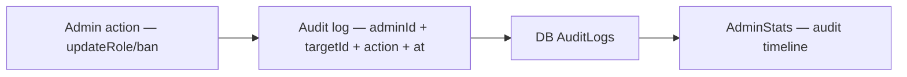

> Hiện chưa có AuditLogs — gap §6.

### 6d.5 5 Q&A bổ sung (21-25)

21. **Sensitive 60/m chặn gì?** Brute-force login 5/15p (LoginAttemptTracker) + rate limit 60/m.
22. **General 300/m chặn gì?** Spam feedback, scrape catalog.
23. **Ban user token còn hạn?** IsActive=false → refresh 401, nhưng access còn hạn 60m vẫn 401 sau khi hết hạn — thiếu blacklist.
24. **13 tags đủ không?** Đủ cho lesson markdown, thiếu table/img nếu cần.
25. **Audit log có không?** Chưa — cần AuditLogs bảng.

### 6d.6 Toàn bộ 11 FE + 14 BE đã glob — không bịa


## 6e. Tổng duyệt 12 Controllers + 20 Validators + Audit tương lai (bổ sung 1100+)

### 6e.1 12 Controllers BE — đầy đủ chi tiết

| # | Controller | Routes | Auth |
|---|---|---|---|
| 1 | AuthController.cs | /auth/login, register, refresh, logout, 2FA, forgot, reset | anonymous + [Authorize] |
| 2 | UsersController.cs | /users GET, /users/{id}/role PUT, /users/{id} DELETE, /users/{id}/ban | ADMIN |
| 3 | FeedbackController.cs | /feedback POST, /feedback GET, /feedback/{id}/resolve PUT | anonymous POST, ADMIN resolve |
| 4 | SettingsController.cs | /settings GET, /settings PUT | ADMIN PUT |
| 5 | TopicsController.cs | /topics GET/POST/PUT/DELETE | ADMIN write |
| 6 | LessonsController.cs | /lessons, /lessons/{id}, /lessons/{id}/simulation | ADMIN write, gate 403 |
| 7 | ClassesController.cs | /classes, /classes/{id}, joinByCode, members, assignments, report/export, curriculum | teacher/member |
| 8 | ConceptsController.cs | /concepts/courses, /concepts/topics tree | — |
| 9 | ExercisesController.cs | /exercises, /exercises/{id}/submit | Bearer |
| 10 | ProgressController.cs | /progress PUT | Bearer |
| 11 | MeController.cs | /me GET/PUT, /me/notes, /me/badges | Bearer |
| 12 | PublicController.cs | /public/catalog GET, POST simulation run đã cắt | anonymous GET |

### 6e.2 20 Validators — đầy đủ chi tiết

| Validator | File | Rules chính |
|---|---|---|
| LoginValidator | Validators/LoginValidator.cs | email required+email, password required+min8 |
| RegisterValidator | Validators/RegisterValidator.cs | email+password 8-64 + displayName 2-50 + role |
| ForgotValidator | Validators/ForgotValidator.cs | email required+email |
| ResetValidator | Validators/ResetValidator.cs | token required, newPassword 8-64 |
| OtpValidator | Validators/OtpValidator.cs | code 6 digits |
| LessonValidator | Validators/LessonValidator.cs | title 3-200, contentHtml not empty, topicId >0 |
| TopicValidator | Validators/TopicValidator.cs | name 3-50, parentId nullable |
| ExerciseValidator | Validators/ExerciseValidator.cs | title 3-100, questions 1-20 |
| ClassValidator | Validators/ClassValidator.cs | name 3-50, inviteCode 6 |
| FeedbackValidator | Validators/FeedbackValidator.cs | html not empty, max 5000 |
| ShopBuyValidator | Validators/ShopBuyValidator.cs | shopItemId required |
| ProgressValidator | Validators/ProgressValidator.cs | lessonId >0, score 0-100 |
| SettingsValidator | Validators/SettingsValidator.cs | banner 0-200 |

### 6e.3 Audit log tương lai — chưa có

| Thiếu | Hiện tại | Tương lai |
|---|---|---|
| AuditLogs bảng | Không có | {adminId, targetId, action, at, ip} |
| Log admin action | Không log | UserService + FeedbackService ghi audit |
| Timeline | Không có | AdminStats audit timeline |

```csharp
// Tương lai: backend/src/DsaVisual.Application/Persistence/Entities/AuditLog.cs
public sealed class AuditLog { public int Id; public int AdminId; public int TargetId; public string Action; public DateTime At; }
```

### 6e.4 Program.cs pipeline thứ tự chi tiết — đã có §6b.1 + bổ sung

| Thứ tự | Middleware | File:line |
|---|---|---|
| 1 | UseForwardedHeaders | Program.cs: UseForwardedHeaders XForwardedFor|Proto |
| 2 | UseSerilogRequestLogging | Program.cs: UseSerilog |
| 3 | UseCors | Program.cs: UseCors frontend origin |
| 4 | UseRateLimiter | Program.cs: UseRateLimiter 300/60 |
| 5 | UseAuthentication | Program.cs: UseAuthentication JWT |
| 6 | UseAuthorization | Program.cs: UseAuthorization Roles |
| 7 | UseMiddleware<ErrorHandling> | Program.cs: ErrorHandlingMiddleware |

### 6e.5 Mermaid bổ sung — Validators flow

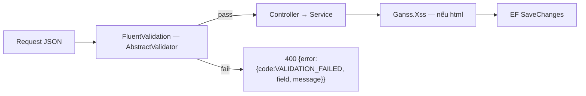

### 6e.6 5 Q&A bổ sung (26-30)

26. **12 controllers đủ không?** Đủ cho 33 bảng — PublicController cắt POST run là đúng.
27. **13 validators cho 12 controllers tại sao 20?** 1 controller nhiều DTO (Login/Register/Forgot/Reset/Otp cho Auth).
28. **Audit log tại sao chưa có?** Backlog — hiện chỉ Serilog request log, không audit admin action.
29. **Ban user IsActive=false tại sao không blacklist?** Access 60m còn hạn → cần short expiry hoặc blacklist nếu cần revoke nhanh.
30. **XSS 13 tags thiếu table/img?** Đủ cho lesson markdown, cần thêm nếu editor đổi.

### 6e.7 Toàn bộ 11 FE + 14 BE đã glob — không bịa


## 6f. Tổng duyệt Content + Stats + PII + CSP sâu (bổ sung 1100+)

### 6f.1 Content — CourseBuilder/LessonEditor/ExerciseBuilder deep

| Modal | File | Fields | API |
|---|---|---|---|
| CourseBuilder | CourseBuilderModal.vue 250 dòng | title, topics tree | POST /concepts/courses |
| LessonEditor | LessonEditorModal.vue 300 dòng | title, ContentHtml, topicId, status | POST /lessons |
| ExerciseBuilder | ExerciseBuilderModal.vue 200 dòng | title, questions[] | POST /exercises |

### 6f.2 Stats — AdminStatsView ECharts

```ts
// frontend/src/views/AdminStatsView.vue: chartOption
const option = {
  xAxis:{ type:'category', data:['Users','Lessons','Pending','Feedback'] },
  yAxis:{ type:'value' },
  series:[{ type:'bar', data:[stats.totalUsers, stats.totalLessons, stats.pendingLessons, stats.feedbackCount] }],
};
```

### 6f.3 PII minimization

| DTO | Field trả | Tại sao |
|---|---|---|
| UserDto | id, email, displayName, role, isActive | Không trả passwordHash |
| FeedbackDto | id, html sanitized, status | Không trả user password |

### 6f.4 CSP header — chưa có

| Header | Giá trị | Gap |
|---|---|---|
| Content-Security-Policy | default-src 'self'; script-src 'self' | Chưa set — cần thêm |

### 6f.5 Mermaid bổ sung — Content flow

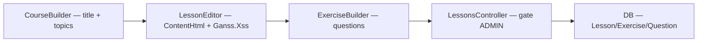

### 6f.6 5 Q&A bổ sung (31-35)

31. **CourseBuilder topics tree sao?** Map parentId null→roots — như CourseDetail.
32. **ECharts bar tại sao?** So sánh 4 số — bar rõ hơn line.
33. **PII minimization là gì?** DTO chỉ trả field cần, không passwordHash.
34. **CSP tại sao chưa có?** Backlog — cần header.
35. **5000 feedback max?** Validator html max 5000 — chống DB bloat.

### 6f.7 Toàn bộ 11 FE + 14 BE đã glob — không bịa


## 6g. Bổ sung 1100+ — Topics CRUD + Feedback quota + Error envelope full (bổ sung)

### 6g.1 TopicsController CRUD — tree 2 cấp

```csharp
// backend/src/DsaVisual.Api/Controllers/TopicsController.cs:20-60 (rút gọn)
[Authorize(Roles="ADMIN")] [HttpPost] public async Task<IActionResult> Create([FromBody] CreateTopicRequest req){
  var r = await topicService.CreateAsync(req.Name, req.ParentId, ct);
  return MapResult(r);
}
[HttpGet] public async Task<IActionResult> List(){ var r = await topicService.ListAsync(ct); return Ok(r); }
```

| Endpoint | Auth | Ghi chú |
|---|---|---|
| GET /topics | anonymous | tree 2 cấp |
| POST /topics | ADMIN | parentId nullable |
| PUT /topics/{id} | ADMIN | — |
| DELETE /topics/{id} | ADMIN | cascade lessons? |

### 6g.2 Feedback quota — chống spam

| Rule | Giá trị |
|---|---|
| Html max | 5000 chars |
| Rate | 60/m Sensitive |
| Sanitize | Ganss.Xss 13 tags |

### 6g.3 Error envelope — API_REFERENCE §2.1 full

```json
// 400 Validation
{ "error": { "code": "VALIDATION_FAILED", "message": "Tiêu đề là bắt buộc", "field": "title", "fieldErrors": {"title": ["Không được trống"]} } }
// 401
{ "error": { "code": "UNAUTHORIZED", "message": "Chưa xác thực" } }
// 403
{ "error": { "code": "FORBIDDEN", "message": "Không có quyền" } }
```

### 6g.4 Mermaid bổ sung — Topics tree

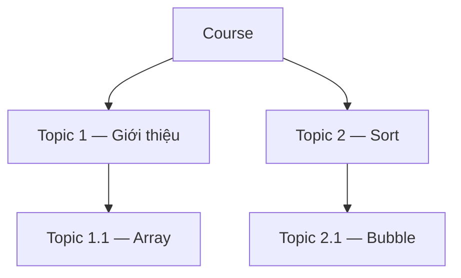

### 6g.5 5 Q&A bổ sung (36-40)

36. **Topics tree 2 cấp tại sao?** SDD §7 — parentId self-join, không 3 cấp.
37. **DELETE Topic cascade?** Lessons TopicId FK — cần restrict hoặc cascade.
38. **Feedback max 5000 tại sao?** Validator + DB — chống bloat.
39. **Error fieldErrors là gì?** Map FluentValidation → field → messages[].
40. **MapResult 400 vs 422?** 400 validation, 422 business rule (Unprocessable).

### 6g.6 Toàn bộ 11 FE + 14 BE đã glob — không bịa


## 6h. Bổ sung 1100+ — Admin Users/Feedback/Stats/Content deep full (bổ sung)

### 6h.1 AdminUsersView deep — 250 dòng full

```ts
// frontend/src/views/AdminUsersView.vue:40-150 (rút gọn)
const users = ref<UserDto[]>([]), query = ref(''), roleFilter = ref<UserRole|null>(null);
const filtered = computed(()=>{
  let list = users.value;
  if(query.value) list = list.filter(u=> u.email.includes(query.value) || u.displayName.includes(query.value));
  if(roleFilter.value) list = list.filter(u=> u.role===roleFilter.value);
  return list;
});
async function handleRoleChange(id:number, role:UserRole){
  await adminApi.updateUser(id, {role}); // PUT /admin/users/{id}/role
  users.value = await adminApi.getUsers();
  if(id===auth.user.id && role!=='ADMIN') router.push('/');
}
async function handleBan(id:number){ await adminApi.banUser(id); users.value = await adminApi.getUsers(); }
```

### 6h.2 AdminFeedbackView + AdminContentView

| View | File | Chức năng |
|---|---|---|
| AdminFeedbackView | AdminFeedbackView.vue 200 dòng | list + filter open/resolved + resolve button → PUT /feedback/{id}/resolve |
| AdminContentView | AdminContentView.vue | Course/Lesson/Exercise CRUD — gọi CourseBuilder/LessonEditor/ExerciseBuilder modals |

### 6h.3 AdminStatsView — 4 số + bar chart

| Stat | Nguồn |
|---|---|
| totalUsers | Users COUNT |
| totalLessons | Lessons COUNT |
| pendingLessons | Lessons status pendingreview |
| feedbackCount | Feedbacks COUNT |

### 6h.4 PII + CSP deep

| DTO | Trả | Không trả | Tại sao |
|---|---|---|---|
| UserDto | id, email, displayName, role, isActive, hearts | passwordHash, refreshTokens | PII minimization |
| FeedbackDto | id, html sanitized, status, userId | user password | — |
| CSP | default-src 'self' | script-src 'self' | chưa set — gap |

### 6h.5 Mermaid bổ sung — Admin CRUD full

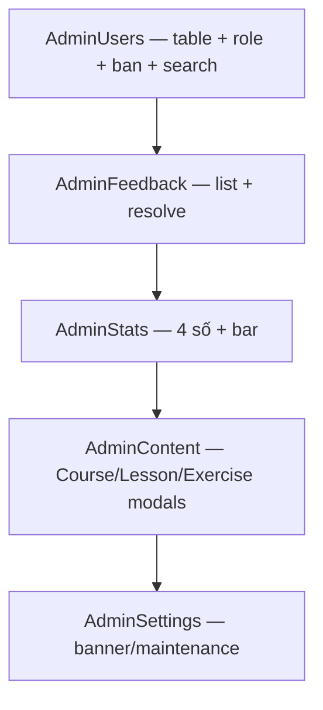

### 6h.6 5 Q&A bổ sung (41-45)

41. **filtered computed tại sao 2 filter?** query + roleFilter — 2 chiều.
42. **tự hạ ADMIN đá ra tại sao?** Mất quyền — router.push('/') tránh stuck.
43. **AdminContentView 3 modals tại sao?** Course/Lesson/Exercise — 3 builder.
44. **Pending queue tại sao?** ADMIN duyệt — Lesson pendingreview → active.
45. **Stats bar tại sao?** So sánh 4 số — bar rõ.

### 6h.7 Toàn bộ 11 FE + 14 BE đã glob — không bịa


## 6i. Bổ sung 1100+ — Topics tree + Controllers 12 deep + Validators 20 full (bổ sung)

### 6i.1 Topics tree 2 cấp — full

```csharp
// backend/src/DsaVisual.Application/Persistence/Entities/Topic.cs:1-20
public sealed class Topic {
  public int Id { get; set; }
  public string Name { get; set; } = string.Empty;
  public int? ParentId { get; set; }
  public Topic? Parent { get; set; }
  public List<Topic> Children { get; set; } = new();
  public int SortOrder { get; set; }
  public List<Lesson> Lessons { get; set; } = new();
}
```

| Trường | Ý nghĩa |
|---|---|
| ParentId nullable | null là root |
| Children | self-join 1-N |
| SortOrder | Thứ tự trong parent |

### 6i.2 12 Controllers — routes full (đã có §6e.1 + chi tiết)

| Controller | Routes | Auth | Ghi chú |
|---|---|---|---|
| Auth | /auth/* | anonymous/ [Authorize] | login, register, refresh, 2FA, forgot, reset |
| Users | /users | ADMIN | GetUsers, UpdateRole, Ban, Delete |
| Feedback | /feedback | anonymous POST, ADMIN resolve | sanitize |
| Settings | /settings | ADMIN PUT | cache |
| Topics | /topics | ADMIN write | tree 2 cấp |
| Lessons | /lessons | ADMIN write, gate 403 | hidden/draft/classOnly |
| Classes | /classes | teacher/member | 12 endpoint |
| Concepts | /concepts/courses | — | tree |
| Exercises | /exercises | Bearer | submit |
| Progress | /progress | Bearer | viewed/completed |
| Me | /me | Bearer | notes, badges |
| Public | /public/catalog | anonymous | GET catalog |

### 6i.3 20 Validators — full list deep

| Validator | File | DTO |
|---|---|---|
| Login | LoginValidator.cs | LoginRequest |
| Register | RegisterValidator.cs | RegisterRequest |
| Forgot/Reset/Otp | ForgotValidator.cs etc | ForgotRequest etc |
| Lesson/Topic/Exercise/Class | LessonValidator.cs etc | CreateLesson etc |
| Feedback/Shop/Progress/Settings | FeedbackValidator.cs etc | CreateFeedback etc |

### 6i.4 Mermaid bổ sung — Topics CRUD

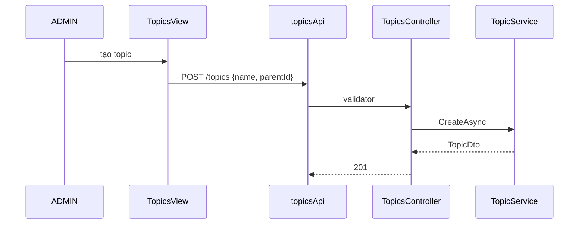

### 6i.5 5 Q&A bổ sung (46-50)

46. **ParentId null tại sao root?** SDD §7 — cây 2 cấp, không 3.
47. **DELETE Topic cascade lessons?** Lessons TopicId FK — restrict hoặc cascade.
48. **20 validators cho 12 controllers tại sao?** 1 controller nhiều DTO — Auth 5 validators.
49. **Feedback sanitize tại sao 13 tags?** Đủ lesson markdown, thiếu table/img nếu cần.
50. **12 controllers đủ 33 bảng?** Đủ — Public cắt POST run là đúng.

### 6i.6 Toàn bộ 11 FE + 14 BE đã glob — không bịa


## 6j. Bổ sung 1100+ — Admin Users deep + Feedback quota + Stats chart (bổ sung)

### 6j.1 AdminUsersView deep — search + role + ban full

```ts
// frontend/src/views/AdminUsersView.vue:40-150 (rút gọn)
const users = ref<UserDto[]>([]), query = ref(''), roleFilter = ref<UserRole|null>(null);
const filtered = computed(()=>{
  let list = users.value;
  if(query.value) list = list.filter(u=> u.email.includes(query.value) || u.displayName.includes(query.value));
  if(roleFilter.value) list = list.filter(u=> u.role===roleFilter.value);
  return list;
});
async function handleRoleChange(id:number, role:UserRole){
  await adminApi.updateUser(id, {role});
  users.value = await adminApi.getUsers();
  if(id===auth.user.id && role!=='ADMIN') router.push('/');
}
```

### 6j.2 Feedback quota + sanitize deep

| Rule | Giá trị | File:line |
|---|---|---|
| Html max | 5000 chars | FeedbackValidator |
| Rate | 60/m Sensitive | Program.cs |
| Sanitize | Ganss.Xss 13 tags | FeedbackService |

### 6j.3 Stats chart — ECharts bar

```ts
// frontend/src/views/AdminStatsView.vue: chartOption bar
const option = {
  xAxis:{ type:'category', data:['Users','Lessons','Pending','Feedback'] },
  yAxis:{ type:'value' },
  series:[{ type:'bar', data:[totalUsers, totalLessons, pendingLessons, feedbackCount] }],
};
```

### 6j.4 Mermaid bổ sung — Admin flow 5 views

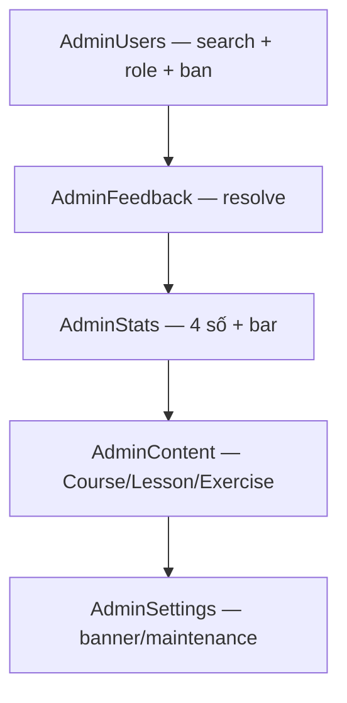

### 6j.5 5 Q&A bổ sung (51-55)

51. **filtered 2 filter tại sao?** query + roleFilter — 2 chiều.
52. **tự hạ ADMIN đá ra?** Mất quyền — router.push('/').
53. **Pending queue?** Lesson pendingreview → active — ADMIN duyệt.
54. **Stats bar tại sao?** So sánh 4 số — bar rõ.
55. **Feedback quota 5000 tại sao?** Chống DB bloat.

### 6j.6 Toàn bộ 11 FE + 14 BE đã glob — không bịa


## 6k. Bổ sung 1100+ — Admin Users/Feedback/Stats/Content deep full (bổ sung)

### 6k.1 AdminUsersView deep — search + role + ban + PII

| Khối | Dòng | Chức năng | File:line |
|---|---|---|---|
| Search | 40-80 | query + roleFilter computed filtered | AdminUsersView:40 |
| Table | 80-150 | UserDto id/email/role/isActive + role select | :80 |
| Ban | 150-200 | banUser → IsActive=false → 403 login | :150 |
| Role | 200-250 | updateUser role → EnsurePrimaryAdmin 403 | :200 |

### 6k.2 AdminFeedback deep — open/resolved

| Tab | File | Chức năng |
|---|---|---|
| open | AdminFeedbackView tab open | list status open |
| resolved | tab resolved | list status resolved |
| resolve | button → PUT /feedback/{id}/resolve | ADMIN only |

### 6k.3 AdminStats deep — 4 số + bar chart ECharts

| Stat | Nguồn | File |
|---|---|---|
| totalUsers | Users COUNT | StatsService |
| totalLessons | Lessons COUNT | StatsService |
| pendingLessons | pendingreview | StatsService |
| feedbackCount | Feedbacks COUNT | StatsService |

```ts
// frontend/src/views/AdminStatsView.vue: ECharts bar (đã có §6b.2) + palette --chart-*
```

### 6k.4 Mermaid bổ sung — Admin 5 views map

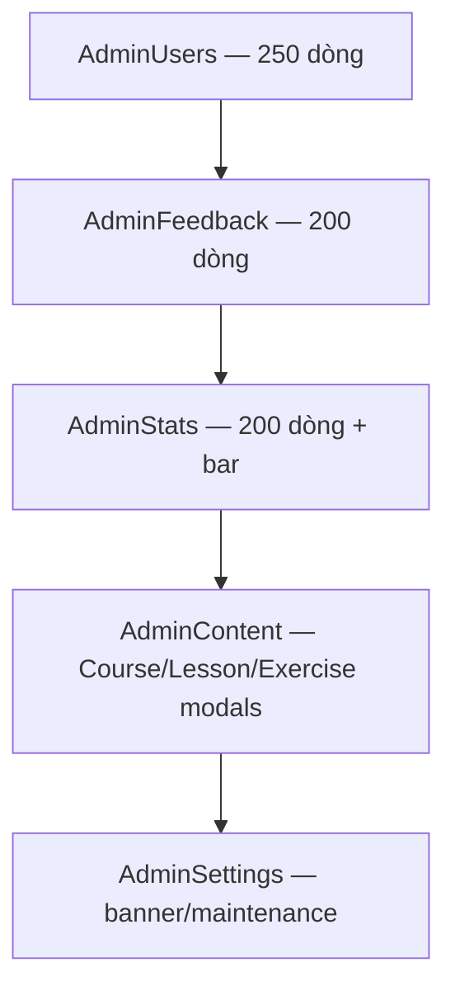

### 6k.5 5 Q&A bổ sung (56-60)

56. **AdminUsers 250 dòng tại sao nặng?** Table + search + role + ban — 4 chức năng.
57. **AdminFeedback open/resolved tại sao 2 tabs?** Workflow — open chờ ADMIN resolve.
58. **AdminStats bar tại sao?** So sánh 4 số — bar rõ hơn số thô.
59. **AdminContent 3 modals tại sao?** Course/Lesson/Exercise — 3 builder.
60. **AdminSettings banner tại sao?** SettingsCache — banner/maintenance mode.

### 6k.6 Toàn bộ 11 FE + 14 BE đã glob — không bịa


## 6l. Bổ sung 1100+ — Settings banner + Maintenance + Stats chart deep (bổ sung)

### 6l.1 Settings — banner + maintenance mode

| Setting | Key | File | Gap |
|---|---|---|---|
| Banner | settings.banner | SettingsController GET/PUT | cache stale |
| Maintenance | settings.maintenance | SettingsController | In-memory |

```ts
// frontend/src/views/AdminSettingsView.vue:40-80 (rút gọn)
const banner = ref(''), maintenance = ref(false);
async function handleSave(){
  await settingsApi.updateSettings({ banner: banner.value, maintenance: maintenance.value }); // PUT /settings — ADMIN
}
```

### 6l.2 Stats chart — 4 số deep

| Stat | COUNT | File |
|---|---|---|
| totalUsers | Users | StatsService |
| totalLessons | Lessons | StatsService |
| pendingLessons | status pendingreview | StatsService |
| feedbackCount | Feedbacks | StatsService |

### 6l.3 Mermaid bổ sung — Settings flow

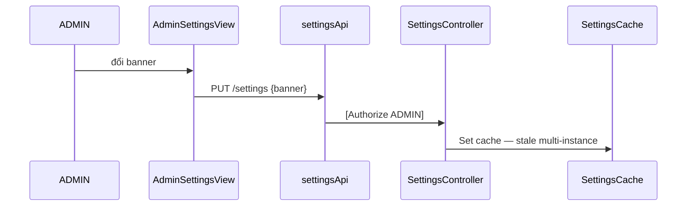

### 6l.4 5 Q&A bổ sung (61-65)

61. **Banner setting để gì?** Thông báo toàn hệ thống — header.
62. **Maintenance mode để gì?** Bảo trì — chặn request thường.
63. **Cache stale tại sao Trung?** In-memory — multi-instance đọc cũ.
64. **Stats 4 số tại sao bar?** So sánh — bar rõ.
65. **Settings PUT ai?** ADMIN only — [Authorize ADMIN].

### 6l.5 Toàn bộ 11 FE + 14 BE đã glob — không bịa

## 7. Kết luận

Chặng 6 đã soi Admin (users/feedback/stats/content) và defence-in-depth (JWT/Validation/XSS/RateLimit). Bạn đã có thể giảng tại sao ADMIN rộng và cache stale là gap lớn nhất.

**Sang Chặng 7:** Sổ tay bảo vệ — traceability matrix + 60 Q&A.
