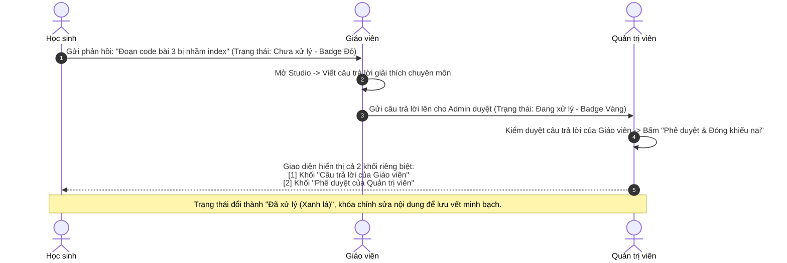

# 🎨 PHÂN HỆ 7: STUDIO SOẠN BÀI GIẢNG VIÊN (CURRICULUM STUDIO FLOW)

Studio là không gian làm việc chuyên dụng cho **Giảng viên (Teacher)** và **Admin** để biên soạn nội dung khóa học, thiết lập cây lộ trình, nhúng mô phỏng trực quan và quản lý phản hồi của học viên.

---

## 1. MÀN HÌNH 25: TRUNG TÂM STUDIO (ADMIN CONTENT VIEW)

* **URL**: `/studio` (alias: `/admin/content`, `/teacher`)
* **File Vue**: [`AdminContentView.vue`](file:///d:/FPT/metqua/frontend/src/views/AdminContentView.vue)
* **Quyền truy cập**: Giảng viên và Admin (`roles: ['TEACHER', 'ADMIN']`).

```
┌────────────────────────────────────────────────────────────────────────┐
│ 🎨 CURRICULUM STUDIO (XƯỞNG SOẠN BÀI)                                  │
│ [ 📊 Tổng quan ]  [ 🌲 Cây lộ trình ]  [ 💬 Phản hồi học viên ]  [ 🛡️ Duyệt ]│
├────────────────────────────────────────────────────────────────────────┤
│ TAB ĐANG CHỌN: 🌲 CÂY LỘ TRÌNH & SOẠN BÀI HỌC                          │
│                                                                        │
│ CỘT TRÁI: CÂY GIÁO TRÌNH          │ CỘT PHẢI: TRÌNH SOẠN THẢO BÀI HỌC   │
│ 📁 Lộ trình: Sắp xếp & Tìm kiếm   │                                    │
│  ├─ 📄 Bài 1: Khái niệm thuật toán│ [ 1. Lý thuyết ] [ 2. Mô phỏng ]   │
│  ├─ 📄 Bài 2: Phân tích Big-O     │ [ 3. Code mẫu  ] [ 4. Trắc nghiệm] │
│  ├─ 📄 Bài 3: Binary Search ✎     │                                    │
│  └─ [ + Thêm bài học mới ]        │ [ NÚT LƯU BÀI HỌC ]  [ XEM THỬ 👁️ ]│
└────────────────────────────────────────────────────────────────────────┘
```

---

## 2. CÁC TAB SOẠN THẢO BÀI HỌC CHI TIẾT

Khi Giảng viên bấm vào một bài học để chỉnh sửa, hệ thống hiển thị 5 tab chuyên sâu:

### 1. Tab Lý thuyết ([TheoryTab.vue](file:///d:/FPT/metqua/frontend/src/views/admin/editor-tabs/TheoryTab.vue))
* Tích hợp trình soạn thảo chuẩn **Tiptap** và **Markdown**.
* Hỗ trợ gõ công thức toán học LaTeX thời gian thực (ví dụ: `$O(\log n)$`, `$$\sum_{i=1}^n i$$`).
* Khung xem trước (Live Preview) giúp định dạng bài viết chuẩn xác trước khi lưu.

### 2. Tab Mô phỏng Sandbox ([SimulationTab.vue](file:///d:/FPT/metqua/frontend/src/views/admin/editor-tabs/SimulationTab.vue))
* Danh mục 44 mô phỏng có sẵn từ hệ thống.
* **Nút Xem thử (Preview)**: Mở modal chạy thử thuật toán để Giảng viên kiểm tra trước hiệu ứng.
* **Nút Chọn mô phỏng này (Select)**: Gán `SimulationKey` vào bài học. Khi học viên mở bài, khung mô phỏng này sẽ tự động hiển thị bên cạnh lý thuyết.
* **Nút Gỡ bỏ mô phỏng**: Chuyển bài học về dạng thuần lý thuyết.

### 3. Tab CodeLab & Code mẫu ([CodeLabTab.vue](file:///d:/FPT/metqua/frontend/src/views/admin/editor-tabs/CodeLabTab.vue))
* Giảng viên soạn thảo code mẫu (Starter code), code đáp án (Solution code).
* Thiết lập danh sách Test Case (gồm cả test case công khai và test case ẩn để chấm điểm).

### 4. Tab Trắc nghiệm ([QuizTab.vue](file:///d:/FPT/metqua/frontend/src/views/admin/editor-tabs/QuizTab.vue))
* Soạn câu hỏi trắc nghiệm, các lựa chọn A, B, C, D, đánh dấu đáp án đúng và viết lời giải thích chi tiết khi học viên chọn sai.

### 5. Tab Thiết lập ([SettingsTab.vue](file:///d:/FPT/metqua/frontend/src/views/admin/editor-tabs/SettingsTab.vue))
* Đặt trạng thái: **Bản nháp (Draft)** hoặc **Công khai (Active)**.
* Chỉ khi bấm nút **"Lưu lộ trình"** thì trạng thái công khai mới được áp dụng ra ngoài trang chủ.

---

## 3. TAB QUẢN LÝ PHẢN HỒI PHÂN TẦNG (STUDIO FEEDBACK TAB)

* **File Vue**: [`StudioFeedbackTab.vue`](file:///d:/FPT/metqua/frontend/src/views/admin/sections/StudioFeedbackTab.vue)

Quy trình xử lý phản hồi/khiếu nại của học sinh được thiết kế theo mô hình **Phân tầng minh bạch (Multi-tier Feedback)**:


