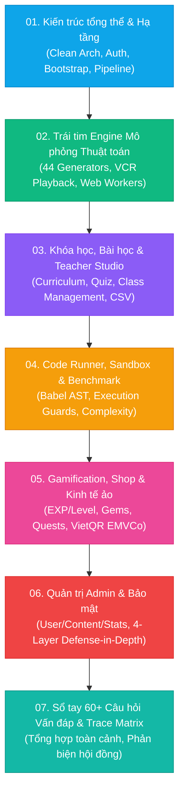

# 📚 TỔNG QUAN TÀI LIỆU STUDY & SỔ TAY BẢO VỆ ĐỒ ÁN — VISUALIZATION DSA

> **Mục tiêu**: Bộ tài liệu học tập và nghiên cứu toàn diện từ tổng quan (Top-Down) đến chi tiết từng dòng mã nguồn của hệ thống **VisualizationDSA**, phục vụ cho việc nắm vững 100% kiến trúc, bảo vệ đồ án tốt nghiệp xuất sắc và có khả năng giảng dạy lại cho người khác.

---

## 🗺️ BẢN ĐỒ LỘ TRÌNH 7 CHẶNG STUDY

---

## 📑 MỤC LỤC CHI TIẾT TỪNG CHẶNG

| Chặng | Tên tài liệu & Liên kết | Nội dung trọng tâm | Thời lượng ước tính |
| :---: | :--- | :--- | :---: |
| **01** | [01_kien_truc_tong_the_va_ha_tang.md](file:///D:/FPT/neww/study/01_kien_truc_tong_the_va_ha_tang.md) | Kiến trúc phân tầng Backend .NET 10 / Frontend Vue 3, FE Security & Resilience Layer (Circuit Breaker, Retry, ErrorBoundary), Luồng Bootstrap F5, In-memory JWT + HttpOnly Refresh Cookie, 4-Layer Defense-in-Depth, Rate Limiting, Error Envelope chuẩn. | 45 phút |
| **02** | [02_trai_tim_engine_mo_phong_thuat_toan.md](file:///D:/FPT/neww/study/02_trai_tim_engine_mo_phong_thuat_toan.md) | Single Source of Truth `simulation-catalog.json`, 44 Generators chuẩn xác (34 Algorithm + 10 Structure), Phân quyền `demoAllowed` (3 keys unauthenticated), Pinia VCR Store, 6 Canvas Renderers, Web Worker compile, Sampling 3000 frames. | 60 phút |
| **03** | [03_khoa_hoc_bai_hoc_va_teacher_studio.md](file:///D:/FPT/neww/study/03_khoa_hoc_bai_hoc_va_teacher_studio.md) | Lộ trình khóa học, Vòng đời bài học (Draft $\rightarrow$ Active), 3 chế độ bài tập (Quiz/Coding Codelab/MultipleChoice), `ExerciseService` 76KB, Chấm code server-side sandboxed qua `CodelabJudgeService` (Jint 1.5s/32MB/200k stmts), Khóa chống race `SubmissionLockRegistry`, Quản lý lớp & CSV UTF-8 BOM. | 50 phút |
| **04** | [04_code_runner_sandbox_va_benchmark.md](file:///D:/FPT/neww/study/04_code_runner_sandbox_va_benchmark.md) | Trình thực thi Code Runner client-side trong Web Worker, Babel AST Instrumentation, Execution Guards (10k steps/1M ticks/5s), Đo đếm Benchmark thực nghiệm Big-O và Server-assisted evaluation qua `GamificationController.cs`, Lưu trữ trace qua `CodeRunsController.cs`. | 45 phút |
| **05** | [05_gamification_shop_va_kinh_te_ao.md](file:///D:/FPT/neww/study/05_gamification_shop_va_kinh_te_ao.md) | `GamificationController.cs` gom nhóm toàn diện: EXP, Level, Daily Quests, Streak, Hearts (5 max, hồi 4h/tim), Sổ cái Gems Ledger (`Earn - Spend`), Cửa hàng Shop/Inventory, Sinh mã VietQR chuẩn EMVCo TLV + CRC16, Gate bảo mật fail-closed `DSA:Premium:EnableMockPay`, Chống enumerate ID lớp ở Leaderboard. | 50 phút |
| **06** | [06_quan_tri_admin_va_bao_mat.md](file:///D:/FPT/neww/study/06_quan_tri_admin_va_bao_mat.md) | Quản trị Người dùng, Duyệt nội dung, Thống kê, Phân biệt 2 hệ thống feedback (`FeedbackController` rating/bug vs `CourseFeedbackController` tương tác 2 chiều học viên ↔ GV), Feature `guided-tour`, Phòng thủ 4 lớp (JWT, RateLimiter, FluentValidation, Ganss.Xss Whitelist 13 tags). | 40 phút |
| **07** | [07_so_tay_cau_hoi_van_dap_bao_ve_do_an.md](file:///D:/FPT/neww/study/07_so_tay_cau_hoi_van_dap_bao_ve_do_an.md) | Ma trận ánh xạ 34 luồng dữ liệu (Data Flow Traceability Matrix), Bộ 80+ câu hỏi vấn đáp phản biện chuyên sâu kèm đáp án và phân tích Gap, Bộ 4 câu hỏi bảo vệ trọng tâm đặc biệt trước Hội đồng. | 90 phút |

---

## 🎯 PHƯƠNG PHÁP HỌC & LUYỆN BẢO VỆ HIỆU QUẢ

1. **Bước 1: Nắm khung sườn (Top-Down)**  
   Đọc phần **1. Khái niệm & Mục đích nghiệp vụ** và xem **Sơ đồ Mermaid** của từng chặng để hiểu "bức tranh toàn cảnh" trước khi đi vào chi tiết.
2. **Bước 2: Đối chiếu mã nguồn thực tế (File-by-File & Snippets)**  
   Mỗi chặng đều trích dẫn chính xác đường dẫn file và số dòng thật trong codebase. Hãy mở file code tương ứng để vừa đọc vừa quan sát logic.
3. **Bước 3: Tự kiểm tra & Phản biện (Self-Test Q&A)**  
   Trả lời các câu hỏi ở cuối mỗi chặng mà không nhìn đáp án trước. Khi trả lời, áp dụng công thức 3 bước:
   - **Khái niệm & Bản chất kỹ thuật** (Technical rationale).
   - **Bằng chứng trong mã nguồn** (File name, Method, Configuration).
   - **Thừa nhận Gap & Hướng cải tiến** (Academic honesty & Future work).
4. **Bước 4: Tổng duyệt với Chặng 07**  
   Luyện tập phản xạ với 60 câu hỏi trong `07_so_tay_cau_hoi_van_dap_bao_ve_do_an.md` để tự tin đối đáp với bất kỳ câu hỏi hóc búa nào từ Hội đồng.
