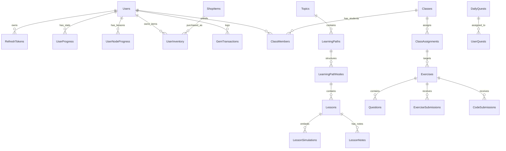

# 🗄️ TÀI LIỆU CƠ SỞ DỮ LIỆU & 32 ENTITIES EF CORE

Tầng Persistence trong `backend/src/DsaVisual.Application/Persistence/` quản lý toàn bộ cấu trúc dữ liệu của DSA Visual, ánh xạ sang CSDL quan hệ **Microsoft SQL Server 2022** thông qua **Entity Framework Core 10**.

---

## 🗺️ SƠ ĐỒ MỐI QUAN HỆ CSDL TỔNG THỂ (ERD)

---

## 📋 CHI TIẾT 4 PHÂN NHÓM ENTITY CHÍNH

### 1. Phân nhóm Xác thực & Người dùng (Auth & Identity)
* [`User.cs`](file:///d:/FPT/metqua/backend/src/DsaVisual.Application/Persistence/Entities/User.cs): Bảng người dùng chính (Id, Username, Email, PasswordHash, Role: `STUDENT` | `TEACHER` | `TEACHER_PENDING` | `ADMIN`, DisplayName, AvatarUrl, IsActive, CreatedAt).
* [`RefreshToken.cs`](file:///d:/FPT/metqua/backend/src/DsaVisual.Application/Persistence/Entities/RefreshToken.cs): Quản lý phiên đăng nhập dài hạn (Token, JwtId, IsUsed, IsRevoked, ExpiresAt, UserId).
* [`RegisterOtpCode.cs`](file:///d:/FPT/metqua/backend/src/DsaVisual.Application/Persistence/Entities/RegisterOtpCode.cs) & [`OtpCode.cs`](file:///d:/FPT/metqua/backend/src/DsaVisual.Application/Persistence/Entities/OtpCode.cs): Mã OTP 6 số xác thực đăng ký hoặc khôi phục mật khẩu.

### 2. Phân nhóm Giáo trình & Bài học (Curriculum)
* [`Topic.cs`](file:///d:/FPT/metqua/backend/src/DsaVisual.Application/Persistence/Entities/Topic.cs): 10 nhóm chủ đề lớn (Sắp xếp, Tìm kiếm, Cây, Bảng băm, Đồ thị...).
* [`LearningPath.cs`](file:///d:/FPT/metqua/backend/src/DsaVisual.Application/Persistence/Entities/LearningPath.cs): Lộ trình học cụ thể (Title, Description, Difficulty, TopicId, Status: Draft/Active).
* [`LearningPathNode.cs`](file:///d:/FPT/metqua/backend/src/DsaVisual.Application/Persistence/Entities/LearningPathNode.cs): Node trong lộ trình (OrderIndex, PrerequisiteNodeId, PathId).
* [`Lesson.cs`](file:///d:/FPT/metqua/backend/src/DsaVisual.Application/Persistence/Entities/Lesson.cs): Nội dung bài học (Title, ContentMarkdown, SimulationKey, SandboxConfig, NodeId).
* [`LessonSimulation.cs`](file:///d:/FPT/metqua/backend/src/DsaVisual.Application/Persistence/Entities/LessonSimulation.cs): Liên kết giữa bài học và mã mô phỏng thuật toán.
* [`LessonNote.cs`](file:///d:/FPT/metqua/backend/src/DsaVisual.Application/Persistence/Entities/LessonNote.cs): Ghi chú riêng của từng học viên cho bài học đó.

### 3. Phân nhóm Gamification & Kinh tế ảo
* [`UserProgress.cs`](file:///d:/FPT/metqua/backend/src/DsaVisual.Application/Persistence/Entities/UserProgress.cs): Thông số cấp độ, XP, số Tim (`Hearts`, tối đa 5), số Ngọc (`Gems`), Chuỗi ngày học `StreakDays`, `LastStreakAt`.
* [`UserNodeProgress.cs`](file:///d:/FPT/metqua/backend/src/DsaVisual.Application/Persistence/Entities/UserNodeProgress.cs): Trạng thái của từng học sinh với từng bài học (`Status`: `0=NotStarted`, `1=InProgress`, `2=Completed`, `IsLocked`, `CompletedAt`).
* [`DailyQuest.cs`](file:///d:/FPT/metqua/backend/src/DsaVisual.Application/Persistence/Entities/DailyQuest.cs) & [`UserQuest.cs`](file:///d:/FPT/metqua/backend/src/DsaVisual.Application/Persistence/Entities/UserQuest.cs): Nhiệm vụ ngày và tiến trình hoàn thành của người dùng (`Current`, `Target`, `Claimed`).
* [`ShopItem.cs`](file:///d:/FPT/metqua/backend/src/DsaVisual.Application/Persistence/Entities/ShopItem.cs) & [`UserInventory.cs`](file:///d:/FPT/metqua/backend/src/DsaVisual.Application/Persistence/Entities/UserInventory.cs): Danh mục vật phẩm bán bằng Ngọc và Kho đồ cá nhân (`IsEquipped`).
* [`GemTransaction.cs`](file:///d:/FPT/metqua/backend/src/DsaVisual.Application/Persistence/Entities/GemTransaction.cs): Lịch sử biến động số dư Ngọc.
* [`PremiumSubscription.cs`](file:///d:/FPT/metqua/backend/src/DsaVisual.Application/Persistence/Entities/PremiumSubscription.cs): Thông tin gói thuê bao Premium (StartDate, EndDate, PlanId).

### 4. Phân nhóm Lớp học & Đánh giá (Classroom & Exercise)
* [`Class.cs`](file:///d:/FPT/metqua/backend/src/DsaVisual.Application/Persistence/Entities/Class.cs): Lớp học (Name, Description, InviteCode, OwnerId).
* [`ClassMember.cs`](file:///d:/FPT/metqua/backend/src/DsaVisual.Application/Persistence/Entities/ClassMember.cs): Bảng trung gian học sinh trong lớp (ClassId, UserId, EnrolledAt).
* [`ClassAssignment.cs`](file:///d:/FPT/metqua/backend/src/DsaVisual.Application/Persistence/Entities/ClassAssignment.cs): Bài tập được giao cho lớp kèm hạn chót `Deadline`.
* [`Exercise.cs`](file:///d:/FPT/metqua/backend/src/DsaVisual.Application/Persistence/Entities/Exercise.cs) & [`Question.cs`](file:///d:/FPT/metqua/backend/src/DsaVisual.Application/Persistence/Entities/Question.cs): Đề bài tập và ngân hàng câu hỏi trắc nghiệm (Options JSON, CorrectAnswer).
* [`ExerciseSubmission.cs`](file:///d:/FPT/metqua/backend/src/DsaVisual.Application/Persistence/Entities/ExerciseSubmission.cs) & [`CodeSubmission.cs`](file:///d:/FPT/metqua/backend/src/DsaVisual.Application/Persistence/Entities/CodeSubmission.cs): Lưu trữ lịch sử nộp bài trắc nghiệm và nộp code.
* [`BugReport.cs`](file:///d:/FPT/metqua/backend/src/DsaVisual.Application/Persistence/Entities/BugReport.cs) & [`CourseFeedback.cs`](file:///d:/FPT/metqua/backend/src/DsaVisual.Application/Persistence/Entities/CourseFeedback.cs): Phản hồi, khiếu nại và báo lỗi của sinh viên.
