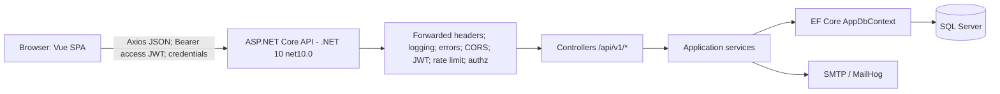
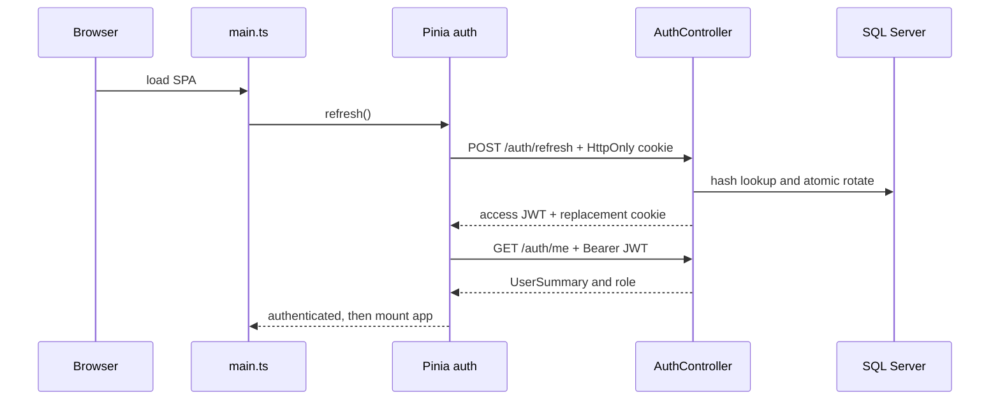
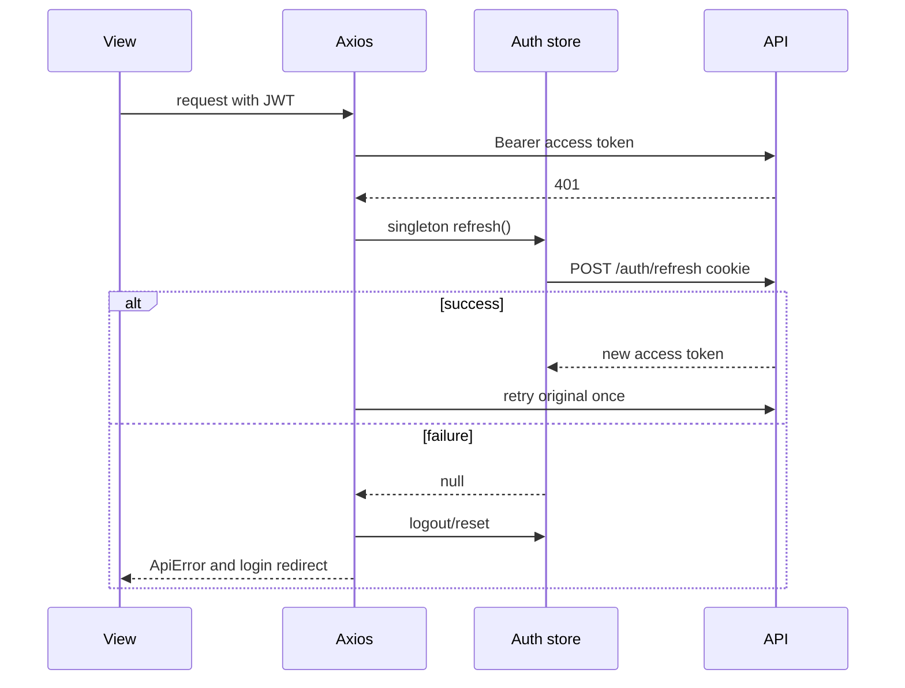
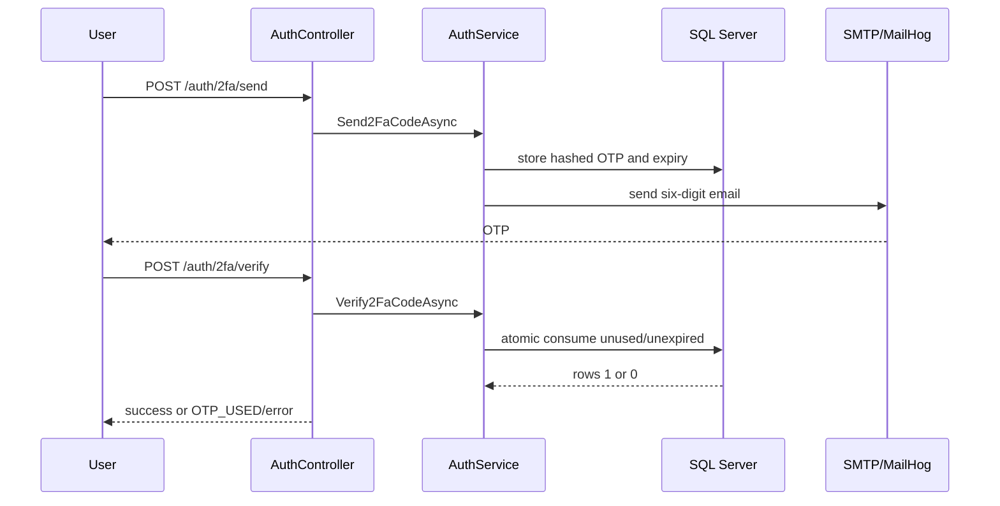

# Kiến trúc tổng thể và hạ tầng — DSA Visual

> Đối chiếu trực tiếp source canonical dưới frontend/src/ và backend/src/. Backend thực tế target .NET 10 / net10.0 và dùng SQL Server qua EF Core: backend/src/DsaVisual.Api/DsaVisual.Api.csproj:4; backend/src/DsaVisual.Application/DsaVisual.Application.csproj:4; backend/src/DsaVisual.Api/Program.cs:155-157.

## Chương 1 — Kiến trúc tổng thể và hạ tầng

### 1.1 Tổng quan hệ thống

Đây là SPA Vue 3 + TypeScript, Vite build, Vue Router, Pinia và Axios. Backend là ASP.NET Core Web API: DsaVisual.Api giữ composition root/controllers/middleware; DsaVisual.Application giữ DTO, validators, services, entities và EF model/migrations. AppDbContext đăng ký DbSet và ApplyConfigurationsFromAssembly (backend/src/DsaVisual.Application/Persistence/AppDbContext.cs:6-9,51-55); source không cho thấy Repository layer.



## 2. Frontend startup và router

Entry frontend/src/main.ts có 52 dòng. Pinia cài trước; refresh cookie và fetchMe chạy trước router/mount:

```ts
// frontend/src/main.ts:28-49
async function bootstrap(): Promise<void> {
  const app = createApp(App);
  const pinia = createPinia();
  app.use(pinia);
  const auth = useAuthStore(pinia);
  try {
    const token = await auth.refresh();
    if (token) await auth.fetchMe();
  } catch { /* guard xử lý phiên lỗi */ }
  app.use(router);
  app.mount('#app');
}
void bootstrap();
```

CSS import ở main.ts:8-20; BaseIcon global ở main.ts:35. Access token chỉ ở memory, không localStorage.

frontend/src/router/index.ts có 424 dòng, createWebHistory ở :61-69. Public: /, /path, /help, /privacy, login/register/password reset. Authenticated: lessons, exercises, code, benchmark, profile, classes, shop, quests, premium, playground. Teacher/Admin studio: :315-331; admin routes: :350-371; fallback 404: :392-397. Redirect tương thích: /learn -> /path, /dashboard -> /profile, /courses* -> /path*.

```ts
// frontend/src/router/index.ts:401-422
router.beforeEach((to) => {
  const auth = useAuthStore();
  if (to.meta.requiresAuth && !auth.isAuthenticated)
    return { name: 'login', query: { redirect: to.fullPath } };
  const requiredRoles = to.matched.flatMap((record) => record.meta.roles ?? []);
  if (requiredRoles.length > 0 && (auth.role === null || !requiredRoles.includes(auth.role)))
    return auth.isAuthenticated ? { name: 'profile' } : { name: 'login' };
  if (to.meta.guestOnly && auth.isAuthenticated) return { name: 'home' };
  return true;
});
```

Guard chỉ là UX; backend authorization mới là security boundary.

## 3. Axios và Pinia auth

frontend/src/api/client.ts:41-54 lấy VITE_API_BASE_URL, mặc định /api/v1, timeout 15 giây, withCredentials=true. Request interceptor :63-69 gắn Bearer access token. Response interceptor :96-150: 401 (không phải auth) refresh một lần nhờ _retry rồi retry; thất bại logout/redirect một lần; 429 đọc Retry-After; 5xx toast; 400/422 ném ApiError có field.

frontend/src/stores/auth.ts:14-24 giữ user/accessToken/status và computed isAuthenticated/role. Login/register lưu token memory :26-50. Logout reset local state kể cả API lỗi và reset stores cá nhân :53-92. refresh là singleton promise :95-114. frontend/src/api/auth.ts:4-13 khai báo endpoint; refresh POST không body, cookie tự gửi :71-74. Role type: STUDENT, TEACHER, TEACHER_PENDING, ADMIN :17-27.

## 4. Backend startup, pipeline, DI

backend/src/DsaVisual.Api/Program.cs:29 gọi WebApplication.CreateBuilder. JWT secret bắt buộc, tối thiểu 32 ký tự :47-62. Serilog :35-45; JSON/error envelope :65-89; API version/query reader :91-99; CORS từ DSA:Cors:AllowedOrigins :104-113.

```csharp
// backend/src/DsaVisual.Api/Program.cs:115-137
builder.Services.AddAuthentication(JwtBearerDefaults.AuthenticationScheme)
    .AddJwtBearer(options =>
    {
        options.MapInboundClaims = false;
        options.TokenValidationParameters = new TokenValidationParameters
        {
            ValidateIssuer = true, ValidateAudience = true,
            ValidateLifetime = true, ValidateIssuerSigningKey = true,
            RoleClaimType = ClaimTypes.Role
        };
    });
```

EF SQL Server đăng ký Program.cs:155-157. Singleton/token/settings/login tracker/submission lock và scoped domain services ở :159-200. FluentValidation :202-229. Rate limiter fixed-window partition theo sub|IP, sensitive quota riêng, /health miễn :231-292. Pipeline mốc: UseAuthentication :340, UseRateLimiter :343, UseAuthorization :345, MapControllers :349, OpenAPI development :360.

## 5. Auth JWT, refresh, 2FA, password, roles

AuthController.cs (208 dòng) có register/login/refresh anonymous; logout, me, password, 2FA authorize; forgot/reset anonymous. Endpoint: POST /api/v1/auth/register, login, refresh, logout; GET/PUT /auth/me; PUT /auth/me/password; POST /auth/forgot-password, reset-password; PUT /auth/2fa; POST /auth/2fa/send và /2fa/verify.

Cookie thật: backend/src/DsaVisual.Api/Controllers/AuthController.cs:29-41 dùng refresh_token, HttpOnly, SameSite Strict, Path /api/v1/auth, Secure=Request.IsHttps; append :196-206 và expiry 7 ngày.

TokenService.cs:10-14,27-57 dùng HS256, claims sub/role/iat/jti/exp; refresh random 64 bytes base64url, DB lưu SHA256 hash. AuthService.cs:722-742 lưu hash/expiry/IP; access mặc định 60 phút, refresh 7 ngày. Rotation atomic :843-866 dùng ExecuteUpdateAsync với RevokedAt == null.

2FA là email OTP, không phải TOTP: AuthController.cs:158-194 mô tả send -> verify; AuthService.cs:819-823 tạo 6 chữ số RandomNumberGenerator + SHA256, TTL 5 phút; consume một lần :897-914. SMTP lỗi/thiếu cấu hình không block và không log OTP :790-816. Role claim là ClaimTypes.Role (TokenService.cs:33-35), Program đặt RoleClaimType (Program.cs:134-137), AuthService map RoleNames.ToApi (:735).

## 6. File-by-file map

* backend/src/DsaVisual.Api/Program.cs — composition root/config/DI/pipeline.
* backend/src/DsaVisual.Api/Controllers/*.cs — Auth, Users, Admin, Settings, Topics, Lessons, Exercises, Progress, Favorites, Classes, Gamification, CodeRuns, Simulations, Feedback, CourseFeedback, Concepts, Me, Public và helpers.
* backend/src/DsaVisual.Api/Middlewares/RequestLoggingMiddleware.cs, ErrorHandlingMiddleware.cs — logging/error boundary.
* backend/src/DsaVisual.Application/Services/*.cs — capability services/interfaces.
* backend/src/DsaVisual.Application/Dtos/*.cs, Validators/*.cs — contracts và validation.
* backend/src/DsaVisual.Application/Persistence/AppDbContext.cs — DbSet + model configurations; Entities, Configurations, Migrations, Seed — persistence/schema/data.
* frontend/src/main.ts, App.vue — boot/shell; router/index.ts — routes/guards.
* frontend/src/api/*.ts — typed HTTP modules; stores/*.ts — auth/progress/lesson/class/leaderboard/gamification/code-runner/simulation.
* frontend/src/views/*.vue — screens; components/, shared/components/ — reusable UI.
* frontend/src/features/, engines/, core/ — algorithm/visualization/animation/compiler infrastructure.

## 7. Mermaid sequence diagrams







## 8. Edge cases và gap thực tế

* F5 mất access token; refresh cookie hết hạn thì auth status error nhưng public route vẫn vào được.
* Concurrent 401 gom bằng singleton; atomic rotation làm refresh replay thất bại.
* Cookie Secure phụ thuộc Request.IsHttps; reverse proxy phải cấu hình forwarded headers đúng.
* CORS với credentials cần origin cụ thể, không wildcard.
* JWT secret thiếu hoặc ngắn hơn 32 ký tự làm app không start.
* SMTP chưa cấu hình không block 2FA/reset; cần vận hành SMTP và theo dõi warning.
* OTP/reset/refresh race có thể làm update 0 rows; User concurrency trả CONFLICT. Không suy diễn mọi race thành 409.
* Rate limit anonymous theo IP; forwarded IP sai có thể sai partition.
* FE role guard bypass được; backend mới là authority. JWT role cũ có thể tồn tại tới expiry nếu không có re-check.
* DTO frontend/backend độc lập; đổi error envelope/field phải đồng bộ.
* MapInboundClaims=false là contract claim; code mới phải nhất quán với cách đọc sub.
* Không thấy blacklist access JWT tức thời trong canonical source: logout/revoke refresh không tự vô hiệu access JWT đã phát hành trước exp. Đây là gap cần cân nhắc.

## 9. Q&A

1. **Access token ở đâu?** Memory Pinia; refresh token HttpOnly cookie.
2. **Refresh DB plaintext?** Không, chỉ SHA256 hash.
3. **Router đủ bảo vệ admin?** Không; backend Authorize mới là boundary.
4. **Có Repository không?** Không; service dùng DbSet trực tiếp.
5. **DB/runtime?** SQL Server, EF Core SQL Server, net10.0.
6. **2FA?** Email OTP sáu số, TTL 5 phút, dùng một lần; không phải TOTP.
7. **401?** Refresh singleton một lần, retry một lần; fail logout/redirect.
8. **Vì sao fetchMe?** Lấy UserSummary/role cho guard/header.
9. **FE role có cấp quyền?** Không, chỉ UX.
10. **Đổi schema?** Model/config + migration mới; không sửa migration lịch sử; kiểm tra contract/test.

## 10. Nguồn canonical

frontend/src/main.ts; frontend/src/router/index.ts; frontend/src/stores/auth.ts; frontend/src/api/client.ts; frontend/src/api/auth.ts; frontend/package.json; backend/src/DsaVisual.Api/Program.cs; backend/src/DsaVisual.Api/Controllers/AuthController.cs; backend/src/DsaVisual.Application/Services/AuthService.cs; backend/src/DsaVisual.Application/Services/TokenService.cs; backend/src/DsaVisual.Application/Persistence/AppDbContext.cs; hai file .csproj nêu ở đầu tài liệu.
