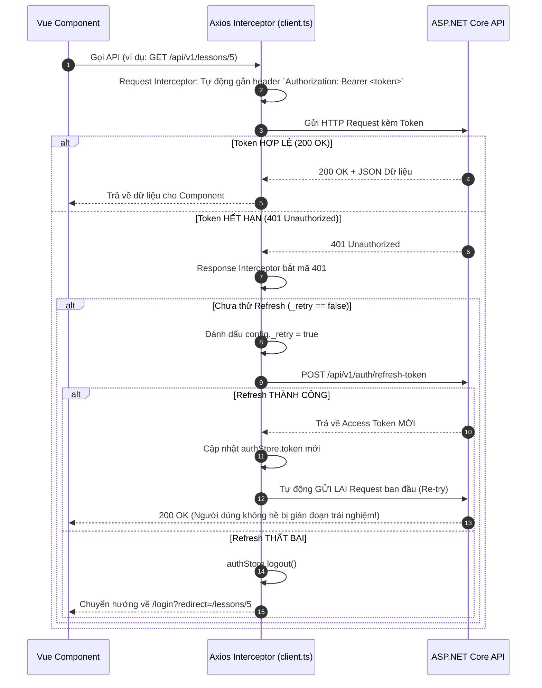

# 🌐 TÀI LIỆU AXIOS & API CLIENTS — NETWORK COMMUNICATION LAYER

Tầng API Client trong `frontend/src/api/` quản lý toàn bộ giao tiếp mạng giữa Single Page App (Vue 3) và Backend Web API (.NET 10).

---

## 🏛️ 1. CẤU HÌNH AXIOS CLIENT CHUẨN ([`client.ts`](file:///d:/FPT/metqua/frontend/src/api/client.ts))

Instance Axios được cấu hình tập trung với các quy chuẩn kỹ thuật:
* `baseURL`: Đọc từ biến môi trường `VITE_API_BASE_URL` (mặc định: `/api/v1`).
* `timeout`: 15,000ms (15 giây).
* `withCredentials: true`: Cho phép gửi kèm Cookie an toàn (HttpOnly Cookie cho Refresh Token).

---

## 🔄 2. CƠ CHẾ INTERCEPTORS THÔNG MINH



---

## 🛡️ 3. LỚP LỖI CHUẨN HÓA `ApiError`

Mọi phản hồi lỗi từ Backend đều được interceptor tự động đóng gói thành class `ApiError`:
```typescript
export class ApiError extends Error {
  readonly code: string;                  // Ví dụ: 'Gamification.InsufficientGems'
  readonly field: string | null;          // Ví dụ: 'email'
  readonly status: number;                // Mã HTTP Status (400, 401, 403, 404, 429, 500)
  readonly retryAfterSeconds?: number;    // Thời gian chờ nếu bị Rate Limit 429
}
```

---

## 📋 4. DANH SÁCH CÁC MODULE API CLIENT

* [`auth.ts`](file:///d:/FPT/metqua/frontend/src/api/auth.ts): `login`, `registerRequestOtp`, `registerVerifyOtp`, `refreshToken`, `forgotPassword`, `resetPassword`.
* [`lessons.ts`](file:///d:/FPT/metqua/frontend/src/api/lessons.ts): `fetchLesson`, `completeLesson`, `saveLessonNote`, `fetchTopics`.
* [`exercises.ts`](file:///d:/FPT/metqua/frontend/src/api/exercises.ts): `fetchExercises`, `fetchExercise`, `submitQuiz`, `submitCode`, `fetchMySubmissions`.
* [`gamification.ts`](file:///d:/FPT/metqua/frontend/src/api/gamification.ts): `fetchProfileStats`, `fetchQuests`, `claimQuest`, `fetchShopItems`, `buyShopItem`, `fetchLeaderboard`.
* [`classes.ts`](file:///d:/FPT/metqua/frontend/src/api/classes.ts): `fetchMyClasses`, `createClass`, `joinClass`, `fetchClassReport`, `assignExercise`.
* [`admin.ts`](file:///d:/FPT/metqua/frontend/src/api/admin.ts): `fetchUsers`, `approveTeacher`, `resetUserPassword`, `fetchAdminStats`.
