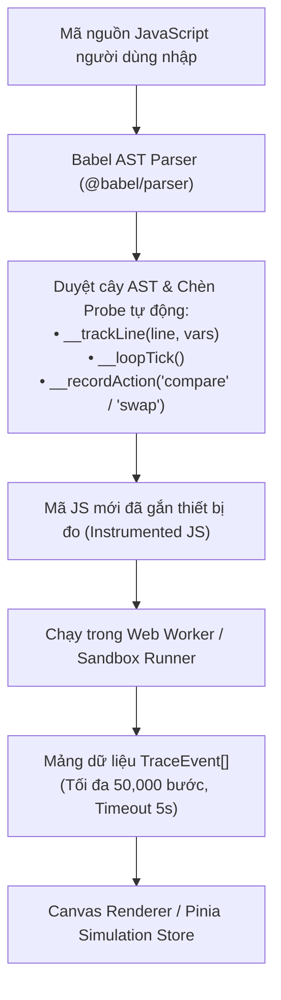

# 🔬 TÀI LIỆU CORE VISUALIZATION ENGINE (AST TRACER & WORKER)

File [`stepExecutor.ts`](file:///d:/FPT/metqua/frontend/src/engines/core/stepExecutor.ts) và [`compileWorker.ts`](file:///d:/FPT/metqua/frontend/src/engines/worker/compileWorker.ts) là **trái tim công nghệ độc quyền của DSA Visual**: Cho phép phân tích cú pháp mã nguồn thực tế và sinh ra chuỗi các bước trạng thái (Trace Events) để trực quan hóa mà không làm đứng giao diện người dùng.

---

## 🏛️ 1. NGUYÊN LÝ HOẠT ĐỘNG: BABEL AST CODE INSTRUMENTATION

Thay vì dùng Regex chắp vá dễ gây lỗi scope hoặc đệ quy, DSA Visual sử dụng `@babel/parser` để dựng cây cú pháp trừu tượng (Abstract Syntax Tree - AST).



---

## 📊 2. CẤU TRÚC 1 SỰ KIỆN VẾT (TRACEEVENT)

Mỗi bước biến đổi của thuật toán được chuẩn hóa thành một `TraceEvent`:
```typescript
export type TraceKind = 'declare' | 'assign' | 'compare' | 'swap' | 'loop' | 'call' | 'return';

export interface TraceEvent {
  line: number;                     // Dòng mã nguồn đang chạy trong Pseudocode
  vars: Record<string, unknown>;    // Snapshot giá trị các biến (i, j, mid, temp...)
  highlight: string[];              // Danh sách ID phần tử cần tô sáng (VD: ['cell:2', 'cell:3'])
  kind: TraceKind;                  // Thao tác: so sánh, hoán vị, gán, gọi hàm đệ quy...
  explanation: string;              // Lời giải thích tiếng Việt tự động sinh theo ngữ cảnh
}
```

---

## 🛡️ 3. CƠ CHẾ CHỐNG VÒNG LẶP VÔ HẠN (LOOP GUARD & TIMEOUT)

Để ngăn người học viết code có vòng lặp vô hạn `while(true)` làm treo trình duyệt:
1. **`MAX_STEPS = 50,000`**: Giới hạn số bước trace tối đa cho một lượt chạy.
2. **`MAX_LOOP_ITERATIONS = 10,000`**: Tự động chèn `__loopTick()` vào đầu mọi vòng lặp `for`, `while`, `do-while`. Nếu vượt quá 10,000 vòng $\rightarrow$ Tự động ném lỗi `InfiniteLoopError` chỉ ra đúng dòng code gây lặp.
3. **`Execution Timeout = 5,000ms`**: Chạy bất đồng bộ trong Web Worker, tự động hủy thread nếu vượt quá 5 giây.

---

## 🎨 4. HỆ MÀU SÂN KHẤU DỮ LIỆU TỐI ([`canvasTheme.ts`](file:///d:/FPT/metqua/frontend/src/engines/renderers/canvasTheme.ts))

Toàn bộ các Renderer đồ họa đều tuân thủ bảng màu chuẩn đã thống nhất:

| Token | Mã HEX | Trạng thái thuật toán | Ý nghĩa trực quan |
|---|---|---|---|
| `--canvas-bg` | `#0D1020` | `canvas-ink` | Nền sân khấu tối (Luôn tối bất kể theme sáng/tối toàn site). |
| `--color-accent-blue` | `#4255FF` | `data-core` | Khối dữ liệu mặc định (chưa bị thuật toán tác động). |
| `--color-accent-yellow`| `#F59E0B` | `comparing` | Khối đang được đưa lên bàn cân so sánh ($A[j] > A[j+1]$). |
| `--color-accent-red` | `#F87171` | `conflict / swap`| Hai khối va chạm và đổi chỗ cho nhau. |
| `--color-accent-green`| `#34D399` | `resolved` | Khối đã nằm đúng vị trí cố định cuối cùng. |
| `--color-text-muted` | `#6B7385` | `index-muted` | Chỉ số index dưới từng cột số ($0, 1, 2...$). |
