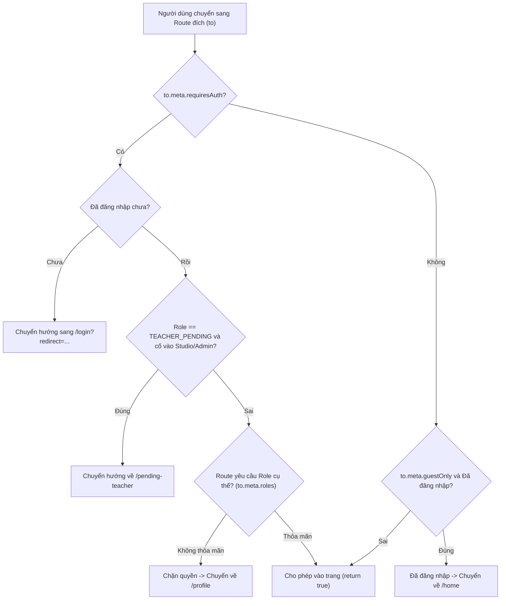

# 🧭 TÀI LIỆU COMPOSABLES & ROUTER — LOGIC TÁI SỬ DỤNG VÀ ĐIỀU HƯỚNG

Tài liệu này phân tích các Vue Composables dùng chung tại `frontend/src/composables/` và cơ chế phân quyền, điều hướng trong `frontend/src/router/index.ts`.

---

## 🧩 1. CÁC VUE COMPOSABLES CỐT LÕI

### 1. [`useSimulation.ts`](file:///d:/FPT/metqua/frontend/src/composables/useSimulation.ts) — Cầu nối giữa UI và Engine
* Đóng gói toàn bộ logic điều khiển máy phát VCR Player:
  * Khởi tạo generator thuật toán từ `catalog.ts`.
  * Quản lý trạng thái máy phát: `play()`, `pause()`, `stepForward()`, `stepBack()`, `reset()`, `jumpTo(index)`.
  * Thiết lập Timer `setInterval` tự động tăng bước theo `speed` đã chọn.

### 2. [`useCodeTracePlayback.ts`](file:///d:/FPT/metqua/frontend/src/composables/useCodeTracePlayback.ts)
* Chuyên phục vụ cho màn hình **Code Runner**: Nhận mảng `TraceEvent[]` từ sandbox runner $\rightarrow$ Đồng bộ hóa dòng code đang chạy trên Monaco Editor với khung Canvas bên cạnh.

### 3. [`useConfetti.ts`](file:///d:/FPT/metqua/frontend/src/composables/useConfetti.ts)
* Kích hoạt hiệu ứng pháo hoa ăn mừng khi học viên hoàn thành bài học, đỗ bài thi kiểm tra cuối khóa hoặc nhận thưởng nhiệm vụ.

---

## 🚦 2. ROUTER & CƠ CHẾ ROUTE GUARDS ([`router/index.ts`](file:///d:/FPT/metqua/frontend/src/router/index.ts))

Mọi lượt chuyển trang trên hệ thống đều đi qua `router.beforeEach`:

### Chi tiết các thuộc tính Meta trên Route:
1. `requiresAuth: true`: Bắt buộc phải có phiên đăng nhập hợp lệ.
2. `guestOnly: true`: Chỉ dành cho khách (ví dụ: `/login`, `/register`). Nếu người dùng đã đăng nhập, tự động đẩy về `/home`.
3. `roles: ['TEACHER', 'ADMIN']`: Giới hạn vai trò (ví dụ: `/studio`, `/admin/*`).
4. `scrollBehavior`: Tự động cuộn mượt lên đầu trang khi chuyển View mới hoặc khôi phục vị trí cũ khi nhấn nút Back/Forward trên trình duyệt.
