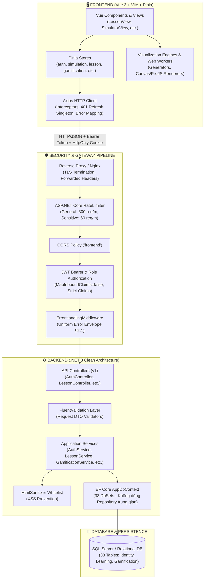
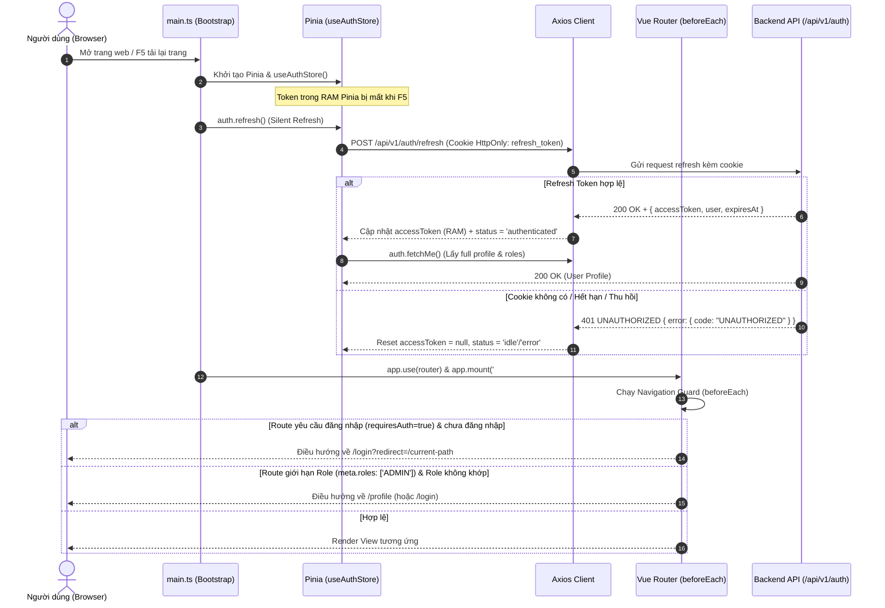
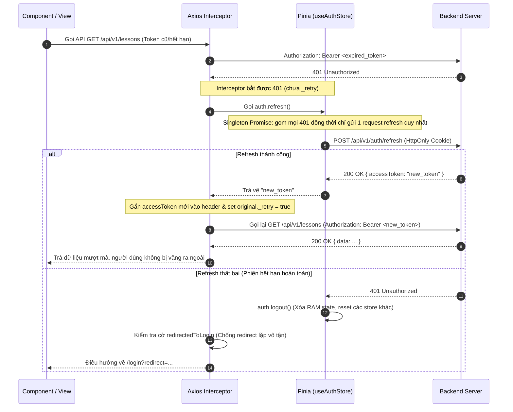

# CHẶNG 1: KIẾN TRÚC TỔNG THỂ VÀ HẠ TẦNG KẾT NỐI (VISUALIZATION DSA)

> **Mục tiêu chặng**: Nắm vững toàn bộ kiến trúc phân tầng (Clean Architecture Backend vs Single Page App Frontend), luồng khởi động ứng dụng (Bootstrap Lifecycle), cơ chế bảo mật (JWT Authentication, HttpOnly Cookie Refresh, 2FA, Rate Limiting, CORS, XSS Sanitization) và quy chuẩn xử lý lỗi đồng bộ hai đầu (Uniform Error Envelope).

---

## 1. KHÁI NIỆM & MỤC ĐÍCH NGHIỆP VỤ

Hệ thống **VisualizationDSA** là một nền tảng EdTech toàn diện kết hợp giữa:
1. **Lõi học tập (Learning Core)**: Quản lý bài học cấu trúc dữ liệu, giải thuật, cây lộ trình (Curriculum Learning Paths), câu hỏi trắc nghiệm (Quiz) và lớp học trực tuyến (Teacher Classroom Management).
2. **Lõi tương tác trực quan (Interactive Visualization & Simulation Engine)**: Trực quan hóa từng bước thực thi của thuật toán trên HTML5 Canvas/PixiJS, cho phép tua nhanh/chậm, lùi bước (Time-travel debugging) và đối chiếu mã giả (Pseudo-code Highlighting).
3. **Môi trường thực thi code & Benchmark (Code Runner Sandbox)**: Chạy code trực tiếp, đo đếm độ phức tạp thời gian/không gian thực tế.
4. **Hệ thống Gamification & Kinh tế ảo**: Điểm kinh nghiệm (EXP), Đá quý (Gems), Chuỗi học tập (Streak), Nhiệm vụ hàng ngày (Daily Quests), Cửa hàng (Shop/Inventory) và Nâng cấp tài khoản Premium qua VietQR.

Để phục vụ các mục tiêu trên với độ trễ thấp và bảo mật cao, hệ thống tách biệt thành 2 phần độc lập:
- **Backend (.NET 8 Clean Architecture)**: Cung cấp RESTful API, đảm bảo tính toàn vẹn dữ liệu, xác thực đa lớp (JWT + 2FA), chống spam/brute-force và xử lý logic nghiệp vụ nặng.
- **Frontend (Vue 3 Single Page Application)**: Giao diện người dùng tối ưu hóa hiệu năng render đồ họa 60 FPS, quản lý trạng thái tập trung với Pinia và Web Workers cho tính toán thuật toán nặng.

---

## 2. SƠ ĐỒ KIẾN TRÚC TỔNG THỂ & LUỒNG DỮ LIỆU (MERMAID)

### 2.1. Sơ đồ Kiến trúc Phân tầng Hệ thống (System Architecture)



---

### 2.2. Sơ đồ Tuần tự: Khởi động Ứng dụng & Khôi phục Phiên (App Bootstrap & Silent Refresh)



---

### 2.3. Sơ đồ Tuần tự: Xử lý Lỗi 401 & Cơ chế Retry Singleton (Anti-Storm Request)



---

## 3. BẢNG PHÂN TÍCH FILE-BY-FILE CHI TIẾT

### 3.1. Phía Backend (`backend/src/`)

| File Path | Trách nhiệm chính trong hệ thống | Các điểm kỹ thuật then chốt |
| :--- | :--- | :--- |
| `DsaVisual.Api/Program.cs` | Entry point của Web API, cấu hình toàn bộ Middleware Pipeline & Dependency Injection. | - Cấu hình Serilog rolling log 30 ngày.<br>- Ép kiểm tra JWT Secret $\ge 32$ ký tự lúc khởi động.<br>- Partitioned Rate Limiting (General vs Sensitive).<br>- Forwarded Headers chống IP spoofing.<br>- Idempotent Seed Runner (`--seed`). |
| `DsaVisual.Api/Controllers/ApiControllerBase.cs` | Base controller cho toàn bộ API endpoints. | - Trích xuất `CurrentUserId()` và `CurrentRole()` an toàn từ JWT Claims.<br>- Bắt lỗi Claim malformed ném `UnauthorizedAccessException` $\rightarrow$ 401 thay vì 500.<br>- Tích hợp FluentValidation tự động trả về Error Envelope chuẩn. |
| `DsaVisual.Api/Controllers/AuthController.cs` | Controller xác thực người dùng (9 endpoints + 2FA). | - `Register`, `Login`, `Refresh`, `Logout`, `GetMe`, `UpdateMe`, `ChangePassword`, `ForgotPassword`, `ResetPassword`.<br>- Quản lý Cookie `refresh_token` (HttpOnly, SameSite=Strict, Path=/api/v1/auth). |
| `DsaVisual.Api/Middlewares/ErrorHandlingMiddleware.cs` | Middleware toàn cục bắt mọi ngoại lệ chưa được xử lý. | - Bọc lỗi thành JSON `{ error: { code, message, field, details } }`.<br>- Bắt lỗi SQL Unique Constraint (2601/2627) trả về 409 `EMAIL_EXISTS` / `CONFLICT`.<br>- Bắt lỗi DB khác trả 503 `SERVICE_UNAVAILABLE`.<br>- Ẩn stack trace khi ở môi trường Production. |
| `DsaVisual.Api/Middlewares/RequestLoggingMiddleware.cs` | Ghi log toàn bộ request/response HTTP. | - Đo lường thời gian thực thi (Latency in ms).<br>- Ghi nhận IP, Method, Path, StatusCode, UserId (nếu đã auth). |
| `DsaVisual.Application/Persistence/AppDbContext.cs` | DbContext Entity Framework Core kết nối cơ sở dữ liệu. | - Quản lý đủ 33 DbSets (25 lõi học tập + 8 gamification/code).<br>- Không dùng Repository Pattern: Service gọi trực tiếp DbContext để tối ưu hiệu năng và query linh hoạt. |
| `DsaVisual.Application/Services/TokenService.cs` | Tạo và xác thực JWT token (HS256). | - Ghi claims chuẩn: `sub` (UserId), `email`, `role`, `jti`.<br>- Tạo RefreshToken ngẫu nhiên bảo mật cao (64 bytes crypto random). |
| `DsaVisual.Application/Services/AuthService.cs` | Triển khai toàn bộ logic nghiệp vụ xác thực & tài khoản. | - Hash mật khẩu bằng BCrypt/Argon2 an toàn.<br>- Chống brute-force đăng nhập (LoginAttemptTracker: khóa 5 lần/15 phút).<br>- Rotate Refresh Token khi refresh (Revoke token cũ, cấp token mới). |

### 3.2. Phía Frontend (`frontend/src/`)

| File Path | Trách nhiệm chính trong hệ thống | Các điểm kỹ thuật then chốt |
| :--- | :--- | :--- |
| `src/main.ts` | Khởi tạo ứng dụng Vue 3. | - Thứ tự nạp CSS nghiêm ngặt (`tokens` $\rightarrow$ `tailwind` $\rightarrow$ `palettes` $\rightarrow$ `vdsa-theme` $\rightarrow$ `global`).<br>- Chạy hàm `bootstrap()` khôi phục phiên từ Cookie trước khi mount Router. |
| `src/router/index.ts` | Quản lý toàn bộ 32+ màn hình và Navigation Guards. | - Định nghĩa metadata: `requiresAuth`, `guestOnly`, `roles` (STUDENT, TEACHER, ADMIN).<br>- Navigation Guard `beforeEach` chuyển hướng chính xác theo quyền hạn.<br>- Scroll behavior mượt mà, tích hợp Lenis. |
| `src/stores/auth.ts` | Pinia store quản lý trạng thái đăng nhập người dùng. | - Lưu trữ `accessToken` thuần trong RAM (ADR-004) để triệt tiêu lỗ hổng XSS đánh cắp token từ LocalStorage.<br>- Singleton Promise cho hàm `refresh()` chống gọi trùng lặp.<br>- Hàm `logout()` dọn dẹp triệt để 7 store cá nhân khác (gamification, progress, lesson, v.v.). |
| `src/api/client.ts` | Cấu hình Axios HTTP Client dùng chung. | - Tự động đính kèm header `Authorization: Bearer <accessToken>`.<br>- Response Interceptor tự động bắt 401 để kích hoạt Silent Refresh.<br>- Xử lý chuẩn hóa mã lỗi `ApiError` và hiển thị thông báo Toast theo mã HTTP (429 Rate Limited, 5xx Server Error). |

---

## 4. CODE SNIPPETS CỐT LÕI & CHÚ GIẢI CHI TIẾT TỪNG DÒNG

### 4.1. Khởi động Ứng dụng & Khôi phục Phiên (Frontend `main.ts`)

```typescript
// frontend/src/main.ts: dòng 28 - 50
async function bootstrap(): Promise<void> {
  const app = createApp(App);
  const pinia = createPinia();
  app.use(pinia); // (1) Đăng ký Pinia trước để useAuthStore có instance hoạt động

  app.component('BaseIcon', BaseIcon); // Đăng ký component toàn cục

  const auth = useAuthStore(pinia);
  try {
    // (2) Silent Refresh: Gửi request dùng cookie HttpOnly để lấy lại accessToken trong RAM
    const token = await auth.refresh();
    if (token) {
      // (3) Nếu token hợp lệ, lấy ngay profile và quyền (role) của user
      await auth.fetchMe();
    }
  } catch {
    // (4) Nếu lỗi mạng hoặc cookie hết hạn: trạng thái giữ là 'error'/'idle', 
    // không làm sập ứng dụng để người dùng vẫn xem được các trang công khai.
  }

  app.use(router); // (5) Chỉ nạp router SAU KHI đã biết trạng thái auth
  app.mount('#app');
}
```
> 🔍 **Tại sao đoạn code này quan trọng khi bảo vệ đồ án?**  
> Việc gọi `auth.refresh()` trước khi `app.use(router)` giải quyết triệt để lỗi kinh điển **"F5 văng ra trang Login"** hoặc **"F5 bị Router Guard chặn nhầm"** khi lưu trữ JWT AccessToken trong bộ nhớ RAM thay vì LocalStorage.

---

### 4.2. Bộ lọc Axios Interceptor & Cơ chế Chống Lặp Redirect (`frontend/src/api/client.ts`)

```typescript
// frontend/src/api/client.ts: dòng 108 - 129
// Bắt lỗi 401 từ backend để tự động refresh token
if (status === 401 && original && !original._retry && !original.url?.includes('/auth/')) {
  original._retry = true; // Đánh dấu request này đã thử retry 1 lần, tránh lặp vô tận

  if (auth.accessToken) {
    const newToken = await auth.refresh();
    if (newToken) {
      // Gắn token mới vào header của request ban đầu và gửi lại
      original.headers.Authorization = `Bearer ${newToken}`;
      return client(original as AxiosRequestConfig);
    }
    
    // Refresh thất bại (hết hạn phiên) -> Buộc đăng xuất
    await auth.logout();
    
    // Kiểm tra xem user có đang ở trang login/register không để tránh vòng lặp redirect vô hạn
    const onAuthPage = ['/login', '/register'].includes(window.location.pathname);
    if (!redirectedToLogin && !onAuthPage) {
      redirectedToLogin = true;
      const redirect = encodeURIComponent(window.location.pathname + window.location.search);
      window.location.assign(`/login?redirect=${redirect}`);
    }
  }
  return Promise.reject(toApiError(error));
}
```

---

### 4.3. Cấu hình Pipeline Middleware An toàn Tuyệt đối (`backend/Program.cs`)

```csharp
// backend/src/DsaVisual.Api/Program.cs: dòng 333 - 354
// 1. Forwarded Headers: Đọc IP thật từ Nginx/Reverse Proxy, chống IP Spoofing
app.UseForwardedHeaders(forwardedOptions);

// 2. Logging & Error Handling toàn cục
app.UseMiddleware<RequestLoggingMiddleware>();
app.UseMiddleware<ErrorHandlingMiddleware>();

// 3. CORS: Giới hạn đúng domain frontend được phép gọi
app.UseCors("frontend");

// 4. Authentication: Xác thực JWT Bearer
app.UseAuthentication();

// 5. Rate Limiting: Phân vùng theo (UserId + IP) để chặn DDoS/Spam
app.UseRateLimiter();

// 6. Authorization: Kiểm tra Role (STUDENT, TEACHER, ADMIN)
app.UseAuthorization();

// 7. Route Handlers & Fallback 404
app.MapGet("/health", () => Results.Ok(new { status = "ok" }));
app.MapControllers();
app.MapFallback(context => WriteErrorEnvelopeAsync(context.Response, StatusCodes.Status404NotFound,
    ErrorCodes.NOT_FOUND, "Endpoint không tồn tại"));
```
> 🔍 **Quy tắc vàng về thứ tự Middleware trong ASP.NET Core**:
> - `UseAuthentication()` bắt buộc phải đứng **trước** `UseRateLimiter()` để RateLimiter đọc được claim `sub` (UserId) của người dùng, phân tách quota giữa các user dùng chung mạng NAT/Wifi trường học.
> - `UseErrorHandlingMiddleware()` phải nằm ở lớp ngoài cùng để bắt được tất cả lỗi phát sinh từ các middleware và controller bên trong.

---

### 4.4. Chuẩn hóa Định dạng Lỗi Toàn cục (`ErrorHandlingMiddleware.cs`)

```csharp
// backend/src/DsaVisual.Api/Middlewares/ErrorHandlingMiddleware.cs: dòng 71 - 90
private static (string Code, string Message) MapException(Exception exception)
{
    // Bắt lỗi trùng lặp khóa chính / Unique index trong Database (ví dụ: đăng ký trùng email)
    if (IsUniqueViolation(exception))
    {
        var code = ContainsMessage(exception, "IX_Users_Email")
            ? ErrorCodes.EMAIL_EXISTS
            : ErrorCodes.CONFLICT;
        return (code, "Dữ liệu đã tồn tại, không thể tạo trùng");
    }

    // Phân loại các ngoại lệ khác để không bao giờ làm lộ cấu trúc DB hoặc stack trace ra bên ngoài
    return exception switch
    {
        DbUpdateException or SqlException => (ErrorCodes.SERVICE_UNAVAILABLE,
            "Hệ thống dữ liệu đang quá tải, vui lòng thử lại sau"),
        UnauthorizedAccessException => (ErrorCodes.UNAUTHORIZED,
            "Phiên đăng nhập không hợp lệ, vui lòng đăng nhập lại"),
        _ => (ErrorCodes.INTERNAL_ERROR, "Đã xảy ra lỗi hệ thống. Vui lòng thử lại sau")
    };
}
```

---

## 5. BỘ CÂU HỎI VẤN ĐÁP TỰ KIỂM TRA (Q&A DEFENSE SELF-TEST)

Dưới đây là 8 câu hỏi cốt lõi mà Hội đồng phản biện / Thầy cô thường hỏi về kiến trúc dự án:

### ❓ Câu 1: Tại sao hệ thống lại lưu trữ AccessToken trong bộ nhớ RAM của Pinia mà không lưu vào `localStorage`?
* **Đáp án chuẩn**:
  Lưu `accessToken` vào `localStorage` rất dễ bị tấn công qua lỗ hổng **XSS (Cross-Site Scripting)** — bất kỳ script độc hại nào chèn vào được trình duyệt đều có thể đọc `localStorage.getItem('token')` và gửi về server kẻ tấn công.  
  Hệ thống áp dụng kiến trúc **In-Memory JWT + HttpOnly Refresh Cookie (ADR-004)**:
  - `accessToken` có thời hạn ngắn (15 phút), chỉ nằm trong biến Javascript của Pinia.
  - `refreshToken` có thời hạn dài (7 ngày), được lưu trong Cookie với cờ `HttpOnly = true`, `SameSite = Strict`, `Secure = true` và `Path = /api/v1/auth`. Javascript phía client **hoàn toàn không thể đọc được cookie này**, triệt tiêu nguy cơ bị đánh cắp qua XSS.

---

### ❓ Câu 2: Khi người dùng nhấn F5 tải lại trang, làm thế nào để ứng dụng không bị mất trạng thái đăng nhập?
* **Đáp án chuẩn**:
  Tại file `frontend/src/main.ts`, hàm `bootstrap()` được cấu hình chạy bất đồng bộ trước khi `router` được kích hoạt. Hàm này tự động gọi `auth.refresh()`. Trình duyệt sẽ tự động gửi kèm cookie `refresh_token` lên endpoint `POST /api/v1/auth/refresh`. Backend kiểm tra hợp lệ và trả về một `accessToken` mới cấp tốc vào RAM Pinia. Sau đó `auth.fetchMe()` nạp thông tin quyền hạn và `router` mới tiến hành kiểm tra Navigation Guard.

---

### ❓ Câu 3: Tại sao dự án không áp dụng Repository Pattern mà để Service truy vấn trực tiếp qua `AppDbContext`?
* **Đáp án chuẩn**:
  - Bản thân **Entity Framework Core** đã đóng vai trò là một **Unit of Work** (`DbContext`) và **Repository** (`DbSet<T>`).
  - Việc bọc thêm một lớp Generic Repository (`IRepository<T>`) thường dẫn đến hiện tượng **Over-engineering (Trừu tượng hóa thừa thãi)**, làm mất đi sức mạnh của LINQ (như `AsNoTracking()`, `Select()` chiếu DTO trực tiếp, `Include()` tối ưu query) và gây khó khăn khi viết các truy vấn phức tạp hoặc batch query.
  - Dự án đặt toàn bộ Business Logic và kiểm soát Transaction tại tầng `Application Services`, truy vấn trực tiếp 33 DbSets giúp mã nguồn rõ ràng, tường minh và đạt hiệu năng truy vấn cao nhất.

---

### ❓ Câu 4: Làm thế nào hệ thống ngăn chặn việc gọi Refresh Token bị bão hòa (Refresh Storm) khi nhiều request 401 xảy ra cùng lúc?
* **Đáp án chuẩn**:
  Hệ thống sử dụng kỹ thuật **Singleton Promise** trong `useAuthStore` (`frontend/src/stores/auth.ts`):
  Biến `refreshPromise` được giữ lại khi có một lời gọi refresh đang chạy. Nếu có 5 request API cùng trả về 401 trong cùng một mili-giây, cả 5 request này đều dùng chung kết quả từ `refreshPromise` duy nhất đó, chỉ có duy nhất 1 HTTP request thực sự được gửi tới `/api/v1/auth/refresh`.

---

### ❓ Câu 5: Cơ chế Rate Limiting trên Backend được thiết kế như thế nào? Tại sao phải đặt sau Middleware Authentication?
* **Đáp án chuẩn**:
  Hệ thống sử dụng `Microsoft.AspNetCore.RateLimiting` với chính sách phân vùng theo Partition Key dạng `{UserId}|{IP}`:
  - Với endpoint nhạy cảm (Login, Register, 2FA, Reset Password): Giới hạn 60 requests/phút.
  - Với endpoint chung: Giới hạn 300 requests/phút.
  - Endpoint `/health` được cấu hình ngoại lệ (No Limiter).
  - **Lý do đặt sau Auth**: Khi đặt sau `UseAuthentication()`, RateLimiter có thể đọc được Claim `sub` (UserId). Điều này giúp phân tách hạn ngạch riêng cho từng người dùng, ngăn chặn việc 1 sinh viên spam làm ảnh hưởng đến toàn bộ các sinh viên khác đang dùng chung mạng NAT/Wifi trường học.

---

### ❓ Câu 6: Làm thế nào hệ thống chống lỗi rò rỉ dữ liệu hoặc lộ thông tin nhạy cảm của Database khi có lỗi xảy ra?
* **Đáp án chuẩn**:
  Thông qua `ErrorHandlingMiddleware` và cấu hình chuẩn hóa `API_REFERENCE §2.1`:
  - Mọi lỗi đều được chuẩn hóa thành format `{ error: { code, message, field, details } }`.
  - Lỗi vi phạm Unique Index trong SQL Server (lỗi 2601/2627) được map thành HTTP 409 `EMAIL_EXISTS` / `CONFLICT` kèm thông báo thân thiện, không lộ tên bảng hay tên index database.
  - Các lỗi hệ thống khác trả về 503 `SERVICE_UNAVAILABLE` hoặc 500 `INTERNAL_ERROR`.
  - Thuộc tính `exception.StackTrace` chỉ được đính kèm khi môi trường là `Development`; trên `Production` toàn bộ chi tiết nội bộ bị loại bỏ hoàn toàn.

---

### ❓ Câu 7: Tùy chọn `MapInboundClaims = false` trong cấu hình JWT Bearer của Backend có ý nghĩa gì?
* **Đáp án chuẩn**:
  Mặc định trong ASP.NET Core, `JwtSecurityTokenHandler` sẽ tự động map các claim chuẩn JWT (như `sub`) thành các URI dài của Microsoft (như `http://schemas.xmlsoap.org/ws/2005/05/identity/claims/nameidentifier`).  
  Điều này khiến cho các Controller khi đọc `User.FindFirst(JwtRegisteredClaimNames.Sub)` bị trả về `null` dẫn đến `NullReferenceException` (HTTP 500). Việc đặt `MapInboundClaims = false` giữ nguyên tên claim gốc chuẩn RFC (`sub`, `email`, `role`), đồng thời khai báo rõ ràng `RoleClaimType = ClaimTypes.Role` để `[Authorize(Roles = "...")]` hoạt động chuẩn xác 100%.

---

### ❓ Câu 8: Hệ thống phòng chống tấn công XSS (Cross-Site Scripting) ở những chốt chặn nào?
* **Đáp án chuẩn**:
  1. **Frontend**: Vue 3 tự động encode HTML khi render qua cú pháp `{{ }}`.
  2. **Backend**: Tích hợp thư viện `Ganss.Xss.HtmlSanitizer` được cấu hình **Whitelist thu hẹp** tại `Program.cs`: chỉ cho phép đúng 13 thẻ HTML an toàn cho nội dung markdown/rich text (`h1, h2, h3, p, strong, em, ul, ol, li, pre, code, blockquote, br`), xóa toàn bộ attributes độc hại (`onload, onclick, style, class`) và chỉ chấp nhận scheme (`http, https, mailto`).
  3. **Data Access**: Entity Framework Core dùng Parameterized Queries 100%, triệt tiêu hoàn toàn SQL Injection.