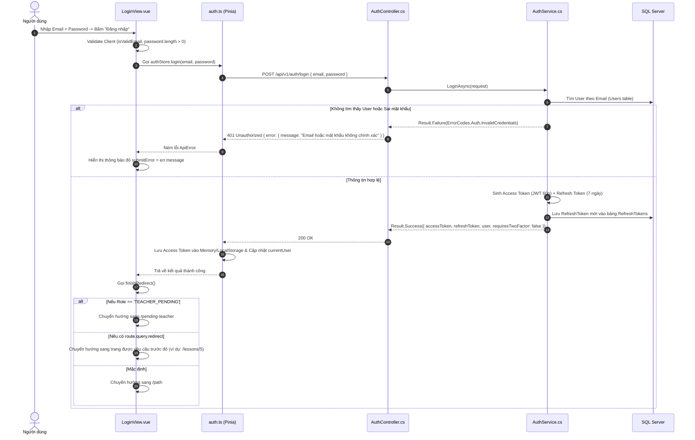

# 🔑 VIEW 02: ĐĂNG NHẬP (LOGINVIEW)

* **Tên file Vue**: [`LoginView.vue`](file:///d:/FPT/metqua/frontend/src/views/LoginView.vue)
* **Đường dẫn URL**: `/login`
* **Route Name**: `login`
* **Quyền truy cập**: Chỉ khách chưa đăng nhập (`guestOnly: true`). Nếu đã có phiên đăng nhập, Router tự động chuyển về `/home`.

---

## 1. CẤU TRÚC GIAO DIỆN (UI BREAKDOWN)

Màn hình được thiết kế theo tỷ lệ 2 cột chuẩn Data Bench:
```
┌──────────────────────────────────────┬──────────────────────────────────────┐
│ CỘT TRÁI (Branding & Data Bench)    │ CỘT PHẢI (Form đăng nhập & 2FA)     │
│                                      │                                      │
│ 🌌 Nền canvas-ink tối                │ 🏷️ Tiêu đề: Đăng nhập DSA Visual    │
│ 🛡️ Huy hiệu bảo mật                 │ 📧 Ô nhập: Email                     │
│ 📊 Thẻ thống kê động                 │ 🔒 Ô nhập: Mật khẩu (Có nút ẩn/hiện) │
│ 💬 "Xây dựng tư duy thuật toán vững  │ 🔗 Link: Quên mật khẩu?              │
│    chắc qua từng bước mô phỏng"      │ 🔘 Nút: Đăng nhập (Submitting state) │
│                                      │ ─── Hoặc ───                         │
│                                      │ 📝 Link: Chưa có tài khoản? Đăng ký  │
└──────────────────────────────────────┴──────────────────────────────────────┘
```

---

## 2. CHI TIẾT CÁC LUỒNG HOẠT ĐỘNG (FLOWS)

### 🔹 Flow 1: Đăng nhập tiêu chuẩn (Standard Login Flow)



### 🔹 Flow 2: Đăng nhập 2 lớp xác thực (Two-Factor Authentication Flow)
1. Nếu tài khoản đã bật 2FA, `AuthService.cs` trả về `requiresTwoFactor = true` kèm `twoFactorToken`.
2. `LoginView.vue` tự động chuyển đổi giao diện sang **Bước xác thực OTP** (`isTwoFactorStep = true`).
3. Đồng hồ đếm ngược 60s kích hoạt (`resendCountdown = 60`).
4. Người dùng nhập mã 6 số gửi về email $\rightarrow$ Bấm "Xác nhận mã 2FA" $\rightarrow$ Gọi `POST /api/v1/auth/verify-2fa`.
5. Backend xác thực OTP khớp $\rightarrow$ Cấp phát Access Token chính thức.

---

## 3. BẢN ĐỒ MÃ NGUỒN LIÊN QUAN

* **Frontend View**: [`LoginView.vue`](file:///d:/FPT/metqua/frontend/src/views/LoginView.vue)
* **Frontend Store**: [`auth.ts`](file:///d:/FPT/metqua/frontend/src/stores/auth.ts)
* **API Client**: `src/api/auth.ts`
* **Backend Controller**: [`AuthController.cs`](file:///d:/FPT/metqua/backend/src/DsaVisual.Api/Controllers/AuthController.cs)
* **Backend Service**: [`AuthService.cs`](file:///d:/FPT/metqua/backend/src/DsaVisual.Application/Services/AuthService.cs)
* **Database Entities**: [`User.cs`](file:///d:/FPT/metqua/backend/src/DsaVisual.Application/Persistence/Entities/User.cs), [`RefreshToken.cs`](file:///d:/FPT/metqua/backend/src/DsaVisual.Application/Persistence/Entities/RefreshToken.cs)
