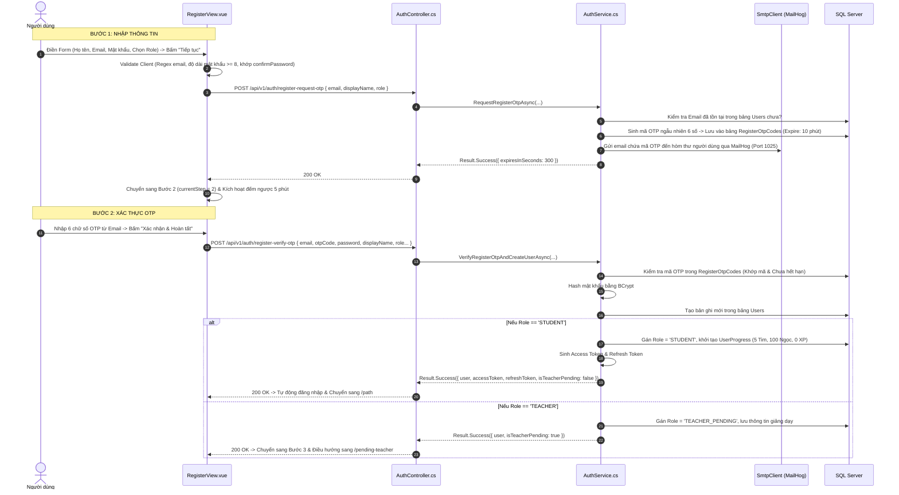

# 📝 VIEW 03: ĐĂNG KÝ TÀI KHOẢN (REGISTERVIEW)

* **Tên file Vue**: [`RegisterView.vue`](file:///d:/FPT/metqua/frontend/src/views/RegisterView.vue)
* **Đường dẫn URL**: `/register`
* **Route Name**: `register`
* **Quyền truy cập**: Chỉ khách chưa đăng nhập (`guestOnly: true`).

---

## 1. CẤU TRÚC GIAO DIỆN & WIZARD 3 BƯỚC

Màn hình đăng ký được xây dựng dưới dạng **Wizard 3 bước** mượt mà:
* **Bước 1 (Nhập thông tin)**: Chọn vai trò (Sinh viên / Giảng viên), nhập Họ tên, Email, Mật khẩu. Nếu là Giảng viên: Nhập thêm Mã giảng viên, Khoa, Bằng cấp, Bio.
* **Bước 2 (Xác thực OTP Email)**: Nhập 6 ô số OTP được gửi qua email (MailHog), đếm ngược 5 phút, cooldown gửi lại 60s.
* **Bước 3 (Hoàn tất)**:
  * Nếu là `STUDENT`: Tự động đăng nhập và chuyển hướng sang `/path`.
  * Nếu là `TEACHER`: Thông báo hồ sơ đã gửi và chuyển sang `/pending-teacher`.

---

## 2. CHI TIẾT CÁC LUỒNG HOẠT ĐỘNG (FLOWS)

---

## 3. CÁC TRƯỜNG HỢP BIÊN & XỬ LÝ LỖI (EDGE CASES)

1. **Email đã tồn tại**: Backend trả lỗi `ErrorCodes.Auth.EmailAlreadyExists` $\rightarrow$ UI báo đỏ *"Email này đã được sử dụng, vui lòng đăng nhập hoặc dùng email khác"*.
2. **Nhập sai mã OTP**: Backend đếm số lần nhập sai. Nếu nhập sai quá 5 lần $\rightarrow$ Hủy mã OTP và yêu cầu gửi lại mã mới.
3. **Mã OTP hết hạn (Quá 5 phút)**: Đồng hồ đếm về `00:00`, nút "Gửi lại mã OTP" phát sáng cho phép người dùng yêu cầu mã mới.

---

## 4. BẢN ĐỒ MÃ NGUỒN LIÊN QUAN

* **Frontend View**: [`RegisterView.vue`](file:///d:/FPT/metqua/frontend/src/views/RegisterView.vue)
* **Frontend Component**: `src/components/auth/RegisterAside.vue`
* **API Client**: `src/api/auth.ts`
* **Backend Controller**: [`AuthController.cs`](file:///d:/FPT/metqua/backend/src/DsaVisual.Api/Controllers/AuthController.cs)
* **Backend Service**: [`AuthService.cs`](file:///d:/FPT/metqua/backend/src/DsaVisual.Application/Services/AuthService.cs)
* **Database Entities**: [`RegisterOtpCode.cs`](file:///d:/FPT/metqua/backend/src/DsaVisual.Application/Persistence/Entities/RegisterOtpCode.cs), [`User.cs`](file:///d:/FPT/metqua/backend/src/DsaVisual.Application/Persistence/Entities/User.cs)
