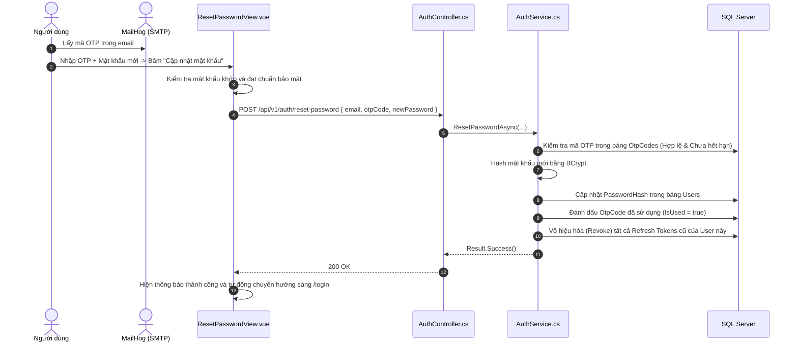

# 🔄 VIEW 04: KHÔI PHỤC & ĐẶT LẠI MẬT KHẨU (FORGOT & RESET PASSWORD)

* **Tên file Vue**:
  1. [`ForgotPasswordView.vue`](file:///d:/FPT/metqua/frontend/src/views/ForgotPasswordView.vue) (URL: `/forgot-password`)
  2. [`ResetPasswordView.vue`](file:///d:/FPT/metqua/frontend/src/views/ResetPasswordView.vue) (URL: `/reset-password`)
* **Quyền truy cập**: Công khai (`Public`).

---

## 1. MÀN HÌNH QUÊN MẬT KHẨU (FORGOT PASSWORD)

### Mắt thấy gì trên giao diện?
* Ô nhập `Email` tài khoản cần khôi phục.
* Nút *"Gửi liên kết / mã xác nhận"*.
* Thông báo trạng thái: Khi gửi thành công, giao diện chuyển sang trạng thái xanh thông báo email hướng dẫn đã được gửi.

### Luồng xử lý:
1. Người dùng nhập Email $\rightarrow$ Bấm "Gửi mã xác nhận".
2. Frontend gọi `POST /api/v1/auth/forgot-password { email }`.
3. Backend [`AuthService.cs`](file:///d:/FPT/metqua/backend/src/DsaVisual.Application/Services/AuthService.cs):
   * Tìm tài khoản theo Email trong bảng `Users`.
   * Sinh mã `OtpCode` ngẫu nhiên (hoặc Reset Token) có hiệu lực trong 15 phút.
   * Gửi email qua MailHog kèm mã xác thực và link chuyển hướng tới `/reset-password?email=...`.

---

## 2. MÀN HÌNH ĐẶT LẠI MẬT KHẨU (RESET PASSWORD)

### Mắt thấy gì trên giao diện?
* Ô nhập `Mã xác nhận OTP` (6 số).
* Ô nhập `Mật khẩu mới` và `Xác nhận mật khẩu mới`.
* Thanh đo độ mạnh của mật khẩu (Password Strength Indicator).

### Luồng xử lý từ UI đến Database:

---

## 3. BẢN ĐỒ MÃ NGUỒN LIÊN QUAN

* **Frontend Views**: [`ForgotPasswordView.vue`](file:///d:/FPT/metqua/frontend/src/views/ForgotPasswordView.vue), [`ResetPasswordView.vue`](file:///d:/FPT/metqua/frontend/src/views/ResetPasswordView.vue)
* **Backend Controller**: [`AuthController.cs`](file:///d:/FPT/metqua/backend/src/DsaVisual.Api/Controllers/AuthController.cs)
* **Backend Service**: [`AuthService.cs`](file:///d:/FPT/metqua/backend/src/DsaVisual.Application/Services/AuthService.cs)
* **Database Entity**: [`OtpCode.cs`](file:///d:/FPT/metqua/backend/src/DsaVisual.Application/Persistence/Entities/OtpCode.cs)
