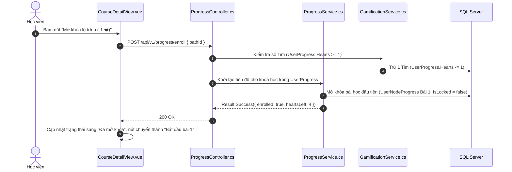

# 🌲 VIEW 07: CHI TIẾT LỘ TRÌNH (COURSEDETAILVIEW)

* **Tên file Vue**: [`CourseDetailView.vue`](file:///d:/FPT/metqua/frontend/src/views/courses/CourseDetailView.vue)
* **Đường dẫn URL**: `/path/:id` (Alias: `/courses/:id`, `/path/:topicId`)
* **Route Name**: `path-detail`
* **Quyền truy cập**: Đã đăng nhập (`requiresAuth: true`).

---

## 1. CẤU TRÚC GIAO DIỆN (UI BREAKDOWN)

Màn hình chi tiết lộ trình được thiết kế theo phong cách giáo dục hiện đại (Educative Style):
1. **Hero Header**: Tên khóa học, Mô tả, Thống kê số bài học / Quiz / CodeLab / Tổng XP tích lũy.
2. **Nút Hành động Thông minh**:
   * Nếu chưa ghi danh: Nút *"Mở khóa lộ trình (-1 ❤️)"*.
   * Nếu đã ghi danh: Nút *"Tiếp tục học: Bài 4 - Sắp xếp chọn"* (Smart Resume trỏ thẳng vào bài chưa hoàn thành).
3. **Mục tiêu học tập & Kết quả đạt được (Outcomes Checklist)**.
4. **Cây Giáo trình (Course Syllabus Tree)**: Phân theo từng Module/Chương với trạng thái trực quan:
   * ✅ **Đã hoàn thành**: Dấu tích xanh lá.
   * 🔓 **Đang học / Đã mở**: Nổi bật màu tím, có nút vào học.
   * 🔒 **Đang khóa**: Mờ và hiện ổ khóa.

---

## 2. CHI TIẾT CÁC LUỒNG HOẠT ĐỘNG (FLOWS)

### 🔹 Flow 1: Mở khóa lộ trình bằng Tim (Enroll Course Flow)

### 🔹 Flow 2: Luồng "Tiếp tục học thông minh" (Smart Resume Flow)
1. Khi học viên quay lại lộ trình này, hệ thống quét danh sách bài học và tiến độ trong `UserNodeProgress`.
2. Xác định bài học chưa hoàn thành đầu tiên (First Incomplete Lesson) $\rightarrow$ Đặt làm `nextStudyLesson`.
3. Nhấp nút **"Tiếp tục học"** $\rightarrow$ Điều hướng thẳng tới `/lessons/{nextStudyLesson.id}` mà không bắt học lại từ bài 1.

---

## 3. BẢN ĐỒ MÃ NGUỒN LIÊN QUAN

* **Frontend View**: [`CourseDetailView.vue`](file:///d:/FPT/metqua/frontend/src/views/courses/CourseDetailView.vue)
* **Frontend Store**: `src/stores/courses.ts`, `src/stores/progress.ts`
* **Backend Controller**: [`ProgressController.cs`](file:///d:/FPT/metqua/backend/src/DsaVisual.Api/Controllers/ProgressController.cs)
* **Backend Service**: [`ProgressService.cs`](file:///d:/FPT/metqua/backend/src/DsaVisual.Application/Services/ProgressService.cs), [`GamificationService.cs`](file:///d:/FPT/metqua/backend/src/DsaVisual.Application/Services/GamificationService.cs)
* **Database Entity**: [`UserNodeProgress.cs`](file:///d:/FPT/metqua/backend/src/DsaVisual.Application/Persistence/Entities/UserNodeProgress.cs)
