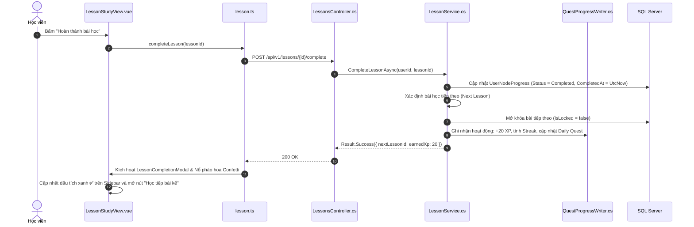

# 📖 VIEW 08: KHÔNG GIAN HỌC TẬP TÍCH HỢP (LESSONSTUDYVIEW)

* **Tên file Vue**: [`LessonStudyView.vue`](file:///d:/FPT/metqua/frontend/src/views/lesson/LessonStudyView.vue)
* **Đường dẫn URL**: `/lessons/:id` (Alias: `/learn/:lessonId`, `/courses/:courseId/lessons/:lessonId`)
* **Route Name**: `lesson-study`
* **Quyền truy cập**: Đã đăng nhập (`requiresAuth: true`).

---

## 1. CẤU TRÚC GIAO DIỆN KHÔNG GIAN HỌC TẬP TỐI

```
┌────────────────────────────────────────────────────────────────────────┐
│ [≡ Mục lục bài]   BÀI 6: TÌM KIẾM NHỊ PHÂN (BINARY SEARCH)  [❤️ 5/5] [⭐ 120]│
├───────────────────────────────┬────────────────────────────────────────┤
│ CỘT TRÁI: NỘI DUNG LÝ THUYẾT  │ CỘT PHẢI: TRÌNH MÔ PHỎNG NHÚNG         │
│ (Markdown + LaTeX + Code)     │ (InlineSimulationPlayer)               │
│                               │                                        │
│ 1. Khái niệm & Điều kiện:     │ ┌────────────────────────────────────┐ │
│ Mảng cần được sắp xếp trước.  │ │ [1] [3] [7] [9] [12] [15] [20]     │ │
│                               │ │  L           M             R       │ │
│ 2. Công thức toán học:        │ └────────────────────────────────────┘ │
│ $$T(n) = O(\log n)$$          │ [⏮] [◀] [▶ Chạy từng bước] [Mở rộng ⛶] │
│                               ├────────────────────────────────────────┤
│ 3. Ghi chú cá nhân (Notes):   │ TAB DƯỚI: THỰC HÀNH & LUYỆN TẬP        │
│ [ Ghi nhớ: mid = l + (r-l)/2 ]│ [ Luyện tập Quiz ] [ CodeLab Monaco ]  │
├───────────────────────────────┴────────────────────────────────────────┤
│ [← Bài trước]                [ TIẾP TỤC / HOÀN THÀNH BÀI HỌC → ]        │
└────────────────────────────────────────────────────────────────────────┘
```

---

## 2. CHI TIẾT CÁC LUỒNG HOẠT ĐỘNG (FLOWS)

### 🔹 Flow 1: Khởi tạo dữ liệu bài học (onMounted)
1. Lấy `lessonId` từ `route.params.id`.
2. Pinia `lessonStore` gọi `GET /api/v1/lessons/{id}`:
   * Nhận nội dung Markdown lý thuyết, công thức LaTeX.
   * Nhận cấu hình Sandbox/Simulation nếu có (`sandboxConfig`, `simulationKey`).
   * Nhận ghi chú cá nhân của người dùng từ bảng `LessonNotes`.
3. Tải Mini Map mục lục của khóa học ở thanh bên trái (`isSidebarCollapsed = false`).

### 🔹 Flow 2: Tương tác với Mô phỏng nhúng (Inline Simulation)
* Khung `InlineSimulationPlayer` được nhúng trực tiếp bên phải bài học.
* Học viên có thể bấm **Step (Tiến từng bước)**, **Play (Chạy tự động)** hoặc nhập dữ liệu kiểm thử mà không cần rời khỏi bài đọc.
* Nút **"Mở toàn màn hình / Mở trang mới"** mở ra Trình mô phỏng đầy đủ tại `/simulator/{key}`.

### 🔹 Flow 3: Lưu Ghi chú Cá nhân (Personal Note Auto-save)
* Khi học viên gõ ghi chú vào khung note $\rightarrow$ Debounce 1000ms $\rightarrow$ Gửi `PUT /api/v1/lessons/{id}/notes { content }` $\rightarrow$ Lưu vào bảng `LessonNotes`.

### 🔹 Flow 4: Hoàn thành bài học & Mở khóa bài tiếp theo



---

## 3. BẢN ĐỒ MÃ NGUỒN LIÊN QUAN

* **Frontend View**: [`LessonStudyView.vue`](file:///d:/FPT/metqua/frontend/src/views/lesson/LessonStudyView.vue)
* **Frontend Modals**: `LessonCompletionModal.vue`, `CourseCompletionModal.vue`
* **Frontend Store**: [`lesson.ts`](file:///d:/FPT/metqua/frontend/src/stores/lesson.ts)
* **Backend Controller**: [`LessonsController.cs`](file:///d:/FPT/metqua/backend/src/DsaVisual.Api/Controllers/LessonsController.cs)
* **Backend Service**: [`LessonService.cs`](file:///d:/FPT/metqua/backend/src/DsaVisual.Application/Services/LessonService.cs)
* **Database Entities**: [`Lesson.cs`](file:///d:/FPT/metqua/backend/src/DsaVisual.Application/Persistence/Entities/Lesson.cs), [`LessonNote.cs`](file:///d:/FPT/metqua/backend/src/DsaVisual.Application/Persistence/Entities/LessonNote.cs), [`UserNodeProgress.cs`](file:///d:/FPT/metqua/backend/src/DsaVisual.Application/Persistence/Entities/UserNodeProgress.cs)
