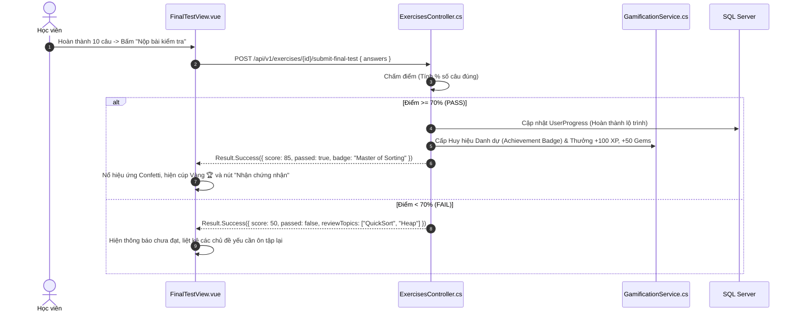

# 🏁 VIEW 09: BÀI KIỂM TRA TỔNG KẾT CUỐI LỘ TRÌNH (FINALTESTVIEW)

* **Tên file Vue**: [`FinalTestView.vue`](file:///d:/FPT/metqua/frontend/src/views/FinalTestView.vue)
* **Đường dẫn URL**: `/path/:topicId/final-test`
* **Route Name**: `final-test`
* **Quyền truy cập**: Đã đăng nhập (`requiresAuth: true`), chỉ mở sau khi học viên đã học qua các bài học trong lộ trình.

---

## 1. CẤU TRÚC GIAO DIỆN & TIÊU CHUẨN ĐỖ (PASS THRESHOLD)

```
┌────────────────────────────────────────────────────────────────────────┐
│  🏆 BÀI KIỂM TRA TỔNG KẾT: SẮP XẾP & TÌM KIẾM                           │
│  Tiêu chuẩn đạt: PASS ≥ 70%   •   Tổng số câu: 10 câu trắc nghiệm     │
├────────────────────────────────────────────────────────────────────────┤
│ <QuizStage />:                                                         │
│                                                                        │
│ Câu 4/10: Cho mảng [14, 33, 27, 10, 35, 19, 42, 44]. Sau bước phân    │
│           hoạch đầu tiên của QuickSort với pivot là 14, mảng có dạng?  │
│                                                                        │
│ [A] [10, 14, 27, 33, 35, 19, 42, 44]                                   │
│ [B] [10, 14, 33, 27, 35, 19, 42, 44]                                   │
│ [C] [14, 10, 27, 33, 35, 19, 42, 44]                                   │
│ [D] [10, 14, 19, 27, 33, 35, 42, 44]                                   │
│                                                                        │
│ [ ← Câu trước ]                      [ Câu tiếp theo → / NỘP BÀI ]     │
└────────────────────────────────────────────────────────────────────────┘
```

---

## 2. CHI TIẾT CÁC LUỒNG HOẠT ĐỘNG (FLOWS)

### 🔹 Flow 1: Nạp đề thi từ Backend
1. Component gọi `GET /api/v1/exercises?stage=1` (Stage 1: Final Test).
2. Backend bốc ngẫu nhiên ngân hàng câu hỏi tổng hợp cho Topic hiện tại.
3. Nếu môi trường offline/local chưa có dữ liệu mạng, hệ thống có cơ chế Fallback tự động sinh bộ câu hỏi dựa trên metadata của `CATALOG` (`engines/catalog.ts`).

### 🔹 Flow 2: Nộp bài & Đánh giá kết quả



---

## 3. BẢN ĐỒ MÃ NGUỒN LIÊN QUAN

* **Frontend View**: [`FinalTestView.vue`](file:///d:/FPT/metqua/frontend/src/views/FinalTestView.vue)
* **Frontend Component**: `src/components/quiz/QuizStage.vue`
* **Backend Controller**: [`ExercisesController.cs`](file:///d:/FPT/metqua/backend/src/DsaVisual.Api/Controllers/ExercisesController.cs)
* **Backend Service**: [`ExerciseService.cs`](file:///d:/FPT/metqua/backend/src/DsaVisual.Application/Services/ExerciseService.cs), [`GamificationService.cs`](file:///d:/FPT/metqua/backend/src/DsaVisual.Application/Services/GamificationService.cs)
