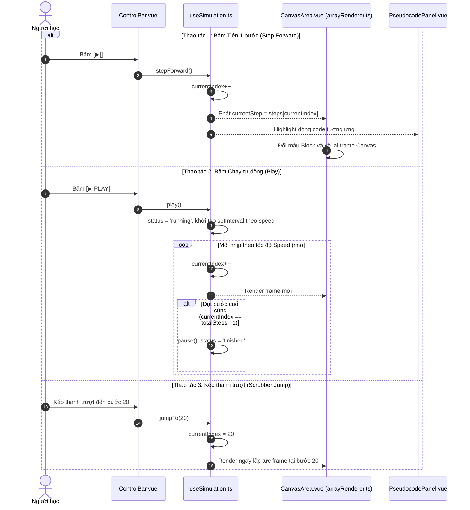

# 🎮 VIEW 11: TRÌNH MÔ PHỎNG THUẬT TOÁN CHI TIẾT (SIMULATORVIEW)

* **Tên file Vue**: [`SimulatorView.vue`](file:///d:/FPT/metqua/frontend/src/views/SimulatorView.vue)
* **Đường dẫn URL**: `/simulator/:key` (Ví dụ: `/simulator/sort.bubble`, `/simulator/tree.avl-insert`, `/simulator/graph.dijkstra`)
* **Route Name**: `simulator`
* **Quyền truy cập**: Public với 3 Demo Key (`sort.bubble`, `search.binary`, `graph.bfs`). Yêu cầu đăng nhập với các key còn lại.

---

## 1. CẤU TRÚC GIAO DIỆN 3 VÙNG TIÊU CHUẨN

```
┌────────────────────────────────────────────────────────────────────────┐
│ [← Thoát]  SẮP XẾP NHANH (QUICK SORT - LOMUTO)   [O(n log n)] [⭐ Thích]│
├───────────────────┬──────────────────────────────────┬─────────────────┤
│ CỘT TRÁI (3/12)   │ CỘT GIỮA (6/12) - CANVAS TỐI     │ CỘT PHẢI (3/12) │
│                   │                                  │                 │
│ <PseudocodePanel> │ <CanvasArea />                   │ <ExplainPanel />│
│ Dòng 1: lomuto(A) │ [ 7 ] [ 3 ] [ 9 ] [ 1 ] [ 5 ]    │ "Phần tử chốt   │
│ > Dòng 2: p = A[hi│   0     1     2     3     4      │ (pivot) là 5..."│
│ Dòng 3: for j=lo..│         ↑                 ↑      │                 │
│                   │         i                 j      │ <StatsBar />    │
│ <CallStackPanel>  ├──────────────────────────────────┤ Biến: i=0, j=3  │
│ quicksort(0, 4)   │ <ControlBar />                   │ Swap: 2 lần     │
│   quicksort(0, 1) │ [⏮] [◀] [ ▶ PLAY ] [▶|] [Reset]  │                 │
│                   │ ──●────────────────────── 12/35  │ <AiExplainer /> │
│                   │ Tốc độ: [ 1.5x ▾ ]  [ 🎲 Nhập ]  │ [ 🤖 Hỏi AI ]   │
└───────────────────┴──────────────────────────────────┴─────────────────┘
```

---

## 2. CHI TIẾT CÁC LUỒNG HOẠT ĐỘNG (FLOWS)

### 🔹 Flow 1: Cơ chế sinh Visual từ Thuật toán (Từ Key ➔ Mảng Steps)

Để trực quan hóa một thuật toán (ví dụ: Bubble Sort, Quick Sort), hệ thống hoạt động như một **xưởng làm phim hoạt hình (tạo chuỗi các khung hình / frames)**:

```
[Key trên URL: "sort.bubble"] 
       │
       ▼
1. Tra cứu "Danh bạ" (registry.ts) ──► Lấy đúng hàm tạo: createBubbleGenerator()
       │
       ▼
2. Chạy hàm generate(input) 
       │ 
       ├─► Vòng lặp thuật toán chạy trong RAM (chỉ mất ~0.001 giây)
       ├─► Ở mỗi dòng code (so sánh, hoán vị), dùng trace.push(...) để CHỤP 1 BỨC ẢNH SNAPSHOT:
       │    • structure: Trạng thái các cột số (cột nào đổi màu vàng, đỏ, xanh)
       │    • pseudocodeLine: Dòng mã giả tương ứng đang chạy
       │    • explanation: Câu giải thích tiếng Việt ("So sánh A[0] và A[1]...")
       │    • variables: Giá trị các biến hiện tại (i, j, swapped)
       ▼
3. Thu được cuốn phim: mảng steps = [Step 0, Step 1, Step 2, ..., Step N]
       │
       ▼
4. Nạp vào Đầu đĩa VCR (simulationStore.ts):
       • Đặt currentIndex = 0 (bắt đầu từ khung hình đầu tiên).
       • ArrayRenderer đọc steps[0].structure để vẽ lên thẻ <canvas>.
       • Khi bấm "Tiến" hoặc "Play": currentIndex++ ➔ Canvas vẽ khung hình tiếp theo.
```

* **Chi tiết mã nguồn tương ứng**:
  1. [`SimulatorView.vue`](file:///d:/FPT/metqua/frontend/src/views/SimulatorView.vue) lấy `key` từ URL gọi [`useSimulation.ts`](file:///d:/FPT/metqua/frontend/src/composables/useSimulation.ts).
  2. `useSimulation` chuyển tiếp sang [`simulation.ts`](file:///d:/FPT/metqua/frontend/src/stores/simulation.ts) (hàm `loadSim(key)`).
  3. `loadSim` gọi [`getSimulation(key)`](file:///d:/FPT/metqua/frontend/src/engines/registry.ts) để lấy **Generator** (ví dụ: [`bubble.ts`](file:///d:/FPT/metqua/frontend/src/engines/generators/sort/bubble.ts)).
  4. Generator chạy thuật toán, chụp snapshot và trả về mảng `steps`.

### 🔹 Flow 2: Điều khiển VCR Player (Play, Pause, Step, Reverse)



### 🔹 Flow 3: Phím tắt bàn phím (Keyboard Shortcuts)
* Phím `Space`: Chuyển đổi giữa Play và Pause.
* Phím `Mũi tên phải (→)`: Tiến 1 bước (`stepForward`).
* Phím `Mũi tên trái (←)`: Lùi 1 bước (`stepBack`).
* Phím `R`: Reset về bước 0.

### 🔹 Flow 4: Hỏi AI giải thích bước đi (AI Step Explainer)
1. Người dùng bấm nút *"🤖 Hỏi AI giải thích bước này"*.
2. Modal [`AiStepExplainerModal.vue`](file:///d:/FPT/metqua/frontend/src/components/simulator/AiStepExplainerModal.vue) mở ra.
3. Gửi payload gồm `{ algorithmKey, currentStep, arrayState, currentLine }` tới Backend `POST /api/v1/ai/explain-step`.
4. Backend tích hợp mô hình AI giải thích cặn kẽ tại sao thuật toán lại đưa ra quyết định ở bước này.

---

## 3. BẢN ĐỒ MÃ NGUỒN LIÊN QUAN

* **Frontend View**: [`SimulatorView.vue`](file:///d:/FPT/metqua/frontend/src/views/SimulatorView.vue)
* **Frontend Components**:
  * `src/components/simulator/ControlBar.vue`
  * `src/components/simulator/CanvasArea.vue`
  * `src/components/simulator/PseudocodePanel.vue`
  * `src/components/simulator/ExplainPanel.vue`
  * `src/components/simulator/CallStackPanel.vue`
* **Composable & Engine**:
  * [`useSimulation.ts`](file:///d:/FPT/metqua/frontend/src/composables/useSimulation.ts)
  * [`stepExecutor.ts`](file:///d:/FPT/metqua/frontend/src/engines/core/stepExecutor.ts)
  * [`arrayRenderer.ts`](file:///d:/FPT/metqua/frontend/src/engines/renderers/arrayRenderer.ts)
