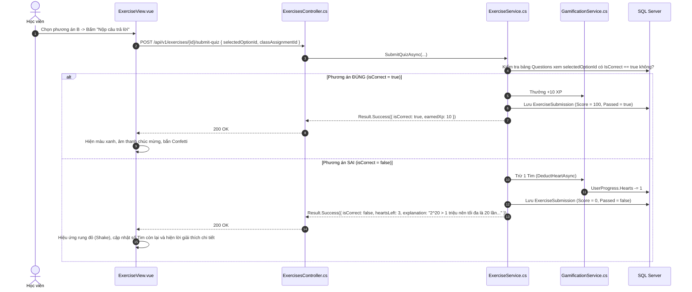

# 📝 VIEW 14: LUYỆN TẬP & ĐÁNH GIÁ (EXERCISEVIEW)

* **Tên file Vue**: [`ExerciseView.vue`](file:///d:/FPT/metqua/frontend/src/views/ExerciseView.vue)
* **Đường dẫn URL**: `/exercise/:id` (Có thể kèm query: `?classAssignmentId=...`)
* **Route Name**: `exercise`
* **Quyền truy cập**: Đã đăng nhập (`requiresAuth: true`).

---

## 1. CẤU TRÚC GIAO DIỆN & CHẾ ĐỘ LUYỆN TẬP

```
┌────────────────────────────────────────────────────────────────────────┐
│ [← Thoát]  BÀI TẬP: TÌM KIẾM NHỊ PHÂN    [❤️ 4/5] [Chế độ Luyện tập 🔘]│
├────────────────────────────────────────────────────────────────────────┤
│ <QuizStage />:                                                         │
│                                                                        │
│ Câu 1/3: Khi mảng có 1,000,000 phần tử, số lần so sánh tối đa của      │
│          thuật toán Binary Search là bao nhiêu?                        │
│                                                                        │
│  [A] 10 lần                                                            │
│  [B] 20 lần  (Vì 2^20 ≈ 1,048,576)                                     │
│  [C] 100 lần                                                           │
│  [D] 1,000,000 lần                                                     │
│                                                                        │
│  [ NỘP CÂU TRẢ LỜI ]    [ 📜 Xem lịch sử nộp bài (Drawer) ]            │
└────────────────────────────────────────────────────────────────────────┘
```

---

## 2. CHI TIẾT CÁC LUỒNG HOẠT ĐỘNG (FLOWS)

### 🔹 Flow 1: Tải nội dung bài tập & Kiểm tra Nguồn bài
1. Đọc `id` từ URL param.
2. Kiểm tra `classAssignmentId` từ query param:
   * Nếu có `classAssignmentId`: Bài tập này được giao từ một Lớp học $\rightarrow$ Điểm số sau khi nộp sẽ được đồng bộ vào Bảng điểm của Lớp đó.
3. Gọi API `GET /api/v1/exercises/{id}` lấy danh sách câu hỏi.

### 🔹 Flow 2: Nộp bài trắc nghiệm & Xử lý trừ Tim / cộng Điểm



### 🔹 Flow 3: Xem Lịch sử các lần nộp trước (Drawer History)
* Bấm nút *"Xem lịch sử nộp bài"* $\rightarrow$ Mở thanh trượt Drawer bên phải $\rightarrow$ Gọi `GET /api/v1/exercises/{id}/submissions` $\rightarrow$ Xem lại điểm số, ngày giờ và chi tiết các câu đã chọn sai trong quá khứ.

---

## 3. BẢN ĐỒ MÃ NGUỒN LIÊN QUAN

* **Frontend View**: [`ExerciseView.vue`](file:///d:/FPT/metqua/frontend/src/views/ExerciseView.vue)
* **Frontend Component**: `src/components/quiz/QuizStage.vue`
* **Backend Controller**: [`ExercisesController.cs`](file:///d:/FPT/metqua/backend/src/DsaVisual.Api/Controllers/ExercisesController.cs)
* **Backend Service**: [`ExerciseService.cs`](file:///d:/FPT/metqua/backend/src/DsaVisual.Application/Services/ExerciseService.cs), [`GamificationService.cs`](file:///d:/FPT/metqua/backend/src/DsaVisual.Application/Services/GamificationService.cs)
