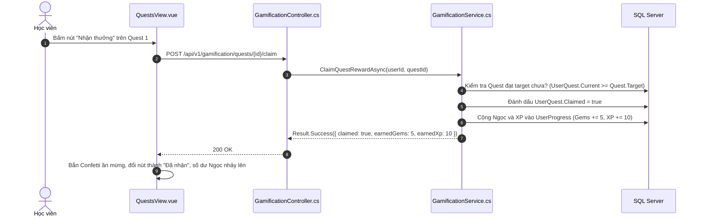

# 🎯 VIEW 17: NHIỆM VỤ HÀNG NGÀY (QUESTSVIEW)

* **Tên file Vue**: [`QuestsView.vue`](file:///d:/FPT/metqua/frontend/src/views/QuestsView.vue)
* **Đường dẫn URL**: `/quests`
* **Route Name**: `quests`
* **Quyền truy cập**: Đã đăng nhập (`requiresAuth: true`).

---

## 1. CẤU TRÚC GIAO DIỆN

```
┌────────────────────────────────────────────────────────────────────────┐
│  🎯 NHIỆM VỤ HÀNG NGÀY (DAILY QUESTS)        [ 🔥 Streak: 7 ngày liên tiếp ]│
├────────────────────────────────────────────────────────────────────────┤
│ TIẾN ĐỘ HÔM NAY: 2/3 Nhiệm vụ hoàn thành                               │
│ [████████████████████░░░░░░░░░░] 66%                                   │
├────────────────────────────────────────────────────────────────────────┤
│ DANH SÁCH NHIỆM VỤ HẰNG NGÀY:                                          │
│                                                                        │
│ 1. 📖 Hoàn thành 1 bài học lý thuyết                                   │
│    Tiến độ: 1/1 • Thưởng: +10 XP, +5 💎                                │
│    Trạng thái: [ ✅ NHẬN THƯỞNG (Phát sáng) ]                           │
│                                                                        │
│ 2. 🔬 Chạy thử 2 thuật toán trên Simulator                             │
│    Tiến độ: 2/2 • Thưởng: +15 XP, +10 💎                               │
│    Trạng thái: [ Đã nhận ]                                             │
│                                                                        │
│ 3. 📝 Giải đúng 1 bài tập trắc nghiệm                                  │
│    Tiến độ: 0/1 • Thưởng: +20 XP, +15 💎                               │
│    Trạng thái: [ 0/1 Đang thực hiện ]                                  │
└────────────────────────────────────────────────────────────────────────┘
```

---

## 2. CHI TIẾT CÁC LUỒNG HOẠT ĐỘNG (FLOWS)

### 🔹 Flow 1: Nhận thưởng nhiệm vụ (Claim Quest Reward Flow)



---

## 3. BẢN ĐỒ MÃ NGUỒN LIÊN QUAN

* **Frontend View**: [`QuestsView.vue`](file:///d:/FPT/metqua/frontend/src/views/QuestsView.vue)
* **Frontend Store**: [`gamification.ts`](file:///d:/FPT/metqua/frontend/src/stores/gamification.ts)
* **Backend Service**: [`GamificationService.cs`](file:///d:/FPT/metqua/backend/src/DsaVisual.Application/Services/GamificationService.cs), [`QuestProgressWriter.cs`](file:///d:/FPT/metqua/backend/src/DsaVisual.Application/Services/QuestProgressWriter.cs)
* **Database Entity**: [`DailyQuest.cs`](file:///d:/FPT/metqua/backend/src/DsaVisual.Application/Persistence/Entities/DailyQuest.cs), [`UserQuest.cs`](file:///d:/FPT/metqua/backend/src/DsaVisual.Application/Persistence/Entities/UserQuest.cs)
