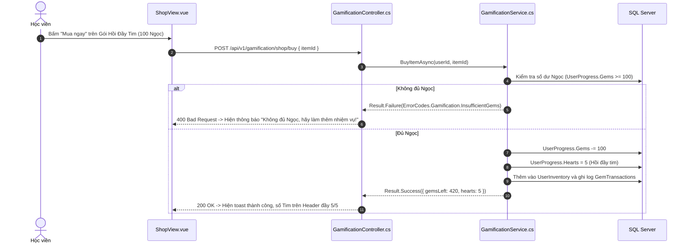

# 🛒 VIEW 18: CỬA HÀNG VẬT PHẨM (SHOPVIEW)

* **Tên file Vue**: [`ShopView.vue`](file:///d:/FPT/metqua/frontend/src/views/ShopView.vue)
* **Đường dẫn URL**: `/shop`
* **Route Name**: `shop`
* **Quyền truy cập**: Đã đăng nhập (`requiresAuth: true`).

---

## 1. CẤU TRÚC GIAO DIỆN & 4 DANH MỤC VẬT PHẨM

```
┌────────────────────────────────────────────────────────────────────────┐
│  🛒 CỬA HÀNG VẬT PHẨM (GEMS SHOP)          [ Số dư: 💎 520 | ❤️ 3/5 ]  │
├────────────────────────────────────────────────────────────────────────┤
│ [ Tab: Tất cả ]  [ Tab: Hồi Tim ]  [ Tab: Avatar ]  [ Tab: Khung viền ]│
├────────────────────────────────────────────────────────────────────────┤
│ ┌──────────────────────┐  ┌──────────────────────┐  ┌────────────────┐ │
│ │ ❤️ HỒI ĐẦY 5 TIM     │  │ 🛡️ BẢO VỆ STREAK     │  │ 👑 KHUNG CYBER │ │
│ │ Hồi mạng học tập ngay│  │ Đóng băng streak 1 ng│  │ Viền Neon tím  │ │
│ │ Giá: 💎 100 Ngọc     │  │ Giá: 💎 150 Ngọc     │  │ Giá: 💎 300 Ngọc│ │
│ │ [ Mua ngay ]         │  │ [ Mua ngay ]         │  │ [ Mua ngay ]   │ │
│ └──────────────────────┘  └──────────────────────┘  └────────────────┘ │
└────────────────────────────────────────────────────────────────────────┘
```

---

## 2. CHI TIẾT CÁC LUỒNG HOẠT ĐỘNG (FLOWS)

### 🔹 Flow 1: Mua vật phẩm và Trừ Ngọc (Purchase Flow)



---

## 3. BẢN ĐỒ MÃ NGUỒN LIÊN QUAN

* **Frontend View**: [`ShopView.vue`](file:///d:/FPT/metqua/frontend/src/views/ShopView.vue)
* **Frontend Store**: [`gamification.ts`](file:///d:/FPT/metqua/frontend/src/stores/gamification.ts)
* **Backend Controller**: [`GamificationController.cs`](file:///d:/FPT/metqua/backend/src/DsaVisual.Api/Controllers/GamificationController.cs)
* **Database Entities**: [`ShopItem.cs`](file:///d:/FPT/metqua/backend/src/DsaVisual.Application/Persistence/Entities/ShopItem.cs), [`UserInventory.cs`](file:///d:/FPT/metqua/backend/src/DsaVisual.Application/Persistence/Entities/UserInventory.cs), [`GemTransaction.cs`](file:///d:/FPT/metqua/backend/src/DsaVisual.Application/Persistence/Entities/GemTransaction.cs)
