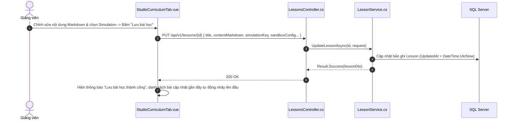

# 🎨 VIEW 23: STUDIO SOẠN BÀI GIẢNG VIÊN (ADMINCONTENTVIEW / STUDIO)

* **Tên file Vue**: [`AdminContentView.vue`](file:///d:/FPT/metqua/frontend/src/views/AdminContentView.vue)
* **Đường dẫn URL**: `/studio` (Alias: `/admin/content`, `/teacher`)
* **Route Name**: `curriculum-studio`
* **Quyền truy cập**: Giảng viên và Admin (`roles: ['TEACHER', 'ADMIN']`).

---

## 1. CẤU TRÚC SHELL & 4 TABS LÀM VIỆC ĐỘC LẬP

```
┌────────────────────────────────────────────────────────────────────────┐
│  🎨 CURRICULUM STUDIO (XƯỞNG SOẠN BÀI HỌC)                            │
│  [ 📊 1. Tổng quan ]  [ 🌲 2. Lộ trình ]  [ 💬 3. Phản hồi ]  [ 🛡️ 4. Duyệt ] │
├────────────────────────────────────────────────────────────────────────┤
│ TAB 2: 🌲 CÂY LỘ TRÌNH & TRÌNH SOẠN THẢO BÀI HỌC                      │
│                                                                        │
│ CỘT TRÁI: CÂY OUTLINE (OutlineTree)  │ CỘT PHẢI: TRÌNH SOẠN THẢO (SlideOver) │
│ 📂 Lộ trình: Sắp xếp & Tìm kiếm      │                                 │
│  ├── 📁 Module 1: Sắp xếp đơn giản   │ [ Tab 1: Lý thuyết (Tiptap) ]   │
│  │    ├── 📄 Bài 1: Bubble Sort ✎    │ [ Tab 2: Mô phỏng (Sandbox) ]   │
│  │    └── 📄 Bài 2: Selection Sort   │ [ Tab 3: Code mẫu & Testcase ]  │
│  └── 📁 Module 2: Sắp xếp nâng cao   │ [ Tab 4: Trắc nghiệm Quiz ]     │
│       └── 📄 Bài 3: Quick Sort       │ [ Tab 5: Thiết lập / Bản nháp ] │
│                                      │                                 │
│  [ + Thêm bài học ] [ + Thêm Module ]│ [ 💾 NÚT LƯU BÀI HỌC (Màu tím) ]│
└────────────────────────────────────────────────────────────────────────┘
```

---

## 2. CHI TIẾT CÁC TAB SOẠN THẢO TRONG BÀI HỌC

1. **Tab Lý thuyết ([`TheoryTab.vue`](file:///d:/FPT/metqua/frontend/src/views/admin/editor-tabs/TheoryTab.vue))**:
   * Soạn thảo định dạng giàu (Rich-text) bằng Tiptap và cú pháp Markdown chuẩn.
   * Chèn công thức toán học KaTeX LaTeX, bảng biểu, ảnh và khối Code highlight.
2. **Tab Mô phỏng Sandbox ([`SimulationTab.vue`](file:///d:/FPT/metqua/frontend/src/views/admin/editor-tabs/SimulationTab.vue))**:
   * Chọn một trong 44 thuật toán từ `catalog.ts`.
   * **Nút Xem thử (Preview)**: Mở modal chạy thử thuật toán trước khi gắn vào bài.
   * **Nút Chọn mô phỏng này (Select)**: Gán `SimulationKey` vào bài học.
   * **Nút Gỡ bỏ mô phỏng**: Xóa bỏ mô phỏng, đặt lại bài học về dạng thuần lý thuyết.
3. **Tab CodeLab ([`CodeLabTab.vue`](file:///d:/FPT/metqua/frontend/src/views/admin/editor-tabs/CodeLabTab.vue))**:
   * Soạn code mẫu (Starter code) cho học viên và bộ Test Cases chấm điểm ẩn.
4. **Tab Trắc nghiệm ([`QuizTab.vue`](file:///d:/FPT/metqua/frontend/src/views/admin/editor-tabs/QuizTab.vue))**:
   * Soạn ngân hàng câu hỏi A, B, C, D kèm lời giải chi tiết.
5. **Tab Thiết lập ([`SettingsTab.vue`](file:///d:/FPT/metqua/frontend/src/views/admin/editor-tabs/SettingsTab.vue))**:
   * Đặt trạng thái **Bản nháp (Draft)** hoặc **Công khai (Active)**.

---

## 3. CHI TIẾT LUỒNG LƯU BÀI HỌC (SAVE LESSON FLOW)



---

## 4. BẢN ĐỒ MÃ NGUỒN LIÊN QUAN

* **Frontend View**: [`AdminContentView.vue`](file:///d:/FPT/metqua/frontend/src/views/AdminContentView.vue)
* **Frontend Sections**:
  * `src/views/admin/sections/StudioOverviewTab.vue`
  * `src/views/admin/sections/StudioCurriculumTab.vue`
  * `src/views/admin/sections/StudioFeedbackTab.vue`
* **Backend Controller**: [`LessonsController.cs`](file:///d:/FPT/metqua/backend/src/DsaVisual.Api/Controllers/LessonsController.cs), [`PathItemsController.cs`](file:///d:/FPT/metqua/backend/src/DsaVisual.Api/Controllers/PathItemsController.cs)
* **Backend Service**: [`LessonService.cs`](file:///d:/FPT/metqua/backend/src/DsaVisual.Application/Services/LessonService.cs), [`PathItemService.cs`](file:///d:/FPT/metqua/backend/src/DsaVisual.Application/Services/PathItemService.cs)
