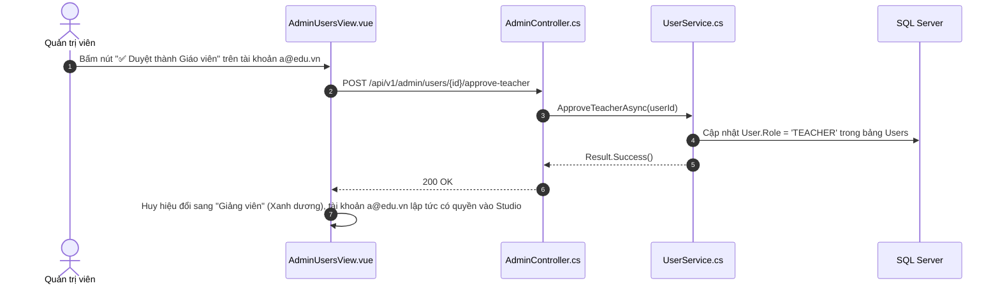

# 👥 VIEW 24: QUẢN LÝ NGƯỜI DÙNG & DUYỆT GIÁO VIÊN (ADMINUSERSVIEW)

* **Tên file Vue**: [`AdminUsersView.vue`](file:///d:/FPT/metqua/frontend/src/views/AdminUsersView.vue)
* **Đường dẫn URL**: `/admin/users`
* **Route Name**: `admin-users`
* **Quyền truy cập**: Chỉ Quản trị viên (`roles: ['ADMIN']`).

---

## 1. CẤU TRÚC GIAO DIỆN

```
┌────────────────────────────────────────────────────────────────────────┐
│  👥 QUẢN TRỊ NGƯỜI DÙNG & DUYỆT GIẢNG VIÊN                             │
│  [ Tab 1: Tất cả người dùng ]          [ Tab 2: Chờ duyệt Giảng viên ]│
├────────────────────────────────────────────────────────────────────────┤
│ 🔍 [ Tìm kiếm theo Tên, Email, Username (Không phân biệt hoa/thường) ]│
│ [ Bộ lọc vai trò: Tất cả ▾ | Sinh viên | Giảng viên | Chờ duyệt ]      │
├────────────────────────────────────────────────────────────────────────┤
│ BẢNG DANH SÁCH TÀI KHOẢN:                                              │
│                                                                        │
│ 1. ThS. Nguyễn Văn A  | a@edu.vn   | [ Chờ duyệt Giáo viên (Vàng) ]    │
│    Khoa: CNTT • Mã GV: GV0142 • Bằng cấp: Thạc sĩ                      │
│    Hành động: [ ✅ Duyệt thành Giáo viên ] [ ❌ Từ chối hồ sơ ]         │
│                                                                        │
│ 2. Trần Thị B         | b@fpt.edu  | [ Sinh viên (Xanh lá) ]           │
│    Hành động: [ 🔑 Đổi mật khẩu trực tiếp ] [ 🔒 Khóa tài khoản ]      │
└────────────────────────────────────────────────────────────────────────┘
```

---

## 2. CHI TIẾT CÁC LUỒNG HOẠT ĐỘNG (FLOWS)

### 🔹 Flow 1: Phê duyệt Giảng viên (Approve Teacher Flow)



### 🔹 Flow 2: Đổi mật khẩu trực tiếp cho người dùng (Direct Password Reset)
1. Admin bấm nút **"🔑 Đổi mật khẩu"** $\rightarrow$ Modal mở ra.
2. Admin nhập mật khẩu mới (ví dụ: `Abc@123456`) $\rightarrow$ Bấm Xác nhận.
3. Gửi `POST /api/v1/admin/users/{id}/reset-password { newPassword }`.
4. Backend mã hóa BCrypt mật khẩu mới và lưu thẳng vào Database mà không cần qua email.

---

## 3. BẢN ĐỒ MÃ NGUỒN LIÊN QUAN

* **Frontend View**: [`AdminUsersView.vue`](file:///d:/FPT/metqua/frontend/src/views/AdminUsersView.vue)
* **Backend Controller**: [`AdminController.cs`](file:///d:/FPT/metqua/backend/src/DsaVisual.Api/Controllers/AdminController.cs), [`UsersController.cs`](file:///d:/FPT/metqua/backend/src/DsaVisual.Api/Controllers/UsersController.cs)
* **Backend Service**: [`UserService.cs`](file:///d:/FPT/metqua/backend/src/DsaVisual.Application/Services/UserService.cs)
* **Database Entity**: [`User.cs`](file:///d:/FPT/metqua/backend/src/DsaVisual.Application/Persistence/Entities/User.cs)
