<!-- Khu vực logo trường: chèn logo Trường Cao Đẳng Thực Hành FPT tại đây -->

TRƯỜNG CAO ĐẲNG THỰC HÀNH FPT

---

**BÁO CÁO ĐỒ ÁN TỐT NGHIỆP**

**HỆ THỐNG HỖ TRỢ HỌC TẬP VÀ TRỰC QUAN HÓA CẤU TRÚC DỮ LIỆU VÀ GIẢI THUẬT (DSA-VISUAL)**

Ngành: Ứng dụng phần mềm

Giảng viên hướng dẫn: Phạm Ngọc Ái Liên

Lớp: SD21361

**Danh sách thành viên thực hiện**

| Mã SV | Họ và tên | Vai trò | Nhiệm vụ chính |
|---|---|---|---|
| TD01287 | Mai Tiểu Bảo | Trưởng nhóm | Backend ASP.NET Core + CSDL (task khó ưu tiên) |
| TD01282 | Thái Quang Sơn | Thành viên | Frontend Vue 3 + giao diện (task khó ưu tiên) |
| TD01131 | Huỳnh Lê Minh Thư | Thành viên | Simulation Engine (code) + Kiểm thử |
| TD01261 | Trần Viết Tâm Phúc | Thành viên | Code hỗ trợ (đơn giản) + Tài liệu + triển khai |

TP.HCM, ngày 12 tháng 8 năm 2026

Ngày bảo vệ: …………………………………………

---

TRƯỜNG CAO ĐẲNG THỰC HÀNH FPT

```{=openxml}
<w:p><w:r><w:br w:type="page"/></w:r></w:p>
```

# LỜI MỞ ĐẦU

Cấu trúc dữ liệu và giải thuật (DSA) là nền tảng của ngành công nghệ thông tin, nhưng cũng là môn học sinh viên gặp nhiều khó khăn nhất trong giai đoạn đầu. Các khái niệm như danh sách liên kết, cây, bảng băm hay các giải thuật sắp xếp, tìm kiếm rất trừu tượng: sinh viên khó hình dung dữ liệu được tổ chức thế nào trong bộ nhớ và giải thuật thao tác ra sao qua từng bước. Sách và giáo trình chỉ cung cấp hình tĩnh và mã nguồn, khiến việc học chủ yếu diễn ra thụ động, thiếu phản hồi trực quan và thiếu luyện tập chủ động.

Từ nhu cầu đó, nhóm gồm 4 sinh viên lớp SD21361 đã xây dựng Hệ thống hỗ trợ học tập và trực quan hóa cấu trúc dữ liệu và giải thuật (DSA-Visual) — ứng dụng web giúp sinh viên hiểu sâu DSA qua mô phỏng hoạt ảnh từng bước, bài tập tự chấm và theo dõi tiến độ cá nhân. Điểm cốt lõi là cơ chế EDV (Execution-Driven Visualization): mọi giải thuật là mã thật chạy qua StepExecutor, hoạt ảnh là phát lại bản ghi (trace) thật của quá trình thực thi, không hardcode.

Đây là lần thứ hai nhóm viết báo cáo đồ án, và nhóm đã rút ra bài học rõ ràng từ bản báo cáo trước bị hội đồng góp ý: hoạt ảnh hardcode nên không chạy được cho mọi đoạn code; màn hình gộp quá nhiều chức năng khiến người dùng rối; phạm vi dự án trôi dạt sang tính năng ngoài tầm đồ án; báo cáo có số liệu chưa kiểm chứng và danh sách thành viên không chính xác. Báo cáo này khắc phục cả bốn vấn đề: mọi nội dung được truy ngược về tài liệu thiết kế (SRS, SDD, API, kiểm thử), số liệu chưa đo được ghi rõ là chờ hoàn tất kiểm thử, thông tin thành viên xác nhận đúng 4 người thật sự tham gia.

Báo cáo gồm 7 phần. Phần 1 giới thiệu đề tài và ban dự án. Phần 2 trình bày khảo sát các hệ thống tương tự và kế hoạch dự án. Phần 3 mô tả phân tích yêu cầu hệ thống (mô hình triển khai, sơ đồ use case, đặc tả yêu cầu). Phần 4 trình bày thiết kế công nghệ, giao diện, dữ liệu và phần mềm. Phần 5 mô tả quá trình thực hiện. Phần 6 báo cáo kết quả kiểm thử. Phần 7 mô tả đóng gói và triển khai. Cuối báo cáo là Kết luận và hướng phát triển, Tài liệu tham khảo và 4 phụ lục hỗ trợ (hướng dẫn cài đặt môi trường, phím tắt và thuật ngữ, thư viện bên thứ ba, danh mục mô phỏng).

(nguồn: PRODUCTION_PROMPT §0.5; SRS §1.2)

# PHẦN 1: GIỚI THIỆU ĐỀ TÀI

## 1.1 Giới thiệu dự án

Sinh viên ngành công nghệ thông tin khi học môn Cấu trúc dữ liệu và giải thuật gặp 3 khó khăn điển hình:

1. **Trừu tượng**: khó hình dung cách dữ liệu được tổ chức trong bộ nhớ (liên kết, con trỏ, chỉ số) và cách giải thuật thao tác trên dữ liệu.
2. **Thiếu phản hồi trực quan**: sách và giáo trình chỉ có hình tĩnh và mã; sinh viên không thấy chuyển động từng bước, không thấy lý do vì sao giải thuật hoạt động như vậy.
3. **Thiếu luyện tập chủ động**: sinh viên không được thực hành dự đoán kết quả từng bước — kỹ năng quan trọng nhất để hiểu sâu giải thuật.

DSA-Visual giải quyết bằng: (a) mô phỏng từng bước mọi thao tác trên CTDL/GT theo cơ chế EDV (mã thật chạy, trace phát lại); (b) đồng bộ trực quan – mã giả – giải thích trong cùng một màn hình; (c) Practice Ladder 3 bậc với bài tập dự đoán chấm tự động; (d) theo dõi tiến độ cá nhân và báo cáo cho giảng viên.

Mục tiêu dự án được đo lường bằng 8 KPI G1-G8 (Bảng 1.1).

**Bảng 1.1: Mục tiêu dự án (KPI G1-G8)**

| Mã | Mục tiêu | Giá trị mục tiêu |
|---|---|---|
| G1 | Phủ nội dung học tập | ≥ 10 cấu trúc dữ liệu có mô phỏng |
| G2 | Phủ giải thuật | ≥ 14 giải thuật có mô phỏng (thiết kế: 15) |
| G3 | Mức độ sử dụng | ≥ 80% sinh viên trong lớp đăng ký và truy cập ≥ 1 lần/tuần |
| G4 | Hiệu quả học tập | Điểm trung bình kiểm tra chương của lớp ≥ 7.0/10 |
| G5 | Sự hài lòng | Điểm khảo sát UX (thang 5) ≥ 4.0/5 |
| G6 | Độ ổn định | Uptime giai đoạn thí điểm 4 tuần ≥ 99.5% |
| G7 | Hiệu năng | Thời gian phản hồi API p95 ≤ 800ms |
| G8 | Độ mượt mô phỏng | FPS khi mô phỏng ≥ 55 fps |

Ghi chú: G3 và G5 đo trên người dùng có đủ Tim/Premium theo thiết kế; G4 đo ngoài hệ thống (điểm kiểm tra chương do giảng viên chấm).

(nguồn: SRS §2.1, §2.2)

## 1.2 Ban dự án

Dự án do 4 thành viên lớp SD21361 thực hiện (Bảng 1.2). Đây là danh sách đã được xác nhận, không có thành viên nào ngoài danh sách này.

**Bảng 1.2: Danh sách thành viên và phân công**

| Mã SV | Họ và tên | Vai trò | Nhiệm vụ chính |
|---|---|---|---|
| TD01287 | Mai Tiểu Bảo | Trưởng nhóm | Backend ASP.NET Core + CSDL (task khó ưu tiên) |
| TD01282 | Thái Quang Sơn | Thành viên | Frontend Vue 3 + giao diện (task khó ưu tiên) |
| TD01131 | Huỳnh Lê Minh Thư | Thành viên | Simulation Engine (code) + Kiểm thử |
| TD01261 | Trần Viết Tâm Phúc | Thành viên | Code hỗ trợ (đơn giản) + Tài liệu + triển khai |

Vai trò chuyên môn của từng thành viên:

- Mai Tiểu Bảo (Trưởng nhóm): chịu trách nhiệm kiến trúc backend ASP.NET Core và cơ sở dữ liệu, nhận các task khó ưu tiên, điều phối tiến độ chung của nhóm.
- Thái Quang Sơn: phụ trách frontend Vue 3 và toàn bộ giao diện người dùng, xây dựng các màn hình học tập, mô phỏng, luyện tập theo thiết kế, nhận các task khó ưu tiên.
- Huỳnh Lê Minh Thư: phụ trách Simulation Engine (viết code generator, renderer cho cơ chế EDV) và kiểm thử hệ thống.
- Trần Viết Tâm Phúc: hỗ trợ code các phần đơn giản, phụ trách viết tài liệu và triển khai hệ thống.

(nguồn: SRS §2.4; SDD §1.5)

# PHẦN 2: KHẢO SÁT – SURVEY

## 2.1 Yêu cầu của khách hàng

Trước khi đặc tả yêu cầu, nhóm khảo sát 3 hệ thống trực quan hóa DSA phổ biến hiện nay:

- **VisuAlgo**: bộ minh họa giải thuật của Đại học Quốc gia Singapore (NUS), mô phỏng nhiều CTDL/GT, có bài tập quiz.
- **USFCA DS Visualizations**: bộ mô phỏng của Đại học San Francisco (Mỹ), mã nguồn mở, giao diện đơn giản.
- **Algorithm-Visualizer**: nền tảng cộng đồng, cho phép xem trực quan hóa từ mã nguồn do người dùng đóng góp.

Kết quả so sánh theo 9 tiêu chí được trình bày ở Bảng 2.1.

**Bảng 2.1: So sánh hệ thống tương tự**

| Tiêu chí | VisuAlgo | USFCA | Algorithm-Visualizer | DSA-Visual (đề xuất) |
|---|---|---|---|---|
| Ngôn ngữ giao diện | Tiếng Anh | Tiếng Anh | Tiếng Anh | Tiếng Việt |
| Mô phỏng từng bước | Có | Có | Có | Có |
| Giải thích bằng lời | Có (tùy chọn) | Hạn chế | Hạn chế | Bắt buộc mỗi bước |
| Mã giả đồng bộ | Có | Không | Có | Có (mã thật EDV) |
| Bài tập dự đoán bước | Có (quiz) | Không | Không | Có (Interactive Lab) |
| Theo dõi tiến độ cá nhân | Không | Không | Không | Có |
| Giảng viên biên soạn nội dung | Không | Không | Không | Có |
| So sánh đo thật với lý thuyết | Không | Không | Không | Có (Benchmark Lab) |
| Mã nguồn mở | Một phần | Có | Có | Nội bộ |

Kết luận khảo sát: 3 hệ thống trên đều mạnh về mô phỏng từng bước nhưng chưa đáp ứng đủ nhu cầu học tập tại trường. Từ đó, nhóm xác định 6 yêu cầu cốt lõi cho DSA-Visual: (1) đồng bộ 3 vùng trực quan – mã giả – giải thích từ trace thật (EDV); (2) hệ thống bài tập tự chấm theo Practice Ladder 3 bậc; (3) theo dõi tiến độ cá nhân và báo cáo cho giảng viên; (4) giảng viên tự biên soạn nội dung; (5) Benchmark so sánh số liệu đo thật với lý thuyết; (6) giao diện tiếng Việt.

Yêu cầu chức năng (FR) của hệ thống gồm 10 nhóm chức năng (Bảng 2.2). Trong quá trình duyệt, 12 FR đã được cắt để giữ phạm vi đúng tầm đồ án (không cổng thanh toán thật, không realtime, không online judge tự do).

**Bảng 2.2: Tóm tắt yêu cầu chức năng theo nhóm**

| Nhóm chức năng | Chức năng chính | FR tiêu biểu |
|---|---|---|
| Tài khoản | Đăng ký, đăng nhập, đổi/khôi phục mật khẩu, phê duyệt giảng viên | FR-1.1 đến FR-1.9 |
| Học tập | Quản lý chủ đề, bài học, Learning Path, ghi chú cá nhân | FR-2.1 đến FR-2.11 |
| Mô phỏng | Danh mục mô phỏng, hiển thị 3 vùng đồng bộ, điều khiển, Benchmark Lab | FR-3.1 đến FR-3.20b |
| Luyện tập | Practice Ladder 3 bậc, kiểm tra cuối lộ trình | FR-4.1 đến FR-4.12 |
| Tiến độ và báo cáo | Ghi nhận tiến độ, dashboard cá nhân, báo cáo giảng viên | FR-5.1 đến FR-5.5 |
| Quản trị | Quản lý người dùng, thống kê, cấu hình hệ thống | FR-5.4, FR-6.2 |
| Trang phụ trợ | Trang chủ, 3 demo công khai, FAQ, đánh giá nội dung | FR-7.1 đến FR-7.6 |
| Lớp học phần | Tạo lớp, quản lý sinh viên, gán nội dung và hạn nộp, báo cáo theo lớp | FR-8.1 đến FR-8.4 |
| Code Runner | Soạn mã nhúng, chạy mã kèm trực quan hóa, sandbox an toàn | FR-9.1 đến FR-9.6 |
| Gamification và Premium | Tim, Gems Shop, Daily Quest, Streak, XP/Level, Leaderboard, Premium | FR-10.1 đến FR-10.7 |

Yêu cầu phi chức năng (NFR) tóm tắt theo 8 nhóm:

- **Hiệu năng (NFR-1 đến NFR-7)**: API phản hồi p95 ≤ 800ms; sinh chuỗi bước mô phỏng mảng 100 phần tử ≤ 500ms; ≥ 55 FPS khi điều hướng bước; tải trang đầu ≤ 3s; ≥ 200 người dùng đồng thời.
- **Bảo mật (NFR-8 đến NFR-15)**: mật khẩu băm mạnh (bcrypt cost 12); JWT access 60 phút + refresh token xoay vòng; phân quyền kiểm tra server-side; rate limit; HTTPS bắt buộc; nhật ký bảo mật.
- **Khả năng mở rộng (NFR-16 đến NFR-19)**: thêm mô phỏng mới chỉ thêm generator và renderer; backend 2 lớp Controller → Service (KHÔNG dùng Repository theo NFR-17); API versioning; cấu hình hóa hằng số nghiệp vụ.
- **Khả năng sử dụng (NFR-20 đến NFR-24)**: chạy mô phỏng đầu tiên ≤ 2 phút không cần hướng dẫn; giao diện tiếng Việt; thông báo lỗi rõ ràng; trợ năng WCAG 2.1 AA; phím tắt cho mô phỏng.
- **Tương thích (NFR-25 đến NFR-27)**: Chrome, Edge, Firefox 2 phiên bản mới nhất; độ phân giải ≥ 1024×768 không vỡ layout; desktop/laptop là thiết bị chính.
- **Độ tin cậy (NFR-28 đến NFR-30)**: uptime ≥ 99.5% giai đoạn thí điểm; backup hàng ngày giữ 14 bản; mọi exception đều có log đầy đủ.
- **Bảo trì (NFR-31 đến NFR-34)**: tuân thủ chuẩn code; hàm ≤ 40 dòng, class ≤ 400 dòng; public API có tài liệu; kiểm thử tự động backend ≥ 60%, generator ≥ 90%.
- **Tuân thủ (NFR-35, NFR-36)**: dữ liệu cá nhân theo Nghị định 13/2023/NĐ-CP; chỉ dùng thư viện mã nguồn mở có liệt kê license.

(nguồn: SRS §2.6 — khảo sát; SRS §3.1 — FR; SRS §4.1-§4.8 — NFR; PRODUCTION_PROMPT §1.9)

## 2.2 Kế hoạch dự án

Dự án chạy theo quy trình phát triển linh hoạt với 10 sprint, mỗi sprint khoảng 1 tuần, tổng thời gian 13 tuần (khởi động 12/05/2026, kết thúc phát triển khoảng 11/08/2026). Quy trình trải qua 4 giai đoạn nối tiếp:

1. **Khảo sát và phân tích yêu cầu**: khảo sát hệ thống tương tự, đặc tả FR/NFR, lập kế hoạch sprint.
2. **Thiết kế hệ thống**: thiết kế kiến trúc backend, cơ sở dữ liệu, giao diện và Simulation Engine.
3. **Phát triển**: lập trình theo từng sprint, ưu tiên các chức năng mức Cao trước.
4. **Kiểm thử và triển khai**: kiểm thử toàn diện, hoàn tất tài liệu, triển khai môi trường staging.

Nội dung 10 sprint được trình bày ở Bảng 2.3.

**Bảng 2.3: Kế hoạch 10 sprint**

| Số sprint | Thời gian | Nội dung chính | Kết quả chính |
|---|---|---|---|
| S1 | 12/05→18/05 | Khởi động dự án | Repo, ứng dụng hello-world, SRS phiên bản đầu |
| S2 | 19/05→25/05 | Lõi backend | API xác thực, quản lý chủ đề/bài học, phân quyền |
| S3 | 26/05→01/06 | Engine EDV cơ bản | StepExecutor, registry, 3 giải thuật đầu, renderer mảng |
| S4 | 02/06→08/06 | Giao diện học tập cốt lõi | Màn học tập, chi tiết bài học, mô phỏng, Learning Path |
| S5 | 09/06→15/06 | Mở rộng engine | Đủ 15 giải thuật, renderer cây/đồ thị/heap/bảng băm |
| S6 | 16/06→22/06 | Practice Ladder và Code Runner phần 1 | Bậc 1 Quiz, Bậc 2 Interactive Lab, Monaco và sandbox Web Worker |
| S7 | 23/06→29/06 | Code Runner phần 2 và chấm điểm | Bậc 3 Code Challenge với test ẩn, tổng hợp tiến độ |
| S8 | 30/06→06/07 | Gamification lõi | Tim, Streak, XP/Level, Daily Quest, Leaderboard |
| S9 | 07/07→13/07 | Premium, Lớp học phần, Benchmark | Gems Shop, Premium mô phỏng, lớp học phần, Benchmark Lab |
| S10 | 14/07→20/07 | Hoàn thiện | Kiểm thử toàn diện, tối ưu hiệu năng, bảo mật, tài liệu, deploy staging |

Sau 10 sprint, giai đoạn hoàn thiện từ 21/07 đến 11/08/2026 gồm: kiểm thử toàn diện (chức năng, hiệu năng, bảo mật), hoàn tất 12 file tài liệu bàn giao và triển khai môi trường staging. Giai đoạn báo cáo từ 12/08 đến 31/08/2026: viết báo cáo Word, làm slide và chuẩn bị bảo vệ; ngày bảo vệ cụ thể do trường sắp xếp (để trống trên bìa).

Phân công theo giai đoạn được tóm tắt ở Bảng 2.4.

**Bảng 2.4: Phân công theo giai đoạn**

| Giai đoạn | Nội dung chính | Thành viên chính |
|---|---|---|
| Khảo sát và phân tích yêu cầu | Khảo sát hệ thống tương tự, đặc tả FR/NFR, lập kế hoạch | Cả nhóm (Bảo điều phối) |
| Thiết kế hệ thống | Kiến trúc backend, cơ sở dữ liệu, giao diện, Simulation Engine | Bảo, Sơn, Thư |
| Phát triển | Lập trình theo 10 sprint, ưu tiên chức năng mức Cao | Bảo, Sơn, Thư, Phúc |
| Kiểm thử và triển khai | Kiểm thử toàn diện, tài liệu hóa, deploy staging | Thư, Phúc |

(nguồn: PRODUCTION_PROMPT §20.1 — nội dung sprint; mốc thời gian: BAO_CAO_SPEC §4)


# PHẦN 3: PHÂN TÍCH - ANALYSIS

## 3.1 Mô hình triển khai hệ thống

Hệ thống DSA-Visual được triển khai theo mô hình 3 tầng: trình duyệt (Vue 3 SPA) gọi REST API (ASP.NET Core) và API đọc/ghi dữ liệu trên SQL Server. Toàn bộ Simulation Engine (EDV) chạy phía trình duyệt nên việc sinh bước mô phỏng không tốn tài nguyên máy chủ; máy chủ chỉ nhận các thao tác cần lưu trữ (phiên học, tiến độ, chấm điểm).

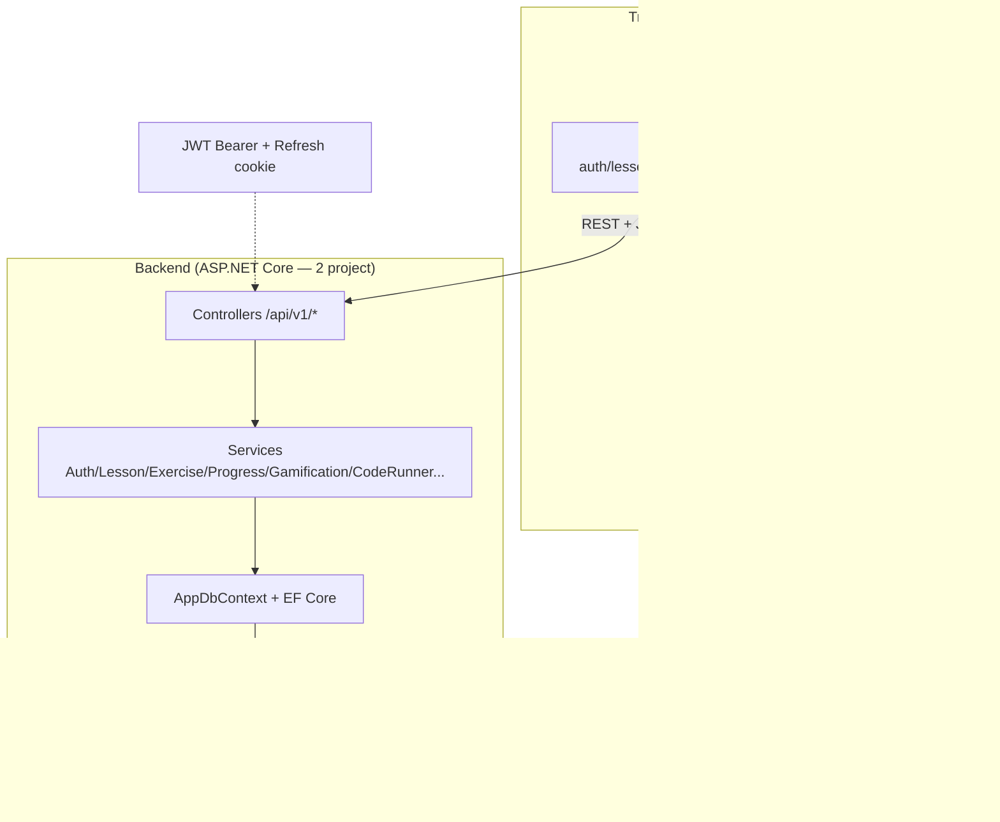
```mermaid
graph TB
    subgraph Client["Trình duyệt — SPA (Vue 3 + Vite + TS)"]
        UI[Giao diện SPA]
        STORE[Pinia Stores<br/>auth/lesson/simulation/progress/gamification...]
        ENGINES[Simulation Engine EDV<br/>StepExecutor + Generator + Renderer + Registry]
        CODE[Code Runner Sandbox<br/>Web Worker + Monaco]
        UI --> STORE
        STORE --> ENGINES
        STORE --> CODE
    end
    subgraph Server["Backend (ASP.NET Core — 2 project)"]
        API[Controllers /api/v1/*]
        SVC[Services<br/>Auth/Lesson/Exercise/Progress/Gamification/CodeRunner...]
        DB[AppDbContext + EF Core]
        API --> SVC
        SVC --> DB
    end
    subgraph Data["Dữ liệu"]
        SQL[(SQL Server 2019+)]
    end
    STORE -->|REST + JWT| API
    CODE -->|trace chấm điểm client-side| ENGINES
    DB --> SQL
    AUTH[JWT Bearer + Refresh cookie] -.-> API
```

Sơ đồ trên mô tả luồng chính: giao diện SPA gọi API qua REST kèm JWT, API xử lý qua lớp Service rồi lưu vào SQL Server bằng EF Core; riêng mô phỏng và chấm code chạy ngay trong trình duyệt (Web Worker), máy chủ chỉ lưu lịch sử. Các thành phần chính được tóm tắt ở Bảng 3.1.

**Bảng 3.1: Các thành phần chính của hệ thống**

| Thành phần | Vai trò | Công nghệ |
|---|---|---|
| Client | Hiển thị giao diện, chạy mô phỏng EDV, chạy và chấm code trong sandbox | Vue 3 + Vite + TypeScript, Pinia, Web Worker, Monaco |
| API Server | Xác thực, cung cấp dữ liệu bài học/mô phỏng, chấm điểm bài tập, quản lý tiến độ và gamification | ASP.NET Core (DsaVisual.Api + DsaVisual.Application), EF Core |
| Database | Lưu toàn bộ dữ liệu: người dùng, bài học, bài tập, tiến độ, phiên học, code | SQL Server 2019+ |

(nguồn: SDD §2.1)

## 3.2 Sơ đồ Use Cases

### 3.2.1 Tổng quan

Hệ thống phục vụ **3 tác nhân chính**:

- **Người học (Student)** — xem bài học, chạy mô phỏng, làm bài tập, luyện tập theo lộ trình, quản lý hồ sơ và tham gia lớp học phần;
- **Giảng viên (Teacher)** — biên soạn bài học/bài tập, xem báo cáo giảng dạy và quản lý lớp học phần;
- **Quản trị viên (Admin)** — quản lý người dùng và cấu hình hệ thống.

Bên cạnh đó còn tác nhân **Khách (chưa đăng nhập)** với các chức năng tạo tài khoản, đăng nhập, xem demo công khai và khôi phục mật khẩu. Sơ đồ use case tổng thể gồm đủ 33 use case (UC-01 → UC-33):

```mermaid
graph TD
    subgraph "Hệ thống DSA-Visual"
        A[UC-01 Chạy mô phỏng giải thuật]
        B[UC-02 Tạo tài khoản]
        C[UC-03 Đăng nhập và duy trì phiên]
        D[UC-04 Xem bài học]
        E[UC-05 Tìm kiếm bài học]
        F[UC-06 Làm bài tập trắc nghiệm]
        G[UC-07 Làm bài tập dự đoán bước<br/>(Bậc 2 Lab)]
        H[UC-08 Xem tiến độ cá nhân]
        I[UC-09 Biên soạn bài học]
        J[UC-10 Biên soạn bài tập]
        K[UC-11 Xem báo cáo giảng dạy]
        L[UC-12 Quản lý người dùng]
        M[UC-13 Quản trị cấu hình]
        N[UC-14 Xem demo công khai]
        O[UC-15 Khôi phục mật khẩu]
        P[UC-16 Xem chi tiết bài học và mở module riêng]
        Q[UC-17 Viết và chạy code trong sandbox]
        R[UC-18 Nộp bài tập lập trình]
        S[UC-19 Xem lịch sử nộp bài code]
        T[UC-20 Quản lý lớp học phần]
        U[UC-21 Tham gia lớp bằng mã mời]
        V[UC-22 Ghi chú cá nhân]
        W[UC-23 Xem thành tích và huy hiệu]
        X[UC-24 Gửi phản hồi và báo lỗi]
        Y[UC-25 Học theo Learning Path]
        Z[UC-26 Làm Practice Ladder]
        AA[UC-27 Làm bài kiểm tra cuối lộ trình]
        AB[UC-28 Chạy Benchmark Lab]
        AC[UC-29 Làm Daily Quest và giữ Streak]
        AD[UC-30 Mua vật phẩm Gems Shop]
        AE[UC-31 Xem Leaderboard]
        AF[UC-32 Nâng cấp Premium]
        AG[UC-33 Xác thực hai yếu tố (2FA)]
    end
    Khach["Khách (chưa đăng nhập)"] --> B
    Khach --> C
    Khach --> N
    Khach --> O
    NguoiHoc["Người học (Student)"] --> A
    NguoiHoc --> D
    NguoiHoc --> E
    NguoiHoc --> F
    NguoiHoc --> G
    NguoiHoc --> H
    NguoiHoc --> P
    NguoiHoc --> Q
    NguoiHoc --> R
    NguoiHoc --> S
    NguoiHoc --> U
    NguoiHoc --> V
    NguoiHoc --> W
    NguoiHoc --> X
    NguoiHoc --> Y
    NguoiHoc --> Z
    NguoiHoc --> AA
    NguoiHoc --> AB
    NguoiHoc --> AC
    NguoiHoc --> AD
    NguoiHoc --> AE
    NguoiHoc --> AF
    NguoiHoc --> AG
    NguoiDay["Giảng viên (Teacher)"] --> D
    NguoiDay --> E
    NguoiDay --> I
    NguoiDay --> J
    NguoiDay --> K
    NguoiDay --> T
    NguoiDay --> X
    Admin["Quản trị viên (Admin)"] --> L
    Admin --> M
    Admin --> X
```


*Hình 3.1: Sơ đồ use case tổng thể — 3 tác nhân và các chức năng chính của hệ thống. (ảnh placeholder — sinh ảnh thật bằng prompt NHÓM B #1)*

(nguồn: SRS §5.1)

### 3.2.2 Use Cases dành cho người học

Nhóm người học gồm 24 use case: xem bài học và mô phỏng giải thuật, làm bài tập (trắc nghiệm, dự đoán bước, lập trình), học theo lộ trình, tham gia lớp học phần và các chức năng gamification. Sơ đồ nhóm như sau:

```mermaid
graph TD
    subgraph "Hệ thống DSA-Visual — nhóm Người học"
        A[UC-01 Chạy mô phỏng giải thuật]
        B[UC-02 Tạo tài khoản]
        C[UC-03 Đăng nhập và duy trì phiên]
        D[UC-04 Xem bài học]
        E[UC-05 Tìm kiếm bài học]
        F[UC-06 Làm bài tập trắc nghiệm]
        G[UC-07 Làm bài tập dự đoán bước<br/>(Bậc 2 Lab)]
        H[UC-08 Xem tiến độ cá nhân]
        N[UC-14 Xem demo công khai]
        Q[UC-17 Viết và chạy code trong sandbox]
        R[UC-18 Nộp bài tập lập trình]
        S[UC-19 Xem lịch sử nộp bài code]
        U[UC-21 Tham gia lớp bằng mã mời]
        V[UC-22 Ghi chú cá nhân]
        W[UC-23 Xem thành tích và huy hiệu]
        X[UC-24 Gửi phản hồi và báo lỗi]
        Y[UC-25 Học theo Learning Path]
        Z[UC-26 Làm Practice Ladder]
        AA[UC-27 Làm bài kiểm tra cuối lộ trình]
        AB[UC-28 Chạy Benchmark Lab]
        AC[UC-29 Làm Daily Quest và giữ Streak]
        AD[UC-30 Mua vật phẩm Gems Shop]
        AE[UC-31 Xem Leaderboard]
        AF[UC-32 Nâng cấp Premium]
        AG[UC-33 Xác thực hai yếu tố (2FA)]
    end
    NguoiHoc["Người học (Student)"] --> A
    NguoiHoc --> B
    NguoiHoc --> C
    NguoiHoc --> D
    NguoiHoc --> E
    NguoiHoc --> F
    NguoiHoc --> G
    NguoiHoc --> H
    NguoiHoc --> N
    NguoiHoc --> Q
    NguoiHoc --> R
    NguoiHoc --> S
    NguoiHoc --> U
    NguoiHoc --> V
    NguoiHoc --> W
    NguoiHoc --> X
    NguoiHoc --> Y
    NguoiHoc --> Z
    NguoiHoc --> AA
    NguoiHoc --> AB
    NguoiHoc --> AC
    NguoiHoc --> AD
    NguoiHoc --> AE
    NguoiHoc --> AF
    NguoiHoc --> AG
```


*Hình 3.2: Sơ đồ use case dành cho người học — 24 chức năng học tập và luyện tập chính. (ảnh placeholder — sinh ảnh thật bằng prompt NHÓM B #1)*

Các use case chính được liệt kê ở Bảng 3.2:

**Bảng 3.2: Danh sách use case dành cho người học**

| Mã UC | Tên | Mô tả |
|---|---|---|
| UC-01 | Chạy mô phỏng giải thuật | Mở mô phỏng, cấu hình dữ liệu đầu vào, điều khiển từng bước với 3 vùng đồng bộ (trực quan – mã giả – giải thích) |
| UC-02 | Tạo tài khoản | Đăng ký bằng email + mật khẩu, vai trò mặc định Student; chọn "Tôi là giảng viên" thì chờ Admin duyệt |
| UC-03 | Đăng nhập và duy trì phiên | Đăng nhập nhận JWT, tự động gia hạn phiên bằng refresh token, đăng xuất thu hồi phiên |
| UC-04 | Xem bài học | Duyệt cây chủ đề, đọc lý thuyết, đánh dấu đã học và mở module riêng (mô phỏng/bài tập/code) |
| UC-05 | Tìm kiếm bài học | Gõ từ khóa, hệ thống gợi ý bài học sau 300ms, chọn kết quả để mở bài học |
| UC-06 | Làm bài tập trắc nghiệm | Trả lời câu hỏi, nộp bài, hệ thống chấm điểm tự động và hiển thị giải thích |
| UC-07 | Làm bài tập dự đoán bước | Thao tác trên canvas editable, nộp, hệ thống chấm trạng thái cuối + giới hạn số bước |
| UC-08 | Xem tiến độ cá nhân | Xem thẻ KPI tổng quan, tiến độ theo từng chủ đề và nhảy tới bài học chưa học |
| UC-14 | Xem demo công khai | Khách chạy thử 3 demo (Bubble Sort, Binary Search, BFS) không cần tài khoản |
| UC-17 | Viết và chạy code trong sandbox | Soạn/hiệu chỉnh code trong Monaco, chạy an toàn trong Web Worker, xem trace đồng bộ editor – visual |
| UC-18 | Nộp bài tập lập trình | Nộp code, hệ thống chấm bằng test ẩn (tĩnh + ngẫu nhiên) và trả kết quả từng test |
| UC-19 | Xem lịch sử nộp bài code | Xem danh sách lần nộp, mở lại code cũ kèm kết quả và so sánh 2 lần nộp |
| UC-21 | Tham gia lớp bằng mã mời | Nhập mã mời 6 ký tự để vào lớp học phần đang mở |
| UC-22 | Ghi chú cá nhân | Soạn ghi chú gắn với bài học, tự lưu sau 1 giây, xem lại và xóa |
| UC-23 | Xem thành tích và huy hiệu | Xem huy hiệu đã mở và huy hiệu ẩn, nhận toast khi đạt huy hiệu mới |
| UC-24 | Gửi phản hồi và báo lỗi | Đánh giá sao + nhận xét bài học, gửi báo lỗi kèm ngữ cảnh tự động (URL, bước mô phỏng) |
| UC-25 | Học theo Learning Path | Chọn lộ trình, xem bản đồ node, vào node đang mở (trừ tim), pass node để mở khóa node kế |
| UC-26 | Làm Practice Ladder | Chuỗi 3 bậc Quiz → Lab → Code; pass bậc trước mới mở bậc sau, retry trong phiên miễn phí |
| UC-27 | Làm bài kiểm tra cuối lộ trình | Làm final test sau khi pass toàn bộ node, ngưỡng pass ≥ 70% |
| UC-28 | Chạy Benchmark Lab | So sánh nhiều giải thuật trên nhiều kích thước dữ liệu, đối chiếu overlay lý thuyết |
| UC-29 | Làm Daily Quest và giữ Streak | Nhận thử thách hằng ngày, hoàn thành để giữ chuỗi ngày học liên tục |
| UC-30 | Mua vật phẩm Gems Shop | Dùng gems đổi vật phẩm (tim, streak freeze...) trong cửa hàng |
| UC-31 | Xem Leaderboard | Xem bảng xếp hạng theo XP |
| UC-32 | Nâng cấp Premium | Checkout mô phỏng gói Premium, quản lý hết hạn |

(nguồn: SRS §5.2-5.9, §5.15, §5.18-5.20, §5.22-5.33)

### 3.2.3 Use Cases dành cho giảng viên

Nhóm giảng viên gồm 4 use case: biên soạn nội dung, xem báo cáo và quản lý lớp học phần:

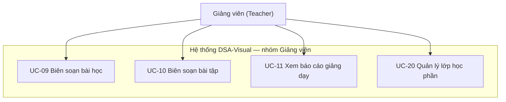
```mermaid
graph TD
    subgraph "Hệ thống DSA-Visual — nhóm Giảng viên"
        I[UC-09 Biên soạn bài học]
        J[UC-10 Biên soạn bài tập]
        K[UC-11 Xem báo cáo giảng dạy]
        T[UC-20 Quản lý lớp học phần]
    end
    NguoiDay["Giảng viên (Teacher)"] --> I
    NguoiDay --> J
    NguoiDay --> K
    NguoiDay --> T
```


*Hình 3.3: Sơ đồ use case dành cho giảng viên — 4 chức năng biên soạn, báo cáo và quản lý lớp. (ảnh placeholder — sinh ảnh thật bằng prompt NHÓM B #1)*

**Bảng 3.3: Danh sách use case dành cho giảng viên**

| Mã UC | Tên | Mô tả |
|---|---|---|
| UC-09 | Biên soạn bài học | Tạo/sửa chủ đề và bài học rich-text, gắn mô phỏng có sẵn kèm cấu hình mặc định, gắn bài tập, lưu nháp và kích hoạt |
| UC-10 | Biên soạn bài tập | Tạo bài tập theo loại câu hỏi (chọn 1/nhiều/đúng-sai), soạn đáp án và giải thích, xem trước và kích hoạt |
| UC-11 | Xem báo cáo giảng dạy | Xem thống kê bài học (người xem, % hoàn thành, điểm trung bình) và xuất CSV |
| UC-20 | Quản lý lớp học phần | Tạo lớp + mã mời 6 ký tự, thêm/xóa sinh viên, gán nội dung kèm hạn nộp, xem báo cáo lớp và xuất CSV |

(nguồn: SRS §5.10-5.12, §5.21)

### 3.2.4 Use Cases dành cho quản trị viên

Nhóm quản trị viên gồm 2 use case:

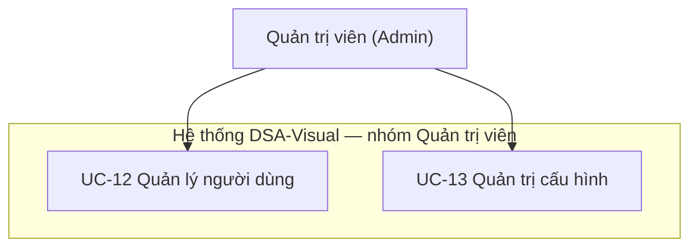
```mermaid
graph TD
    subgraph "Hệ thống DSA-Visual — nhóm Quản trị viên"
        L[UC-12 Quản lý người dùng]
        M[UC-13 Quản trị cấu hình]
    end
    Admin["Quản trị viên (Admin)"] --> L
    Admin --> M
```


*Hình 3.4: Sơ đồ use case dành cho quản trị viên — quản lý người dùng và cấu hình hệ thống. (ảnh placeholder — sinh ảnh thật bằng prompt NHÓM B #1)*

**Bảng 3.4: Danh sách use case dành cho quản trị viên**

| Mã UC | Tên | Mô tả |
|---|---|---|
| UC-12 | Quản lý người dùng | Xem danh sách người dùng, khóa/mở khóa, phê duyệt tài khoản giảng viên, đặt lại mật khẩu; mọi thao tác đều ghi log máy chủ |
| UC-13 | Quản trị cấu hình hệ thống | Chỉnh cấu hình hệ thống (domain email, chính sách mật khẩu, giới hạn upload), lưu và áp dụng ngay không cần khởi động lại |

(nguồn: SRS §5.13-5.14)

## 3.3 Đặc tả yêu cầu hệ thống (SRS)

### 3.3.1 Ma trận yêu cầu chức năng

Bảng 3.5 tổng hợp đầy đủ **75 yêu cầu chức năng (FR)** của hệ thống theo 10 module (A — Xác thực, B — Bài học, C — Mô phỏng, D — Practice Ladder, E — Tiến độ, F — Quản trị, G — Trang phụ trợ, H — Lớp học phần, I — Code Runner, J — Gamification & Premium). 12 FR đã được duyệt cắt (FR-1.10, FR-2.7, FR-2.8, FR-2.9, FR-3.13, FR-3.17, FR-3.19, FR-5.6, FR-5.7, FR-6.4, FR-7.3, FR-7.5) không nằm trong bảng.

**Bảng 3.5: Ma trận yêu cầu chức năng (master matrix FR)**

| Mã FR | Tên | Mô tả ngắn | UC liên quan | Ưu tiên |
|---|---|---|---|---|
| FR-1.1 | Đăng ký tài khoản | Khách tạo tài khoản bằng email + mật khẩu, vai trò mặc định Student | UC-02 | Cao |
| FR-1.2 | Đăng nhập | Xác thực email + mật khẩu, cấp access token và refresh cookie | UC-03 | Cao |
| FR-1.3 | Gia hạn phiên | Tự động cấp access token mới khi hết hạn bằng refresh token | UC-03 | Cao |
| FR-1.4 | Đăng xuất | Thu hồi refresh token và xóa cookie phiên | UC-03 | Cao |
| FR-1.5 | Đổi mật khẩu | Người dùng đổi mật khẩu của mình sau khi xác thực | UC-03 | TB |
| FR-1.6 | Khôi phục mật khẩu | Gửi link đặt lại mật khẩu qua email, hiệu lực 30 phút, dùng 1 lần | UC-15 | TB |
| FR-1.7 | Cập nhật thông tin cá nhân | Sửa họ tên, avatar trong hồ sơ cá nhân | UC-03 | TB |
| FR-1.8 | Phê duyệt tài khoản giảng viên | Admin duyệt hoặc từ chối tài khoản TeacherPending | UC-12 | TB |
| FR-1.9 | Quản lý người dùng | Admin khóa/mở khóa, đặt lại mật khẩu, ghi log mọi thao tác | UC-12 | TB |
| FR-1.11 | Xác thực hai lớp | Yêu cầu mã 6 số gửi email khi đăng nhập (nếu bật) | UC-03 | Thấp |
| FR-2.1 | Quản lý chủ đề | CRUD chủ đề (topic) cho giảng viên | UC-09 | Cao |
| FR-2.2 | Quản lý bài học | CRUD bài học rich-text, gắn mô phỏng và bài tập | UC-09 | Cao |
| FR-2.3 | Xem danh sách bài học | Duyệt cây chủ đề kèm trạng thái tiến độ từng bài | UC-04 | Cao |
| FR-2.4 | Xem chi tiết bài học | Đọc nội dung lý thuyết, đánh dấu đã học, mở module riêng | UC-04 | Cao |
| FR-2.5 | Tìm kiếm bài học | Gợi ý kết quả theo từ khóa sau 300ms | UC-05 | TB |
| FR-2.6 | Ghi chú cá nhân trên bài học | Ghi chú riêng gắn bài học, tự lưu sau 1 giây | UC-04 | TB |
| FR-2.10 | Learning Path | Lộ trình node mở khóa tuần tự theo kết quả học | UC-25 | Cao |
| FR-2.11 | Two-way sync bằng deep-link | Mở thẳng mô phỏng tại bước N qua link `?step=N` và ngược lại | UC-01 | Cao |
| FR-3.1 | Danh mục mô phỏng | Xem danh sách mô phỏng theo loại giải thuật | UC-01 | Cao |
| FR-3.2 | Khởi tạo mô phỏng | Kiểm tra tim, nạp cấu hình mặc định và sinh chuỗi bước khi mở | UC-01 | Cao |
| FR-3.3 | Hiển thị đồng bộ 3 vùng | Canvas trực quan, mã giả và giải thích cập nhật theo từng bước | UC-01 | Cao |
| FR-3.4 | Cấu hình dữ liệu đầu vào | Nhập/đổi dữ liệu mẫu, sinh lại chuỗi bước về bước 0 | UC-01 | Cao |
| FR-3.5 | Điều khiển mô phỏng | Phát/dừng/bước tiếp/bước lùi/về đầu/về cuối, đổi tốc độ | UC-01 | Cao |
| FR-3.6 | Trạng thái trực quan của phần tử | Tô màu trạng thái phần tử theo từng bước thực thi | UC-01 | Cao |
| FR-3.7 | Bảng mã giả đồng bộ | Highlight dòng mã giả tương ứng bước đang chạy | UC-01 | Cao |
| FR-3.8 | Tùy chọn hiển thị | Ẩn/hiện vùng, đổi tốc độ và màu sắc hiển thị | UC-01 | TB |
| FR-3.9 | Bộ đếm thống kê | Đếm số bước, số lần chạy và thống kê so sánh | UC-01 | TB |
| FR-3.10 | Lưu mô phỏng yêu thích | Đánh dấu mô phỏng yêu thích để mở nhanh | UC-01 | Thấp |
| FR-3.11 | Chia sẻ liên kết mô phỏng | Sao chép link chia sẻ mô phỏng hiện tại | UC-01 | Thấp |
| FR-3.12 | Thực hành bước thủ công | Người học tự thao tác, hệ thống kiểm tra kết quả | UC-01 | Cao |
| FR-3.14 | Hiển thị ngăn xếp đệ quy | Call Stack hiển thị trong mô phỏng đệ quy | UC-01 | TB |
| FR-3.15 | Điểm dừng có điều kiện | Dừng mô phỏng khi gặp điều kiện do người học chỉ định | UC-01 | TB |
| FR-3.16 | Kiểm tra nhanh sau mô phỏng | Mini quiz ngắn sau khi xem xong mô phỏng | UC-01 | TB |
| FR-3.18 | Chế độ tối | Giao diện tối cho toàn hệ thống | — | TB |
| FR-3.20 | Benchmark Lab | Chạy so sánh nhiều giải thuật trên 1 kích thước dữ liệu | UC-28 | TB |
| FR-3.20b | Benchmark đa kích thước | So sánh trên nhiều kích thước, hiển thị overlay lý thuyết | UC-28 | TB |
| FR-4.1 | Quản lý bài tập | CRUD bài tập cho giảng viên (loại, câu hỏi, đáp án, bậc Ladder) | UC-10 | Cao |
| FR-4.2 | Làm bài tập trắc nghiệm | Bậc 1 Quiz: trả lời, nộp, chấm điểm tự động, hiển thị giải thích | UC-06 | Cao |
| FR-4.3 | Bài tập dự đoán bước | Bậc 2 Lab: chấm trạng thái cuối + giới hạn số bước | UC-07 | TB |
| FR-4.4 | Đánh giá và lịch sử bài làm | Lưu điểm, giữ điểm cao nhất, xem lại bài làm | UC-06 | TB |
| FR-4.5 | Ngân hàng câu hỏi dùng lại | Tái sử dụng câu hỏi theo chủ đề/tag | UC-10 | Thấp |
| FR-4.6 | Chế độ luyện tập | Làm lại bài tập không tính vào điểm chính thức | UC-06 | TB |
| FR-4.7 | Gợi ý trả lời | Hints trừ 20%/gợi ý, tối thiểu giữ 40% điểm câu | UC-06 | TB |
| FR-4.8 | Xáo trộn câu hỏi và phương án | Trộn câu hỏi + phương án theo seed ổn định | UC-06 | TB |
| FR-4.9 | Giải thích theo phương án sai | Hiển thị giải thích riêng cho từng phương án sai | UC-06 | TB |
| FR-4.10 | Nhập câu hỏi từ CSV | Nhập hàng loạt câu hỏi từ file CSV | UC-10 | Thấp |
| FR-4.11 | Practice Ladder tuần tự | Chuỗi 3 bậc Quiz → Lab → Code theo từng node | UC-26 | Cao |
| FR-4.12 | Kiểm tra cuối lộ trình | Final test sau khi pass toàn bộ node, ngưỡng pass ≥ 70% | UC-27 | Cao |
| FR-5.1 | Ghi nhận tiến độ | Cập nhật tiến độ người học sau mỗi hành động học | UC-08 | Cao |
| FR-5.2 | Dashboard tiến độ cá nhân | Thẻ KPI + thanh tiến độ theo chủ đề | UC-08 | Cao |
| FR-5.3 | Báo cáo giảng viên | Thống kê bài học, xuất CSV | UC-11 | TB |
| FR-5.4 | Thống kê hệ thống | Báo cáo tổng hợp cho Admin | — | TB |
| FR-5.5 | Huy hiệu thành tích | Trao huy hiệu đúng 1 lần theo sự kiện học tập | UC-08 | TB |
| FR-6.2 | Cấu hình hệ thống | Chỉnh cấu hình, áp dụng ngay không cần khởi động lại | UC-13 | TB |
| FR-7.1 | Trang chủ công khai | Trang chủ với demo công khai | UC-14 | TB |
| FR-7.2 | Trang trợ giúp | Trang FAQ và trợ giúp | — | TB |
| FR-7.4 | Đánh giá nội dung | Sao + nhận xét ≤ 200 ký tự cho bài học | — | Thấp |
| FR-7.6 | Demo công khai 3 visualizer | Chạy thử Bubble Sort, Binary Search, BFS không cần tài khoản | UC-14 | TB |
| FR-8.1 | Tạo và quản lý lớp học phần | Tạo lớp + mã mời duy nhất 6 ký tự | — | TB |
| FR-8.2 | Quản lý sinh viên trong lớp | Thêm/xóa sinh viên, tham gia bằng mã mời | — | TB |
| FR-8.3 | Gán nội dung và hạn nộp | Gán nội dung bắt buộc kèm hạn nộp theo lớp | — | TB |
| FR-8.4 | Báo cáo theo lớp | Báo cáo % hoàn thành, điểm TB, danh sách chậm trễ, xuất CSV | — | TB |
| FR-9.1 | Trình soạn mã nhúng | Editor Monaco nạp sẵn code mẫu, highlight cú pháp | UC-17 | Cao |
| FR-9.2 | Chạy mã và trực quan hóa | Chạy code an toàn, phát trace đồng bộ editor – visual | UC-17 | Cao |
| FR-9.3 | Bài tập lập trình + chấm tự động | Chấm bằng test ẩn (tĩnh + ngẫu nhiên), trả kết quả từng test | UC-18 | TB |
| FR-9.4 | Sandbox an toàn | Chạy trong Web Worker, chặn vòng lặp vô hạn, không treo trình duyệt | UC-17 | Cao |
| FR-9.5 | Lịch sử nộp bài code | Xem lại các lần nộp và so sánh kết quả | UC-19 | TB |
| FR-9.6 | Sandbox giới hạn chi tiết | Giới hạn 10 giây / 64MB / 200 dòng, cấm import và I/O ngoài | UC-17 | Cao |
| FR-10.1 | Tim, hồi tim và session | Trừ 1 tim atomic khi vào node, session 30 phút resume miễn phí | UC-25 | Cao |
| FR-10.2 | Gems + Gems Shop | Kiếm gems và đổi vật phẩm trong cửa hàng | UC-30 | TB |
| FR-10.3 | Daily Quest | Thử thách hằng ngày, hoàn thành nhận thưởng | UC-29 | TB |
| FR-10.4 | Streak + Streak Freeze | Giữ chuỗi ngày học liên tục, dùng vật phẩm giữ chuỗi | UC-29 | TB |
| FR-10.5 | XP & Level | Tích lũy XP, tăng cấp, trao XP 1 lần khi pass đầu | UC-25 | TB |
| FR-10.6 | Leaderboard | Bảng xếp hạng theo XP | UC-31 | TB |
| FR-10.7 | Premium và hết hạn | Gói Premium (P1), checkout mô phỏng, quản lý hết hạn | UC-32 | TB |

(nguồn: SRS §3.1 — master matrix FR)

### 3.3.2 Đặc tả use case hạt nhân

Phần này đặc tả 3 use case quan trọng nhất của hệ thống theo 4 mục ngắn: mô tả chức năng, dữ liệu liên quan, đối tượng sử dụng và yêu cầu bảo mật.

#### UC-01 — Chạy mô phỏng giải thuật

- **Mô tả chức năng:** Người học mở mô phỏng từ Node Hub hoặc từ bài học. Hệ thống kiểm tra tim, nạp cấu hình mặc định và sinh chuỗi bước, sau đó hiển thị bước 0. Người học điều khiển phát/dừng/bước tiếp/bước lùi, kéo thanh tiến trình hoặc đổi tốc độ; cả 3 vùng (trực quan, mã giả, giải thích) cập nhật đồng bộ theo từng bước. Khi hoàn tất, hệ thống hiển thị tóm tắt thống kê và lưu trạng thái resume nếu đang trong phiên học.
- **Dữ liệu liên quan:** `Lessons`, `LessonSimulations`, `NodeSessions`, `UserProgress` (ghi nhận sự kiện chạy mô phỏng ≥ 5 bước).
- **Đối tượng sử dụng:** Người học (đã đăng nhập); khách chỉ dùng được 3 demo công khai không lưu dữ liệu.
- **Yêu cầu bảo mật:** Xác thực JWT cho người đăng nhập; trừ tim atomic phía server (mã lỗi 403 `HEARTS_EMPTY` khi hết tim); demo công khai bị chặn truy cập các API cần phiên.

#### UC-25 — Học theo Learning Path và mở khóa node

- **Mô tả chức năng:** Người học chọn lộ trình, xem bản đồ node (khóa/đang học/hoàn thành 1-3 sao) và bấm vào node đang mở. Hệ thống kiểm tra và trừ 1 tim, tạo mới hoặc gia hạn phiên học rồi đưa người học vào Node Hub. Khi pass node, hệ thống cập nhật tiến độ, mở khóa node kế và trao XP 1 lần cho lần pass đầu; hết lộ trình thì mở bài kiểm tra cuối.
- **Dữ liệu liên quan:** `LearningPaths`, `LearningPathNodes`, `NodeSessions`, `UserNodeProgress`, `Users` (tim, XP).
- **Đối tượng sử dụng:** Người học (đã đăng nhập).
- **Yêu cầu bảo mật:** Xác thực JWT; trừ tim atomic server-side chống double-spend khi mở nhiều tab cùng lúc; dùng server timestamp để chống chỉnh đồng hồ thiết bị gian lận hồi tim.

#### UC-26 — Làm Practice Ladder (Quiz → Lab → Code)

- **Mô tả chức năng:** Với mỗi node, người học trải qua 3 bậc: pass Quiz ≥ 60% mới mở Bậc 2 Lab; pass Lab (chấm trạng thái cuối khớp kết quả chuẩn và số bước không vượt giới hạn) mới mở Bậc 3 Code; pass Code ≥ 70% test ẩn thì pass node. Retry bậc trong phiên 30 phút không trừ thêm tim; thoát giữa chừng thì resume đúng bậc đang dở.
- **Dữ liệu liên quan:** `Exercises`, `ExerciseSubmissions`, `CodeRuns`, `CodeSubmissions`, `NodeSessions`, `UserNodeProgress`.
- **Đối tượng sử dụng:** Người học (đã đăng nhập và vào node).
- **Yêu cầu bảo mật:** Xác thực JWT; server guard chặn vào bậc sau khi chưa pass bậc trước; chấm điểm phía server, nộp bài idempotent (không tính 2 lần khi mất mạng).

(nguồn: SRS §5.2, §5.26, §5.27)


# PHẦN 4: THIẾT KẾ - DESIGN

## 4.1 Mô hình công nghệ

Hệ thống gồm 3 lớp công nghệ rõ ràng: frontend là SPA Vue 3 chạy trong trình duyệt và chứa toàn bộ Simulation Engine EDV; backend là API ASP.NET Core gồm 2 project; dữ liệu lưu trong SQL Server. Frontend gọi backend qua REST có xác thực JWT. Sơ đồ kiến trúc tổng thể như sau:

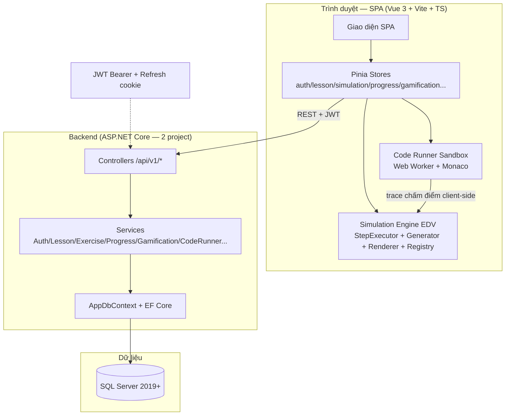
```mermaid
graph TB
    subgraph Client["Trình duyệt — SPA (Vue 3 + Vite + TS)"]
        UI[Giao diện SPA]
        STORE[Pinia Stores<br/>auth/lesson/simulation/progress/gamification...]
        ENGINES[Simulation Engine EDV<br/>StepExecutor + Generator + Renderer + Registry]
        CODE[Code Runner Sandbox<br/>Web Worker + Monaco]
        UI --> STORE
        STORE --> ENGINES
        STORE --> CODE
    end
    subgraph Server["Backend (ASP.NET Core — 2 project)"]
        API[Controllers /api/v1/*]
        SVC[Services<br/>Auth/Lesson/Exercise/Progress/Gamification/CodeRunner...]
        DB[AppDbContext + EF Core]
        API --> SVC
        SVC --> DB
    end
    subgraph Data["Dữ liệu"]
        SQL[(SQL Server 2019+)]
    end
    STORE -->|REST + JWT| API
    CODE -->|trace chấm điểm client-side| ENGINES
    DB --> SQL
    AUTH[JWT Bearer + Refresh cookie] -.-> API
```

**Bảng 4.1: Tổng hợp công nghệ theo lớp**

| Lớp | Công nghệ | Vai trò |
|---|---|---|
| Frontend | Vue 3 + Pinia + Vite + TypeScript | Giao diện SPA, quản lý trạng thái, chạy Simulation Engine EDV và Code Runner ngay trong trình duyệt |
| Backend | ASP.NET Core + EF Core | API REST `/api/v1`, xử lý nghiệp vụ trong Service, truy cập dữ liệu qua DbContext |
| CSDL | SQL Server 2019+ | Lưu trữ 32 bảng dữ liệu, lưu lịch sử chấm điểm |

Điểm công nghệ đáng chú ý: Simulation Engine EDV chạy phía client nên bước lùi miễn phí và sinh bước nhanh (NFR-2); Code Runner chấm code trong sandbox Web Worker, backend chỉ lưu lịch sử; phiên đăng nhập dùng JWT access token trong bộ nhớ kèm refresh cookie an toàn (ADR-004).

(nguồn: SDD §2, §3)

## 4.2 Thiết kế giao diện

### 4.2.1 Sitemap

Hệ thống có khoảng 32 màn chính (SDD §8.4 đặc tả đủ 33 route, gồm Màn 33 Khám phá). Sơ đồ luồng màn hình chính như sau:

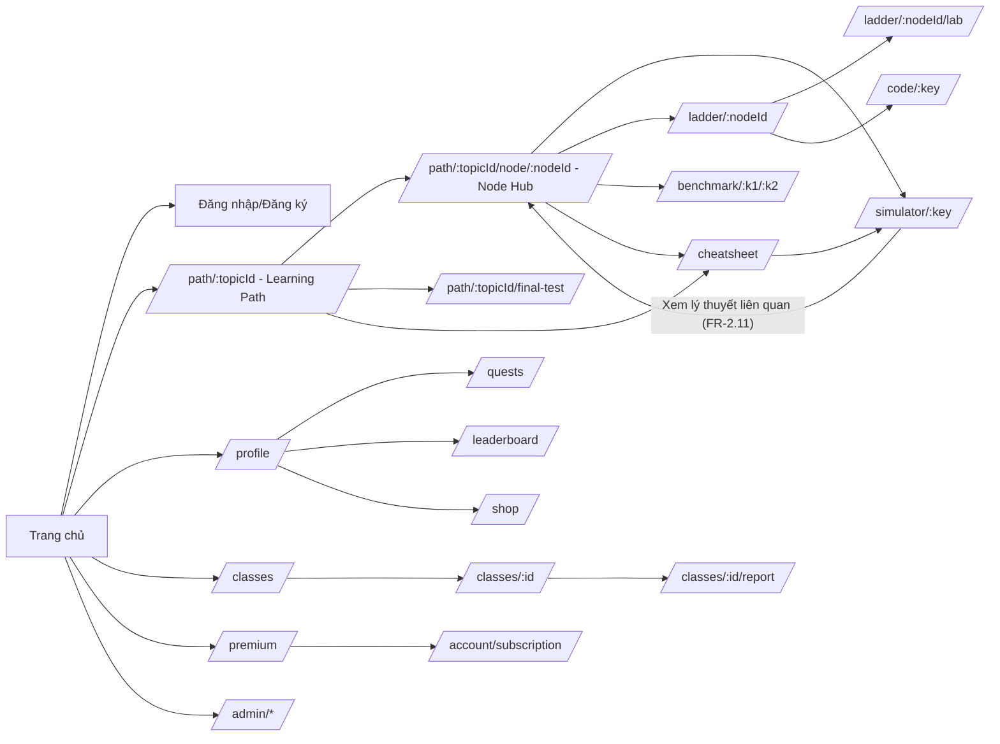
```mermaid
graph LR
    LANDING[Trang chủ] --> AUTH[Đăng nhập/Đăng ký]
    LANDING --> PATH[/path/:topicId - Learning Path/]
    PATH --> NODE[/path/:topicId/node/:nodeId - Node Hub/]
    NODE --> SIM[/simulator/:key/]
    NODE --> LADDER[/ladder/:nodeId/]
    LADDER --> LAB[/ladder/:nodeId/lab/]
    LADDER --> CODE[/code/:key/]
    NODE --> BENCH[/benchmark/:k1/:k2/]
    PATH --> FINAL[/path/:topicId/final-test/]
    PATH --> CHEAT[/cheatsheet/]
    CHEAT --> SIM
    NODE --> CHEAT
    SIM -->|"Xem lý thuyết liên quan (FR-2.11)"| NODE
    LANDING --> PROFILE[/profile/]
    PROFILE --> QUESTS[/quests/]
    PROFILE --> LEADER[/leaderboard/]
    PROFILE --> SHOP[/shop/]
    LANDING --> CLASSES[/classes/]
    CLASSES --> CLASSDETAIL[/classes/:id/]
    CLASSDETAIL --> CLASSREPORT[/classes/:id/report/]
    LANDING --> PREMIUM[/premium/]
    PREMIUM --> SUB[/account/subscription/]
    LANDING --> ADMIN[/admin/*/]
```

Mũi tên trong sơ đồ thể hiện đường đi chính của người dùng: khách ghé trang chủ rồi đăng ký, người học đi từ bản đồ lộ trình vào Node Hub rồi rẽ sang mô phỏng/luyện tập, giảng viên và quản trị viên đi vào nhóm màn riêng của vai trò. Các màn được nhóm theo chức năng như bảng dưới:

**Bảng 4.2: Nhóm màn theo chức năng**

| Nhóm | Màn | Số màn |
|---|---|---|
| Công khai | 01 Trang chủ, 02 Đăng nhập/Đăng ký, 12 Trợ giúp | 3 |
| Học tập | 03 Danh sách bài học (redirect), 04 Chi tiết bài học, 13 Learning Path, 18 CheatSheet, 30 Final Test, 31 Node Hub | 6 |
| Mô phỏng | 05 Simulator, 17 Benchmark Lab, 33 Khám phá | 3 |
| Luyện tập | 06 Bài tập trắc nghiệm, 07 Dự đoán bước (sáp nhập Bậc 2), 14 Practice Ladder, 15 Interactive Lab, 16 Code Runner | 5 |
| Gamification | 22 Shop, 23 Daily Quest, 24 Leaderboard, 25 Premium, 26 Checkout (modal), 27 Quản lý gói, 28 Modal Hết tim | 7 |
| Lớp học | 19 Danh sách lớp, 20 Chi tiết lớp, 21 Báo cáo lớp | 3 |
| Quản trị | 08 Dashboard (redirect), 09 Quản trị nội dung, 10 Quản lý người dùng, 11 Thống kê, 29 Chờ duyệt Teacher | 5 |
| Hồ sơ | 32 Hồ sơ cá nhân | 1 |

(nguồn: SDD §8.2, §8.4; SCREEN_MAP)

### 4.2.2 Layout

Giao diện dùng một hệ thống thiết kế thống nhất cho mọi màn: màu, font, cỡ chữ và bộ component dùng chung được định nghĩa một chỗ, không viết CSS rải rác.

**Bảng 4.3: Hệ thống thiết kế (design tokens)**

| Mục | Đặc tả |
|---|---|
| Ngôn ngữ | Tiếng Việt có dấu, mọi chuỗi nằm trong file i18n |
| Font | Inter/Roboto (fallback Segoe UI, Arial); mã giả dùng JetBrains Mono/Consolas |
| Cỡ chữ | Nội dung 14px, form 16px, tiêu đề 20/24/32px |
| Màu chủ đạo | Primary #2563EB, Secondary #0F172A, Success #16A34A, Warning #D97706, Danger #DC2626, Background #F8FAFC, Surface #FFFFFF |
| Màu trạng thái mô phỏng | default #CBD5E1, active #FACC15, highlight #FB923C, swap #EF4444, done #22C55E, error #B91C1C, muted #E2E8F0 |
| Bo góc/đổ bóng | Thẻ 8px, nút 6px; shadow nhẹ, modal 0 10px 25px |
| Component tự xây | Button, Input, Select, Modal, Toast, Table, Card, Tabs, Tooltip, Skeleton, EmptyState, Badge, ProgressBar, Drawer |
| Thư viện hỗ trợ | Icon lucide-vue-next, soạn thảo rich-text Quill, biểu đồ Chart.js |

Toàn bộ màn học được bọc trong App shell gồm header chung và sidebar trái theo vai trò. Header luôn hiển thị widget tim/gems/streak của người dùng. Menu khác nhau cho 3 vai trò:

**Bảng 4.4: Sidebar theo vai trò**

| Vai trò | Menu chính |
|---|---|
| Sinh viên | Lộ trình (/path), Khám phá (/simulations), Hồ sơ (/profile), Thử thách (/quests), Lớp học (/classes), Cửa hàng (/shop), Premium, Trợ giúp |
| Giảng viên | Lộ trình, Khám phá, Quản lý nội dung (/admin/*), Lớp học (/classes), Báo cáo (/reports), còn lại như Sinh viên |
| Quản trị viên | Người dùng (/admin/users), Nội dung (/admin/lessons), Cấu hình (/admin/settings), Thống kê (/admin/stats), còn lại như Giảng viên |

Hai route cũ `/learn` và `/dashboard` tự chuyển hướng sang `/path` và `/profile` để giữ một lối vào duy nhất.

(nguồn: SDD §8.1, §8.7)

### 4.2.3 Giao diện chức năng

Dưới đây là 12 màn hình chính của hệ thống, ảnh chụp từ ứng dụng thật (13/08/2026).

#### Màn 01 — Trang chủ


### 5.4.3 Sequence Diagram bổ sung

**(a) UC-03 — Đăng nhập và làm mới phiên (JWT + Refresh Token)**

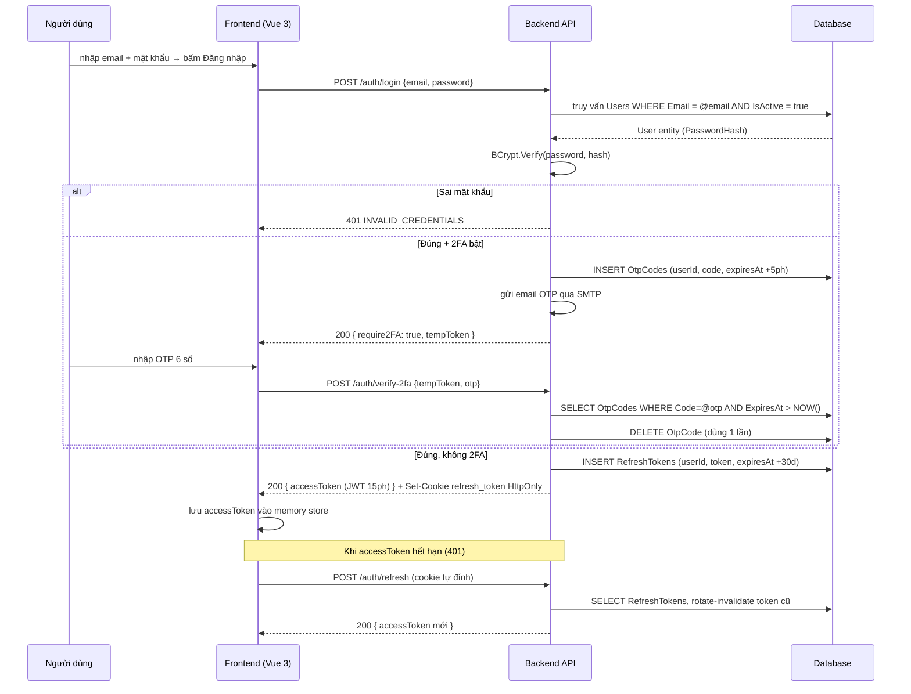
```mermaid
sequenceDiagram
    participant U as Người dùng
    participant SPA as Frontend (Vue 3)
    participant API as Backend API
    participant DB as Database

    U->>SPA: nhập email + mật khẩu → bấm Đăng nhập
    SPA->>API: POST /auth/login {email, password}
    API->>DB: truy vấn Users WHERE Email = @email AND IsActive = true
    DB-->>API: User entity (PasswordHash)
    API->>API: BCrypt.Verify(password, hash)
    alt Sai mật khẩu
        API-->>SPA: 401 INVALID_CREDENTIALS
    else Đúng + 2FA bật
        API->>DB: INSERT OtpCodes (userId, code, expiresAt +5ph)
        API->>API: gửi email OTP qua SMTP
        API-->>SPA: 200 { require2FA: true, tempToken }
        U->>SPA: nhập OTP 6 số
        SPA->>API: POST /auth/verify-2fa {tempToken, otp}
        API->>DB: SELECT OtpCodes WHERE Code=@otp AND ExpiresAt > NOW()
        API->>DB: DELETE OtpCode (dùng 1 lần)
    else Đúng, không 2FA
    end
    API->>DB: INSERT RefreshTokens (userId, token, expiresAt +30d)
    API-->>SPA: 200 { accessToken (JWT 15ph) } + Set-Cookie refresh_token HttpOnly
    SPA->>SPA: lưu accessToken vào memory store
    Note over SPA,API: Khi accessToken hết hạn (401)
    SPA->>API: POST /auth/refresh (cookie tự đính)
    API->>DB: SELECT RefreshTokens, rotate-invalidate token cũ
    API-->>SPA: 200 { accessToken mới }
```

*Hình 5.6: Sequence UC-03 — JWT access token 15 phút + rotate-invalidate refresh token 30 ngày; 2FA OTP 6 số qua email dùng một lần.*

**(b) UC-33 — Xác thực hai lớp (2FA OTP Email)**

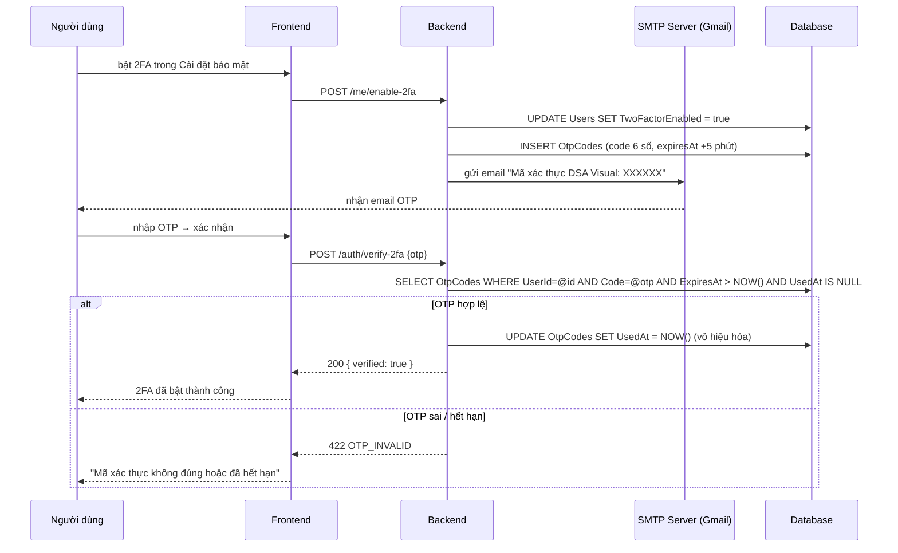
```mermaid
sequenceDiagram
    participant U as Người dùng
    participant SPA as Frontend
    participant API as Backend
    participant SMTP as SMTP Server (Gmail)
    participant DB as Database

    U->>SPA: bật 2FA trong Cài đặt bảo mật
    SPA->>API: POST /me/enable-2fa
    API->>DB: UPDATE Users SET TwoFactorEnabled = true
    API->>DB: INSERT OtpCodes (code 6 số, expiresAt +5 phút)
    API->>SMTP: gửi email "Mã xác thực DSA Visual: XXXXXX"
    SMTP-->>U: nhận email OTP
    U->>SPA: nhập OTP → xác nhận
    SPA->>API: POST /auth/verify-2fa {otp}
    API->>DB: SELECT OtpCodes WHERE UserId=@id AND Code=@otp AND ExpiresAt > NOW() AND UsedAt IS NULL
    alt OTP hợp lệ
        API->>DB: UPDATE OtpCodes SET UsedAt = NOW() (vô hiệu hóa)
        API-->>SPA: 200 { verified: true }
        SPA-->>U: 2FA đã bật thành công
    else OTP sai / hết hạn
        API-->>SPA: 422 OTP_INVALID
        SPA-->>U: "Mã xác thực không đúng hoặc đã hết hạn"
    end
```

*Hình 5.7: Sequence UC-33 — OTP 6 số TTL 5 phút, dùng một lần (UsedAt đánh dấu), lưu bảng OtpCodes (33 cột ghi trong SDD §7.3.33).*

**(c) UC-04 ��� Xem chi tiết bài học và đánh dấu đã học**

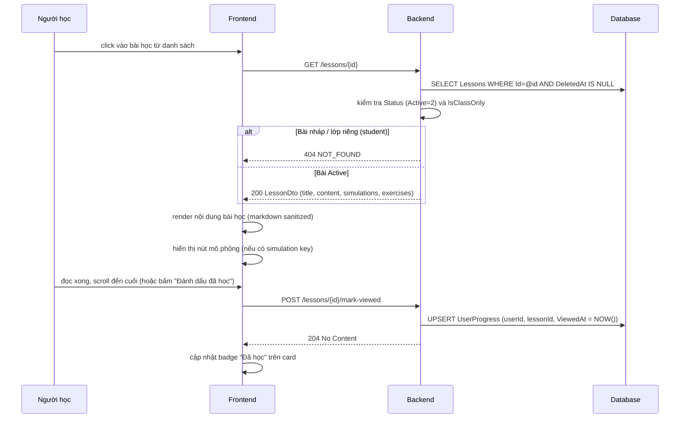
```mermaid
sequenceDiagram
    participant U as Người học
    participant SPA as Frontend
    participant API as Backend
    participant DB as Database

    U->>SPA: click vào bài học từ danh sách
    SPA->>API: GET /lessons/{id}
    API->>DB: SELECT Lessons WHERE Id=@id AND DeletedAt IS NULL
    API->>API: kiểm tra Status (Active=2) và IsClassOnly
    alt Bài nháp / lớp riêng (student)
        API-->>SPA: 404 NOT_FOUND
    else Bài Active
        API-->>SPA: 200 LessonDto (title, content, simulations, exercises)
    end
    SPA->>SPA: render nội dung bài học (markdown sanitized)
    SPA->>SPA: hiển thị nút mô phỏng (nếu có simulation key)
    U->>SPA: đọc xong, scroll đến cuối (hoặc bấm "Đánh dấu đã học")
    SPA->>API: POST /lessons/{id}/mark-viewed
    API->>DB: UPSERT UserProgress (userId, lessonId, ViewedAt = NOW())
    API-->>SPA: 204 No Content
    SPA->>SPA: cập nhật badge "Đã học" trên card
```

*Hình 5.8: Sequence UC-04 — guard S6 tại backend ngăn student xem bài Draft/ClassOnly; mark-viewed là upsert idempotent.*

**(d) UC-25 — Vào node Learning Path và trừ tim atomic**

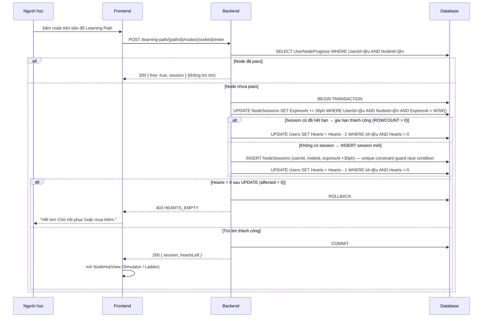
```mermaid
sequenceDiagram
    participant U as Người học
    participant SPA as Frontend
    participant API as Backend
    participant DB as Database

    U->>SPA: bấm node trên bản đồ Learning Path
    SPA->>API: POST /learning-path/{pathId}/nodes/{nodeId}/enter
    API->>DB: SELECT UserNodeProgress WHERE UserId=@u AND NodeId=@n
    alt Node đã pass
        API-->>SPA: 200 { free: true, session } (không trừ tim)
    else Node chưa pass
        API->>DB: BEGIN TRANSACTION
        API->>DB: UPDATE NodeSessions SET ExpiresAt += 30ph WHERE UserId=@u AND NodeId=@n AND ExpiresAt < NOW()
        alt Session cũ đã hết hạn → gia hạn thành công (ROWCOUNT > 0)
            API->>DB: UPDATE Users SET Hearts = Hearts - 1 WHERE Id=@u AND Hearts > 0
        else Không có session → INSERT session mới
            API->>DB: INSERT NodeSessions (userId, nodeId, expiresAt +30ph) — unique constraint guard race condition
            API->>DB: UPDATE Users SET Hearts = Hearts - 1 WHERE Id=@u AND Hearts > 0
        end
        alt Hearts = 0 sau UPDATE (affected = 0)
            API->>DB: ROLLBACK
            API-->>SPA: 403 HEARTS_EMPTY
            SPA-->>U: "Hết tim! Chờ hồi phục hoặc mua thêm."
        else Trừ tim thành công
            API->>DB: COMMIT
            API-->>SPA: 200 { session, heartsLeft }
            SPA->>SPA: mở NodeHubView (Simulator / Ladder)
        end
    end
```

*Hình 5.9: Sequence UC-25 — trừ tim atomic trong 1 transaction; 2 request song song chỉ trừ 1 lần nhờ unique constraint NodeSessions(UserId, NodeId).*

**(e) UC-26 — Practice Ladder 3 bậc (Quiz → Lab → Code)**

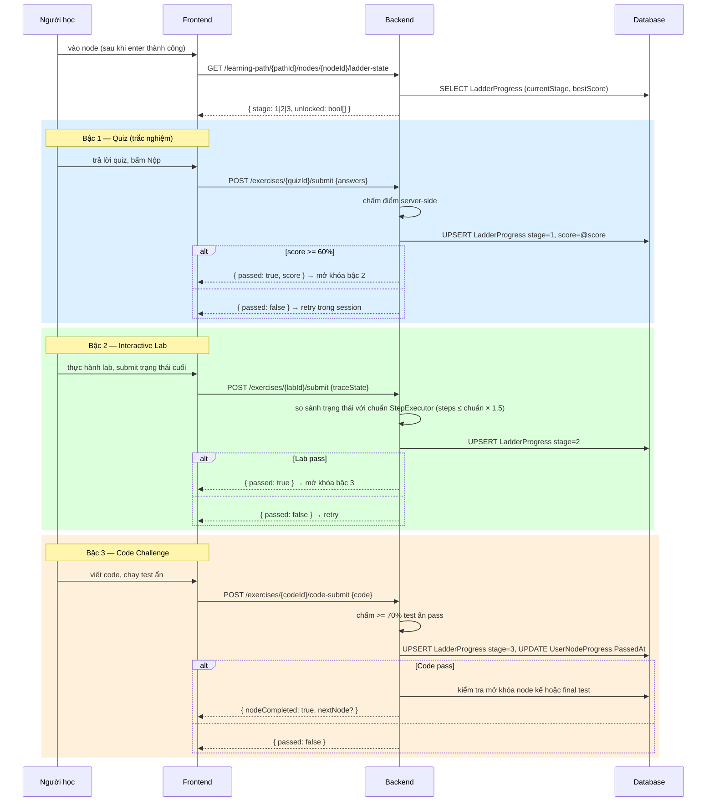
```mermaid
sequenceDiagram
    participant U as Người học
    participant SPA as Frontend
    participant API as Backend
    participant DB as Database

    U->>SPA: vào node (sau khi enter thành công)
    SPA->>API: GET /learning-path/{pathId}/nodes/{nodeId}/ladder-state
    API->>DB: SELECT LadderProgress (currentStage, bestScore)
    API-->>SPA: { stage: 1|2|3, unlocked: bool[] }

    rect rgb(220,240,255)
        Note over U,SPA: Bậc 1 — Quiz (trắc nghiệm)
        U->>SPA: trả lời quiz, bấm Nộp
        SPA->>API: POST /exercises/{quizId}/submit {answers}
        API->>API: chấm điểm server-side
        API->>DB: UPSERT LadderProgress stage=1, score=@score
        alt score >= 60%
            API-->>SPA: { passed: true, score } → mở khóa bậc 2
        else
            API-->>SPA: { passed: false } → retry trong session
        end
    end

    rect rgb(220,255,220)
        Note over U,SPA: Bậc 2 — Interactive Lab
        U->>SPA: thực hành lab, submit trạng thái cuối
        SPA->>API: POST /exercises/{labId}/submit {traceState}
        API->>API: so sánh trạng thái với chuẩn StepExecutor (steps ≤ chuẩn × 1.5)
        API->>DB: UPSERT LadderProgress stage=2
        alt Lab pass
            API-->>SPA: { passed: true } → mở khóa bậc 3
        else
            API-->>SPA: { passed: false } → retry
        end
    end

    rect rgb(255,240,220)
        Note over U,SPA: Bậc 3 — Code Challenge
        U->>SPA: viết code, chạy test ẩn
        SPA->>API: POST /exercises/{codeId}/code-submit {code}
        API->>API: chấm >= 70% test ẩn pass
        API->>DB: UPSERT LadderProgress stage=3, UPDATE UserNodeProgress.PassedAt
        alt Code pass
            API->>DB: kiểm tra mở khóa node kế hoặc final test
            API-->>SPA: { nodeCompleted: true, nextNode? }
        else
            API-->>SPA: { passed: false }
        end
    end
```

*Hình 5.10: Sequence UC-26 — Practice Ladder 3 bậc tuần tự; server guard chặn vào bậc sau khi chưa pass bậc trước; điểm node = Quiz 20% + Lab 30% + Code 50%.*

**(f) UC-09 — Giảng viên tạo và publish bài học**

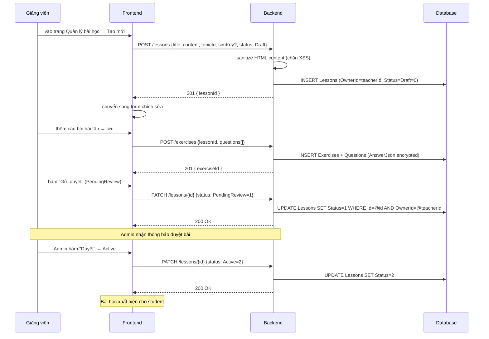
```mermaid
sequenceDiagram
    participant GV as Giảng viên
    participant SPA as Frontend
    participant API as Backend
    participant DB as Database

    GV->>SPA: vào trang Quản lý bài học → Tạo mới
    SPA->>API: POST /lessons {title, content, topicId, simKey?, status: Draft}
    API->>API: sanitize HTML content (chặn XSS)
    API->>DB: INSERT Lessons (OwnerId=teacherId, Status=Draft=0)
    API-->>SPA: 201 { lessonId }
    SPA->>SPA: chuyển sang form chỉnh sửa

    GV->>SPA: thêm câu hỏi bài tập → lưu
    SPA->>API: POST /exercises {lessonId, questions[]}
    API->>DB: INSERT Exercises + Questions (AnswerJson encrypted)
    API-->>SPA: 201 { exerciseId }

    GV->>SPA: bấm "Gửi duyệt" (PendingReview)
    SPA->>API: PATCH /lessons/{id} {status: PendingReview=1}
    API->>DB: UPDATE Lessons SET Status=1 WHERE Id=@id AND OwnerId=@teacherId
    API-->>SPA: 200 OK

    Note over GV,API: Admin nhận thông báo duyệt bài
    GV->>SPA: Admin bấm "Duyệt" → Active
    SPA->>API: PATCH /lessons/{id} {status: Active=2}
    API->>DB: UPDATE Lessons SET Status=2
    API-->>SPA: 200 OK
    Note over SPA: Bài học xuất hiện cho student
```

*Hình 5.11: Sequence UC-09 — bài học qua 3 trạng thái Draft → PendingReview → Active; OwnerId đảm bảo chỉ teacher sở hữu mới sửa được.*

**(g) UC-12 — Admin phê duyệt tài khoản giảng viên**

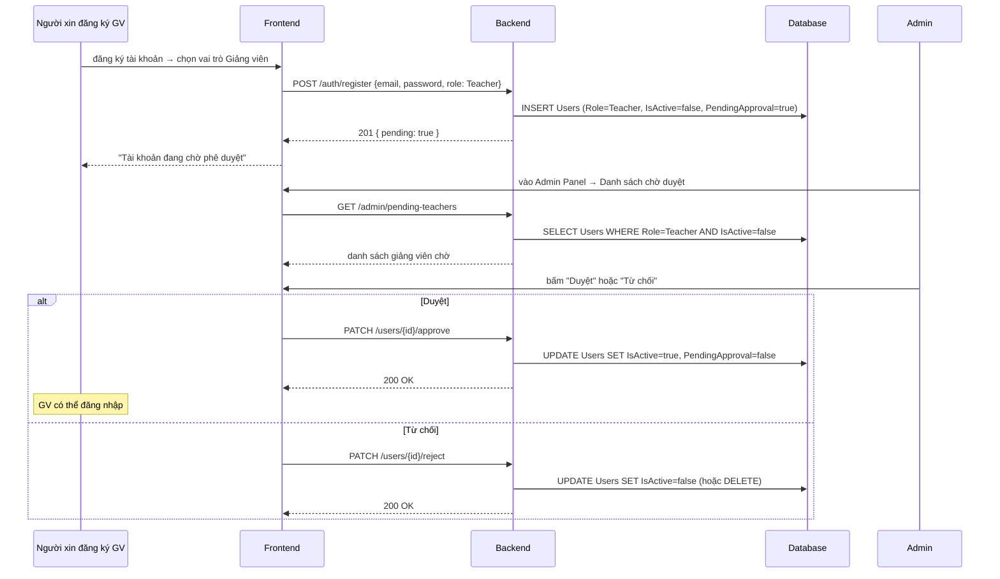
```mermaid
sequenceDiagram
    participant GV as Người xin đăng ký GV
    participant SPA as Frontend
    participant API as Backend
    participant DB as Database
    participant ADM as Admin

    GV->>SPA: đăng ký tài khoản → chọn vai trò Giảng viên
    SPA->>API: POST /auth/register {email, password, role: Teacher}
    API->>DB: INSERT Users (Role=Teacher, IsActive=false, PendingApproval=true)
    API-->>SPA: 201 { pending: true }
    SPA-->>GV: "Tài khoản đang chờ phê duyệt"

    ADM->>SPA: vào Admin Panel → Danh sách chờ duyệt
    SPA->>API: GET /admin/pending-teachers
    API->>DB: SELECT Users WHERE Role=Teacher AND IsActive=false
    API-->>SPA: danh sách giảng viên chờ

    ADM->>SPA: bấm "Duyệt" hoặc "Từ chối"
    alt Duyệt
        SPA->>API: PATCH /users/{id}/approve
        API->>DB: UPDATE Users SET IsActive=true, PendingApproval=false
        API-->>SPA: 200 OK
        Note over GV: GV có thể đăng nhập
    else Từ chối
        SPA->>API: PATCH /users/{id}/reject
        API->>DB: UPDATE Users SET IsActive=false (hoặc DELETE)
        API-->>SPA: 200 OK
    end
```

*Hình 5.12: Sequence UC-12 — Teacher mới mặc định IsActive=false; Admin phê duyệt là gate duy nhất để Teacher có thể đăng nhập.*

**(h) UC-15 — Khôi phục mật khẩu qua email**

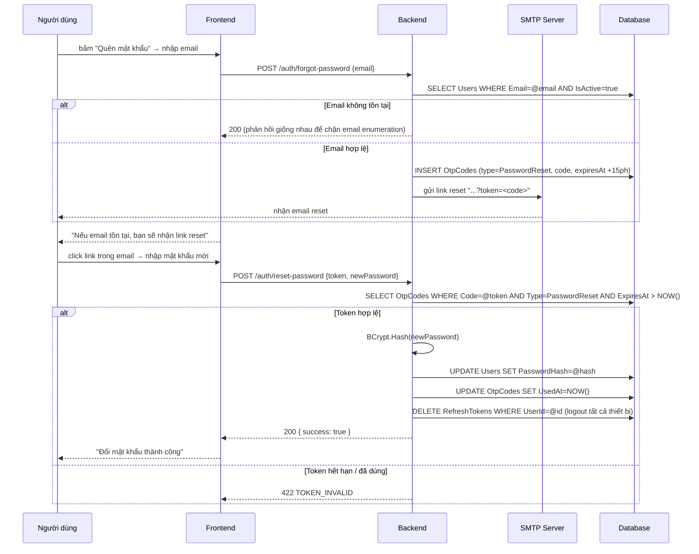
```mermaid
sequenceDiagram
    participant U as Người dùng
    participant SPA as Frontend
    participant API as Backend
    participant SMTP as SMTP Server
    participant DB as Database

    U->>SPA: bấm "Quên mật khẩu" → nhập email
    SPA->>API: POST /auth/forgot-password {email}
    API->>DB: SELECT Users WHERE Email=@email AND IsActive=true
    alt Email không tồn tại
        API-->>SPA: 200 (phản hồi giống nhau để chặn email enumeration)
    else Email hợp lệ
        API->>DB: INSERT OtpCodes (type=PasswordReset, code, expiresAt +15ph)
        API->>SMTP: gửi link reset "...?token=<code>"
        SMTP-->>U: nhận email reset
    end
    SPA-->>U: "Nếu email tồn tại, bạn sẽ nhận link reset"

    U->>SPA: click link trong email → nhập mật khẩu mới
    SPA->>API: POST /auth/reset-password {token, newPassword}
    API->>DB: SELECT OtpCodes WHERE Code=@token AND Type=PasswordReset AND ExpiresAt > NOW()
    alt Token hợp lệ
        API->>API: BCrypt.Hash(newPassword)
        API->>DB: UPDATE Users SET PasswordHash=@hash
        API->>DB: UPDATE OtpCodes SET UsedAt=NOW()
        API->>DB: DELETE RefreshTokens WHERE UserId=@id (logout tất cả thiết bị)
        API-->>SPA: 200 { success: true }
        SPA-->>U: "Đổi mật khẩu thành công"
    else Token hết hạn / đã dùng
        API-->>SPA: 422 TOKEN_INVALID
    end
```

*Hình 5.13: Sequence UC-15 — anti-enumeration (cùng response 200 dù email không tồn tại); đổi mật khẩu revoke toàn bộ refresh token.*

### 5.4.4 Activity Diagram bổ sung

**(a) Luồng đăng ký tài khoản**

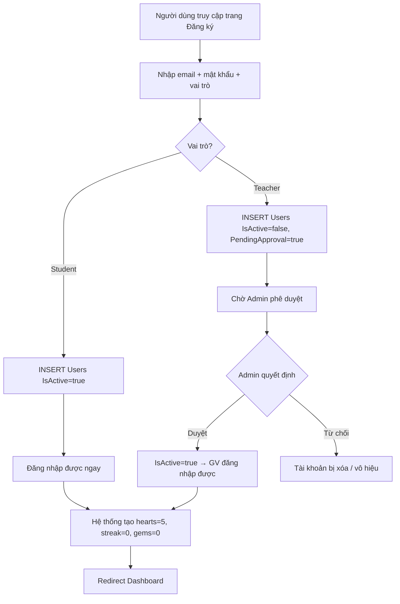
```mermaid
flowchart TD
    A[Người dùng truy cập trang Đăng ký] --> B[Nhập email + mật khẩu + vai trò]
    B --> C{Vai trò?}
    C -->|Student| D[INSERT Users IsActive=true]
    C -->|Teacher| E[INSERT Users IsActive=false, PendingApproval=true]
    D --> F[Đăng nhập được ngay]
    E --> G[Chờ Admin phê duyệt]
    G --> H{Admin quyết định}
    H -->|Duyệt| I[IsActive=true → GV đăng nhập được]
    H -->|Từ chối| J[Tài khoản bị xóa / vô hiệu]
    F --> K[Hệ thống tạo hearts=5, streak=0, gems=0]
    I --> K
    K --> L[Redirect Dashboard]
```

*Hình 5.14: Activity diagram đăng ký — Student active ngay; Teacher cần Admin duyệt; hệ thống khởi tạo gamification khi active.*

**(b) Luồng mua gói Premium và vật phẩm (Shop/Gems)**

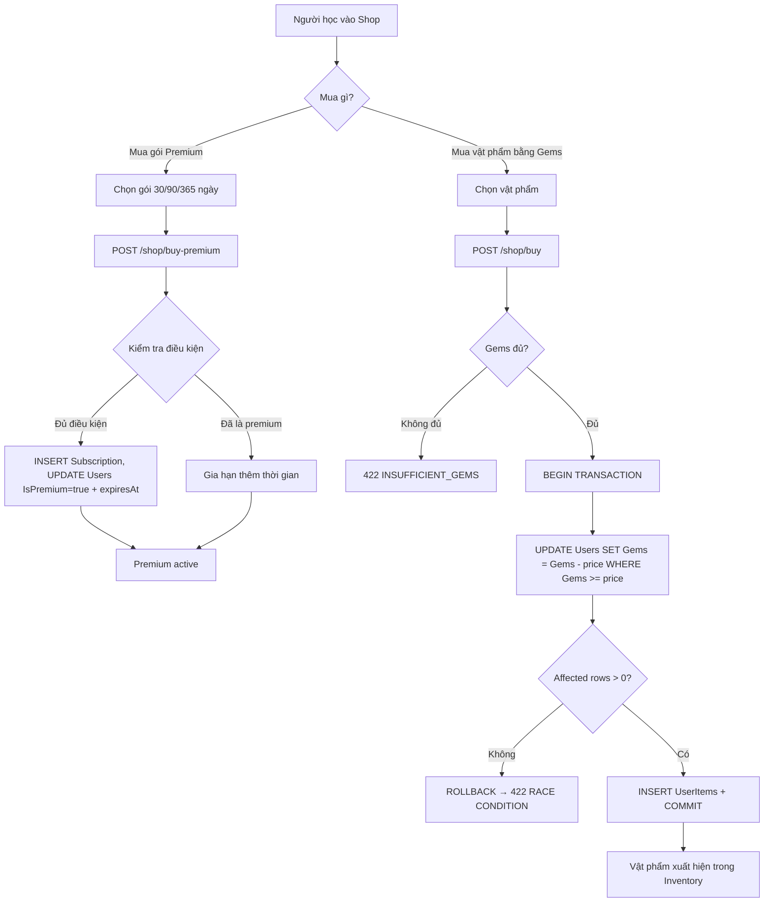
```mermaid
flowchart TD
    A[Người học vào Shop] --> B{Mua gì?}
    B -->|Mua gói Premium| C[Chọn gói 30/90/365 ngày]
    B -->|Mua vật phẩm bằng Gems| D[Chọn vật phẩm]

    C --> E[POST /shop/buy-premium]
    E --> F{Kiểm tra điều kiện}
    F -->|Đủ điều kiện| G[INSERT Subscription, UPDATE Users IsPremium=true + expiresAt]
    F -->|Đã là premium| H[Gia hạn thêm thời gian]
    G --> I[Premium active]
    H --> I

    D --> J[POST /shop/buy]
    J --> K{Gems đủ?}
    K -->|Không đủ| L[422 INSUFFICIENT_GEMS]
    K -->|Đủ| M[BEGIN TRANSACTION]
    M --> N[UPDATE Users SET Gems = Gems - price WHERE Gems >= price]
    N --> O{Affected rows > 0?}
    O -->|Không| P[ROLLBACK → 422 RACE CONDITION]
    O -->|Có| Q[INSERT UserItems + COMMIT]
    Q --> R[Vật phẩm xuất hiện trong Inventory]
```

*Hình 5.15: Activity diagram Shop — mua Premium gia hạn cộng dồn; mua item dùng gems atomic check tại DB để chống race condition.*

**(c) Luồng chấm điểm bài tập trắc nghiệm**

```mermaid
flowchart TD
    A[POST /exercises/id/submit] --> B[Guard: Answers null/empty?]
    B -->|Null/empty| C[422 VALIDATION_FAILED]
    B -->|Có đáp án| D[Khóa chống nộp trùng: SELECT ExerciseSubmissions WHERE UserId+ExerciseId+completedAt IS NULL]
    D -->|Đang nộp| E[422 SUBMISSION_IN_PROGRESS]
    D -->|Hợp lệ| F[INSERT ExerciseSubmissions pending]

    F --> G[Với mỗi câu hỏi]
    G --> H{Loại câu hỏi?}
    H -->|SINGLE| I[So sánh 1 đáp án chọn với CorrectAnswer]
    H -->|MULTI| J[So sánh Set đáp án chọn với CorrectAnswer set]
    H -->|BOOLEAN| K[true/false so khớp]

    I & J & K --> L[Tính điểm = số đúng / tổng × 100]
    L --> M[UPDATE ExerciseSubmissions completedAt + score]
    M --> N[UPSERT UserProgress BestScore = MAX hiện tại, new]
    N --> O[Response: score + results[] + explanations[]]
```

*Hình 5.16: Activity diagram chấm điểm — 3 loại câu hỏi SINGLE/MULTI/BOOLEAN; anti-duplicate tại DB; BestScore là MAX lịch sử.*

**(d) Luồng phê duyệt giảng viên (Admin workflow)**

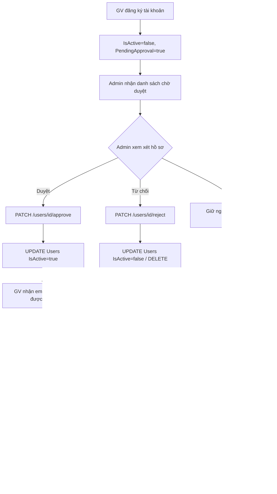
```mermaid
flowchart TD
    A[GV đăng ký tài khoản] --> B[IsActive=false, PendingApproval=true]
    B --> C[Admin nhận danh sách chờ duyệt]
    C --> D{Admin xem xét hồ sơ}
    D -->|Duyệt| E[PATCH /users/id/approve]
    D -->|Từ chối| F[PATCH /users/id/reject]
    D -->|Bỏ qua| G[Giữ nguyên trạng thái pending]

    E --> H[UPDATE Users IsActive=true]
    H --> I[GV nhận email thông báo được duyệt]
    I --> J[GV đăng nhập và tạo bài học]

    F --> K[UPDATE Users IsActive=false / DELETE]
    K --> L[GV nhận email thông báo từ chối]

    J --> M[Tạo bài Draft]
    M --> N[Gửi duyệt PendingReview]
    N --> O[Admin duyệt bài → Active]
    O --> P[Bài học xuất hiện cho Student]
```

*Hình 5.17: Activity diagram phê duyệt giảng viên — 2 lớp duyệt: tài khoản GV và bài học GV tạo.*
