<!-- Khu vực logo trường: chèn logo Trường Cao Đẳng Thực Hành FPT tại đây -->

TRƯỜNG CAO ĐẲNG THỰC HÀNH FPT

---

**BÁO CÁO ĐỒ ÁN TỐT NGHIỆP**

**HỆ THỐNG HỖ TRỢ HỌC TẬP VÀ TRỰC QUAN HÓA CẤU TRÚC DỮ LIỆU VÀ GIẢI THUẬT (DSA-VISUAL)**

Ngành: Ứng dụng phần mềm

Giảng viên hướng dẫn: Phạm Ngọc Ái Liên

Lớp: SD21361

**Danh sách thành viên thực hiện**

| Mã SV | Họ và tên | Vai trò | Nhiệm vụ chính |
|---|---|---|---|
| TD01287 | Mai Tiểu Bảo | Trưởng nhóm | Backend ASP.NET Core + CSDL (task khó ưu tiên) |
| TD01282 | Thái Quang Sơn | Thành viên | Frontend Vue 3 + giao diện (task khó ưu tiên) |
| TD01131 | Huỳnh Lê Minh Thư | Thành viên | Simulation Engine (code) + Kiểm thử |
| TD01261 | Trần Viết Tâm Phúc | Thành viên | Code hỗ trợ (đơn giản) + Tài liệu + triển khai |

TP.HCM, ngày 12 tháng 8 năm 2026

Ngày bảo vệ: …………………………………………

---

TRƯỜNG CAO ĐẲNG THỰC HÀNH FPT

```{=openxml}
<w:p><w:r><w:br w:type="page"/></w:r></w:p>
```

# LỜI MỞ ĐẦU

Cấu trúc dữ liệu và giải thuật (DSA) là nền tảng của ngành công nghệ thông tin, nhưng cũng là môn học sinh viên gặp nhiều khó khăn nhất trong giai đoạn đầu. Các khái niệm như danh sách liên kết, cây, bảng băm hay các giải thuật sắp xếp, tìm kiếm rất trừu tượng: sinh viên khó hình dung dữ liệu được tổ chức thế nào trong bộ nhớ và giải thuật thao tác ra sao qua từng bước. Sách và giáo trình chỉ cung cấp hình tĩnh và mã nguồn, khiến việc học chủ yếu diễn ra thụ động, thiếu phản hồi trực quan và thiếu luyện tập chủ động.

Từ nhu cầu đó, nhóm gồm 4 sinh viên lớp SD21361 đã xây dựng Hệ thống hỗ trợ học tập và trực quan hóa cấu trúc dữ liệu và giải thuật (DSA-Visual) — ứng dụng web giúp sinh viên hiểu sâu DSA qua mô phỏng hoạt ảnh từng bước, bài tập tự chấm và theo dõi tiến độ cá nhân. Điểm cốt lõi là cơ chế EDV (Execution-Driven Visualization): mọi giải thuật là mã thật chạy qua StepExecutor, hoạt ảnh là phát lại bản ghi (trace) thật của quá trình thực thi, không hardcode.

Đây là lần thứ hai nhóm viết báo cáo đồ án, và nhóm đã rút ra bài học rõ ràng từ bản báo cáo trước bị hội đồng góp ý: hoạt ảnh hardcode nên không chạy được cho mọi đoạn code; màn hình gộp quá nhiều chức năng khiến người dùng rối; phạm vi dự án trôi dạt sang tính năng ngoài tầm đồ án; báo cáo có số liệu chưa kiểm chứng và danh sách thành viên không chính xác. Báo cáo này khắc phục cả bốn vấn đề: mọi nội dung được truy ngược về tài liệu thiết kế (SRS, SDD, API, kiểm thử), số liệu chưa đo được ghi rõ là chờ hoàn tất kiểm thử, thông tin thành viên xác nhận đúng 4 người thật sự tham gia.

Báo cáo gồm 7 phần. Phần 1 giới thiệu đề tài và ban dự án. Phần 2 trình bày khảo sát các hệ thống tương tự và kế hoạch dự án. Phần 3 mô tả phân tích yêu cầu hệ thống (mô hình triển khai, sơ đồ use case, đặc tả yêu cầu). Phần 4 trình bày thiết kế công nghệ, giao diện, dữ liệu và phần mềm. Phần 5 mô tả quá trình thực hiện. Phần 6 báo cáo kết quả kiểm thử. Phần 7 mô tả đóng gói và triển khai. Cuối báo cáo là Kết luận và hướng phát triển, Tài liệu tham khảo và 4 phụ lục hỗ trợ (hướng dẫn cài đặt môi trường, phím tắt và thuật ngữ, thư viện bên thứ ba, danh mục mô phỏng).

(nguồn: PRODUCTION_PROMPT §0.5; SRS §1.2)

# PHẦN 1: GIỚI THIỆU ĐỀ TÀI

## 1.1 Giới thiệu dự án

Sinh viên ngành công nghệ thông tin khi học môn Cấu trúc dữ liệu và giải thuật gặp 3 khó khăn điển hình:

1. **Trừu tượng**: khó hình dung cách dữ liệu được tổ chức trong bộ nhớ (liên kết, con trỏ, chỉ số) và cách giải thuật thao tác trên dữ liệu.
2. **Thiếu phản hồi trực quan**: sách và giáo trình chỉ có hình tĩnh và mã; sinh viên không thấy chuyển động từng bước, không thấy lý do vì sao giải thuật hoạt động như vậy.
3. **Thiếu luyện tập chủ động**: sinh viên không được thực hành dự đoán kết quả từng bước — kỹ năng quan trọng nhất để hiểu sâu giải thuật.

DSA-Visual giải quyết bằng: (a) mô phỏng từng bước mọi thao tác trên CTDL/GT theo cơ chế EDV (mã thật chạy, trace phát lại); (b) đồng bộ trực quan – mã giả – giải thích trong cùng một màn hình; (c) Practice Ladder 3 bậc với bài tập dự đoán chấm tự động; (d) theo dõi tiến độ cá nhân và báo cáo cho giảng viên.

Mục tiêu dự án được đo lường bằng 8 KPI G1-G8 (Bảng 1.1).

**Bảng 1.1: Mục tiêu dự án (KPI G1-G8)**

| Mã | Mục tiêu | Giá trị mục tiêu |
|---|---|---|
| G1 | Phủ nội dung học tập | ≥ 10 cấu trúc dữ liệu có mô phỏng |
| G2 | Phủ giải thuật | ≥ 14 giải thuật có mô phỏng (thiết kế: 15) |
| G3 | Mức độ sử dụng | ≥ 80% sinh viên trong lớp đăng ký và truy cập ≥ 1 lần/tuần |
| G4 | Hiệu quả học tập | Điểm trung bình kiểm tra chương của lớp ≥ 7.0/10 |
| G5 | Sự hài lòng | Điểm khảo sát UX (thang 5) ≥ 4.0/5 |
| G6 | Độ ổn định | Uptime giai đoạn thí điểm 4 tuần ≥ 99.5% |
| G7 | Hiệu năng | Thời gian phản hồi API p95 ≤ 800ms |
| G8 | Độ mượt mô phỏng | FPS khi mô phỏng ≥ 55 fps |

Ghi chú: G3 và G5 đo trên người dùng có đủ Tim/Premium theo thiết kế; G4 đo ngoài hệ thống (điểm kiểm tra chương do giảng viên chấm).

(nguồn: SRS §2.1, §2.2)

## 1.2 Ban dự án

Dự án do 4 thành viên lớp SD21361 thực hiện (Bảng 1.2). Đây là danh sách đã được xác nhận, không có thành viên nào ngoài danh sách này.

**Bảng 1.2: Danh sách thành viên và phân công**

| Mã SV | Họ và tên | Vai trò | Nhiệm vụ chính |
|---|---|---|---|
| TD01287 | Mai Tiểu Bảo | Trưởng nhóm | Backend ASP.NET Core + CSDL (task khó ưu tiên) |
| TD01282 | Thái Quang Sơn | Thành viên | Frontend Vue 3 + giao diện (task khó ưu tiên) |
| TD01131 | Huỳnh Lê Minh Thư | Thành viên | Simulation Engine (code) + Kiểm thử |
| TD01261 | Trần Viết Tâm Phúc | Thành viên | Code hỗ trợ (đơn giản) + Tài liệu + triển khai |

Vai trò chuyên môn của từng thành viên:

- Mai Tiểu Bảo (Trưởng nhóm): chịu trách nhiệm kiến trúc backend ASP.NET Core và cơ sở dữ liệu, nhận các task khó ưu tiên, điều phối tiến độ chung của nhóm.
- Thái Quang Sơn: phụ trách frontend Vue 3 và toàn bộ giao diện người dùng, xây dựng các màn hình học tập, mô phỏng, luyện tập theo thiết kế, nhận các task khó ưu tiên.
- Huỳnh Lê Minh Thư: phụ trách Simulation Engine (viết code generator, renderer cho cơ chế EDV) và kiểm thử hệ thống.
- Trần Viết Tâm Phúc: hỗ trợ code các phần đơn giản, phụ trách viết tài liệu và triển khai hệ thống.

(nguồn: SRS §2.4; SDD §1.5)

# PHẦN 2: KHẢO SÁT – SURVEY

## 2.1 Yêu cầu của khách hàng

Trước khi đặc tả yêu cầu, nhóm khảo sát 3 hệ thống trực quan hóa DSA phổ biến hiện nay:

- **VisuAlgo**: bộ minh họa giải thuật của Đại học Quốc gia Singapore (NUS), mô phỏng nhiều CTDL/GT, có bài tập quiz.
- **USFCA DS Visualizations**: bộ mô phỏng của Đại học San Francisco (Mỹ), mã nguồn mở, giao diện đơn giản.
- **Algorithm-Visualizer**: nền tảng cộng đồng, cho phép xem trực quan hóa từ mã nguồn do người dùng đóng góp.

Kết quả so sánh theo 9 tiêu chí được trình bày ở Bảng 2.1.

**Bảng 2.1: So sánh hệ thống tương tự**

| Tiêu chí | VisuAlgo | USFCA | Algorithm-Visualizer | DSA-Visual (đề xuất) |
|---|---|---|---|---|
| Ngôn ngữ giao diện | Tiếng Anh | Tiếng Anh | Tiếng Anh | Tiếng Việt |
| Mô phỏng từng bước | Có | Có | Có | Có |
| Giải thích bằng lời | Có (tùy chọn) | Hạn chế | Hạn chế | Bắt buộc mỗi bước |
| Mã giả đồng bộ | Có | Không | Có | Có (mã thật EDV) |
| Bài tập dự đoán bước | Có (quiz) | Không | Không | Có (Interactive Lab) |
| Theo dõi tiến độ cá nhân | Không | Không | Không | Có |
| Giảng viên biên soạn nội dung | Không | Không | Không | Có |
| So sánh đo thật với lý thuyết | Không | Không | Không | Có (Benchmark Lab) |
| Mã nguồn mở | Một phần | Có | Có | Nội bộ |

Kết luận khảo sát: 3 hệ thống trên đều mạnh về mô phỏng từng bước nhưng chưa đáp ứng đủ nhu cầu học tập tại trường. Từ đó, nhóm xác định 6 yêu cầu cốt lõi cho DSA-Visual: (1) đồng bộ 3 vùng trực quan – mã giả – giải thích từ trace thật (EDV); (2) hệ thống bài tập tự chấm theo Practice Ladder 3 bậc; (3) theo dõi tiến độ cá nhân và báo cáo cho giảng viên; (4) giảng viên tự biên soạn nội dung; (5) Benchmark so sánh số liệu đo thật với lý thuyết; (6) giao diện tiếng Việt.

Yêu cầu chức năng (FR) của hệ thống gồm 10 nhóm chức năng (Bảng 2.2). Trong quá trình duyệt, 12 FR đã được cắt để giữ phạm vi đúng tầm đồ án (không cổng thanh toán thật, không realtime, không online judge tự do).

**Bảng 2.2: Tóm tắt yêu cầu chức năng theo nhóm**

| Nhóm chức năng | Chức năng chính | FR tiêu biểu |
|---|---|---|
| Tài khoản | Đăng ký, đăng nhập, đổi/khôi phục mật khẩu, phê duyệt giảng viên | FR-1.1 đến FR-1.9 |
| Học tập | Quản lý chủ đề, bài học, Learning Path, ghi chú cá nhân | FR-2.1 đến FR-2.11 |
| Mô phỏng | Danh mục mô phỏng, hiển thị 3 vùng đồng bộ, điều khiển, Benchmark Lab | FR-3.1 đến FR-3.20b |
| Luyện tập | Practice Ladder 3 bậc, kiểm tra cuối lộ trình | FR-4.1 đến FR-4.12 |
| Tiến độ và báo cáo | Ghi nhận tiến độ, dashboard cá nhân, báo cáo giảng viên | FR-5.1 đến FR-5.5 |
| Quản trị | Quản lý người dùng, thống kê, cấu hình hệ thống | FR-5.4, FR-6.2 |
| Trang phụ trợ | Trang chủ, 3 demo công khai, FAQ, đánh giá nội dung | FR-7.1 đến FR-7.6 |
| Lớp học phần | Tạo lớp, quản lý sinh viên, gán nội dung và hạn nộp, báo cáo theo lớp | FR-8.1 đến FR-8.4 |
| Code Runner | Soạn mã nhúng, chạy mã kèm trực quan hóa, sandbox an toàn | FR-9.1 đến FR-9.6 |
| Gamification và Premium | Tim, Gems Shop, Daily Quest, Streak, XP/Level, Leaderboard, Premium | FR-10.1 đến FR-10.7 |

Yêu cầu phi chức năng (NFR) tóm tắt theo 8 nhóm:

- **Hiệu năng (NFR-1 đến NFR-7)**: API phản hồi p95 ≤ 800ms; sinh chuỗi bước mô phỏng mảng 100 phần tử ≤ 500ms; ≥ 55 FPS khi điều hướng bước; tải trang đầu ≤ 3s; ≥ 200 người dùng đồng thời.
- **Bảo mật (NFR-8 đến NFR-15)**: mật khẩu băm mạnh (bcrypt cost 12); JWT access 60 phút + refresh token xoay vòng; phân quyền kiểm tra server-side; rate limit; HTTPS bắt buộc; nhật ký bảo mật.
- **Khả năng mở rộng (NFR-16 đến NFR-19)**: thêm mô phỏng mới chỉ thêm generator và renderer; backend 2 lớp Controller → Service (KHÔNG dùng Repository theo NFR-17); API versioning; cấu hình hóa hằng số nghiệp vụ.
- **Khả năng sử dụng (NFR-20 đến NFR-24)**: chạy mô phỏng đầu tiên ≤ 2 phút không cần hướng dẫn; giao diện tiếng Việt; thông báo lỗi rõ ràng; trợ năng WCAG 2.1 AA; phím tắt cho mô phỏng.
- **Tương thích (NFR-25 đến NFR-27)**: Chrome, Edge, Firefox 2 phiên bản mới nhất; độ phân giải ≥ 1024×768 không vỡ layout; desktop/laptop là thiết bị chính.
- **Độ tin cậy (NFR-28 đến NFR-30)**: uptime ≥ 99.5% giai đoạn thí điểm; backup hàng ngày giữ 14 bản; mọi exception đều có log đầy đủ.
- **Bảo trì (NFR-31 đến NFR-34)**: tuân thủ chuẩn code; hàm ≤ 40 dòng, class ≤ 400 dòng; public API có tài liệu; kiểm thử tự động backend ≥ 60%, generator ≥ 90%.
- **Tuân thủ (NFR-35, NFR-36)**: dữ liệu cá nhân theo Nghị định 13/2023/NĐ-CP; chỉ dùng thư viện mã nguồn mở có liệt kê license.

(nguồn: SRS §2.6 — khảo sát; SRS §3.1 — FR; SRS §4.1-§4.8 — NFR; PRODUCTION_PROMPT §1.9)

## 2.2 Kế hoạch dự án

Dự án chạy theo quy trình phát triển linh hoạt với 10 sprint, mỗi sprint khoảng 1 tuần, tổng thời gian 13 tuần (khởi động 12/05/2026, kết thúc phát triển khoảng 11/08/2026). Quy trình trải qua 4 giai đoạn nối tiếp:

1. **Khảo sát và phân tích yêu cầu**: khảo sát hệ thống tương tự, đặc tả FR/NFR, lập kế hoạch sprint.
2. **Thiết kế hệ thống**: thiết kế kiến trúc backend, cơ sở dữ liệu, giao diện và Simulation Engine.
3. **Phát triển**: lập trình theo từng sprint, ưu tiên các chức năng mức Cao trước.
4. **Kiểm thử và triển khai**: kiểm thử toàn diện, hoàn tất tài liệu, triển khai môi trường staging.

Nội dung 10 sprint được trình bày ở Bảng 2.3.

**Bảng 2.3: Kế hoạch 10 sprint**

| Số sprint | Thời gian | Nội dung chính | Kết quả chính |
|---|---|---|---|
| S1 | 12/05→18/05 | Khởi động dự án | Repo, ứng dụng hello-world, SRS phiên bản đầu |
| S2 | 19/05→25/05 | Lõi backend | API xác thực, quản lý chủ đề/bài học, phân quyền |
| S3 | 26/05→01/06 | Engine EDV cơ bản | StepExecutor, registry, 3 giải thuật đầu, renderer mảng |
| S4 | 02/06→08/06 | Giao diện học tập cốt lõi | Màn học tập, chi tiết bài học, mô phỏng, Learning Path |
| S5 | 09/06→15/06 | Mở rộng engine | Đủ 15 giải thuật, renderer cây/đồ thị/heap/bảng băm |
| S6 | 16/06→22/06 | Practice Ladder và Code Runner phần 1 | Bậc 1 Quiz, Bậc 2 Interactive Lab, Monaco và sandbox Web Worker |
| S7 | 23/06→29/06 | Code Runner phần 2 và chấm điểm | Bậc 3 Code Challenge với test ẩn, tổng hợp tiến độ |
| S8 | 30/06→06/07 | Gamification lõi | Tim, Streak, XP/Level, Daily Quest, Leaderboard |
| S9 | 07/07→13/07 | Premium, Lớp học phần, Benchmark | Gems Shop, Premium mô phỏng, lớp học phần, Benchmark Lab |
| S10 | 14/07→20/07 | Hoàn thiện | Kiểm thử toàn diện, tối ưu hiệu năng, bảo mật, tài liệu, deploy staging |

Sau 10 sprint, giai đoạn hoàn thiện từ 21/07 đến 11/08/2026 gồm: kiểm thử toàn diện (chức năng, hiệu năng, bảo mật), hoàn tất 12 file tài liệu bàn giao và triển khai môi trường staging. Giai đoạn báo cáo từ 12/08 đến 31/08/2026: viết báo cáo Word, làm slide và chuẩn bị bảo vệ; ngày bảo vệ cụ thể do trường sắp xếp (để trống trên bìa).

Phân công theo giai đoạn được tóm tắt ở Bảng 2.4.

**Bảng 2.4: Phân công theo giai đoạn**

| Giai đoạn | Nội dung chính | Thành viên chính |
|---|---|---|
| Khảo sát và phân tích yêu cầu | Khảo sát hệ thống tương tự, đặc tả FR/NFR, lập kế hoạch | Cả nhóm (Bảo điều phối) |
| Thiết kế hệ thống | Kiến trúc backend, cơ sở dữ liệu, giao diện, Simulation Engine | Bảo, Sơn, Thư |
| Phát triển | Lập trình theo 10 sprint, ưu tiên chức năng mức Cao | Bảo, Sơn, Thư, Phúc |
| Kiểm thử và triển khai | Kiểm thử toàn diện, tài liệu hóa, deploy staging | Thư, Phúc |

(nguồn: PRODUCTION_PROMPT §20.1 — nội dung sprint; mốc thời gian: BAO_CAO_SPEC §4)


# PHẦN 3: PHÂN TÍCH - ANALYSIS

## 3.1 Mô hình triển khai hệ thống

Hệ thống DSA-Visual được triển khai theo mô hình 3 tầng: trình duyệt (Vue 3 SPA) gọi REST API (ASP.NET Core) và API đọc/ghi dữ liệu trên SQL Server. Toàn bộ Simulation Engine (EDV) chạy phía trình duyệt nên việc sinh bước mô phỏng không tốn tài nguyên máy chủ; máy chủ chỉ nhận các thao tác cần lưu trữ (phiên học, tiến độ, chấm điểm).

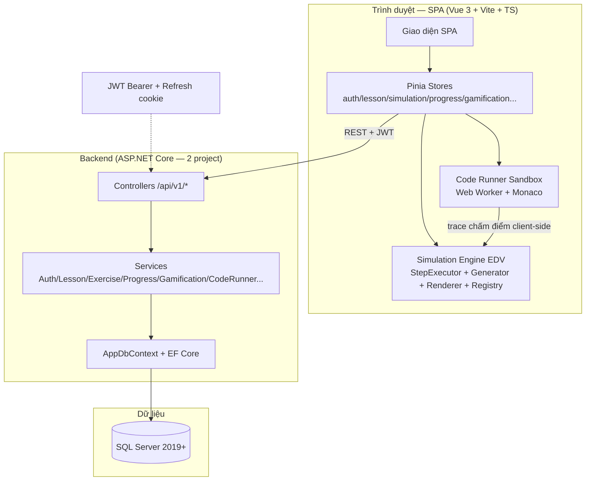
```mermaid
graph TB
    subgraph Client["Trình duyệt — SPA (Vue 3 + Vite + TS)"]
        UI[Giao diện SPA]
        STORE[Pinia Stores<br/>auth/lesson/simulation/progress/gamification...]
        ENGINES[Simulation Engine EDV<br/>StepExecutor + Generator + Renderer + Registry]
        CODE[Code Runner Sandbox<br/>Web Worker + Monaco]
        UI --> STORE
        STORE --> ENGINES
        STORE --> CODE
    end
    subgraph Server["Backend (ASP.NET Core — 2 project)"]
        API[Controllers /api/v1/*]
        SVC[Services<br/>Auth/Lesson/Exercise/Progress/Gamification/CodeRunner...]
        DB[AppDbContext + EF Core]
        API --> SVC
        SVC --> DB
    end
    subgraph Data["Dữ liệu"]
        SQL[(SQL Server 2019+)]
    end
    STORE -->|REST + JWT| API
    CODE -->|trace chấm điểm client-side| ENGINES
    DB --> SQL
    AUTH[JWT Bearer + Refresh cookie] -.-> API
```

Sơ đồ trên mô tả luồng chính: giao diện SPA gọi API qua REST kèm JWT, API xử lý qua lớp Service rồi lưu vào SQL Server bằng EF Core; riêng mô phỏng và chấm code chạy ngay trong trình duyệt (Web Worker), máy chủ chỉ lưu lịch sử. Các thành phần chính được tóm tắt ở Bảng 3.1.

**Bảng 3.1: Các thành phần chính của hệ thống**

| Thành phần | Vai trò | Công nghệ |
|---|---|---|
| Client | Hiển thị giao diện, chạy mô phỏng EDV, chạy và chấm code trong sandbox | Vue 3 + Vite + TypeScript, Pinia, Web Worker, Monaco |
| API Server | Xác thực, cung cấp dữ liệu bài học/mô phỏng, chấm điểm bài tập, quản lý tiến độ và gamification | ASP.NET Core (DsaVisual.Api + DsaVisual.Application), EF Core |
| Database | Lưu toàn bộ dữ liệu: người dùng, bài học, bài tập, tiến độ, phiên học, code | SQL Server 2019+ |

(nguồn: SDD §2.1)

## 3.2 Sơ đồ Use Cases

### 3.2.1 Tổng quan

Hệ thống phục vụ **3 tác nhân chính**:

- **Người học (Student)** — xem bài học, chạy mô phỏng, làm bài tập, luyện tập theo lộ trình, quản lý hồ sơ và tham gia lớp học phần;
- **Giảng viên (Teacher)** — biên soạn bài học/bài tập, xem báo cáo giảng dạy và quản lý lớp học phần;
- **Quản trị viên (Admin)** — quản lý người dùng và cấu hình hệ thống.

Bên cạnh đó còn tác nhân **Khách (chưa đăng nhập)** với các chức năng tạo tài khoản, đăng nhập, xem demo công khai và khôi phục mật khẩu. Sơ đồ use case tổng thể gồm đủ 33 use case (UC-01 → UC-33):

```mermaid
graph TD
    subgraph "Hệ thống DSA-Visual"
        A[UC-01 Chạy mô phỏng giải thuật]
        B[UC-02 Tạo tài khoản]
        C[UC-03 Đăng nhập và duy trì phiên]
        D[UC-04 Xem bài học]
        E[UC-05 Tìm kiếm bài học]
        F[UC-06 Làm bài tập trắc nghiệm]
        G[UC-07 Làm bài tập dự đoán bước<br/>(Bậc 2 Lab)]
        H[UC-08 Xem tiến độ cá nhân]
        I[UC-09 Biên soạn bài học]
        J[UC-10 Biên soạn bài tập]
        K[UC-11 Xem báo cáo giảng dạy]
        L[UC-12 Quản lý người dùng]
        M[UC-13 Quản trị cấu hình]
        N[UC-14 Xem demo công khai]
        O[UC-15 Khôi phục mật khẩu]
        P[UC-16 Xem chi tiết bài học và mở module riêng]
        Q[UC-17 Viết và chạy code trong sandbox]
        R[UC-18 Nộp bài tập lập trình]
        S[UC-19 Xem lịch sử nộp bài code]
        T[UC-20 Quản lý lớp học phần]
        U[UC-21 Tham gia lớp bằng mã mời]
        V[UC-22 Ghi chú cá nhân]
        W[UC-23 Xem thành tích và huy hiệu]
        X[UC-24 Gửi phản hồi và báo lỗi]
        Y[UC-25 Học theo Learning Path]
        Z[UC-26 Làm Practice Ladder]
        AA[UC-27 Làm bài kiểm tra cuối lộ trình]
        AB[UC-28 Chạy Benchmark Lab]
        AC[UC-29 Làm Daily Quest và giữ Streak]
        AD[UC-30 Mua vật phẩm Gems Shop]
        AE[UC-31 Xem Leaderboard]
        AF[UC-32 Nâng cấp Premium]
        AG[UC-33 Xác thực hai yếu tố (2FA)]
    end
    Khach["Khách (chưa đăng nhập)"] --> B
    Khach --> C
    Khach --> N
    Khach --> O
    NguoiHoc["Người học (Student)"] --> A
    NguoiHoc --> D
    NguoiHoc --> E
    NguoiHoc --> F
    NguoiHoc --> G
    NguoiHoc --> H
    NguoiHoc --> P
    NguoiHoc --> Q
    NguoiHoc --> R
    NguoiHoc --> S
    NguoiHoc --> U
    NguoiHoc --> V
    NguoiHoc --> W
    NguoiHoc --> X
    NguoiHoc --> Y
    NguoiHoc --> Z
    NguoiHoc --> AA
    NguoiHoc --> AB
    NguoiHoc --> AC
    NguoiHoc --> AD
    NguoiHoc --> AE
    NguoiHoc --> AF
    NguoiHoc --> AG
    NguoiDay["Giảng viên (Teacher)"] --> D
    NguoiDay --> E
    NguoiDay --> I
    NguoiDay --> J
    NguoiDay --> K
    NguoiDay --> T
    NguoiDay --> X
    Admin["Quản trị viên (Admin)"] --> L
    Admin --> M
    Admin --> X
```

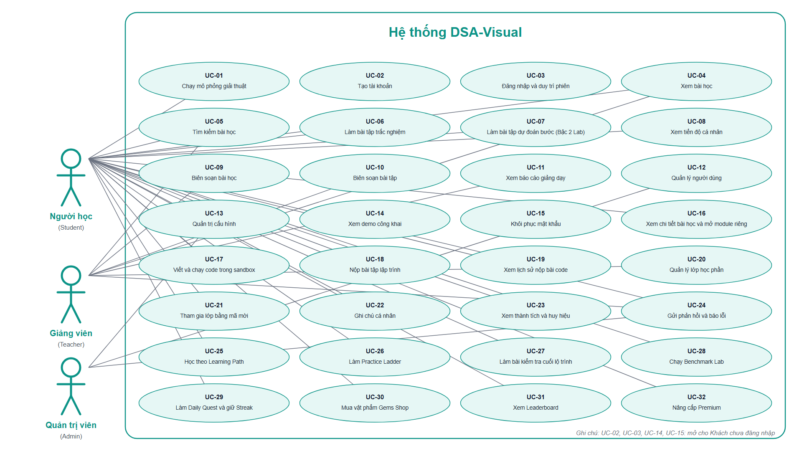

*Hình 3.1: Sơ đồ use case tổng thể — 3 tác nhân và các chức năng chính của hệ thống. (ảnh placeholder — sinh ảnh thật bằng prompt NHÓM B #1)*

(nguồn: SRS §5.1)

### 3.2.2 Use Cases dành cho người học

Nhóm người học gồm 24 use case: xem bài học và mô phỏng giải thuật, làm bài tập (trắc nghiệm, dự đoán bước, lập trình), học theo lộ trình, tham gia lớp học phần và các chức năng gamification. Sơ đồ nhóm như sau:

```mermaid
graph TD
    subgraph "Hệ thống DSA-Visual — nhóm Người học"
        A[UC-01 Chạy mô phỏng giải thuật]
        B[UC-02 Tạo tài khoản]
        C[UC-03 Đăng nhập và duy trì phiên]
        D[UC-04 Xem bài học]
        E[UC-05 Tìm kiếm bài học]
        F[UC-06 Làm bài tập trắc nghiệm]
        G[UC-07 Làm bài tập dự đoán bước<br/>(Bậc 2 Lab)]
        H[UC-08 Xem tiến độ cá nhân]
        N[UC-14 Xem demo công khai]
        Q[UC-17 Viết và chạy code trong sandbox]
        R[UC-18 Nộp bài tập lập trình]
        S[UC-19 Xem lịch sử nộp bài code]
        U[UC-21 Tham gia lớp bằng mã mời]
        V[UC-22 Ghi chú cá nhân]
        W[UC-23 Xem thành tích và huy hiệu]
        X[UC-24 Gửi phản hồi và báo lỗi]
        Y[UC-25 Học theo Learning Path]
        Z[UC-26 Làm Practice Ladder]
        AA[UC-27 Làm bài kiểm tra cuối lộ trình]
        AB[UC-28 Chạy Benchmark Lab]
        AC[UC-29 Làm Daily Quest và giữ Streak]
        AD[UC-30 Mua vật phẩm Gems Shop]
        AE[UC-31 Xem Leaderboard]
        AF[UC-32 Nâng cấp Premium]
        AG[UC-33 Xác thực hai yếu tố (2FA)]
    end
    NguoiHoc["Người học (Student)"] --> A
    NguoiHoc --> B
    NguoiHoc --> C
    NguoiHoc --> D
    NguoiHoc --> E
    NguoiHoc --> F
    NguoiHoc --> G
    NguoiHoc --> H
    NguoiHoc --> N
    NguoiHoc --> Q
    NguoiHoc --> R
    NguoiHoc --> S
    NguoiHoc --> U
    NguoiHoc --> V
    NguoiHoc --> W
    NguoiHoc --> X
    NguoiHoc --> Y
    NguoiHoc --> Z
    NguoiHoc --> AA
    NguoiHoc --> AB
    NguoiHoc --> AC
    NguoiHoc --> AD
    NguoiHoc --> AE
    NguoiHoc --> AF
    NguoiHoc --> AG
```

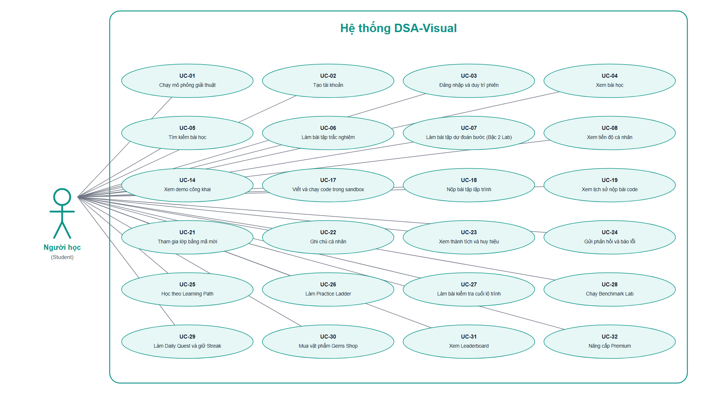

*Hình 3.2: Sơ đồ use case dành cho người học — 24 chức năng học tập và luyện tập chính. (ảnh placeholder — sinh ảnh thật bằng prompt NHÓM B #1)*

Các use case chính được liệt kê ở Bảng 3.2:

**Bảng 3.2: Danh sách use case dành cho người học**

| Mã UC | Tên | Mô tả |
|---|---|---|
| UC-01 | Chạy mô phỏng giải thuật | Mở mô phỏng, cấu hình dữ liệu đầu vào, điều khiển từng bước với 3 vùng đồng bộ (trực quan – mã giả – giải thích) |
| UC-02 | Tạo tài khoản | Đăng ký bằng email + mật khẩu, vai trò mặc định Student; chọn "Tôi là giảng viên" thì chờ Admin duyệt |
| UC-03 | Đăng nhập và duy trì phiên | Đăng nhập nhận JWT, tự động gia hạn phiên bằng refresh token, đăng xuất thu hồi phiên |
| UC-04 | Xem bài học | Duyệt cây chủ đề, đọc lý thuyết, đánh dấu đã học và mở module riêng (mô phỏng/bài tập/code) |
| UC-05 | Tìm kiếm bài học | Gõ từ khóa, hệ thống gợi ý bài học sau 300ms, chọn kết quả để mở bài học |
| UC-06 | Làm bài tập trắc nghiệm | Trả lời câu hỏi, nộp bài, hệ thống chấm điểm tự động và hiển thị giải thích |
| UC-07 | Làm bài tập dự đoán bước | Thao tác trên canvas editable, nộp, hệ thống chấm trạng thái cuối + giới hạn số bước |
| UC-08 | Xem tiến độ cá nhân | Xem thẻ KPI tổng quan, tiến độ theo từng chủ đề và nhảy tới bài học chưa học |
| UC-14 | Xem demo công khai | Khách chạy thử 3 demo (Bubble Sort, Binary Search, BFS) không cần tài khoản |
| UC-17 | Viết và chạy code trong sandbox | Soạn/hiệu chỉnh code trong Monaco, chạy an toàn trong Web Worker, xem trace đồng bộ editor – visual |
| UC-18 | Nộp bài tập lập trình | Nộp code, hệ thống chấm bằng test ẩn (tĩnh + ngẫu nhiên) và trả kết quả từng test |
| UC-19 | Xem lịch sử nộp bài code | Xem danh sách lần nộp, mở lại code cũ kèm kết quả và so sánh 2 lần nộp |
| UC-21 | Tham gia lớp bằng mã mời | Nhập mã mời 6 ký tự để vào lớp học phần đang mở |
| UC-22 | Ghi chú cá nhân | Soạn ghi chú gắn với bài học, tự lưu sau 1 giây, xem lại và xóa |
| UC-23 | Xem thành tích và huy hiệu | Xem huy hiệu đã mở và huy hiệu ẩn, nhận toast khi đạt huy hiệu mới |
| UC-24 | Gửi phản hồi và báo lỗi | Đánh giá sao + nhận xét bài học, gửi báo lỗi kèm ngữ cảnh tự động (URL, bước mô phỏng) |
| UC-25 | Học theo Learning Path | Chọn lộ trình, xem bản đồ node, vào node đang mở (trừ tim), pass node để mở khóa node kế |
| UC-26 | Làm Practice Ladder | Chuỗi 3 bậc Quiz → Lab → Code; pass bậc trước mới mở bậc sau, retry trong phiên miễn phí |
| UC-27 | Làm bài kiểm tra cuối lộ trình | Làm final test sau khi pass toàn bộ node, ngưỡng pass ≥ 70% |
| UC-28 | Chạy Benchmark Lab | So sánh nhiều giải thuật trên nhiều kích thước dữ liệu, đối chiếu overlay lý thuyết |
| UC-29 | Làm Daily Quest và giữ Streak | Nhận thử thách hằng ngày, hoàn thành để giữ chuỗi ngày học liên tục |
| UC-30 | Mua vật phẩm Gems Shop | Dùng gems đổi vật phẩm (tim, streak freeze...) trong cửa hàng |
| UC-31 | Xem Leaderboard | Xem bảng xếp hạng theo XP |
| UC-32 | Nâng cấp Premium | Checkout mô phỏng gói Premium, quản lý hết hạn |

(nguồn: SRS §5.2-5.9, §5.15, §5.18-5.20, §5.22-5.33)

### 3.2.3 Use Cases dành cho giảng viên

Nhóm giảng viên gồm 4 use case: biên soạn nội dung, xem báo cáo và quản lý lớp học phần:

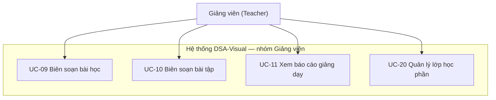
```mermaid
graph TD
    subgraph "Hệ thống DSA-Visual — nhóm Giảng viên"
        I[UC-09 Biên soạn bài học]
        J[UC-10 Biên soạn bài tập]
        K[UC-11 Xem báo cáo giảng dạy]
        T[UC-20 Quản lý lớp học phần]
    end
    NguoiDay["Giảng viên (Teacher)"] --> I
    NguoiDay --> J
    NguoiDay --> K
    NguoiDay --> T
```

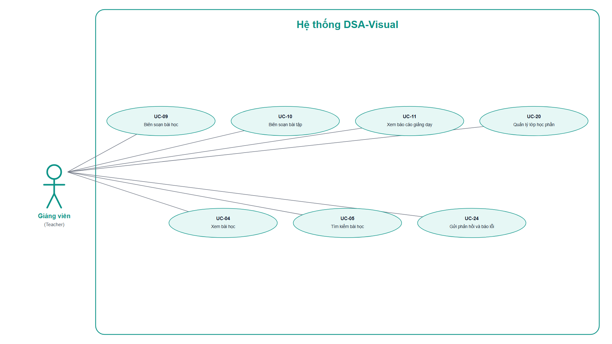

*Hình 3.3: Sơ đồ use case dành cho giảng viên — 4 chức năng biên soạn, báo cáo và quản lý lớp. (ảnh placeholder — sinh ảnh thật bằng prompt NHÓM B #1)*

**Bảng 3.3: Danh sách use case dành cho giảng viên**

| Mã UC | Tên | Mô tả |
|---|---|---|
| UC-09 | Biên soạn bài học | Tạo/sửa chủ đề và bài học rich-text, gắn mô phỏng có sẵn kèm cấu hình mặc định, gắn bài tập, lưu nháp và kích hoạt |
| UC-10 | Biên soạn bài tập | Tạo bài tập theo loại câu hỏi (chọn 1/nhiều/đúng-sai), soạn đáp án và giải thích, xem trước và kích hoạt |
| UC-11 | Xem báo cáo giảng dạy | Xem thống kê bài học (người xem, % hoàn thành, điểm trung bình) và xuất CSV |
| UC-20 | Quản lý lớp học phần | Tạo lớp + mã mời 6 ký tự, thêm/xóa sinh viên, gán nội dung kèm hạn nộp, xem báo cáo lớp và xuất CSV |

(nguồn: SRS §5.10-5.12, §5.21)

### 3.2.4 Use Cases dành cho quản trị viên

Nhóm quản trị viên gồm 2 use case:

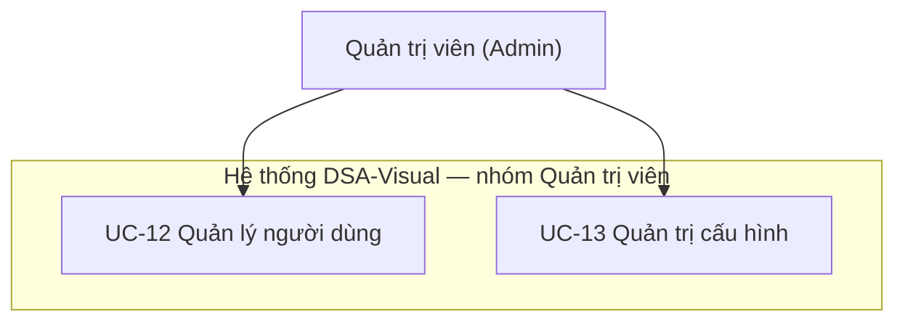
```mermaid
graph TD
    subgraph "Hệ thống DSA-Visual — nhóm Quản trị viên"
        L[UC-12 Quản lý người dùng]
        M[UC-13 Quản trị cấu hình]
    end
    Admin["Quản trị viên (Admin)"] --> L
    Admin --> M
```

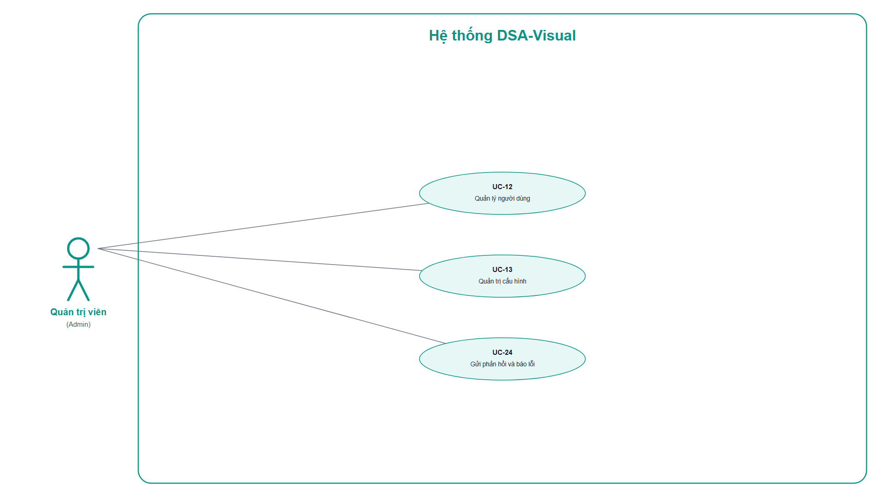

*Hình 3.4: Sơ đồ use case dành cho quản trị viên — quản lý người dùng và cấu hình hệ thống. (ảnh placeholder — sinh ảnh thật bằng prompt NHÓM B #1)*

**Bảng 3.4: Danh sách use case dành cho quản trị viên**

| Mã UC | Tên | Mô tả |
|---|---|---|
| UC-12 | Quản lý người dùng | Xem danh sách người dùng, khóa/mở khóa, phê duyệt tài khoản giảng viên, đặt lại mật khẩu; mọi thao tác đều ghi log máy chủ |
| UC-13 | Quản trị cấu hình hệ thống | Chỉnh cấu hình hệ thống (domain email, chính sách mật khẩu, giới hạn upload), lưu và áp dụng ngay không cần khởi động lại |

(nguồn: SRS §5.13-5.14)

## 3.3 Đặc tả yêu cầu hệ thống (SRS)

### 3.3.1 Ma trận yêu cầu chức năng

Bảng 3.5 tổng hợp đầy đủ **75 yêu cầu chức năng (FR)** của hệ thống theo 10 module (A — Xác thực, B — Bài học, C — Mô phỏng, D — Practice Ladder, E — Tiến độ, F — Quản trị, G — Trang phụ trợ, H — Lớp học phần, I — Code Runner, J — Gamification & Premium). 12 FR đã được duyệt cắt (FR-1.10, FR-2.7, FR-2.8, FR-2.9, FR-3.13, FR-3.17, FR-3.19, FR-5.6, FR-5.7, FR-6.4, FR-7.3, FR-7.5) không nằm trong bảng.

**Bảng 3.5: Ma trận yêu cầu chức năng (master matrix FR)**

| Mã FR | Tên | Mô tả ngắn | UC liên quan | Ưu tiên |
|---|---|---|---|---|
| FR-1.1 | Đăng ký tài khoản | Khách tạo tài khoản bằng email + mật khẩu, vai trò mặc định Student | UC-02 | Cao |
| FR-1.2 | Đăng nhập | Xác thực email + mật khẩu, cấp access token và refresh cookie | UC-03 | Cao |
| FR-1.3 | Gia hạn phiên | Tự động cấp access token mới khi hết hạn bằng refresh token | UC-03 | Cao |
| FR-1.4 | Đăng xuất | Thu hồi refresh token và xóa cookie phiên | UC-03 | Cao |
| FR-1.5 | Đổi mật khẩu | Người dùng đổi mật khẩu của mình sau khi xác thực | UC-03 | TB |
| FR-1.6 | Khôi phục mật khẩu | Gửi link đặt lại mật khẩu qua email, hiệu lực 30 phút, dùng 1 lần | UC-15 | TB |
| FR-1.7 | Cập nhật thông tin cá nhân | Sửa họ tên, avatar trong hồ sơ cá nhân | UC-03 | TB |
| FR-1.8 | Phê duyệt tài khoản giảng viên | Admin duyệt hoặc từ chối tài khoản TeacherPending | UC-12 | TB |
| FR-1.9 | Quản lý người dùng | Admin khóa/mở khóa, đặt lại mật khẩu, ghi log mọi thao tác | UC-12 | TB |
| FR-1.11 | Xác thực hai lớp | Yêu cầu mã 6 số gửi email khi đăng nhập (nếu bật) | UC-03 | Thấp |
| FR-2.1 | Quản lý chủ đề | CRUD chủ đề (topic) cho giảng viên | UC-09 | Cao |
| FR-2.2 | Quản lý bài học | CRUD bài học rich-text, gắn mô phỏng và bài tập | UC-09 | Cao |
| FR-2.3 | Xem danh sách bài học | Duyệt cây chủ đề kèm trạng thái tiến độ từng bài | UC-04 | Cao |
| FR-2.4 | Xem chi tiết bài học | Đọc nội dung lý thuyết, đánh dấu đã học, mở module riêng | UC-04 | Cao |
| FR-2.5 | Tìm kiếm bài học | Gợi ý kết quả theo từ khóa sau 300ms | UC-05 | TB |
| FR-2.6 | Ghi chú cá nhân trên bài học | Ghi chú riêng gắn bài học, tự lưu sau 1 giây | UC-04 | TB |
| FR-2.10 | Learning Path | Lộ trình node mở khóa tuần tự theo kết quả học | UC-25 | Cao |
| FR-2.11 | Two-way sync bằng deep-link | Mở thẳng mô phỏng tại bước N qua link `?step=N` và ngược lại | UC-01 | Cao |
| FR-3.1 | Danh mục mô phỏng | Xem danh sách mô phỏng theo loại giải thuật | UC-01 | Cao |
| FR-3.2 | Khởi tạo mô phỏng | Kiểm tra tim, nạp cấu hình mặc định và sinh chuỗi bước khi mở | UC-01 | Cao |
| FR-3.3 | Hiển thị đồng bộ 3 vùng | Canvas trực quan, mã giả và giải thích cập nhật theo từng bước | UC-01 | Cao |
| FR-3.4 | Cấu hình dữ liệu đầu vào | Nhập/đổi dữ liệu mẫu, sinh lại chuỗi bước về bước 0 | UC-01 | Cao |
| FR-3.5 | Điều khiển mô phỏng | Phát/dừng/bước tiếp/bước lùi/về đầu/về cuối, đổi tốc độ | UC-01 | Cao |
| FR-3.6 | Trạng thái trực quan của phần tử | Tô màu trạng thái phần tử theo từng bước thực thi | UC-01 | Cao |
| FR-3.7 | Bảng mã giả đồng bộ | Highlight dòng mã giả tương ứng bước đang chạy | UC-01 | Cao |
| FR-3.8 | Tùy chọn hiển thị | Ẩn/hiện vùng, đổi tốc độ và màu sắc hiển thị | UC-01 | TB |
| FR-3.9 | Bộ đếm thống kê | Đếm số bước, số lần chạy và thống kê so sánh | UC-01 | TB |
| FR-3.10 | Lưu mô phỏng yêu thích | Đánh dấu mô phỏng yêu thích để mở nhanh | UC-01 | Thấp |
| FR-3.11 | Chia sẻ liên kết mô phỏng | Sao chép link chia sẻ mô phỏng hiện tại | UC-01 | Thấp |
| FR-3.12 | Thực hành bước thủ công | Người học tự thao tác, hệ thống kiểm tra kết quả | UC-01 | Cao |
| FR-3.14 | Hiển thị ngăn xếp đệ quy | Call Stack hiển thị trong mô phỏng đệ quy | UC-01 | TB |
| FR-3.15 | Điểm dừng có điều kiện | Dừng mô phỏng khi gặp điều kiện do người học chỉ định | UC-01 | TB |
| FR-3.16 | Kiểm tra nhanh sau mô phỏng | Mini quiz ngắn sau khi xem xong mô phỏng | UC-01 | TB |
| FR-3.18 | Chế độ tối | Giao diện tối cho toàn hệ thống | — | TB |
| FR-3.20 | Benchmark Lab | Chạy so sánh nhiều giải thuật trên 1 kích thước dữ liệu | UC-28 | TB |
| FR-3.20b | Benchmark đa kích thước | So sánh trên nhiều kích thước, hiển thị overlay lý thuyết | UC-28 | TB |
| FR-4.1 | Quản lý bài tập | CRUD bài tập cho giảng viên (loại, câu hỏi, đáp án, bậc Ladder) | UC-10 | Cao |
| FR-4.2 | Làm bài tập trắc nghiệm | Bậc 1 Quiz: trả lời, nộp, chấm điểm tự động, hiển thị giải thích | UC-06 | Cao |
| FR-4.3 | Bài tập dự đoán bước | Bậc 2 Lab: chấm trạng thái cuối + giới hạn số bước | UC-07 | TB |
| FR-4.4 | Đánh giá và lịch sử bài làm | Lưu điểm, giữ điểm cao nhất, xem lại bài làm | UC-06 | TB |
| FR-4.5 | Ngân hàng câu hỏi dùng lại | Tái sử dụng câu hỏi theo chủ đề/tag | UC-10 | Thấp |
| FR-4.6 | Chế độ luyện tập | Làm lại bài tập không tính vào điểm chính thức | UC-06 | TB |
| FR-4.7 | Gợi ý trả lời | Hints trừ 20%/gợi ý, tối thiểu giữ 40% điểm câu | UC-06 | TB |
| FR-4.8 | Xáo trộn câu hỏi và phương án | Trộn câu hỏi + phương án theo seed ổn định | UC-06 | TB |
| FR-4.9 | Giải thích theo phương án sai | Hiển thị giải thích riêng cho từng phương án sai | UC-06 | TB |
| FR-4.10 | Nhập câu hỏi từ CSV | Nhập hàng loạt câu hỏi từ file CSV | UC-10 | Thấp |
| FR-4.11 | Practice Ladder tuần tự | Chuỗi 3 bậc Quiz → Lab → Code theo từng node | UC-26 | Cao |
| FR-4.12 | Kiểm tra cuối lộ trình | Final test sau khi pass toàn bộ node, ngưỡng pass ≥ 70% | UC-27 | Cao |
| FR-5.1 | Ghi nhận tiến độ | Cập nhật tiến độ người học sau mỗi hành động học | UC-08 | Cao |
| FR-5.2 | Dashboard tiến độ cá nhân | Thẻ KPI + thanh tiến độ theo chủ đề | UC-08 | Cao |
| FR-5.3 | Báo cáo giảng viên | Thống kê bài học, xuất CSV | UC-11 | TB |
| FR-5.4 | Thống kê hệ thống | Báo cáo tổng hợp cho Admin | — | TB |
| FR-5.5 | Huy hiệu thành tích | Trao huy hiệu đúng 1 lần theo sự kiện học tập | UC-08 | TB |
| FR-6.2 | Cấu hình hệ thống | Chỉnh cấu hình, áp dụng ngay không cần khởi động lại | UC-13 | TB |
| FR-7.1 | Trang chủ công khai | Trang chủ với demo công khai | UC-14 | TB |
| FR-7.2 | Trang trợ giúp | Trang FAQ và trợ giúp | — | TB |
| FR-7.4 | Đánh giá nội dung | Sao + nhận xét ≤ 200 ký tự cho bài học | — | Thấp |
| FR-7.6 | Demo công khai 3 visualizer | Chạy thử Bubble Sort, Binary Search, BFS không cần tài khoản | UC-14 | TB |
| FR-8.1 | Tạo và quản lý lớp học phần | Tạo lớp + mã mời duy nhất 6 ký tự | — | TB |
| FR-8.2 | Quản lý sinh viên trong lớp | Thêm/xóa sinh viên, tham gia bằng mã mời | — | TB |
| FR-8.3 | Gán nội dung và hạn nộp | Gán nội dung bắt buộc kèm hạn nộp theo lớp | — | TB |
| FR-8.4 | Báo cáo theo lớp | Báo cáo % hoàn thành, điểm TB, danh sách chậm trễ, xuất CSV | — | TB |
| FR-9.1 | Trình soạn mã nhúng | Editor Monaco nạp sẵn code mẫu, highlight cú pháp | UC-17 | Cao |
| FR-9.2 | Chạy mã và trực quan hóa | Chạy code an toàn, phát trace đồng bộ editor – visual | UC-17 | Cao |
| FR-9.3 | Bài tập lập trình + chấm tự động | Chấm bằng test ẩn (tĩnh + ngẫu nhiên), trả kết quả từng test | UC-18 | TB |
| FR-9.4 | Sandbox an toàn | Chạy trong Web Worker, chặn vòng lặp vô hạn, không treo trình duyệt | UC-17 | Cao |
| FR-9.5 | Lịch sử nộp bài code | Xem lại các lần nộp và so sánh kết quả | UC-19 | TB |
| FR-9.6 | Sandbox giới hạn chi tiết | Giới hạn 10 giây / 64MB / 200 dòng, cấm import và I/O ngoài | UC-17 | Cao |
| FR-10.1 | Tim, hồi tim và session | Trừ 1 tim atomic khi vào node, session 30 phút resume miễn phí | UC-25 | Cao |
| FR-10.2 | Gems + Gems Shop | Kiếm gems và đổi vật phẩm trong cửa hàng | UC-30 | TB |
| FR-10.3 | Daily Quest | Thử thách hằng ngày, hoàn thành nhận thưởng | UC-29 | TB |
| FR-10.4 | Streak + Streak Freeze | Giữ chuỗi ngày học liên tục, dùng vật phẩm giữ chuỗi | UC-29 | TB |
| FR-10.5 | XP & Level | Tích lũy XP, tăng cấp, trao XP 1 lần khi pass đầu | UC-25 | TB |
| FR-10.6 | Leaderboard | Bảng xếp hạng theo XP | UC-31 | TB |
| FR-10.7 | Premium và hết hạn | Gói Premium (P1), checkout mô phỏng, quản lý hết hạn | UC-32 | TB |

(nguồn: SRS §3.1 — master matrix FR)

### 3.3.2 Đặc tả use case hạt nhân

Phần này đặc tả 3 use case quan trọng nhất của hệ thống theo 4 mục ngắn: mô tả chức năng, dữ liệu liên quan, đối tượng sử dụng và yêu cầu bảo mật.

#### UC-01 — Chạy mô phỏng giải thuật

- **Mô tả chức năng:** Người học mở mô phỏng từ Node Hub hoặc từ bài học. Hệ thống kiểm tra tim, nạp cấu hình mặc định và sinh chuỗi bước, sau đó hiển thị bước 0. Người học điều khiển phát/dừng/bước tiếp/bước lùi, kéo thanh tiến trình hoặc đổi tốc độ; cả 3 vùng (trực quan, mã giả, giải thích) cập nhật đồng bộ theo từng bước. Khi hoàn tất, hệ thống hiển thị tóm tắt thống kê và lưu trạng thái resume nếu đang trong phiên học.
- **Dữ liệu liên quan:** `Lessons`, `LessonSimulations`, `NodeSessions`, `UserProgress` (ghi nhận sự kiện chạy mô phỏng ≥ 5 bước).
- **Đối tượng sử dụng:** Người học (đã đăng nhập); khách chỉ dùng được 3 demo công khai không lưu dữ liệu.
- **Yêu cầu bảo mật:** Xác thực JWT cho người đăng nhập; trừ tim atomic phía server (mã lỗi 403 `HEARTS_EMPTY` khi hết tim); demo công khai bị chặn truy cập các API cần phiên.

#### UC-25 — Học theo Learning Path và mở khóa node

- **Mô tả chức năng:** Người học chọn lộ trình, xem bản đồ node (khóa/đang học/hoàn thành 1-3 sao) và bấm vào node đang mở. Hệ thống kiểm tra và trừ 1 tim, tạo mới hoặc gia hạn phiên học rồi đưa người học vào Node Hub. Khi pass node, hệ thống cập nhật tiến độ, mở khóa node kế và trao XP 1 lần cho lần pass đầu; hết lộ trình thì mở bài kiểm tra cuối.
- **Dữ liệu liên quan:** `LearningPaths`, `LearningPathNodes`, `NodeSessions`, `UserNodeProgress`, `Users` (tim, XP).
- **Đối tượng sử dụng:** Người học (đã đăng nhập).
- **Yêu cầu bảo mật:** Xác thực JWT; trừ tim atomic server-side chống double-spend khi mở nhiều tab cùng lúc; dùng server timestamp để chống chỉnh đồng hồ thiết bị gian lận hồi tim.

#### UC-26 — Làm Practice Ladder (Quiz → Lab → Code)

- **Mô tả chức năng:** Với mỗi node, người học trải qua 3 bậc: pass Quiz ≥ 60% mới mở Bậc 2 Lab; pass Lab (chấm trạng thái cuối khớp kết quả chuẩn và số bước không vượt giới hạn) mới mở Bậc 3 Code; pass Code ≥ 70% test ẩn thì pass node. Retry bậc trong phiên 30 phút không trừ thêm tim; thoát giữa chừng thì resume đúng bậc đang dở.
- **Dữ liệu liên quan:** `Exercises`, `ExerciseSubmissions`, `CodeRuns`, `CodeSubmissions`, `NodeSessions`, `UserNodeProgress`.
- **Đối tượng sử dụng:** Người học (đã đăng nhập và vào node).
- **Yêu cầu bảo mật:** Xác thực JWT; server guard chặn vào bậc sau khi chưa pass bậc trước; chấm điểm phía server, nộp bài idempotent (không tính 2 lần khi mất mạng).

(nguồn: SRS §5.2, §5.26, §5.27)


# PHẦN 4: THIẾT KẾ - DESIGN

## 4.1 Mô hình công nghệ

Hệ thống gồm 3 lớp công nghệ rõ ràng: frontend là SPA Vue 3 chạy trong trình duyệt và chứa toàn bộ Simulation Engine EDV; backend là API ASP.NET Core gồm 2 project; dữ liệu lưu trong SQL Server. Frontend gọi backend qua REST có xác thực JWT. Sơ đồ kiến trúc tổng thể như sau:


```mermaid
graph TB
    subgraph Client["Trình duyệt — SPA (Vue 3 + Vite + TS)"]
        UI[Giao diện SPA]
        STORE[Pinia Stores<br/>auth/lesson/simulation/progress/gamification...]
        ENGINES[Simulation Engine EDV<br/>StepExecutor + Generator + Renderer + Registry]
        CODE[Code Runner Sandbox<br/>Web Worker + Monaco]
        UI --> STORE
        STORE --> ENGINES
        STORE --> CODE
    end
    subgraph Server["Backend (ASP.NET Core — 2 project)"]
        API[Controllers /api/v1/*]
        SVC[Services<br/>Auth/Lesson/Exercise/Progress/Gamification/CodeRunner...]
        DB[AppDbContext + EF Core]
        API --> SVC
        SVC --> DB
    end
    subgraph Data["Dữ liệu"]
        SQL[(SQL Server 2019+)]
    end
    STORE -->|REST + JWT| API
    CODE -->|trace chấm điểm client-side| ENGINES
    DB --> SQL
    AUTH[JWT Bearer + Refresh cookie] -.-> API
```

**Bảng 4.1: Tổng hợp công nghệ theo lớp**

| Lớp | Công nghệ | Vai trò |
|---|---|---|
| Frontend | Vue 3 + Pinia + Vite + TypeScript | Giao diện SPA, quản lý trạng thái, chạy Simulation Engine EDV và Code Runner ngay trong trình duyệt |
| Backend | ASP.NET Core + EF Core | API REST `/api/v1`, xử lý nghiệp vụ trong Service, truy cập dữ liệu qua DbContext |
| CSDL | SQL Server 2019+ | Lưu trữ 32 bảng dữ liệu, lưu lịch sử chấm điểm |

Điểm công nghệ đáng chú ý: Simulation Engine EDV chạy phía client nên bước lùi miễn phí và sinh bước nhanh (NFR-2); Code Runner chấm code trong sandbox Web Worker, backend chỉ lưu lịch sử; phiên đăng nhập dùng JWT access token trong bộ nhớ kèm refresh cookie an toàn (ADR-004).

(nguồn: SDD §2, §3)

## 4.2 Thiết kế giao diện

### 4.2.1 Sitemap

Hệ thống có khoảng 32 màn chính (SDD §8.4 đặc tả đủ 33 route, gồm Màn 33 Khám phá). Sơ đồ luồng màn hình chính như sau:

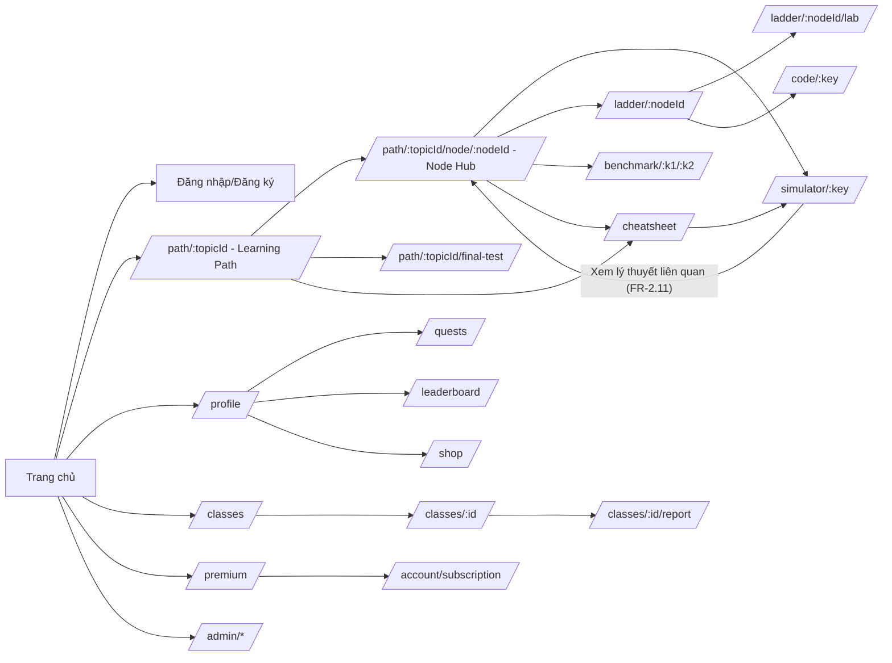
```mermaid
graph LR
    LANDING[Trang chủ] --> AUTH[Đăng nhập/Đăng ký]
    LANDING --> PATH[/path/:topicId - Learning Path/]
    PATH --> NODE[/path/:topicId/node/:nodeId - Node Hub/]
    NODE --> SIM[/simulator/:key/]
    NODE --> LADDER[/ladder/:nodeId/]
    LADDER --> LAB[/ladder/:nodeId/lab/]
    LADDER --> CODE[/code/:key/]
    NODE --> BENCH[/benchmark/:k1/:k2/]
    PATH --> FINAL[/path/:topicId/final-test/]
    PATH --> CHEAT[/cheatsheet/]
    CHEAT --> SIM
    NODE --> CHEAT
    SIM -->|"Xem lý thuyết liên quan (FR-2.11)"| NODE
    LANDING --> PROFILE[/profile/]
    PROFILE --> QUESTS[/quests/]
    PROFILE --> LEADER[/leaderboard/]
    PROFILE --> SHOP[/shop/]
    LANDING --> CLASSES[/classes/]
    CLASSES --> CLASSDETAIL[/classes/:id/]
    CLASSDETAIL --> CLASSREPORT[/classes/:id/report/]
    LANDING --> PREMIUM[/premium/]
    PREMIUM --> SUB[/account/subscription/]
    LANDING --> ADMIN[/admin/*/]
```

Mũi tên trong sơ đồ thể hiện đường đi chính của người dùng: khách ghé trang chủ rồi đăng ký, người học đi từ bản đồ lộ trình vào Node Hub rồi rẽ sang mô phỏng/luyện tập, giảng viên và quản trị viên đi vào nhóm màn riêng của vai trò. Các màn được nhóm theo chức năng như bảng dưới:

**Bảng 4.2: Nhóm màn theo chức năng**

| Nhóm | Màn | Số màn |
|---|---|---|
| Công khai | 01 Trang chủ, 02 Đăng nhập/Đăng ký, 12 Trợ giúp | 3 |
| Học tập | 03 Danh sách bài học (redirect), 04 Chi tiết bài học, 13 Learning Path, 18 CheatSheet, 30 Final Test, 31 Node Hub | 6 |
| Mô phỏng | 05 Simulator, 17 Benchmark Lab, 33 Khám phá | 3 |
| Luyện tập | 06 Bài tập trắc nghiệm, 07 Dự đoán bước (sáp nhập Bậc 2), 14 Practice Ladder, 15 Interactive Lab, 16 Code Runner | 5 |
| Gamification | 22 Shop, 23 Daily Quest, 24 Leaderboard, 25 Premium, 26 Checkout (modal), 27 Quản lý gói, 28 Modal Hết tim | 7 |
| Lớp học | 19 Danh sách lớp, 20 Chi tiết lớp, 21 Báo cáo lớp | 3 |
| Quản trị | 08 Dashboard (redirect), 09 Quản trị nội dung, 10 Quản lý người dùng, 11 Thống kê, 29 Chờ duyệt Teacher | 5 |
| Hồ sơ | 32 Hồ sơ cá nhân | 1 |

(nguồn: SDD §8.2, §8.4; SCREEN_MAP)

### 4.2.2 Layout

Giao diện dùng một hệ thống thiết kế thống nhất cho mọi màn: màu, font, cỡ chữ và bộ component dùng chung được định nghĩa một chỗ, không viết CSS rải rác.

**Bảng 4.3: Hệ thống thiết kế (design tokens)**

| Mục | Đặc tả |
|---|---|
| Ngôn ngữ | Tiếng Việt có dấu, mọi chuỗi nằm trong file i18n |
| Font | Inter/Roboto (fallback Segoe UI, Arial); mã giả dùng JetBrains Mono/Consolas |
| Cỡ chữ | Nội dung 14px, form 16px, tiêu đề 20/24/32px |
| Màu chủ đạo | Primary #2563EB, Secondary #0F172A, Success #16A34A, Warning #D97706, Danger #DC2626, Background #F8FAFC, Surface #FFFFFF |
| Màu trạng thái mô phỏng | default #CBD5E1, active #FACC15, highlight #FB923C, swap #EF4444, done #22C55E, error #B91C1C, muted #E2E8F0 |
| Bo góc/đổ bóng | Thẻ 8px, nút 6px; shadow nhẹ, modal 0 10px 25px |
| Component tự xây | Button, Input, Select, Modal, Toast, Table, Card, Tabs, Tooltip, Skeleton, EmptyState, Badge, ProgressBar, Drawer |
| Thư viện hỗ trợ | Icon lucide-vue-next, soạn thảo rich-text Quill, biểu đồ Chart.js |

Toàn bộ màn học được bọc trong App shell gồm header chung và sidebar trái theo vai trò. Header luôn hiển thị widget tim/gems/streak của người dùng. Menu khác nhau cho 3 vai trò:

**Bảng 4.4: Sidebar theo vai trò**

| Vai trò | Menu chính |
|---|---|
| Sinh viên | Lộ trình (/path), Khám phá (/simulations), Hồ sơ (/profile), Thử thách (/quests), Lớp học (/classes), Cửa hàng (/shop), Premium, Trợ giúp |
| Giảng viên | Lộ trình, Khám phá, Quản lý nội dung (/admin/*), Lớp học (/classes), Báo cáo (/reports), còn lại như Sinh viên |
| Quản trị viên | Người dùng (/admin/users), Nội dung (/admin/lessons), Cấu hình (/admin/settings), Thống kê (/admin/stats), còn lại như Giảng viên |

Hai route cũ `/learn` và `/dashboard` tự chuyển hướng sang `/path` và `/profile` để giữ một lối vào duy nhất.

(nguồn: SDD §8.1, §8.7)

### 4.2.3 Giao diện chức năng

Dưới đây là 12 màn hình chính của hệ thống, ảnh chụp từ ứng dụng thật (13/08/2026).

#### Màn 01 — Trang chủ

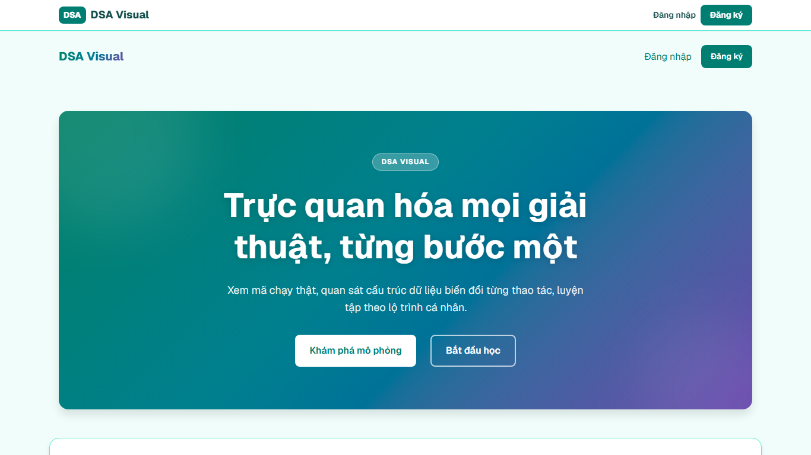
*Hình 4.1: Trang chủ giới thiệu sản phẩm, 6 thẻ tính năng và 3 demo công khai. (Ảnh chụp từ ứng dụng — 13/08/2026)*

Trang chủ công khai gồm hero giới thiệu, 6 thẻ tính năng, khối "Cách hoạt động", số liệu hệ thống và 3 thẻ demo công khai (Bubble Sort, Binary Search, BFS) chạy được ngay không cần đăng nhập. Khách bấm "Đăng ký miễn phí" để tạo tài khoản hoặc "Chạy thử" để xem demo; người đã đăng nhập thấy nút "Học tiếp" trỏ về Lộ trình.

#### Màn 02 — Đăng nhập/Đăng ký

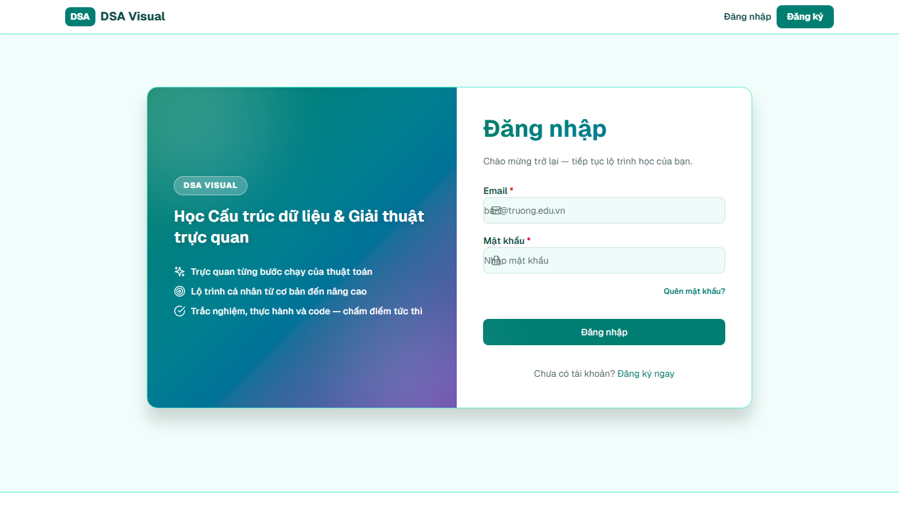
*Hình 4.2: Màn đăng nhập và đăng ký với validation inline. (Ảnh chụp từ ứng dụng — 13/08/2026)*

Màn xác thực gồm đăng nhập và đăng ký trên 2 route riêng. Biểu mẫu kiểm tra ngay khi rời ô nhập, mật khẩu có checklist sống (đủ dài, có chữ hoa, số, ký tự đặc biệt), checkbox "Tôi là giảng viên" đưa tài khoản vào trạng thái chờ duyệt. Tài khoản đã bật xác thực 2 lớp phải nhập thêm mã OTP gửi qua email. Sau khi đăng nhập, sinh viên về Lộ trình, giảng viên/quản trị về trang quản trị.

#### Màn 04 — Chi tiết bài học

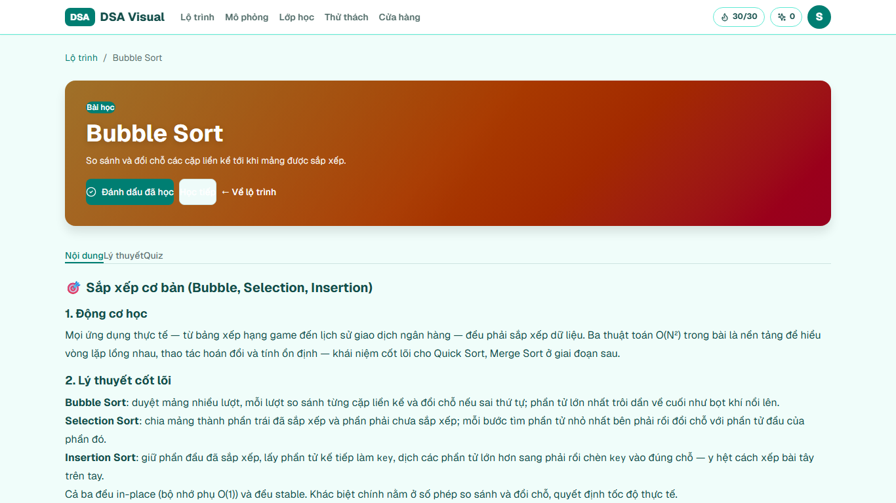
*Hình 4.3: Màn chi tiết bài học hiển thị lý thuyết và thẻ liên kết tài nguyên. (Ảnh chụp từ ứng dụng — 13/08/2026)*

Màn hiển thị nội dung lý thuyết dạng rich-text; không nhúng mô phỏng hay bài tập trong trang mà đưa thẻ liên kết mở các trang riêng. Người học ghi chú cá nhân (tự lưu sau 1 giây), đánh giá sao 1-5 sau khi đã học, và bấm "Xem bước này" để mở mô phỏng đúng đoạn liên quan.

#### Màn 05 — Màn hình mô phỏng (quan trọng nhất)

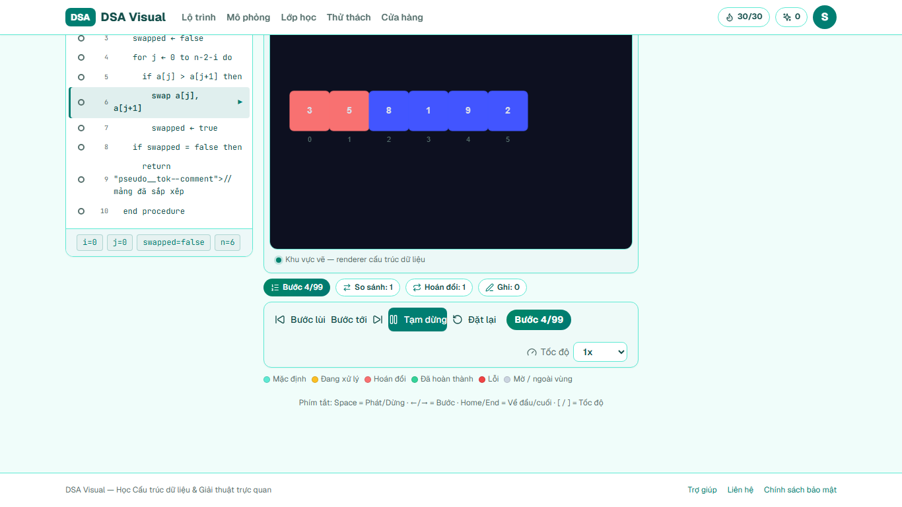
*Hình 4.4: Màn mô phỏng 3 vùng đồng bộ: mã giả, canvas trực quan, giải thích từng bước. (Ảnh chụp từ ứng dụng — 13/08/2026)*

Đây là màn quan trọng nhất của hệ thống, bố cục 3 vùng đồng bộ trong cùng một frame: trái là panel mã giả (dòng đang chạy tô vàng kèm giá trị biến), giữa là canvas vẽ cấu trúc dữ liệu theo trạng thái màu, phải là panel giải thích từng bước bằng tiếng Việt. Thanh điều khiển bên dưới canvas có phát/dừng/bước tới/bước lùi, thanh tiến trình kéo thả và tốc độ 0.25x-4x; người học có thể cấu hình lại dữ liệu đầu vào theo từng loại CTDL, đặt breakpoint, tự thực hành bước thủ công và dùng phím tắt (Space phát/dừng, mũi tên sang bước). Bố cục dự kiến như wireframe sau:

```
+-----------------------------------------------------------------------------------------------+
|  Header:  Quay lại bài học  |  Bubble Sort - Sắp xếp nổi bọt  |  Yêu thích  Chia sẻ  Tùy chọn |
+-----------------------------------------------------------------------------------------------+
|  MÃ GIẢ (3/12)   |   VÙNG TRỰC QUAN (6/12)                              |  GIẢI THÍCH (3/12)   |
|  ----------------|-----------------------------------------------------|---------------------|
|  1 procedure      |   [3] [7] [1] [5]  <- các ô mảng                     |  BƯỚC 12/34          |
|  2  for i ...     |     ^                                              |  So sánh a[0]=3 và    |
|  3    swapped=F   |     i=0       [7] [1] <- đang so sánh               |  a[1]=7: 3 > 7 ?     |
|  4    for j ...   |  Màu: mặc định  active  swap  done                  |  -> sai, không hoán   |
|  5      if a[j]   |  Bộ đếm: so sánh 14 | hoán đổi 3 |                  |  đổi. j tăng lên 1.  |
|  6        swap    |  Tốc độ [0.25x|0.5x|1x|2x|4x]                     |  Biến: i=0, j=1       |
|  7        swapT   |-----------------------------------------------------|                     |
|  8  if swapped    |  [Về đầu] [Lùi] [Phát/Dừng] [Tới] [Cuối] | 12/34 |  [Tại sao?] (tooltip) |
|  9  end           |-----------------------------------------------------|---------------------|
|  [Thu gọn]        |  [Cấu hình lại] [Tạo ngẫu nhiên] [Về đầu]        |                     |
+-----------------------------------------------------------------------------------------------+
|  Footer:  Phím tắt: Space = Phát/Dừng; mũi tên trái/phải = Bước; Home/End = Về đầu/cuối        |
+-----------------------------------------------------------------------------------------------+
```

#### Màn 06 — Bài tập trắc nghiệm

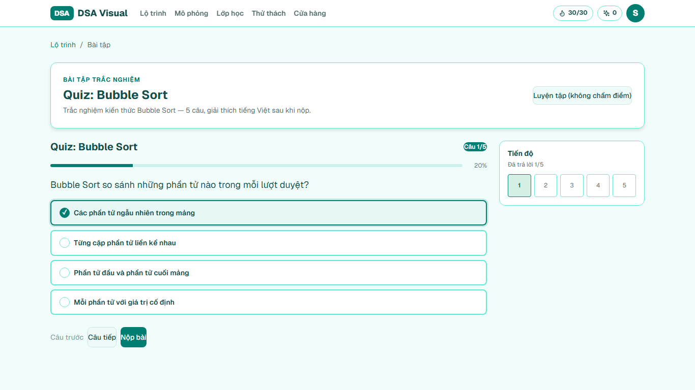
*Hình 4.5: Màn làm bài trắc nghiệm với mini-map định vị câu hỏi. (Ảnh chụp từ ứng dụng — 13/08/2026)*

Người học làm bài trắc nghiệm Bậc 1 của Practice Ladder hoặc bài kiểm tra cuối lộ trình: câu hỏi ở giữa, mini-map bên phải đánh dấu câu đã trả lời/đang xem/đánh dấu xem lại. Hết giờ tự nộp nếu có cấu hình. Sau nộp hiện kết quả chi tiết: điểm, thống kê đúng/sai và giải thích từng câu kèm lý do đáp án đã chọn sai. Có chế độ Luyện tập không chấm điểm và nút Gợi ý tốn token.

#### Màn 13 — Bản đồ Learning Path

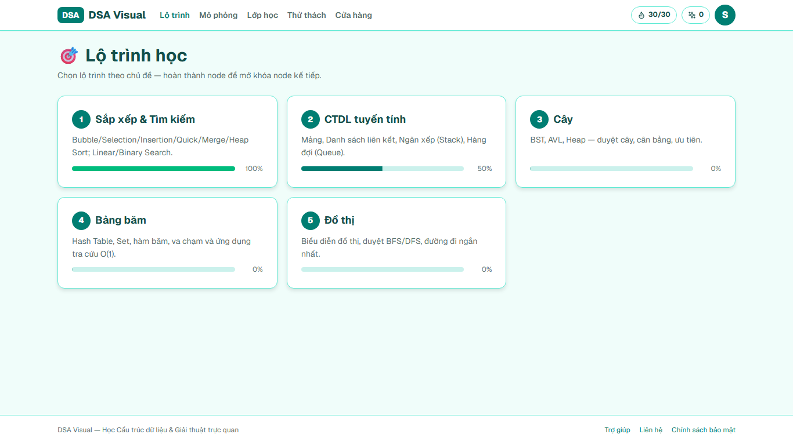
*Hình 4.6: Bản đồ lộ trình dạng đường mòn, node khóa/mở/đã qua. (Ảnh chụp từ ứng dụng — 13/08/2026)*

Bản đồ node kiểu "đường mòn" cuộn dọc giúp người học thấy thứ tự học và trạng thái từng node (khóa, đang mở, đã qua kèm số sao). Pass một node sẽ mở khóa node kế tiếp; node cuối lộ trình là bài kiểm tra cuối, chỉ mở khi qua toàn bộ node. Header có thanh tiến độ tổng và widget tim/gems.

#### Màn 14 — Practice Ladder

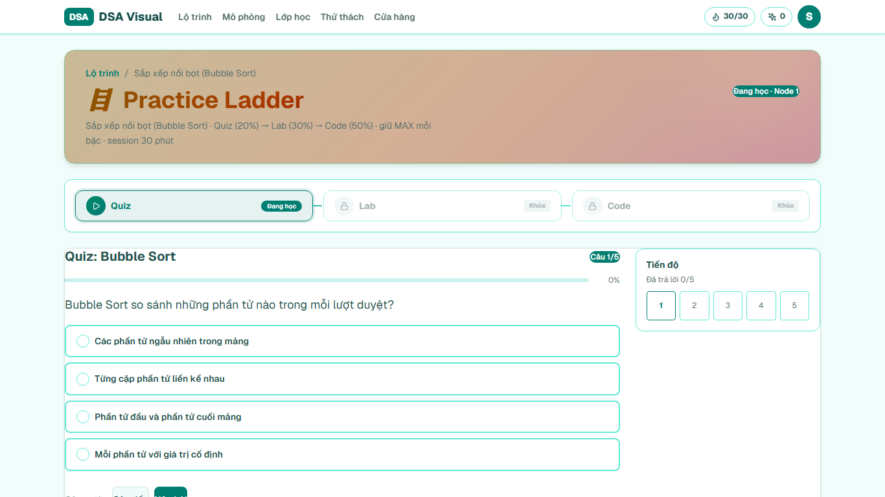
*Hình 4.7: Khung luyện tập 3 bậc Quiz, Lab, Code với stepper trên cùng. (Ảnh chụp từ ứng dụng — 13/08/2026)*

Khung luyện tập 3 bậc của một node: Quiz (Bậc 1) → Interactive Lab (Bậc 2) → Code Challenge (Bậc 3). Stepper trên cùng cho biết bậc đã qua, đang làm, đang khóa; mỗi bậc là một component tách, qua bậc nào tự chuyển bậc kế. Điểm node tính Quiz 20% + Lab 30% + Code 50%, giữ điểm cao nhất mỗi bậc; phiên học 30 phút cho phép thoát ra vào tiếp tục.

#### Màn 15 — Interactive Lab

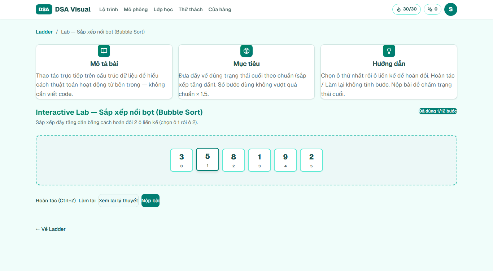
*Hình 4.8: Màn luyện tập Bậc 2, thao tác trực tiếp trên canvas. (Ảnh chụp từ ứng dụng — 13/08/2026)*

Bậc 2 yêu cầu người học tự thao tác trên canvas (kéo thả ô, chọn nút cha) để giải bài theo kịch bản sắp xếp, BST hoặc đồ thị. Bảng điều khiển cho biết số thao tác đã dùng so với giới hạn (chuẩn x 1.5), có nút Hoàn tác, Làm lại, Gợi ý tốn token, Nộp bài. Server chấm trạng thái cuối cùng khớp chuẩn và số bước không vượt giới hạn.

#### Màn 16 — Code Runner

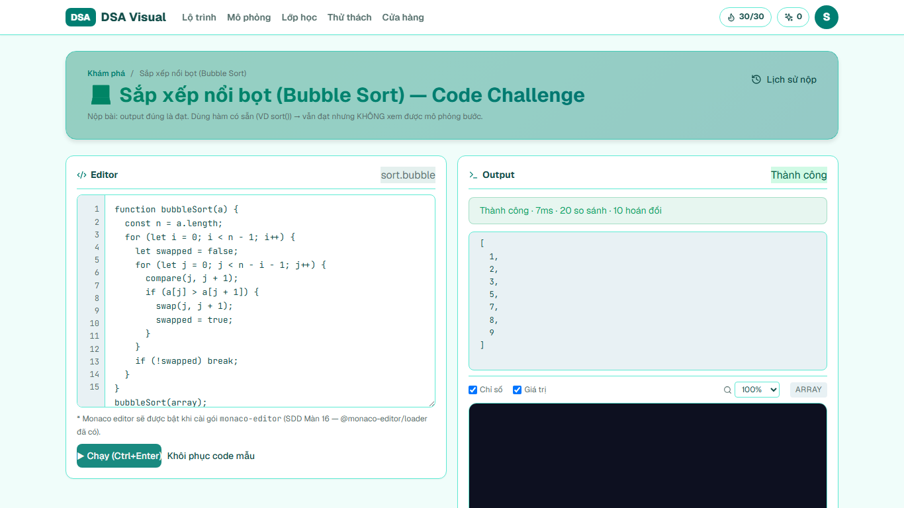
*Hình 4.9: Màn Code Runner với trình soạn mã Monaco và canvas trực quan. (Ảnh chụp từ ứng dụng — 13/08/2026)*

Trình soạn mã Monaco nạp sẵn code mẫu, người học hoàn thiện hàm theo chữ ký cố định rồi chạy trong sandbox Web Worker (giới hạn 10 giây, 64MB, 200 dòng). Canvas bên phải phát trực quan đồng bộ 2 chiều: bấm dòng code nhảy đúng bước tương ứng. Khi vào từ Bậc 3, màn thêm nút Nộp bài với bộ test ẩn chấm theo đầu ra và lịch sử nộp bài.

#### Màn 17 — Benchmark Lab

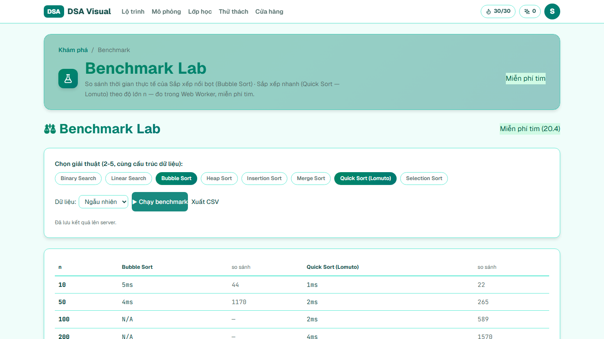
*Hình 4.10: Màn Benchmark so sánh số liệu thật của các giải thuật. (Ảnh chụp từ ứng dụng — 13/08/2026)*

So sánh số liệu thật (thời gian, số so sánh, số hoán đổi/ghi) của 2-5 giải thuật cùng cấu trúc dữ liệu tại nhiều kích thước n (10/50/100/500/1000). Kết quả hiển thị dạng bảng số liệu và biểu đồ cột có đường cong lý thuyết tự fit; màn tự sinh khối kết luận. Màn này miễn phí tim, không tính vào lộ trình.

#### Màn 24 — Bảng xếp hạng

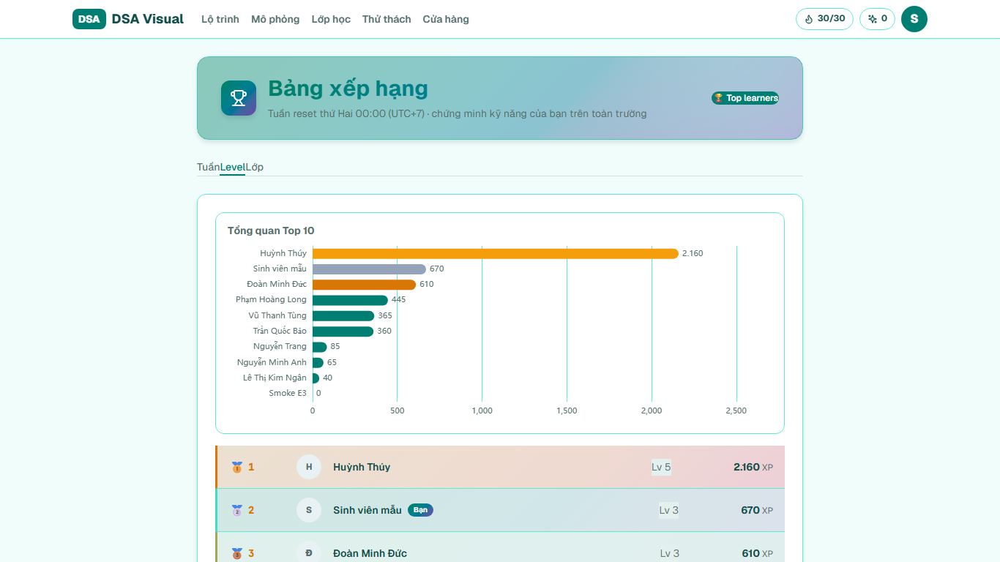
*Hình 4.11: Bảng xếp hạng 3 tab Tuần, Level, Lớp. (Ảnh chụp từ ứng dụng — 13/08/2026)*

Xếp hạng người học theo 3 tab: Tuần (reset thứ Hai hằng tuần), Level (theo tổng kinh nghiệm) và Lớp (theo lớp học của mình). Bảng phân trang 20 dòng, ghim vị trí của người dùng nếu nằm ngoài top 50, bấm vào một người xem hồ sơ học tập của họ.

#### Màn 32 — Hồ sơ

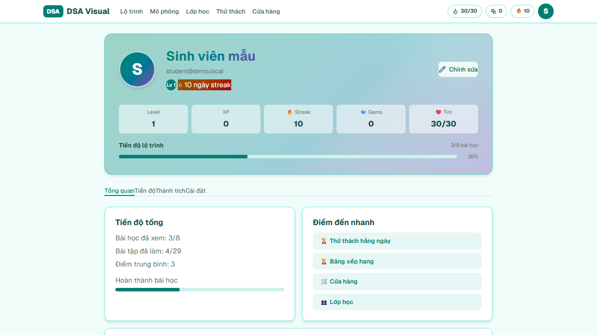
*Hình 4.12: Hồ sơ cá nhân với 4 tab Tổng quan, Tiến độ, Thành tích, Cài đặt. (Ảnh chụp từ ứng dụng — 13/08/2026)*

Trang hồ sơ trả lời câu hỏi "Tôi đang ở đâu?": tổng quan level, XP, streak, tim, gems, tiến độ lộ trình; 4 tab Tổng quan/Tiến độ/Thành tích/Cài đặt, mỗi tab một component tách. Có thẻ tắt nhanh sang Quest, Bảng xếp hạng và Shop; trong Cài đặt đổi mật khẩu, bật xác thực 2 lớp và dark mode.

(nguồn: SDD §8.4, §8.5; SCREEN_MAP)

## 4.3 Thiết kế dữ liệu

### 4.3.1 Sơ đồ quan hệ thực thể (ERD)

Cơ sở dữ liệu gồm 33 bảng chia 2 nhóm: lõi học tập 25 bảng (tài khoản, mã OTP 2FA, nội dung bài học, bài tập, tiến độ, lớp học, lộ trình) và gamification/code 8 bảng (nhiệm vụ, shop, đá quý, Premium, code runner). Users xuất hiện ở cả 2 sơ đồ để vẽ quan hệ, không đếm thêm.

(a) ERD lõi học tập (25 bảng):

```mermaid
erDiagram
    Users ||--o{ RefreshTokens : has
    Users ||--o{ PasswordResetTokens : has
    Users ||--o{ OtpCodes : "2FA email"
    Users ||--o{ UserProgress : has
    Users ||--o{ Favorites : has
    Users ||--o{ ExerciseSubmissions : submits
    Users ||--o{ LessonNotes : "owns"
    Users ||--o{ UserAchievements : earns
    Users ||--o{ ContentFeedback : gives
    Users ||--o{ BugReports : reports
    Users }o--o{ Classes : "manages (OwnerId)"
    Topics ||--o{ Topics : "parent"
    Topics ||--o{ Lessons : contains
    Lessons ||--o{ LessonSimulations : has
    Lessons ||--o{ Exercises : has
    Lessons ||--o{ UserProgress : tracked
    Lessons ||--o{ LessonNotes : "noted"
    Lessons ||--o{ ContentFeedback : receives
    Exercises ||--o{ Questions : has
    Exercises ||--o{ ExerciseSubmissions : receives
    Classes ||--o{ ClassMembers : has
    Classes ||--o{ ClassAssignments : assigns
    ClassMembers ||--o{ Users : includes
    Achievements ||--o{ UserAchievements : unlocked_by
    LearningPaths }o--o{ Topics : "thuộc (tùy chọn)"
    LearningPaths ||--o{ LearningPathNodes : has
    LearningPathNodes ||--o{ Lessons : "node bài học (tùy chọn)"
    LearningPathNodes ||--o{ Exercises : "stages (FinalTestId/NodeId)"
    Users ||--o{ NodeSessions : "mở phiên (vào node)"
    LearningPathNodes ||--o{ NodeSessions : "theo dõi"
    Users ||--o{ UserNodeProgress : "tiến độ node"
    LearningPathNodes ||--o{ UserNodeProgress : "chấm điểm"

    Users { int Id PK; string Email UK; string PasswordHash; string DisplayName; int Role; bool IsActive; bool IsPrimaryAdmin; bool TwoFactorEnabled; string? AvatarUrl; date? StreakLastProcessed; datetime CreatedAt; datetime? UpdatedAt; datetime? DeletedAt }
    RefreshTokens { int Id PK; int UserId FK; string TokenHash UK; datetime ExpiresAt; datetime? RevokedAt; string? CreatedByIp; datetime CreatedAt }
    PasswordResetTokens { int Id PK; int UserId FK; string TokenHash UK; datetime ExpiresAt; bool Used; datetime CreatedAt }
    OtpCodes { int Id PK; int UserId FK; string CodeHash; string Purpose; datetime ExpiresAt; bool Used; datetime CreatedAt }
    Topics { int Id PK; int? ParentId FK; string Name; string Description; int SortOrder; int CreatedBy FK; datetime CreatedAt; datetime? UpdatedAt; datetime? DeletedAt }
    Lessons { int Id PK; int TopicId FK; string Title; string Description; string ContentHtml; int SortOrder; int Status; int CreatedBy FK; int? UpdatedBy; datetime CreatedAt; datetime? UpdatedAt; datetime? DeletedAt }
    LessonSimulations { int Id PK; int LessonId FK; string SimulationKey; string Title; string? DefaultInputJson; int SortOrder }
    LessonNotes { int Id PK; int UserId FK; int LessonId FK; string ContentHtml; datetime UpdatedAt }
    Exercises { int Id PK; int LessonId FK; int? NodeId FK; int? Stage; string? ConfigJson; string Title; string Description; int Type; int? DurationMinutes; int MaxScore; int Status; int CreatedBy FK; datetime CreatedAt; datetime? UpdatedAt; datetime? DeletedAt }
    Questions { int Id PK; int ExerciseId FK; string Content; string OptionsJson; string AnswerJson; string? Explanation; string? Hint1; string? Hint2; string? Hint3; string? WrongExplanationsJson; bool KeepOrder; int Points; int SortOrder }
    ExerciseSubmissions { int Id PK; int UserId FK; int ExerciseId FK; int? ClassAssignmentId FK NULL; int Score; string AnswersJson; string ResultJson; datetime SubmittedAt; int? DurationSeconds }
    UserProgress { int Id PK; int UserId FK; int LessonId FK; bool Viewed; int SimulationCount; int? BestScore; datetime? CompletedAt; datetime UpdatedAt }
    Favorites { int Id PK; int UserId FK; string SimulationKey; string? InputJson; datetime CreatedAt }
    Settings { int Id PK; string Key UK; string Value; string Description; datetime UpdatedAt; int UpdatedBy }
    Classes { int Id PK; string Name; string InviteCode UK; string? Semester; string? Description; int OwnerId FK; int Status; datetime CreatedAt; datetime? DeletedAt }
    ClassMembers { int Id PK; int ClassId FK; int UserId FK; datetime JoinedAt }
    ClassAssignments { int Id PK; int ClassId FK; int? LessonId FK; int? ExerciseId FK; datetime? DueAt; datetime CreatedAt }
    Achievements { int Id PK; string Code UK; string Name; string Description; string? IconUrl; string ConditionJson; int SortOrder }
    UserAchievements { int Id PK; int UserId FK; int AchievementId FK; datetime EarnedAt }
    ContentFeedback { int Id PK; int UserId FK; int LessonId FK; int Rating; string? Comment; datetime CreatedAt; datetime? UpdatedAt }
    BugReports { int Id PK; int? UserId FK; string Description; string? ContextJson; int Status; int? AssigneeId FK; datetime CreatedAt; datetime? ResolvedAt }
    LearningPaths { int Id PK; string Title; string? Description; int? TopicId FK; int SortOrder; bool IsActive; int CreatedBy FK }
    LearningPathNodes { int Id PK; int PathId FK; string Title; int? LessonId FK; int SortOrder; int? FinalTestId FK }
    NodeSessions { int Id PK; int UserId FK; int NodeId FK; datetime StartedAt; datetime ExpiresAt; int? Stage; int? StepIndex }
    UserNodeProgress { int Id PK; int UserId FK; int NodeId FK; int Status; int Stars; int NodeScore; datetime? UnlockedAt; datetime? PassedAt; datetime UpdatedAt }
```

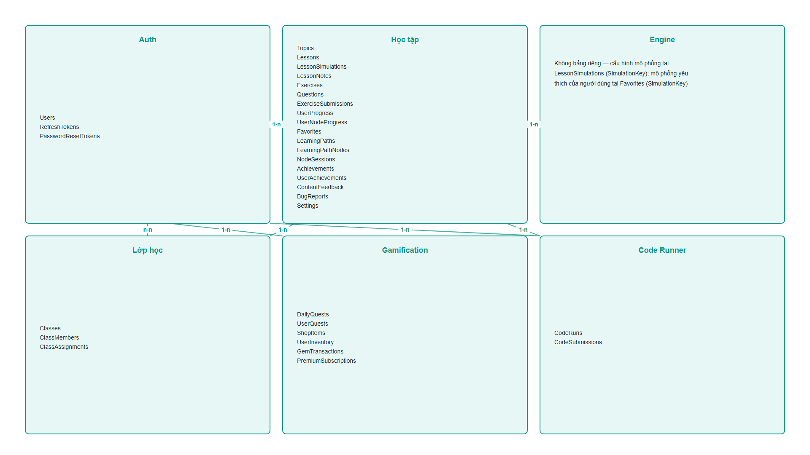
*Hình 4.13: ERD tổng quan lõi học tập 24 bảng. (ảnh placeholder — chụp thật thay sau)*

(b) ERD gamification/code (8 bảng + Users tham chiếu):

```mermaid
erDiagram
    Users ||--o{ UserQuests : completes
    Users ||--o{ UserInventory : owns
    Users ||--o{ GemTransactions : transacts
    Users ||--o{ PremiumSubscriptions : subscribes
    Users ||--o{ CodeRuns : runs
    Users ||--o{ CodeSubmissions : submits
    DailyQuests ||--o{ UserQuests : has
    ShopItems ||--o{ UserInventory : purchased
    Exercises ||--o{ CodeRuns : "chạy thử (tùy chọn)"
    Exercises ||--o{ CodeSubmissions : "chấm điểm"

    Users { int Id PK; string Email UK; string PasswordHash; string DisplayName; int Role; bool IsActive; bool IsPrimaryAdmin; bool TwoFactorEnabled; string? AvatarUrl; int Hearts; int HeartsMax; datetime LastHeartAt; int Gems; int Xp; int StreakDays; int StreakFreeze; date? StreakLastProcessed; datetime? PremiumUntil; date? LastActivityDate; datetime CreatedAt; datetime? UpdatedAt; datetime? DeletedAt }
    DailyQuests { int Id PK; string QuestKey UK; string Title; int Type; string ConditionJson; string RewardJson; bool PoolEnabled }
    UserQuests { int Id PK; int UserId FK; int QuestId FK; date QuestDate; int Progress; bool Claimed }
    ShopItems { int Id PK; string ItemKey UK; string Name; int PriceGems; int MaxStack; int Type; int? DurationHours }
    UserInventory { int Id PK; int UserId FK; int ItemId FK; int Quantity; datetime PurchasedAt; datetime? ExpiresAt }
    GemTransactions { int Id PK; int UserId FK; int Type; int Amount; string? RefType; string? RefId; datetime CreatedAt }
    PremiumSubscriptions { int Id PK; int UserId FK; string? PlanId; datetime StartedAt; datetime? ExpiresAt; int Status; string? OrderRef; datetime CreatedAt }
    CodeRuns { int Id PK; int UserId FK; int? ExerciseId FK; string Code; string InputJson; int Status; string? OutputJson; string? ErrorJson; string? TraceJson; int DurationMs; datetime CreatedAt }
    CodeSubmissions { int Id PK; int UserId FK; int ExerciseId FK; string Code; int Score; int PassedTests; int TotalTests; string ResultJson; datetime SubmittedAt }
```

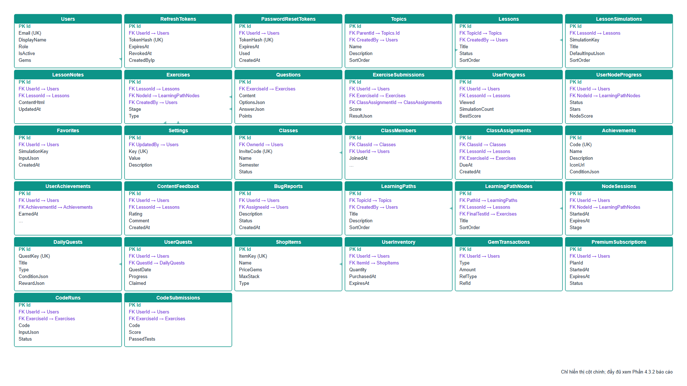
*Hình 4.14: ERD chi tiết nhóm gamification và code runner 8 bảng. (ảnh placeholder — chụp thật thay sau)*

Hai nhóm bảng được tách để dễ đọc: nhóm lõi phục vụ nội dung học và tiến độ, nhóm gamification phục vụ động lực học (tim, đá quý, nhiệm vụ, bảng xếp hạng) và lịch sử chấm code. Bảng giao dịch như GemTransactions và CodeRuns chỉ ghi thêm, không sửa xóa, phục vụ đối soát sau này.

(nguồn: SDD §7.1, §7.2)

### 4.3.2 Chi tiết thực thể (Data Dictionary)

Quy ước chung: mọi bảng có cột `Id int` làm khóa chính tự tăng; kiểu ngày giờ dùng datetime2; các bảng nội dung có CreatedAt; xóa dùng xóa mềm qua cột DeletedAt. Phần này liệt kê đủ 32 bảng, chia 6 nhóm, chỉ mô tả các cột quan trọng nhất.

**Nhóm 1 — Tài khoản, phiên và hệ thống**

**Bảng 4.5: Users — Tài khoản người dùng kèm số liệu gamification cá nhân.**

| Tên cột | Kiểu dữ liệu | Khóa | Bắt buộc | Mô tả chi tiết |
|---|---|---|---|---|
| Id | int | PK | Có | Số định danh tài khoản, tự tăng. |
| Email | nvarchar(256) | UK | Có | Email đăng nhập, chuẩn hóa viết thường. |
| PasswordHash | nvarchar(256) | — | Có | Mật khẩu đã băm, không lưu bản rõ. |
| DisplayName | nvarchar(100) | — | Có | Tên hiển thị trên màn hình. |
| Role | int | — | Có | Vai trò: 0 sinh viên, 1 giảng viên, 2 chờ duyệt, 3 quản trị. |
| IsActive | bit | — | Có | Tài khoản đang hoạt động hay bị khóa. |
| IsPrimaryAdmin | bit | — | Có | Đánh dấu quản trị chính duy nhất của hệ thống. |
| TwoFactorEnabled | bit | — | Có | Bật xác thực 2 lớp qua email hay không. |
| AvatarUrl | nvarchar(500) | — | Không | Đường dẫn ảnh đại diện sau khi tải lên. |
| Hearts | int | — | Có | Số tim còn lại để vào node luyện tập. |
| HeartsMax | int | — | Có | Trần tim: bản thường 10, Premium 30. |
| LastHeartAt | datetime2 | — | Có | Thời điểm tim bắt đầu hồi, tính lại khi đọc. |
| Gems | int | — | Có | Số đá quý dùng mua vật phẩm trong shop. |
| Xp | int | — | Có | Tổng kinh nghiệm tích lũy, quy ra cấp độ. |
| StreakDays | int | — | Có | Số ngày học liên tục liền mạch. |
| StreakFreeze | int | — | Có | Số ngày đóng băng chuỗi còn dùng, tối đa 2. |
| PremiumUntil | datetime2 | — | Không | Hạn cuối gói Premium, hết hạn tự hạ cấp. |
| CreatedAt/UpdatedAt/DeletedAt | datetime2 | — | Có/Không | Thời gian tạo, cập nhật và đánh dấu xóa mềm. |

**Bảng 4.6: RefreshTokens — Phiên đăng nhập dạng refresh token.**

| Tên cột | Kiểu dữ liệu | Khóa | Bắt buộc | Mô tả chi tiết |
|---|---|---|---|---|
| Id | int | PK | Có | Số định danh phiên làm mới. |
| UserId | int | FK | Có | Tài khoản sở hữu phiên. |
| TokenHash | nvarchar(64) | UK | Có | Mã băm của token thô, không lưu token gốc. |
| PreviousTokenHash | nvarchar(64) | — | Không | Token bị thay bởi token này khi xoay vòng. |
| ExpiresAt | datetime2 | — | Có | Hạn dùng 7 ngày của phiên. |
| RevokedAt | datetime2 | — | Không | Thời điểm thu hồi khi đăng xuất hoặc đổi mật khẩu. |
| CreatedAt | datetime2 | — | Có | Thời điểm tạo phiên. |

**Bảng 4.7: PasswordResetTokens — Mã đặt lại mật khẩu.**

| Tên cột | Kiểu dữ liệu | Khóa | Bắt buộc | Mô tả chi tiết |
|---|---|---|---|---|
| Id | int | PK | Có | Số định danh mã đặt lại. |
| UserId | int | FK | Có | Tài khoản yêu cầu đặt lại mật khẩu. |
| TokenHash | nvarchar(64) | UK | Có | Mã băm của token khôi phục. |
| ExpiresAt | datetime2 | — | Có | Hạn dùng 30 phút của mã. |
| Used | bit | — | Có | Đã dùng hay chưa, mỗi mã dùng một lần. |
| CreatedAt | datetime2 | — | Có | Thời điểm tạo mã. |

**Bảng 4.8: Settings — Cấu hình hệ thống.**

| Tên cột | Kiểu dữ liệu | Khóa | Bắt buộc | Mô tả chi tiết |
|---|---|---|---|---|
| Id | int | PK | Có | Số định danh cấu hình. |
| Key | nvarchar(100) | UK | Có | Tên cấu hình, ví dụ site.name, auth.maxLoginAttempts. |
| Value | nvarchar(500) | — | Có | Giá trị của cấu hình. |
| Description | nvarchar(500) | — | Không | Ghi chú cấu hình này dùng để làm gì. |
| UpdatedAt | datetime2 | — | Có | Thời điểm sửa gần nhất. |
| UpdatedBy | int | FK | Có | Người sửa cấu hình. |

**Nhóm 2 — Nội dung học tập**

**Bảng 4.9: Topics — Chủ đề bài học, tối đa 2 cấp cha con.**

| Tên cột | Kiểu dữ liệu | Khóa | Bắt buộc | Mô tả chi tiết |
|---|---|---|---|---|
| Id | int | PK | Có | Số định danh chủ đề. |
| ParentId | int | FK | Không | Chủ đề cha, rỗng với chủ đề cấp 1. |
| Name | nvarchar(100) | — | Có | Tên chủ đề, duy nhất trong cùng cha. |
| Description | nvarchar(500) | — | Không | Mô tả ngắn nội dung chủ đề. |
| SortOrder | int | — | Có | Thứ tự hiển thị trong danh sách. |
| CreatedBy | int | FK | Có | Tài khoản tạo chủ đề. |
| CreatedAt/UpdatedAt/DeletedAt | datetime2 | — | Có/Không | Thời gian tạo, sửa, xóa mềm. |

**Bảng 4.10: Lessons — Bài học lý thuyết, đầy đủ cột quan trọng.**

| Tên cột | Kiểu dữ liệu | Khóa | Bắt buộc | Mô tả chi tiết |
|---|---|---|---|---|
| Id | int | PK | Có | Số định danh bài học. |
| TopicId | int | FK | Có | Chủ đề chứa bài học. |
| Title | nvarchar(200) | — | Có | Tiêu đề bài học. |
| Description | nvarchar(500) | — | Không | Mô tả ngắn bài học. |
| ContentHtml | nvarchar(max) | — | Có | Nội dung lý thuyết đã làm sạch mã HTML. |
| SortOrder | int | — | Có | Thứ tự bài trong chủ đề. |
| Status | int | — | Có | Trạng thái: 0 nháp, 1 công khai, 2 ẩn. |
| CreatedBy | int | FK | Có | Giảng viên tạo bài, giữ quyền sở hữu. |
| UpdatedBy | int | FK | Không | Người sửa bài gần nhất. |
| CreatedAt/UpdatedAt/DeletedAt | datetime2 | — | Có/Không | Thời gian tạo, sửa, xóa mềm. |

**Bảng 4.11: LessonSimulations — Mô phỏng gắn vào bài học.**

| Tên cột | Kiểu dữ liệu | Khóa | Bắt buộc | Mô tả chi tiết |
|---|---|---|---|---|
| Id | int | PK | Có | Số định danh liên kết. |
| LessonId | int | FK | Có | Bài học chứa mô phỏng. |
| SimulationKey | nvarchar(100) | — | Có | Mã mô phỏng như sort.bubble, duy nhất trong bài. |
| Title | nvarchar(200) | — | Có | Tên hiển thị của mô phỏng trong bài. |
| DefaultInputJson | nvarchar(max) | — | Không | Bộ dữ liệu mẫu mặc định khi mở mô phỏng. |
| SortOrder | int | — | Có | Thứ tự thẻ mô phỏng trong bài. |

**Bảng 4.12: LessonNotes — Ghi chú cá nhân của người học trên bài học.**

| Tên cột | Kiểu dữ liệu | Khóa | Bắt buộc | Mô tả chi tiết |
|---|---|---|---|---|
| Id | int | PK | Có | Số định danh ghi chú. |
| UserId | int | FK | Có | Người học viết ghi chú. |
| LessonId | int | FK | Có | Bài học được ghi chú, mỗi người một ghi chú mỗi bài. |
| ContentHtml | nvarchar(max) | — | Có | Nội dung ghi chú đã làm sạch. |
| UpdatedAt | datetime2 | — | Có | Thời điểm tự lưu gần nhất. |

**Bảng 4.13: Exercises — Bài tập, đầy đủ cột quan trọng.**

| Tên cột | Kiểu dữ liệu | Khóa | Bắt buộc | Mô tả chi tiết |
|---|---|---|---|---|
| Id | int | PK | Có | Số định danh bài tập. |
| LessonId | int | FK | Có | Bài học chứa bài tập. |
| NodeId | int | FK | Không | Node luyện tập sở hữu bài tập (bậc 1/2/3). |
| Stage | int | — | Không | Bậc trong Ladder: 1 quiz, 2 lab, 3 code. |
| ConfigJson | nvarchar(max) | — | Không | Cấu hình lab/code: chữ ký hàm, test ẩn. |
| Title | nvarchar(200) | — | Có | Tiêu đề bài tập. |
| Description | nvarchar(500) | — | Không | Hướng dẫn làm bài. |
| Type | int | — | Có | Loại: 0 trắc nghiệm, 1 dự đoán bước, 2 lab, 3 code. |
| DurationMinutes | int | — | Không | Giới hạn thời gian, rỗng là không giới hạn. |
| MaxScore | int | — | Có | Tổng điểm tối đa, tính lại khi lưu. |
| Status | int | — | Có | Trạng thái: 0 nháp, 1 công khai. |
| CreatedBy | int | FK | Có | Người soạn bài tập. |
| DeletedAt | datetime2 | — | Không | Đánh dấu xóa mềm. |

**Bảng 4.14: Questions — Câu hỏi trong bài tập.**

| Tên cột | Kiểu dữ liệu | Khóa | Bắt buộc | Mô tả chi tiết |
|---|---|---|---|---|
| Id | int | PK | Có | Số định danh câu hỏi. |
| ExerciseId | int | FK | Có | Bài tập chứa câu hỏi. |
| Content | nvarchar(max) | — | Có | Nội dung câu hỏi dạng Markdown. |
| OptionsJson | nvarchar(max) | — | Có | Danh sách phương án A, B, C, D. |
| AnswerJson | nvarchar(max) | — | Có | Đáp án đúng theo loại câu hỏi. |
| Explanation | nvarchar(max) | — | Không | Giải thích hiển thị sau khi nộp bài. |
| Hint1..Hint3 | nvarchar(500) | — | Không | Ba mức gợi ý, tốn token khi xem. |
| KeepOrder | bit | — | Có | Giữ nguyên thứ tự phương án, không xáo trộn. |
| Points | int | — | Có | Điểm của câu, từ 1 đến 10. |
| SortOrder | int | — | Có | Thứ tự câu trong bài. |

**Bảng 4.15: Favorites — Mô phỏng yêu thích của người dùng.**

| Tên cột | Kiểu dữ liệu | Khóa | Bắt buộc | Mô tả chi tiết |
|---|---|---|---|---|
| Id | int | PK | Có | Số định danh mục yêu thích. |
| UserId | int | FK | Có | Người dùng lưu mô phỏng. |
| SimulationKey | nvarchar(100) | — | Có | Mã mô phỏng được lưu, mỗi người một lần. |
| InputJson | nvarchar(max) | — | Không | Bộ dữ liệu đã cấu hình lúc lưu. |
| CreatedAt | datetime2 | — | Có | Thời điểm thêm yêu thích. |
**Nhóm 3 — Tiến độ, luyện tập và phản hồi**

**Bảng 4.16: UserProgress — Tiến độ người học trên từng bài học.**

| Tên cột | Kiểu dữ liệu | Khóa | Bắt buộc | Mô tả chi tiết |
|---|---|---|---|---|
| Id | int | PK | Có | Số định danh dòng tiến độ. |
| UserId | int | FK | Có | Người học. |
| LessonId | int | FK | Có | Bài học, mỗi người một dòng mỗi bài. |
| Viewed | bit | — | Có | Đã mở xem bài học hay chưa. |
| SimulationCount | int | — | Có | Số lần chạy mô phỏng của bài. |
| BestScore | int | — | Không | Điểm cao nhất đạt được. |
| CompletedAt | datetime2 | — | Không | Thời điểm xem xong và có điểm. |
| UpdatedAt | datetime2 | — | Có | Thời điểm cập nhật gần nhất. |

**Bảng 4.17: UserNodeProgress — Tiến độ node trên Learning Path.**

| Tên cột | Kiểu dữ liệu | Khóa | Bắt buộc | Mô tả chi tiết |
|---|---|---|---|---|
| Id | int | PK | Có | Số định danh dòng tiến độ node. |
| UserId | int | FK | Có | Người học. |
| NodeId | int | FK | Có | Node trên lộ trình, mỗi người một dòng mỗi node. |
| Status | int | — | Có | Trạng thái: 0 khóa, 1 mở, 2 đã qua. |
| Stars | int | — | Có | Số sao đạt được từ 1 đến 3. |
| NodeScore | int | — | Có | Điểm node, giữ giá trị cao nhất. |
| UnlockedAt | datetime2 | — | Không | Thời điểm node được mở khóa. |
| PassedAt | datetime2 | — | Không | Thời điểm qua cả 3 bậc. |
| UpdatedAt | datetime2 | — | Có | Thời điểm cập nhật gần nhất. |

**Bảng 4.18: NodeSessions — Phiên học 30 phút tại một node, đầy đủ cột quan trọng.**

| Tên cột | Kiểu dữ liệu | Khóa | Bắt buộc | Mô tả chi tiết |
|---|---|---|---|---|
| Id | int | PK | Có | Số định danh phiên. |
| UserId | int | FK | Có | Người học, mỗi người một phiên mỗi node. |
| NodeId | int | FK | Có | Node đang học. |
| StartedAt | datetime2 | — | Có | Thời điểm vào node, dùng giờ máy chủ. |
| ExpiresAt | datetime2 | — | Có | Hạn phiên 30 phút, hết hạn vào lại phải trừ tim. |
| Stage | int | — | Không | Bậc đang dở: 1 quiz, 2 lab, 3 code. |
| StepIndex | int | — | Không | Bước mô phỏng đang dở để học tiếp. |

**Bảng 4.19: ExerciseSubmissions — Bài làm đã nộp của người học.**

| Tên cột | Kiểu dữ liệu | Khóa | Bắt buộc | Mô tả chi tiết |
|---|---|---|---|---|
| Id | int | PK | Có | Số định danh bài nộp. |
| UserId | int | FK | Có | Người làm bài. |
| ExerciseId | int | FK | Có | Bài tập được làm. |
| ClassAssignmentId | int | FK | Không | Bài giao qua lớp nếu nộp theo lớp. |
| Score | int | — | Có | Điểm đạt được. |
| AnswersJson | nvarchar(max) | — | Có | Câu trả lời đã chọn. |
| ResultJson | nvarchar(max) | — | Có | Kết quả chi tiết để tái hiện màn kết quả. |
| DurationSeconds | int | — | Không | Thời gian làm bài. |
| SubmittedAt | datetime2 | — | Có | Thời điểm nộp bài. |

**Bảng 4.20: LearningPaths — Lộ trình học.**

| Tên cột | Kiểu dữ liệu | Khóa | Bắt buộc | Mô tả chi tiết |
|---|---|---|---|---|
| Id | int | PK | Có | Số định danh lộ trình. |
| Title | nvarchar(200) | — | Có | Tên lộ trình. |
| Description | nvarchar(500) | — | Không | Mô tả lộ trình. |
| TopicId | int | FK | Không | Chủ đề gắn với lộ trình, tùy chọn. |
| SortOrder | int | — | Có | Thứ tự lộ trình, mở khóa tuần tự. |
| IsActive | bit | — | Có | Lộ trình còn hiển thị hay không. |
| CreatedBy | int | FK | Có | Người tạo lộ trình. |

**Bảng 4.21: LearningPathNodes — Node trên lộ trình.**

| Tên cột | Kiểu dữ liệu | Khóa | Bắt buộc | Mô tả chi tiết |
|---|---|---|---|---|
| Id | int | PK | Có | Số định danh node. |
| PathId | int | FK | Có | Lộ trình chứa node. |
| Title | nvarchar(200) | — | Có | Tên node hiển thị trên bản đồ. |
| LessonId | int | FK | Không | Bài học của node, rỗng với node luyện tập tổng hợp. |
| SortOrder | int | — | Có | Thứ tự node, duy nhất trong lộ trình. |
| FinalTestId | int | FK | Không | Bài kiểm tra cuối nếu node là final test. |

**Bảng 4.22: ContentFeedback — Đánh giá nội dung bài học.**

| Tên cột | Kiểu dữ liệu | Khóa | Bắt buộc | Mô tả chi tiết |
|---|---|---|---|---|
| Id | int | PK | Có | Số định danh đánh giá. |
| UserId | int | FK | Có | Người đánh giá. |
| LessonId | int | FK | Có | Bài được đánh giá, mỗi người một lần mỗi bài. |
| Rating | int | — | Có | Số sao từ 1 đến 5. |
| Comment | nvarchar(200) | — | Không | Nhận xét ngắn, tối đa 200 ký tự. |
| CreatedAt/UpdatedAt | datetime2 | — | Có | Thời điểm gửi và sửa đánh giá. |

**Bảng 4.23: BugReports — Báo lỗi từ người dùng.**

| Tên cột | Kiểu dữ liệu | Khóa | Bắt buộc | Mô tả chi tiết |
|---|---|---|---|---|
| Id | int | PK | Có | Số định danh báo lỗi. |
| UserId | int | FK | Không | Người báo lỗi, rỗng với khách. |
| Description | nvarchar(2000) | — | Có | Mô tả sự cố. |
| ContextJson | nvarchar(max) | — | Không | Bối cảnh: đường dẫn, trình duyệt, bước mô phỏng. |
| Status | int | — | Có | Trạng thái: 0 mới, 1 đang xử lý, 2 đã xử lý, 3 đóng. |
| AssigneeId | int | FK | Không | Người phụ trách xử lý. |
| CreatedAt/ResolvedAt | datetime2 | — | Có/Không | Thời điểm tạo và giải quyết. |

**Nhóm 4 — Lớp học**

**Bảng 4.24: Classes — Lớp học do giảng viên tạo.**

| Tên cột | Kiểu dữ liệu | Khóa | Bắt buộc | Mô tả chi tiết |
|---|---|---|---|---|
| Id | int | PK | Có | Số định danh lớp. |
| Name | nvarchar(200) | — | Có | Tên lớp. |
| InviteCode | nvarchar(6) | UK | Có | Mã mời 6 ký tự chữ hoa và số. |
| Semester | nvarchar(50) | — | Không | Học kỳ của lớp. |
| Description | nvarchar(500) | — | Không | Mô tả lớp. |
| OwnerId | int | FK | Có | Giảng viên sở hữu lớp. |
| Status | int | — | Có | Trạng thái: 0 mở, 1 đóng. |
| CreatedAt/DeletedAt | datetime2 | — | Có/Không | Thời gian tạo và xóa mềm. |

**Bảng 4.25: ClassMembers — Sinh viên trong lớp.**

| Tên cột | Kiểu dữ liệu | Khóa | Bắt buộc | Mô tả chi tiết |
|---|---|---|---|---|
| Id | int | PK | Có | Số định danh thành viên. |
| ClassId | int | FK | Có | Lớp tham gia. |
| UserId | int | FK | Có | Sinh viên, mỗi người một dòng mỗi lớp. |
| JoinedAt | datetime2 | — | Có | Thời điểm vào lớp. |

**Bảng 4.26: ClassAssignments — Bài tập giao cho lớp.**

| Tên cột | Kiểu dữ liệu | Khóa | Bắt buộc | Mô tả chi tiết |
|---|---|---|---|---|
| Id | int | PK | Có | Số định danh bài giao. |
| ClassId | int | FK | Có | Lớp được giao. |
| LessonId | int | FK | Không | Bài học được giao, bắt buộc có bài học hoặc bài tập. |
| ExerciseId | int | FK | Không | Bài tập được giao. |
| DueAt | datetime2 | — | Không | Hạn nộp, quá hạn không nộp được. |
| CreatedAt | datetime2 | — | Có | Thời điểm giao bài. |
**Nhóm 5 — Gamification và thành tích**

**Bảng 4.27: DailyQuests — Mẫu nhiệm vụ hằng ngày.**

| Tên cột | Kiểu dữ liệu | Khóa | Bắt buộc | Mô tả chi tiết |
|---|---|---|---|---|
| Id | int | PK | Có | Số định danh mẫu nhiệm vụ. |
| QuestKey | nvarchar(100) | UK | Có | Mã nhiệm vụ như learn-1-node. |
| Title | nvarchar(200) | — | Có | Tên nhiệm vụ hiển thị. |
| Type | int | — | Có | Mức khó: 0 dễ, 1 trung bình, 2 khó. |
| ConditionJson | nvarchar(max) | — | Có | Điều kiện hoàn thành, ví dụ qua 1 node. |
| RewardJson | nvarchar(max) | — | Có | Phần thưởng khi hoàn thành. |
| PoolEnabled | bit | — | Có | Mẫu còn nằm trong danh sách chọn hay không. |

**Bảng 4.28: UserQuests — Nhiệm vụ hằng ngày của từng người.**

| Tên cột | Kiểu dữ liệu | Khóa | Bắt buộc | Mô tả chi tiết |
|---|---|---|---|---|
| Id | int | PK | Có | Số định danh nhiệm vụ cá nhân. |
| UserId | int | FK | Có | Người nhận nhiệm vụ. |
| QuestId | int | FK | Có | Mẫu nhiệm vụ được giao. |
| QuestDate | date | — | Có | Ngày của nhiệm vụ, reset lúc 00:00. |
| Progress | int | — | Có | Số tiến độ đã đạt. |
| Claimed | bit | — | Có | Đã nhận thưởng hay chưa. |

**Bảng 4.29: ShopItems — Vật phẩm bán trong cửa hàng.**

| Tên cột | Kiểu dữ liệu | Khóa | Bắt buộc | Mô tả chi tiết |
|---|---|---|---|---|
| Id | int | PK | Có | Số định danh vật phẩm. |
| ItemKey | nvarchar(100) | UK | Có | Mã vật phẩm như hint-token, streak-freeze. |
| Name | nvarchar(200) | — | Có | Tên vật phẩm. |
| PriceGems | int | — | Có | Giá bằng đá quý. |
| MaxStack | int | — | Có | Số lượng tối đa sở hữu. |
| Type | int | — | Có | Loại: 0 dùng một lần, 1 vĩnh viễn, 2 có hạn. |
| DurationHours | int | — | Không | Số giờ hiệu lực với vật phẩm có hạn. |

**Bảng 4.30: UserInventory — Kho đồ của người dùng.**

| Tên cột | Kiểu dữ liệu | Khóa | Bắt buộc | Mô tả chi tiết |
|---|---|---|---|---|
| Id | int | PK | Có | Số định danh dòng kho. |
| UserId | int | FK | Có | Người sở hữu. |
| ItemId | int | FK | Có | Vật phẩm sở hữu, mỗi loại một dòng. |
| Quantity | int | — | Có | Số lượng đang có. |
| IsEquipped | bit | — | Có | Đang trang bị hay không, cùng loại chỉ một cái. |
| PurchasedAt | datetime2 | — | Có | Thời điểm mua. |
| ExpiresAt | datetime2 | — | Không | Hạn dùng với vật phẩm có hạn. |

**Bảng 4.31: GemTransactions — Lịch sử thu chi đá quý.**

| Tên cột | Kiểu dữ liệu | Khóa | Bắt buộc | Mô tả chi tiết |
|---|---|---|---|---|
| Id | int | PK | Có | Số định danh giao dịch. |
| UserId | int | FK | Có | Người thực hiện giao dịch. |
| Type | int | — | Có | Loại: 0 nhận, 1 chi tiêu. |
| Amount | int | — | Có | Số lượng, luôn dương. |
| RefType | nvarchar(50) | — | Không | Lý do: qua node, mua shop, nhiệm vụ. |
| RefId | int | — | Không | Đối tượng liên quan tới giao dịch. |
| CreatedAt | datetime2 | — | Có | Thời điểm giao dịch, chỉ ghi thêm không sửa. |

**Bảng 4.32: PremiumSubscriptions — Gói Premium đã đăng ký.**

| Tên cột | Kiểu dữ liệu | Khóa | Bắt buộc | Mô tả chi tiết |
|---|---|---|---|---|
| Id | int | PK | Có | Số định danh gói. |
| UserId | int | FK | Có | Người đăng ký. |
| PlanId | nvarchar(50) | — | Có | Gói 1, 3 hay 12 tháng. |
| StartedAt | datetime2 | — | Có | Thời điểm bắt đầu hiệu lực. |
| ExpiresAt | datetime2 | — | Không | Thời điểm hết hạn, hết hạn tự hạ cấp. |
| Status | int | — | Có | Trạng thái: 0 hoạt động, 1 hết hạn, 2 thanh toán thử. |
| OrderRef | nvarchar(100) | — | Không | Mã tham chiếu đơn hàng. |
| CreatedAt | datetime2 | — | Có | Thời điểm tạo gói. |

**Bảng 4.33: Achievements — Danh sách huy hiệu thành tích.**

| Tên cột | Kiểu dữ liệu | Khóa | Bắt buộc | Mô tả chi tiết |
|---|---|---|---|---|
| Id | int | PK | Có | Số định danh huy hiệu. |
| Code | nvarchar(100) | UK | Có | Mã huy hiệu như streak-7, sort-master. |
| Name | nvarchar(200) | — | Có | Tên huy hiệu. |
| Description | nvarchar(500) | — | Có | Mô tả điều kiện để người học hiểu. |
| ConditionJson | nvarchar(max) | — | Có | Điều kiện trao: đếm số lần, chuỗi ngày, điểm số. |
| SortOrder | int | — | Có | Thứ tự hiển thị. |

**Bảng 4.34: UserAchievements — Huy hiệu người dùng đã nhận.**

| Tên cột | Kiểu dữ liệu | Khóa | Bắt buộc | Mô tả chi tiết |
|---|---|---|---|---|
| Id | int | PK | Có | Số định danh huy hiệu đã trao. |
| UserId | int | FK | Có | Người nhận huy hiệu. |
| AchievementId | int | FK | Có | Huy hiệu được trao, mỗi người một lần mỗi loại. |
| EarnedAt | datetime2 | — | Có | Thời điểm nhận huy hiệu. |

**Nhóm 6 — Code Runner**

**Bảng 4.35: CodeRuns — Lần chạy thử code của người học.**

| Tên cột | Kiểu dữ liệu | Khóa | Bắt buộc | Mô tả chi tiết |
|---|---|---|---|---|
| Id | int | PK | Có | Số định danh lần chạy. |
| UserId | int | FK | Có | Người chạy code. |
| ExerciseId | int | FK | Không | Bài tập code liên quan nếu có. |
| Code | nvarchar(max) | — | Có | Mã nguồn đã chạy. |
| InputJson | nvarchar(max) | — | Có | Dữ liệu đầu vào của lần chạy. |
| Status | int | — | Có | Trạng thái: 0 chờ, 1 đang chạy, 2 thành công, 3 lỗi, 4 quá giờ. |
| OutputJson | nvarchar(max) | — | Không | Kết quả đầu ra. |
| ErrorJson | nvarchar(max) | — | Không | Thông báo lỗi nếu có. |
| TraceJson | nvarchar(max) | — | Không | Trace nén để tái hiện màn trực quan. |
| DurationMs | int | — | Có | Thời gian chạy tính bằng mili giây. |
| CreatedAt | datetime2 | — | Có | Thời điểm chạy, dọn sau 30 ngày. |

**Bảng 4.36: CodeSubmissions — Bài nộp code chấm bằng test ẩn.**

| Tên cột | Kiểu dữ liệu | Khóa | Bắt buộc | Mô tả chi tiết |
|---|---|---|---|---|
| Id | int | PK | Có | Số định danh bài nộp. |
| UserId | int | FK | Có | Người nộp bài. |
| ExerciseId | int | FK | Có | Bài tập code được nộp. |
| Code | nvarchar(max) | — | Có | Mã nguồn nộp. |
| Score | int | — | Có | Điểm đạt được. |
| PassedTests | int | — | Có | Số test ẩn vượt qua. |
| TotalTests | int | — | Có | Tổng số test ẩn. |
| ResultJson | nvarchar(max) | — | Có | Chi tiết kết quả từng test. |
| SubmittedAt | datetime2 | — | Có | Thời điểm nộp bài. |

(nguồn: SDD §7.3)
## 4.4 Thiết kế phần mềm

### 4.4.1 Kiến trúc backend 2 lớp

Backend gồm 2 project: DsaVisual.Api chứa Controller, DsaVisual.Application chứa Service và DbContext. Controller chỉ nhận DTO, gọi Service rồi trả kết quả; Service chứa toàn bộ nghiệp vụ và truy vấn DbContext trực tiếp qua DbSet (đọc dùng AsNoTracking). Luồng xử lý một yêu cầu như sau:

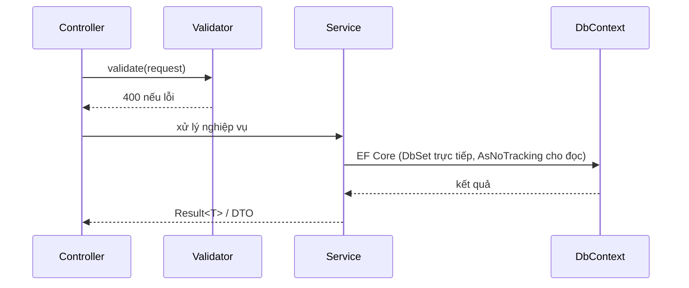
```mermaid
sequenceDiagram
    participant C as Controller
    participant V as Validator
    participant S as Service
    participant DB as DbContext
    C->>V: validate(request)
    V-->>C: 400 nếu lỗi
    C->>S: xử lý nghiệp vụ
    S->>DB: EF Core (DbSet trực tiếp, AsNoTracking cho đọc)
    DB-->>S: kết quả
    S-->>C: Result<T> / DTO
```

Hệ thống cố ý bỏ Repository pattern để giữ kiến trúc đơn giản theo NFR-17: quy mô 32 bảng không cần thêm tầng trừu tượng, Service dùng thẳng DbContext vẫn dễ kiểm thử tích hợp, giảm code và dễ bảo trì. Mọi Service trả `Result<T>` kèm mã lỗi tập trung, Controller map sang HTTP tương ứng.

(nguồn: SDD §5.1, §5.2)

### 4.4.2 Simulation Engine EDV

Mô-đun EDV (Execution-Driven Visualization) là trái tim của đồ án, trả lời phản hồi "cho code đến đâu, chạy visual đến đó" của bản cũ. Ý tưởng: mọi giải thuật trong danh mục được viết bằng mã TypeScript thật, mỗi giải thuật một hàm, và chạy thật qua StepExecutor — bộ thực thi có gắn thiết bị đo. Trong lúc chạy, StepExecutor ghi lại từng sự kiện TraceEvent: dòng code đang thực thi, snapshot biến, phần tử cần tô màu và lời giải thích tiếng Việt tự sinh. Hoạt ảnh trên canvas chỉ là phát lại chuỗi trace đó nên hình ảnh luôn khớp code thật, không thể lệch; hệ thống cấm hardcode chuỗi bước như bản cũ. Renderer chỉ đọc dữ liệu bước và vẽ, không chứa logic thuật toán. Các bước được sinh ngay trong một lần chạy theo mô hình "tạo trước, chơi sau" (batch) nên bước lùi miễn phí, dễ kiểm thử và dễ lưu trữ. Mỗi sự kiện trace có định dạng như sau:

```typescript
export interface TraceEvent {
  line: number;                  // dòng code trong template (1-based)
  vars: Record<string, unknown>; // snapshot biến tại bước này
  highlight: string[];           // id phần tử cần tô màu, VD: ['cell:2','cell:3']
  kind: TraceKind;               // assign, compare, swap, loop, call, return
  explanation: string;           // giải thích tiếng Việt tự sinh
}
```

Sơ đồ lớp của engine như sau:

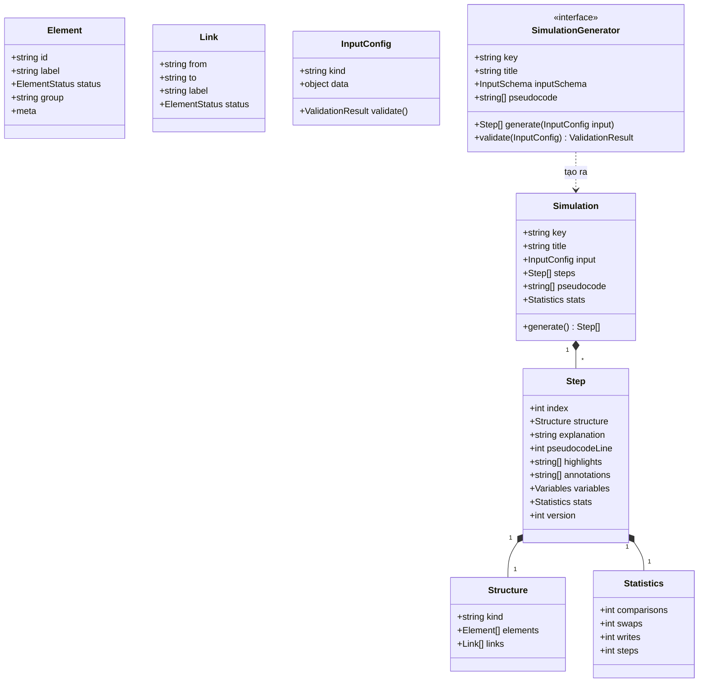
```mermaid
classDiagram
    class Simulation {
        +string key
        +string title
        +InputConfig input
        +Step[] steps
        +string[] pseudocode
        +Statistics stats
        +generate() Step[]
    }
    class Step {
        +int index
        +Structure structure
        +string explanation
        +int pseudocodeLine
        +string[] highlights
        +string[] annotations
        +Variables variables
        +Statistics stats
        +int version
    }
    class Structure {
        +string kind
        +Element[] elements
        +Link[] links
    }
    class Element {
        +string id
        +string label
        +ElementStatus status
        +string group
        +meta
    }
    class Link {
        +string from
        +string to
        +string label
        +ElementStatus status
    }
    class InputConfig {
        +string kind
        +object data
        +ValidationResult validate()
    }
    class Statistics {
        +int comparisons
        +int swaps
        +int writes
        +int steps
    }
    class SimulationGenerator {
        <<interface>>
        +string key
        +string title
        +InputSchema inputSchema
        +string[] pseudocode
        +Step[] generate(InputConfig input)
        +validate(InputConfig) ValidationResult
    }
    Simulation "1" *-- "*" Step
    Step "1" *-- "1" Structure
    Step "1" *-- "1" Statistics
    SimulationGenerator ..> Simulation : tạo ra
```

Mỗi `Step` chứa một snapshot cấu trúc dữ liệu bất biến, danh sách phần tử được tô màu và bộ đếm thống kê tích lũy (số so sánh, hoán đổi, ghi). Generator đăng ký qua Registry theo mã khóa kiểu `sort.bubble`, `search.binary`, `tree.bst-insert`... nên thêm mô phỏng mới không phải sửa lõi engine.

(nguồn: SDD §4)

### 4.4.3 Máy trạng thái mô phỏng

Màn mô phỏng chạy theo một máy trạng thái tập trung, mọi chuyển trạng thái đều phát event qua store `simulation` để các nút điều khiển và phím tắt phản ứng thống nhất:

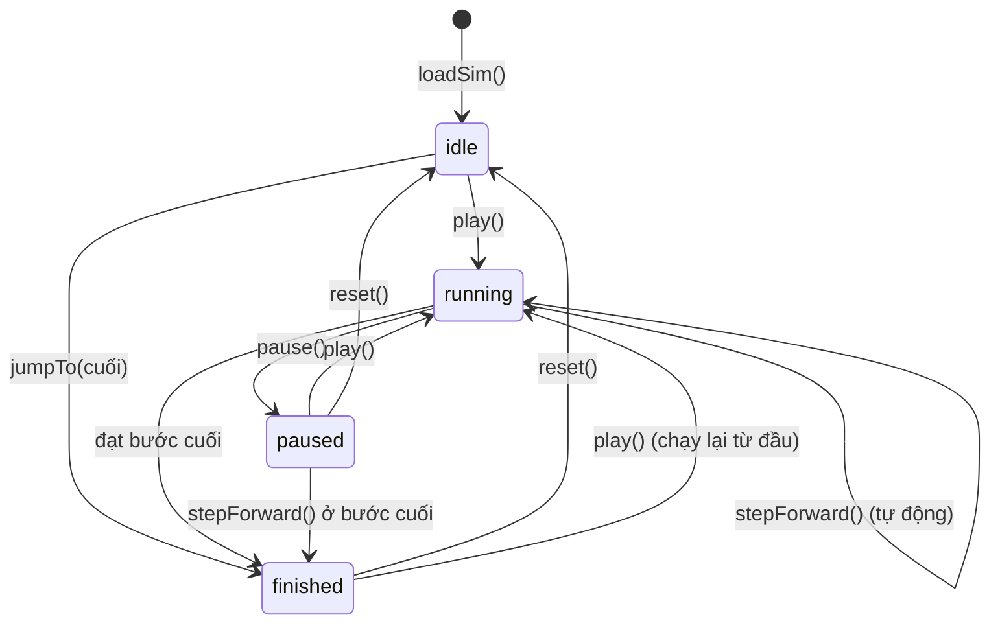
```mermaid
stateDiagram-v2
    [*] --> idle: loadSim()
    idle --> running: play()
    idle --> finished: jumpTo(cuối)
    running --> paused: pause()
    running --> finished: đạt bước cuối
    running --> running: stepForward() (tự động)
    paused --> running: play()
    paused --> idle: reset()
    paused --> finished: stepForward() ở bước cuối
    finished --> idle: reset()
    finished --> running: play() (chạy lại từ đầu)
```

Trạng thái `idle` là khi mới nạp mô phỏng, chưa chạy; `running` là đang tự động chuyển bước theo tốc độ (0.25x-4x); `paused` là dừng tạm giữ nguyên bước hiện tại; `finished` là đã chạy hết bước. Người học có thể nhảy thẳng tới bước cuối, tua lại từ đầu hoặc bước từng bước một, mọi đường đi đều quay về được trạng thái ban đầu bằng nút reset.

(nguồn: SDD §3.5)

# PHẦN 5: THỰC HIỆN – IMPLEMENT

## 5.1 Cơ sở dữ liệu

Hệ thống dùng phương pháp **Code-First**: mọi bảng được khai báo bằng entity C# trong `DsaVisual.Application/Persistence`, cấu hình quan hệ bằng Fluent API trong thư mục `Configurations/` (không dùng attribute trên entity), thay đổi cấu trúc thực hiện qua EF Core Migrations — đây là cách duy nhất đổi schema, không sửa DB trực tiếp. Entity sau được trích từ bảng `NodeSessions` (phiên học 30 phút — cốt lõi của cơ chế trừ tim):

```csharp
// DsaVisual.Application/Persistence/Entities/NodeSession.cs (trích)
public class NodeSession
{
    public int Id { get; set; }
    public int UserId { get; set; }
    public int NodeId { get; set; }
    public DateTime StartedAt { get; set; }   // server clock — chống chỉnh đồng hồ
    public DateTime ExpiresAt { get; set; }   // StartedAt + 30 phút
    public int? Stage { get; set; }           // bậc đang dở: 1=Quiz, 2=Lab, 3=Code
    public int? StepIndex { get; set; }       // bước mô phỏng đang dở (resume)
}
```

Các điểm cấu hình Fluent API quan trọng:

- Unique index `(UserId, NodeId)` trên `NodeSessions` — tuần tự hóa 2 request vào node song song, chỉ 1 lần trừ tim (chống double-spend, FR-10.1).
- Unique index `Email` trên `Users` — ràng buộc đăng nhập; unique `(UserId, LessonId)` trên `UserProgress` để upsert tiến độ không nhân đôi bản ghi.
- Khóa ngoại cascade cho bảng con theo cha (`Questions.ExerciseId`, `RefreshTokens.UserId`) — xóa cha sẽ gom con.
- Xóa mềm bằng cột `DeletedAt datetime2 NULL` trên các bảng nội dung; toàn bộ tên bảng/cột viết PascalCase (quy ước chung 32 bảng).

Các migration/seed quan trọng:

- Migration `AddNodeSessions` — thêm bảng `NodeSessions` + unique index `(UserId, NodeId)` cho FR-10.1 (phát sinh ở v2.4).
- Migration `AddUserNodeProgress` — thêm bảng `UserNodeProgress` chuẩn hóa tiến độ node (phát sinh ở v2.9), thay cho tính runtime từ bài nộp.
- Seeder idempotent — 1 Admin (`admin@system.local`, ép đổi mật khẩu lần đầu) + 5 chủ đề gốc + 8 bài học mẫu (mỗi bài gắn 1 mô phỏng EDV + 5-10 câu quiz + 1 lab + 1 code challenge) + 5 Learning Path; mọi code seed phải chạy khớp golden data.
- Script `sync-catalog` — đồng bộ danh mục mô phỏng từ `shared/simulation-catalog.json` sang bảng seed backend (CI so sánh 2 danh sách key, khác là fail build).

(nguồn: SDD §5.1, §5.3, §6.1, §7.3.29, §7.4, §7.5; DEPLOY §5.1)

## 5.2 Simulation Engine & Sandbox

**Generator Bubble Sort (trích mã chuẩn).** Mọi giải thuật trong danh mục là mã thật chạy qua StepExecutor (bộ thực thi gắn thiết bị đo), hoạt ảnh = phát lại trace ghi trong lúc chạy — không hardcode chuỗi bước. Mã giả chuẩn của Bubble Sort (`sort.bubble`) được dùng làm code nạp vào editor và làm chuẩn sinh bước:

```text
1.  procedure bubbleSort(a[0..n-1])
2.    for i ← 0 to n-2 do
3.      swapped ← false
4.      for j ← 0 to n-2-i do
5.        if a[j] > a[j+1] then
6.          swap a[j], a[j+1]
7.          swapped ← true
8.      if swapped = false then
9.        return          // mảng đã sắp xếp
10.   end procedure
```

Mỗi thao tác cơ bản sinh ít nhất 1 bước: chạm dòng vòng lặp → 1 bước, so sánh → 2 bước (tô cả 2 phần tử + kết quả), hoán đổi → 1 bước; phần tử cuối đoạn đánh `done` sau mỗi vòng ngoài. Bước 0 luôn là trạng thái khởi tạo, bước cuối là trạng thái hoàn tất.

**Golden data.** Mỗi giải thuật có bộ dữ liệu kiểm thử chuẩn tính trước (độc lập code), kiểm tra trace sinh ra khớp hành vi code thật:

**Bảng 5.1: Bộ dữ liệu golden (N1-N7) — ví dụ Bubble Sort**

| Nhóm | Đặc điểm | Ví dụ |
|---|---|---|
| N1 | Mảng rỗng / 1 phần tử | `[]`, `[5]` |
| N2 | Đã sắp xếp tăng dần | `[1,2,3,4,5]` |
| N3 | Sắp xếp giảm dần (worst case) | `[5,4,3,2,1]` |
| N4 | Giá trị trùng lặp | `[4,2,4,1,4]` |
| N5 | Số âm + trái dấu | `[-3,7,-1,0,2]` |
| N6 | Kích thước lớn (100 phần tử) | ngẫu nhiên seed cố định (seed=42) |
| N7 | Đặc thù giải thuật | tìm kiếm: target có/không; đồ thị: chu trình; BST: xóa 0/1/2 con |

Trace chuẩn Bubble Sort với `[3,1,2]` (20 bước) được dùng làm mốc vàng đối chiếu cho mọi lần chạy generator.

**Code Runner — sandbox Web Worker.** Chạy thử và chấm bài code đều thực hiện trong sandbox Web Worker phía trình duyệt (ADR-012), không có máy chủ Judge0. Giới hạn sandbox: 10 giây, 64MB, 200 dòng, cấm import ngoài, cấm I/O ngoài console (FR-9.6). Chấm theo đầu ra: 3 test công khai (chạy thử, không tính điểm) + 10-12 test ẩn (golden data) + 8-10 test đầu vào ngẫu nhiên sinh tại thời điểm nộp, kết quả mong đợi do hàm chuẩn StepExecutor tính ngay khi chấm — chống hardcode. Backend chỉ lưu `CodeRuns`/`CodeSubmissions` phục vụ lịch sử, không tái thực thi. Giới hạn chung của engine (chạy client/Web Worker) được khai báo trong `engines/core/stepExecutor.ts`:

```typescript
// Giới hạn generator (chạy client/Web Worker): 50.000 event, timeout 5 giây,
// bộ đếm chặn vòng lặp vô hạn.
// Giới hạn sandbox chấm điểm (FR-9.6): 10 giây, 64MB, 200 dòng.
```

(nguồn: SDD §4.0.3, §4.7.1, §4.8, §4.9A, §7.3.23; SRS FR-9.6)

## 5.3 Sơ đồ kiến trúc công nghệ

Cấu trúc thư mục hai phía theo thiết kế (rút gọn):

```text
frontend/
├── src/
│   ├── router/index.ts                # route + guards theo vai trò
│   ├── api/                           # axios client + interceptors (401→refresh, 429, 5xx)
│   ├── stores/                        # Pinia: auth, lesson, simulation, progress, gamification...
│   ├── views/                         # theo SCREEN_MAP Màn 01-32 (+ admin/)
│   ├── components/
│   │   ├── ui/                        # BaseButton, BaseModal, BaseToast, BaseTable...
│   │   ├── simulator/                 # SimulatorShell, ControlBar, VisualizationCanvas...
│   │   ├── ladder/                    # LadderStepper, QuizStage, LabStage, CodeStage
│   │   └── gamification/              # HeartsGemsWidget, QuestCard, ShopItemCard...
│   ├── engines/                       # EDV: core/stepExecutor, generators/, renderers/, catalog
│   ├── composables/                   # useSimulation, useDebounce, useKeyboardShortcuts...
│   ├── i18n/vi.ts                     # mọi chuỗi giao diện
│   └── styles/                        # tokens.css (màu thiết kế), global.css
└── tests/                             # unit (Vitest) + e2e (Playwright)
```

```text
backend/
├── src/
│   ├── DsaVisual.Api/                 # Web API (presentation)
│   │   ├── Controllers/               # Auth, Topics, Lessons, Exercises, Progress,
│   │   │                              # Classes, Gamification, CodeRuns, Benchmark, Public...
│   │   ├── Dtos/                      # Request/Response DTO
│   │   ├── Middlewares/               # ErrorHandling, RequestLogging
│   │   └── Program.cs                 # pipeline: logging → error → CORS → auth → controllers
│   └── DsaVisual.Application/         # nghiệp vụ + truy cập dữ liệu
│       ├── Services/                  # 12 service (Auth, Lesson, Exercise, Progress, Gamification...)
│       ├── Persistence/               # AppDbContext, Configurations (Fluent API), Migrations
│       ├── Validators/                # FluentValidation
│       └── Common/                    # Result<T>, ErrorCodes, DateTimeProvider
└── tests/
    ├── DsaVisual.UnitTests/           # xUnit: services, validators
    ├── DsaVisual.IntegrationTests/    # WebApplicationFactory + Testcontainers (SQL Server)
    └── DsaVisual.Api.Tests/           # kiểm thử controller/DTO
```

Giải thích: frontend là SPA chứa toàn bộ Simulation Engine EDV (sinh bước chạy client, bước lùi miễn phí, sinh ≤ 500ms cho mảng 100 phần tử); backend gọn 2 project, không có tầng Repository — Service truy vấn DbContext qua DbSet trực tiếp, dùng `AsNoTracking()` cho truy vấn đọc; 3 project test phân theo đúng kim tự tháp kiểm thử (unit → integration → API).

(nguồn: SDD §3.1, §5.1, §5.3)

## 5.4 Các loại sơ đồ tương tác

### 5.4.1 Sequence Diagram

**(a) UC-01 — Chạy mô phỏng giải thuật** (giữ nguyên từ SRS):

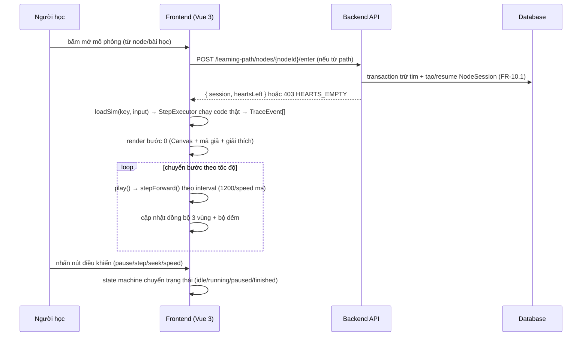
```mermaid
sequenceDiagram
    participant H as Người học
    participant SPA as Frontend (Vue 3)
    participant API as Backend API
    participant DB as Database

    H->>SPA: bấm mở mô phỏng (từ node/bài học)
    SPA->>API: POST /learning-path/nodes/{nodeId}/enter (nếu từ path)
    API->>DB: transaction trừ tim + tạo/resume NodeSession (FR-10.1)
    API-->>SPA: { session, heartsLeft } hoặc 403 HEARTS_EMPTY
    SPA->>SPA: loadSim(key, input) → StepExecutor chạy code thật → TraceEvent[]
    SPA->>SPA: render bước 0 (Canvas + mã giả + giải thích)
    Loop chuyển bước theo tốc độ
        SPA->>SPA: play() → stepForward() theo interval (1200/speed ms)
        SPA->>SPA: cập nhật đồng bộ 3 vùng + bộ đếm
    End
    H->>SPA: nhấn nút điều khiển (pause/step/seek/speed)
    SPA->>SPA: state machine chuyển trạng thái (idle/running/paused/finished)
```

*Hình 5.1: Sequence UC-01 — vào node trừ tim trước, sau đó toàn bộ mô phỏng sinh và phát lại ở phía frontend.*

**(b) UC-25 — Học theo Learning Path và mở khóa node.** SRS chỉ đặc tả sequence diagram cho UC-01, UC-03, UC-04, UC-06, UC-09 — UC-25 không có sơ đồ riêng, nên thay bằng sequence **UC-06 (Nộp bài tập trắc nghiệm)** — quy trình chấm điểm liên quan trực tiếp đến Practice Ladder; cơ chế trừ tim atomic của UC-25 được mô tả bằng lời ở mục 5.5.2:

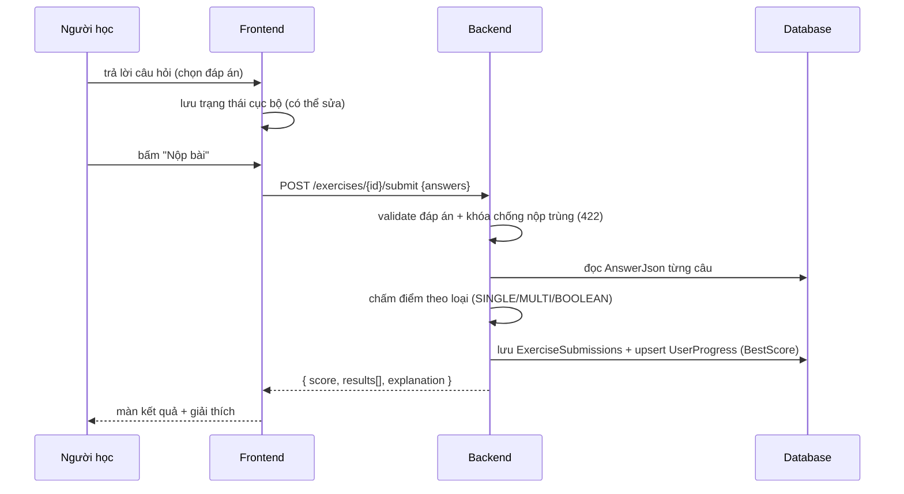
```mermaid
sequenceDiagram
    participant H as Người học
    participant SPA as Frontend
    participant API as Backend
    participant DB as Database
    H->>SPA: trả lời câu hỏi (chọn đáp án)
    SPA->>SPA: lưu trạng thái cục bộ (có thể sửa)
    H->>SPA: bấm "Nộp bài"
    SPA->>API: POST /exercises/{id}/submit {answers}
    API->>API: validate đáp án + khóa chống nộp trùng (422)
    API->>DB: đọc AnswerJson từng câu
    API->>API: chấm điểm theo loại (SINGLE/MULTI/BOOLEAN)
    API->>DB: lưu ExerciseSubmissions + upsert UserProgress (BestScore)
    API-->>SPA: { score, results[], explanation }
    SPA-->>H: màn kết quả + giải thích
```

*Hình 5.2: Sequence UC-06 — chấm điểm server-side, lưu bài nộp và upsert điểm cao nhất trong một quy trình.*

### 5.4.2 Activity Diagram

**(a) State machine mô phỏng** (giữ nguyên từ SDD §3.5):


```mermaid
stateDiagram-v2
    [*] --> idle: loadSim()
    idle --> running: play()
    idle --> finished: jumpTo(cuối)
    running --> paused: pause()
    running --> finished: đạt bước cuối
    running --> running: stepForward() (tự động)
    paused --> running: play()
    paused --> idle: reset()
    paused --> finished: stepForward() ở bước cuối
    finished --> idle: reset()
    finished --> running: play() (chạy lại từ đầu)
```

*Hình 5.3: State machine của player mô phỏng — mọi chuyển trạng thái phát qua store `simulation` để nút điều khiển và phím tắt phản ứng thống nhất.*

**(b) Luồng Practice Ladder** (dựng theo đặc tả FR-4.11, mỗi node gồm 3 bậc tuần tự):

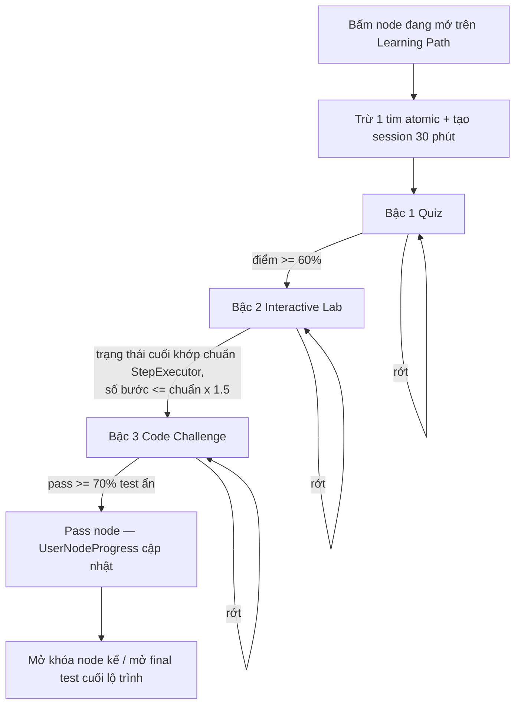
```mermaid
flowchart TD
    A[Bấm node đang mở trên Learning Path] --> B[Trừ 1 tim atomic + tạo session 30 phút]
    B --> C[Bậc 1 Quiz]
    C -->|điểm >= 60%| D[Bậc 2 Interactive Lab]
    C -->|rớt| C
    D -->|trạng thái cuối khớp chuẩn StepExecutor,<br/>số bước <= chuẩn x 1.5| E[Bậc 3 Code Challenge]
    D -->|rớt| D
    E -->|pass >= 70% test ẩn| F[Pass node — UserNodeProgress cập nhật]
    E -->|rớt| E
    F --> G[Mở khóa node kế / mở final test cuối lộ trình]
```

*Hình 5.4: Luồng Practice Ladder 3 bậc — server guard chặn vào bậc sau khi chưa pass bậc trước; retry trong session 30 phút không trừ tim; điểm node = Quiz 20% + Lab 30% + Code 50% (giữ MAX).*

(nguồn: SRS §5.2, §5.7, §5.26, §5.27; SDD §3.5, §8.4 Màn 14-16)

## 5.5 API Endpoints

### 5.5.1 Controllers

Danh sách endpoint chính theo nhóm (trích từ API_REFERENCE — toàn bộ endpoint nằm dưới gốc `/api/v1`):

**Bảng 5.2: Endpoint chính theo nhóm chức năng**

| Nhóm | Method | Endpoint | Chức năng |
|---|---|---|---|
| Auth | POST | `/auth/login` | Đăng nhập, trả JWT access token + cookie refresh |
| Auth | POST | `/auth/refresh` | Làm mới token (rotate-invalidate) |
| Public | GET | `/public/simulations/{key}/run` | Chạy demo công khai (3 key) |
| Topics | GET / POST | `/topics` | Xem cây chủ đề / tạo chủ đề |
| Lessons | GET | `/lessons` | Danh sách bài học (lọc, phân trang) |
| Lessons | POST | `/lessons/{id}/mark-viewed` | Đánh dấu đã học (upsert UserProgress) |
| Simulations | GET | `/simulations` | Danh mục mô phỏng kèm schema, độ phức tạp |
| Exercises | GET | `/exercises/{id}` | Chi tiết bài tập (KHÔNG trả đáp án) |
| Exercises | POST | `/exercises/{id}/submit` | Nộp bài → điểm + đáp án + giải thích |
| Exercises | POST | `/exercises/{id}/code-submit` | Nộp bài code (chấm client sandbox) |
| Progress | GET | `/progress/me` | Tiến độ tổng hợp cá nhân |
| Progress | GET | `/progress/report` | Báo cáo giảng viên (kèm xuất CSV) |
| Learning Path | POST | `/learning-path/{id}/nodes/{nodeId}/enter` | Trừ 1 tim atomic + tạo/resume session |
| Learning Path | GET | `/learning-path/{id}` | Bản đồ node của lộ trình |
| Classes | POST | `/classes/{id}/join` | Tham gia lớp bằng mã mời 6 ký tự |
| Classes | GET | `/classes/{id}/report` | Báo cáo lớp học phần |
| Code Runner | POST | `/code-runs` | Lưu lần chạy code (trace do client sinh) |
| Gamification | POST | `/me/quests/{id}/claim` | Nhận thưởng quest (atomic) |
| Shop | POST | `/shop/buy` | Mua vật phẩm (trừ gems atomic) |
| Admin | GET | `/admin/stats` | Thống kê hệ thống |

### 5.5.2 Services (Business Logic)

**Bảng 5.3: 12 service và trách nhiệm chính**

| Service | Trách nhiệm chính |
|---|---|
| AuthService | đăng ký, đăng nhập, refresh (rotate-invalidate), logout, khôi phục mật khẩu, khóa tạm |
| UserService | CRUD người dùng, khóa/mở, đổi vai trò, phê duyệt Teacher, ẩn danh hóa |
| TopicService | cây chủ đề, CRUD, reorder, chặn xóa khi có con |
| LessonService | CRUD bài học, sanitize HTML, gắn mô phỏng, đánh dấu đã học, quyền sở hữu |
| SimulationCatalogService | danh mục mô phỏng + schema (đồng bộ key với frontend) |
| ExerciseService | CRUD bài tập/câu hỏi, chấm điểm (SINGLE/MULTI/BOOLEAN/Lab), chống nộp trùng, import CSV |
| ProgressService | upsert tiến độ, dashboard, báo cáo giảng viên + CSV, báo cáo lớp |
| FavoriteService | CRUD yêu thích |
| SettingService | cấu hình hệ thống + cache |
| ClassService | CRUD lớp, mã mời 6 ký tự, thêm/xóa sinh viên, gán nội dung + hạn nộp, báo cáo lớp |
| CodeRunnerService | lưu CodeRuns, lịch sử nộp + so sánh (chấm chạy client sandbox) |
| GamificationService | một điểm vào duy nhất Module J: hearts/session (trừ tim atomic), quest/streak, shop/gems, premium, achievement |

**Quy trình nghiệp vụ: Vào node — trừ tim atomic (UC-25, FR-10.1).** Mọi lượt "vào node" (mở mô phỏng hoặc vào Ladder, trừ Benchmark Lab và node đã pass) trừ đúng 1 tim. Toàn bộ thao tác chạy trong 1 transaction ngắn theo thứ tự bắt buộc: (1) kiểm tra node đã pass → miễn phí, không trừ; (2) thử `UPDATE NodeSessions` gia hạn session hết hạn với điều kiện `ExpiresAt < @now`, kiểm tra `@@ROWCOUNT` — nếu gia hạn được thì sang bước trừ tim; (3) nếu không có dòng nào được gia hạn thì `INSERT` session mới — unique `(UserId, NodeId)` tuần tự hóa, INSERT trùng (session còn hiệu lực, kể cả do request song song tạo) thì resume không trừ; (4) `UPDATE Users SET Hearts = Hearts - 1 WHERE Id = @id AND Hearts > 0` — không có dòng nào bị cập nhật (hết tim) thì rollback toàn bộ và trả 403 `HEARTS_EMPTY`. Nhờ vậy 2 request song song chỉ trừ 1 lần tim. Mọi quy trình nghiệp vụ khác chạy theo luồng xử lý chuẩn sau:


```mermaid
sequenceDiagram
    participant C as Controller
    participant V as Validator
    participant S as Service
    participant DB as DbContext
    C->>V: validate(request)
    V-->>C: 400 nếu lỗi
    C->>S: xử lý nghiệp vụ
    S->>DB: EF Core (DbSet trực tiếp, AsNoTracking cho đọc)
    DB-->>S: kết quả
    S-->>C: Result<T> / DTO
```

*Hình 5.5: Luồng xử lý chuẩn backend — Controller chỉ nhận DTO và gọi Service; Service trả `Result<T>` với mã lỗi tiếng Việt; Service truy vấn DbContext trực tiếp qua DbSet.*

(nguồn: API_REFERENCE §4.1-4.15; SDD §5.2, §5.4, §7.3.29)

# PHẦN 6: KIỂM THỬ - TESTING

## 6.1 Chiến lược kiểm thử

Kiểm thử theo mô hình kim tự tháp: nền móng là unit test cho engine và service, giữa là integration test cho API, trên cùng là E2E cho luồng người dùng, kèm các tầng hiệu năng, bảo mật và UX:

**Bảng 6.1: Phân loại chiến lược kiểm thử**

| Cấp độ | Công cụ | Đối tượng / mục tiêu độ bao phủ |
|---|---|---|
| Unit — Generator | Vitest | ≥ 90% dòng `engines/` (golden data N1-N7 cho 15 giải thuật) |
| Unit — Store/Composable | Vitest + Vue Test Utils | ≥ 70% |
| Unit — Backend Service | xUnit | ≥ 60% (ưu tiên Auth, Exercise, Progress, Gamification) |
| Integration — API | xUnit + WebApplicationFactory + Testcontainers (SQL Server) | 100% endpoint chính, mọi nhánh HTTP status |
| E2E — luồng người dùng | Playwright | 12 luồng chính (học tập, Ladder 3 bậc, code runner...) |
| Hiệu năng | k6 + Lighthouse | theo NFR-1..NFR-7 |
| Bảo mật | checklist 13.3 + OWASP ZAP (cơ bản) | toàn bộ checklist 13.3 |
| UX | 5 người dùng (3 chưa dùng hệ thống tương tự) + SUS | SUS ≥ 70/100 |

Dữ liệu kiểm thử dùng TestSeed riêng (20 user 3 vai trò, 5 topic, 12 bài học, 8 bài tập, 200 bản ghi tiến độ — không dùng seed production).

(nguồn: TEST_PLAN §1.3, §2, §3)

## 6.2 Kết quả kiểm thử

Tại thời điểm 16/08/2026, các nhóm kiểm thử tự động của TEST_PLAN đã được thực thi và đạt kết quả thật: FE Vitest **207/207 PASS**; BE `dotnet test` Unit **155 PASS** + Integration **78 PASS**; E2E Playwright **13/13 PASS**; FE build **PASS**; BE build **PASS**. Chi tiết theo nhóm trong các bảng dưới đây:

**Bảng 6.2: Báo cáo tổng hợp theo nhóm test (TEST_PLAN §10 — đã thực thi 16/08/2026)**

| Nhóm test | Tổng số | PASS | FAIL | Ghi chú |
|---|---|---|---|---|
| Backend (TEST-B) | 155 | 155 | 0 | Unit 155 PASS (16/08/2026) |
| Engine (TEST-E) | 207 | 207 | 0 | Vitest 207/207 PASS (engine + store/composable, 16/08/2026) |
| API (TEST-API) | 78 | 78 | 0 | Integration 78 PASS — Testcontainers SQL Server (16/08/2026) |
| E2E (TEST-UI) | 13 | 13 | 0 | Playwright 13/13 PASS (16/08/2026) |
| Bảo mật (TEST-SEC) | chưa chạy | chưa chạy | chưa chạy | chờ hoàn tất kiểm thử (tuần 19-20) |
| Hiệu năng (TEST-PERF) | chưa chạy | chưa chạy | chưa chạy | chờ hoàn tất kiểm thử (tuần 19-20) |
| UX (TEST-UX) | chưa chạy | chưa chạy | chưa chạy | chờ hoàn tất kiểm thử (tuần 19-20) |

**Bảng 6.3: Kịch bản tiêu biểu (đã thực thi 16/08/2026)**

| Mã test case | Mô tả | Kỳ vọng | Kết quả |
|---|---|---|---|
| TEST-B-001 | Đăng ký tài khoản thành công | 201, email chuẩn hóa lowercase, đăng nhập lại được | PASS (16/08/2026) |
| TEST-B-045 | Nộp bài SINGLE đúng | Điểm đúng theo đáp án | PASS (16/08/2026) |
| TEST-B-137..141 | Practice Ladder tuần tự | Chưa pass Quiz → `LADDER_LOCKED`; pass Code ≥ 70% → pass node | PASS (16/08/2026) |
| TEST-B-148 | Vào node mới trừ đúng 1 tim | 200 + `heartsLeft:9` + 1 bản ghi NodeSessions | PASS (16/08/2026) |
| TEST-B-151 | 2 request song song cùng enter | Chỉ 1 lần trừ tim (concurrency thực) | PASS (16/08/2026) |
| TEST-E-003 | Bubble sort trace chuẩn `[3,1,2]` (20 bước) | So khớp 100% bảng trace mốc vàng | PASS (16/08/2026) |
| TEST-E-035 | Hiệu năng sinh bước mảng 100 | Trung bình ≤ 500ms, không lần nào > 800ms | PASS (16/08/2026) |
| TEST-UI-001 | Luồng học tập hoàn chỉnh (E2E) | Toàn bộ luồng không lỗi, tiến độ đúng | PASS (16/08/2026) |

Ngưỡng chất lượng trước khi bàn giao (Definition of Done): 100% test case nhóm B/E/API của FR mức Cao PASS; FAIL mở tối đa 3 lỗi trung bình có kế hoạch; coverage generator ≥ 90%; 8 kịch bản hiệu năng đạt ngưỡng; kiểm thử bảo mật 13.3 toàn bộ PASS. Mọi FAIL khi chạy phải kèm nguyên nhân, người sửa và ngày pass lại — không bịa số liệu.

(nguồn: TEST_PLAN §1.1, §10, §14.9)

## 6.3 Hiệu năng + bảo mật + UX

**Bảng 6.4: Kịch bản hiệu năng (TEST-PERF-001..008)**

| Mã | Kịch bản | Ngưỡng | Kết quả |
|---|---|---|---|
| TEST-PERF-001 | Sinh bước mảng 100 (5 GT sắp xếp, 50 lần chạy) | ≤ 500ms trung bình, 100% < 800ms | chờ hoàn tất kiểm thử (tuần 19-20) |
| TEST-PERF-002 | Sinh bước đồ thị 50 đỉnh (20 lần chạy) | ≤ 1s trung bình, 100% < 1.5s | chờ hoàn tất kiểm thử (tuần 19-20) |
| TEST-PERF-003 | Điều hướng 1000 bước liên tục (Chrome) | ≥ 55 FPS trung bình | chờ hoàn tất kiểm thử (tuần 19-20) |
| TEST-PERF-004 | GET /lessons (1000 bài, 50 VU × 5 phút) | p95 ≤ 800ms, 0 lỗi 5xx | chờ hoàn tất kiểm thử (tuần 19-20) |
| TEST-PERF-005 | POST submit bài 10 câu (20 VU song song) | p95 ≤ 1.5s, chấm đúng 100% | chờ hoàn tất kiểm thử (tuần 19-20) |
| TEST-PERF-006 | Login đồng thời (50 VU × 30s) | p95 ≤ 1s, 0 lỗi | chờ hoàn tất kiểm thử (tuần 19-20) |
| TEST-PERF-007 | Tải SPA lần đầu cold cache (Lighthouse) | FCP ≤ 1.5s, bundle ≤ 500KB | chờ hoàn tất kiểm thử (tuần 19-20) |
| TEST-PERF-008 | Đồng thời tổng hợp 70% đọc / 30% ghi (200 VU × 15 phút) | p95 ≤ 1.2s, 0 lỗi 5xx | chờ hoàn tất kiểm thử (tuần 19-20) |

**Bảng 6.5: Kiểm thử bảo mật (TEST-SEC — tóm tắt checklist 13.3)**

| Mã | Nội dung | Kỳ vọng | Kết quả |
|---|---|---|---|
| TEST-SEC-001 | Token giả/sai chữ ký | 401 | chờ hoàn tất kiểm thử (tuần 19-20) |
| TEST-SEC-002 | Student gọi endpoint Teacher/Admin | 403 | chờ hoàn tất kiểm thử (tuần 19-20) |
| TEST-SEC-003 | Truy cập UserProgress người khác (đổi id) | 404, không lộ tồn tại | chờ hoàn tất kiểm thử (tuần 19-20) |
| TEST-SEC-004 | Nộp `<script>` trong contentHtml | Sanitize, không thực thi | chờ hoàn tất kiểm thử (tuần 19-20) |
| TEST-SEC-005 | SQL injection `' OR 1=1 --` | Không lỗi SQL, trả an toàn | chờ hoàn tất kiểm thử (tuần 19-20) |
| TEST-SEC-006 | 6 lần đăng nhập sai liên tiếp | Khóa tạm (429) + log | chờ hoàn tất kiểm thử (tuần 19-20) |
| TEST-SEC-007 | Upload `.exe` giả `.png` | Từ chối (magic bytes) | chờ hoàn tất kiểm thử (tuần 19-20) |
| TEST-SEC-008 | Xóa refresh token khi đổi mật khẩu | Phiên cũ vô hiệu | chờ hoàn tất kiểm thử (tuần 19-20) |
| TEST-SEC-009..011 | Sandbox: vòng lặp vô hạn / đệ quy sâu / truy cập file-network | Chặn sạch, không treo trình duyệt | chờ hoàn tất kiểm thử (tuần 19-20) |

**UX (SUS).** Kế hoạch: 5 người dùng ngoài nhóm (3 người chưa dùng hệ thống tương tự) thực hiện 5 nhiệm vụ (tạo tài khoản, chạy mô phỏng bubble sort với dữ liệu tự nhập, làm bài tập trắc nghiệm, tìm bài học, xem báo cáo tiến độ) và chấm SUS. Chỉ tiêu: tỷ lệ hoàn thành 100% cả 5 nhiệm vụ, SUS ≥ 70/100. Số liệu đo thật chưa có nên ghi nhận: **chờ hoàn tất kiểm thử (tuần 19-20)**; kết quả sẽ kèm bảng thời gian thực hiện và danh sách vấn đề UX theo mức ưu tiên.

(nguồn: TEST_PLAN §8, §7.2, §9)


# PHẦN 7: ĐÓNG GÓI & TRIỂN KHAI

## 7.1 Đóng gói frontend/backend

Hệ thống được đóng gói thành hai phần độc lập: frontend Vue 3 build ra thư mục tĩnh `dist/`, backend ASP.NET Core publish ra bộ file chạy được. Lệnh build frontend:

```bash
cd frontend
npm ci
npm run build          # output dist/
```

`npm ci` cài đúng phiên bản dependency theo lockfile (dùng cho môi trường tự động), `npm run build` gọi Vite biên dịch ra thư mục `dist/` phục vụ tĩnh được qua nginx. Lệnh publish backend:

```bash
cd backend
dotnet publish src/DsaVisual.Api -c Release -o /opt/dsavisual/api
```

`dotnet publish` biên dịch project API theo cấu hình Release và gom toàn bộ file cần thiết vào thư mục đích (kèm runtime, không cần cài .NET SDK trên máy chạy).

Đối với môi trường phát triển chuẩn hóa, nhóm cung cấp `docker-compose.dev.yml` khởi động SQL Server và MailHog (bắt chước SMTP):

```yaml
# docker-compose.dev.yml
services:
  sqlserver:
    image: mcr.microsoft.com/mssql/server:2022-latest
    environment:
      ACCEPT_EULA: "Y"
      MSSQL_SA_PASSWORD: "DsaVisual@Dev123"
    ports: ["1433:1433"]
  mailhog:
    image: mailhog/mailhog
    ports: ["1025:1025", "8025:8025"]   # SMTP 1025, UI 8025
```

**Bảng 7.1: Các service trong docker-compose (môi trường dev)**

| Service | Hình ảnh | Công dụng |
|---|---|---|
| `sqlserver` | `mcr.microsoft.com/mssql/server:2022-latest` | Cơ sở dữ liệu SQL Server, mở cổng 1433 |
| `mailhog` | `mailhog/mailhog` | Máy chủ SMTP giả để xem email gửi ra tại `http://localhost:8025` |

Nếu chưa cấu hình SMTP thật, hệ thống ghi log và hiển thị link/mã trong log dev — không chặn đăng ký/đăng nhập.

(nguồn: DEPLOY §3, §4.1-4.2)

## 7.2 Triển khai production

Kiến trúc triển khai production được mô tả bằng sơ đồ dưới: nginx làm điểm vào duy nhất, vừa phục vụ file tĩnh frontend vừa chuyển tiếp request API sang Kestrel; API kết nối SQL Server và SMTP (tùy chọn):

```mermaid
graph LR
    User((Người dùng)) --> LB[Nginx/Reverse Proxy<br/>443 TLS + static files]
    LB --> FE[Frontend static<br/>dist/]
    LB --> API[ASP.NET Core API<br/>Kestrel :5000]
    API --> DB[(SQL Server)]
    API --> SMTP[SMTP server (tùy chọn)]
```

Nginx đảm nhận 2 vai trò: phục vụ file tĩnh frontend (`dist/`) và reverse proxy sang Kestrel :5000. Mọi request vào production đều qua TLS 1.2+ (HSTS). Cấu hình nginx:

```nginx
# /etc/nginx/sites-available/dsa-visual
server {
    listen 80;
    server_name dsa-visual.example.edu.vn;
    return 301 https://$host$request_uri;
}

server {
    listen 443 ssl http2;
    server_name dsa-visual.example.edu.vn;

    ssl_certificate     /etc/ssl/certs/dsa-visual.crt;
    ssl_certificate_key /etc/ssl/private/dsa-visual.key;
    add_header Strict-Transport-Security "max-age=31536000" always;

    root /var/www/dsavisual;
    index index.html;

    location / { try_files $uri $uri/ /index.html; }        # SPA fallback

    location /api/ {
        proxy_pass http://127.0.0.1:5000;
        proxy_set_header Host $host;
        proxy_set_header X-Forwarded-For $proxy_add_x_forwarded_for;
        proxy_set_header X-Forwarded-Proto $scheme;
    }

    client_max_body_size 10m;                                 # upload ảnh ≤ 5MB + lề
}
```

API chạy như service hệ thống bằng systemd (Linux), tự khởi động lại khi lỗi:

```ini
# /etc/systemd/system/dsavisual-api.service
[Unit]
Description=DSA-Visual API
After=network.target

[Service]
WorkingDirectory=/opt/dsavisual/api
ExecStart=/usr/bin/dotnet DsaVisual.Api.dll
Restart=always
EnvironmentFile=/etc/dsavisual/env      # chứa các biến DSA__*
User=www-data

[Install]
WantedBy=multi-user.target
```

```bash
systemctl daemon-reload
systemctl enable --now dsavisual-api
systemctl status dsavisual-api
```

Nếu triển khai trên Windows, nhóm dùng IIS với ASP.NET Core Hosting Bundle (site trỏ `DsaVisual.Api.exe`, in-process) hoặc chạy Kestrel đơn giản phía sau proxy. Các biến môi trường quan trọng (giá trị cụ thể không ghi trong báo cáo):

**Bảng 7.2: Biến môi trường quan trọng**

| Biến | Mô tả |
|---|---|
| `DSA__Jwt__Secret` | Khóa ký token JWT — chuỗi ngẫu nhiên từ 32 ký tự trở lên, tuyệt đối không commit |
| `ConnectionStrings__Default` | Chuỗi kết nối SQL Server |
| `DSA__Jwt__AccessTokenMinutes` | Thời hạn access token (mặc định 60 phút) |
| `DSA__Jwt__RefreshTokenDays` | Thời hạn refresh token (mặc định 7 ngày) |
| `DSA__Cors__AllowedOrigins` | Danh sách origin được phép gọi API |
| `DSA__Email__SmtpHost` / `SmtpPort` / `From` | Cấu hình SMTP; để trống = chế độ log/MailHog |
| `DSA__Storage__Path` | Thư mục lưu file upload |
| `DSA__Simulation__MaxArraySize` | Giới hạn mảng mô phỏng (100 phần tử) |
| `DSA__Simulation__MaxGraphVertices` | Giới hạn số đỉnh đồ thị (50) |
| `DSA__Auth__MaxLoginAttempts` / `LockoutMinutes` | Khóa đăng nhập sau 5 lần sai 15 phút |
| `VITE_API_BASE_URL` | Base URL API cho frontend (khai báo trong `.env.production`) |

Quy ước chung: biến backend dùng tiền tố `DSA__` (ánh xạ `appsettings.json` theo chuẩn ASP.NET Core); secret không bao giờ nằm trong `appsettings.Production.json` đã commit; frontend không chứa secret nào.

(nguồn: DEPLOY §1.3, §2, §4.3-4.5)

## 7.3 CI/CD + backup

Pipeline CI/CD dùng GitHub Actions với 3 job chạy song song mỗi lần push hoặc tạo pull request:

**Bảng 7.3: Các job chính của GitHub Actions (ci.yml)**

| Job | Nội dung chính |
|---|---|
| `frontend` | Cài Node 20 → `npm ci` → lint (ESLint) → typecheck (`vue-tsc --noEmit`) → unit test (Vitest) → build → quét bảo mật dependency (`npm audit`) |
| `backend` | Cài .NET 8 → build solution → chạy test với SQL Server chạy trong service container → quét lỗ hổng package (`dotnet list package --vulnerable`) |
| `catalog-sync` | Chạy `scripts/check-catalog-sync.js` so sánh `shared/simulation-catalog.json` với danh sách key phía frontend — khác là fail build |

Sau khi CI pass, staging được deploy tự động qua script `scripts/deploy-staging.sh`. Deploy production làm thủ công qua tag `release/*` (workflow `deploy-prod.yml`, SSH + script). Trước khi deploy: backup DB trước, chạy migration DB trước khi deploy code.

Chính sách backup cơ sở dữ liệu:

```sql
-- Backup full hàng ngày 02:00 (giữ 14 bản — script job lịch)
BACKUP DATABASE DsaVisual TO DISK = 'D:\backups\DsaVisual_20260812.bak' WITH COMPRESSION;

-- Restore (test restore 1 lần/tháng, ghi biên bản)
RESTORE DATABASE DsaVisual FROM DISK = 'D:\backups\DsaVisual_20260812.bak'
  WITH REPLACE, RECOVERY;
```

**Bảng 7.4: Chính sách backup**

| Mục | Chính sách |
|---|---|
| Backup full | Hàng ngày lúc 02:00, giữ 14 bản |
| Backup log | Mỗi 4 giờ |
| Test restore | 1 lần/tháng, ghi biên bản |
| Lưu trữ | Ổ khác máy chủ (network share / object storage) |

(nguồn: DEPLOY §5.3, §6)

## 7.4 Runbook sự cố

Bảng dưới tóm tắt 8 sự cố thường gặp nhất khi vận hành (rút gọn từ danh sách 10 sự cố của DEPLOY):

**Bảng 7.5: Runbook sự cố thường gặp**

| Sự cố | Nguyên nhân | Xử lý | Thời gian mục tiêu |
|---|---|---|---|
| API trả 503 liên tục | SQL Server ngừng | Kiểm tra service SQL, khởi động lại, xem log lỗi SQL, restore backup nếu lỗi dữ liệu | 30 phút |
| 500 liên tục ở API | Lỗi code / config sai | Xem log file gần nhất, kiểm tra biến môi trường, rollback phiên bản trước | 1 giờ |
| Đăng nhập chậm | Quá nhiều request hash mật khẩu | Kiểm tra rate limit hoạt động, tăng tài nguyên, kiểm tra lockout DB | 1 giờ |
| Upload ảnh lỗi | Hết dung lượng ổ | Kiểm tra `df -h`, dọn upload tạm (job đêm), mở rộng ổ | 30 phút |
| Mô phỏng chậm phía client | Dữ liệu quá giới hạn / máy yếu | Xác nhận giới hạn hệ thống, gợi ý giảm kích thước dữ liệu, kiểm tra phiên bản trình duyệt | 2 giờ |
| Token lỗi hàng loạt | Secret JWT bị thay đổi | Kiểm tra `DSA__Jwt__Secret`, khôi phục giá trị cũ, người dùng đăng nhập lại | 30 phút |
| Email không gửi | SMTP lỗi | Kiểm tra queue email trong DB, kiểm tra kết nối SMTP, bật lại service | 1 giờ |
| Backup thất bại | Hết dung lượng / quyền | Xem log job backup, giải phóng dung lượng, chạy lại thủ công | 1 giờ |

Kèm theo đó, nhóm duy trì kế hoạch rollback: giữ 2 bản deploy gần nhất (rollback code trong 15 phút); rollback DB chỉ khi migration gây lỗi, restore backup trước mốc migration; mọi rollback phải ghi nhật ký (ai, khi nào, lý do, kết quả).

(nguồn: DEPLOY §7.2, §8)

# KẾT LUẬN & HƯỚNG PHÁT TRIỂN

## Kết quả đạt được

Đối chiếu 8 KPI mục tiêu (SRS §2.2) với kết quả thực tế:

**Bảng 7.6: Đánh giá KPI G1-G8**

| KPI | Mô tả (giá trị mục tiêu) | Đánh giá |
|---|---|---|
| G1 | Phủ nội dung học tập — số CTDL có mô phỏng (≥ 10) | Đạt — catalog có đủ 10 CTDL |
| G2 | Phủ giải thuật — số GT có mô phỏng (≥ 14, thiết kế 15) | Đạt — catalog có 34 thao tác giải thuật |
| G3 | Mức độ sử dụng — tỷ lệ sinh viên truy cập ≥ 1 lần/tuần (≥ 80%) | Chờ hoàn tất kiểm thử (tuần 19-20) — cần thí điểm lớp thật |
| G4 | Hiệu quả học tập — điểm kiểm tra chương (≥ 7.0/10) | Chờ hoàn tất kiểm thử (tuần 19-20) — đo ngoài hệ thống, do giảng viên chấm |
| G5 | Sự hài lòng — khảo sát UX thang 5 (≥ 4.0/5) | Chờ hoàn tất kiểm thử (tuần 19-20) — khảo sát SUS trong TEST_PLAN |
| G6 | Độ ổn định — uptime thí điểm 4 tuần (≥ 99.5%) | Chờ hoàn tất kiểm thử (tuần 19-20) — đo khi chạy staging/production |
| G7 | Hiệu năng — phản hồi API p95 (≤ 800ms) | Chờ hoàn tất kiểm thử (tuần 19-20) — k6 load test trong TEST_PLAN |
| G8 | Độ mượt — FPS khi mô phỏng (≥ 55) | Chờ hoàn tất kiểm thử (tuần 19-20) — TEST-PERF trong TEST_PLAN |

Về chức năng, hệ thống đã bao phủ các luồng chính: học theo lộ trình 5 path với mô phỏng từng bước, luyện tập 3 bậc (trắc nghiệm, thực hành kéo thả, lập trình với test ẩn), gamification (tim, gems, quest, streak, leaderboard), lớp học và báo cáo cho giảng viên, quản trị người dùng cho admin. Về kỹ thuật, nhóm triển khai được engine EDV (mã thật chạy qua StepExecutor, hoạt ảnh phát lại trace — không hardcode), sandbox code chạy trong Web Worker phía client (không dùng máy chủ container), xác thực JWT có cơ chế rotate-invalidate. Về giao diện, màn mô phỏng đồng bộ 3 vùng (mã giả, canvas, giải thích) với bảng màu legend, có chế độ tối và bố cục đáp ứng từ 1024px. Các con số hiệu năng, bảo mật và mức độ hài lòng chưa được khẳng định cho tới khi hoàn tất kiểm thử — nhóm không đưa ra số liệu chưa đo.

## Khó khăn & Bài học kinh nghiệm

**Khó khăn gặp phải:**

1. **Đồng bộ 3 vùng màn mô phỏng**: mỗi bước phải thống nhất giữa dòng mã giả tô sáng, hình vẽ canvas và lời giải thích. Lệch một bước là hoạt ảnh sai ngay; phải đưa toàn bộ thông tin vào TraceEvent ngay từ khi thiết kế engine.
2. **Khối lượng công việc lớn trong thời gian 13 tuần**: vừa code vừa viết 12 file tài liệu, buộc nhóm ưu tiên task mức Cao và dùng template chung để giảm tải (rủi ro R3 trong SDD).
3. **Phạm vi dự án trôi dạt**: nhiều tính năng hấp dẫn nhưng ngoài tầm (online judge, AI, thanh toán thật). Nhóm phải chốt các quyết định cắt giảm G-1..G-8: seed giảm từ 18 về 8 bài chất lượng cao, AI chỉ dừng ở PoC.
4. **Xung đột Git khi làm chung**: nhiều thành viên sửa cùng khu vực frontend/backend, gây merge conflict; nhóm khắc phục bằng cách tách nhánh theo module và rà soát trước khi merge.
5. **Môi trường dev thiếu SQL Server và SMTP thật**: nhóm dùng SQLite/LocalDB và MailHog ở dev, nhưng test tích hợp luôn chạy trên SQL Server thật để tránh lệch hành vi.

**Bài học kinh nghiệm:**

1. **Golden data và test từng bước cho mọi generator**: mỗi thuật toán phải có bộ dữ liệu chuẩn với kết quả mong đợi tính trước, giúp bắt sai logic từ sớm thay vì phát hiện khi demo.
2. **Cắt phạm vi sớm và dứt khoát**: 8 bài học chất lượng cao hoàn chỉnh tốt hơn 18 bài dở dang; quyết định cắt phải ghi lại lý do trong tài liệu để không tái tranh luận.
3. **Tài liệu đi song song với code**: cập nhật tài liệu theo từng sprint, không dồn cuối kỳ; mọi nội dung báo cáo truy ngược được về SRS/SDD/API.
4. **Đầu tư đúng chỗ vào engine lõi**: kiến trúc EDV (mã thật chạy, phát lại trace) giúp thêm mô phỏng mới không phải viết lại hoạt ảnh — chi phí ban đầu cao nhưng tiết kiệm về sau.
5. **Dự trù thời gian cho sprint rủi ro cao**: chấm điểm code (S7) và nhóm Premium + Class + Benchmark (S9) là hai sprint nặng nhất; cần buffer hoặc sẵn sàng hoãn tính năng không thiết yếu.

## Hướng phát triển

Backlog mở rộng đã ghi trong SDD cho các giai đoạn sau:

1. **Online judge chấm mã** — nâng cấp từ FR-9.3, chấm code do người học viết tự do thay vì hoàn thiện hàm theo khuôn.
2. **Mô phỏng thêm**: cây đỏ-đen, B/B+, trie, Prim/Kruskal, Floyd-Warshall, Topological sort, KMP.
3. **AI Assistant (PoC GĐ3)** — 1 endpoint `/ai/ask`, 3 chế độ: giải thích bước mở rộng, giải thích lỗi code, hỏi lý thuyết (RAG mini); tốn Hint token/Gems, có fallback offline, không chấm điểm.
4. **Di động responsive đầy đủ**; đa ngôn ngữ (i18n EN); import/export bài học JSON.
5. **10 bài seed còn lại** (Selection, Insertion, Merge, Quick, Heap Sort, Linear Search, Queue, BST Xóa & Duyệt, DFS, Dijkstra) kèm test ẩn.
6. **Tích hợp thanh toán thật** (SePay/VietQR) cho gói Premium — hiện chỉ thanh toán mô phỏng.

(nguồn: SDD §11.2)

# TÀI LIỆU THAM KHẢO

1. Vue.js — Tài liệu Vue 3. https://vuejs.org
2. Pinia — The intuitive Vue.js store. https://pinia.vuejs.org
3. Vite — Next Generation Frontend Tooling. https://vitejs.dev
4. Microsoft — Tài liệu ASP.NET Core. https://learn.microsoft.com/aspnet/core
5. Microsoft — Tài liệu Entity Framework Core. https://learn.microsoft.com/ef/core
6. Microsoft — Tài liệu SQL Server. https://learn.microsoft.com/sql
7. Thomas H. Cormen và cộng sự — Introduction to Algorithms (CLRS), MIT Press.
8. VisuAlgo — trực quan hóa giải thuật. https://visualgo.net
9. David Galles — Data Structure Visualizations, University of San Francisco. https://www.cs.usfca.edu/~galles/visualization
10. Algorithm Visualizer. https://algorithm-visualizer.org
11. Mermaid — Diagramming and charting tool. https://mermaid.js.org

# PHỤ LỤC A: Hướng dẫn cài đặt môi trường

**Yêu cầu phần mềm tối thiểu:**

**Bảng A.1: Yêu cầu phần mềm**

| Thành phần | Phiên bản | Mục đích |
|---|---|---|
| .NET SDK | 8.0+ | Build backend |
| ASP.NET Core Runtime | 8.0+ | Chạy API |
| Node.js | 20+ | Build frontend |
| SQL Server | 2019+ | Production; dev có thể dùng SQLite/LocalDB |
| Nginx | 1.24+ | Reverse proxy + static files (Linux) |
| Docker | 24+ | Tùy chọn — dev chuẩn hóa (SQL Server + MailHog) |

**Bước 1 — Cài frontend:** chạy `npm install` để cài dependency, sau đó `npm run dev` khởi động Vite dev server tại cổng 5173 (dev local, proxy `/api` sang localhost:5000). Xem kết quả tại `http://localhost:5173`; bản demo container chạy tại `http://localhost:8081` (`docker compose up -d --build`).

```bash
cd frontend
npm install
npm run dev        # Vite dev server :5173 (dev local), proxy /api → localhost:5000 — demo container: FE :8081
```

**Bước 2 — Cài backend:** khôi phục và build solution bằng `dotnet restore` + `dotnet build`, chạy migration tạo CSDL, rồi khởi động API kèm seed dữ liệu mẫu. Kiểm tra tại Swagger `http://localhost:5000/swagger`.

```powershell
cd backend
dotnet restore
dotnet build

# Migration + seed
dotnet ef database update --project src/DsaVisual.Application --startup-project src/DsaVisual.Api
dotnet run --project src/DsaVisual.Api --seed    # seed idempotent (chạy lại không nhân đôi)
```

**Bước 3 — Cấu hình cơ sở dữ liệu:** dev dùng SQL Server local hoặc SQLite qua biến `ConnectionStrings__Default=Data Source=dsavisual-dev.db` (đặt trong `appsettings.Development.json` hoặc biến môi trường). Muốn môi trường chuẩn, khởi động SQL Server + MailHog bằng `docker compose -f docker-compose.dev.yml up -d`.

**Bước 4 — Chạy production (Linux):** build frontend bằng `npm ci` + `npm run build`, publish backend bằng `dotnet publish src/DsaVisual.Api -c Release -o /opt/dsavisual/api`, cấu hình nginx và systemd theo PHẦN 7.2.

(nguồn: DEPLOY §1.2, §2-3, §4.1-4.2)

# PHỤ LỤC B: Phím tắt + thuật ngữ

**Bảng B.1: Phím tắt trang mô phỏng**

| Phím | Chức năng |
|---|---|
| `Space` | Phát / Tạm dừng mô phỏng |
| `→` / `←` | Bước tiếp theo / bước trước đó |
| `Home` / `End` | Về bước đầu tiên / nhảy tới bước cuối |
| `[` / `]` | Giảm / tăng tốc độ chạy |
| `C` | Mở hộp thoại cấu hình dữ liệu |
| `F` | Lưu vào mục yêu thích |

(nguồn: USER_GUIDE §7.1)

**Bảng B.2: Thuật ngữ viết tắt**

| Thuật ngữ | Giải thích |
|---|---|
| DSA | Cấu trúc dữ liệu và giải thuật — lĩnh vực của hệ thống |
| CTDL / GT | Cấu trúc dữ liệu / Giải thuật (thuật toán) |
| EDV (Execution-Driven Visualization) | Kiến trúc lõi: mã thật chạy qua StepExecutor, hoạt ảnh = phát lại trace thực thi |
| StepExecutor | Bộ thực thi gắn thiết bị đo, chạy code mẫu và ghi TraceEvent[] |
| TraceEvent | Bản ghi một câu lệnh quan trọng khi thực thi: dòng code, snapshot biến, phần tử highlight, giải thích |
| SPA | Single Page Application — ứng dụng web tải một lần, chuyển nội dung không tải lại trang |
| JWT | JSON Web Token — chuỗi mã hóa xác thực; access token 60 phút, refresh token 7 ngày trong cookie an toàn |
| EF Core | Thư viện C# (ORM) truy vấn và lưu dữ liệu vào cơ sở dữ liệu |
| Migration | Cơ chế EF Core thay đổi cấu trúc bảng theo phiên bản |
| Sandbox | Môi trường chạy code cách ly phía client (Web Worker), giới hạn 10 giây / 64MB / 200 dòng |
| Big-O | Ký hiệu mô tả độ phức tạp thời gian/không gian của giải thuật |
| BFS / DFS | Duyệt đồ thị theo chiều rộng (hàng đợi) / theo chiều sâu (ngăn xếp) |
| Practice Ladder | Chuỗi luyện tập 3 bậc: Quiz → Interactive Lab → Code Challenge |
| NodeSession | Bản ghi phiên học 30 phút của một người học tại một node |
| KPI | Chỉ số đo lường mục tiêu dự án (G1-G8) |
| UC / FR / NFR | Use case / Yêu cầu chức năng / Yêu cầu phi chức năng |
| SUS | Bảng khảo sát đánh giá mức độ dùng được của giao diện |

(nguồn: GLOSSARY; SRS §2.2, §6; TEST_PLAN §2)

# PHỤ LỤC C: Thư viện bên thứ ba (license)

Chưa cập nhật đầy đủ (12/08/2026) — bảng dưới liệt kê thư viện chính theo nguồn SDD/DEPLOY, giấy phép sẽ bổ sung khi có THIRD_PARTY.md.

**Bảng C.1: Thư viện bên thứ ba chính**

| Thư viện | Công dụng | Ghi chú |
|---|---|---|
| Vue 3 | Framework frontend | Dùng toàn bộ giao diện (SDD §3) |
| Pinia | Quản lý trạng thái frontend | Store auth/lesson/simulation/progress/gamification (SDD §3.2) |
| Vite | Build tool frontend | Dev server + build production (SDD §3.9) |
| Axios | HTTP client | Gọi API, interceptor token (SDD §3.4) |
| Monaco Editor | Trình soạn mã | Code Runner Màn 16 (SDD §8) |
| Mermaid | Vẽ sơ đồ trong tài liệu | Sơ đồ kiến trúc, state machine (DEPLOY §1.3) |
| ASP.NET Core | Backend framework | API 2 lớp Controller → Service → DbContext (SDD §5) |
| Entity Framework Core | ORM | Code-First + Migrations (SDD §7) |
| Serilog | Ghi log có cấu trúc | Rolling file 90 ngày (DEPLOY §7.1) |
| xUnit | Unit test backend | DsaVisual.UnitTests (SDD §5) |
| Vitest | Unit test frontend | Test store và component (SDD §3.7) |
| Testcontainers | Chạy container trong test | Integration test trên SQL Server thật (DEPLOY §5.4) |
| k6 | Load test | Kịch bản login (DEPLOY §9) |

# PHỤ LỤC D: Danh mục mô phỏng (catalog)

Danh mục mô phỏng được đồng bộ từ file `shared/simulation-catalog.json` — 44 mô phỏng chia 2 nhóm: 34 thao tác giải thuật (algorithm) và 10 cấu trúc dữ liệu (structure). Trong đó 3 mô phỏng được mở xem công khai tại trang chủ không cần đăng nhập: Bubble Sort, Binary Search, BFS.

**Bảng D.1: Danh mục 44 mô phỏng**

| Nhóm | Tên mô phỏng | Mô tả |
|---|---|---|
| Sắp xếp | Sắp xếp nổi bọt (Bubble Sort) | So sánh và hoán đổi cặp phần tử liền kề, đưa phần tử lớn về cuối |
| Sắp xếp | Sắp xếp chọn (Selection Sort) | Chọn phần tử nhỏ nhất còn lại đưa về đầu mảng |
| Sắp xếp | Sắp xếp chèn (Insertion Sort) | Chèn từng phần tử vào đúng vị trí trong đoạn đã sắp xếp |
| Sắp xếp | Sắp xếp trộn (Merge Sort) | Chia mảng làm đôi rồi trộn các nửa đã sắp xếp (chia để trị) |
| Sắp xếp | Sắp xếp nhanh (Quick Sort — Lomuto) | Chọn chốt (pivot) và phân chia mảng quanh chốt |
| Sắp xếp | Sắp xếp vun đống (Heap Sort) | Vun mảng thành đống rồi trích phần tử lớn nhất về cuối |
| Tìm kiếm | Tìm kiếm tuyến tính (Linear Search) | Duyệt từng phần tử cho tới khi gặp giá trị cần tìm |
| Tìm kiếm | Tìm kiếm nhị phân (Binary Search) | Chia đôi đoạn tìm kiếm trên mảng đã sắp xếp |
| Ngăn xếp | Ngăn xếp — Push | Đẩy phần tử vào đỉnh ngăn xếp (LIFO) |
| Ngăn xếp | Ngăn xếp — Pop | Lấy phần tử trên đỉnh ngăn xếp ra |
| Ngăn xếp | Ngăn xếp — Peek | Xem phần tử trên đỉnh ngăn xếp mà không lấy ra |
| Hàng đợi | Hàng đợi — Enqueue | Thêm phần tử vào cuối hàng đợi (FIFO) |
| Hàng đợi | Hàng đợi — Dequeue | Lấy phần tử đầu hàng đợi ra |
| Danh sách liên kết | Danh sách liên kết — Chèn | Chèn nút vào đầu, cuối hoặc vị trí k |
| Danh sách liên kết | Danh sách liên kết — Xóa | Xóa nút theo vị trí hoặc giá trị |
| Danh sách liên kết | Danh sách liên kết — Tìm kiếm | Duyệt tìm nút chứa giá trị cần tìm |
| Danh sách liên kết | Danh sách liên kết — Duyệt | Đi qua toàn bộ nút theo thứ tự liên kết |
| Cây | BST — Chèn | Chèn khóa vào đúng vị trí trên cây nhị phân tìm kiếm |
| Cây | BST — Xóa | Xóa khóa và nối lại cây cho đúng tính chất BST |
| Cây | BST — Tìm kiếm | Dò tìm khóa theo quan hệ lớn hơn/nhỏ hơn của BST |
| Cây | BST — Duyệt Preorder | Duyệt theo thứ tự gốc – trái – phải |
| Cây | BST — Duyệt Inorder | Duyệt theo thứ tự trái – gốc – phải |
| Cây | BST — Duyệt Postorder | Duyệt theo thứ tự trái – phải – gốc |
| Cây | BST — Duyệt Level-order | Duyệt theo từng tầng từ trên xuống (BFS) |
| Cây | Cây AVL — Chèn kèm xoay (LL/RR/LR/RL) | Chèn và tự xoay để cây luôn cân bằng |
| Đống | Đống nhị phân — Chèn (bubble up) | Thêm phần tử và đẩy lên đúng vị trí |
| Đống | Đống nhị phân — Trích xuất max (sift down) | Lấy phần tử lớn nhất và sắp lại cho đúng tính chất đống |
| Đống | Đống nhị phân — Heapify | Vun mảng thành đống nhị phân |
| Bảng băm | Bảng băm — Chèn (chuỗi nối kết) | Tính hàm băm rồi chèn vào bucket tương ứng |
| Bảng băm | Bảng băm — Tìm kiếm | Tính hàm băm rồi tìm trong bucket tương ứng |
| Bảng băm | Bảng băm — Xóa | Xóa khóa khỏi bucket tương ứng |
| Đồ thị | Đồ thị — Duyệt BFS | Duyệt theo chiều rộng dùng hàng đợi |
| Đồ thị | Đồ thị — Duyệt DFS | Duyệt theo chiều sâu dùng ngăn xếp |
| Đồ thị | Đồ thị — Dijkstra (đường đi ngắn nhất) | Tìm đường đi ngắn nhất từ đỉnh nguồn |
| CTDL | Mảng (Array) | Cấu trúc lưu trữ tuần tự, truy cập theo chỉ số |
| CTDL | Danh sách liên kết đơn (Singly Linked List) | Các nút nối nhau bằng con trỏ |
| CTDL | Ngăn xếp (Stack — LIFO) | Cấu trúc vào sau ra trước |
| CTDL | Hàng đợi (Queue — FIFO) | Cấu trúc vào trước ra trước |
| CTDL | Cây nhị phân (Binary Tree) | Cây mỗi nút tối đa hai con |
| CTDL | Cây nhị phân tìm kiếm (BST) | Cây thỏa quan hệ khóa trái/phải |
| CTDL | Cây AVL (cân bằng) | Cây tự cân bằng theo độ chênh lệch chiều cao |
| CTDL | Đống nhị phân (Binary Heap — max-heap) | Cây đầy đủ thỏa tính chất đống |
| CTDL | Bảng băm (Hash Table — chuỗi nối kết) | Bảng ánh xạ khóa qua hàm băm |
| CTDL | Đồ thị (Graph — có hướng/vô hướng, trọng số) | Cấu trúc đỉnh và cạnh, có thể có trọng số |

(nguồn: shared/simulation-catalog.json)
