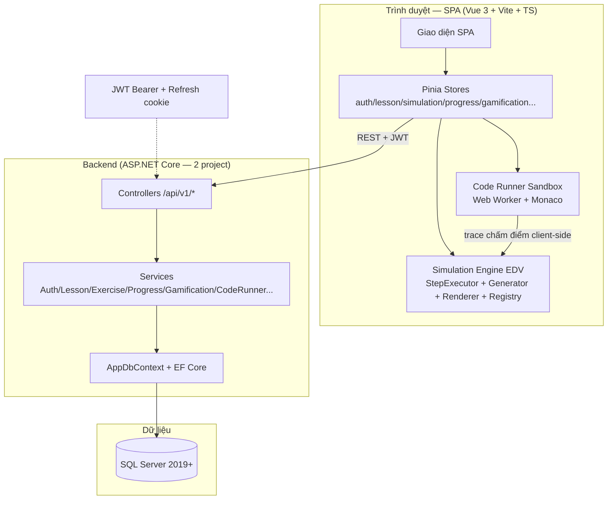
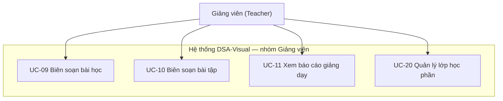
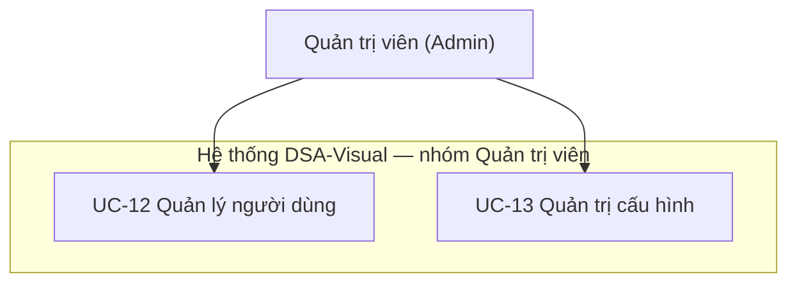

# PHẦN 3: PHÂN TÍCH - ANALYSIS

## 3.1 Mô hình triển khai hệ thống

Hệ thống DSA-Visual được triển khai theo mô hình 3 tầng: trình duyệt (Vue 3 SPA) gọi REST API (ASP.NET Core) và API đọc/ghi dữ liệu trên SQL Server. Toàn bộ Simulation Engine (EDV) chạy phía trình duyệt nên việc sinh bước mô phỏng không tốn tài nguyên máy chủ; máy chủ chỉ nhận các thao tác cần lưu trữ (phiên học, tiến độ, chấm điểm).



Sơ đồ trên mô tả luồng chính: giao diện SPA gọi API qua REST kèm JWT, API xử lý qua lớp Service rồi lưu vào SQL Server bằng EF Core; riêng mô phỏng và chấm code chạy ngay trong trình duyệt (Web Worker), máy chủ chỉ lưu lịch sử. Các thành phần chính được tóm tắt ở Bảng 3.1.

**Bảng 3.1: Các thành phần chính của hệ thống**

| Thành phần | Vai trò | Công nghệ |
|---|---|---|
| Client | Hiển thị giao diện, chạy mô phỏng EDV, chạy và chấm code trong sandbox | Vue 3 + Vite + TypeScript, Pinia, Web Worker, Monaco |
| API Server | Xác thực, cung cấp dữ liệu bài học/mô phỏng, chấm điểm bài tập, quản lý tiến độ và gamification | ASP.NET Core (DsaVisual.Api + DsaVisual.Application), EF Core |
| Database | Lưu toàn bộ dữ liệu: người dùng, bài học, bài tập, tiến độ, phiên học, code | SQL Server 2019+ |

(nguồn: SDD §2.1)

## 3.2 Sơ đồ Use Cases

### 3.2.1 Tổng quan

Hệ thống phục vụ **3 tác nhân chính**:

- **Người học (Student)** — xem bài học, chạy mô phỏng, làm bài tập, luyện tập theo lộ trình, quản lý hồ sơ và tham gia lớp học phần;
- **Giảng viên (Teacher)** — biên soạn bài học/bài tập, xem báo cáo giảng dạy và quản lý lớp học phần;
- **Quản trị viên (Admin)** — quản lý người dùng và cấu hình hệ thống.

Bên cạnh đó còn tác nhân **Khách (chưa đăng nhập)** với các chức năng tạo tài khoản, đăng nhập, xem demo công khai và khôi phục mật khẩu. Sơ đồ use case tổng thể gồm đủ 32 use case (UC-01 → UC-32):

```mermaid
graph TD
    subgraph "Hệ thống DSA-Visual"
        A[UC-01 Chạy mô phỏng giải thuật]
        B[UC-02 Tạo tài khoản]
        C[UC-03 Đăng nhập và duy trì phiên]
        D[UC-04 Xem bài học]
        E[UC-05 Tìm kiếm bài học]
        F[UC-06 Làm bài tập trắc nghiệm]
        G[UC-07 Làm bài tập dự đoán bước<br/>(Bậc 2 Lab)]
        H[UC-08 Xem tiến độ cá nhân]
        I[UC-09 Biên soạn bài học]
        J[UC-10 Biên soạn bài tập]
        K[UC-11 Xem báo cáo giảng dạy]
        L[UC-12 Quản lý người dùng]
        M[UC-13 Quản trị cấu hình]
        N[UC-14 Xem demo công khai]
        O[UC-15 Khôi phục mật khẩu]
        P[UC-16 Xem chi tiết bài học và mở module riêng]
        Q[UC-17 Viết và chạy code trong sandbox]
        R[UC-18 Nộp bài tập lập trình]
        S[UC-19 Xem lịch sử nộp bài code]
        T[UC-20 Quản lý lớp học phần]
        U[UC-21 Tham gia lớp bằng mã mời]
        V[UC-22 Ghi chú cá nhân]
        W[UC-23 Xem thành tích và huy hiệu]
        X[UC-24 Gửi phản hồi và báo lỗi]
        Y[UC-25 Học theo Learning Path]
        Z[UC-26 Làm Practice Ladder]
        AA[UC-27 Làm bài kiểm tra cuối lộ trình]
        AB[UC-28 Chạy Benchmark Lab]
        AC[UC-29 Làm Daily Quest và giữ Streak]
        AD[UC-30 Mua vật phẩm Gems Shop]
        AE[UC-31 Xem Leaderboard]
        AF[UC-32 Nâng cấp Premium]
    end
    Khach["Khách (chưa đăng nhập)"] --> B
    Khach --> C
    Khach --> N
    Khach --> O
    NguoiHoc["Người học (Student)"] --> A
    NguoiHoc --> D
    NguoiHoc --> E
    NguoiHoc --> F
    NguoiHoc --> G
    NguoiHoc --> H
    NguoiHoc --> P
    NguoiHoc --> Q
    NguoiHoc --> R
    NguoiHoc --> S
    NguoiHoc --> U
    NguoiHoc --> V
    NguoiHoc --> W
    NguoiHoc --> X
    NguoiHoc --> Y
    NguoiHoc --> Z
    NguoiHoc --> AA
    NguoiHoc --> AB
    NguoiHoc --> AC
    NguoiHoc --> AD
    NguoiHoc --> AE
    NguoiHoc --> AF
    NguoiDay["Giảng viên (Teacher)"] --> D
    NguoiDay --> E
    NguoiDay --> I
    NguoiDay --> J
    NguoiDay --> K
    NguoiDay --> T
    NguoiDay --> X
    Admin["Quản trị viên (Admin)"] --> L
    Admin --> M
    Admin --> X
```


*Hình 3.1: Sơ đồ use case tổng thể — 3 tác nhân và các chức năng chính của hệ thống. (ảnh placeholder — sinh ảnh thật bằng prompt NHÓM B #1)*

(nguồn: SRS §5.1)

### 3.2.2 Use Cases dành cho người học

Nhóm người học gồm 24 use case: xem bài học và mô phỏng giải thuật, làm bài tập (trắc nghiệm, dự đoán bước, lập trình), học theo lộ trình, tham gia lớp học phần và các chức năng gamification. Sơ đồ nhóm như sau:

```mermaid
graph TD
    subgraph "Hệ thống DSA-Visual — nhóm Người học"
        A[UC-01 Chạy mô phỏng giải thuật]
        B[UC-02 Tạo tài khoản]
        C[UC-03 Đăng nhập và duy trì phiên]
        D[UC-04 Xem bài học]
        E[UC-05 Tìm kiếm bài học]
        F[UC-06 Làm bài tập trắc nghiệm]
        G[UC-07 Làm bài tập dự đoán bước<br/>(Bậc 2 Lab)]
        H[UC-08 Xem tiến độ cá nhân]
        N[UC-14 Xem demo công khai]
        Q[UC-17 Viết và chạy code trong sandbox]
        R[UC-18 Nộp bài tập lập trình]
        S[UC-19 Xem lịch sử nộp bài code]
        U[UC-21 Tham gia lớp bằng mã mời]
        V[UC-22 Ghi chú cá nhân]
        W[UC-23 Xem thành tích và huy hiệu]
        X[UC-24 Gửi phản hồi và báo lỗi]
        Y[UC-25 Học theo Learning Path]
        Z[UC-26 Làm Practice Ladder]
        AA[UC-27 Làm bài kiểm tra cuối lộ trình]
        AB[UC-28 Chạy Benchmark Lab]
        AC[UC-29 Làm Daily Quest và giữ Streak]
        AD[UC-30 Mua vật phẩm Gems Shop]
        AE[UC-31 Xem Leaderboard]
        AF[UC-32 Nâng cấp Premium]
    end
    NguoiHoc["Người học (Student)"] --> A
    NguoiHoc --> B
    NguoiHoc --> C
    NguoiHoc --> D
    NguoiHoc --> E
    NguoiHoc --> F
    NguoiHoc --> G
    NguoiHoc --> H
    NguoiHoc --> N
    NguoiHoc --> Q
    NguoiHoc --> R
    NguoiHoc --> S
    NguoiHoc --> U
    NguoiHoc --> V
    NguoiHoc --> W
    NguoiHoc --> X
    NguoiHoc --> Y
    NguoiHoc --> Z
    NguoiHoc --> AA
    NguoiHoc --> AB
    NguoiHoc --> AC
    NguoiHoc --> AD
    NguoiHoc --> AE
    NguoiHoc --> AF
```


*Hình 3.2: Sơ đồ use case dành cho người học — 24 chức năng học tập và luyện tập chính. (ảnh placeholder — sinh ảnh thật bằng prompt NHÓM B #1)*

Các use case chính được liệt kê ở Bảng 3.2:

**Bảng 3.2: Danh sách use case dành cho người học**

| Mã UC | Tên | Mô tả |
|---|---|---|
| UC-01 | Chạy mô phỏng giải thuật | Mở mô phỏng, cấu hình dữ liệu đầu vào, điều khiển từng bước với 3 vùng đồng bộ (trực quan – mã giả – giải thích) |
| UC-02 | Tạo tài khoản | Đăng ký bằng email + mật khẩu, vai trò mặc định Student; chọn "Tôi là giảng viên" thì chờ Admin duyệt |
| UC-03 | Đăng nhập và duy trì phiên | Đăng nhập nhận JWT, tự động gia hạn phiên bằng refresh token, đăng xuất thu hồi phiên |
| UC-04 | Xem bài học | Duyệt cây chủ đề, đọc lý thuyết, đánh dấu đã học và mở module riêng (mô phỏng/bài tập/code) |
| UC-05 | Tìm kiếm bài học | Gõ từ khóa, hệ thống gợi ý bài học sau 300ms, chọn kết quả để mở bài học |
| UC-06 | Làm bài tập trắc nghiệm | Trả lời câu hỏi, nộp bài, hệ thống chấm điểm tự động và hiển thị giải thích |
| UC-07 | Làm bài tập dự đoán bước | Thao tác trên canvas editable, nộp, hệ thống chấm trạng thái cuối + giới hạn số bước |
| UC-08 | Xem tiến độ cá nhân | Xem thẻ KPI tổng quan, tiến độ theo từng chủ đề và nhảy tới bài học chưa học |
| UC-14 | Xem demo công khai | Khách chạy thử 3 demo (Bubble Sort, Binary Search, BFS) không cần tài khoản |
| UC-17 | Viết và chạy code trong sandbox | Soạn/hiệu chỉnh code trong Monaco, chạy an toàn trong Web Worker, xem trace đồng bộ editor – visual |
| UC-18 | Nộp bài tập lập trình | Nộp code, hệ thống chấm bằng test ẩn (tĩnh + ngẫu nhiên) và trả kết quả từng test |
| UC-19 | Xem lịch sử nộp bài code | Xem danh sách lần nộp, mở lại code cũ kèm kết quả và so sánh 2 lần nộp |
| UC-21 | Tham gia lớp bằng mã mời | Nhập mã mời 6 ký tự để vào lớp học phần đang mở |
| UC-22 | Ghi chú cá nhân | Soạn ghi chú gắn với bài học, tự lưu sau 1 giây, xem lại và xóa |
| UC-23 | Xem thành tích và huy hiệu | Xem huy hiệu đã mở và huy hiệu ẩn, nhận toast khi đạt huy hiệu mới |
| UC-24 | Gửi phản hồi và báo lỗi | Đánh giá sao + nhận xét bài học, gửi báo lỗi kèm ngữ cảnh tự động (URL, bước mô phỏng) |
| UC-25 | Học theo Learning Path | Chọn lộ trình, xem bản đồ node, vào node đang mở (trừ tim), pass node để mở khóa node kế |
| UC-26 | Làm Practice Ladder | Chuỗi 3 bậc Quiz → Lab → Code; pass bậc trước mới mở bậc sau, retry trong phiên miễn phí |
| UC-27 | Làm bài kiểm tra cuối lộ trình | Làm final test sau khi pass toàn bộ node, ngưỡng pass ≥ 70% |
| UC-28 | Chạy Benchmark Lab | So sánh nhiều giải thuật trên nhiều kích thước dữ liệu, đối chiếu overlay lý thuyết |
| UC-29 | Làm Daily Quest và giữ Streak | Nhận thử thách hằng ngày, hoàn thành để giữ chuỗi ngày học liên tục |
| UC-30 | Mua vật phẩm Gems Shop | Dùng gems đổi vật phẩm (tim, streak freeze...) trong cửa hàng |
| UC-31 | Xem Leaderboard | Xem bảng xếp hạng theo XP |
| UC-32 | Nâng cấp Premium | Checkout mô phỏng gói Premium, quản lý hết hạn |

(nguồn: SRS §5.2-5.9, §5.15, §5.18-5.20, §5.22-5.33)

### 3.2.3 Use Cases dành cho giảng viên

Nhóm giảng viên gồm 4 use case: biên soạn nội dung, xem báo cáo và quản lý lớp học phần:




*Hình 3.3: Sơ đồ use case dành cho giảng viên — 4 chức năng biên soạn, báo cáo và quản lý lớp. (ảnh placeholder — sinh ảnh thật bằng prompt NHÓM B #1)*

**Bảng 3.3: Danh sách use case dành cho giảng viên**

| Mã UC | Tên | Mô tả |
|---|---|---|
| UC-09 | Biên soạn bài học | Tạo/sửa chủ đề và bài học rich-text, gắn mô phỏng có sẵn kèm cấu hình mặc định, gắn bài tập, lưu nháp và kích hoạt |
| UC-10 | Biên soạn bài tập | Tạo bài tập theo loại câu hỏi (chọn 1/nhiều/đúng-sai), soạn đáp án và giải thích, xem trước và kích hoạt |
| UC-11 | Xem báo cáo giảng dạy | Xem thống kê bài học (người xem, % hoàn thành, điểm trung bình) và xuất CSV |
| UC-20 | Quản lý lớp học phần | Tạo lớp + mã mời 6 ký tự, thêm/xóa sinh viên, gán nội dung kèm hạn nộp, xem báo cáo lớp và xuất CSV |

(nguồn: SRS §5.10-5.12, §5.21)

### 3.2.4 Use Cases dành cho quản trị viên

Nhóm quản trị viên gồm 2 use case:




*Hình 3.4: Sơ đồ use case dành cho quản trị viên — quản lý người dùng và cấu hình hệ thống. (ảnh placeholder — sinh ảnh thật bằng prompt NHÓM B #1)*

**Bảng 3.4: Danh sách use case dành cho quản trị viên**

| Mã UC | Tên | Mô tả |
|---|---|---|
| UC-12 | Quản lý người dùng | Xem danh sách người dùng, khóa/mở khóa, phê duyệt tài khoản giảng viên, đặt lại mật khẩu; mọi thao tác đều ghi log máy chủ |
| UC-13 | Quản trị cấu hình hệ thống | Chỉnh cấu hình hệ thống (domain email, chính sách mật khẩu, giới hạn upload), lưu và áp dụng ngay không cần khởi động lại |

(nguồn: SRS §5.13-5.14)

## 3.3 Đặc tả yêu cầu hệ thống (SRS)

### 3.3.1 Ma trận yêu cầu chức năng

Bảng 3.5 tổng hợp đầy đủ **75 yêu cầu chức năng (FR)** của hệ thống theo 10 module (A — Xác thực, B — Bài học, C — Mô phỏng, D — Practice Ladder, E — Tiến độ, F — Quản trị, G — Trang phụ trợ, H — Lớp học phần, I — Code Runner, J — Gamification & Premium). 12 FR đã được duyệt cắt (FR-1.10, FR-2.7, FR-2.8, FR-2.9, FR-3.13, FR-3.17, FR-3.19, FR-5.6, FR-5.7, FR-6.4, FR-7.3, FR-7.5) không nằm trong bảng.

**Bảng 3.5: Ma trận yêu cầu chức năng (master matrix FR)**

| Mã FR | Tên | Mô tả ngắn | UC liên quan | Ưu tiên |
|---|---|---|---|---|
| FR-1.1 | Đăng ký tài khoản | Khách tạo tài khoản bằng email + mật khẩu, vai trò mặc định Student | UC-02 | Cao |
| FR-1.2 | Đăng nhập | Xác thực email + mật khẩu, cấp access token và refresh cookie | UC-03 | Cao |
| FR-1.3 | Gia hạn phiên | Tự động cấp access token mới khi hết hạn bằng refresh token | UC-03 | Cao |
| FR-1.4 | Đăng xuất | Thu hồi refresh token và xóa cookie phiên | UC-03 | Cao |
| FR-1.5 | Đổi mật khẩu | Người dùng đổi mật khẩu của mình sau khi xác thực | UC-03 | TB |
| FR-1.6 | Khôi phục mật khẩu | Gửi link đặt lại mật khẩu qua email, hiệu lực 30 phút, dùng 1 lần | UC-15 | TB |
| FR-1.7 | Cập nhật thông tin cá nhân | Sửa họ tên, avatar trong hồ sơ cá nhân | UC-03 | TB |
| FR-1.8 | Phê duyệt tài khoản giảng viên | Admin duyệt hoặc từ chối tài khoản TeacherPending | UC-12 | TB |
| FR-1.9 | Quản lý người dùng | Admin khóa/mở khóa, đặt lại mật khẩu, ghi log mọi thao tác | UC-12 | TB |
| FR-1.11 | Xác thực hai lớp | Yêu cầu mã 6 số gửi email khi đăng nhập (nếu bật) | UC-03 | Thấp |
| FR-2.1 | Quản lý chủ đề | CRUD chủ đề (topic) cho giảng viên | UC-09 | Cao |
| FR-2.2 | Quản lý bài học | CRUD bài học rich-text, gắn mô phỏng và bài tập | UC-09 | Cao |
| FR-2.3 | Xem danh sách bài học | Duyệt cây chủ đề kèm trạng thái tiến độ từng bài | UC-04 | Cao |
| FR-2.4 | Xem chi tiết bài học | Đọc nội dung lý thuyết, đánh dấu đã học, mở module riêng | UC-04 | Cao |
| FR-2.5 | Tìm kiếm bài học | Gợi ý kết quả theo từ khóa sau 300ms | UC-05 | TB |
| FR-2.6 | Ghi chú cá nhân trên bài học | Ghi chú riêng gắn bài học, tự lưu sau 1 giây | UC-04 | TB |
| FR-2.10 | Learning Path | Lộ trình node mở khóa tuần tự theo kết quả học | UC-25 | Cao |
| FR-2.11 | Two-way sync bằng deep-link | Mở thẳng mô phỏng tại bước N qua link `?step=N` và ngược lại | UC-01 | Cao |
| FR-3.1 | Danh mục mô phỏng | Xem danh sách mô phỏng theo loại giải thuật | UC-01 | Cao |
| FR-3.2 | Khởi tạo mô phỏng | Kiểm tra tim, nạp cấu hình mặc định và sinh chuỗi bước khi mở | UC-01 | Cao |
| FR-3.3 | Hiển thị đồng bộ 3 vùng | Canvas trực quan, mã giả và giải thích cập nhật theo từng bước | UC-01 | Cao |
| FR-3.4 | Cấu hình dữ liệu đầu vào | Nhập/đổi dữ liệu mẫu, sinh lại chuỗi bước về bước 0 | UC-01 | Cao |
| FR-3.5 | Điều khiển mô phỏng | Phát/dừng/bước tiếp/bước lùi/về đầu/về cuối, đổi tốc độ | UC-01 | Cao |
| FR-3.6 | Trạng thái trực quan của phần tử | Tô màu trạng thái phần tử theo từng bước thực thi | UC-01 | Cao |
| FR-3.7 | Bảng mã giả đồng bộ | Highlight dòng mã giả tương ứng bước đang chạy | UC-01 | Cao |
| FR-3.8 | Tùy chọn hiển thị | Ẩn/hiện vùng, đổi tốc độ và màu sắc hiển thị | UC-01 | TB |
| FR-3.9 | Bộ đếm thống kê | Đếm số bước, số lần chạy và thống kê so sánh | UC-01 | TB |
| FR-3.10 | Lưu mô phỏng yêu thích | Đánh dấu mô phỏng yêu thích để mở nhanh | UC-01 | Thấp |
| FR-3.11 | Chia sẻ liên kết mô phỏng | Sao chép link chia sẻ mô phỏng hiện tại | UC-01 | Thấp |
| FR-3.12 | Thực hành bước thủ công | Người học tự thao tác, hệ thống kiểm tra kết quả | UC-01 | Cao |
| FR-3.14 | Hiển thị ngăn xếp đệ quy | Call Stack hiển thị trong mô phỏng đệ quy | UC-01 | TB |
| FR-3.15 | Điểm dừng có điều kiện | Dừng mô phỏng khi gặp điều kiện do người học chỉ định | UC-01 | TB |
| FR-3.16 | Kiểm tra nhanh sau mô phỏng | Mini quiz ngắn sau khi xem xong mô phỏng | UC-01 | TB |
| FR-3.18 | Chế độ tối | Giao diện tối cho toàn hệ thống | — | TB |
| FR-3.20 | Benchmark Lab | Chạy so sánh nhiều giải thuật trên 1 kích thước dữ liệu | UC-28 | TB |
| FR-3.20b | Benchmark đa kích thước | So sánh trên nhiều kích thước, hiển thị overlay lý thuyết | UC-28 | TB |
| FR-4.1 | Quản lý bài tập | CRUD bài tập cho giảng viên (loại, câu hỏi, đáp án, bậc Ladder) | UC-10 | Cao |
| FR-4.2 | Làm bài tập trắc nghiệm | Bậc 1 Quiz: trả lời, nộp, chấm điểm tự động, hiển thị giải thích | UC-06 | Cao |
| FR-4.3 | Bài tập dự đoán bước | Bậc 2 Lab: chấm trạng thái cuối + giới hạn số bước | UC-07 | TB |
| FR-4.4 | Đánh giá và lịch sử bài làm | Lưu điểm, giữ điểm cao nhất, xem lại bài làm | UC-06 | TB |
| FR-4.5 | Ngân hàng câu hỏi dùng lại | Tái sử dụng câu hỏi theo chủ đề/tag | UC-10 | Thấp |
| FR-4.6 | Chế độ luyện tập | Làm lại bài tập không tính vào điểm chính thức | UC-06 | TB |
| FR-4.7 | Gợi ý trả lời | Hints trừ 20%/gợi ý, tối thiểu giữ 40% điểm câu | UC-06 | TB |
| FR-4.8 | Xáo trộn câu hỏi và phương án | Trộn câu hỏi + phương án theo seed ổn định | UC-06 | TB |
| FR-4.9 | Giải thích theo phương án sai | Hiển thị giải thích riêng cho từng phương án sai | UC-06 | TB |
| FR-4.10 | Nhập câu hỏi từ CSV | Nhập hàng loạt câu hỏi từ file CSV | UC-10 | Thấp |
| FR-4.11 | Practice Ladder tuần tự | Chuỗi 3 bậc Quiz → Lab → Code theo từng node | UC-26 | Cao |
| FR-4.12 | Kiểm tra cuối lộ trình | Final test sau khi pass toàn bộ node, ngưỡng pass ≥ 70% | UC-27 | Cao |
| FR-5.1 | Ghi nhận tiến độ | Cập nhật tiến độ người học sau mỗi hành động học | UC-08 | Cao |
| FR-5.2 | Dashboard tiến độ cá nhân | Thẻ KPI + thanh tiến độ theo chủ đề | UC-08 | Cao |
| FR-5.3 | Báo cáo giảng viên | Thống kê bài học, xuất CSV | UC-11 | TB |
| FR-5.4 | Thống kê hệ thống | Báo cáo tổng hợp cho Admin | — | TB |
| FR-5.5 | Huy hiệu thành tích | Trao huy hiệu đúng 1 lần theo sự kiện học tập | UC-08 | TB |
| FR-6.2 | Cấu hình hệ thống | Chỉnh cấu hình, áp dụng ngay không cần khởi động lại | UC-13 | TB |
| FR-7.1 | Trang chủ công khai | Trang chủ với demo công khai | UC-14 | TB |
| FR-7.2 | Trang trợ giúp | Trang FAQ và trợ giúp | — | TB |
| FR-7.4 | Đánh giá nội dung | Sao + nhận xét ≤ 200 ký tự cho bài học | — | Thấp |
| FR-7.6 | Demo công khai 3 visualizer | Chạy thử Bubble Sort, Binary Search, BFS không cần tài khoản | UC-14 | TB |
| FR-8.1 | Tạo và quản lý lớp học phần | Tạo lớp + mã mời duy nhất 6 ký tự | — | TB |
| FR-8.2 | Quản lý sinh viên trong lớp | Thêm/xóa sinh viên, tham gia bằng mã mời | — | TB |
| FR-8.3 | Gán nội dung và hạn nộp | Gán nội dung bắt buộc kèm hạn nộp theo lớp | — | TB |
| FR-8.4 | Báo cáo theo lớp | Báo cáo % hoàn thành, điểm TB, danh sách chậm trễ, xuất CSV | — | TB |
| FR-9.1 | Trình soạn mã nhúng | Editor Monaco nạp sẵn code mẫu, highlight cú pháp | UC-17 | Cao |
| FR-9.2 | Chạy mã và trực quan hóa | Chạy code an toàn, phát trace đồng bộ editor – visual | UC-17 | Cao |
| FR-9.3 | Bài tập lập trình + chấm tự động | Chấm bằng test ẩn (tĩnh + ngẫu nhiên), trả kết quả từng test | UC-18 | TB |
| FR-9.4 | Sandbox an toàn | Chạy trong Web Worker, chặn vòng lặp vô hạn, không treo trình duyệt | UC-17 | Cao |
| FR-9.5 | Lịch sử nộp bài code | Xem lại các lần nộp và so sánh kết quả | UC-19 | TB |
| FR-9.6 | Sandbox giới hạn chi tiết | Giới hạn 10 giây / 64MB / 200 dòng, cấm import và I/O ngoài | UC-17 | Cao |
| FR-10.1 | Tim, hồi tim và session | Trừ 1 tim atomic khi vào node, session 30 phút resume miễn phí | UC-25 | Cao |
| FR-10.2 | Gems + Gems Shop | Kiếm gems và đổi vật phẩm trong cửa hàng | UC-30 | TB |
| FR-10.3 | Daily Quest | Thử thách hằng ngày, hoàn thành nhận thưởng | UC-29 | TB |
| FR-10.4 | Streak + Streak Freeze | Giữ chuỗi ngày học liên tục, dùng vật phẩm giữ chuỗi | UC-29 | TB |
| FR-10.5 | XP & Level | Tích lũy XP, tăng cấp, trao XP 1 lần khi pass đầu | UC-25 | TB |
| FR-10.6 | Leaderboard | Bảng xếp hạng theo XP | UC-31 | TB |
| FR-10.7 | Premium và hết hạn | Gói Premium (P1), checkout mô phỏng, quản lý hết hạn | UC-32 | TB |

(nguồn: SRS §3.1 — master matrix FR)

### 3.3.2 Đặc tả use case hạt nhân

Phần này đặc tả 3 use case quan trọng nhất của hệ thống theo 4 mục ngắn: mô tả chức năng, dữ liệu liên quan, đối tượng sử dụng và yêu cầu bảo mật.

#### UC-01 — Chạy mô phỏng giải thuật

- **Mô tả chức năng:** Người học mở mô phỏng từ Node Hub hoặc từ bài học. Hệ thống kiểm tra tim, nạp cấu hình mặc định và sinh chuỗi bước, sau đó hiển thị bước 0. Người học điều khiển phát/dừng/bước tiếp/bước lùi, kéo thanh tiến trình hoặc đổi tốc độ; cả 3 vùng (trực quan, mã giả, giải thích) cập nhật đồng bộ theo từng bước. Khi hoàn tất, hệ thống hiển thị tóm tắt thống kê và lưu trạng thái resume nếu đang trong phiên học.
- **Dữ liệu liên quan:** `Lessons`, `LessonSimulations`, `NodeSessions`, `UserProgress` (ghi nhận sự kiện chạy mô phỏng ≥ 5 bước).
- **Đối tượng sử dụng:** Người học (đã đăng nhập); khách chỉ dùng được 3 demo công khai không lưu dữ liệu.
- **Yêu cầu bảo mật:** Xác thực JWT cho người đăng nhập; trừ tim atomic phía server (mã lỗi 403 `HEARTS_EMPTY` khi hết tim); demo công khai bị chặn truy cập các API cần phiên.

#### UC-25 — Học theo Learning Path và mở khóa node

- **Mô tả chức năng:** Người học chọn lộ trình, xem bản đồ node (khóa/đang học/hoàn thành 1-3 sao) và bấm vào node đang mở. Hệ thống kiểm tra và trừ 1 tim, tạo mới hoặc gia hạn phiên học rồi đưa người học vào Node Hub. Khi pass node, hệ thống cập nhật tiến độ, mở khóa node kế và trao XP 1 lần cho lần pass đầu; hết lộ trình thì mở bài kiểm tra cuối.
- **Dữ liệu liên quan:** `LearningPaths`, `LearningPathNodes`, `NodeSessions`, `UserNodeProgress`, `Users` (tim, XP).
- **Đối tượng sử dụng:** Người học (đã đăng nhập).
- **Yêu cầu bảo mật:** Xác thực JWT; trừ tim atomic server-side chống double-spend khi mở nhiều tab cùng lúc; dùng server timestamp để chống chỉnh đồng hồ thiết bị gian lận hồi tim.

#### UC-26 — Làm Practice Ladder (Quiz → Lab → Code)

- **Mô tả chức năng:** Với mỗi node, người học trải qua 3 bậc: pass Quiz ≥ 60% mới mở Bậc 2 Lab; pass Lab (chấm trạng thái cuối khớp kết quả chuẩn và số bước không vượt giới hạn) mới mở Bậc 3 Code; pass Code ≥ 70% test ẩn thì pass node. Retry bậc trong phiên 30 phút không trừ thêm tim; thoát giữa chừng thì resume đúng bậc đang dở.
- **Dữ liệu liên quan:** `Exercises`, `ExerciseSubmissions`, `CodeRuns`, `CodeSubmissions`, `NodeSessions`, `UserNodeProgress`.
- **Đối tượng sử dụng:** Người học (đã đăng nhập và vào node).
- **Yêu cầu bảo mật:** Xác thực JWT; server guard chặn vào bậc sau khi chưa pass bậc trước; chấm điểm phía server, nộp bài idempotent (không tính 2 lần khi mất mạng).

(nguồn: SRS §5.2, §5.26, §5.27)
