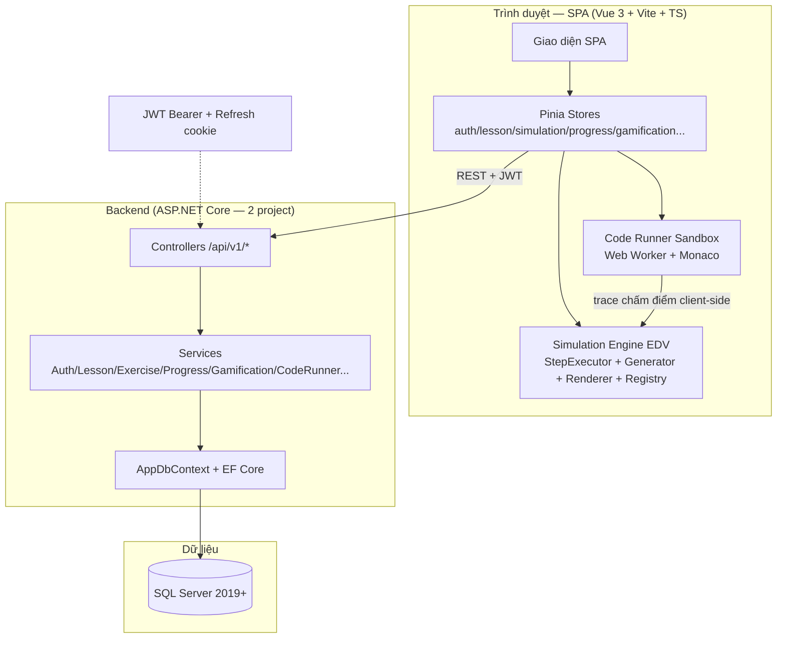
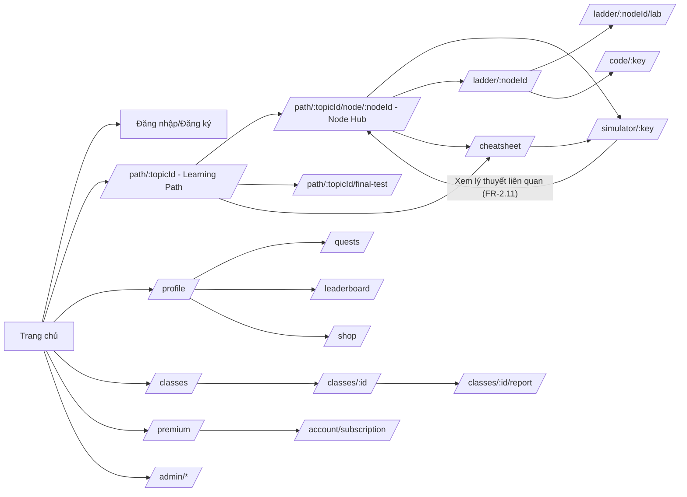
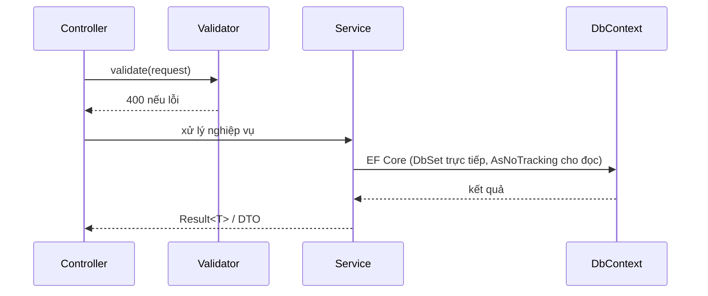
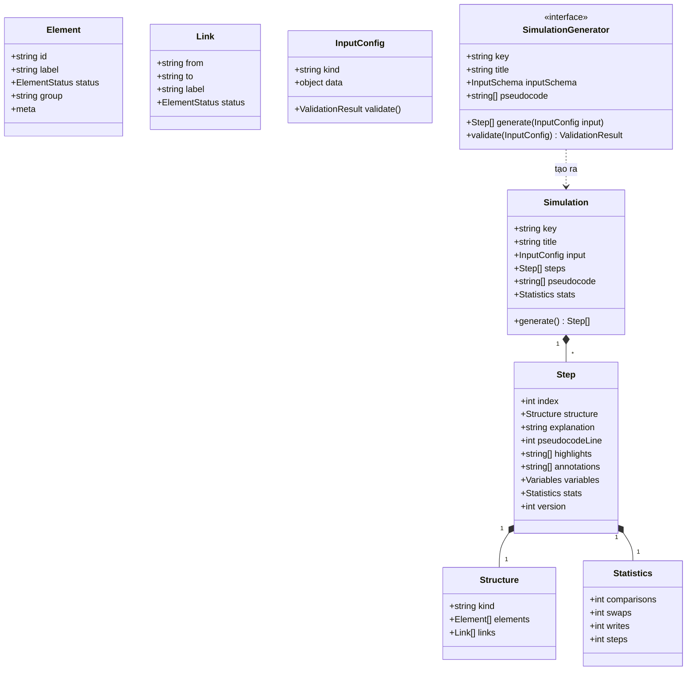
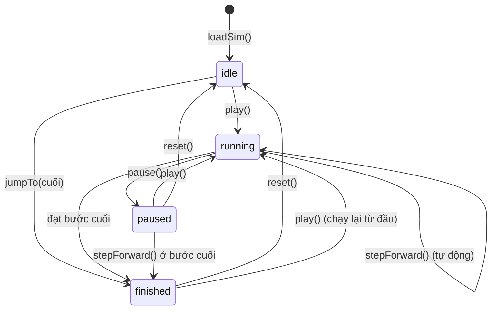

# PHẦN 4: THIẾT KẾ - DESIGN

## 4.1 Mô hình công nghệ

Hệ thống gồm 3 lớp công nghệ rõ ràng: frontend là SPA Vue 3 chạy trong trình duyệt và chứa toàn bộ Simulation Engine EDV; backend là API ASP.NET Core gồm 2 project; dữ liệu lưu trong SQL Server. Frontend gọi backend qua REST có xác thực JWT. Sơ đồ kiến trúc tổng thể như sau:



**Bảng 4.1: Tổng hợp công nghệ theo lớp**

| Lớp | Công nghệ | Vai trò |
|---|---|---|
| Frontend | Vue 3 + Pinia + Vite + TypeScript | Giao diện SPA, quản lý trạng thái, chạy Simulation Engine EDV và Code Runner ngay trong trình duyệt |
| Backend | ASP.NET Core + EF Core | API REST `/api/v1`, xử lý nghiệp vụ trong Service, truy cập dữ liệu qua DbContext |
| CSDL | SQL Server 2019+ | Lưu trữ 32 bảng dữ liệu, lưu lịch sử chấm điểm |

Điểm công nghệ đáng chú ý: Simulation Engine EDV chạy phía client nên bước lùi miễn phí và sinh bước nhanh (NFR-2); Code Runner chấm code trong sandbox Web Worker, backend chỉ lưu lịch sử; phiên đăng nhập dùng JWT access token trong bộ nhớ kèm refresh cookie an toàn (ADR-004).

(nguồn: SDD §2, §3)

## 4.2 Thiết kế giao diện

### 4.2.1 Sitemap

Hệ thống có khoảng 32 màn chính (SDD §8.4 đặc tả đủ 33 route, gồm Màn 33 Khám phá). Sơ đồ luồng màn hình chính như sau:



Mũi tên trong sơ đồ thể hiện đường đi chính của người dùng: khách ghé trang chủ rồi đăng ký, người học đi từ bản đồ lộ trình vào Node Hub rồi rẽ sang mô phỏng/luyện tập, giảng viên và quản trị viên đi vào nhóm màn riêng của vai trò. Các màn được nhóm theo chức năng như bảng dưới:

**Bảng 4.2: Nhóm màn theo chức năng**

| Nhóm | Màn | Số màn |
|---|---|---|
| Công khai | 01 Trang chủ, 02 Đăng nhập/Đăng ký, 12 Trợ giúp | 3 |
| Học tập | 03 Danh sách bài học (redirect), 04 Chi tiết bài học, 13 Learning Path, 18 CheatSheet, 30 Final Test, 31 Node Hub | 6 |
| Mô phỏng | 05 Simulator, 33 Khám phá | 2 |
| Luyện tập | 06 Bài tập trắc nghiệm, 07 Dự đoán bước (sáp nhập Bậc 2), 14 Practice Ladder, 15 Interactive Lab, 16 Code Runner | 5 |
| Gamification | 22 Shop, 23 Daily Quest, 24 Leaderboard, 25 Premium, 26 Checkout (modal), 27 Quản lý gói, 28 Modal Hết tim | 7 |
| Lớp học | 19 Danh sách lớp, 20 Chi tiết lớp, 21 Báo cáo lớp | 3 |
| Quản trị | 08 Dashboard (redirect), 09 Quản trị nội dung, 10 Quản lý người dùng, 11 Thống kê, 29 Chờ duyệt Teacher | 5 |
| Hồ sơ | 32 Hồ sơ cá nhân | 1 |

(nguồn: SDD §8.2, §8.4; SCREEN_MAP)

### 4.2.2 Layout

Giao diện dùng một hệ thống thiết kế thống nhất cho mọi màn: màu, font, cỡ chữ và bộ component dùng chung được định nghĩa một chỗ, không viết CSS rải rác.

**Bảng 4.3: Hệ thống thiết kế (design tokens)**

| Mục | Đặc tả |
|---|---|
| Ngôn ngữ | Tiếng Việt có dấu, mọi chuỗi nằm trong file i18n |
| Font | Inter/Roboto (fallback Segoe UI, Arial); mã giả dùng JetBrains Mono/Consolas |
| Cỡ chữ | Nội dung 14px, form 16px, tiêu đề 20/24/32px |
| Màu chủ đạo | Primary #2563EB, Secondary #0F172A, Success #16A34A, Warning #D97706, Danger #DC2626, Background #F8FAFC, Surface #FFFFFF |
| Màu trạng thái mô phỏng | default #CBD5E1, active #FACC15, highlight #FB923C, swap #EF4444, done #22C55E, error #B91C1C, muted #E2E8F0 |
| Bo góc/đổ bóng | Thẻ 8px, nút 6px; shadow nhẹ, modal 0 10px 25px |
| Component tự xây | Button, Input, Select, Modal, Toast, Table, Card, Tabs, Tooltip, Skeleton, EmptyState, Badge, ProgressBar, Drawer |
| Thư viện hỗ trợ | Icon lucide-vue-next, soạn thảo rich-text Quill, biểu đồ Chart.js |

Toàn bộ màn học được bọc trong App shell gồm header chung và sidebar trái theo vai trò. Header luôn hiển thị widget tim/gems/streak của người dùng. Menu khác nhau cho 3 vai trò:

**Bảng 4.4: Sidebar theo vai trò**

| Vai trò | Menu chính |
|---|---|
| Sinh viên | Lộ trình (/path), Khám phá (/simulations), Hồ sơ (/profile), Thử thách (/quests), Lớp học (/classes), Cửa hàng (/shop), Premium, Trợ giúp |
| Giảng viên | Lộ trình, Khám phá, Quản lý nội dung (/admin/*), Lớp học (/classes), Báo cáo (/reports), còn lại như Sinh viên |
| Quản trị viên | Người dùng (/admin/users), Nội dung (/admin/lessons), Cấu hình (/admin/settings), Thống kê (/admin/stats), còn lại như Giảng viên |

Hai route cũ `/learn` và `/dashboard` tự chuyển hướng sang `/path` và `/profile` để giữ một lối vào duy nhất.

(nguồn: SDD §8.1, §8.7)

### 4.2.3 Giao diện chức năng

Dưới đây là 12 màn hình chính của hệ thống. Ảnh hiện tại là placeholder, sẽ được thay bằng ảnh chụp thật khi hoàn thiện giao diện.

#### Màn 01 — Trang chủ


*Hình 4.1: Trang chủ giới thiệu sản phẩm, 6 thẻ tính năng và 3 demo công khai. (ảnh placeholder — chụp thật thay sau)*

Trang chủ công khai gồm hero giới thiệu, 6 thẻ tính năng, khối "Cách hoạt động", số liệu hệ thống và 3 thẻ demo công khai (Bubble Sort, Binary Search, BFS) chạy được ngay không cần đăng nhập. Khách bấm "Đăng ký miễn phí" để tạo tài khoản hoặc "Chạy thử" để xem demo; người đã đăng nhập thấy nút "Học tiếp" trỏ về Lộ trình.

#### Màn 02 — Đăng nhập/Đăng ký


*Hình 4.2: Màn đăng nhập và đăng ký với validation inline. (ảnh placeholder — chụp thật thay sau)*

Màn xác thực gồm đăng nhập và đăng ký trên 2 route riêng. Biểu mẫu kiểm tra ngay khi rời ô nhập, mật khẩu có checklist sống (đủ dài, có chữ hoa, số, ký tự đặc biệt), checkbox "Tôi là giảng viên" đưa tài khoản vào trạng thái chờ duyệt. Tài khoản đã bật xác thực 2 lớp phải nhập thêm mã OTP gửi qua email. Sau khi đăng nhập, sinh viên về Lộ trình, giảng viên/quản trị về trang quản trị.

#### Màn 04 — Chi tiết bài học


*Hình 4.3: Màn chi tiết bài học hiển thị lý thuyết và thẻ liên kết tài nguyên. (ảnh placeholder — chụp thật thay sau)*

Màn hiển thị nội dung lý thuyết dạng rich-text; không nhúng mô phỏng hay bài tập trong trang mà đưa thẻ liên kết mở các trang riêng. Người học ghi chú cá nhân (tự lưu sau 1 giây), đánh giá sao 1-5 sau khi đã học, và bấm "Xem bước này" để mở mô phỏng đúng đoạn liên quan.

#### Màn 05 — Màn hình mô phỏng (quan trọng nhất)


*Hình 4.4: Màn mô phỏng 3 vùng đồng bộ: mã giả, canvas trực quan, giải thích từng bước. (ảnh placeholder — chụp thật thay sau)*

Đây là màn quan trọng nhất của hệ thống, bố cục 3 vùng đồng bộ trong cùng một frame: trái là panel mã giả (dòng đang chạy tô vàng kèm giá trị biến), giữa là canvas vẽ cấu trúc dữ liệu theo trạng thái màu, phải là panel giải thích từng bước bằng tiếng Việt. Thanh điều khiển bên dưới canvas có phát/dừng/bước tới/bước lùi, thanh tiến trình kéo thả và tốc độ 0.25x-4x; người học có thể cấu hình lại dữ liệu đầu vào theo từng loại CTDL, đặt breakpoint, tự thực hành bước thủ công và dùng phím tắt (Space phát/dừng, mũi tên sang bước). Bố cục dự kiến như wireframe sau:

```
+-----------------------------------------------------------------------------------------------+
|  Header:  Quay lại bài học  |  Bubble Sort - Sắp xếp nổi bọt  |  Yêu thích  Chia sẻ  Tùy chọn |
+-----------------------------------------------------------------------------------------------+
|  MÃ GIẢ (3/12)   |   VÙNG TRỰC QUAN (6/12)                              |  GIẢI THÍCH (3/12)   |
|  ----------------|-----------------------------------------------------|---------------------|
|  1 procedure      |   [3] [7] [1] [5]  <- các ô mảng                     |  BƯỚC 12/34          |
|  2  for i ...     |     ^                                              |  So sánh a[0]=3 và    |
|  3    swapped=F   |     i=0       [7] [1] <- đang so sánh               |  a[1]=7: 3 > 7 ?     |
|  4    for j ...   |  Màu: mặc định  active  swap  done                  |  -> sai, không hoán   |
|  5      if a[j]   |  Bộ đếm: so sánh 14 | hoán đổi 3 |                  |  đổi. j tăng lên 1.  |
|  6        swap    |  Tốc độ [0.25x|0.5x|1x|2x|4x]                     |  Biến: i=0, j=1       |
|  7        swapT   |-----------------------------------------------------|                     |
|  8  if swapped    |  [Về đầu] [Lùi] [Phát/Dừng] [Tới] [Cuối] | 12/34 |  [Tại sao?] (tooltip) |
|  9  end           |-----------------------------------------------------|---------------------|
|  [Thu gọn]        |  [Cấu hình lại] [Tạo ngẫu nhiên] [Về đầu]        |                     |
+-----------------------------------------------------------------------------------------------+
|  Footer:  Phím tắt: Space = Phát/Dừng; mũi tên trái/phải = Bước; Home/End = Về đầu/cuối        |
+-----------------------------------------------------------------------------------------------+
```

#### Màn 06 — Bài tập trắc nghiệm


*Hình 4.5: Màn làm bài trắc nghiệm với mini-map định vị câu hỏi. (ảnh placeholder — chụp thật thay sau)*

Người học làm bài trắc nghiệm Bậc 1 của Practice Ladder hoặc bài kiểm tra cuối lộ trình: câu hỏi ở giữa, mini-map bên phải đánh dấu câu đã trả lời/đang xem/đánh dấu xem lại. Hết giờ tự nộp nếu có cấu hình. Sau nộp hiện kết quả chi tiết: điểm, thống kê đúng/sai và giải thích từng câu kèm lý do đáp án đã chọn sai. Có chế độ Luyện tập không chấm điểm và nút Gợi ý tốn token.

#### Màn 13 — Bản đồ Learning Path


*Hình 4.6: Bản đồ lộ trình dạng đường mòn, node khóa/mở/đã qua. (ảnh placeholder — chụp thật thay sau)*

Bản đồ node kiểu "đường mòn" cuộn dọc giúp người học thấy thứ tự học và trạng thái từng node (khóa, đang mở, đã qua kèm số sao). Pass một node sẽ mở khóa node kế tiếp; node cuối lộ trình là bài kiểm tra cuối, chỉ mở khi qua toàn bộ node. Header có thanh tiến độ tổng và widget tim/gems.

#### Màn 14 — Practice Ladder


*Hình 4.7: Khung luyện tập 3 bậc Quiz, Lab, Code với stepper trên cùng. (ảnh placeholder — chụp thật thay sau)*

Khung luyện tập 3 bậc của một node: Quiz (Bậc 1) → Interactive Lab (Bậc 2) → Code Challenge (Bậc 3). Stepper trên cùng cho biết bậc đã qua, đang làm, đang khóa; mỗi bậc là một component tách, qua bậc nào tự chuyển bậc kế. Điểm node tính Quiz 20% + Lab 30% + Code 50%, giữ điểm cao nhất mỗi bậc; phiên học 30 phút cho phép thoát ra vào tiếp tục.

#### Màn 15 — Interactive Lab


*Hình 4.8: Màn luyện tập Bậc 2, thao tác trực tiếp trên canvas. (ảnh placeholder — chụp thật thay sau)*

Bậc 2 yêu cầu người học tự thao tác trên canvas (kéo thả ô, chọn nút cha) để giải bài theo kịch bản sắp xếp, BST hoặc đồ thị. Bảng điều khiển cho biết số thao tác đã dùng so với giới hạn (chuẩn x 1.5), có nút Hoàn tác, Làm lại, Gợi ý tốn token, Nộp bài. Server chấm trạng thái cuối cùng khớp chuẩn và số bước không vượt giới hạn.

#### Màn 16 — Code Runner


*Hình 4.9: Màn Code Runner với trình soạn mã Monaco và canvas trực quan. (ảnh placeholder — chụp thật thay sau)*

Trình soạn mã Monaco nạp sẵn code mẫu, người học hoàn thiện hàm theo chữ ký cố định rồi chạy trong sandbox Web Worker (giới hạn 10 giây, 64MB, 200 dòng). Canvas bên phải phát trực quan đồng bộ 2 chiều: bấm dòng code nhảy đúng bước tương ứng. Khi vào từ Bậc 3, màn thêm nút Nộp bài với bộ test ẩn chấm theo đầu ra và lịch sử nộp bài.

So sánh số liệu thật (thời gian, số so sánh, số hoán đổi/ghi) của 2-5 giải thuật cùng cấu trúc dữ liệu tại nhiều kích thước n (10/50/100/500/1000). Kết quả hiển thị dạng bảng số liệu và biểu đồ cột có đường cong lý thuyết tự fit; màn tự sinh khối kết luận. Màn này miễn phí tim, không tính vào lộ trình.

#### Màn 24 — Bảng xếp hạng


*Hình 4.11: Bảng xếp hạng 3 tab Tuần, Level, Lớp. (ảnh placeholder — chụp thật thay sau)*

Xếp hạng người học theo 3 tab: Tuần (reset thứ Hai hằng tuần), Level (theo tổng kinh nghiệm) và Lớp (theo lớp học của mình). Bảng phân trang 20 dòng, ghim vị trí của người dùng nếu nằm ngoài top 50, bấm vào một người xem hồ sơ học tập của họ.

#### Màn 32 — Hồ sơ


*Hình 4.12: Hồ sơ cá nhân với 4 tab Tổng quan, Tiến độ, Thành tích, Cài đặt. (ảnh placeholder — chụp thật thay sau)*

Trang hồ sơ trả lời câu hỏi "Tôi đang ở đâu?": tổng quan level, XP, streak, tim, gems, tiến độ lộ trình; 4 tab Tổng quan/Tiến độ/Thành tích/Cài đặt, mỗi tab một component tách. Có thẻ tắt nhanh sang Quest, Bảng xếp hạng và Shop; trong Cài đặt đổi mật khẩu, bật xác thực 2 lớp và dark mode.

(nguồn: SDD §8.4, §8.5; SCREEN_MAP)

## 4.3 Thiết kế dữ liệu

### 4.3.1 Sơ đồ quan hệ thực thể (ERD)

Cơ sở dữ liệu gồm 32 bảng chia 2 nhóm: lõi học tập 24 bảng (tài khoản, nội dung bài học, bài tập, tiến độ, lớp học, lộ trình) và gamification/code 8 bảng (nhiệm vụ, shop, đá quý, Premium, code runner). Users xuất hiện ở cả 2 sơ đồ để vẽ quan hệ, không đếm thêm.

(a) ERD lõi học tập (24 bảng):

```mermaid
erDiagram
    Users ||--o{ RefreshTokens : has
    Users ||--o{ PasswordResetTokens : has
    Users ||--o{ UserProgress : has
    Users ||--o{ Favorites : has
    Users ||--o{ ExerciseSubmissions : submits
    Users ||--o{ LessonNotes : "owns"
    Users ||--o{ UserAchievements : earns
    Users ||--o{ ContentFeedback : gives
    Users ||--o{ BugReports : reports
    Users }o--o{ Classes : "manages (OwnerId)"
    Topics ||--o{ Topics : "parent"
    Topics ||--o{ Lessons : contains
    Lessons ||--o{ LessonSimulations : has
    Lessons ||--o{ Exercises : has
    Lessons ||--o{ UserProgress : tracked
    Lessons ||--o{ LessonNotes : "noted"
    Lessons ||--o{ ContentFeedback : receives
    Exercises ||--o{ Questions : has
    Exercises ||--o{ ExerciseSubmissions : receives
    Classes ||--o{ ClassMembers : has
    Classes ||--o{ ClassAssignments : assigns
    ClassMembers ||--o{ Users : includes
    Achievements ||--o{ UserAchievements : unlocked_by
    LearningPaths }o--o{ Topics : "thuộc (tùy chọn)"
    LearningPaths ||--o{ LearningPathNodes : has
    LearningPathNodes ||--o{ Lessons : "node bài học (tùy chọn)"
    LearningPathNodes ||--o{ Exercises : "stages (FinalTestId/NodeId)"
    Users ||--o{ NodeSessions : "mở phiên (vào node)"
    LearningPathNodes ||--o{ NodeSessions : "theo dõi"
    Users ||--o{ UserNodeProgress : "tiến độ node"
    LearningPathNodes ||--o{ UserNodeProgress : "chấm điểm"

    Users { int Id PK; string Email UK; string PasswordHash; string DisplayName; int Role; bool IsActive; bool IsPrimaryAdmin; bool TwoFactorEnabled; string? AvatarUrl; date? StreakLastProcessed; datetime CreatedAt; datetime? UpdatedAt; datetime? DeletedAt }
    RefreshTokens { int Id PK; int UserId FK; string TokenHash UK; datetime ExpiresAt; datetime? RevokedAt; string? CreatedByIp; datetime CreatedAt }
    PasswordResetTokens { int Id PK; int UserId FK; string TokenHash UK; datetime ExpiresAt; bool Used; datetime CreatedAt }
    Topics { int Id PK; int? ParentId FK; string Name; string Description; int SortOrder; int CreatedBy FK; datetime CreatedAt; datetime? UpdatedAt; datetime? DeletedAt }
    Lessons { int Id PK; int TopicId FK; string Title; string Description; string ContentHtml; int SortOrder; int Status; int CreatedBy FK; int? UpdatedBy; datetime CreatedAt; datetime? UpdatedAt; datetime? DeletedAt }
    LessonSimulations { int Id PK; int LessonId FK; string SimulationKey; string Title; string? DefaultInputJson; int SortOrder }
    LessonNotes { int Id PK; int UserId FK; int LessonId FK; string ContentHtml; datetime UpdatedAt }
    Exercises { int Id PK; int LessonId FK; int? NodeId FK; int? Stage; string? ConfigJson; string Title; string Description; int Type; int? DurationMinutes; int MaxScore; int Status; int CreatedBy FK; datetime CreatedAt; datetime? UpdatedAt; datetime? DeletedAt }
    Questions { int Id PK; int ExerciseId FK; string Content; string OptionsJson; string AnswerJson; string? Explanation; string? Hint1; string? Hint2; string? Hint3; string? WrongExplanationsJson; bool KeepOrder; int Points; int SortOrder }
    ExerciseSubmissions { int Id PK; int UserId FK; int ExerciseId FK; int? ClassAssignmentId FK NULL; int Score; string AnswersJson; string ResultJson; datetime SubmittedAt; int? DurationSeconds }
    UserProgress { int Id PK; int UserId FK; int LessonId FK; bool Viewed; int SimulationCount; int? BestScore; datetime? CompletedAt; datetime UpdatedAt }
    Favorites { int Id PK; int UserId FK; string SimulationKey; string? InputJson; datetime CreatedAt }
    Settings { int Id PK; string Key UK; string Value; string Description; datetime UpdatedAt; int UpdatedBy }
    Classes { int Id PK; string Name; string InviteCode UK; string? Semester; string? Description; int OwnerId FK; int Status; datetime CreatedAt; datetime? DeletedAt }
    ClassMembers { int Id PK; int ClassId FK; int UserId FK; datetime JoinedAt }
    ClassAssignments { int Id PK; int ClassId FK; int? LessonId FK; int? ExerciseId FK; datetime? DueAt; datetime CreatedAt }
    Achievements { int Id PK; string Code UK; string Name; string Description; string? IconUrl; string ConditionJson; int SortOrder }
    UserAchievements { int Id PK; int UserId FK; int AchievementId FK; datetime EarnedAt }
    ContentFeedback { int Id PK; int UserId FK; int LessonId FK; int Rating; string? Comment; datetime CreatedAt; datetime? UpdatedAt }
    BugReports { int Id PK; int? UserId FK; string Description; string? ContextJson; int Status; int? AssigneeId FK; datetime CreatedAt; datetime? ResolvedAt }
    LearningPaths { int Id PK; string Title; string? Description; int? TopicId FK; int SortOrder; bool IsActive; int CreatedBy FK }
    LearningPathNodes { int Id PK; int PathId FK; string Title; int? LessonId FK; int SortOrder; int? FinalTestId FK }
    NodeSessions { int Id PK; int UserId FK; int NodeId FK; datetime StartedAt; datetime ExpiresAt; int? Stage; int? StepIndex }
    UserNodeProgress { int Id PK; int UserId FK; int NodeId FK; int Status; int Stars; int NodeScore; datetime? UnlockedAt; datetime? PassedAt; datetime UpdatedAt }
```


*Hình 4.13: ERD tổng quan lõi học tập 24 bảng. (ảnh placeholder — chụp thật thay sau)*

(b) ERD gamification/code (8 bảng + Users tham chiếu):

```mermaid
erDiagram
    Users ||--o{ UserQuests : completes
    Users ||--o{ UserInventory : owns
    Users ||--o{ GemTransactions : transacts
    Users ||--o{ PremiumSubscriptions : subscribes
    Users ||--o{ CodeRuns : runs
    Users ||--o{ CodeSubmissions : submits
    DailyQuests ||--o{ UserQuests : has
    ShopItems ||--o{ UserInventory : purchased
    Exercises ||--o{ CodeRuns : "chạy thử (tùy chọn)"
    Exercises ||--o{ CodeSubmissions : "chấm điểm"

    Users { int Id PK; string Email UK; string PasswordHash; string DisplayName; int Role; bool IsActive; bool IsPrimaryAdmin; bool TwoFactorEnabled; string? AvatarUrl; int Hearts; int HeartsMax; datetime LastHeartAt; int Gems; int Xp; int StreakDays; int StreakFreeze; date? StreakLastProcessed; datetime? PremiumUntil; date? LastActivityDate; datetime CreatedAt; datetime? UpdatedAt; datetime? DeletedAt }
    DailyQuests { int Id PK; string QuestKey UK; string Title; int Type; string ConditionJson; string RewardJson; bool PoolEnabled }
    UserQuests { int Id PK; int UserId FK; int QuestId FK; date QuestDate; int Progress; bool Claimed }
    ShopItems { int Id PK; string ItemKey UK; string Name; int PriceGems; int MaxStack; int Type; int? DurationHours }
    UserInventory { int Id PK; int UserId FK; int ItemId FK; int Quantity; datetime PurchasedAt; datetime? ExpiresAt }
    GemTransactions { int Id PK; int UserId FK; int Type; int Amount; string? RefType; string? RefId; datetime CreatedAt }
    PremiumSubscriptions { int Id PK; int UserId FK; string? PlanId; datetime StartedAt; datetime? ExpiresAt; int Status; string? OrderRef; datetime CreatedAt }
    CodeRuns { int Id PK; int UserId FK; int? ExerciseId FK; string Code; string InputJson; int Status; string? OutputJson; string? ErrorJson; string? TraceJson; int DurationMs; datetime CreatedAt }
    CodeSubmissions { int Id PK; int UserId FK; int ExerciseId FK; string Code; int Score; int PassedTests; int TotalTests; string ResultJson; datetime SubmittedAt }
```


*Hình 4.14: ERD chi tiết nhóm gamification và code runner 8 bảng. (ảnh placeholder — chụp thật thay sau)*

Hai nhóm bảng được tách để dễ đọc: nhóm lõi phục vụ nội dung học và tiến độ, nhóm gamification phục vụ động lực học (tim, đá quý, nhiệm vụ, bảng xếp hạng) và lịch sử chấm code. Bảng giao dịch như GemTransactions và CodeRuns chỉ ghi thêm, không sửa xóa, phục vụ đối soát sau này.

(nguồn: SDD §7.1, §7.2)

### 4.3.2 Chi tiết thực thể (Data Dictionary)

Quy ước chung: mọi bảng có cột `Id int` làm khóa chính tự tăng; kiểu ngày giờ dùng datetime2; các bảng nội dung có CreatedAt; xóa dùng xóa mềm qua cột DeletedAt. Phần này liệt kê đủ 32 bảng, chia 6 nhóm, chỉ mô tả các cột quan trọng nhất.

**Nhóm 1 — Tài khoản, phiên và hệ thống**

**Bảng 4.5: Users — Tài khoản người dùng kèm số liệu gamification cá nhân.**

| Tên cột | Kiểu dữ liệu | Khóa | Bắt buộc | Mô tả chi tiết |
|---|---|---|---|---|
| Id | int | PK | Có | Số định danh tài khoản, tự tăng. |
| Email | nvarchar(256) | UK | Có | Email đăng nhập, chuẩn hóa viết thường. |
| PasswordHash | nvarchar(256) | — | Có | Mật khẩu đã băm, không lưu bản rõ. |
| DisplayName | nvarchar(100) | — | Có | Tên hiển thị trên màn hình. |
| Role | int | — | Có | Vai trò: 0 sinh viên, 1 giảng viên, 2 chờ duyệt, 3 quản trị. |
| IsActive | bit | — | Có | Tài khoản đang hoạt động hay bị khóa. |
| IsPrimaryAdmin | bit | — | Có | Đánh dấu quản trị chính duy nhất của hệ thống. |
| TwoFactorEnabled | bit | — | Có | Bật xác thực 2 lớp qua email hay không. |
| AvatarUrl | nvarchar(500) | — | Không | Đường dẫn ảnh đại diện sau khi tải lên. |
| Hearts | int | — | Có | Số tim còn lại để vào node luyện tập. |
| HeartsMax | int | — | Có | Trần tim: bản thường 10, Premium 30. |
| LastHeartAt | datetime2 | — | Có | Thời điểm tim bắt đầu hồi, tính lại khi đọc. |
| Gems | int | — | Có | Số đá quý dùng mua vật phẩm trong shop. |
| Xp | int | — | Có | Tổng kinh nghiệm tích lũy, quy ra cấp độ. |
| StreakDays | int | — | Có | Số ngày học liên tục liền mạch. |
| StreakFreeze | int | — | Có | Số ngày đóng băng chuỗi còn dùng, tối đa 2. |
| PremiumUntil | datetime2 | — | Không | Hạn cuối gói Premium, hết hạn tự hạ cấp. |
| CreatedAt/UpdatedAt/DeletedAt | datetime2 | — | Có/Không | Thời gian tạo, cập nhật và đánh dấu xóa mềm. |

**Bảng 4.6: RefreshTokens — Phiên đăng nhập dạng refresh token.**

| Tên cột | Kiểu dữ liệu | Khóa | Bắt buộc | Mô tả chi tiết |
|---|---|---|---|---|
| Id | int | PK | Có | Số định danh phiên làm mới. |
| UserId | int | FK | Có | Tài khoản sở hữu phiên. |
| TokenHash | nvarchar(64) | UK | Có | Mã băm của token thô, không lưu token gốc. |
| PreviousTokenHash | nvarchar(64) | — | Không | Token bị thay bởi token này khi xoay vòng. |
| ExpiresAt | datetime2 | — | Có | Hạn dùng 7 ngày của phiên. |
| RevokedAt | datetime2 | — | Không | Thời điểm thu hồi khi đăng xuất hoặc đổi mật khẩu. |
| CreatedAt | datetime2 | — | Có | Thời điểm tạo phiên. |

**Bảng 4.7: PasswordResetTokens — Mã đặt lại mật khẩu.**

| Tên cột | Kiểu dữ liệu | Khóa | Bắt buộc | Mô tả chi tiết |
|---|---|---|---|---|
| Id | int | PK | Có | Số định danh mã đặt lại. |
| UserId | int | FK | Có | Tài khoản yêu cầu đặt lại mật khẩu. |
| TokenHash | nvarchar(64) | UK | Có | Mã băm của token khôi phục. |
| ExpiresAt | datetime2 | — | Có | Hạn dùng 30 phút của mã. |
| Used | bit | — | Có | Đã dùng hay chưa, mỗi mã dùng một lần. |
| CreatedAt | datetime2 | — | Có | Thời điểm tạo mã. |

**Bảng 4.8: Settings — Cấu hình hệ thống.**

| Tên cột | Kiểu dữ liệu | Khóa | Bắt buộc | Mô tả chi tiết |
|---|---|---|---|---|
| Id | int | PK | Có | Số định danh cấu hình. |
| Key | nvarchar(100) | UK | Có | Tên cấu hình, ví dụ site.name, auth.maxLoginAttempts. |
| Value | nvarchar(500) | — | Có | Giá trị của cấu hình. |
| Description | nvarchar(500) | — | Không | Ghi chú cấu hình này dùng để làm gì. |
| UpdatedAt | datetime2 | — | Có | Thời điểm sửa gần nhất. |
| UpdatedBy | int | FK | Có | Người sửa cấu hình. |

**Nhóm 2 — Nội dung học tập**

**Bảng 4.9: Topics — Chủ đề bài học, tối đa 2 cấp cha con.**

| Tên cột | Kiểu dữ liệu | Khóa | Bắt buộc | Mô tả chi tiết |
|---|---|---|---|---|
| Id | int | PK | Có | Số định danh chủ đề. |
| ParentId | int | FK | Không | Chủ đề cha, rỗng với chủ đề cấp 1. |
| Name | nvarchar(100) | — | Có | Tên chủ đề, duy nhất trong cùng cha. |
| Description | nvarchar(500) | — | Không | Mô tả ngắn nội dung chủ đề. |
| SortOrder | int | — | Có | Thứ tự hiển thị trong danh sách. |
| CreatedBy | int | FK | Có | Tài khoản tạo chủ đề. |
| CreatedAt/UpdatedAt/DeletedAt | datetime2 | — | Có/Không | Thời gian tạo, sửa, xóa mềm. |

**Bảng 4.10: Lessons — Bài học lý thuyết, đầy đủ cột quan trọng.**

| Tên cột | Kiểu dữ liệu | Khóa | Bắt buộc | Mô tả chi tiết |
|---|---|---|---|---|
| Id | int | PK | Có | Số định danh bài học. |
| TopicId | int | FK | Có | Chủ đề chứa bài học. |
| Title | nvarchar(200) | — | Có | Tiêu đề bài học. |
| Description | nvarchar(500) | — | Không | Mô tả ngắn bài học. |
| ContentHtml | nvarchar(max) | — | Có | Nội dung lý thuyết đã làm sạch mã HTML. |
| SortOrder | int | — | Có | Thứ tự bài trong chủ đề. |
| Status | int | — | Có | Trạng thái: 0 nháp, 1 công khai, 2 ẩn. |
| CreatedBy | int | FK | Có | Giảng viên tạo bài, giữ quyền sở hữu. |
| UpdatedBy | int | FK | Không | Người sửa bài gần nhất. |
| CreatedAt/UpdatedAt/DeletedAt | datetime2 | — | Có/Không | Thời gian tạo, sửa, xóa mềm. |

**Bảng 4.11: LessonSimulations — Mô phỏng gắn vào bài học.**

| Tên cột | Kiểu dữ liệu | Khóa | Bắt buộc | Mô tả chi tiết |
|---|---|---|---|---|
| Id | int | PK | Có | Số định danh liên kết. |
| LessonId | int | FK | Có | Bài học chứa mô phỏng. |
| SimulationKey | nvarchar(100) | — | Có | Mã mô phỏng như sort.bubble, duy nhất trong bài. |
| Title | nvarchar(200) | — | Có | Tên hiển thị của mô phỏng trong bài. |
| DefaultInputJson | nvarchar(max) | — | Không | Bộ dữ liệu mẫu mặc định khi mở mô phỏng. |
| SortOrder | int | — | Có | Thứ tự thẻ mô phỏng trong bài. |

**Bảng 4.12: LessonNotes — Ghi chú cá nhân của người học trên bài học.**

| Tên cột | Kiểu dữ liệu | Khóa | Bắt buộc | Mô tả chi tiết |
|---|---|---|---|---|
| Id | int | PK | Có | Số định danh ghi chú. |
| UserId | int | FK | Có | Người học viết ghi chú. |
| LessonId | int | FK | Có | Bài học được ghi chú, mỗi người một ghi chú mỗi bài. |
| ContentHtml | nvarchar(max) | — | Có | Nội dung ghi chú đã làm sạch. |
| UpdatedAt | datetime2 | — | Có | Thời điểm tự lưu gần nhất. |

**Bảng 4.13: Exercises — Bài tập, đầy đủ cột quan trọng.**

| Tên cột | Kiểu dữ liệu | Khóa | Bắt buộc | Mô tả chi tiết |
|---|---|---|---|---|
| Id | int | PK | Có | Số định danh bài tập. |
| LessonId | int | FK | Có | Bài học chứa bài tập. |
| NodeId | int | FK | Không | Node luyện tập sở hữu bài tập (bậc 1/2/3). |
| Stage | int | — | Không | Bậc trong Ladder: 1 quiz, 2 lab, 3 code. |
| ConfigJson | nvarchar(max) | — | Không | Cấu hình lab/code: chữ ký hàm, test ẩn. |
| Title | nvarchar(200) | — | Có | Tiêu đề bài tập. |
| Description | nvarchar(500) | — | Không | Hướng dẫn làm bài. |
| Type | int | — | Có | Loại: 0 trắc nghiệm, 1 dự đoán bước, 2 lab, 3 code. |
| DurationMinutes | int | — | Không | Giới hạn thời gian, rỗng là không giới hạn. |
| MaxScore | int | — | Có | Tổng điểm tối đa, tính lại khi lưu. |
| Status | int | — | Có | Trạng thái: 0 nháp, 1 công khai. |
| CreatedBy | int | FK | Có | Người soạn bài tập. |
| DeletedAt | datetime2 | — | Không | Đánh dấu xóa mềm. |

**Bảng 4.14: Questions — Câu hỏi trong bài tập.**

| Tên cột | Kiểu dữ liệu | Khóa | Bắt buộc | Mô tả chi tiết |
|---|---|---|---|---|
| Id | int | PK | Có | Số định danh câu hỏi. |
| ExerciseId | int | FK | Có | Bài tập chứa câu hỏi. |
| Content | nvarchar(max) | — | Có | Nội dung câu hỏi dạng Markdown. |
| OptionsJson | nvarchar(max) | — | Có | Danh sách phương án A, B, C, D. |
| AnswerJson | nvarchar(max) | — | Có | Đáp án đúng theo loại câu hỏi. |
| Explanation | nvarchar(max) | — | Không | Giải thích hiển thị sau khi nộp bài. |
| Hint1..Hint3 | nvarchar(500) | — | Không | Ba mức gợi ý, tốn token khi xem. |
| KeepOrder | bit | — | Có | Giữ nguyên thứ tự phương án, không xáo trộn. |
| Points | int | — | Có | Điểm của câu, từ 1 đến 10. |
| SortOrder | int | — | Có | Thứ tự câu trong bài. |

**Bảng 4.15: Favorites — Mô phỏng yêu thích của người dùng.**

| Tên cột | Kiểu dữ liệu | Khóa | Bắt buộc | Mô tả chi tiết |
|---|---|---|---|---|
| Id | int | PK | Có | Số định danh mục yêu thích. |
| UserId | int | FK | Có | Người dùng lưu mô phỏng. |
| SimulationKey | nvarchar(100) | — | Có | Mã mô phỏng được lưu, mỗi người một lần. |
| InputJson | nvarchar(max) | — | Không | Bộ dữ liệu đã cấu hình lúc lưu. |
| CreatedAt | datetime2 | — | Có | Thời điểm thêm yêu thích. |
**Nhóm 3 — Tiến độ, luyện tập và phản hồi**

**Bảng 4.16: UserProgress — Tiến độ người học trên từng bài học.**

| Tên cột | Kiểu dữ liệu | Khóa | Bắt buộc | Mô tả chi tiết |
|---|---|---|---|---|
| Id | int | PK | Có | Số định danh dòng tiến độ. |
| UserId | int | FK | Có | Người học. |
| LessonId | int | FK | Có | Bài học, mỗi người một dòng mỗi bài. |
| Viewed | bit | — | Có | Đã mở xem bài học hay chưa. |
| SimulationCount | int | — | Có | Số lần chạy mô phỏng của bài. |
| BestScore | int | — | Không | Điểm cao nhất đạt được. |
| CompletedAt | datetime2 | — | Không | Thời điểm xem xong và có điểm. |
| UpdatedAt | datetime2 | — | Có | Thời điểm cập nhật gần nhất. |

**Bảng 4.17: UserNodeProgress — Tiến độ node trên Learning Path.**

| Tên cột | Kiểu dữ liệu | Khóa | Bắt buộc | Mô tả chi tiết |
|---|---|---|---|---|
| Id | int | PK | Có | Số định danh dòng tiến độ node. |
| UserId | int | FK | Có | Người học. |
| NodeId | int | FK | Có | Node trên lộ trình, mỗi người một dòng mỗi node. |
| Status | int | — | Có | Trạng thái: 0 khóa, 1 mở, 2 đã qua. |
| Stars | int | — | Có | Số sao đạt được từ 1 đến 3. |
| NodeScore | int | — | Có | Điểm node, giữ giá trị cao nhất. |
| UnlockedAt | datetime2 | — | Không | Thời điểm node được mở khóa. |
| PassedAt | datetime2 | — | Không | Thời điểm qua cả 3 bậc. |
| UpdatedAt | datetime2 | — | Có | Thời điểm cập nhật gần nhất. |

**Bảng 4.18: NodeSessions — Phiên học 30 phút tại một node, đầy đủ cột quan trọng.**

| Tên cột | Kiểu dữ liệu | Khóa | Bắt buộc | Mô tả chi tiết |
|---|---|---|---|---|
| Id | int | PK | Có | Số định danh phiên. |
| UserId | int | FK | Có | Người học, mỗi người một phiên mỗi node. |
| NodeId | int | FK | Có | Node đang học. |
| StartedAt | datetime2 | — | Có | Thời điểm vào node, dùng giờ máy chủ. |
| ExpiresAt | datetime2 | — | Có | Hạn phiên 30 phút, hết hạn vào lại phải trừ tim. |
| Stage | int | — | Không | Bậc đang dở: 1 quiz, 2 lab, 3 code. |
| StepIndex | int | — | Không | Bước mô phỏng đang dở để học tiếp. |

**Bảng 4.19: ExerciseSubmissions — Bài làm đã nộp của người học.**

| Tên cột | Kiểu dữ liệu | Khóa | Bắt buộc | Mô tả chi tiết |
|---|---|---|---|---|
| Id | int | PK | Có | Số định danh bài nộp. |
| UserId | int | FK | Có | Người làm bài. |
| ExerciseId | int | FK | Có | Bài tập được làm. |
| ClassAssignmentId | int | FK | Không | Bài giao qua lớp nếu nộp theo lớp. |
| Score | int | — | Có | Điểm đạt được. |
| AnswersJson | nvarchar(max) | — | Có | Câu trả lời đã chọn. |
| ResultJson | nvarchar(max) | — | Có | Kết quả chi tiết để tái hiện màn kết quả. |
| DurationSeconds | int | — | Không | Thời gian làm bài. |
| SubmittedAt | datetime2 | — | Có | Thời điểm nộp bài. |

**Bảng 4.20: LearningPaths — Lộ trình học.**

| Tên cột | Kiểu dữ liệu | Khóa | Bắt buộc | Mô tả chi tiết |
|---|---|---|---|---|
| Id | int | PK | Có | Số định danh lộ trình. |
| Title | nvarchar(200) | — | Có | Tên lộ trình. |
| Description | nvarchar(500) | — | Không | Mô tả lộ trình. |
| TopicId | int | FK | Không | Chủ đề gắn với lộ trình, tùy chọn. |
| SortOrder | int | — | Có | Thứ tự lộ trình, mở khóa tuần tự. |
| IsActive | bit | — | Có | Lộ trình còn hiển thị hay không. |
| CreatedBy | int | FK | Có | Người tạo lộ trình. |

**Bảng 4.21: LearningPathNodes — Node trên lộ trình.**

| Tên cột | Kiểu dữ liệu | Khóa | Bắt buộc | Mô tả chi tiết |
|---|---|---|---|---|
| Id | int | PK | Có | Số định danh node. |
| PathId | int | FK | Có | Lộ trình chứa node. |
| Title | nvarchar(200) | — | Có | Tên node hiển thị trên bản đồ. |
| LessonId | int | FK | Không | Bài học của node, rỗng với node luyện tập tổng hợp. |
| SortOrder | int | — | Có | Thứ tự node, duy nhất trong lộ trình. |
| FinalTestId | int | FK | Không | Bài kiểm tra cuối nếu node là final test. |

**Bảng 4.22: ContentFeedback — Đánh giá nội dung bài học.**

| Tên cột | Kiểu dữ liệu | Khóa | Bắt buộc | Mô tả chi tiết |
|---|---|---|---|---|
| Id | int | PK | Có | Số định danh đánh giá. |
| UserId | int | FK | Có | Người đánh giá. |
| LessonId | int | FK | Có | Bài được đánh giá, mỗi người một lần mỗi bài. |
| Rating | int | — | Có | Số sao từ 1 đến 5. |
| Comment | nvarchar(200) | — | Không | Nhận xét ngắn, tối đa 200 ký tự. |
| CreatedAt/UpdatedAt | datetime2 | — | Có | Thời điểm gửi và sửa đánh giá. |

**Bảng 4.23: BugReports — Báo lỗi từ người dùng.**

| Tên cột | Kiểu dữ liệu | Khóa | Bắt buộc | Mô tả chi tiết |
|---|---|---|---|---|
| Id | int | PK | Có | Số định danh báo lỗi. |
| UserId | int | FK | Không | Người báo lỗi, rỗng với khách. |
| Description | nvarchar(2000) | — | Có | Mô tả sự cố. |
| ContextJson | nvarchar(max) | — | Không | Bối cảnh: đường dẫn, trình duyệt, bước mô phỏng. |
| Status | int | — | Có | Trạng thái: 0 mới, 1 đang xử lý, 2 đã xử lý, 3 đóng. |
| AssigneeId | int | FK | Không | Người phụ trách xử lý. |
| CreatedAt/ResolvedAt | datetime2 | — | Có/Không | Thời điểm tạo và giải quyết. |

**Nhóm 4 — Lớp học**

**Bảng 4.24: Classes — Lớp học do giảng viên tạo.**

| Tên cột | Kiểu dữ liệu | Khóa | Bắt buộc | Mô tả chi tiết |
|---|---|---|---|---|
| Id | int | PK | Có | Số định danh lớp. |
| Name | nvarchar(200) | — | Có | Tên lớp. |
| InviteCode | nvarchar(6) | UK | Có | Mã mời 6 ký tự chữ hoa và số. |
| Semester | nvarchar(50) | — | Không | Học kỳ của lớp. |
| Description | nvarchar(500) | — | Không | Mô tả lớp. |
| OwnerId | int | FK | Có | Giảng viên sở hữu lớp. |
| Status | int | — | Có | Trạng thái: 0 mở, 1 đóng. |
| CreatedAt/DeletedAt | datetime2 | — | Có/Không | Thời gian tạo và xóa mềm. |

**Bảng 4.25: ClassMembers — Sinh viên trong lớp.**

| Tên cột | Kiểu dữ liệu | Khóa | Bắt buộc | Mô tả chi tiết |
|---|---|---|---|---|
| Id | int | PK | Có | Số định danh thành viên. |
| ClassId | int | FK | Có | Lớp tham gia. |
| UserId | int | FK | Có | Sinh viên, mỗi người một dòng mỗi lớp. |
| JoinedAt | datetime2 | — | Có | Thời điểm vào lớp. |

**Bảng 4.26: ClassAssignments — Bài tập giao cho lớp.**

| Tên cột | Kiểu dữ liệu | Khóa | Bắt buộc | Mô tả chi tiết |
|---|---|---|---|---|
| Id | int | PK | Có | Số định danh bài giao. |
| ClassId | int | FK | Có | Lớp được giao. |
| LessonId | int | FK | Không | Bài học được giao, bắt buộc có bài học hoặc bài tập. |
| ExerciseId | int | FK | Không | Bài tập được giao. |
| DueAt | datetime2 | — | Không | Hạn nộp, quá hạn không nộp được. |
| CreatedAt | datetime2 | — | Có | Thời điểm giao bài. |
**Nhóm 5 — Gamification và thành tích**

**Bảng 4.27: DailyQuests — Mẫu nhiệm vụ hằng ngày.**

| Tên cột | Kiểu dữ liệu | Khóa | Bắt buộc | Mô tả chi tiết |
|---|---|---|---|---|
| Id | int | PK | Có | Số định danh mẫu nhiệm vụ. |
| QuestKey | nvarchar(100) | UK | Có | Mã nhiệm vụ như learn-1-node. |
| Title | nvarchar(200) | — | Có | Tên nhiệm vụ hiển thị. |
| Type | int | — | Có | Mức khó: 0 dễ, 1 trung bình, 2 khó. |
| ConditionJson | nvarchar(max) | — | Có | Điều kiện hoàn thành, ví dụ qua 1 node. |
| RewardJson | nvarchar(max) | — | Có | Phần thưởng khi hoàn thành. |
| PoolEnabled | bit | — | Có | Mẫu còn nằm trong danh sách chọn hay không. |

**Bảng 4.28: UserQuests — Nhiệm vụ hằng ngày của từng người.**

| Tên cột | Kiểu dữ liệu | Khóa | Bắt buộc | Mô tả chi tiết |
|---|---|---|---|---|
| Id | int | PK | Có | Số định danh nhiệm vụ cá nhân. |
| UserId | int | FK | Có | Người nhận nhiệm vụ. |
| QuestId | int | FK | Có | Mẫu nhiệm vụ được giao. |
| QuestDate | date | — | Có | Ngày của nhiệm vụ, reset lúc 00:00. |
| Progress | int | — | Có | Số tiến độ đã đạt. |
| Claimed | bit | — | Có | Đã nhận thưởng hay chưa. |

**Bảng 4.29: ShopItems — Vật phẩm bán trong cửa hàng.**

| Tên cột | Kiểu dữ liệu | Khóa | Bắt buộc | Mô tả chi tiết |
|---|---|---|---|---|
| Id | int | PK | Có | Số định danh vật phẩm. |
| ItemKey | nvarchar(100) | UK | Có | Mã vật phẩm như hint-token, streak-freeze. |
| Name | nvarchar(200) | — | Có | Tên vật phẩm. |
| PriceGems | int | — | Có | Giá bằng đá quý. |
| MaxStack | int | — | Có | Số lượng tối đa sở hữu. |
| Type | int | — | Có | Loại: 0 dùng một lần, 1 vĩnh viễn, 2 có hạn. |
| DurationHours | int | — | Không | Số giờ hiệu lực với vật phẩm có hạn. |

**Bảng 4.30: UserInventory — Kho đồ của người dùng.**

| Tên cột | Kiểu dữ liệu | Khóa | Bắt buộc | Mô tả chi tiết |
|---|---|---|---|---|
| Id | int | PK | Có | Số định danh dòng kho. |
| UserId | int | FK | Có | Người sở hữu. |
| ItemId | int | FK | Có | Vật phẩm sở hữu, mỗi loại một dòng. |
| Quantity | int | — | Có | Số lượng đang có. |
| IsEquipped | bit | — | Có | Đang trang bị hay không, cùng loại chỉ một cái. |
| PurchasedAt | datetime2 | — | Có | Thời điểm mua. |
| ExpiresAt | datetime2 | — | Không | Hạn dùng với vật phẩm có hạn. |

**Bảng 4.31: GemTransactions — Lịch sử thu chi đá quý.**

| Tên cột | Kiểu dữ liệu | Khóa | Bắt buộc | Mô tả chi tiết |
|---|---|---|---|---|
| Id | int | PK | Có | Số định danh giao dịch. |
| UserId | int | FK | Có | Người thực hiện giao dịch. |
| Type | int | — | Có | Loại: 0 nhận, 1 chi tiêu. |
| Amount | int | — | Có | Số lượng, luôn dương. |
| RefType | nvarchar(50) | — | Không | Lý do: qua node, mua shop, nhiệm vụ. |
| RefId | int | — | Không | Đối tượng liên quan tới giao dịch. |
| CreatedAt | datetime2 | — | Có | Thời điểm giao dịch, chỉ ghi thêm không sửa. |

**Bảng 4.32: PremiumSubscriptions — Gói Premium đã đăng ký.**

| Tên cột | Kiểu dữ liệu | Khóa | Bắt buộc | Mô tả chi tiết |
|---|---|---|---|---|
| Id | int | PK | Có | Số định danh gói. |
| UserId | int | FK | Có | Người đăng ký. |
| PlanId | nvarchar(50) | — | Có | Gói 1, 3 hay 12 tháng. |
| StartedAt | datetime2 | — | Có | Thời điểm bắt đầu hiệu lực. |
| ExpiresAt | datetime2 | — | Không | Thời điểm hết hạn, hết hạn tự hạ cấp. |
| Status | int | — | Có | Trạng thái: 0 hoạt động, 1 hết hạn, 2 thanh toán thử. |
| OrderRef | nvarchar(100) | — | Không | Mã tham chiếu đơn hàng. |
| CreatedAt | datetime2 | — | Có | Thời điểm tạo gói. |

**Bảng 4.33: Achievements — Danh sách huy hiệu thành tích.**

| Tên cột | Kiểu dữ liệu | Khóa | Bắt buộc | Mô tả chi tiết |
|---|---|---|---|---|
| Id | int | PK | Có | Số định danh huy hiệu. |
| Code | nvarchar(100) | UK | Có | Mã huy hiệu như streak-7, sort-master. |
| Name | nvarchar(200) | — | Có | Tên huy hiệu. |
| Description | nvarchar(500) | — | Có | Mô tả điều kiện để người học hiểu. |
| ConditionJson | nvarchar(max) | — | Có | Điều kiện trao: đếm số lần, chuỗi ngày, điểm số. |
| SortOrder | int | — | Có | Thứ tự hiển thị. |

**Bảng 4.34: UserAchievements — Huy hiệu người dùng đã nhận.**

| Tên cột | Kiểu dữ liệu | Khóa | Bắt buộc | Mô tả chi tiết |
|---|---|---|---|---|
| Id | int | PK | Có | Số định danh huy hiệu đã trao. |
| UserId | int | FK | Có | Người nhận huy hiệu. |
| AchievementId | int | FK | Có | Huy hiệu được trao, mỗi người một lần mỗi loại. |
| EarnedAt | datetime2 | — | Có | Thời điểm nhận huy hiệu. |

**Nhóm 6 — Code Runner**

**Bảng 4.35: CodeRuns — Lần chạy thử code của người học.**

| Tên cột | Kiểu dữ liệu | Khóa | Bắt buộc | Mô tả chi tiết |
|---|---|---|---|---|
| Id | int | PK | Có | Số định danh lần chạy. |
| UserId | int | FK | Có | Người chạy code. |
| ExerciseId | int | FK | Không | Bài tập code liên quan nếu có. |
| Code | nvarchar(max) | — | Có | Mã nguồn đã chạy. |
| InputJson | nvarchar(max) | — | Có | Dữ liệu đầu vào của lần chạy. |
| Status | int | — | Có | Trạng thái: 0 chờ, 1 đang chạy, 2 thành công, 3 lỗi, 4 quá giờ. |
| OutputJson | nvarchar(max) | — | Không | Kết quả đầu ra. |
| ErrorJson | nvarchar(max) | — | Không | Thông báo lỗi nếu có. |
| TraceJson | nvarchar(max) | — | Không | Trace nén để tái hiện màn trực quan. |
| DurationMs | int | — | Có | Thời gian chạy tính bằng mili giây. |
| CreatedAt | datetime2 | — | Có | Thời điểm chạy, dọn sau 30 ngày. |

**Bảng 4.36: CodeSubmissions — Bài nộp code chấm bằng test ẩn.**

| Tên cột | Kiểu dữ liệu | Khóa | Bắt buộc | Mô tả chi tiết |
|---|---|---|---|---|
| Id | int | PK | Có | Số định danh bài nộp. |
| UserId | int | FK | Có | Người nộp bài. |
| ExerciseId | int | FK | Có | Bài tập code được nộp. |
| Code | nvarchar(max) | — | Có | Mã nguồn nộp. |
| Score | int | — | Có | Điểm đạt được. |
| PassedTests | int | — | Có | Số test ẩn vượt qua. |
| TotalTests | int | — | Có | Tổng số test ẩn. |
| ResultJson | nvarchar(max) | — | Có | Chi tiết kết quả từng test. |
| SubmittedAt | datetime2 | — | Có | Thời điểm nộp bài. |

(nguồn: SDD §7.3)
## 4.4 Thiết kế phần mềm

### 4.4.1 Kiến trúc backend 2 lớp

Backend gồm 2 project: DsaVisual.Api chứa Controller, DsaVisual.Application chứa Service và DbContext. Controller chỉ nhận DTO, gọi Service rồi trả kết quả; Service chứa toàn bộ nghiệp vụ và truy vấn DbContext trực tiếp qua DbSet (đọc dùng AsNoTracking). Luồng xử lý một yêu cầu như sau:



Hệ thống cố ý bỏ Repository pattern để giữ kiến trúc đơn giản theo NFR-17: quy mô 32 bảng không cần thêm tầng trừu tượng, Service dùng thẳng DbContext vẫn dễ kiểm thử tích hợp, giảm code và dễ bảo trì. Mọi Service trả `Result<T>` kèm mã lỗi tập trung, Controller map sang HTTP tương ứng.

(nguồn: SDD §5.1, §5.2)

### 4.4.2 Simulation Engine EDV

Mô-đun EDV (Execution-Driven Visualization) là trái tim của đồ án, trả lời phản hồi "cho code đến đâu, chạy visual đến đó" của bản cũ. Ý tưởng: mọi giải thuật trong danh mục được viết bằng mã TypeScript thật, mỗi giải thuật một hàm, và chạy thật qua StepExecutor — bộ thực thi có gắn thiết bị đo. Trong lúc chạy, StepExecutor ghi lại từng sự kiện TraceEvent: dòng code đang thực thi, snapshot biến, phần tử cần tô màu và lời giải thích tiếng Việt tự sinh. Hoạt ảnh trên canvas chỉ là phát lại chuỗi trace đó nên hình ảnh luôn khớp code thật, không thể lệch; hệ thống cấm hardcode chuỗi bước như bản cũ. Renderer chỉ đọc dữ liệu bước và vẽ, không chứa logic thuật toán. Các bước được sinh ngay trong một lần chạy theo mô hình "tạo trước, chơi sau" (batch) nên bước lùi miễn phí, dễ kiểm thử và dễ lưu trữ. Mỗi sự kiện trace có định dạng như sau:

```typescript
export interface TraceEvent {
  line: number;                  // dòng code trong template (1-based)
  vars: Record<string, unknown>; // snapshot biến tại bước này
  highlight: string[];           // id phần tử cần tô màu, VD: ['cell:2','cell:3']
  kind: TraceKind;               // assign, compare, swap, loop, call, return
  explanation: string;           // giải thích tiếng Việt tự sinh
}
```

Sơ đồ lớp của engine như sau:



Mỗi `Step` chứa một snapshot cấu trúc dữ liệu bất biến, danh sách phần tử được tô màu và bộ đếm thống kê tích lũy (số so sánh, hoán đổi, ghi). Generator đăng ký qua Registry theo mã khóa kiểu `sort.bubble`, `search.binary`, `tree.bst-insert`... nên thêm mô phỏng mới không phải sửa lõi engine.

(nguồn: SDD §4)

### 4.4.3 Máy trạng thái mô phỏng

Màn mô phỏng chạy theo một máy trạng thái tập trung, mọi chuyển trạng thái đều phát event qua store `simulation` để các nút điều khiển và phím tắt phản ứng thống nhất:



Trạng thái `idle` là khi mới nạp mô phỏng, chưa chạy; `running` là đang tự động chuyển bước theo tốc độ (0.25x-4x); `paused` là dừng tạm giữ nguyên bước hiện tại; `finished` là đã chạy hết bước. Người học có thể nhảy thẳng tới bước cuối, tua lại từ đầu hoặc bước từng bước một, mọi đường đi đều quay về được trạng thái ban đầu bằng nút reset.

(nguồn: SDD §3.5)