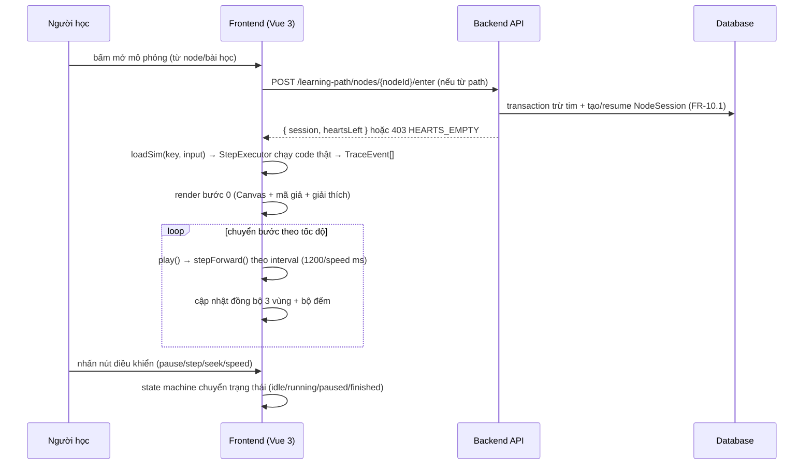
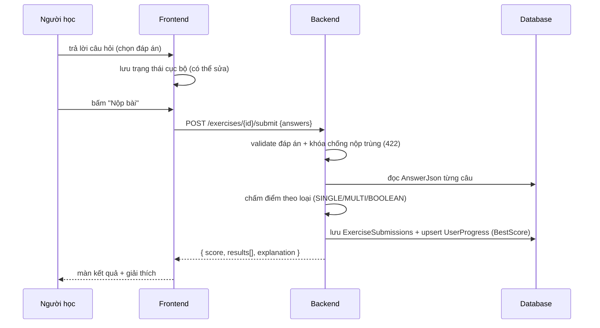
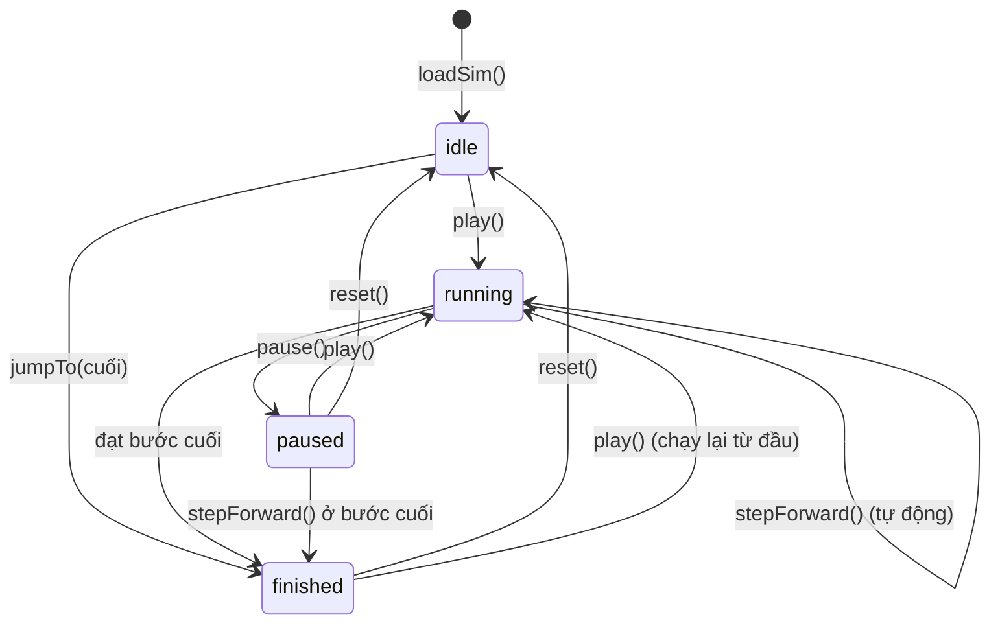
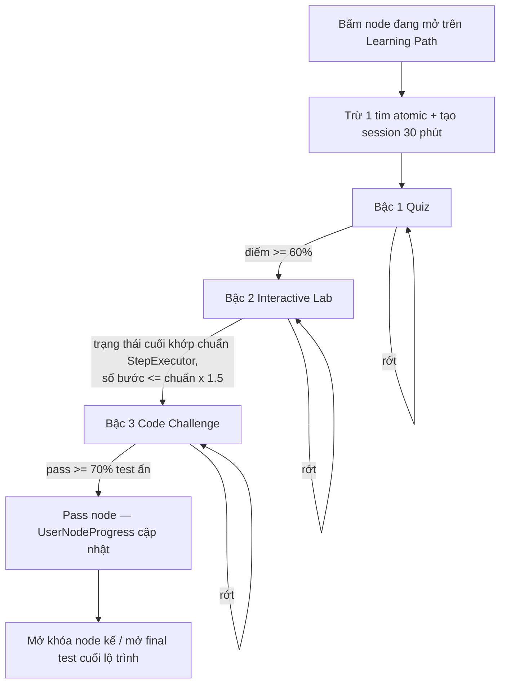
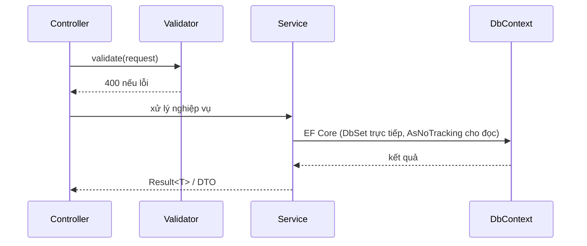

# PHẦN 5: THỰC HIỆN – IMPLEMENT

## 5.1 Cơ sở dữ liệu

Hệ thống dùng phương pháp **Code-First**: mọi bảng được khai báo bằng entity C# trong `DsaVisual.Application/Persistence`, cấu hình quan hệ bằng Fluent API trong thư mục `Configurations/` (không dùng attribute trên entity), thay đổi cấu trúc thực hiện qua EF Core Migrations — đây là cách duy nhất đổi schema, không sửa DB trực tiếp. Entity sau được trích từ bảng `NodeSessions` (phiên học 30 phút — cốt lõi của cơ chế trừ tim):

```csharp
// DsaVisual.Application/Persistence/Entities/NodeSession.cs (trích)
public class NodeSession
{
    public int Id { get; set; }
    public int UserId { get; set; }
    public int NodeId { get; set; }
    public DateTime StartedAt { get; set; }   // server clock — chống chỉnh đồng hồ
    public DateTime ExpiresAt { get; set; }   // StartedAt + 30 phút
    public int? Stage { get; set; }           // bậc đang dở: 1=Quiz, 2=Lab, 3=Code
    public int? StepIndex { get; set; }       // bước mô phỏng đang dở (resume)
}
```

Các điểm cấu hình Fluent API quan trọng:

- Unique index `(UserId, NodeId)` trên `NodeSessions` — tuần tự hóa 2 request vào node song song, chỉ 1 lần trừ tim (chống double-spend, FR-10.1).
- Unique index `Email` trên `Users` — ràng buộc đăng nhập; unique `(UserId, LessonId)` trên `UserProgress` để upsert tiến độ không nhân đôi bản ghi.
- Khóa ngoại cascade cho bảng con theo cha (`Questions.ExerciseId`, `RefreshTokens.UserId`) — xóa cha sẽ gom con.
- Xóa mềm bằng cột `DeletedAt datetime2 NULL` trên các bảng nội dung; toàn bộ tên bảng/cột viết PascalCase (quy ước chung 32 bảng).

Các migration/seed quan trọng:

- Migration `AddNodeSessions` — thêm bảng `NodeSessions` + unique index `(UserId, NodeId)` cho FR-10.1 (phát sinh ở v2.4).
- Migration `AddUserNodeProgress` — thêm bảng `UserNodeProgress` chuẩn hóa tiến độ node (phát sinh ở v2.9), thay cho tính runtime từ bài nộp.
- Seeder idempotent — 1 Admin (`admin@system.local`, ép đổi mật khẩu lần đầu) + 5 chủ đề gốc + 8 bài học mẫu (mỗi bài gắn 1 mô phỏng EDV + 5-10 câu quiz + 1 lab + 1 code challenge) + 5 Learning Path; mọi code seed phải chạy khớp golden data.
- Script `sync-catalog` — đồng bộ danh mục mô phỏng từ `shared/simulation-catalog.json` sang bảng seed backend (CI so sánh 2 danh sách key, khác là fail build).

(nguồn: SDD §5.1, §5.3, §6.1, §7.3.29, §7.4, §7.5; DEPLOY §5.1)

## 5.2 Simulation Engine & Sandbox

**Generator Bubble Sort (trích mã chuẩn).** Mọi giải thuật trong danh mục là mã thật chạy qua StepExecutor (bộ thực thi gắn thiết bị đo), hoạt ảnh = phát lại trace ghi trong lúc chạy — không hardcode chuỗi bước. Mã giả chuẩn của Bubble Sort (`sort.bubble`) được dùng làm code nạp vào editor và làm chuẩn sinh bước:

```text
1.  procedure bubbleSort(a[0..n-1])
2.    for i ← 0 to n-2 do
3.      swapped ← false
4.      for j ← 0 to n-2-i do
5.        if a[j] > a[j+1] then
6.          swap a[j], a[j+1]
7.          swapped ← true
8.      if swapped = false then
9.        return          // mảng đã sắp xếp
10.   end procedure
```

Mỗi thao tác cơ bản sinh ít nhất 1 bước: chạm dòng vòng lặp → 1 bước, so sánh → 2 bước (tô cả 2 phần tử + kết quả), hoán đổi → 1 bước; phần tử cuối đoạn đánh `done` sau mỗi vòng ngoài. Bước 0 luôn là trạng thái khởi tạo, bước cuối là trạng thái hoàn tất.

**Golden data.** Mỗi giải thuật có bộ dữ liệu kiểm thử chuẩn tính trước (độc lập code), kiểm tra trace sinh ra khớp hành vi code thật:

**Bảng 5.1: Bộ dữ liệu golden (N1-N7) — ví dụ Bubble Sort**

| Nhóm | Đặc điểm | Ví dụ |
|---|---|---|
| N1 | Mảng rỗng / 1 phần tử | `[]`, `[5]` |
| N2 | Đã sắp xếp tăng dần | `[1,2,3,4,5]` |
| N3 | Sắp xếp giảm dần (worst case) | `[5,4,3,2,1]` |
| N4 | Giá trị trùng lặp | `[4,2,4,1,4]` |
| N5 | Số âm + trái dấu | `[-3,7,-1,0,2]` |
| N6 | Kích thước lớn (100 phần tử) | ngẫu nhiên seed cố định (seed=42) |
| N7 | Đặc thù giải thuật | tìm kiếm: target có/không; đồ thị: chu trình; BST: xóa 0/1/2 con |

Trace chuẩn Bubble Sort với `[3,1,2]` (20 bước) được dùng làm mốc vàng đối chiếu cho mọi lần chạy generator.

**Code Runner — sandbox Web Worker.** Chạy thử và chấm bài code đều thực hiện trong sandbox Web Worker phía trình duyệt (ADR-012), không có máy chủ Judge0. Giới hạn sandbox: 10 giây, 64MB, 200 dòng, cấm import ngoài, cấm I/O ngoài console (FR-9.6). Chấm theo đầu ra: 3 test công khai (chạy thử, không tính điểm) + 10-12 test ẩn (golden data) + 8-10 test đầu vào ngẫu nhiên sinh tại thời điểm nộp, kết quả mong đợi do hàm chuẩn StepExecutor tính ngay khi chấm — chống hardcode. Backend chỉ lưu `CodeRuns`/`CodeSubmissions` phục vụ lịch sử, không tái thực thi. Giới hạn chung của engine (chạy client/Web Worker) được khai báo trong `engines/core/stepExecutor.ts`:

```typescript
// Giới hạn generator (chạy client/Web Worker): 50.000 event, timeout 5 giây,
// bộ đếm chặn vòng lặp vô hạn.
// Giới hạn sandbox chấm điểm (FR-9.6): 10 giây, 64MB, 200 dòng.
```

(nguồn: SDD §4.0.3, §4.7.1, §4.8, §4.9A, §7.3.23; SRS FR-9.6)

## 5.3 Sơ đồ kiến trúc công nghệ

Cấu trúc thư mục hai phía theo thiết kế (rút gọn):

```text
frontend/
├── src/
│   ├── router/index.ts                # route + guards theo vai trò
│   ├── api/                           # axios client + interceptors (401→refresh, 429, 5xx)
│   ├── stores/                        # Pinia: auth, lesson, simulation, progress, gamification...
│   ├── views/                         # theo SCREEN_MAP Màn 01-32 (+ admin/)
│   ├── components/
│   │   ├── ui/                        # BaseButton, BaseModal, BaseToast, BaseTable...
│   │   ├── simulator/                 # SimulatorShell, ControlBar, VisualizationCanvas...
│   │   ├── ladder/                    # LadderStepper, QuizStage, LabStage, CodeStage
│   │   └── gamification/              # HeartsGemsWidget, QuestCard, ShopItemCard...
│   ├── engines/                       # EDV: core/stepExecutor, generators/, renderers/, catalog
│   ├── composables/                   # useSimulation, useDebounce, useKeyboardShortcuts...
│   ├── i18n/vi.ts                     # mọi chuỗi giao diện
│   └── styles/                        # tokens.css (màu thiết kế), global.css
└── tests/                             # unit (Vitest) + e2e (Playwright)
```

```text
backend/
├── src/
│   ├── DsaVisual.Api/                 # Web API (presentation)
│   │   ├── Controllers/               # Auth, Topics, Lessons, Exercises, Progress,
│   │   │                              # Classes, Gamification, CodeRuns, Public...
│   │   ├── Dtos/                      # Request/Response DTO
│   │   ├── Middlewares/               # ErrorHandling, RequestLogging
│   │   └── Program.cs                 # pipeline: logging → error → CORS → auth → controllers
│   └── DsaVisual.Application/         # nghiệp vụ + truy cập dữ liệu
│       ├── Services/                  # 12 service (Auth, Lesson, Exercise, Progress, Gamification...)
│       ├── Persistence/               # AppDbContext, Configurations (Fluent API), Migrations
│       ├── Validators/                # FluentValidation
│       └── Common/                    # Result<T>, ErrorCodes, DateTimeProvider
└── tests/
    ├── DsaVisual.UnitTests/           # xUnit: services, validators
    ├── DsaVisual.IntegrationTests/    # WebApplicationFactory + Testcontainers (SQL Server)
    └── DsaVisual.Api.Tests/           # kiểm thử controller/DTO
```

Giải thích: frontend là SPA chứa toàn bộ Simulation Engine EDV (sinh bước chạy client, bước lùi miễn phí, sinh ≤ 500ms cho mảng 100 phần tử); backend gọn 2 project, không có tầng Repository — Service truy vấn DbContext qua DbSet trực tiếp, dùng `AsNoTracking()` cho truy vấn đọc; 3 project test phân theo đúng kim tự tháp kiểm thử (unit → integration → API).

(nguồn: SDD §3.1, §5.1, §5.3)

## 5.4 Các loại sơ đồ tương tác

### 5.4.1 Sequence Diagram

**(a) UC-01 — Chạy mô phỏng giải thuật** (giữ nguyên từ SRS):



*Hình 5.1: Sequence UC-01 — vào node trừ tim trước, sau đó toàn bộ mô phỏng sinh và phát lại ở phía frontend.*

**(b) UC-25 — Học theo Learning Path và mở khóa node.** SRS chỉ đặc tả sequence diagram cho UC-01, UC-03, UC-04, UC-06, UC-09 — UC-25 không có sơ đồ riêng, nên thay bằng sequence **UC-06 (Nộp bài tập trắc nghiệm)** — quy trình chấm điểm liên quan trực tiếp đến Practice Ladder; cơ chế trừ tim atomic của UC-25 được mô tả bằng lời ở mục 5.5.2:



*Hình 5.2: Sequence UC-06 — chấm điểm server-side, lưu bài nộp và upsert điểm cao nhất trong một quy trình.*

### 5.4.2 Activity Diagram

**(a) State machine mô phỏng** (giữ nguyên từ SDD §3.5):



*Hình 5.3: State machine của player mô phỏng — mọi chuyển trạng thái phát qua store `simulation` để nút điều khiển và phím tắt phản ứng thống nhất.*

**(b) Luồng Practice Ladder** (dựng theo đặc tả FR-4.11, mỗi node gồm 3 bậc tuần tự):



*Hình 5.4: Luồng Practice Ladder 3 bậc — server guard chặn vào bậc sau khi chưa pass bậc trước; retry trong session 30 phút không trừ tim; điểm node = Quiz 20% + Lab 30% + Code 50% (giữ MAX).*

(nguồn: SRS §5.2, §5.7, §5.26, §5.27; SDD §3.5, §8.4 Màn 14-16)

## 5.5 API Endpoints

### 5.5.1 Controllers

Danh sách endpoint chính theo nhóm (trích từ API_REFERENCE — toàn bộ endpoint nằm dưới gốc `/api/v1`):

**Bảng 5.2: Endpoint chính theo nhóm chức năng**

| Nhóm | Method | Endpoint | Chức năng |
|---|---|---|---|
| Auth | POST | `/auth/login` | Đăng nhập, trả JWT access token + cookie refresh |
| Auth | POST | `/auth/refresh` | Làm mới token (rotate-invalidate) |
| Public | GET | `/public/simulations/{key}/run` | Chạy demo công khai (3 key) |
| Topics | GET / POST | `/topics` | Xem cây chủ đề / tạo chủ đề |
| Lessons | GET | `/lessons` | Danh sách bài học (lọc, phân trang) |
| Lessons | POST | `/lessons/{id}/mark-viewed` | Đánh dấu đã học (upsert UserProgress) |
| Simulations | GET | `/simulations` | Danh mục mô phỏng kèm schema, độ phức tạp |
| Exercises | GET | `/exercises/{id}` | Chi tiết bài tập (KHÔNG trả đáp án) |
| Exercises | POST | `/exercises/{id}/submit` | Nộp bài → điểm + đáp án + giải thích |
| Exercises | POST | `/exercises/{id}/code-submit` | Nộp bài code (chấm client sandbox) |
| Progress | GET | `/progress/me` | Tiến độ tổng hợp cá nhân |
| Progress | GET | `/progress/report` | Báo cáo giảng viên (kèm xuất CSV) |
| Learning Path | POST | `/learning-path/{id}/nodes/{nodeId}/enter` | Trừ 1 tim atomic + tạo/resume session |
| Learning Path | GET | `/learning-path/{id}` | Bản đồ node của lộ trình |
| Classes | POST | `/classes/{id}/join` | Tham gia lớp bằng mã mời 6 ký tự |
| Classes | GET | `/classes/{id}/report` | Báo cáo lớp học phần |
| Code Runner | POST | `/code-runs` | Lưu lần chạy code (trace do client sinh) |
| Gamification | POST | `/me/quests/{id}/claim` | Nhận thưởng quest (atomic) |
| Shop | POST | `/shop/buy` | Mua vật phẩm (trừ gems atomic) |
| Admin | GET | `/admin/stats` | Thống kê hệ thống |

### 5.5.2 Services (Business Logic)

**Bảng 5.3: 12 service và trách nhiệm chính**

| Service | Trách nhiệm chính |
|---|---|
| AuthService | đăng ký, đăng nhập, refresh (rotate-invalidate), logout, khôi phục mật khẩu, khóa tạm |
| UserService | CRUD người dùng, khóa/mở, đổi vai trò, phê duyệt Teacher, ẩn danh hóa |
| TopicService | cây chủ đề, CRUD, reorder, chặn xóa khi có con |
| LessonService | CRUD bài học, sanitize HTML, gắn mô phỏng, đánh dấu đã học, quyền sở hữu |
| SimulationCatalogService | danh mục mô phỏng + schema (đồng bộ key với frontend) |
| ExerciseService | CRUD bài tập/câu hỏi, chấm điểm (SINGLE/MULTI/BOOLEAN/Lab), chống nộp trùng, import CSV |
| ProgressService | upsert tiến độ, dashboard, báo cáo giảng viên + CSV, báo cáo lớp |
| FavoriteService | CRUD yêu thích |
| SettingService | cấu hình hệ thống + cache |
| ClassService | CRUD lớp, mã mời 6 ký tự, thêm/xóa sinh viên, gán nội dung + hạn nộp, báo cáo lớp |
| CodeRunnerService | lưu CodeRuns, lịch sử nộp + so sánh (chấm chạy client sandbox) |
| GamificationService | một điểm vào duy nhất Module J: hearts/session (trừ tim atomic), quest/streak, shop/gems, premium, achievement |

**Quy trình nghiệp vụ: Vào node — trừ tim atomic (UC-25, FR-10.1).** Mọi lượt "vào node" (mở mô phỏng hoặc vào Ladder, trừ node đã pass) trừ đúng 1 tim. Toàn bộ thao tác chạy trong 1 transaction ngắn theo thứ tự bắt buộc: (1) kiểm tra node đã pass → miễn phí, không trừ; (2) thử `UPDATE NodeSessions` gia hạn session hết hạn với điều kiện `ExpiresAt < @now`, kiểm tra `@@ROWCOUNT` — nếu gia hạn được thì sang bước trừ tim; (3) nếu không có dòng nào được gia hạn thì `INSERT` session mới — unique `(UserId, NodeId)` tuần tự hóa, INSERT trùng (session còn hiệu lực, kể cả do request song song tạo) thì resume không trừ; (4) `UPDATE Users SET Hearts = Hearts - 1 WHERE Id = @id AND Hearts > 0` — không có dòng nào bị cập nhật (hết tim) thì rollback toàn bộ và trả 403 `HEARTS_EMPTY`. Nhờ vậy 2 request song song chỉ trừ 1 lần tim. Mọi quy trình nghiệp vụ khác chạy theo luồng xử lý chuẩn sau:



*Hình 5.5: Luồng xử lý chuẩn backend — Controller chỉ nhận DTO và gọi Service; Service trả `Result<T>` với mã lỗi tiếng Việt; Service truy vấn DbContext trực tiếp qua DbSet.*

(nguồn: API_REFERENCE §4.1-4.15; SDD §5.2, §5.4, §7.3.29)

# PHẦN 6: KIỂM THỬ - TESTING

## 6.1 Chiến lược kiểm thử

Kiểm thử theo mô hình kim tự tháp: nền móng là unit test cho engine và service, giữa là integration test cho API, trên cùng là E2E cho luồng người dùng, kèm các tầng hiệu năng, bảo mật và UX:

**Bảng 6.1: Phân loại chiến lược kiểm thử**

| Cấp độ | Công cụ | Đối tượng / mục tiêu độ bao phủ |
|---|---|---|
| Unit — Generator | Vitest | ≥ 90% dòng `engines/` (golden data N1-N7 cho 15 giải thuật) |
| Unit — Store/Composable | Vitest + Vue Test Utils | ≥ 70% |
| Unit — Backend Service | xUnit | ≥ 60% (ưu tiên Auth, Exercise, Progress, Gamification) |
| Integration — API | xUnit + WebApplicationFactory + Testcontainers (SQL Server) | 100% endpoint chính, mọi nhánh HTTP status |
| E2E — luồng người dùng | Playwright | 12 luồng chính (học tập, Ladder 3 bậc, code runner...) |
| Hiệu năng | k6 + Lighthouse | theo NFR-1..NFR-7 |
| Bảo mật | checklist 13.3 + OWASP ZAP (cơ bản) | toàn bộ checklist 13.3 |
| UX | 5 người dùng (3 chưa dùng hệ thống tương tự) + SUS | SUS ≥ 70/100 |

Dữ liệu kiểm thử dùng TestSeed riêng (20 user 3 vai trò, 5 topic, 12 bài học, 8 bài tập, 200 bản ghi tiến độ — không dùng seed production).

(nguồn: TEST_PLAN §1.3, §2, §3)

## 6.2 Kết quả kiểm thử

Tại thời điểm viết báo cáo (12/08/2026), TEST_PLAN là kế hoạch đã đặc tả đầy đủ test case nhưng **chưa chạy** — bảng PASS/FAIL được điền sau khi thực thi ở giai đoạn hoàn thiện, kết quả thật sẽ được cập nhật vào báo cáo sau:

**Bảng 6.2: Báo cáo tổng hợp theo nhóm test (TEST_PLAN §10 — chưa thực thi)**

| Nhóm test | Tổng số | PASS | FAIL | Ghi chú |
|---|---|---|---|---|
| Backend (TEST-B) | chưa chạy | chưa chạy | chưa chạy | chờ hoàn tất kiểm thử (tuần 19-20) |
| Engine (TEST-E) | chưa chạy | chưa chạy | chưa chạy | chờ hoàn tất kiểm thử (tuần 19-20) |
| API (TEST-API) | chưa chạy | chưa chạy | chưa chạy | chờ hoàn tất kiểm thử (tuần 19-20) |
| E2E (TEST-UI) | chưa chạy | chưa chạy | chưa chạy | chờ hoàn tất kiểm thử (tuần 19-20) |
| Bảo mật (TEST-SEC) | chưa chạy | chưa chạy | chưa chạy | chờ hoàn tất kiểm thử (tuần 19-20) |
| Hiệu năng (TEST-PERF) | chưa chạy | chưa chạy | chưa chạy | chờ hoàn tất kiểm thử (tuần 19-20) |
| UX (TEST-UX) | chưa chạy | chưa chạy | chưa chạy | chờ hoàn tất kiểm thử (tuần 19-20) |

**Bảng 6.3: Kịch bản tiêu biểu đã thiết kế (kết quả điền sau khi chạy)**

| Mã test case | Mô tả | Kỳ vọng | Kết quả |
|---|---|---|---|
| TEST-B-001 | Đăng ký tài khoản thành công | 201, email chuẩn hóa lowercase, đăng nhập lại được | chờ hoàn tất kiểm thử (tuần 19-20) |
| TEST-B-045 | Nộp bài SINGLE đúng | Điểm đúng theo đáp án | chờ hoàn tất kiểm thử (tuần 19-20) |
| TEST-B-137..141 | Practice Ladder tuần tự | Chưa pass Quiz → `LADDER_LOCKED`; pass Code ≥ 70% → pass node | chờ hoàn tất kiểm thử (tuần 19-20) |
| TEST-B-148 | Vào node mới trừ đúng 1 tim | 200 + `heartsLeft:9` + 1 bản ghi NodeSessions | chờ hoàn tất kiểm thử (tuần 19-20) |
| TEST-B-151 | 2 request song song cùng enter | Chỉ 1 lần trừ tim (concurrency thực) | chờ hoàn tất kiểm thử (tuần 19-20) |
| TEST-E-003 | Bubble sort trace chuẩn `[3,1,2]` (20 bước) | So khớp 100% bảng trace mốc vàng | chờ hoàn tất kiểm thử (tuần 19-20) |
| TEST-E-035 | Hiệu năng sinh bước mảng 100 | Trung bình ≤ 500ms, không lần nào > 800ms | chờ hoàn tất kiểm thử (tuần 19-20) |
| TEST-UI-001 | Luồng học tập hoàn chỉnh (E2E) | Toàn bộ luồng không lỗi, tiến độ đúng | chờ hoàn tất kiểm thử (tuần 19-20) |

Ngưỡng chất lượng trước khi bàn giao (Definition of Done): 100% test case nhóm B/E/API của FR mức Cao PASS; FAIL mở tối đa 3 lỗi trung bình có kế hoạch; coverage generator ≥ 90%; 8 kịch bản hiệu năng đạt ngưỡng; kiểm thử bảo mật 13.3 toàn bộ PASS. Mọi FAIL khi chạy phải kèm nguyên nhân, người sửa và ngày pass lại — không bịa số liệu.

(nguồn: TEST_PLAN §1.1, §10, §14.9)

## 6.3 Hiệu năng + bảo mật + UX

**Bảng 6.4: Kịch bản hiệu năng (TEST-PERF-001..008)**

| Mã | Kịch bản | Ngưỡng | Kết quả |
|---|---|---|---|
| TEST-PERF-001 | Sinh bước mảng 100 (5 GT sắp xếp, 50 lần chạy) | ≤ 500ms trung bình, 100% < 800ms | chờ hoàn tất kiểm thử (tuần 19-20) |
| TEST-PERF-002 | Sinh bước đồ thị 50 đỉnh (20 lần chạy) | ≤ 1s trung bình, 100% < 1.5s | chờ hoàn tất kiểm thử (tuần 19-20) |
| TEST-PERF-003 | Điều hướng 1000 bước liên tục (Chrome) | ≥ 55 FPS trung bình | chờ hoàn tất kiểm thử (tuần 19-20) |
| TEST-PERF-004 | GET /lessons (1000 bài, 50 VU × 5 phút) | p95 ≤ 800ms, 0 lỗi 5xx | chờ hoàn tất kiểm thử (tuần 19-20) |
| TEST-PERF-005 | POST submit bài 10 câu (20 VU song song) | p95 ≤ 1.5s, chấm đúng 100% | chờ hoàn tất kiểm thử (tuần 19-20) |
| TEST-PERF-006 | Login đồng thời (50 VU × 30s) | p95 ≤ 1s, 0 lỗi | chờ hoàn tất kiểm thử (tuần 19-20) |
| TEST-PERF-007 | Tải SPA lần đầu cold cache (Lighthouse) | FCP ≤ 1.5s, bundle ≤ 500KB | chờ hoàn tất kiểm thử (tuần 19-20) |
| TEST-PERF-008 | Đồng thời tổng hợp 70% đọc / 30% ghi (200 VU × 15 phút) | p95 ≤ 1.2s, 0 lỗi 5xx | chờ hoàn tất kiểm thử (tuần 19-20) |

**Bảng 6.5: Kiểm thử bảo mật (TEST-SEC — tóm tắt checklist 13.3)**

| Mã | Nội dung | Kỳ vọng | Kết quả |
|---|---|---|---|
| TEST-SEC-001 | Token giả/sai chữ ký | 401 | chờ hoàn tất kiểm thử (tuần 19-20) |
| TEST-SEC-002 | Student gọi endpoint Teacher/Admin | 403 | chờ hoàn tất kiểm thử (tuần 19-20) |
| TEST-SEC-003 | Truy cập UserProgress người khác (đổi id) | 404, không lộ tồn tại | chờ hoàn tất kiểm thử (tuần 19-20) |
| TEST-SEC-004 | Nộp `<script>` trong contentHtml | Sanitize, không thực thi | chờ hoàn tất kiểm thử (tuần 19-20) |
| TEST-SEC-005 | SQL injection `' OR 1=1 --` | Không lỗi SQL, trả an toàn | chờ hoàn tất kiểm thử (tuần 19-20) |
| TEST-SEC-006 | 6 lần đăng nhập sai liên tiếp | Khóa tạm (429) + log | chờ hoàn tất kiểm thử (tuần 19-20) |
| TEST-SEC-007 | Upload `.exe` giả `.png` | Từ chối (magic bytes) | chờ hoàn tất kiểm thử (tuần 19-20) |
| TEST-SEC-008 | Xóa refresh token khi đổi mật khẩu | Phiên cũ vô hiệu | chờ hoàn tất kiểm thử (tuần 19-20) |
| TEST-SEC-009..011 | Sandbox: vòng lặp vô hạn / đệ quy sâu / truy cập file-network | Chặn sạch, không treo trình duyệt | chờ hoàn tất kiểm thử (tuần 19-20) |

**UX (SUS).** Kế hoạch: 5 người dùng ngoài nhóm (3 người chưa dùng hệ thống tương tự) thực hiện 5 nhiệm vụ (tạo tài khoản, chạy mô phỏng bubble sort với dữ liệu tự nhập, làm bài tập trắc nghiệm, tìm bài học, xem báo cáo tiến độ) và chấm SUS. Chỉ tiêu: tỷ lệ hoàn thành 100% cả 5 nhiệm vụ, SUS ≥ 70/100. Số liệu đo thật chưa có nên ghi nhận: **chờ hoàn tất kiểm thử (tuần 19-20)**; kết quả sẽ kèm bảng thời gian thực hiện và danh sách vấn đề UX theo mức ưu tiên.

(nguồn: TEST_PLAN §8, §7.2, §9)
